# AI Infrastructure Advanced — Deep Dive Reference

> **Audience:** Senior AI Engineers · Staff ML Engineers · GenAI Platform Engineers · Principal Engineers · AI Infrastructure Architects
> **Goal:** Master the deep internals of GPU hardware, distributed training systems, AI evaluation, and cost engineering — topics that separate Staff/Principal AI engineers from everyone else.
> **Philosophy:** Every concept taught with *What -> Why -> How it works internally -> Production challenges -> Interview Questions*

---

## Table of Contents

- [Part 1: AI Infrastructure Deep Dive](#part-1-ai-infrastructure-deep-dive)
- [Part 2: Distributed Training Systems](#part-2-distributed-training-systems)
- [Part 3: AI Evaluation Systems](#part-3-ai-evaluation-systems)
- [Part 4: Cost Engineering for AI](#part-4-cost-engineering-for-ai)

---

# Part 1: AI Infrastructure Deep Dive

## 1.1 CUDA Fundamentals

### What is CUDA?

CUDA (Compute Unified Device Architecture) is NVIDIA's parallel computing platform and API that allows GPUs to be programmed for general-purpose computation (GPGPU).

**CPU vs GPU Architecture:**

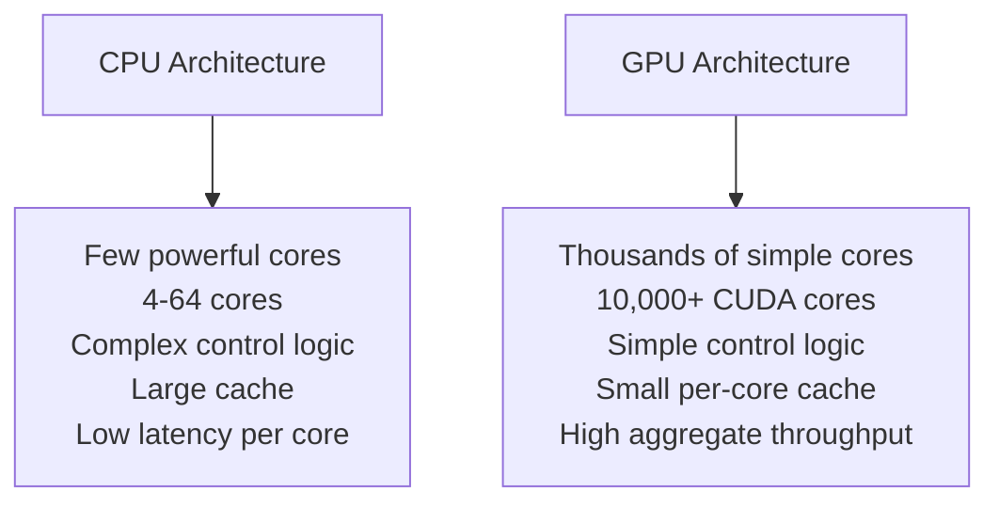

| Aspect | CPU | GPU |
|---|---|---|
| **Core count** | 4–128 cores | 4,096–18,432 CUDA cores |
| **Clock speed** | 3–5 GHz | 1–2 GHz |
| **Memory** | DDR5 (RAM) ~100 GB/s | HBM2e/3 ~3.35 TB/s |
| **Latency** | Low (nanoseconds) | Higher (microseconds) |
| **Strength** | Sequential, branchy logic | Massively parallel math |
| **ML use** | Data loading, preprocessing | Matrix multiply, convolutions |

### CUDA Execution Model

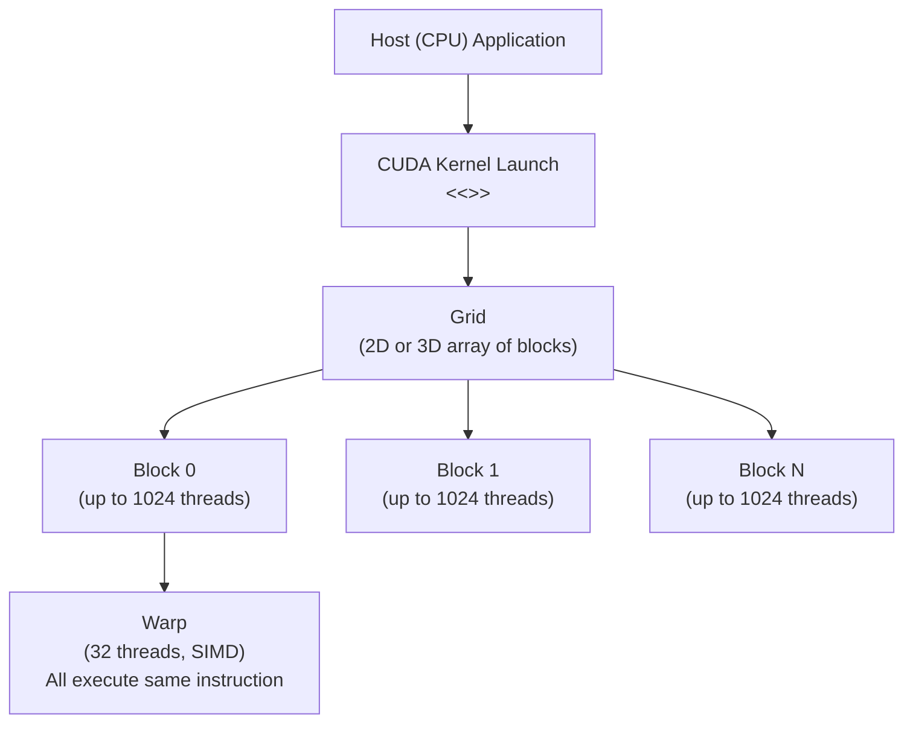

**Key terminology:**

| Term | Definition | Performance implication |
|---|---|---|
| **Thread** | Single execution unit | Smallest unit of parallelism |
| **Warp** | 32 threads executing in lockstep | Divergent branches cause serialization |
| **Block** | Up to 1024 threads sharing shared memory | Block size affects occupancy |
| **Grid** | Collection of blocks | Total parallelism of a kernel |
| **SM (Streaming Multiprocessor)** | Physical processor unit | Contains 64-128 CUDA cores |
| **Occupancy** | Active warps / max warps per SM | Higher = better GPU utilization |

**Warp divergence problem:**
```cuda
// Bad: branches cause warp divergence
if (thread_id % 2 == 0) {
    result = compute_A(data[thread_id]);  // half warp executes
} else {
    result = compute_B(data[thread_id]);  // other half executes
}
// Both branches execute serially for the warp!

// Good: eliminate divergence with predication or reorganize data
```

### CUDA Memory Hierarchy

| Memory Type | Location | Size | Latency | Scope |
|---|---|---|---|---|
| **Register** | On-chip | ~255 per thread | ~1 cycle | Per thread |
| **Shared Memory (L1)** | On-chip (SM) | 48-96 KB per SM | ~5 cycles | Per block |
| **L2 Cache** | On-chip (global) | 50 MB (A100) | ~50 cycles | Global |
| **Global Memory (HBM)** | Off-chip (HBM) | 40-80 GB | ~400 cycles | Global |
| **Constant Memory** | Off-chip (cached) | 64 KB | ~5 cycles cached | Read-only global |

**Golden rule:** Move data as close to compute as possible. Shared memory is ~80x faster than global memory.

```cuda
// Matrix multiply using shared memory tiles
__global__ void matmul(float* A, float* B, float* C, int N) {
    __shared__ float tileA[TILE_SIZE][TILE_SIZE];
    __shared__ float tileB[TILE_SIZE][TILE_SIZE];

    int row = blockIdx.y * TILE_SIZE + threadIdx.y;
    int col = blockIdx.x * TILE_SIZE + threadIdx.x;
    float sum = 0.0f;

    for (int t = 0; t < N / TILE_SIZE; t++) {
        // Load tiles into shared memory (coalesced access)
        tileA[threadIdx.y][threadIdx.x] = A[row * N + t * TILE_SIZE + threadIdx.x];
        tileB[threadIdx.y][threadIdx.x] = B[(t * TILE_SIZE + threadIdx.y) * N + col];
        __syncthreads();  // Wait for all threads to load

        // Compute partial sum from shared memory (fast!)
        for (int k = 0; k < TILE_SIZE; k++)
            sum += tileA[threadIdx.y][k] * tileB[k][threadIdx.x];
        __syncthreads();
    }
    C[row * N + col] = sum;
}
```

## 1.2 GPU Architecture Deep Dive (NVIDIA A100 / H100)

### Streaming Multiprocessor (SM) Architecture

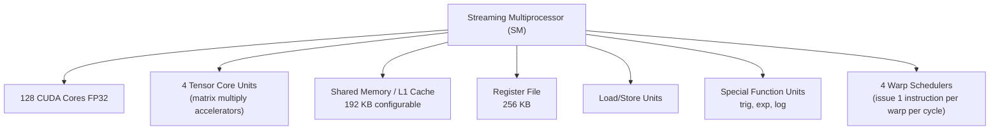

**A100 specs:**
- 108 SMs x 128 CUDA cores = 13,824 CUDA cores
- 432 Tensor Cores (3rd gen)
- 80 GB HBM2e memory
- 2 TB/s memory bandwidth
- 312 TFLOPS FP16 (Tensor Core)
- 77.6 TFLOPS FP32

**H100 specs (flagship 2023):**
- 132 SMs x 128 CUDA cores = 16,896 CUDA cores
- 528 Tensor Cores (4th gen)
- 80 GB HBM3 memory
- 3.35 TB/s memory bandwidth
- 989 TFLOPS FP16 (Tensor Core)
- NVLink 4.0: 900 GB/s bidirectional

### Tensor Cores

Tensor Cores perform mixed-precision matrix multiply-accumulate (MMA) in one instruction:

```
D = A x B + C
where A, B are FP16 input matrices (4x4)
      C, D are FP32 accumulator matrices
```

**Why they're transformative:**
- Regular CUDA cores: 1 FP32 multiply + add per cycle
- Tensor Cores (H100): 256 FP16 multiply + 256 FP32 add per cycle for a 4x4 tile
- 16x throughput improvement for matrix operations

**PyTorch Tensor Core usage:**
```python
import torch

# Enable Tensor Core usage (requires FP16 or BF16)
with torch.autocast(device_type="cuda", dtype=torch.float16):
    # These operations will use Tensor Cores automatically
    output = model(input_tensor)
    loss = criterion(output, labels)

# Or for inference:
model = model.half().cuda()  # Convert to FP16
with torch.no_grad():
    output = model(input_tensor.half())
```

## 1.3 HBM (High Bandwidth Memory)

### Why HBM Exists

Standard GDDR memory (used in gaming GPUs) has bandwidth of ~450 GB/s.
This is insufficient for ML workloads where models need to read billions of parameters per second.

**HBM solution:** Stack DRAM dies vertically using Through-Silicon Vias (TSVs) and connect to GPU using an interposer (wide bus = high bandwidth).

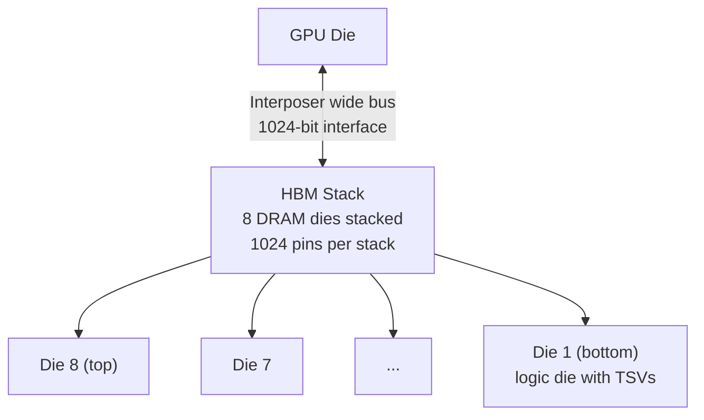

**HBM Generations:**

| Generation | Bandwidth | Used in |
|---|---|---|
| **HBM** | 128 GB/s per stack | AMD Fury (2015) |
| **HBM2** | 256 GB/s per stack | V100 (4 stacks = 900 GB/s) |
| **HBM2e** | 460 GB/s per stack | A100 (5 stacks = 2 TB/s) |
| **HBM3** | 665 GB/s per stack | H100 (5 stacks = 3.35 TB/s) |
| **HBM3e** | 1.2 TB/s per stack | H200 (5 stacks = 4.8 TB/s) |

**Why bandwidth matters for LLMs:**
- Model parameters must be read from HBM into compute units for every forward pass
- LLaMA-3 70B in FP16: 140 GB of parameters
- To maintain 100% compute utilization, need bandwidth >= 140 GB / compute_time
- H100 at 3.35 TB/s can sustain full utilization for batch size >= ~90 tokens/step

**Arithmetic Intensity:** ratio of FLOPs to bytes of memory accessed.
- Fully connected layer: `2*N*M FLOPs / (N+M) bytes` — increases with matrix size
- LLM with batch_size=1: memory-bound (low arithmetic intensity)
- LLM with large batch: compute-bound (high arithmetic intensity)

## 1.4 NVLink and GPU Interconnects

### The Problem: PCIe Bottleneck

Standard GPU interconnect is PCIe 4.0 (64 GB/s) or PCIe 5.0 (128 GB/s).
For distributed training, GPUs constantly exchange gradient tensors.
With 70B parameter model (140 GB in FP16), PCIe would take >1 second per gradient sync — unacceptable.

### NVLink Solution

NVLink is NVIDIA's high-speed GPU-to-GPU interconnect:

| NVLink Version | Bandwidth | GPU |
|---|---|---|
| **NVLink 2.0** | 300 GB/s | V100 |
| **NVLink 3.0** | 600 GB/s | A100 |
| **NVLink 4.0** | 900 GB/s | H100 |

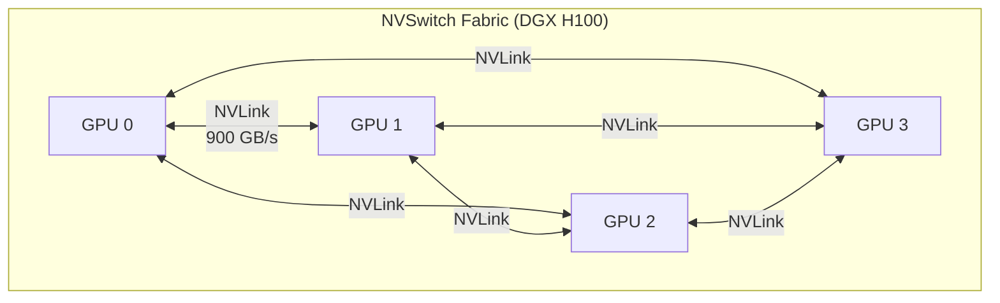

**DGX H100 configuration:** 8 GPUs, all connected via NVSwitch fabric, 900 GB/s total bandwidth per GPU.

### NVSwitch

NVSwitch is a high-radix switch that connects multiple GPUs in an all-to-all topology, enabling any GPU to communicate with any other at full NVLink bandwidth simultaneously.

**Why this matters:** In AllReduce operations (gradient sync), all GPUs need to exchange data with all others. NVSwitch enables this without bandwidth contention.

## 1.5 NCCL (NVIDIA Collective Communications Library)

NCCL implements collective communication operations optimized for NVIDIA GPUs.

**Collective operations:**

| Operation | Description | Use in ML |
|---|---|---|
| **AllReduce** | Sum/average values across all GPUs, result on all | Gradient averaging in DDP |
| **Reduce** | Sum/average values, result on one GPU | Loss aggregation |
| **Broadcast** | Send data from one GPU to all | Parameter initialization |
| **AllGather** | Gather values from all GPUs to all GPUs | ZeRO-3 parameter gathering |
| **ReduceScatter** | Reduce then scatter to all GPUs | ZeRO gradient handling |

**AllReduce algorithms:**

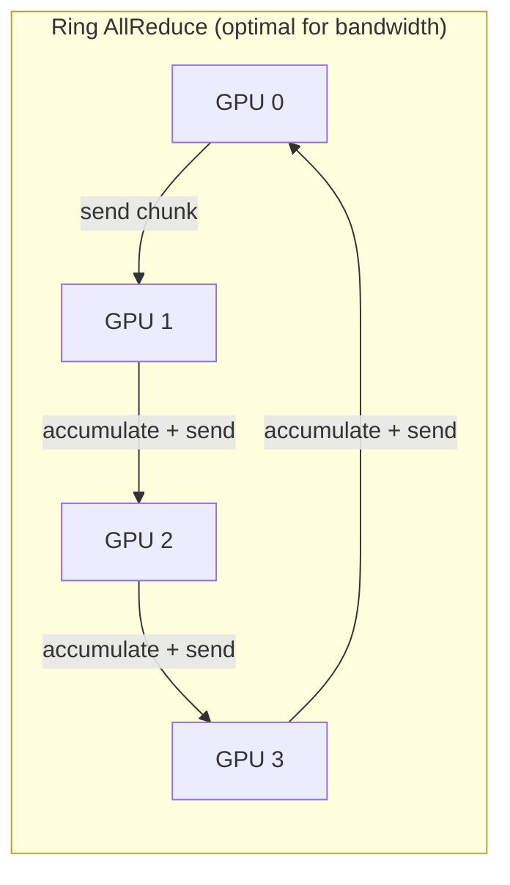

Ring AllReduce:
- Each GPU sends and receives in parallel
- Bandwidth utilization: near 100% (optimal)
- Latency: O(N) steps for N GPUs
- Used by: NCCL default for large messages

**NCCL topology awareness:**
NCCL detects whether GPUs are connected via NVLink, PCIe, or network (InfiniBand/RoCE) and selects optimal communication patterns:
- NVLink-connected GPUs: all-to-all patterns
- PCIe-connected GPUs: tree patterns
- Multi-node: hierarchical (intra-node NVLink + inter-node InfiniBand)

## 1.6 RDMA and InfiniBand

### The Problem: CPU Bottleneck in Network Communication

Standard TCP/IP path for distributed training:
```
GPU memory -> CPU -> Kernel socket buffer -> NIC -> Network -> NIC -> Kernel socket buffer -> CPU -> GPU memory
```
CPU is involved in every message. For AllReduce on large gradients (many GBs), CPU becomes a bottleneck and adds latency.

### RDMA (Remote Direct Memory Access)

RDMA allows the NIC to read/write remote GPU memory directly, bypassing CPU and OS kernel:

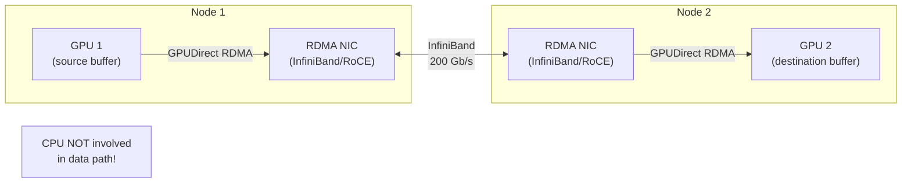

**RDMA characteristics:**
- Zero-copy: no data buffering in CPU memory
- Kernel bypass: OS not involved in data path
- Low latency: 1-2 microseconds (vs 50-100 us for TCP)
- High bandwidth: 200 Gb/s per port (InfiniBand HDR)

### InfiniBand vs RoCE

| Feature | InfiniBand | RoCE v2 |
|---|---|---|
| **Protocol** | Native RDMA protocol | RDMA over standard Ethernet |
| **Bandwidth** | 200-400 Gb/s per port | 100-400 Gb/s per port |
| **Latency** | ~1 us | ~3 us |
| **Cost** | High (special switches/NICs) | Lower (standard Ethernet) |
| **Deployment** | HPC clusters, cloud AI infra | Enterprise AI |
| **Used by** | AWS EFA, NVIDIA DGX SuperPOD | Azure, many enterprise |

### GPUDirect RDMA

NVIDIA's extension that allows InfiniBand NICs to directly access GPU memory using PCIe peer-to-peer:

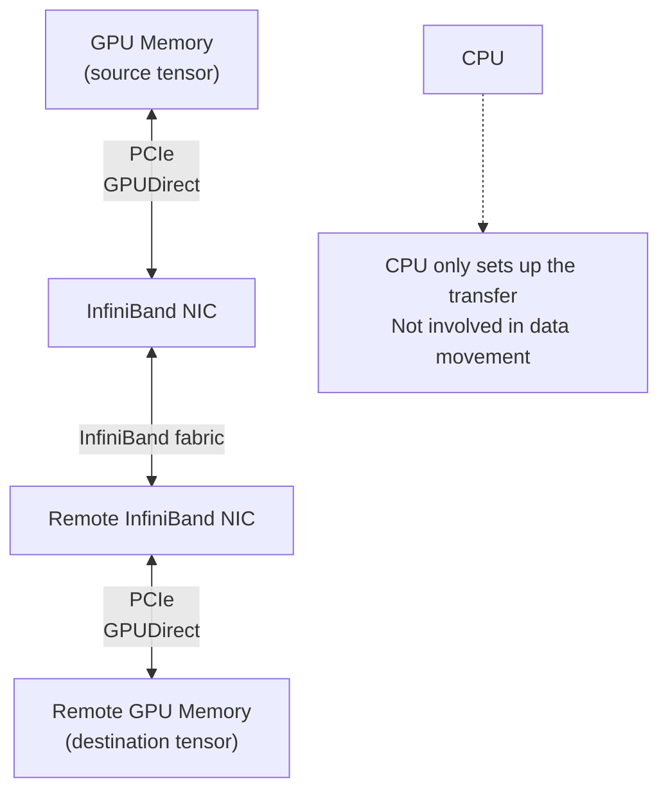

**Performance impact:**
- Without GPUDirect: GPU->CPU (PCIe)->NIC->network->NIC->CPU (PCIe)->GPU = 2 PCIe crossings
- With GPUDirect RDMA: GPU->NIC (PCIe)->network->NIC->GPU = 1 PCIe crossing, no CPU
- Latency reduction: 3-5x
- Bandwidth improvement: 2x (no CPU memory copy)

## 1.7 Model Serving Internals

### Triton Inference Server Architecture

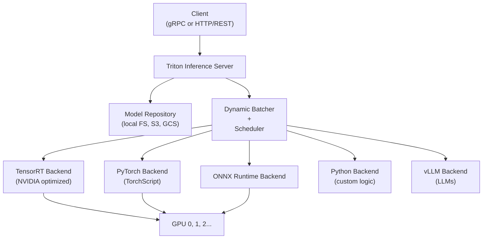

**Key Triton features:**

| Feature | What | Benefit |
|---|---|---|
| **Dynamic Batching** | Accumulate requests into batches automatically | Higher GPU utilization |
| **Model Ensembles** | Chain multiple models (preprocessing -> model -> postprocessing) | Single network roundtrip |
| **Concurrent Model Execution** | Multiple model instances on same GPU | Higher throughput |
| **Model Versioning** | Multiple versions of same model served simultaneously | A/B testing |
| **Sequence Batching** | Stateful models (RNN/LSTM) with per-sequence state | Streaming inference |

### TensorRT: Graph Optimization Engine

TensorRT takes a trained model and compiles it into a highly optimized engine for a specific GPU:

**Optimization passes:**

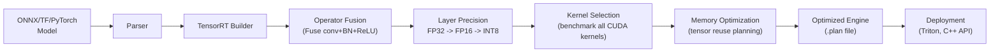

**Optimization techniques:**

| Technique | What | Speedup |
|---|---|---|
| **Layer fusion** | Merge Conv+BN+ReLU into single kernel | 2-3x |
| **Kernel auto-tuning** | Profile all available CUDA kernels, pick fastest | 1.5-2x |
| **FP16 precision** | Convert FP32 weights to FP16 | 2x |
| **INT8 quantization** | Convert to INT8 with calibration | 4x |
| **Memory reuse** | Reuse tensor memory across layers | Reduces memory footprint |
| **Graph optimization** | Eliminate redundant ops, constant folding | 1.2-1.5x |

**TensorRT INT8 calibration:**
```python
import tensorrt as trt

# Calibration tells TensorRT what range of values each tensor has
# so it can choose optimal INT8 scale factors
class EntropyCalibrator(trt.IInt8EntropyCalibrator2):
    def __init__(self, calibration_data):
        self.data = calibration_data
        self.idx = 0

    def get_batch(self, names):
        if self.idx >= len(self.data):
            return None
        batch = self.data[self.idx]
        self.idx += 1
        return [batch.cuda().data_ptr()]

    def get_batch_size(self):
        return 32
```

### vLLM Internal Architecture

vLLM is optimized specifically for LLM inference with PagedAttention.

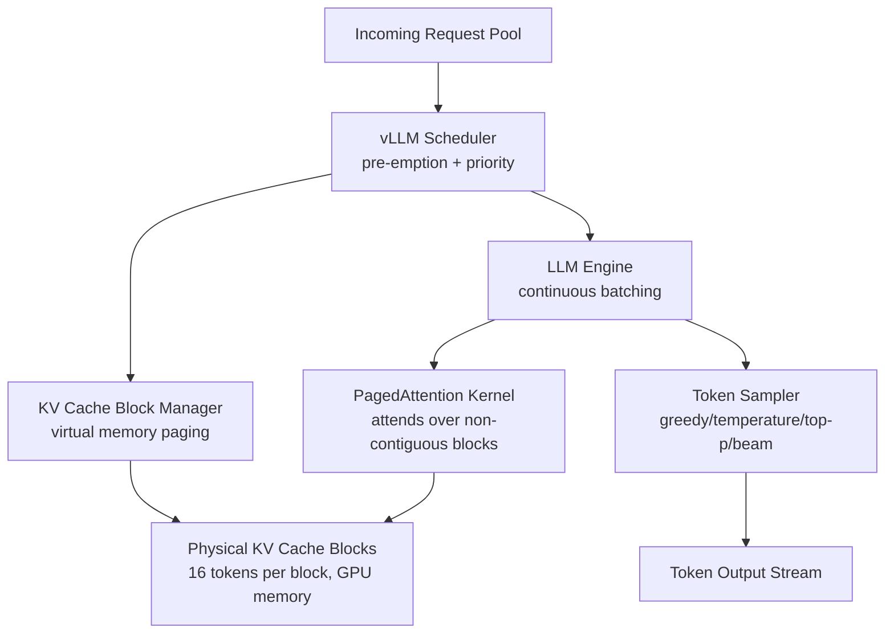

**PagedAttention key insight:**

Traditional KV cache: pre-allocate `max_sequence_length x head_dim x 2 x n_layers` contiguous memory per request.
- Problem: most requests don't use max length => 60-80% memory waste
- Problem: cannot share KV cache between requests with same prefix

PagedAttention:
- Divide KV cache into fixed-size blocks (e.g., 16 tokens per block)
- Allocate blocks on demand as sequence grows
- Virtual address table maps logical position to physical block
- Different requests can share physical blocks for identical prefixes (copy-on-write)

**Result:**
- Near-zero memory fragmentation
- Up to 4x more requests can be batched on same GPU
- Prefix caching: system prompts shared across thousands of requests for free

**vLLM continuous batching:**
```
Traditional: Process batch of N requests, wait for ALL to finish before starting next batch
             => fast requests wait for slow long-context requests => GPU idle

Continuous batching: When ANY request in the batch finishes, immediately swap in a new request
                     => GPU always busy processing requests at different stages
```

---

# Part 2: Distributed Training Systems

## 2.1 Why Distributed Training?

**The scale problem:**
- GPT-3: 175B parameters x 2 bytes (FP16) = 350 GB just for weights
- GPT-4: estimated 1.8 trillion parameters (MoE)
- H100 has 80 GB HBM — cannot fit GPT-3 on a single GPU even for inference!

**Three axes of distributed training:**

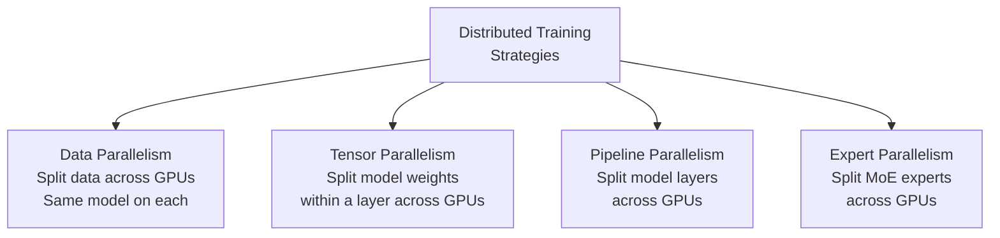

## 2.2 Data Parallelism (DP)

**What:** Each GPU holds a full copy of the model. Data batches are split across GPUs. Gradients are averaged at the end of each step (AllReduce).

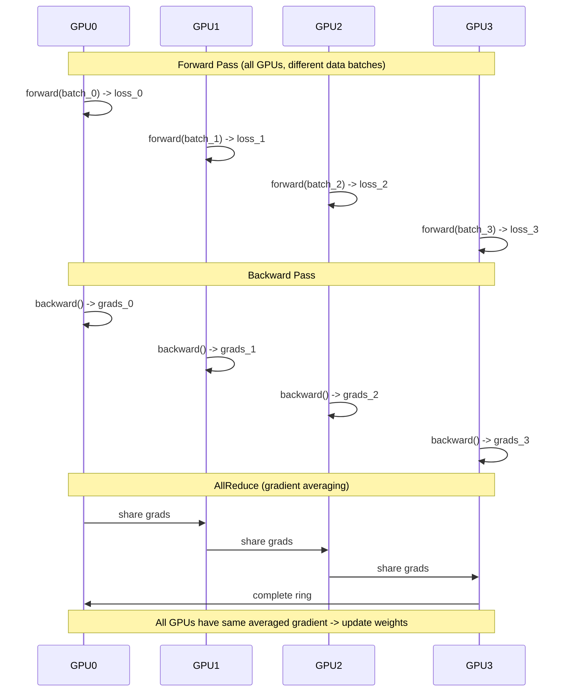

**PyTorch DDP (DistributedDataParallel):**
```python
import torch
import torch.distributed as dist
from torch.nn.parallel import DistributedDataParallel as DDP

def train(rank, world_size):
    dist.init_process_group("nccl", rank=rank, world_size=world_size)

    model = MyModel().to(rank)
    ddp_model = DDP(model, device_ids=[rank])

    optimizer = torch.optim.Adam(ddp_model.parameters())

    for data, labels in dataloader:
        data, labels = data.to(rank), labels.to(rank)
        optimizer.zero_grad()

        outputs = ddp_model(data)
        loss = criterion(outputs, labels)
        loss.backward()
        # Gradients automatically AllReduced here!
        optimizer.step()
```

**Pros:** Simple, scales linearly with GPU count for batch size
**Cons:** Each GPU stores full model — fails when model doesn't fit in one GPU

## 2.3 Tensor Parallelism (TP)

**What:** Split individual weight tensors (matrices) across GPUs. Each GPU holds a shard of each layer.

**How it works for Linear layers:**

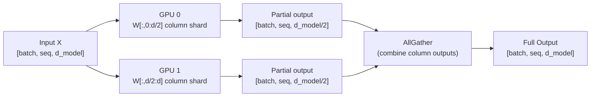

**Two variants:**

**Column-parallel linear (split output dim):**
- Each GPU computes output columns independently
- Requires AllGather to combine

**Row-parallel linear (split input dim):**
- Input split across GPUs
- Each GPU computes partial dot products
- Requires AllReduce to sum partial results

**Megatron-LM fused approach:**
For a Transformer MLP block: `Linear -> GeLU -> Linear`
- First linear: column-parallel (split output)
- GeLU: each GPU applies to its shard (no communication!)
- Second linear: row-parallel (reduce results)
- Total communication: 2 AllReduce per MLP block (instead of 4)

**PyTorch Tensor Parallel API (PyTorch 2.0+):**
```python
from torch.distributed.tensor.parallel import parallelize_module, ColwiseParallel, RowwiseParallel

model = MyTransformer()

# Mark which layers to parallelize and how
parallelize_plan = {
    "attention.q_proj": ColwiseParallel(),
    "attention.k_proj": ColwiseParallel(),
    "attention.v_proj": ColwiseParallel(),
    "attention.o_proj": RowwiseParallel(),
    "mlp.gate_proj": ColwiseParallel(),
    "mlp.down_proj": RowwiseParallel(),
}
model = parallelize_module(model, device_mesh, parallelize_plan)
```

## 2.4 Pipeline Parallelism (PP)

**What:** Split model layers across GPUs. GPU 0 handles layers 0-N/4, GPU 1 handles layers N/4-N/2, etc.

**Naive pipeline (inefficient):**
```
Time:  t1    t2    t3    t4
GPU0:  [F1]  [F2]  ...   ...  <- mostly idle!
GPU1:        [F1]  [F2]  ...
GPU2:              [F1]  [F2]
GPU3:                    [F1]
```

**GPipe Micro-batching (efficient):**
Split mini-batch into M micro-batches. Fill the pipeline to reduce idle time:
```
Time:  t1    t2    t3    t4    t5    t6    t7    t8
GPU0: [m1F] [m2F] [m3F] [m4F] [m4B] [m3B] [m2B] [m1B]
GPU1:       [m1F] [m2F] [m3F] [m4F] [m4B] [m3B] [m2B]
GPU2:             [m1F] [m2F] [m3F] [m4F] [m4B] [m3B]
GPU3:                   [m1F] [m2F] [m3F] [m4F] [m4B]
```

**Bubble ratio** (wasted time): `(p-1) / (p-1+m)` where p = pipeline stages, m = micro-batches
- More micro-batches => smaller bubble
- Trade-off: more micro-batches => more memory for activations

**1F1B (One Forward One Backward) schedule (Megatron-LM):**
Interleave forward and backward passes to reduce activation memory:
- Forward one micro-batch, immediately backward another
- Reduces peak memory by ~M times (M = number of micro-batches)

## 2.5 FSDP (Fully Sharded Data Parallel)

**What:** Shard model parameters, gradients, AND optimizer states across all GPUs.

**Comparison with DDP:**

| | DDP | FSDP |
|---|---|---|
| **Parameters** | Full copy on each GPU | Sharded across GPUs |
| **Gradients** | Full copy, AllReduced | Sharded, ReduceScattered |
| **Optimizer states** | Full copy on each GPU | Sharded across GPUs |
| **Memory usage** | N x model size | ~1x model size |
| **Communication** | AllReduce gradients | AllGather params + ReduceScatter grads |
| **Throughput** | Higher (less comm) | Lower (more comm) but fits larger models |

**FSDP execution:**
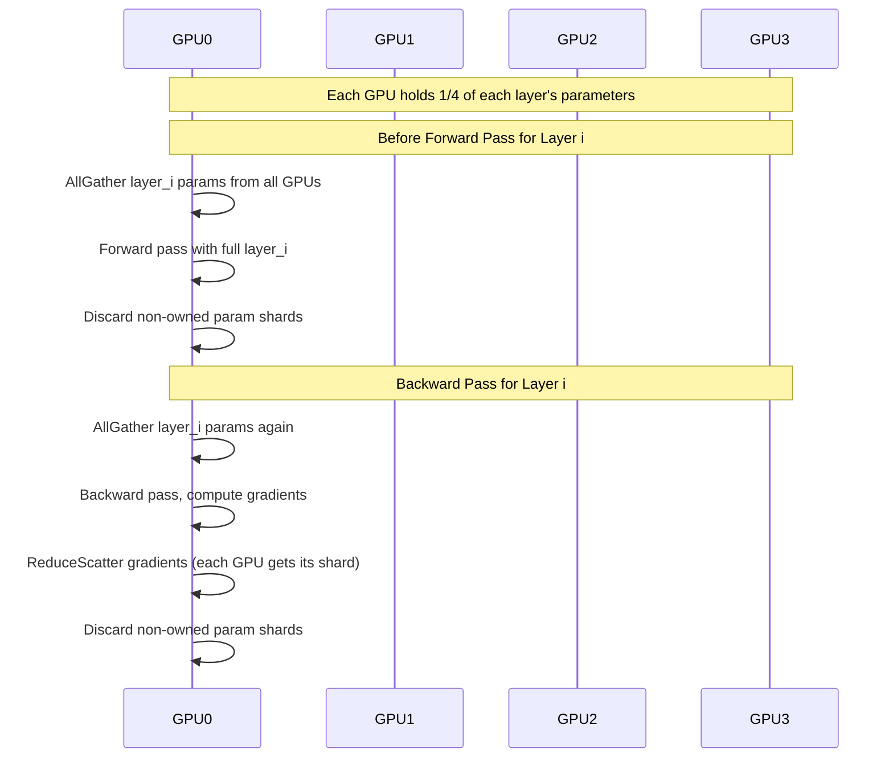

**PyTorch FSDP:**
```python
from torch.distributed.fsdp import FullyShardedDataParallel as FSDP
from torch.distributed.fsdp import ShardingStrategy

model = MyLargeModel()

# Shard across all GPUs
model = FSDP(
    model,
    sharding_strategy=ShardingStrategy.FULL_SHARD,  # shard params + grads + optim states
    # Or SHARD_GRAD_OP: shard grads + optim states only (ZeRO-2 equivalent)
    # Or NO_SHARD: DDP equivalent
    device_id=torch.cuda.current_device(),
    auto_wrap_policy=transformer_auto_wrap_policy,  # automatically wrap Transformer layers
)
```

## 2.6 ZeRO (Zero Redundancy Optimizer)

ZeRO (DeepSpeed) eliminates memory redundancy in data-parallel training.

**Three stages:**

| Stage | What is sharded | Memory saving | Communication cost |
|---|---|---|---|
| **ZeRO-1** | Optimizer states only | 4x (with Adam: 12 bytes per param -> 3 bytes) | Same as DDP |
| **ZeRO-2** | Optimizer states + gradients | 8x | Same as DDP |
| **ZeRO-3** | Optimizer states + gradients + parameters | 64x+ (linear with N GPUs) | 1.5x DDP |

**Memory breakdown per parameter (with Adam, FP16 training):**
```
FP16 parameter:       2 bytes
FP16 gradient:        2 bytes
FP32 master weight:   4 bytes
FP32 Adam moment 1:   4 bytes
FP32 Adam moment 2:   4 bytes
Total per parameter: 16 bytes

With 64 GPUs:
- ZeRO-3 shards everything: 16 / 64 = 0.25 bytes per GPU
- GPT-3 (175B params): 175B x 16 bytes = 2.8 TB -> 2.8 TB / 64 = 43.75 GB per GPU
- Fits on a single H100!
```

**ZeRO Infinity:** Extends ZeRO-3 to offload to CPU and NVMe storage (enables training models larger than GPU + CPU memory).

## 2.7 DeepSpeed

Microsoft's distributed training library implementing ZeRO and many other optimizations.

**Key features:**
1. **ZeRO-1/2/3:** Memory optimization
2. **ZeRO-Infinity:** CPU/NVMe offloading
3. **Mixed Precision Training:** FP16/BF16 with loss scaling
4. **Gradient Checkpointing:** Trade compute for memory (recompute activations in backward)
5. **Pipeline Parallelism:** Optimized 1F1B schedule
6. **Sparse Attention:** For long-sequence training
7. **Activation Checkpointing:** Reduce activation memory

```python
# DeepSpeed config
ds_config = {
    "train_batch_size": 2048,
    "fp16": {"enabled": True},
    "zero_optimization": {
        "stage": 3,
        "offload_optimizer": {"device": "cpu"},
        "offload_param": {"device": "cpu"},
        "overlap_comm": True,
        "allgather_bucket_size": 5e8,
        "reduce_bucket_size": 5e8,
    },
    "gradient_clipping": 1.0,
}

model_engine, optimizer, _, _ = deepspeed.initialize(
    model=model,
    optimizer=optimizer,
    config=ds_config,
    model_parameters=model.parameters()
)
```

## 2.8 Megatron-LM

NVIDIA's framework for training large language models, combining all three parallelism types.

**3D Parallelism (DP + TP + PP):**

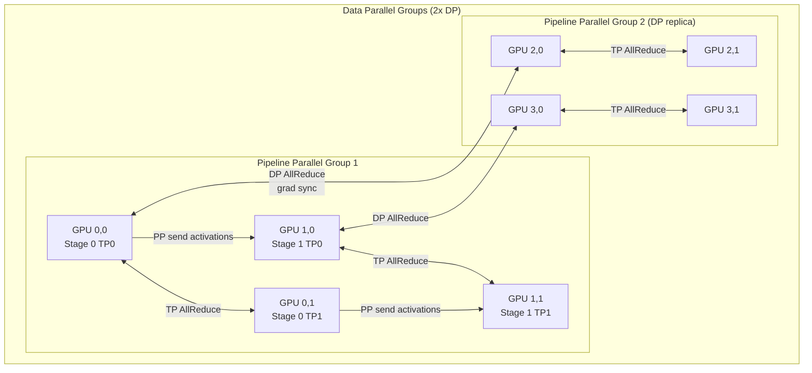

**Configuration selection rule of thumb:**
- **TP degree:** GPU count within a node (connected via NVLink, low-latency AllReduce)
- **PP degree:** Number of nodes (activation tensors sent over network, point-to-point is OK)
- **DP degree:** Remaining GPUs (AllReduce once per batch)

Example: 64 GPUs (8 nodes x 8 GPUs):
- TP=8 (within node, NVLink)
- PP=4 (2 pipeline stages per DP group)
- DP=2 (gradient sync across 2 DP replicas)

## 2.9 Expert Parallelism (MoE)

For Mixture-of-Experts (MoE) models, different experts run on different GPUs.

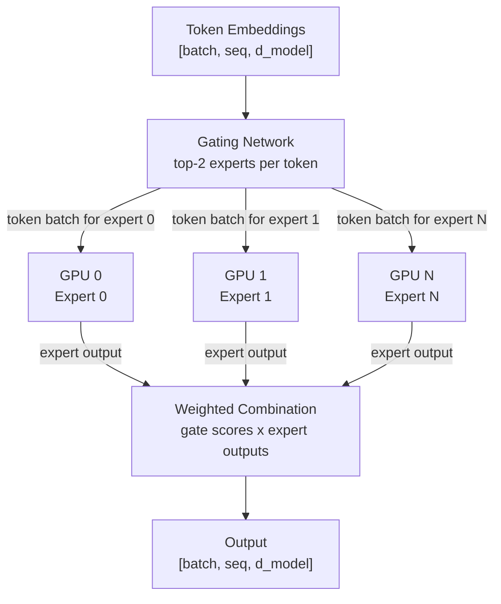

**The All-to-All communication challenge:**
Tokens need to be routed to potentially any GPU holding their assigned expert. This requires All-to-All communication:
- Each GPU sends tokens to all other GPUs based on routing decisions
- Then each GPU processes received tokens through its expert
- Then tokens returned to source GPUs

**Expert load balancing:** If router always sends most tokens to same expert, that GPU becomes a bottleneck. Solutions:
- Auxiliary load balancing loss (penalize uneven expert usage)
- Expert capacity limits (tokens dropped if expert overloaded)
- Random token routing for load testing

---

# Part 3: AI Evaluation Systems

## 3.1 Offline Evaluation

**What:** Evaluate model on a static held-out test dataset before deployment.

**Why:** Fast feedback loop, reproducible, no user impact. Catch obvious regressions before production.

**Offline evaluation pipeline:**

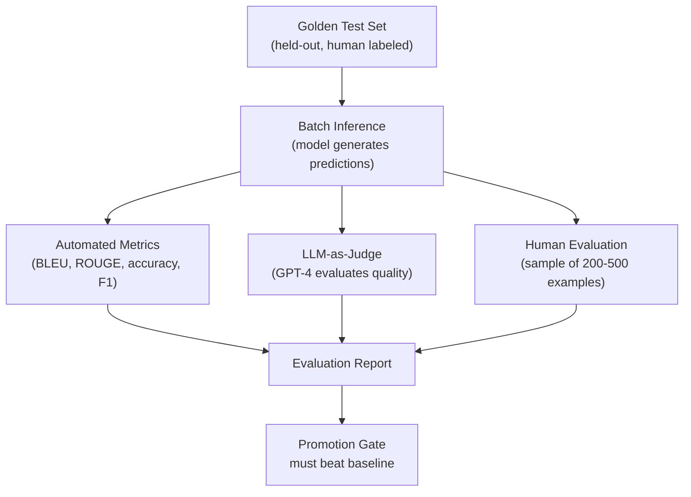

**Offline metrics by task:**

| Task | Metrics |
|---|---|
| **Classification** | Accuracy, F1, AUC-ROC, Precision, Recall |
| **Generation (text)** | BLEU, ROUGE, BERTScore, MeteorScore |
| **Question Answering** | Exact Match, F1, BLEU |
| **Code Generation** | Pass@k (fraction passing unit tests) |
| **LLM chat** | Win rate vs baseline (human or LLM judge) |
| **RAG** | Faithfulness, Context Recall, Answer Relevance |

**Limitations of offline evaluation:**
- Test set may not represent real distribution
- Metrics may not correlate with user satisfaction
- Cannot capture latency, cost, or real-world edge cases
- Adversarial examples not represented

## 3.2 Online Evaluation (A/B Testing for AI)

**What:** Route real user traffic to multiple model variants and measure business metrics.

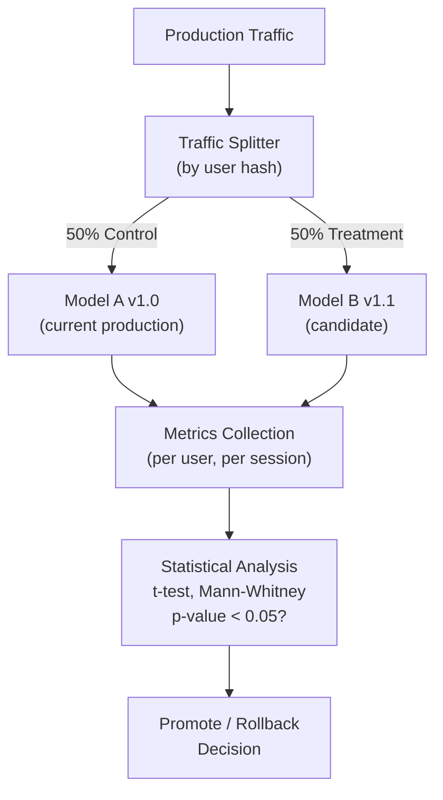

**Online metrics for AI systems:**

| Metric | What it measures | Collection |
|---|---|---|
| **User satisfaction** | Thumbs up/down, explicit rating | Direct feedback |
| **Session success rate** | Did user accomplish their goal? | Session analysis |
| **Follow-up query rate** | Did user need to ask again? (failure signal) | Query analysis |
| **Abandonment rate** | User left without response | Session data |
| **Engagement** | Time spent, messages per session | Analytics |
| **Task completion** | Did user complete intended task? | Funnel analysis |
| **Downstream conversion** | Did AI response lead to purchase/action? | Business metrics |

**Statistical considerations:**
- Sample size: Need enough traffic to detect small effects (power analysis)
- SUTVA: Stable Unit Treatment Value Assumption — users should not interact
- Multiple testing correction: If testing 10 metrics, adjust p-value threshold
- Long-term effects: Short A/B tests may miss learning curve effects

**Guardrails:**
Always define guardrail metrics that halt the experiment if crossed:
```
Primary metric:     Session success rate (want to improve by 5%)
Guardrail metrics:
  - Error rate must not increase > 0.1%
  - P99 latency must not increase > 50ms
  - Cost per session must not increase > 10%
  - User complaints must not increase > 5%
```

## 3.3 LLM Evaluation

### LLM-as-Judge

Use a powerful LLM (GPT-4, Claude) to evaluate another LLM's outputs.

**Evaluation dimensions:**

| Dimension | What | Prompt instruction |
|---|---|---|
| **Helpfulness** | Does the response help the user? | Rate 1-5: Is this response helpful? |
| **Accuracy** | Is the response factually correct? | Are there any factual errors? List them. |
| **Harmlessness** | Is the response safe? | Does this response violate safety guidelines? |
| **Conciseness** | Is it appropriately brief? | Is there unnecessary verbosity? |
| **Instruction following** | Did it follow all instructions? | List all instructions and whether each was followed. |

**Pairwise comparison (more reliable than absolute scores):**
```python
judge_prompt = (
    "You are evaluating two AI assistant responses to a user question.\n\n"
    "User question: {question}\n\n"
    "Response A: {response_a}\n\n"
    "Response B: {response_b}\n\n"
    "Which response is better? Consider: helpfulness, accuracy, clarity.\n"
    'Answer with ONLY "A" or "B" or "TIE".'
)

# Run 1000 pairwise comparisons
# Calculate win rate: win_rate_A = wins_A / (wins_A + wins_B)
# Win rate > 55% with p < 0.05 = statistically significant improvement
```

**LLM judge limitations:**
- Positional bias: judges prefer first response
- Verbosity bias: longer responses rated higher
- Self-enhancement bias: GPT-4 may prefer GPT-4-like responses
- Mitigation: randomize position, instruct to ignore length, use multiple judge models

### MT-Bench and Standard Benchmarks

| Benchmark | What it tests | Format |
|---|---|---|
| **MT-Bench** | Multi-turn instruction following | GPT-4 judge scores 1-10 |
| **MMLU** | Knowledge across 57 subjects | Multiple choice, accuracy |
| **HumanEval** | Code generation | Pass@1 on unit tests |
| **TruthfulQA** | Tendency to hallucinate common myths | GPT judge truthfulness |
| **GSM8K** | Grade school math reasoning | Exact answer match |
| **HellaSwag** | Commonsense reasoning | Multiple choice |
| **LMSYS Chatbot Arena** | Real user preferences | ELO rating from pairwise votes |

**Benchmark contamination:** Models trained on data containing benchmark answers inflate scores. Always check training data contamination. Always report on non-public internal benchmarks in addition to public ones.

## 3.4 RAG Evaluation

### RAGAS Framework

RAGAS (Retrieval Augmented Generation Assessment) provides automated metrics:

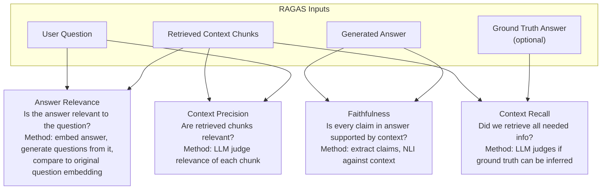

**RAGAS scoring in code:**
```python
from ragas import evaluate
from ragas.metrics import faithfulness, answer_relevancy, context_precision, context_recall
from datasets import Dataset

eval_dataset = Dataset.from_dict({
    "question": questions,
    "answer": generated_answers,
    "contexts": retrieved_contexts,  # list of lists
    "ground_truths": reference_answers,  # list of lists
})

results = evaluate(
    eval_dataset,
    metrics=[faithfulness, answer_relevancy, context_precision, context_recall]
)
print(results)
# {'faithfulness': 0.83, 'answer_relevancy': 0.91, 'context_precision': 0.78, 'context_recall': 0.85}
```

### RAG Failure Analysis

**Systematic failure identification:**
```python
# Categorize failures by type
def analyze_rag_failure(question, answer, context, ground_truth):
    failures = []

    # Retrieval failure: relevant docs not retrieved
    if context_recall_score(question, context, ground_truth) < 0.5:
        failures.append("RETRIEVAL_FAILURE")

    # Faithfulness failure: hallucinated content
    if faithfulness_score(answer, context) < 0.7:
        failures.append("HALLUCINATION")

    # Relevance failure: retrieved but unused
    if context_precision_score(question, context) < 0.5:
        failures.append("IRRELEVANT_RETRIEVAL")

    # Answer failure: correct context but wrong answer
    if not failures and answer_correct_score(answer, ground_truth) < 0.7:
        failures.append("GENERATION_FAILURE")

    return failures
```

## 3.5 Agent Evaluation

Agents are much harder to evaluate because they take sequences of actions and have non-deterministic execution paths.

**Three evaluation levels:**

```mermaid
graph TD
    L1["Level 1: Trajectory Evaluation\nDid the agent take reasonable steps?"]
    L2["Level 2: Task Completion\nDid the agent achieve the final goal?"]
    L3["Level 3: Efficiency\nDid it achieve the goal optimally?"]

    L1 --> L2 --> L3
```

### Task Completion Evaluation

```python
class AgentEvaluator:
    def evaluate_task(self, task: AgentTask, trajectory: list[AgentStep]) -> AgentEvalResult:
        # 1. Was the task completed?
        final_answer = trajectory[-1].output
        task_completed = self._check_task_completion(task, final_answer)

        # 2. Were correct tools used?
        tools_used = [step.tool_name for step in trajectory if step.tool_name]
        tools_correct = self._check_tools_appropriate(task, tools_used)

        # 3. Were there any errors?
        errors = [step for step in trajectory if step.is_error]

        # 4. Efficiency: steps taken vs optimal
        efficiency = task.optimal_steps / len(trajectory)

        return AgentEvalResult(
            task_completed=task_completed,
            tools_correct=tools_correct,
            error_count=len(errors),
            efficiency=efficiency,
            trajectory_length=len(trajectory),
        )
```

### Agent Benchmarks

| Benchmark | What it tests | Tasks |
|---|---|---|
| **WebArena** | Web navigation and task completion | 812 real-world web tasks |
| **SWE-bench** | Software engineering (fix GitHub issues) | 300 real GitHub issues |
| **AgentBench** | Multi-environment agent capabilities | OS, DB, web, code tasks |
| **GAIA** | General AI assistants (real-world tasks) | Practical multi-step tasks |
| **ToolBench** | Tool calling accuracy | 16,000+ REST API calls |

### Failure Mode Taxonomy for Agents

| Failure Type | Description | Example |
|---|---|---|
| **Tool hallucination** | Calls non-existent tool or wrong parameters | `search_web(query=None)` |
| **Reasoning error** | Incorrect logic in thought process | Math error in calculation |
| **Context forgetting** | Ignores earlier information | Asks for user name twice |
| **Looping** | Stuck in repetitive actions | Calls same search 5 times |
| **Premature termination** | Stops before completing task | Stops after finding first result |
| **Overreach** | Takes more powerful actions than needed | Deletes file instead of reading it |

## 3.6 Human-in-the-Loop Evaluation

### When to use HITL evaluation:

| Situation | Why HITL needed |
|---|---|
| **Subjective quality** | No objective metric captures "good writing" |
| **Safety-critical** | Medical, legal, financial advice needs expert review |
| **Novel distribution** | Model may be wrong in ways automated metrics miss |
| **Benchmark saturation** | If model scores near ceiling on benchmarks |
| **Subtle bias detection** | Automated metrics miss demographic disparities |

### Annotation Guidelines Best Practices

```
Annotation Task: Rate LLM response quality (1-5)

5 - Excellent: Complete, accurate, well-structured, helpful
4 - Good: Minor issues but substantially helpful  
3 - Acceptable: Somewhat helpful but notable problems
2 - Poor: Major errors or unhelpful
1 - Harmful: Factually wrong, harmful, or offensive

Annotator agreement: Use Cohen's Kappa > 0.6 as quality threshold
Sample size: Minimum 200 examples per model comparison
Blind evaluation: Annotators must not know which model generated response
```

### Inter-Annotator Agreement

| Metric | Use case | Formula |
|---|---|---|
| **Cohen's Kappa** | 2 annotators, categorical labels | kappa = (po - pe) / (1 - pe) |
| **Krippendorff's Alpha** | Multiple annotators, any scale | Complex, handles missing data |
| **Fleiss's Kappa** | Multiple annotators, categorical | Extension of Cohen's for N raters |
| **Spearman correlation** | Ordinal/continuous ratings | Rank correlation between raters |

**Kappa interpretation:**
- < 0: Worse than chance
- 0.0–0.2: Slight agreement
- 0.2–0.4: Fair agreement
- 0.4–0.6: Moderate agreement (acceptable minimum)
- 0.6–0.8: Substantial agreement (target)
- 0.8–1.0: Near-perfect agreement

---

# Part 4: Cost Engineering for AI

## 4.1 Why Cost Engineering Matters

AI workloads are orders of magnitude more expensive than traditional software:

| Workload | Typical cost |
|---|---|
| Standard API server | $10–100/month per instance |
| ML training (fine-tune) | $500–50,000 per run |
| LLM inference (hosted) | $0.001–0.03 per 1K tokens |
| LLM inference (self-hosted) | $0.0002–0.005 per 1K tokens |
| A100 GPU rental | $3–4/hour |
| H100 GPU rental | $6–8/hour |
| GPT-4o (OpenAI) | $5/1M input tokens, $15/1M output |
| Self-hosted LLaMA-3 70B | ~$0.30–0.50/1M tokens (8x H100) |

**Cost breakdown for a typical RAG chatbot (10M queries/month):**
```
- Embedding generation: 10M x 500 tokens x $0.02/1M = $100
- Vector search: 10M x $0.0001 = $1,000
- LLM inference: 10M x 1500 tokens x $5/1M input + $15/1M output = ~$100,000
- Infrastructure (serving, DB, cache): ~$10,000
Total: ~$110,000/month => focus cost reduction on LLM inference!
```

## 4.2 GPU Utilization Optimization

**The utilization problem:** GPU is expensive but often sits idle.

**GPU utilization metrics:**

| Metric | What it measures | Target |
|---|---|---|
| **GPU Utilization %** | % of time GPU is executing kernels | Above 80% for training |
| **SM Efficiency** | % of active SMs actually doing useful work | Above 70% |
| **Memory Bandwidth Utilization** | % of peak HBM bandwidth used | Above 60% |
| **Tensor Core Utilization** | % of cycles Tensor Cores active | Above 50% for LLM workloads |
| **MFU (Model FLOP Utilization)** | Actual FLOPs / theoretical peak FLOPs | 30-60% is good for LLMs |

**Monitoring GPU utilization:**
```bash
# DCGM (Data Center GPU Manager)
dcgmi dmon -e 1001,1002,1003,1004

# nvidia-smi
watch -n 1 nvidia-smi --query-gpu=utilization.gpu,utilization.memory,memory.used --format=csv

# PyTorch profiler
with torch.profiler.profile(
    activities=[ProfilerActivity.CPU, ProfilerActivity.CUDA],
    on_trace_ready=torch.profiler.tensorboard_trace_handler('./prof')
) as prof:
    model(input)
```

**Common causes of low GPU utilization:**
1. **Data loading bottleneck:** CPU cannot prepare batches fast enough => GPU waits
   - Fix: Increase `num_workers` in DataLoader, use prefetching, pin memory
2. **Small batch size:** GPU not fully utilized with tiny batches
   - Fix: Increase batch size (use gradient accumulation if memory limited)
3. **Synchronization barriers:** CPU waiting on GPU or vice versa
   - Fix: Use async CUDA streams, avoid unnecessary `.item()` calls
4. **Memory-bound operations:** Small matrix sizes don't tile efficiently
   - Fix: Use larger hidden dimensions, pad to multiples of 8 or 16

## 4.3 Inference Cost Optimization

### Batching Strategies

**Static batching (naive):**
```
Batch 1: [req1, req2, req3] => process all, wait for slowest (long context req3)
Batch 2: [req4, req5, req6] => req4,req5 wait while req3 finishes
```

**Continuous batching (vLLM, TensorRT-LLM):**
```
T=0: Start [req1, req2, req3]
T=5: req2 finishes => immediately add req4
T=8: req1 finishes => immediately add req5
T=15: req3 finally finishes => add req6
=> GPU always running at full capacity
```

**Dynamic batching tradeoffs:**
- Larger batch: higher throughput, higher latency (wait time for batch to fill)
- Smaller batch: lower latency, lower throughput
- Use max_batch_size + max_queue_delay to tune the tradeoff

### Quantization for Cost Reduction

```python
# GPTQ 4-bit quantization (post-training)
from transformers import AutoModelForCausalLM, GPTQConfig

quantization_config = GPTQConfig(
    bits=4,                    # 4-bit quantization
    dataset="c4",              # Calibration dataset
    tokenizer=tokenizer,
    group_size=128,            # Quantize in groups of 128
    desc_act=True              # Better accuracy
)

model = AutoModelForCausalLM.from_pretrained(
    "meta-llama/Meta-Llama-3-70B",
    quantization_config=quantization_config,
    device_map="auto"
)
# LLaMA-3 70B: 140 GB (FP16) -> 35 GB (INT4) = 4x memory reduction
# Throughput improvement: ~2x (memory bandwidth is the bottleneck)
```

**Quantization comparison:**

| Method | Bits | Quality Loss | Memory | Throughput | Technique |
|---|---|---|---|---|---|
| **FP16** | 16 | Baseline | 1x | 1x | Standard |
| **BF16** | 16 | ~= FP16 | 1x | 1x | Better training stability |
| **INT8 (LLM.int8)** | 8 | Very low | 0.5x | 1.2x | Mixed-precision (outliers in FP16) |
| **GPTQ** | 4 | Low | 0.25x | 2-3x | Calibration-based quantization |
| **AWQ** | 4 | Very low | 0.25x | 2-3x | Activation-aware weight quantization |
| **GGUF (llama.cpp)** | 2-8 | Variable | 0.12-0.5x | Variable | CPU-optimized quantization |

### Model Selection Cost Optimization

```mermaid
graph TD
    Request["Incoming Request"] --> Classifier["Query Complexity\nClassifier\n(fast, cheap)"]
    Classifier -->|"Simple query\n70% of traffic"| SmallModel["Small Model\ngpt-4o-mini\n$0.15/1M tokens"]
    Classifier -->|"Medium query\n25% of traffic"| MedModel["Medium Model\ngpt-4o\n$5/1M tokens"]
    Classifier -->|"Complex query\n5% of traffic"| LargeModel["Large Model\no1 or claude-3-opus\n$15/1M tokens"]
```

**Cost comparison with intelligent routing:**
```
Naive (all gpt-4o):       $5/1M x 10M messages = $50,000/month
With routing:
  70% x gpt-4o-mini:      $0.15/1M x 7M = $1,050
  25% x gpt-4o:           $5/1M x 2.5M = $12,500
  5% x claude-3-opus:     $15/1M x 0.5M = $7,500
  Total: $21,050/month = 58% cost reduction!
```

## 4.4 Token Cost Optimization

### Prompt Compression

Reduce token count without losing meaning:

**LLMLingua / LLMLingua-2:** Compress prompts by removing unimportant tokens.
```python
from llmlingua import PromptCompressor

llm_lingua = PromptCompressor(model_name="microsoft/llmlingua-2-bert-base-multilingual-cased-meetingbank")

compressed = llm_lingua.compress_prompt(
    context=long_context,   # Retrieved RAG documents
    instruction="Answer the question based on context",
    question=user_question,
    target_token=500,       # Compress to 500 tokens
    rate=0.5                # 50% compression rate
)
# Result: same accuracy at 50% of token cost
```

**System prompt caching (Anthropic Claude, OpenAI):**
```python
# Mark stable system prompt for caching
# Cache hit: charged at 10% of normal input token price
response = anthropic.messages.create(
    model="claude-3-5-sonnet-20241022",
    system=[
        {
            "type": "text",
            "text": "You are an expert assistant...",
            "cache_control": {"type": "ephemeral"}  # Cache this block!
        }
    ],
    messages=[{"role": "user", "content": user_query}],
    max_tokens=1024
)
# For 10M requests with 2K token system prompt: saves 80-90% on system prompt cost
```

### Streaming and Early Stopping

```python
# Stop generation when stopping criteria met (saves tokens)
class StopOnJSON(StoppingCriteria):
    def __init__(self, tokenizer):
        self.tokenizer = tokenizer

    def __call__(self, input_ids, scores, **kwargs):
        last_token = self.tokenizer.decode(input_ids[0, -1])
        # Stop as soon as we see closing brace (JSON complete)
        return last_token == "}"

# For structured output, generate until complete, not until max_tokens
output = model.generate(
    input_ids,
    max_new_tokens=2048,
    stopping_criteria=StoppingCriteriaList([StopOnJSON(tokenizer)])
)
```

## 4.5 Caching Strategies for Cost Reduction

### Three-Layer Cache Architecture

```mermaid
graph TD
    Request["Incoming Request"] --> ExactCache["Exact Match Cache\nRedis\nKey: SHA256(prompt)\nCost: near $0, 0ms latency"]
    ExactCache -->|miss| SemanticCache["Semantic Cache\nVector DB\nKey: embedding similarity > 0.95\nCost: $0.002 per query, 5ms"]
    SemanticCache -->|miss| LLM["LLM API\nFull cost: $5/1M tokens\n500-2000ms"]
    ExactCache -->|hit| Response["Response\n(no LLM call)"]
    SemanticCache -->|hit| Response
    LLM --> Store["Store in both caches"]
    Store --> Response
```

**Cache hit rate analysis:**
```python
def estimate_cache_savings(requests_per_day: int, exact_hit_rate: float, semantic_hit_rate: float, cost_per_1k_tokens: float, avg_tokens: int):
    # Of 100% requests:
    exact_hits = requests_per_day * exact_hit_rate
    semantic_hits = requests_per_day * (1 - exact_hit_rate) * semantic_hit_rate
    llm_calls = requests_per_day - exact_hits - semantic_hits

    full_cost = requests_per_day * avg_tokens / 1000 * cost_per_1k_tokens
    cached_cost = llm_calls * avg_tokens / 1000 * cost_per_1k_tokens

    savings_pct = (full_cost - cached_cost) / full_cost * 100
    return savings_pct

# Example: 10M requests/day, 30% exact hit, 40% semantic hit of remainder
# savings = 58% cost reduction
```

### KV Cache Management and Prefix Caching

**Prefix caching:** Multiple requests with same prefix (system prompt) share KV cache blocks.

```mermaid
graph LR
    SP["System Prompt\n500 tokens\n(same for all requests)"] --> KVCache["Shared KV Cache\n(computed once)"]
    U1["User 1 query\n50 tokens"] --> KVCache
    U2["User 2 query\n75 tokens"] --> KVCache
    U3["User 3 query\n30 tokens"] --> KVCache

    Note["500 tokens x 1M users/day\nWithout prefix cache: 500M token compute\nWith prefix cache: 500 token compute + 1M x 50 token compute\n= 100x cost reduction for system prompt!"]
```

## 4.6 Autoscaling for Cost Optimization

### Horizontal Pod Autoscaler (HPA) for ML Serving

```yaml
apiVersion: autoscaling/v2
kind: HorizontalPodAutoscaler
metadata:
  name: llm-serving-hpa
spec:
  scaleTargetRef:
    apiVersion: apps/v1
    kind: Deployment
    name: vllm-deployment
  minReplicas: 2
  maxReplicas: 20
  metrics:
  - type: External
    external:
      metric:
        name: pending_requests_queue_depth
      target:
        type: AverageValue
        averageValue: "10"  # Scale when avg queue depth > 10 requests per pod
  behavior:
    scaleUp:
      stabilizationWindowSeconds: 30    # Scale up quickly
      policies:
      - type: Pods
        value: 2
        periodSeconds: 60               # Add max 2 pods per minute
    scaleDown:
      stabilizationWindowSeconds: 300   # Scale down slowly (5 min stability)
```

**Request-based vs token-based autoscaling:**

Standard HPA scales on CPU/memory or request count. For LLMs, a 1-token request and a 4096-token request use vastly different resources. Use **token throughput** as the scaling metric:

```python
# Custom metric: tokens per second per pod
tokens_per_second = output_token_counter.rate(60)  # rolling 60s window
# Target: scale when TPS per pod > 500 (adjust based on GPU capacity)
```

### Spot/Preemptible Instances for Training

```mermaid
graph TD
    TrainingJob["Distributed Training Job"] --> Checkpoint["Checkpoint every N steps\n(save to S3/GCS)"]
    Spot["Spot GPU Instance\n(60-80% cheaper)"] --> TrainingJob
    Spot -->|"Preemption notice\n2-minute warning"| Checkpoint
    Checkpoint --> Terminate["Instance terminated"]
    Terminate --> Resume["Resume from checkpoint\non new spot instance"]
```

**Fault-tolerant training with automatic checkpoint/resume:**
```python
import torch.distributed.checkpoint as dcp

class CheckpointManager:
    def __init__(self, checkpoint_dir: str, checkpoint_every_n_steps: int = 1000):
        self.dir = checkpoint_dir
        self.every_n = checkpoint_every_n_steps

    def save_if_needed(self, model, optimizer, step: int):
        if step % self.every_n == 0:
            state_dict = {"model": model.state_dict(), "optimizer": optimizer.state_dict(), "step": step}
            dcp.save(state_dict, checkpoint_id=f"{self.dir}/step_{step}")

    def resume_if_exists(self, model, optimizer) -> int:
        # Find latest checkpoint
        checkpoints = sorted(glob.glob(f"{self.dir}/step_*"))
        if not checkpoints:
            return 0
        latest = checkpoints[-1]
        state_dict = {"model": model.state_dict(), "optimizer": optimizer.state_dict(), "step": 0}
        dcp.load(state_dict, checkpoint_id=latest)
        model.load_state_dict(state_dict["model"])
        optimizer.load_state_dict(state_dict["optimizer"])
        return state_dict["step"]
```

## 4.7 FinOps for AI

### Cost Attribution Framework

**Who is spending what:**

```mermaid
graph TD
    TotalCost["Total AI Infrastructure Cost"] --> GPUCost["GPU Compute\n60% of total"]
    TotalCost --> StorageCost["Storage S3/GCS\n15% of total"]
    TotalCost --> NetworkCost["Network egress\n10% of total"]
    TotalCost --> LLMAPI["External LLM APIs\n15% of total"]

    GPUCost --> Training["Training\n40% of GPU"]
    GPUCost --> Inference["Inference serving\n50% of GPU"]
    GPUCost --> Notebooks["Dev notebooks\n10% of GPU"]

    Inference --> TeamA["Team A RAG platform\n30%"]
    Inference --> TeamB["Team B Recommendations\n40%"]
    Inference --> TeamC["Team C Code Assist\n30%"]
```

**Tagging strategy for cost attribution:**
```yaml
# Kubernetes namespace + labels
namespace: ml-team-rag
labels:
  team: platform-ai
  product: rag-chat
  cost-center: AI-2024
  environment: production
  model: llama-3-70b
```

### Cost Metrics Dashboard (Key Metrics)

| Metric | Formula | Target |
|---|---|---|
| **Cost per request** | Total monthly cost / requests | Track week-over-week |
| **Cost per 1K tokens** | GPU cost / tokens generated x 1000 | Compare vs hosted APIs |
| **GPU efficiency** | Useful tokens / (total GPU-hours x peak_tokens_per_hour) | Above 60% |
| **Cache hit rate** | Cache hits / total requests | Above 40% |
| **Cost per user** | Total cost / MAU | Track growth vs revenue |
| **Inference cost as % of LTV** | Monthly inference cost / user lifetime value | Below 20% |

### Cost Optimization Roadmap (Priority Order)

```
Priority 1 - Quick wins (< 1 week, high impact):
  - Enable semantic caching (30-60% cost reduction)
  - Switch from GPT-4 to GPT-4o-mini for simple queries (90% cheaper)
  - Enable prefix caching for system prompts (free on Claude/OpenAI)

Priority 2 - Medium effort (1-4 weeks, high impact):
  - Implement model routing (classify query complexity)
  - Right-size GPU instances (use T4 for batch, A100 for real-time)
  - Enable continuous batching (10x throughput improvement)

Priority 3 - High effort (1-3 months, high impact):
  - Self-host frequently used models (70% cost reduction vs APIs)
  - Implement INT4 quantization on self-hosted models
  - Move training to spot instances

Priority 4 - Strategic (3-6 months):
  - Distill large models to smaller, task-specific models
  - Build custom speculative decoding with domain-specific draft model
  - Implement advanced prompt compression (LLMLingua)
```

### ROI Calculation Template

```python
def calculate_ai_feature_roi(
    users_impacted: int,
    conversion_rate_lift: float,  # e.g., 0.02 = 2% improvement
    avg_order_value: float,
    monthly_cost: float,
    months_to_evaluate: int = 12
) -> dict:

    monthly_revenue_lift = users_impacted * conversion_rate_lift * avg_order_value
    annual_revenue = monthly_revenue_lift * months_to_evaluate
    annual_cost = monthly_cost * months_to_evaluate
    roi = (annual_revenue - annual_cost) / annual_cost * 100
    payback_months = monthly_cost / monthly_revenue_lift if monthly_revenue_lift > 0 else float("inf")

    return {
        "monthly_revenue_lift": monthly_revenue_lift,
        "annual_revenue": annual_revenue,
        "annual_cost": annual_cost,
        "roi_percent": roi,
        "payback_months": payback_months,
    }

# Example: LLM recommendation feature
result = calculate_ai_feature_roi(
    users_impacted=1_000_000,
    conversion_rate_lift=0.005,  # 0.5% lift
    avg_order_value=50,
    monthly_cost=50_000,
)
# {"monthly_revenue_lift": 250000, "roi_percent": 500%, "payback_months": 0.2}
```

---

## Quick Reference: AI Infrastructure Interview Cheat Sheet

### GPU Architecture Questions

| Question | Key Answer |
|---|---|
| What is a warp? | 32 threads executing same instruction (SIMD); divergence = serialization |
| Why HBM over GDDR? | 10x bandwidth (3.35 TB/s vs 350 GB/s); modern LLMs are memory-bandwidth-bound |
| What is MFU? | Model FLOP Utilization = actual TFLOPs / theoretical peak; 30-60% is good |
| Why NVLink over PCIe? | 900 GB/s vs 128 GB/s; essential for AllReduce in distributed training |
| What is RDMA? | Bypass CPU/kernel in network; 1-2us latency vs 50-100us for TCP |

### Distributed Training Questions

| Question | Key Answer |
|---|---|
| When use DP vs TP vs PP? | DP: model fits in GPU; TP: within node (NVLink); PP: across nodes |
| What is ZeRO-3? | Shard params + grads + optimizer states; 64x+ memory reduction |
| What is gradient checkpointing? | Recompute activations in backward; halves activation memory, 33% slower |
| What is Ring AllReduce? | O(N bandwidth) for N GPUs; bandwidth efficient, latency proportional to N |
| What is pipeline bubble? | GPU idle time = (p-1)/(p-1+m); reduce with more micro-batches |

### Cost Engineering Questions

| Question | Key Answer |
|---|---|
| How reduce LLM cost 10x? | Caching + routing to smaller models + quantization + continuous batching |
| What is arithmetic intensity? | FLOPs / bytes accessed; low -> memory bound; high -> compute bound |
| When to self-host vs API? | Self-host when volume * per-token-savings > infrastructure + ops cost |
| How size GPU fleet? | peak_RPS * avg_latency * (1/target_utilization) = required replicas |
| What is prefix caching? | Share KV cache for common prompt prefix; free on Claude/OpenAI APIs |

---

*This document covers the advanced AI infrastructure, distributed training, evaluation, and cost engineering topics essential for Senior/Staff/Principal AI Engineer interviews in 2026 and beyond.*
