# AI/ML Engineer Interview Prep — Agentic Design Patterns

> **Purpose:** These notes synthesize all 21 agentic design patterns from this repository into interview-ready material for top-tier product companies (Google, Meta, Microsoft, Amazon, OpenAI, Anthropic, and similar). Every pattern is covered with a clear explanation, embedded flowchart, pros/cons table, key concepts, and an interview answer framework.

---

## Table of Contents

1. [How to Use These Notes](#how-to-use-these-notes)
2. [What Are Agentic Design Patterns?](#what-are-agentic-design-patterns)
3. [Master Overview — All 21 Patterns](#master-overview--all-21-patterns)
4. [Pattern Selection Guide](#pattern-selection-guide)
5. [Core Patterns](#core-patterns)
   - [1. Prompt Chaining](#1-prompt-chaining)
   - [2. Routing](#2-routing)
   - [3. Parallelization](#3-parallelization)
   - [4. Reflection](#4-reflection)
   - [5. Tool Use (Function Calling)](#5-tool-use-function-calling)
6. [Advanced Patterns](#advanced-patterns)
   - [6. Planning](#6-planning)
   - [7. Multi-Agent Collaboration](#7-multi-agent-collaboration)
   - [8. Memory Management](#8-memory-management)
   - [9. Learning and Adaptation](#9-learning-and-adaptation)
   - [10. Model Context Protocol (MCP)](#10-model-context-protocol-mcp)
7. [System Patterns](#system-patterns)
   - [11. Goal Setting and Monitoring](#11-goal-setting-and-monitoring)
   - [12. Exception Handling and Recovery](#12-exception-handling-and-recovery)
   - [13. Human-in-the-Loop (HITL)](#13-human-in-the-loop-hitl)
   - [14. Knowledge Retrieval (RAG)](#14-knowledge-retrieval-rag)
   - [15. Inter-Agent Communication (A2A)](#15-inter-agent-communication-a2a)
8. [Optimization Patterns](#optimization-patterns)
   - [16. Resource-Aware Optimization](#16-resource-aware-optimization)
   - [17. Reasoning Techniques](#17-reasoning-techniques)
   - [18. Guardrails and Safety Patterns](#18-guardrails-and-safety-patterns)
   - [19. Evaluation and Monitoring](#19-evaluation-and-monitoring)
9. [Strategic Patterns](#strategic-patterns)
   - [20. Prioritization](#20-prioritization)
   - [21. Exploration and Discovery](#21-exploration-and-discovery)
10. [Real-World System Compositions](#real-world-system-compositions)
11. [Quick Revision Cheat Sheet](#quick-revision-cheat-sheet)
12. [Supplementary Interview Topics](#supplementary-interview-topics)

---

## How to Use These Notes

These notes are structured for progressive learning. Each pattern section follows a uniform template so that once you know the format, you can move quickly:

- **What It Is** — plain English explanation
- **When to Use / Where It Fits** — trigger conditions and architectural placement
- **Flowchart** — the full Mermaid diagram from the repo
- **Pros and Cons Table** — the tradeoff language interviewers expect
- **Key Concepts** — four dense bullets for rapid revision
- **Real-World Example** — a concrete scenario you can narrate in an interview
- **Interview Answer Framework** — scripted 30-second answers for common questions
- **Related Patterns** — cross-references to avoid confusion between similar patterns

**Recommended 6-week study order:**

| Week | Focus | Patterns |
|------|-------|----------|
| 1 | Workflow Fundamentals | Prompt Chaining, Routing, Parallelization, Tool Use, Planning |
| 2 | Quality Loop | Reflection, Reasoning Techniques, Evaluation, Goal Monitoring |
| 3 | Knowledge and Context | Memory Management, RAG, Learning and Adaptation |
| 4 | Multi-Agent Systems | Multi-Agent Collaboration, A2A Communication, MCP |
| 5 | Production and Safety | Exception Handling, Guardrails, HITL, Resource Optimization |
| 6 | Strategic + Mock Designs | Prioritization, Exploration, full system compositions |

---

## What Are Agentic Design Patterns?

An **AI agent** is a system that perceives its environment, reasons about goals, takes actions (via tools, APIs, or other agents), and iterates until a task is complete. Unlike a single LLM call, agents can plan, use memory, call functions, collaborate with other agents, and self-correct.

**Agentic design patterns** are reusable architectural blueprints for building these systems reliably at scale. They encode hard-won lessons about when to run things sequentially vs. in parallel, how to recover from failures, when to involve humans, how to manage cost, and much more.

In top-tier AI/ML interviews, you will be asked to:
- Design an end-to-end agentic system (system design round)
- Explain tradeoffs between architectural choices
- Describe how you would ensure safety, reliability, and quality
- Reason about cost and latency at scale

These 21 patterns give you the vocabulary and the frameworks to answer all of those questions.

---

## Master Overview — All 21 Patterns

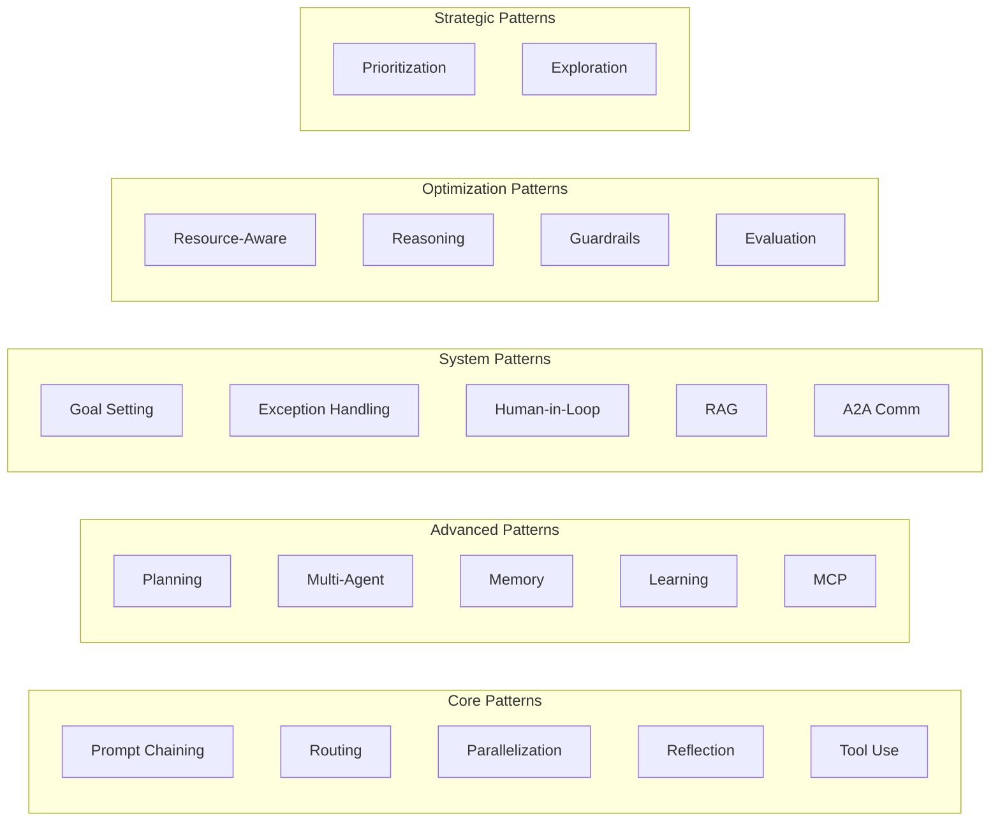
```mermaid
flowchart LR
    subgraph core [Core Patterns]
        PC[Prompt Chaining]
        RT[Routing]
        PL[Parallelization]
        RF[Reflection]
        TU[Tool Use]
    end
    subgraph advanced [Advanced Patterns]
        PN[Planning]
        MA[Multi-Agent]
        MM[Memory]
        LA[Learning]
        MCP[MCP]
    end
    subgraph system [System Patterns]
        GS[Goal Setting]
        EX[Exception Handling]
        HITL[Human-in-Loop]
        RAG[RAG]
        A2A[A2A Comm]
    end
    subgraph optimization [Optimization Patterns]
        RA[Resource-Aware]
        RS[Reasoning]
        GR[Guardrails]
        EV[Evaluation]
    end
    subgraph strategic [Strategic Patterns]
        PR[Prioritization]
        ED[Exploration]
    end
```

**All 21 patterns at a glance:**

| # | Pattern | One-Line Flow | Primary Purpose |
|---|---------|--------------|-----------------|
| 1 | Prompt Chaining | Task1 → Task2 → Task3 → Merge | Break complex work into validated sequential steps |
| 2 | Routing | Request → Router → Specialized Agent | Send each request to the most capable handler |
| 3 | Parallelization | Split → [W1\|W2\|W3\|W4] → Merge | Run independent tasks simultaneously |
| 4 | Reflection | Generate → Critique → Revise → Final | Self-evaluation loop for quality improvement |
| 5 | Tool Use | Agent → Select Tool → Call → Process | Extend agents with APIs, databases, and actions |
| 6 | Planning | Goal → Milestones → Execute → Monitor | Strategic decomposition before execution |
| 7 | Multi-Agent | Coordinator → [A1\|A2\|A3\|A4] → Output | Specialist agents collaborating on complex tasks |
| 8 | Memory | Input → Classify → Store → Retrieve | Persistent context across sessions and interactions |
| 9 | Learning | Feedback → Learn → Test → Deploy | Continuous improvement from outcomes |
| 10 | MCP | Registry → Discover → Authorize → Call | Standardized tool/data discovery for enterprise |
| 11 | Goal Setting | SMART → KPIs → Monitor → Achieve | Autonomous agents with measurable objectives |
| 12 | Exception Handling | Try → Error → Classify → Recover | Production reliability through graceful recovery |
| 13 | HITL | AI → Decision Gate → Human → Learn | Human oversight at high-stakes checkpoints |
| 14 | RAG | Index → Query → Retrieve → Generate | Ground responses in external knowledge sources |
| 15 | A2A Comm | Agent → Message Broker → Agent | Structured protocols for agent-to-agent messaging |
| 16 | Resource-Aware | Classify → Route Model → Monitor | Route tasks to cheap vs. expensive models by complexity |
| 17 | Reasoning | Problem → Method (CoT/ToT/SC) → Solve | Structured thinking for hard multi-step problems |
| 18 | Guardrails | Input → Sanitize → Risk → Moderate | Safety, compliance, and ethical content enforcement |
| 19 | Evaluation | Tests → Monitor → Detect → Optimize | Quality gates and drift detection in production |
| 20 | Prioritization | Score Tasks → Rank → Execute → Reorder | Manage task queues by value, urgency, and dependencies |
| 21 | Exploration | Scout → Cluster → Deep Dive → Discover | Structured approach to R&D and hypothesis generation |

---

## Pattern Selection Guide

This section answers the question every interviewer will eventually ask: "How do you decide which pattern to use?"

### Decision Tree: Choosing the Right Pattern

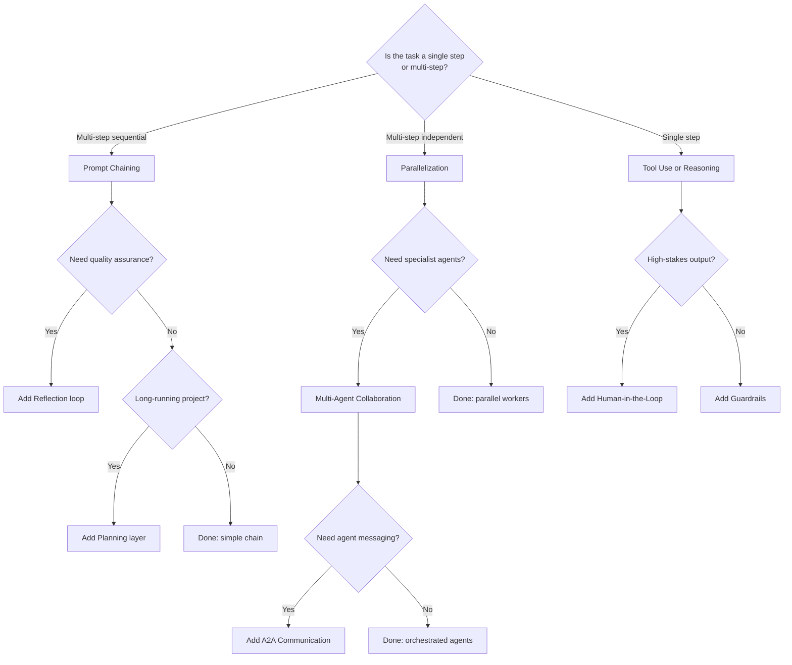
```mermaid
flowchart TD
    Q1{Is the task a single step\nor multi-step?} -->|Single step| TU[Tool Use or Reasoning]
    Q1 -->|Multi-step sequential| PC[Prompt Chaining]
    Q1 -->|Multi-step independent| PL[Parallelization]
    PC --> Q2{Need quality assurance?}
    Q2 -->|Yes| RF[Add Reflection loop]
    Q2 -->|No| Q3{Long-running project?}
    Q3 -->|Yes| PN[Add Planning layer]
    Q3 -->|No| Done1[Done: simple chain]
    PL --> Q4{Need specialist agents?}
    Q4 -->|Yes| MA[Multi-Agent Collaboration]
    Q4 -->|No| Done2[Done: parallel workers]
    MA --> Q5{Need agent messaging?}
    Q5 -->|Yes| A2A[Add A2A Communication]
    Q5 -->|No| Done3[Done: orchestrated agents]
    TU --> Q6{High-stakes output?}
    Q6 -->|Yes| HITL[Add Human-in-the-Loop]
    Q6 -->|No| GR[Add Guardrails]
```

### Overlapping Patterns — Know the Differences

These are the most common sources of confusion in interviews:

| Confusion Pair | Key Distinction |
|----------------|-----------------|
| **Prompt Chaining vs. Parallelization** | Chaining = steps depend on each other (sequential). Parallelization = steps are independent (concurrent). |
| **Routing vs. Multi-Agent** | Routing is the entry point — it decides *where* to send a request. Multi-Agent is the collaboration *after* routing, where multiple specialists work together. |
| **Multi-Agent vs. A2A** | Multi-Agent describes the *architecture* (specialist roles). A2A describes the *communication protocol* (how agents message each other). |
| **Memory vs. RAG** | Memory = agent's personal history (conversations, preferences, past decisions). RAG = querying a shared external knowledge base of documents. |
| **Reflection vs. Reasoning Techniques** | Reflection = a *loop* where one agent critiques another's output. Reasoning = a *method* (CoT, ToT) used inside a single agent's thinking step. |
| **Planning vs. Prioritization** | Planning = decompose a *single goal* into steps. Prioritization = decide *which goal* to work on first when multiple exist. |
| **Guardrails vs. Evaluation** | Guardrails = *real-time* safety enforcement on every request/response. Evaluation = *offline and continuous* quality measurement of system performance. |
| **Exception Handling vs. HITL** | Exception Handling = *automated* recovery from technical errors. HITL = *deliberate human judgment* for ambiguous or high-stakes decisions. |

### Anti-Patterns: When NOT to Use Each

| Pattern | Don't Use When... |
|---------|------------------|
| Prompt Chaining | Tasks require dynamic branching — use Planning instead |
| Routing | You only have one type of request — adds unnecessary overhead |
| Parallelization | Tasks are dependent on each other — race conditions will corrupt results |
| Reflection | Latency is critical and output quality is already acceptable |
| Tool Use | Deterministic logic suffices — no need for external calls |
| Planning | Scope is small and fixed — adds upfront cost with no benefit |
| Multi-Agent | A single well-prompted agent can handle the task |
| Memory | Privacy constraints prohibit storing user data |
| Learning | Feedback volume is insufficient or feedback signal is unreliable |
| MCP | You only have 1–2 integrations — direct API calls are simpler |
| HITL | Volume is so high that human bottleneck kills throughput |
| RAG | Knowledge base is tiny and can fit in the system prompt |
| Guardrails | Internal developer tool with no risk of adversarial inputs |
| Resource-Aware Optimization | All tasks are similar complexity — classification overhead not worth it |

---

## Core Patterns

---

### 1. Prompt Chaining

> **One-line flow:** `Task1 → Task2 → Task3 → Merge`

#### What It Is

Prompt Chaining breaks a complex task into a sequence of smaller, discrete LLM or tool calls, where each step's validated output becomes the next step's input. Think of it like an assembly line: each station does one thing well, and parts move forward only when they pass quality inspection.

The key feature is **validated handoffs** — structured data contracts (e.g., JSON schemas) ensure clean interfaces between steps. If a step fails validation, it retries or triggers a fallback before propagating to the next step. This makes failures local and debuggable rather than silently compounding.

#### When to Use / Where It Fits

- Complex multi-step processes that need clear visibility at each stage
- Data transformation pipelines: Extract → Transform → Validate → Load
- Quality-critical workflows where each step must meet criteria before proceeding
- Mixed tool/AI operations (LLM calls interspersed with API calls or database queries)
- **Examples:** Document analysis, content creation pipelines, code generation workflows, legal document processing

#### Flowchart

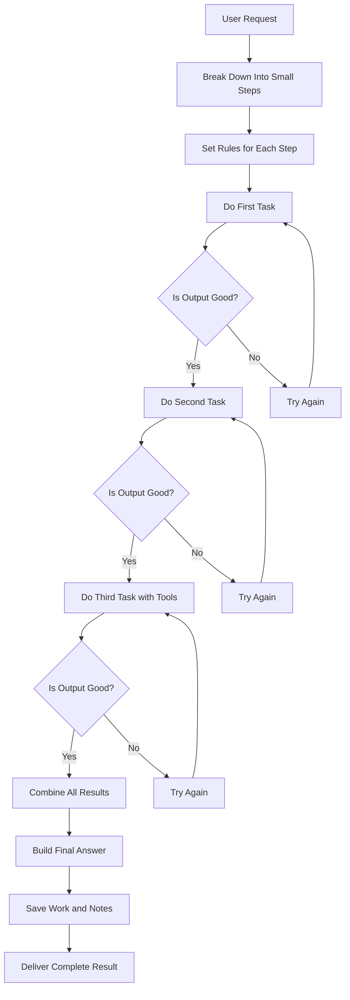
```mermaid
graph TD
    Start[User Request] --> Break[Break Down Into Small Steps]
    Break --> Define[Set Rules for Each Step]
    Define --> Task1[Do First Task]
    Task1 --> Check1{Is Output Good?}
    Check1 -->|Yes| Task2[Do Second Task]
    Check1 -->|No| Retry1[Try Again]
    Retry1 --> Task1
    Task2 --> Check2{Is Output Good?}
    Check2 -->|Yes| Task3[Do Third Task with Tools]
    Check2 -->|No| Retry2[Try Again]
    Retry2 --> Task2
    Task3 --> Check3{Is Output Good?}
    Check3 -->|Yes| Combine[Combine All Results]
    Check3 -->|No| Retry3[Try Again]
    Retry3 --> Task3
    Combine --> Build[Build Final Answer]
    Build --> Save[Save Work and Notes]
    Save --> End[Deliver Complete Result]
```

#### Pros and Cons

| Pros | Cons |
|------|------|
| Each step is independently testable and debuggable | Latency accumulates — every step adds processing time |
| Structured contracts ensure reliable handoffs | Cost multiplies — each LLM call incurs API charges |
| Errors are caught and isolated per step | Context can be lost or compressed between steps |
| Components are reusable across different chains | Early errors can cascade if validation is weak |
| Enables incremental progress saving and resumption | Rigid structure — hard to handle dynamic branching |
| Teams can work on different steps in parallel | State management of intermediate results adds complexity |

#### Key Concepts

- **Sequential execution** — steps run in order, each depends on the previous
- **Validated handoffs** — structured schemas between steps prevent silent failures
- **Modular sub-tasks** — each step can be optimized, tested, or swapped independently
- **Structured data contracts** — JSON/typed interfaces define the "shape" of each handoff

#### Real-World Example

**Academic Research Assistant:**
1. Parse research question and identify key concepts
2. Search and retrieve relevant papers
3. Extract and summarize findings per paper
4. Identify gaps and contradictions across papers
5. Generate literature review with citations

Each step validates output before proceeding. If paper retrieval returns zero results, step 2 retries with expanded query terms before feeding into step 3.

#### Interview Answer Framework

**"When would you use Prompt Chaining?"**
> "When a task has naturally sequential stages where each stage's output is required input for the next. Classic examples are document processing pipelines — extract, analyze, summarize, format — or any multi-stage workflow where you want isolated failure handling and debuggability at each step."

**"What are the tradeoffs?"**
> "The main cost is latency accumulation — every step adds time and API cost. You also need to carefully design the data contracts between steps, because poorly designed schemas can cause subtle context loss. For simple tasks, a single well-crafted prompt is usually better."

**Related Patterns:** [Parallelization](#3-parallelization) (when steps are independent), [Planning](#6-planning) (when the sequence itself needs to be determined dynamically), [Reflection](#4-reflection) (when each step needs a critique loop)

---

### 2. Routing

> **One-line flow:** `Request → Router → Specialized Agent`

#### What It Is

Routing uses an intent-classification step to analyze an incoming request and direct it to the most appropriate specialized agent or workflow. Instead of one generalist agent trying to handle everything, a router makes an upfront decision about which expert should handle this request, then hands off with the relevant context and tools.

The router typically outputs a confidence score alongside its routing decision. Low-confidence decisions are handled by a fallback path — usually requesting clarification from the user or falling back to a generalist agent. This confidence mechanism is critical for handling the long tail of ambiguous inputs.

#### When to Use / Where It Fits

- Systems handling multiple distinct request types requiring different expertise
- Customer service platforms routing to department-specific agents
- Multi-modal AI systems directing text, image, and code to different pipelines
- Healthcare triage routing patient queries to appropriate specialists
- Any system where routing costs less than giving every request premium resources

#### Flowchart

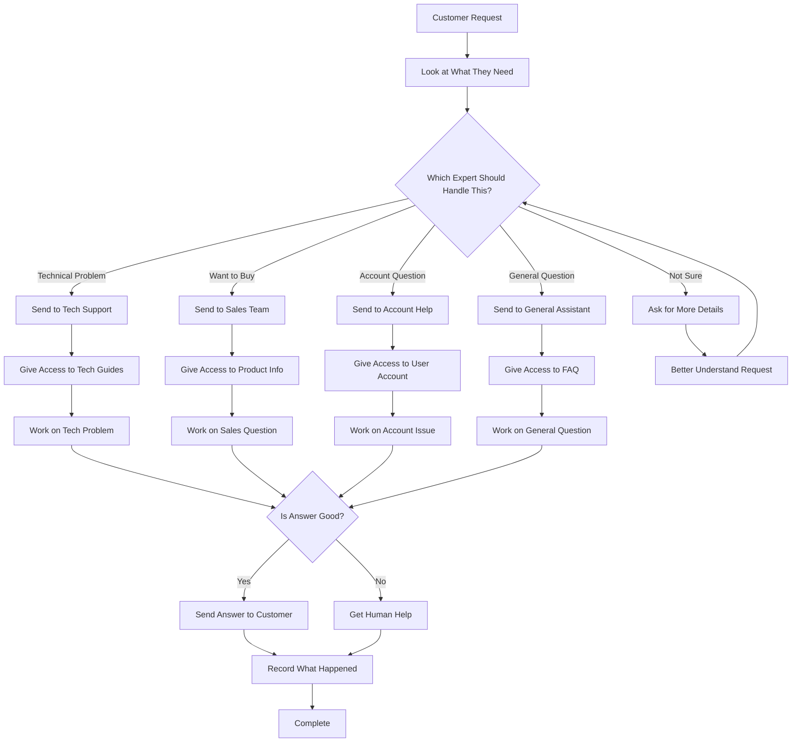
```mermaid
graph TD
    Start[Customer Request] --> Look[Look at What They Need]
    Look --> Decide{Which Expert Should Handle This?}
    Decide -->|Technical Problem| Tech[Send to Tech Support]
    Decide -->|Want to Buy| Sales[Send to Sales Team]
    Decide -->|Account Question| Account[Send to Account Help]
    Decide -->|General Question| General[Send to General Assistant]
    Decide -->|Not Sure| Ask[Ask for More Details]
    Tech --> TechTools[Give Access to Tech Guides]
    Sales --> SalesTools[Give Access to Product Info]
    Account --> AccountTools[Give Access to User Account]
    General --> GeneralTools[Give Access to FAQ]
    TechTools --> Work1[Work on Tech Problem]
    SalesTools --> Work2[Work on Sales Question]
    AccountTools --> Work3[Work on Account Issue]
    GeneralTools --> Work4[Work on General Question]
    Ask --> Understand[Better Understand Request]
    Work1 --> Check{Is Answer Good?}
    Work2 --> Check
    Work3 --> Check
    Work4 --> Check
    Understand --> Decide
    Check -->|Yes| Answer[Send Answer to Customer]
    Check -->|No| Backup[Get Human Help]
    Answer --> Record[Record What Happened]
    Backup --> Record
    Record --> End[Complete]
```

#### Pros and Cons

| Pros | Cons |
|------|------|
| Each route can be independently optimized | Misrouting sends requests to wrong handler, degrading quality |
| Easy to add new routes without affecting existing ones | Router itself is a bottleneck and single point of failure |
| Avoids wasting premium compute on simple requests | Edge cases that don't fit cleanly cause problems |
| Clear separation of concerns between workflows | Router needs continuous improvement from misrouting feedback |
| Enables cost optimization through tiered model use | Additional routing latency on every request |
| Routes can be monitored and updated independently | Managing performance across many routes increases observability cost |

#### Key Concepts

- **Intent classification** — the router understands what the user wants before deciding who handles it
- **Confidence thresholds** — requests below a confidence score go to clarification or fallback
- **Specialized agents** — each downstream handler is tuned for its domain
- **Fallback handling** — unclassified or low-confidence requests have a safe default path

#### Real-World Example

**Enterprise Customer Service Platform:**
- Router classifies incoming tickets as: Technical, Billing, Sales, or General
- Technical tickets route to an agent with access to documentation, error logs, and runbooks
- Billing tickets route to an agent with access to payment systems and account history
- Low-confidence tickets go to a clarification agent that asks 1–2 questions before re-routing
- All routing decisions are logged for accuracy monitoring and router retraining

#### Interview Answer Framework

**"When would you use Routing?"**
> "When you have meaningfully different request types that benefit from different agents, tools, or models. The upfront classification cost is worth it when the downstream efficiency gain is significant — for example, routing simple FAQs to a cheap small model and only escalating complex technical issues to a large model."

**"How is Routing different from Multi-Agent Collaboration?"**
> "Routing is the entry point — it's a dispatcher. Multi-Agent Collaboration is what happens after routing, when a team of specialists needs to work together on the task. They're often combined: the router decides which team to engage, then the team self-organizes using collaboration patterns."

**Related Patterns:** [Multi-Agent Collaboration](#7-multi-agent-collaboration) (downstream from routing), [Resource-Aware Optimization](#16-resource-aware-optimization) (routing by model cost), [Prioritization](#20-prioritization) (routing by urgency)

---

### 3. Parallelization

> **One-line flow:** `Split → [W1 | W2 | W3 | W4] → Merge`

#### What It Is

Parallelization divides a large task into independent sub-tasks that can execute concurrently across multiple workers, then merges all results into a unified output. It is the agentic equivalent of map-reduce: map the work across workers, reduce to a final result.

The critical requirement is **independence** — parallel tasks must not depend on each other's intermediate output. If they do, you need Prompt Chaining instead. In practice, parallelization is most valuable when you have many homogeneous items to process (e.g., analyze 500 documents) or multiple heterogeneous but independent tasks to complete simultaneously.

Rate limiting and result ordering are the two main engineering challenges: external APIs constrain how many concurrent calls you can make, and if output order matters, you need explicit bookkeeping.

#### When to Use / Where It Fits

- Large-scale data processing of many similar items (documents, records, images)
- API aggregation where multiple services need to be called independently
- Batch operations performing the same transformation on multiple inputs
- Time-sensitive pipelines where sequential processing would be too slow
- **Examples:** Multi-source news aggregation, document intelligence systems, codebase security scanning

#### Flowchart

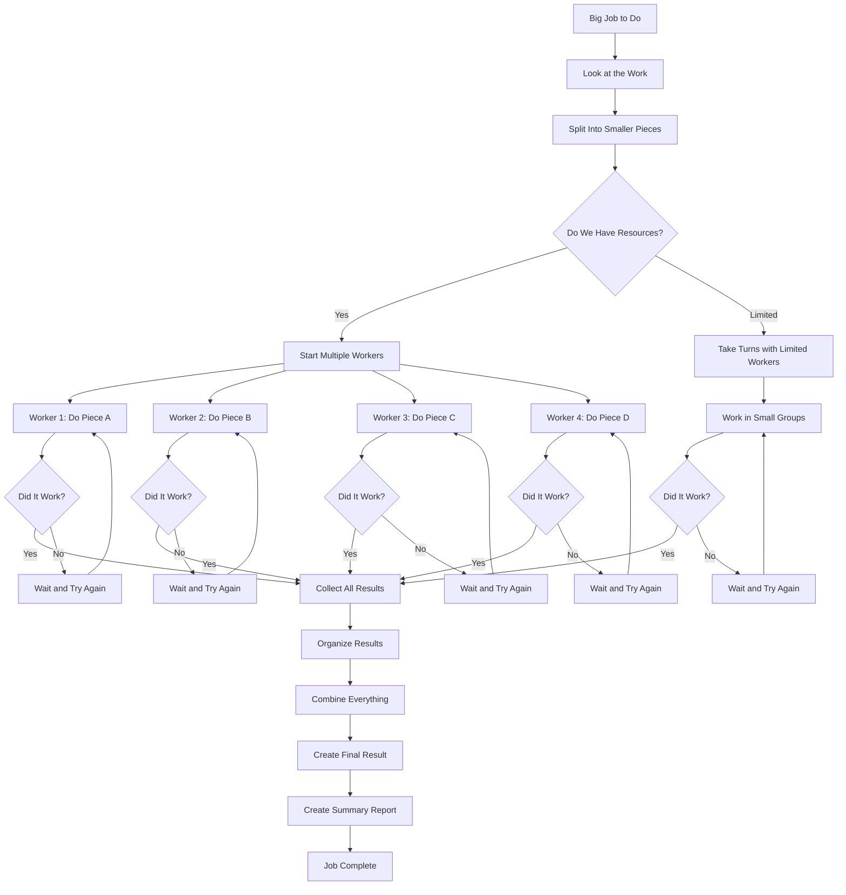
```mermaid
graph TD
    Start[Big Job to Do] --> Look[Look at the Work]
    Look --> Split[Split Into Smaller Pieces]
    Split --> Check{Do We Have Resources?}
    Check -->|Yes| Start_Workers[Start Multiple Workers]
    Check -->|Limited| Queue[Take Turns with Limited Workers]
    Start_Workers --> W1[Worker 1: Do Piece A]
    Start_Workers --> W2[Worker 2: Do Piece B]
    Start_Workers --> W3[Worker 3: Do Piece C]
    Start_Workers --> W4[Worker 4: Do Piece D]
    Queue --> Batch[Work in Small Groups]
    W1 --> Try1{Did It Work?}
    W2 --> Try2{Did It Work?}
    W3 --> Try3{Did It Work?}
    W4 --> Try4{Did It Work?}
    Batch --> Try5{Did It Work?}
    Try1 -->|Yes| Collect[Collect All Results]
    Try1 -->|No| Wait1[Wait and Try Again]
    Try2 -->|Yes| Collect
    Try2 -->|No| Wait2[Wait and Try Again]
    Try3 -->|Yes| Collect
    Try3 -->|No| Wait3[Wait and Try Again]
    Try4 -->|Yes| Collect
    Try4 -->|No| Wait4[Wait and Try Again]
    Try5 -->|Yes| Collect
    Try5 -->|No| Wait5[Wait and Try Again]
    Wait1 --> W1
    Wait2 --> W2
    Wait3 --> W3
    Wait4 --> W4
    Wait5 --> Batch
    Collect --> Organize[Organize Results]
    Organize --> Combine[Combine Everything]
    Combine --> Final[Create Final Result]
    Final --> Summary[Create Summary Report]
    Summary --> End[Job Complete]
```

#### Pros and Cons

| Pros | Cons |
|------|------|
| Dramatic reduction in total processing time | Managing concurrent processes is significantly more complex |
| Failure in one worker doesn't block others | API rate limits and quotas constrain effective parallelism |
| Can show incremental progress as workers complete | Multiple simultaneous API calls multiply cost |
| Dynamically adjustable worker count | Maintaining result ordering when needed requires extra logic |
| Better utilization of available compute | Debugging failures is harder in concurrent execution |
| Naturally scales out with workload | Holding many results in memory can be resource-intensive |

#### Key Concepts

- **Independent units** — tasks must not have data dependencies on each other
- **Concurrent execution** — workers run simultaneously rather than sequentially
- **Rate limiting** — controls concurrent requests to respect API and compute quotas
- **Result aggregation** — merging logic handles deduplication, ordering, and conflict resolution

#### Real-World Example

**Document Intelligence System:**
A legal team needs to analyze a 1,000-page document set. The system splits documents into 50-page chunks, spawns 20 parallel workers (each analyzing 50 pages), applies entity and clause extraction independently, then merges findings into a comprehensive report. Total processing time drops from hours to minutes.

#### Interview Answer Framework

**"When would you use Parallelization vs. Prompt Chaining?"**
> "Parallelization when tasks are independent — analyzing 100 documents in parallel because each analysis doesn't need another document's results. Prompt Chaining when tasks are sequential — step 2 needs step 1's output to proceed. The independence constraint is the deciding factor."

**Related Patterns:** [Prompt Chaining](#1-prompt-chaining) (when tasks are sequential), [Multi-Agent Collaboration](#7-multi-agent-collaboration) (when parallel workers are specialized agents)

---

### 4. Reflection

> **One-line flow:** `Generate → Critique → Revise → Final`

#### What It Is

Reflection is an iterative quality improvement loop: one agent (or agent role) generates an initial output, a separate critic agent evaluates it against a rubric, and a revision agent addresses the feedback. This cycle repeats until the output meets quality criteria or a maximum iteration count is reached.

The power of Reflection comes from **role separation** — the generator is optimized to produce, the critic is optimized to identify flaws, and the reviser is optimized to improve. Using the same agent for all three roles is less effective because generative bias makes self-critique unreliable. In practice, a single model can play all roles with carefully crafted prompts, but separating them architecturally yields better results.

The iteration cap is essential: without it, you can end up in an infinite loop of diminishing improvements at escalating cost.

#### When to Use / Where It Fits

- Quality-critical outputs where accuracy, completeness, or style is non-negotiable
- Complex reasoning tasks where initial attempts are likely to have errors
- Creative work requiring multiple rounds of polish
- Code generation where correctness needs validation
- **Examples:** Technical writing, contract drafting, research reports, API documentation

#### Flowchart

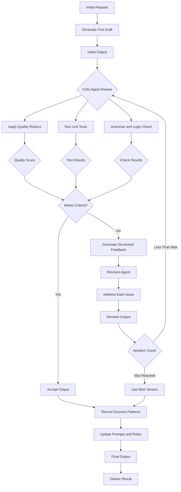
```mermaid
graph TD
    Start[Initial Request] --> Generate[Generate First Draft]
    Generate --> Output1[Initial Output]
    Output1 --> Critic{Critic Agent Review}
    Critic --> Rubric[Apply Quality Rubrics]
    Critic --> Tests[Run Unit Tests]
    Critic --> Check[Grammar and Logic Check]
    Rubric --> Score1{Quality Score}
    Tests --> Score2{Test Results}
    Check --> Score3{Check Results}
    Score1 --> Evaluate{Meets Criteria?}
    Score2 --> Evaluate
    Score3 --> Evaluate
    Evaluate -->|No| Feedback[Generate Structured Feedback]
    Evaluate -->|Yes| Accept[Accept Output]
    Feedback --> Revise[Revision Agent]
    Revise --> Address[Address Each Issue]
    Address --> Output2[Revised Output]
    Output2 --> Counter{Iteration Count}
    Counter -->|Less Than Max| Critic
    Counter -->|Max Reached| Converge[Use Best Version]
    Accept --> Record[Record Success Patterns]
    Converge --> Record
    Record --> Learn[Update Prompts and Rules]
    Learn --> Final[Final Output]
    Final --> End[Deliver Result]
```

#### Pros and Cons

| Pros | Cons |
|------|------|
| Systematic quality improvement through iteration | Each reflection cycle multiplies latency and cost |
| Separation of generation and critique reduces bias | Context window limits constrain how long documents can be reflected on |
| Clear feedback trail for tracing improvements | Diminishing returns — later iterations may improve very little |
| Applies uniform quality standards across all outputs | Risk of over-optimization, stripping voice or nuance |
| Can learn from accepted patterns over time | Requires careful tuning of quality rubrics |
| Adaptable to different quality criteria per use case | Multiple rapid API calls may trigger rate limits |

#### Key Concepts

- **Self-critique** — a dedicated critic agent identifies specific flaws rather than vague feedback
- **Iterative improvement** — multiple revision cycles converge toward a quality threshold
- **Quality rubrics** — explicit criteria (accuracy, completeness, style) guide structured critique
- **Convergence limits** — a maximum iteration count prevents infinite loops and runaway costs

#### Real-World Example

**Contract Generation System:**
1. Generator agent drafts initial contract terms
2. Legal compliance critic reviews for regulatory issues
3. Risk assessment critic flags ambiguous clauses
4. Revision agent addresses each flagged item
5. Clarity critic checks for ambiguity in the revised version
6. This loop continues (max 3 iterations) until all critics pass, or the best version is used

#### Interview Answer Framework

**"When would you use Reflection?"**
> "When the cost of a wrong output is high and latency is not the primary constraint. Legal documents, medical summaries, financial reports — anywhere a human would normally do multiple review passes. The tradeoff is real: each reflection cycle can 2-3x your latency and cost."

**"How does Reflection differ from Reasoning Techniques like Chain-of-Thought?"**
> "Reflection is a multi-turn loop between separate agent roles — generate, critique, revise. Chain-of-Thought is a single-agent reasoning strategy applied within one generation step. You can combine them: use CoT inside the generator, then use Reflection to validate the output."

**Related Patterns:** [Reasoning Techniques](#17-reasoning-techniques) (applied within a single step), [Evaluation and Monitoring](#19-evaluation-and-monitoring) (offline version of quality measurement), [Human-in-the-Loop](#13-human-in-the-loop-hitl) (human critic replaces AI critic for highest-stakes cases)

---

### 5. Tool Use (Function Calling)

> **One-line flow:** `Agent → Select Tool → Call → Process → Continue or Complete`

#### What It Is

Tool Use extends an LLM agent beyond text generation by giving it the ability to call external functions — APIs, databases, calculators, file systems, messaging services, and more. The agent decides *when* to use a tool, *which* tool to use, and *what parameters* to pass, then integrates the tool's response back into its reasoning.

This is the pattern that makes agents genuinely useful: without tools, an agent is limited to its training data and cannot act on the world. With tools, it can look up real-time prices, query databases, send emails, run code, and complete end-to-end workflows.

The engineering discipline here is around **safety and error handling**: tools must be carefully permissioned, inputs validated, responses normalized, and failures caught before they propagate. A tool call that silently returns wrong data is harder to debug than one that fails noisily.

#### When to Use / Where It Fits

- Any task requiring real-time or dynamic information not in the model's training data
- System integration workflows that span databases, APIs, or external services
- Computational tasks requiring precise calculations or deterministic operations
- End-to-end workflows combining LLM reasoning with real-world actions
- **Examples:** Financial analysis assistants, code development helpers, e-commerce order management, research paper assistants

#### Flowchart

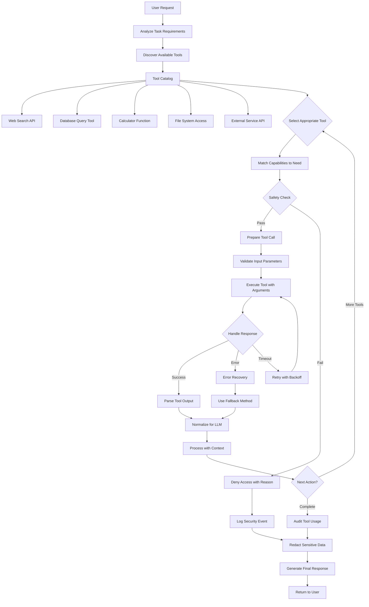
```mermaid
graph TD
    Start[User Request] --> Analyze[Analyze Task Requirements]
    Analyze --> Discover[Discover Available Tools]
    Discover --> Catalog[Tool Catalog]
    Catalog --> API1[Web Search API]
    Catalog --> API2[Database Query Tool]
    Catalog --> API3[Calculator Function]
    Catalog --> API4[File System Access]
    Catalog --> API5[External Service API]
    Catalog --> Select{Select Appropriate Tool}
    Select --> Match[Match Capabilities to Need]
    Match --> Safety{Safety Check}
    Safety -->|Pass| Prepare[Prepare Tool Call]
    Safety -->|Fail| Deny[Deny Access with Reason]
    Prepare --> Validate[Validate Input Parameters]
    Validate --> Call[Execute Tool with Arguments]
    Call --> Handle{Handle Response}
    Handle -->|Success| Parse[Parse Tool Output]
    Handle -->|Error| ErrorHandle[Error Recovery]
    Handle -->|Timeout| Retry[Retry with Backoff]
    ErrorHandle --> Fallback[Use Fallback Method]
    Retry --> Call
    Parse --> Normalize[Normalize for LLM]
    Fallback --> Normalize
    Normalize --> Process[Process with Context]
    Process --> Decision{Next Action?}
    Decision -->|More Tools| Select
    Decision -->|Complete| Audit[Audit Tool Usage]
    Deny --> Log[Log Security Event]
    Audit --> Redact[Redact Sensitive Data]
    Log --> Redact
    Redact --> Result[Generate Final Response]
    Result --> End[Return to User]
```

#### Pros and Cons

| Pros | Cons |
|------|------|
| Enables real-time data access beyond training knowledge | Tool access requires careful security controls and sandboxing |
| Exact calculations and deterministic operations | Tool failures can break entire downstream workflows |
| Seamless integration with existing enterprise systems | Each tool call adds latency and potential API cost |
| Complete end-to-end automation without human intervention | Tool schemas and error handling add significant complexity |
| Dynamic tool selection based on task context | Credentials and sensitive data require careful handling |
| Full audit trail of all tool usage and parameters | Dependency on external service availability and reliability |

#### Key Concepts

- **Function calling** — the model outputs structured JSON specifying tool name and parameters, the runtime executes the call
- **Tool discovery** — agent consults a catalog of available tools with descriptions and schemas
- **Error handling** — tool failures trigger fallback paths before propagating errors to the user
- **Result integration** — tool outputs are normalized and injected back into the model's context

#### Real-World Example

**Financial Analysis Assistant:**
The agent receives "Analyze Tesla's current stock position relative to its 52-week moving average." It calls: (1) a stock price API for real-time quotes, (2) a database query for historical price data, (3) a calculator function for moving average computation, (4) a chart generation tool for visualization, and (5) an email API to distribute the report. Each tool call is logged for compliance.

#### Interview Answer Framework

**"How do you handle tool failures in a Tool Use pattern?"**
> "You classify errors: transient errors (timeouts, rate limits) get exponential backoff retries; permanent errors (invalid parameters, missing permissions) go directly to fallback; critical errors trigger state preservation and human escalation. The key is failing loudly and locally rather than silently propagating bad data downstream."

**Related Patterns:** [Prompt Chaining](#1-prompt-chaining) (tools used inside chain steps), [Multi-Agent Collaboration](#7-multi-agent-collaboration) (each agent has its own tool set), [MCP](#10-model-context-protocol-mcp) (standardized tool discovery)

---

## Advanced Patterns

---

### 6. Planning

> **One-line flow:** `Goal → Milestones → Execute → Monitor → Adapt`

#### What It Is

Planning transforms a goal into a structured execution plan before any work begins. The planner decomposes a high-level objective into milestones, identifies dependencies between steps, allocates resources and tools per step, and establishes checkpoints for progress tracking. This makes the agent proactive rather than reactive.

The key distinction from Prompt Chaining is **dynamic adaptability**: a plan can be revised mid-execution when new information surfaces (a blocked step, a changed requirement, a discovered resource constraint). Prompt Chaining has a fixed sequence; Planning has a living plan.

The post-mortem step is often overlooked but is valuable — capturing what worked and what didn't turns each planning execution into training data for better future plans.

#### When to Use / Where It Fits

- Complex multi-step projects with dependencies and multiple phases
- Long-running processes that span extended timeframes
- Resource-constrained operations requiring budget and time management
- Collaborative tasks coordinating multiple agents or tools
- **Examples:** Software feature development, marketing campaign execution, academic research projects, data migration projects

#### Flowchart

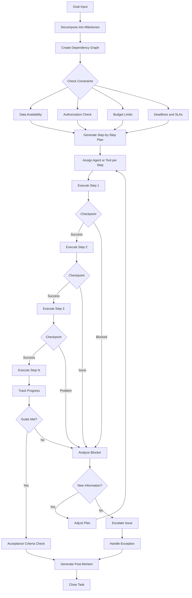
```mermaid
graph TD
    Start[Goal Input] --> Decompose[Decompose into Milestones]
    Decompose --> Map[Create Dependency Graph]
    Map --> Constraints{Check Constraints}
    Constraints --> Data[Data Availability]
    Constraints --> Auth[Authorization Check]
    Constraints --> Budget[Budget Limits]
    Constraints --> Time[Deadlines and SLAs]
    Data --> Plan[Generate Step-by-Step Plan]
    Auth --> Plan
    Budget --> Plan
    Time --> Plan
    Plan --> Assign[Assign Agent or Tool per Step]
    Assign --> Step1[Execute Step 1]
    Step1 --> Check1{Checkpoint}
    Check1 -->|Success| Step2[Execute Step 2]
    Check1 -->|Blocked| Analyze[Analyze Blocker]
    Step2 --> Check2{Checkpoint}
    Check2 -->|Success| Step3[Execute Step 3]
    Check2 -->|Issue| Analyze
    Step3 --> Check3{Checkpoint}
    Check3 -->|Success| StepN[Execute Step N]
    Check3 -->|Problem| Analyze
    Analyze --> NewInfo{New Information?}
    NewInfo -->|Yes| Replan[Adjust Plan]
    NewInfo -->|No| Escalate[Escalate Issue]
    Replan --> Assign
    Escalate --> Handle[Handle Exception]
    StepN --> Progress[Track Progress]
    Progress --> Complete{Goals Met?}
    Complete -->|Yes| Accept[Acceptance Criteria Check]
    Complete -->|No| Analyze
    Accept --> PostMortem[Generate Post-Mortem]
    Handle --> PostMortem
    PostMortem --> End[Close Task]
```

#### Pros and Cons

| Pros | Cons |
|------|------|
| Transforms reactive agents into proactive planners | Planning phase adds initial latency before any work begins |
| Handles complex task interdependencies explicitly | Over-planning can reduce flexibility for dynamic tasks |
| Provides clear progress visibility via milestones | Initial plans based on incorrect assumptions require expensive replanning |
| Plans can be templated and reused across similar projects | Long plans may exceed context window limits |
| Early identification of blockers and resource constraints | Managing plan state across distributed execution adds complexity |

#### Key Concepts

- **Milestone mapping** — the goal is broken into measurable intermediate deliverables
- **Dependency tracking** — identifies which steps must complete before others can start
- **Resource allocation** — assigns agents, tools, and budgets to each step at planning time
- **Adaptive replanning** — mid-execution plan revision when blockers or new information emerge

#### Real-World Example

**Software Feature Development:**
1. Planning phase: Requirements → Design → Implementation tasks → Testing plan → Deployment checklist → Rollback plan
2. Execution: Each milestone has an assigned agent (Requirements Agent, Design Agent, Code Agent, Test Agent)
3. When the Code Agent discovers a dependency on an external service not yet available, the planner replans the Implementation milestone to add a mock step
4. Post-mortem captures actual vs. estimated duration per step for future planning accuracy

#### Interview Answer Framework

**"How does Planning differ from simple Prompt Chaining?"**
> "Prompt Chaining has a fixed sequence defined upfront. Planning creates a dependency graph that can be revised mid-execution. A chain breaks if a step fails unexpectedly; a planner can reorder, skip, or add steps dynamically based on what it discovers."

**Related Patterns:** [Prompt Chaining](#1-prompt-chaining) (fixed sequential execution), [Goal Setting and Monitoring](#11-goal-setting-and-monitoring) (measuring progress toward plan goals), [Multi-Agent Collaboration](#7-multi-agent-collaboration) (planning assigns work to multiple agents)

---

### 7. Multi-Agent Collaboration

> **One-line flow:** `Coordinator → [Specialist A | Specialist B | Specialist C] → Validate → Output`

#### What It Is

Multi-Agent Collaboration assigns distinct specialist roles to separate agents and orchestrates them to work on a complex task that no single agent could handle optimally. Each agent is tuned for its domain — a Research Agent knows how to search and summarize, a Writer Agent knows how to structure narrative, a Reviewer Agent knows quality criteria.

Three coordination protocols exist:
- **Orchestrator pattern:** A coordinator agent manages the flow, assigns tasks, and handles handoffs
- **Mesh pattern:** Agents communicate peer-to-peer, self-organizing around the task
- **Pipeline pattern:** Agents pass work sequentially in a fixed order (similar to Prompt Chaining but with specialized agents)

The shared memory store and artifact repository are what allow agents to build on each other's work without redundant processing.

#### When to Use / Where It Fits

- Complex, multi-faceted tasks requiring diverse expertise
- Large projects benefiting from division of labor and parallel workstreams
- Tasks requiring iterative refinement across multiple dimensions (content, accuracy, compliance, style)
- **Examples:** Automated news production, investment analysis, legal document review, software bug resolution

#### Flowchart

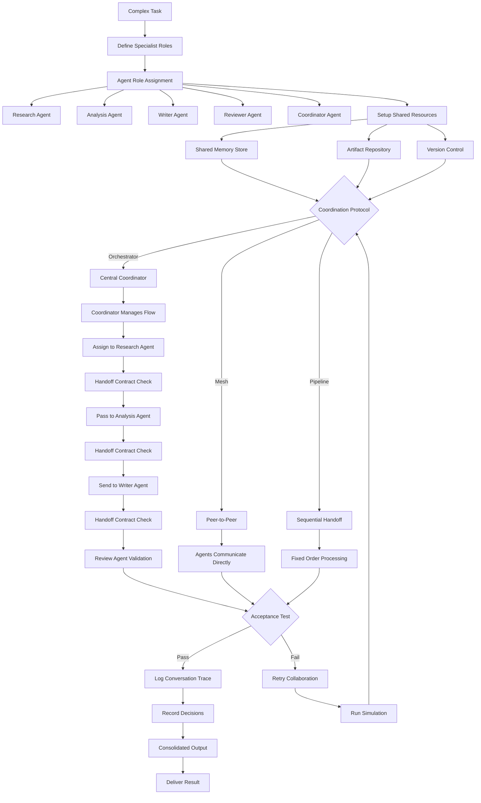
```mermaid
graph TD
    Start[Complex Task] --> Define[Define Specialist Roles]
    Define --> Roles[Agent Role Assignment]
    Roles --> A1[Research Agent]
    Roles --> A2[Analysis Agent]
    Roles --> A3[Writer Agent]
    Roles --> A4[Reviewer Agent]
    Roles --> A5[Coordinator Agent]
    Roles --> Setup[Setup Shared Resources]
    Setup --> Memory[Shared Memory Store]
    Setup --> Artifacts[Artifact Repository]
    Setup --> Version[Version Control]
    Memory --> Protocol{Coordination Protocol}
    Artifacts --> Protocol
    Version --> Protocol
    Protocol -->|Orchestrator| Orchestrate[Central Coordinator]
    Protocol -->|Mesh| Mesh[Peer-to-Peer]
    Protocol -->|Pipeline| Pipeline[Sequential Handoff]
    Orchestrate --> Coord[Coordinator Manages Flow]
    Coord --> Task1[Assign to Research Agent]
    Task1 --> Hand1[Handoff Contract Check]
    Hand1 --> Task2[Pass to Analysis Agent]
    Task2 --> Hand2[Handoff Contract Check]
    Hand2 --> Task3[Send to Writer Agent]
    Task3 --> Hand3[Handoff Contract Check]
    Hand3 --> Task4[Review Agent Validation]
    Mesh --> Peer[Agents Communicate Directly]
    Pipeline --> Sequence[Fixed Order Processing]
    Task4 --> Test{Acceptance Test}
    Peer --> Test
    Sequence --> Test
    Test -->|Pass| Log[Log Conversation Trace]
    Test -->|Fail| Retry[Retry Collaboration]
    Retry --> Simulate[Run Simulation]
    Simulate --> Protocol
    Log --> Decision[Record Decisions]
    Decision --> Output[Consolidated Output]
    Output --> End[Deliver Result]
```

#### Pros and Cons

| Pros | Cons |
|------|------|
| Each agent can be independently optimized for its role | Coordinating agents across a shared task is architecturally complex |
| Multiple agents can work in parallel | Multiple API calls multiply token costs and latency |
| Failure of one agent doesn't crash the entire system | Maintaining consistent shared state across agents is hard |
| Agents can be updated independently without system-wide changes | Debugging issues that span multiple agents is time-consuming |
| Multiple perspectives and validation steps improve output quality | Handoff failures can silently degrade output quality |

#### Key Concepts

- **Specialist roles** — each agent has a narrowly defined responsibility it is optimized for
- **Shared context** — a common memory store and artifact repository prevents redundant work
- **Handoff protocols** — explicit contracts between agents define what each agent receives and returns
- **Orchestration patterns** — Orchestrator, Mesh, and Pipeline each have different latency/flexibility tradeoffs

#### Real-World Example

**Automated News Production:**
- News Gatherer Agent: collects breaking news from 50+ sources
- Fact Checker Agent: verifies claims and sources in parallel
- Writer Agent: drafts article with proper structure using verified facts
- Editor Agent: improves clarity, headline, and structure
- SEO Agent: optimizes keywords and meta description
- Publisher Agent: formats and publishes to CMS

The Coordinator Agent manages the flow, the Shared Memory stores the verified facts, and each handoff has a contract (e.g., Writer needs verified_facts[], source_urls[]).

#### Interview Answer Framework

**"When would you use Multi-Agent over a single well-prompted agent?"**
> "When the task genuinely requires different expertise that conflicts within a single context. A Research Agent needs a 'be comprehensive' mindset; an Editor Agent needs a 'be selective' mindset. Putting them in the same agent creates tension. Also when scale requires parallel processing — you can't run 5 simultaneous analysis threads in one agent."

**Related Patterns:** [Routing](#2-routing) (determines which team gets the task), [A2A Communication](#15-inter-agent-communication-a2a) (the messaging protocol between agents), [Parallelization](#3-parallelization) (when agents work on truly independent pieces)

---

### 8. Memory Management

> **One-line flow:** `Input → Classify → Store → Retrieve → Use → Update`

#### What It Is

Memory Management gives agents persistent context across conversations, sessions, and time. Without memory, every interaction starts from scratch — the agent has no idea who you are, what you've asked before, or what decisions were made last week. With memory, the agent accumulates a rich context that enables personalization, continuity, and genuine learning from experience.

The three memory tiers model the way humans remember:
- **Short-term (working memory):** The current conversation buffer. Fast, temporary, context-window sized.
- **Episodic memory:** Specific past events and interactions, stored and indexed for later retrieval (e.g., "last Tuesday you asked about X").
- **Long-term memory:** Generalized knowledge, preferences, and patterns extracted from many episodes (e.g., "this user prefers concise answers").

The lifecycle involves classification (what type of memory is this?), indexing with metadata (recency, frequency, topic tags), TTL management (when to expire stale memories), and privacy filtering (what should never be stored).

#### When to Use / Where It Fits

- Conversational agents requiring continuity across sessions
- Personalization use cases where user preferences should be remembered
- Complex multi-session workflows (e.g., a research project spanning weeks)
- Customer service systems where prior issue history is relevant
- **Examples:** Personal assistants, educational tutors, customer support bots, project management assistants

#### Flowchart

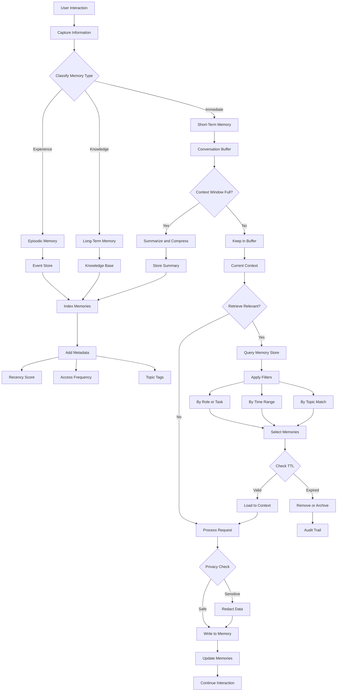
```mermaid
graph TD
    Start[User Interaction] --> Capture[Capture Information]
    Capture --> Classify{Classify Memory Type}
    Classify -->|Immediate| ShortTerm[Short-Term Memory]
    Classify -->|Experience| Episodic[Episodic Memory]
    Classify -->|Knowledge| LongTerm[Long-Term Memory]
    ShortTerm --> Buffer[Conversation Buffer]
    Episodic --> Events[Event Store]
    LongTerm --> Knowledge[Knowledge Base]
    Buffer --> Compress{Context Window Full?}
    Compress -->|Yes| Summarize[Summarize and Compress]
    Compress -->|No| Keep[Keep in Buffer]
    Summarize --> Store[Store Summary]
    Keep --> Current[Current Context]
    Events --> Index[Index Memories]
    Knowledge --> Index
    Store --> Index
    Index --> Metadata[Add Metadata]
    Metadata --> Recency[Recency Score]
    Metadata --> Frequency[Access Frequency]
    Metadata --> Topic[Topic Tags]
    Current --> Retrieve{Retrieve Relevant?}
    Retrieve -->|Yes| Query[Query Memory Store]
    Retrieve -->|No| Process[Process Request]
    Query --> Filter[Apply Filters]
    Filter --> Role[By Role or Task]
    Filter --> Time[By Time Range]
    Filter --> Relevance[By Topic Match]
    Role --> Select[Select Memories]
    Time --> Select
    Relevance --> Select
    Select --> TTL{Check TTL}
    TTL -->|Expired| Forget[Remove or Archive]
    TTL -->|Valid| Load[Load to Context]
    Forget --> Audit[Audit Trail]
    Load --> Process
    Process --> Privacy{Privacy Check}
    Privacy -->|Sensitive| Redact[Redact Data]
    Privacy -->|Safe| Write[Write to Memory]
    Redact --> Write
    Write --> Update[Update Memories]
    Update --> End[Continue Interaction]
```

#### Pros and Cons

| Pros | Cons |
|------|------|
| Maintains conversation continuity across sessions | Storage requires database infrastructure with associated costs |
| Enables deeply personalized responses | Storing user data raises significant privacy and compliance concerns |
| Avoids repeating previous work in multi-session flows | Retrieval of relevant memories from a large store is non-trivial |
| Builds accumulated knowledge and improves over time | Old memories may become outdated or actively misleading |
| More natural, human-like interactions | Memory operations add latency to every request |
| Handles complex multi-step processes with state | Synchronizing memory across distributed systems is complex |

#### Key Concepts

- **Memory types** — short-term (conversation buffer), episodic (past events), long-term (learned preferences and knowledge)
- **Context compression** — when the context window fills, old content is summarized and archived rather than dropped
- **Selective retrieval** — not all memories are loaded every time; relevance filters reduce context noise
- **Privacy and TTL** — sensitive data is redacted before storage; memories expire after a configured time-to-live

#### Real-World Example

**Medical Consultation Bot:**
- Short-term: current symptom discussion
- Episodic: last appointment notes, recent test results
- Long-term: chronic conditions, allergies, medication history, preferred communication style
- HIPAA-compliant: all health data is encrypted at rest, access-controlled, and audited
- TTL: appointment notes expire after 90 days; chronic conditions are permanent

#### Interview Answer Framework

**"How does Memory differ from RAG?"**
> "Memory is the agent's personal history — what it remembers about *this user's* past interactions, preferences, and decisions. RAG is querying a shared external knowledge base that everyone can access. Memory is about who you are; RAG is about what the knowledge base contains. In production systems you often use both together."

**Related Patterns:** [Knowledge Retrieval (RAG)](#14-knowledge-retrieval-rag) (external knowledge vs. personal memory), [Learning and Adaptation](#9-learning-and-adaptation) (upgrading long-term memory patterns into model improvements)

---

### 9. Learning and Adaptation

> **One-line flow:** `Feedback → Validate → Learn → Test → Deploy`

#### What It Is

Learning and Adaptation closes the loop between an agent's outputs and its future behavior. Rather than operating on static prompts and policies forever, the agent collects feedback signals — human corrections, quality ratings, automated evaluations, task outcomes — validates that signal for quality and adversarial content, then applies it via one of several learning mechanisms: updated prompts, new few-shot examples, adjusted decision policies, or fine-tuned model weights.

The key engineering discipline is **feedback validation**: not all feedback is trustworthy. Malicious actors can try to poison the learning pipeline, and even well-intentioned users can provide noisy or contradictory signals. A data quality gate that filters noise and rejects adversarial inputs is essential before any learning takes place.

The A/B testing step before deployment ensures that changes actually improve performance rather than causing regressions on previously working scenarios.

#### When to Use / Where It Fits

- Systems where performance should improve over time with use
- Personalization that adapts to individual users or domains
- Domain specialization where the agent needs to learn custom conventions
- Error reduction by learning to avoid repeated mistakes
- **Examples:** Customer support chatbots, code review assistants, content writing assistants, recommendation engines

#### Flowchart

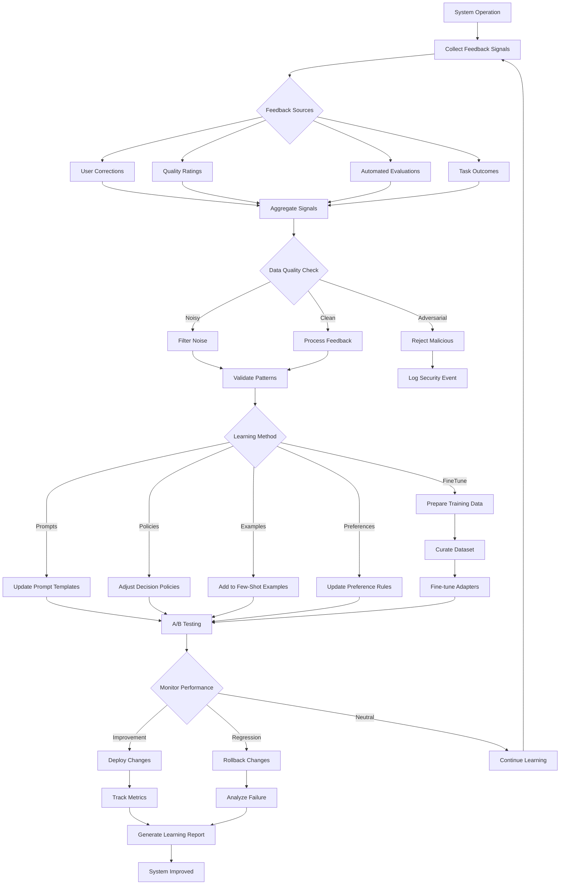
```mermaid
graph TD
    Start[System Operation] --> Collect[Collect Feedback Signals]
    Collect --> Sources{Feedback Sources}
    Sources --> User[User Corrections]
    Sources --> Ratings[Quality Ratings]
    Sources --> Evals[Automated Evaluations]
    Sources --> Outcomes[Task Outcomes]
    User --> Aggregate[Aggregate Signals]
    Ratings --> Aggregate
    Evals --> Aggregate
    Outcomes --> Aggregate
    Aggregate --> Clean{Data Quality Check}
    Clean -->|Noisy| Filter[Filter Noise]
    Clean -->|Adversarial| Reject[Reject Malicious]
    Clean -->|Clean| Process[Process Feedback]
    Filter --> Validate[Validate Patterns]
    Reject --> Log[Log Security Event]
    Process --> Validate
    Validate --> Learn{Learning Method}
    Learn -->|Prompts| UpdatePrompts[Update Prompt Templates]
    Learn -->|Policies| UpdatePolicies[Adjust Decision Policies]
    Learn -->|Examples| AddExamples[Add to Few-Shot Examples]
    Learn -->|Preferences| UpdatePrefs[Update Preference Rules]
    Learn -->|FineTune| PrepareData[Prepare Training Data]
    UpdatePrompts --> Test[A/B Testing]
    UpdatePolicies --> Test
    AddExamples --> Test
    UpdatePrefs --> Test
    PrepareData --> Curate[Curate Dataset]
    Curate --> Train[Fine-tune Adapters]
    Train --> Test
    Test --> Monitor{Monitor Performance}
    Monitor -->|Improvement| Deploy[Deploy Changes]
    Monitor -->|Regression| Rollback[Rollback Changes]
    Monitor -->|Neutral| Iterate[Continue Learning]
    Deploy --> Track[Track Metrics]
    Rollback --> Analyze[Analyze Failure]
    Iterate --> Collect
    Track --> Report[Generate Learning Report]
    Analyze --> Report
    Report --> End[System Improved]
```

#### Pros and Cons

| Pros | Cons |
|------|------|
| System continuously improves with real-world use | Entirely dependent on the quality and reliability of feedback signals |
| Adapts to specific users, domains, or contexts over time | Fine-tuning and testing cycles require significant compute resources |
| Reduces repeated errors by learning from past mistakes | Changes can cause regressions on previously working scenarios |
| Learns organizational conventions and standards automatically | Requires sufficient feedback volume before learning is statistically reliable |
| Handles concept drift as requirements change over time | Vulnerable to adversarial feedback that poisons the learning pipeline |

#### Key Concepts

- **Feedback collection** — multiple signal types (user corrections, ratings, outcomes) provide richer training signal
- **Signal validation** — noise filtering and adversarial rejection protect learning pipeline integrity
- **Multiple learning paths** — prompt updates, few-shot examples, and fine-tuning each have different cost/impact tradeoffs
- **Performance monitoring** — A/B testing and regression detection before every deployment

#### Real-World Example

**Code Review Assistant:**
- Collects: accepted/rejected suggestions, developer edit diffs, team member ratings
- Validates: filters out suggestions rejected by only one contrarian reviewer
- Learns: adds accepted suggestion patterns as few-shot examples; fine-tunes on approved code diffs
- Tests: A/B test against previous version on held-out code review samples
- Deploys: if acceptance rate improves by >5%, deploy; else rollback

#### Interview Answer Framework

**"How do you prevent the learning pipeline from being poisoned?"**
> "Multi-signal validation — if one reviewer consistently rates things differently from everyone else, down-weight their signal. Require consensus across multiple feedback sources before updating prompts. Reject signals that contradict established safety policies immediately. Rate-limit how quickly learned changes can propagate to production."

**Related Patterns:** [Evaluation and Monitoring](#19-evaluation-and-monitoring) (measuring what to improve), [Memory Management](#8-memory-management) (storing learned user preferences), [Reflection](#4-reflection) (per-request quality improvement vs. system-level learning)

---

### 10. Model Context Protocol (MCP)

> **One-line flow:** `Registry → Discover → Authorize → Call → Track → Version`

#### What It Is

Model Context Protocol (MCP) is a standardized interface specification that allows AI agents to dynamically discover, authenticate, and interact with tools, data sources, and services in a consistent, enterprise-grade way. Instead of hardcoding tool integrations, agents query an MCP registry to discover what tools are available, what they do, and what permissions are required.

MCP is analogous to an API gateway or service mesh, but purpose-built for AI agent integrations. It solves the "N×M integration problem": without MCP, each of N agents needs custom code to integrate with each of M tools. With MCP, each tool registers once, and all agents can discover and use it via the standard protocol.

The versioning mechanism is critical for enterprise deployments: tools evolve, APIs change, and agents need to gracefully handle deprecated tool versions without breaking.

#### When to Use / Where It Fits

- Enterprise AI platforms with many tool integrations
- Multi-vendor environments where different AI services need to interoperate
- Microservices architectures where agents access distributed services
- Security-sensitive deployments requiring fine-grained access control and audit logging
- **Examples:** Enterprise data platforms, multi-cloud AI services, healthcare AI systems, financial services platforms

#### Flowchart

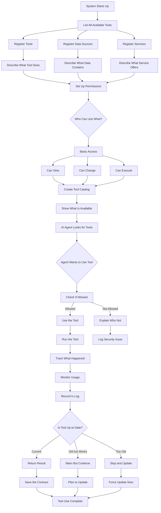
```mermaid
graph TD
    Start[System Starts Up] --> List[List All Available Tools]
    List --> Tools[Register Tools]
    List --> Data[Register Data Sources]
    List --> Services[Register Services]
    Tools --> Describe1[Describe What Tool Does]
    Data --> Describe2[Describe What Data Contains]
    Services --> Describe3[Describe What Service Offers]
    Describe1 --> Setup[Set Up Permissions]
    Describe2 --> Setup
    Describe3 --> Setup
    Setup --> Control{Who Can Use What?}
    Control --> Basic[Basic Access]
    Basic --> Read[Can View]
    Basic --> Write[Can Change]
    Basic --> Run[Can Execute]
    Read --> Catalog[Create Tool Catalog]
    Write --> Catalog
    Run --> Catalog
    Catalog --> Available[Show What Is Available]
    Available --> Agent[AI Agent Looks for Tools]
    Agent --> Request{Agent Wants to Use Tool}
    Request --> Check[Check If Allowed]
    Check -->|Allowed| Use[Use the Tool]
    Check -->|Not Allowed| Deny[Explain Why Not]
    Use --> Execute[Run the Tool]
    Deny --> Log_Security[Log Security Issue]
    Execute --> Track[Track What Happened]
    Track --> Monitor[Monitor Usage]
    Monitor --> Record[Record in Log]
    Record --> Version{Is Tool Up to Date?}
    Version -->|Current| Success[Return Result]
    Version -->|Old but Works| Warning[Warn But Continue]
    Version -->|Too Old| Error[Stop and Update]
    Success --> Save[Save the Contract]
    Warning --> Update_Soon[Plan to Update]
    Error --> Must_Update[Force Update Now]
    Save --> End[Tool Use Complete]
    Update_Soon --> End
    Must_Update --> End
```

#### Pros and Cons

| Pros | Cons |
|------|------|
| Universal interface eliminates per-tool custom integration | Requires significant upfront protocol setup and schema definition |
| Agents dynamically discover new tools without code changes | Additional abstraction layer adds latency to every tool call |
| Built-in authentication, authorization, and audit logging | Teams need to learn MCP concepts before building |
| Graceful versioning handles API evolution without breaking agents | Existing integrations need conversion to the MCP standard |
| Designed and tested for enterprise-grade scale | Debugging issues requires understanding the additional MCP layer |

#### Key Concepts

- **Standardized interface** — tools, data sources, and services all expose the same protocol to agents
- **Resource discovery** — agents query the registry to find available tools without hardcoded knowledge
- **Permission scoping** — fine-grained access control (read/write/execute) per agent per tool
- **Version management** — protocol handles deprecated and updated tool versions gracefully

#### Real-World Example

**Enterprise Data Platform:**
An AI agent needs to analyze sales data. Via MCP, it discovers: a Salesforce connector (read access), a data warehouse query tool (read access), a chart generation service (write access), and a Slack notifier (write access). The agent never needs to know the underlying API details — MCP handles authentication, parameter validation, and audit logging for all of them.

#### Interview Answer Framework

**"When would you implement MCP vs. direct API calls?"**
> "MCP makes sense when you have 5+ integrations and multiple agents that need to share them. The setup cost amortizes quickly at that scale. For 1–2 integrations used by a single agent, direct API calls with a well-designed error handler are simpler and faster."

**Related Patterns:** [Tool Use](#5-tool-use-function-calling) (tools are accessed via MCP in enterprise contexts), [Inter-Agent Communication (A2A)](#15-inter-agent-communication-a2a) (MCP for tools; A2A for agent-to-agent messaging)

---

## System Patterns

---

### 11. Goal Setting and Monitoring

> **One-line flow:** `SMART Goal → KPIs → Execute → Monitor → Detect Drift → Adapt`

#### What It Is

Goal Setting and Monitoring gives autonomous agents a persistent, measurable objective and equips them with the instrumentation to track progress, detect when they are drifting off course, and trigger corrective action. Without this pattern, agents complete individual tasks without any awareness of whether they are collectively contributing to the desired outcome.

The SMART framework (Specific, Measurable, Achievable, Relevant, Time-bound) is used to define goals that can actually be monitored. Vague goals like "improve customer satisfaction" cannot be automatically monitored; a SMART version is "achieve a CSAT score ≥ 4.2 within 30 days at a cost per interaction ≤ $0.50."

The monitoring loop continuously compares actual KPIs to targets, detects drift, and triggers either automatic corrective actions (adjust plan, reallocate resources) or human escalation for goal changes.

#### When to Use / Where It Fits

- Autonomous agents working independently toward business objectives
- Complex multi-step projects requiring progress tracking
- SLA-bound operations where metric breaches have consequences
- Cost-constrained operations that must stay within budget
- **Examples:** Sales automation, content publishing platforms, DevOps pipelines, customer service centers, supply chain optimization

#### Flowchart

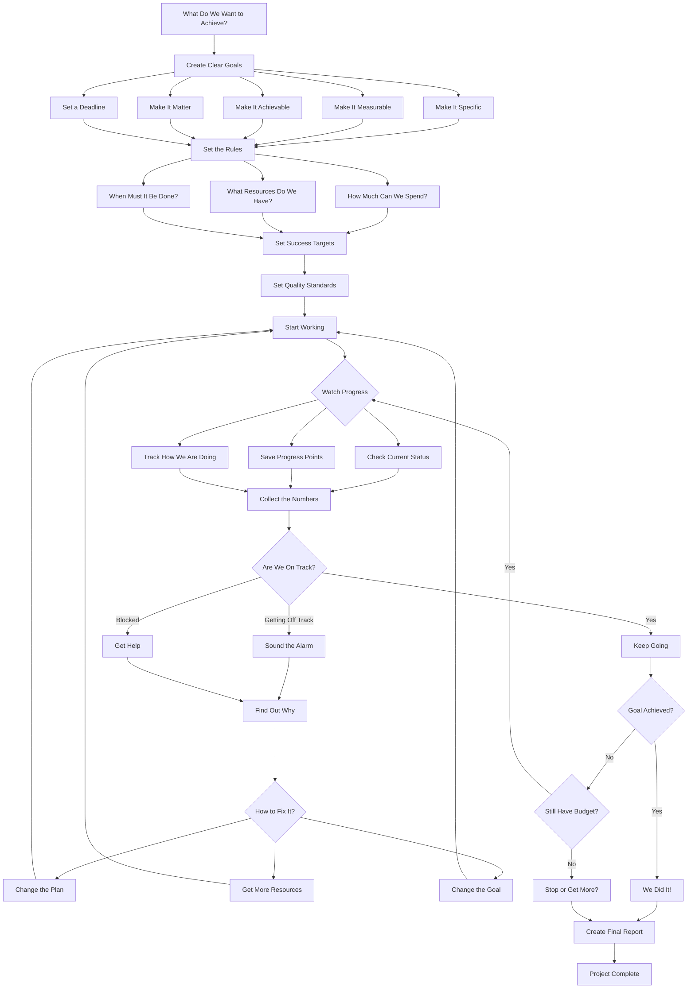
```mermaid
graph TD
    Start[What Do We Want to Achieve?] --> Create[Create Clear Goals]
    Create --> Specific[Make It Specific]
    Create --> Measurable[Make It Measurable]
    Create --> Achievable[Make It Achievable]
    Create --> Relevant[Make It Matter]
    Create --> TimeBound[Set a Deadline]
    Specific --> Rules[Set the Rules]
    Measurable --> Rules
    Achievable --> Rules
    Relevant --> Rules
    TimeBound --> Rules
    Rules --> Budget[How Much Can We Spend?]
    Rules --> Resources[What Resources Do We Have?]
    Rules --> Deadline[When Must It Be Done?]
    Budget --> Targets[Set Success Targets]
    Resources --> Targets
    Deadline --> Targets
    Targets --> Quality[Set Quality Standards]
    Quality --> Start_Work[Start Working]
    Start_Work --> Watch{Watch Progress}
    Watch --> Status[Check Current Status]
    Watch --> Save[Save Progress Points]
    Watch --> Track[Track How We Are Doing]
    Status --> Numbers[Collect the Numbers]
    Save --> Numbers
    Track --> Numbers
    Numbers --> Compare{Are We On Track?}
    Compare -->|Yes| Continue[Keep Going]
    Compare -->|Getting Off Track| Alert[Sound the Alarm]
    Compare -->|Blocked| Escalate[Get Help]
    Alert --> Why[Find Out Why]
    Escalate --> Why
    Why --> Fix{How to Fix It?}
    Fix --> Adjust[Change the Plan]
    Fix --> More_Resources[Get More Resources]
    Fix --> Change_Goal[Change the Goal]
    Adjust --> Start_Work
    More_Resources --> Start_Work
    Change_Goal --> Start_Work
    Continue --> Done{Goal Achieved?}
    Done -->|Yes| Success[We Did It!]
    Done -->|No| Check_Budget{Still Have Budget?}
    Check_Budget -->|Yes| Watch
    Check_Budget -->|No| Decision[Stop or Get More?]
    Success --> Report[Create Final Report]
    Decision --> Report
    Report --> End[Project Complete]
```

#### Pros and Cons

| Pros | Cons |
|------|------|
| Agents work toward clear, measurable objectives | Continuous monitoring adds system overhead and resource consumption |
| Enables self-assessment and autonomous course correction | Some goals are genuinely hard to quantify (creativity, relationship quality) |
| Proactive drift detection before problems become critical | Risk of optimizing wrong metrics ("teaching to the test") |
| Clear accountability with quantifiable success criteria | Multiple conflicting goals can pull the agent in different directions |
| Resource allocation optimized against measured progress | Goal management logic adds architectural complexity |

#### Key Concepts

- **SMART objectives** — goals must be Specific, Measurable, Achievable, Relevant, and Time-bound to be monitorable
- **Continuous monitoring** — KPI collection runs as a background loop, not a one-time check
- **Drift detection** — statistical comparison of current trend vs. target trajectory, not just point-in-time comparison
- **Adaptive mitigation** — plan adjustment, resource reallocation, or goal renegotiation when drift is detected

#### Real-World Example

**DevOps Pipeline Agent:**
Goal: "Deploy 3× per week, MTTR < 30 minutes, test coverage > 85%, cost per deployment < $50."
- KPIs tracked: deployment frequency, MTTR, coverage %, deployment cost
- Drift detected: MTTR trending toward 45 minutes over the past week
- Corrective action: automatically increase monitoring granularity, flag slow test suites, propose alert threshold reduction

#### Interview Answer Framework

**"How does Goal Setting and Monitoring relate to Evaluation and Monitoring?"**
> "Goal Setting is about the agent knowing what it's trying to achieve — the business objective. Evaluation and Monitoring is about measuring the quality of the system itself — are outputs accurate, is the model drifting? They're complementary: Goal Monitoring tells you if you're achieving business value; Evaluation tells you if the AI system is working correctly."

**Related Patterns:** [Planning](#6-planning) (plans are the execution strategy for goals), [Evaluation and Monitoring](#19-evaluation-and-monitoring) (system-level quality measurement vs. goal achievement)

---

### 12. Exception Handling and Recovery

> **One-line flow:** `Try → Error → Classify → Retry/Fallback/Escalate → Record → Learn`

#### What It Is

Exception Handling and Recovery makes agentic systems production-grade by giving them a principled response to every failure mode. Without this pattern, a single API timeout, a malformed response, or a quota exhaustion can bring the entire system to a halt. With it, the system classifies each error, applies the appropriate recovery strategy, preserves state for resumption, and learns from error patterns over time.

The error classification taxonomy is the foundation:
- **Transient errors** (timeouts, rate limits, network blips) → exponential backoff retry
- **Permanent errors** (invalid parameters, missing permissions, malformed data) → immediate fallback without retrying
- **Critical errors** (data corruption, security violations, resource exhaustion) → state preservation + emergency escalation

Exponential backoff with jitter is the standard retry strategy: wait 2^n seconds plus random jitter between attempts, so multiple failing clients don't all retry simultaneously and worsen the problem.

#### When to Use / Where It Fits

- Any production system relying on external APIs or services
- Financial transactions and other operations requiring integrity guarantees
- Long-running pipelines where partial progress must be preserved
- IoT and network-dependent systems with connectivity variability
- **Examples:** Payment processing, data integration pipelines, chatbot customer service, content delivery, ML pipelines

#### Flowchart

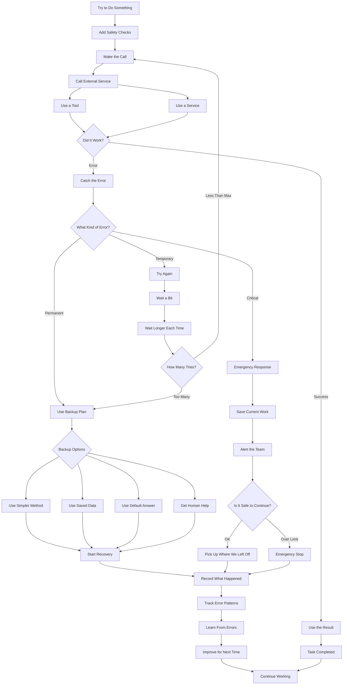
```mermaid
graph TD
    Start[Try to Do Something] --> Wrap[Add Safety Checks]
    Wrap --> Call[Make the Call]
    Call --> External[Call External Service]
    External --> Tool[Use a Tool]
    External --> Service[Use a Service]
    Tool --> Result{Did It Work?}
    Service --> Result
    Result -->|Success| Process[Use the Result]
    Result -->|Error| Catch[Catch the Error]
    Catch --> WhatKind{What Kind of Error?}
    WhatKind -->|Temporary| Retry[Try Again]
    WhatKind -->|Permanent| Backup[Use Backup Plan]
    WhatKind -->|Critical| Emergency[Emergency Response]
    Retry --> Wait[Wait a Bit]
    Wait --> AddTime[Wait Longer Each Time]
    AddTime --> Count{How Many Tries?}
    Count -->|Less Than Max| Call
    Count -->|Too Many| Backup
    Backup --> Options{Backup Options}
    Options --> Simple[Use Simpler Method]
    Options --> Saved[Use Saved Data]
    Options --> Default[Use Default Answer]
    Options --> Human[Get Human Help]
    Simple --> Recover[Start Recovery]
    Saved --> Recover
    Default --> Recover
    Human --> Recover
    Emergency --> SaveWork[Save Current Work]
    SaveWork --> Alert[Alert the Team]
    Alert --> Safety{Is It Safe to Continue?}
    Safety -->|Over Limit| Stop[Emergency Stop]
    Safety -->|OK| Resume[Pick Up Where We Left Off]
    Recover --> Record[Record What Happened]
    Resume --> Record
    Stop --> Record
    Record --> Track[Track Error Patterns]
    Track --> Learn[Learn From Errors]
    Learn --> Improve[Improve for Next Time]
    Process --> Success[Task Completed]
    Improve --> End[Continue Working]
    Success --> End
```

#### Pros and Cons

| Pros | Cons |
|------|------|
| System continues operating despite individual component failures | Error handling code significantly increases implementation complexity |
| Graceful degradation provides partial service when full service fails | Retry logic adds latency on the path where errors occur |
| State preservation enables resumption of long-running tasks | Poorly implemented retry can amplify load on failing services |
| Automatic recovery from transient issues | Testing all failure scenarios is difficult and often incomplete |
| Comprehensive error logging enables root-cause analysis | Cascading failure handling requires careful circuit breaker design |

#### Key Concepts

- **Error classification** — transient vs. permanent vs. critical determines the recovery strategy
- **Retry strategies** — exponential backoff with jitter prevents thundering herd on recovering services
- **Fallback options** — simplified method, cached data, default response, or human escalation
- **State preservation** — checkpoint progress so long-running tasks can resume rather than restart after failure

#### Real-World Example

**Payment Processing System:**
- Transient: payment gateway timeout → retry 3× with exponential backoff (2s, 4s, 8s)
- Permanent: card number invalid → immediately return user-friendly error, no retry
- Critical: database connection loss mid-transaction → save transaction state, alert on-call engineer, hold transaction for manual review, no auto-retry

#### Interview Answer Framework

**"How do you design retry logic to not make failures worse?"**
> "Exponential backoff with jitter. If a service is overloaded, having 1,000 clients all retry after exactly 5 seconds creates a thundering herd that overwhelms it again. By adding random jitter — retry between 4–6 seconds — you spread the load. Circuit breakers stop retrying entirely when error rate exceeds a threshold, giving the service time to recover."

**Related Patterns:** [Human-in-the-Loop](#13-human-in-the-loop-hitl) (escalation path for critical errors), [Goal Setting and Monitoring](#11-goal-setting-and-monitoring) (error rates feed into goal monitoring dashboards), [Evaluation and Monitoring](#19-evaluation-and-monitoring) (error pattern tracking)

---

### 13. Human-in-the-Loop (HITL)

> **One-line flow:** `AI → Decision Gate → Human Review → Learn → Continue`

#### What It Is

Human-in-the-Loop inserts a human decision point at critical checkpoints in an agentic workflow — places where the stakes are too high, the ambiguity too great, or the regulatory requirements too strict to allow fully autonomous operation. Rather than being a fallback for failures, HITL is a deliberate architectural choice to preserve human agency at the moments that matter most.

The decision gates are configurable: some workflows require human approval for every output above a certain risk score; others only escalate genuinely ambiguous cases while auto-approving clear ones. The goal is to find the threshold where human oversight adds maximum value with minimum throughput cost.

Critically, HITL is not just about catching errors — every human decision is captured as training data that improves the agent's future autonomous decisions, gradually increasing the automation percentage over time.

#### When to Use / Where It Fits

- High-stakes decisions where errors have significant legal, financial, or safety consequences
- Regulatory compliance requirements mandating human oversight (healthcare, finance, legal)
- Edge cases that fall outside the agent's training distribution
- Trust-building phases when deploying new agents in sensitive domains
- **Examples:** Content moderation, loan approval, medical imaging analysis, resume screening, legal document review, autonomous vehicle edge cases

#### Flowchart

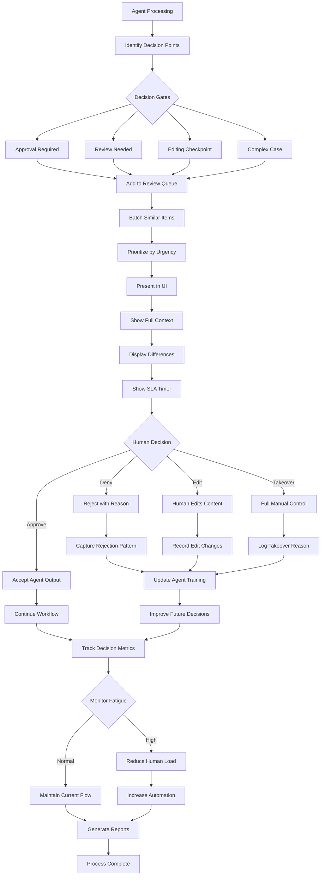
```mermaid
graph TD
    Start[Agent Processing] --> Identify[Identify Decision Points]
    Identify --> Gates{Decision Gates}
    Gates --> Approve[Approval Required]
    Gates --> Review[Review Needed]
    Gates --> Edit[Editing Checkpoint]
    Gates --> Complex[Complex Case]
    Approve --> Queue[Add to Review Queue]
    Review --> Queue
    Edit --> Queue
    Complex --> Queue
    Queue --> Batch[Batch Similar Items]
    Batch --> Priority[Prioritize by Urgency]
    Priority --> UI[Present in UI]
    UI --> Context[Show Full Context]
    Context --> Diff[Display Differences]
    Diff --> SLA[Show SLA Timer]
    SLA --> Human{Human Decision}
    Human -->|Approve| Accept[Accept Agent Output]
    Human -->|Deny| Reject[Reject with Reason]
    Human -->|Edit| Modify[Human Edits Content]
    Human -->|Takeover| Manual[Full Manual Control]
    Accept --> Continue[Continue Workflow]
    Reject --> Learn1[Capture Rejection Pattern]
    Modify --> Learn2[Record Edit Changes]
    Manual --> Learn3[Log Takeover Reason]
    Learn1 --> Update[Update Agent Training]
    Learn2 --> Update
    Learn3 --> Update
    Update --> Improve[Improve Future Decisions]
    Continue --> Track[Track Decision Metrics]
    Improve --> Track
    Track --> Fatigue{Monitor Fatigue}
    Fatigue -->|High| Reduce[Reduce Human Load]
    Fatigue -->|Normal| Maintain[Maintain Current Flow]
    Reduce --> Automate[Increase Automation]
    Maintain --> Report[Generate Reports]
    Automate --> Report
    Report --> End[Process Complete]
```

#### Pros and Cons

| Pros | Cons |
|------|------|
| Human judgment catches AI errors before they reach users | Human reviewer bandwidth creates a hard throughput ceiling |
| Meets regulatory requirements for human oversight | Human reviewers are expensive and require domain expertise |
| Every human decision is training data for improving automation | Waiting for human response adds significant latency |
| Users gain confidence from knowing humans are involved | Different reviewers make inconsistent decisions |
| Humans handle edge cases and novel situations well | Reviewer fatigue degrades decision quality over time |

#### Key Concepts

- **Decision gates** — configurable risk thresholds that trigger human review vs. auto-approval
- **Review queues** — batching, prioritizing, and presenting cases efficiently to reviewers
- **Human feedback** — every rejection, edit, and takeover is captured as labeled training data
- **Continuous learning** — human decisions gradually shift toward higher automation as the agent improves

#### Real-World Example

**Loan Approval System:**
- AI assesses credit risk and auto-approves/denies clear cases (high/low credit score)
- Borderline applications (credit score within ±50 points of threshold) route to human queue
- Large loans above $500K always require human approval regardless of credit score
- Human decisions with reasons are captured; over 6 months, the auto-approval threshold widens as the model learns

#### Interview Answer Framework

**"How do you decide where to put the HITL checkpoints?"**
> "Risk-based: map the cost of an error at each decision point. If an error at step N costs $10 to fix, automate it. If it costs $10,000 or causes regulatory exposure, insert a human gate. Also consider error rate — if the agent is wrong 0.1% of the time on a task, HITL every time is wasteful; if it's wrong 15% of the time on a specific input type, that input type should always route through human review."

**Related Patterns:** [Guardrails](#18-guardrails-and-safety-patterns) (automated safety checks vs. human judgment), [Exception Handling](#12-exception-handling-and-recovery) (automated error recovery vs. human escalation), [Learning and Adaptation](#9-learning-and-adaptation) (HITL decisions as training data)

---

### 14. Knowledge Retrieval (RAG)

> **One-line flow:** `Index → Query → Retrieve → Rank → Generate → Cite`

#### What It Is

Retrieval-Augmented Generation (RAG) grounds an agent's responses in an external knowledge base rather than relying solely on the model's training data. When a question arrives, the system queries a vector database of indexed document chunks, retrieves the most semantically similar chunks, and injects them into the model's context alongside the question. The model generates a response that is grounded in and cites those retrieved sources.

RAG solves two fundamental LLM limitations: **hallucination** (the model making up facts) and **knowledge cutoffs** (the model not knowing about events after its training date). By retrieving from a frequently updated knowledge base, the agent always has access to current, authoritative information.

The quality of a RAG system lives or dies on **chunking strategy** and **retrieval quality**. Poor chunking (splitting in the middle of ideas) and poor embeddings (not capturing semantic meaning accurately) lead to retrieved chunks that are technically relevant but contextually useless.

#### When to Use / Where It Fits

- Dynamic knowledge that changes frequently and cannot be baked into a system prompt
- Large document collections that would exceed any context window
- Domains requiring high factual accuracy with verifiable citations
- Reducing hallucination in high-stakes domains (legal, medical, financial)
- **Examples:** Enterprise knowledge management, legal research, medical information systems, academic research assistants, technical documentation systems

#### Flowchart

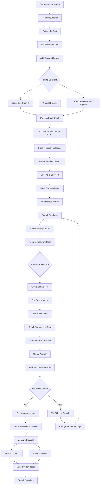
```mermaid
graph TD
    Start[Documents to Search] --> Read[Read Documents]
    Read --> Parse[Extract the Text]
    Parse --> GetInfo[Get Document Info]
    GetInfo --> AddTags[Add Tags and Labels]
    AddTags --> Split{How to Split Text?}
    Split --> Fixed[Equal Size Chunks]
    Split --> Smart[Natural Breaks]
    Split --> Context[Keep Related Parts Together]
    Fixed --> Process[Process Each Chunk]
    Smart --> Process
    Context --> Process
    Process --> Convert[Convert to Searchable Format]
    Convert --> Store[Store in Search Database]
    Store --> Ready[System Ready to Search]
    Ready --> Question[User Asks Question]
    Question --> Improve[Make Question Better]
    Improve --> Expand[Add Related Words]
    Expand --> Search[Search Database]
    Search --> Find[Find Matching Chunks]
    Find --> Filter[Remove Irrelevant Ones]
    Filter --> Rank{Rank by Relevance}
    Rank --> Score[Give Each a Score]
    Score --> Sort[Sort Best to Worst]
    Sort --> Pick[Pick Top Matches]
    Pick --> Verify[Check Sources are Good]
    Verify --> Use[Use Sources for Answer]
    Use --> Generate[Create Answer]
    Generate --> Cite[Add Source References]
    Cite --> Quality{Is Answer Good?}
    Quality -->|Yes| Deliver[Give Answer to User]
    Quality -->|No| Redo[Try Different Search]
    Redo --> Adjust[Change Search Settings]
    Adjust --> Search
    Deliver --> Track[Track How Well It Worked]
    Track --> Measure[Measure Success]
    Measure --> Accuracy[How Accurate?]
    Measure --> Coverage[How Complete?]
    Accuracy --> Improve_System[Make System Better]
    Coverage --> Improve_System
    Improve_System --> End[Search Complete]
```

#### Pros and Cons

| Pros | Cons |
|------|------|
| Responses grounded in real sources with verifiable citations | Requires vector database infrastructure and ongoing maintenance |
| Access to current information beyond training data cutoff | Embedding and indexing costs scale with knowledge base size |
| Dramatically reduces hallucination on factual questions | Retrieval quality depends heavily on chunking strategy and embedding model |
| Knowledge base can be updated without model retraining | Retrieved chunks may lack surrounding context needed for understanding |
| Scales to vast document collections efficiently | Additional retrieval step adds measurable latency to every query |

#### Key Concepts

- **Semantic chunking** — splitting documents at natural boundaries preserves context within each chunk
- **Vector search** — embedding-based similarity search finds semantically related content, not just keyword matches
- **Query enhancement** — expanding or reformulating queries improves recall of relevant chunks
- **Source grounding** — every claim in the response maps to a retrievable, citable source

#### Real-World Example

**Enterprise Knowledge Management:**
An employee asks "What is our parental leave policy for remote employees in the UK?" The RAG system:
1. Embeds the question and searches HR policy documents
2. Retrieves: UK employment policy (chunk 3), Remote work policy (chunk 7), Parental leave guide (chunk 2)
3. Ranks by relevance; all three are highly relevant
4. Generates a response citing specific policy document names and page numbers
5. The employee can verify the answer by clicking the citations

#### Interview Answer Framework

**"What are the main failure modes in a RAG system?"**
> "Three main ones: bad chunking (splitting in the middle of a concept so neither chunk makes sense alone), poor embeddings (the similarity function doesn't capture semantic meaning for your domain — especially a problem with technical jargon), and retrieval-generation mismatch (the retrieved chunks are technically relevant but don't answer the specific question asked). You fix these with better chunking strategy, domain-specific embedding fine-tuning, and hybrid search combining semantic + keyword."

**Related Patterns:** [Memory Management](#8-memory-management) (personal history vs. shared knowledge base), [Tool Use](#5-tool-use-function-calling) (the vector DB query is a tool call), [Evaluation and Monitoring](#19-evaluation-and-monitoring) (measuring retrieval precision/recall)

---

### 15. Inter-Agent Communication (A2A)

> **One-line flow:** `Agent → Authenticate → Message Broker → Deliver → Process → Reply`

#### What It Is

Inter-Agent Communication (A2A) defines the protocols and patterns by which separate agents send messages to, and receive messages from, each other in a multi-agent system. While Multi-Agent Collaboration describes the architecture (who the specialists are), A2A describes the communication layer (how they talk to each other).

Three communication topologies each have distinct tradeoffs:
- **Orchestrator model:** One agent acts as a manager, explicitly delegating tasks to others. Clear control flow, but the orchestrator is a single point of failure.
- **Peer-to-peer (mesh):** Agents communicate directly. Flexible and resilient, but harder to trace and debug.
- **Publish/subscribe (message broker):** Agents publish to topics; interested agents subscribe. Decoupled and scalable, but adds infrastructure complexity.

Circuit breakers, message TTL, and conversation tracing are the three reliability mechanisms that turn a toy multi-agent system into a production one.

#### When to Use / Where It Fits

- Distributed agent architectures where agents run as separate services
- Workflows requiring asynchronous message passing between agents
- Systems that need to trace the full conversation history across agents
- Microservice-style agent architectures where agents are independently deployed
- **Examples:** E-commerce order processing, news production pipelines, financial analysis platforms, smart manufacturing systems

#### Flowchart

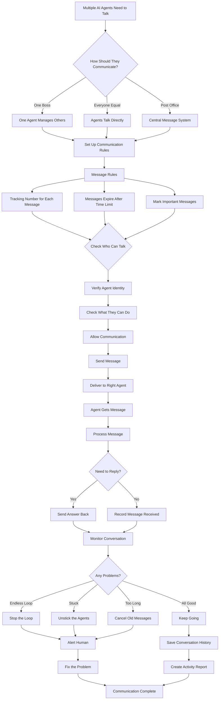
```mermaid
graph TD
    Start[Multiple AI Agents Need to Talk] --> Choose{How Should They Communicate?}
    Choose -->|One Boss| Manager[One Agent Manages Others]
    Choose -->|Everyone Equal| Direct[Agents Talk Directly]
    Choose -->|Post Office| Mailbox[Central Message System]
    Manager --> Setup[Set Up Communication Rules]
    Direct --> Setup
    Mailbox --> Setup
    Setup --> Rules[Message Rules]
    Rules --> Track[Tracking Number for Each Message]
    Rules --> Expire[Messages Expire After Time Limit]
    Rules --> Important[Mark Important Messages]
    Track --> Check{Check Who Can Talk}
    Expire --> Check
    Important --> Check
    Check --> Verify[Verify Agent Identity]
    Verify --> Permission[Check What They Can Do]
    Permission --> Allow[Allow Communication]
    Allow --> Send[Send Message]
    Send --> Deliver[Deliver to Right Agent]
    Deliver --> Receive[Agent Gets Message]
    Receive --> Process[Process Message]
    Process --> Reply{Need to Reply?}
    Reply -->|Yes| Answer[Send Answer Back]
    Reply -->|No| Log[Record Message Received]
    Answer --> Watch[Monitor Conversation]
    Log --> Watch
    Watch --> Problems{Any Problems?}
    Problems -->|Endless Loop| Stop[Stop the Loop]
    Problems -->|Stuck| Fix[Unstick the Agents]
    Problems -->|Too Long| Timeout[Cancel Old Messages]
    Problems -->|All Good| Continue[Keep Going]
    Stop --> Alert[Alert Human]
    Fix --> Alert
    Timeout --> Alert
    Continue --> Record[Save Conversation History]
    Alert --> Recover[Fix the Problem]
    Record --> Report[Create Activity Report]
    Recover --> End[Communication Complete]
    Report --> End
```

#### Pros and Cons

| Pros | Cons |
|------|------|
| Clear separation of agent responsibilities enables independent deployment | Communication protocols and authentication add significant complexity |
| Easy to add new agents without changing existing ones | Message passing introduces latency at every agent boundary |
| Fault isolation — one agent's failure doesn't propagate | Tracing distributed conversations across agents is hard |
| Message tracing aids debugging of cross-agent workflows | Maintaining consistent state across independently running agents |
| Agents can run and scale independently | Security: each agent-to-agent link needs authentication |

#### Key Concepts

- **Message protocols** — standardized message formats (with correlation IDs and TTLs) enable tracing and expiry
- **Authentication** — each agent verifies the identity of other agents before accepting messages
- **Circuit breakers** — prevent agents from endlessly retrying communication with a down agent
- **Conversation tracing** — correlation IDs link all messages in a single workflow thread for debugging

#### Real-World Example

**E-commerce Order Processing:**
Customer places order → Orchestrator sends `order.created` message:
- Inventory Agent receives message, checks stock, replies with `inventory.confirmed`
- Pricing Agent calculates total, replies with `pricing.calculated`
- Payment Agent processes charge, replies with `payment.success`
- Shipping Agent arranges delivery, replies with `shipping.scheduled`
- Notification Agent sends confirmation email to customer
All messages carry the same correlation ID for end-to-end tracing.

#### Interview Answer Framework

**"How is A2A different from Multi-Agent Collaboration?"**
> "Multi-Agent Collaboration is the *architecture* — which specialist agents exist and what roles they play. A2A is the *communication protocol* — the message formats, routing rules, authentication, and reliability patterns they use to talk to each other. You can have multi-agent collaboration without a formalized A2A protocol (e.g., a simple function call chain), but in distributed production systems you need both."

**Related Patterns:** [Multi-Agent Collaboration](#7-multi-agent-collaboration) (the architecture that A2A enables), [MCP](#10-model-context-protocol-mcp) (MCP for tools; A2A for agents), [Exception Handling](#12-exception-handling-and-recovery) (circuit breakers are part of A2A reliability)

---

## Optimization Patterns

---

### 16. Resource-Aware Optimization

> **One-line flow:** `Classify Complexity → Route to Appropriate Model → Monitor Usage → Optimize`

#### What It Is

Resource-Aware Optimization dynamically routes each task to the most cost-effective model and compute tier that can handle it, rather than using an expensive frontier model for everything. A simple FAQ question doesn't need GPT-4 — it can be answered correctly by a small, fast, cheap model. Routing it to a large model wastes money and adds unnecessary latency.

The core mechanism is a **complexity classifier** that analyzes incoming tasks and routes them: simple tasks go to lightweight models (fast, cheap, lower quality), medium tasks go to standard models, complex tasks go to premium models. The classifier itself is typically a small model or rule-based system — fast enough that its overhead is small compared to the savings it generates.

Caching is the second major lever: if the same (or semantically equivalent) question has been answered recently, return the cached result immediately. Cache hit rates of 20–40% are common in production systems with repetitive queries.

#### When to Use / Where It Fits

- High-volume systems where API cost is a significant operational expense
- Systems with highly variable task complexity (some simple, some complex)
- Multi-tenant SaaS platforms managing per-customer resource budgets
- Development and testing where expensive models slow iteration
- **Examples:** Customer support platforms, content generation services, code assistant tools, translation platforms, data analysis systems

#### Flowchart

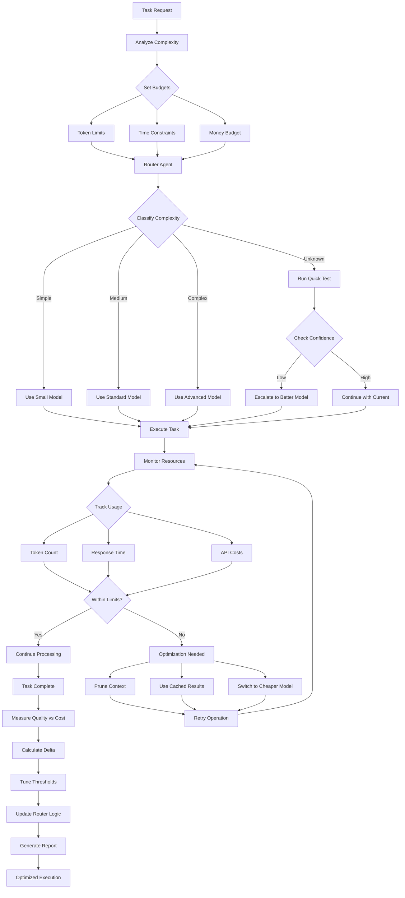
```mermaid
graph TD
    Start[Task Request] --> Analyze[Analyze Complexity]
    Analyze --> Budget{Set Budgets}
    Budget --> Token[Token Limits]
    Budget --> Time[Time Constraints]
    Budget --> Cost[Money Budget]
    Token --> Router[Router Agent]
    Time --> Router
    Cost --> Router
    Router --> Classify{Classify Complexity}
    Classify -->|Simple| Cheap[Use Small Model]
    Classify -->|Medium| Standard[Use Standard Model]
    Classify -->|Complex| Premium[Use Advanced Model]
    Classify -->|Unknown| Test[Run Quick Test]
    Test --> Confidence{Check Confidence}
    Confidence -->|Low| Escalate[Escalate to Better Model]
    Confidence -->|High| Proceed[Continue with Current]
    Cheap --> Execute[Execute Task]
    Standard --> Execute
    Premium --> Execute
    Escalate --> Execute
    Proceed --> Execute
    Execute --> Monitor[Monitor Resources]
    Monitor --> Track{Track Usage}
    Track --> Tokens[Token Count]
    Track --> Latency[Response Time]
    Track --> Costs[API Costs]
    Tokens --> Check{Within Limits?}
    Latency --> Check
    Costs --> Check
    Check -->|Yes| Continue[Continue Processing]
    Check -->|No| Optimize[Optimization Needed]
    Optimize --> Prune[Prune Context]
    Optimize --> Cache[Use Cached Results]
    Optimize --> Downgrade[Switch to Cheaper Model]
    Prune --> Retry[Retry Operation]
    Cache --> Retry
    Downgrade --> Retry
    Continue --> Complete[Task Complete]
    Retry --> Monitor
    Complete --> Measure[Measure Quality vs Cost]
    Measure --> Delta[Calculate Delta]
    Delta --> Tune[Tune Thresholds]
    Tune --> Learn[Update Router Logic]
    Learn --> Report[Generate Report]
    Report --> End[Optimized Execution]
```

#### Pros and Cons

| Pros | Cons |
|------|------|
| Significant cost savings by right-sizing model usage | Complexity classification adds overhead and can misclassify |
| Faster responses for simple tasks using lightweight models | Different models produce different quality levels — inconsistent UX |
| Predictable and controllable operational costs | Finding optimal routing thresholds requires tuning time |
| Cache hit rates provide near-zero cost for repeated queries | Cache management adds complexity and potential staleness issues |
| Self-tuning based on quality/cost measurements | Downgraded responses to complex tasks may disappoint users |

#### Key Concepts

- **Complexity routing** — tasks are classified and routed to appropriately sized models
- **Model selection** — small/standard/premium tiers match different cost/quality tradeoffs
- **Budget tracking** — per-request and per-user token and dollar budgets are enforced
- **Dynamic optimization** — real-time monitoring triggers context pruning, caching, or model downgrade mid-execution

#### Real-World Example

**Customer Support Platform:**
- "What are your office hours?" → lightweight model, response in 200ms, cost $0.001
- "Why did my order from 3 weeks ago get cancelled?" → standard model with CRM tool access, $0.02
- "I need help understanding my enterprise contract terms and negotiating an amendment" → premium model + HITL, $0.50

Without optimization, every query goes to the premium model at $0.50. With optimization, 70% of queries are simple ($0.001), reducing average cost by ~97%.

#### Interview Answer Framework

**"How do you handle the case where the small model gets a hard question?"**
> "The confidence check after classification: if the small model's response confidence is below threshold, or the question pattern matches known hard categories, automatically escalate to a bigger model. This costs more for that query but preserves quality. Over time, you learn which question types consistently need escalation and adjust routing thresholds."

**Related Patterns:** [Routing](#2-routing) (resource-aware optimization is a form of routing by complexity), [Evaluation and Monitoring](#19-evaluation-and-monitoring) (measuring quality/cost delta to tune thresholds)

---

### 17. Reasoning Techniques

> **One-line flow:** `Hard Problem → Select Method → Think Step by Step → Validate → Answer`

#### What It Is

Reasoning Techniques are structured approaches to making an LLM think more carefully and systematically before answering. Instead of asking "What is X?" you guide the model through a reasoning process — write out steps, explore multiple paths, argue both sides — that produces more accurate, explainable, and reliable answers.

Five techniques cover the main problem types:

| Technique | Core Idea | Best For | Relative Cost |
|-----------|-----------|----------|---------------|
| **Chain-of-Thought (CoT)** | Write out each reasoning step explicitly | Math, logic, sequential deduction | Low |
| **Tree of Thoughts (ToT)** | Branch into multiple solution paths, prune bad ones | Strategic decisions, complex planning | High |
| **Self-Consistency** | Generate multiple independent answers, vote on the most common | High-stakes accuracy, reducing variance | Medium |
| **Debate** | Two agents argue opposing positions; a judge evaluates | Adversarial analysis, bias detection | High |
| **ReAct** | Interleave reasoning (Thought) and action (Tool call) | Tool-augmented reasoning, research tasks | Medium |

The cost-accuracy tradeoff is real: CoT is cheap and works well for linear problems; ToT and Debate are expensive but catch errors that CoT misses. For most production use cases, CoT or Self-Consistency with a good prompt is sufficient; ToT and Debate are reserved for high-value, low-volume decisions.

#### When to Use / Where It Fits

- Complex multi-step problems where intermediate reasoning steps matter
- Mathematical and logical reasoning tasks
- Strategic decision-making with multiple valid approaches
- High-stakes accuracy requirements where variance must be minimized
- **Examples:** Mathematical problem solvers, strategic business advisors, code architecture designers, medical diagnostic systems, legal case analyzers

#### Flowchart

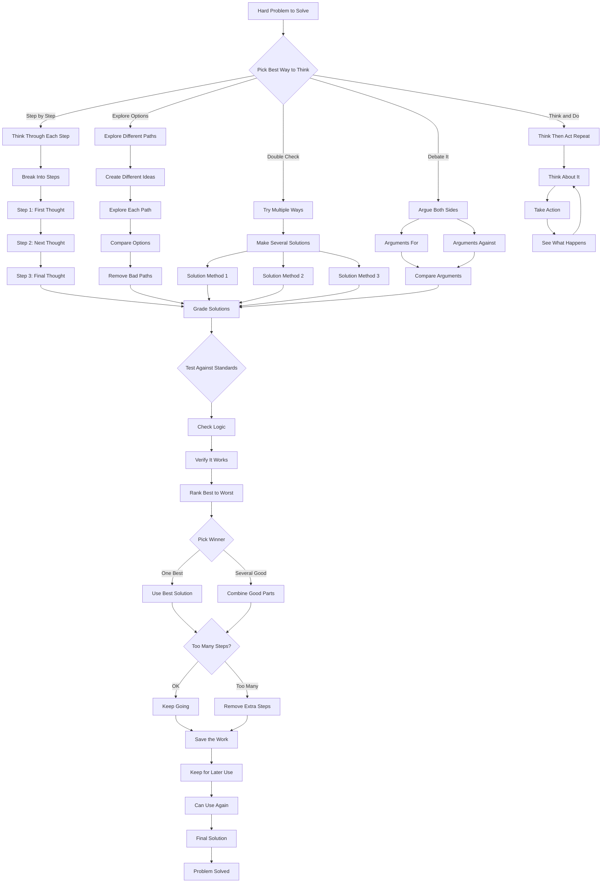
```mermaid
graph TD
    Start[Hard Problem to Solve] --> Choose{Pick Best Way to Think}
    Choose -->|Step by Step| StepByStep[Think Through Each Step]
    Choose -->|Explore Options| Tree[Explore Different Paths]
    Choose -->|Double Check| Multiple[Try Multiple Ways]
    Choose -->|Debate It| Debate[Argue Both Sides]
    Choose -->|Think and Do| ThinkDo[Think Then Act Repeat]
    StepByStep --> Steps[Break Into Steps]
    Steps --> Think1[Step 1: First Thought]
    Think1 --> Think2[Step 2: Next Thought]
    Think2 --> Think3[Step 3: Final Thought]
    Tree --> Branch[Create Different Ideas]
    Branch --> Explore[Explore Each Path]
    Explore --> Compare[Compare Options]
    Compare --> Remove[Remove Bad Paths]
    Multiple --> Make[Make Several Solutions]
    Make --> Path1[Solution Method 1]
    Make --> Path2[Solution Method 2]
    Make --> Path3[Solution Method 3]
    Debate --> For[Arguments For]
    Debate --> Against[Arguments Against]
    For --> Discuss[Compare Arguments]
    Against --> Discuss
    ThinkDo --> Think[Think About It]
    Think --> Act[Take Action]
    Act --> See[See What Happens]
    See --> Think
    Think3 --> Grade[Grade Solutions]
    Remove --> Grade
    Path1 --> Grade
    Path2 --> Grade
    Path3 --> Grade
    Discuss --> Grade
    Grade --> Test{Test Against Standards}
    Test --> Check[Check Logic]
    Check --> Verify[Verify It Works]
    Verify --> Rank[Rank Best to Worst]
    Rank --> Pick{Pick Winner}
    Pick -->|One Best| UseBest[Use Best Solution]
    Pick -->|Several Good| Combine[Combine Good Parts]
    UseBest --> Limit{Too Many Steps?}
    Combine --> Limit
    Limit -->|OK| Continue[Keep Going]
    Limit -->|Too Many| Trim[Remove Extra Steps]
    Continue --> Save[Save the Work]
    Trim --> Save
    Save --> Keep[Keep for Later Use]
    Keep --> CanReuse[Can Use Again]
    CanReuse --> Answer[Final Solution]
    Answer --> End[Problem Solved]
```

#### Reasoning Techniques Deep Comparison

| Technique | When to Use | Prompt Pattern | Cost | Latency | Weakness |
|-----------|-------------|----------------|------|---------|----------|
| **CoT** | Linear logic, step-by-step math | "Let's think step by step..." | Low | Low | Doesn't explore alternatives |
| **ToT** | Multi-path decisions, complex planning | "Explore 3 approaches, evaluate each..." | High | High | Expensive; needs pruning logic |
| **Self-Consistency** | High-stakes accuracy, reducing hallucination | Generate 5 answers independently, vote | Medium | Medium | Cost scales with sample count |
| **Debate** | Adversarial thinking, surfacing blind spots | Agent A argues for, Agent B argues against | High | High | Requires synthesis step |
| **ReAct** | Tool-augmented research, real-time data | "Thought: X. Action: search[Y]. Observation: Z." | Medium | Medium | Requires tool integration |

#### Pros and Cons

| Pros | Cons |
|------|------|
| Systematic reasoning reduces errors on hard problems | Each reasoning step adds tokens, latency, and cost |
| Transparent reasoning traces are explainable and auditable | Verbose reasoning can exceed context window limits |
| Multiple methods provide cross-validation | Over-applying reasoning to simple problems wastes resources |
| Exploration of alternatives improves decision quality | Complex reasoning flows are harder to implement and debug |

#### Key Concepts

- **Chain-of-Thought (CoT)** — explicit step-by-step reasoning improves accuracy on sequential logic
- **Tree-of-Thoughts (ToT)** — branching exploration of multiple solution paths with pruning
- **Self-Consistency** — majority-vote across multiple independent attempts reduces variance
- **ReAct** — interleaved reasoning and tool use: Thought → Action → Observation → Thought loop

#### Real-World Example

**Investment Analysis Platform (using ToT + ReAct):**
- ToT: explore 3 valuation approaches (DCF, comparable companies, precedent transactions) as parallel branches
- Each branch uses ReAct: Thought about methodology → Action: query market data API → Observation: retrieve data → Thought: calculate result
- Self-Consistency: run DCF with 3 different discount rate assumptions, average the results
- Final synthesis: judge agent evaluates all three ToT branches and produces a final recommendation

#### Interview Answer Framework

**"When would you use Self-Consistency over Chain-of-Thought?"**
> "CoT is great for problems with a single correct reasoning path. Self-Consistency is better when the problem is sensitive to slight variations in reasoning approach — you want confidence that the answer is robust. For high-stakes decisions like medical diagnosis recommendations or large financial calculations, paying 5× the cost for Self-Consistency to reduce variance is usually worth it."

**Related Patterns:** [Reflection](#4-reflection) (Reflection = critic loop across turns; Reasoning = method within a single generation), [Planning](#6-planning) (ToT for planning step decomposition)

---

### 18. Guardrails and Safety Patterns

> **One-line flow:** `Input → Sanitize → Risk Score → Process → Moderate Output → Log`

#### What It Is

Guardrails and Safety Patterns implement a multi-layered defense pipeline that protects the system, users, and the organization at both input and output boundaries. Every input is sanitized, risk-scored, and optionally filtered before the agent processes it. Every output is evaluated for compliance, ethics, and brand safety before it reaches the user.

This is not just about preventing harmful content — it covers the full safety surface: PII protection, prompt injection blocking, insider threat prevention, regulatory compliance checking, and output moderation. Each layer catches different failure modes; the combination creates defense in depth.

The risk-level tiering is the key design decision: low-risk requests process normally with no overhead; medium-risk requests add safeguards; high-risk requests route to human review; critical-risk requests are blocked entirely. Getting this calibration right — not too restrictive (false positives frustrate users), not too permissive (real harms get through) — is an ongoing tuning challenge.

#### When to Use / Where It Fits

- Any public-facing AI system where users can provide arbitrary input
- Regulated industries (healthcare, finance, legal) with compliance requirements
- Systems handling sensitive data requiring PII protection
- Brand-sensitive deployments where harmful outputs would damage reputation
- **Examples:** Social media AI moderators, healthcare chatbots, financial advisory AI, educational AI tutors, enterprise AI assistants

#### Flowchart

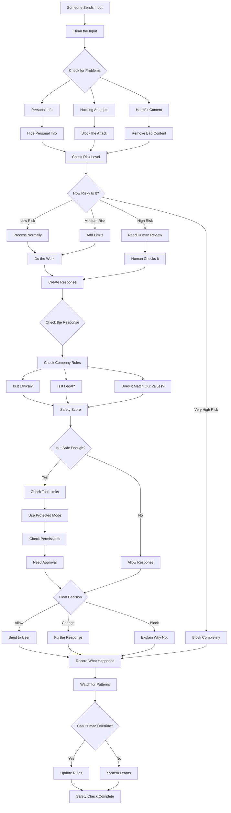
```mermaid
graph TD
    Start[Someone Sends Input] --> Clean[Clean the Input]
    Clean --> Check{Check for Problems}
    Check --> Personal[Personal Info]
    Check --> Attack[Hacking Attempts]
    Check --> Bad[Harmful Content]
    Personal --> Hide[Hide Personal Info]
    Attack --> Block[Block the Attack]
    Bad --> Remove[Remove Bad Content]
    Hide --> Risk[Check Risk Level]
    Block --> Risk
    Remove --> Risk
    Risk --> Level{How Risky Is It?}
    Level -->|Low Risk| GoAhead[Process Normally]
    Level -->|Medium Risk| Careful[Add Limits]
    Level -->|High Risk| Review[Need Human Review]
    Level -->|Very High Risk| Stop[Block Completely]
    GoAhead --> DoWork[Do the Work]
    Careful --> DoWork
    Review --> Human[Human Checks It]
    DoWork --> Output[Create Response]
    Human --> Output
    Output --> CheckOutput{Check the Response}
    CheckOutput --> Rules[Check Company Rules]
    Rules --> Ethics[Is It Ethical?]
    Rules --> Legal[Is It Legal?]
    Rules --> Brand[Does It Match Our Values?]
    Ethics --> Score[Safety Score]
    Legal --> Score
    Brand --> Score
    Score --> Safe{Is It Safe Enough?}
    Safe -->|Yes| Limits[Check Tool Limits]
    Safe -->|No| Pass[Allow Response]
    Limits --> Protected[Use Protected Mode]
    Protected --> Permissions[Check Permissions]
    Permissions --> Approve[Need Approval]
    Approve --> Final{Final Decision}
    Pass --> Final
    Final -->|Allow| Send[Send to User]
    Final -->|Change| Edit[Fix the Response]
    Final -->|Block| Reject[Explain Why Not]
    Send --> Log[Record What Happened]
    Edit --> Log
    Reject --> Log
    Stop --> Log
    Log --> Watch[Watch for Patterns]
    Watch --> Override{Can Human Override?}
    Override -->|Yes| Update[Update Rules]
    Override -->|No| Learn[System Learns]
    Update --> End[Safety Check Complete]
    Learn --> End
```

#### Pros and Cons

| Pros | Cons |
|------|------|
| Prevents harmful, illegal, or brand-damaging outputs | Overly aggressive filters generate false positives, frustrating users |
| Meets regulatory requirements with audit trails | Each safety layer adds processing latency |
| Protects users from inappropriate or dangerous content | Context-blind rules may miss nuanced safety issues |
| Prevents prompt injection and system exploitation | Safety policies require continuous updates as threats evolve |
| Consistent and auditable safety decision trail | Additional compute and monitoring cost for every request |

#### Key Concepts

- **Input sanitization** — PII redaction, injection blocking, and harmful content removal before processing
- **Risk classification** — four-tier system (low/medium/high/critical) maps to different response strategies
- **Output moderation** — ethics, legal, and brand compliance checks on every generated response
- **Policy enforcement** — configurable rules with human override capability for edge cases

#### Real-World Example

**Financial Advisory AI:**
Input: "Tell me which stocks to buy based on insider information I have."
- PII check: passes (no personal data)
- Injection check: no injection patterns detected
- Harmful content: flagged as potential insider trading request (HIGH RISK)
- Routes to human compliance review
- Compliance officer reviews, adds notation, and the system logs the request, user ID, and outcome for regulatory audit trail

#### Interview Answer Framework

**"How do you prevent prompt injection in an agentic system?"**
> "Multiple defenses: (1) structurally separate user input from system instructions — never concatenate them as plain strings; (2) use an input validation layer that detects instruction-override patterns like 'ignore previous instructions'; (3) run outputs through a check that detects if the model is acting outside its defined scope; (4) privilege separation — the agent's tools have the minimum permissions needed, so even a successful injection can't do much damage."

**Related Patterns:** [Human-in-the-Loop](#13-human-in-the-loop-hitl) (high-risk items escalate to HITL), [Evaluation and Monitoring](#19-evaluation-and-monitoring) (safety metric tracking), [Exception Handling](#12-exception-handling-and-recovery) (handling blocked/rejected requests gracefully)

---

### 19. Evaluation and Monitoring

> **One-line flow:** `Define Quality Gates → Instrument → Collect Metrics → Detect Anomalies → Alert → Fix or Rollback`

#### What It Is

Evaluation and Monitoring gives an agentic system the ability to measure its own performance continuously and respond automatically to quality degradation. It covers both **offline evaluation** (golden test sets run before deployment to prevent regressions) and **online monitoring** (real-time metrics collection in production to detect drift, anomalies, and SLA violations).

The quality gate taxonomy covers four dimensions: accuracy (is the output correct?), performance (is it fast enough?), compliance (does it meet regulatory requirements?), and user experience (are users satisfied?). Each dimension has measurable metrics and configurable thresholds.

The automated rollback mechanism is the safety net: when a deployed change causes metric degradation beyond a threshold, the system automatically reverts to the previous version — reducing mean time to recovery from hours to minutes.

#### When to Use / Where It Fits

- Any production AI system where quality degradation has business consequences
- High-volume systems where manual quality review doesn't scale
- Regulated deployments requiring audit trails and compliance evidence
- Multi-model systems where different models need comparative evaluation
- **Examples:** Enterprise AI deployments, SaaS platforms, healthcare systems, financial trading systems, e-commerce recommendation engines

#### Flowchart

```mermaid
graph TD
    Start[System Deployment] --> Define[Define Quality Gates]
    Define --> Gates{Quality Criteria}
    Gates --> Accuracy[Accuracy Metrics]
    Gates --> Performance[Performance SLAs]
    Gates --> Compliance[Compliance Rules]
    Gates --> UX[User Experience]
    Accuracy --> Golden[Golden Test Sets]
    Performance --> Benchmarks[Performance Benchmarks]
    Compliance --> Standards[Regulatory Standards]
    UX --> Satisfaction[Satisfaction Scores]
    Golden --> Tests[Create Test Suite]
    Benchmarks --> Tests
    Standards --> Tests
    Satisfaction --> Tests
    Tests --> Unit[Unit Tests]
    Tests --> Contract[Contract Tests]
    Tests --> Integration[Integration Tests]
    Tests --> E2E[End-to-End Tests]
    Unit --> Critical[Critical Path Tests]
    Contract --> Critical
    Integration --> Critical
    E2E --> Critical
    Critical --> Instrument[Instrument System]
    Instrument --> Traces[Distributed Traces]
    Instrument --> Metrics[System Metrics]
    Instrument --> Costs[Cost Tracking]
    Instrument --> Latency[Latency Monitoring]
    Traces --> Collect[Collect Data]
    Metrics --> Collect
    Costs --> Collect
    Latency --> Collect
    Collect --> Analyze{Analyze Patterns}
    Analyze --> Drift[Detect Drift]
    Analyze --> Regression[Find Regressions]
    Analyze --> Anomalies[Spot Anomalies]
    Analyze --> Trends[Identify Trends]
    Drift --> Alert{Threshold Breach?}
    Regression --> Alert
    Anomalies --> Alert
    Trends --> Alert
    Alert -->|Yes| Notify[Alert Teams]
    Alert -->|No| Continue[Continue Monitoring]
    Notify --> Investigate[Investigate Issue]
    Investigate --> Decision{Action Required?}
    Decision -->|Rollback| Revert[Revert Changes]
    Decision -->|Fix| Patch[Deploy Fix]
    Decision -->|Accept| Document[Document Decision]
    Revert --> Verify[Verify Recovery]
    Patch --> Verify
    Document --> Continue
    Continue --> Periodic[Periodic Audits]
    Verify --> Periodic
    Periodic --> Review[Review Performance]
    Review --> Update[Update Eval Sets]
    Update --> Refresh[Refresh Tests]
    Refresh --> Improve[Continuous Improvement]
    Improve --> End[System Monitored]
```

#### Pros and Cons

| Pros | Cons |
|------|------|
| Early detection of quality degradation before users notice | Monitoring infrastructure itself requires compute and maintenance |
| Automated rollback reduces mean time to recovery | Too many alerts cause alert fatigue, leading to ignored notifications |
| Comprehensive metrics guide targeted optimization | Keeping golden test sets updated as the system evolves takes effort |
| Audit trails meet compliance and regulatory requirements | Performance instrumentation adds overhead to every request |
| Data-driven decisions replace guesswork in system improvement | False positive alerts waste engineering time on investigations |

#### Key Concepts

- **Quality gates** — predefined thresholds for accuracy, latency, cost, and compliance that must be met before deployment
- **Real-time metrics** — continuous collection of accuracy, latency, cost, and satisfaction scores in production
- **Drift detection** — statistical monitoring for gradual degradation in model behavior or output distribution
- **Automated rollback** — when metrics breach thresholds, automatically revert to the last known-good version

#### Real-World Example

**E-commerce Recommendation Engine:**
- Offline: run golden test set (1,000 known good recommendations) before every deployment
- Online: track click-through rate, conversion rate, latency p99, and cost per recommendation in real-time
- Drift detected: CTR drops 15% compared to 7-day rolling average
- Alert fired: on-call engineer notified
- Investigation: recent prompt change altered recommendation diversity
- Decision: rollback to previous prompt version; schedule A/B test to validate the change properly

#### Interview Answer Framework

**"What metrics would you track for an LLM-based production system?"**
> "Four categories: (1) Quality — accuracy on golden test set, human evaluation scores, task completion rate. (2) Performance — p50/p95/p99 latency, token throughput, error rate. (3) Cost — total API spend, cost per request by tier, token efficiency. (4) Business — user satisfaction score, task success rate, escalation rate. Alert on sudden changes in any metric, not just threshold violations — a gradual drift is often more dangerous than a sudden spike."

**Related Patterns:** [Goal Setting and Monitoring](#11-goal-setting-and-monitoring) (business goal tracking vs. system quality monitoring), [Learning and Adaptation](#9-learning-and-adaptation) (evaluation metrics drive the learning pipeline), [Resource-Aware Optimization](#16-resource-aware-optimization) (cost metrics inform optimization thresholds)

---

## Strategic Patterns

---

### 20. Prioritization

> **One-line flow:** `Score Tasks → Rank by Value/Urgency/Risk → Execute → Reorder on New Events`

#### What It Is

Prioritization manages a dynamic queue of tasks by continuously scoring and ranking them across multiple dimensions — business value, urgency, risk level, estimated effort, and dependencies — to ensure the agent always works on the highest-value available task.

Without prioritization, agents either process tasks in arrival order (FIFO, which ignores value) or in some arbitrary sequence. Both approaches leave value on the table and risk violating SLAs for high-priority items while wasting capacity on low-priority work.

The starvation prevention mechanism is a critical production concern: if high-priority tasks always preempt low-priority ones, some tasks may never execute. Aging (gradually boosting the priority of waiting tasks) and quotas (reserving capacity for lower-priority queues) solve this.

#### When to Use / Where It Fits

- Multi-task systems where not all tasks are equally valuable
- Time-sensitive operations with varying deadlines
- Resource-constrained environments where capacity is limited
- Systems with complex inter-task dependencies
- **Examples:** Customer support ticket systems, software development pipelines, healthcare triage, manufacturing scheduling, content publishing

#### Flowchart

```mermaid
graph TD
    Start[Task Queue] --> Build[Build Dependency Graph]
    Build --> Map[Map Dependencies]
    Map --> Tasks[Task List]
    Tasks --> T1[Task 1]
    Tasks --> T2[Task 2]
    Tasks --> T3[Task 3]
    Tasks --> TN[Task N]
    T1 --> Score[Score Each Task]
    T2 --> Score
    T3 --> Score
    TN --> Score
    Score --> Value{Scoring Factors}
    Value --> Business[Business Value]
    Value --> Risk[Risk Level]
    Value --> Effort[Effort Required]
    Value --> Urgency[Time Sensitivity]
    Value --> Dependencies[Dependency Count]
    Business --> Calculate[Calculate Priority Score]
    Risk --> Calculate
    Effort --> Calculate
    Urgency --> Calculate
    Dependencies --> Calculate
    Calculate --> Formula[Priority = Value divided by Effort times Urgency times Risk]
    Formula --> Rank[Rank Tasks]
    Rank --> Order[Initial Order]
    Order --> Schedule{Scheduling Strategy}
    Schedule --> Quota[Apply Quotas]
    Schedule --> Aging[Task Aging]
    Schedule --> Balance[Load Balance]
    Quota --> Prevent[Prevent Starvation]
    Aging --> Boost[Boost Old Tasks]
    Balance --> Distribute[Distribute Work]
    Prevent --> Queue2[Priority Queue]
    Boost --> Queue2
    Distribute --> Queue2
    Queue2 --> Execute[Execute Top Task]
    Execute --> Monitor{New High Priority?}
    Monitor -->|Yes| Preempt[Preempt Current]
    Monitor -->|No| Continue[Continue Current]
    Preempt --> Save[Save State]
    Save --> Switch[Switch to High Priority]
    Continue --> Complete{Task Complete?}
    Switch --> Complete
    Complete -->|Yes| Remove[Remove from Queue]
    Complete -->|No| Execute
    Remove --> Events{New Events?}
    Events -->|Yes| Reorder[Re-calculate Priorities]
    Events -->|No| Next[Get Next Task]
    Reorder --> Rank
    Next --> Execute
    Next --> End[Optimized Execution]
```

#### Pros and Cons

| Pros | Cons |
|------|------|
| Optimal use of limited compute/human resources | Priority calculation algorithms add overhead |
| High-value tasks are completed first, maximizing business impact | Context switching between preempted tasks adds overhead |
| Starvation prevention ensures all tasks eventually complete | Priority scoring is partly subjective and can be gamed |
| Adapts dynamically to new high-priority arrivals | Effort estimates used in scoring are often wrong |
| Clear, auditable logic for why each task was prioritized | Complex dependency tracking adds significant engineering complexity |

#### Key Concepts

- **Dependency mapping** — tasks with unfulfilled prerequisites are blocked and not considered for execution
- **Value scoring** — multi-factor priority formula: value/effort × urgency × risk
- **Dynamic reordering** — priority queue is recalculated when new tasks arrive or existing tasks change state
- **Starvation prevention** — aging boosts waiting tasks' priority; quotas reserve capacity for lower-priority queues

#### Real-World Example

**Software Development Pipeline:**
Queue: 1 critical security vulnerability, 3 high-value features, 12 medium bugs, 8 low-priority tech debt items
- Security vulnerability: Business=10, Risk=10, Effort=3, Urgency=10 → Priority score = 333 → Execute immediately
- High-value feature: Business=8, Risk=3, Effort=7, Urgency=5 → Priority score = ~17 → Execute after security fix
- Tech debt items that have been waiting 3 weeks get an aging boost, moving them ahead of new medium bugs

#### Interview Answer Framework

**"How do you prevent starvation in a priority queue?"**
> "Two mechanisms: task aging and capacity quotas. Aging gradually increases the effective priority of tasks that have been waiting — a low-priority task waiting 3 weeks eventually gets the same priority as a new medium-priority task. Quotas reserve a fixed percentage of capacity for lower-priority queues — even in a high-priority crunch, 10% of execution time goes to low-priority tasks so they make forward progress."

**Related Patterns:** [Planning](#6-planning) (planning creates the task list that prioritization manages), [Goal Setting and Monitoring](#11-goal-setting-and-monitoring) (goal deadlines feed into urgency scoring), [Resource-Aware Optimization](#16-resource-aware-optimization) (resource availability affects scheduling)

---

### 21. Exploration and Discovery

> **One-line flow:** `Scout Broadly → Cluster Themes → Select Targets → Deep Dive → Synthesize → Generate Hypotheses`

#### What It Is

Exploration and Discovery is a structured pattern for autonomous R&D and knowledge synthesis. Rather than executing a known task, the agent explores an unfamiliar domain to build a knowledge map, identify patterns, surface gaps, and generate testable hypotheses — mimicking the scientific method but at the scale and speed of automated systems.

The pattern has two distinct phases: **broad scouting** (wide exploration to map the knowledge space) and **targeted deep dives** (intensive investigation of the most promising areas identified during scouting). Between these phases, a clustering and selection step uses criteria like novelty, potential impact, feasibility, and knowledge gaps to choose where to focus.

The hypothesis generation output is what distinguishes this pattern from simple data aggregation — the agent doesn't just collect information, it proposes new experiments, theories, or opportunities based on cross-domain pattern recognition.

#### When to Use / Where It Fits

- R&D projects investigating new domains or technologies
- Innovation initiatives seeking breakthrough opportunities
- Competitive intelligence and market opportunity analysis
- Scientific research requiring systematic hypothesis generation
- **Examples:** Drug discovery, market opportunity finding, technology scouting, scientific research assistance, intelligence analysis

#### Flowchart

```mermaid
graph TD
    Start[Research Goal] --> Scout[Scout Broadly]
    Scout --> Sources{Explore Sources}
    Sources --> Literature[Academic Papers]
    Sources --> Data[Datasets]
    Sources --> Experts[Domain Experts]
    Sources --> Web[Web Resources]
    Sources --> Experiments[Experimental Data]
    Literature --> Collect[Collect Information]
    Data --> Collect
    Experts --> Collect
    Web --> Collect
    Experiments --> Collect
    Collect --> Map[Map Knowledge Space]
    Map --> Identify[Identify Key Areas]
    Identify --> Cluster{Cluster Themes}
    Cluster --> Theme1[Theme Group 1]
    Cluster --> Theme2[Theme Group 2]
    Cluster --> Theme3[Theme Group 3]
    Cluster --> ThemeN[Theme Group N]
    Theme1 --> Analyze[Analyze Patterns]
    Theme2 --> Analyze
    Theme3 --> Analyze
    ThemeN --> Analyze
    Analyze --> Select[Select Deep-Dive Targets]
    Select --> Criteria{Selection Criteria}
    Criteria --> Novel[Novelty Score]
    Criteria --> Impact[Potential Impact]
    Criteria --> Feasible[Feasibility]
    Criteria --> Gaps[Knowledge Gaps]
    Novel --> Pick[Pick Exploration Targets]
    Impact --> Pick
    Feasible --> Pick
    Gaps --> Pick
    Pick --> DeepDive[Deep Investigation]
    DeepDive --> Extract{Extract Artifacts}
    Extract --> Notes[Research Notes]
    Extract --> Bibliography[Bibliography]
    Extract --> Datasets[Curated Datasets]
    Extract --> Contacts[Expert Contacts]
    Extract --> Models[Conceptual Models]
    Notes --> Synthesize[Synthesize Insights]
    Bibliography --> Synthesize
    Datasets --> Synthesize
    Contacts --> Synthesize
    Models --> Synthesize
    Synthesize --> Insights[Key Insights]
    Insights --> Questions[Open Questions]
    Questions --> Hypotheses[Generate Hypotheses]
    Hypotheses --> Check{Iteration Limit?}
    Check -->|Not Reached| Design[Design Experiments]
    Check -->|Reached| Conclude[Conclude Exploration]
    Design --> Test[Test Hypotheses]
    Test --> Results[Gather Results]
    Results --> Scout
    Conclude --> Report[Generate Report]
    Report --> Findings[Document Findings]
    Findings --> NextSteps[Recommend Next Steps]
    NextSteps --> End[Discovery Complete]
```

#### Pros and Cons

| Pros | Cons |
|------|------|
| Systematic broad coverage of an unfamiliar domain | Time and compute intensive — exploration is inherently expensive |
| Cross-domain pattern recognition surfaces non-obvious insights | ROI is uncertain; exploration may not yield actionable findings |
| Generates testable hypotheses rather than just summarizing | Scope can expand without a clear stopping criterion |
| Enables serendipitous discoveries through comprehensive coverage | Information overload when exploring large knowledge spaces |
| Scales to literature and data volumes no human team could cover | Deciding which themes to deep-dive is a judgment call |

#### Key Concepts

- **Broad exploration** — wide initial scouting to map the space before committing to specific directions
- **Pattern clustering** — grouping related findings to identify coherent themes and redundancies
- **Targeted deep-dives** — intensive investigation of selected high-potential themes
- **Hypothesis generation** — synthesizing cross-domain insights into testable theories or opportunity statements

#### Real-World Example

**Drug Discovery Platform:**
1. Scout: mine 50,000 papers for mentions of protein targets related to a disease pathway
2. Cluster: group by target type, indication, mechanism of action
3. Select deep-dive: 3 underexplored targets with promising signal but low publication density
4. Deep dive: comprehensive literature synthesis, existing drug candidate analysis, side effect pattern analysis
5. Hypothesize: "Compound class X combined with target Y has synergistic potential — no published trial exists"
6. Output: experimental design proposals for validation

#### Interview Answer Framework

**"How is Exploration and Discovery different from a basic RAG pipeline?"**
> "RAG answers a specific question by retrieving from a known knowledge base. Exploration and Discovery builds the knowledge base itself, maps the unknown space, and generates new questions. RAG is retrieval; Exploration is research. You'd use RAG once you know what you're looking for; Exploration when you're still figuring that out."

**Related Patterns:** [RAG](#14-knowledge-retrieval-rag) (retrieval from a known knowledge base, vs. exploration of an unknown space), [Planning](#6-planning) (exploration generates the hypotheses that planning helps execute), [Multi-Agent Collaboration](#7-multi-agent-collaboration) (large-scale exploration uses multiple specialist agents)

---

## Real-World System Compositions

Understanding how patterns combine is the most valuable skill in a system design interview. Real systems use 5–10 patterns working together. Here are four complete architectures.

---

### Composition 1: Enterprise Customer Support Agent

**Patterns used:** Routing + RAG + Memory + Tool Use + HITL + Guardrails + Exception Handling

**Scenario:** A large SaaS company deploys an AI agent to handle customer support tickets across billing, technical, and general inquiries.

```mermaid
flowchart TD
    Ticket[Incoming Support Ticket] --> Guard[Guardrails: Input Sanitization]
    Guard --> Router[Routing: Intent Classification]
    Router -->|Billing| BillingAgent[Billing Agent]
    Router -->|Technical| TechAgent[Technical Agent]
    Router -->|General| GeneralAgent[General Agent]
    Router -->|Unknown| HITL1[HITL: Ambiguous Case Queue]

    BillingAgent --> Mem1[Memory: Load Customer History]
    TechAgent --> Mem2[Memory: Load Product Context]
    GeneralAgent --> Mem3[Memory: Load FAQ Context]

    Mem1 --> RAG1[RAG: Query Billing KB]
    Mem2 --> RAG2[RAG: Query Technical Docs]
    Mem3 --> RAG3[RAG: Query General KB]

    RAG1 --> Tool1[Tool Use: CRM API and Billing System]
    RAG2 --> Tool2[Tool Use: Error Log API and Product DB]
    RAG3 --> Tool3[Tool Use: FAQ DB]

    Tool1 --> RiskCheck{Risk Check: High Stakes?}
    Tool2 --> RiskCheck
    Tool3 --> RiskCheck

    RiskCheck -->|High Value Refund or Escalation| HITL2[HITL: Agent Approval Queue]
    RiskCheck -->|Standard| OutputGuard[Guardrails: Output Moderation]

    HITL2 --> OutputGuard
    OutputGuard --> Exc[Exception Handling: Retry or Fallback]
    Exc --> Response[Response to Customer]
    Response --> Mem4[Memory: Update Interaction History]
```

**Key design decisions:**
- Guardrails at *both* input and output boundaries — this is non-negotiable for public-facing systems
- Memory loads customer-specific context so agents don't ask the same questions twice
- HITL at two points: ambiguous routing AND high-stakes actions (large refunds, contract changes)
- Exception Handling wraps all tool calls — billing API downtime should not crash the agent

---

### Composition 2: AI-Powered Research Assistant

**Patterns used:** Planning + Multi-Agent + RAG + Reflection + Evaluation

**Scenario:** A research firm needs to produce a comprehensive market analysis report on an emerging technology sector.

```mermaid
flowchart TD
    Goal[Research Brief] --> Planner[Planning: Decompose into Milestones]
    Planner --> M1[Milestone 1: Literature Review]
    Planner --> M2[Milestone 2: Market Data Collection]
    Planner --> M3[Milestone 3: Analysis and Synthesis]
    Planner --> M4[Milestone 4: Report Generation]

    M1 --> LitAgent[Literature Agent]
    M2 --> DataAgent[Market Data Agent]
    LitAgent --> RAG1[RAG: Academic Paper Index]
    DataAgent --> RAG2[RAG: Market Data Index]

    RAG1 --> SharedMem[Shared Memory: Research Findings]
    RAG2 --> SharedMem

    M3 --> AnalysisAgent[Analysis Agent]
    SharedMem --> AnalysisAgent
    AnalysisAgent --> Reflect1{Reflection: Is Analysis Complete?}
    Reflect1 -->|No| AnalysisAgent
    Reflect1 -->|Yes| SynthAgent[Synthesis Agent]

    M4 --> WriterAgent[Writer Agent]
    SynthAgent --> WriterAgent
    WriterAgent --> Reflect2{Reflection: Quality Check}
    Reflect2 -->|Critique| RevAgent[Revision Agent]
    RevAgent --> Reflect2
    Reflect2 -->|Pass| Eval[Evaluation: Golden Test Criteria]

    Eval -->|Pass| FinalReport[Final Report]
    Eval -->|Fail| WriterAgent
```

**Key design decisions:**
- Planning creates milestones that feed into Multi-Agent role assignment
- Shared Memory is the coordination mechanism — agents don't message each other directly
- Reflection wraps the analysis and writing stages (the two quality-critical steps)
- Evaluation at the end prevents a poor-quality report from being delivered

---

### Composition 3: Code Generation Pipeline

**Patterns used:** Prompt Chaining + Tool Use + Reflection + Evaluation

**Scenario:** A developer tools company builds an automated code generation and validation system.

```mermaid
flowchart TD
    Req[Requirements Input] --> Chain1[Step 1: Parse Requirements]
    Chain1 --> V1{Validate: Are requirements clear?}
    V1 -->|No| Chain1
    V1 -->|Yes| Chain2[Step 2: Design Architecture]

    Chain2 --> Reflect1{Reflection: Review Architecture}
    Reflect1 -->|Critique| Chain2
    Reflect1 -->|Approve| Chain3[Step 3: Generate Code]

    Chain3 --> Tool1[Tool Use: Code Execution Sandbox]
    Tool1 --> V2{Does it compile and run?}
    V2 -->|No| Chain3
    V2 -->|Yes| Chain4[Step 4: Generate Tests]

    Chain4 --> Tool2[Tool Use: Test Runner]
    Tool2 --> V3{Tests pass?}
    V3 -->|No| Reflect2{Reflection: Identify Test Failures}
    Reflect2 --> Chain3
    V3 -->|Yes| Chain5[Step 5: Generate Documentation]

    Chain5 --> Eval[Evaluation: Golden Quality Gates]
    Eval -->|Pass| Output[Deployable Code Package]
    Eval -->|Fail| Chain3
```

**Key design decisions:**
- Prompt Chaining provides structure; each step has explicit validation before proceeding
- Tool Use is essential here — the agent must actually *run* the code to know if it works
- Reflection wraps the architecture step (design decisions are hard to fix later)
- Evaluation at the end checks against quality standards like coverage and documentation completeness

---

### Composition 4: Cost-Optimized Production Agent

**Patterns used:** Resource-Aware Optimization + Routing + Guardrails + Evaluation + Exception Handling

**Scenario:** A high-volume content generation platform needs to serve 10,000 requests per hour while controlling API costs.

```mermaid
flowchart TD
    Request[Content Request] --> Guard1[Guardrails: Input Safety Check]
    Guard1 --> ResOpt[Resource-Aware: Classify Complexity]

    ResOpt -->|Simple Template Fill| SmallModel[Small Model: Fast and Cheap]
    ResOpt -->|Standard Article| StandardModel[Standard Model: Balanced]
    ResOpt -->|Complex Long-Form| LargeModel[Large Model: Premium Quality]

    SmallModel --> Cache{Cache Hit?}
    StandardModel --> Cache
    LargeModel --> Execute[Execute Generation]

    Cache -->|Hit| CachedResult[Return Cached Result]
    Cache -->|Miss| Execute

    Execute --> Exc[Exception Handling: Retry or Fallback]
    Exc --> Guard2[Guardrails: Output Moderation]
    Guard2 --> Eval[Evaluation: Quality Gate]

    Eval -->|Pass| Store[Store in Cache]
    Eval -->|Fail - Simple Task| Router[Routing: Escalate to Better Model]
    Router --> Execute

    Store --> Response[Deliver Response]
    CachedResult --> Response

    Response --> Metrics[Track Cost and Quality Metrics]
    Metrics --> Tune[Tune Classification Thresholds]
```

**Key design decisions:**
- Resource-Aware Optimization is the core cost-saving mechanism — classify before spending money
- Cache sits between classification and execution — even complex requests hit cache if the exact query was seen before
- If evaluation fails on a simple-model response, Routing escalates to a better model (automatic quality recovery)
- Metrics feed back into threshold tuning — the system improves its own cost/quality balance over time

---

## Quick Revision Cheat Sheet

### All 21 Patterns in 60 Seconds

| # | Pattern | One-liner | Top Pro | Top Con |
|---|---------|-----------|---------|---------|
| 1 | Prompt Chaining | Validated sequential steps | Debuggable, modular | Latency accumulates |
| 2 | Routing | Route by intent to specialists | Enables specialization | Misrouting risk |
| 3 | Parallelization | Independent tasks run concurrently | Speed improvement | API rate limits |
| 4 | Reflection | Generate → Critique → Revise | Systematic quality improvement | Latency × cost per iteration |
| 5 | Tool Use | Agent calls external functions | Real-time data and actions | Security + error propagation |
| 6 | Planning | Decompose goal into milestones | Proactive execution | Upfront overhead |
| 7 | Multi-Agent | Specialists collaborate | Domain optimization | Coordination complexity |
| 8 | Memory | Persist context across sessions | Personalization | Privacy + storage cost |
| 9 | Learning | Feedback improves the system | Continuous improvement | Regression risk |
| 10 | MCP | Standardized tool discovery | Interoperability | Setup overhead |
| 11 | Goal Setting | SMART goals + drift detection | Accountability | Metric gaming risk |
| 12 | Exception Handling | Classify errors → recover | Production reliability | Complexity increase |
| 13 | HITL | Human review at decision gates | Quality + compliance | Throughput bottleneck |
| 14 | RAG | Retrieve → ground → generate | Accuracy + citation | Chunking quality matters |
| 15 | A2A | Agent messaging protocols | Modularity | Distributed debugging |
| 16 | Resource-Aware | Route by complexity to right model | Cost reduction | Quality inconsistency |
| 17 | Reasoning | CoT / ToT / ReAct | Accuracy on hard problems | Token cost |
| 18 | Guardrails | Input sanitize → output moderate | Safety + compliance | False positives |
| 19 | Evaluation | Tests → monitor → detect → fix | Reliability | Alert fatigue |
| 20 | Prioritization | Score and rank task queue | Efficiency | Starvation risk |
| 21 | Exploration | Scout → cluster → deep dive | Innovation | ROI uncertainty |

---

### High-Frequency Interview Questions and Pattern Mappings

**System Design Questions:**

| Question | Patterns to Use |
|----------|----------------|
| Design a customer support chatbot | Routing + RAG + Memory + HITL + Guardrails + Exception Handling |
| Design a code generation assistant | Prompt Chaining + Tool Use + Reflection + Evaluation |
| Design an autonomous research agent | Planning + Multi-Agent + RAG + Exploration + Learning |
| Design a content moderation system | Guardrails + HITL + Evaluation + Learning |
| Design a cost-efficient AI API layer | Resource-Aware + Routing + Evaluation + Exception Handling |
| Design a multi-agent workflow engine | Planning + Multi-Agent + A2A + MCP + Exception Handling |
| Design an AI that learns from user feedback | Learning + Evaluation + Memory + HITL |

**Tradeoff Questions:**

| Question | Answer Pattern |
|----------|---------------|
| Sequential vs. parallel execution | Chaining (dependent steps) vs. Parallelization (independent steps) |
| Single agent vs. multi-agent | Task complexity and domain diversity; prefer single agent when possible |
| Automated vs. human review | Risk level × error rate × throughput requirements |
| Large model vs. small model | Task complexity + cost budget; use Resource-Aware for mixed workloads |
| Memory vs. RAG | Personal history (Memory) vs. shared knowledge base (RAG) |
| Guardrails vs. Evaluation | Real-time safety enforcement (Guardrails) vs. offline quality measurement (Evaluation) |

---

### Pattern Relationship Map

```mermaid
flowchart LR
    PC[Prompt Chaining] -->|"independent steps"| PL[Parallelization]
    PC -->|"step quality"| RF[Reflection]
    RT[Routing] -->|"specialist teams"| MA[Multi-Agent]
    MA -->|"messaging layer"| A2A[A2A Comm]
    MA -->|"tool registry"| MCP[MCP]
    TU[Tool Use] -->|"standardized via"| MCP
    PN[Planning] -->|"assigns work to"| MA
    PN -->|"tracks with"| GS[Goal Setting]
    MM[Memory] -->|"complements"| RAG[RAG]
    MM -->|"feeds into"| LA[Learning]
    RF[Reflection] -->|"uses"| RS[Reasoning]
    EV[Evaluation] -->|"drives"| LA
    GR[Guardrails] -->|"escalates to"| HITL[HITL]
    EX[Exception Handling] -->|"escalates to"| HITL
    RA[Resource-Aware] -->|"is a form of"| RT
    PR[Prioritization] -->|"manages queue for"| PN
    ED[Exploration] -->|"uses"| RAG
```

---

## Supplementary Interview Topics

These topics are not covered in this repo but will come up in technical interviews at top-tier AI companies. Use these as study pointers.

### Agent Frameworks

| Framework | Key Concept | Interview Angle |
|-----------|-------------|-----------------|
| **LangGraph** | Stateful agent graphs with checkpointing | How do you persist agent state across interruptions? |
| **CrewAI** | Role-based multi-agent crews | Declarative multi-agent setup vs. programmatic |
| **AutoGen** | Conversational multi-agent patterns | Human-agent and agent-agent conversation modeling |
| **Semantic Kernel** | Enterprise-grade .NET/Python agent SDK | MCP integration and plugin architecture |

### Observability and Tracing

- **LangSmith:** LangChain's tracing platform — traces individual LLM calls, tool uses, and agent steps
- **OpenTelemetry for agents:** Standard spans and traces across distributed agent calls
- **Key metrics to trace:** token count per step, latency per step, tool call success rate, retrieval hit rate

### Evaluation Frameworks

| Framework | What It Measures |
|-----------|-----------------|
| **RAGAS** | RAG pipeline quality — faithfulness, answer relevance, context precision/recall |
| **DeepEval** | LLM output quality — hallucination, bias, toxicity, coherence |
| **PromptFoo** | Prompt regression testing — detect when prompt changes degrade outputs |

### Security Considerations

- **Prompt injection:** User input that attempts to override system instructions. Mitigate with structural separation of input from instructions, input validation, and privilege separation.
- **Tool sandboxing:** Tool calls should run with minimum necessary permissions. Use read-only access where write is not needed. Sandbox code execution entirely.
- **Data exfiltration:** Agents with access to sensitive data can be manipulated to leak it. Validate all tool output before injecting into context.
- **Multi-tenant isolation:** In SaaS agents, one user's memory and context must be strictly isolated from another's.

### Vector Database Selection

| DB | Strengths | Best For |
|----|-----------|----------|
| **Pinecone** | Managed, production-ready | Large-scale RAG without infra overhead |
| **Weaviate** | Hybrid search (vector + keyword) | When keyword matching supplements semantic |
| **Chroma** | Easy local setup | Prototyping and development |
| **pgvector** | Postgres extension | When you're already on Postgres |

### Chunking Strategies for RAG

- **Fixed-size chunking:** Simple, but often splits sentences mid-thought. Baseline approach.
- **Semantic chunking:** Split at natural topic boundaries using an embedding similarity threshold. Better coherence.
- **Hierarchical chunking:** Index at multiple granularities (paragraph → section → document). Enables coarse-to-fine retrieval.
- **Sliding window:** Overlapping chunks ensure boundary content is captured in at least one chunk.

### Cost Modeling for Agent Systems

Key formula: `Total cost = Σ(input_tokens × input_price + output_tokens × output_price) + tool_call_costs + infrastructure_costs`

In Reflection loops: cost multiplies by iteration count. A 3-iteration reflection loop on a 2,000-token document costs ~6× a single pass.

In Parallelization: cost is roughly constant (same total work), but infra cost increases with concurrency.

In Resource-Aware systems: measure cost-per-unit-quality. The goal is not minimum cost, but maximum quality per dollar.

---

*These notes cover all 21 patterns from this repository. For each pattern's original source material, refer to the corresponding files in [`pattern-discussion/`](pattern-discussion/), [`mermaid-diagrams/`](mermaid-diagrams/), and [`ascii-art/`](ascii-art/).*
