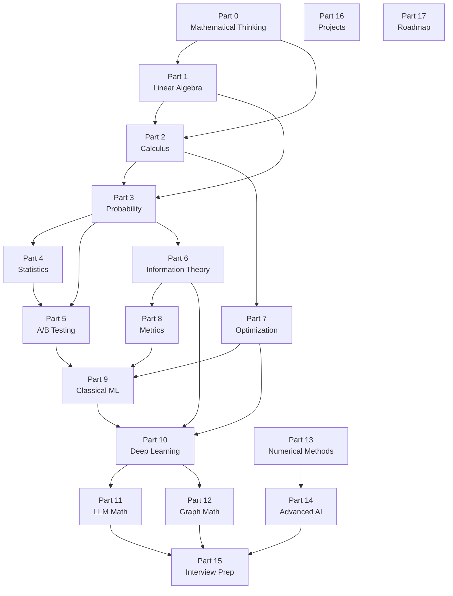

# Mathematics for AI/ML — The Complete Self-Study Course

> **Who this is for:** Anyone who wants to go from zero math knowledge to Research Engineer level.
> **What makes this different:** Every concept is taught the way a great teacher would explain it — with stories, pictures, and working code — before any formula appears.
> **Philosophy:** A 20-page chapter that teaches properly beats a 100-page chapter that dumps formulas.

---

## How to Use This Course

Read in order. Every part builds on the one before it.

The dependency graph below shows which parts unlock which. If you already know some material, use the graph to find your entry point — but always check the prerequisites at the top of each lesson before skipping ahead.



**Estimated time:** 6–18 months depending on your pace and prior knowledge. Use the roadmap in [Part 17](part-17-roadmap.md) to build a schedule.

---

## Table of Contents

### Phase 1 — Foundations

| Part | Title | Lessons | Key Topics |
|------|-------|---------|-----------|
| [0](part-00-mathematical-thinking.md) | Mathematical Thinking | 6 | What math is, notation, how to study |
| [1](part-01-linear-algebra.md) | Linear Algebra | 14 | Vectors, matrices, SVD, PCA, attention math |
| [2](part-02-calculus.md) | Calculus | 12 | Derivatives, gradients, backprop, integration |
| [3](part-03-probability.md) | Probability | 16 | Distributions, Bayes, MCMC, GMMs |
| [4](part-04-statistics.md) | Statistics | 10 | Hypothesis testing, MLE, bootstrap |
| [5](part-05-ab-testing.md) | A/B Testing & Experimentation | 10 | Experiment design, causal inference, bandits |
| [6](part-06-information-theory.md) | Information Theory | 8 | Entropy, KL divergence, mutual information |
| [7](part-07-optimization.md) | Optimization | 14 | GD, Adam, second-order, KKT |
| [8](part-08-model-evaluation-metrics.md) | Model Evaluation Metrics | 12 | Classification, regression, ranking, LLM, RAG |

### Phase 2 — Advanced Topics

| Part | Title | Status |
|------|-------|--------|
| [9](part-09-classical-ml.md) | Classical ML Mathematics | Phase 2 |
| [10](part-10-deep-learning.md) | Deep Learning Mathematics | Phase 2 |
| [11](part-11-llm-mathematics.md) | LLM Mathematics | Phase 2 |
| [12](part-12-graph-mathematics.md) | Graph Mathematics | Phase 2 |
| [13](part-13-numerical-methods.md) | Numerical Methods | Phase 2 |
| [14](part-14-advanced-ai.md) | Advanced AI Mathematics | Phase 2 |
| [15](part-15-interview-preparation.md) | Interview Preparation | Phase 2 |
| [16](part-16-projects.md) | Projects | Phase 2 |
| [17](part-17-roadmap.md) | Roadmap | Phase 2 |

---

## The Lesson Template

Every lesson in this course follows the same structure. Once you know the pattern, learning accelerates because you always know what comes next.

```
1. Why Was This Invented?      — The problem that forced people to invent this
2. Explain Like I Am 10        — The idea without any math
3. Visual Intuition            — ASCII or Mermaid diagram
4. Formal Definition           — The math, now that you understand the idea
5. Step-by-Step Derivation     — Every step shown, nothing skipped
6. Numerical Example           — Real numbers, hand-calculated
7. Python Implementation       — NumPy + PyTorch, every line commented
8. AI/ML Connection            — Where exactly this appears in real systems
9. Interview Questions         — Beginner through Research Scientist
10. Common Mistakes            — What trips people up and why
11. Research Notes             — How modern systems use this
```

---

## Running the Code

Every Python example in this course is self-contained and runnable.

```bash
cd math/code
pip install -r requirements.txt
python part-01/lesson-01-vectors.py
```

---

## Learning Principles

**Equations should feel inevitable.** By the time you see a formula, you should already know what it has to say. The story and intuition come first; the equation is just a precise way of writing down what you already understand.

**Understanding beats memorization.** You can always look up a formula. You cannot look up understanding. This course prioritizes the "why" over the "what."

**Code makes it real.** Every concept you learn, you implement. If you can write it, you understand it.

---

## Who This Course Is Based On

The teaching approach in this course draws from:

- **Richard Feynman** — Start from first principles; if you can't explain it simply, you don't understand it
- **3Blue1Brown** — Geometry and visual intuition before algebra
- **Gilbert Strang** — Linear algebra as the language of data
- **Andrew Ng** — Connect every concept to a real ML application
- **StatQuest** — No concept is too simple to explain clearly
- **Sebastian Raschka** — Code as a first-class way of understanding

---

*Start with [Part 0: Mathematical Thinking](part-00-mathematical-thinking.md).*
