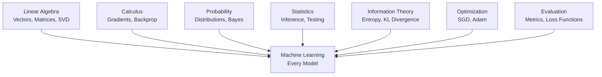

# Part 0: Mathematical Thinking

> **Prerequisites:** None. This is where we start.
> **What you'll learn:** What mathematics actually is, why it matters for AI, how to read equations, and how to build the habit of mathematical thinking.
> **Used later in:** Every single part of this course.

---

## The Problem This Part Solves

Most people who struggle with math don't have an intelligence problem. They have a *relationship* problem with math.

They were taught: "Here is the formula. Memorize it. Apply it."

This course teaches it differently: "Here is the problem. Here is why the problem is hard. Here is how a smart person would start thinking about it. And here — now that you understand — is the formula."

By the end of this part, you will know:
- What math actually is (it's not what school taught you)
- Why every AI operation is secretly just math
- How to read a formula without panicking
- How to study math so that it sticks

---

## Lesson 0.1: What Mathematics Actually Is

### Why Was This Invented?

Humans needed to communicate exact quantities without ambiguity.

"There are many fish in the river" is not precise enough to share with a partner. "There are 47 fish" is. Mathematics is the ultimate precision language — it removes all ambiguity.

But mathematics is not just counting. It is the study of **exact relationships between things**. And once you have exact relationships, you can reason about them, predict from them, and optimize them.

### Explain Like I Am 10 Years Old

Imagine you and your friend both see the same dog.

You say: "It's a big dog."
Your friend says: "It's a small dog."

Now you're arguing. Neither of you is exactly wrong — big and small are relative words.

But if you say: "The dog weighs 30 kg" — now there's no argument. That's a fact anyone can verify.

Mathematics is the language for saying things so precisely that there's no room for argument.

### Visual Intuition

Here is how math fits into the AI engineering workflow:

```
REAL WORLD PROBLEM
        |
        v
[Translate into math]   <--- This is the hard creative step
        |
        v
MATHEMATICAL PROBLEM
        |
        v
[Solve with tools]      <--- This is what school focused on
        |
        v
MATHEMATICAL SOLUTION
        |
        v
[Translate back]        <--- Often forgotten entirely
        |
        v
REAL WORLD SOLUTION
```

Most AI engineers who struggle are weak at step 1 and step 4 — translating between the real world and mathematics.

This course trains all four steps.

### The Seven Pillars of ML Mathematics

Every operation in machine learning is built from seven branches of mathematics. They are not separate subjects — they are seven lenses on the same underlying reality.



| Branch | Core Question | Example in AI |
|--------|--------------|---------------|
| Linear Algebra | How do we represent and transform data? | Word embeddings, attention, PCA |
| Calculus | How does output change when input changes? | Backpropagation, gradient descent |
| Probability | How do we reason under uncertainty? | Generative models, Bayesian learning |
| Statistics | How do we draw conclusions from data? | A/B testing, model evaluation |
| Information Theory | How much information is in data? | Cross-entropy loss, compression |
| Optimization | How do we find the best parameters? | All training procedures |
| Evaluation | How good is our model? | F1, AUC, BLEU, perplexity |

### The Universal Formula of Machine Learning

All of machine learning, every model, every approach, every architecture, can be described in one line:

$$
\theta^* = \arg\min_{\theta} \mathcal{L}(f_\theta(x), y)
$$

This says: find the parameters $\theta$ that make the function $f$ produce outputs as close as possible to the true answers $y$.

That's it. Linear regression, deep neural networks, GPT-4 — they all do this. The differences are in what $f$ looks like and how you run the minimization.

Every branch of math in this course is in service of understanding this one formula more deeply.

---

## Lesson 0.2: How to Read an Equation

### Why Was This Invented?

Mathematical notation is a compression system. It lets you write in one line what would take a paragraph in English. But like all compression, you need a decoder.

Most people encounter notation in textbooks without a decoder. They feel lost. The notation itself becomes the obstacle.

This lesson is the decoder.

### Explain Like I Am 10 Years Old

Imagine a recipe says: "Add 2 tbsp butter."

You need to know what "tbsp" means. Once you know it means tablespoon, the recipe is easy to read. The abbreviation didn't make the recipe harder — it made it shorter. Without it, the recipe would say "add two tablespoons" every time, which would get very long.

Mathematical symbols work the same way. Once you know the abbreviations, equations become easy to read.

### The Core Symbols

**Sets and numbers:**

| Symbol | Meaning | Example |
|--------|---------|---------|
| $\mathbb{R}$ | All real numbers | $3.14 \in \mathbb{R}$ |
| $\mathbb{Z}$ | All integers | $-2, 0, 5 \in \mathbb{Z}$ |
| $\mathbb{N}$ | Natural numbers | $1, 2, 3, \ldots \in \mathbb{N}$ |
| $\in$ | "is a member of" | $x \in \mathbb{R}$ means "$x$ is a real number" |
| $\forall$ | "for all" | $\forall x \in \mathbb{R}$ means "for every real number $x$" |
| $\exists$ | "there exists" | $\exists x$ means "there is at least one $x$" |

**Operations:**

| Symbol | Meaning | Example |
|--------|---------|---------|
| $\sum_{i=1}^{n} x_i$ | Sum $x_1 + x_2 + \cdots + x_n$ | $\sum_{i=1}^{3} i = 1 + 2 + 3 = 6$ |
| $\prod_{i=1}^{n} x_i$ | Product $x_1 \times x_2 \times \cdots \times x_n$ | $\prod_{i=1}^{3} i = 1 \times 2 \times 3 = 6$ |
| $\arg\min_x f(x)$ | The value of $x$ that makes $f(x)$ smallest | The best model parameters |
| $\arg\max_x f(x)$ | The value of $x$ that makes $f(x)$ largest | The most likely class |

**Calculus:**

| Symbol | Meaning |
|--------|---------|
| $\frac{df}{dx}$ | How much $f$ changes when $x$ changes by a tiny amount |
| $\frac{\partial f}{\partial x}$ | Same, but $f$ depends on multiple variables |
| $\nabla f$ | The gradient — a vector of all partial derivatives |
| $\int_a^b f(x)\, dx$ | The area under $f$ between $a$ and $b$ |

**Probability:**

| Symbol | Meaning |
|--------|---------|
| $P(A)$ | Probability of event $A$ |
| $P(A \mid B)$ | Probability of $A$ given that $B$ happened |
| $\mathbb{E}[X]$ | Expected value (average) of random variable $X$ |
| $\text{Var}(X)$ | Variance of $X$ |

### How to Read a Formula — A Method

When you see a formula you've never seen before, do this:

**Step 1.** Count the pieces. How many symbols are there?

**Step 2.** Name each piece. What does each symbol represent?

**Step 3.** Find the operation. Is something being summed? Maximized? Multiplied?

**Step 4.** Say it in English. What is this formula computing?

**Example:** Read this formula for the first time:

$$
\hat{y} = \frac{1}{n} \sum_{i=1}^{n} y_i
$$

- $\hat{y}$ — some estimate (the hat symbol always means "estimated value")
- $n$ — total number of things
- $\sum_{i=1}^{n}$ — add up from $i=1$ to $i=n$
- $y_i$ — the $i$-th value

English: "The estimated $y$ is the sum of all $y$ values divided by the count of them."

That's just the mean. You already knew what this was. Now you can read the formula.

### Numerical Example

Try decoding this formula:

$$
\text{MSE} = \frac{1}{n} \sum_{i=1}^{n} (y_i - \hat{y}_i)^2
$$

Data: true values $y = [3, -0.5, 2, 7]$, predictions $\hat{y} = [2.5, 0, 2, 8]$.

Step 1 — Compute each difference:
- $3 - 2.5 = 0.5$
- $-0.5 - 0 = -0.5$
- $2 - 2 = 0$
- $7 - 8 = -1$

Step 2 — Square each difference:
- $0.5^2 = 0.25$
- $(-0.5)^2 = 0.25$
- $0^2 = 0$
- $(-1)^2 = 1$

Step 3 — Average them:
$$
\text{MSE} = \frac{0.25 + 0.25 + 0 + 1}{4} = \frac{1.5}{4} = 0.375
$$

You just computed Mean Squared Error from scratch by reading the formula.

---

## Lesson 0.3: How to Study Mathematics

### The Wrong Way (How School Did It)

1. Read definition
2. Memorize formula
3. Apply formula to identical problems
4. Forget in two weeks

This produces students who can pass tests but cannot use math in new situations.

### The Right Way

The best mathematicians describe learning mathematics as a cycle:

```
     [Intuition]
         ^
         |
         |  makes sense now
         |
     [Formula] -----> [Derivation] -----> [Computation]
                           |
                           v
                       [Application]
                           |
                           v
                     [New Intuition]
```

**Step 1: Build intuition first.**
Before touching a formula, ask: "What problem does this solve?" Imagine the concept geometrically or in physical terms.

**Step 2: See the formula.**
Now the formula is a compact description of something you already understand.

**Step 3: Derive it yourself.**
Close the book. Try to re-derive the formula from your intuition. You will get stuck. That's where the learning happens.

**Step 4: Compute with numbers.**
Plug in specific numbers. See the formula do something real.

**Step 5: Code it.**
Write it in Python. If you can code it, you understand it. Code doesn't accept vague understanding — it demands precision.

**Step 6: Apply to AI.**
Find where this appears in a real model or system. Understanding in context is what makes knowledge stick.

### The Feynman Technique

After learning any concept, do this:

1. Write the name of the concept at the top of a blank page.
2. Explain it in plain English as if teaching a 10-year-old.
3. When you get stuck, you've found a gap. Go back and fill it.
4. Simplify your explanation. Remove all jargon.

If you cannot explain it simply, you don't understand it yet.

### Interleaving and Spacing

Research on learning shows two principles matter most:

**Interleaving:** Don't finish one topic completely before moving to the next. Alternate between topics. This feels harder but produces deeper learning.

**Spacing:** Review material at increasing intervals — 1 day, 1 week, 1 month. Use flash cards. The flash cards at the end of every part in this course are designed for this.

---

## Lesson 0.4: Notation Cheat Sheet

This is your reference. Come back here whenever you encounter an unfamiliar symbol.

### Scalars, Vectors, Matrices

| Object | Notation | Example |
|--------|----------|---------|
| Scalar | lowercase italic: $a, x, \lambda$ | $\lambda = 0.01$ |
| Vector | bold lowercase: $\mathbf{v}, \mathbf{x}$ | $\mathbf{x} \in \mathbb{R}^d$ |
| Matrix | bold uppercase: $\mathbf{A}, \mathbf{W}$ | $\mathbf{W} \in \mathbb{R}^{m \times n}$ |
| Tensor | bold or calligraphic: $\mathcal{T}$ | $\mathcal{T} \in \mathbb{R}^{B \times T \times d}$ |
| Vector transpose | $\mathbf{v}^T$ | Row vector |
| Matrix inverse | $\mathbf{A}^{-1}$ | $\mathbf{A}\mathbf{A}^{-1} = \mathbf{I}$ |

### Functions

| Notation | Meaning |
|----------|---------|
| $f: \mathbb{R}^n \to \mathbb{R}$ | $f$ takes an $n$-dimensional vector, returns a scalar |
| $f(x; \theta)$ | $f$ depends on $x$ (input) and $\theta$ (parameters) |
| $f \circ g$ | Composition: apply $g$ first, then $f$ |

### Distributions

| Notation | Meaning |
|----------|---------|
| $X \sim \mathcal{N}(\mu, \sigma^2)$ | $X$ is drawn from a Gaussian with mean $\mu$, variance $\sigma^2$ |
| $p(x)$ | Probability density or mass at $x$ |
| $p(x \mid y)$ | Conditional distribution of $x$ given $y$ |
| $\mathbb{E}_{x \sim p}[f(x)]$ | Expected value of $f(x)$ when $x$ is drawn from distribution $p$ |

### Norms

| Notation | Meaning |
|----------|---------|
| $\|\mathbf{v}\|_2$ | Euclidean length of vector $\mathbf{v}$ |
| $\|\mathbf{v}\|_1$ | Sum of absolute values |
| $\|\mathbf{A}\|_F$ | Frobenius norm of matrix |

### Optimization

| Notation | Meaning |
|----------|---------|
| $\mathcal{L}(\theta)$ | Loss function as a function of parameters |
| $\nabla_\theta \mathcal{L}$ | Gradient of loss with respect to parameters |
| $\frac{\partial \mathcal{L}}{\partial \theta_i}$ | Partial derivative of loss with respect to parameter $i$ |

---

## Lesson 0.5: Mathematics in Real AI Systems

### Every Line of an AI System Is Math

Let's trace a single forward pass through a transformer layer and identify every piece of math:

```
Token IDs [5, 2024, 13]
        |
        v
[Embedding lookup]          <-- Linear Algebra: matrix row selection
        |
        v
[Positional encoding]       <-- Trigonometry + Linear Algebra
        |
        v
[Q, K, V projections]       <-- Linear Algebra: matrix multiplication
        |
        v
[Attention scores]          <-- Dot products, scaling, softmax (Probability)
        |
        v
[Weighted sum of values]    <-- Linear Algebra: weighted combination
        |
        v
[Feed-forward network]      <-- Linear Algebra + Calculus (activations)
        |
        v
[Layer normalization]       <-- Statistics: mean and variance normalization
        |
        v
[Logits for next token]     <-- Linear Algebra
        |
        v
[Loss computation]          <-- Information Theory: cross-entropy
        |
        v
[Backward pass]             <-- Calculus: chain rule
        |
        v
[Parameter update]          <-- Optimization: Adam
```

Every node in this diagram is a topic in this course. By the end, you will be able to trace and derive every one of these steps.

### The Three Levels of Understanding

For any concept in AI math, there are three levels:

**Level 1 — User:** You know what the concept does and when to use it. Enough to apply it correctly.

**Level 2 — Engineer:** You can derive it from scratch. You understand why it works. You can debug problems involving it.

**Level 3 — Researcher:** You can generalize it, prove properties about it, and invent variations.

This course targets Level 2 for everything, with Level 3 windows opened for the most important concepts.

---

## Lesson 0.6: Proof vs Intuition

### When You Need a Proof

A proof is a guarantee. When the stakes are high — when you're deploying a model that makes medical decisions, or when you're claiming a new training method always converges — you need a proof.

Proofs matter in ML when:
- You want to guarantee convergence of an optimizer
- You want to bound generalization error
- You want to prove fairness properties

### When Intuition Is Enough

For most engineering work, strong intuition is more valuable than formal proof. You need to:
- Choose which model architecture to use
- Debug why training diverged
- Explain to a product manager why a metric is moving
- Design an experiment

These require intuition and judgment, not formal proof.

### The Balance in This Course

This course provides:
- **Proof for the foundational results** (eigenvalue decomposition, SVD properties, Bayes theorem)
- **Intuition-first for everything** — you understand before you prove
- **Derivation for key formulas** — deriving a result teaches you more than reading its proof

The goal is not to make you a pure mathematician. The goal is to make you a mathematically fluent engineer who can read papers, reason about systems, and explain decisions.

---

## Part 0 Summary

### Key Takeaways

1. Mathematics is a precision language for describing exact relationships.
2. All of machine learning is: find $\theta$ that minimizes a loss function $\mathcal{L}$.
3. Mathematical notation is compression — learn the abbreviations and equations become readable.
4. The right study method: intuition → formula → derivation → computation → code → application.
5. Every AI operation is math. This course explains the math behind every operation.

### Cheat Sheet

**Reading formulas:**
- $\sum$ = sum, $\prod$ = product, $\arg\min$ = "which value gives the minimum"
- $\hat{y}$ = estimated value, $y$ = true value
- $\nabla f$ = gradient (direction of steepest increase)
- $P(A \mid B)$ = probability of $A$ given $B$

**Study cycle:** Intuition → Formula → Derive → Compute → Code → Apply → Intuition

**Seven pillars:** Linear Algebra, Calculus, Probability, Statistics, Information Theory, Optimization, Evaluation

### Flash Cards

**Q: What is $\arg\min_\theta \mathcal{L}(\theta)$?**
A: The value of $\theta$ that makes the loss $\mathcal{L}$ as small as possible.

**Q: What does $x \sim \mathcal{N}(\mu, \sigma^2)$ mean?**
A: The random variable $x$ is drawn from a Normal distribution with mean $\mu$ and variance $\sigma^2$.

**Q: What is the Feynman technique?**
A: Explain the concept as if teaching a 10-year-old. Where you get stuck reveals what you don't understand.

**Q: Name the seven pillars of ML math.**
A: Linear Algebra, Calculus, Probability, Statistics, Information Theory, Optimization, Evaluation.

**Q: What is the universal ML formula?**
A: $\theta^* = \arg\min_\theta \mathcal{L}(f_\theta(x), y)$ — find parameters that minimize loss.

**Q: What does $\forall x \in \mathbb{R}$ mean?**
A: "For all real numbers $x$."

**Q: What does the hat on $\hat{y}$ mean?**
A: It is an *estimate* of $y$, not the true value.

### Common Mistakes

**Mistake:** Trying to memorize formulas before understanding them.
**Why it happens:** School trained us to memorize.
**Fix:** Always ask "what problem does this formula solve?" before learning it.

---

**Mistake:** Getting scared by unfamiliar notation.
**Why it happens:** Notation looks foreign at first.
**Fix:** Use the cheat sheet. Decode symbol by symbol.

---

**Mistake:** Reading math passively (like reading a novel).
**Why it happens:** We're used to passive reading.
**Fix:** Read with a pen. Verify every step. Ask "why is this step valid?"

---

*Next: [Part 1 — Linear Algebra](part-01-linear-algebra.md)*
