# Part 1: Linear Algebra

> **Prerequisites:** [Part 0 — Mathematical Thinking](part-00-mathematical-thinking.md)
> **What you'll learn:** How to represent and transform data mathematically. Every concept here appears directly in neural networks, embeddings, PCA, and transformer attention.
> **Used later in:** Calculus (Jacobians, Hessians), Probability (covariance matrices), Optimization (gradient geometry), Deep Learning (layers, attention), LLMs (embeddings, KV cache).

---

## The Narrative Spine

Don't learn topics in isolation. Each one answers a problem created by the last.

```mermaid
flowchart TD
    P1["Problem: GPS needs 2 numbers to describe position"] --> Vectors["Vectors"]
    P2["Problem: Need to store data for 1000 users"] --> Matrices["Matrices"]
    P3["Problem: Transform all vectors at once"] --> MatMul["Matrix Multiplication"]
    P4["Problem: Which dimensions carry real information?"] --> Rank["Rank & Subspaces"]
    P5["Problem: How far apart are two embeddings?"] --> Norms["Norms & Distance"]
    P6["Problem: How similar are two vectors?"] --> Dot["Dot Product"]
    P7["Problem: Combine vectors in 3D space"] --> Cross["Cross Product"]
    P8["Problem: Is this system solvable? Is it stable?"] --> Det["Determinant & Inverse"]
    P9["Problem: Which directions does a matrix preserve?"] --> Eigen["Eigenvalues & Eigenvectors"]
    P10["Problem: Compress data without losing structure"] --> SVD["SVD"]
    P11["Problem: Visualize 768-dim embeddings in 2D"] --> PCA["PCA"]
    P12["Problem: How do transformers attend to tokens?"] --> Attention["Attention Mathematics"]
```



---

## Lesson 1.1: Scalars, Vectors, Matrices, and Tensors

### Why Was This Invented?

Before you can do anything with data, you need to *represent* it. A single measurement (temperature, price, age) is fine as one number. But real-world data has many properties at once. A patient has age, height, weight, blood pressure. A word has meaning across hundreds of dimensions.

Mathematicians invented vectors, matrices, and tensors to represent structured data compactly.

### Explain Like I Am 10 Years Old

**Scalar:** Just a single number. The temperature outside is 22°C. Your age is 14. A single number is called a scalar.

**Vector:** A list of numbers that belong together. Your GPS position needs two numbers: "38° North, 77° West." These two numbers together tell you *one* location. A vector is a list of numbers that describes one thing.

**Matrix:** A grid of numbers. Your class has 30 students, each described by 5 test scores. That's 30 × 5 = 150 numbers arranged in a grid. That grid is a matrix.

**Tensor:** A generalization. One image is a 3D tensor (height × width × color channels). A batch of 32 images is a 4D tensor (32 × height × width × channels).

### Visual Intuition

```
Scalar:     3.14

Vector:     [3.14]        one row of numbers
            [2.71]
            [1.41]

Matrix:     [1  2  3]     rows × columns
            [4  5  6]
            [7  8  9]

Tensor:     Multiple matrices stacked (like a cube or hypercube)
```

A vector is an arrow in space. It has direction and length. When you have a 3-dimensional word embedding, the "word" lives at the tip of that arrow.

### Formal Definition

**Scalar:** A single real number $a \in \mathbb{R}$.

**Vector:** An ordered list of $n$ real numbers:

$$
\mathbf{v} = \begin{bmatrix} v_1 \\ v_2 \\ \vdots \\ v_n \end{bmatrix} \in \mathbb{R}^n
$$

The subscript tells you the position. $v_1$ is the first element.

**Matrix:** A rectangular array of real numbers with $m$ rows and $n$ columns:

$$
\mathbf{A} \in \mathbb{R}^{m \times n}, \quad a_{ij} \text{ is the element in row } i, \text{ column } j
$$

**Tensor:** An array with $k$ indices (called a *rank-$k$ tensor*):

| Rank | Name | Shape notation | AI example |
|------|------|---------------|-----------|
| 0 | Scalar | $()$ | Loss value |
| 1 | Vector | $(d,)$ | Word embedding |
| 2 | Matrix | $(m, n)$ | Weight matrix |
| 3 | 3D Tensor | $(B, T, d)$ | Batch of sequences |
| 4 | 4D Tensor | $(B, C, H, W)$ | Batch of images |

### Numerical Example

A sentence "The cat sat" can be embedded as three vectors, one per token:

$$
\text{"The"} \to \mathbf{v}_1 = \begin{bmatrix} 0.2 \\ 0.8 \\ -0.1 \end{bmatrix}, \quad
\text{"cat"} \to \mathbf{v}_2 = \begin{bmatrix} 0.9 \\ 0.1 \\ 0.4 \end{bmatrix}, \quad
\text{"sat"} \to \mathbf{v}_3 = \begin{bmatrix} -0.3 \\ 0.5 \\ 0.7 \end{bmatrix}
$$

Stack these as rows and you get the sequence matrix $\mathbf{X} \in \mathbb{R}^{3 \times 3}$ (3 tokens, 3-dim embedding).

### Python Implementation

```python
import numpy as np
import torch

# Scalar
a = 3.14
print(f"Scalar: {a}, type: {type(a)}")

# Vector (NumPy)
v = np.array([0.2, 0.8, -0.1])
print(f"Vector shape: {v.shape}")  # (3,)

# Matrix (NumPy)
X = np.array([
    [0.2,  0.8, -0.1],  # "The"
    [0.9,  0.1,  0.4],  # "cat"
    [-0.3, 0.5,  0.7],  # "sat"
])
print(f"Matrix shape: {X.shape}")  # (3, 3)

# Tensor (PyTorch) — batch of 2 sequences, length 3, embedding dim 4
T = torch.randn(2, 3, 4)
print(f"Tensor shape: {T.shape}")  # torch.Size([2, 3, 4])

# Accessing elements
print(f"X[1, 2] = {X[1, 2]}")  # Row 1, column 2 = 0.4
print(f"T[0, 2, 3] = {T[0, 2, 3]}")  # Batch 0, position 2, dim 3
```

### AI/ML Connection

- **Scalars:** Learning rate, loss value, temperature in sampling
- **Vectors:** Word embeddings (BERT: $\mathbb{R}^{768}$), hidden states, attention keys/queries/values
- **Matrices:** Weight matrices in every linear layer, attention score matrix
- **Tensors:** Every mini-batch is a tensor — the shape is always $(B, \ldots)$ where $B$ is batch size

### Common Mistakes

**Mistake:** Confusing shape notation. `(3,)` is a 1D vector. `(3, 1)` is a column matrix. They behave differently in operations.

**Mistake:** Thinking "tensor" is a PyTorch-specific thing. Tensors are mathematical objects. PyTorch/NumPy just provide convenient implementations.

---

## Lesson 1.2: Vector Spaces, Subspaces, Span, and Basis

### Why Was This Invented?

Once you have vectors, you need to understand the *space* they live in. Not every collection of vectors is useful. Some vectors carry redundant information. Some collections can reach any point in space; others cannot. The concepts of span and basis let us describe exactly what a set of vectors can and cannot represent.

### Explain Like I Am 10 Years Old

Imagine you are in a city and you can walk in two directions: North or East.

If you can walk any combination of North and East, you can reach any point in the city grid — any intersection.

But what if you could only walk Northeast (45°) or slightly-more-Northeast (50°)? You'd be stuck — you can only reach points along a diagonal strip, not the whole city.

**Span** is the set of all places you can reach with your given directions.
**Basis** is the smallest set of directions you need to reach everywhere.
**Subspace** is any smaller space within your full space.

### Formal Definition

**Vector Space:** A set $V$ of vectors that is closed under addition and scalar multiplication — meaning any linear combination of vectors in $V$ stays in $V$.

The most important vector space is $\mathbb{R}^n$ — all $n$-dimensional real vectors.

**Span:** The span of vectors $\mathbf{v}_1, \ldots, \mathbf{v}_k$ is all possible linear combinations:

$$
\text{span}(\mathbf{v}_1, \ldots, \mathbf{v}_k) = \{ \sum_{i=1}^{k} \alpha_i \mathbf{v}_i \;|\; \alpha_i \in \mathbb{R} \}
$$

**Subspace:** A subset $W \subseteq V$ that is itself a vector space (closed under addition and scalar multiplication). Every subspace contains the zero vector.

**Basis:** A set of linearly independent vectors whose span equals the entire space $V$. In $\mathbb{R}^n$, any basis has exactly $n$ vectors.

The standard basis for $\mathbb{R}^3$:

$$
\mathbf{e}_1 = \begin{bmatrix} 1 \\ 0 \\ 0 \end{bmatrix}, \quad
\mathbf{e}_2 = \begin{bmatrix} 0 \\ 1 \\ 0 \end{bmatrix}, \quad
\mathbf{e}_3 = \begin{bmatrix} 0 \\ 0 \\ 1 \end{bmatrix}
$$

Any vector in $\mathbb{R}^3$ is a linear combination of these three: $\mathbf{v} = v_1 \mathbf{e}_1 + v_2 \mathbf{e}_2 + v_3 \mathbf{e}_3$.

### Visual Intuition

```
In R²:

span({[1,0], [0,1]}) = all of R²    (you can reach every point)

span({[1,1]})        = a diagonal line through origin  (only one direction)

span({[1,0], [2,0]}) = x-axis only  (both vectors point in same direction
                                      — they are linearly DEPENDENT)
```

### AI/ML Connection

**Embedding spaces are vector spaces.** The famous word2vec result `"king" - "man" + "woman" ≈ "queen"` works because:
1. The embedding space is a vector space
2. Vector arithmetic is meaningful in that space
3. Gender is a direction in that space

**LoRA exploits low-rank structure.** A large weight matrix often lies in a low-dimensional subspace. LoRA (Low-Rank Adaptation) parameterizes only that subspace, dramatically reducing parameters.

**PCA finds a subspace.** PCA finds the subspace of $\mathbb{R}^d$ where the data has maximum variance. You project your data onto this subspace for compression.

---

## Lesson 1.3: Linear Independence and Dependence

### Why Was This Invented?

In data science, this is the question: "Is any of my features redundant?" If one feature can be perfectly predicted from others, it carries no new information. Linear dependence is the mathematical way to detect this.

### Explain Like I Am 10 Years Old

You have 3 friends describing where a treasure is buried:
- Friend 1: "Walk 2 steps North and 1 step East"
- Friend 2: "Walk 4 steps North and 2 steps East"
- Friend 3: "Walk 1 step North and 2 steps East"

Friend 2's direction is exactly double Friend 1's. They're pointing the same way. Friend 2 adds no new information.

Vectors are **linearly dependent** when one of them is a combination of the others (like Friend 2). They are **linearly independent** when each one points somewhere genuinely new.

### Formal Definition

Vectors $\mathbf{v}_1, \ldots, \mathbf{v}_k$ are **linearly independent** if:

$$
\alpha_1 \mathbf{v}_1 + \alpha_2 \mathbf{v}_2 + \cdots + \alpha_k \mathbf{v}_k = \mathbf{0} \implies \alpha_1 = \alpha_2 = \cdots = \alpha_k = 0
$$

The only way to get the zero vector is to use all zero coefficients.

They are **linearly dependent** if there exist $\alpha_1, \ldots, \alpha_k$ (not all zero) such that the sum equals zero.

### Numerical Example

Are these three vectors independent?

$$
\mathbf{v}_1 = \begin{bmatrix} 1 \\ 2 \\ 3 \end{bmatrix}, \quad
\mathbf{v}_2 = \begin{bmatrix} 2 \\ 4 \\ 6 \end{bmatrix}, \quad
\mathbf{v}_3 = \begin{bmatrix} 1 \\ 0 \\ 1 \end{bmatrix}
$$

Notice: $\mathbf{v}_2 = 2\mathbf{v}_1$. So $2\mathbf{v}_1 - \mathbf{v}_2 + 0\mathbf{v}_3 = \mathbf{0}$ with $\alpha_1 = 2, \alpha_2 = -1, \alpha_3 = 0$ (not all zero).

Therefore $\{\mathbf{v}_1, \mathbf{v}_2, \mathbf{v}_3\}$ is **linearly dependent**. They only span a 2D subspace, not 3D.

### Python Implementation

```python
import numpy as np

# Stack vectors as columns of a matrix
V = np.array([
    [1, 2, 1],
    [2, 4, 0],
    [3, 6, 1],
])

# Rank equals number of linearly independent columns
rank = np.linalg.matrix_rank(V)
print(f"Rank: {rank}")  # 2 — only 2 independent vectors, not 3

# Confirm: v2 = 2 * v1
v1, v2, v3 = V[:, 0], V[:, 1], V[:, 2]
print(f"v2 - 2*v1 = {v2 - 2*v1}")  # [0, 0, 0] — dependent!
```

### AI/ML Connection

**Multicollinearity in regression:** If input features are linearly dependent, the design matrix $\mathbf{X}^T \mathbf{X}$ is singular (non-invertible) and least squares has no unique solution. Always check feature independence.

**LoRA:** Empirically, weight updates during fine-tuning are nearly low-rank — they live in a much smaller subspace than the full weight space.

---

## Lesson 1.4: Rank, Null Space, Column Space, Row Space

### Why Was This Invented?

When you have a system of linear equations $\mathbf{Ax} = \mathbf{b}$, the most important question is: "Does a solution exist, and if so, is it unique?" Rank and the four fundamental subspaces answer this question completely.

### Explain Like I Am 10 Years Old

A matrix is like a machine that takes vectors in and produces vectors out.

**The column space** is all the vectors the machine can possibly output — its range. If you want to produce a specific output, it must be in the column space.

**The null space** is all inputs the machine turns into zero. These are the "invisible" inputs — the machine destroys them.

**Rank** tells you how powerful the machine is — how many truly different things it can produce.

### Formal Definition

For a matrix $\mathbf{A} \in \mathbb{R}^{m \times n}$:

| Subspace | Definition | Dimension |
|----------|-----------|-----------|
| Column Space $C(\mathbf{A})$ | All vectors $\mathbf{Ax}$ for $\mathbf{x} \in \mathbb{R}^n$ | $r = \text{rank}(\mathbf{A})$ |
| Row Space $C(\mathbf{A}^T)$ | All vectors $\mathbf{A}^T\mathbf{y}$ for $\mathbf{y} \in \mathbb{R}^m$ | $r$ |
| Null Space $N(\mathbf{A})$ | All $\mathbf{x}$ such that $\mathbf{Ax} = \mathbf{0}$ | $n - r$ |
| Left Null Space $N(\mathbf{A}^T)$ | All $\mathbf{y}$ such that $\mathbf{A}^T\mathbf{y} = \mathbf{0}$ | $m - r$ |

**Rank-Nullity Theorem:**

$$
\text{rank}(\mathbf{A}) + \text{nullity}(\mathbf{A}) = n
$$

The column and null spaces are perpendicular (orthogonal) complements. The row and left-null spaces are orthogonal complements.

### Visual Intuition

```
For A: R^n --> R^m  (input is n-dim, output is m-dim)

Input space R^n
  ┌─────────────────────────────────┐
  │  Null Space N(A)                │
  │  (maps to zero)                 │
  │                                 │
  │  Row Space C(A^T)               │
  │  (maps to column space)         │
  └─────────────────────────────────┘

Output space R^m
  ┌─────────────────────────────────┐
  │  Column Space C(A)              │
  │  (reachable outputs)            │
  │                                 │
  │  Left Null Space N(A^T)         │
  │  (unreachable from A)           │
  └─────────────────────────────────┘
```

### Numerical Example

$$
\mathbf{A} = \begin{bmatrix} 1 & 2 & 3 \\ 2 & 4 & 6 \end{bmatrix}
$$

$\mathbf{A} \in \mathbb{R}^{2 \times 3}$, so $m = 2$, $n = 3$.

Row 2 = 2 × Row 1, so rank $= 1$.

Null space: Solve $\mathbf{Ax} = \mathbf{0}$, i.e., $x_1 + 2x_2 + 3x_3 = 0$.

One free solution: $\mathbf{x} = [-2, 1, 0]^T$. Another: $\mathbf{x} = [-3, 0, 1]^T$.

Null space has dimension $n - r = 3 - 1 = 2$. Makes sense — rank-nullity: $1 + 2 = 3$.

### Python Implementation

```python
import numpy as np

A = np.array([[1, 2, 3], [2, 4, 6]], dtype=float)

print(f"Shape: {A.shape}")         # (2, 3)
print(f"Rank: {np.linalg.matrix_rank(A)}")  # 1

# Null space via SVD (columns of V corresponding to zero singular values)
U, s, Vt = np.linalg.svd(A)
print(f"Singular values: {s}")     # [7.48, 0.0] (one is ~0)

# Column space basis: columns of U for nonzero singular values
print(f"Column space dim: {np.sum(s > 1e-10)}")   # 1
# Null space: rows of Vt for zero singular values
null_space_basis = Vt[np.sum(s > 1e-10):, :]
print(f"Null space basis:\n{null_space_basis}")
```

### AI/ML Connection

**LoRA uses rank directly.** LoRA parameterizes $\Delta\mathbf{W} = \mathbf{B}\mathbf{A}$ where $\mathbf{B} \in \mathbb{R}^{m \times r}$, $\mathbf{A} \in \mathbb{R}^{r \times n}$, $r \ll \min(m, n)$. This forces the update to have low rank, reducing trainable parameters from $mn$ to $r(m + n)$.

**System of equations:** $\mathbf{Ax} = \mathbf{b}$ has a solution iff $\mathbf{b} \in C(\mathbf{A})$ (the column space). Understanding whether a solution exists requires understanding rank.

---

## Lesson 1.5: Distance and Norms

### Why Was This Invented?

Once you have vectors, you immediately need to measure how large they are and how far apart they are. Embeddings are only useful if "similar words are close together" — but close in what sense? Norms formalize the notion of distance.

### Explain Like I Am 10 Years Old

Imagine you're measuring how far you walked.

- **L2 (Euclidean):** Measure as the crow flies — straight-line distance. The familiar ruler.
- **L1 (Manhattan):** Measure by only walking along the grid — no diagonals allowed. Like city blocks.
- **L∞ (Max):** How far did you go in your single biggest direction?

Each definition of "distance" penalizes things differently and is useful in different situations.

### Visual Intuition

In 2D, the "unit ball" (all vectors with norm = 1) looks different for each norm:

```
L1 (Manhattan)     L2 (Euclidean)     L∞ (Max)
      +                   *               +-----+
     /|\                 ***              |     |
    / | \               *****             |     |
   /  |  \             *******            |     |
--+---+---+--        --+--*--+--        --+-----+--
   \  |  /             *******            |     |
    \ | /               *****             |     |
     \|/                 ***              |     |
      +                   *               +-----+

Diamond shape          Circle            Square
```

This geometry has a direct consequence: **L1 regularization (Lasso) produces sparse solutions**. Because the L1 ball is a diamond, optimization tends to land on the corners, which are on the axes — meaning most components are zero.

### Formal Definition

The $L^p$ norm of a vector $\mathbf{v} \in \mathbb{R}^n$:

$$
\|\mathbf{v}\|_p = \left( \sum_{i=1}^{n} |v_i|^p \right)^{1/p}
$$

Three special cases:

$$
\|\mathbf{v}\|_1 = \sum_{i=1}^{n} |v_i| \quad \text{(L1, Manhattan)}
$$

$$
\|\mathbf{v}\|_2 = \sqrt{\sum_{i=1}^{n} v_i^2} \quad \text{(L2, Euclidean)}
$$

$$
\|\mathbf{v}\|_\infty = \max_i |v_i| \quad \text{(L∞, Max)}
$$

**Cosine similarity** (used for embeddings):

$$
\text{cosine}(\mathbf{u}, \mathbf{v}) = \frac{\mathbf{u} \cdot \mathbf{v}}{\|\mathbf{u}\|_2 \|\mathbf{v}\|_2}
$$

This measures the *angle* between vectors, ignoring their magnitudes. Two vectors pointing in the same direction have cosine similarity 1, regardless of their lengths.

### Numerical Example

$$
\mathbf{v} = \begin{bmatrix} 3 \\ -4 \end{bmatrix}
$$

$$
\|\mathbf{v}\|_1 = |3| + |-4| = 7
$$

$$
\|\mathbf{v}\|_2 = \sqrt{3^2 + (-4)^2} = \sqrt{9 + 16} = \sqrt{25} = 5
$$

$$
\|\mathbf{v}\|_\infty = \max(|3|, |-4|) = 4
$$

**Cosine similarity example:**

$$
\mathbf{u} = \begin{bmatrix} 1 \\ 1 \end{bmatrix}, \quad \mathbf{v} = \begin{bmatrix} 2 \\ 2 \end{bmatrix}
$$

$$
\text{cosine}(\mathbf{u}, \mathbf{v}) = \frac{1 \cdot 2 + 1 \cdot 2}{\sqrt{2} \cdot \sqrt{8}} = \frac{4}{4} = 1
$$

They point in exactly the same direction, so cosine similarity = 1. (Even though their lengths differ.)

### Python Implementation

```python
import numpy as np
import torch

v = np.array([3.0, -4.0])

l1 = np.sum(np.abs(v))
l2 = np.linalg.norm(v)          # Default is L2
linf = np.max(np.abs(v))

print(f"L1: {l1}")    # 7.0
print(f"L2: {l2}")    # 5.0
print(f"L∞: {linf}")  # 4.0

# Cosine similarity
u = np.array([1.0, 1.0])
v2 = np.array([2.0, 2.0])
cos_sim = np.dot(u, v2) / (np.linalg.norm(u) * np.linalg.norm(v2))
print(f"Cosine similarity: {cos_sim}")  # 1.0

# PyTorch version
u_t = torch.tensor([1.0, 1.0])
v_t = torch.tensor([2.0, 2.0])
cos = torch.nn.functional.cosine_similarity(u_t.unsqueeze(0), v_t.unsqueeze(0))
print(f"PyTorch cosine: {cos.item()}")  # 1.0
```

### AI/ML Connection

- **L2 norm:** Used in Ridge regularization (add $\lambda \|\mathbf{w}\|_2^2$ to loss). Encourages small weights. Used in gradient clipping: if $\|\nabla\|_2 > \text{threshold}$, scale the gradient down.
- **L1 norm:** Used in Lasso regularization. Produces sparse weights — useful for feature selection.
- **Cosine similarity:** The standard distance measure for embedding similarity (BERT, GPT, word2vec). "Are these two sentences semantically similar?" → compute cosine similarity of their embeddings.
- **L∞ norm:** Used in adversarial attacks. $\epsilon$-ball in L∞ norm means: the attack can perturb each pixel by at most $\epsilon$.

### Interview Questions

**Beginner:** What is the L2 norm of $[3, 4]$?
Answer: $\sqrt{3^2 + 4^2} = 5$.

**Intermediate:** Why does L1 regularization produce sparsity but L2 does not?
Answer: The L1 ball is a diamond with corners on the coordinate axes. When you optimize subject to lying in the L1 ball, the solution tends to land on a corner (most coordinates zero). The L2 ball is smooth — no corners — so optimal points can have all nonzero coordinates.

**Staff:** When would you prefer cosine similarity over Euclidean distance for embeddings?
Answer: When magnitude is not meaningful — e.g., comparing documents of different lengths. A short document and a long document about the same topic should have high similarity. Cosine ignores the length (magnitude) and only looks at direction.

---

## Lesson 1.6: Dot Product, Outer Product, Hadamard Product, Cross Product, Kronecker Product

### Why Was This Invented?

Vectors need to interact with each other in multiple ways. The dot product measures alignment. The outer product builds matrices from vectors. The Hadamard product applies element-wise operations. Each answers a different question.

### The Dot Product

**Explain Like I Am 10:** You pull a sled. The rope goes at an angle. How much of your force actually moves the sled forward? The dot product tells you.

**Formal definition:**

$$
\mathbf{u} \cdot \mathbf{v} = \sum_{i=1}^{n} u_i v_i = \|\mathbf{u}\|_2 \|\mathbf{v}\|_2 \cos\theta
$$

where $\theta$ is the angle between the vectors.

**Key interpretations:**
- $\mathbf{u} \cdot \mathbf{v} > 0$: vectors point in similar directions
- $\mathbf{u} \cdot \mathbf{v} = 0$: vectors are **orthogonal** (perpendicular)
- $\mathbf{u} \cdot \mathbf{v} < 0$: vectors point in opposite directions

**Numerical example:**

$$
\mathbf{u} = [2, 3], \quad \mathbf{v} = [4, 1]
$$

$$
\mathbf{u} \cdot \mathbf{v} = 2 \times 4 + 3 \times 1 = 8 + 3 = 11
$$

### The Outer Product

The outer product of two vectors creates a **rank-1 matrix**:

$$
\mathbf{u} \otimes \mathbf{v} = \mathbf{u}\mathbf{v}^T \in \mathbb{R}^{m \times n}
$$

If $\mathbf{u} \in \mathbb{R}^m$ and $\mathbf{v} \in \mathbb{R}^n$, the result is $m \times n$.

**Numerical example:**

$$
\mathbf{u} = \begin{bmatrix} 1 \\ 2 \end{bmatrix}, \quad \mathbf{v} = \begin{bmatrix} 3 \\ 4 \\ 5 \end{bmatrix}
$$

$$
\mathbf{u}\mathbf{v}^T = \begin{bmatrix} 1 \times 3 & 1 \times 4 & 1 \times 5 \\ 2 \times 3 & 2 \times 4 & 2 \times 5 \end{bmatrix} = \begin{bmatrix} 3 & 4 & 5 \\ 6 & 8 & 10 \end{bmatrix}
$$

**AI use:** In SVD, a matrix is expressed as a sum of rank-1 outer products: $\mathbf{A} = \sum_i \sigma_i \mathbf{u}_i \mathbf{v}_i^T$. Also used in attention: the attention weight matrix for one head is formed by combining query-key dot products.

### The Hadamard Product (Element-wise)

$$
(\mathbf{A} \odot \mathbf{B})_{ij} = A_{ij} \cdot B_{ij}
$$

Simply multiply corresponding elements. Matrices must have the same shape.

**AI use:** Gating mechanisms in LSTMs and GRUs use element-wise multiplication. The "forget gate" $\mathbf{f}_t \odot \mathbf{c}_{t-1}$ element-wise scales the previous cell state.

### The Cross Product (3D only)

The cross product of two 3D vectors produces a third vector **perpendicular to both**:

$$
\mathbf{u} \times \mathbf{v} = \begin{bmatrix} u_2 v_3 - u_3 v_2 \\ u_3 v_1 - u_1 v_3 \\ u_1 v_2 - u_2 v_1 \end{bmatrix}
$$

The magnitude $\|\mathbf{u} \times \mathbf{v}\|_2 = \|\mathbf{u}\|_2 \|\mathbf{v}\|_2 \sin\theta$ equals the area of the parallelogram formed by the two vectors.

**AI use:** Primarily in 3D computer vision, robotics, and physics simulations. Less common in pure ML, but important in 3D neural networks (e.g., PointNet).

### The Kronecker Product

For matrices $\mathbf{A} \in \mathbb{R}^{m \times n}$ and $\mathbf{B} \in \mathbb{R}^{p \times q}$:

$$
\mathbf{A} \otimes \mathbf{B} = \begin{bmatrix} a_{11}\mathbf{B} & \cdots & a_{1n}\mathbf{B} \\ \vdots & \ddots & \vdots \\ a_{m1}\mathbf{B} & \cdots & a_{mn}\mathbf{B} \end{bmatrix} \in \mathbb{R}^{mp \times nq}
$$

**AI use:** K-FAC (Kronecker-Factored Approximate Curvature) approximates the Fisher information matrix as a Kronecker product for efficient second-order optimization.

### Python Implementation

```python
import numpy as np

u = np.array([2.0, 3.0, 1.0])
v = np.array([4.0, 1.0, 2.0])

# Dot product
dot = np.dot(u, v)                  # 2*4 + 3*1 + 1*2 = 13
print(f"Dot product: {dot}")

# Outer product
outer = np.outer(u, v)              # 3x3 matrix
print(f"Outer product shape: {outer.shape}")
print(outer)

# Hadamard (element-wise)
A = np.array([[1, 2], [3, 4]])
B = np.array([[5, 6], [7, 8]])
hadamard = A * B                    # [[5,12],[21,32]]
print(f"Hadamard:\n{hadamard}")

# Cross product (3D)
cross = np.cross(u, v)
print(f"Cross product: {cross}")
# Verify perpendicularity
print(f"u · (u×v) = {np.dot(u, cross)}")  # Should be ~0
print(f"v · (u×v) = {np.dot(v, cross)}")  # Should be ~0

# Kronecker product
A_small = np.array([[1, 2], [3, 4]])
B_small = np.eye(2)
kron = np.kron(A_small, B_small)
print(f"Kronecker shape: {kron.shape}")  # (4, 4)
```

---

## Lesson 1.7: Matrix Multiplication as Composition

### Why Was This Invented?

A single linear transformation (like "rotate by 45°") is fine. But what about "rotate, then scale, then project"? Matrix multiplication lets you compose multiple transformations into one.

### Explain Like I Am 10 Years Old

Suppose you have two machines:
- Machine A: takes in ingredients and mixes them
- Machine B: takes a mixture and cooks it

If you run A then B, you go from raw ingredients to cooked food. You could describe this as one combined machine: "Machine B(A(input))".

Matrix multiplication is the same idea. If $\mathbf{A}$ is one transformation and $\mathbf{B}$ is another, then $\mathbf{BA}$ is the combined transformation: first apply $\mathbf{A}$, then apply $\mathbf{B}$.

### Formal Definition

For $\mathbf{A} \in \mathbb{R}^{m \times k}$ and $\mathbf{B} \in \mathbb{R}^{k \times n}$:

$$
(\mathbf{AB})_{ij} = \sum_{l=1}^{k} A_{il} B_{lj}
$$

The result $\mathbf{C} = \mathbf{AB} \in \mathbb{R}^{m \times n}$.

The inner dimensions must match: $(m \times k)(k \times n) = (m \times n)$.

**Geometric meaning:** Each column of $\mathbf{AB}$ is the image of a column of $\mathbf{B}$ under the transformation $\mathbf{A}$.

### Step-by-Step Derivation

Let $\mathbf{A} = \begin{bmatrix} 1 & 2 \\ 3 & 4 \end{bmatrix}$ and $\mathbf{B} = \begin{bmatrix} 5 & 6 \\ 7 & 8 \end{bmatrix}$.

$$
\mathbf{C} = \mathbf{AB}
$$

Entry $C_{11}$ (row 1 of $\mathbf{A}$, column 1 of $\mathbf{B}$):
$$C_{11} = 1 \times 5 + 2 \times 7 = 5 + 14 = 19$$

Entry $C_{12}$ (row 1 of $\mathbf{A}$, column 2 of $\mathbf{B}$):
$$C_{12} = 1 \times 6 + 2 \times 8 = 6 + 16 = 22$$

Entry $C_{21}$ (row 2 of $\mathbf{A}$, column 1 of $\mathbf{B}$):
$$C_{21} = 3 \times 5 + 4 \times 7 = 15 + 28 = 43$$

Entry $C_{22}$ (row 2 of $\mathbf{A}$, column 2 of $\mathbf{B}$):
$$C_{22} = 3 \times 6 + 4 \times 8 = 18 + 32 = 50$$

$$
\mathbf{C} = \begin{bmatrix} 19 & 22 \\ 43 & 50 \end{bmatrix}
$$

### Python Implementation

```python
import numpy as np
import torch

A = np.array([[1, 2], [3, 4]])
B = np.array([[5, 6], [7, 8]])

# Matrix multiplication
C = A @ B           # Preferred notation since Python 3.5
print(C)            # [[19, 22], [43, 50]]

# Equivalent: np.matmul(A, B)
C2 = np.matmul(A, B)
assert np.allclose(C, C2)

# Matrix-vector multiplication: Ax = y
x = np.array([1.0, 2.0])
y = A @ x           # [5., 11.]
print(f"Ax = {y}")

# PyTorch: identical
A_t = torch.tensor([[1., 2.], [3., 4.]])
B_t = torch.tensor([[5., 6.], [7., 8.]])
C_t = A_t @ B_t
print(C_t)  # tensor([[19., 22.], [43., 50.]])

# Batched matrix multiplication (crucial for transformers)
batch_A = torch.randn(32, 8, 64)   # 32 examples, 8x64 matrices each
batch_B = torch.randn(32, 64, 16)  # 32 examples, 64x16 matrices each
batch_C = batch_A @ batch_B        # Shape: (32, 8, 16)
print(f"Batched result shape: {batch_C.shape}")
```

### AI/ML Connection

Every forward pass in a neural network is a chain of matrix multiplications:

```
input x ∈ R^d
      |
      v  W₁ ∈ R^{h×d}
   h₁ = W₁x + b₁  ∈ R^h
      |
      v  W₂ ∈ R^{o×h}
   output = W₂h₁ + b₂  ∈ R^o
```

A transformer's query-key attention score is: $\text{score} = \mathbf{Q}\mathbf{K}^T / \sqrt{d_k}$, where $\mathbf{Q}, \mathbf{K} \in \mathbb{R}^{T \times d_k}$. This is one matrix multiplication.

**Common Mistakes:**

**Mistake:** $\mathbf{AB} \neq \mathbf{BA}$ in general. Matrix multiplication is not commutative. Always check which order you need.

**Mistake:** Confusing shapes. Before any matrix multiply, verify: inner dimensions match.

---

## Lesson 1.8: Determinant, Trace, Inverse, and Pseudo-Inverse

### Why Was This Invented?

You need to know: can this system of equations be solved? Is this transformation invertible? How much does it scale space? These questions need answers before computing.

### The Determinant

**ELI10:** The determinant tells you how much a matrix "scales" area (in 2D) or volume (in 3D). A determinant of 2 means areas get doubled. A determinant of 0 means everything collapses flat — information is lost and the transformation is not reversible.

**Formal definition:** For a $2 \times 2$ matrix:

$$
\det\left(\begin{bmatrix} a & b \\ c & d \end{bmatrix}\right) = ad - bc
$$

For larger matrices, expand along any row or column (Laplace expansion), or use LU decomposition.

**Key properties:**
- $\det(\mathbf{AB}) = \det(\mathbf{A})\det(\mathbf{B})$
- $\det(\mathbf{A}^T) = \det(\mathbf{A})$
- $\det(\mathbf{A}) = 0 \iff \mathbf{A}$ is singular (non-invertible)
- If $\mathbf{A}$ has eigenvalues $\lambda_1, \ldots, \lambda_n$: $\det(\mathbf{A}) = \prod_i \lambda_i$

**Numerical example:**

$$
\det\left(\begin{bmatrix} 3 & 2 \\ 1 & 4 \end{bmatrix}\right) = 3 \times 4 - 2 \times 1 = 12 - 2 = 10
$$

### The Trace

The trace is the sum of diagonal elements:

$$
\text{tr}(\mathbf{A}) = \sum_{i=1}^{n} A_{ii}
$$

**Properties:**
- $\text{tr}(\mathbf{AB}) = \text{tr}(\mathbf{BA})$ (cyclic property — extremely useful)
- If $\mathbf{A}$ has eigenvalues $\lambda_1, \ldots, \lambda_n$: $\text{tr}(\mathbf{A}) = \sum_i \lambda_i$

**AI use:** The Frobenius norm squared can be written as $\|\mathbf{A}\|_F^2 = \text{tr}(\mathbf{A}^T \mathbf{A})$. Trace appears in the derivative of matrix expressions.

### The Inverse

The inverse $\mathbf{A}^{-1}$ satisfies $\mathbf{A}\mathbf{A}^{-1} = \mathbf{A}^{-1}\mathbf{A} = \mathbf{I}$.

Exists if and only if $\det(\mathbf{A}) \neq 0$ (matrix is non-singular / full rank).

For $2 \times 2$:

$$
\begin{bmatrix} a & b \\ c & d \end{bmatrix}^{-1} = \frac{1}{ad - bc} \begin{bmatrix} d & -b \\ -c & a \end{bmatrix}
$$

**Numerical example:**

$$
\mathbf{A} = \begin{bmatrix} 3 & 2 \\ 1 & 4 \end{bmatrix}, \quad \det(\mathbf{A}) = 10
$$

$$
\mathbf{A}^{-1} = \frac{1}{10}\begin{bmatrix} 4 & -2 \\ -1 & 3 \end{bmatrix}
$$

Verify: $\mathbf{A}\mathbf{A}^{-1} = \frac{1}{10}\begin{bmatrix} 12-2 & -6+6 \\ 4-4 & -2+12 \end{bmatrix} = \frac{1}{10}\begin{bmatrix} 10 & 0 \\ 0 & 10 \end{bmatrix} = \mathbf{I}$ ✓

### The Moore-Penrose Pseudo-Inverse

When $\mathbf{A}$ is not square or not full rank, the inverse does not exist. The pseudo-inverse $\mathbf{A}^+$ extends inversion to these cases.

**Via SVD:** If $\mathbf{A} = \mathbf{U}\mathbf{\Sigma}\mathbf{V}^T$, then:

$$
\mathbf{A}^+ = \mathbf{V}\mathbf{\Sigma}^+\mathbf{U}^T
$$

where $\mathbf{\Sigma}^+$ is obtained by replacing each nonzero singular value with its reciprocal.

**AI use:** Least squares solution: $\hat{\mathbf{x}} = \mathbf{A}^+ \mathbf{b}$ gives the minimum-norm solution to $\mathbf{Ax} = \mathbf{b}$. Used in linear regression: $\hat{\boldsymbol{\beta}} = (\mathbf{X}^T\mathbf{X})^{-1}\mathbf{X}^T\mathbf{y}$.

### Python Implementation

```python
import numpy as np

A = np.array([[3., 2.], [1., 4.]])

print(f"Determinant: {np.linalg.det(A)}")  # 10.0
print(f"Trace: {np.trace(A)}")             # 7.0

# Inverse
A_inv = np.linalg.inv(A)
print(f"Inverse:\n{A_inv}")
print(f"A @ A_inv ≈ I:\n{np.round(A @ A_inv, 10)}")

# Pseudo-inverse (works for non-square and singular matrices)
B = np.array([[1., 2., 3.], [4., 5., 6.]])  # 2x3 matrix, not square
B_plus = np.linalg.pinv(B)
print(f"Pseudo-inverse shape: {B_plus.shape}")  # (3, 2)
print(f"B @ B+ ≈ I_2:\n{np.round(B @ B_plus, 10)}")
```

### Common Mistakes

**Mistake:** Using `np.linalg.inv(A) @ b` to solve $\mathbf{Ax} = \mathbf{b}$. This is slow and numerically unstable. Use `np.linalg.solve(A, b)` instead.

**Mistake:** Assuming an inverse exists without checking. Always verify $\det(\mathbf{A}) \neq 0$ or check rank first.

---

## Lesson 1.9: Orthogonality and Projection

### Why Was This Invented?

Least squares regression, QR decomposition, PCA, and attention — all of these require projecting one vector onto a space defined by others. Orthogonality is the geometric tool that makes projection exact and efficient.

### Explain Like I Am 10 Years Old

You're at a park. Your friend is walking along a straight path. You're off the path. You want to find the point on the path *closest* to you.

You draw a line from yourself to the path at a right angle (perpendicular). That foot-of-the-perpendicular is the projection of your position onto the path.

"Orthogonal" means perpendicular. "Projection" means finding the closest point in a given direction or space.

### Formal Definition

Vectors $\mathbf{u}$ and $\mathbf{v}$ are **orthogonal** if $\mathbf{u} \cdot \mathbf{v} = 0$.

The **projection** of vector $\mathbf{b}$ onto vector $\mathbf{a}$:

$$
\text{proj}_{\mathbf{a}} \mathbf{b} = \frac{\mathbf{a} \cdot \mathbf{b}}{\|\mathbf{a}\|_2^2} \mathbf{a}
$$

The **projection matrix** onto the direction of $\mathbf{a}$:

$$
\mathbf{P} = \frac{\mathbf{a}\mathbf{a}^T}{\mathbf{a}^T\mathbf{a}}
$$

This satisfies $\mathbf{P}^2 = \mathbf{P}$ (idempotent — projecting twice is the same as projecting once) and $\mathbf{P}^T = \mathbf{P}$ (symmetric).

**Projection onto a subspace:** If $\mathbf{A}$ has orthonormal columns ($\mathbf{A}^T\mathbf{A} = \mathbf{I}$), then:

$$
\mathbf{P} = \mathbf{A}\mathbf{A}^T
$$

### Derivation: Least Squares from Projection

The least squares problem: fit $\hat{\mathbf{y}} = \mathbf{X}\boldsymbol{\beta}$ to minimize $\|\mathbf{y} - \mathbf{X}\boldsymbol{\beta}\|_2^2$.

The solution $\hat{\mathbf{y}} = \mathbf{X}\hat{\boldsymbol{\beta}}$ is the **projection** of $\mathbf{y}$ onto the column space of $\mathbf{X}$.

**Step 1:** The residual $\mathbf{r} = \mathbf{y} - \mathbf{X}\hat{\boldsymbol{\beta}}$ must be orthogonal to every column of $\mathbf{X}$ (otherwise we haven't found the closest point):

$$
\mathbf{X}^T \mathbf{r} = \mathbf{0}
$$

**Step 2:** Substitute the residual:

$$
\mathbf{X}^T(\mathbf{y} - \mathbf{X}\hat{\boldsymbol{\beta}}) = \mathbf{0}
$$

**Step 3:** Expand:

$$
\mathbf{X}^T\mathbf{y} - \mathbf{X}^T\mathbf{X}\hat{\boldsymbol{\beta}} = \mathbf{0}
$$

**Step 4:** Solve (normal equations):

$$
\hat{\boldsymbol{\beta}} = (\mathbf{X}^T\mathbf{X})^{-1}\mathbf{X}^T\mathbf{y}
$$

This is the closed-form solution to linear regression. Every step was geometry.

### Python Implementation

```python
import numpy as np

# Projection of b onto a
a = np.array([1.0, 1.0, 0.0])
b = np.array([2.0, 1.0, 3.0])

proj = (np.dot(a, b) / np.dot(a, a)) * a
print(f"Projection of b onto a: {proj}")  # [1.5, 1.5, 0.0]

residual = b - proj
print(f"Residual: {residual}")  # [0.5, -0.5, 3.0]
print(f"Orthogonal? {np.isclose(np.dot(a, residual), 0)}")  # True

# Least squares: fit y = Xβ
np.random.seed(42)
n, d = 100, 3
X = np.random.randn(n, d)
beta_true = np.array([1.0, -2.0, 0.5])
y = X @ beta_true + 0.1 * np.random.randn(n)

# Normal equations
beta_hat = np.linalg.inv(X.T @ X) @ X.T @ y
print(f"Estimated β: {beta_hat}")
print(f"True β:      {beta_true}")

# NumPy's built-in least squares (more numerically stable)
beta_lstsq, _, _, _ = np.linalg.lstsq(X, y, rcond=None)
print(f"np.linalg.lstsq: {beta_lstsq}")
```

---

## Lesson 1.10: Eigenvalues and Eigenvectors

### Why Was This Invented?

When you apply a linear transformation (multiply by a matrix), most vectors change direction. But some special vectors only get scaled — they stay pointing in the same direction. These are eigenvectors. The scaling factors are eigenvalues. They reveal the intrinsic geometric structure of the transformation.

### Explain Like I Am 10 Years Old

Imagine you have a stretching machine. You put in a rubber band, and the machine stretches it.

For most rubber bands, when you put them in at any angle, they come out stretched but *also rotated*.

But for a few special angles, the rubber band comes out stretched but *not rotated* — just longer or shorter. Those special angles are the **eigenvectors**. How much they get stretched is the **eigenvalue**.

### Formal Definition

For a square matrix $\mathbf{A} \in \mathbb{R}^{n \times n}$:

$$
\mathbf{A}\mathbf{v} = \lambda\mathbf{v}
$$

where $\mathbf{v} \neq \mathbf{0}$ is an **eigenvector** and $\lambda \in \mathbb{R}$ (or $\mathbb{C}$) is the corresponding **eigenvalue**.

The eigenvector is only scaled (by $\lambda$), not rotated.

### Finding Eigenvalues — The Characteristic Equation

**Step 1:** Rearrange $\mathbf{Av} = \lambda\mathbf{v}$ as $(\mathbf{A} - \lambda\mathbf{I})\mathbf{v} = \mathbf{0}$.

**Step 2:** For this to have a nonzero solution $\mathbf{v}$, the matrix $(\mathbf{A} - \lambda\mathbf{I})$ must be singular:

$$
\det(\mathbf{A} - \lambda\mathbf{I}) = 0
$$

This is the **characteristic equation**. Solving it gives the eigenvalues.

**Step 3:** For each eigenvalue $\lambda_i$, solve $(\mathbf{A} - \lambda_i \mathbf{I})\mathbf{v} = \mathbf{0}$ to find the eigenvector.

### Numerical Example

$$
\mathbf{A} = \begin{bmatrix} 4 & 1 \\ 2 & 3 \end{bmatrix}
$$

**Step 1:** Write the characteristic equation:

$$
\det\left(\begin{bmatrix} 4 - \lambda & 1 \\ 2 & 3 - \lambda \end{bmatrix}\right) = 0
$$

**Step 2:** Expand the determinant:

$$
(4 - \lambda)(3 - \lambda) - (1)(2) = 0
$$

$$
12 - 4\lambda - 3\lambda + \lambda^2 - 2 = 0
$$

$$
\lambda^2 - 7\lambda + 10 = 0
$$

**Step 3:** Factor:

$$
(\lambda - 5)(\lambda - 2) = 0 \implies \lambda_1 = 5, \quad \lambda_2 = 2
$$

**Step 4:** Find eigenvectors.

For $\lambda_1 = 5$: $(\mathbf{A} - 5\mathbf{I})\mathbf{v} = \mathbf{0}$:

$$
\begin{bmatrix} -1 & 1 \\ 2 & -2 \end{bmatrix}\mathbf{v} = \mathbf{0}
$$

Row 1: $-v_1 + v_2 = 0 \implies v_1 = v_2$. So $\mathbf{v}_1 = \begin{bmatrix} 1 \\ 1 \end{bmatrix}$ (any scalar multiple).

For $\lambda_2 = 2$: $(A - 2I)v = 0$:

$$
\begin{bmatrix} 2 & 1 \\ 2 & 1 \end{bmatrix}\mathbf{v} = \mathbf{0}
$$

$2v_1 + v_2 = 0 \implies v_2 = -2v_1$. So $\mathbf{v}_2 = \begin{bmatrix} 1 \\ -2 \end{bmatrix}$.

### Spectral Decomposition (Eigendecomposition)

For a **symmetric** matrix $\mathbf{A}$ (where $\mathbf{A}^T = \mathbf{A}$), eigenvalues are always real and eigenvectors can be chosen to be orthonormal:

$$
\mathbf{A} = \mathbf{Q}\mathbf{\Lambda}\mathbf{Q}^T
$$

where $\mathbf{Q} = [\mathbf{v}_1 | \mathbf{v}_2 | \cdots | \mathbf{v}_n]$ (orthonormal eigenvectors as columns) and $\mathbf{\Lambda} = \text{diag}(\lambda_1, \ldots, \lambda_n)$.

**Geometric meaning:** In the eigenvector basis, the matrix is just scaling — each direction scales by its eigenvalue.

### Python Implementation

```python
import numpy as np
import torch

A = np.array([[4., 1.], [2., 3.]])

# Find eigenvalues and eigenvectors
eigenvalues, eigenvectors = np.linalg.eig(A)
print(f"Eigenvalues: {eigenvalues}")     # [5.0, 2.0]
print(f"Eigenvectors:\n{eigenvectors}")  # columns are eigenvectors

# Verify: Av = λv
v1 = eigenvectors[:, 0]
lambda1 = eigenvalues[0]
print(f"Av1 = {A @ v1}")
print(f"λ1 v1 = {lambda1 * v1}")  # Should match

# Symmetric matrix — use eigh for efficiency (returns real values, sorted)
S = np.array([[4., 2.], [2., 3.]])  # symmetric
evals, evecs = np.linalg.eigh(S)
print(f"\nSymmetric eigenvalues: {evals}")

# Reconstruct from decomposition
S_reconstructed = evecs @ np.diag(evals) @ evecs.T
print(f"Reconstruction error: {np.max(np.abs(S - S_reconstructed))}")  # ~0
```

### AI/ML Connection

**PCA** finds the eigenvectors of the data covariance matrix. The eigenvector with the largest eigenvalue points in the direction of maximum variance.

**Graph Neural Networks** use eigenvectors of the graph Laplacian for spectral graph convolution.

**Positive Definite Matrices:** A symmetric matrix with all positive eigenvalues is positive definite (PD). The Hessian of a loss being PD at a point $\theta$ means $\theta$ is a local minimum.

---

## Lesson 1.11: Matrix Decompositions — LU, QR, Cholesky, SVD

### Why Was This Invented?

Raw matrix operations are slow and numerically unstable. Decompositions factor a matrix into simpler pieces that are easier to compute with. They are the "divide and conquer" of linear algebra.

### LU Decomposition

**What it does:** Factors $\mathbf{A} = \mathbf{L}\mathbf{U}$ where $\mathbf{L}$ is lower triangular (zeros above diagonal) and $\mathbf{U}$ is upper triangular (zeros below diagonal). Usually with a permutation: $\mathbf{PA} = \mathbf{LU}$.

**Why:** Solving $\mathbf{Ax} = \mathbf{b}$ reduces to two triangular solves (fast), not full Gaussian elimination each time.

**AI use:** Solving linear systems efficiently. Computing determinants efficiently: $\det(\mathbf{A}) = \det(\mathbf{L})\det(\mathbf{U}) = \prod_i U_{ii}$.

### QR Decomposition

**What it does:** Factors $\mathbf{A} = \mathbf{Q}\mathbf{R}$ where $\mathbf{Q}$ has orthonormal columns ($\mathbf{Q}^T\mathbf{Q} = \mathbf{I}$) and $\mathbf{R}$ is upper triangular.

**How:** Gram-Schmidt orthogonalization. Take each column of $\mathbf{A}$, subtract its projection onto previous columns, normalize.

**Why:** QR factorization is the preferred way to solve least squares. It avoids squaring the condition number (unlike the normal equations approach).

**AI use:** Stable solution of linear regression. Eigenvalue algorithms (QR iteration finds all eigenvalues).

### Cholesky Decomposition

**What it does:** For a symmetric positive definite matrix: $\mathbf{A} = \mathbf{L}\mathbf{L}^T$ where $\mathbf{L}$ is lower triangular with positive diagonal entries.

**Why:** Twice as fast as LU for SPD matrices. Numerically stable.

**AI use:** Sampling from multivariate Gaussians: to sample $\mathbf{x} \sim \mathcal{N}(\boldsymbol{\mu}, \mathbf{\Sigma})$, compute $\mathbf{L} = \text{chol}(\mathbf{\Sigma})$, then $\mathbf{x} = \boldsymbol{\mu} + \mathbf{L}\mathbf{z}$ where $\mathbf{z} \sim \mathcal{N}(\mathbf{0}, \mathbf{I})$. Also used in Gaussian Processes.

### SVD (Singular Value Decomposition)

The most important matrix decomposition in machine learning.

**Formal definition:** Every matrix $\mathbf{A} \in \mathbb{R}^{m \times n}$ (even non-square, even rank-deficient) can be written as:

$$
\mathbf{A} = \mathbf{U}\mathbf{\Sigma}\mathbf{V}^T
$$

where:
- $\mathbf{U} \in \mathbb{R}^{m \times m}$: orthonormal columns (left singular vectors)
- $\mathbf{\Sigma} \in \mathbb{R}^{m \times n}$: diagonal matrix with $\sigma_1 \geq \sigma_2 \geq \cdots \geq 0$ (singular values)
- $\mathbf{V} \in \mathbb{R}^{n \times n}$: orthonormal columns (right singular vectors)

**Visual intuition:**

```
        A          =      U        Σ        V^T
   (m × n)           (m × m) (m × n)   (n × n)

  [rotate   [stretch    [rotate
  in         or        in output
  input      shrink    space]
  space]     each dim]
```

**Why SVD exists for ALL matrices:** Unlike eigendecomposition (only for square matrices), SVD works for any matrix shape, including rectangular and singular.

**Derivation sketch:**

Step 1: Form $\mathbf{A}^T\mathbf{A}$ (symmetric, PSD). Its eigendecomposition gives $\mathbf{A}^T\mathbf{A} = \mathbf{V}\mathbf{\Lambda}\mathbf{V}^T$ where $\Lambda_{ii} = \sigma_i^2$.

Step 2: Define $\mathbf{U}$ such that $\mathbf{U}_i = \mathbf{A}\mathbf{V}_i / \sigma_i$ for $\sigma_i > 0$.

Step 3: These $\mathbf{U}_i$ are orthonormal (can verify).

Step 4: $\mathbf{A} = \mathbf{U}\mathbf{\Sigma}\mathbf{V}^T$ follows.

**Low-rank approximation (Eckart-Young Theorem):**

The best rank-$k$ approximation to $\mathbf{A}$ (in both Frobenius and spectral norm) is:

$$
\mathbf{A}_k = \sum_{i=1}^{k} \sigma_i \mathbf{u}_i \mathbf{v}_i^T
$$

Keep only the $k$ largest singular values and their corresponding vectors. This is why SVD is the foundation of PCA.

**Numerical example:**

$$
\mathbf{A} = \begin{bmatrix} 3 & 1 \\ 1 & 3 \end{bmatrix}
$$

Compute $\mathbf{A}^T\mathbf{A} = \mathbf{A}^2 = \begin{bmatrix} 10 & 6 \\ 6 & 10 \end{bmatrix}$ (since $\mathbf{A}$ is symmetric, $\mathbf{A}^T = \mathbf{A}$).

Eigenvalues of $\mathbf{A}^T\mathbf{A}$: $\lambda_1 = 16, \lambda_2 = 4$. So $\sigma_1 = 4, \sigma_2 = 2$.

This means $\mathbf{A}$ stretches its principal direction by 4× and its secondary direction by 2×.

### Python Implementation

```python
import numpy as np

A = np.array([[3., 1., 1.], [1., 3., 1.]])  # 2x3 matrix

# Full SVD
U, s, Vt = np.linalg.svd(A)
print(f"U shape: {U.shape}")   # (2, 2)
print(f"s: {s}")               # singular values
print(f"Vt shape: {Vt.shape}") # (3, 3)

# Reconstruct A from SVD
Sigma = np.zeros(A.shape)
np.fill_diagonal(Sigma, s)
A_reconstructed = U @ Sigma @ Vt
print(f"Reconstruction error: {np.max(np.abs(A - A_reconstructed)):.2e}")

# Low-rank approximation (keep top 1 singular value)
k = 1
A_approx = s[0] * np.outer(U[:, 0], Vt[0, :])
print(f"Rank-1 approx:\n{A_approx}")
print(f"Approximation error: {np.linalg.norm(A - A_approx, 'fro'):.4f}")

# Cholesky (for symmetric positive definite)
S = np.array([[4., 2.], [2., 3.]])  # symmetric PD
L = np.linalg.cholesky(S)
print(f"\nCholesky L:\n{L}")
print(f"L @ L.T:\n{L @ L.T}")  # Should recover S

# QR decomposition
A_qr = np.random.randn(4, 3)
Q, R = np.linalg.qr(A_qr)
print(f"\nQ orthonormal? Q.T @ Q:\n{np.round(Q.T @ Q, 10)}")  # Identity
```

---

## Lesson 1.12: Principal Component Analysis (PCA)

### Why Was This Invented?

You have data with 1000 features per sample. Plotting, visualizing, or training a model on 1000 dimensions is expensive and often inaccurate (the "curse of dimensionality"). Can we reduce to, say, 2 dimensions while losing as little information as possible?

PCA answers this by finding the directions of maximum variance.

### Explain Like I Am 10 Years Old

Imagine you have a cloud of points in 3D space that all roughly lie on a flat table (a 2D surface tilted in 3D space).

If you took a photo from straight above, you'd lose the height information (which isn't very important since the table is flat).
If you took a photo from the side, you'd see the table in full 2D glory.

PCA finds the "best angle" to photograph your data from. The two directions it finds for the photograph are the first two principal components.

### The Derivation — Where PCA Comes From

**Goal:** Find the direction $\mathbf{w}$ (unit vector, $\|\mathbf{w}\|_2 = 1$) that maximizes the variance of the projected data.

**Step 1:** Center the data. Subtract the mean: $\tilde{\mathbf{X}} = \mathbf{X} - \bar{\mathbf{X}}$.

**Step 2:** The projection of each data point $\mathbf{x}_i$ onto $\mathbf{w}$ is $z_i = \mathbf{w}^T \mathbf{x}_i$.

**Step 3:** The variance of the projections is:

$$
\text{Var}(z) = \frac{1}{n} \sum_{i=1}^{n} z_i^2 = \frac{1}{n} \sum_{i=1}^{n} (\mathbf{w}^T \mathbf{x}_i)^2 = \mathbf{w}^T \left(\frac{1}{n}\tilde{\mathbf{X}}^T\tilde{\mathbf{X}}\right) \mathbf{w} = \mathbf{w}^T \mathbf{C} \mathbf{w}
$$

where $\mathbf{C} = \frac{1}{n}\tilde{\mathbf{X}}^T\tilde{\mathbf{X}}$ is the **empirical covariance matrix**.

**Step 4:** Maximize $\mathbf{w}^T \mathbf{C} \mathbf{w}$ subject to $\|\mathbf{w}\|_2^2 = 1$.

**Step 5:** Use Lagrange multipliers (we'll cover these in Part 7):

$$
\mathcal{L} = \mathbf{w}^T \mathbf{C} \mathbf{w} - \lambda(\mathbf{w}^T\mathbf{w} - 1)
$$

**Step 6:** Take derivative with respect to $\mathbf{w}$ and set to zero:

$$
2\mathbf{C}\mathbf{w} - 2\lambda\mathbf{w} = 0 \implies \mathbf{C}\mathbf{w} = \lambda\mathbf{w}
$$

This is exactly the eigenvalue equation! The maximizing direction $\mathbf{w}$ is the eigenvector of $\mathbf{C}$ with the **largest eigenvalue**.

**Conclusion:** PCA = find eigenvectors of the covariance matrix.

### Numerical Example

Data (already centered):

$$
\tilde{\mathbf{X}} = \begin{bmatrix} 2 & 1 \\ 0 & 1 \\ -2 & -1 \\ 0 & -1 \end{bmatrix}
$$

Covariance matrix:

$$
\mathbf{C} = \frac{1}{4}\tilde{\mathbf{X}}^T\tilde{\mathbf{X}} = \frac{1}{4}\begin{bmatrix} 8 & 4 \\ 4 & 4 \end{bmatrix} = \begin{bmatrix} 2 & 1 \\ 1 & 1 \end{bmatrix}
$$

Eigenvalues of $\mathbf{C}$: $\lambda_1 = 2.618, \lambda_2 = 0.382$ (solve characteristic eq).

The first principal component points in direction $\mathbf{w}_1 = [0.851, 0.526]^T$.

Explained variance: $\frac{\lambda_1}{\lambda_1 + \lambda_2} = \frac{2.618}{3} = 87.3\%$.

Keeping just 1 component retains 87.3% of the variance.

### Python Implementation

```python
import numpy as np
import matplotlib.pyplot as plt

# Generate 2D data with correlation
np.random.seed(42)
n = 200
mean = [0, 0]
cov = [[3, 2], [2, 2]]
X = np.random.multivariate_normal(mean, cov, n)

# Step 1: Center data
X_centered = X - X.mean(axis=0)

# Step 2: Compute covariance matrix
C = (X_centered.T @ X_centered) / (n - 1)
print(f"Covariance matrix:\n{C}")

# Step 3: Eigendecomposition
eigenvalues, eigenvectors = np.linalg.eigh(C)  # eigh for symmetric
# Sort by descending eigenvalue
idx = np.argsort(eigenvalues)[::-1]
eigenvalues = eigenvalues[idx]
eigenvectors = eigenvectors[:, idx]

print(f"Eigenvalues: {eigenvalues}")
print(f"Explained variance ratio: {eigenvalues / eigenvalues.sum()}")

# Step 4: Project onto top k components
k = 1
W = eigenvectors[:, :k]           # (2, k) projection matrix
Z = X_centered @ W                # (n, k) reduced data

print(f"Original shape: {X.shape}")
print(f"Reduced shape: {Z.shape}")
print(f"Variance retained: {eigenvalues[:k].sum() / eigenvalues.sum():.1%}")

# Compare with sklearn PCA
from sklearn.decomposition import PCA
pca = PCA(n_components=k)
Z_sklearn = pca.fit_transform(X_centered)
print(f"\nsklearn explained variance ratio: {pca.explained_variance_ratio_}")
```

### AI/ML Connection

**Pre-processing:** PCA is standard for reducing feature dimensions before feeding into a model. Especially useful when features are correlated (collinear).

**Visualization:** Reduce 768-dim BERT embeddings to 2D with PCA for plotting.

**Noise reduction:** Keep top $k$ components to filter noise (Eckart-Young: they capture maximum variance).

**LoRA:** Conceptually similar — assume weight updates lie in a low-dimensional subspace.

---

## Lesson 1.13: Embeddings, Attention Mathematics, and Transformer Matrix Operations

### Why Was This Invented?

Language models need to represent words as vectors (embeddings) so that similar words are nearby. Then they need to allow each word to "look at" other words and decide which ones to pay attention to. Every operation in a transformer is a matrix operation we've already learned.

### Embeddings

An embedding is a learned function that maps a discrete token ID to a continuous vector:

$$
\text{embed}: \{0, 1, \ldots, V-1\} \to \mathbb{R}^d
$$

Implemented as an embedding matrix $\mathbf{E} \in \mathbb{R}^{V \times d}$ where $V$ is vocabulary size. Token ID $i$ maps to the $i$-th row: $\mathbf{e}_i = \mathbf{E}[i, :]$.

The embedding layer is nothing more than an efficient row lookup from a matrix.

### Attention — The Key Idea

**The problem:** In "The animal didn't cross the street because it was too tired," what does "it" refer to? A model needs to look back at the sentence and attend to "animal."

**The solution:** For each position in a sequence, compute a weighted sum of all other positions' values, where the weights reflect relevance.

### The Query-Key-Value Framework

Three linear projections turn the input embedding $\mathbf{X} \in \mathbb{R}^{T \times d}$ (T tokens, d dimensions) into:

$$
\mathbf{Q} = \mathbf{X}\mathbf{W}_Q, \quad \mathbf{K} = \mathbf{X}\mathbf{W}_K, \quad \mathbf{V} = \mathbf{X}\mathbf{W}_V
$$

where $\mathbf{W}_Q, \mathbf{W}_K, \mathbf{W}_V \in \mathbb{R}^{d \times d_k}$.

Intuition:
- **Query** $\mathbf{Q}$: "What am I looking for?" (one vector per token)
- **Key** $\mathbf{K}$: "What do I contain?" (one vector per token)
- **Value** $\mathbf{V}$: "What information do I carry?" (one vector per token)

### Scaled Dot-Product Attention

**Step 1:** Compute attention scores (how well each query matches each key):

$$
\mathbf{S} = \frac{\mathbf{Q}\mathbf{K}^T}{\sqrt{d_k}} \in \mathbb{R}^{T \times T}
$$

The division by $\sqrt{d_k}$ prevents the dot products from becoming too large as $d_k$ grows.

**Step 2:** Convert scores to probabilities (softmax over each row):

$$
\mathbf{A} = \text{softmax}(\mathbf{S}) = \text{softmax}\left(\frac{\mathbf{Q}\mathbf{K}^T}{\sqrt{d_k}}\right)
$$

Each row of $\mathbf{A}$ is a probability distribution: $A_{ij}$ says "how much should token $i$ attend to token $j$?"

**Step 3:** Compute the output (weighted sum of values):

$$
\text{Attention}(\mathbf{Q}, \mathbf{K}, \mathbf{V}) = \mathbf{A}\mathbf{V} = \text{softmax}\left(\frac{\mathbf{Q}\mathbf{K}^T}{\sqrt{d_k}}\right)\mathbf{V}
$$

This is the entire attention mechanism — three matrix multiplications and one softmax.

### Multi-Head Attention

Instead of one attention head, use $h$ heads in parallel:

$$
\text{MultiHead}(\mathbf{Q}, \mathbf{K}, \mathbf{V}) = \text{Concat}(\text{head}_1, \ldots, \text{head}_h)\mathbf{W}_O
$$

$$
\text{head}_i = \text{Attention}(\mathbf{X}\mathbf{W}_Q^i, \mathbf{X}\mathbf{W}_K^i, \mathbf{X}\mathbf{W}_V^i)
$$

Each head looks at different aspects of the relationships. One head might track syntactic structure, another coreference, another long-distance dependencies.

### Python Implementation

```python
import torch
import torch.nn.functional as F
import math

def scaled_dot_product_attention(Q, K, V, mask=None):
    """
    Q, K, V: (batch, heads, seq_len, d_k)
    Returns: (batch, heads, seq_len, d_k)
    """
    d_k = Q.shape[-1]

    # Step 1: compute raw attention scores
    scores = Q @ K.transpose(-2, -1) / math.sqrt(d_k)  # (..., T, T)

    # Step 2: apply mask (e.g., causal mask for autoregressive models)
    if mask is not None:
        scores = scores.masked_fill(mask == 0, float('-inf'))

    # Step 3: softmax over key dimension
    attn_weights = F.softmax(scores, dim=-1)  # (..., T, T), rows sum to 1

    # Step 4: weighted sum of values
    output = attn_weights @ V  # (..., T, d_k)

    return output, attn_weights


# Example: 1 batch, 1 head, 4 tokens, 8-dim embeddings
B, H, T, d_k = 1, 1, 4, 8
Q = torch.randn(B, H, T, d_k)
K = torch.randn(B, H, T, d_k)
V = torch.randn(B, H, T, d_k)

output, weights = scaled_dot_product_attention(Q, K, V)
print(f"Output shape: {output.shape}")   # (1, 1, 4, 8)
print(f"Attention weights:\n{weights[0, 0]}")  # 4x4, rows sum to 1
print(f"Rows sum to 1: {weights.sum(dim=-1)}")  # Should be all 1s
```

### Interview Questions

**Beginner:** What are the shapes of Q, K, V in a transformer with batch size 32, sequence length 128, and $d_k = 64$?
Answer: Each is $(32, 128, 64)$ (ignoring heads). With 8 heads: $(32, 8, 128, 64/8)$ = $(32, 8, 128, 8)$.

**Intermediate:** Why do we divide by $\sqrt{d_k}$ in attention?
Answer: The dot product $\mathbf{q} \cdot \mathbf{k}$ grows in magnitude with $d_k$ (variance scales as $d_k$ for random unit vectors). Large dot products push the softmax into saturation (very small gradients). Dividing by $\sqrt{d_k}$ keeps the variance around 1 regardless of dimension.

**Advanced:** What is the computational complexity of self-attention and why is it a problem for long sequences?
Answer: Computing $\mathbf{QK}^T$ is $O(T^2 d_k)$ and the resulting matrix $\mathbf{A}$ is $T \times T$. For $T = 128k$ tokens (book-length context), this is $16 \times 10^9$ entries — memory and compute-prohibitive. Solutions: FlashAttention (reorders computation to avoid materializing the full matrix), sparse attention (attend to only local + selected global tokens), linear attention approximations.

**Staff/Research:** What does multi-head attention buy you over single-head?
Answer: Each head has its own $\mathbf{W}_Q^i, \mathbf{W}_K^i, \mathbf{W}_V^i$, allowing it to attend in a different projection space. Different heads empirically learn different relationships (subject-verb agreement in one head, coreference in another). Single head with full $d$ dimensions forces one global mixing — heads allow specialization at the cost of smaller per-head dimension $d_k = d/h$.

---

## Part 1 Summary

### Key Takeaways

1. **Vectors** represent things with multiple properties. **Matrices** transform vectors. **Tensors** generalize to arbitrary dimensions.
2. **Rank** measures how much independent information a matrix contains. Low-rank structure is exploited by LoRA, PCA, and SVD.
3. **Norms** measure size. L2 = smooth, L1 = sparse, cosine = direction only.
4. **Eigenvalues and eigenvectors** reveal the intrinsic geometry of a transformation. PCA finds the eigenvectors of the covariance matrix.
5. **SVD** decomposes any matrix into three interpretable pieces — it exists for any matrix, not just square ones.
6. **Attention** is three matrix multiplications: $\text{softmax}(\mathbf{QK}^T / \sqrt{d_k})\mathbf{V}$.

### Cheat Sheet

| Operation | Formula | Shape rule | AI use |
|-----------|---------|-----------|--------|
| Matrix multiply | $\mathbf{C} = \mathbf{AB}$ | $(m,k)(k,n) \to (m,n)$ | Every layer |
| Dot product | $\mathbf{u} \cdot \mathbf{v} = \sum u_i v_i$ | $(n,)(n,) \to$ scalar | Attention scores |
| Outer product | $\mathbf{u}\mathbf{v}^T$ | $(m,)(n,) \to (m,n)$ | Rank-1 updates |
| L2 norm | $\sqrt{\sum v_i^2}$ | $(n,) \to$ scalar | Cosine similarity |
| SVD | $\mathbf{U}\mathbf{\Sigma}\mathbf{V}^T$ | $(m,n) = (m,m)(m,n)(n,n)$ | PCA, LoRA |
| Eigendecomp | $\mathbf{Q}\mathbf{\Lambda}\mathbf{Q}^T$ | Symmetric only | PCA covariance |
| Attention | $\text{softmax}(\mathbf{QK}^T/\sqrt{d_k})\mathbf{V}$ | $(T,d_k)(d_k,T) \to (T,T)$ | Transformers |

### Flash Cards

**Q:** What is a basis of $\mathbb{R}^n$?
**A:** A set of exactly $n$ linearly independent vectors that span all of $\mathbb{R}^n$.

**Q:** What does rank-nullity say?
**A:** $\text{rank}(\mathbf{A}) + \text{nullity}(\mathbf{A}) = n$ (number of columns).

**Q:** Why does L1 regularization produce sparsity?
**A:** The L1 ball is a diamond — optimization hits the corners, which lie on coordinate axes (most entries zero).

**Q:** What is an eigenvector?
**A:** A nonzero vector $\mathbf{v}$ such that $\mathbf{A}\mathbf{v} = \lambda\mathbf{v}$ — the matrix only scales it, doesn't rotate it.

**Q:** What is SVD and why is it important?
**A:** $\mathbf{A} = \mathbf{U}\mathbf{\Sigma}\mathbf{V}^T$ — works for any matrix, reveals the principal axes and their scaling, enables low-rank approximation.

**Q:** Why divide by $\sqrt{d_k}$ in attention?
**A:** Prevent dot products from growing too large as $d_k$ increases, which would saturate the softmax and kill gradients.

**Q:** What does the pseudo-inverse give you?
**A:** The minimum-norm least-squares solution to $\mathbf{Ax} = \mathbf{b}$ when $\mathbf{A}$ is not square or not full rank.

### Common Mistakes

**Mistake:** Trying to multiply $\mathbf{A} \in \mathbb{R}^{3 \times 4}$ by $\mathbf{B} \in \mathbb{R}^{3 \times 2}$.
**Fix:** Inner dimensions must match: you need $\mathbf{A}$ $(3 \times 4)$ and $\mathbf{B}$ $(4 \times 2)$.

**Mistake:** Using matrix inverse when you should solve a linear system.
**Fix:** `np.linalg.solve(A, b)` instead of `np.linalg.inv(A) @ b`. Solve is faster and more numerically stable.

**Mistake:** Confusing eigenvectors (for square matrices) with singular vectors (for any matrix).
**Fix:** SVD always works. Eigendecomposition requires a square matrix; use `eigh` for symmetric matrices.

**Mistake:** Forgetting to center data before computing PCA.
**Fix:** Always subtract the mean before computing the covariance matrix.

### Interview Questions — Complete List

**Beginner:**
1. What is the shape of the product of a $(3 \times 4)$ matrix and a $(4 \times 2)$ matrix?
2. What does $\det(\mathbf{A}) = 0$ tell you about the matrix $\mathbf{A}$?
3. What is the L2 norm of the vector $[3, 4]$?
4. What does it mean for two vectors to be orthogonal?

**Intermediate:**
5. Explain why L1 regularization produces sparser weights than L2.
6. What is the difference between eigendecomposition and SVD?
7. How would you compute the pseudo-inverse of a matrix? What problem does it solve?
8. What is the column space of a matrix and why does it matter for solving linear systems?
9. Explain PCA from first principles. What is it actually computing?

**Advanced:**
10. Why is the matrix $(\mathbf{X}^T\mathbf{X})$ sometimes singular in linear regression and how do you handle it?
11. What is the computational complexity of matrix multiplication and SVD? When would you use a randomized SVD?
12. How does LoRA exploit low-rank structure? What assumption does it make?

**Staff/Research:**
13. Explain the four fundamental subspaces of a matrix and how they relate.
14. What is the Eckart-Young theorem? Why does it justify truncated SVD for compression?
15. In multi-head attention, what is each head actually learning geometrically? Why do we project Q, K, V into lower-dimensional spaces?

---

*Next: [Part 2 — Calculus](part-02-calculus.md)*
