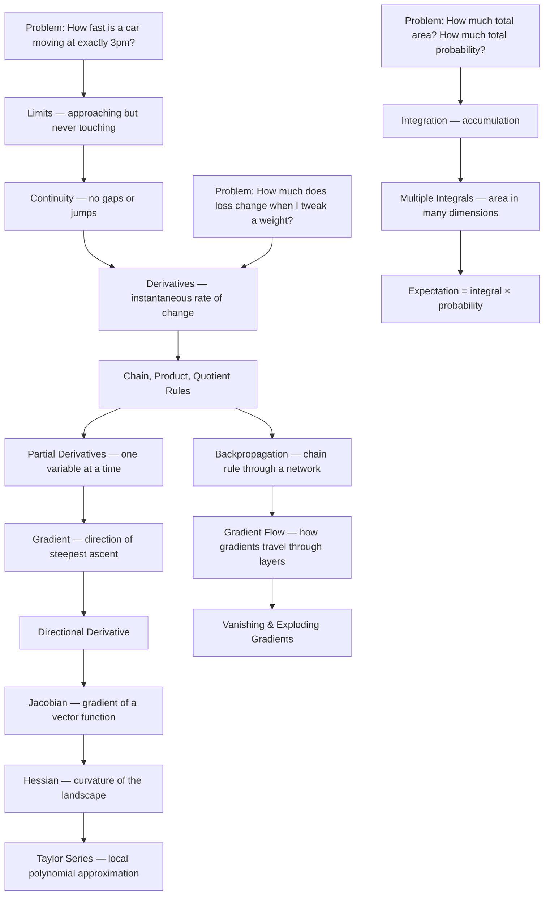

# Part 2: Calculus

> **Prerequisites:** [Part 0 — Mathematical Thinking](part-00-mathematical-thinking.md), [Part 1 — Linear Algebra](part-01-linear-algebra.md) (vectors, matrices, dot products)
> **What you'll learn:** How change is measured mathematically. Calculus is the language of optimization — and training a neural network is one big optimization problem.
> **Used later in:** Optimization (gradient descent), Probability (density functions, expectations), Deep Learning (backpropagation, vanishing gradients), LLMs (all training).

---

## The Narrative Spine



---

## Lesson 2.1: Limits and Continuity

### Why Was This Invented?

Newton and Leibniz invented calculus in the 1670s to answer one question: "How fast is something moving at a single instant?"

The problem: speed is distance ÷ time. But at a single instant, the time interval is zero. And dividing by zero is undefined. How do you compute the speed at one exact moment?

The answer is limits: you don't divide by zero, you ask what happens as the time interval *approaches* zero.

### Explain Like I Am 10 Years Old

Imagine you're driving toward a wall. You get closer and closer but you (wisely) never actually hit it.

Even though you never reach the wall, we can still say: "As you get closer and closer, the distance to the wall approaches zero."

A limit is exactly this. We ask: "What value does a function approach as its input approaches some number?" — even if the function is never defined at exactly that number.

### Formal Definition

The **limit** of $f(x)$ as $x$ approaches $a$ is $L$:

$$
\lim_{x \to a} f(x) = L
$$

This means: we can make $f(x)$ as close to $L$ as we want by making $x$ close enough to $a$.

Formal $\varepsilon$-$\delta$ definition: For every $\varepsilon > 0$, there exists $\delta > 0$ such that if $0 < |x - a| < \delta$, then $|f(x) - L| < \varepsilon$.

This says: no matter how tight a tolerance $\varepsilon$ you demand on the output, I can find a tolerance $\delta$ on the input that guarantees it.

### Continuity

A function $f$ is **continuous at $a$** if:

1. $f(a)$ is defined
2. $\lim_{x \to a} f(x)$ exists
3. $\lim_{x \to a} f(x) = f(a)$

Intuitively: you can draw the graph without lifting your pen.

**Why continuity matters in AI:** Activation functions like ReLU are continuous (no jumps) but not everywhere differentiable (has a kink at 0). Discontinuous loss functions are problematic because gradient descent can't navigate jumps.

### Visual Intuition

```
Continuous:         Discontinuous:       Kink (not differentiable):

f(x)                f(x)                 f(x)
  |   /               |  /                 |    /
  |  /                |  /                 |   /
  | /                 | /    o (hole)       |  /
  |/                  |/    x              \| /
--+-------->        --+-------->           -+---------
  a                   a                    a

  Can draw          Jump at a              Not smooth at a
  without lifting                          (like ReLU)
  pen
```

---

## Lesson 2.2: Derivatives

### Why Was This Invented?

To measure the exact rate of change at a single point. In machine learning, this is the key to optimization: we need to know how the loss changes when we change each parameter, so we know which direction to adjust the parameters.

### Explain Like I Am 10 Years Old

You're hiking up a hill. At every step, you can measure the slope — how steep the ground is under your feet.

If the slope is very steep going up, you need to put in a lot of effort. If the slope is zero, you're on flat ground. If the slope is negative, you're going downhill.

The derivative is just the slope — but at a specific point, not averaged over a whole stretch.

### Formal Definition

The derivative of $f$ at $x = a$:

$$
f'(a) = \frac{df}{dx}\bigg|_{x=a} = \lim_{h \to 0} \frac{f(a + h) - f(a)}{h}
$$

This is the slope of the tangent line to $f$ at the point $a$.

**Step-by-Step Derivation:** Why $f'(x) = 2x$ for $f(x) = x^2$?

$$
f'(x) = \lim_{h \to 0} \frac{(x+h)^2 - x^2}{h}
$$

Step 1 — Expand $(x+h)^2$:

$$
= \lim_{h \to 0} \frac{x^2 + 2xh + h^2 - x^2}{h}
$$

Step 2 — Simplify numerator:

$$
= \lim_{h \to 0} \frac{2xh + h^2}{h}
$$

Step 3 — Factor and cancel $h$:

$$
= \lim_{h \to 0} (2x + h)
$$

Step 4 — Take the limit as $h \to 0$:

$$
= 2x
$$

### Differentiation Rules

These rules let you differentiate any function without going back to the definition every time.

| Rule | Formula | Example |
|------|---------|---------|
| Power | $\frac{d}{dx} x^n = nx^{n-1}$ | $\frac{d}{dx} x^3 = 3x^2$ |
| Constant | $\frac{d}{dx} c = 0$ | $\frac{d}{dx} 5 = 0$ |
| Sum | $(f+g)' = f' + g'$ | $(x^2 + x)' = 2x + 1$ |
| Product | $(fg)' = f'g + fg'$ | $(x^2 \sin x)' = 2x\sin x + x^2\cos x$ |
| Quotient | $\left(\frac{f}{g}\right)' = \frac{f'g - fg'}{g^2}$ | $\frac{d}{dx}\frac{x}{x+1} = \frac{1}{(x+1)^2}$ |
| **Chain Rule** | $(f \circ g)' = f'(g(x)) \cdot g'(x)$ | $(e^{x^2})' = e^{x^2} \cdot 2x$ |
| Exponential | $\frac{d}{dx} e^x = e^x$ | Always itself |
| Logarithm | $\frac{d}{dx} \ln x = \frac{1}{x}$ | |

### The Chain Rule — The Most Important Rule in Deep Learning

$$
\frac{d}{dx}[f(g(x))] = f'(g(x)) \cdot g'(x)
$$

Or with substitution $u = g(x)$:

$$
\frac{dy}{dx} = \frac{dy}{du} \cdot \frac{du}{dx}
$$

**Intuition:** Rates of change multiply. If $u$ changes twice as fast as $x$, and $y$ changes three times as fast as $u$, then $y$ changes $2 \times 3 = 6$ times as fast as $x$.

**Example:** What is $\frac{d}{dx}\sigma(x)$ where $\sigma(x) = \frac{1}{1+e^{-x}}$ is the sigmoid function?

Let $u = 1 + e^{-x}$, so $\sigma = 1/u = u^{-1}$.

$$
\frac{d\sigma}{dx} = \frac{d\sigma}{du} \cdot \frac{du}{dx} = -u^{-2} \cdot (-e^{-x}) = \frac{e^{-x}}{(1+e^{-x})^2}
$$

$$
= \frac{1}{1+e^{-x}} \cdot \frac{e^{-x}}{1+e^{-x}} = \sigma(x)(1 - \sigma(x))
$$

This beautiful result says: the derivative of sigmoid is sigmoid × (1 - sigmoid). No chain rule needed once you memorize this — and it's used in every logistic regression and sigmoid-activated neural network.

### Important Derivatives in AI

| Function | Derivative | AI Use |
|----------|-----------|--------|
| $\sigma(x) = \frac{1}{1+e^{-x}}$ | $\sigma(x)(1-\sigma(x))$ | Logistic regression, LSTM gates |
| $\tanh(x)$ | $1 - \tanh^2(x)$ | RNN activations |
| $\text{ReLU}(x) = \max(0,x)$ | $\mathbf{1}[x > 0]$ | Most neural networks |
| $\text{GELU}(x)$ | Approximated | Transformers, GPT |
| $\text{softmax}_i(\mathbf{z}) = \frac{e^{z_i}}{\sum_j e^{z_j}}$ | $\text{softmax}_i (\delta_{ij} - \text{softmax}_j)$ | Final layer, attention |
| $\ln x$ | $1/x$ | Log-likelihood, cross-entropy |
| $e^x$ | $e^x$ | Exponential activations |

### Python Implementation

```python
import numpy as np
import torch

# Numerical differentiation (finite differences)
def numerical_gradient(f, x, h=1e-5):
    return (f(x + h) - f(x - h)) / (2 * h)

f = lambda x: x**3 - 2*x**2 + x
x = 2.0
print(f"f'(2) numerical: {numerical_gradient(f, x):.6f}")  # Should be 3x^2 - 4x + 1 at x=2 = 5
print(f"f'(2) exact: {3*x**2 - 4*x + 1:.6f}")             # 5.0

# PyTorch automatic differentiation (autograd)
x_t = torch.tensor(2.0, requires_grad=True)
y = x_t**3 - 2*x_t**2 + x_t
y.backward()
print(f"f'(2) autograd: {x_t.grad:.6f}")  # 5.0

# Sigmoid and its derivative
def sigmoid(x):
    return 1 / (1 + np.exp(-x))

def sigmoid_prime(x):
    s = sigmoid(x)
    return s * (1 - s)

x_vals = np.linspace(-5, 5, 100)
print(f"Max sigmoid derivative: {sigmoid_prime(x_vals).max():.4f}")  # ~0.25 at x=0

# Chain rule example: d/dx [sigmoid(x^2)]
x_t = torch.tensor(1.5, requires_grad=True)
y = torch.sigmoid(x_t**2)
y.backward()
print(f"d/dx sigmoid(x^2) at x=1.5: {x_t.grad:.6f}")
```

---

## Lesson 2.3: Partial Derivatives and the Gradient

### Why Was This Invented?

A loss function $\mathcal{L}(\theta_1, \theta_2, \ldots, \theta_n)$ depends on millions of parameters. To minimize it, we need to know how it changes with respect to each parameter individually. Partial derivatives let us do this — vary one parameter while holding all others fixed.

### Explain Like I Am 10 Years Old

You're in a valley between two mountains. The height at any point depends on both your north-south position and your east-west position.

"How much steeper is it if I walk north?" — that's one partial derivative.
"How much steeper if I walk east?" — that's another.

The gradient combines both: it points in the direction of steepest uphill climb.

### Formal Definition

The **partial derivative** of $f(x_1, \ldots, x_n)$ with respect to $x_i$:

$$
\frac{\partial f}{\partial x_i} = \lim_{h \to 0} \frac{f(x_1, \ldots, x_i + h, \ldots, x_n) - f(x_1, \ldots, x_i, \ldots, x_n)}{h}
$$

Treat all other variables as constants and differentiate normally.

The **gradient** packages all partial derivatives into one vector:

$$
\nabla f(\mathbf{x}) = \begin{bmatrix} \frac{\partial f}{\partial x_1} \\ \frac{\partial f}{\partial x_2} \\ \vdots \\ \frac{\partial f}{\partial x_n} \end{bmatrix}
$$

**Key fact:** The gradient $\nabla f(\mathbf{x})$ points in the direction of steepest increase of $f$ at the point $\mathbf{x}$.

Gradient descent moves in the opposite direction (steepest decrease):

$$
\mathbf{x}_{\text{new}} = \mathbf{x}_{\text{old}} - \eta \nabla f(\mathbf{x}_{\text{old}})
$$

### Numerical Example

Let $f(x, y) = x^2 + 2xy + y^3$.

Partial with respect to $x$ (treat $y$ as constant):

$$
\frac{\partial f}{\partial x} = 2x + 2y
$$

Partial with respect to $y$ (treat $x$ as constant):

$$
\frac{\partial f}{\partial y} = 2x + 3y^2
$$

At the point $(1, 2)$:

$$
\nabla f(1, 2) = \begin{bmatrix} 2(1) + 2(2) \\ 2(1) + 3(2^2) \end{bmatrix} = \begin{bmatrix} 6 \\ 14 \end{bmatrix}
$$

The steepest uphill direction from $(1, 2)$ is the direction $[6, 14]$. Gradient descent would step in direction $[-6, -14]$.

### Python Implementation

```python
import torch

# Gradient via autograd
x = torch.tensor(1.0, requires_grad=True)
y = torch.tensor(2.0, requires_grad=True)

f = x**2 + 2*x*y + y**3
f.backward()

print(f"∂f/∂x at (1,2): {x.grad}")  # 6.0
print(f"∂f/∂y at (1,2): {y.grad}")  # 14.0

# Gradient of loss w.r.t. all parameters in a network
import torch.nn as nn

model = nn.Linear(3, 1)
x_data = torch.randn(10, 3)
y_data = torch.randn(10, 1)

loss = nn.functional.mse_loss(model(x_data), y_data)
loss.backward()

for name, param in model.named_parameters():
    print(f"{name}: gradient shape {param.grad.shape}, norm {param.grad.norm():.4f}")
```

---

## Lesson 2.4: Directional Derivatives and the Jacobian

### Directional Derivative

The directional derivative tells you the rate of change of $f$ as you walk in direction $\mathbf{d}$ (unit vector):

$$
D_{\mathbf{d}} f(\mathbf{x}) = \nabla f(\mathbf{x}) \cdot \mathbf{d} = \|\nabla f(\mathbf{x})\|_2 \cos\theta
$$

where $\theta$ is the angle between the gradient and $\mathbf{d}$.

**Key insight:** The gradient is the direction of maximum increase because $\cos\theta = 1$ when $\mathbf{d}$ points in the same direction as $\nabla f$.

### The Jacobian Matrix

When $\mathbf{f}: \mathbb{R}^n \to \mathbb{R}^m$ maps a vector to a vector, the generalization of the derivative is the **Jacobian matrix**:

$$
\mathbf{J} = \frac{\partial \mathbf{f}}{\partial \mathbf{x}} = \begin{bmatrix} \frac{\partial f_1}{\partial x_1} & \cdots & \frac{\partial f_1}{\partial x_n} \\ \vdots & \ddots & \vdots \\ \frac{\partial f_m}{\partial x_1} & \cdots & \frac{\partial f_m}{\partial x_n} \end{bmatrix} \in \mathbb{R}^{m \times n}
$$

Entry $J_{ij}$ says: "how much does output $i$ change when input $j$ changes by a tiny amount?"

**Geometric meaning:** The Jacobian is the best linear approximation to $\mathbf{f}$ near $\mathbf{x}$. It tells you how volumes and directions transform locally.

**Numerical example:** Let $\mathbf{f}(x, y) = [x^2 + y, xy]^T$.

$$
\mathbf{J} = \begin{bmatrix} \frac{\partial f_1}{\partial x} & \frac{\partial f_1}{\partial y} \\ \frac{\partial f_2}{\partial x} & \frac{\partial f_2}{\partial y} \end{bmatrix} = \begin{bmatrix} 2x & 1 \\ y & x \end{bmatrix}
$$

At $(x, y) = (1, 2)$: $\mathbf{J} = \begin{bmatrix} 2 & 1 \\ 2 & 1 \end{bmatrix}$.

**AI use:** In backpropagation, the Jacobian of a layer (how much each output changes when each input changes) is computed to pass gradients backwards.

---

## Lesson 2.5: The Hessian and Optimization Landscapes

### The Hessian Matrix

The Hessian is the matrix of all second-order partial derivatives:

$$
\mathbf{H} = \nabla^2 f(\mathbf{x}) = \begin{bmatrix} \frac{\partial^2 f}{\partial x_1^2} & \frac{\partial^2 f}{\partial x_1 \partial x_2} & \cdots \\ \frac{\partial^2 f}{\partial x_2 \partial x_1} & \frac{\partial^2 f}{\partial x_2^2} & \cdots \\ \vdots & & \ddots \end{bmatrix}
$$

**Geometric meaning:** The Hessian describes the *curvature* of the function — is the landscape bowl-shaped, saddle-shaped, or flat?

### Classifying Critical Points

At a point $\mathbf{x}^*$ where $\nabla f = \mathbf{0}$ (critical point):

| Hessian $\mathbf{H}$ | Type of point |
|------|------|
| All eigenvalues $> 0$ (positive definite) | Local minimum |
| All eigenvalues $< 0$ (negative definite) | Local maximum |
| Mixed positive and negative eigenvalues | Saddle point |
| Some eigenvalues $= 0$ | Inconclusive |

### Optimization Landscapes

```
      Loss
       |
       |        /\
       |       /  \       /\
       |      /    \     /  \
       |     /   saddle /    \
       |    /      |   /      \
       |   /      \/  /        \
       |  /     local  \        \
       | /    minimum    \       \
       |/                \       global min
       +------------------------->
                                 parameters

Typical deep learning landscape:
- Many local minima (but they're often equally good for large nets)
- Many saddle points (gradient is 0 but NOT a minimum)
- Almost no local maxima in high dimensions
```

**The saddle point problem:** In high dimensions, most critical points are saddle points, not local minima. First-order methods (SGD, Adam) handle this well because noise helps them escape saddles. Second-order methods (Newton) can get trapped at saddle points.

---

## Lesson 2.6: Taylor Series

### Why Was This Invented?

Most functions are complicated. But near any point, almost any function looks like a polynomial — and polynomials are easy to work with. Taylor series is the formal way to build this polynomial approximation.

### Explain Like I Am 10 Years Old

Imagine you're hiking and you want to estimate how high you'll be in 10 meters.

You know: your current height (zero-th order), your current slope (first order), and the curvature of the ground (second order).

Each piece of information gives you a better estimate:
- Zero-th order: "I'll be at the same height." (Terrible if there's a hill)
- First order: "I'll be at current height + slope × distance." (Linear estimate)
- Second order: "... + curvature × distance² / 2." (Accounts for the hill)

Taylor series is this idea made precise for any smooth function.

### Formal Definition

The Taylor series of $f$ around point $a$:

$$
f(x) = f(a) + f'(a)(x-a) + \frac{f''(a)}{2!}(x-a)^2 + \frac{f'''(a)}{3!}(x-a)^3 + \cdots = \sum_{n=0}^{\infty} \frac{f^{(n)}(a)}{n!}(x-a)^n
$$

For small changes $\delta = x - a$ around a point $a$:

$$
f(a + \delta) \approx f(a) + f'(a)\delta + \frac{f''(a)}{2}\delta^2 + \cdots
$$

**Multivariate Taylor (up to second order):**

$$
f(\mathbf{x} + \delta) \approx f(\mathbf{x}) + \nabla f(\mathbf{x})^T \delta + \frac{1}{2}\delta^T \mathbf{H}(\mathbf{x})\delta
$$

This is the foundation of Newton's method for optimization.

### AI Uses of Taylor Series

1. **Newton's method:** Optimize by approximating the loss as a second-order Taylor expansion and jumping to the minimum of the quadratic approximation.
2. **Proving gradient descent convergence:** Taylor expansion shows how much the loss decreases per step given Lipschitz-smooth gradients.
3. **Understanding attention (FAVOR+):** The softmax is approximated using a Taylor series to get linear attention.

---

## Lesson 2.7: Integration

### Why Was This Invented?

Differentiation answers "how fast is something changing?" Integration answers "how much has accumulated?" These are opposite operations — the Fundamental Theorem of Calculus says integration undoes differentiation.

Integration is the tool for computing probabilities (area under a density curve), expected values, and cumulative effects.

### Explain Like I Am 10 Years Old

You're on a road trip and you know how fast the car was going at every minute. But you want to know: how far did you travel total?

Speed × time = distance. But the speed was changing all the time. So you add up tiny slices: "For this 1-second interval I was going 60 mph, for the next second 62 mph..." When the slices are infinitely thin, that sum becomes an integral.

An integral is just a fancy sum over infinitely small slices.

### Formal Definition

The **definite integral** of $f$ from $a$ to $b$:

$$
\int_a^b f(x)\, dx = \lim_{n \to \infty} \sum_{i=1}^{n} f(x_i) \Delta x
$$

Geometrically: the signed area between the curve $f(x)$ and the $x$-axis.

The **Fundamental Theorem of Calculus:**

$$
\int_a^b f(x)\, dx = F(b) - F(a)
$$

where $F$ is any **antiderivative** of $f$ (a function whose derivative is $f$).

### Key Integration Rules

| Rule | Formula |
|------|---------|
| Power | $\int x^n\, dx = \frac{x^{n+1}}{n+1} + C$ (for $n \neq -1$) |
| Exponential | $\int e^x\, dx = e^x + C$ |
| Logarithm | $\int \frac{1}{x}\, dx = \ln|x| + C$ |
| Gaussian | $\int_{-\infty}^{\infty} e^{-x^2}\, dx = \sqrt{\pi}$ |

### Numerical Example

Compute $\int_0^2 x^2\, dx$.

The antiderivative of $x^2$ is $F(x) = \frac{x^3}{3}$.

$$
\int_0^2 x^2\, dx = F(2) - F(0) = \frac{8}{3} - 0 = \frac{8}{3} \approx 2.667
$$

Check by approximation: partition $[0, 2]$ into $n = 4$ strips of width $\Delta x = 0.5$:
$f(0.5)(0.5) + f(1.0)(0.5) + f(1.5)(0.5) + f(2.0)(0.5) = 0.125 + 0.5 + 1.125 + 2 = 3.75$. As $n \to \infty$, this converges to $8/3$. ✓

### Python Implementation

```python
import numpy as np
from scipy import integrate

# Numerical integration
f = lambda x: x**2
result, error = integrate.quad(f, 0, 2)
print(f"∫₀² x² dx = {result:.6f}")  # 2.666667

# Gaussian normalization: ∫_{-∞}^{∞} N(0,1) dx = 1
gaussian = lambda x: (1/np.sqrt(2*np.pi)) * np.exp(-x**2/2)
result, _ = integrate.quad(gaussian, -np.inf, np.inf)
print(f"∫ N(0,1) dx = {result:.6f}")  # 1.0

# Monte Carlo integration: estimate ∫₀¹ sin(x) dx
np.random.seed(42)
n_samples = 1_000_000
x_samples = np.random.uniform(0, 1, n_samples)
mc_estimate = np.mean(np.sin(x_samples))
exact = -np.cos(1) + np.cos(0)
print(f"Monte Carlo: {mc_estimate:.6f}, Exact: {exact:.6f}")
```

### AI/ML Connection

**Probability:** $P(a \leq X \leq b) = \int_a^b p(x)\, dx$ where $p(x)$ is the probability density function.

**Expected value:** $\mathbb{E}[X] = \int_{-\infty}^{\infty} x\, p(x)\, dx$.

**Kullback-Leibler divergence:** $\text{KL}(P \| Q) = \int p(x) \ln \frac{p(x)}{q(x)}\, dx$.

These are all integrals. Part 3 (Probability) and Part 6 (Information Theory) will use integration extensively.

---

## Lesson 2.8: Multiple Integrals

### Why Was This Invented?

When a function depends on multiple variables, you sometimes need to integrate over all of them. In probability, joint distributions live in multiple dimensions — and to compute marginal probabilities, you integrate out the variables you don't care about.

### Double Integral

For a function $f(x, y)$, the double integral over a region $R$:

$$
\iint_R f(x, y)\, dx\, dy
$$

**Iterated integration:** Evaluate one integral at a time, treating the other variable as a constant:

$$
\int_a^b \int_c^d f(x,y)\, dy\, dx
$$

First integrate over $y$ (inner integral), treating $x$ as constant. Then integrate over $x$.

**Example:** Compute $\int_0^1 \int_0^1 xy\, dy\, dx$.

Inner integral (over $y$, $x$ constant):
$$\int_0^1 xy\, dy = x\left[\frac{y^2}{2}\right]_0^1 = \frac{x}{2}$$

Outer integral (over $x$):
$$\int_0^1 \frac{x}{2}\, dx = \frac{1}{2}\left[\frac{x^2}{2}\right]_0^1 = \frac{1}{4}$$

### The Connection to Probability

This is how marginal probabilities are computed from joint distributions.

Given a joint probability density $p(x, y)$:

$$
p(x) = \int_{-\infty}^{\infty} p(x, y)\, dy \quad \text{(marginalizing out } y\text{)}
$$

We integrate over all possible values of $y$ to get the marginal distribution of $x$.

Expected values of two variables:

$$
\mathbb{E}[f(X, Y)] = \int \int f(x, y)\, p(x, y)\, dy\, dx
$$

This will appear constantly in Part 3 (Probability).

---

## Lesson 2.9: Backpropagation — Chain Rule Through a Network

### Why Was This Invented?

A neural network computes $\hat{y} = f_L(\ldots f_2(f_1(\mathbf{x})) \ldots)$ — a composition of many functions. To train it, we need $\frac{\partial \mathcal{L}}{\partial w_{ij}}$ for every weight in every layer. Backpropagation is the chain rule applied systematically to compute all these gradients efficiently.

### The Key Insight: Computational Graphs

Think of the network as a directed graph where each node is an operation and each edge carries a value (during forward pass) or a gradient (during backward pass).

```
   x ──> [Linear: y = Wx + b] ──> [ReLU: a = max(0,y)] ──> [Linear: z = Va + c] ──> Loss
```

During the **forward pass**, we compute and store each intermediate value.
During the **backward pass**, we apply the chain rule from the loss back to each parameter.

### Formal Derivation

Consider a 2-layer network:

$$
\mathbf{h} = \sigma(\mathbf{W}_1 \mathbf{x} + \mathbf{b}_1), \quad \hat{y} = \mathbf{W}_2 \mathbf{h} + \mathbf{b}_2, \quad \mathcal{L} = (\hat{y} - y)^2
$$

**Goal:** Compute $\frac{\partial \mathcal{L}}{\partial \mathbf{W}_1}$.

**Step 1:** $\frac{\partial \mathcal{L}}{\partial \hat{y}} = 2(\hat{y} - y)$

**Step 2 (chain rule):** $\frac{\partial \mathcal{L}}{\partial \mathbf{W}_2} = \frac{\partial \mathcal{L}}{\partial \hat{y}} \cdot \frac{\partial \hat{y}}{\partial \mathbf{W}_2} = 2(\hat{y} - y) \cdot \mathbf{h}^T$

**Step 3 (chain rule again):** $\frac{\partial \mathcal{L}}{\partial \mathbf{h}} = \frac{\partial \mathcal{L}}{\partial \hat{y}} \cdot \frac{\partial \hat{y}}{\partial \mathbf{h}} = 2(\hat{y} - y) \cdot \mathbf{W}_2^T$

**Step 4:** $\frac{\partial \mathcal{L}}{\partial \mathbf{z}_1}$ where $\mathbf{z}_1 = \mathbf{W}_1\mathbf{x} + \mathbf{b}_1$:

$$
\frac{\partial \mathcal{L}}{\partial \mathbf{z}_1} = \frac{\partial \mathcal{L}}{\partial \mathbf{h}} \odot \sigma'(\mathbf{z}_1)
$$

The $\odot$ is element-wise multiplication — the chain rule for element-wise activations.

**Step 5 (gradient for $\mathbf{W}_1$):**

$$
\frac{\partial \mathcal{L}}{\partial \mathbf{W}_1} = \frac{\partial \mathcal{L}}{\partial \mathbf{z}_1} \cdot \mathbf{x}^T
$$

The pattern is always: **local gradient** × **gradient flowing back from above**.

### Python Implementation

```python
import torch
import torch.nn as nn

# Manual backprop
torch.manual_seed(42)
W1 = torch.randn(4, 3, requires_grad=True)
b1 = torch.zeros(4, requires_grad=True)
W2 = torch.randn(2, 4, requires_grad=True)
b2 = torch.zeros(2, requires_grad=True)

x = torch.randn(3)       # input
y_true = torch.tensor([1.0, 0.0])  # target

# Forward pass
z1 = W1 @ x + b1         # (4,)
h = torch.sigmoid(z1)     # (4,)
z2 = W2 @ h + b2         # (2,)
y_hat = torch.softmax(z2, dim=0)

loss = -torch.sum(y_true * torch.log(y_hat + 1e-8))

# Backward pass (autograd does all chain rule automatically)
loss.backward()

print(f"Loss: {loss.item():.4f}")
print(f"dL/dW1 shape: {W1.grad.shape}")  # (4, 3) -- gradient for W1
print(f"dL/dW2 shape: {W2.grad.shape}")  # (2, 4) -- gradient for W2

# Now manually compute and verify for one gradient
# (Exercise: verify that your manual chain-rule gradient matches W1.grad)
```

---

## Lesson 2.10: Gradient Flow and the Vanishing/Exploding Gradient Problem

### Why Was This Invented?

Training a deep network requires gradients to travel from the output all the way back to the first layer. In deep networks, this journey can go wrong in two ways: the gradient vanishes to zero (learning stops) or explodes to infinity (training diverges). Understanding the chain rule explains exactly why this happens.

### The Vanishing Gradient Problem

In a deep network with $L$ layers:

$$
\frac{\partial \mathcal{L}}{\partial \mathbf{W}_1} = \frac{\partial \mathcal{L}}{\partial \mathbf{h}_L} \cdot \prod_{l=2}^{L} \frac{\partial \mathbf{h}_l}{\partial \mathbf{h}_{l-1}} \cdot \frac{\partial \mathbf{h}_1}{\partial \mathbf{W}_1}
$$

Each factor $\frac{\partial \mathbf{h}_l}{\partial \mathbf{h}_{l-1}}$ involves the weight matrix and the activation derivative.

**The sigmoid problem:** $\sigma'(x) = \sigma(x)(1-\sigma(x)) \leq 0.25$ always. In a chain of $L$ sigmoid activations:

$$
\text{gradient} \propto (0.25)^L
$$

For $L = 10$: $(0.25)^{10} = 9.5 \times 10^{-7}$. Essentially zero. The first layers learn nothing.

### The Exploding Gradient Problem

If the weight matrices have singular values $> 1$, multiplying them together causes exponential growth:

$$
\|\text{gradient}\| \propto \lambda_{\max}^L
$$

For $\lambda_{\max} = 1.1$ and $L = 100$: $1.1^{100} \approx 13,780$. The gradient blows up.

### Solutions

| Problem | Solution | How it works |
|---------|---------|-------------|
| Vanishing gradients | ReLU activation | $\text{ReLU}'(x) = 1$ for $x > 0$ — no shrinkage |
| Vanishing gradients | Residual connections | Add $\mathbf{x}$ directly: $\mathbf{h} = f(\mathbf{x}) + \mathbf{x}$, so gradient can flow unchanged |
| Vanishing gradients | LSTM/GRU gates | Selective memory — gradient can "skip" time steps |
| Exploding gradients | Gradient clipping | If $\|\mathbf{g}\|_2 > \tau$: $\mathbf{g} \leftarrow \tau \cdot \mathbf{g}/\|\mathbf{g}\|_2$ |
| Both | Layer/Batch normalization | Keeps activations in a healthy range |
| Both | Careful initialization | Xavier, He initialization — set initial weights to avoid extreme singular values |

### Visual: Gradient Flow with Residual Connections

```
Without residuals:            With residuals (ResNet):
                              
x ─→ f₁ ─→ f₂ ─→ f₃         x ─→ f₁ ─→ f₂ ─→ f₃
                                │         │         │
                               (+)       (+)       (+)
                                ↑         ↑         ↑
                                └─────────┘─────────┘
                                (skip connections)
                                
Gradient multiplies at           Gradient has a direct path
every layer → vanishes           backward through skip connections
                                 → solves vanishing gradients
```

### Python Implementation

```python
import torch
import torch.nn as nn

# Demonstrate vanishing gradients with sigmoid
def build_deep_net(depth, activation):
    layers = []
    for _ in range(depth):
        layers.append(nn.Linear(32, 32))
        layers.append(activation())
    return nn.Sequential(*layers)

x = torch.randn(1, 32)
y = torch.randn(1, 32)

for name, activation in [('Sigmoid', nn.Sigmoid), ('ReLU', nn.ReLU)]:
    net = build_deep_net(20, activation)
    loss = ((net(x) - y)**2).mean()
    loss.backward()

    first_layer_grad = net[0].weight.grad
    last_layer_grad = net[-2].weight.grad
    print(f"\n{name} network (20 layers):")
    print(f"  First layer gradient norm: {first_layer_grad.norm():.2e}")
    print(f"  Last layer gradient norm:  {last_layer_grad.norm():.2e}")
    print(f"  Ratio: {first_layer_grad.norm() / last_layer_grad.norm():.2e}")
# Sigmoid will show extreme ratio (gradient ~0 at first layer)
# ReLU will show much healthier ratio
```

---

## Part 2 Summary

### Key Takeaways

1. **Derivatives** measure instantaneous rate of change. The derivative of loss with respect to a parameter tells us how to adjust that parameter.
2. **The chain rule** is backpropagation. It says: rates of change multiply along a chain of compositions.
3. **The gradient** packs all partial derivatives into one vector pointing in the direction of steepest increase.
4. **The Jacobian** generalizes the gradient to vector-valued functions — essential for understanding how backpropagation propagates gradients through layers.
5. **The Hessian** captures curvature — whether a critical point is a minimum, maximum, or saddle.
6. **Integration** is the reverse of differentiation and is essential for computing probabilities and expectations.
7. **Vanishing gradients** happen because derivatives of sigmoid and tanh are always $\leq 1$, shrinking exponentially through layers. ReLU and residual connections fix this.

### Cheat Sheet

| Concept | Formula | Use in AI |
|---------|---------|----------|
| Derivative | $f'(x) = \lim_{h\to 0} \frac{f(x+h)-f(x)}{h}$ | Rate of change |
| Chain rule | $\frac{dy}{dx} = \frac{dy}{du}\frac{du}{dx}$ | Backpropagation |
| Gradient | $\nabla f = [\partial f/\partial x_i]$ | Direction of steepest ascent |
| Jacobian | $J_{ij} = \partial f_i / \partial x_j$ | Layer-wise gradient propagation |
| Hessian | $H_{ij} = \partial^2 f/\partial x_i \partial x_j$ | Curvature, Newton's method |
| Taylor (2nd) | $f(x+\delta) \approx f(x) + f'(x)\delta + \frac{1}{2}f''(x)\delta^2$ | Newton step |
| Integral | $\int_a^b f(x)\,dx = F(b)-F(a)$ | Probability, expectation |
| Sigmoid deriv. | $\sigma'(x) = \sigma(x)(1-\sigma(x))$ | Logistic regression backprop |
| ReLU deriv. | $\text{ReLU}'(x) = \mathbf{1}[x>0]$ | Deep network gradients |

### Flash Cards

**Q:** What is the chain rule in words?
**A:** The derivative of a composition is the product of the individual derivatives: "rates of change multiply."

**Q:** Why do sigmoid activations cause vanishing gradients?
**A:** $\sigma'(x) \leq 0.25$ always. In a chain of $L$ layers, the gradient shrinks by at most $(0.25)^L$ — exponentially small for deep networks.

**Q:** What does the gradient point toward?
**A:** The direction of steepest increase. Gradient descent goes in the opposite direction.

**Q:** What is the Jacobian of a function $\mathbf{f}: \mathbb{R}^n \to \mathbb{R}^m$?
**A:** The $m \times n$ matrix of all partial derivatives $J_{ij} = \partial f_i / \partial x_j$.

**Q:** In a critical point analysis, what does a positive definite Hessian tell you?
**A:** The critical point is a local minimum (all curvatures are upward).

**Q:** What is the Fundamental Theorem of Calculus?
**A:** $\int_a^b f(x)\,dx = F(b) - F(a)$, where $F$ is any antiderivative of $f$. Integration and differentiation are inverse operations.

### Common Mistakes

**Mistake:** Applying the power rule to $e^x$ (writing $xe^{x-1}$).
**Fix:** $e^x$ is special — its derivative is itself: $\frac{d}{dx}e^x = e^x$.

**Mistake:** Forgetting the chain rule when differentiating compositions.
**Example of error:** $\frac{d}{dx}\sin(x^2) = \cos(x^2)$. 
**Correct:** $\frac{d}{dx}\sin(x^2) = \cos(x^2) \cdot 2x$.

**Mistake:** Confusing gradient and Jacobian.
**Fix:** Gradient is for scalar-valued $f: \mathbb{R}^n \to \mathbb{R}$, gives a vector. Jacobian is for vector-valued $\mathbf{f}: \mathbb{R}^n \to \mathbb{R}^m$, gives a matrix.

**Mistake:** Thinking all critical points are minima.
**Fix:** In high dimensions, most critical points are saddle points. Check the Hessian or eigenvalues.

---

*Next: [Part 3 — Probability](part-03-probability.md)*
