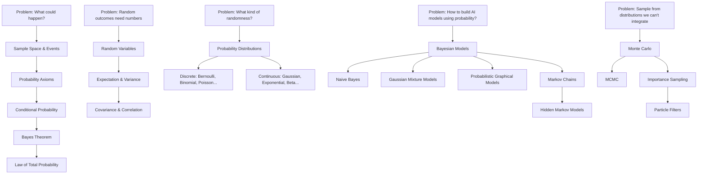

# Part 3: Probability

> **Prerequisites:** [Part 0](part-00-mathematical-thinking.md), [Part 2 — Calculus](part-02-calculus.md) (integration for continuous distributions)
> **What you'll learn:** How to reason precisely under uncertainty. Every generative model, Bayesian method, and sampling algorithm is built on probability.
> **Used later in:** Statistics (inference from samples), A/B Testing (p-values, posteriors), Information Theory (entropy), Optimization (stochastic methods), Classical ML (Naive Bayes, GMMs), Deep Learning (VAE), LLMs (sampling, RLHF).

---

## The Narrative Spine



---

## Lesson 3.1: Sample Spaces, Events, and Axioms

### Why Was This Invented?

Probability theory was formalized by Kolmogorov in 1933 to give rigorous foundations to gambling mathematics. Before that, probability was intuitive but inconsistent. Kolmogorov's axioms made it a branch of mathematics with provable theorems.

### Explain Like I Am 10 Years Old

You roll a standard six-sided die. What could happen?

You could get 1, 2, 3, 4, 5, or 6. The collection of all possible outcomes is the **sample space**. Any subset of those outcomes is an **event**.

"Getting an even number" is the event $\{2, 4, 6\}$. "Getting more than 4" is the event $\{5, 6\}$.

We assign a **probability** to each event — a number between 0 and 1 saying how likely that event is.

### Formal Definition

**Sample space** $\Omega$: The set of all possible outcomes.

**Event** $A \subseteq \Omega$: Any subset of outcomes.

**Probability measure** $P$: A function assigning a number in $[0,1]$ to each event, satisfying Kolmogorov's three axioms:

**Axiom 1 (Non-negativity):** $P(A) \geq 0$ for all events $A$.

**Axiom 2 (Normalization):** $P(\Omega) = 1$ (something must happen).

**Axiom 3 (Additivity):** For mutually exclusive events $A \cap B = \emptyset$:
$$P(A \cup B) = P(A) + P(B)$$

**Derived consequences:**
- $P(\emptyset) = 0$
- $P(A^c) = 1 - P(A)$ where $A^c$ is the complement
- $P(A \cup B) = P(A) + P(B) - P(A \cap B)$ (inclusion-exclusion)

---

## Lesson 3.2: Conditional Probability and Bayes' Theorem

### Why Was This Invented?

Almost all useful probability reasoning involves *updating* our beliefs when we get new information. "Given that a test came back positive, what is the probability the patient has the disease?" This question has a surprising answer that even doctors often get wrong. Bayes' theorem answers it correctly.

### Explain Like I Am 10 Years Old

Imagine a bag containing 3 red balls and 7 blue balls.

You reach in and pull out a ball without looking. It's red.

Now you're putting it back and pulling out another. What's the probability the second ball is red?

If you said 3/10 — you're thinking unconditionally. You already got information (that at least one red ball was accessible). In some sampling schemes, this changes things.

Conditional probability is about updating based on information already received.

### Formal Definition

**Conditional probability:**

$$
P(A \mid B) = \frac{P(A \cap B)}{P(B)}, \quad P(B) > 0
$$

"The probability of $A$ given that $B$ happened" is the fraction of $B$'s probability that also belongs to $A$.

**Independence:** Events $A$ and $B$ are independent if:
$$P(A \cap B) = P(A) \cdot P(B) \iff P(A \mid B) = P(A)$$

Knowing $B$ happened doesn't change the probability of $A$.

### Bayes' Theorem — The Most Important Formula in Probabilistic AI

**Step 1:** Start from the definition of conditional probability:
$$P(A \mid B) = \frac{P(A \cap B)}{P(B)}$$

**Step 2:** The joint probability $P(A \cap B)$ can also be written as $P(B \mid A) \cdot P(A)$:
$$P(A \cap B) = P(B \mid A) \cdot P(A)$$

**Step 3:** Substitute:

$$\boxed{P(A \mid B) = \frac{P(B \mid A) \cdot P(A)}{P(B)}}$$

In the language of Bayesian inference:
$$\underbrace{P(\theta \mid \text{data})}_{\text{posterior}} = \frac{\underbrace{P(\text{data} \mid \theta)}_{\text{likelihood}} \cdot \underbrace{P(\theta)}_{\text{prior}}}{\underbrace{P(\text{data})}_{\text{evidence}}}$$

**Reading this in English:** After seeing data, my updated belief (posterior) = how well the data fits my hypothesis (likelihood) × my prior belief, normalized to sum to 1.

### Numerical Example — Medical Test

A disease has 1% prevalence. A test is 90% sensitive (correctly identifies sick people) and 90% specific (correctly identifies healthy people).

You test positive. What is the probability you are actually sick?

Let $D$ = "has disease", $+$ = "tests positive".

$$
P(D) = 0.01, \quad P(D^c) = 0.99
$$
$$
P(+ \mid D) = 0.90 \quad \text{(sensitivity)}
$$
$$
P(+ \mid D^c) = 0.10 \quad \text{(1 - specificity)}
$$

Apply Bayes' theorem:

$$
P(D \mid +) = \frac{P(+ \mid D) \cdot P(D)}{P(+)} = \frac{0.90 \times 0.01}{P(+)}
$$

**Law of Total Probability** for $P(+)$:

$$
P(+) = P(+ \mid D)P(D) + P(+ \mid D^c)P(D^c) = 0.90 \times 0.01 + 0.10 \times 0.99 = 0.009 + 0.099 = 0.108
$$

$$
P(D \mid +) = \frac{0.009}{0.108} \approx 8.3\%
$$

**Surprising result:** Even with a 90% accurate test, a positive result only means 8.3% probability of actually having the disease. This is because the disease is rare — most positive tests are false positives.

### Law of Total Probability

If $B_1, B_2, \ldots, B_n$ is a partition of $\Omega$ (mutually exclusive, collectively exhaustive):

$$
P(A) = \sum_{i=1}^{n} P(A \mid B_i) P(B_i)
$$

---

## Lesson 3.3: Random Variables

### Why Was This Invented?

Working directly with sample spaces is clumsy. A random variable assigns a number to each outcome, letting us use all of mathematics (algebra, calculus) to work with probability.

### Explain Like I Am 10 Years Old

Roll two dice. The sample space has 36 possible outcomes: $(1,1), (1,2), \ldots, (6,6)$.

Let $X$ = "sum of the two dice." Now each outcome gets mapped to a number: $(1,1) \to 2$, $(1,2) \to 3$, $(3,4) \to 7$, etc.

$X$ is a random variable. Instead of talking about events in the sample space, we can now talk about events like $X = 7$ or $X > 10$ using numbers.

### Discrete Random Variables

A **discrete** random variable takes countable values $\{x_1, x_2, \ldots\}$.

**Probability Mass Function (PMF):** $P(X = x_i) = p(x_i)$ where $\sum_i p(x_i) = 1$.

### Continuous Random Variables

A **continuous** random variable takes any value in an interval.

**Probability Density Function (PDF):** $f(x) \geq 0$ where $\int_{-\infty}^{\infty} f(x)\, dx = 1$.

For a continuous RV, $P(X = x) = 0$ for any single point. Instead:
$$P(a \leq X \leq b) = \int_a^b f(x)\, dx$$

**Cumulative Distribution Function (CDF):**

$$
F(x) = P(X \leq x) = \int_{-\infty}^{x} f(t)\, dt \quad \text{(continuous)}
$$
$$
F(x) = \sum_{x_i \leq x} p(x_i) \quad \text{(discrete)}
$$

Properties: $F(-\infty) = 0$, $F(\infty) = 1$, $F$ is non-decreasing.

### Joint, Marginal, and Conditional Distributions

For two random variables $X, Y$:

**Joint distribution** $p(x, y)$: Describes the probability of both taking specific values simultaneously.

**Marginal distribution:** Integrate/sum out the other variable:
$$p(x) = \int p(x, y)\, dy \quad \text{or} \quad p(x) = \sum_y p(x, y)$$

**Conditional distribution:**
$$p(x \mid y) = \frac{p(x, y)}{p(y)}$$

---

## Lesson 3.4: Expectation, Variance, Covariance, and Correlation

### Expectation (Mean)

The **expected value** is the long-run average:

$$
\mathbb{E}[X] = \begin{cases} \sum_x x \cdot p(x) & \text{discrete} \\ \int_{-\infty}^{\infty} x \cdot f(x)\, dx & \text{continuous} \end{cases}
$$

**Properties (linearity of expectation — holds always):**
- $\mathbb{E}[aX + b] = a\mathbb{E}[X] + b$
- $\mathbb{E}[X + Y] = \mathbb{E}[X] + \mathbb{E}[Y]$
- If $X, Y$ independent: $\mathbb{E}[XY] = \mathbb{E}[X]\mathbb{E}[Y]$

### Variance

The **variance** measures spread around the mean:

$$
\text{Var}(X) = \mathbb{E}[(X - \mathbb{E}[X])^2] = \mathbb{E}[X^2] - (\mathbb{E}[X])^2
$$

**Standard deviation:** $\sigma = \sqrt{\text{Var}(X)}$ — in the same units as $X$.

**Properties:**
- $\text{Var}(aX + b) = a^2 \text{Var}(X)$ (constants shift don't affect variance; scaling squares variance)
- $\text{Var}(X + Y) = \text{Var}(X) + \text{Var}(Y)$ if $X, Y$ independent

### Covariance and Correlation

**Covariance** measures how two variables move together:

$$
\text{Cov}(X, Y) = \mathbb{E}[(X - \mathbb{E}[X])(Y - \mathbb{E}[Y])] = \mathbb{E}[XY] - \mathbb{E}[X]\mathbb{E}[Y]
$$

**Correlation** (standardized covariance):

$$
\rho(X, Y) = \frac{\text{Cov}(X, Y)}{\sqrt{\text{Var}(X)\text{Var}(Y)}} \in [-1, 1]
$$

$\rho = 1$: perfect positive linear relationship. $\rho = -1$: perfect negative. $\rho = 0$: uncorrelated (but may not be independent!).

---

## Lesson 3.5: Probability Distributions — Discrete

### Bernoulli Distribution

**Story:** One coin flip. Heads with probability $p$, tails with $1-p$.

$$
P(X = 1) = p, \quad P(X = 0) = 1-p
$$

$$
\mathbb{E}[X] = p, \quad \text{Var}(X) = p(1-p)
$$

**AI use:** Binary classification outputs. Each prediction is a Bernoulli trial.

### Binomial Distribution

**Story:** $n$ independent coin flips, each with probability $p$ of heads. $X$ = number of heads.

$$
P(X = k) = \binom{n}{k} p^k (1-p)^{n-k}, \quad k = 0, 1, \ldots, n
$$

$$
\mathbb{E}[X] = np, \quad \text{Var}(X) = np(1-p)
$$

The binomial coefficient $\binom{n}{k} = \frac{n!}{k!(n-k)!}$ counts the number of ways to choose $k$ successes from $n$ trials.

**Numerical example:** 10 patients, each has 30% chance of responding to treatment. What is $P(X = 3)$?

$$
P(X = 3) = \binom{10}{3}(0.3)^3(0.7)^7 = 120 \times 0.027 \times 0.0824 = 0.267
$$

**AI use:** Multiple classification outcomes. Hypothesis testing for proportions (A/B tests).

### Multinomial Distribution

Generalization of binomial to $K$ categories. Roll a $K$-sided die $n$ times.

$$
P(X_1 = k_1, \ldots, X_K = k_K) = \frac{n!}{k_1! \cdots k_K!} p_1^{k_1} \cdots p_K^{k_K}
$$

**AI use:** Language modeling — the next token is sampled from a multinomial distribution over the vocabulary.

### Poisson Distribution

**Story:** How many emails do you get per hour? How many cars cross an intersection in a minute? Events that happen at a constant average rate.

$$
P(X = k) = \frac{\lambda^k e^{-\lambda}}{k!}, \quad k = 0, 1, 2, \ldots
$$

$$
\mathbb{E}[X] = \lambda, \quad \text{Var}(X) = \lambda
$$

Mean = Variance = $\lambda$ (a helpful sanity check).

**AI use:** Modeling rare events, click rates, anomaly detection baselines.

### Geometric Distribution

**Story:** Keep flipping a coin until the first head. $X$ = number of flips needed.

$$
P(X = k) = (1-p)^{k-1} p, \quad k = 1, 2, 3, \ldots
$$

$$
\mathbb{E}[X] = \frac{1}{p}, \quad \text{Var}(X) = \frac{1-p}{p^2}
$$

**Memoryless property:** $P(X > m + n \mid X > m) = P(X > n)$. Past failures don't change future probabilities.

**AI use:** Modeling time until first success. Geometric series in LSTM gradient analysis.

---

## Lesson 3.6: Probability Distributions — Continuous

### Uniform Distribution

**Story:** A random number equally likely to be anywhere in $[a, b]$.

$$
f(x) = \frac{1}{b-a}, \quad x \in [a, b]
$$

$$
\mathbb{E}[X] = \frac{a+b}{2}, \quad \text{Var}(X) = \frac{(b-a)^2}{12}
$$

**AI use:** Weight initialization, random sampling, data augmentation.

### Gaussian (Normal) Distribution

**Story:** The limit of many small independent influences. Heights, measurement errors, financial returns (approximately).

$$
f(x) = \frac{1}{\sqrt{2\pi\sigma^2}} \exp\left(-\frac{(x-\mu)^2}{2\sigma^2}\right)
$$

$$
\mathbb{E}[X] = \mu, \quad \text{Var}(X) = \sigma^2
$$

**Why it's everywhere:** The Central Limit Theorem says the average of many independent random variables approaches a Gaussian, regardless of their individual distributions.

**The standard normal:** $Z \sim \mathcal{N}(0, 1)$. For $X \sim \mathcal{N}(\mu, \sigma^2)$: $Z = (X - \mu)/\sigma$.

**68-95-99.7 rule:** $P(\mu - k\sigma \leq X \leq \mu + k\sigma)$ is approximately 68% for $k=1$, 95% for $k=2$, 99.7% for $k=3$.

**Multivariate Gaussian:** For a vector $\mathbf{x} \in \mathbb{R}^d$:

$$
p(\mathbf{x}) = \frac{1}{(2\pi)^{d/2}|\mathbf{\Sigma}|^{1/2}} \exp\left(-\frac{1}{2}(\mathbf{x} - \boldsymbol{\mu})^T \mathbf{\Sigma}^{-1} (\mathbf{x} - \boldsymbol{\mu})\right)
$$

where $\boldsymbol{\mu}$ is the mean vector and $\mathbf{\Sigma}$ is the covariance matrix.

**AI use:** Assumptions in Gaussian processes, VAEs (latent space), mixture models, weight initialization.

### Exponential Distribution

**Story:** Time until the next event, given events occur at rate $\lambda$.

$$
f(x) = \lambda e^{-\lambda x}, \quad x \geq 0
$$

$$
\mathbb{E}[X] = \frac{1}{\lambda}, \quad \text{Var}(X) = \frac{1}{\lambda^2}
$$

**Memoryless** (like geometric): $P(X > s + t \mid X > s) = P(X > t)$.

**AI use:** Modeling time-to-event, survival analysis, service time in queuing.

### Gamma Distribution

The **Gamma distribution** generalizes the exponential — it models the time until the $k$-th event:

$$
f(x; k, \theta) = \frac{x^{k-1} e^{-x/\theta}}{\theta^k \Gamma(k)}, \quad x > 0
$$

where $\Gamma(k) = (k-1)!$ for integer $k$ (the Gamma function).

$$
\mathbb{E}[X] = k\theta, \quad \text{Var}(X) = k\theta^2
$$

**AI use:** Conjugate prior for the rate parameter of a Poisson. Used in Bayesian inference for positive-valued parameters.

### Beta Distribution

**Story:** Probability of a probability. Models a random value on $[0, 1]$.

$$
f(x; \alpha, \beta) = \frac{x^{\alpha-1}(1-x)^{\beta-1}}{B(\alpha, \beta)}, \quad x \in [0, 1]
$$

where $B(\alpha, \beta) = \frac{\Gamma(\alpha)\Gamma(\beta)}{\Gamma(\alpha+\beta)}$ is the Beta function.

$$
\mathbb{E}[X] = \frac{\alpha}{\alpha+\beta}, \quad \text{Var}(X) = \frac{\alpha\beta}{(\alpha+\beta)^2(\alpha+\beta+1)}
$$

When $\alpha = \beta = 1$: reduces to Uniform$[0,1]$.
When $\alpha, \beta > 1$: bell-shaped.
When $\alpha < 1, \beta < 1$: U-shaped (concentrated at extremes).

**AI use:** Conjugate prior for Bernoulli/Binomial probabilities. Thompson Sampling in bandits. Beta is the go-to prior for modeling a probability parameter.

### Dirichlet Distribution

Generalization of Beta to $K$ probabilities that must sum to 1:

$$
p(\boldsymbol{\pi}; \boldsymbol{\alpha}) \propto \prod_{k=1}^{K} \pi_k^{\alpha_k - 1}, \quad \pi_k \geq 0, \quad \sum_k \pi_k = 1
$$

$$
\mathbb{E}[\pi_k] = \frac{\alpha_k}{\sum_j \alpha_j}
$$

**AI use:** Conjugate prior for categorical/multinomial distributions. Latent Dirichlet Allocation (LDA) for topic modeling. Any time you need a probability distribution over probability distributions.

### Log-Normal Distribution

If $\ln X \sim \mathcal{N}(\mu, \sigma^2)$, then $X$ follows a log-normal distribution.

$$
f(x) = \frac{1}{x\sigma\sqrt{2\pi}} \exp\left(-\frac{(\ln x - \mu)^2}{2\sigma^2}\right), \quad x > 0
$$

$$
\mathbb{E}[X] = e^{\mu + \sigma^2/2}, \quad \text{Var}(X) = (e^{\sigma^2} - 1)e^{2\mu + \sigma^2}
$$

**AI use:** Modeling positive-valued quantities with heavy tails (file sizes, income, user session lengths). The product of many small positive factors is log-normal by CLT applied to the log.

### Laplace Distribution

**Story:** Like a Gaussian but with heavier tails. Defined by location $\mu$ and scale $b$:

$$
f(x) = \frac{1}{2b} \exp\left(-\frac{|x - \mu|}{b}\right)
$$

$$
\mathbb{E}[X] = \mu, \quad \text{Var}(X) = 2b^2
$$

**AI use:** Laplace prior on weights corresponds to L1 regularization (Lasso). Robust regression (less sensitive to outliers than Gaussian). Used in differentially private machine learning.

### Student's t-Distribution

The Student's t-distribution has heavier tails than the Gaussian and is parameterized by degrees of freedom $\nu$:

$$
f(x) = \frac{\Gamma\left(\frac{\nu+1}{2}\right)}{\sqrt{\nu\pi}\,\Gamma\left(\frac{\nu}{2}\right)}\left(1 + \frac{x^2}{\nu}\right)^{-\frac{\nu+1}{2}}
$$

As $\nu \to \infty$: approaches standard Gaussian.
For $\nu = 1$: Cauchy distribution (very heavy tails, undefined mean).

**Why it matters:** When the true variance of the population is unknown and you're estimating from a small sample, the sample mean follows a t-distribution, not a Gaussian. This is the basis of the t-test.

### Chi-Squared Distribution

If $Z_1, \ldots, Z_k$ are independent standard normal RVs:

$$
X = Z_1^2 + Z_2^2 + \cdots + Z_k^2 \sim \chi^2(k)
$$

$$
\mathbb{E}[X] = k, \quad \text{Var}(X) = 2k
$$

**AI use:** Chi-squared test for independence between categorical variables. Confidence intervals for variance. F-test in ANOVA.

### Cauchy Distribution

The Cauchy distribution is the ratio of two independent standard normals: $X = Z_1/Z_2$.

$$
f(x) = \frac{1}{\pi\gamma\left[1 + \left(\frac{x-x_0}{\gamma}\right)^2\right]}
$$

It has no defined mean or variance — its tails are so heavy that the moments don't exist.

**AI use:** Robust regression (Cauchy loss), modeling extreme outliers. Important as a counterexample: the CLT does not apply to distributions without finite variance.

### Python Implementation

```python
import numpy as np
from scipy import stats
import matplotlib.pyplot as plt

# Bernoulli
p = 0.3
samples = np.random.binomial(1, p, 1000)
print(f"Bernoulli mean: {samples.mean():.3f} (expected {p})")

# Binomial
n, p = 10, 0.3
k = 3
pmf_k3 = stats.binom.pmf(k, n, p)
print(f"P(X=3) = {pmf_k3:.4f}")  # ~0.267

# Gaussian
mu, sigma = 0, 1
x = np.linspace(-4, 4, 100)
pdf = stats.norm.pdf(x, mu, sigma)
cdf = stats.norm.cdf(x, mu, sigma)
print(f"P(-1 ≤ Z ≤ 1) = {stats.norm.cdf(1) - stats.norm.cdf(-1):.4f}")  # ~0.68

# Beta
alpha, beta = 2, 5
mean_beta = alpha / (alpha + beta)
print(f"Beta({alpha},{beta}) mean = {mean_beta:.4f}")  # 0.2857

# Gamma
k, theta = 3, 2
mean_gamma = k * theta
print(f"Gamma({k},{theta}) mean = {mean_gamma}")  # 6

# Student's t
nu = 5
x = 2.0
p_val = stats.t.sf(x, df=nu) * 2  # two-tailed
print(f"P(|t| > 2.0) with 5 df = {p_val:.4f}")  # ~0.102

# Chi-squared
k = 3
print(f"Chi2({k}) mean = {k}, var = {2*k}")
```

---

## Lesson 3.7: Probability for AI — Bayesian Models

### Naive Bayes Classifier

**The idea:** Classify by computing the most probable class given the features, using Bayes' theorem.

**The "naive" assumption:** Features are conditionally independent given the class. This is often false but the classifier works surprisingly well in practice.

$$
P(y = c \mid \mathbf{x}) \propto P(y = c) \prod_{j=1}^{d} P(x_j \mid y = c)
$$

**Step 1:** Compute the prior $P(y = c)$ from training data (frequency of each class).

**Step 2:** Compute the likelihood $P(x_j \mid y = c)$ for each feature and class (Gaussian for continuous features, frequency table for categorical).

**Step 3:** Classify: $\hat{y} = \arg\max_c P(y = c) \prod_j P(x_j \mid y = c)$.

Take logs for numerical stability:

$$
\hat{y} = \arg\max_c \left[\ln P(y = c) + \sum_j \ln P(x_j \mid y = c)\right]
$$

**AI use:** Spam filtering, document classification, medical diagnosis. Still competitive on text classification despite its simplicity.

### Gaussian Mixture Models (GMM)

**The problem:** Your data looks like it comes from multiple subgroups (e.g., emails from different users, images of different objects). No single Gaussian fits it. But a mixture of Gaussians might.

**Model:** The data is generated by:
1. Pick a component $k$ with probability $\pi_k$ (mixing coefficient)
2. Draw a sample from $\mathcal{N}(\boldsymbol{\mu}_k, \mathbf{\Sigma}_k)$

$$
p(\mathbf{x}) = \sum_{k=1}^{K} \pi_k \,\mathcal{N}(\mathbf{x}; \boldsymbol{\mu}_k, \mathbf{\Sigma}_k)
$$

**Fitting GMMs — the EM Algorithm:**

**E-step (Expectation):** Compute the "responsibility" — how much each component is responsible for each data point:

$$
r_{ik} = \frac{\pi_k\, \mathcal{N}(\mathbf{x}_i; \boldsymbol{\mu}_k, \mathbf{\Sigma}_k)}{\sum_{j=1}^{K} \pi_j\, \mathcal{N}(\mathbf{x}_i; \boldsymbol{\mu}_j, \mathbf{\Sigma}_j)}
$$

**M-step (Maximization):** Update the parameters using the responsibilities as soft counts:

$$
\pi_k = \frac{\sum_i r_{ik}}{n}, \quad \boldsymbol{\mu}_k = \frac{\sum_i r_{ik} \mathbf{x}_i}{\sum_i r_{ik}}, \quad \mathbf{\Sigma}_k = \frac{\sum_i r_{ik}(\mathbf{x}_i - \boldsymbol{\mu}_k)(\mathbf{x}_i - \boldsymbol{\mu}_k)^T}{\sum_i r_{ik}}
$$

Iterate E and M until convergence.

**AI use:** Density estimation, soft clustering, anomaly detection, initialization for k-means, speaker diarization in audio.

```python
from sklearn.mixture import GaussianMixture
import numpy as np

# Generate data from 2 Gaussians
np.random.seed(42)
X1 = np.random.multivariate_normal([0, 0], [[1, 0.5], [0.5, 1]], 200)
X2 = np.random.multivariate_normal([5, 5], [[1, -0.3], [-0.3, 1]], 200)
X = np.vstack([X1, X2])

gmm = GaussianMixture(n_components=2, random_state=42)
gmm.fit(X)

print(f"Means:\n{gmm.means_}")
print(f"Weights: {gmm.weights_}")
labels = gmm.predict(X)
print(f"Cluster sizes: {np.bincount(labels)}")
```

---

## Lesson 3.8: Markov Chains and Hidden Markov Models

### Markov Chains

**The Markov Property:** The future depends only on the present, not the past.

$$
P(X_{t+1} \mid X_t, X_{t-1}, \ldots, X_1) = P(X_{t+1} \mid X_t)
$$

A Markov chain is defined by:
- A set of states $\{s_1, \ldots, s_n\}$
- A **transition matrix** $\mathbf{T}$ where $T_{ij} = P(X_{t+1} = s_j \mid X_t = s_i)$
- Each row of $\mathbf{T}$ sums to 1 (stochastic matrix)

**Stationary distribution:** A distribution $\boldsymbol{\pi}$ such that $\boldsymbol{\pi}\mathbf{T} = \boldsymbol{\pi}$. The eigenvector of $\mathbf{T}^T$ corresponding to eigenvalue 1.

**AI use:** Language models (n-gram models are Markov chains). PageRank. MCMC sampling.

### Hidden Markov Models (HMM)

**The idea:** The state is not observed directly (hidden). Instead, we observe an output that depends on the hidden state.

**Two sequences:**
- Hidden states: $Z_1, Z_2, \ldots, Z_T$ (Markov chain)
- Observations: $X_1, X_2, \ldots, X_T$ where each $X_t$ depends only on $Z_t$

**Parameters:**
- Initial distribution $\pi_i = P(Z_1 = i)$
- Transition probabilities $A_{ij} = P(Z_{t+1} = j \mid Z_t = i)$
- Emission probabilities $B_{it} = P(X_t \mid Z_t = i)$

**Key algorithms:**
- **Forward algorithm:** Compute $P(\mathbf{X})$ (probability of the observed sequence)
- **Viterbi algorithm:** Find the most likely hidden state sequence given observations
- **Baum-Welch:** Learn the parameters $(\pi, A, B)$ from observed data (EM for HMMs)

**AI use:** Speech recognition (before deep learning), POS tagging in NLP, protein structure prediction, time-series anomaly detection.

---

## Lesson 3.9: Monte Carlo and MCMC

### Monte Carlo Methods

**The core idea:** If you can't compute an integral analytically, estimate it by sampling.

$$
\mathbb{E}[f(X)] = \int f(x)\, p(x)\, dx \approx \frac{1}{N} \sum_{i=1}^{N} f(x_i), \quad x_i \sim p
$$

The approximation improves as $N$ grows (law of large numbers). The error decreases as $O(1/\sqrt{N})$ regardless of dimension — Monte Carlo doesn't suffer the curse of dimensionality like quadrature.

**Example:** Estimate $\pi$ by Monte Carlo.

Throw darts at a $2 \times 2$ square uniformly at random. Count how many land inside the unit circle (radius 1, area $\pi$).

$$
\hat{\pi} \approx 4 \times \frac{\text{darts inside circle}}{\text{total darts}}
$$

```python
import numpy as np
np.random.seed(42)
N = 1_000_000
x, y = np.random.uniform(-1, 1, N), np.random.uniform(-1, 1, N)
inside = (x**2 + y**2 <= 1)
print(f"Estimated π = {4 * inside.mean():.5f}")  # ~3.14159
```

### Markov Chain Monte Carlo (MCMC)

**The problem:** We want to sample from a probability distribution $p(\theta)$ that we cannot sample from directly (no closed-form sampler). We can only evaluate $p(\theta)$ up to a normalizing constant.

**The solution:** Construct a Markov chain whose stationary distribution is $p(\theta)$. Run the chain long enough and the samples will look like they came from $p$.

**Metropolis-Hastings Algorithm:**

1. Start at some $\theta_0$
2. At each step: propose $\theta^* \sim q(\theta^* \mid \theta_t)$ (any proposal distribution)
3. Compute acceptance ratio: $\alpha = \min\left(1, \frac{p(\theta^*)q(\theta_t \mid \theta^*)}{p(\theta_t)q(\theta^* \mid \theta_t)}\right)$
4. Accept with probability $\alpha$: $\theta_{t+1} = \theta^*$; otherwise $\theta_{t+1} = \theta_t$

The acceptance ratio ensures that the chain converges to $p$ as stationary distribution.

**Why it works:** The ratio $p(\theta^*)/p(\theta_t)$ only involves the unnormalized density — the normalizing constant cancels out! This is the key insight.

**AI use:** Bayesian inference when conjugate posteriors are unavailable. Training energy-based models. Computing expectations of complex posterior distributions.

### Importance Sampling

**The problem:** We want $\mathbb{E}_p[f(X)]$ but we can't sample from $p$ directly. We can sample from a different distribution $q$.

**The solution:**

$$
\mathbb{E}_p[f(X)] = \int f(x)\, p(x)\, dx = \int f(x)\, \frac{p(x)}{q(x)}\, q(x)\, dx = \mathbb{E}_q\left[f(X)\frac{p(X)}{q(X)}\right]
$$

Sample from $q$, then weight each sample by $w(x) = p(x)/q(x)$ (importance weight):

$$
\mathbb{E}_p[f(X)] \approx \frac{1}{N}\sum_{i=1}^N f(x_i)\, w(x_i), \quad x_i \sim q
$$

**Key requirement:** $q(x) > 0$ wherever $p(x) > 0$. Otherwise you miss probability mass.

**AI use:** Policy gradient in reinforcement learning (off-policy evaluation). Estimating expectations under the data distribution. Self-play importance weighting for LLM training.

### Particle Filters (Sequential Monte Carlo)

**The problem:** Track a hidden state (e.g., robot location) as new observations arrive, in a non-linear, non-Gaussian system where a Kalman filter fails.

**The solution:** Maintain a set of $N$ **particles** — samples from the current belief state. At each timestep:

1. **Predict:** Move each particle forward in time using the state transition model
2. **Update:** Weight each particle by its likelihood given the new observation
3. **Resample:** Sample particles with replacement proportional to their weights

This maintains an approximate distribution over the hidden state that updates in real time.

**AI use:** Robot localization, object tracking in video, financial time-series filtering, speech recognition in noise.

---

## Lesson 3.10: Probabilistic Graphical Models

### Why Was This Invented?

Real-world probability distributions over many variables are exponentially complex. But they often have structure: some variables are conditionally independent given others. Graphical models represent this structure visually, making both inference and learning tractable.

### Bayesian Networks (Directed Graphs)

A **Bayesian network** is a directed acyclic graph (DAG) where:
- Each node is a random variable
- Each edge $A \to B$ means "$A$ is a direct cause of $B$"
- Each variable has a conditional probability table: $P(X_i \mid \text{Parents}(X_i))$

The joint distribution factorizes:

$$
P(X_1, \ldots, X_n) = \prod_{i=1}^n P(X_i \mid \text{Parents}(X_i))
$$

**Example:** Disease diagnosis

```
Rain --> WetGrass
 |
 v
Sprinkler --> WetGrass
```

$P(\text{Rain}, \text{Sprinkler}, \text{WetGrass}) = P(\text{Rain}) \cdot P(\text{Sprinkler} \mid \text{Rain}) \cdot P(\text{WetGrass} \mid \text{Rain}, \text{Sprinkler})$

This factorization reduces the number of parameters exponentially compared to a full joint table.

### Markov Random Fields (Undirected Graphs)

When relationships are symmetric (correlation without clear causation), use undirected graphical models. Common in image processing (neighboring pixels influence each other).

**AI use:** Conditional Random Fields (CRF) for sequence labeling in NLP. Energy-based models. Belief propagation for approximate inference.

---

## Part 3 Summary

### Key Takeaways

1. **Probability axioms** are three rules that everything else in probability follows from.
2. **Bayes' theorem** tells us how to update our beliefs when we see new evidence. It is the foundation of all Bayesian methods in AI.
3. **Random variables** map outcomes to numbers, letting us use calculus and algebra on probability.
4. **Expectation** is the average. **Variance** is the spread. **Covariance** measures joint movement.
5. **Distributions** are the building blocks of probabilistic models. Know the Gaussian, Beta, and Dirichlet most deeply.
6. **Gaussian Mixture Models** represent data as a blend of Gaussians, fit with EM.
7. **Markov chains** model sequences where the future depends only on the present.
8. **MCMC** lets us sample from any distribution we can evaluate (up to a constant).
9. **Importance sampling** lets us compute expectations under one distribution by sampling from another.

### Cheat Sheet

| Distribution | PMF/PDF | Mean | Variance | AI Use |
|-------------|---------|------|----------|--------|
| Bernoulli($p$) | $p^x(1-p)^{1-x}$ | $p$ | $p(1-p)$ | Binary classification |
| Binomial($n,p$) | $\binom{n}{k}p^k(1-p)^{n-k}$ | $np$ | $np(1-p)$ | Count of successes |
| Poisson($\lambda$) | $\frac{\lambda^k e^{-\lambda}}{k!}$ | $\lambda$ | $\lambda$ | Rare event counts |
| Geometric($p$) | $(1-p)^{k-1}p$ | $1/p$ | $(1-p)/p^2$ | First success time |
| Gaussian($\mu,\sigma^2$) | $\frac{1}{\sigma\sqrt{2\pi}}e^{-(x-\mu)^2/2\sigma^2}$ | $\mu$ | $\sigma^2$ | Everything |
| Exponential($\lambda$) | $\lambda e^{-\lambda x}$ | $1/\lambda$ | $1/\lambda^2$ | Time until event |
| Beta($\alpha,\beta$) | $\propto x^{\alpha-1}(1-x)^{\beta-1}$ | $\frac{\alpha}{\alpha+\beta}$ | — | Prior for probabilities |

### Flash Cards

**Q:** State Bayes' theorem.
**A:** $P(A \mid B) = \frac{P(B \mid A) P(A)}{P(B)}$. Posterior ∝ Likelihood × Prior.

**Q:** What is a sufficient condition for two events to be independent?
**A:** $P(A \cap B) = P(A) \cdot P(B)$. Equivalently: $P(A \mid B) = P(A)$.

**Q:** What is the Central Limit Theorem?
**A:** The sum (or mean) of $n$ i.i.d. random variables with finite mean $\mu$ and variance $\sigma^2$ converges to $\mathcal{N}(n\mu, n\sigma^2)$ as $n \to \infty$.

**Q:** What does it mean for a Markov chain to have a stationary distribution $\pi$?
**A:** $\pi \mathbf{T} = \pi$ — once the chain reaches this distribution, it stays there. MCMC exploits this to sample from $p$.

**Q:** What is the Naive Bayes assumption?
**A:** Features are conditionally independent given the class: $P(\mathbf{x} \mid y) = \prod_j P(x_j \mid y)$.

**Q:** What distribution is conjugate to the Binomial?
**A:** The Beta distribution. If prior is Beta($\alpha, \beta$) and you observe $k$ successes in $n$ trials, the posterior is Beta($\alpha + k$, $\beta + n - k$).

### Common Mistakes

**Mistake:** Confusing $P(A \mid B)$ with $P(B \mid A)$. These are generally very different.
**Example:** $P(\text{positive test} \mid \text{disease}) = 0.9 \neq P(\text{disease} \mid \text{positive test}) = 0.083$ in our medical example.
**Fix:** Always apply Bayes' theorem explicitly; never assume symmetry.

---

**Mistake:** Assuming uncorrelated implies independent.
**Fix:** Correlation measures linear dependence. $X$ and $X^2$ can have zero correlation but are clearly dependent. Independence implies zero correlation, but not vice versa.

---

**Mistake:** In MCMC, using samples before the chain has "mixed" (reached stationarity).
**Fix:** Discard a "burn-in" period (typically first 10-50% of samples) before using them for estimation.

---

*Next: [Part 4 — Statistics](part-04-statistics.md)*
