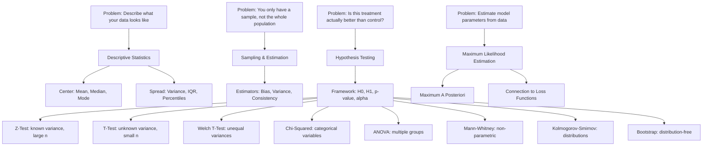

# Part 4: Statistics

> **Prerequisites:** [Part 3 — Probability](part-03-probability.md) (distributions, expectation, variance)
> **What you'll learn:** How to draw reliable conclusions from finite data. Every A/B test, model evaluation, and "the model works" claim relies on statistics.
> **Used later in:** A/B Testing (hypothesis tests, sample size), Model Evaluation (confidence intervals), Classical ML (bias-variance tradeoff).

---

## The Narrative Spine



---

## Lesson 4.1: Descriptive Statistics

### Why Was This Invented?

Before any inference, you need to understand what your data looks like. Descriptive statistics are the summary that lets one person communicate the essential character of a dataset to another person with just a few numbers.

### Explain Like I Am 10 Years Old

You take a class photo of 30 students. Someone asks: "What does the class look like?" You can't show them the photo, so you say:

- "The average height is 165 cm." (center)
- "Heights range from 140 to 190 cm." (spread)
- "Most students are between 155 and 175 cm." (distribution)

That's descriptive statistics. A few numbers that capture the essential character of the data.

### Measures of Center

**Mean** (arithmetic average):

$$
\bar{x} = \frac{1}{n}\sum_{i=1}^n x_i
$$

Sensitive to outliers. If one student is 220 cm (an outlier), the mean shifts up significantly.

**Median:** The middle value when data is sorted. For $n$ values, it is the $\lceil n/2 \rceil$-th value (or average of the two middle values if $n$ is even).

Robust to outliers. If one student is 220 cm, the median barely changes.

**Mode:** The most frequently occurring value. Useful for categorical data. A distribution can have multiple modes (bimodal, multimodal).

**When to use which:**
- Mean: symmetric distributions, no outliers
- Median: skewed distributions or outliers present
- Mode: categorical data, understanding the "typical" category

### Measures of Spread

**Variance** and **Standard Deviation:** (Already covered in probability)

$$
s^2 = \frac{1}{n-1}\sum_{i=1}^n (x_i - \bar{x})^2
$$

Note: we divide by $n-1$ (not $n$) to get an **unbiased** estimator of the population variance. This is called Bessel's correction.

**Percentiles and Quartiles:**

The $p$-th percentile is the value below which $p\%$ of the data falls.

- $Q_1$ = 25th percentile (first quartile)
- $Q_2$ = 50th percentile = median (second quartile)
- $Q_3$ = 75th percentile (third quartile)

**Interquartile Range (IQR):**

$$
\text{IQR} = Q_3 - Q_1
$$

The IQR contains the middle 50% of data. It is robust to outliers.

**Outlier detection rule:** A data point is a potential outlier if it falls below $Q_1 - 1.5 \times \text{IQR}$ or above $Q_3 + 1.5 \times \text{IQR}$.

### Numerical Example

Data: test scores $= [72, 85, 78, 91, 65, 88, 92, 76, 84, 79]$

**Step 1:** Sort: $[65, 72, 76, 78, 79, 84, 85, 88, 91, 92]$

**Step 2:**
- Mean: $(65+72+\cdots+92)/10 = 810/10 = 81$
- Median: average of 5th and 6th values $= (79+84)/2 = 81.5$
- Mode: no repeated values
- $Q_1 = 76$ (25th percentile), $Q_3 = 88$ (75th percentile)
- IQR $= 88 - 76 = 12$
- Outlier bounds: below $76 - 18 = 58$, above $88 + 18 = 106$
- No outliers in this dataset

### Python Implementation

```python
import numpy as np
from scipy import stats

scores = np.array([72, 85, 78, 91, 65, 88, 92, 76, 84, 79])

print(f"Mean:   {np.mean(scores):.2f}")       # 81.0
print(f"Median: {np.median(scores):.2f}")     # 81.5
print(f"Mode:   {stats.mode(scores).mode[0]}")  # (first mode)
print(f"Std:    {np.std(scores, ddof=1):.2f}")   # ddof=1 for sample std
print(f"Var:    {np.var(scores, ddof=1):.2f}")

q1, q3 = np.percentile(scores, [25, 75])
iqr = q3 - q1
print(f"Q1={q1}, Q3={q3}, IQR={iqr}")

# Outlier bounds
lower = q1 - 1.5 * iqr
upper = q3 + 1.5 * iqr
outliers = scores[(scores < lower) | (scores > upper)]
print(f"Outliers: {outliers}")  # []
```

---

## Lesson 4.2: Sampling and Estimation

### The Population vs Sample Problem

You want to know the average height of all adults in a country (300 million people). You measure 1000 people. Those 1000 are your **sample**. The 300 million are the **population**.

You use the sample to **estimate** population parameters. The sample mean $\bar{x}$ is an estimator of the population mean $\mu$.

### Properties of Estimators

An estimator $\hat{\theta}$ of a parameter $\theta$ is:

**Unbiased** if $\mathbb{E}[\hat{\theta}] = \theta$ — the estimator is right on average.

**Consistent** if $\hat{\theta} \to \theta$ as $n \to \infty$ — with more data, it converges to the truth.

**Efficient** if it achieves the smallest possible variance among all unbiased estimators (Cramér-Rao bound).

**Example:** Sample mean $\bar{X} = \frac{1}{n}\sum X_i$ is:
- Unbiased: $\mathbb{E}[\bar{X}] = \mu$
- Consistent: $\bar{X} \to \mu$ as $n \to \infty$ (law of large numbers)
- Efficient: achieves the Cramér-Rao bound for the Gaussian model

**The bias-variance tradeoff (in statistics):** A biased estimator can have lower mean squared error than an unbiased one if its variance is small enough.

$$
\text{MSE}(\hat{\theta}) = \text{Bias}(\hat{\theta})^2 + \text{Var}(\hat{\theta})
$$

### The Central Limit Theorem — Why Everything Is Normal

**Theorem:** Let $X_1, \ldots, X_n$ be i.i.d. with mean $\mu$ and variance $\sigma^2$. Then:

$$
\frac{\bar{X} - \mu}{\sigma/\sqrt{n}} \xrightarrow{d} \mathcal{N}(0, 1) \quad \text{as } n \to \infty
$$

**What this means:** No matter what distribution your data comes from, the *sample mean* of a large enough sample is approximately normally distributed.

**Standard error** of the mean: $\text{SE} = \sigma/\sqrt{n}$.

This is why:
- Statistical tests assume normality even for non-normal data (valid for large $n$)
- A/B test results are approximately normal even if individual user metrics aren't
- Confidence intervals are symmetric around the estimate

---

## Lesson 4.3: Hypothesis Testing

### The Framework

Hypothesis testing is a formal procedure for deciding between two competing explanations of data.

**Null hypothesis** $H_0$: The "nothing interesting is happening" claim. (No effect, no difference, the current model is fine.)

**Alternative hypothesis** $H_1$: The "something is different" claim. (The treatment works, the distributions are different.)

**Type I Error (False Positive):** Rejecting $H_0$ when it is actually true. Probability = $\alpha$ (significance level, typically 0.05).

**Type II Error (False Negative):** Failing to reject $H_0$ when it is actually false. Probability = $\beta$.

**Power:** $1 - \beta$ = probability of correctly detecting a true effect.

```
           H₀ True        H₁ True
Reject H₀  Type I Error   Correct (Power)
           (α)            (1-β)
           
Fail to    Correct        Type II Error
reject H₀  (1-α)          (β)
```

**p-value:** The probability of observing data at least as extreme as what we saw, assuming $H_0$ is true.

- Small p-value: data is unlikely under $H_0$ → evidence against $H_0$
- Large p-value: data is consistent with $H_0$ → no evidence against $H_0$

**Decision rule:** Reject $H_0$ if $p < \alpha$.

**Critical misconception:** A p-value is NOT the probability that $H_0$ is true. It is the probability of your data given that $H_0$ is true. This is a fundamental difference.

---

## Lesson 4.4: Statistical Tests

### Z-Test

**When to use:** Testing a mean when the population variance $\sigma^2$ is known (or $n$ is large, usually $n \geq 30$).

**Test statistic:**
$$
z = \frac{\bar{x} - \mu_0}{\sigma/\sqrt{n}}
$$

Under $H_0$: $z \sim \mathcal{N}(0, 1)$.

**Example:** You claim the average response time of your model is 100ms. You measure 50 requests and get $\bar{x} = 105$ms. Population std is known: $\sigma = 20$ms. Is the mean significantly different?

$H_0: \mu = 100$, $H_1: \mu \neq 100$ (two-tailed).

$$
z = \frac{105 - 100}{20/\sqrt{50}} = \frac{5}{2.83} = 1.77
$$

p-value $= 2 \times P(Z > 1.77) = 2 \times 0.038 = 0.076$.

Conclusion: $p = 0.076 > 0.05$, fail to reject $H_0$. The evidence is not strong enough.

### T-Test (One-Sample)

**When to use:** Testing a mean when the population variance is unknown (small sample).

**Test statistic:**
$$
t = \frac{\bar{x} - \mu_0}{s/\sqrt{n}}
$$

Under $H_0$: $t \sim t(n-1)$ (Student's t-distribution with $n-1$ degrees of freedom).

As $n \to \infty$, the t-distribution approaches the normal. For small $n$, t has heavier tails — accounting for extra uncertainty from estimating the variance.

### Two-Sample T-Test

**When to use:** Comparing means of two groups. Assumes equal variances.

$$
t = \frac{\bar{x}_1 - \bar{x}_2}{s_p\sqrt{1/n_1 + 1/n_2}}
$$

where $s_p = \sqrt{\frac{(n_1-1)s_1^2 + (n_2-1)s_2^2}{n_1 + n_2 - 2}}$ is the pooled standard deviation.

### Welch's T-Test (Unequal Variances)

**When to use:** Comparing two means when variances may differ. This is the **preferred test in practice** — it reduces to the equal-variance t-test when variances are equal, but is more robust when they differ.

$$
t = \frac{\bar{x}_1 - \bar{x}_2}{\sqrt{s_1^2/n_1 + s_2^2/n_2}}
$$

Degrees of freedom (Welch-Satterthwaite approximation):

$$
\nu = \frac{(s_1^2/n_1 + s_2^2/n_2)^2}{\frac{(s_1^2/n_1)^2}{n_1-1} + \frac{(s_2^2/n_2)^2}{n_2-1}}
$$

```python
from scipy import stats
import numpy as np

# Two groups with different variances
np.random.seed(42)
group_a = np.random.normal(loc=100, scale=15, size=50)
group_b = np.random.normal(loc=105, scale=25, size=40)

# Welch's t-test (equal_var=False is the default)
t_stat, p_val = stats.ttest_ind(group_a, group_b, equal_var=False)
print(f"t = {t_stat:.4f}, p = {p_val:.4f}")
```

### Chi-Squared Test for Independence

**When to use:** Testing whether two categorical variables are independent.

**Test statistic:**

$$
\chi^2 = \sum_{\text{all cells}} \frac{(O - E)^2}{E}
$$

where $O$ is the observed count and $E$ is the expected count under independence.

$E_{ij} = \frac{(\text{row total}_i) \times (\text{column total}_j)}{n}$

Under $H_0$ (independence): $\chi^2 \sim \chi^2((r-1)(c-1))$ where $r, c$ are the number of rows and columns.

**Example:** Do users from different countries convert at different rates?

|  | Converts | Not Converts | Total |
|--|---------|-------------|-------|
| US | 50 | 150 | 200 |
| EU | 30 | 170 | 200 |
| Total | 80 | 320 | 400 |

Expected under independence: $E_{11} = 200 \times 80/400 = 40$.

$$
\chi^2 = \frac{(50-40)^2}{40} + \frac{(150-160)^2}{160} + \frac{(30-40)^2}{40} + \frac{(170-160)^2}{160} = 2.5 + 0.625 + 2.5 + 0.625 = 6.25
$$

Degrees of freedom: $(2-1)(2-1) = 1$. Critical value at $\alpha=0.05$: 3.84. Since $6.25 > 3.84$, reject independence.

### ANOVA (Analysis of Variance)

**When to use:** Comparing means of three or more groups. ANOVA is a generalization of the t-test.

$H_0$: All group means are equal. $H_1$: At least one group mean differs.

**F-statistic:**

$$
F = \frac{\text{Between-group variance}}{\text{Within-group variance}} = \frac{MS_B}{MS_W}
$$

Under $H_0$: $F \sim F(k-1, n-k)$ where $k$ is the number of groups and $n$ is total sample size.

**Intuition:** If the group means are very different (large between-group variance) relative to the noise within each group (small within-group variance), $F$ is large and we reject $H_0$.

### Mann-Whitney U Test (Non-Parametric)

**When to use:** Comparing two groups when the normality assumption is violated or you have ordinal data.

**How it works:** Rank all observations from both groups combined. The U statistic measures how often observations from group 1 rank higher than observations from group 2.

$$
U = n_1 n_2 + \frac{n_1(n_1+1)}{2} - R_1
$$

where $R_1$ is the sum of ranks for group 1.

Under $H_0$ (same distribution): $U$ is approximately normal for large samples.

**Why it's important:** The t-test assumes normality. When you have few data points or clearly non-normal distributions (e.g., click counts, revenue per user), Mann-Whitney is more reliable.

### Kolmogorov-Smirnov Test

**When to use:** Testing whether a sample follows a specific distribution (one-sample KS), or whether two samples come from the same distribution (two-sample KS).

**Test statistic:** Maximum absolute difference between the empirical CDFs:

$$
D = \sup_x |F_n(x) - F_0(x)|
$$

where $F_n$ is the sample CDF and $F_0$ is the theoretical CDF.

**Why it's important:** Unlike chi-squared, KS doesn't require binning the data. Sensitive to differences in any part of the distribution (not just the mean). Used to check whether your data follows a specific distribution before applying a parametric test.

```python
from scipy import stats
import numpy as np

np.random.seed(42)

# One-sample KS: test if data is Normal
data = np.random.normal(0, 1, 100)
ks_stat, p_val = stats.kstest(data, 'norm')
print(f"KS test vs Normal: stat={ks_stat:.4f}, p={p_val:.4f}")

# Two-sample KS: test if two samples come from the same distribution
sample1 = np.random.normal(0, 1, 100)
sample2 = np.random.normal(0.5, 1, 100)  # slightly different mean
ks_stat, p_val = stats.ks_2samp(sample1, sample2)
print(f"Two-sample KS: stat={ks_stat:.4f}, p={p_val:.4f}")

# Mann-Whitney U test
group1 = np.array([5, 3, 7, 4, 8, 2, 9])
group2 = np.array([3, 1, 4, 2, 5, 1, 3])
u_stat, p_val = stats.mannwhitneyu(group1, group2, alternative='two-sided')
print(f"Mann-Whitney: U={u_stat:.0f}, p={p_val:.4f}")
```

---

## Lesson 4.5: Bootstrap Methods

### Why Was This Invented?

Classical hypothesis tests assume the data follows a specific distribution (normal, chi-squared, etc.). What if your data doesn't follow any standard distribution? What if you're estimating a complex statistic like a median ratio or correlation, and you don't know its sampling distribution?

The bootstrap (Efron, 1979) solves this with a brilliant idea: use the data itself to simulate sampling variability.

### Explain Like I Am 10 Years Old

Suppose you want to know how accurate your estimate is, but you only have one dataset and you can't collect more data.

The bootstrap trick: pretend your dataset is the whole population, and "collect new samples" by randomly drawing from it with replacement.

If you draw 1000 new samples this way and compute your statistic on each, the variability across those 1000 values tells you how uncertain your estimate is.

### The Bootstrap Procedure

**Goal:** Estimate the sampling distribution of statistic $\hat{\theta}$ (could be mean, median, correlation, AUC — anything).

**Step 1:** Have original dataset $\mathbf{X}$ of size $n$.

**Step 2:** For $b = 1, \ldots, B$ (typically $B = 1000$ or $10000$):
   - Draw a bootstrap sample $\mathbf{X}^{(b)}$ of size $n$ **with replacement** from $\mathbf{X}$
   - Compute $\hat{\theta}^{(b)}$ on $\mathbf{X}^{(b)}$

**Step 3:** The distribution of $\{\hat{\theta}^{(b)}\}$ approximates the sampling distribution of $\hat{\theta}$.

**Bootstrap confidence interval (percentile method):**

$$
[\hat{\theta}^{(\alpha/2)},\, \hat{\theta}^{(1-\alpha/2)}]
$$

The $(\alpha/2)$-th and $(1-\alpha/2)$-th percentiles of the bootstrap distribution.

**Bootstrap p-value:**

To test $H_0: \theta = \theta_0$, shift the bootstrap distribution to be centered at $\theta_0$ and compute:

$$
\text{p-value} = \frac{\text{number of bootstrap statistics} \geq |\hat{\theta} - \theta_0|}{B}
$$

### Numerical Example

You have 7 users' revenue: $[50, 120, 30, 200, 80, 45, 90]$.

Estimate median revenue with a 95% confidence interval.

Sample median: $\text{sort} = [30, 45, 50, 80, 90, 120, 200]$, median $= 80$.

Bootstrap (simplified, $B = 5$ for illustration):

| Sample (with replacement) | Median |
|--------------------------|--------|
| [50, 200, 30, 80, 80, 45, 120] | 80 |
| [120, 120, 80, 50, 30, 90, 200] | 90 |
| [30, 45, 45, 200, 80, 120, 50] | 50 |
| [90, 90, 120, 80, 50, 45, 80] | 80 |
| [200, 30, 90, 120, 45, 50, 80] | 80 |

With $B = 10000$ samples, take 2.5th and 97.5th percentiles of the bootstrap medians.

```python
import numpy as np

revenue = np.array([50, 120, 30, 200, 80, 45, 90])

np.random.seed(42)
B = 10_000
bootstrap_medians = np.array([
    np.median(np.random.choice(revenue, size=len(revenue), replace=True))
    for _ in range(B)
])

ci_lower = np.percentile(bootstrap_medians, 2.5)
ci_upper = np.percentile(bootstrap_medians, 97.5)
print(f"Sample median: {np.median(revenue)}")
print(f"95% Bootstrap CI: [{ci_lower:.1f}, {ci_upper:.1f}]")
print(f"Bootstrap std error: {bootstrap_medians.std():.2f}")
```

---

## Lesson 4.6: Maximum Likelihood Estimation

### Why Was This Invented?

You have data and a model family with parameters $\theta$. Which parameter values make your data most probable? Maximum Likelihood Estimation answers this — and it turns out to be equivalent to minimizing many common loss functions.

### Formal Definition

The **likelihood function** is the probability of the observed data as a function of the parameters:

$$
\mathcal{L}(\theta) = P(\text{data} \mid \theta) = \prod_{i=1}^{n} p(x_i \mid \theta)
$$

(Assuming i.i.d. samples.)

The **MLE** is:

$$
\hat{\theta}_{\text{MLE}} = \arg\max_\theta \mathcal{L}(\theta) = \arg\max_\theta \ln \mathcal{L}(\theta)
$$

We maximize the log-likelihood (mathematically equivalent, numerically better — products become sums).

### Derivation: Gaussian MLE

Data: $\{x_1, \ldots, x_n\}$ i.i.d. from $\mathcal{N}(\mu, \sigma^2)$. Find $\hat{\mu}$ and $\hat{\sigma}^2$.

**Step 1:** Write the log-likelihood:

$$
\ln \mathcal{L}(\mu, \sigma^2) = -\frac{n}{2}\ln(2\pi) - \frac{n}{2}\ln\sigma^2 - \frac{1}{2\sigma^2}\sum_{i=1}^n (x_i - \mu)^2
$$

**Step 2:** Take derivative with respect to $\mu$, set to zero:

$$
\frac{\partial \ln \mathcal{L}}{\partial \mu} = \frac{1}{\sigma^2}\sum_{i=1}^n (x_i - \mu) = 0 \implies \hat{\mu} = \frac{1}{n}\sum_{i=1}^n x_i = \bar{x}
$$

The MLE for the mean is the sample mean.

**Step 3:** Take derivative with respect to $\sigma^2$, set to zero:

$$
\frac{\partial \ln \mathcal{L}}{\partial \sigma^2} = -\frac{n}{2\sigma^2} + \frac{1}{2\sigma^4}\sum_{i=1}^n (x_i - \mu)^2 = 0 \implies \hat{\sigma}^2 = \frac{1}{n}\sum_{i=1}^n (x_i - \bar{x})^2
$$

Note: The MLE uses $n$ in the denominator, not $n-1$. It is slightly biased (underestimates population variance), but consistent.

### Connection to Loss Functions

MLE reveals the true meaning of loss functions:

**Linear regression with Gaussian noise:**

Assume $y_i = \mathbf{w}^T\mathbf{x}_i + \epsilon_i$ where $\epsilon_i \sim \mathcal{N}(0, \sigma^2)$.

The log-likelihood is:
$$\ln \mathcal{L}(\mathbf{w}) \propto -\frac{1}{2\sigma^2}\sum_{i=1}^n (y_i - \mathbf{w}^T\mathbf{x}_i)^2$$

Maximizing this is identical to **minimizing MSE** (Mean Squared Error). MSE is the MLE under Gaussian noise.

**Logistic regression:**

Assume $y_i \in \{0, 1\}$ with $P(y_i = 1) = \sigma(\mathbf{w}^T\mathbf{x}_i)$.

The log-likelihood is:
$$\ln \mathcal{L}(\mathbf{w}) = \sum_{i=1}^n [y_i \ln \sigma(\mathbf{w}^T\mathbf{x}_i) + (1-y_i)\ln(1 - \sigma(\mathbf{w}^T\mathbf{x}_i))]$$

This is the negative of **binary cross-entropy loss**. Minimizing cross-entropy = maximizing Bernoulli likelihood.

**Summary:**

| Loss Function | Corresponding Noise Model | Distribution |
|-------------|--------------------------|-------------|
| MSE | Gaussian noise | $\mathcal{N}(y; \hat{y}, \sigma^2)$ |
| MAE | Laplace noise | Laplace loss |
| Cross-entropy | Bernoulli likelihood | $\text{Bern}(y; \hat{p})$ |
| Categorical cross-entropy | Categorical likelihood | Multinomial |

---

## Part 4 Summary

### Key Takeaways

1. **Descriptive statistics** summarize data. Mean/variance for symmetric distributions; median/IQR for skewed data.
2. **The Central Limit Theorem** justifies treating sample means as approximately normal, enabling parametric tests even for non-normal data.
3. **Hypothesis testing** is a formal decision procedure: compute a test statistic, find its p-value under $H_0$, compare to $\alpha$.
4. **The p-value** is NOT the probability $H_0$ is true. It is the probability of the observed data under $H_0$.
5. **Welch's t-test** is preferred over the standard t-test in practice because it doesn't require equal variances.
6. **Mann-Whitney** is the go-to non-parametric test when normality is questionable.
7. **The bootstrap** is a general-purpose resampling method that works for any statistic without distribution assumptions.
8. **MLE** provides the theoretical justification for MSE (Gaussian assumption) and cross-entropy (Bernoulli assumption) as loss functions.

### Cheat Sheet

| Test | Null Hypothesis | When to Use | Statistic |
|------|----------------|-------------|----------|
| Z-test | $\mu = \mu_0$ | Known $\sigma$, large $n$ | $z = (\bar{x} - \mu_0)/(\sigma/\sqrt{n})$ |
| One-sample t | $\mu = \mu_0$ | Unknown $\sigma$, small $n$ | $t = (\bar{x} - \mu_0)/(s/\sqrt{n})$ |
| Two-sample t | $\mu_1 = \mu_2$ | Equal variances | Pooled $t$ |
| Welch t | $\mu_1 = \mu_2$ | Unequal variances | Welch $t$ |
| Chi-squared | $A \perp B$ | Categorical independence | $\sum(O-E)^2/E$ |
| ANOVA | $\mu_1 = \cdots = \mu_k$ | $k \geq 3$ groups | $F = MS_B/MS_W$ |
| Mann-Whitney | Same distribution | Non-parametric | Rank sum |
| KS test | Same distribution | Any distribution | $\sup|F_n - F_0|$ |
| Bootstrap | Any $H_0$ | Any statistic | Empirical distribution |

### Flash Cards

**Q:** What is the difference between bias and variance in an estimator?
**A:** Bias = systematic error (estimator is consistently wrong in one direction). Variance = random error (estimator varies around its expected value). MSE = Bias² + Variance.

**Q:** Why do we use $n-1$ instead of $n$ in the sample variance formula?
**A:** Bessel's correction. Using $n$ underestimates the population variance. Using $n-1$ gives an unbiased estimator.

**Q:** What does the Central Limit Theorem say?
**A:** The sample mean of $n$ i.i.d. samples with finite mean $\mu$ and variance $\sigma^2$ converges in distribution to $\mathcal{N}(\mu, \sigma^2/n)$ as $n \to \infty$.

**Q:** What does a p-value tell you?
**A:** The probability of observing data as extreme as yours, assuming the null hypothesis is true. It is NOT the probability that $H_0$ is true.

**Q:** When should you use the Mann-Whitney U test instead of a t-test?
**A:** When the normality assumption is violated, when you have small samples with non-normal data, or when you have ordinal data.

**Q:** What is the bootstrap?
**A:** A resampling method that generates $B$ artificial datasets by sampling with replacement from the original data, computes the statistic on each, and uses the resulting distribution to estimate uncertainty.

### Common Mistakes

**Mistake:** Using "p < 0.05" as meaning "the result is practically important."
**Fix:** Statistical significance $\neq$ practical significance. With $n = 1,000,000$, you can detect a difference of 0.001 as statistically significant, even if it's meaningless. Always report effect size alongside the p-value.

---

**Mistake:** Running many tests without correction (data dredging).
**Fix:** If you test 20 hypotheses at $\alpha = 0.05$, you expect one false positive by chance. Use Bonferroni correction (adjust $\alpha = 0.05/k$) or Benjamini-Hochberg (covered in Part 5).

---

**Mistake:** Assuming equal variances in a two-sample t-test.
**Fix:** Default to Welch's t-test. It's equally powerful when variances are equal and more robust when they're not.

---

*Next: [Part 5 — A/B Testing & Experimentation](part-05-ab-testing.md)*
