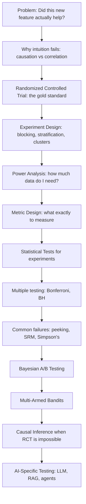
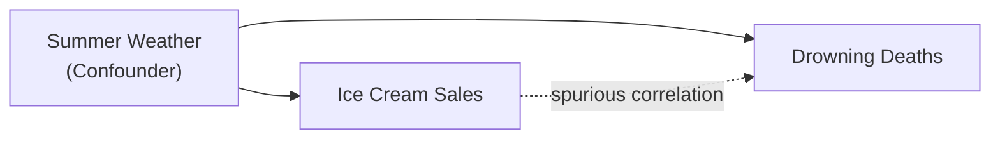

# Part 5: A/B Testing and Experimentation

> **Prerequisites:** [Part 3 — Probability](part-03-probability.md), [Part 4 — Statistics](part-04-statistics.md)
> **What you'll learn:** How to design, run, and analyze experiments that establish causation — not just correlation. How to evaluate AI systems scientifically. This is one of the most practically important chapters in the course.
> **Used later in:** Model Evaluation (metrics selection), Classical ML (model comparison), LLM Mathematics (RLHF evaluation, prompt testing).

---

## The Narrative Spine



---

## Lesson 5.1: Why Intuition Fails — The Case for Experiments

### The Fundamental Problem of Causal Inference

**The question:** Did our new model cause better engagement, or did better users find our new model?

This is the core challenge. We can observe correlations everywhere. But correlation is not causation.

**The Fundamental Problem (Holland, 1986):** For any user $i$, we cannot simultaneously observe both $Y_i(1)$ (their behavior under treatment) and $Y_i(0)$ (their behavior under control). We only ever see one.

$$
\text{Individual causal effect} = Y_i(1) - Y_i(0) \quad \text{(never directly observable)}
$$

A/B testing solves this by randomizing: we show different users different versions, then estimate:

$$
\text{Average Treatment Effect (ATE)} = \mathbb{E}[Y(1)] - \mathbb{E}[Y(0)] = \mathbb{E}[Y \mid T=1] - \mathbb{E}[Y \mid T=0]
$$

### Why Human Intuition Fails

| Bias | Description | Real Example |
|------|-------------|-------------|
| Confirmation bias | We remember the successes | "Every time we deploy on Tuesday, metrics improve" |
| Regression to the mean | Extremes trend toward average | "We changed the button after a bad week — it got better!" |
| Novelty effect | Users react to change itself | Engagement spike that disappears in 2 weeks |
| Seasonality | Time-varying effects mimic treatment | Christmas traffic inflates CTR for any change deployed Nov 1 |
| Confounding | Hidden variables explain both | Power users both adopt new features and have better outcomes |

### Correlation vs Causation

Classic example: ice cream sales and drowning deaths are highly correlated. Both are caused by warm weather. Ice cream does not cause drowning.



The only way to establish causation from data: randomized experiment, or quasi-experimental methods when randomization is impossible.

---

## Lesson 5.2: Experiment Design

### Randomized Controlled Trial (RCT)

The gold standard. Units are randomly assigned to treatment (new version) or control (current version). Randomization ensures that any confounders are balanced between groups — making the comparison fair.

**Requirements for a valid RCT:**
1. Random assignment (not self-selection)
2. Independence across units (no network effects / spillover)
3. SUTVA: Stable Unit Treatment Value Assumption — one unit's outcome doesn't depend on another's treatment
4. Intention-to-treat analysis: analyze by assigned group, not by which group they actually experienced

### Block Randomization

**Problem:** Pure randomization might, by chance, put more mobile users in treatment.

**Solution:** Divide units into blocks by key covariates (platform, country, user tenure), then randomize within each block.

$$
\text{Block}_k = \{\text{all units with covariate} = k\}
$$

Within block $k$: randomly assign 50% to treatment, 50% to control.

**Benefit:** Removes known confounders; reduces variance; improves statistical power.

### Stratified Randomization

Like block randomization but for continuous covariates — discretize into strata (buckets) and randomize within strata. Ensures balance on important variables (age groups, usage quintiles).

**AI use:** When fine-tuning an LLM, stratify prompts by category (coding, math, safety) to ensure each category is equally represented in train and val splits.

### Cluster Randomization

**When:** SUTVA is violated — individual randomization causes spillover.

Example: testing a viral sharing feature. If User A (treatment) shares with User B (control), User B's behavior is contaminated. Solution: randomize by geographic cluster — entire cities or markets get treatment or control.

**Cost:** Larger required sample size (design effect):

$$
\text{DEFF} = 1 + (m - 1)\rho
$$

where $m$ = cluster size, $\rho$ = intracluster correlation. More within-cluster correlation → less information per cluster.

### Factorial Designs

Test multiple factors simultaneously. A 2×2 factorial tests two factors each at two levels:

| | B=0 | B=1 |
|--|-----|-----|
| **A=0** | Control | B only |
| **A=1** | A only | A+B |

**Advantages:** Estimate main effects and interactions efficiently with the same experiment.

**Interaction effect:**
$$\tau_{AB} = \mu_{11} - \mu_{10} - \mu_{01} + \mu_{00}$$

A positive interaction means A and B together are more than the sum of their parts.

**AI example:** Test (prompt style: concise vs verbose) × (model: A vs B) — four conditions, measure quality and latency simultaneously.

---

## Lesson 5.3: Power Analysis and Sample Size

### Why Power Analysis Exists

If your experiment is underpowered, you can't detect real effects (false negatives). If it's overpowered, you waste traffic on an experiment that already has enough evidence.

Power analysis answers the question *before* running the experiment: "How much data do I need?"

### Statistical Power

$$
\text{Power} = 1 - \beta = P(\text{Reject } H_0 \mid H_1 \text{ is true})
$$

Power depends on:
1. Significance level $\alpha$ — larger $\alpha$ → higher power (but more false positives)
2. Sample size $n$ — larger $n$ → higher power
3. Effect size $\delta$ — larger effect → easier to detect
4. Variance $\sigma^2$ — lower variance → higher power

Standard convention: power $= 0.80$ (80% chance of detecting a true effect at $\alpha = 0.05$).

### Minimum Detectable Effect (MDE)

The MDE is the smallest effect your experiment can detect with the given power and sample size:

$$
\text{MDE} = (z_{1-\alpha/2} + z_{1-\beta}) \cdot \sqrt{\frac{2\sigma^2}{n}}
$$

For proportions:

$$
\text{MDE} = (z_{1-\alpha/2} + z_{1-\beta}) \cdot \sqrt{\frac{2\bar{p}(1-\bar{p})}{n/2}}
$$

### Sample Size Derivation

**Goal:** Derive the required $n$ per group for a two-sample z-test.

Under $H_1$, the test statistic $Z = \frac{\bar{X}_1 - \bar{X}_0}{\sqrt{2\sigma^2/n}}$ follows:

$$
Z \sim \mathcal{N}\left(\frac{\delta}{\sqrt{2\sigma^2/n}}, 1\right)
$$

For power $1 - \beta$, we need:

$$
P\left(|Z| > z_{1-\alpha/2}\right) = 1 - \beta
$$

$$
\implies \frac{\delta\sqrt{n}}{\sqrt{2}\sigma} = z_{1-\alpha/2} + z_{1-\beta}
$$

$$
\implies \boxed{n = \frac{2\sigma^2(z_{1-\alpha/2} + z_{1-\beta})^2}{\delta^2}}
$$

For $\alpha = 0.05$, power $= 0.80$: $z_{1-\alpha/2} = 1.96$, $z_{1-\beta} = 0.84$.

$$
n = \frac{2\sigma^2(1.96 + 0.84)^2}{\delta^2} = \frac{2\sigma^2 \times 7.84}{\delta^2} = \frac{15.68\sigma^2}{\delta^2}
$$

### Python Implementation

```python
import numpy as np
from scipy import stats

def sample_size_two_proportions(p_baseline, mde, alpha=0.05, power=0.80):
    """
    Required sample size per group for comparing two proportions.
    
    p_baseline: current conversion rate (e.g., 0.05 for 5%)
    mde: minimum detectable effect, absolute (e.g., 0.005 for +0.5%)
    """
    p_treatment = p_baseline + mde
    p_pooled = (p_baseline + p_treatment) / 2

    z_alpha = stats.norm.ppf(1 - alpha / 2)   # 1.96 for alpha=0.05
    z_beta  = stats.norm.ppf(power)            # 0.84 for power=0.80

    n = (z_alpha + z_beta)**2 * 2 * p_pooled * (1 - p_pooled) / mde**2
    return int(np.ceil(n))

# Example: baseline CTR = 5%, MDE = +0.5%
n = sample_size_two_proportions(p_baseline=0.05, mde=0.005)
print(f"Required sample per group: {n:,}")  # ~30,000
print(f"Total experiment size: {n*2:,}")    # ~60,000

# How long does this take? If daily traffic = 10,000 users, 50% eligible:
daily_traffic = 10_000
eligible_fraction = 0.5
days_needed = (n * 2) / (daily_traffic * eligible_fraction)
print(f"Experiment duration: {days_needed:.1f} days")  # ~12 days
```

---

## Lesson 5.4: Metric Design

### Guardrail Metrics, North Star Metrics

Every experiment should define three tiers of metrics before it runs:

**North Star Metric:** The primary measure of user/business value. Only one. Ship decision is based on this.

Examples: DAU, revenue per user, task completion rate, model output quality score.

**Guardrail Metrics:** Metrics that must not regress. They protect against regressions in other dimensions.

Examples: latency p99 (new feature must not make the app slower), crash rate, user churn.

**Supporting Metrics:** Secondary metrics that help explain the primary metric movement.

### The Novelty Effect

When users encounter a change, they behave differently simply because it's new — not because the change is better. This novelty effect fades as users adapt.

**Detection:** Plot the treatment effect over time. If it decreases (or disappears) after 1-2 weeks, you're seeing novelty, not value.

**Fix:** Run the experiment long enough to see past the novelty period (typically 2-4 weeks for most features).

### The Peeking Problem

**Problem:** You check the p-value daily. On day 5, $p < 0.05$. You stop and declare a win.

This is statistically invalid. When you check repeatedly, each check is a new opportunity for a false positive. Running a test until significance is reached inflates Type I error dramatically.

**Example:** If you check every day for 30 days at $\alpha = 0.05$, the true Type I error rate can exceed 20%.

**Fixes:**
- Pre-register sample size and don't stop early based on p-values
- Use sequential testing methods (SPRT, always-valid p-values)
- Use Bayesian testing (posterior is always valid at any stopping time)

### Sample Ratio Mismatch (SRM)

**Definition:** The observed ratio of treatment to control traffic doesn't match the intended ratio.

You assigned 50/50. You got 47/53. This is SRM.

**Why it's a problem:** SRM indicates that assignment or logging is broken. The groups are no longer comparable, and the estimated treatment effect is biased.

**Detection:** Chi-square test on the observed vs expected traffic split.

**Common causes:** Bugs in the assignment code, bots being filtered differently per group, CDN caching issues.

**Rule:** If SRM is detected, do not interpret the experiment results. Fix the bug and rerun.

### Simpson's Paradox

The aggregate effect can show the opposite direction from every stratum.

| Group | Control CVR | Treatment CVR |
|-------|------------|--------------|
| Mobile (70% traffic) | 5% | 4% |
| Desktop (30% traffic) | 20% | 18% |
| **Aggregate** | **9.5%** | **9.4%** |

Wait — treatment is worse in both strata, but looks almost identical in aggregate. Why?

If randomization failed and treatment got more mobile (low CVR) users, Simpson's paradox creates the misleading aggregate.

**Fix:** Always check randomization balance (stratum-level composition) and analyze within strata when possible.

---

## Lesson 5.5: Statistical Tests for Experiments

### Z-Test for Proportions

**When:** Large samples ($n > 30$ per group), comparing conversion rates, CTR.

$$
Z = \frac{\hat{p}_1 - \hat{p}_2}{\sqrt{\hat{p}(1-\hat{p})(1/n_1 + 1/n_2)}}
$$

where $\hat{p} = (n_1\hat{p}_1 + n_2\hat{p}_2)/(n_1 + n_2)$ is the pooled proportion.

Under $H_0$: $Z \sim \mathcal{N}(0,1)$.

```python
from scipy import stats
import numpy as np

def two_proportion_z_test(n_ctrl, conv_ctrl, n_trt, conv_trt, alpha=0.05):
    p_ctrl = conv_ctrl / n_ctrl
    p_trt  = conv_trt  / n_trt
    p_pool = (conv_ctrl + conv_trt) / (n_ctrl + n_trt)

    se    = np.sqrt(p_pool * (1 - p_pool) * (1/n_ctrl + 1/n_trt))
    z     = (p_trt - p_ctrl) / se
    p_val = 2 * (1 - stats.norm.cdf(abs(z)))

    # 95% CI for the difference
    se_diff = np.sqrt(p_ctrl*(1-p_ctrl)/n_ctrl + p_trt*(1-p_trt)/n_trt)
    z_crit  = stats.norm.ppf(1 - alpha/2)
    ci      = (p_trt - p_ctrl - z_crit*se_diff,
               p_trt - p_ctrl + z_crit*se_diff)

    return {
        "absolute_lift": p_trt - p_ctrl,
        "relative_lift": (p_trt - p_ctrl) / p_ctrl,
        "z_stat": z, "p_value": p_val,
        "significant": p_val < alpha, "ci_95": ci,
    }

result = two_proportion_z_test(50000, 2500, 50000, 2750)
print(f"Lift: {result['relative_lift']:.1%}, p={result['p_value']:.4f}")
# Lift: 10.0%, p=0.0000
```

### CUPED (Controlled-Experiment using Pre-Experiment Data)

**Problem:** Revenue per user has high variance (some users spend $0, others spend $10,000), requiring large samples.

**CUPED** uses pre-experiment observations to reduce variance and sharpen the experiment.

$$
Y_{\text{cuped}} = Y - \theta (X - \mathbb{E}[X])
$$

where $X$ is a pre-experiment covariate (e.g., revenue in the week before the experiment) and $\theta = \text{Cov}(Y, X)/\text{Var}(X)$ is the OLS coefficient.

**Variance reduction:**

$$
\text{Var}(Y_{\text{cuped}}) = \text{Var}(Y)(1 - \rho_{XY}^2)
$$

If $\rho_{XY} = 0.5$ (typical for pre-post revenue correlation), variance is reduced by 75%, effectively quadrupling statistical power.

```python
def cuped(Y_ctrl, Y_trt, X_ctrl, X_trt):
    """
    CUPED variance reduction.
    Y: post-experiment metric (revenue, engagement)
    X: pre-experiment covariate (same metric before experiment)
    """
    X_all = np.concatenate([X_ctrl, X_trt])
    Y_all = np.concatenate([Y_ctrl, Y_trt])

    # OLS coefficient theta
    theta = np.cov(Y_all, X_all)[0, 1] / np.var(X_all)

    # Adjusted outcomes
    X_mean = X_all.mean()
    Y_ctrl_adj = Y_ctrl - theta * (X_ctrl - X_mean)
    Y_trt_adj  = Y_trt  - theta * (X_trt  - X_mean)

    variance_reduction = 1 - np.var(Y_ctrl_adj) / np.var(Y_ctrl)
    return Y_ctrl_adj, Y_trt_adj, variance_reduction

np.random.seed(42)
X_ctrl = np.random.lognormal(0, 1, 5000)         # pre-experiment revenue
X_trt  = np.random.lognormal(0, 1, 5000)
Y_ctrl = X_ctrl * 0.9 + np.random.lognormal(0, 1, 5000)  # correlated
Y_trt  = X_trt  * 0.9 + np.random.lognormal(0.05, 1, 5000)

_, _, var_red = cuped(Y_ctrl, Y_trt, X_ctrl, X_trt)
print(f"Variance reduction: {var_red:.1%}")  # ~30-50%
```

---

## Lesson 5.6: Multiple Testing

### The Problem

You measure 20 metrics in one experiment. Even if no metric is truly affected, you expect $20 \times 0.05 = 1$ false positive at $\alpha = 0.05$.

The more metrics you test, the more likely you are to find *something* significant by random chance.

| Number of tests | P(at least one false positive) |
|-----------------|-------------------------------|
| 1 | 5% |
| 5 | 23% |
| 10 | 40% |
| 20 | 64% |
| 100 | 99.4% |

### Bonferroni Correction

Test each hypothesis at $\alpha_{\text{adjusted}} = \alpha/m$ where $m$ is the number of tests.

**Controls Family-Wise Error Rate (FWER):** probability of any false positive ≤ $\alpha$.

**Drawback:** Very conservative. With 100 tests, you need $p < 0.0005$ to declare significance. Low power.

**When to use:** When any false positive is costly (clinical trials, safety-critical features).

### Benjamini-Hochberg (BH) — FDR Control

Controls the **False Discovery Rate (FDR)**: expected proportion of false discoveries among all discoveries.

**Algorithm:**
1. Sort p-values: $p_{(1)} \leq p_{(2)} \leq \cdots \leq p_{(m)}$
2. Find the largest $k$ such that $p_{(k)} \leq \frac{k}{m} \alpha$
3. Reject $H_{(1)}, \ldots, H_{(k)}$

**Why BH is preferred for experiments with many metrics:** Less conservative than Bonferroni. Allows some false discoveries (controlled proportion). Widely used in exploratory experimentation.

```python
from statsmodels.stats.multitest import multipletests

p_values = [0.001, 0.009, 0.03, 0.04, 0.06, 0.12, 0.45]

# Bonferroni
reject_bonf, _, _, _ = multipletests(p_values, method='bonferroni', alpha=0.05)

# Benjamini-Hochberg FDR
reject_bh, _, _, _ = multipletests(p_values, method='fdr_bh', alpha=0.05)

for i, (p, rb, rh) in enumerate(zip(p_values, reject_bonf, reject_bh)):
    print(f"H{i+1}: p={p:.3f}  |  Bonferroni: {'✓' if rb else '✗'}  |  BH-FDR: {'✓' if rh else '✗'}")
```

### Production Strategy for Multiple Metrics

1. **Primary metric** — pre-specified, tested at full $\alpha$; drives ship decision
2. **Guardrail metrics** — tested with Bonferroni or BH to protect against regressions
3. **Exploratory metrics** — observe but don't adjust; flag for confirmatory study
4. **Define the metric family before the experiment** — no post-hoc p-value fishing

---

## Lesson 5.7: Bayesian A/B Testing

### Why Bayesian Testing

Frequentist A/B testing has two painful limitations:
1. The peeking problem — you can't look until you have enough data
2. You get a p-value, which doesn't directly say "how confident am I?"

Bayesian testing solves both. The posterior is always valid and always interpretable.

### The Beta-Binomial Model

For conversion rates, the natural model is:
- **Prior:** $p \sim \text{Beta}(\alpha_0, \beta_0)$ (beliefs before the experiment)
- **Likelihood:** $k \mid p, n \sim \text{Binomial}(n, p)$ ($k$ conversions from $n$ users)
- **Posterior:** $p \mid k, n \sim \text{Beta}(\alpha_0 + k, \beta_0 + n - k)$

Beta is conjugate to Binomial — the posterior has the same form as the prior, just with updated parameters.

**Sequential updating:** Each new batch of data updates the posterior:

$$\text{Beta}(\alpha + k_{\text{new}},\, \beta + n_{\text{new}} - k_{\text{new}})$$

No need to wait for a pre-specified sample size.

### Decision Rules

**Probability of being better:**
$$P(p_{\text{trt}} > p_{\text{ctrl}}) = \int_0^1 \int_0^{p_1} p(\theta_1)p(\theta_0)\, d\theta_0\, d\theta_1$$

Computable by Monte Carlo: sample from both posteriors, count how often $\theta_1 > \theta_0$.

**Expected loss (preferred at many companies):**
$$\mathbb{E}[\text{loss from shipping trt}] = \mathbb{E}\left[\max(0, p_{\text{ctrl}} - p_{\text{trt}})\right]$$

Ship if expected loss $<$ some tolerance (e.g., 0.001 absolute percentage points).

```python
import numpy as np

class BayesianABTest:
    def __init__(self, alpha_prior=1, beta_prior=1):
        # Independent Beta posteriors for control and treatment
        self.ctrl = [alpha_prior, beta_prior]
        self.trt  = [alpha_prior, beta_prior]

    def update(self, group, conversions, visitors):
        if group == 'ctrl':
            self.ctrl[0] += conversions
            self.ctrl[1] += (visitors - conversions)
        else:
            self.trt[0]  += conversions
            self.trt[1]  += (visitors - conversions)

    def analyze(self, n_samples=100_000):
        theta_ctrl = np.random.beta(*self.ctrl, n_samples)
        theta_trt  = np.random.beta(*self.trt,  n_samples)

        prob_trt_better = (theta_trt > theta_ctrl).mean()
        expected_loss   = np.maximum(0, theta_ctrl - theta_trt).mean()
        lift_samples    = theta_trt - theta_ctrl
        ci_95 = np.percentile(lift_samples, [2.5, 97.5])

        return {
            "prob_trt_better": prob_trt_better,
            "expected_loss": expected_loss,
            "median_lift": np.median(lift_samples),
            "ci_95": ci_95,
        }

test = BayesianABTest(alpha_prior=1, beta_prior=1)
test.update('ctrl', 2500, 50000)
test.update('trt',  2750, 50000)

result = test.analyze()
print(f"P(treatment better): {result['prob_trt_better']:.1%}")
print(f"Expected loss of shipping: {result['expected_loss']:.5f}")
print(f"95% credible interval for lift: {result['ci_95']}")
```

---

## Lesson 5.8: Multi-Armed Bandits and Thompson Sampling

### The Explore-Exploit Trade-off

In a traditional A/B test, you split traffic equally between arms regardless of early performance. This wastes traffic — if arm A is clearly winning by day 2, you're still sending 50% to the losing arm B until the experiment ends.

**Bandits** allocate traffic dynamically. They explore to learn which arm is best, and exploit what they know by directing more traffic to the better arm.

**Regret:** The cost of not always pulling the optimal arm:

$$
R_T = T \mu^* - \sum_{t=1}^T \mu_{a_t}
$$

where $\mu^* = \max_k \mu_k$ is the optimal arm's mean.

### Thompson Sampling

**Algorithm:**
1. Maintain a Beta posterior $\text{Beta}(\alpha_k, \beta_k)$ for each arm's conversion rate
2. At each user visit: sample $\theta_k \sim \text{Beta}(\alpha_k, \beta_k)$ for each arm
3. Show the arm with the highest sampled $\theta_k$
4. Observe the outcome; update the corresponding posterior

```python
import numpy as np

class ThompsonSampler:
    def __init__(self, n_arms):
        self.alpha = np.ones(n_arms)   # successes + prior 1
        self.beta  = np.ones(n_arms)   # failures  + prior 1

    def choose(self):
        samples = np.random.beta(self.alpha, self.beta)
        return np.argmax(samples)

    def update(self, arm, reward):
        self.alpha[arm] += reward
        self.beta[arm]  += 1 - reward


# Simulate: 3 arms with true conversion rates 10%, 12%, 9%
np.random.seed(42)
true_rates  = [0.10, 0.12, 0.09]
ts          = ThompsonSampler(n_arms=3)
arm_counts  = np.zeros(3)
total_reward = 0

for _ in range(10_000):
    arm = ts.choose()
    reward = np.random.binomial(1, true_rates[arm])
    ts.update(arm, reward)
    arm_counts[arm] += 1
    total_reward += reward

print("Traffic allocation:", arm_counts / arm_counts.sum())
# Best arm (arm 1, 12%) gets ~80%+ of traffic
print(f"Total conversions: {total_reward}")
```

**Key property:** Thompson Sampling is *probability matching* — each arm is pulled proportional to its probability of being optimal. This balances exploration and exploitation optimally in an asymptotic sense.

### UCB (Upper Confidence Bound)

A deterministic alternative: always pull the arm with the highest upper confidence bound:

$$
a_t = \arg\max_k \left[\hat{\mu}_k + c\sqrt{\frac{\ln t}{n_k}}\right]
$$

The second term is an exploration bonus — larger for arms pulled fewer times.

### Bandits vs A/B Tests

| Aspect | A/B Test | Bandit |
|--------|---------|--------|
| Traffic allocation | Fixed 50/50 | Dynamic (adapts) |
| Speed to detect winner | Slow | Fast |
| Regret during experiment | Higher | Lower |
| Statistical guarantee | Clean frequentist test | More complex |
| When to use | Major decisions, regulatory compliance | Continuous optimization, recommendation |

---

## Lesson 5.9: Causal Inference

### Difference-in-Differences (DiD)

**When:** Can't randomize. Have pre- and post-treatment observations for treated and control groups.

**Estimator:**

$$
\hat{\tau}_{\text{DiD}} = (\bar{Y}_{\text{trt, post}} - \bar{Y}_{\text{trt, pre}}) - (\bar{Y}_{\text{ctrl, post}} - \bar{Y}_{\text{ctrl, pre}})
$$

The control group provides the counterfactual trend. The DiD removes common time trends.

**Key assumption: Parallel trends** — in the absence of treatment, treated and control would have moved in parallel.

**Regression formulation:**

$$
Y_{it} = \alpha + \beta_1 \text{Treated}_i + \beta_2 \text{Post}_t + \beta_3 (\text{Treated}_i \times \text{Post}_t) + \varepsilon_{it}
$$

$\hat{\beta}_3$ is the DiD estimator.

**AI use:** Launching a new ranking algorithm in one geographic market. No individual randomization possible.

### Propensity Score Matching (PSM)

**When:** Treatment is non-random; observed confounders exist; you want to estimate the causal effect by matching similar treated and control units.

**Propensity score:** $e(\mathbf{x}) = P(T=1 \mid \mathbf{X} = \mathbf{x})$ — estimated via logistic regression or a classifier.

**Rosenbaum-Rubin theorem:** If $T \perp (Y(0), Y(1)) \mid \mathbf{X}$, then $T \perp (Y(0), Y(1)) \mid e(\mathbf{X})$. Conditioning on the propensity score is sufficient for removing confounding.

**Steps:**
1. Estimate propensity scores
2. Match treated units to control units with similar scores (nearest neighbor, within a caliper)
3. Estimate the ATT on matched sample

**AI use:** Evaluating the effect of a new model on users who weren't randomly assigned (e.g., users who opted into a beta vs those who didn't).

---

## Lesson 5.10: AI-Specific Experimentation

### Prompt A/B Testing

Testing whether prompt A produces better outputs than prompt B for an LLM.

**Design challenges:**
- Outputs are text — no single objective metric
- Need human evaluation or another LLM as judge
- Each evaluation is expensive → small $n$ → less power

**Best practices:**
1. Use a consistent evaluation rubric (quality, faithfulness, helpfulness)
2. Use blind evaluation (evaluator doesn't know which prompt produced which output)
3. Use win-rate: what fraction of comparisons does prompt A win?
4. Bootstrap to get confidence intervals on the win rate

### LLM Evaluation Metrics as Experiment Outcomes

In LLM experiments, your primary metric is often a model-based evaluation:

| Metric | Definition | When to use |
|--------|-----------|-------------|
| Win rate | P(model A > model B) via judge | Relative comparison |
| G-Eval score | LLM-scored quality rubric (1-5) | Single-model evaluation |
| ROUGE/BLEU | N-gram overlap with reference | When reference exists |
| Faithfulness | Does the response stick to the source? | RAG, summarization |
| Hallucination rate | Fraction of claims not in source | RAG, factual tasks |
| Task completion | Did the agent complete the task? | Agent evaluation |

### RAG Evaluation Framework

For Retrieval-Augmented Generation systems:

```
User Query
    ↓
Retrieval (documents retrieved)
    ↓
Generation (answer generated)
```

You need to evaluate both stages:

| Metric | Stage | Definition |
|--------|-------|-----------|
| Context Precision | Retrieval | Fraction of retrieved chunks that are relevant |
| Context Recall | Retrieval | Fraction of relevant chunks that were retrieved |
| Answer Relevance | Generation | Is the answer relevant to the question? |
| Faithfulness | Generation | Are all claims supported by the retrieved context? |
| Answer Correctness | End-to-end | Is the final answer correct? |

### Agent Evaluation

Evaluating AI agents is harder because:
- Trajectories are long (multiple steps)
- Intermediate steps matter, not just the final answer
- The same correct answer can be reached multiple ways

**Evaluation dimensions:**
1. **Task success rate:** Did the agent complete the task?
2. **Efficiency:** How many steps/tokens did it take?
3. **Tool use accuracy:** Were the right tools called in the right order?
4. **Error recovery:** When something failed, did the agent recover?
5. **Safety:** Did the agent do anything harmful or out-of-scope?

**A/B testing agents:** Compare agent version A vs B on a held-out test set of tasks. Measure task success rate, efficiency, and human preference scores.

---

## Part 5 Summary

### Key Takeaways

1. **Randomized experiments** are the only reliable way to establish causation. Correlation is not causation.
2. **Power analysis** must happen before the experiment. Sample size depends on effect size, variance, $\alpha$, and desired power.
3. **The peeking problem** is real. Don't stop experiments early based on interim p-values.
4. **SRM** means the experiment is broken. Detect it with a chi-square test before interpreting any results.
5. **Multiple testing** inflates false positives. Pre-specify your primary metric; use BH correction for secondary metrics.
6. **Bayesian A/B testing** gives always-valid conclusions and avoids the peeking problem.
7. **Thompson Sampling** adaptively allocates traffic to better arms, reducing regret during the experiment.
8. **When RCT is impossible**, use DiD, PSM, or IV depending on the available data structure.
9. **AI experiments** require special metric design — win rate, faithfulness, task completion — not just clicks and revenue.

### Cheat Sheet

| Formula | Use |
|---------|-----|
| $n = 2\sigma^2(z_{\alpha/2} + z_\beta)^2/\delta^2$ | Sample size per group |
| $Z = (\hat{p}_1 - \hat{p}_2)/\sqrt{\hat{p}(1-\hat{p})(1/n_1+1/n_2)}$ | Proportion z-test |
| $\alpha_{\text{bonf}} = \alpha/m$ | Bonferroni correction |
| $p_{(k)} \leq k\alpha/m$ | BH procedure threshold |
| $P(\alpha+k, \beta+n-k)$ | Bayesian posterior update |
| $\hat{\tau}_{\text{DiD}} = (\bar{Y}_{11}-\bar{Y}_{10}) - (\bar{Y}_{01}-\bar{Y}_{00})$ | Difference-in-Differences |
| $\text{DEFF} = 1 + (m-1)\rho$ | Cluster design effect |

### Flash Cards

**Q:** What is the peeking problem?
**A:** Repeatedly checking p-values and stopping when p < 0.05 inflates the Type I error rate far above the nominal α.

**Q:** What is SRM and why is it dangerous?
**A:** Sample Ratio Mismatch — the observed traffic split doesn't match the intended split. It indicates the assignment mechanism is broken, making the groups non-comparable.

**Q:** What does Thompson Sampling do?
**A:** Maintains a Beta posterior for each arm's conversion rate. At each step, samples from each posterior and chooses the arm with the highest sample. Naturally balances exploration and exploitation.

**Q:** When would you use Difference-in-Differences?
**A:** When you cannot randomize but have pre-treatment and post-treatment data for both treated and control groups, and the parallel-trends assumption is plausible.

**Q:** What is FDR vs FWER?
**A:** FWER = probability of at least one false positive (controlled by Bonferroni). FDR = expected proportion of false positives among all rejections (controlled by BH). BH is less conservative and preferred for exploratory analyses.

### Common Mistakes

**Mistake:** Interpreting a non-significant result as "no effect."
**Fix:** Non-significance means insufficient evidence for an effect. It doesn't mean the effect is zero. Report confidence intervals, not just the p-value decision.

---

**Mistake:** Treating the end of the experiment as the only valid stopping point, but checking p-values daily anyway.
**Fix:** If you need to peek, use sequential testing methods (SPRT, mSPRT) that are designed for continuous monitoring.

---

**Mistake:** Not checking for SRM before analyzing results.
**Fix:** Always compute the expected vs observed traffic split and chi-square test it before trusting any metric.

---

*Next: [Part 6 — Information Theory](part-06-information-theory.md)*
