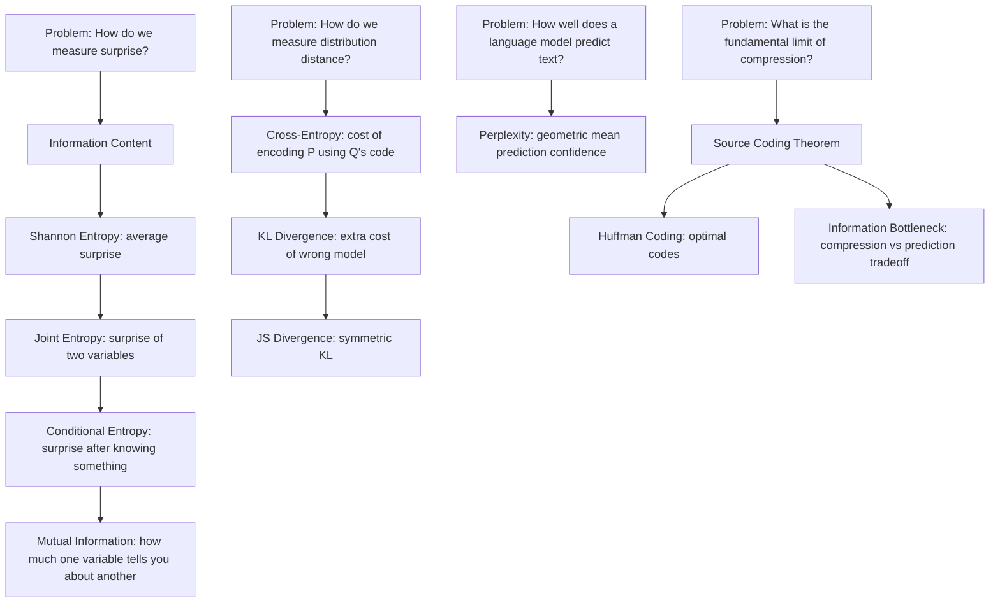

# Part 6: Information Theory

> **Prerequisites:** [Part 3 — Probability](part-03-probability.md) (distributions, expectation, logarithms)
> **What you'll learn:** How to measure information, surprise, and the distance between probability distributions. Information theory is the mathematical foundation of all modern loss functions.
> **Used later in:** Optimization (cross-entropy loss derivation), Model Evaluation (perplexity, BLEU), LLMs (next-token prediction loss, compression), Deep Learning (information bottleneck, VAE).

---

## The Narrative Spine



---

## Lesson 6.1: Information Content

### Why Was This Invented?

Claude Shannon asked in 1948: "Is there a way to measure how much information a message contains?" He needed this to design efficient communication systems — to know how many bits are needed to transmit a message reliably.

The answer turned out to be one of the most influential ideas in science.

### Explain Like I Am 10 Years Old

Imagine two news headlines:

1. "The Sun rose this morning."
2. "Meteorite hits Times Square."

Which one contains more information?

The second one, clearly. Why? Because it was *surprising*. You already knew the sun would rise — that tells you nothing new. A meteorite strike is something you would never have predicted.

Information is inversely related to probability. Surprising events carry more information than predictable ones.

### Formal Definition

The **information content** (self-information) of an event with probability $p$:

$$
I(x) = -\log_2 p(x) \quad \text{bits}
$$

The base of the logarithm determines units:
- Base 2: bits (natural for binary code)
- Base $e$: nats (natural for mathematical analysis)
- Base 10: hartleys

**Derivation: Why the logarithm?**

We want a function $I(p)$ satisfying:
1. $I(p) \geq 0$ (information is non-negative)
2. $I(1) = 0$ (certain events carry no information)
3. $I(p)$ is decreasing in $p$ (rarer events = more information)
4. $I(p_1 \cdot p_2) = I(p_1) + I(p_2)$ (independent events: information adds)

Property 4 says: if two independent events each have probability $p$, observing both should carry twice the information. The only function satisfying all four is $I(p) = -\log p$.

**Numerical examples:**

- "Coin lands heads" ($p = 0.5$): $I = -\log_2(0.5) = 1$ bit
- "Die shows 6" ($p = 1/6$): $I = -\log_2(1/6) \approx 2.58$ bits
- "Certain event" ($p = 1$): $I = -\log_2(1) = 0$ bits
- "Rare event" ($p = 0.001$): $I = -\log_2(0.001) \approx 10$ bits

---

## Lesson 6.2: Shannon Entropy

### Why Was This Invented?

Self-information tells you about one specific event. But what is the *average* information you receive from a source? This is entropy — the expected surprise.

### Formal Definition

For a discrete random variable $X$ with probability distribution $P$:

$$
H(X) = -\sum_{x} p(x) \log_2 p(x) = \mathbb{E}[-\log_2 p(X)]
$$

**Properties of entropy:**
1. $H(X) \geq 0$: entropy is always non-negative
2. $H(X) = 0$ iff $X$ is deterministic (one outcome has probability 1)
3. $H(X)$ is maximized when $X$ is uniform: $H_{\max} = \log_2 |\mathcal{X}|$ bits
4. Entropy is concave in $p$

**Numerical Example:**

A fair coin: $p(\text{H}) = p(\text{T}) = 0.5$

$$
H(X) = -(0.5 \log_2 0.5 + 0.5 \log_2 0.5) = -(0.5 \times (-1) + 0.5 \times (-1)) = 1 \text{ bit}
$$

A biased coin: $p(\text{H}) = 0.9, p(\text{T}) = 0.1$

$$
H(X) = -(0.9 \log_2 0.9 + 0.1 \log_2 0.1) = -(0.9 \times (-0.152) + 0.1 \times (-3.322)) \approx 0.469 \text{ bits}
$$

The biased coin has lower entropy — it's less surprising on average.

### Joint and Conditional Entropy

**Joint Entropy** of two variables $X, Y$:

$$
H(X, Y) = -\sum_{x, y} p(x, y) \log_2 p(x, y)
$$

Measures total uncertainty about both variables together.

**Conditional Entropy** — uncertainty about $X$ given that we know $Y$:

$$
H(X \mid Y) = -\sum_{x, y} p(x, y) \log_2 p(x \mid y) = H(X, Y) - H(Y)
$$

**Chain rule of entropy:**

$$
H(X, Y) = H(X) + H(Y \mid X) = H(Y) + H(X \mid Y)
$$

Knowing $Y$ can only reduce (or maintain) uncertainty about $X$:

$$
H(X \mid Y) \leq H(X)
$$

---

## Lesson 6.3: Cross-Entropy

### Why Was This Invented?

You have a real distribution $P$ (the data) and a model distribution $Q$ (your model). Cross-entropy measures the cost of encoding data from $P$ using the code designed for $Q$.

This is the most important concept in this part for AI engineers: **the cross-entropy loss function is literally this quantity**.

### Explain Like I Am 10 Years Old

You're writing letters to a friend in a foreign country. You've learned their language well, but you're using dictionary words from their language that you think they use often.

If your guess about their vocabulary is perfect, you'll use the shortest possible words for things they say a lot. If your guess is wrong, you'll be stuck using long words for things they say constantly.

Cross-entropy measures how inefficient your code is because you designed it for the wrong distribution.

### Formal Definition

$$
H(P, Q) = -\sum_x p(x) \log_2 q(x) = \mathbb{E}_{x \sim P}[-\log Q(x)]
$$

**Key identity:**

$$
H(P, Q) = H(P) + D_{\text{KL}}(P \| Q)
$$

Cross-entropy = entropy of the true distribution + the extra cost from using the wrong model.

**Connection to AI training:**

In classification with $K$ classes, the training labels give the true distribution $P$ (one-hot: probability 1 on the correct class, 0 elsewhere). The model outputs $Q$ (softmax probabilities).

For one example with true class $c$:

$$
H(P, Q) = -\sum_{k=1}^K p_k \log q_k = -\log q_c
$$

Since $p_k = 0$ for $k \neq c$. The cross-entropy loss for a single example is just the negative log-probability assigned to the correct class.

**Training a classifier = minimizing cross-entropy = maximizing the probability assigned to correct answers.**

### Python Implementation

```python
import numpy as np
import torch
import torch.nn.functional as F

# Manual cross-entropy loss
def cross_entropy(p, q):
    """H(P, Q) = -sum(p * log(q))"""
    return -np.sum(p * np.log(q + 1e-10))

# True one-hot label (class 2 out of 3)
p = np.array([0.0, 0.0, 1.0])

# Model predictions (softmax outputs)
q_good = np.array([0.05, 0.10, 0.85])   # mostly correct
q_bad  = np.array([0.33, 0.33, 0.34])   # nearly uniform

print(f"H(P, Q_good) = {cross_entropy(p, q_good):.4f}")  # ~0.163
print(f"H(P, Q_bad)  = {cross_entropy(p, q_bad):.4f}")   # ~1.079

# PyTorch cross-entropy loss (takes logits, not probabilities)
logits = torch.tensor([[-2.0, -1.0, 2.0]])   # good prediction for class 2
target = torch.tensor([2])                    # true class is 2
loss = F.cross_entropy(logits, target)
print(f"\nPyTorch CE loss: {loss.item():.4f}")  # ~0.131

# With bad prediction
logits_bad = torch.tensor([[0.5, 0.3, 0.4]])
loss_bad = F.cross_entropy(logits_bad, target)
print(f"Bad prediction CE loss: {loss_bad.item():.4f}")  # ~1.09
```

---

## Lesson 6.4: KL Divergence

### Why Was This Invented?

KL divergence measures the extra information cost when you use distribution $Q$ to approximate distribution $P$. It quantifies how "wrong" your model is as a distribution.

### Formal Definition

$$
D_{\text{KL}}(P \| Q) = \sum_x p(x) \log \frac{p(x)}{q(x)} = \mathbb{E}_{x \sim P}\left[\log \frac{p(x)}{q(x)}\right]
$$

For continuous distributions:

$$
D_{\text{KL}}(P \| Q) = \int p(x) \ln \frac{p(x)}{q(x)}\, dx
$$

**Key properties:**
1. $D_{\text{KL}}(P \| Q) \geq 0$ always (Gibbs inequality)
2. $D_{\text{KL}}(P \| Q) = 0 \iff P = Q$
3. **Not symmetric:** $D_{\text{KL}}(P \| Q) \neq D_{\text{KL}}(Q \| P)$ in general
4. $H(P, Q) = H(P) + D_{\text{KL}}(P \| Q)$

**Proof that KL ≥ 0 (Jensen's inequality):**

$$
D_{\text{KL}}(P \| Q) = \mathbb{E}_P\left[\log \frac{p(x)}{q(x)}\right] = -\mathbb{E}_P\left[\log \frac{q(x)}{p(x)}\right]
$$

Since $\log$ is concave and by Jensen's inequality: $-\mathbb{E}[\log Z] \geq -\log\mathbb{E}[Z]$:

$$
D_{\text{KL}}(P \| Q) \geq -\log \mathbb{E}_P\left[\frac{q(x)}{p(x)}\right] = -\log \sum_x p(x) \frac{q(x)}{p(x)} = -\log \sum_x q(x) = -\log 1 = 0 \checkmark
$$

### Which Direction of KL?

**$D_{\text{KL}}(P \| Q)$** (forward KL, used in MLE): penalizes $Q$ being zero where $P$ is non-zero. This is the direction you minimize when training with maximum likelihood — it produces *mean-seeking* behavior.

**$D_{\text{KL}}(Q \| P)$** (reverse KL, used in VI): penalizes $Q$ being non-zero where $P$ is zero. Produces *mode-seeking* behavior.

**AI use:**
- **VAE loss:** ELBO = reconstruction term (cross-entropy) $-$ $D_{\text{KL}}(q(\mathbf{z}|\mathbf{x}) \| p(\mathbf{z}))$
- **RL fine-tuning (KL penalty):** Keep policy $\pi_\theta$ close to reference policy $\pi_{\text{ref}}$: $\mathcal{L} = -\mathbb{E}[r] + \beta D_{\text{KL}}(\pi_\theta \| \pi_{\text{ref}})$
- **Knowledge distillation:** Minimize $D_{\text{KL}}(\text{teacher} \| \text{student})$

### Numerical Example

$P = [0.3, 0.5, 0.2]$, $Q = [0.25, 0.5, 0.25]$ (a slightly wrong model).

$$
D_{\text{KL}}(P \| Q) = 0.3 \log\frac{0.3}{0.25} + 0.5 \log\frac{0.5}{0.5} + 0.2 \log\frac{0.2}{0.25}
$$

$$
= 0.3 \ln(1.2) + 0 + 0.2 \ln(0.8) = 0.3(0.182) + 0.2(-0.223) = 0.055 - 0.045 = 0.010 \text{ nats}
$$

Small but non-zero — the model $Q$ is close but not identical to $P$.

---

## Lesson 6.5: Jensen-Shannon Divergence

### Why Was This Invented?

KL divergence is not symmetric and can be infinite (when $Q(x) = 0$ but $P(x) > 0$). JS divergence is the symmetric, finite, bounded version.

### Formal Definition

$$
D_{\text{JS}}(P \| Q) = \frac{1}{2} D_{\text{KL}}\left(P \| M\right) + \frac{1}{2} D_{\text{KL}}\left(Q \| M\right), \quad M = \frac{P + Q}{2}
$$

**Properties:**
- Symmetric: $D_{\text{JS}}(P \| Q) = D_{\text{JS}}(Q \| P)$
- Bounded: $0 \leq D_{\text{JS}} \leq 1$ (when using base-2 logarithm)
- $D_{\text{JS}} = 0 \iff P = Q$
- $\sqrt{D_{\text{JS}}}$ is a metric (satisfies triangle inequality)

**AI use:** GAN (Generative Adversarial Network) original objective minimizes JS divergence between real and generated distributions. The discriminator implicitly estimates JS divergence.

---

## Lesson 6.6: Mutual Information

### Why Was This Invented?

How much information does knowing $Y$ give you about $X$? Mutual information answers this, and it's the key quantity in feature selection, representation learning, and the information bottleneck.

### Formal Definition

$$
I(X; Y) = H(X) - H(X \mid Y) = H(Y) - H(Y \mid X) = H(X) + H(Y) - H(X, Y)
$$

Or directly:

$$
I(X; Y) = \sum_{x, y} p(x, y) \log \frac{p(x, y)}{p(x)p(y)} = D_{\text{KL}}(P_{XY} \| P_X \otimes P_Y)
$$

**Intuition:**
- $I(X; Y) = 0$: $X$ and $Y$ are independent — knowing one tells you nothing about the other
- $I(X; Y) = H(X)$: $Y$ completely determines $X$
- $I(X; Y)$ is symmetric and always $\geq 0$

### Venn Diagram of Entropy Quantities

```
         ┌──────────────────────────────┐
         │          H(X, Y)             │
         │  ┌────────┐   ┌────────┐     │
         │  │  H(X|Y)│   │ H(Y|X) │     │
         │  │        │I(X;Y)      │     │
         │  └────────┘   └────────┘     │
         └──────────────────────────────┘
         
H(X) = H(X|Y) + I(X;Y)
H(Y) = H(Y|X) + I(X;Y)
H(X,Y) = H(X) + H(Y|X) = H(Y) + H(X|Y)
```

**AI use:**
- Feature selection: $I(\text{feature}; \text{label})$ measures how informative a feature is
- Representation learning: contrastive learning maximizes $I(\text{view}_1; \text{view}_2)$ of different augmentations of the same image
- Neural information bottleneck: find representation $T$ that maximizes $I(T; Y)$ while minimizing $I(X; T)$

---

## Lesson 6.7: Perplexity

### Why Was This Invented?

A language model assigns a probability to each possible next token. Perplexity measures how "confused" (perplexed) the model is when predicting text. Lower perplexity = better language model.

### Formal Definition

For a language model $Q$ evaluating a text sequence $w_1, w_2, \ldots, w_N$:

$$
\text{Perplexity}(Q) = 2^{H(P, Q)} = 2^{-\frac{1}{N}\sum_{i=1}^N \log_2 q(w_i \mid w_1, \ldots, w_{i-1})}
$$

Or equivalently:

$$
\text{Perplexity}(Q) = \exp\left(-\frac{1}{N}\sum_{i=1}^N \ln q(w_i \mid w_1, \ldots, w_{i-1})\right)
$$

**Geometric interpretation:** Perplexity is the geometric mean of the inverse probabilities assigned to each token. If perplexity is $k$, the model is as confused as if it had to choose uniformly among $k$ alternatives at each step.

**Numerical example:**

A model that always assigns probability $1/V$ to each word (uniform over vocabulary size $V$):

$$\text{Perplexity} = V \quad \text{(maximally confused)}$$

A perfect model ($q(w_i) = 1$ for the correct next word):

$$\text{Perplexity} = 1 \quad \text{(not confused at all)}$$

Real language models: GPT-2 achieves perplexity ~35 on WebText. GPT-4 level models achieve single digits on benchmarks.

**Why perplexity instead of cross-entropy directly?**

Perplexity is in "equivalent vocabulary size" units — it's more interpretable. A model with perplexity 100 is as confused as choosing uniformly from 100 options.

```python
import numpy as np

def compute_perplexity(log_probs):
    """
    log_probs: list of log-probabilities assigned to each token
    """
    N = len(log_probs)
    avg_nll = -np.mean(log_probs)   # average negative log-likelihood
    return np.exp(avg_nll)

# Example: log-probs from a language model
log_probs = [-2.3, -1.5, -0.8, -3.1, -2.0]   # ln p(token) for 5 tokens
ppl = compute_perplexity(log_probs)
print(f"Perplexity: {ppl:.2f}")  # exp(1.94) ≈ 6.96

# Compare models
good_model_log_probs = np.random.normal(-1.0, 0.5, 1000)   # mean -1: high prob
bad_model_log_probs  = np.random.normal(-3.0, 0.5, 1000)   # mean -3: low prob
print(f"Good model perplexity: {compute_perplexity(good_model_log_probs):.2f}")
print(f"Bad model perplexity:  {compute_perplexity(bad_model_log_probs):.2f}")
```

---

## Lesson 6.8: Compression and Coding Theory

### The Source Coding Theorem (Shannon's First Theorem)

**The question:** What is the minimum average number of bits needed to encode messages from a source with distribution $P$?

**Shannon's answer:** The entropy $H(P)$ bits per symbol. You cannot compress below entropy without losing information, and you can achieve arbitrarily close to $H(P)$ bits per symbol with the right code.

**Intuition:** Assign short codes to common events, long codes to rare events. Entropy tells you how short the shortest possible average code can be.

### Huffman Coding — The Optimal Code

**Algorithm:**
1. Create a leaf node for each symbol with its probability
2. Repeatedly merge the two lowest-probability nodes into a parent
3. Assign 0/1 to left/right branches
4. The resulting binary tree defines the code

**Example:** Symbols $\{A, B, C, D\}$ with probabilities $\{0.5, 0.25, 0.125, 0.125\}$.

Huffman tree:
```
         1.0
        /    \
      0.5     0.5
      (A)    /    \
           0.25   0.25
           (B)   /    \
              0.125  0.125
              (C)    (D)
```

Codes: A = "0", B = "10", C = "110", D = "111"

Expected code length: $0.5 \times 1 + 0.25 \times 2 + 0.125 \times 3 + 0.125 \times 3 = 1.75$ bits/symbol.

Entropy: $H = -(0.5 \log_2 0.5 + 0.25 \log_2 0.25 + 0.125 \log_2 0.125 + 0.125 \log_2 0.125) = 1.75$ bits.

They match exactly! This is a case where Huffman achieves the entropy bound.

**AI use:** Tokenization (BPE, SentencePiece) is a form of compression — it finds short codes for common character sequences. LLM compression research: a model that predicts well is a good compressor (Shannon-Kolmogorov connection).

---

## Lesson 6.9: Information Bottleneck

### Why Was This Invented?

The information bottleneck (Tishby, Pereira, Bialek, 1999) provides a theoretical framework for understanding what a good representation should do: compress the input $X$ while preserving the information about the label $Y$.

### The Tradeoff

Given input $X$ and label $Y$, learn a representation $T$ (encoder) that:
- **Minimizes $I(X; T)$** — compress the input as much as possible (remove irrelevant information)
- **Maximizes $I(T; Y)$** — preserve as much information about the label as possible

**The information bottleneck objective:**

$$
\mathcal{L} = I(T; X) - \beta I(T; Y)
$$

Minimize this to find the best tradeoff. $\beta$ controls the compression-accuracy tradeoff.

**The IB curve:** As you vary $\beta$ from 0 to $\infty$, you sweep from maximum compression (small $T$, low $I(T;Y)$) to maximum accuracy (large $T$, high $I(T;Y)$).

**Why it matters for deep learning:**

Tishby and Schwartz-Ziv (2017) argued that neural networks implicitly solve the information bottleneck — the encoder (hidden layers) compress the input while the decoder (output layer) uses the compressed representation to predict the label.

This framing explains: why does regularization work? It enforces compression. Why do deep networks generalize? They find compact representations that retain only what's needed for the task.

---

## Part 6 Summary

### Key Takeaways

1. **Information content** $-\log p(x)$ measures the surprise of an event. More surprising = more information.
2. **Entropy** $H(X) = \mathbb{E}[-\log p(X)]$ is the average surprise — the fundamental measure of uncertainty.
3. **Cross-entropy** $H(P, Q) = -\mathbb{E}_P[\log Q]$ is the loss we minimize when training classifiers and language models.
4. **KL divergence** $D_{\text{KL}}(P \| Q)$ measures the extra cost of using the wrong distribution $Q$ for data from $P$. Always $\geq 0$.
5. **Mutual information** $I(X; Y)$ measures how much knowing $Y$ reduces uncertainty about $X$.
6. **Perplexity** is $\exp(H(P, Q))$ — how confused the model is on average. A perplexity of $k$ means "equivalent to choosing uniformly from $k$ options."
7. **The source coding theorem** says: you can't compress below entropy. The cross-entropy loss is directly connected to compression theory.

### Cheat Sheet

| Quantity | Formula | AI Use |
|---------|---------|--------|
| Information content | $I(x) = -\log p(x)$ | Individual event surprise |
| Entropy | $H(X) = -\sum_x p(x)\log p(x)$ | Uncertainty measure |
| Joint entropy | $H(X,Y) = -\sum_{x,y} p(x,y)\log p(x,y)$ | Joint uncertainty |
| Conditional entropy | $H(X|Y) = H(X,Y) - H(Y)$ | Remaining uncertainty after observing |
| Cross-entropy | $H(P,Q) = -\sum_x p(x)\log q(x)$ | Training loss for classifiers/LLMs |
| KL divergence | $D_{\text{KL}}(P\|Q) = \sum_x p(x)\log(p(x)/q(x))$ | Model mismatch, VAE, RL KL penalty |
| Mutual information | $I(X;Y) = H(X) - H(X|Y)$ | Feature relevance, contrastive learning |
| Perplexity | $\exp(H(P,Q))$ | LLM evaluation |

### Flash Cards

**Q:** Why is cross-entropy loss equivalent to maximizing likelihood?
**A:** $H(P,Q) = -\mathbb{E}_P[\log Q]$. Minimizing cross-entropy = maximizing $\mathbb{E}_P[\log Q]$ = maximizing the log-likelihood of the data under model $Q$.

**Q:** What is the relationship between KL divergence and cross-entropy?
**A:** $H(P, Q) = H(P) + D_{\text{KL}}(P \| Q)$. Cross-entropy = entropy of true distribution + KL divergence. Since $H(P)$ is fixed, minimizing cross-entropy = minimizing KL divergence.

**Q:** Why is KL divergence asymmetric? Which direction matters for training?
**A:** $D_{\text{KL}}(P\|Q)$ penalizes $Q=0$ where $P>0$ (mode-covering). $D_{\text{KL}}(Q\|P)$ penalizes $Q>0$ where $P=0$ (mode-seeking). Training with MLE minimizes forward KL $D_{\text{KL}}(P\|Q)$.

**Q:** What does mutual information $I(X;Y) = 0$ mean?
**A:** $X$ and $Y$ are statistically independent. Knowing $Y$ gives you zero information about $X$.

**Q:** Intuitively, what is perplexity of 100?
**A:** The model is as uncertain as if it had to choose uniformly from 100 equally likely options at each step.

### Common Mistakes

**Mistake:** Using `log` in one base for information content and a different base for entropy, leading to unit mismatches.
**Fix:** Be consistent. Use $\log_2$ for bits, $\ln$ for nats. PyTorch's `F.cross_entropy` uses natural logarithm (nats).

---

**Mistake:** Thinking KL divergence is a distance (metric).
**Fix:** KL is not symmetric and doesn't satisfy the triangle inequality. It is a *divergence*, not a metric. Use JS divergence if you need a symmetric measure.

---

**Mistake:** Thinking that minimizing perplexity always produces the best practical model.
**Fix:** Perplexity measures token-level prediction accuracy but doesn't directly capture semantic quality, factuality, or usefulness. Use task-specific metrics alongside perplexity.

---

*Next: [Part 7 — Optimization](part-07-optimization.md)*
