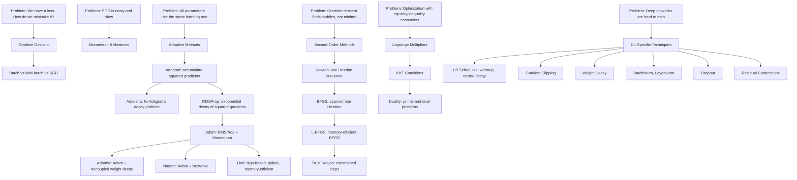

# Part 7: Optimization

> **Prerequisites:** [Part 1 — Linear Algebra](part-01-linear-algebra.md) (gradients, vectors), [Part 2 — Calculus](part-02-calculus.md) (derivatives, gradients, Hessian), [Part 3 — Probability](part-03-probability.md) (expectations for stochastic methods)
> **What you'll learn:** How to find the parameters that minimize a loss function. This is training. Everything here is directly used when you fit any model.
> **Used later in:** Every part from Part 9 onward — training is optimization.

---

## The Narrative Spine



---

## Lesson 7.1: Objective Functions, Loss Functions, and Convexity

### Why Was This Invented?

Training a model means choosing parameters $\theta$ that make the model's outputs close to the true answers. You need a mathematical function that measures "how wrong" the model is — and then find parameters that make it as small as possible.

### The Language of Optimization

**Objective function** $f(\theta)$: Any function you want to minimize. In ML, this is the loss.

**Loss function** $\mathcal{L}(\theta)$: Measures error on one example or a batch.

**Cost function** $J(\theta) = \frac{1}{n}\sum_{i=1}^n \mathcal{L}(f_\theta(x_i), y_i)$: Average loss over all training examples.

**Minimizer:** $\theta^* = \arg\min_\theta J(\theta)$.

### Convex vs Non-Convex Functions

**Convex function:** A bowl shape. Any local minimum is the global minimum. Gradient descent is guaranteed to converge to the global minimum.

$$
f(\lambda x + (1-\lambda)y) \leq \lambda f(x) + (1-\lambda)f(y) \quad \forall x, y, \lambda \in [0,1]
$$

**Strictly convex:** The inequality is strict. Unique global minimum.

**Non-convex function:** Has multiple local minima, saddle points. No convergence guarantee. All deep learning objectives are non-convex.

**Why it matters:** Linear regression loss is convex (guaranteed to find the best solution). Neural network loss is non-convex (optimization can get stuck). Yet in practice, non-convex neural network optimization works remarkably well.

```
Convex (bowl):          Non-convex (valleys and hills):

Loss                    Loss
  |       .              |    .    .
  |      . .             |   . .  . .
  |     .   .            |  .   ..   .
  |    .     .           | .         .
  |___._____._____       |_.__________
         θ*                  θ (multiple local minima)
```

---

## Lesson 7.2: Gradient Descent — The Core Algorithm

### Batch Gradient Descent

Compute the gradient over the entire dataset, then take one step:

$$
\theta_{t+1} = \theta_t - \eta \nabla_\theta J(\theta_t)
$$

where $\eta > 0$ is the **learning rate** (step size).

**Intuition:** The gradient $\nabla J$ points uphill. Subtract it to go downhill.

**Problem:** Computing the gradient over all $n$ examples is expensive when $n$ is millions. Waiting for the full gradient before taking any step is slow.

### Stochastic Gradient Descent (SGD)

Use just one example at a time:

$$
\theta_{t+1} = \theta_t - \eta \nabla_\theta \mathcal{L}(\theta_t; x_i, y_i)
$$

**Advantages:**
- Very fast per update
- Noise actually helps: it escapes shallow local minima and saddle points

**Disadvantages:**
- Noisy updates — erratic path to minimum
- Doesn't leverage GPU parallelism

### Mini-Batch SGD

The sweet spot: use a batch of $B$ examples (typically 32–256):

$$
\theta_{t+1} = \theta_t - \eta \frac{1}{B}\sum_{i \in \mathcal{B}} \nabla_\theta \mathcal{L}(\theta_t; x_i, y_i)
$$

**Advantages:** Reduces noise vs single-example SGD while remaining much faster than batch GD. GPUs are optimized for matrix operations — larger batches fill the GPU more efficiently.

### Learning Rate Selection

The learning rate $\eta$ is the most important hyperparameter:

- **Too large:** Overshoots the minimum, diverges
- **Too small:** Converges very slowly
- **Just right:** Reaches minimum efficiently

```
Too large:              Too small:              Just right:
   ∧  ∧                  _______________          \_____
  / \/ \                / (very slow)              |
 /      \               step step step step         |
/        \/                                        min
```

---

## Lesson 7.3: Momentum Methods

### The Problem with Vanilla SGD

Imagine rolling a ball down a narrow valley. With vanilla gradient descent, the ball bounces from wall to wall (oscillates) rather than rolling smoothly toward the bottom.

Momentum fixes this by giving the ball "memory" — it tends to continue moving in the direction it was already going.

### Momentum

Maintain a velocity vector $\mathbf{v}$:

$$
\mathbf{v}_t = \mu \mathbf{v}_{t-1} - \eta \nabla J(\theta_{t-1})
$$

$$
\theta_t = \theta_{t-1} + \mathbf{v}_t
$$

Typical momentum coefficient: $\mu = 0.9$.

The velocity accumulates: repeated gradients in the same direction grow the effective step size. Oscillating gradients cancel out.

**Intuition:** A ball rolling downhill in snow. The snow (gradient) pushes it forward. The ball builds up speed (momentum). It takes time to stop once it starts.

### Nesterov Accelerated Gradient (NAG)

A "lookahead" improvement: compute the gradient at the *future* position, not the current one:

$$
\mathbf{v}_t = \mu \mathbf{v}_{t-1} - \eta \nabla J(\theta_{t-1} + \mu \mathbf{v}_{t-1})
$$

$$
\theta_t = \theta_{t-1} + \mathbf{v}_t
$$

**Why it's better:** By evaluating the gradient where you're about to be (after applying momentum), you get a more informed gradient that corrects for overshooting. Provably faster convergence on convex problems.

---

## Lesson 7.4: Adaptive Learning Rate Methods

### The Problem

All parameters use the same learning rate $\eta$. But different parameters may have very different gradient scales. A parameter that rarely appears in training (e.g., a rare word's embedding) receives sparse, large gradients — it needs a different learning rate than a common parameter with frequent, small gradients.

### Adagrad

Adagrad adapts the learning rate individually for each parameter by dividing by the square root of the sum of squared gradients:

$$
g_{t,i} = \frac{\partial J}{\partial \theta_i}(\theta_t)
$$

$$
G_{t,ii} = \sum_{\tau=1}^{t} g_{\tau,i}^2 \quad \text{(accumulated squared gradients)}
$$

$$
\theta_{t+1,i} = \theta_{t,i} - \frac{\eta}{\sqrt{G_{t,ii} + \epsilon}} g_{t,i}
$$

**Effect:** Parameters with large historical gradients get a smaller effective learning rate. Parameters with small or infrequent gradients get a larger effective learning rate.

**Problem:** $G_{t,ii}$ only grows. Eventually, all learning rates shrink to zero — training stops.

### Adadelta

Adadelta fixes Adagrad's vanishing learning rate by using an *exponential moving average* instead of the full sum:

$$
E[g^2]_t = \rho E[g^2]_{t-1} + (1-\rho) g_t^2
$$

$$
\theta_{t+1} = \theta_t - \frac{\sqrt{E[\Delta\theta^2]_{t-1} + \epsilon}}{\sqrt{E[g^2]_t + \epsilon}} g_t
$$

The numerator uses the moving average of previous parameter updates (not learning rate $\eta$ directly). This makes the update units consistent and eliminates the need to set a learning rate.

### RMSProp

RMSProp (Hinton, unpublished lecture notes) is similar to Adadelta's denominator without the numerator trick:

$$
E[g^2]_t = \rho E[g^2]_{t-1} + (1-\rho) g_t^2
$$

$$
\theta_{t+1} = \theta_t - \frac{\eta}{\sqrt{E[g^2]_t + \epsilon}} g_t
$$

Typical $\rho = 0.9$. The old accumulated gradient is "forgotten" — recent gradients matter more.

**AI use:** Default optimizer for RNNs in many older frameworks.

### Adam — Adaptive Moment Estimation

Adam combines RMSProp (second moment) with Momentum (first moment). This is the most widely used optimizer in deep learning.

**Maintains two moving averages:**

$$
m_t = \beta_1 m_{t-1} + (1-\beta_1) g_t \quad \text{(first moment: mean of gradients)}
$$

$$
v_t = \beta_2 v_{t-1} + (1-\beta_2) g_t^2 \quad \text{(second moment: mean of squared gradients)}
$$

**Bias correction** (because $m_0 = v_0 = 0$, early estimates are biased toward zero):

$$
\hat{m}_t = \frac{m_t}{1 - \beta_1^t}, \quad \hat{v}_t = \frac{v_t}{1 - \beta_2^t}
$$

**Update rule:**

$$
\theta_{t+1} = \theta_t - \frac{\eta}{\sqrt{\hat{v}_t} + \epsilon} \hat{m}_t
$$

**Default hyperparameters:** $\beta_1 = 0.9$, $\beta_2 = 0.999$, $\epsilon = 10^{-8}$, $\eta = 10^{-3}$.

**Why Adam works so well:**
- The first moment acts like momentum — smooth gradients
- The second moment normalizes step size — different learning rates per parameter
- Bias correction — correct initialization

### AdamW — Adam with Decoupled Weight Decay

**The problem with L2 regularization in Adam:**

In standard SGD, L2 regularization (adding $\lambda\|\theta\|_2^2$ to the loss) is equivalent to weight decay (multiplying $\theta$ by $(1-\lambda\eta)$ each step). But in Adam, because the gradient is normalized by the second moment, L2 regularization does NOT equal weight decay.

**AdamW** separates weight decay from the adaptive gradient mechanism:

$$
\theta_{t+1} = \theta_t - \eta\left(\frac{\hat{m}_t}{\sqrt{\hat{v}_t} + \epsilon} + \lambda \theta_t\right)
$$

The weight decay $\lambda\theta_t$ is applied directly to the parameters, not through the gradient. This is how regularization should work — independently of the adaptive scaling.

**Why it matters:** AdamW is now the default for training transformers. The original Adam-with-L2 produces suboptimal generalization in large models.

### Nadam — Nesterov Adam

Nadam replaces Adam's first-moment gradient with the Nesterov lookahead gradient:

$$
\theta_{t+1} = \theta_t - \frac{\eta}{\sqrt{\hat{v}_t} + \epsilon} \left(\beta_1 \hat{m}_t + \frac{(1-\beta_1)g_t}{1-\beta_1^t}\right)
$$

**When to use:** Tasks where Nesterov momentum helps (typically convex or smooth landscapes).

### Lion — EvoLved Sign Momentum

Lion (Chen et al., 2023) is a recently discovered optimizer that uses only the *sign* of the update:

$$
c_t = \beta_1 m_{t-1} + (1-\beta_1) g_t
$$

$$
\theta_{t+1} = \theta_t - \eta \cdot \text{sign}(c_t)
$$

$$
m_t = \beta_2 m_{t-1} + (1-\beta_2) g_t
$$

**Properties:**
- **Memory efficient:** Only stores one moment (not two like Adam)
- **Uniform update magnitude:** All parameters update by exactly $\pm\eta$ — no per-parameter scaling
- **Discovered by evolutionary neural architecture search**, not human intuition
- Good for vision tasks; competitive with AdamW for language models

### Python Implementation

```python
import torch
import torch.nn as nn

# Building the same model with different optimizers
model = nn.Sequential(nn.Linear(784, 256), nn.ReLU(), nn.Linear(256, 10))

# SGD with momentum
opt_sgd = torch.optim.SGD(model.parameters(), lr=0.01, momentum=0.9)

# Adam (standard)
opt_adam = torch.optim.Adam(model.parameters(), lr=1e-3, betas=(0.9, 0.999))

# AdamW (preferred for transformers)
opt_adamw = torch.optim.AdamW(model.parameters(), lr=1e-3, weight_decay=0.01)

# Manual Adam implementation for clarity
class ManualAdam:
    def __init__(self, params, lr=1e-3, betas=(0.9, 0.999), eps=1e-8):
        self.lr, self.betas, self.eps = lr, betas, eps
        self.params = list(params)
        self.m = [torch.zeros_like(p) for p in self.params]
        self.v = [torch.zeros_like(p) for p in self.params]
        self.t = 0

    def step(self):
        self.t += 1
        b1, b2 = self.betas
        for i, p in enumerate(self.params):
            if p.grad is None:
                continue
            g = p.grad

            # Update first moment (mean)
            self.m[i] = b1 * self.m[i] + (1 - b1) * g
            # Update second moment (variance)
            self.v[i] = b2 * self.v[i] + (1 - b2) * g**2

            # Bias correction
            m_hat = self.m[i] / (1 - b1**self.t)
            v_hat = self.v[i] / (1 - b2**self.t)

            # Update parameter
            p.data -= self.lr * m_hat / (v_hat.sqrt() + self.eps)

    def zero_grad(self):
        for p in self.params:
            if p.grad is not None:
                p.grad.zero_()
```

---

## Lesson 7.5: Second-Order Optimization Methods

### Newton's Method

**Idea:** Instead of following the gradient (first-order information), use the curvature (second-order information) to jump directly to the minimum of a local quadratic approximation.

The second-order Taylor expansion around $\theta$:

$$
J(\theta + \delta) \approx J(\theta) + \nabla J(\theta)^T \delta + \frac{1}{2}\delta^T \mathbf{H}\delta
$$

Minimize over $\delta$ by setting $\nabla_\delta = 0$:

$$
\nabla J(\theta) + \mathbf{H}\delta = 0 \implies \delta = -\mathbf{H}^{-1}\nabla J(\theta)
$$

**Newton update:**

$$
\theta_{t+1} = \theta_t - \mathbf{H}^{-1}\nabla J(\theta_t)
$$

**Advantage:** Quadratic convergence near the minimum — converges much faster than gradient descent for convex problems.

**Problem:** $\mathbf{H}^{-1}$ is $p \times p$ where $p$ is the number of parameters. For a GPT-4-size model ($\sim 10^{12}$ parameters), $\mathbf{H}$ has $10^{24}$ entries. Completely infeasible.

### BFGS (Broyden-Fletcher-Goldfarb-Shanno)

BFGS approximates $\mathbf{H}^{-1}$ iteratively using gradient information, avoiding the need to compute the full Hessian.

**Key idea:** Maintain a running estimate $\mathbf{B}$ of $\mathbf{H}^{-1}$ that is updated at each step using the secant condition:

$$
\mathbf{B}_{t+1} (\theta_{t+1} - \theta_t) = \nabla J(\theta_{t+1}) - \nabla J(\theta_t)
$$

The update satisfies this condition while making the smallest possible change to $\mathbf{B}$.

**AI use:** BFGS is used for smaller-scale ML problems (logistic regression, SVMs) where $p \lesssim 10^4$. Not practical for deep learning.

### L-BFGS (Limited-Memory BFGS)

Instead of storing the full $p \times p$ approximate Hessian, L-BFGS stores only the last $m$ gradient vectors (typically $m = 5\text{--}20$) and uses them to implicitly represent a limited-memory approximation.

**Memory:** $O(mp)$ instead of $O(p^2)$.

**AI use:** Second-order fine-tuning of small models, feature engineering pipelines, hyperparameter optimization.

### Trust Region Methods

**Problem with Newton's method:** The quadratic approximation can be wildly wrong far from $\theta$. Newton can take huge steps that make the loss worse.

**Solution:** Constrain the step to a "trust region" where the quadratic approximation is reliable:

$$
\delta^* = \arg\min_\delta \left[J(\theta) + \nabla J^T\delta + \frac{1}{2}\delta^T\mathbf{H}\delta\right] \quad \text{subject to } \|\delta\|_2 \leq \Delta
$$

The trust region radius $\Delta$ is adjusted based on how well the quadratic approximation matched the actual function decrease.

**AI use:** TRPO (Trust Region Policy Optimization) in reinforcement learning — constrains the policy update to a trust region to prevent catastrophic policy degradation.

---

## Lesson 7.6: Constrained Optimization — Lagrange Multipliers, KKT, and Duality

### Why Was This Invented?

Often we want to minimize a function subject to constraints. "Find the model parameters that minimize the loss, given that the model must satisfy a fairness constraint" or "maximize information compression subject to a given reconstruction quality."

### Lagrange Multipliers

**Problem:** Minimize $f(\mathbf{x})$ subject to equality constraint $g(\mathbf{x}) = 0$.

**Geometric intuition:** At the constrained optimum, the gradient of $f$ and the gradient of $g$ must point in the same direction (be parallel). Otherwise, you could move along the constraint surface to decrease $f$.

$$
\nabla f(\mathbf{x}_{*}) = \lambda \nabla g(\mathbf{x}_{*})
$$

**The Lagrangian:**

$$
\mathcal{L}(\mathbf{x}, \lambda) = f(\mathbf{x}) + \lambda g(\mathbf{x})
$$

Find the stationary points: $\nabla_\mathbf{x} \mathcal{L} = 0$ and $\nabla_\lambda \mathcal{L} = 0$ (which recovers $g(\mathbf{x}) = 0$).

**Numerical example:** Minimize $f(x,y) = x^2 + y^2$ subject to $g(x,y) = x + y - 1 = 0$ (minimize distance to origin on the line $x+y=1$).

Lagrangian: $\mathcal{L} = x^2 + y^2 + \lambda(x + y - 1)$

$\nabla_x \mathcal{L} = 2x + \lambda = 0 \implies x = -\lambda/2$

$\nabla_y \mathcal{L} = 2y + \lambda = 0 \implies y = -\lambda/2$

Constraint: $x + y = 1 \implies -\lambda/2 - \lambda/2 = 1 \implies \lambda = -1$

Solution: $x^* = y^* = 1/2$, $f^* = 1/2$.

### KKT Conditions (Inequality Constraints)

For minimizing $f(\mathbf{x})$ subject to inequality constraints $g_i(\mathbf{x}) \leq 0$ and equality constraints $h_j(\mathbf{x}) = 0$:

**Lagrangian:**

$$
\mathcal{L}(\mathbf{x}, \boldsymbol{\lambda}, \boldsymbol{\mu}) = f(\mathbf{x}) + \sum_i \lambda_i g_i(\mathbf{x}) + \sum_j \mu_j h_j(\mathbf{x})
$$

**KKT conditions** at the optimal $\mathbf{x}^*$:

1. **Stationarity:** $\nabla_\mathbf{x} \mathcal{L} = 0$
2. **Primal feasibility:** $g_i(\mathbf{x}^*) \leq 0$ and $h_j(\mathbf{x}^*) = 0$
3. **Dual feasibility:** $\lambda_i \geq 0$ (for inequality constraints)
4. **Complementary slackness:** $\lambda_i g_i(\mathbf{x}^*) = 0$ for all $i$

The complementary slackness condition says: either the constraint is active ($g_i = 0$) or the multiplier is zero ($\lambda_i = 0$). Inactive constraints don't influence the solution.

**AI use:** SVM training is a constrained optimization (maximize margin subject to classification constraints). TRPO uses KKT conditions. Constrained fine-tuning (satisfy safety constraints while maximizing helpfulness).

### Duality

The **Lagrange dual function:**

$$
d(\boldsymbol{\lambda}, \boldsymbol{\mu}) = \inf_\mathbf{x} \mathcal{L}(\mathbf{x}, \boldsymbol{\lambda}, \boldsymbol{\mu})
$$

The **dual problem:**

$$
\max_{\boldsymbol{\lambda} \geq 0, \boldsymbol{\mu}} d(\boldsymbol{\lambda}, \boldsymbol{\mu})
$$

**Weak duality:** $d^* \leq p^*$ always (dual optimal $\leq$ primal optimal).

**Strong duality:** $d^* = p^*$ under Slater's condition (for convex problems with strictly feasible points).

**Why duality matters for AI:** The SVM dual is often easier to solve than the primal. Duality also reveals the structure of the problem (complementary slackness = which training points are support vectors).

---

## Lesson 7.7: Deep Learning Optimization Techniques

### Learning Rate Schedules

A fixed learning rate is suboptimal. Early in training, you want large steps to explore. As training progresses, you want smaller steps to converge precisely.

**Warmup:** Start with a small learning rate and ramp it up over the first few thousand steps. This prevents large gradient updates before the weights are in a reasonable range.

$$
\eta_t = \eta_{\max} \cdot \frac{t}{T_{\text{warmup}}} \quad \text{for } t \leq T_{\text{warmup}}
$$

**Cosine annealing:**

$$
\eta_t = \eta_{\min} + \frac{1}{2}(\eta_{\max} - \eta_{\min})\left(1 + \cos\left(\frac{t}{T}\pi\right)\right)
$$

Smoothly decays from $\eta_{\max}$ to $\eta_{\min}$ following a cosine curve.

**Warmup + cosine decay** (standard for transformer training):

```
η
|     ___
|    /   \___
|   /        \___
|  /              \___
| /                    ____
|/warmup     cosine decay     terminal
+-----------------------------------> t
0   T_warm                    T_total
```

**Step decay:** Reduce learning rate by a fixed factor (e.g., 0.1×) every $k$ epochs. Common in computer vision.

### Gradient Clipping

**Problem:** Exploding gradients — the gradient norm becomes very large, causing catastrophic parameter updates.

**Solution:** If $\|\mathbf{g}\|_2 > \tau$, scale the gradient down:

$$
\mathbf{g}_{\text{clipped}} = \frac{\tau}{\|\mathbf{g}\|_2} \mathbf{g}
$$

This preserves the gradient direction while bounding its magnitude.

**Standard clip values:** $\tau = 1.0$ or $\tau = 5.0$ for transformers.

### Weight Decay and L2 Regularization

**L2 regularization** adds a penalty to the loss: $J(\theta) + \frac{\lambda}{2}\|\theta\|_2^2$.

**Weight decay** directly shrinks weights each step: $\theta \leftarrow (1 - \lambda\eta)\theta - \eta\nabla J$.

For SGD: L2 regularization and weight decay are equivalent.
For Adam: they differ. **Use AdamW** (weight decay, not L2 penalty) for transformers.

### Dropout

**What it does:** At each training step, randomly set each activation to zero with probability $p$ (dropout rate).

**Why it works:**
- Forces the network not to rely on any single feature
- Each training step, the network is a different random subnetwork
- Approximates an ensemble of $2^n$ networks (one for each subset of $n$ units)
- At test time: disable dropout, scale outputs by $(1-p)$ (or scale during training: inverted dropout)

**Where NOT to use dropout:**
- BatchNorm and LayerNorm interact poorly with dropout — use one or the other
- The last transformer attention layer often works better without dropout

### Batch Normalization

**Problem:** Internal covariate shift — the distribution of activations changes as parameters change, making training unstable.

**Solution:** Normalize each mini-batch:

$$
\hat{x}_i = \frac{x_i - \mu_B}{\sqrt{\sigma_B^2 + \epsilon}}, \quad y_i = \gamma \hat{x}_i + \beta
$$

where $\mu_B = \frac{1}{B}\sum x_i$ and $\sigma_B^2 = \frac{1}{B}\sum(x_i - \mu_B)^2$ are the batch statistics, and $\gamma, \beta$ are learned parameters.

**Benefits:** Allows higher learning rates, reduces sensitivity to weight initialization, provides some regularization effect.

**Drawback:** Performance degrades for very small batch sizes; doesn't work for online learning (batch size 1). Also does not work as well for recurrent networks (varying sequence lengths mean varying statistics).

### Layer Normalization

**What it does:** Normalize across the feature dimension, not the batch dimension:

$$
\hat{x}_i = \frac{x_i - \mu}{\sqrt{\sigma^2 + \epsilon}}, \quad \mu = \frac{1}{d}\sum_{j=1}^d x_j, \quad \sigma^2 = \frac{1}{d}\sum_{j=1}^d (x_j - \mu)^2
$$

**Where it's used:** Transformers (each position normalized independently — doesn't require a batch).

**Why transformers use LayerNorm instead of BatchNorm:**
- Sequence lengths vary — batch statistics would be inconsistent
- Inference can be done on a single example
- Layer statistics are independent of batch size

### Residual Connections

**What they do:** Add the input directly to the output of a block:

$$
\mathbf{h}_{\ell+1} = f_\ell(\mathbf{h}_\ell) + \mathbf{h}_\ell
$$

**Why they matter (gradient flow):**

$$
\frac{\partial \mathcal{L}}{\partial \mathbf{h}_\ell} = \frac{\partial \mathcal{L}}{\partial \mathbf{h}_{\ell+1}} \cdot \frac{\partial \mathbf{h}_{\ell+1}}{\partial \mathbf{h}_\ell} = \frac{\partial \mathcal{L}}{\partial \mathbf{h}_{\ell+1}} \cdot \left(\frac{\partial f_\ell}{\partial \mathbf{h}_\ell} + \mathbf{I}\right)
$$

The identity matrix $\mathbf{I}$ ensures that gradients can flow backward unchanged — the highway through the network for gradients. This is why ResNets (and transformers) can be trained with hundreds of layers without vanishing gradients.

### Python Implementation

```python
import torch
import torch.nn as nn

# Learning rate schedule: warmup + cosine decay
def lr_lambda(step, warmup_steps=1000, total_steps=100000):
    if step < warmup_steps:
        return step / warmup_steps  # linear warmup
    progress = (step - warmup_steps) / (total_steps - warmup_steps)
    return 0.5 * (1 + torch.cos(torch.tensor(progress * 3.14159)))

model = nn.Linear(128, 128)
optimizer = torch.optim.AdamW(model.parameters(), lr=1e-3, weight_decay=0.01)
scheduler = torch.optim.lr_scheduler.LambdaLR(optimizer, lr_lambda=lambda s: lr_lambda(s).item())

# Gradient clipping example
x = torch.randn(32, 128)
y = torch.randn(32, 128)
loss = ((model(x) - y)**2).mean()
loss.backward()

# Clip gradients before optimizer step
total_norm = torch.nn.utils.clip_grad_norm_(model.parameters(), max_norm=1.0)
print(f"Gradient norm before clipping: {total_norm:.4f}")
optimizer.step()
scheduler.step()
optimizer.zero_grad()

# LayerNorm vs BatchNorm
layernorm = nn.LayerNorm(128)    # normalizes along feature dim
batchnorm = nn.BatchNorm1d(128)  # normalizes along batch dim

x = torch.randn(32, 128)
print(f"LayerNorm output std: {layernorm(x).std():.4f}")   # ~1.0
print(f"BatchNorm output std: {batchnorm(x).std():.4f}")   # ~1.0
```

---

## Part 7 Summary

### Key Takeaways

1. **Gradient descent** is the core algorithm: take steps in the negative gradient direction. Step size (learning rate) is the most critical hyperparameter.
2. **Mini-batch SGD** is the standard — small batches are noisy (which helps escape saddles) and leverage GPU parallelism.
3. **Momentum** dampens oscillation and accelerates convergence. Nesterov is the theoretically better variant.
4. **Adaptive methods** (Adagrad → RMSProp → Adam → AdamW) give each parameter its own effective learning rate. AdamW is the default for transformers.
5. **Lion** is a newer sign-based optimizer that is memory-efficient and competitive with AdamW.
6. **Second-order methods** (Newton, L-BFGS) are faster for small models but infeasible for large neural networks.
7. **KKT conditions** extend Lagrange multipliers to inequality constraints. They appear in SVMs and constrained RL.
8. **Warmup + cosine decay** is the standard LR schedule for transformers.
9. **Residual connections + LayerNorm + gradient clipping** are the three key techniques that make deep transformer training stable.

### Optimizer Cheat Sheet

| Optimizer | Update Rule | Key Hyperparams | Best For |
|-----------|------------|-----------------|---------|
| SGD | $\theta -= \eta g$ | $\eta$ | Convex, simple |
| SGD+Momentum | $v = \mu v - \eta g$; $\theta += v$ | $\eta, \mu$ | CNNs, when tuned |
| RMSProp | $\theta -= \eta g/\sqrt{E[g^2]+\epsilon}$ | $\eta, \rho$ | RNNs |
| Adam | $\theta -= \eta \hat{m}/(\sqrt{\hat{v}}+\epsilon)$ | $\eta, \beta_1, \beta_2$ | General purpose |
| AdamW | Adam + decoupled weight decay | $\eta, \beta_1, \beta_2, \lambda$ | Transformers (default) |
| Lion | $\theta -= \eta \cdot \text{sign}(\beta_1 m + (1-\beta_1) g)$ | $\eta, \beta_1, \beta_2$ | Memory-constrained |
| L-BFGS | Newton step via limited-memory Hessian | $m$ (memory) | Small models |

### Flash Cards

**Q:** What is the difference between L2 regularization and weight decay?
**A:** For SGD, they are equivalent. For Adam, they are NOT equivalent. L2 adds $\lambda\theta$ to the gradient (which then gets normalized by Adam's second moment). Weight decay (AdamW) applies $\lambda\theta$ directly to the parameter update, independently of the gradient normalization.

**Q:** What does gradient clipping do and why is it needed?
**A:** If $\|\nabla\|_2 > \tau$, scale the gradient to have norm $\tau$. Needed for RNNs and transformers where exploding gradients are common due to long backpropagation chains.

**Q:** Why does BatchNorm work poorly for transformers but LayerNorm works well?
**A:** BatchNorm normalizes across the batch (needs large batches; different statistics for different sequence lengths). LayerNorm normalizes across features at each position — independent of batch size, works for sequences of any length.

**Q:** What is the Adam bias correction and why is it needed?
**A:** Adam initializes $m_0 = v_0 = 0$, causing early estimates to be biased toward zero. Bias correction divides by $(1-\beta^t)$ to correct this bias — important especially in the early steps.

**Q:** State the KKT complementary slackness condition.
**A:** $\lambda_i g_i(\mathbf{x}^*) = 0$ for all $i$. Either the constraint is inactive ($g_i < 0$, meaning $\lambda_i = 0$) or it is active ($g_i = 0$, meaning $\lambda_i$ may be nonzero).

### Common Mistakes

**Mistake:** Using Adam with L2 regularization in PyTorch's `weight_decay` parameter, thinking this is proper weight decay.
**Fix:** PyTorch's Adam with `weight_decay` adds L2 to the gradient, not true weight decay. Use `AdamW` for proper decoupled weight decay.

---

**Mistake:** Using a constant learning rate for transformer training.
**Fix:** Use warmup (to stabilize early training) followed by decay (to converge precisely). LinearWarmupCosineDecay is the standard.

---

**Mistake:** Applying dropout inside a residual block after the skip connection.
**Fix:** Apply dropout before the residual addition (inside the block). The residual path should be clean for gradient flow.

---

*Next: [Part 8 — Model Evaluation Metrics](part-08-model-evaluation-metrics.md)*
