# Part 8: Model Evaluation Metrics

> **Prerequisites:** [Part 3 — Probability](part-03-probability.md), [Part 4 — Statistics](part-04-statistics.md)
> **What you'll learn:** The right metric for every problem. Choosing the wrong metric is one of the most common and costly errors in AI engineering.
> **Used later in:** Every modeling part — you cannot evaluate a model without understanding metrics.

---

## The Narrative Spine

The right metric depends on the problem. Always ask: "What am I actually trying to optimize for?"

```mermaid
flowchart TD
    P["What kind of task?"] --> C["Classification"]
    P --> R["Regression"]
    P --> F["Forecasting/Time-Series"]
    P --> RK["Ranking/Recommendation"]
    P --> LM["Language Model / LLM"]
    P --> RAG["RAG System"]
    C --> CM["Confusion Matrix: TP, FP, TN, FN"]
    CM --> ACC["Accuracy (balanced data)"]
    CM --> PRF["Precision, Recall, F1 (imbalanced)"]
    CM --> ROC["ROC-AUC (ranking ability)"]
    CM --> PR["PR-AUC (imbalanced data)"]
    CM --> MCC["MCC, Cohen Kappa (agreement)"]
    CM --> Brier["Brier Score (calibration)"]
    R --> MAE["MAE (robust, interpretable)"]
    R --> MSE["MSE/RMSE (penalizes large errors)"]
    R --> R2["R² (explained variance)"]
    R --> Huber["Huber (robust to outliers)"]
    F --> MAPE["MAPE/SMAPE (percentage errors)"]
    F --> MASE["MASE (relative to naive baseline)"]
    F --> Pinball["Pinball/Quantile Loss (uncertainty)"]
    F --> CRPS["CRPS (probabilistic forecast)"]
    RK --> NDCG["NDCG (graded relevance)"]
    RK --> MRR["MRR (first relevant result)"]
    RK --> MAP["MAP (average precision at all ranks)"]
    LM --> PPL["Perplexity (token prediction)"]
    LM --> BLEU["BLEU (machine translation)"]
    LM --> ROUGE["ROUGE (summarization)"]
    LM --> BERTScore["BERTScore (semantic similarity)"]
    RAG --> Faithful["Faithfulness, Groundedness"]
    RAG --> CTX["Context Precision/Recall"]
```



---

## Lesson 8.1: The Confusion Matrix — Foundation of All Classification Metrics

### Why Was This Invented?

A single number like "accuracy" hides everything interesting. The confusion matrix shows all four types of outcomes explicitly, letting you see exactly where your model fails.

### Explain Like I Am 10 Years Old

You're a doctor screening for a disease.

- **True Positive (TP):** Patient has the disease and you said "yes." ✓
- **False Positive (FP):** Patient is healthy but you said "yes." ✗ (unnecessary worry/treatment)
- **True Negative (TN):** Patient is healthy and you said "no." ✓
- **False Negative (FN):** Patient has the disease but you said "no." ✗ (dangerous miss)

The confusion matrix shows all four.

### Formal Definition

For binary classification with positive/negative labels:

|  | Predicted Positive | Predicted Negative |
|--|-------------------|--------------------|
| **Actual Positive** | TP | FN |
| **Actual Negative** | FP | TN |

Total: $N = TP + TN + FP + FN$.

---

## Lesson 8.2: Classification Metrics

### Accuracy

$$
\text{Accuracy} = \frac{TP + TN}{TP + TN + FP + FN}
$$

**When to use:** Class-balanced datasets.
**When NOT to use:** Imbalanced classes. If 99% of emails are not spam, predicting "not spam" always gives 99% accuracy — and catches zero spam.

### Precision and Recall

$$
\text{Precision} = \frac{TP}{TP + FP} \quad \text{(of predictions "positive", how many are right?)}
$$

$$
\text{Recall (Sensitivity)} = \frac{TP}{TP + FN} \quad \text{(of actual positives, how many did we find?)}
$$

**The fundamental tradeoff:** Lowering the classification threshold increases recall (catch more positives) but decreases precision (more false alarms).

| Application | Prefer | Reason |
|-------------|--------|--------|
| Cancer detection | High Recall | Missing a cancer is life-threatening |
| Spam filter | High Precision | Losing a legitimate email is costly |
| Fraud detection | Balance | Both costs matter |

**Specificity** = True Negative Rate:

$$
\text{Specificity} = \frac{TN}{TN + FP} = 1 - \text{FPR}
$$

"Of all healthy patients, how many did we correctly identify as healthy?"

### F1, F-Beta Scores

**F1 score** (harmonic mean of precision and recall):

$$
F_1 = \frac{2 \cdot \text{Precision} \cdot \text{Recall}}{\text{Precision} + \text{Recall}} = \frac{2TP}{2TP + FP + FN}
$$

**Why harmonic mean, not arithmetic?** The harmonic mean penalizes large imbalances. If Precision = 1.0 and Recall = 0.0, arithmetic mean = 0.5 (looks OK), harmonic mean = 0 (correctly indicates failure).

**F-beta score** (generalization with weight $\beta$):

$$
F_\beta = (1 + \beta^2) \cdot \frac{\text{Precision} \cdot \text{Recall}}{\beta^2 \cdot \text{Precision} + \text{Recall}}
$$

- $\beta = 1$: F1 (equal weight)
- $\beta = 2$: F2 (recall twice as important)
- $\beta = 0.5$: F0.5 (precision twice as important)

### ROC Curve and AUC

**ROC curve:** Plots True Positive Rate (Recall) on y-axis vs False Positive Rate ($1 -$ Specificity) on x-axis, as the classification threshold varies from 0 to 1.

**AUC (Area Under ROC Curve):** The probability that a randomly chosen positive example ranks higher than a randomly chosen negative example.

$$
\text{AUC} = P(\hat{y}_{\text{pos}} > \hat{y}_{\text{neg}}) = \frac{\sum_{i \in \text{pos}, j \in \text{neg}} \mathbf{1}[\hat{y}_i > \hat{y}_j]}{n_+ \cdot n_-}
$$

**Interpretation:**
- AUC = 1.0: Perfect classifier (separates all positives from negatives)
- AUC = 0.5: Random classifier (diagonal ROC curve)
- AUC = 0.0: Perfect classifier with inverted labels (worse than random)

**Numerical example:** True labels $= [1, 1, 0, 0]$, scores $= [0.9, 0.8, 0.4, 0.2]$.

Positive pair $(0.9, 0.4)$: $0.9 > 0.4$ ✓. Positive pair $(0.9, 0.2)$: $0.9 > 0.2$ ✓. Positive pair $(0.8, 0.4)$: $0.8 > 0.4$ ✓. Positive pair $(0.8, 0.2)$: $0.8 > 0.2$ ✓.

AUC = 4/4 = 1.0. Perfect.

### PR-AUC vs ROC-AUC

| Metric | Sensitive to class imbalance? | When to prefer |
|--------|------------------------------|----------------|
| ROC-AUC | Less sensitive | Balanced classes, ranking ability matters |
| PR-AUC | More sensitive | Highly imbalanced classes (fraud, rare disease) |

**Why PR-AUC is better for imbalanced:** ROC-AUC uses TN in FPR. When there are many true negatives (imbalanced), FPR stays low even for bad models — ROC-AUC looks high. PR-AUC ignores TN entirely.

### Balanced Accuracy

For imbalanced classes:

$$
\text{Balanced Accuracy} = \frac{1}{2}\left(\frac{TP}{TP + FN} + \frac{TN}{TN + FP}\right) = \frac{\text{Sensitivity} + \text{Specificity}}{2}
$$

Equal weight to positive and negative class performance.

### Matthews Correlation Coefficient (MCC)

$$
\text{MCC} = \frac{TP \cdot TN - FP \cdot FN}{\sqrt{(TP+FP)(TP+FN)(TN+FP)(TN+FN)}}
$$

- $\text{MCC} = 1$: Perfect predictions
- $\text{MCC} = 0$: No better than random
- $\text{MCC} = -1$: Perfect inverse predictions

**Why MCC is considered the best single classification metric:**
- Symmetric: considers all four cells of the confusion matrix
- Works for imbalanced classes
- Only returns high values when the classifier performs well on all four categories simultaneously

### Cohen's Kappa

Measures agreement between two raters/classifiers, accounting for chance agreement:

$$
\kappa = \frac{p_o - p_e}{1 - p_e}
$$

where $p_o$ = observed accuracy and $p_e$ = expected accuracy by chance.

- $\kappa = 1$: Perfect agreement
- $\kappa = 0$: Agreement no better than chance
- $\kappa < 0$: Worse than chance

**Interpretation guide:** $\kappa < 0.2$ = slight, $0.2\text{--}0.4$ = fair, $0.4\text{--}0.6$ = moderate, $0.6\text{--}0.8$ = substantial, $> 0.8$ = near perfect.

### Log Loss (Binary Cross-Entropy)

$$
\text{Log Loss} = -\frac{1}{n}\sum_{i=1}^n [y_i \log(\hat{p}_i) + (1-y_i)\log(1-\hat{p}_i)]
$$

**Why it penalizes confident wrong predictions severely:**

If $y = 1$ and $\hat{p} = 0.01$: $\log(0.01) = -4.6$ nats (huge penalty).
If $y = 1$ and $\hat{p} = 0.99$: $\log(0.99) = -0.01$ nats (tiny penalty).

**This is why neural networks can have high accuracy but high log loss** — a model that predicts 51% on every example gets 100% accuracy (threshold 0.5) but high log loss.

### Brier Score

$$
\text{Brier} = \frac{1}{n}\sum_{i=1}^n (\hat{p}_i - y_i)^2
$$

MSE of predicted probabilities. Measures **calibration** — does a predicted probability of 70% actually happen 70% of the time?

- Brier = 0: Perfect calibration and discrimination
- Brier = 0.25: No skill (always predict 50%)

### Python Implementation

```python
import numpy as np
from sklearn.metrics import (accuracy_score, precision_score, recall_score,
    f1_score, roc_auc_score, average_precision_score, matthews_corrcoef,
    cohen_kappa_score, log_loss, brier_score_loss, balanced_accuracy_score)

y_true  = np.array([1, 1, 1, 1, 0, 0, 0, 0, 0, 0])
y_pred  = np.array([1, 1, 0, 0, 0, 0, 0, 0, 1, 1])  # binary predictions
y_score = np.array([0.9, 0.8, 0.4, 0.3, 0.1, 0.2, 0.15, 0.05, 0.7, 0.6])

print(f"Accuracy:          {accuracy_score(y_true, y_pred):.4f}")
print(f"Precision:         {precision_score(y_true, y_pred):.4f}")
print(f"Recall:            {recall_score(y_true, y_pred):.4f}")
print(f"F1:                {f1_score(y_true, y_pred):.4f}")
print(f"Balanced Accuracy: {balanced_accuracy_score(y_true, y_pred):.4f}")
print(f"MCC:               {matthews_corrcoef(y_true, y_pred):.4f}")
print(f"Cohen Kappa:       {cohen_kappa_score(y_true, y_pred):.4f}")
print(f"ROC-AUC:           {roc_auc_score(y_true, y_score):.4f}")
print(f"PR-AUC:            {average_precision_score(y_true, y_score):.4f}")
print(f"Log Loss:          {log_loss(y_true, y_score):.4f}")
print(f"Brier Score:       {brier_score_loss(y_true, y_score):.4f}")
```

---

## Lesson 8.3: Regression Metrics

### MAE (Mean Absolute Error)

$$
\text{MAE} = \frac{1}{n}\sum_{i=1}^n |y_i - \hat{y}_i|
$$

**Interpretation:** Average absolute prediction error, in the same units as $y$.

**Properties:**
- Robust to outliers (absolute error, not squared)
- Constant gradient regardless of error magnitude (good for training)
- Directly interpretable: "Off by X units on average"

### MSE and RMSE

$$
\text{MSE} = \frac{1}{n}\sum_{i=1}^n (y_i - \hat{y}_i)^2
$$

$$
\text{RMSE} = \sqrt{\text{MSE}}
$$

**Properties:**
- Penalizes large errors more than MAE (squared)
- RMSE is in same units as $y$ (useful for interpretation)
- Differentiable everywhere (unlike MAE at zero)
- Sensitive to outliers

**When to use RMSE over MAE:** When large errors are disproportionately costly (e.g., predicting stock crashes, energy demand peaks).

### RMSLE (Root Mean Squared Log Error)

$$
\text{RMSLE} = \sqrt{\frac{1}{n}\sum_{i=1}^n (\log(1 + \hat{y}_i) - \log(1 + y_i))^2}
$$

**Why the log?** Penalizes relative errors equally across different scales. Being off by 10 on a $100 target is penalized the same as being off by 1000 on a $10,000 target.

**When to use:** When the target spans multiple orders of magnitude (e.g., house prices, population counts, sales revenue).

### MAPE and SMAPE

**MAPE (Mean Absolute Percentage Error):**

$$
\text{MAPE} = \frac{1}{n}\sum_{i=1}^n \left|\frac{y_i - \hat{y}_i}{y_i}\right| \times 100\%
$$

**Limitation:** Undefined when $y_i = 0$; asymmetric (over-predicting and under-predicting by the same amount have different errors).

**SMAPE (Symmetric MAPE):**

$$
\text{SMAPE} = \frac{1}{n}\sum_{i=1}^n \frac{|y_i - \hat{y}_i|}{(|y_i| + |\hat{y}_i|)/2} \times 100\%
$$

Symmetric — treats over- and under-predictions equally. Range: $[0\%, 200\%]$.

### R² (Coefficient of Determination)

$$
R^2 = 1 - \frac{\text{SS}_{\text{res}}}{\text{SS}_{\text{tot}}} = 1 - \frac{\sum_i(y_i - \hat{y}_i)^2}{\sum_i(y_i - \bar{y})^2}
$$

**Interpretation:** The proportion of variance in $y$ explained by the model.

- $R^2 = 1$: Perfect predictions
- $R^2 = 0$: Model predicts the mean (same as baseline)
- $R^2 < 0$: Model is worse than predicting the mean (terrible)

**Adjusted R²** penalizes for additional predictors:

$$
\bar{R}^2 = 1 - (1-R^2)\frac{n-1}{n-k-1}
$$

where $k$ is the number of predictors. This prevents $R^2$ from artificially increasing when you add uninformative features.

### Huber Loss

A compromise between MAE (robust) and MSE (differentiable):

$$
\mathcal{L}_\delta(y, \hat{y}) = \begin{cases} \frac{1}{2}(y - \hat{y})^2 & |y - \hat{y}| \leq \delta \\ \delta(|y - \hat{y}| - \frac{\delta}{2}) & |y - \hat{y}| > \delta \end{cases}
$$

**Properties:**
- Behaves like MSE for small errors (smooth, good gradients)
- Behaves like MAE for large errors (robust to outliers)
- The threshold $\delta$ controls the transition

**AI use:** Robust regression, Q-learning targets in RL (DQN uses Huber loss).

### Quantile Loss (Pinball Loss)

$$
\mathcal{L}_q(y, \hat{y}) = \begin{cases} q(y - \hat{y}) & y \geq \hat{y} \\ (1-q)(\hat{y} - y) & y < \hat{y} \end{cases}
$$

Minimizing the $q$-quantile loss trains the model to predict the $q$-th quantile of the distribution (not just the mean).

**AI use:** Uncertainty estimation. Predicting "90th percentile of delivery time" for logistics. Gradient boosting quantile regression (LightGBM, XGBoost).

### Python Implementation

```python
import numpy as np
from sklearn.metrics import mean_absolute_error, mean_squared_error, r2_score

y_true = np.array([100, 200, 300, 400, 500])
y_pred = np.array([110, 195, 285, 420, 490])

mae  = mean_absolute_error(y_true, y_pred)
mse  = mean_squared_error(y_true, y_pred)
rmse = np.sqrt(mse)
r2   = r2_score(y_true, y_pred)

# RMSLE
rmsle = np.sqrt(np.mean((np.log1p(y_pred) - np.log1p(y_true))**2))

# MAPE
mape = np.mean(np.abs((y_true - y_pred) / y_true)) * 100

# SMAPE
smape = np.mean(np.abs(y_true - y_pred) / ((np.abs(y_true) + np.abs(y_pred)) / 2)) * 100

print(f"MAE:   {mae:.2f}")   # 14.0
print(f"RMSE:  {rmse:.2f}")  # 15.81
print(f"RMSLE: {rmsle:.4f}") # ~0.05
print(f"MAPE:  {mape:.2f}%") # 4.5%
print(f"SMAPE: {smape:.2f}%")
print(f"R²:    {r2:.4f}")    # 0.9937

# Huber loss
def huber_loss(y, y_hat, delta=1.0):
    residual = np.abs(y - y_hat)
    return np.where(residual <= delta,
                    0.5 * residual**2,
                    delta * (residual - 0.5 * delta)).mean()

print(f"Huber (delta=15): {huber_loss(y_true, y_pred, delta=15):.2f}")
```

---

## Lesson 8.4: Forecasting Metrics

These metrics are used specifically for time-series forecasting, where standard regression metrics have limitations.

### WAPE (Weighted Absolute Percentage Error)

$$
\text{WAPE} = \frac{\sum_i |y_i - \hat{y}_i|}{\sum_i y_i}
$$

Unlike MAPE (which is an average of percentages), WAPE is the percentage of total volume misforecast. Handles zero values better because the denominator is the total sum.

### MASE (Mean Absolute Scaled Error)

$$
\text{MASE} = \frac{\text{MAE}}{\text{MAE}_{\text{naive}}} = \frac{\frac{1}{n}\sum_{i=1}^n |y_i - \hat{y}_i|}{\frac{1}{n-1}\sum_{i=2}^n |y_i - y_{i-1}|}
$$

Scales MAE by the MAE of the naive one-step seasonal baseline.

- **MASE < 1**: Your model beats the naive baseline
- **MASE = 1**: Same as naive (no skill)
- **MASE > 1**: Worse than naive

**Why it's superior to MAPE:** No division by zero, works for intermittent demand, comparable across different scales and series.

### Pinball Loss (Quantile Score)

Same as quantile loss from regression, but critical for probabilistic forecasting. When you predict a distribution over future values:

$$
\text{Pinball}_{q}(y, \hat{q}) = \begin{cases} q(y - \hat{q}) & y \geq \hat{q} \\ (1-q)(\hat{q} - y) & y < \hat{q} \end{cases}
$$

Average pinball over multiple quantiles (e.g., $q \in \{0.1, 0.5, 0.9\}$) gives the **Weighted Interval Score (WIS)**.

### CRPS (Continuous Ranked Probability Score)

CRPS generalizes pinball loss to the entire predictive distribution $F$ (CDF of the forecast):

$$
\text{CRPS}(F, y) = \int_{-\infty}^{\infty} (F(t) - \mathbf{1}[t \geq y])^2\, dt
$$

When the forecast is a point prediction $\hat{y}$: $\text{CRPS} = |y - \hat{y}|$ (reduces to MAE).

**Why it matters:** CRPS rewards accurate uncertainty quantification, not just accurate point forecasts. A model that predicts a sharp, accurate distribution beats one that predicts a wide, uncertain distribution.

---

## Lesson 8.5: Ranking Metrics

### The Problem

In search and recommendation, you're not just predicting a binary label — you're ordering a list of items by relevance. The order matters, not just whether each item is relevant.

### MRR (Mean Reciprocal Rank)

For a set of queries, where for each query the correct answer appears at rank $r_i$:

$$
\text{MRR} = \frac{1}{|Q|}\sum_{i=1}^{|Q|} \frac{1}{r_i}
$$

**Intuition:** Rank 1 → 1.0 reward. Rank 2 → 0.5. Rank 3 → 0.33. The faster you find the right answer, the higher the MRR.

**Example:** 3 queries, correct answer at ranks 1, 3, 2: MRR = $\frac{1}{3}(1 + \frac{1}{3} + \frac{1}{2}) = \frac{1}{3}(1.833) = 0.61$.

### MAP (Mean Average Precision)

For each query, compute **Average Precision**: the area under the precision-recall curve.

$$
\text{AP} = \sum_{k=1}^{n} P(k) \cdot \text{rel}(k)
$$

where $P(k)$ is the precision at rank $k$ and $\text{rel}(k) = 1$ if item at rank $k$ is relevant.

Then MAP is the mean over all queries:

$$
\text{MAP} = \frac{1}{|Q|}\sum_{i=1}^{|Q|} \text{AP}_i
$$

**Example:** Query with 3 relevant items. Retrieved in positions 1, 3, 5 (out of 5 retrieved):

- $P(1) = 1/1 = 1.0$, relevant ✓
- $P(2) = 1/2 = 0.5$, not relevant
- $P(3) = 2/3$, relevant ✓
- $P(4) = 2/4 = 0.5$, not relevant
- $P(5) = 3/5 = 0.6$, relevant ✓

$\text{AP} = (1.0 + 2/3 + 0.6) / 3 = 0.756$

### NDCG (Normalized Discounted Cumulative Gain)

MAP treats relevance as binary. NDCG handles **graded relevance** (0 = irrelevant, 1 = somewhat relevant, 2 = very relevant).

**Discounted Cumulative Gain:**

$$
\text{DCG}_k = \sum_{i=1}^{k} \frac{2^{r_i} - 1}{\log_2(i+1)}
$$

where $r_i$ is the relevance score at rank $i$. The $\log_2(i+1)$ discount penalizes relevant items appearing lower in the ranking.

**NDCG:** Normalize by the ideal DCG (IDCG — same items in perfect rank order):

$$
\text{NDCG}_k = \frac{\text{DCG}_k}{\text{IDCG}_k}
$$

**Numerical example:** True relevances = [3, 2, 3, 0, 1, 2], retrieved in order [2, 1, 3, 0, 2, 3].

$\text{DCG}_6 = \frac{2^2-1}{\log_2 2} + \frac{2^1-1}{\log_2 3} + \frac{2^3-1}{\log_2 4} + \frac{2^0-1}{\log_2 5} + \frac{2^2-1}{\log_2 6} + \frac{2^3-1}{\log_2 7}$

$= 3/1 + 1/1.585 + 7/2 + 0 + 3/2.585 + 7/2.807 = 3 + 0.631 + 3.5 + 0 + 1.161 + 2.494 = 10.786$

Ideal order (3,3,2,2,1,0): $\text{IDCG}_6 = 7/1 + 7/1.585 + 3/2 + 3/2.585 + 1/2.807 + 0 = 14.63$

$\text{NDCG}_6 = 10.786/14.63 = 0.737$

### Precision@K, Recall@K, HitRate@K

**Precision@K:** What fraction of the top-K recommended items are relevant?

$$
\text{P@K} = \frac{|\{r \in \text{top-K} : r \text{ is relevant}\}|}{K}
$$

**Recall@K:** What fraction of all relevant items are in the top-K?

$$
\text{R@K} = \frac{|\{r \in \text{top-K} : r \text{ is relevant}\}|}{|\{r : r \text{ is relevant}\}|}
$$

**HitRate@K:** Did at least one relevant item appear in the top-K?

$$
\text{HR@K} = \mathbf{1}[\text{at least one relevant item in top-K}]
$$

Averaged over users: fraction of users for whom at least one relevant item appeared in the top-K recommendations.

```python
import numpy as np
from sklearn.metrics import ndcg_score

# NDCG example
y_true = np.array([[3, 2, 3, 0, 1, 2]])   # true relevance scores
y_score = np.array([[2, 3, 1, 0, 2, 3]])  # model scores (rank by this)

print(f"NDCG@6: {ndcg_score(y_true, y_score, k=6):.4f}")

def precision_at_k(y_true, y_pred, k):
    """y_true: binary relevance, y_pred: scores"""
    top_k = np.argsort(-y_pred)[:k]
    return y_true[top_k].sum() / k

def recall_at_k(y_true, y_pred, k):
    top_k = np.argsort(-y_pred)[:k]
    return y_true[top_k].sum() / y_true.sum()

y_true_bin = np.array([1, 0, 1, 0, 1, 0, 0, 1])
y_scores   = np.array([0.9, 0.8, 0.7, 0.6, 0.5, 0.4, 0.3, 0.2])

print(f"P@3: {precision_at_k(y_true_bin, y_scores, 3):.4f}")
print(f"R@3: {recall_at_k(y_true_bin, y_scores, 3):.4f}")
```

---

## Lesson 8.6: LLM Evaluation Metrics

### BLEU Score

**What it measures:** N-gram overlap between the generated text and reference text(s). Originally designed for machine translation.

$$
\text{BLEU} = \text{BP} \cdot \exp\left(\sum_{n=1}^{N} w_n \log p_n\right)
$$

where:
- $p_n$ = modified precision for $n$-grams (count each n-gram at most as many times as it appears in the reference)
- $w_n$ = weight (uniform: $1/N$)
- $\text{BP}$ = brevity penalty: $\min(1, e^{1 - r/c})$ where $r$ = reference length, $c$ = hypothesis length

**Limitations:**
- Can miss semantically equivalent paraphrases ("automobile" vs "car")
- Single references may miss valid translations
- Biased toward short, high-precision outputs

### ROUGE (Recall-Oriented Understudy for Gisting Evaluation)

Used for summarization. Unlike BLEU (precision-focused), ROUGE measures recall — how much of the reference does the summary cover?

**ROUGE-N:** N-gram recall:

$$
\text{ROUGE-N} = \frac{\sum_{\text{ref}} \sum_{\text{ngram} \in \text{ref}} \text{Count}_{\text{match}}(\text{ngram})}{\sum_{\text{ref}} \sum_{\text{ngram} \in \text{ref}} \text{Count}(\text{ngram})}
$$

**ROUGE-L:** Longest common subsequence (handles reordering).

**ROUGE-1** (unigrams): Word-level overlap. Common for extractive summarization.
**ROUGE-2** (bigrams): Phrase-level overlap. Better for coherent summaries.

### METEOR

**Problem with BLEU:** Doesn't handle synonyms, stemming, or paraphrases.

**METEOR** improves by:
- Matching on stem forms ("running" matches "run")
- Matching on synonyms (WordNet)
- Rewarding contiguous matches

Better correlation with human judgment than BLEU for translation.

### BERTScore

**What it measures:** Semantic similarity using contextual BERT embeddings instead of surface n-gram overlap.

For each token in the hypothesis, find its best matching token in the reference by cosine similarity of BERT embeddings.

$$
\text{P}_{\text{BERT}} = \frac{1}{|H|}\sum_{h_i \in H} \max_{r_j \in R} \mathbf{h}_i^T \mathbf{r}_j
$$

$$
\text{R}_{\text{BERT}} = \frac{1}{|R|}\sum_{r_j \in R} \max_{h_i \in H} \mathbf{h}_i^T \mathbf{r}_j
$$

$$
F1_{\text{BERT}} = 2 \cdot \frac{\text{P}_{\text{BERT}} \cdot \text{R}_{\text{BERT}}}{\text{P}_{\text{BERT}} + \text{R}_{\text{BERT}}}
$$

**Why it's better than BLEU/ROUGE:** Captures semantic equivalence rather than surface form. "The quick brown fox" and "A fast auburn fox" get a high BERTScore despite sharing no exact words.

### LLM-Specific Production Metrics

Beyond NLP overlap metrics, production LLMs require:

| Metric | Definition | How to Measure |
|--------|-----------|----------------|
| **Faithfulness** | Does the response faithfully represent the source? | LLM judge or NLI model |
| **Groundedness** | Are all claims grounded in provided context? | LLM judge |
| **Hallucination Rate** | Fraction of responses containing factual errors | Human eval or LLM-as-judge |
| **Toxicity** | Fraction of harmful/offensive outputs | Classifier (Perspective API, etc.) |
| **Latency (p50, p99)** | Time to first token, total generation time | Infrastructure metrics |
| **Throughput** | Tokens per second | Infrastructure metrics |
| **Win Rate** | Fraction of pairwise comparisons where model A beats model B | Human eval or GPT-4-as-judge |

---

## Lesson 8.7: RAG Evaluation Metrics

### Why RAG Needs Special Metrics

A RAG system has two components: retrieval and generation. Errors can happen in either stage, and they need different metrics.

### Retrieval Metrics

**Context Precision:** What fraction of retrieved chunks are actually relevant?

$$
\text{Context Precision@K} = \frac{|\text{relevant chunks retrieved}|}{K}
$$

**Context Recall:** What fraction of all relevant information was retrieved?

$$
\text{Context Recall} = \frac{|\text{relevant chunks retrieved}|}{|\text{all relevant chunks}|}
$$

### Generation Metrics

**Answer Relevance:** Is the generated answer relevant to the user's question? Measured by asking an LLM: "Given this question, how relevant is this answer?"

**Faithfulness:** Does the answer contain only information that can be supported by the retrieved context? Measured by decomposing the answer into claims and checking each against the context.

**Answer Correctness:** Is the answer factually correct? Requires either ground truth answers or human evaluation.

### RAG-Triad Framework

A complete RAG evaluation consists of three checks:

```
User Question
      |
      v
[Retrieval]
      |
      v
Retrieved Context -----> (1) Context Relevance: Is retrieved context relevant to Q?
      |
      v
[Generation]
      |
      v
Generated Answer  -----> (2) Faithfulness: Does A stick to C?
      |
      v                   (3) Answer Relevance: Does A address Q?
Final Response
```

All three must be high for a reliable RAG system.

```python
# Simplified RAGAS-style evaluation
from sentence_transformers import SentenceTransformer
import numpy as np

model_embed = SentenceTransformer('all-MiniLM-L6-v2')

def answer_relevance(question, answer, n_questions=3):
    """
    Estimate answer relevance by generating questions from the answer
    and measuring how similar they are to the original question.
    (Simplified version of RAGAS)
    """
    # In practice, use an LLM to generate questions from the answer
    # Here we simulate with the original question
    q_emb = model_embed.encode([question])
    a_emb = model_embed.encode([answer])
    cosine = np.dot(q_emb, a_emb.T) / (np.linalg.norm(q_emb) * np.linalg.norm(a_emb))
    return float(cosine)

q = "What is the capital of France?"
a = "Paris is the capital and largest city of France."
print(f"Answer Relevance: {answer_relevance(q, a):.4f}")
```

---

## Part 8 Summary

### Key Takeaways

1. **Accuracy is almost never the right metric** for imbalanced classes. Use F1, PR-AUC, or MCC.
2. **ROC-AUC** measures ranking ability (independent of threshold). **PR-AUC** is better for imbalanced data.
3. **MCC** is the most informative single binary classification metric — it uses all four confusion matrix cells.
4. **Log loss** penalizes confident wrong predictions severely — better for calibration than accuracy.
5. **MSE penalizes large errors quadratically**; MAE is robust to outliers. Use Huber loss for the best of both.
6. **MASE** is the best forecasting metric — scale-free and meaningful.
7. **NDCG** handles graded relevance; **MAP** is best for binary relevance with multiple relevant items; **MRR** for single-answer retrieval.
8. **BERTScore** captures semantic similarity better than BLEU/ROUGE.
9. **For RAG**: evaluate retrieval (context precision/recall) and generation (faithfulness, answer relevance) separately.

### The Metric Selection Guide

| Situation | Recommended Metric |
|-----------|-------------------|
| Balanced binary classification | F1, AUC-ROC |
| Imbalanced binary (rare positives) | PR-AUC, MCC |
| Multi-class balanced | Macro-F1 |
| Multi-class imbalanced | Weighted F1, macro-MCC |
| Calibration quality | Brier Score, Log Loss |
| Regression (standard) | RMSE for large-error penalty, MAE for robustness |
| Regression (varying scales) | RMSLE, MAPE |
| Forecasting (accuracy) | MASE, sMAPE |
| Probabilistic forecasting | CRPS, Pinball Loss |
| Single-answer retrieval | MRR |
| Multi-answer retrieval | MAP, NDCG |
| Recommendation top-K | HR@K, NDCG@K |
| Machine translation | BLEU, chrF |
| Summarization | ROUGE-1/2/L, BERTScore |
| LLM quality | Win Rate, G-Eval, BERTScore |
| RAG system | Faithfulness, Context Recall, Answer Relevance |

### Flash Cards

**Q:** What does AUC-ROC = 0.5 mean?
**A:** The classifier is no better than random guessing — it ranks positives and negatives in random order.

**Q:** When should you prefer PR-AUC over ROC-AUC?
**A:** When classes are highly imbalanced (rare positives). ROC-AUC can look artificially high because of the many true negatives. PR-AUC ignores true negatives.

**Q:** What is the MCC formula and why is it better than accuracy?
**A:** $\text{MCC} = (TP \cdot TN - FP \cdot FN)/\sqrt{(TP+FP)(TP+FN)(TN+FP)(TN+FN)}$. Unlike accuracy, MCC uses all four confusion matrix cells and is unaffected by class imbalance.

**Q:** What is MASE and when is it preferred?
**A:** MASE = MAE / MAE_naive_baseline. Scale-free (can compare across different time series). Values < 1 mean your model beats the naive baseline.

**Q:** What is NDCG and why does it use a logarithmic discount?
**A:** NDCG = DCG / IDCG, measures ranking quality with graded relevance. The logarithmic discount $1/\log_2(i+1)$ models the diminishing attention of users as they scroll further down the list.

### Common Mistakes

**Mistake:** Reporting only accuracy on an imbalanced dataset.
**Example:** 99% negative class → 99% accuracy by predicting all negatives.
**Fix:** Report F1, PR-AUC, or MCC alongside accuracy. Always check class balance first.

---

**Mistake:** Using BLEU for chatbot or instruction-following evaluation.
**Fix:** BLEU penalizes valid paraphrases. Use BERTScore, human evaluation, or LLM-as-judge for open-ended generation.

---

**Mistake:** Evaluating a RAG system only on final answer quality.
**Fix:** Separately evaluate retrieval (context precision, context recall) and generation (faithfulness). An incorrect answer might come from a retrieval failure, not a generation failure — they require different fixes.

---

*Next: [Part 9 — Classical ML Mathematics](part-09-classical-ml.md)* (Phase 2)
