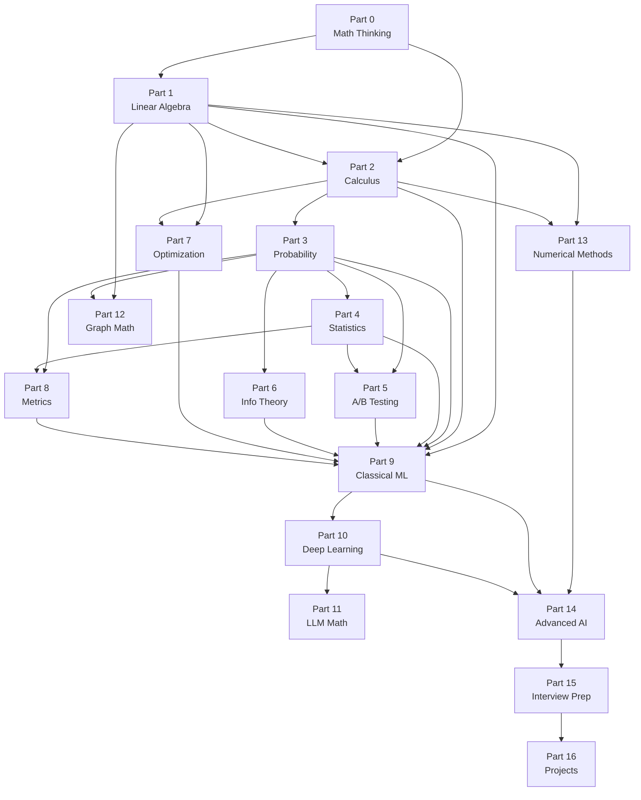

# Part 17: Study Roadmap

> **Prerequisites:** Complete Parts 0–8 before planning Phase 2
> **Status:** Complete

---

## Dependency-Aware Study Paths

Choose the path that matches your goal.

### Path A: ML Engineer (6 months)

**Goal:** Deeply understand every component of a production ML system.

```
Month 1: Part 0 (Mathematical Thinking) + Part 1 (Linear Algebra)
Month 2: Part 2 (Calculus) + Part 7 (Optimization)
Month 3: Part 3 (Probability) + Part 4 (Statistics)
Month 4: Part 5 (A/B Testing) + Part 8 (Metrics)
Month 5: Part 6 (Information Theory) + Part 9 (Classical ML)
Month 6: Part 10 (Deep Learning) + Projects 1–5
```

**Weekly schedule (20 hrs/week):**
- Mon/Wed: New lesson reading + worked examples (4 hrs)
- Tue/Thu: Python code exercises for the lesson (3 hrs)
- Fri: Problem sets and interview Q&A review (3 hrs)
- Weekend: Project work + week review (6 hrs)

---

### Path B: Research Scientist (12 months)

**Goal:** Research-level understanding including theoretical foundations.

Follows Path A, then adds:
```
Month 7-8:  Parts 11–12 (LLM Math, Graph Math)
Month 9-10: Parts 13–14 (Numerical Methods, Advanced AI)
Month 11:   Part 15 (Interview Prep)
Month 12:   Projects 6–12
```

---

### Path C: LLM / Generative AI Specialist (4 months)

**Goal:** Deep understanding of transformer math and LLM systems.

```
Month 1: Parts 0, 1 (Mathematical Thinking, Linear Algebra)
Month 2: Parts 2, 6 (Calculus, Information Theory)
Month 3: Parts 3, 7 (Probability, Optimization)
Month 4: Parts 10, 11 (Deep Learning, LLM Mathematics)
```

Then supplement with: Parts 13 (Numerical Methods for training stability) and 15 (Interview Prep).

---

### Path D: Data Scientist / Analyst (3 months)

**Goal:** Statistical foundations and experimentation.

```
Month 1: Parts 0, 3 (Mathematical Thinking, Probability)
Month 2: Parts 4, 5 (Statistics, A/B Testing)
Month 3: Part 8 (Metrics) + Part 9 (Classical ML basics)
```

Then Part 15 for interview preparation.

---

### Path E: Complete Self-Study (18 months)

**Goal:** Master all 17 parts at a deep level.

```
Months 1-6:   Phase 1 (Parts 0–8), following Path A schedule
Months 7-10:  Phase 2 core (Parts 9–12)
Months 11-12: Phase 2 advanced (Parts 13–14)
Month 13:     Interview Prep (Part 15)
Months 14-16: Projects (Part 16, 2–3 projects per month)
Months 17-18: Read research papers, contribute to open source
```

---

## Dependency Graph



---

## Prerequisites Quick Reference

| To study... | You need... | Can skip... |
|------------|------------|------------|
| Part 1 | Part 0 | — |
| Part 2 | Parts 0, 1 | — |
| Part 3 | Parts 0, 2 | Integration (Part 2.10+) if skipping |
| Part 4 | Part 3 | — |
| Part 5 | Parts 3, 4 | — |
| Part 6 | Part 3 | — |
| Part 7 | Parts 1, 2 | — |
| Part 8 | Parts 3, 4 | — |
| Part 9 | Parts 1–8 | Part 5 (A/B) is optional |
| Part 10 | Parts 1–9 | Parts 5, 8 are optional |
| Part 11 | Parts 1–10 | Parts 5, 8, 12 |
| Part 12 | Parts 1, 3 | Parts 2, 4–11 |
| Part 13 | Parts 1–2 | Parts 3–11 |
| Part 14 | Parts 0–13 | Parts 5, 8, 12 |
| Part 15 | Parts 0–14 | — |
| Part 16 | Depends on project | Pick projects matching your background |

---

## Self-Assessment Checkpoints

Before moving to the next part, you should be able to:

**After Part 1 (Linear Algebra):**
- [ ] Explain what an eigenvector is without using math
- [ ] Derive the SVD and explain its geometric meaning
- [ ] Implement matrix operations from scratch in NumPy
- [ ] Explain how attention uses matrix operations

**After Part 2 (Calculus):**
- [ ] Derive backpropagation from the chain rule
- [ ] Compute gradients of common loss functions
- [ ] Explain why ReLU solves the vanishing gradient problem

**After Part 3 (Probability):**
- [ ] Derive Bayes' theorem from first principles
- [ ] Explain MLE vs MAP with concrete examples
- [ ] Implement a Gaussian distribution from scratch

**After Part 7 (Optimization):**
- [ ] Explain why Adam works better than vanilla SGD on NLP
- [ ] Implement gradient descent, momentum, and Adam
- [ ] Explain the bias-correction in Adam and why it matters

**After Part 9 (Classical ML):**
- [ ] Derive the OLS solution geometrically
- [ ] Explain why Lasso is sparse and Ridge is not
- [ ] Derive the SVM dual from the Lagrangian
- [ ] Explain the bias-variance tradeoff as a mathematical identity

**After Part 10 (Deep Learning):**
- [ ] Implement backpropagation from scratch
- [ ] Explain why LSTM solves vanishing gradients
- [ ] Implement scaled dot-product attention
- [ ] Explain the reparameterization trick

**After Part 11 (LLM Math):**
- [ ] Compute perplexity from log-likelihoods
- [ ] Explain the RLHF objective and why the KL penalty is needed
- [ ] State the Chinchilla scaling law and its implication

---

## Key Textbooks and Papers

### Foundational Textbooks

| Book | Best For |
|------|---------|
| *Mathematics for Machine Learning* (Deisenroth et al.) | Linear algebra + calculus + probability together |
| *Pattern Recognition and Machine Learning* (Bishop) | Bayesian ML, graphical models |
| *The Elements of Statistical Learning* (Hastie et al.) | Classical ML with proofs |
| *Deep Learning* (Goodfellow et al.) | Neural network theory |
| *Information Theory, Inference, and Learning* (MacKay) | Information theory + Bayesian inference |
| *Reinforcement Learning* (Sutton & Barto) | RL mathematics |
| *Causality* (Pearl) | Causal inference do-calculus |

### Essential Papers (Chronological)

**Classical ML:**
- Vapnik (1995): Support Vector Networks
- Breiman (2001): Random Forests
- Friedman (2001): Greedy Function Approximation (GBT)
- Chen & Guestrin (2016): XGBoost

**Deep Learning:**
- LeCun et al. (1998): Gradient-Based Learning
- Hinton et al. (2006): Deep Belief Networks
- Krizhevsky et al. (2012): AlexNet
- Goodfellow et al. (2014): Generative Adversarial Networks
- He et al. (2016): Deep Residual Networks
- Ba et al. (2016): Layer Normalization

**Transformers and LLMs:**
- Vaswani et al. (2017): Attention Is All You Need
- Devlin et al. (2018): BERT
- Radford et al. (2019): Language Models are Unsupervised Multitask Learners (GPT-2)
- Brown et al. (2020): GPT-3
- Hoffmann et al. (2022): Chinchilla
- Ouyang et al. (2022): InstructGPT / RLHF
- Rafailov et al. (2023): DPO

**Optimization:**
- Kingma & Ba (2015): Adam
- Loshchilov & Hutter (2019): AdamW

**Generative Models:**
- Kingma & Welling (2014): VAE
- Ho et al. (2020): DDPM (Diffusion Models)

---

## How to Use Flash Cards

Each part ends with a Summary table. Use these for spaced repetition:

- **Day 1:** Read the lesson
- **Day 2:** Cover the formulas and try to recall them
- **Day 7:** Review the summary table without looking at the lesson
- **Day 30:** Final review — can you explain everything in the summary to a colleague?

If you can't answer a question without looking, re-read the relevant lesson section before the next review.

---

## How to Read a Research Paper

1. **Title + Abstract (5 min):** What problem? What method? What result?
2. **Introduction (10 min):** Why does the problem matter? What are the key contributions?
3. **Figures and Tables (10 min):** Look at the main results first. What are they claiming?
4. **Method (30 min):** What is the math? Can you reproduce the key equations?
5. **Experiments (15 min):** Is the evaluation convincing? What baselines do they compare against?
6. **Related Work (10 min):** How does this fit into the literature?
7. **Implementation (if needed):** Find code, reproduce one result

For survey papers: read Introduction + each section's first and last paragraph to map the field, then dive deep into sections relevant to you.

---

## Signs You Are Making Progress

**Week 1–2:** Formulas look like symbols, not meaning.
**Week 3–4:** You can read formulas and understand what they compute.
**Month 2:** You can derive common formulas from first principles.
**Month 3:** You can explain why an algorithm works, not just what it does.
**Month 6:** You can read a paper's math section without getting stuck.
**Month 12:** You can identify flaws in proofs and limitations in assumptions.
**Month 18+:** You can generate new mathematical intuitions and connect ideas across fields.

---

## Final Advice

**On formulas:** Don't memorize. Derive. If you can derive a formula from first principles, you understand it deeply enough that you'll never forget it.

**On code:** Every mathematical concept in this course has a Python implementation. Write it yourself — don't just read it. The act of writing forces you to understand every step.

**On confusion:** Confusion is not failure. It is the feeling of learning. When you are confused, write down specifically what confuses you. Usually the act of writing it down resolves the confusion.

**On speed:** There is no shortcut to mathematical understanding. You cannot read faster to understand more. You can study more regularly and review more systematically.

**On depth vs breadth:** It is better to understand Part 1 deeply than to skim Parts 1–17. Deep understanding of linear algebra transfers to every other part. Shallow understanding of everything transfers to nothing.

---

*← [Part 16: Projects](part-16-projects.md) | [Back to Course Home →](README.md)*
