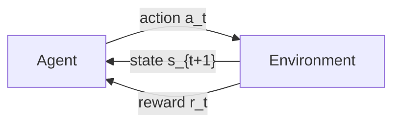
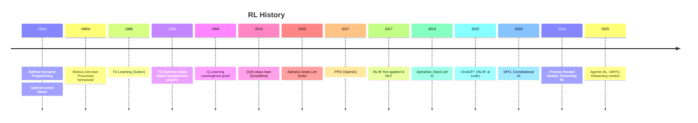
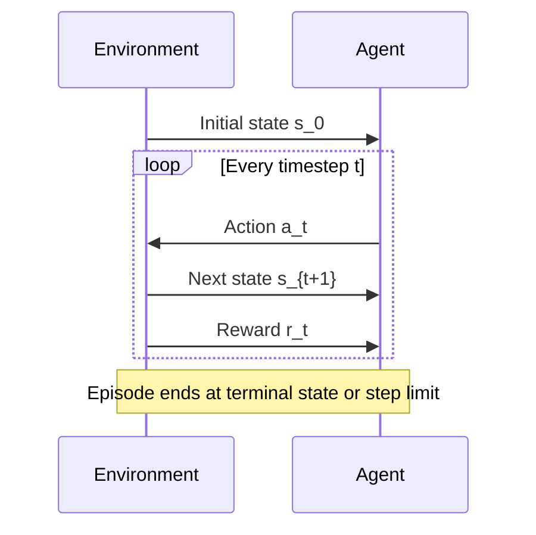
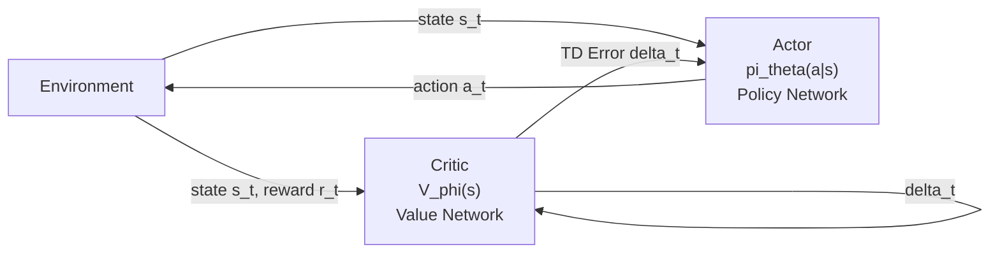
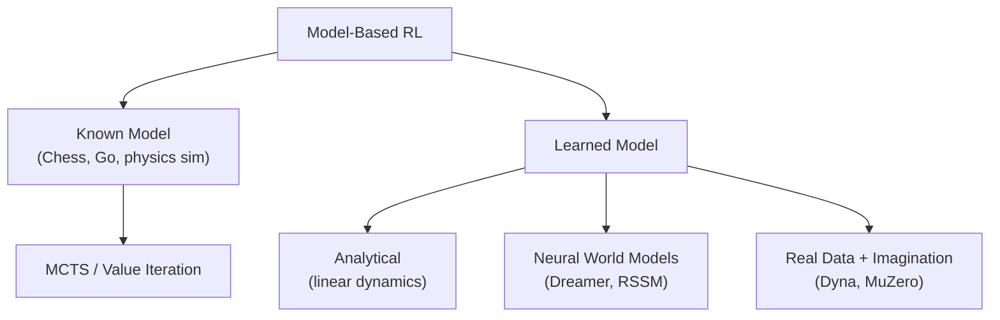
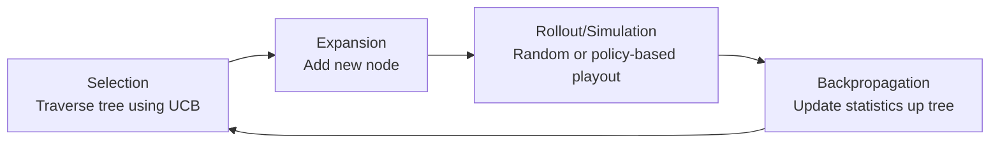
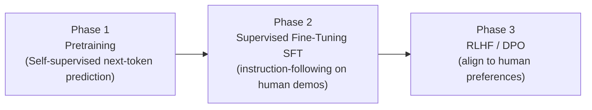
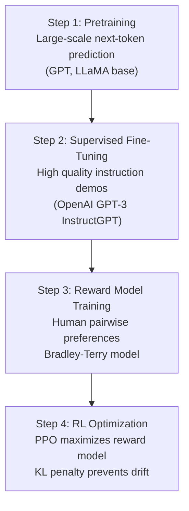
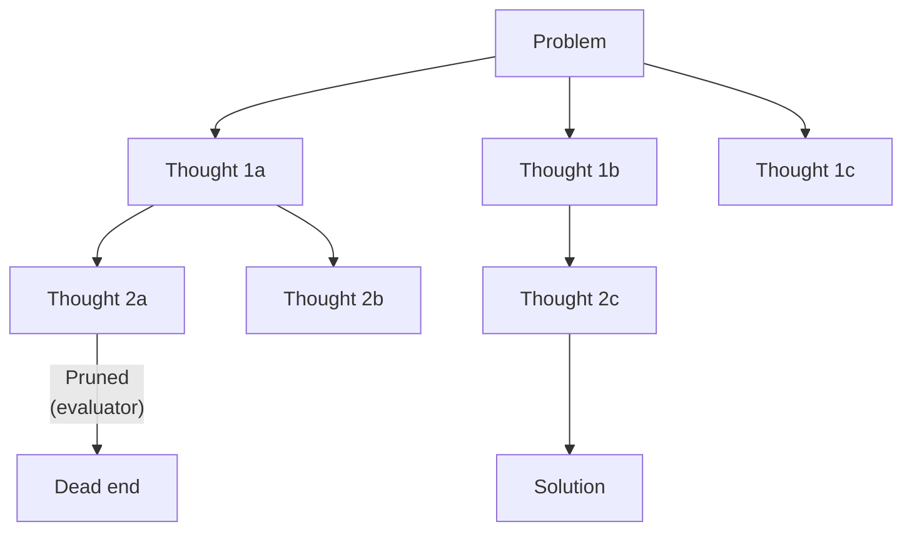

# Reinforcement Learning Handbook — From Foundations to Cutting-Edge Research

> **Audience:** AI Engineers · ML Engineers · Research Engineers · Applied Scientists · Deep Learning Engineers · LLM Engineers · Agent Engineers · RL Engineers · Robotics Engineers · Staff AI Engineers · Research Scientists
> **Goal:** After studying this document you can derive RL equations from scratch, implement algorithms in Python, understand RLHF/DPO/Agentic RL, and read DeepMind/OpenAI/Anthropic papers.
> **Philosophy:** Every concept taught with *What → Why → Mathematical Derivation → Intuition → Code → Interview Questions*

---

## Table of Contents

- [Part 1: Why Reinforcement Learning Exists](#part-1-why-reinforcement-learning-exists)
- [Part 2: Foundations of RL](#part-2-foundations-of-rl)
- [Part 3: Mathematical Foundations](#part-3-mathematical-foundations)
- [Part 4: Markov Decision Process](#part-4-markov-decision-process)
- [Part 5: Dynamic Programming](#part-5-dynamic-programming)
- [Part 6: Monte Carlo Methods](#part-6-monte-carlo-methods)
- [Part 7: Temporal Difference Learning](#part-7-temporal-difference-learning)
- [Part 8: Tabular RL](#part-8-tabular-rl)
- [Part 9: Exploration vs Exploitation](#part-9-exploration-vs-exploitation)
- [Part 10: Function Approximation](#part-10-function-approximation)
- [Part 11: Deep Reinforcement Learning](#part-11-deep-reinforcement-learning)
- [Part 12: Policy Gradient Methods](#part-12-policy-gradient-methods)
- [Part 13: Actor-Critic Methods](#part-13-actor-critic-methods)
- [Part 14: Advanced RL Algorithms](#part-14-advanced-rl-algorithms)
- [Part 15: RL Mathematics Deep Dive](#part-15-rl-mathematics-deep-dive)
- [Part 16: Model-Based RL](#part-16-model-based-rl)
- [Part 17: Multi-Agent Reinforcement Learning](#part-17-multi-agent-reinforcement-learning)
- [Part 18: RL for LLMs](#part-18-rl-for-llms)
- [Part 19: RLHF — Deep Dive](#part-19-rlhf--deep-dive)
- [Part 20: DPO and Modern Alignment](#part-20-dpo-and-modern-alignment)
- [Part 21: Agentic RL](#part-21-agentic-rl)
- [Part 22: RL for Agentic AI](#part-22-rl-for-agentic-ai)
- [Part 23: RL in Production](#part-23-rl-in-production)
- [Part 24: RL Failure Modes](#part-24-rl-failure-modes)
- [Part 25: RL Interview Preparation](#part-25-rl-interview-preparation)
- [Part 26: Learning Roadmap](#part-26-learning-roadmap)

---

# Part 1: Why Reinforcement Learning Exists

## 1.1 What is Reinforcement Learning?

Reinforcement Learning (RL) is a computational framework where an **agent** learns to make decisions by **interacting with an environment** to maximize **cumulative reward**.

Unlike other machine learning paradigms, RL:
- Has no labeled dataset to learn from
- Learns from **consequences** of actions (feedback, not labels)
- Must **explore** to discover good strategies
- Optimizes **long-term** cumulative reward, not immediate outcomes

**The core loop:**



## 1.2 RL vs Other Learning Paradigms

| Paradigm | Data | Signal | Goal | Example |
|---|---|---|---|---|
| **Supervised** | Labeled (x, y) pairs | Label error | Minimize prediction error | Image classification |
| **Unsupervised** | Unlabeled data | Structure in data | Find patterns | Clustering |
| **Self-Supervised** | Unlabeled, proxy labels | Reconstructed input | Learn representations | BERT, GPT pretraining |
| **Reinforcement** | Agent experience | Scalar reward | Maximize cumulative reward | Game playing, robotics |

**Why RL cannot use supervised learning:**
- For Go or Chess: the "correct move" at each position is unknown (only win/loss is observed)
- For robotics: we don't know the exact joint torques needed at each millisecond
- For LLM alignment: humans can compare outputs but rarely specify exact correct text

**When to use RL:**
- Sequential decision making with delayed feedback
- Optimization of long-term objectives
- When the environment can be simulated (fast, safe data collection)
- When human preferences guide learning (RLHF)

**When NOT to use RL:**
- Simple prediction tasks with labeled data (use supervised learning)
- When reward is hard to define
- When environment cannot be simulated (too slow, too dangerous)
- When sample efficiency is critical and no simulator exists

## 1.3 History of Reinforcement Learning



**Key intellectual ancestors:**
- **Dynamic Programming (Bellman, 1957):** Principle of optimality — optimal decisions decompose recursively
- **Control Theory (Pontryagin, 1960s):** Optimal control of dynamical systems
- **Operations Research (1950s):** Resource allocation and sequential decisions
- **Bandit Theory (Thompson, 1933):** Exploration-exploitation tradeoffs
- **Game Theory (von Neumann, 1944):** Rational agents in strategic settings

---

# Part 2: Foundations of RL

## 2.1 The Agent-Environment Interface



## 2.2 Core Components

### State $s_t$

**What:** A representation of the world at time $t$.

**Formal definition:** $s_t \in \mathcal{S}$ where $\mathcal{S}$ is the state space.

**Types:**
- **Fully observable:** Agent sees true state (MDP)
- **Partially observable:** Agent only sees observation $o_t \neq s_t$ (POMDP)

**Examples:**
- Chess: board configuration (fully observable, finite)
- Robotics: joint angles, velocities (continuous)
- LLM alignment: conversation history (partially observable)

### Action $a_t$

**What:** A decision made by the agent at time $t$.

**Formal definition:** $a_t \in \mathcal{A}(s_t)$ where $\mathcal{A}(s_t)$ is the set of legal actions in state $s_t$.

**Types:**
- **Discrete:** $\mathcal{A} = \{$left, right, up, down$\}$ (Atari games)
- **Continuous:** $\mathcal{A} \subseteq \mathbb{R}^n$ (robot joint torques)
- **Mixed:** Some discrete, some continuous

### Reward $r_t$

**What:** A scalar signal indicating how good the action was.

$$r_t = R(s_t, a_t, s_{t+1}) \in \mathbb{R}$$

**Why scalar?** The reward hypothesis: all goals can be described as maximizing expected cumulative reward. This is controversial but empirically powerful.

**Reward shaping:** Adding auxiliary rewards to guide learning without changing the optimal policy.

### Policy $\pi$

**What:** The agent's decision-making strategy — a mapping from states to actions.

**Deterministic policy:**
$$\pi: \mathcal{S} \to \mathcal{A}, \quad a_t = \pi(s_t)$$

**Stochastic policy:**
$$\pi: \mathcal{S} \times \mathcal{A} \to [0,1], \quad a_t \sim \pi(\cdot | s_t)$$

**Why stochastic policies?**
- Necessary in partially observable environments
- Enable exploration naturally
- Required in mixed-strategy Nash equilibria (multi-agent)
- Fundamental to policy gradient methods

### Return $G_t$

**What:** Total cumulative reward from timestep $t$ onward.

$$G_t = r_t + r_{t+1} + r_{t+2} + \cdots = \sum_{k=0}^{\infty} r_{t+k}$$

**Problem:** This can be infinite for continuing tasks.

**Solution:** Discounting.

### Discounted Return

$$G_t = \sum_{k=0}^{\infty} \gamma^k r_{t+k}$$

where $\gamma \in [0, 1)$ is the **discount factor**.

**Why discount?**
1. **Mathematical convergence:** Geometric series $\sum \gamma^k r < \frac{r_{max}}{1-\gamma} < \infty$
2. **Economic intuition:** Future rewards are worth less (uncertain future, time value)
3. **Practical:** Focuses learning on near-term consequences

**Effect of $\gamma$:**

| $\gamma$ | Behavior | Use case |
|---|---|---|
| $\gamma = 0$ | Only immediate reward | Purely greedy |
| $\gamma = 0.9$ | ~10 steps ahead | Short horizon tasks |
| $\gamma = 0.99$ | ~100 steps ahead | Medium horizon |
| $\gamma = 0.999$ | ~1000 steps ahead | Long horizon |
| $\gamma = 1$ | Infinite horizon (care) | Episodic tasks only |

**Recursion:**
$$G_t = r_t + \gamma G_{t+1}$$

This recursion is the foundation of **all Bellman equations**.

### Value Functions

**State-value function:** Expected return from state $s$ following policy $\pi$:

$$V^{\pi}(s) = \mathbb{E}_{\pi}\left[G_t \mid s_t = s\right] = \mathbb{E}_{\pi}\left[\sum_{k=0}^{\infty} \gamma^k r_{t+k} \mid s_t = s\right]$$

**Action-value function (Q-function):** Expected return from state $s$, taking action $a$, then following $\pi$:

$$Q^{\pi}(s, a) = \mathbb{E}_{\pi}\left[G_t \mid s_t = s, a_t = a\right]$$

**Relationship:**
$$V^{\pi}(s) = \sum_{a \in \mathcal{A}} \pi(a|s) \cdot Q^{\pi}(s, a)$$

**Numerical example:**

```
Grid World (4x4), gamma = 0.9, uniform random policy
State (3,3) = goal, reward +1
All other transitions: reward 0

V^pi(start) = 0.9^d where d = expected steps to goal
```

```python
import numpy as np

# Simple GridWorld value function computation
def compute_value_function(grid_size=4, gamma=0.9, n_iter=1000):
    # States: (row, col), goal at (3,3)
    V = np.zeros((grid_size, grid_size))
    goal = (3, 3)

    for _ in range(n_iter):
        V_new = np.zeros_like(V)
        for r in range(grid_size):
            for c in range(grid_size):
                if (r, c) == goal:
                    V_new[r, c] = 1.0
                    continue
                # Uniform random policy: 4 actions
                neighbors = []
                for dr, dc in [(-1,0),(1,0),(0,-1),(0,1)]:
                    nr, nc = max(0, min(grid_size-1, r+dr)), max(0, min(grid_size-1, c+dc))
                    neighbors.append(V[nr, nc])
                V_new[r, c] = gamma * np.mean(neighbors)
        V = V_new

    return V

V = compute_value_function()
print("Value function:\n", np.round(V, 3))
```

---

# Part 3: Mathematical Foundations

## 3.1 Probability Review

### Conditional Probability

$$P(A | B) = \frac{P(A \cap B)}{P(B)}, \quad P(B) > 0$$

**Intuition:** Re-weight the sample space by the event $B$.

### Bayes' Theorem

$$P(A | B) = \frac{P(B | A) \cdot P(A)}{P(B)}$$

**Derivation:**
$$P(A \cap B) = P(A|B) P(B) = P(B|A) P(A)$$
$$\Rightarrow P(A|B) = \frac{P(B|A) P(A)}{P(B)}$$

**RL application:** Bayesian model-based RL uses Bayes to update beliefs about the environment dynamics $P(s'|s,a)$.

### Expectation

$$\mathbb{E}[X] = \sum_x x \cdot P(X=x) \quad \text{(discrete)}$$

$$\mathbb{E}[X] = \int_{-\infty}^{\infty} x \cdot p(x) \, dx \quad \text{(continuous)}$$

**Key properties:**
- **Linearity:** $\mathbb{E}[aX + bY] = a\mathbb{E}[X] + b\mathbb{E}[Y]$
- **Law of Total Expectation:** $\mathbb{E}[X] = \mathbb{E}[\mathbb{E}[X|Y]]$
- **Monte Carlo estimate:** $\mathbb{E}[X] \approx \frac{1}{N}\sum_{i=1}^N x_i$ (samples $x_i \sim P$)

**Why RL uses expectations everywhere:** Returns $G_t$ are random (stochastic policy + stochastic transitions). We optimize $\mathbb{E}[G_t]$.

## 3.2 Markov Chains

### What is a Markov Chain?

A stochastic process $\{S_t\}_{t \geq 0}$ is a **Markov chain** if it satisfies the **Markov property**:

$$P(S_{t+1} = s' | S_t = s_t, S_{t-1} = s_{t-1}, \ldots, S_0 = s_0) = P(S_{t+1} = s' | S_t = s_t)$$

**In words:** The future is independent of the past given the present. The current state contains all relevant history.

**Why this matters for RL:** The Markov property allows us to define a value function $V(s)$ that depends only on the current state, not on how we got there.

### Transition Matrix

For a finite state space $\mathcal{S} = \{1, 2, \ldots, n\}$:

$$P_{ij} = P(S_{t+1} = j | S_t = i)$$

Matrix form: $\mathbf{P} \in \mathbb{R}^{n \times n}$, where $P_{ij} \geq 0$ and $\sum_j P_{ij} = 1$ for all $i$.

**Example — Weather Markov Chain:**
$$\mathbf{P} = \begin{pmatrix} 0.7 & 0.3 \\ 0.4 & 0.6 \end{pmatrix}$$

Row 1: Sunny today → [0.7 Sunny, 0.3 Rainy] tomorrow
Row 2: Rainy today → [0.4 Sunny, 0.6 Rainy] tomorrow

### Stationary Distribution

A distribution $\mu$ is **stationary** if:

$$\mu = \mu \mathbf{P} \quad \Leftrightarrow \quad \mu_j = \sum_i \mu_i P_{ij}$$

**Solution:** Left eigenvector of $\mathbf{P}$ with eigenvalue 1.

**Why it matters for RL:** Under a policy $\pi$, the agent visits states according to a stationary distribution. The expected reward under policy $\pi$ is the dot product of the stationary distribution and per-state rewards.

```python
import numpy as np

# Stationary distribution via power iteration
P = np.array([[0.7, 0.3],
              [0.4, 0.6]])

# Start with uniform distribution
mu = np.array([0.5, 0.5])

# Power iteration
for _ in range(1000):
    mu = mu @ P

print("Stationary distribution:", mu)
# => [0.571, 0.429]

# Verify: mu = mu @ P
print("Verification:", np.allclose(mu, mu @ P))  # True
```

---

# Part 4: Markov Decision Process

## 4.1 MDP Definition

An MDP is a 5-tuple:

$$\mathcal{M} = (\mathcal{S}, \mathcal{A}, P, R, \gamma)$$

| Symbol | Name | Definition |
|---|---|---|
| $\mathcal{S}$ | State space | Set of all possible states |
| $\mathcal{A}$ | Action space | Set of all possible actions |
| $P$ | Transition function | $P(s' \mid s, a)$ = probability of reaching $s'$ from $s$ via $a$ |
| $R$ | Reward function | $R(s, a, s')$ or $R(s, a)$ = immediate reward |
| $\gamma$ | Discount factor | $\gamma \in [0, 1)$ |

**Key property:** Transition function $P(s' | s, a)$ satisfies Markov property — future depends only on current $(s, a)$, not history.

## 4.2 Bellman Expectation Equations

### Derivation from first principles

Starting from the definition of the value function:

$$V^{\pi}(s) = \mathbb{E}_{\pi}\left[G_t \mid s_t = s\right]$$

Expand using the recursive definition $G_t = r_t + \gamma G_{t+1}$:

$$V^{\pi}(s) = \mathbb{E}_{\pi}\left[r_t + \gamma G_{t+1} \mid s_t = s\right]$$

By linearity of expectation:

$$V^{\pi}(s) = \mathbb{E}_{\pi}\left[r_t \mid s_t = s\right] + \gamma \mathbb{E}_{\pi}\left[G_{t+1} \mid s_t = s\right]$$

Expand by marginalizing over actions and next states:

$$\boxed{V^{\pi}(s) = \sum_{a} \pi(a|s) \sum_{s'} P(s'|s,a)\left[R(s,a,s') + \gamma V^{\pi}(s')\right]}$$

This is the **Bellman Expectation Equation** for $V^{\pi}$.

**Similarly for Q-function:**

$$Q^{\pi}(s,a) = \sum_{s'} P(s'|s,a)\left[R(s,a,s') + \gamma \sum_{a'} \pi(a'|s') Q^{\pi}(s',a')\right]$$

$$\boxed{Q^{\pi}(s,a) = \sum_{s'} P(s'|s,a)\left[R(s,a,s') + \gamma V^{\pi}(s')\right]}$$

### Matrix Form of Bellman Equation

For finite state spaces, we can write the Bellman equation as:

$$\mathbf{V}^{\pi} = \mathbf{R}^{\pi} + \gamma \mathbf{P}^{\pi} \mathbf{V}^{\pi}$$

where:
- $\mathbf{V}^{\pi} \in \mathbb{R}^{|\mathcal{S}|}$ is the value vector
- $\mathbf{R}^{\pi} \in \mathbb{R}^{|\mathcal{S}|}$ with $R^{\pi}_s = \sum_a \pi(a|s) \sum_{s'} P(s'|s,a) R(s,a,s')$
- $\mathbf{P}^{\pi} \in \mathbb{R}^{|\mathcal{S}| \times |\mathcal{S}|}$ with $P^{\pi}_{ss'} = \sum_a \pi(a|s) P(s'|s,a)$

**Solving directly:**

$$\mathbf{V}^{\pi} = \mathbf{R}^{\pi} + \gamma \mathbf{P}^{\pi} \mathbf{V}^{\pi}$$
$$(\mathbf{I} - \gamma \mathbf{P}^{\pi}) \mathbf{V}^{\pi} = \mathbf{R}^{\pi}$$
$$\mathbf{V}^{\pi} = (\mathbf{I} - \gamma \mathbf{P}^{\pi})^{-1} \mathbf{R}^{\pi}$$

**Complexity:** $O(|\mathcal{S}|^3)$ for matrix inversion — infeasible for large state spaces. This motivates iterative methods.

## 4.3 Bellman Optimality Equations

The **optimal value function:**

$$V^{*}(s) = \max_{\pi} V^{\pi}(s) = \max_a Q^{*}(s, a)$$

**Derivation:**

$$V^{*}(s) = \max_a \mathbb{E}\left[R(s,a,s') + \gamma V^{*}(s') \mid s_t = s, a_t = a\right]$$

$$\boxed{V^{*}(s) = \max_a \sum_{s'} P(s'|s,a)\left[R(s,a,s') + \gamma V^{*}(s')\right]}$$

**Bellman Optimality Equation for Q:**

$$\boxed{Q^{*}(s,a) = \sum_{s'} P(s'|s,a)\left[R(s,a,s') + \gamma \max_{a'} Q^{*}(s',a')\right]}$$

**Optimal policy:** Given $Q^*$, the optimal policy is simply:

$$\pi^{*}(s) = \arg\max_a Q^{*}(s, a)$$

**Why this is profound:** We don't need to consider all possible policies. We just need $Q^*$.

**Existence and uniqueness:** Under mild conditions ($\gamma < 1$ or episodic tasks), $V^*$ and $Q^*$ exist and are unique. The Bellman optimality operator is a contraction mapping.

## 4.4 Numerical Example: Simple MDP

```python
import numpy as np

# Simple 3-state MDP
# States: S0 (start), S1 (good), S2 (bad/terminal)
# Actions: A0 (safe), A1 (risky)

# Transition: P[s, a, s'] = probability
P = np.zeros((3, 2, 3))
# From S0:
P[0, 0, 1] = 1.0    # safe -> S1
P[0, 1, 1] = 0.5    # risky -> S1 with prob 0.5
P[0, 1, 2] = 0.5    # risky -> S2 with prob 0.5
# From S1:
P[1, 0, 1] = 0.9    # stay in S1
P[1, 0, 2] = 0.1
P[1, 1, 1] = 0.6
P[1, 1, 2] = 0.4
# S2 is terminal
P[2, 0, 2] = 1.0
P[2, 1, 2] = 1.0

# Rewards: R[s, a]
R = np.array([
    [5.0, 10.0],   # From S0
    [2.0,  8.0],   # From S1
    [0.0,  0.0],   # From S2 (terminal)
])

gamma = 0.9

# Value Iteration
Q = np.zeros((3, 2))
for iteration in range(500):
    Q_new = np.zeros_like(Q)
    for s in range(3):
        for a in range(2):
            Q_new[s, a] = sum(
                P[s, a, s_next] * (R[s, a] + gamma * max(Q[s_next, :]))
                for s_next in range(3)
            )
    Q = Q_new

V = Q.max(axis=1)
pi = Q.argmax(axis=1)

print("Optimal Q-values:\n", Q.round(2))
print("Optimal values V*:", V.round(2))
print("Optimal policy (0=safe, 1=risky):", pi)
```

---

# Part 5: Dynamic Programming

## 5.1 Why Dynamic Programming?

Dynamic Programming (DP) assumes **complete knowledge of the MDP** $(P, R)$ and computes optimal policies exactly.

**Bellman's Principle of Optimality:** An optimal policy has the property that, regardless of the initial state and initial decision, the remaining decisions must constitute an optimal policy with regard to the state resulting from the first decision.

In other words: optimal substructure. Optimal global behavior = locally optimal decisions at each step.

## 5.2 Policy Evaluation

**Problem:** Given policy $\pi$, compute $V^{\pi}$.

**Iterative method:** Apply the Bellman expectation operator repeatedly.

$$V^{\pi}_{k+1}(s) \leftarrow \sum_{a} \pi(a|s) \sum_{s'} P(s'|s,a)\left[R(s,a,s') + \gamma V^{\pi}_{k}(s')\right]$$

**Convergence:** $V^{\pi}_k \to V^{\pi}$ as $k \to \infty$ (contraction mapping theorem).

**Contraction factor:** $\gamma$ — each iteration brings us $\gamma$-times closer to the true value.

```python
import numpy as np

def policy_evaluation(policy, P, R, gamma=0.9, theta=1e-6):
    # Iterative policy evaluation.
    # policy[s,a] = prob of action a in state s
    # P[s,a,s'] = transition prob, R[s,a] = reward
    n_states = policy.shape[0]
    V = np.zeros(n_states)

    while True:
        delta = 0
        for s in range(n_states):
            v_old = V[s]
            V[s] = sum(
                policy[s, a] * sum(
                    P[s, a, s2] * (R[s, a] + gamma * V[s2])
                    for s2 in range(n_states)
                )
                for a in range(policy.shape[1])
            )
            delta = max(delta, abs(v_old - V[s]))

        if delta < theta:
            break

    return V
```

## 5.3 Policy Improvement

**Theorem (Policy Improvement):** For any policy $\pi$, if we define:

$$\pi'(s) = \arg\max_a Q^{\pi}(s, a)$$

then $V^{\pi'}(s) \geq V^{\pi}(s)$ for all $s \in \mathcal{S}$.

**Proof sketch:**

$$V^{\pi}(s) \leq Q^{\pi}(s, \pi'(s)) = \mathbb{E}\left[r_t + \gamma V^{\pi}(s_{t+1}) \mid s_t=s, a_t=\pi'(s)\right]$$
$$\leq \mathbb{E}\left[r_t + \gamma Q^{\pi}(s_{t+1}, \pi'(s_{t+1})) \mid s_t=s, a_t=\pi'(s)\right]$$
$$\vdots$$
$$\leq \mathbb{E}_{\pi'}\left[G_t \mid s_t=s\right] = V^{\pi'}(s)$$

## 5.4 Policy Iteration

Alternate between policy evaluation and policy improvement:

```
Initialize pi_0 randomly
Repeat:
    1. Evaluate: V^{pi_k} = policy_evaluation(pi_k)
    2. Improve: pi_{k+1}(s) = argmax_a Q^{pi_k}(s, a)
Until pi_{k+1} = pi_k (policy is stable)
```

**Convergence:** Policy iteration converges in a finite number of steps (for finite MDPs, at most $|\mathcal{A}|^{|\mathcal{S}|}$ policies to evaluate).

**Complexity per iteration:** $O(|\mathcal{S}|^2 |\mathcal{A}|)$

## 5.5 Value Iteration

**Key insight:** We don't need to fully evaluate $\pi$ before improving it. Apply just one sweep of Bellman optimality:

$$V_{k+1}(s) \leftarrow \max_a \sum_{s'} P(s'|s,a)\left[R(s,a,s') + \gamma V_k(s')\right]$$

**Convergence:** $\|V_{k+1} - V^*\|_\infty \leq \gamma \|V_k - V^*\|_\infty$

Each iteration reduces the error by factor $\gamma$.

```python
def value_iteration(P, R, gamma=0.9, theta=1e-8):
    n_states, n_actions = R.shape
    V = np.zeros(n_states)

    while True:
        delta = 0
        for s in range(n_states):
            # Q(s,a) for all actions
            q_values = np.array([
                sum(P[s, a, s2] * (R[s, a] + gamma * V[s2])
                    for s2 in range(n_states))
                for a in range(n_actions)
            ])
            v_new = q_values.max()
            delta = max(delta, abs(V[s] - v_new))
            V[s] = v_new

        if delta < theta:
            break

    # Extract optimal policy
    pi = np.zeros(n_states, dtype=int)
    for s in range(n_states):
        q_values = np.array([
            sum(P[s, a, s2] * (R[s, a] + gamma * V[s2])
                for s2 in range(n_states))
            for a in range(n_actions)
        ])
        pi[s] = q_values.argmax()

    return V, pi
```

## 5.6 Policy Iteration vs Value Iteration

| Feature | Policy Iteration | Value Iteration |
|---|---|---|
| **Update** | Full policy evaluation + improvement | Single Bellman optimality sweep |
| **Iterations** | Fewer outer iterations | More iterations needed |
| **Per-iteration cost** | Higher (full evaluation) | Lower (single sweep) |
| **Convergence** | Finite (exact convergence) | Asymptotic (epsilon convergence) |
| **When to use** | Small MDPs, when full eval is cheap | Larger MDPs |

---

# Part 6: Monte Carlo Methods

## 6.1 Why Monte Carlo?

Dynamic Programming requires the **model** $(P, R)$. What if the model is unknown?

**Monte Carlo:** Learn directly from **experience** (sample episodes). No model needed.

**Core idea:** Estimate $V^{\pi}(s) = \mathbb{E}[G_t | s_t = s]$ by averaging observed returns from state $s$.

## 6.2 First-Visit vs Every-Visit MC

**First-Visit MC:** Average returns for the **first** visit to each state per episode.

**Every-Visit MC:** Average returns for **every** visit to each state per episode.

Both converge to $V^{\pi}$ as number of episodes $\to \infty$. First-visit has better theoretical properties (unbiased).

```python
import numpy as np
from collections import defaultdict

def first_visit_mc_prediction(env, policy, n_episodes=10000, gamma=0.9):
    # Monte Carlo prediction - first visit method
    V = defaultdict(float)
    returns_sum = defaultdict(float)
    returns_count = defaultdict(int)

    for _ in range(n_episodes):
        # Generate episode: [(s0, a0, r0), (s1, a1, r1), ...]
        episode = []
        state = env.reset()
        done = False

        while not done:
            action = policy(state)
            next_state, reward, done, _ = env.step(action)
            episode.append((state, action, reward))
            state = next_state

        # Compute returns and update values
        states_visited = set()
        G = 0

        for t in reversed(range(len(episode))):
            state, action, reward = episode[t]
            G = reward + gamma * G

            if state not in states_visited:   # first visit
                states_visited.add(state)
                returns_sum[state] += G
                returns_count[state] += 1
                V[state] = returns_sum[state] / returns_count[state]

    return dict(V)
```

## 6.3 Importance Sampling

**Problem:** Off-policy evaluation — estimate $V^{\pi_b}$ (behavior policy) but we want $V^{\pi}$ (target policy).

**Solution:** Reweight returns by the probability ratio.

$$\rho_{t:T} = \prod_{k=t}^{T-1} \frac{\pi(a_k | s_k)}{\pi_b(a_k | s_k)}$$

**Ordinary importance sampling:**

$$V^{\pi}(s) \approx \frac{\sum_t \rho_{t:T} G_t}{\text{number of visits}}$$

**Weighted importance sampling:**

$$V^{\pi}(s) \approx \frac{\sum_t \rho_{t:T} G_t}{\sum_t \rho_{t:T}}$$

**Bias-Variance tradeoff:**
- Ordinary IS: **unbiased** but **high variance** (ratios can be huge)
- Weighted IS: **biased** (but bias $\to 0$) and **lower variance**

In practice, weighted IS is preferred.

## 6.4 Bias-Variance Tradeoff in MC

**Monte Carlo has:**
- **Low bias:** Actual returns are unbiased estimates of $V^{\pi}(s)$
- **High variance:** Returns vary across episodes (noisy, depends on many random events)

**Why high variance?** $G_t = r_t + \gamma r_{t+1} + \gamma^2 r_{t+2} + \cdots$ — a sum of many random variables, each with its own variance.

$$\text{Var}[G_t] = \text{Var}[r_t] + \gamma^2 \text{Var}[r_{t+1}] + \gamma^4 \text{Var}[r_{t+2}] + \cdots$$

More steps = more variance.

---

# Part 7: Temporal Difference Learning

## 7.1 The Big Idea: Bootstrapping

**Monte Carlo:** Wait until episode end, use actual return $G_t$.

**Dynamic Programming:** Use one-step lookahead + current estimate.

**TD Learning:** Learn after each **step** by bootstrapping from current estimate of next state.

$$V(s_t) \leftarrow V(s_t) + \alpha \underbrace{\left[r_t + \gamma V(s_{t+1}) - V(s_t)\right]}_{\delta_t \text{ (TD Error)}}$$

**Why TD changed RL:**
1. **Online learning:** Update every step, not every episode
2. **Works on continuing tasks:** No episode end needed
3. **Lower variance** than MC (only one-step reward is random)
4. **Biased** but consistent (bias from bootstrap estimate, but converges)

## 7.2 The TD Error

$$\delta_t = r_t + \gamma V(s_{t+1}) - V(s_t)$$

**Interpretation:**
- $r_t + \gamma V(s_{t+1})$: **TD Target** — our new estimate of $V(s_t)$
- $V(s_t)$: our old estimate
- $\delta_t$: the **prediction error** — how much our estimate was wrong

**This is like the dopamine signal in neuroscience!** Schultz et al. (1997) showed that dopaminergic neurons fire proportionally to reward prediction errors — exactly $\delta_t$.

**Derivation from SGD:**

We want to minimize the expected TD error squared:

$$L = \mathbb{E}\left[\left(r_t + \gamma V(s_{t+1}) - V(s_t)\right)^2\right]$$

Taking gradient (treating target as constant):

$$\nabla_{V(s_t)} L = -2\delta_t \cdot \nabla V(s_t)$$

Gradient descent update:

$$V(s_t) \leftarrow V(s_t) + \alpha \delta_t$$

This is the TD(0) update!

```python
import numpy as np
from collections import defaultdict

def td_zero_prediction(env, policy, n_episodes=1000, alpha=0.1, gamma=0.9):
    # TD(0) policy evaluation
    V = defaultdict(float)

    for episode in range(n_episodes):
        state = env.reset()
        done = False

        while not done:
            action = policy(state)
            next_state, reward, done, _ = env.step(action)

            # TD update
            td_target = reward + gamma * V[next_state] * (1 - done)
            td_error = td_target - V[state]
            V[state] += alpha * td_error

            state = next_state

    return dict(V)
```

## 7.3 n-Step TD

**Idea:** Interpolate between TD(0) (1 step) and MC (full episode).

**n-step return:**

$$G_t^{(n)} = r_t + \gamma r_{t+1} + \cdots + \gamma^{n-1} r_{t+n-1} + \gamma^n V(s_{t+n})$$

**Update:**

$$V(s_t) \leftarrow V(s_t) + \alpha \left[G_t^{(n)} - V(s_t)\right]$$

- $n=1$: TD(0)
- $n \to \infty$: Monte Carlo

**Bias-variance tradeoff with n:**
- Small $n$: High bias (heavily bootstrapped), Low variance
- Large $n$: Low bias, High variance
- Optimal $n$: Task-dependent, often around 3-10

## 7.4 TD(λ) and Eligibility Traces

**Idea:** Combine ALL n-step returns with exponentially decaying weights.

**λ-return:**

$$G_t^{\lambda} = (1-\lambda) \sum_{n=1}^{\infty} \lambda^{n-1} G_t^{(n)}$$

**Eligibility trace:** $e_t(s)$ — how recently and frequently state $s$ was visited.

$$e_t(s) = \begin{cases} \gamma \lambda e_{t-1}(s) + 1 & \text{if } s = s_t \\ \gamma \lambda e_{t-1}(s) & \text{otherwise} \end{cases}$$

**TD(λ) update:**

$$V(s) \leftarrow V(s) + \alpha \delta_t e_t(s) \quad \forall s$$

**Intuition:** All states in the trajectory get updated proportionally to how responsible they were for the current TD error.

- $\lambda = 0$: TD(0) — only current state updated
- $\lambda = 1$: Equivalent to MC (online)

---

# Part 8: Tabular RL

## 8.1 Q-Learning

**Model-free, off-policy** algorithm for learning $Q^*$.

$$Q(s_t, a_t) \leftarrow Q(s_t, a_t) + \alpha \left[r_t + \gamma \max_{a'} Q(s_{t+1}, a') - Q(s_t, a_t)\right]$$

**Why "off-policy"?** The target uses $\max_{a'} Q(s_{t+1}, a')$ — the greedy action — regardless of what action the behavior policy actually took. The agent can explore freely while still learning the optimal Q-function.

**Convergence theorem (Watkins & Dayan, 1992):** Q-learning converges to $Q^*$ if:
1. All $(s, a)$ pairs are visited infinitely often
2. Learning rate satisfies: $\sum_t \alpha_t = \infty$, $\sum_t \alpha_t^2 < \infty$
3. Rewards are bounded

```python
import numpy as np
import gymnasium as gym

def q_learning(env_name="Taxi-v3", n_episodes=50000, alpha=0.1, gamma=0.99, epsilon_start=1.0, epsilon_end=0.01, epsilon_decay=0.9995):
    env = gym.make(env_name)
    n_states = env.observation_space.n
    n_actions = env.action_space.n

    Q = np.zeros((n_states, n_actions))
    epsilon = epsilon_start
    rewards_history = []

    for episode in range(n_episodes):
        state, _ = env.reset()
        total_reward = 0
        done = False

        while not done:
            # Epsilon-greedy exploration
            if np.random.random() < epsilon:
                action = env.action_space.sample()
            else:
                action = np.argmax(Q[state])

            next_state, reward, terminated, truncated, _ = env.step(action)
            done = terminated or truncated

            # Q-learning update (off-policy)
            td_target = reward + gamma * np.max(Q[next_state]) * (not done)
            td_error = td_target - Q[state, action]
            Q[state, action] += alpha * td_error

            state = next_state
            total_reward += reward

        epsilon = max(epsilon_end, epsilon * epsilon_decay)
        rewards_history.append(total_reward)

        if (episode + 1) % 5000 == 0:
            avg_reward = np.mean(rewards_history[-1000:])
            print(f"Episode {episode+1}, Avg Reward: {avg_reward:.2f}, Epsilon: {epsilon:.3f}")

    return Q, rewards_history
```

## 8.2 SARSA (On-Policy TD Control)

$$Q(s_t, a_t) \leftarrow Q(s_t, a_t) + \alpha \left[r_t + \gamma Q(s_{t+1}, a_{t+1}) - Q(s_t, a_t)\right]$$

**Name:** SARSA = **S**tate, **A**ction, **R**eward, next **S**tate, next **A**ction.

**On-policy:** The update uses the actual next action $a_{t+1}$ from the behavior policy, not the greedy action. SARSA learns the value of the policy it's executing.

**SARSA vs Q-learning:**

| Feature | Q-Learning | SARSA |
|---|---|---|
| **Type** | Off-policy | On-policy |
| **Update** | $\max_{a'} Q(s', a')$ | $Q(s', a')$ for actual $a'$ |
| **Policy learned** | Optimal $\pi^*$ | Behavior policy $\pi$ |
| **Convergence** | To $Q^*$ (greedy) | To $Q^\pi$ |
| **Cliff walking** | Learns risky optimal path | Learns safe path |
| **When to prefer** | When exploration is external | When exploration affects learning |

## 8.3 Double Q-Learning

**Problem:** Q-learning overestimates Q-values due to the $\max$ operator.

$$\mathbb{E}\left[\max_a Q(s', a)\right] \geq \max_a \mathbb{E}[Q(s', a)]$$

(Jensen's inequality — max of estimates ≥ true max)

**Solution (Hasselt, 2010):** Maintain two Q-functions. Use one to select action, the other to evaluate it.

$$Q_A(s, a) \leftarrow r + \gamma Q_B(s', \arg\max_{a'} Q_A(s', a'))$$

Alternate which network selects vs evaluates on each update.

## 8.4 Dyna-Q: Integrating Planning

**Idea:** Learn a model of the environment from experience, then use the model to simulate additional "imaginary" experiences.

```
Real experience:
  s, a, r, s' -> update Q (like standard Q-learning)
  Learn model: Model[s,a] = (r, s')

Planning (n times per real step):
  Sample s, a from previously visited
  r, s' = Model[s, a]
  Update Q with simulated (s, a, r, s')
```

**Benefit:** Each real experience is used multiple times (once direct, n times for planning) — dramatically improves sample efficiency.

---

# Part 9: Exploration vs Exploitation

## 9.1 The Fundamental Dilemma

**Exploitation:** Use current knowledge to maximize immediate reward.
**Exploration:** Gather information to improve future decisions.

**The tradeoff:** Exploiting too much → miss better strategies. Exploring too much → waste on suboptimal actions.

**Formal: Multi-Armed Bandit**

$K$ arms, arm $i$ gives reward $r_i \sim P_i$ (unknown distribution).
Goal: Maximize $\sum_{t=1}^T r_{a_t}$.

**Regret:**
$$\text{Regret}(T) = T \cdot \mu^* - \sum_{t=1}^T \mathbb{E}[r_{a_t}]$$

where $\mu^* = \max_i \mu_i$ is the optimal expected reward.

Lower bound: $\text{Regret}(T) \geq \Omega(\sqrt{KT})$. Algorithms like UCB1 achieve this.

## 9.2 Epsilon-Greedy

$$a_t = \begin{cases} \arg\max_a Q(s, a) & \text{with probability } 1 - \epsilon \\ \text{random action} & \text{with probability } \epsilon \end{cases}$$

**Pros:** Simple, widely used, effective in practice.
**Cons:** Wastes exploration on clearly suboptimal actions. Constant exploration is suboptimal.

**Decaying epsilon:** $\epsilon_t = \epsilon_0 \cdot \text{decay}^t$ — explore more early, exploit later.

## 9.3 Upper Confidence Bound (UCB)

**Idea:** Optimism in the face of uncertainty. Select the action with the highest upper confidence bound on its value.

$$a_t = \arg\max_a \left[Q(s, a) + c \sqrt{\frac{\ln t}{N_t(s, a)}}\right]$$

where $N_t(s, a)$ = number of times action $a$ was taken in state $s$.

**Intuition:**
- $Q(s, a)$: exploitation term
- $c\sqrt{\ln t / N_t(s, a)}$: exploration bonus — decreases as action is tried more, increases over time

**UCB1 regret:** $O(\sqrt{KT \ln T})$ — nearly optimal!

## 9.4 Thompson Sampling

**Bayesian approach:** Maintain a posterior distribution over expected rewards. Sample from posterior, act greedily.

```python
import numpy as np

class ThompsonSamplingBandit:
    def __init__(self, n_arms: int):
        self.alpha = np.ones(n_arms)  # successes + 1 (Beta prior)
        self.beta = np.ones(n_arms)   # failures + 1

    def select_arm(self) -> int:
        # Sample from Beta posterior for each arm
        samples = np.random.beta(self.alpha, self.beta)
        return np.argmax(samples)

    def update(self, arm: int, reward: float):
        # Bernoulli reward: reward in {0, 1}
        self.alpha[arm] += reward
        self.beta[arm] += (1 - reward)
```

**Why Thompson Sampling works well in practice:**
- Naturally balances exploration/exploitation via uncertainty
- Achieves optimal $O(\ln T)$ regret for Bernoulli bandits
- Used in A/B testing, ad serving, recommendation systems

## 9.5 Intrinsic Motivation and Curiosity

**Problem:** Sparse reward environments — standard exploration fails when rewards are rare.

**Solution:** Add an **intrinsic reward** based on novelty or prediction error.

**Random Network Distillation (RND, Burda et al. 2018):**

$$r^i_t = \|f(s_t) - \hat{f}(s_t)\|^2$$

where $f$ is a fixed random network and $\hat{f}$ is a trained predictor.

- States the agent has visited often: $\hat{f}$ predicts well → small intrinsic reward
- Novel states: $\hat{f}$ predicts poorly → large intrinsic reward (agent is incentivized to explore)

**Count-based exploration:**

$$r^i(s, a) = \frac{1}{\sqrt{N(s)}}$$

Reward inversely proportional to visit count. For large state spaces, use density models to estimate pseudo-counts.

---

# Part 10: Function Approximation

## 10.1 Why Tables Fail

In Atari, state = pixel image ($84 \times 84 \times 4 = 28,224$ values). Number of possible states ≈ $256^{28224}$ — astronomically large. We cannot maintain a table.

**Solution:** Approximate the value/Q function with a parameterized function:

$$Q(s, a) \approx Q(s, a; \theta)$$

where $\theta$ are parameters (e.g., neural network weights).

## 10.2 Linear Function Approximation

$$\hat{V}(s; \mathbf{w}) = \mathbf{w}^T \phi(s)$$

where $\phi(s) \in \mathbb{R}^d$ is a feature vector.

**TD update with linear approximation:**

$$\mathbf{w} \leftarrow \mathbf{w} + \alpha \delta_t \phi(s_t)$$

where $\delta_t = r_t + \gamma \hat{V}(s_{t+1}; \mathbf{w}) - \hat{V}(s_t; \mathbf{w})$ is the TD error.

**TD convergence with linear approximation:**

$$\|\hat{V} - V^{\pi}\|^2_{\mu} \leq \frac{1}{1 - \gamma} \min_{\mathbf{w}} \|V^{\pi}_{\mathbf{w}} - V^{\pi}\|^2_{\mu}$$

TD with linear approximation converges to the best linear approximation, within a $\frac{1}{1-\gamma}$ factor.

## 10.3 Neural Network Function Approximation

**Deep Q-Network:** $Q(s, a; \theta)$ parameterized by neural network.

**Semi-gradient TD update:**

$$\theta \leftarrow \theta + \alpha \delta_t \nabla_\theta Q(s_t, a_t; \theta)$$

**Note:** This is "semi-gradient" because we treat the TD target as a constant (don't differentiate through it).

**The deadly triad:** With function approximation + bootstrapping + off-policy training, learning can diverge! This is one of the core challenges of deep RL.

**Proof of instability:** Consider using $\hat{V}(s; w) = w$ for all states, with a single parameter. Off-policy TD can oscillate or diverge even on simple MDPs (Baird's counterexample).

---

# Part 11: Deep Reinforcement Learning

## 11.1 Deep Q-Network (DQN)

**Paper:** "Human-level control through deep reinforcement learning" (Mnih et al., 2015, Nature)

**Problem:** Apply Q-learning to high-dimensional visual inputs (Atari).

**Two key innovations that made it work:**

### 1. Experience Replay

**Problem:** Sequential samples $(s_t, a_t, r_t, s_{t+1})$ are highly correlated. Neural networks trained on correlated data overfit.

**Solution:** Store transitions in a **replay buffer** $\mathcal{D}$. Sample random minibatches for training.

```python
from collections import deque
import random
import numpy as np

class ReplayBuffer:
    def __init__(self, capacity: int):
        self.buffer = deque(maxlen=capacity)

    def push(self, state, action, reward, next_state, done):
        self.buffer.append((state, action, reward, next_state, done))

    def sample(self, batch_size: int):
        batch = random.sample(self.buffer, batch_size)
        states, actions, rewards, next_states, dones = zip(*batch)
        return (np.array(states), np.array(actions), np.array(rewards),
                np.array(next_states), np.array(dones, dtype=np.float32))

    def __len__(self):
        return len(self.buffer)
```

**Benefits:**
- Breaks temporal correlations
- Reuse experiences multiple times (sample efficiency)
- Smooths learning signal

### 2. Target Network

**Problem:** Q-learning target $y_t = r_t + \gamma \max_{a'} Q(s_{t+1}, a'; \theta)$ uses same network we're updating. This creates a moving target — like "chasing your own tail."

**Solution:** Keep a separate **target network** $\theta^-$ updated slowly:

$$y_t = r_t + \gamma \max_{a'} Q(s_{t+1}, a'; \theta^-)$$

$$\theta^- \leftarrow \tau \theta + (1 - \tau) \theta^- \quad \text{(soft update, } \tau \ll 1\text{)}$$

or hard update every $C$ steps: $\theta^- \leftarrow \theta$.

**DQN Loss:**

$$L(\theta) = \mathbb{E}_{(s,a,r,s') \sim \mathcal{D}}\left[\left(y - Q(s, a; \theta)\right)^2\right]$$

where $y = r + \gamma \max_{a'} Q(s', a'; \theta^-)$ is the TD target.

```python
import torch
import torch.nn as nn
import torch.optim as optim
import numpy as np

class DQN(nn.Module):
    def __init__(self, state_dim: int, action_dim: int, hidden_dim: int = 128):
        super().__init__()
        self.net = nn.Sequential(
            nn.Linear(state_dim, hidden_dim),
            nn.ReLU(),
            nn.Linear(hidden_dim, hidden_dim),
            nn.ReLU(),
            nn.Linear(hidden_dim, action_dim)
        )

    def forward(self, x: torch.Tensor) -> torch.Tensor:
        return self.net(x)

class DQNAgent:
    def __init__(self, state_dim: int, action_dim: int, lr: float = 1e-4,
                 gamma: float = 0.99, tau: float = 0.005, batch_size: int = 64):
        self.action_dim = action_dim
        self.gamma = gamma
        self.tau = tau
        self.batch_size = batch_size

        self.q_net = DQN(state_dim, action_dim)
        self.target_net = DQN(state_dim, action_dim)
        self.target_net.load_state_dict(self.q_net.state_dict())
        self.target_net.eval()

        self.optimizer = optim.Adam(self.q_net.parameters(), lr=lr)
        self.buffer = ReplayBuffer(capacity=100000)

    def select_action(self, state: np.ndarray, epsilon: float) -> int:
        if np.random.random() < epsilon:
            return np.random.randint(self.action_dim)
        with torch.no_grad():
            q_values = self.q_net(torch.FloatTensor(state).unsqueeze(0))
            return q_values.argmax().item()

    def update(self):
        if len(self.buffer) < self.batch_size:
            return None

        states, actions, rewards, next_states, dones = self.buffer.sample(self.batch_size)

        states = torch.FloatTensor(states)
        actions = torch.LongTensor(actions)
        rewards = torch.FloatTensor(rewards)
        next_states = torch.FloatTensor(next_states)
        dones = torch.FloatTensor(dones)

        # Current Q-values
        current_q = self.q_net(states).gather(1, actions.unsqueeze(1)).squeeze(1)

        # Target Q-values (no gradient through target network)
        with torch.no_grad():
            next_q = self.target_net(next_states).max(1)[0]
            target_q = rewards + self.gamma * next_q * (1 - dones)

        # MSE loss
        loss = nn.MSELoss()(current_q, target_q)

        self.optimizer.zero_grad()
        loss.backward()
        nn.utils.clip_grad_norm_(self.q_net.parameters(), 1.0)  # gradient clipping
        self.optimizer.step()

        # Soft update target network
        for param, target_param in zip(self.q_net.parameters(), self.target_net.parameters()):
            target_param.data.copy_(self.tau * param.data + (1 - self.tau) * target_param.data)

        return loss.item()
```

## 11.2 DQN Improvements

### Double DQN (van Hasselt et al., 2016)

**Problem:** DQN overestimates Q-values (same network selects and evaluates action).

**Fix:** Use online network to **select** action, target network to **evaluate**:

$$y = r + \gamma Q(s', \arg\max_{a'} Q(s', a'; \theta); \theta^-)$$

```python
# Double DQN target
with torch.no_grad():
    best_actions = self.q_net(next_states).argmax(1)          # online net selects
    next_q = self.target_net(next_states).gather(1, best_actions.unsqueeze(1)).squeeze(1)  # target net evaluates
    target_q = rewards + self.gamma * next_q * (1 - dones)
```

### Dueling DQN (Wang et al., 2016)

**Insight:** Decompose Q into Value and Advantage:

$$Q(s, a; \theta) = V(s; \theta) + A(s, a; \theta) - \frac{1}{|\mathcal{A}|}\sum_{a'} A(s, a'; \theta)$$

The subtraction ensures $\sum_a A(s,a) = 0$ (identifiability).

**Benefit:** The value function $V(s)$ can be updated for all actions simultaneously.

```python
class DuelingDQN(nn.Module):
    def __init__(self, state_dim: int, action_dim: int):
        super().__init__()
        self.feature = nn.Sequential(nn.Linear(state_dim, 128), nn.ReLU())
        self.value_stream = nn.Sequential(nn.Linear(128, 64), nn.ReLU(), nn.Linear(64, 1))
        self.adv_stream = nn.Sequential(nn.Linear(128, 64), nn.ReLU(), nn.Linear(64, action_dim))

    def forward(self, x: torch.Tensor) -> torch.Tensor:
        features = self.feature(x)
        value = self.value_stream(features)
        advantage = self.adv_stream(features)
        # Combine: Q = V + A - mean(A)
        return value + advantage - advantage.mean(dim=1, keepdim=True)
```

### Prioritized Experience Replay (PER)

**Insight:** Not all transitions are equally useful. Prioritize transitions with high TD error.

$$P(i) = \frac{p_i^\alpha}{\sum_j p_j^\alpha}$$

where $p_i = |\delta_i| + \epsilon$ (TD error + small constant).

Correct for the resulting bias using importance sampling weights:

$$w_i = \left(\frac{1}{N \cdot P(i)}\right)^\beta$$

### Rainbow DQN (Hessel et al., 2018)

Combines 6 improvements:
1. Double DQN
2. Prioritized Experience Replay
3. Dueling Networks
4. Multi-step returns (n-step TD)
5. Distributional RL (C51 — predict distribution of returns, not just mean)
6. Noisy Nets (parameter noise for exploration instead of epsilon-greedy)

---

# Part 12: Policy Gradient Methods

## 12.1 Why Value-Based Methods Fail

**Problems with DQN:**
1. **Cannot handle continuous action spaces:** $\arg\max_a Q(s, a)$ requires enumeration
2. **Cannot represent stochastic policies:** Always deterministic (greedy)
3. **Cannot guarantee stability:** Training can diverge easily

**Solution:** Directly parameterize and optimize the policy $\pi_\theta$.

## 12.2 The Policy Gradient Theorem

**Objective:** Maximize expected cumulative reward:

$$J(\theta) = \mathbb{E}_{\tau \sim \pi_\theta}\left[G(\tau)\right] = \mathbb{E}_{\tau \sim \pi_\theta}\left[\sum_{t=0}^T r_t\right]$$

**Challenge:** How do we differentiate $J(\theta)$ with respect to $\theta$?

The state distribution $d^{\pi_\theta}(s)$ depends on $\theta$ through the policy, making direct differentiation hard.

**Policy Gradient Theorem (Sutton et al., 1999):**

$$\nabla_\theta J(\theta) = \mathbb{E}_{\tau \sim \pi_\theta}\left[\sum_{t=0}^T \nabla_\theta \log \pi_\theta(a_t | s_t) \cdot G_t\right]$$

### Full Derivation

Start with:

$$J(\theta) = \sum_s d^{\pi_\theta}(s) V^{\pi_\theta}(s)$$

For episodic tasks with start state $s_0$:

$$J(\theta) = V^{\pi_\theta}(s_0)$$

The trajectory probability:

$$p(\tau; \theta) = p(s_0) \prod_{t=0}^{T-1} \pi_\theta(a_t|s_t) P(s_{t+1}|s_t, a_t)$$

Expected return:

$$J(\theta) = \int p(\tau; \theta) G(\tau) \, d\tau$$

Taking gradient:

$$\nabla_\theta J(\theta) = \int \nabla_\theta p(\tau; \theta) G(\tau) \, d\tau$$

**Log-derivative trick:** $\nabla_\theta p = p \cdot \nabla_\theta \log p$

$$\nabla_\theta J(\theta) = \int p(\tau; \theta) \nabla_\theta \log p(\tau; \theta) G(\tau) \, d\tau$$

$$= \mathbb{E}_{\tau \sim \pi_\theta}\left[\nabla_\theta \log p(\tau; \theta) \cdot G(\tau)\right]$$

Now:

$$\log p(\tau; \theta) = \log p(s_0) + \sum_t \log \pi_\theta(a_t|s_t) + \sum_t \log P(s_{t+1}|s_t, a_t)$$

Only the policy term $\sum_t \log \pi_\theta(a_t|s_t)$ depends on $\theta$. So:

$$\boxed{\nabla_\theta J(\theta) = \mathbb{E}_{\tau \sim \pi_\theta}\left[\left(\sum_{t=0}^{T} \nabla_\theta \log \pi_\theta(a_t|s_t)\right) G(\tau)\right]}$$

**Monte Carlo estimate:**

$$\hat{\nabla}_\theta J(\theta) \approx \frac{1}{N}\sum_{i=1}^N \sum_{t=0}^T \nabla_\theta \log \pi_\theta(a_t^{(i)} | s_t^{(i)}) \cdot G_t^{(i)}$$

## 12.3 REINFORCE Algorithm

```python
import torch
import torch.nn as nn
import torch.optim as optim
import gymnasium as gym
import numpy as np

class PolicyNetwork(nn.Module):
    def __init__(self, state_dim: int, action_dim: int):
        super().__init__()
        self.net = nn.Sequential(
            nn.Linear(state_dim, 64),
            nn.Tanh(),
            nn.Linear(64, 64),
            nn.Tanh(),
            nn.Linear(64, action_dim),
        )

    def forward(self, x: torch.Tensor) -> torch.distributions.Categorical:
        logits = self.net(x)
        return torch.distributions.Categorical(logits=logits)

def reinforce(env_name: str = "CartPole-v1", n_episodes: int = 2000,
              lr: float = 1e-3, gamma: float = 0.99):
    env = gym.make(env_name)
    state_dim = env.observation_space.shape[0]
    action_dim = env.action_space.n

    policy = PolicyNetwork(state_dim, action_dim)
    optimizer = optim.Adam(policy.parameters(), lr=lr)

    for episode in range(n_episodes):
        states, actions, rewards = [], [], []
        state, _ = env.reset()
        done = False

        # Collect trajectory
        while not done:
            state_tensor = torch.FloatTensor(state)
            dist = policy(state_tensor)
            action = dist.sample()

            next_state, reward, terminated, truncated, _ = env.step(action.item())
            done = terminated or truncated

            states.append(state_tensor)
            actions.append(action)
            rewards.append(reward)
            state = next_state

        # Compute discounted returns
        T = len(rewards)
        returns = torch.zeros(T)
        G = 0
        for t in reversed(range(T)):
            G = rewards[t] + gamma * G
            returns[t] = G

        # Normalize returns (reduce variance)
        returns = (returns - returns.mean()) / (returns.std() + 1e-8)

        # Policy gradient loss
        log_probs = torch.stack([
            policy(s).log_prob(a)
            for s, a in zip(states, actions)
        ])

        loss = -(log_probs * returns).mean()  # Negative because we maximize

        optimizer.zero_grad()
        loss.backward()
        optimizer.step()

        if (episode + 1) % 100 == 0:
            print(f"Episode {episode+1}, Avg return: {np.mean(rewards):.2f}")

    return policy
```

## 12.4 Baseline and Variance Reduction

**Problem:** REINFORCE has **high variance** — returns $G_t$ vary wildly across trajectories.

**Key theorem:** Adding any **baseline** $b(s_t)$ that doesn't depend on the action does not bias the gradient.

$$\nabla_\theta J(\theta) = \mathbb{E}\left[\nabla_\theta \log \pi_\theta(a_t|s_t) \cdot (G_t - b(s_t))\right]$$

**Proof:** $\mathbb{E}\left[\nabla_\theta \log \pi_\theta(a|s) \cdot b(s)\right] = b(s) \cdot \underbrace{\mathbb{E}\left[\nabla_\theta \log \pi_\theta(a|s)\right]}_{=0} = 0$

The last step uses $\sum_a \pi_\theta(a|s) = 1 \Rightarrow \sum_a \nabla_\theta \pi_\theta(a|s) = 0 \Rightarrow \mathbb{E}[\nabla_\theta \log \pi_\theta] = 0$.

**Optimal baseline:** $b^*(s) = V^{\pi_\theta}(s)$ minimizes variance.

**Advantage function:**

$$A^{\pi}(s, a) = Q^{\pi}(s, a) - V^{\pi}(s)$$

The policy gradient becomes:

$$\nabla_\theta J(\theta) = \mathbb{E}\left[\nabla_\theta \log \pi_\theta(a_t|s_t) \cdot A^{\pi_\theta}(s_t, a_t)\right]$$

**Intuition:** $A > 0$ means this action is better than average → increase its probability. $A < 0$ → decrease probability. $A = 0$ → no change.

---

# Part 13: Actor-Critic Methods

## 13.1 The Actor-Critic Architecture



**Actor:** Policy $\pi_\theta(a|s)$ — decides what action to take.
**Critic:** Value function $V_\phi(s)$ — evaluates how good the current state is.

**Actor update:** Policy gradient with critic's advantage estimate:
$$\theta \leftarrow \theta + \alpha \nabla_\theta \log \pi_\theta(a_t|s_t) \cdot \hat{A}_t$$

**Critic update:** Minimize TD error:
$$\phi \leftarrow \phi - \beta \nabla_\phi \left(V_\phi(s_t) - \hat{y}_t\right)^2$$

where $\hat{y}_t = r_t + \gamma V_\phi(s_{t+1})$.

## 13.2 Advantage Estimation

**One-step advantage:** $\hat{A}_t = r_t + \gamma V(s_{t+1}) - V(s_t) = \delta_t$

**n-step advantage:** $\hat{A}_t = \sum_{l=0}^{n-1} \gamma^l r_{t+l} + \gamma^n V(s_{t+n}) - V(s_t)$

## 13.3 Generalized Advantage Estimation (GAE)

**Paper:** "High-Dimensional Continuous Control Using Generalized Advantage Estimation" (Schulman et al., 2016)

**Key idea:** Blend all n-step advantages with exponential weights $(\gamma\lambda)^k$.

Define TD residuals:
$$\delta_t^V = r_t + \gamma V(s_{t+1}) - V(s_t)$$

GAE:
$$\hat{A}_t^{\text{GAE}(\gamma, \lambda)} = \sum_{l=0}^{\infty} (\gamma \lambda)^l \delta_{t+l}^V$$

**Recursive formula (computationally efficient):**

$$\hat{A}_t = \delta_t + \gamma \lambda \hat{A}_{t+1}$$

**Interpretation:**
- $\lambda = 0$: One-step TD advantage (low variance, high bias)
- $\lambda = 1$: Full Monte Carlo advantage (low bias, high variance)
- $\lambda = 0.95$: Typical practical value

```python
def compute_gae(rewards, values, dones, gamma=0.99, lam=0.95):
    # Compute Generalized Advantage Estimation
    T = len(rewards)
    advantages = torch.zeros(T)
    last_gae = 0.0

    for t in reversed(range(T)):
        next_value = values[t + 1] if t + 1 < len(values) else 0.0
        delta = rewards[t] + gamma * next_value * (1 - dones[t]) - values[t]
        last_gae = delta + gamma * lam * (1 - dones[t]) * last_gae
        advantages[t] = last_gae

    returns = advantages + values[:T]
    return advantages, returns
```

## 13.4 A2C / A3C

**A3C (Asynchronous Advantage Actor-Critic, Mnih et al., 2016):**

Multiple workers run in parallel, each with their own environment copy. Workers compute gradients asynchronously and send to a global network.

**A2C (Synchronous A3C):** Synchronize all workers before updating — more stable in practice.

```python
import torch
import torch.nn as nn
import torch.optim as optim
import gymnasium as gym
import numpy as np

class ActorCritic(nn.Module):
    def __init__(self, state_dim: int, action_dim: int):
        super().__init__()
        self.shared = nn.Sequential(
            nn.Linear(state_dim, 64),
            nn.Tanh(),
            nn.Linear(64, 64),
            nn.Tanh(),
        )
        self.actor = nn.Linear(64, action_dim)    # policy head
        self.critic = nn.Linear(64, 1)             # value head

    def forward(self, x: torch.Tensor):
        features = self.shared(x)
        policy_logits = self.actor(features)
        value = self.critic(features)
        return torch.distributions.Categorical(logits=policy_logits), value.squeeze(-1)

def a2c_update(model, optimizer, states, actions, rewards, next_states, dones,
               gamma=0.99, entropy_coef=0.01, value_coef=0.5):
    states = torch.FloatTensor(np.array(states))
    actions = torch.LongTensor(actions)
    rewards = torch.FloatTensor(rewards)
    next_states = torch.FloatTensor(np.array(next_states))
    dones = torch.FloatTensor(dones)

    dist, values = model(states)
    _, next_values = model(next_states)

    # TD targets
    targets = rewards + gamma * next_values.detach() * (1 - dones)
    advantages = (targets - values).detach()

    # Actor loss: policy gradient
    log_probs = dist.log_prob(actions)
    actor_loss = -(log_probs * advantages).mean()

    # Critic loss: value function regression
    critic_loss = nn.MSELoss()(values, targets.detach())

    # Entropy bonus (encourages exploration)
    entropy = dist.entropy().mean()

    # Combined loss
    total_loss = actor_loss + value_coef * critic_loss - entropy_coef * entropy

    optimizer.zero_grad()
    total_loss.backward()
    nn.utils.clip_grad_norm_(model.parameters(), 0.5)
    optimizer.step()

    return actor_loss.item(), critic_loss.item(), entropy.item()
```

---

# Part 14: Advanced RL Algorithms

## 14.1 TRPO (Trust Region Policy Optimization)

**Paper:** Schulman et al., 2015

**Problem with vanilla policy gradient:** Large gradient steps can catastrophically collapse the policy. One bad update → permanently poor behavior.

**TRPO formulation:** Maximize policy improvement while constraining how much the policy changes.

$$\max_\theta \hat{\mathbb{E}}_t\left[\frac{\pi_\theta(a_t|s_t)}{\pi_{\theta_\text{old}}(a_t|s_t)} \hat{A}_t\right]$$

$$\text{subject to } \hat{\mathbb{E}}_t\left[\text{KL}\left[\pi_{\theta_\text{old}}(\cdot|s_t) \| \pi_\theta(\cdot|s_t)\right]\right] \leq \delta$$

**Why KL divergence?** KL measures "distance" between two probability distributions. Bounding KL bounds how much the policy changes.

$$\text{KL}[\pi_\text{old} \| \pi_\theta] = \sum_a \pi_\text{old}(a|s) \log \frac{\pi_\text{old}(a|s)}{\pi_\theta(a|s)}$$

**Surrogate objective:** Let $r_t(\theta) = \frac{\pi_\theta(a_t|s_t)}{\pi_{\theta_\text{old}}(a_t|s_t)}$ (probability ratio)

$$L^{\text{TRPO}}(\theta) = \hat{\mathbb{E}}_t\left[r_t(\theta) \hat{A}_t\right]$$

**Algorithm:** Conjugate gradient to compute natural gradient step, then line search to satisfy KL constraint.

**Drawback:** Computationally expensive (conjugate gradient, Hessian-vector products).

## 14.2 PPO (Proximal Policy Optimization)

**Paper:** Schulman et al., 2017

**Key insight:** TRPO's KL constraint is hard to enforce. Can we get similar benefits with a simpler algorithm?

**PPO-Clip Objective:**

$$L^{\text{CLIP}}(\theta) = \hat{\mathbb{E}}_t\left[\min\left(r_t(\theta)\hat{A}_t, \;\text{clip}(r_t(\theta), 1-\epsilon, 1+\epsilon)\hat{A}_t\right)\right]$$

where $r_t(\theta) = \frac{\pi_\theta(a_t|s_t)}{\pi_{\theta_\text{old}}(a_t|s_t)}$ and $\epsilon = 0.2$ typically.

**Intuition:**
- If $\hat{A}_t > 0$ (good action): maximize $r_t(\theta)$, but clip at $1+\epsilon$ (don't increase probability too much)
- If $\hat{A}_t < 0$ (bad action): minimize $r_t(\theta)$, but clip at $1-\epsilon$ (don't decrease probability too much)

**The clipping prevents large policy updates without the expensive KL computation!**

**Full PPO Objective:**

$$L^{\text{PPO}}(\theta) = \hat{\mathbb{E}}_t\left[L^{\text{CLIP}}_t(\theta) - c_1 L^{\text{VF}}_t(\theta) + c_2 S[\pi_\theta](s_t)\right]$$

where:
- $L^{\text{CLIP}}$: clipped policy loss
- $L^{\text{VF}} = (V_\theta(s_t) - V_t^{\text{target}})^2$: value function loss
- $S[\pi_\theta]$: entropy bonus for exploration

```python
import torch
import torch.nn as nn
import torch.optim as optim
import numpy as np

class PPOActorCritic(nn.Module):
    def __init__(self, state_dim: int, action_dim: int):
        super().__init__()
        self.shared = nn.Sequential(
            nn.Linear(state_dim, 64),
            nn.Tanh(),
            nn.Linear(64, 64),
            nn.Tanh(),
        )
        self.actor = nn.Linear(64, action_dim)
        self.critic = nn.Linear(64, 1)

    def get_action_and_value(self, x, action=None):
        features = self.shared(x)
        logits = self.actor(features)
        dist = torch.distributions.Categorical(logits=logits)
        if action is None:
            action = dist.sample()
        return action, dist.log_prob(action), dist.entropy(), self.critic(features).squeeze(-1)

def ppo_update(model, optimizer, states, actions, old_log_probs, advantages, returns,
               clip_eps=0.2, value_coef=0.5, entropy_coef=0.01, n_epochs=4, batch_size=64):

    states = torch.FloatTensor(states)
    actions = torch.LongTensor(actions)
    old_log_probs = torch.FloatTensor(old_log_probs)
    advantages = torch.FloatTensor(advantages)
    returns = torch.FloatTensor(returns)

    # Normalize advantages
    advantages = (advantages - advantages.mean()) / (advantages.std() + 1e-8)

    T = len(states)
    total_policy_loss = 0
    total_value_loss = 0

    for epoch in range(n_epochs):
        # Mini-batch SGD
        indices = torch.randperm(T)
        for start in range(0, T, batch_size):
            idx = indices[start:start + batch_size]

            _, new_log_probs, entropy, values = model.get_action_and_value(
                states[idx], actions[idx]
            )

            # Probability ratio
            ratio = (new_log_probs - old_log_probs[idx]).exp()

            # PPO-Clip loss
            surr1 = ratio * advantages[idx]
            surr2 = ratio.clamp(1 - clip_eps, 1 + clip_eps) * advantages[idx]
            policy_loss = -torch.min(surr1, surr2).mean()

            # Value function loss
            value_loss = nn.MSELoss()(values, returns[idx])

            # Combined loss
            loss = policy_loss + value_coef * value_loss - entropy_coef * entropy.mean()

            optimizer.zero_grad()
            loss.backward()
            nn.utils.clip_grad_norm_(model.parameters(), 0.5)
            optimizer.step()

            total_policy_loss += policy_loss.item()
            total_value_loss += value_loss.item()

    return total_policy_loss, total_value_loss
```

**Why PPO dominates in practice:**
- Simple to implement
- Robust hyperparameters
- Works well with neural networks
- Foundation of ChatGPT's RLHF training

## 14.3 DDPG (Deep Deterministic Policy Gradient)

**For continuous action spaces.** DQN cannot handle continuous actions (can't enumerate).

**Key idea:** Use a deterministic policy $\mu_\theta: \mathcal{S} \to \mathcal{A}$ and compute the gradient of $Q$ w.r.t. the action:

$$\nabla_\theta J(\theta) = \mathbb{E}_{s \sim \rho^\mu}\left[\nabla_\theta \mu_\theta(s) \cdot \nabla_a Q^{\mu}(s, a)\big|_{a=\mu_\theta(s)}\right]$$

**Chain rule:** $\frac{dQ(s, \mu_\theta(s))}{d\theta} = \frac{\partial Q}{\partial a} \cdot \frac{\partial \mu_\theta(s)}{\partial \theta}$

Architecture:
- **Actor:** $\mu_\theta(s) \to a$ (deterministic)
- **Critic:** $Q_\phi(s, a) \to$ scalar

Exploration: Add Ornstein-Uhlenbeck noise to action: $a = \mu_\theta(s) + \mathcal{N}$

## 14.4 TD3 (Twin Delayed Deep Deterministic)

**Paper:** Fujimoto et al., 2018 — fixes overestimation bias in DDPG.

**Three improvements:**
1. **Twin critics:** Train two Q-networks, use minimum: $y = r + \gamma \min(Q_1, Q_2)(s', \tilde{a}')$
2. **Delayed policy updates:** Update actor less frequently than critic (every 2 critic updates)
3. **Target policy smoothing:** Add noise to target action: $\tilde{a}' = \mu_{\theta^-}(s') + \text{clip}(\mathcal{N}(0, \sigma), -c, c)$

## 14.5 SAC (Soft Actor-Critic)

**Paper:** Haarnoja et al., 2018

**Key idea:** Maximize entropy along with reward. The agent should be as random as possible while still achieving high reward.

**Maximum entropy objective:**

$$J(\pi) = \sum_t \mathbb{E}_{(s_t, a_t) \sim \rho_\pi}\left[r(s_t, a_t) + \alpha \mathcal{H}(\pi(\cdot|s_t))\right]$$

where $\mathcal{H}(\pi) = -\sum_a \pi(a) \log \pi(a)$ is the entropy and $\alpha$ is the temperature.

**Soft Bellman equations:**

$$Q^{\pi}(s, a) = r(s,a) + \gamma \mathbb{E}_{s' \sim P, a' \sim \pi}\left[Q^{\pi}(s', a') - \alpha \log \pi(a'|s')\right]$$

**SAC advantages:**
- **Sample efficient:** Reuses experience (off-policy)
- **Stable:** Does not suffer from DDPG's instability
- **Exploration:** Entropy regularization prevents premature convergence
- **Automatic temperature tuning:** $\alpha$ can be learned automatically

**Why entropy maximization helps:**
- Prevents premature convergence to suboptimal deterministic policies
- Encourages exploration implicitly
- More robust policies (multiple modes of behavior)

## 14.6 MuZero

**Paper:** Schrittwieser et al., 2020 — generalizes AlphaZero to games without known rules.

**Core idea:** Learn a latent dynamics model that is useful for planning, without learning the full environment model.

**Three learned functions:**
1. **Representation:** $h_\theta(o_t) = s^0$ — encode observation to latent state
2. **Dynamics:** $g_\theta(s^k, a^k) = (r^k, s^{k+1})$ — predict next latent state + reward
3. **Prediction:** $f_\theta(s^k) = (p^k, v^k)$ — predict policy + value from latent state

**MCTS in latent space:**
- Use learned dynamics model to simulate rollouts
- No access to actual environment needed for planning

**Unrolling the model (K steps):**
$$s^0 = h_\theta(o_t)$$
$$r^k, s^k = g_\theta(s^{k-1}, a^{k-1}), \quad k = 1, \ldots, K$$
$$p^k, v^k = f_\theta(s^k), \quad k = 0, \ldots, K$$

**Loss:**
$$L = \sum_{k=0}^K \left[l^v(v^k, z^k) + l^r(r^k, u_t^k) + l^p(p^k, \pi_t^k)\right]$$

where $z^k$ is the bootstrapped target, $u_t^k$ is the observed reward, $\pi_t^k$ is the MCTS policy.

---

# Part 15: RL Mathematics Deep Dive

## 15.1 Bellman Operator as Contraction Mapping

**Bellman Expectation Operator** $\mathcal{T}^\pi$:

$$(\mathcal{T}^\pi V)(s) = \sum_a \pi(a|s) \sum_{s'} P(s'|s,a)\left[R(s,a,s') + \gamma V(s')\right]$$

**Theorem (Contraction Mapping):** $\mathcal{T}^\pi$ is a $\gamma$-contraction in the $\ell_\infty$ norm:

$$\|\mathcal{T}^\pi V - \mathcal{T}^\pi U\|_\infty \leq \gamma \|V - U\|_\infty$$

**Proof:**

$$|(\mathcal{T}^\pi V)(s) - (\mathcal{T}^\pi U)(s)|$$
$$= \gamma \left|\sum_a \pi(a|s) \sum_{s'} P(s'|s,a) [V(s') - U(s')]\right|$$
$$\leq \gamma \sum_a \pi(a|s) \sum_{s'} P(s'|s,a) |V(s') - U(s')|$$
$$\leq \gamma \|V - U\|_\infty$$

**Banach Fixed Point Theorem:** Since $\mathcal{T}^\pi$ is a contraction on a complete metric space, it has a unique fixed point $V^\pi$ and iterative application converges:

$$\|\mathcal{T}^{\pi,k} V_0 - V^\pi\|_\infty \leq \gamma^k \|V_0 - V^\pi\|_\infty$$

## 15.2 Performance Difference Lemma

**Key tool** for analyzing policy updates.

$$J(\pi) - J(\pi') = \frac{1}{1-\gamma} \mathbb{E}_{s \sim d^{\pi}, a \sim \pi}\left[A^{\pi'}(s, a)\right]$$

**This says:** The performance difference between two policies equals the discounted expected advantage of $\pi$ evaluated under $\pi'$'s advantage function, weighted by $\pi$'s state distribution.

**Used to prove TRPO's monotonic improvement guarantee.**

## 15.3 Entropy Regularization

**Maximum Entropy RL:** Add entropy to the reward:

$$r_t^{\text{soft}}(s, a) = r(s, a) + \alpha \mathcal{H}(\pi(\cdot|s))$$

**Soft Bellman equation:**

$$V^*(s) = \mathbb{E}_{a \sim \pi^*}\left[Q^*(s, a) - \alpha \log \pi^*(a|s)\right]$$

**Optimal policy:**

$$\pi^*(a|s) = \frac{\exp(Q^*(s, a)/\alpha)}{\sum_{a'} \exp(Q^*(s, a')/\alpha)} = \text{softmax}\left(\frac{Q^*(s, \cdot)}{\alpha}\right)$$

**Interpretation:** The optimal policy under entropy regularization is a softmax over Q-values. Temperature $\alpha$ controls sharpness.

As $\alpha \to 0$: approaches greedy policy.
As $\alpha \to \infty$: approaches uniform random policy.

---

# Part 16: Model-Based RL

## 16.1 Why Model-Based RL?

**Model-free RL** (Q-learning, PPO, SAC): Learns directly from experience. Simple, but **sample inefficient**.

**Model-based RL:** Learns a model of the environment $(P, R)$, then uses model for planning. **More sample efficient** but model errors can compound.

## 16.2 Taxonomy



## 16.3 Monte Carlo Tree Search (MCTS)

**Used in:** AlphaGo, AlphaZero, MuZero

**Four phases:**



**UCB selection score for MCTS:**

$$\text{UCT}(s, a) = Q(s, a) + c \sqrt{\frac{\ln N(s)}{N(s, a)}}$$

where $N(s)$ = visits to state $s$, $N(s, a)$ = times action $a$ was taken from $s$.

**With neural network (AlphaGo style):**

$$\text{PUCT}(s, a) = Q(s, a) + c_{\text{puct}} \cdot P(s, a) \cdot \frac{\sqrt{N(s)}}{1 + N(s, a)}$$

where $P(s, a)$ is the prior from the policy network.

## 16.4 AlphaZero

**Single network** predicts both policy and value:

$$f_\theta(s) = (\mathbf{p}, v)$$

where $\mathbf{p}$ is a probability vector over moves and $v \in [-1, 1]$ is the expected outcome.

**Training loop:**
1. Self-play: generate games using MCTS guided by $f_\theta$
2. MCTS improves upon $f_\theta$ (MCTS policy $\pi_\text{MCTS}$ is target for training)
3. Update $\theta$ to minimize:

$$L = (v - z)^2 - \boldsymbol{\pi}^T \log \mathbf{p}$$

where $z$ is the actual game outcome and $\boldsymbol{\pi}$ is the MCTS search policy.

## 16.5 Dreamer (World Models in Latent Space)

**Paper:** Hafner et al., 2019, 2020, 2023

**Architecture:** Recurrent State Space Model (RSSM)

$$\text{Encoder: } h_t = f_\phi(h_{t-1}, z_{t-1}, a_{t-1})$$
$$\text{Prior: } z_t \sim p_\phi(z_t | h_t)$$
$$\text{Posterior: } z_t \sim q_\phi(z_t | h_t, x_t)$$
$$\text{Decoder: } \hat{x}_t \sim p_\phi(x_t | h_t, z_t)$$
$$\text{Reward: } \hat{r}_t \sim p_\phi(r_t | h_t, z_t)$$

**World model training:** Maximize ELBO:

$$\ln p(x_{1:T}, r_{1:T}) \geq \mathbb{E}_q\left[\sum_t \ln p(x_t|z_t, h_t) + \ln p(r_t|z_t, h_t) - \text{KL}[q(z_t|h_t, x_t) \| p(z_t|h_t)]\right]$$

**Policy learning (in imagination):**
- Roll out trajectories in the learned model for $H$ steps
- Optimize policy with backpropagation through time (BPTT) through the model
- No environment interaction needed for policy updates!

---

# Part 17: Multi-Agent Reinforcement Learning

## 17.1 Why Multi-Agent RL?

Real world has **multiple interacting agents:** other humans, other AIs, market participants, traffic.

**Challenges unique to MARL:**
- **Non-stationarity:** From each agent's perspective, other agents are part of the environment — but they're changing too
- **Credit assignment:** In cooperative settings, who deserves credit for team success?
- **Partial observability:** Agents typically observe only local information
- **Scalability:** $N$ agents = exponential joint action space

## 17.2 Game Theory Foundations

**Normal form game:** $N$ players, each with action set $\mathcal{A}_i$, payoff function $u_i(a_1, \ldots, a_N)$.

**Nash Equilibrium:** A joint policy $(\pi_1^*, \ldots, \pi_N^*)$ where no agent benefits from unilaterally deviating:

$$u_i(\pi_i^*, \pi_{-i}^*) \geq u_i(\pi_i, \pi_{-i}^*) \quad \forall \pi_i, \forall i$$

**Prisoner's Dilemma:**
$$\begin{array}{c|cc} & \text{Cooperate} & \text{Defect} \\ \hline \text{Cooperate} & (3,3) & (0,5) \\ \text{Defect} & (5,0) & (1,1) \end{array}$$

Nash equilibrium: Both defect (1,1) — but Pareto optimal is both cooperate (3,3). This tension drives much of MARL research.

## 17.3 Cooperative MARL

**CTDE (Centralized Training, Decentralized Execution):**
- During training: agents share information (centralized critic knows joint observations/actions)
- During execution: each agent acts on local observation only

**QMIX:** Factorize joint Q-function:

$$Q_{\text{tot}}(\mathbf{s}, \mathbf{a}) = f_{\psi}\left(Q_1(s_1, a_1), \ldots, Q_N(s_N, a_N), \mathbf{s}\right)$$

Constraint: $\frac{\partial Q_{\text{tot}}}{\partial Q_i} \geq 0$ (monotonicity ensures greedy joint action can be found by independent maximization).

## 17.4 Self-Play

**Idea:** Train agents to play against themselves or past versions.

**Self-play loop:**
1. Initialize policy $\pi_0$
2. Generate games: $\pi_\theta$ vs $\pi_{\theta_\text{old}}$
3. Update $\pi_\theta$ via RL on game outcomes
4. Add $\pi_\theta$ to opponent pool
5. Repeat

**Used in:** AlphaZero (chess, Go, shogi), OpenAI Five (Dota 2), AlphaStar (StarCraft II)

**Population-Based Training (PBT):**
Maintain a population of policies. Periodically copy and mutate top performers. Creates diverse opponents, prevents cycling.

---

# Part 18: RL for LLMs

## 18.1 Why RL Entered LLMs

**Problem with supervised pretraining:**
- Pretraining learns to predict next token (imitation learning)
- Does not learn to optimize a goal
- Cannot incorporate human preferences naturally
- May learn to produce plausible but harmful/undesirable text

**The insight:** Language generation is a sequential decision-making problem:
- **State:** Current conversation/context
- **Action:** Next token to generate
- **Reward:** Human preference / task completion

**Goal:** Align the LLM's behavior with human values and intentions.

## 18.2 The Three Phases of Modern LLM Training



**Phase 1 - Pretraining:** Next-token prediction on internet-scale text. Learns world knowledge and language.

**Phase 2 - SFT:** Fine-tune on high-quality instruction-response pairs. Teaches the format: "be helpful, answer questions."

**Phase 3 - RLHF:** Use human feedback to push model toward preferred behaviors.

## 18.3 Reward Modeling

**Goal:** Learn a reward function $r_\phi(x, y)$ that captures human preferences.

**Data collection:** Ask humans to rank responses.

Given prompt $x$ and responses $y_1, y_2$, human labels which is preferred: $y_w \succ y_l$ ("winner beats loser").

**Bradley-Terry Model:**

$$P(y_w \succ y_l | x) = \sigma(r_\phi(x, y_w) - r_\phi(x, y_l))$$

where $\sigma$ is the sigmoid function.

**Reward model training loss:**

$$L_{\text{RM}}(\phi) = -\mathbb{E}_{(x, y_w, y_l) \sim \mathcal{D}}\left[\log \sigma\left(r_\phi(x, y_w) - r_\phi(x, y_l)\right)\right]$$

This is binary cross-entropy — maximize probability of human-preferred response having higher reward.

**Architecture:** Initialize from SFT model, replace final layer with a scalar head.

---

# Part 19: RLHF — Deep Dive

## 19.1 RLHF Overview



## 19.2 The Full RLHF Objective

The policy $\pi_\theta$ (LLM) is optimized to maximize:

$$J(\theta) = \mathbb{E}_{x \sim \mathcal{D}, y \sim \pi_\theta(\cdot|x)}\left[r_\phi(x, y) - \beta \cdot \text{KL}\left[\pi_\theta(\cdot|x) \| \pi_\text{ref}(\cdot|x)\right]\right]$$

where:
- $r_\phi(x, y)$: Learned reward model score
- $\beta$: KL penalty coefficient (typically 0.01–0.1)
- $\pi_\text{ref}$: Reference model (SFT checkpoint, kept frozen)

**KL penalty terms expanded:**

$$\text{KL}[\pi_\theta \| \pi_\text{ref}] = \mathbb{E}_{a \sim \pi_\theta}\left[\log \pi_\theta(a|x) - \log \pi_\text{ref}(a|x)\right]$$

**Why KL penalty?**
1. **Prevents reward hacking:** Without KL, policy can exploit reward model weaknesses
2. **Maintains fluency:** Keeps output distribution close to SFT (good language model)
3. **Theoretical:** KL-regularized RL has a known closed-form optimal policy

**KL-regularized optimal policy:**

$$\pi^*(a|x) = \frac{\pi_\text{ref}(a|x) \exp(r(x,a)/\beta)}{Z(x)}$$

where $Z(x) = \sum_a \pi_\text{ref}(a|x) \exp(r(x,a)/\beta)$ is the partition function.

## 19.3 PPO in RLHF

The per-token reward for PPO in RLHF:

$$r_t = \begin{cases} r_\phi(x, y) - \beta \log \frac{\pi_\theta(a_t|x, y_{<t})}{\pi_\text{ref}(a_t|x, y_{<t})} & \text{if } t = T \text{ (final token)} \\ -\beta \log \frac{\pi_\theta(a_t|x, y_{<t})}{\pi_\text{ref}(a_t|x, y_{<t})} & \text{otherwise} \end{cases}$$

**Implementation detail:** The reward model score is given only at the end of the sequence (like a critique after reading the full response). Per-token KL penalty is applied throughout.

**RLHF Training Loop:**
1. Sample prompts $x \sim \mathcal{D}$
2. Generate responses $y \sim \pi_\theta(\cdot|x)$ (rollout)
3. Score with reward model: $r = r_\phi(x, y)$
4. Compute per-token KL: $\text{kl}_t = \log \pi_\theta(a_t|x,y_{<t}) - \log \pi_\text{ref}(a_t|x,y_{<t})$
5. Compute advantages via GAE
6. Update $\pi_\theta$ with PPO clipping
7. Repeat

## 19.4 Reward Hacking

**Definition:** The policy finds behaviors that achieve high reward model scores but are not actually aligned with human intent.

**Examples:**
- GPT-3 learned to output very long responses (reward model preferred thoroughness → exploited)
- Chatbots learned to be sycophantic (humans prefer being told they're right)
- Models learned to use specific phrases the reward model associated with quality

**Mitigation:**
- KL penalty (harder to hack when constrained near reference model)
- Ensemble reward models (harder to simultaneously hack multiple models)
- Process reward models (reward each reasoning step, not just final answer)
- Regular human evaluation (reward model is not the ground truth)

## 19.5 Scalable Oversight and Constitutional AI

**Problem:** Human feedback doesn't scale. As AI becomes smarter, humans can't evaluate superhuman responses.

**Constitutional AI (Anthropic, 2022):**
1. Generate initial responses
2. Ask the model to critique responses based on a set of principles ("Constitution")
3. Model revises responses based on its own critique
4. Train reward model on AI-generated comparisons (RLAIF)

**Reduces reliance on human labels** while maintaining quality.

---

# Part 20: DPO and Modern Alignment

## 20.1 Why DPO was Invented

**Problems with RLHF + PPO:**
1. **Complexity:** Requires four models simultaneously (SFT, reference, reward, policy)
2. **Instability:** PPO training is notoriously difficult
3. **Compute cost:** Very expensive
4. **Reward model errors:** Reward model is imperfect and introduces noise

**DPO insight:** The optimal policy for RLHF is known in closed form. We can directly train the policy to match this optimal policy using preference data — **no reward model needed**.

## 20.2 DPO Mathematical Derivation

**Start with:** KL-regularized RLHF objective:

$$\max_\pi \mathbb{E}_{x \sim \mathcal{D}, y \sim \pi}\left[r(x, y)\right] - \beta \text{KL}[\pi \| \pi_\text{ref}]$$

**Closed-form optimal policy** (derived from calculus of variations):

$$\pi^*(y|x) = \frac{\pi_\text{ref}(y|x) \exp\left(r(x,y)/\beta\right)}{Z(x)}$$

**Key step:** Rearrange to express $r$ in terms of $\pi^*$:

$$r(x, y) = \beta \log \frac{\pi^*(y|x)}{\pi_\text{ref}(y|x)} + \beta \log Z(x)$$

**Substitute into Bradley-Terry model:**

$$P(y_w \succ y_l | x) = \sigma\left(r(x, y_w) - r(x, y_l)\right)$$
$$= \sigma\left(\beta \log \frac{\pi^*(y_w|x)}{\pi_\text{ref}(y_w|x)} - \beta \log \frac{\pi^*(y_l|x)}{\pi_\text{ref}(y_l|x)}\right)$$

The $Z(x)$ terms cancel!

**DPO Loss** (replace $\pi^*$ with $\pi_\theta$):

$$\boxed{L_{\text{DPO}}(\theta) = -\mathbb{E}_{(x, y_w, y_l) \sim \mathcal{D}}\left[\log \sigma\left(\beta \log \frac{\pi_\theta(y_w|x)}{\pi_\text{ref}(y_w|x)} - \beta \log \frac{\pi_\theta(y_l|x)}{\pi_\text{ref}(y_l|x)}\right)\right]}$$

**This is just binary cross-entropy on log-probability ratios!**

```python
import torch
import torch.nn.functional as F

def dpo_loss(policy_chosen_logps: torch.Tensor,
             policy_rejected_logps: torch.Tensor,
             reference_chosen_logps: torch.Tensor,
             reference_rejected_logps: torch.Tensor,
             beta: float = 0.1) -> torch.Tensor:
    # DPO loss - Direct Preference Optimization
    # beta: temperature parameter controlling KL constraint
    pi_logratios = policy_chosen_logps - policy_rejected_logps
    ref_logratios = reference_chosen_logps - reference_rejected_logps

    logits = pi_logratios - ref_logratios  # implicit reward difference

    loss = -F.logsigmoid(beta * logits).mean()
    return loss

def compute_sequence_logprobs(model, input_ids: torch.Tensor, labels: torch.Tensor) -> torch.Tensor:
    # Compute length-normalized sum of log-probabilities for a sequence
    with torch.no_grad():
        outputs = model(input_ids=input_ids, labels=labels)
        logits = outputs.logits

    # Shift: logits[i] predicts token[i+1]
    shift_logits = logits[..., :-1, :].contiguous()
    shift_labels = labels[..., 1:].contiguous()

    # Per-token log-probs
    log_probs = F.log_softmax(shift_logits, dim=-1)
    token_logps = log_probs.gather(dim=-1, index=shift_labels.unsqueeze(-1)).squeeze(-1)

    # Mask padding
    mask = shift_labels != -100
    return (token_logps * mask).sum(-1) / mask.sum(-1)  # length-normalized
```

## 20.3 DPO vs RLHF Comparison

| Feature | RLHF + PPO | DPO |
|---|---|---|
| **Models required** | 4 (SFT, ref, reward, policy) | 2 (ref, policy) |
| **Stability** | Tricky (PPO hyperparams) | Stable (supervised loss) |
| **Compute** | High | Low |
| **Reward model** | Explicit (trained separately) | Implicit (in log-ratios) |
| **Online vs Offline** | Online (generates new data) | Offline (fixed dataset) |
| **Performance** | Strong (online generation helps) | Slightly weaker on complex tasks |

## 20.4 IPO, KTO, ORPO

**IPO (Identity Preference Optimization, Azar et al., 2024):**

Modification of DPO that prevents overfitting to the preference dataset:

$$L_{\text{IPO}} = \mathbb{E}\left[\left(\log\frac{\pi_\theta(y_w|x)}{\pi_\text{ref}(y_w|x)} - \log\frac{\pi_\theta(y_l|x)}{\pi_\text{ref}(y_l|x)} - \frac{1}{2\beta}\right)^2\right]$$

**KTO (Kahneman-Tversky Optimization, Ethayarajh et al., 2024):**

Does not require paired preferences. Uses single responses labeled good or bad.

$$L_{\text{KTO}} = \mathbb{E}\left[1 - \sigma\left(\beta \cdot r_\text{KL}(x, y) \cdot \mathbb{1}[y \succ \text{ref}]\right)\right]$$

Based on prospect theory from behavioral economics.

**ORPO (Odds Ratio Preference Optimization, Hong et al., 2024):**

Combines SFT and preference learning in one step — no reference model needed.

$$L_{\text{ORPO}} = L_{\text{SFT}} + \lambda \cdot \mathbb{E}\left[\log\sigma\left(\log\frac{\pi_\theta(y_w|x)}{1-\pi_\theta(y_w|x)} - \log\frac{\pi_\theta(y_l|x)}{1-\pi_\theta(y_l|x)}\right)\right]$$

## 20.5 RLAIF (RL from AI Feedback)

**Key insight:** Use a strong AI model to provide preference labels instead of humans.

**Advantage:** Scalable, consistent, cheap.
**Risk:** AI labeler may have its own biases; can create feedback loops.

**Constitutional AI uses RLAIF:**
1. Generate responses
2. Ask Claude/GPT-4 to judge which response is better based on principles
3. Train reward model on AI judgments
4. RLHF with AI reward model

---

# Part 21: Agentic RL

## 21.1 What is Agentic RL?

Agentic RL combines:
- **Long-horizon reasoning** (plan many steps ahead)
- **Tool use** (interact with external systems)
- **Memory** (persistent state across interactions)
- **Reflection** (self-evaluate and improve)
- **RL** (learn from outcomes over long trajectories)

## 21.2 RL for Tool-Using Agents

The LLM agent generates **structured actions** (tool calls) at each step, receives observations, and continues.

**MDP formulation for agents:**
- **State $s_t$:** Conversation history + tool outputs + memory
- **Action $a_t$:** Text generation (tool call or response)
- **Reward $r_t$:** Task completion signal (sparse, at episode end)
- **Episode:** Entire multi-turn agent interaction

**Challenges:**
- Very sparse rewards (only know if task succeeded at the end)
- Very long episodes (tens or hundreds of steps)
- Large action space (free-form text)
- High variance (same prompt → different trajectories)

## 21.3 GRPO (Group Relative Policy Optimization)

**Paper:** DeepSeek-R1, 2025

**Motivation:** PPO requires a value function (critic). For LLM agents, the critic is expensive and hard to train. Can we remove the critic?

**GRPO approach:** Estimate baseline from a **group** of sampled responses.

For each prompt $x$, sample $G$ responses $\{y_1, \ldots, y_G\}$:

$$\hat{A}_i = \frac{r_i - \text{mean}(\mathbf{r})}{\text{std}(\mathbf{r})}$$

**GRPO Loss:**

$$L_{\text{GRPO}}(\theta) = -\frac{1}{G}\sum_{i=1}^G \min\left(r_t^i(\theta) \hat{A}_i, \text{clip}(r_t^i(\theta), 1-\epsilon, 1+\epsilon)\hat{A}_i\right) - \beta \cdot \text{KL}[\pi_\theta \| \pi_\text{ref}]$$

where $r_t^i(\theta) = \frac{\pi_\theta(y_i|x)}{\pi_{\theta_\text{old}}(y_i|x)}$ is the probability ratio.

**No value function network needed!** The group average serves as the baseline.

## 21.4 Process Reward Models (PRM) vs Outcome Reward Models (ORM)

**ORM:** Reward only the final answer (sparse).
- Easy to define
- Does not guide intermediate steps
- May encourage getting lucky rather than correct reasoning

**PRM:** Reward each reasoning step.
- Denser reward signal
- Requires step-level annotations (expensive)
- More data efficient for complex reasoning
- Used in OpenAI's "Let's Verify Step by Step" (Lightman et al., 2023)

**Best-of-N with PRM:**

Sample $N$ reasoning chains, score each with PRM, select the highest-scoring chain.

$$y^* = \arg\max_{y \in \{y_1, \ldots, y_N\}} \text{PRM}(x, y)$$

## 21.5 Reasoning Agents (DeepSeek-R1, OpenAI o1)

**The key insight:** Long chain-of-thought reasoning can be learned via RL.

**Training procedure:**
1. Start from SFT model
2. Apply RL (GRPO) with verification-based rewards
3. Reward model: correctness of final answer (math, code)
4. Model learns to generate extended reasoning traces that improve accuracy

**Why RL discovers reasoning:**
- Random exploration occasionally produces long reasoning chains that reach correct answers
- These get positive reward signal
- Policy gradient increases probability of such trajectories
- Model learns when to "think more" and how to think effectively

**Emergent behavior:** Models spontaneously develop:
- Self-correction ("Wait, let me reconsider...")
- Exploration ("Let me try another approach...")
- Verification ("Let me check this answer...")

---

# Part 22: RL for Agentic AI

## 22.1 Hierarchical RL

**Motivation:** Complex long-horizon tasks benefit from decomposition into subtasks.

**Options Framework (Sutton, Precup, Singh 1999):**

An **option** $\omega = (I_\omega, \pi_\omega, \beta_\omega)$ is a temporally extended action:
- $I_\omega \subseteq \mathcal{S}$: initiation set (where option can be started)
- $\pi_\omega$: option policy (executes until termination)
- $\beta_\omega: \mathcal{S} \to [0,1]$: termination condition

**Intra-option value function:**

$$Q_\Omega(s, \omega) = \sum_{t=1}^{\infty} \gamma^t r_t + \gamma^{T_\omega} Q_\Omega(s_{T_\omega}, \omega')$$

**Two-level hierarchy:**
- High-level policy: selects which option (subtask) to execute
- Low-level policy: executes the selected option

**Application to LLM agents:** Options = "retrieve information", "write code", "run tests" — learned skills that the agent can string together.

## 22.2 Tree of Thoughts (ToT)

**Extends chain-of-thought by exploring multiple reasoning paths:**



**RL + ToT:** Use RL to learn which thoughts to expand (pruning = learned policy).

## 22.3 MCTS for LLM Reasoning

**Apply MCTS to reasoning trees:**

1. **Selection:** Use UCT to select which partial reasoning chain to expand
2. **Expansion:** LLM generates the next reasoning step
3. **Evaluation:** Value function or rollout to final answer
4. **Backpropagation:** Update statistics based on answer correctness

**Used in:** AlphaCode 2, some OpenAI o1 variants

## 22.4 Tool Selection as RL

**Formulate tool calling as RL:**
- State: current context + tool results so far
- Actions: select tool + specify arguments
- Reward: task completion (does the final answer solve the problem?)

**Key challenge:** Tool calls are expensive (API calls, code execution). Must learn to use tools efficiently.

**Curriculum learning for tools:**
- Start with simple tasks requiring 1-2 tool calls
- Gradually increase complexity
- Use success rate as criterion for curriculum advancement

---

# Part 23: RL in Production

## 23.1 Recommendation Systems

**Netflix, YouTube, TikTok** use RL to optimize long-term user engagement.

**Formulation:**
- **State:** User profile + history + context
- **Action:** Which item to recommend
- **Reward:** Watch time, explicit rating, return visits
- **Challenge:** Delayed rewards (user returns after days), non-stationarity (user preferences evolve)

**YouTube's approach (Chen et al., 2019):**
- Offline RL on logged data (counterfactual policy gradient)
- Correction for off-policy bias via importance sampling
- Separate model for long-term value vs short-term engagement

## 23.2 Ad Bidding

**Real-Time Bidding (RTB):** At each ad impression, an agent must decide how much to bid.

**State:** User features, ad features, time, budget remaining
**Action:** Bid amount (continuous)
**Reward:** Conversion (click + purchase)
**Constraint:** Budget (spend no more than $B per day)

**Constrained MDP (CMDP):**

$$\max_\pi J(\pi) \quad \text{s.t.} \quad C(\pi) \leq d$$

Solved via Lagrangian relaxation: augment reward with constraint penalty.

## 23.3 RL for Code Generation (Coding Agents)

**AlphaCode 2 (DeepMind, 2023):**
- Generate large number of candidate solutions (up to 1M)
- Cluster solutions, filter with generated test cases
- Use RL to learn to generate better solutions based on test feedback

**Production coding agents:**
- **State:** Problem description + code written so far + test results
- **Actions:** Write next code token / run tests / debug
- **Reward:** All test cases pass

**Key:** Automated test execution provides a cheap, reliable reward signal.

## 23.4 LLM Systems at Scale

| Company | RL Application | Key Innovation |
|---|---|---|
| **OpenAI** | ChatGPT RLHF, o1 reasoning | PPO + process reward models |
| **Anthropic** | Constitutional AI, Claude | RLAIF + iterative refinement |
| **DeepMind** | AlphaCode, Gemini | RL + synthesis + MCTS |
| **Google** | Search ranking, Gmail | Counterfactual RL, bandits |
| **Netflix** | Recommendations | Long-horizon RL, slate optimization |
| **TikTok** | Feed ranking | User feedback RL |

---

# Part 24: RL Failure Modes

## 24.1 Reward Hacking

**Definition:** Agent achieves high reward through unintended means.

**Classic examples:**
- Boat racing game: boat circles in place collecting bonuses (Salimans & Chen, 2017)
- Grasping robot: positions hand to occlude camera (so it appears to be grasping)
- RLHF: model becomes sycophantic, uses verbose but unhelpful responses

**Detection:**
- Monitor behavior qualitatively (not just reward)
- Ensemble reward models (behavior that exploits one model is unlikely to fool all)
- Adversarial red-teaming

**Mitigation:**
- Better reward specification (harder to hack)
- KL penalty from reference (constrains deviation)
- Reward model ensembles
- Human evaluation on hold-out distribution

## 24.2 Sparse Rewards

**Problem:** Agent receives reward only rarely → gradient signal is nearly zero → exploration failure.

**Example:** Mountain Car — car must build momentum to reach goal. Random actions almost never reach goal.

**Solutions:**
- **Reward shaping:** Add dense auxiliary rewards guiding toward goal
- **Hindsight Experience Replay (HER):** Relabel failed trajectories as succeeding at a different goal
- **Intrinsic rewards:** Curiosity, count-based bonuses
- **Curriculum learning:** Start with easier tasks, gradually increase difficulty

## 24.3 Catastrophic Forgetting

**Problem:** When learning new tasks, the neural network overwrites weights relevant to old tasks.

**In RL:** When environment distribution shifts, agent forgets old skills.

**Solutions:**
- **Elastic Weight Consolidation (EWC):** Penalize changes to weights important for previous tasks
- **Progressive Networks:** Add new columns for new tasks, keep old columns frozen
- **Experience replay:** Keep a buffer of diverse past experiences

## 24.4 Overestimation Bias in Q-Learning

**Problem:** $\max_a Q(s', a)$ is biased high when Q-values are noisy.

$$\mathbb{E}[\max_a Q(s', a)] \geq \max_a \mathbb{E}[Q(s', a)]$$

**Consequence:** Q-values steadily increase, leading to instability.

**Solutions:** Double DQN, Twin-Q (TD3, SAC)

## 24.5 Non-Stationarity

**Problem:** The effective training distribution changes as the policy changes (on-policy) or as the replay buffer fills with new experiences.

**Manifestations:**
- Sudden performance drops ("catastrophic forgetting" of good behaviors)
- Training instability
- Policy oscillation

**Solutions:**
- Target networks (slow-moving target)
- Careful replay buffer management
- Smaller learning rates
- Regularization (L2, spectral norm)

---

# Part 25: RL Interview Preparation

## 25.1 Foundational Questions

**Q: What is the Bellman equation and why is it important?**

The Bellman equation is a recursive equation relating the value of a state to the values of its successor states:

$$V^\pi(s) = \sum_a \pi(a|s) \sum_{s'} P(s'|s,a)[R(s,a,s') + \gamma V^\pi(s')]$$

It's important because:
1. It defines the value function implicitly (circular definition)
2. It can be turned into an update rule (policy evaluation, value iteration)
3. It's the basis of all temporal difference learning (TD error = Bellman residual)
4. The optimal Bellman equation characterizes $V^*$ and $Q^*$

---

**Q: What is the difference between on-policy and off-policy learning?**

- **On-policy:** Learns the value of the policy being executed. Updates only use transitions generated by the current policy. Examples: SARSA, A2C, PPO.
- **Off-policy:** Learns the value of a different (usually optimal) policy than what's being executed. Can use data from any policy. Examples: Q-learning, DQN, SAC.

Off-policy is more sample-efficient (can reuse experience), but harder to train (importance sampling corrections needed).

---

**Q: Why does Q-learning overestimate values? How is it fixed?**

Q-learning uses $\max_{a'} Q(s', a')$ as the target. When Q-values are noisy, the maximum of noisy estimates is biased upward (Jensen's inequality). This leads to systematic overestimation that compounds.

Fix: **Double DQN** — use the online network to select the best action, the target network to evaluate it:
$$y = r + \gamma Q(s', \arg\max_{a'} Q(s', a'; \theta); \theta^-)$$

---

**Q: Derive the Policy Gradient Theorem.**

Start with $J(\theta) = \mathbb{E}_\tau[G(\tau)]$ where $p(\tau) = p(s_0)\prod_t \pi_\theta(a_t|s_t)P(s_{t+1}|s_t, a_t)$.

Use log-derivative trick: $\nabla p(\tau) = p(\tau) \nabla \log p(\tau)$

Only policy terms contribute to gradient:

$$\nabla_\theta J(\theta) = \mathbb{E}_\tau\left[\sum_t \nabla_\theta \log \pi_\theta(a_t|s_t) \cdot G_t\right]$$

With baseline: replace $G_t$ with $A_t = Q^\pi(s_t, a_t) - V^\pi(s_t)$.

---

**Q: What is the PPO clip objective and why does it work?**

$$L^{\text{CLIP}} = \mathbb{E}_t[\min(r_t \hat{A}_t, \text{clip}(r_t, 1-\epsilon, 1+\epsilon)\hat{A}_t)]$$

It works by:
- If the advantage is positive (good action): allow probability to increase, but cap the increase at $1+\epsilon$
- If the advantage is negative (bad action): allow probability to decrease, but cap the decrease at $1-\epsilon$
- The min ensures we take the pessimistic (conservative) objective

This prevents large policy changes without the expensive KL computation of TRPO.

---

## 25.2 Deep RL Questions

**Q: What problems does DQN solve compared to Q-learning?**

DQN extends Q-learning to high-dimensional state spaces (e.g., raw pixels) via:
1. **Experience Replay:** Breaks correlations between consecutive samples; improves data efficiency
2. **Target Network:** Stabilizes training by providing a fixed regression target (no moving target)
3. **Deep CNN:** Learns visual features automatically

---

**Q: Explain the deadly triad in deep RL.**

Three things that together can cause divergence:
1. **Function approximation:** Approximate value function (neural network)
2. **Bootstrapping:** Update using estimates of future values (TD learning)
3. **Off-policy training:** Train on transitions from a different policy

Any two are fine. All three together can diverge (Baird's counterexample). Solutions: target networks (stabilize bootstrap target), experience replay with correction, gradient clipping.

---

**Q: Why is GAE used instead of plain returns or TD errors?**

GAE provides a tunable bias-variance tradeoff:
$$\hat{A}_t = \sum_{l=0}^\infty (\gamma\lambda)^l \delta_{t+l}$$

- $\lambda=0$: TD advantage (high bias, low variance) — only one step
- $\lambda=1$: MC returns (low bias, high variance) — full episode
- $\lambda=0.95$: balances both, works well in practice

---

## 25.3 RLHF Questions

**Q: Why is a KL penalty added in RLHF?**

Without KL penalty, the policy is free to deviate arbitrarily from the reference. This leads to:
- **Reward hacking:** Exploit weaknesses in the learned reward model
- **Mode collapse:** Policy produces degenerate outputs with high reward
- **Catastrophic forgetting:** Loses language quality learned during pretraining

The KL penalty $\beta \cdot \text{KL}[\pi_\theta \| \pi_\text{ref}]$ keeps the policy close to the SFT reference model.

---

**Q: Derive the DPO loss function.**

1. Start with KL-regularized RLHF objective: $\max_\pi \mathbb{E}[r(x,y)] - \beta \text{KL}[\pi \| \pi_\text{ref}]$

2. Show the optimal policy is: $\pi^*(y|x) = \pi_\text{ref}(y|x) \exp(r(x,y)/\beta) / Z(x)$

3. Rearrange: $r(x,y) = \beta \log \frac{\pi^*(y|x)}{\pi_\text{ref}(y|x)} + \beta \log Z(x)$

4. Substitute into Bradley-Terry: $P(y_w \succ y_l) = \sigma(r(y_w) - r(y_l))$

5. $Z(x)$ cancels: $P(y_w \succ y_l) = \sigma\left(\beta \log \frac{\pi_\theta(y_w)}{\pi_\text{ref}(y_w)} - \beta \log \frac{\pi_\theta(y_l)}{\pi_\text{ref}(y_l)}\right)$

6. Minimize negative log-likelihood = DPO loss.

---

**Q: What is reward hacking in RLHF and how do you prevent it?**

Reward hacking: the policy achieves high scores from the reward model through behaviors that don't actually align with human intent (reward model's blind spots).

Prevention:
- KL penalty (can't deviate too much from reference)
- Ensemble reward models
- Process reward models (verify reasoning steps)
- Regular human evaluation on held-out distribution
- Red-teaming and adversarial evaluation

---

## 25.4 Advanced Questions

**Q: How does MuZero differ from AlphaZero?**

- **AlphaZero:** Requires known perfect simulator (game rules). Plans in real state space.
- **MuZero:** Learns a latent dynamics model. Plans in latent space. No access to rules needed. Works for Atari, board games, and potentially real-world environments.

---

**Q: What is the options framework and why is it useful?**

Options extend standard MDPs to allow temporally extended actions (skills). An option $\omega = (I, \pi_\omega, \beta)$ includes: initiation set, intra-option policy, and termination condition.

Useful because:
- Enables hierarchical planning (high-level selects skills, low-level executes)
- More sample efficient for long-horizon tasks
- Discovered skills can be reused across tasks
- Foundation for skill-based agents in robotics and LLM agents

---

# Part 26: Learning Roadmap

## Level 1: Beginner (0–3 months)

**Goal:** Understand RL concepts, implement basic algorithms.

**Topics:**
- RL fundamentals (agent, state, action, reward, policy, value)
- Markov Decision Processes
- Dynamic Programming (policy evaluation, policy iteration, value iteration)
- Q-learning and SARSA
- Epsilon-greedy exploration

**Books:**
- *Reinforcement Learning: An Introduction* — Sutton & Barto (Chapters 1–6)
- *Deep Learning* — Goodfellow et al. (neural network background)

**Projects:**
- Implement value iteration and policy iteration from scratch on GridWorld
- Implement Q-learning on OpenAI Gymnasium Taxi-v3
- Build a simple multi-armed bandit solver

**Code practice:**
```
gym environments: CartPole, FrozenLake, Taxi
Tools: NumPy, Gymnasium, Matplotlib
```

## Level 2: Intermediate (3–9 months)

**Goal:** Implement deep RL algorithms, understand theoretical foundations.

**Topics:**
- Monte Carlo methods
- TD learning (TD(0), n-step TD, TD(λ))
- Deep Q-Networks (DQN, DDQN, Dueling, PER)
- Policy Gradient Theorem and REINFORCE
- Actor-Critic (A2C, A3C)
- GAE

**Books:**
- *Reinforcement Learning: An Introduction* — Sutton & Barto (complete)
- *Algorithms for Reinforcement Learning* — Csaba Szepesvári

**Projects:**
- Implement DQN from scratch on Atari (CartPole at minimum)
- Implement REINFORCE with baseline on LunarLander
- Implement A2C

**Papers:**
- DQN: "Human-level control through deep reinforcement learning" (Mnih et al., 2015)
- A3C: "Asynchronous Methods for Deep Reinforcement Learning" (Mnih et al., 2016)
- PER: "Prioritized Experience Replay" (Schaul et al., 2016)

## Level 3: Advanced (9–18 months)

**Goal:** Implement and understand state-of-the-art RL algorithms.

**Topics:**
- TRPO, PPO
- DDPG, TD3, SAC
- Model-based RL (Dyna, World Models)
- MCTS (AlphaGo, AlphaZero)
- Multi-agent RL
- Exploration strategies (RND, ICM, count-based)

**Projects:**
- Implement PPO from scratch on MuJoCo (HalfCheetah, Ant)
- Implement SAC on continuous control tasks
- Implement simple MCTS for a board game
- Multi-agent training (cooperative navigation)

**Papers:**
- PPO: "Proximal Policy Optimization Algorithms" (Schulman et al., 2017)
- SAC: "Soft Actor-Critic" (Haarnoja et al., 2018)
- TD3: "Addressing Function Approximation Error in Actor-Critic Methods" (Fujimoto et al., 2018)
- AlphaZero: "Mastering Chess and Shogi by Self-Play" (Silver et al., 2017)

## Level 4: Research Engineer (18–36 months)

**Goal:** Understand and reproduce recent papers, contribute to RL research.

**Topics:**
- RLHF, DPO, constitutional AI
- Offline RL (IQL, CQL, TD3+BC)
- Meta-RL (MAML, RL^2)
- Hierarchical RL (Options, HIRO)
- Multi-task RL
- Distributional RL (C51, QR-DQN, IQN)
- Model-based deep RL (Dreamer, MBPO)

**Projects:**
- Reproduce an RLHF pipeline for a small LM
- Implement DPO on preference dataset
- Reproduce Dreamer on DM Control
- Contribute to Stable-Baselines3, CleanRL, or similar

**Papers:**
- InstructGPT: "Training language models to follow instructions with human feedback" (Ouyang et al., 2022)
- DPO: "Direct Preference Optimization" (Rafailov et al., 2023)
- Dreamer: "Dream to Control" (Hafner et al., 2020)
- MuZero: "Mastering Atari, Go, Chess and Shogi" (Schrittwieser et al., 2020)

## Level 5: Applied Scientist (3–5 years)

**Goal:** Apply RL to real production systems.

**Topics:**
- Offline RL for real-world deployment
- Reward engineering for complex tasks
- Scalable distributed training
- Safety constraints (CMDP, safe RL)
- RL for recommendation/ranking/ads
- LLM alignment (RLHF, RLAIF)
- Evaluation methodology

**Projects:**
- Deploy RL to a production recommendation or ranking system
- Train a small language model with RLHF end-to-end
- Build an agentic system with RL-based tool selection
- A/B test RL-based policy vs heuristic

## Level 6: Research Scientist (5+ years)

**Goal:** Advance the field through novel research contributions.

**Topics:**
- Theoretical RL (sample complexity, regret bounds)
- Representation learning for RL
- Long-horizon reasoning with RL
- Foundation model + RL integration
- Multi-agent emergent behavior
- RL for scientific discovery (AlphaFold, AlphaTensor)
- Reward learning theory
- AI safety and alignment theory

**Activities:**
- Publish at NeurIPS, ICML, ICLR, JMLR
- Contribute to frontier LLM training (RLHF/process reward models)
- Develop novel RL algorithms addressing fundamental limitations
- Mentor research engineers and junior scientists

---

## Quick Reference: RL Equations Cheat Sheet

**Bellman Expectation:**
$$V^\pi(s) = \sum_a \pi(a|s) \sum_{s'} P(s'|s,a)[R + \gamma V^\pi(s')]$$

**Bellman Optimality:**
$$V^*(s) = \max_a \sum_{s'} P(s'|s,a)[R + \gamma V^*(s')]$$

**TD Error:**
$$\delta_t = r_t + \gamma V(s_{t+1}) - V(s_t)$$

**Q-Learning Update:**
$$Q(s,a) \leftarrow Q(s,a) + \alpha[r + \gamma \max_{a'} Q(s',a') - Q(s,a)]$$

**Policy Gradient:**
$$\nabla_\theta J(\theta) = \mathbb{E}_\tau\left[\sum_t \nabla_\theta \log \pi_\theta(a_t|s_t) \cdot A_t\right]$$

**GAE:**
$$\hat{A}_t = \sum_{l=0}^\infty (\gamma\lambda)^l \delta_{t+l}$$

**PPO Clip:**
$$L^{CLIP} = \mathbb{E}_t[\min(r_t \hat{A}_t, \text{clip}(r_t, 1-\epsilon, 1+\epsilon)\hat{A}_t)]$$

**RLHF Objective:**
$$J(\theta) = \mathbb{E}[r_\phi(x,y)] - \beta \cdot \text{KL}[\pi_\theta \| \pi_{ref}]$$

**DPO Loss:**
$$L_{DPO} = -\mathbb{E}\left[\log\sigma\left(\beta\log\frac{\pi_\theta(y_w|x)}{\pi_{ref}(y_w|x)} - \beta\log\frac{\pi_\theta(y_l|x)}{\pi_{ref}(y_l|x)}\right)\right]$$

**Bradley-Terry:**
$$P(y_w \succ y_l) = \sigma(r(x, y_w) - r(x, y_l))$$

---

*This handbook covers RL from first principles to cutting-edge research. The field evolves rapidly — follow NeurIPS, ICML, ICLR, and Arxiv (cs.LG, cs.AI) to stay current.*
