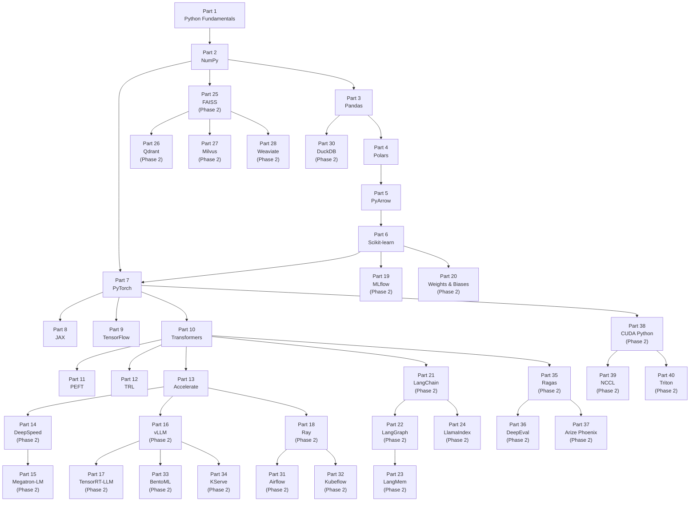

# AI/ML Libraries — The Complete Learning Handbook

> **Who this is for:** Anyone who wants to go from zero knowledge to interview-ready and production-ready across the full AI/ML engineering stack.
> **What makes this different:** Every library is taught the way a great teacher explains it — with stories, real-world analogies, and historical context — before a single line of code appears.
> **Philosophy:** Understanding *why* a tool exists beats memorizing its API. A reader who understands the problem a library solves can reconstruct most of the API from first principles.

---

## How This Handbook Differs from [`ML-LIBRARIES-NOTES.md`](../ML-LIBRARIES-NOTES.md)

| This handbook | ML-LIBRARIES-NOTES.md |
|---|---|
| Premium course — teaches you to think | Quick reference — reminds you of APIs |
| Starts with history and problem | Starts with API tables |
| 100 interview Q&As per library | Scripted interview frameworks |
| Production failure stories | Pitfall lists |
| Role-based usage guides | Code patterns |

**Use both.** Study this handbook to build understanding. Flip to `ML-LIBRARIES-NOTES.md` before an interview to refresh APIs.

---

## Prerequisites

This handbook assumes you can write basic Python (variables, loops, functions, classes). If you are new to the mathematics behind ML — linear algebra, probability, optimization — study the companion math course first:

**[Math for AI/ML — Complete Self-Study Course](../math/README.md)**

The math course teaches the foundations that make NumPy, PyTorch, and JAX feel inevitable rather than magical.

---

## How to Use This Handbook

Read the parts in order. Every part builds on the previous one. The dependency graph below shows which parts unlock which.



---

## 4-Phase Study Roadmap

| Phase | Parts | Libraries | Time Estimate | Goal |
|---|---|---|---|---|
| **1 — Data Foundations** | 1–5 | Python, NumPy, Pandas, Polars, PyArrow | 4–6 weeks | Work with any dataset efficiently |
| **2 — Classical ML** | 6 | Scikit-learn | 2–3 weeks | Train, evaluate, deploy classical models |
| **3 — Deep Learning** | 7–9 | PyTorch, JAX, TensorFlow | 6–10 weeks | Build and train neural networks |
| **4 — LLM Engineering** | 10–13 | Transformers, PEFT, TRL, Accelerate | 6–10 weeks | Fine-tune, align, and scale LLMs |
| **Phase 2 — Infrastructure** | 14–40 | DeepSpeed → Triton | Coming soon | Production AI infrastructure at scale |

**Total Phase 1 estimated time:** 18–29 weeks depending on your pace and prior knowledge.

---

## The 22-Section Lesson Template

Every part in this handbook follows the same structure. Once you know the pattern, your brain knows what to expect and learning accelerates.

```
 1. Why This Library Exists    — History, problem, alternatives, tradeoffs
 2. Explain Like I Am 10       — Intuition only. No code. No APIs.
 3. Mental Model               — One analogy that frames every concept
 4. Learning Dependency Graph  — What you must know first (Mermaid)
 5. Core Concepts              — What/Why/When/Where with tradeoffs
 6. Internal Architecture      — How it works under the hood
 7. Essential APIs             — Finally, the code (after you understand)
 8. API Learning Roadmap       — Beginner → Staff → Production
 9. Beginner Examples          — Tiny datasets, clear explanations
10. Intermediate Examples      — Real ML pipelines
11. Advanced Examples          — Production-ready patterns
12. Internal Interview Knowledge — What interviewers test and why
13. Production AI Usage        — How OpenAI, Google, Meta use it
14. Common Mistakes            — Beginner, intermediate, production
15. Performance Optimization   — Memory, CPU, GPU, distributed
16. Production Failures        — Real failure stories and root causes
17. Best Practices             — Industry standards and coding conventions
18. Library Relationships      — vs competitors, when to switch
19. Role-Based Usage           — AI Eng / ML Eng / LLM Eng / DS / MLOps
20. Cheat Sheet                — One-page revision summary
21. Flash Cards                — Key concepts to drill
22. Interview Question Bank    — 100 Q&As across 4 difficulty levels
```

**Teaching guardrail:** APIs always come *after* concepts. Any section that opens with `import` or an API table violates this handbook's core rule.

---

## Code Setup

Every code example in this handbook is self-contained and runnable.

```bash
cd libraries/code
pip install -r requirements.txt
python part-02/01_broadcasting.py
```

All scripts include:
- A version comment at the top
- Line-by-line comments
- Printed expected output
- `if __name__ == "__main__"` guards

---

## Phase Status

| Part | Library | File | Status |
|---|---|---|---|
| 1 | Python Fundamentals | [part-01-python-fundamentals.md](part-01-python-fundamentals.md) | Complete |
| 2 | NumPy | [part-02-numpy.md](part-02-numpy.md) | Complete |
| 3 | Pandas | [part-03-pandas.md](part-03-pandas.md) | Complete |
| 4 | Polars | [part-04-polars.md](part-04-polars.md) | Complete |
| 5 | PyArrow | [part-05-pyarrow.md](part-05-pyarrow.md) | Complete |
| 6 | Scikit-learn | [part-06-scikit-learn.md](part-06-scikit-learn.md) | Complete |
| 7 | PyTorch | [part-07-pytorch.md](part-07-pytorch.md) | Complete |
| 8 | JAX | [part-08-jax.md](part-08-jax.md) | Complete |
| 9 | TensorFlow | [part-09-tensorflow.md](part-09-tensorflow.md) | Complete |
| 10 | Transformers | [part-10-transformers.md](part-10-transformers.md) | Complete |
| 11 | PEFT | [part-11-peft.md](part-11-peft.md) | Complete |
| 12 | TRL | [part-12-trl.md](part-12-trl.md) | Complete |
| 13 | Accelerate | [part-13-accelerate.md](part-13-accelerate.md) | Complete |
| 14 | DeepSpeed | [part-14-deepspeed.md](part-14-deepspeed.md) | Phase 2 Stub |
| 15 | Megatron-LM | [part-15-megatron-lm.md](part-15-megatron-lm.md) | Phase 2 Stub |
| 16 | vLLM | [part-16-vllm.md](part-16-vllm.md) | Phase 2 Stub |
| 17 | TensorRT-LLM | [part-17-tensorrt-llm.md](part-17-tensorrt-llm.md) | Phase 2 Stub |
| 18 | Ray | [part-18-ray.md](part-18-ray.md) | Phase 2 Stub |
| 19 | MLflow | [part-19-mlflow.md](part-19-mlflow.md) | Phase 2 Stub |
| 20 | Weights & Biases | [part-20-wandb.md](part-20-wandb.md) | Phase 2 Stub |
| 21 | LangChain | [part-21-langchain.md](part-21-langchain.md) | Phase 2 Stub |
| 22 | LangGraph | [part-22-langgraph.md](part-22-langgraph.md) | Phase 2 Stub |
| 23 | LangMem | [part-23-langmem.md](part-23-langmem.md) | Phase 2 Stub |
| 24 | LlamaIndex | [part-24-llamaindex.md](part-24-llamaindex.md) | Phase 2 Stub |
| 25 | FAISS | [part-25-faiss.md](part-25-faiss.md) | Phase 2 Stub |
| 26 | Qdrant | [part-26-qdrant.md](part-26-qdrant.md) | Phase 2 Stub |
| 27 | Milvus | [part-27-milvus.md](part-27-milvus.md) | Phase 2 Stub |
| 28 | Weaviate | [part-28-weaviate.md](part-28-weaviate.md) | Phase 2 Stub |
| 29 | Neo4j | [part-29-neo4j.md](part-29-neo4j.md) | Phase 2 Stub |
| 30 | DuckDB | [part-30-duckdb.md](part-30-duckdb.md) | Phase 2 Stub |
| 31 | Airflow | [part-31-airflow.md](part-31-airflow.md) | Phase 2 Stub |
| 32 | Kubeflow | [part-32-kubeflow.md](part-32-kubeflow.md) | Phase 2 Stub |
| 33 | BentoML | [part-33-bentoml.md](part-33-bentoml.md) | Phase 2 Stub |
| 34 | KServe | [part-34-kserve.md](part-34-kserve.md) | Phase 2 Stub |
| 35 | Ragas | [part-35-ragas.md](part-35-ragas.md) | Phase 2 Stub |
| 36 | DeepEval | [part-36-deepeval.md](part-36-deepeval.md) | Phase 2 Stub |
| 37 | Arize Phoenix | [part-37-arize-phoenix.md](part-37-arize-phoenix.md) | Phase 2 Stub |
| 38 | CUDA Python | [part-38-cuda-python.md](part-38-cuda-python.md) | Phase 2 Stub |
| 39 | NCCL | [part-39-nccl.md](part-39-nccl.md) | Phase 2 Stub |
| 40 | Triton | [part-40-triton.md](part-40-triton.md) | Phase 2 Stub |

---

## Interview Coverage Matrix

| Interview Round | Primary Parts |
|---|---|
| ML Coding (arrays, data wrangling) | 1, 2, 3, 4 |
| Classical ML System Design | 6 |
| Deep Learning Training | 7, 8, 9 |
| LLM Fine-tuning & Alignment | 10, 11, 12 |
| Distributed Training | 13, 14, 15 |
| LLM Inference & Serving | 16, 17 |
| LLM Agent Systems | 21, 22, 23, 24 |
| Vector Search & RAG | 25, 26, 27, 28 |
| MLOps & Experiment Tracking | 19, 20 |
| AI Infrastructure | 18, 31, 32, 38, 39, 40 |

---

*Start with [Part 1: Python Fundamentals](part-01-python-fundamentals.md).*
