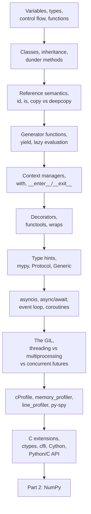
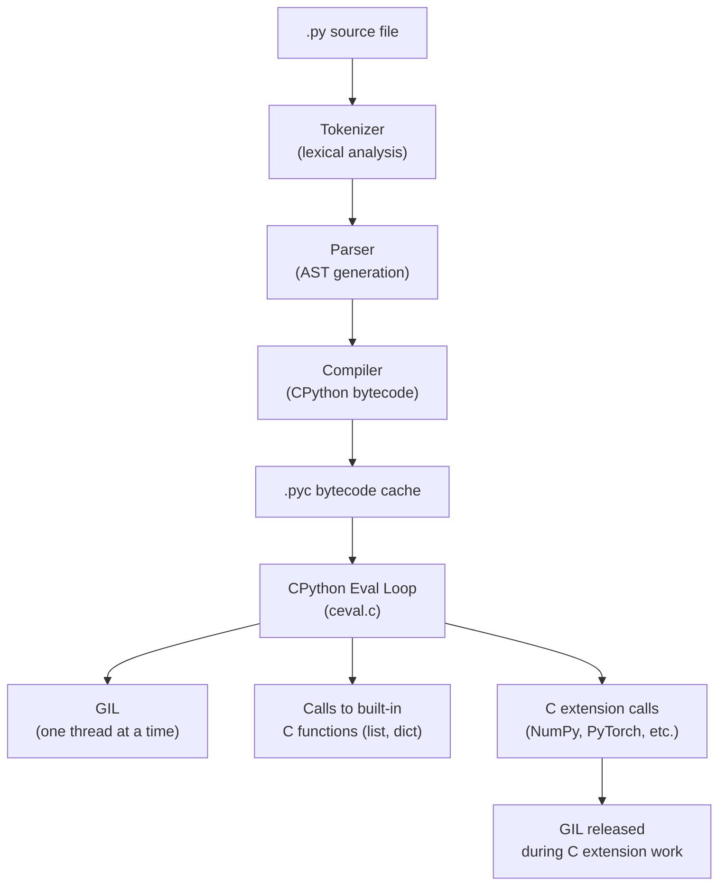

<!-- TEACHING_ORDER: verified -->
# Part 1: Python Fundamentals

> **Prerequisites:** None — this is the starting point.
> **Used later in:** All 39 subsequent parts. Everything in this handbook runs on Python.
> **Version anchor:** Python 3.11–3.13 (mid-2026)

---

## Why This Library Exists

### The problem it solved

In the late 1980s, scientific computing and data analysis meant writing C or Fortran. These languages were fast but hostile to experimentation: you needed to declare memory, manage pointers, recompile after every change, and handle platform-specific differences yourself. Researchers who wanted to test a new idea quickly could not — the engineering friction between "thought" and "running code" was too high.

Guido van Rossum started designing Python in December 1989 while working at CWI Amsterdam. His goal was not to build a faster language. His goal was to build a language where the distance between thinking and running was as short as possible. Python was intentionally:

- **Readable** — code looks almost like English
- **Interactive** — run one line at a time in the REPL
- **High-level** — memory management is automatic
- **Dynamically typed** — no need to declare variable types

Python 1.0 was released in 1994. It was slow compared to C. It was also enormously more productive. For tasks where human time was the bottleneck — not CPU time — Python won immediately.

### Why Python became the language of AI/ML

Between 2007 and 2012, three things happened simultaneously:

1. NumPy (2006) gave Python fast array math by calling C and Fortran libraries internally — so Python code could be as fast as C for numerical work
2. SciPy, Matplotlib, and IPython (later Jupyter) created a scientific computing ecosystem that felt like MATLAB but was free and composable
3. Scikit-learn (2007), Theano (2007), and eventually TensorFlow (2015) and PyTorch (2016) all chose Python as their primary interface

By the time deep learning became mainstream, Python was already the de facto standard language for AI/ML research. Switching languages would have meant abandoning this ecosystem. Today, Python is so entrenched that even frameworks written entirely in C++, Rust, or Go — PyTorch, Polars, Qdrant — provide Python bindings as their primary user interface.

### The tradeoff Python made

Python's productivity comes at a cost: the Global Interpreter Lock (GIL). Only one thread can execute Python bytecode at a time. For CPU-bound numerical work this sounds disastrous — but it is largely irrelevant in practice because all the performance-critical work (NumPy, PyTorch, TensorFlow) happens in C/C++/CUDA code that releases the GIL. Python is the orchestration layer; other languages do the heavy lifting.

---

## Explain Like I Am 10

Imagine you want to build something with LEGO. There are two ways to do it.

One way: go to a factory. Design every piece from scratch in engineering software. Print each piece individually. Assemble them with precise measurements.

Another way: open a box of LEGO. Pick the pieces you need. Snap them together. If something does not fit, swap the piece.

Python is the LEGO way of programming.

In C or Java, you tell the computer exactly how much memory to use for a variable, what type it is, and where to put it. In Python, you just write `name = "Alice"` and Python figures out the rest — it allocates memory, decides the type, and manages cleanup automatically.

This means:
- You can test an idea in two lines instead of fifty
- You can change your mind without rewriting half the program
- You can use anyone else's building blocks (libraries) with a simple `import`

The catch: Python is slower than C for raw computation. But here is the trick that the whole AI/ML world learned — you can write your orchestration and logic in Python, and call C/CUDA code for the heavy math. That is exactly what NumPy, PyTorch, and TensorFlow do. You get Python's speed of thought and C's speed of execution.

---

## Mental Model

Think of Python as the **conductor of an orchestra**.

The conductor does not play an instrument. They stand at the front and tell each musician what to do — when to start, when to stop, how loud to play. The musicians (NumPy, PyTorch, CUDA) do the actual work.

Python's job is to:
1. Orchestrate calls to fast C/C++/CUDA libraries
2. Express logic in readable, maintainable code
3. Glue components together with minimal friction

When an AI interview asks you about Python, they are really asking: do you understand when Python is the bottleneck and how to move the bottleneck elsewhere?

---

## Learning Dependency Graph



---

## Core Concepts

### 1. Reference semantics and the object model

Every value in Python is an object. Every variable is a reference (a pointer) to an object. This is the single most important concept to internalize before working with NumPy, Pandas, or PyTorch — because they all have their own rules about when data is copied versus shared, and those rules make sense only if you understand Python's reference model.

```python
a = [1, 2, 3]
b = a          # b is a reference to the same list object
b.append(4)
print(a)       # [1, 2, 3, 4] — a and b point to the same object

c = a.copy()   # c is a shallow copy — new list, same element objects
c.append(5)
print(a)       # [1, 2, 3, 4] — a unchanged
```

**Why this matters for ML:** When you do `tensor_b = tensor_a` in PyTorch, you get a view (shared memory), not a copy. Modifying `tensor_b` modifies `tensor_a`. This is a common source of subtle bugs.

**Shallow vs deep copy:**

```python
import copy

# Shallow copy: new container, same element references
nested = [[1, 2], [3, 4]]
shallow = copy.copy(nested)
shallow[0].append(99)
print(nested[0])   # [1, 2, 99] — the inner list is shared

# Deep copy: new container AND new elements (recursive)
deep = copy.deepcopy(nested)
deep[0].append(100)
print(nested[0])   # [1, 2, 99] — unchanged
```

---

### 2. The Global Interpreter Lock (GIL)

The GIL is a mutex — a lock — that the CPython interpreter holds whenever it executes Python bytecode. Only one thread holds the GIL at a time, which means Python threads cannot execute Python code in parallel on multiple CPU cores.

**Why it exists:** CPython's memory management (reference counting) is not thread-safe without the GIL. Rather than make every object access thread-safe with fine-grained locking (expensive), CPython takes one coarse lock — the GIL.

**What the GIL does NOT prevent:**

1. Parallelism in C extensions: NumPy, PyTorch, and TensorFlow release the GIL during heavy computation. Two threads doing `numpy.matmul` on large arrays run in parallel.

2. I/O concurrency: The GIL is released during I/O operations. Threads waiting for network responses or disk reads run concurrently.

**When the GIL matters:**

| Workload type | Use |
|---|---|
| CPU-bound Python code (loops, string processing) | `multiprocessing` or `concurrent.futures.ProcessPoolExecutor` |
| I/O-bound (network, disk, APIs) | `threading` or `asyncio` |
| CPU-bound NumPy/PyTorch | `threading` is fine (GIL released in C code) |

```python
from concurrent.futures import ProcessPoolExecutor, ThreadPoolExecutor
import time

def cpu_work(n):
    """Pure Python CPU-bound work — GIL matters."""
    return sum(i * i for i in range(n))

def io_work(seconds):
    """Simulated I/O — GIL released during sleep."""
    time.sleep(seconds)
    return "done"

# CPU work: threads don't help because GIL serializes Python code
with ProcessPoolExecutor(max_workers=4) as pool:
    results = list(pool.map(cpu_work, [1_000_000] * 4))

# I/O work: threads are perfect
with ThreadPoolExecutor(max_workers=4) as pool:
    results = list(pool.map(io_work, [1.0] * 4))
```

**PEP 703 (Python 3.13+):** The no-GIL build of CPython was merged as an experimental option in Python 3.13. This may eventually remove the restriction for pure-Python CPU-bound code, but the ecosystem is still adapting.

---

### 3. Generators and lazy evaluation

A generator is a function that produces values one at a time instead of computing all of them upfront. It uses `yield` instead of `return`.

**Why generators matter for ML:**

- Loading a 100-GB dataset: generators stream rows without loading everything into RAM
- Data pipelines: PyTorch's `DataLoader` is built on Python generators
- Infinite sequences: generating training batches, data augmentation pipelines

```python
# Eager (bad for large data): computes everything, stores in memory
def squares_eager(n):
    return [i * i for i in range(n)]  # all n items in memory

# Lazy (correct for large data): computes on demand
def squares_lazy(n):
    for i in range(n):
        yield i * i  # one item at a time

# Generator expression (same idea, one-liner)
gen = (i * i for i in range(1_000_000))

# Only computes what you consume
for val in gen:
    if val > 100:
        break  # stops here — never computed the remaining 999,990 values
```

**The `yield from` delegation:**

```python
def chain(*iterables):
    """Yield items from multiple iterables sequentially."""
    for it in iterables:
        yield from it   # delegates to nested generator

list(chain([1, 2], [3, 4], [5]))  # [1, 2, 3, 4, 5]
```

---

### 4. Decorators

A decorator is a function that wraps another function to modify or extend its behavior without changing its code. The `@` syntax is syntactic sugar for `func = decorator(func)`.

Decorators appear constantly in ML code:
- `@torch.no_grad()` — disable gradient tracking for inference
- `@tf.function` — compile a Python function to a TensorFlow graph
- `@jax.jit` — JIT-compile a function with XLA
- `@ray.remote` — make a function run on a distributed cluster

```python
import functools
import time

def timer(func):
    """Decorator that prints how long a function takes."""
    @functools.wraps(func)  # preserves func.__name__ and __doc__
    def wrapper(*args, **kwargs):
        start = time.perf_counter()
        result = func(*args, **kwargs)
        elapsed = time.perf_counter() - start
        print(f"{func.__name__} took {elapsed:.4f}s")
        return result
    return wrapper

@timer
def train_epoch(model, data):
    # ... training code
    pass

# Equivalent to: train_epoch = timer(train_epoch)
```

**Decorators with arguments:**

```python
def retry(max_attempts=3, exceptions=(Exception,)):
    """Retry decorator for flaky operations (e.g., API calls)."""
    def decorator(func):
        @functools.wraps(func)
        def wrapper(*args, **kwargs):
            for attempt in range(max_attempts):
                try:
                    return func(*args, **kwargs)
                except exceptions as e:
                    if attempt == max_attempts - 1:
                        raise
                    print(f"Attempt {attempt + 1} failed: {e}, retrying...")
        return wrapper
    return decorator

@retry(max_attempts=5, exceptions=(ConnectionError,))
def fetch_embeddings(text):
    # call an external API
    pass
```

---

### 5. Context managers

A context manager defines setup and teardown code that runs automatically when entering and exiting a `with` block. It guarantees cleanup even if an exception occurs.

```python
# The classic pattern: file handling
with open("data.csv", "r") as f:
    data = f.read()
# f.close() called automatically — even on exception

# Custom context manager with a class
class GPUMemoryTracker:
    def __enter__(self):
        import torch
        self.start = torch.cuda.memory_allocated()
        return self

    def __exit__(self, exc_type, exc_val, exc_tb):
        import torch
        end = torch.cuda.memory_allocated()
        print(f"GPU memory delta: {(end - self.start) / 1e6:.1f} MB")
        return False  # do not suppress exceptions

with GPUMemoryTracker() as tracker:
    import torch
    x = torch.randn(1000, 1000, device="cuda")
    y = x @ x.T
# prints: GPU memory delta: 8.0 MB

# Context manager with contextlib (simpler)
from contextlib import contextmanager

@contextmanager
def timer_context(label):
    start = time.perf_counter()
    yield                                   # code inside the with block runs here
    elapsed = time.perf_counter() - start
    print(f"{label}: {elapsed:.3f}s")

with timer_context("matrix multiply"):
    result = [[0] * 100 for _ in range(100)]
```

---

### 6. Type hints and static analysis

Python is dynamically typed — you do not need to declare types. But modern Python (3.5+) supports optional type annotations that tools like `mypy` and `pyright` check statically. Production ML codebases at Google, Meta, and Stripe require type annotations for all public interfaces.

```python
from typing import Optional, Union, List, Dict, Tuple
from collections.abc import Sequence, Iterator

def embed_texts(
    texts: list[str],
    model_name: str = "text-embedding-3-small",
    batch_size: int = 32,
) -> list[list[float]]:
    """Returns a list of embedding vectors, one per input text."""
    ...

# Python 3.12+: cleaner generics syntax
def top_k[T](items: list[T], k: int) -> list[T]:
    return sorted(items)[:k]

# Protocol: structural typing (duck typing with types)
from typing import Protocol

class Embedder(Protocol):
    def embed(self, text: str) -> list[float]: ...

# Any class with an embed() method satisfies Embedder,
# without inheriting from it. This is how PyTorch uses duck typing.
```

---

### 7. Async programming

`asyncio` provides concurrent I/O without multiple threads. A single-threaded event loop runs coroutines, switching between them at `await` points (I/O waits). This is ideal for LLM applications making many concurrent API calls.

```python
import asyncio
import aiohttp

async def fetch_completion(session, prompt: str) -> str:
    """Non-blocking API call to an LLM."""
    async with session.post(
        "https://api.openai.com/v1/completions",
        json={"model": "gpt-4o", "prompt": prompt},
    ) as response:
        data = await response.json()
        return data["choices"][0]["text"]

async def batch_completions(prompts: list[str]) -> list[str]:
    """Send all requests concurrently, not one by one."""
    async with aiohttp.ClientSession() as session:
        tasks = [fetch_completion(session, p) for p in prompts]
        return await asyncio.gather(*tasks)

# 100 API calls complete in ~1 second (network time)
# instead of 100 seconds (sequential)
results = asyncio.run(batch_completions(["Tell me about " + t for t in topics]))
```

---

### 8. Memory management and `__slots__`

CPython uses reference counting for memory management. When an object's reference count drops to zero, its memory is freed. A cyclic garbage collector handles reference cycles (objects pointing to each other).

Every Python object has overhead: a reference count (8 bytes), a type pointer (8 bytes), and a `__dict__` for instance attributes (typically 200+ bytes). For classes with many instances, `__slots__` eliminates `__dict__` and reduces memory dramatically.

```python
import sys

class EmbeddingWithDict:
    def __init__(self, vector, doc_id):
        self.vector = vector
        self.doc_id = doc_id

class EmbeddingWithSlots:
    __slots__ = ("vector", "doc_id")
    def __init__(self, vector, doc_id):
        self.vector = vector
        self.doc_id = doc_id

e1 = EmbeddingWithDict([0.1] * 10, "doc_001")
e2 = EmbeddingWithSlots([0.1] * 10, "doc_001")

print(sys.getsizeof(e1))  # ~200+ bytes (includes __dict__ overhead)
print(sys.getsizeof(e2))  # ~56 bytes

# For 1 million objects:
# Without __slots__: ~200 MB
# With __slots__: ~56 MB
```

---

## Internal Architecture

### CPython's execution model



### What happens when Python runs `import numpy`

1. Python finds `numpy` in `sys.path`
2. Loads `numpy/__init__.py` — pure Python glue code
3. That file imports `numpy.core._multiarray_umath`, a C extension (`.pyd` on Windows, `.so` on Linux)
4. The C extension is loaded by `dlopen`/`LoadLibrary`, which maps BLAS/LAPACK shared libraries
5. NumPy array operations now run at C speed — the Python object is just a thin wrapper around a raw memory buffer

This is why `import numpy` takes ~100ms the first time: it is loading megabytes of compiled C code.

### The object memory layout

```
PyObject (every Python object):
  ob_refcnt: Py_ssize_t   (8 bytes) — reference count
  ob_type:  *PyTypeObject (8 bytes) — pointer to type

PyLongObject (int):
  ob_refcnt, ob_type (16 bytes base)
  ob_digit: array of 30-bit digits

PyListObject:
  ob_refcnt, ob_type (16 bytes base)
  ob_size: Py_ssize_t    — number of items
  ob_item: **PyObject    — pointer to array of pointers to items
  allocated: Py_ssize_t  — allocated capacity (for amortized appends)
```

A Python list of 1000 integers uses:
- The list object: ~56 bytes
- The pointer array: 1000 × 8 = 8,000 bytes
- The integer objects: 1000 × 28 = 28,000 bytes
- **Total: ~36 KB**

A NumPy array of 1000 float32 values uses:
- The ndarray object: ~96 bytes
- The data buffer: 1000 × 4 = 4,000 bytes
- **Total: ~4 KB**

This 9x memory difference is why NumPy is so much more efficient for numerical work.

---

## Essential APIs

### Built-in data structures

| Structure | When to use | Time complexity |
|---|---|---|
| `list` | Ordered sequence, append/iterate | O(1) append, O(n) insert |
| `tuple` | Immutable sequence, function returns, namedtuple | O(1) access |
| `dict` | Key-value lookup, config objects | O(1) average get/set |
| `set` | Membership testing, deduplication | O(1) average |
| `collections.deque` | Queue/stack with O(1) both ends | O(1) append/popleft |
| `collections.defaultdict` | dict with default factory (avoid KeyError) | O(1) |
| `collections.Counter` | Counting frequencies | O(1) |

### functools and itertools (essential for ML code)

```python
import functools
import itertools
from collections import defaultdict, Counter

# functools.lru_cache: memoize expensive pure functions
@functools.lru_cache(maxsize=1024)
def tokenize_cached(text: str) -> tuple[str, ...]:
    return tuple(text.lower().split())

# functools.partial: pre-fill arguments
from functools import partial
log_error = partial(print, "[ERROR]")
log_error("model failed to load")  # prints: [ERROR] model failed to load

# itertools.batched (Python 3.12): split list into batches
data = list(range(100))
batches = list(itertools.batched(data, 10))  # 10 batches of 10

# itertools.chain: concatenate iterables without copying
train = [1, 2, 3]
val   = [4, 5, 6]
all_data = list(itertools.chain(train, val))   # [1, 2, 3, 4, 5, 6]

# defaultdict: accumulate without KeyError
label_counts = defaultdict(int)
for label in ["cat", "dog", "cat", "cat"]:
    label_counts[label] += 1
# {"cat": 3, "dog": 1}
```

### dataclasses (replace verbose classes in ML configs)

```python
from dataclasses import dataclass, field
from typing import Optional

@dataclass
class TrainingConfig:
    model_name: str = "bert-base-uncased"
    learning_rate: float = 2e-5
    batch_size: int = 32
    num_epochs: int = 3
    warmup_steps: int = 100
    output_dir: str = "./checkpoints"
    fp16: bool = False
    gradient_accumulation_steps: int = 1
    label_names: list[str] = field(default_factory=list)
    resume_from: Optional[str] = None

    def effective_batch_size(self) -> int:
        return self.batch_size * self.gradient_accumulation_steps

config = TrainingConfig(model_name="gpt2", learning_rate=1e-4, fp16=True)
print(config)
# TrainingConfig(model_name='gpt2', learning_rate=0.0001, ...)
```

---

## API Learning Roadmap

### Beginner APIs
`print`, `len`, `range`, `enumerate`, `zip`, `list`, `dict`, `set`, `tuple`, `str`, `int`, `float`, `bool`, `open`, `with`, `if/elif/else`, `for/while`, `def`, `class`, `import`, `try/except`

### Intermediate APIs
`yield`, `@decorator`, `*args/**kwargs`, `comprehensions`, `lambda`, `sorted`/`key`, `functools.partial`, `functools.lru_cache`, `collections.defaultdict`, `collections.Counter`, `itertools`, `dataclasses`, `typing`, `pathlib.Path`, `json`, `logging`

### Advanced APIs
`asyncio`, `concurrent.futures`, `multiprocessing`, `threading`, `contextlib`, `__slots__`, `__enter__`/`__exit__`, `__getattr__`/`__setattr__`, `__repr__`/`__str__`, `metaclass`, `abc.ABC`, `weakref`, `gc`, `sys.getsizeof`, `inspect`

### Production APIs
`argparse`/`click`/`typer`, `pydantic`, `structlog`, `cProfile`/`line_profiler`/`py-spy`, `ctypes`/`cffi`, `subprocess`, `shutil`, `tempfile`, `hashlib`, `secrets`, `packaging`, `importlib`

---

## Beginner Examples

### Example 1: Loading and processing a CSV without any libraries

```python
# Part 1 example: Pure Python CSV processing
# Demonstrates: file I/O, generators, dict comprehensions

def load_csv(filepath: str) -> list[dict]:
    """Load a CSV into a list of dicts. No pandas needed for small files."""
    with open(filepath, newline="") as f:
        lines = f.readlines()

    headers = lines[0].strip().split(",")
    rows = []
    for line in lines[1:]:
        values = line.strip().split(",")
        rows.append(dict(zip(headers, values)))
    return rows

def count_by_label(rows: list[dict], label_col: str) -> dict[str, int]:
    """Count occurrences of each label value."""
    counts: dict[str, int] = {}
    for row in rows:
        label = row[label_col]
        counts[label] = counts.get(label, 0) + 1
    return counts

if __name__ == "__main__":
    # Simulated in-memory CSV (normally you'd read from disk)
    import io, csv
    csv_content = "name,label\nalice,cat\nbob,dog\ncarol,cat\ndave,fish"
    reader = csv.DictReader(io.StringIO(csv_content))
    rows = list(reader)

    counts = count_by_label(rows, "label")
    print(counts)
    # Expected output: {'cat': 2, 'dog': 1, 'fish': 1}
```

### Example 2: A simple batch generator

```python
# Part 1 example: Generator-based batching
# Demonstrates: generators, type hints, iteration protocol

from typing import TypeVar, Iterator
T = TypeVar("T")

def batched(items: list[T], batch_size: int) -> Iterator[list[T]]:
    """Yield successive non-overlapping batches from a list."""
    for i in range(0, len(items), batch_size):
        yield items[i : i + batch_size]

if __name__ == "__main__":
    documents = [f"doc_{i}" for i in range(10)]

    for batch in batched(documents, 3):
        print(f"Processing batch: {batch}")
    # Expected output:
    # Processing batch: ['doc_0', 'doc_1', 'doc_2']
    # Processing batch: ['doc_3', 'doc_4', 'doc_5']
    # Processing batch: ['doc_6', 'doc_7', 'doc_8']
    # Processing batch: ['doc_9']
```

---

## Intermediate Examples

### Example 3: A production-ready config system with validation

```python
# Part 1 intermediate: Config with dataclass + validation
# Demonstrates: dataclass, type hints, property, __post_init__

from dataclasses import dataclass, field
from pathlib import Path
import os

@dataclass
class ModelConfig:
    model_name: str
    max_seq_len: int = 512
    dropout: float = 0.1
    hidden_dim: int = 768
    num_layers: int = 12
    num_heads: int = 12
    vocab_size: int = 30522
    device: str = "cpu"

    def __post_init__(self):
        # Validation runs automatically after __init__
        if self.hidden_dim % self.num_heads != 0:
            raise ValueError(
                f"hidden_dim {self.hidden_dim} must be divisible by "
                f"num_heads {self.num_heads}"
            )
        if not (0.0 <= self.dropout <= 1.0):
            raise ValueError(f"dropout must be in [0, 1], got {self.dropout}")
        # Auto-detect GPU if available and device not specified
        if self.device == "auto":
            try:
                import torch
                self.device = "cuda" if torch.cuda.is_available() else "cpu"
            except ImportError:
                self.device = "cpu"

    @property
    def attention_head_dim(self) -> int:
        return self.hidden_dim // self.num_heads

    @classmethod
    def from_env(cls) -> "ModelConfig":
        """Load configuration from environment variables."""
        return cls(
            model_name=os.environ.get("MODEL_NAME", "bert-base"),
            max_seq_len=int(os.environ.get("MAX_SEQ_LEN", "512")),
            device=os.environ.get("DEVICE", "cpu"),
        )

if __name__ == "__main__":
    config = ModelConfig(
        model_name="custom-bert",
        hidden_dim=768,
        num_heads=12,
    )
    print(f"Config: {config}")
    print(f"Head dim: {config.attention_head_dim}")  # 64

    try:
        bad_config = ModelConfig(model_name="bad", hidden_dim=100, num_heads=12)
    except ValueError as e:
        print(f"Validation error (expected): {e}")
    # Expected: Validation error: hidden_dim 100 must be divisible by num_heads 12
```

### Example 4: Async batch processing of LLM calls

```python
# Part 1 intermediate: Async LLM calls
# Demonstrates: async/await, asyncio.gather, semaphore for rate limiting

import asyncio
from typing import Optional

async def mock_llm_call(text: str, delay: float = 0.1) -> str:
    """Simulate an async LLM API call."""
    await asyncio.sleep(delay)          # simulates network latency
    return f"[EMBEDDING of: {text[:20]}...]"

async def embed_batch_with_limit(
    texts: list[str],
    max_concurrent: int = 10,
) -> list[str]:
    """Embed a batch of texts with a concurrency limit (rate limiting)."""
    semaphore = asyncio.Semaphore(max_concurrent)

    async def embed_one(text: str) -> str:
        async with semaphore:           # at most max_concurrent run simultaneously
            return await mock_llm_call(text)

    tasks = [embed_one(text) for text in texts]
    return await asyncio.gather(*tasks)

if __name__ == "__main__":
    texts = [f"document number {i}" for i in range(50)]

    import time
    start = time.perf_counter()
    results = asyncio.run(embed_batch_with_limit(texts, max_concurrent=10))
    elapsed = time.perf_counter() - start

    print(f"Embedded {len(results)} texts in {elapsed:.2f}s")
    print(f"First result: {results[0]}")
    # Expected: ~0.5s total (50 calls / 10 concurrent = 5 rounds of 0.1s)
    # vs 5.0s sequential
```

---

## Advanced Examples

### Example 5: Custom __slots__ class for memory-efficient embeddings

```python
# Part 1 advanced: Memory-efficient data structures
# Demonstrates: __slots__, __repr__, comparison operators, weakref

from __future__ import annotations
import sys
import weakref

class EmbeddingRecord:
    """Memory-efficient container for embedding + metadata.

    Uses __slots__ to avoid per-instance __dict__ overhead.
    For 1M records this saves ~150MB of RAM vs a plain class.
    """
    __slots__ = ("doc_id", "vector", "metadata", "_callbacks")

    def __init__(self, doc_id: str, vector: list[float], metadata: dict = None):
        self.doc_id = doc_id
        self.vector = vector
        self.metadata = metadata or {}
        self._callbacks: list = []

    def __repr__(self) -> str:
        return f"EmbeddingRecord(doc_id={self.doc_id!r}, dim={len(self.vector)})"

    def __eq__(self, other: object) -> bool:
        if not isinstance(other, EmbeddingRecord):
            return NotImplemented
        return self.doc_id == other.doc_id

    def __hash__(self) -> int:
        return hash(self.doc_id)

    def cosine_similarity(self, other: EmbeddingRecord) -> float:
        """Compute cosine similarity. Use NumPy in production."""
        dot = sum(a * b for a, b in zip(self.vector, other.vector))
        norm_a = sum(a * a for a in self.vector) ** 0.5
        norm_b = sum(b * b for b in other.vector) ** 0.5
        if norm_a == 0 or norm_b == 0:
            return 0.0
        return dot / (norm_a * norm_b)

if __name__ == "__main__":
    r1 = EmbeddingRecord("doc_001", [0.1, 0.9, 0.3])
    r2 = EmbeddingRecord("doc_002", [0.2, 0.8, 0.4])

    print(r1)                          # EmbeddingRecord(doc_id='doc_001', dim=3)
    print(r1.cosine_similarity(r2))    # ~0.999 (very similar vectors)

    # Demonstrate memory savings
    n = 10_000
    records_with_dict = [{"doc_id": str(i), "vector": [0.1]} for i in range(n)]
    records_with_slots = [EmbeddingRecord(str(i), [0.1]) for i in range(n)]

    import sys
    size_dict = sum(sys.getsizeof(r) for r in records_with_dict)
    size_slots = sum(sys.getsizeof(r) for r in records_with_slots)
    print(f"Dict records:  {size_dict / 1e6:.1f} MB")
    print(f"Slots records: {size_slots / 1e6:.1f} MB")
```

### Example 6: Profiling a slow Python function

```python
# Part 1 advanced: Performance profiling
# Demonstrates: cProfile, line-by-line profiling, finding bottlenecks

import cProfile
import pstats
import io

def slow_tokenize(texts: list[str]) -> list[list[str]]:
    """Intentionally suboptimal tokenizer for profiling demonstration."""
    results = []
    for text in texts:
        tokens = []
        for word in text.split():
            # Expensive: recreating a list inside the inner loop
            clean = [c for c in word.lower() if c.isalpha()]
            if clean:
                tokens.append("".join(clean))
        results.append(tokens)
    return results

def fast_tokenize(texts: list[str]) -> list[list[str]]:
    """Optimized version: avoid inner list comprehension."""
    import re
    pattern = re.compile(r"[^a-z]")
    results = []
    for text in texts:
        tokens = [
            cleaned for word in text.lower().split()
            if (cleaned := pattern.sub("", word))
        ]
        results.append(tokens)
    return results

if __name__ == "__main__":
    corpus = [f"Hello World {i} the quick brown fox" for i in range(10_000)]

    # Profile the slow version
    profiler = cProfile.Profile()
    profiler.enable()
    slow_tokenize(corpus)
    profiler.disable()

    stream = io.StringIO()
    stats = pstats.Stats(profiler, stream=stream)
    stats.sort_stats("cumulative")
    stats.print_stats(5)
    print(stream.getvalue())
    # Output shows: which functions consumed the most time
```

---

## Internal Interview Knowledge

### What interviewers are testing

When an AI/ML interviewer asks Python questions, they are rarely testing whether you know syntax. They are testing three things:

1. **Do you understand Python's execution model?** GIL, reference counting, C extensions — because these determine when Python becomes the bottleneck in production.

2. **Can you write clean, idiomatic Python?** Not clever Python. Readable Python that a team can maintain. This means: generators over lists for large data, dataclasses over verbose classes, type hints for all public functions, context managers for resource management.

3. **Do you know when Python is the wrong tool?** The best Python engineers know when to call a NumPy vectorized operation instead of a loop, when to use multiprocessing instead of threading, and when to reach for Rust (via PyO3) or C (via ctypes).

### The GIL question (most common Python interview topic)

**Q: Explain the GIL and its impact on ML workloads.**

**Strong answer:** "The GIL is a mutex that CPython holds when executing Python bytecode, preventing two threads from running Python code in parallel. For CPU-bound pure Python code — like a training loop written in Python — threads serialize and give no speedup. But nearly all compute-intensive ML work happens in C extensions like NumPy and PyTorch, which release the GIL during their numerical operations. So a training loop that calls PyTorch operations gains full parallelism from CUDA even in a multi-threaded setting. For I/O-bound work like batching API calls, asyncio is preferred over threads because it has zero thread-switching overhead. For CPU-bound Python preprocessing, `multiprocessing.Pool` bypasses the GIL entirely by using separate processes."

**Follow-up trap:** "So threads are useless in Python?" — No. Threads are the right choice for I/O-bound work where most time is spent waiting for network or disk, because the GIL is released during I/O.

---

## Production AI Usage

### How companies use Python's features in AI systems

**OpenAI:** Python is the primary language for the OpenAI Python SDK, model inference orchestration, and evaluation pipelines. `asyncio` is used for concurrent API serving and streaming responses. Dataclasses define message schemas for the Chat API. Type annotations are enforced via strict mypy.

**Google:** Python defines user-facing interfaces for TensorFlow, JAX, and Vertex AI. Internally, code is compiled to TensorFlow graphs or XLA computations — the Python layer is orchestration only. `@tf.function` and `@jax.jit` convert Python functions to compiled computation graphs.

**Meta (PyTorch):** Python is the authoring language for models, training scripts, and data pipelines. PyTorch Dispatcher maps Python calls to hardware-specific kernels. Python's dynamic nature enables PyTorch's eager mode — every operation runs immediately, which makes debugging trivial.

**Netflix:** Python powers their recommendation system feature engineering pipelines. Generators stream feature data from Parquet files to avoid loading petabytes into RAM. `asyncio` handles concurrent requests to their feature store API.

**Databricks:** MLflow's tracking SDK is pure Python. PySpark runs Python code as executors on distributed Spark clusters — each executor is a separate Python process (bypassing the GIL for Spark parallelism).

**Anthropic:** The Anthropic Python SDK uses `asyncio` for concurrent tool call handling. Type stubs and Protocol classes define the interface between model inference and post-processing pipelines.

---

## Common Mistakes

### Beginner mistakes

**Mistake 1: Mutating a list that is being iterated**
```python
# Bug: modifying list during iteration
items = [1, 2, 3, 4, 5]
for item in items:
    if item % 2 == 0:
        items.remove(item)   # skips items after removal!
print(items)  # [1, 3, 5] — wrong! Should be [1, 3, 5] by luck for this case
              # but for [1, 2, 2, 3] you'd get [1, 2, 3] missing one 2

# Fix: iterate over a copy, or use list comprehension
items = [item for item in items if item % 2 != 0]
```

**Mistake 2: Using mutable default arguments**
```python
# Bug: default list is shared across all calls
def append_to(elem, to=[]):
    to.append(elem)
    return to

print(append_to(1))  # [1]
print(append_to(2))  # [1, 2] — the list persists between calls!

# Fix: use None as default
def append_to(elem, to=None):
    if to is None:
        to = []
    to.append(elem)
    return to
```

### Intermediate mistakes

**Mistake 3: Using threads for CPU-bound Python loops**

If you write a Python training loop and parallelize it with `threading.Thread`, you will get no speedup and possibly a slowdown (GIL contention overhead). Use `multiprocessing.Pool` or move to NumPy/PyTorch vectorized operations.

**Mistake 4: Forgetting that `asyncio.gather` does not parallelize CPU work**

```python
# This is still single-threaded — asyncio only helps with I/O waits
async def cpu_heavy():
    return sum(i * i for i in range(10_000_000))  # holds the event loop

# WRONG: these run sequentially, not in parallel
await asyncio.gather(cpu_heavy(), cpu_heavy())

# CORRECT: offload to executor
loop = asyncio.get_event_loop()
await asyncio.gather(
    loop.run_in_executor(None, cpu_heavy),
    loop.run_in_executor(None, cpu_heavy),
)
```

### Production mistakes

**Mistake 5: Not pinning dependency versions**

In ML projects, `pip install transformers` installs the latest version, which may break your training code silently six months later. Always pin with `pip freeze > requirements.txt` and use a lockfile (`pip-compile`, `poetry.lock`, `uv.lock`).

**Mistake 6: Logging with `print` instead of `logging`**

```python
# Bad: print is synchronous, has no log level, no timestamps
print(f"Loss: {loss}")

# Good: structured logging with log level
import logging
logger = logging.getLogger(__name__)
logger.info("Training step", extra={"step": step, "loss": float(loss)})
```

---

## Performance Optimization

### Finding bottlenecks

Always profile before optimizing. Python has three main profiling tools:

| Tool | What it measures | Best for |
|---|---|---|
| `cProfile` | Time per function call | Finding slow functions |
| `line_profiler` | Time per line | Optimizing a known function |
| `memory_profiler` | RAM per line | Finding memory leaks |
| `py-spy` | Sampling profiler, minimal overhead | Production profiling |

```python
# Quick profiling with cProfile
import cProfile
cProfile.run("my_slow_function(data)", sort="cumulative")

# Line profiler (requires pip install line_profiler)
# Add @profile decorator, then run: kernprof -l -v script.py
@profile
def my_slow_function(data):
    result = []
    for item in data:
        result.append(item * 2)  # ← line_profiler tells you this takes 80% of time
    return result
```

### Optimization priorities

1. **Algorithm first:** An O(n) algorithm beats an O(n²) one no matter how fast the implementation.
2. **Vectorize with NumPy:** Replace Python loops over numerical data with NumPy operations.
3. **Use generators:** Stream data instead of loading everything into RAM.
4. **Use the right data structure:** `set` for membership testing (O(1) vs list O(n)), `deque` for queue operations.
5. **Multiprocessing:** For CPU-bound Python, `multiprocessing.Pool.map` runs on all cores.

---

## Production Failures

### Failure 1: Memory leak from `functools.lru_cache` on large keys

A production LLM serving system cached expensive preprocessing results using `@lru_cache`. The cache key was the full text of each input document. After two hours of serving, the cache grew to 40 GB and the service was OOM-killed.

**Root cause:** `lru_cache` without a `maxsize` grows unboundedly. Long text keys are large cache entries.

**Fix:** Set a bounded `maxsize` and use a hash of the content as the cache key.

```python
import hashlib

@functools.lru_cache(maxsize=1024)
def preprocess_cached(text_hash: str) -> list[int]:
    # text_hash is a short fixed-size key
    ...

def preprocess(text: str) -> list[int]:
    text_hash = hashlib.sha256(text.encode()).hexdigest()
    return preprocess_cached(text_hash)
```

### Failure 2: Asyncio event loop blocked by synchronous database call

An async LLM handler awaited a response from the model but then called a synchronous SQLite read inside the async handler. This blocked the entire event loop for every request, eliminating all concurrency benefits.

**Fix:** Move blocking I/O to `loop.run_in_executor` or use an async database library (`aiosqlite`, `asyncpg`).

---

## Best Practices

1. **Type-annotate all public functions.** Use `mypy --strict` in CI.
2. **Use `pathlib.Path` instead of string path manipulation.** `Path("data") / "file.csv"` is clearer and cross-platform.
3. **Prefer `logging` over `print`.** Add log levels and timestamps from day one.
4. **Use `dataclasses` or Pydantic for config/data objects.** Avoid raw dictionaries for structured data.
5. **Pin all dependencies.** Use `pip-compile` or `uv` for lockfiles.
6. **Use `with` for any resource that needs cleanup** — files, connections, GPU contexts.
7. **Keep pure functions pure.** Functions that only read their arguments and return a result are easier to test, cache, and parallelize.
8. **Generator for any sequence you do not need all at once.** Especially for data loading pipelines.

---

## Library Relationships

### Python vs alternatives

| Language | When to prefer over Python |
|---|---|
| C/C++ | Custom CUDA kernels, performance-critical hotpaths (via Python extension) |
| Rust (PyO3) | Memory-safe systems code exposed to Python (e.g., HuggingFace tokenizers) |
| Julia | Pure numerical computing, academic research — but smaller ML ecosystem |
| Go | Web services, gRPC servers — but no NumPy-equivalent |
| R | Statistical analysis, niche academic statistics — Python has surpassed in ML |

**Python's position:** Python is not going away. The entire AI/ML ecosystem's momentum is too large to migrate. The trend is to use Python as a thin orchestration layer while core computation happens in Rust, C++, or CUDA — exactly as NumPy and PyTorch already work.

---

## Role-Based Usage

| Role | Primary Python skills |
|---|---|
| Data Scientist | Pandas, generators, comprehensions, Jupyter |
| ML Engineer | Dataclasses, logging, asyncio, profiling, multiprocessing |
| LLM Engineer | asyncio (concurrent API calls), type hints, async generators |
| AI Engineer | Protocol/ABC for composable systems, asyncio, packaging |
| MLOps Engineer | CLI tools (argparse/click), packaging, subprocess, pathlib |
| Research Scientist | Clean prototyping, generators for data loading, NumPy interop |

---

## Cheat Sheet

```python
# Reference vs copy
b = a          # reference (same object)
b = a.copy()   # shallow copy
b = copy.deepcopy(a)  # deep copy

# Generator (lazy)
gen = (x*x for x in range(1000))
def gen_fn(): yield from range(1000)

# Decorator
@functools.wraps(func)
def wrapper(*args, **kwargs): return func(*args, **kwargs)

# Context manager
@contextmanager
def ctx(): yield  # cleanup after yield

# GIL escape routes
# CPU-bound Python: multiprocessing.Pool
# I/O-bound: asyncio / threading
# Numerical CPU: NumPy (releases GIL)
# GPU: PyTorch CUDA (releases GIL)

# Type hints
def fn(x: list[str], n: int = 5) -> dict[str, int]: ...

# Profiling
cProfile.run("fn()")  # function-level
# kernprof -l -v script.py  # line-level

# __slots__ for memory
class Compact:
    __slots__ = ("x", "y")

# asyncio pattern
async def main():
    results = await asyncio.gather(coro1(), coro2(), coro3())
asyncio.run(main())
```

---

## Flash Cards

**Q:** What does the GIL prevent? What does it NOT prevent?
**A:** Prevents: two threads running Python bytecode simultaneously. Does NOT prevent: C extensions releasing the GIL for parallel computation (NumPy, PyTorch), I/O concurrency.

**Q:** When does basic slicing return a view vs a copy in Python lists?
**A:** Python lists always return copies on slicing. NumPy arrays return views. This is different from Python built-ins.

**Q:** What is a generator and why use it?
**A:** A function using `yield` that produces values lazily. Use when the full sequence would exceed RAM or when you want to pipeline processing.

**Q:** What is the difference between `copy.copy` and `copy.deepcopy`?
**A:** `copy` creates a new container but shares nested objects. `deepcopy` recursively copies all nested objects. For flat structures (list of ints), they are equivalent.

**Q:** Why use `@functools.wraps(func)` in a decorator?
**A:** Preserves `__name__`, `__doc__`, and `__module__` of the wrapped function. Without it, all decorated functions appear as `wrapper` in stack traces and help() output.

**Q:** How does asyncio achieve concurrency without threads?
**A:** Single-threaded event loop that switches between coroutines at `await` points. When a coroutine awaits an I/O operation, the loop runs other coroutines instead of blocking.

**Q:** What is `__slots__` and when should you use it?
**A:** Replaces `__dict__` with a fixed-size array of descriptors. Reduces per-instance memory by ~150 bytes. Use when creating millions of instances of a simple data class.

---

## Revision Notes

**For interviews:** The GIL question is almost certain. Have a clear 3-sentence answer covering: what it is, what it prevents, and what escapes it (C extensions, asyncio, multiprocessing).

**Mental model to recite:** "Python is the conductor. NumPy, PyTorch, CUDA are the musicians. The conductor's job is to orchestrate — not to play every note."

**Key numbers to know:**
- Python int: ~28 bytes. NumPy float32: 4 bytes. (7x difference)
- Python list of 1000 ints: ~36 KB. NumPy array of 1000 float32: ~4 KB.
- `@lru_cache` with no maxsize → potential memory leak in production

**The three concurrency models:**
- asyncio → I/O-bound (single thread, event loop)
- threading → I/O-bound (multiple threads, GIL released on I/O)
- multiprocessing → CPU-bound Python (separate processes, no GIL)

---

## Interview Question Bank

### Top 25 Beginner Questions

**Q1. What is the difference between a list and a tuple in Python?**
A: Lists are mutable (you can change elements after creation) and use square brackets. Tuples are immutable and use parentheses. Tuples are faster to iterate and can be used as dictionary keys. In ML code, use tuples for fixed-size data like `(batch_size, seq_len, hidden_dim)` and lists for data that grows.

**Q2. What does `enumerate` do?**
A: It wraps an iterable and yields `(index, value)` pairs, so you do not need to maintain a counter variable manually. `for i, item in enumerate(my_list)` is the idiomatic replacement for `for i in range(len(my_list))`.

**Q3. What is a list comprehension? When should you use it vs a for loop?**
A: A concise way to create a list: `[x*2 for x in range(10) if x % 2 == 0]`. Use comprehensions for simple transformations on small-to-medium lists. Use explicit for loops when the body is complex or when you need early exit. Use generators `(x*2 for x in range(10))` when you do not need all values at once.

**Q4. What is the difference between `is` and `==` in Python?**
A: `is` tests identity — whether two variables point to the exact same object in memory (same id). `==` tests equality — whether two objects have the same value. `a = [1, 2]; b = [1, 2]; a == b` is True but `a is b` is False.

**Q5. How does Python handle variable scope? What is LEGB?**
A: Python resolves names in Local → Enclosing (closures) → Global → Built-in order. A variable defined inside a function is local. To assign to an outer scope variable, use `global` (for module-level) or `nonlocal` (for enclosing function).

**Q6. What are `*args` and `**kwargs`?**
A: `*args` collects positional arguments into a tuple. `**kwargs` collects keyword arguments into a dict. They allow a function to accept any number of arguments. Common in decorator wrappers: `def wrapper(*args, **kwargs): return func(*args, **kwargs)`.

**Q7. What is a lambda function? What are its limitations?**
A: A lambda is an anonymous single-expression function: `square = lambda x: x * x`. Limitations: only one expression (no statements, no assignments), no docstring, harder to debug because it has no name. Use regular named functions for anything complex.

**Q8. What does `zip` do?**
A: Combines multiple iterables element-wise into tuples: `list(zip([1,2],[3,4]))` → `[(1,3),(2,4)]`. Stops at the shortest input. Common in ML for pairing predictions with labels: `for pred, label in zip(predictions, labels)`.

**Q9. How do you read a file safely in Python?**
A: Use a `with` statement: `with open("file.txt") as f: data = f.read()`. The `with` block ensures `f.close()` is called even if an exception occurs.

**Q10. What is `None` in Python?**
A: The singleton object representing absence of a value. Functions return `None` implicitly if they have no `return` statement. Test with `x is None` (not `x == None`) because `is` tests identity and `None` is always the same object.

**Q11. What is the difference between `append` and `extend` on a list?**
A: `append` adds a single item (even if it is a list): `a.append([1,2])` → `[..., [1,2]]`. `extend` iterates an iterable and adds each element: `a.extend([1,2])` → `[..., 1, 2]`.

**Q12. How do you sort a list of dicts by a key?**
A: `sorted(records, key=lambda r: r["score"], reverse=True)`. Using `key` avoids comparing whole dicts and is O(n log n).

**Q13. What is a dictionary and when would you choose it over a list?**
A: A hash map providing O(1) average key lookup. Choose a dict when you need to look up items by name/ID, when you need key-value associations, or when you need to avoid searching. Choose a list for ordered sequences accessed by position.

**Q14. What is string formatting? What is an f-string?**
A: f-strings (Python 3.6+) are the preferred way: `f"Loss at step {step}: {loss:.4f}"`. They evaluate expressions inside `{}` at runtime and support format specs after `:`. Faster than `.format()` and `%` formatting.

**Q15. What is the difference between `==` and `is` for strings?**
A: `==` compares string content. `is` compares identity. Due to string interning (Python caches short strings), `"hello" is "hello"` may be True, but you should never rely on this — always use `==` for string comparison.

**Q16. What does the `in` operator do for different containers?**
A: Membership testing. For lists: O(n) linear scan. For sets and dict keys: O(1) average. For strings: substring search. Prefer `set` over `list` when doing many membership tests on the same collection.

**Q17. What is a generator expression vs a list comprehension?**
A: `[x for x in range(n)]` builds the full list in memory. `(x for x in range(n))` creates a generator that produces values lazily. Use generator expressions when you do not need all values at once — especially for large n.

**Q18. How do you handle exceptions in Python?**
A: `try/except/else/finally`. `try` wraps risky code, `except ExceptionType as e` handles specific errors, `else` runs only if no exception occurred, `finally` always runs (good for cleanup). Catch specific exceptions rather than bare `except:`.

**Q19. What are Python modules and packages?**
A: A module is a `.py` file. A package is a directory with an `__init__.py`. `import numpy` loads the numpy package. `from numpy import array` imports a specific name. Relative imports (`from . import utils`) work within packages.

**Q20. What is `__init__.py` for?**
A: Marks a directory as a Python package. Can be empty or contain package-level initialization code and public API exports. In modern Python (3.3+) namespace packages work without `__init__.py`, but explicit `__init__.py` is still standard.

**Q21. How do you copy a list? What are the options?**
A: Shallow: `a.copy()`, `list(a)`, `a[:]`. Deep: `copy.deepcopy(a)`. Shallow copies share nested objects; deepcopy recursively copies everything. For flat lists of primitives, all methods are equivalent.

**Q22. What is the walrus operator (`:=`)?**
A: Assignment expression (Python 3.8+) that assigns and returns a value inside an expression: `while (chunk := f.read(1024)): process(chunk)`. Useful in while loops and comprehension filters.

**Q23. What is `enumerate` vs `zip` vs `map`?**
A: `enumerate(it)` → `(index, value)` pairs. `zip(a, b)` → `(a_val, b_val)` pairs. `map(fn, it)` → `fn(x)` for each x, returns a lazy iterator. All avoid explicit index manipulation.

**Q24. How do you debug a Python program?**
A: `breakpoint()` (Python 3.7+) drops into the `pdb` debugger. `print()` for quick inspection. `logging.debug()` for persistent diagnostic output. `IPython.embed()` for interactive inspection mid-script. IDEs (VSCode, PyCharm) provide graphical debuggers.

**Q25. What is `pass` in Python?**
A: A no-op statement that does nothing. Used as a placeholder where Python syntax requires a statement: empty function bodies, abstract method stubs, placeholder `except` blocks.

---

### Top 25 Intermediate Questions

**Q1. Explain Python's GIL. How does it affect threaded ML workloads?**
A: The Global Interpreter Lock is a mutex that prevents two threads from executing Python bytecode simultaneously. For CPU-bound pure Python code, threads are serialized and provide no speedup. However, C extensions like NumPy and PyTorch release the GIL during their computation, so threaded code calling PyTorch operations does run in parallel. For I/O-bound work (API calls, disk reads), asyncio or threading works well because the GIL is released during I/O waits.

**Q2. What is the difference between `threading`, `multiprocessing`, and `asyncio`?**
A: Threading: multiple threads sharing memory, good for I/O-bound tasks, limited by GIL for Python CPU work. Multiprocessing: separate Python processes with separate memory, bypasses GIL, good for CPU-bound Python code but has IPC overhead. Asyncio: single-threaded cooperative concurrency via event loop, zero thread overhead, best for high-concurrency I/O (many concurrent API calls).

**Q3. How do generators differ from lists? What is `send()` on a generator?**
A: Generators produce values lazily, one at a time. Lists store all values in memory. Generators use O(1) memory regardless of sequence length. `send(value)` resumes a generator and also passes a value back in, making the generator a coroutine (the `yield` expression evaluates to the sent value).

**Q4. What is a closure? Give a production example.**
A: A closure is a function that captures variables from its enclosing scope. Example: `def make_scaler(factor): return lambda x: x * factor`. The returned lambda "closes over" `factor`. Used in decorator factories and callback customization in training loops.

**Q5. What is `functools.lru_cache`? What are its production risks?**
A: Memoizes the return value of a pure function keyed on its arguments. Risks: (1) Unbounded memory growth if keys are many or large (always set `maxsize`). (2) Stale cache if the function has side effects or depends on external state. (3) Not thread-safe without additional locking in multiprocessing contexts.

**Q6. What are dunder (magic) methods? Name five important ones.**
A: Double-underscore methods define how objects respond to built-in operations. Key ones: `__init__` (constructor), `__repr__` (debug string), `__str__` (human-readable string), `__len__` (the `len()` function), `__iter__`/`__next__` (iteration protocol), `__getitem__` (indexing `[]`), `__enter__`/`__exit__` (context manager protocol).

**Q7. What is the difference between a class method, static method, and instance method?**
A: Instance method: first argument is `self` (the instance). Class method (`@classmethod`): first argument is `cls` (the class), used for alternative constructors like `from_dict`. Static method (`@staticmethod`): no implicit first argument, a plain function logically grouped with the class.

**Q8. What is `__repr__` vs `__str__`? Which is called by `print()`?**
A: `__str__` is the human-readable representation, called by `str(obj)` and `print(obj)`. `__repr__` is the developer/debug representation, called by `repr(obj)` and shown in the REPL. Best practice: `__repr__` should return a string that ideally could recreate the object.

**Q9. How do you implement a context manager without a class?**
A: Using `@contextlib.contextmanager`. Write a generator function with exactly one `yield`. Code before `yield` is the setup (`__enter__`); code after is the teardown (`__exit__`). Exception handling wraps the `yield` in a `try/finally`.

**Q10. What is the `with` statement doing under the hood?**
A: It calls `__enter__()` on entry and `__exit__(exc_type, exc_val, exc_tb)` on exit. If `__exit__` returns True, exceptions are suppressed. Otherwise they propagate. This pattern guarantees cleanup even on exception.

**Q11. Explain `*args` and `**kwargs` argument unpacking.**
A: `func(*my_list)` unpacks a list as positional arguments. `func(**my_dict)` unpacks a dict as keyword arguments. Useful when forwarding arguments in wrappers: `return original_fn(*args, **kwargs)`.

**Q12. What is a property in Python? When should you use it?**
A: `@property` turns a method into an attribute-style access. Use it when getting an attribute should compute a derived value (like `config.effective_batch_size`) without external code needing to know it is computed. `@x.setter` and `@x.deleter` define write/delete behavior.

**Q13. What is `__slots__`? When does it matter?**
A: Defines a fixed set of instance attributes, replacing the `__dict__` with a compact array. Each instance uses ~150 bytes less RAM. Matters when creating millions of instances of a data class (embeddings, tokens, records). Limitation: you cannot add attributes outside `__slots__` at runtime.

**Q14. What is the difference between `is None` and `== None`?**
A: `is None` is correct — it tests object identity, and `None` is a singleton. `== None` calls `__eq__`, which NumPy arrays override to return an array (causing `ValueError: truth value of array is ambiguous`). Always use `is None` and `is not None`.

**Q15. How does Python's `dict` preserve insertion order?**
A: As of Python 3.7+, CPython's dict implementation maintains insertion order as a language guarantee. It uses an open-addressing hash table for O(1) lookup plus a separate compact array for ordered iteration.

**Q16. What is `zip_longest` vs `zip`?**
A: `zip` stops at the shortest iterable, silently dropping remaining elements. `itertools.zip_longest` fills missing values with a `fillvalue` (default None). Use `zip_longest` when iterables may have different lengths and you cannot afford to lose data.

**Q17. What is a descriptor? How does PyTorch's Parameter use it?**
A: A descriptor is a class implementing `__get__`, `__set__`, or `__delete__` that controls attribute access on another class. PyTorch's `nn.Parameter` is a descriptor: when you assign a Parameter to a Module attribute, `__set__` registers it in the module's parameter registry automatically.

**Q18. How do you create an abstract base class in Python?**
A: Inherit from `abc.ABC` and use `@abc.abstractmethod`. Any subclass that does not implement all abstract methods raises `TypeError` on instantiation.

**Q19. What is `typing.Protocol`? How is it different from ABC?**
A: Protocol uses structural typing (duck typing with types) — a class satisfies a Protocol if it has the right methods, without inheriting from it. ABC uses nominal typing — classes must explicitly inherit. Protocol is preferred in modern Python because it does not require modifying third-party classes.

**Q20. What does `global` and `nonlocal` do?**
A: `global x` makes `x` refer to the module-level variable inside a function (so assignment creates/modifies the module variable). `nonlocal x` makes `x` refer to the variable in the nearest enclosing function scope (for closures).

**Q21. What is the difference between `map`, `filter`, and comprehensions?**
A: `map(fn, it)` applies fn lazily; `filter(pred, it)` keeps items satisfying pred lazily. Both return lazy iterators. List comprehensions are generally more readable and more Pythonic. Use `map`/`filter` when working with existing functions.

**Q22. How do you profile memory usage in Python?**
A: `sys.getsizeof(obj)` for single objects (does not count nested). `tracemalloc` for tracking memory allocation over time. `memory_profiler` (`@profile` decorator + `mprof run`) for line-by-line RAM usage. `objgraph` for finding reference cycles.

**Q23. What is a `namedtuple`? When to use it vs `dataclass`?**
A: `collections.namedtuple` creates an immutable tuple subclass with named fields. Memory-efficient (no `__dict__`), hashable. Use for immutable records. `dataclass` supports mutability, defaults, `__post_init__` validation, and methods. Use `dataclass` for mutable configs and rich model objects.

**Q24. What are weakreferences? When are they used?**
A: A `weakref` to an object does not prevent garbage collection. If all strong references to the object are removed, the object is collected even if a weakref exists. Used in caches (store objects without keeping them alive) and observer patterns (subscribers should not prevent publishers from being GCed).

**Q25. What is `__call__` and how is it used in PyTorch?**
A: `__call__` makes an instance callable like a function: `obj()` invokes `obj.__call__()`. PyTorch's `nn.Module.__call__` wraps the user's `forward()` with hooks, gradient tracking, and training/eval mode logic. You call `model(x)` not `model.forward(x)`.

---

### Top 25 Advanced Questions

**Q1. Describe CPython's reference counting and the cyclic garbage collector.**
A: Every object stores an `ob_refcnt`. When a reference is created the count increments; when it is dropped it decrements. When the count reaches zero, CPython immediately frees the memory. For reference cycles (A→B→A), the cycle collector (triggered periodically) detects isolated cycles and frees them. The cycle collector scans "generation" buckets — most objects die young (generation 0), survivors are promoted.

**Q2. How does Python's memory allocator work?**
A: CPython has a three-tier allocator: the OS allocator for large allocations (>512 bytes), `pymalloc` (a pool-based allocator) for small objects (≤512 bytes) in 256-byte arenas, and object-specific free lists for common types (small ints -5 to 256, strings, floats). The free lists mean that `del x; x = 3.14` may reuse the same memory block, reducing allocation pressure.

**Q3. How does Python implement coroutines? What is the event loop?**
A: Coroutines are generator-based state machines. `async def` creates a coroutine object (a specialized generator). The event loop calls `.send(None)` to advance the coroutine to the next `await`. At each `await`, the coroutine suspends and the event loop runs other ready coroutines. I/O events (network read ready, timer fired) wake up suspended coroutines via callbacks registered with the OS event notification system (epoll/kqueue).

**Q4. What is `__new__` vs `__init__`?**
A: `__new__` is the static method that creates the object instance (allocates memory, returns the new object). `__init__` initializes the already-created instance. Overriding `__new__` is rare — used for singletons, immutable types (`int`, `str`), and metaclasses. Example: `object.__new__(cls)` creates the bare instance before `__init__` is called.

**Q5. What is a metaclass? Give an ML example.**
A: A metaclass is the class of a class — it controls how classes are created. `type` is the default metaclass. Overriding metaclass lets you validate class definitions at class creation time. Example: PyTorch's `nn.Module` uses metaclass-like tricks to automatically register `nn.Parameter` and `nn.Module` attributes.

**Q6. How does Python's import system work? What is `importlib`?**
A: `import foo` triggers: (1) check `sys.modules` cache, (2) find the module using `sys.meta_path` finders, (3) load the module (execute the module's code), (4) bind the name. `importlib` provides the public API for the import system. `importlib.import_module("numpy")` is the programmatic equivalent of `import numpy`.

**Q7. What is PEP 703 and why does it matter?**
A: PEP 703 (merged in Python 3.13 as experimental) removes the GIL, allowing true multi-threaded CPU parallelism in pure Python. Implications for ML: multi-threaded Python data preprocessing pipelines could finally run on all CPU cores without `multiprocessing`. The ecosystem (C extensions) needs to be audited for thread safety. Adoption will be gradual.

**Q8. How do C extensions release the GIL?**
A: Using the `Py_BEGIN_ALLOW_THREADS` / `Py_END_ALLOW_THREADS` macros in C code. NumPy's `matmul` wraps its BLAS call with these macros, so the call runs in C while other Python threads (with the GIL) can execute. PyTorch does the same for CUDA kernel launches.

**Q9. What is the difference between `__getattr__` and `__getattribute__`?**
A: `__getattribute__` is called for every attribute access (dangerous to override carelessly — can cause infinite recursion). `__getattr__` is only called when the attribute is not found through normal mechanisms. LangChain's Runnable interface uses `__getattr__` to make composable pipelines chainable with `.` syntax.

**Q10. How does `functools.wraps` work internally?**
A: It copies `__module__`, `__name__`, `__qualname__`, `__annotations__`, `__doc__`, and updates `__dict__` from the wrapped function to the wrapper, and sets `__wrapped__` to point to the original. This preserves introspection metadata so `help()`, `inspect.signature()`, and stack traces show the correct function identity.

**Q11. What is `__init_subclass__` and when is it useful?**
A: Called on the base class whenever a subclass is defined. Lets the base class inspect or modify the subclass at definition time — without metaclasses. Example: registering every subclass of `Trainer` in a global registry so plugins auto-discover trainers.

**Q12. What is `typing.overload`?**
A: A decorator that defines multiple type signatures for a function with different argument types. Used for functions that return different types based on arguments (like `np.array` which returns different dtypes). Only affects type checkers — at runtime, only one actual function body exists.

**Q13. What is structural pattern matching (Python 3.10+)?**
A: `match/case` syntax for matching values against patterns, similar to switch/case in other languages but more powerful: it can destructure dicts, dataclasses, tuples, and match on types and conditions. Useful in LLM response parsing: `match response: case {"type": "error", "code": code}: ...`.

**Q14. How does Python handle integer overflow?**
A: Python integers are arbitrary-precision — they never overflow. CPython automatically switches from a fixed-width representation to a big-integer representation when values exceed the small-int range. This is different from C/NumPy where integer overflow is silent and wraps.

**Q15. What is `sys.intern` and when is it useful?**
A: Forces two equal strings to share the same memory object (be `is`-equal). Useful when creating large dictionaries with repeated string keys from parsing — `intern`-ed keys reduce memory and make identity comparisons O(1). Python automatically interns short identifiers.

**Q16. What are `__enter__` and `__exit__` protocols? How is exception handling controlled?**
A: `__enter__` runs on entering the `with` block. `__exit__(exc_type, exc_val, exc_tb)` runs on exit. If `__exit__` returns a truthy value, the exception is suppressed. `contextlib.suppress(ValueError)` is a context manager that returns True from `__exit__` when the specified exceptions occur.

**Q17. How does `abc.abstractmethod` enforce interface compliance?**
A: `ABCMeta` (the metaclass of `ABC`) tracks abstract methods in `__abstractmethods__`. When a class is instantiated, Python checks if `__abstractmethods__` is empty. If not, `TypeError` is raised. This check happens at instance creation, not at class definition.

**Q18. What is `__class_getitem__` and how does `list[int]` work?**
A: `__class_getitem__(cls, item)` is called by `list[int]` syntax. For built-ins, it returns a `GenericAlias` object used only for type checking. For custom generic classes, you implement it to create typed specializations.

**Q19. Explain Python's descriptor protocol with a practical ML example.**
A: A descriptor has `__get__`, `__set__`, and/or `__delete__` methods. When an attribute is accessed, if the class attribute is a descriptor, Python calls `__get__` instead of returning the value directly. PyTorch's `Parameter` descriptor: when you set `self.weight = nn.Parameter(tensor)`, `__set__` registers it in `module._parameters`, making it visible to `model.parameters()`.

**Q20. What is the difference between `__dict__` and `vars()`?**
A: `vars(obj)` returns `obj.__dict__` for objects that have one. For objects with `__slots__`, `vars()` raises `TypeError`. `type.__dict__` returns the class's namespace as a `mappingproxy` (read-only view).

**Q21. How does Python's `pickle` work? What are the risks in ML?**
A: `pickle` serializes Python objects to bytes by recording class names and state. Security risk: unpickling code from untrusted sources executes arbitrary Python. ML risk: `torch.load(f)` with `weights_only=False` (the old default) pickles the entire model including non-tensor state, making it vulnerable to pickle exploits. The new default `weights_only=True` only loads tensors.

**Q22. What is `__reduce__` and `__reduce_ex__` in pickle?**
A: These dunder methods customize pickle serialization. `__reduce__` returns a tuple of `(callable, args)` that pickle uses to recreate the object. PyTorch tensors override `__reduce_ex__` to serialize tensor data efficiently across processes and CUDA devices.

**Q23. What is `ast.literal_eval` and why is it safer than `eval`?**
A: `ast.literal_eval` parses a string as a Python literal (string, number, list, dict, tuple, bool, None) without executing arbitrary code. `eval` executes any Python expression. Use `literal_eval` for parsing config files and JSON-like strings from untrusted sources.

**Q24. How does Python's `exec` work? When is it used in ML?**
A: `exec(code_string, globals, locals)` compiles and executes an arbitrary string as Python code. Used in ML for: (1) code generation in auto-tuning (generating optimal kernel code), (2) dynamic model architecture from config files, (3) `torch.compile` internal code generation.

**Q25. What is the import `__all__` variable?**
A: A list of names that `from module import *` will import. Without it, `import *` imports all public names (those not starting with `_`). Defining `__all__` explicitly documents and controls the public API of a module, preventing accidental export of internal helpers.

---

### Top 25 Staff Engineer Questions

**Q1. Design a high-throughput, async-safe request batching system for an LLM inference server.**
A: Use an `asyncio.Queue` to collect incoming requests. A background coroutine polls the queue every 10–50ms (or when a max batch size is reached) and dispatches the batch to the model. Return results via per-request `asyncio.Future` objects. Rate limit with a `Semaphore`. Add circuit breakers for model overload. This pattern is used in vLLM's continuous batching scheduler.

**Q2. How would you implement a memory-efficient streaming data pipeline in Python for a 100 TB dataset?**
A: Generator chain: `read_parquet_files() | parse_records() | filter_examples() | tokenize() | batch()` where each stage is a generator. Use PyArrow's `datasets.map` with `batch_size` for parallel processing. Avoid materializing entire files — iterate chunk by chunk. Profile memory with `tracemalloc` to confirm steady-state usage. Backpressure via bounded queues.

**Q3. Explain how you would design a Python library that is both import-safe and backward-compatible.**
A: Use lazy imports (import inside functions for optional dependencies). Provide a compatibility shim for renamed APIs using `__getattr__` on the module. Semantic versioning with deprecated warnings 2 versions before removal. Type stubs (`.pyi` files) for IDE support without forcing runtime overhead. `__all__` to make the public API explicit.

**Q4. How does Python's GC interact with PyTorch's CUDA memory? What failure modes exist?**
A: Python GC reclaims CPU-side Python wrapper objects, but CUDA memory is only freed when `torch.Tensor.__del__` calls `cudaFree` — which happens when the Python object's refcount drops to zero. Circular references involving tensors prevent GC from collecting them, causing CUDA OOM while Python RAM looks fine. Fix: break cycles explicitly, use `torch.cuda.empty_cache()` after GC-collected cycles, profile with `torch.cuda.memory_snapshot()`.

**Q5. What are the performance implications of Python function call overhead in tight loops?**
A: Each Python function call costs ~50–200ns (loading the frame, creating local namespace, etc.). For a loop running 10 million iterations calling a pure Python function, this adds 5–20 seconds of pure overhead. Solutions: vectorize with NumPy/PyTorch, use `numba.jit` to compile the loop, move to C extension via `ctypes`/`cffi`, or restructure to call fewer, larger operations.

**Q6. How do you enforce strict typing in a production ML codebase?**
A: Enable `mypy --strict` in CI (zero tolerance for type errors). Use `pyright` for faster checks in the editor. Define `Protocol`s for component interfaces instead of ABCs so third-party libraries can satisfy them. Use `Final` for constants and `Literal` for enum-like parameters. Pydantic for runtime validation of external data (API inputs, config files). Require annotations on all new functions via pre-commit hooks.

**Q7. How would you build a Python plugin system where contributors can add new model architectures without modifying core code?**
A: Registry pattern with `__init_subclass__`: base `ModelArchitecture` class sets `ARCHITECTURES: dict[str, type] = {}` and overrides `__init_subclass__` to register each subclass by name. Contributors define `class MyModel(ModelArchitecture): name = "my-model"` and import their module. Alternatively, use `setuptools` entry points for out-of-process plugin discovery.

**Q8. When would you choose Cython over writing a C extension directly?**
A: Cython is better for: (1) teams with no C expertise — Cython files look like Python with optional type annotations, (2) iterative optimization — add types gradually to hot paths, (3) projects that ship source distributions (Cython compiles to C automatically at install time). Direct C extension (Python/C API) is better for: (1) maximum control over memory and ABI, (2) wrapping existing C libraries, (3) when you need CFFI-style bidirectional callbacks. PyO3 (Rust) is the modern alternative offering memory safety without C.

**Q9. Explain the Python buffer protocol. How does NumPy use it?**
A: The buffer protocol (`Py_buffer`) allows Python objects to expose a contiguous memory region directly without copying. Any object implementing `__buffer__` (or `PyBUF_*` C API) participates. `memoryview(obj)` exposes it. NumPy arrays implement the buffer protocol, so you can do `memoryview(np_array)` or pass NumPy arrays directly to C functions expecting `char *` via `ctypes.c_char_p`.

**Q10. How would you design a distributed parameter server in pure Python?**
A: Use `ray.remote` actors for workers and a parameter server actor with a `@ray.remote` class holding current model weights. Workers compute gradients asynchronously and call `server.push_gradients.remote(grads)`. Server applies SGD on received gradients and workers call `server.pull_weights.remote()` before each step. Add staleness tolerance for stragglers. This is the conceptual basis of Ray's `ParameterServer` tutorial and early Uber Horovod.

**Q11. What is the overhead of `isinstance` checking in a tight loop?**
A: `isinstance(x, MyClass)` costs ~100ns (a fast C-level type check). For very hot code (millions of calls per second), this is significant. Alternatives: duck typing with `hasattr`, dispatch tables (`dict` keyed on type), or `functools.singledispatch` for polymorphic functions. In PyTorch's dispatcher, type routing is done in C++ to avoid this overhead.

**Q12. How does Python's `__missing__` in dict subclasses work?**
A: `dict.__getitem__` calls `__missing__(key)` when the key is absent instead of raising `KeyError`. `collections.defaultdict` uses this to create default values on first access. Useful for lazy caches that compute expensive values on first lookup and store them.

**Q13. Explain `io.BytesIO` and `io.StringIO`. When are they used in ML?**
A: They are in-memory file-like objects. `BytesIO` holds bytes (binary data); `StringIO` holds text. Used for: (1) mock file objects in tests without disk I/O, (2) processing model checkpoints in memory without saving to disk, (3) sending files to APIs that expect file objects. `torch.save(model, io.BytesIO())` serializes to memory for in-process transfer.

**Q14. What is the `__future__` module?**
A: Imports future language features into older Python versions: `from __future__ import annotations` delays evaluation of type annotations (PEP 563), allowing forward references without quoting. Essential for `dataclasses` with circular type references. In Python 3.14+ this becomes the default behavior.

**Q15. How do you write a Python C extension with minimal boilerplate?**
A: Use `ctypes` (call into existing shared libraries), `cffi` (cleaner ABI-level bindings), or `pybind11`/`PyO3` (write C++/Rust with Python-friendly APIs). For numerical code, `numba.cfunc` compiles Python to a C-callable function pointer. The choice depends on whether you are wrapping an existing library or writing new performance code.

**Q16. What are `__enter__` / `__exit__` in `contextlib.ExitStack`?**
A: `ExitStack` dynamically manages multiple context managers. You push them in a loop: `for cm in context_managers: stack.enter_context(cm)`. All are exited on block exit regardless of exceptions. Used in ML for conditional context managers: mixed precision, no-grad, profiler — enabled or disabled based on config.

**Q17. How does Python's `object.__init_subclass__` enable plugin registration?**
A: Called on the superclass whenever a subclass is defined. Example: `class Optimizer(metaclass=ABCMeta): _registry = {}; def __init_subclass__(cls, name=None, **kw): if name: cls._registry[name] = cls`. Subclasses self-register by providing a `name`: `class AdamW(Optimizer, name="adamw"): ...`. No central registration file needed.

**Q18. What is `sys.settrace` and how do coverage tools use it?**
A: `sys.settrace(fn)` sets a trace function called on every line, function call, and return. Coverage tools (like `coverage.py`) use this to record which lines were executed. It has significant overhead (~5x) and should not be used in production. Sampling profilers like `py-spy` use OS-level signals instead to avoid this overhead.

**Q19. Explain the `importlib.metadata` module and its role in ML tooling.**
A: Provides access to package metadata installed by pip: version, entry points, dependencies. ML tools use it for: discovering installed plugins via entry points (e.g., `transformers` discovers community models), version checking at runtime (`importlib.metadata.version("torch")`), and environment reproducibility reporting.

**Q20. How does `pickle.dispatch_table` allow safe serialization?**
A: A class-level dispatch table maps types to custom reduce functions. Libraries like PyTorch and NumPy register custom picklers that serialize tensors/arrays efficiently (to bytes) instead of using the default Python serialization. This is how `torch.save` can round-trip CUDA tensors across processes.

**Q21. What is the `__array_interface__` and how does it enable interoperability?**
A: A dict-based protocol that exposes array data, shape, dtype, and strides in a standardized form. Any object implementing `__array_interface__` can be converted to a NumPy array with zero copy via `np.asarray(obj)`. Used by PIL Images, PyArrow arrays, and CuPy arrays to interoperate with NumPy without data transfer.

**Q22. How would you make a Python library thread-safe?**
A: Use `threading.Lock()` around shared mutable state. Prefer immutable data structures. Use `threading.local()` for per-thread state (like database connections). Avoid global mutable singletons. For caches, use `functools.lru_cache` which is already thread-safe in CPython (the GIL protects dict access in the cache). For cross-process safety (multiprocessing), use `multiprocessing.Manager` or shared memory.

**Q23. What is `__class__` and when might you reassign it?**
A: `obj.__class__` is the object's type. Assigning to it (e.g., `obj.__class__ = NewClass`) morphs an instance's class at runtime, preserving its `__dict__`. PyTorch uses this trick in `torch.Tensor.__class__` reassignment for tensor subclasses and `quantization_api`. Dangerous in general — should only be done by framework authors.

**Q24. Explain how Python handles `__del__` finalizers and why they are unreliable.**
A: `__del__` is called when an object's reference count reaches zero (CPython) or at some unspecified time (other Python implementations). It is unreliable because: reference cycles prevent immediate collection, interpreter shutdown may collect objects out of order, and exceptions in `__del__` are silently ignored. Prefer context managers for deterministic cleanup.

**Q25. How would you design a Python codebase to allow hot-reloading of ML model weights without restarting the server?**
A: Use a `threading.Event` or `asyncio.Event` to signal a reload. A background thread watches the checkpoint file for changes (via `watchdog` or periodic stat). On change, load new weights into a temporary module, swap the model's `state_dict` atomically (hold a `threading.Lock` during inference), then release. Blue-green model instance swap is safer: spin up the new model, redirect new requests to it, drain old model requests, then destroy old model. This is the pattern used by vLLM and TorchServe.

---

## Quality Checklist

- [x] Easy English used
- [x] Problem explained (GIL, history of Python in AI)
- [x] History explained (van Rossum, 1989, rise in ML)
- [x] Intuition explained (ELI10: LEGO analogy)
- [x] Mental model explained (conductor of orchestra)
- [x] Dependency graph included
- [x] Internal architecture included (CPython execution model, object memory layout)
- [x] APIs explained (data structures, functools, dataclasses, async)
- [x] Beginner examples included
- [x] Intermediate examples included
- [x] Advanced examples included
- [x] Production examples included (company usage section)
- [x] Performance explained (profiling, optimization priorities)
- [x] Common mistakes included
- [x] Interview questions included (100 Q&As across 4 levels)
- [x] Cheat sheet included

*[Back to handbook](README.md)*
