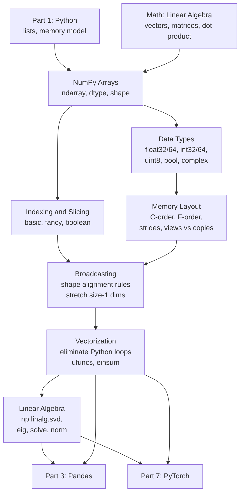
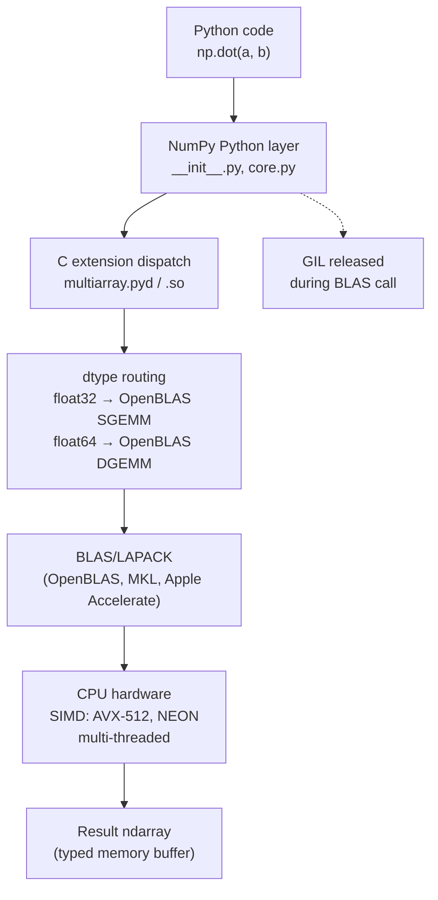

<!-- TEACHING_ORDER: verified -->
# Part 2: NumPy

> **Prerequisites:** [Part 1 — Python Fundamentals](part-01-python-fundamentals.md), basic linear algebra (see [Math for AI/ML](../math/part-01-linear-algebra.md))
> **Used later in:** Every subsequent part — NumPy arrays are the universal data format
> **Version anchor:** NumPy 2.x (mid-2026)

---

## Why This Library Exists

### The problem before NumPy

In the early days of scientific computing with Python, researchers faced a fundamental contradiction. Python was elegant and productive. But numerical computation with Python lists was devastatingly slow.

Here is the problem. A Python list is a list of pointers to Python objects. Each object has a type tag, a reference count, and the actual value. When you add two lists element-by-element:

```python
result = [a[i] + b[i] for i in range(n)]
```

Python has to:
1. Execute a Python bytecode for the loop counter
2. Fetch a pointer from list `a`
3. Dereference the pointer to get a Python int object
4. Fetch a pointer from list `b`
5. Dereference it
6. Call Python's `__add__` method on the int
7. Allocate a new Python int for the result
8. Store a pointer in the result list

For n = 1,000,000, that is approximately 8 million pointer dereferences and 1 million object allocations. On a 2005-era CPU this took several seconds. On C, the same operation took milliseconds.

### Travis Oliphant's solution

Travis Oliphant, a graduate student at Mayo Clinic building medical imaging software, needed fast array math in Python. He inherited a project called Numeric (1995) and a competing project called Numarray, merged and rewrote the best parts of both, and released NumPy 1.0 in 2006.

The key insight: if you store numbers in a **contiguous block of memory** with a **single known type** (all float32, all int64, etc.), you can pass a pointer to that block directly to C code. No pointer chasing, no object overhead, no type checking — just raw memory passed to BLAS (Basic Linear Algebra Subprograms), a battle-hardened Fortran/C library that has been optimizing matrix operations since 1979.

NumPy made Python arrays as fast as C for numerical work while keeping Python's elegance for everything else.

### Why NumPy became the foundation of all ML

By 2010, every scientific Python library spoke NumPy:
- Scipy used NumPy arrays for linear algebra and statistics
- Matplotlib accepted NumPy arrays for plotting
- Scikit-learn (2007) used NumPy arrays for training data

When TensorFlow (2015) and PyTorch (2016) arrived, they adopted NumPy's array semantics and API conventions. PyTorch's `torch.Tensor` is deliberately similar to `np.ndarray`. JAX's arrays are interchangeable with NumPy arrays. When you master NumPy, you have mastered the conceptual foundation of every tensor library that followed.

---

## Explain Like I Am 10

Imagine you have 1,000 temperature readings from a weather station. You want to find the average.

With a Python list, your brain (the Python interpreter) has to go through each number one by one, like reading a handwritten list of numbers and adding them on a calculator — it has to pick up each number, look at it, add it to a running total, set it down, and move to the next.

NumPy is like having a calculator that does not need to look at numbers one by one. Instead, you hand it the entire pile of numbers at once, and it uses a special "high-speed lane" (BLAS library, SIMD instructions) to add them all up simultaneously in hardware. It is not 10% faster — it is often 100 to 1,000 times faster for large arrays.

Here is why it can do this: all the numbers are stored in a row, like library books on a shelf, all the same size. The calculator knows: "go to this shelf, read 1,000 numbers of exactly 4 bytes each." No searching, no checking types, just reading.

The trade-off: every number in a NumPy array must be the same type. You cannot mix integers and text and dates in a single NumPy array. (That is what Pandas DataFrames are for.)

---

## Mental Model

**NumPy is Excel for mathematical arrays — but with millions of rows, instant math, and no formulas.**

More precisely: NumPy is a thin Python wrapper around a block of typed memory, plus an extensive library of C/Fortran functions that operate on that memory without Python overhead.

When you think about a NumPy array, think three things:
1. **A raw memory buffer** — bytes laid out in a specific pattern
2. **Metadata** — shape, dtype, strides that tell NumPy how to interpret the buffer
3. **A library of operations** — add, multiply, reshape, index — that operate on the buffer at C speed

The strides are the key. They describe the step in bytes between consecutive elements along each axis. This is what makes `array.T` free (just swap the strides) and what makes broadcasting possible (set stride to 0 for a dimension that should be "repeated").

---

## Learning Dependency Graph



---

## Core Concepts

### 1. The ndarray: shape, dtype, and strides

A NumPy array has three fundamental properties that you must understand before touching any API:

**Shape:** A tuple of integers giving the size of each dimension. `(3, 4)` means 3 rows, 4 columns. `(batch, seq_len, hidden)` means a 3D tensor for sequences.

**Dtype:** The data type of every element. NumPy has rich dtype support:

| Dtype | Size | Use case |
|---|---|---|
| `float64` | 8 bytes | Default, high precision |
| `float32` | 4 bytes | ML training (GPU-native) |
| `float16` | 2 bytes | Mixed precision inference |
| `bfloat16` | 2 bytes | LLM training (better range) |
| `int64` | 8 bytes | Indices, counts |
| `int32` | 4 bytes | Smaller indices |
| `uint8` | 1 byte | Image pixels (0–255) |
| `bool` | 1 byte | Masks, conditions |

**Why dtype matters for ML:** Training a neural network in float64 uses twice the GPU memory of float32 with negligible precision benefit. Most modern LLM training uses bfloat16 (bf16) because it has the same exponent range as float32 but half the memory. Mismatching dtypes between your data and your model's expected dtype is the #1 cause of silent precision loss bugs.

**Strides:** The number of bytes to step in each dimension to move to the next element. For a `(3, 4)` float32 array:
- Row stride = 4 × 4 = 16 bytes (step over 4 float32s to reach next row)
- Column stride = 4 bytes (step over 1 float32 to reach next column)

Strides enable:
- **Transposition in O(1):** Swap strides without copying memory
- **Broadcasting:** Set stride to 0 for "virtual" dimensions
- **Sliding windows:** `as_strided` creates overlapping views with custom strides

### 2. Broadcasting: the superpower of NumPy

Broadcasting is the set of rules that allow NumPy to combine arrays with different (but compatible) shapes without explicitly copying data.

**The rules (aligned from the right):**

```
Array A: shape (32, 128)
Array B: shape      (128,)

Align from right:
  A: 32 × 128
  B:  1 × 128  ← NumPy prepends 1s to match ndim
  B is "stretched" (broadcast) along axis 0 to match A
  Result: 32 × 128
```

```
A: (32, 1, 64)    B: (1, 10, 64)
→ result: (32, 10, 64)   each size-1 dim stretches to match
```

**Incompatible:**
```
A: (32, 128)    B: (32, 127)
→ ERROR: 128 ≠ 127 and neither is 1
```

Broadcasting never copies data — it virtually repeats the values using stride tricks. This is why `(a - a.mean(axis=0)) / a.std(axis=0)` works instantly even for arrays with millions of rows.

### 3. Views vs copies

This is one of the most important distinctions in NumPy, because it determines whether modifying an array modifies the original.

**Returns a view (same memory):**
- Basic slicing: `a[2:5]`, `a[::2]`, `a[:, 0]`
- Transpose: `a.T`
- Reshape (when possible): `a.reshape(new_shape)`
- `np.broadcast_to(a, shape)` — read-only view

**Returns a copy (new memory):**
- Fancy indexing: `a[[0, 2, 4]]`, `a[bool_mask]`
- `a.copy()`
- `np.concatenate([a, b])`

**How to check:**
```python
b = a[2:5]
b.base is a    # True → b is a view of a
c = a[[0, 2]]
c.base is None  # True → c is independent (owns its data)
```

### 4. Vectorization: replacing Python loops

The cardinal rule of NumPy: **if you have a Python for loop over array elements, you are doing it wrong.** Every Python loop has overhead; NumPy operations avoid loops by executing in C.

| Pattern | Python loop speed | NumPy speed | Typical speedup |
|---|---|---|---|
| Element-wise addition | 50ms/million | 0.5ms/million | ~100x |
| Matrix multiply | 10s (1000×1000) | 2ms | ~5000x |
| Boolean masking | 30ms/million | 0.3ms/million | ~100x |

The tool for the most complex vectorized operations is `np.einsum` — Einstein summation notation that expresses any tensor contraction in one string.

### 5. Memory layout and contiguity

**C-contiguous (row-major):** Default in NumPy. Last axis varies fastest. Iterating over rows is fast; iterating over columns is slow (cache-unfriendly).

**Fortran-contiguous (column-major):** First axis varies fastest. Some linear algebra operations (LAPACK) prefer this layout.

**Why this matters:** PyTorch requires C-contiguous tensors for most operations. When you transpose a NumPy array, the result is not C-contiguous. Passing it to a C extension may fail or require an explicit `np.ascontiguousarray(a.T)`.

---

## Internal Architecture



### What happens when you call `np.dot(a, b)`

1. Python calls `np.dot.__call__(a, b)` — Python overhead
2. C dispatch in `multiarray.pyd` checks dtypes and shape compatibility
3. Routes to the appropriate BLAS function: `sgemm` for float32, `dgemm` for float64
4. BLAS executes on the raw memory buffers, releasing the GIL
5. Returns a new Python ndarray wrapping the result buffer

### Memory layout of an ndarray

```
struct PyArrayObject {
    PyObject_HEAD           // 16 bytes: refcount + type pointer
    char *data;             // pointer to the first element of the array
    int nd;                 // number of dimensions
    npy_intp *dimensions;   // array of n dimension sizes
    npy_intp *strides;      // array of n strides (bytes per step)
    PyObject *base;         // object owning the memory (or NULL if owns it)
    PyArray_Descr *descr;   // dtype descriptor
    int flags;              // C_CONTIGUOUS, F_CONTIGUOUS, WRITEABLE, etc.
}
```

The `data` pointer + `strides` + `dimensions` are sufficient to compute any element's address:

```
address of a[i, j] = data + i * strides[0] + j * strides[1]
```

This is why transposing (swapping strides[0] and strides[1]) is free — the same data, different addressing arithmetic.

---

## Essential APIs

### Array creation

| API | When to use | Notes |
|---|---|---|
| `np.array(data, dtype=)` | Convert from Python list/nested list | Copies data by default |
| `np.zeros(shape, dtype=)` | Initialize to zero | Common before filling |
| `np.ones(shape, dtype=)` | Initialize to one | Bias initialization |
| `np.eye(n)` | Identity matrix | `np.eye(n, k=1)` for off-diagonal |
| `np.arange(start, stop, step)` | Integer/float range | Like `range()` but returns array |
| `np.linspace(start, stop, num)` | Evenly spaced values | Includes `stop` |
| `np.empty(shape, dtype=)` | Uninitialized (fastest) | Only when you'll fill every element |
| `np.random.default_rng(seed)` | New-style RNG | Always prefer over `np.random.*` global |

**Never use `np.random.seed(42)`** in production — it sets global state and is not thread-safe. Use `rng = np.random.default_rng(42)` and pass the RNG explicitly.

### Inspection

```python
a = np.random.default_rng(0).standard_normal((32, 128))
a.shape    # (32, 128)
a.dtype    # float64
a.ndim     # 2
a.size     # 4096 (total elements)
a.nbytes   # 32768 (bytes)
a.strides  # (1024, 8) — step 1024 bytes for next row, 8 for next column
a.flags    # C_CONTIGUOUS: True / F_CONTIGUOUS: False / WRITEABLE: True
```

### Indexing

```python
a = np.arange(20).reshape(4, 5)
# array([[ 0,  1,  2,  3,  4],
#        [ 5,  6,  7,  8,  9],
#        [10, 11, 12, 13, 14],
#        [15, 16, 17, 18, 19]])

# Basic slicing (returns view)
a[1:3]           # rows 1 and 2: shape (2, 5)
a[:, 2]          # column 2: shape (4,)
a[::2, ::2]      # every other row and column

# Fancy indexing (returns copy)
a[[0, 2]]        # rows 0 and 2: shape (2, 5)
a[np.array([0, 2]), np.array([1, 3])]  # elements (0,1) and (2,3)

# Boolean indexing (returns copy)
a[a > 10]        # all elements greater than 10 (flat array)
a[a % 2 == 0]    # all even elements

# np.where: vectorized conditional
np.where(a > 10, a, 0)  # keep values >10, zero others
```

### Shape manipulation

```python
a = np.arange(24)
a.reshape(2, 3, 4)   # view if possible
a.reshape(-1, 4)     # -1 = infer this dimension (24 → 6×4)
a.ravel()            # flatten to 1D (view if C-contiguous)
a.flatten()          # flatten to 1D (always a copy)
a.T                  # transpose (view — swaps strides)
np.expand_dims(a, 0) # add axis at position 0: (1, 24)
a[None, :]           # same: add axis at front
a[:, np.newaxis]     # add axis at end: (24, 1)
np.squeeze(a.reshape(1, 24, 1))  # remove size-1 axes: (24,)
```

### Mathematical operations

```python
a = np.random.randn(4, 3)
b = np.random.randn(3, 5)

# Matrix multiply (the `@` operator is clearest)
c = a @ b              # (4, 5)
c = np.dot(a, b)       # same
c = np.matmul(a, b)    # same for 2D

# Reductions
a.sum()                # scalar
a.sum(axis=0)          # column sums: shape (3,)
a.sum(axis=1)          # row sums: shape (4,)
a.sum(axis=0, keepdims=True)  # shape (1, 3) — keeps dim for broadcasting

a.mean(), a.std(), a.var()
a.min(), a.max(), a.argmin(), a.argmax()
a.cumsum(axis=0)       # cumulative sum along rows

# Element-wise
np.exp(a), np.log(a), np.sqrt(a)
np.abs(a), np.sign(a)
np.clip(a, -1, 1)      # clamp values to [-1, 1]
```

### Linear algebra (`np.linalg`)

```python
A = np.random.randn(4, 4)

np.linalg.norm(A, ord="fro")     # Frobenius norm
np.linalg.norm(A, axis=-1)       # row norms: shape (4,)
np.linalg.det(A)                 # determinant
np.linalg.inv(A)                 # inverse (use sparingly — use solve instead)
np.linalg.solve(A, b)            # solve Ax=b (faster than inv(A) @ b)
vals, vecs = np.linalg.eig(A)    # eigenvalues and eigenvectors
U, S, Vt = np.linalg.svd(A)      # singular value decomposition
```

### Einstein summation (`np.einsum`)

`einsum` is the Swiss Army knife for tensor operations. Every axis is labeled with a letter; contracting (summing over) an axis means omitting it from the output.

```python
a = np.random.randn(4, 3)
b = np.random.randn(3, 5)

# Matrix multiply
np.einsum("ij,jk->ik", a, b)          # (4, 5) — same as a @ b

# Batched matrix multiply
A = np.random.randn(8, 4, 3)
B = np.random.randn(8, 3, 5)
np.einsum("bij,bjk->bik", A, B)       # (8, 4, 5)

# Outer product
u = np.array([1, 2, 3])
v = np.array([4, 5])
np.einsum("i,j->ij", u, v)            # (3, 2)

# Trace
np.einsum("ii->", A[0])               # scalar

# Dot product per row (batched)
np.einsum("bi,bi->b", a[:4], a[:4])   # (4,) — per-row squared norm
```

### Advanced: memory-mapped arrays

For datasets larger than RAM:

```python
# Write: create or overwrite a memory-mapped file
fp = np.memmap("embeddings.npy", dtype="float32", mode="w+", shape=(1_000_000, 768))
fp[:1000] = np.random.randn(1000, 768).astype("float32")
del fp   # flushes to disk

# Read: zero-copy access — only loads pages you access
mm = np.memmap("embeddings.npy", dtype="float32", mode="r", shape=(1_000_000, 768))
batch = mm[500:510]  # reads only these 10 rows from disk
```

---

## API Learning Roadmap

**Beginner:** `np.array`, `np.zeros/ones`, `np.arange`, `shape/dtype`, basic indexing, `reshape`, `+/-/*`, `sum/mean/max`, `@`

**Intermediate:** Broadcasting, fancy indexing, boolean masks, `np.where`, `np.concatenate/stack`, `np.einsum`, `np.linalg.norm/svd/solve`, `keepdims`, `axis`

**Advanced:** Stride tricks, `np.memmap`, `np.lib.stride_tricks.sliding_window_view`, `np.broadcast_to`, `ascontiguousarray`, view vs copy mechanics, `default_rng`

**Staff-level:** Buffer protocol, `__array_interface__`, DLPack interop, structured dtypes, `numpy.typing` annotations, custom ufuncs

**Production:** Memory layout for C extensions, dtype selection (float32 vs float64 vs float16), avoiding copies in hot paths, profiling with `np.show_config()`

---

## Beginner Examples

### Example 1: Normalize a feature matrix (the foundation of ML preprocessing)

```python
import numpy as np

# Simulate a feature matrix: 100 samples, 5 features
rng = np.random.default_rng(42)
X = rng.uniform(low=0, high=100, size=(100, 5)).astype(np.float32)

# Compute mean and standard deviation for each feature (axis=0)
# axis=0 collapses the rows → result has shape (5,)
mean = X.mean(axis=0)
std  = X.std(axis=0)

print(f"Feature means: {mean.round(1)}")
# e.g., [50.2 49.8 50.1 50.3 49.7]

# Normalize: (X - mean) / std
# Broadcasting: mean has shape (5,), X has shape (100, 5)
# NumPy aligns from right: (5,) broadcasts against (100, 5)
X_norm = (X - mean) / (std + 1e-8)  # +1e-8 prevents division by zero

print(f"Normalized mean: {X_norm.mean(axis=0).round(4)}")  # near 0
print(f"Normalized std:  {X_norm.std(axis=0).round(4)}")   # near 1
# Expected: means ≈ 0.0, stds ≈ 1.0
```

### Example 2: Cosine similarity between word embeddings

```python
import numpy as np

# Simulated word embeddings (normally loaded from a model)
rng = np.random.default_rng(0)
embeddings = rng.standard_normal((5, 64)).astype(np.float32)

# Method 1: explicit loop (SLOW for large n — never do this in production)
def cosine_slow(a, b):
    dot = np.dot(a, b)
    return dot / (np.linalg.norm(a) * np.linalg.norm(b))

# Method 2: vectorized — compute ALL pairwise similarities at once
def cosine_matrix(E):
    """Compute full pairwise cosine similarity matrix."""
    # L2 normalize each row: (n, d) → (n, d)
    norms = np.linalg.norm(E, axis=1, keepdims=True)  # (n, 1)
    E_unit = E / norms                                  # (n, d)
    # (n, d) @ (d, n) → (n, n)
    return E_unit @ E_unit.T

sim_matrix = cosine_matrix(embeddings)
print(f"Similarity matrix shape: {sim_matrix.shape}")   # (5, 5)
print(f"Diagonal (self-similarity): {sim_matrix.diagonal().round(4)}")
# Expected: [1. 1. 1. 1. 1.] — each vector is perfectly similar to itself
```

---

## Intermediate Examples

### Example 3: Batch matrix multiply for attention scores

```python
import numpy as np

# Transformer attention: scaled dot-product
# Q, K, V: (batch, heads, seq_len, head_dim)
batch, heads, seq_len, head_dim = 2, 8, 16, 64

rng = np.random.default_rng(42)
Q = rng.standard_normal((batch, heads, seq_len, head_dim)).astype(np.float32)
K = rng.standard_normal((batch, heads, seq_len, head_dim)).astype(np.float32)
V = rng.standard_normal((batch, heads, seq_len, head_dim)).astype(np.float32)

# Attention scores: Q @ K^T / sqrt(head_dim)
# K transposed: swap last two dims → (batch, heads, head_dim, seq_len)
scores = Q @ K.transpose(0, 1, 3, 2)  # (batch, heads, seq_len, seq_len)
scores = scores / np.sqrt(head_dim)

# Softmax over last axis (numerically stable)
def softmax(x, axis=-1):
    x_max = x.max(axis=axis, keepdims=True)
    e_x = np.exp(x - x_max)
    return e_x / e_x.sum(axis=axis, keepdims=True)

attn_weights = softmax(scores)           # (batch, heads, seq_len, seq_len)

# Weighted sum of values
output = attn_weights @ V               # (batch, heads, seq_len, head_dim)

print(f"Input Q shape:  {Q.shape}")
print(f"Scores shape:   {scores.shape}")
print(f"Attn weights shape: {attn_weights.shape}")
print(f"Output shape:   {output.shape}")
print(f"Attn weights sum (should be 1.0): {attn_weights[0, 0, 0].sum():.4f}")
# Expected: 1.0000
```

### Example 4: Stride tricks for sliding windows (convolution preprocessing)

```python
import numpy as np
from numpy.lib.stride_tricks import sliding_window_view

# Problem: extract overlapping windows from a 1D signal
signal = np.arange(20, dtype=np.float32)  # [0, 1, 2, ..., 19]
window_size = 5

# sliding_window_view creates a VIEW — no data copied
windows = sliding_window_view(signal, window_shape=window_size)
print(f"Signal shape:  {signal.shape}")   # (20,)
print(f"Windows shape: {windows.shape}")  # (16, 5) — 20 - 5 + 1 = 16 windows

# Compute per-window mean (moving average)
moving_avg = windows.mean(axis=-1)
print(f"First 5 moving averages: {moving_avg[:5].round(2)}")
# Expected: [2.0, 3.0, 4.0, 5.0, 6.0]
# (average of [0,1,2,3,4], [1,2,3,4,5], ...)

# 2D sliding windows for images
image = np.random.default_rng(0).integers(0, 255, (8, 8), dtype=np.uint8)
patches = sliding_window_view(image, (3, 3))  # (6, 6, 3, 3) — all 3×3 patches
print(f"Image shape: {image.shape} → Patches shape: {patches.shape}")
```

---

## Advanced Examples

### Example 5: Custom einsum operations used in production LLM code

```python
import numpy as np

# 1. Rotary Position Embedding (RoPE) — used in LLaMA, Mistral
# This operation appears in every modern transformer
def apply_rope(x, cos, sin):
    """Apply rotary position embeddings.
    x: (batch, seq, heads, head_dim)
    cos, sin: (seq, head_dim/2)
    """
    # Split x into two halves along last dim
    x1, x2 = x[..., :x.shape[-1]//2], x[..., x.shape[-1]//2:]
    # Apply rotation using einsum for clarity
    # Equivalent to: x1*cos - x2*sin  and  x1*sin + x2*cos
    rotated_x1 = x1 * cos[None, :, None, :] - x2 * sin[None, :, None, :]
    rotated_x2 = x1 * sin[None, :, None, :] + x2 * cos[None, :, None, :]
    return np.concatenate([rotated_x1, rotated_x2], axis=-1)

batch, seq, heads, d = 2, 16, 8, 64
rng = np.random.default_rng(0)
x = rng.standard_normal((batch, seq, heads, d)).astype(np.float32)

# Compute cos/sin tables
theta = np.arange(d // 2) / (d // 2)
freqs = 1.0 / (10000 ** theta)
t = np.arange(seq)
freqs_table = np.outer(t, freqs)  # (seq, d/2)
cos_table = np.cos(freqs_table).astype(np.float32)
sin_table = np.sin(freqs_table).astype(np.float32)

x_rope = apply_rope(x, cos_table, sin_table)
print(f"RoPE output shape: {x_rope.shape}")   # (2, 16, 8, 64)
print(f"Norms preserved: {np.allclose(np.linalg.norm(x, axis=-1), np.linalg.norm(x_rope, axis=-1), atol=1e-4)}")
# Expected: True — RoPE preserves vector norms

# 2. Efficient batched cosine similarity with einsum
# vs naive: for loop over all pairs
def batched_cosine_sim_fast(A, B):
    """
    A: (m, d), B: (n, d)
    Returns: (m, n) similarity matrix
    Much faster than nested loops for large m, n.
    """
    A_norm = A / (np.linalg.norm(A, axis=1, keepdims=True) + 1e-8)
    B_norm = B / (np.linalg.norm(B, axis=1, keepdims=True) + 1e-8)
    return np.einsum("md,nd->mn", A_norm, B_norm)  # same as A_norm @ B_norm.T

m, n, d = 500, 1000, 768
A = rng.standard_normal((m, d)).astype(np.float32)
B = rng.standard_normal((n, d)).astype(np.float32)
sim = batched_cosine_sim_fast(A, B)
print(f"Similarity matrix: {sim.shape}")   # (500, 1000)
print(f"Value range: [{sim.min():.3f}, {sim.max():.3f}]")  # near [-0.3, 0.3]
```

---

## Internal Interview Knowledge

### What interviewers test

**Broadcasting questions** are the most common NumPy interview topic. Interviewers want to know if you understand the rules — not just that it "works automatically."

**Core test:** "What does `(32, 128) - (128,)` produce and why?"

Strong answer: "The shapes are aligned from the right. `(128,)` is treated as `(1, 128)`. NumPy virtually stretches it to `(32, 128)` by setting the stride for axis 0 to 0. The subtraction runs in C — no actual data is duplicated. Result shape is `(32, 128)`."

**View vs copy** is the second most common topic. Interviewers want to see you caught a real bug.

Strong answer: "Basic slicing returns a view of the same memory. Fancy indexing (integer arrays, boolean masks) always returns a copy. I check with `b.base is a` — if True, it is a view. The bug this catches: `a[::2] = 0` modifies `a` (it is a view), but `a[[0, 2, 4]] = 0` does nothing to `a` (copy was modified). In production I saw a training loop that modified the label array in-place through a slice view and corrupted three batches before we caught it."

**Memory layout questions** appear in ML system design interviews.

Strong answer: "NumPy uses C order (row-major) by default. Transposing swaps strides but does not copy. `a.T` is not C-contiguous. PyTorch's `torch.from_numpy(a.T)` requires a copy or `np.ascontiguousarray(a.T)` first. In practice this matters when you pass NumPy arrays to C extensions that assume row-major layout — which is most of them."

---

## Production AI Usage

**OpenAI:** NumPy is used internally for post-processing logits (applying temperature, sampling), evaluating benchmark results, and preprocessing datasets for fine-tuning. The OpenAI Python SDK returns NumPy arrays for embedding responses.

**Google/DeepMind:** JAX's ndarray is NumPy-compatible. The `jnp` namespace mirrors `np`. Research models are prototyped with NumPy and then migrated to JAX for GPU execution. `jax.numpy.array` is structurally identical to `np.ndarray`.

**Meta (FAIR):** PyTorch was designed to be NumPy-compatible from day one. `torch.from_numpy()` shares memory with a NumPy array. Meta's model evaluation and result analysis pipelines run on NumPy because it integrates naturally with the PyTorch output.

**Netflix:** Their recommendation system computes approximate nearest neighbors using NumPy's matrix operations before calling FAISS. Feature engineering pipelines for their two-tower models use NumPy for batch normalization and whitening.

**Databricks:** MLflow's NumPy flavor serializes NumPy arrays to the model artifact. Spark's `pandas_udf` returns Pandas DataFrames (backed by NumPy arrays) from distributed operations.

**Hugging Face:** The `datasets` library converts Parquet data to NumPy before handing it to tokenizers. Evaluation metrics (BLEU, F1, perplexity) are computed with NumPy.

---

## Common Mistakes

### Beginner mistakes

**Mistake 1: Forgetting that slices are views**
```python
# Bug: modifying a slice modifies the original
batch = X[0:32]
batch -= batch.mean()  # modifies X[0:32] in place!

# Fix: copy explicitly when you want independence
batch = X[0:32].copy()
batch -= batch.mean()  # X unchanged
```

**Mistake 2: Using `np.random.seed()` instead of `default_rng`**
```python
# Old, unsafe: global state, not thread-safe
np.random.seed(42)
a = np.random.randn(100)

# Modern, correct: per-instance RNG with explicit seed
rng = np.random.default_rng(42)
a = rng.standard_normal(100)
```

### Intermediate mistakes

**Mistake 3: Axis direction confusion**
```python
X = np.random.randn(100, 5)  # 100 samples, 5 features

X.mean(axis=0)   # shape (5,) — mean of each feature across samples (CORRECT for normalization)
X.mean(axis=1)   # shape (100,) — mean of each sample across features (WRONG for normalization)
```

**Mistake 4: `np.dot` behavior on 2D vs 1D arrays**
```python
a = np.array([1, 2, 3])
b = np.array([4, 5, 6])

np.dot(a, b)        # 32 — inner product (both 1D)
np.dot(a.reshape(3, 1), b.reshape(1, 3))  # (3, 3) — outer product

# Prefer explicit @, matmul for clarity
```

### Production mistakes

**Mistake 5: Passing non-contiguous arrays to C code**
```python
# After transposing, the array is not C-contiguous
a = np.random.randn(100, 50)
a_T = a.T  # shape (50, 100), NOT C-contiguous

# This may fail or give wrong results with some C extensions
some_c_function(a_T)  # WRONG if it assumes row-major

# Fix: force contiguous copy
some_c_function(np.ascontiguousarray(a_T))
```

**Mistake 6: Integer overflow with uint8**
```python
images = np.array([200, 100, 50], dtype=np.uint8)
result = images + 100   # [44, 200, 150] — 200+100=300 wraps to 44!

# Fix: cast before arithmetic
result = images.astype(np.int32) + 100  # [300, 200, 150]
```

---

## Performance Optimization

### Rule 1: Vectorize everything

Replace every Python loop over array elements with a NumPy vectorized call. If you cannot find a NumPy function, use `np.einsum`.

```python
# Slow: 1 million iterations of Python overhead
def pairwise_dot_slow(A, B):
    n = len(A)
    result = np.zeros(n)
    for i in range(n):
        result[i] = np.dot(A[i], B[i])
    return result

# Fast: single BLAS call, 100x+ speedup
def pairwise_dot_fast(A, B):
    return np.einsum("ij,ij->i", A, B)
```

### Rule 2: Use float32 for ML, not float64

```python
# float64 (default): 8 bytes per element
a64 = np.random.randn(1000, 1000)        # 8 MB

# float32: 4 bytes, same precision for ML
a32 = np.random.randn(1000, 1000).astype(np.float32)  # 4 MB

# On most CPUs and all GPUs, float32 is also faster
import time
t0 = time.perf_counter()
_ = a64 @ a64.T
t1 = time.perf_counter()
_ = a32 @ a32.T
t2 = time.perf_counter()
print(f"float64: {(t1-t0)*1000:.1f}ms  float32: {(t2-t1)*1000:.1f}ms")
# float32 is typically 1.5-2x faster on CPU BLAS
```

### Rule 3: Avoid unnecessary copies

```python
# Unnecessary copy: normalize creates a new array
normalized = (X - X.mean(axis=0)) / X.std(axis=0)  # 3 arrays allocated

# In-place where possible (if you can safely modify X)
X -= X.mean(axis=0)  # modifies X in place
X /= X.std(axis=0)   # modifies X in place — half the memory

# Pre-allocate output for repeated operations
result = np.empty((n,), dtype=np.float32)
for i in range(n):
    np.dot(A[i], B[i], out=result[i:i+1])  # write directly to pre-allocated
```

### Rule 4: Use `np.lib.stride_tricks` for sliding window operations

For time-series and audio preprocessing, `sliding_window_view` creates a zero-copy view of overlapping windows — orders of magnitude faster than explicit loop-based windowing.

---

## Production Failures

### Failure 1: Reproducibility broken by global RNG state

A research team ran a hyperparameter sweep where each job called `np.random.seed(job_id)`. One job crashed and was restarted, but because the RNG state was not reset to the seed before the crash point, the restarted job used a different random sequence and produced different results. The team could not reproduce their best run.

**Root cause:** Global RNG state is not preserved across restarts.

**Fix:** Use `np.random.default_rng(seed)` and pass the RNG explicitly. Save the RNG state to checkpoint: `np.save("rng_state.npy", rng.bit_generator.state)`.

### Failure 2: Silent dtype downcast corrupting training labels

A data pipeline loaded CSV labels as Python strings, converted them to a NumPy `int64` array, and then passed them to a model expecting `int32`. NumPy silently downcast to `int32`. Label values above 2,147,483,647 (rare but possible in production hash IDs) wrapped to negative values, causing the model to train with corrupted labels for three hours before the loss curve looked wrong.

**Fix:** Always check dtype after conversion. Add an assertion: `assert labels.dtype == np.int64, f"Got {labels.dtype}"`.

---

## Best Practices

1. **Always specify dtype when creating arrays for ML:** `np.zeros(shape, dtype=np.float32)`. The default float64 uses double the memory.
2. **Use `np.random.default_rng(seed)` always.** Never `np.random.seed()`.
3. **Check shape and dtype after every data loading step.** `assert X.shape == (n, features), f"Got {X.shape}"`.
4. **Prefer `@` over `np.dot` for matrix multiply** — clearer intent, same performance.
5. **Profile before optimizing.** `%timeit` in Jupyter, `cProfile` in scripts.
6. **Know your cache hierarchy.** Operations on arrays that fit in L2/L3 cache are dramatically faster. For a modern CPU, L3 cache is typically 8–32 MB.
7. **Use `np.einsum` for complex tensor operations** — it is cleaner and often faster than explicit transposes and matmuls.

---

## Library Relationships

### NumPy vs Python lists

| Dimension | Python list | NumPy ndarray |
|---|---|---|
| Memory per element | ~28 bytes (int object + pointer) | 4 bytes (float32) |
| Math performance | O(n) Python loop | O(n) C/BLAS |
| Element types | Mixed | Homogeneous |
| Broadcasting | Manual | Automatic |
| Use when | Small, mixed-type data | Numerical computation |

### NumPy vs PyTorch Tensors

| Dimension | NumPy ndarray | PyTorch Tensor |
|---|---|---|
| Hardware | CPU only | CPU + GPU + MPS |
| Autograd | No | Yes (gradient tracking) |
| API similarity | Base | 95% compatible |
| Deployment | Anywhere Python runs | Needs PyTorch runtime |
| Use when | Preprocessing, evaluation | Training, inference |

NumPy arrays and PyTorch tensors can share memory:
```python
import torch, numpy as np
a = np.array([1., 2., 3.])
t = torch.from_numpy(a)   # zero copy — shares memory
t[0] = 99.0
print(a[0])  # 99.0 — both modified
```

### NumPy vs JAX

JAX is "NumPy on XLA" — its API is a nearly exact superset of NumPy's. The difference: JAX arrays are immutable and functional transformations (`jit`, `vmap`, `grad`) enable compilation and auto-differentiation. NumPy is the prototyping language; JAX is the accelerated version.

### NumPy vs Pandas

NumPy handles homogeneous numerical arrays. Pandas handles heterogeneous tabular data (columns can have different types). Pandas DataFrames are backed by NumPy arrays (or Arrow arrays in Pandas 2.x). For pure numerical work, NumPy is faster; for tabular data manipulation, Pandas is the right tool.

---

## Role-Based Usage

| Role | Primary NumPy use |
|---|---|
| Data Scientist | Normalization, statistics, feature engineering |
| ML Engineer | Batch preprocessing, metric computation, data loading |
| LLM Engineer | Tokenizer post-processing, logit manipulation, evaluation |
| AI Engineer | Embedding operations, similarity computation, KNN |
| MLOps Engineer | Monitoring metrics, dataset statistics, drift detection |
| Research Scientist | Custom loss functions, experimental metrics, data analysis |

---

## Cheat Sheet

```python
import numpy as np

# ── Create ────────────────────────────────────────────────────
rng  = np.random.default_rng(42)          # reproducible RNG
a    = np.array([[1,2],[3,4]], dtype=np.float32)
z    = np.zeros((3, 4), dtype=np.float32)
ones = np.ones(10)
eyes = np.eye(4)
r    = rng.standard_normal((100, 10))

# ── Inspect ───────────────────────────────────────────────────
a.shape, a.dtype, a.ndim, a.size, a.nbytes, a.strides

# ── Index ─────────────────────────────────────────────────────
a[1:3]            # rows 1–2 (view)
a[:, 0]           # first column (view)
a[[0, 2]]         # fancy: rows 0 & 2 (copy)
a[a > 0]          # boolean mask (copy)
np.where(a > 0, a, 0)  # conditional select

# ── Shape ─────────────────────────────────────────────────────
a.reshape(2, -1)  # -1 = infer
a.T               # transpose (view)
a[None, :]        # add axis 0
np.squeeze(a)     # remove size-1 axes
np.concatenate([a, b], axis=0)
np.stack([a, b], axis=0)  # new axis

# ── Math ──────────────────────────────────────────────────────
a @ b             # matrix multiply
np.einsum("ij,jk->ik", a, b)  # flexible contraction
a.sum(axis=0, keepdims=True)  # keep dim for broadcasting
np.linalg.norm(a, axis=-1, keepdims=True)
U, S, Vt = np.linalg.svd(a)

# ── Memory ────────────────────────────────────────────────────
b = a[::2]        # view — b.base is a → True
c = a[[0, 2]]     # copy — c.base is None → True
np.ascontiguousarray(a.T)  # force C-order copy
```

---

## Flash Cards

**Q:** What are NumPy broadcasting rules?
**A:** Shapes are aligned from the right. Dimensions of size 1 are stretched to match. Shapes that are neither 1 nor equal raise a ValueError.

**Q:** When does NumPy return a view vs a copy?
**A:** View: basic slicing, transpose, reshape (when possible). Copy: fancy indexing (integer/boolean arrays), `array.copy()`, `np.concatenate`.

**Q:** Why use float32 instead of float64 for ML?
**A:** Float32 uses half the memory (4 vs 8 bytes), matches GPU-native precision, and is supported by BLAS SGEMM which is faster than DGEMM on most hardware. ML models tolerate 32-bit precision. Float16/bfloat16 for even more memory savings with mixed-precision training.

**Q:** What is `np.einsum("ij,jk->ik", a, b)` doing?
**A:** Matrix multiply. The `j` index appears in both inputs but not the output — it is summed over (contracted). This is exactly `a @ b`. Einsum handles any tensor contraction with this notation.

**Q:** How does `a.T` avoid copying data?
**A:** Transposing swaps the strides. A C-contiguous `(m, n)` array has strides `(n*itemsize, itemsize)`. After `.T`, shape is `(n, m)` and strides are `(itemsize, n*itemsize)`. Same data buffer, different stepping pattern.

**Q:** What happens when you call `np.dot(a, b)` on 1D arrays?
**A:** Returns the inner product (a scalar). For 2D it is matrix multiply. Use `@` instead for clarity — it always means matrix multiply.

---

## Revision Notes

**The one thing to internalize before the interview:** NumPy is fast because it stores homogeneous data in a contiguous C memory buffer and calls BLAS — not because Python is fast. Python is just the conductor.

**Most common interview trap:** `arr.T` is not C-contiguous. Passing it to PyTorch's `from_numpy()` may silently copy. Always call `np.ascontiguousarray()` when passing transposed arrays to C code.

**Key numbers:**
- float64: 8 bytes | float32: 4 bytes | float16/bfloat16: 2 bytes
- NumPy array overhead: ~96 bytes (the wrapper object)
- `np.memmap` for arrays that do not fit in RAM

**Broadcasting in one sentence:** "Align shapes from the right; any dimension that is 1 gets stretched to match the other. If neither is 1 and they differ, it fails."

---

## Interview Question Bank

### Top 25 Beginner Questions

**Q1. What is a NumPy array and how is it different from a Python list?**
A: A NumPy array is a contiguous block of typed memory with a fixed dtype. All elements have the same type, stored without Python object overhead. This enables C-speed operations via BLAS. A Python list is a list of pointers to Python objects — flexible but 7–10x more memory and 100–1000x slower for numerical operations.

**Q2. What is the `shape` attribute of an array?**
A: A tuple of integers, one per dimension, giving the size of each axis. `(32, 128)` means 32 rows and 128 columns. For a batch of sequences, `(batch, seq_len, hidden_dim)` is a 3D shape. `len(a.shape)` equals `a.ndim`.

**Q3. What is `dtype` and why does it matter?**
A: The data type of every element. Common types: `float32` (4 bytes, standard for ML), `float64` (8 bytes, default), `int64` (indices), `uint8` (image pixels). Mismatched dtypes cause implicit conversions that slow down code or cause silent precision loss.

**Q4. How do you create an array of zeros with shape (3, 4)?**
A: `np.zeros((3, 4), dtype=np.float32)`. Always specify dtype for ML — the default float64 uses twice the memory. `np.zeros_like(existing_array)` creates a zero array with the same shape and dtype as an existing array.

**Q5. What does `np.arange(0, 10, 2)` produce?**
A: `array([0, 2, 4, 6, 8])` — integers from 0 up to (not including) 10 in steps of 2. Similar to Python's `range()` but returns a NumPy array. For float ranges, prefer `np.linspace(0, 1, 11)` (11 evenly spaced values from 0 to 1 inclusive).

**Q6. How do you reshape an array?**
A: `a.reshape(new_shape)`. The total number of elements must stay the same. `-1` as a dimension means "infer this size": `a.reshape(-1, 4)` for an array of 24 elements gives shape `(6, 4)`. Reshape returns a view when possible.

**Q7. What does `axis=0` mean in `a.sum(axis=0)`?**
A: "Collapse axis 0 (rows)." For a `(100, 5)` array, `sum(axis=0)` sums across the 100 rows, returning shape `(5,)` — one sum per column/feature. `axis=1` sums across columns, returning `(100,)`.

**Q8. What is `np.concatenate` vs `np.stack`?**
A: `concatenate` joins arrays along an existing axis — shapes must match in all other dimensions. `stack` creates a new axis and joins along it. `np.stack([a, b], axis=0)` where `a` and `b` have shape `(4,)` gives `(2, 4)`. `np.concatenate([a, b], axis=0)` gives `(8,)`.

**Q9. How do you select all rows where a column value is greater than 5?**
A: Boolean indexing: `mask = a[:, col] > 5; subset = a[mask]`. Returns a copy of the matching rows.

**Q10. How do you compute the mean and standard deviation of each column?**
A: `mean = a.mean(axis=0); std = a.std(axis=0)`. Both return arrays of shape `(num_cols,)`. Add `keepdims=True` if you need the result to broadcast back against `a`.

**Q11. What is the `@` operator for arrays?**
A: Matrix multiply. `a @ b` is the same as `np.matmul(a, b)`. For 1D inputs it computes the inner product. For 2D it is standard matrix multiplication. Prefer `@` over `np.dot` for clarity.

**Q12. How do you find the index of the maximum value in an array?**
A: `np.argmax(a)` returns the flat index of the maximum. `np.argmax(a, axis=0)` returns the row index of the maximum per column. `np.argmin` is the same for minimum.

**Q13. How do you create a random array with a fixed seed?**
A: Use the new-style API: `rng = np.random.default_rng(42); a = rng.standard_normal((100,))`. Never use `np.random.seed(42)` in production — it sets global state that is not thread-safe.

**Q14. What is the difference between `np.sqrt(a)` and `a ** 0.5`?**
A: Both compute element-wise square root. `np.sqrt` is implemented as a ufunc with better handling of edge cases (negative inputs return NaN with a warning). `** 0.5` is equivalent but slightly less explicit. Prefer `np.sqrt`.

**Q15. How do you transpose a 2D array?**
A: `a.T` or `np.transpose(a)`. Returns a view — no data is copied. For 3D+ arrays, `np.transpose(a, axes=(0, 2, 1))` specifies which axes to swap.

**Q16. How do you clip array values to a range?**
A: `np.clip(a, a_min=-1.0, a_max=1.0)`. Values below -1 become -1; values above 1 become 1. Common in gradient clipping during training.

**Q17. What does `np.where(condition, x, y)` return?**
A: An array where `condition` is True the value comes from `x`, otherwise from `y`. All three arguments broadcast against each other. Example: `np.where(scores > 0.5, 1, 0)` thresholds a probability array to binary predictions.

**Q18. How do you sort an array along an axis?**
A: `np.sort(a, axis=-1)` returns a sorted copy. `np.argsort(a, axis=-1)` returns the indices that would sort the array — useful for ranking predictions. `np.partition(a, k)` is faster when you only need the k-th element.

**Q19. What is `np.unique`?**
A: Returns the sorted unique elements. `np.unique(a, return_counts=True)` also returns the count of each unique value. Common for computing class distributions in a label array.

**Q20. How do you save and load a NumPy array?**
A: `np.save("file.npy", a)` saves a single array. `np.load("file.npy")` loads it. `np.savez("file.npz", a=arr1, b=arr2)` saves multiple arrays in one compressed file. `np.savetxt`/`np.loadtxt` for human-readable CSV format.

**Q21. What is `np.eye` used for?**
A: Creates an identity matrix: `np.eye(n)` gives a `(n, n)` float64 array with 1s on the diagonal and 0s elsewhere. `np.eye(m, n)` for non-square. Common for weight initialization (e.g., orthogonal init fallback) and attention bias masks.

**Q22. What is `np.linspace` and when is it preferred over `np.arange`?**
A: `np.linspace(start, stop, num)` returns `num` evenly spaced values including both endpoints. Preferred over `arange` for float ranges because floating-point step errors in `arange` can produce unexpected numbers of elements. `linspace(0, 1, 11)` reliably gives exactly 11 points.

**Q23. How do you compute element-wise product vs matrix product?**
A: `a * b` (or `np.multiply(a, b)`) is element-wise — shapes must broadcast. `a @ b` (or `np.matmul`) is matrix multiplication. A common bug: using `*` when you mean `@` for matrix multiply.

**Q24. What is `np.abs` and when would you use it in ML?**
A: Element-wise absolute value. Common in L1 loss: `np.abs(predictions - targets).mean()`. Also in gradient clipping: `grads[np.abs(grads) > clip_val] = clip_val * np.sign(grads[np.abs(grads) > clip_val])`.

**Q25. How do you count the number of elements satisfying a condition?**
A: `(a > 0).sum()` — boolean arrays count as 0s and 1s. Alternatively `np.count_nonzero(a > 0)`. For multiple conditions: `((a > 0) & (a < 1)).sum()`.

---

### Top 25 Intermediate Questions

**Q1. Explain NumPy broadcasting with an example from ML preprocessing.**
A: Broadcasting combines arrays with compatible shapes without copying data. For batch normalization: `X` is `(32, 128)`, `mean` is `(128,)`. NumPy treats mean as `(1, 128)` and stretches it to `(32, 128)` by setting stride to 0. `(X - mean) / std` runs in a single C operation with no intermediate array allocation. Rule: align shapes from right; size-1 dims stretch; mismatched non-1 dims error.

**Q2. What is the difference between a view and a copy in NumPy?**
A: A view shares the same memory buffer as the original — modifying the view modifies the original. Basic slicing always returns views; fancy indexing (integer arrays, boolean masks) always returns copies. Check: `b.base is a` is True for views. Bug scenario: `batch = X[0:32]; batch -= batch.mean()` modifies `X[0:32]` in place.

**Q3. What are strides and how does `array.T` avoid copying?**
A: Strides are the number of bytes to step along each axis. For a C-contiguous `(m, n)` float32 array, strides are `(n*4, 4)`. Transposing swaps the strides to `(4, n*4)` — same memory buffer, different addressing. Address of `a[i,j] = data + i*strides[0] + j*strides[1]`.

**Q4. When does `np.einsum` beat explicit `@` and `np.sum`?**
A: When the operation combines multiple contractions that would require multiple intermediate arrays. `np.einsum("bhqd,bhkd->bhqk", Q, K)` is cleaner than `(Q * K.transpose(0,1,3,2)).sum(-1)` and may be faster by avoiding the intermediate `(Q * ...)` array. Also for outer products, traces, and contractions over non-last axes.

**Q5. What is `keepdims=True` and when is it necessary?**
A: Keeps the reduced dimension as a size-1 axis, enabling broadcasting back to the original shape. `X.mean(axis=0).shape` is `(128,)`. `X.mean(axis=0, keepdims=True).shape` is `(1, 128)`. Necessary for: `X / X.max(axis=-1, keepdims=True)` to normalize each row — without `keepdims`, shapes `(n,)` and `(n, d)` cannot broadcast correctly.

**Q6. Explain the difference between `np.copy`, `arr.copy()`, and `copy.deepcopy(arr)`.**
A: `np.copy(arr)` and `arr.copy()` are equivalent — both create a new array with a copy of the data, same dtype and C-contiguous order by default. `copy.deepcopy(arr)` is slower (goes through Python's generic copy machinery) and should not be used for arrays; it may not preserve memory layout. Use `.copy()`.

**Q7. How does fancy indexing work? What is its performance cost?**
A: Fancy indexing uses an array of indices (integer or boolean) to select elements. `a[[0, 5, 10]]` gathers rows 0, 5, and 10. It always returns a copy (data is gathered from potentially non-contiguous locations), which is why it is slower than basic slicing. For large arrays, fancy indexing can be 5–20x slower than a slice.

**Q8. What is `np.lib.stride_tricks.sliding_window_view` and how does it avoid copies?**
A: Creates a view that exposes overlapping windows of the input using stride manipulation. For a 1D array of length n with window size w, returns a `(n-w+1, w)` view. Zero data is copied — each window element addresses the original data with the appropriate stride offset. Used for 1D convolution preprocessing and time-series feature extraction.

**Q9. What is `np.linalg.solve(A, b)` and why is it preferred over `np.linalg.inv(A) @ b`?**
A: Solves the linear system Ax=b using LU decomposition, which is more numerically stable and faster than explicitly computing A⁻¹. Computing the inverse requires twice as many floating-point operations and accumulates more rounding error. Never invert a matrix just to multiply it — always use `solve`.

**Q10. What is `np.einsum`'s `optimize` argument?**
A: `np.einsum("ij,jk,kl->il", A, B, C, optimize=True)` uses a greedy algorithm to find the optimal contraction order, which can be dramatically faster for multi-argument einsum (avoids creating an intermediate `(i, j, k, l)` tensor). For pairwise: `optimize=True` has no effect. For 3+ tensors, always set it.

**Q11. Explain `np.memmap` and when to use it.**
A: `np.memmap` creates a memory-mapped file array — the OS maps pages of the file into virtual memory, loading only the pages you actually access. For a 100 GB embedding matrix, `memmap` lets you access any subset without loading the full matrix. Writes are lazily flushed to disk. Used for datasets larger than RAM.

**Q12. What is structured dtypes in NumPy and when are they useful?**
A: A compound dtype: `np.dtype([('x', np.float32), ('y', np.float32), ('label', np.int32)])`. Stores heterogeneous fields in a single array with per-field access: `arr['label']`. Used for compact binary data interchange (HDF5, custom binary formats). Less common with Pandas/Polars available, but useful for low-level binary parsing.

**Q13. What is `np.broadcast_to` and when should you use it?**
A: Creates a read-only view of an array broadcast to a larger shape without copying data. Use when you need to pass a broadcast result to a function that requires a fully-shaped array. Example: `np.broadcast_to(bias, (batch_size, num_features))` — same bias vector repeated virtually `batch_size` times. Attempting to write to it raises an error.

**Q14. How do you compute the SVD and what is it used for in ML?**
A: `U, S, Vt = np.linalg.svd(A, full_matrices=False)` — compact SVD. `U` has orthonormal columns, `S` is singular values, `Vt` has orthonormal rows, and `A ≈ U * S * Vt`. Used in: PCA (SVD of centered data), dimensionality reduction, low-rank approximation (`U[:,:k] * S[:k]`), and gradient analysis for deep networks.

**Q15. What is `np.ascontiguousarray` and when is it required?**
A: Forces a C-contiguous copy of an array. Required when: passing a transposed or non-standard-stride array to (1) PyTorch's `from_numpy`, (2) C extensions that assume row-major layout, (3) some BLAS routines. `a.T` is not C-contiguous; `np.ascontiguousarray(a.T)` makes a contiguous copy.

**Q16. Explain the difference between `np.dot`, `np.matmul`, and `@`.**
A: For 2D arrays, all three are identical. Differences: `np.dot` on 1D inputs returns the scalar inner product; `np.matmul` on 1D raises an error. `np.matmul`/`@` support broadcasting over batch dimensions (e.g., `(B, m, k) @ (B, k, n)`); `np.dot` does not. Best practice: always use `@`.

**Q17. What is the effect of `out=` parameter in NumPy operations?**
A: Writes the result directly into a pre-allocated array, avoiding a temporary allocation. `np.add(a, b, out=c)` writes a+b into `c`. Useful in hot loops: pre-allocate `result = np.empty_like(a)` outside the loop, then `np.multiply(a, b, out=result)` inside. Saves one allocation per loop iteration.

**Q18. What is `np.einsum("ii->", A)` computing?**
A: The trace of matrix `A` — the sum of diagonal elements. The `i` index appears twice in the input and not at all in the output, so it is summed over, and only diagonal elements (where both indices are `i`) contribute.

**Q19. How do you efficiently compute pairwise squared Euclidean distances?**
A: `||a - b||² = ||a||² + ||b||² - 2a·b`. Vectorized: `sq_dists = np.sum(A**2, axis=1, keepdims=True) + np.sum(B**2, axis=1) - 2 * (A @ B.T)`. This computes all `(n, m)` pairwise distances with one matrix multiply instead of `n*m` individual operations.

**Q20. What is `np.pad` and where is it used in ML?**
A: Pads an array with values (zeros, edge-replication, or reflection) along specified axes. Used for: (1) padding sequences to a fixed length for batching, (2) padding images for convolution ("same" padding), (3) padding KV caches for attention.

**Q21. What are ufuncs and how do they relate to performance?**
A: Universal functions — NumPy functions that operate element-wise on arrays. `np.sin`, `np.exp`, `np.add` are ufuncs. They loop in C, release the GIL, and support broadcasting automatically. Key methods: `accumulate` (cumulative), `reduce` (like sum), `outer` (outer product). `np.frompyfunc` wraps Python functions as ufuncs (but loses C-speed).

**Q22. How does NumPy handle NaN and Inf values?**
A: IEEE 754 float semantics: `nan != nan` is True, `nan > 5` is False, `nan + x = nan`. `np.isnan(a)`, `np.isinf(a)` for detection. `np.nanmean`, `np.nansum` ignore NaN. Key bug: mean of an array with NaN is NaN — always check with `np.any(np.isnan(a))` before statistics.

**Q23. What is `np.argpartition` and when is it faster than full sort?**
A: Partially sorts an array so that the k-th element is in the position it would be if the array were fully sorted, with all elements before it smaller and all after larger. `np.argpartition(a, k)[:k]` returns the indices of the k smallest elements in O(n) rather than O(n log n). Critical for top-k retrieval in recommendation systems.

**Q24. What happens when you multiply a (3, 4) array by a (4,) array?**
A: Broadcasting: `(4,)` is treated as `(1, 4)`, stretched to `(3, 4)`. Each row of the `(3, 4)` array is multiplied element-wise by the `(4,)` vector. Result shape: `(3, 4)`. This is how you apply per-feature scaling: `X * scale` where `scale` is a `(num_features,)` array.

**Q25. How do you check if two arrays are approximately equal?**
A: `np.allclose(a, b, rtol=1e-5, atol=1e-8)` — returns True if `|a - b| <= atol + rtol * |b|` element-wise. `np.testing.assert_allclose(a, b, rtol=1e-4)` raises if they differ (for tests). Never use `a == b` for floats — floating-point operations are rarely exactly equal.

---

### Top 25 Advanced Questions

**Q1. Explain NumPy's memory layout in detail. How do strides enable zero-copy operations?**
A: An ndarray stores: a `data` pointer to the first byte, a `strides` tuple (bytes per step per axis), `shape`, and `dtype.itemsize`. Element `a[i, j]` is at `data + i * strides[0] + j * strides[1]`. Transposing swaps strides without touching data. Broadcasting sets stride to 0 for virtual repetition — the same memory location is "read" multiple times. This makes reshape, transpose, and broadcast views truly O(1) in both time and memory.

**Q2. What is the buffer protocol and how does NumPy participate in it?**
A: The buffer protocol (PEP 3118) defines a C-level interface for objects to expose a contiguous memory region. Any object implementing `__buffer__` (C: `PyBUF_*` flags) can be read by `memoryview`. NumPy's ndarray is a buffer provider. `np.frombuffer(b"...", dtype=np.float32)` creates an array from any buffer. This enables zero-copy between NumPy, PIL Images, PyTorch (via DLPack), and CUDA (via cupy).

**Q3. What is DLPack and how does it enable GPU tensor interoperability?**
A: DLPack is an open data structure providing a standardized way to share tensor memory between frameworks without copying. `torch.utils.dlpack.to_dlpack(t)` → `np.from_dlpack(...)` shares CUDA memory between PyTorch and CuPy without a device→host→device round trip. The key advantage: all involved frameworks must support DLPack, but then inter-framework GPU operations have zero copy overhead.

**Q4. How does NumPy's FFT work, and where is it used in ML?**
A: `np.fft.fft(x)` implements the Cooley-Tukey FFT algorithm in O(n log n). Used in ML for: (1) audio preprocessing (STFT for speech models), (2) FNet's Fourier mixing layers that replace attention with FFT, (3) frequency-domain convolution for efficiency (convolution theorem: convolution in time = multiplication in frequency).

**Q5. What is `np.lib.stride_tricks.as_strided` and what are its dangers?**
A: Creates an array with custom strides and shape, allowing completely arbitrary memory views — including overlapping or out-of-bounds accesses. Used for sliding windows before `sliding_window_view` was added. Dangers: incorrect strides cause memory corruption, out-of-bounds reads, or exposing garbage memory. Always compute strides carefully and use `sliding_window_view` when possible.

**Q6. Explain the difference between `np.copy(a, order='C')` and `np.ascontiguousarray(a)`.**
A: `np.copy(a, order='C')` always copies. `np.ascontiguousarray(a)` returns `a` unchanged if already C-contiguous, otherwise copies. In hot paths where arrays are usually contiguous, `ascontiguousarray` avoids unnecessary copies.

**Q7. How does NumPy's random number generation work at the algorithmic level?**
A: `np.random.default_rng` uses PCG64 (Permuted Congruential Generator) which produces high-quality pseudorandom bits with excellent statistical properties. The state is 128 bits. It is not cryptographically secure — use `secrets` for that. Previous Mersenne Twister (`np.random.MT19937`) is still available but PCG64 is preferred for its better statistical properties and smaller state.

**Q8. What is the `numpy.typing` module?**
A: Provides type aliases for NumPy arrays: `npt.NDArray[np.float32]`, `npt.ArrayLike` (anything convertible to an array). Used with mypy/pyright for static type checking of NumPy-heavy codebases. Does not add runtime overhead — annotations only.

**Q9. How does NumPy handle BLAS/LAPACK configuration? How do you check which is being used?**
A: `np.show_config()` prints the BLAS/LAPACK configuration. Common options: OpenBLAS (default for pip installs), Intel MKL (Anaconda, better for Intel CPUs), Apple Accelerate (macOS arm64). MKL is often 20–50% faster than OpenBLAS on Intel hardware for large matrix operations.

**Q10. What is `np.vectorize` and why is it slow?**
A: `np.vectorize` applies a Python scalar function element-wise to an array, broadcasting inputs. It is implemented as a Python loop — it does not compile or accelerate the function. Its speed is comparable to an explicit for loop, not BLAS. Use it for convenience when correctness matters more than speed, or use `numba.vectorize` for JIT-compiled element-wise functions.

**Q11. Explain the relationship between NumPy and BLAS threading.**
A: OpenBLAS and MKL use multi-threading internally for large matrix operations. You can control this: `OMP_NUM_THREADS=4 python train.py`. Over-threading (more BLAS threads than physical cores) causes contention. When using `multiprocessing` for data loading, each worker has its own BLAS threads — set `OMP_NUM_THREADS=1` in workers to avoid thread explosion.

**Q12. What is `np.shares_memory(a, b)` and why is it useful?**
A: Returns True if two arrays share any memory. More precise than checking `b.base is a` (which fails for chained views). Use it in tests to assert that an operation produced a view (or didn't): `assert np.shares_memory(result, original)`.

**Q13. How does NumPy's `searchsorted` work and where is it used?**
A: Binary search on a sorted array: `np.searchsorted(sorted_arr, values)` returns the indices where `values` would be inserted to maintain sort order. O(log n) per element. Used in: quantile computation, discretizing continuous features into bins, vocabulary lookup for sorted token lists.

**Q14. What is `np.piecewise` and when would you use it?**
A: Applies different functions to different pieces of an input array based on conditions, avoiding explicit loops. Less common than `np.where` but useful for piecewise-defined activation functions: `np.piecewise(x, [x < 0, x >= 0], [lambda x: 0.01*x, lambda x: x])` implements Leaky ReLU.

**Q15. Explain NumPy's `__array_function__` protocol.**
A: Allows custom array-like objects to override NumPy functions. If you call `np.sum(my_custom_array)`, NumPy checks if `my_custom_array` has `__array_function__`; if so, it dispatches to that. PyTorch, JAX, and CuPy use this to intercept NumPy calls and run them on their own backends, enabling drop-in compatibility.

**Q16. How does `np.einsum` handle optimization of multi-operand contractions?**
A: Without `optimize=True`, einsum contracts operands left-to-right. With `optimize=True`, it finds the optimal contraction order using a greedy algorithm (or `optimize='optimal'` for exhaustive search). For `np.einsum("ij,jk,kl->il", A, B, C)`, the optimal order is `(A@B)@C` not `A@(B@C)` when dimensions are imbalanced.

**Q17. What is the role of `__array_ufunc__` in custom classes?**
A: Allows a class to override behavior when used as an operand in a NumPy ufunc. If `np.add(a, my_obj)` is called and `my_obj` defines `__array_ufunc__`, NumPy dispatches to that method. Returning `NotImplemented` tells NumPy to try other operands. Used by PyTorch Tensor, JAX DeviceArray, and Sparse arrays for numpy interoperability.

**Q18. What is `np.linalg.lstsq` and when should it be used over `solve`?**
A: `lstsq(A, b)` finds the least-squares solution when A is not square (overdetermined or underdetermined systems). Uses SVD internally. Use when: A has more rows than columns (regression), A may be rank-deficient (collinear features), or the system has no exact solution. `solve` requires square, invertible A.

**Q19. Explain NumPy's advanced indexing with `np.ix_`.**
A: `np.ix_` constructs an open mesh for indexing: `a[np.ix_([0, 2], [1, 3])]` selects a `(2, 2)` sub-matrix from rows 0, 2 and columns 1, 3. Without `ix_`, `a[[0, 2], [1, 3]]` would select two elements (diagonal), not a sub-matrix. `ix_` creates the correct broadcasting shape for open-mesh selection.

**Q20. How do you perform inplace operations efficiently?**
A: Use `+=`, `-=`, `*=` operators or `np.add(a, b, out=a)` syntax. All avoid allocating a result array. Caveat: inplace operations on views modify the original. Cast carefully: `a += b` where `b` has higher precision may not upcast `a` (unlike `a = a + b` which creates a new array with the output type).

**Q21. What is `np.gradient` and where is it used in AI?**
A: Numerical gradient of an array: `np.gradient(y, x)` computes dy/dx using second-order finite differences. Used in: computing saliency maps (gradient of output with respect to input pixels), analyzing loss landscapes, and numerical Jacobian verification (testing that analytical gradients match numerical ones).

**Q22. Explain the role of NumPy in the arrow/pandas interop ecosystem.**
A: NumPy arrays are the baseline interchange format. Pandas Series are backed by NumPy arrays (or PyArrow arrays in Pandas 2.x). PyArrow's `ChunkedArray.to_numpy()` uses zero-copy when the Arrow buffer is contiguous. The array protocol (`__array__`) ensures any array-like can be converted with `np.asarray(obj)`.

**Q23. What is `np.finfo` and `np.iinfo`?**
A: `np.finfo(np.float32)` returns machine limits: eps (smallest representable difference), max, min, smallest positive. `np.iinfo(np.int32)` gives integer limits. Used for: checking for overflow before casting, setting appropriate epsilon values for numerical stability (`1e-8` for float64, `1e-6` for float32).

**Q24. How does NumPy's `masked_array` work?**
A: `np.ma.array(data, mask=mask)` creates an array where masked elements are excluded from computations. `np.ma.mean(a)` ignores masked elements. Used for: datasets with missing values (before imputation), geographical data with land/sea masks, and sequence padding masks in transformer attention.

**Q25. What is copy-on-write (CoW) in the context of NumPy?**
A: NumPy does not have CoW — modifying a view always modifies the original immediately. Pandas 2.x introduced CoW where a slice appears read-only until you write to it, at which point a copy is made. This is a source of confusion when mixing NumPy and Pandas operations: NumPy views are mutating, Pandas CoW is not.

---

### Top 25 Staff Engineer Questions

**Q1. Design a NumPy-based embedding cache that supports billions of vectors and fits on a single machine with 256 GB RAM.**
A: Use `np.memmap` with float16 dtype. 1B vectors × 768 dims × 2 bytes = 1.44 TB on disk. With memmap, only accessed pages load into RAM (≤256 GB). Build an IVF index using product quantization: cluster vectors into 65,536 clusters, store cluster assignments in a uint16 array (2B values × 2 bytes = 4 GB), store compressed PQ codes (16 bytes each = 16 GB). Query: find top-N clusters, linear scan within them. Total RAM: ~20 GB for index + accessed pages.

**Q2. How would you implement a distributed matrix multiply using NumPy and Python multiprocessing?**
A: Block partition A by rows: each process gets `A[start:end, :]`. Broadcast B to all processes via shared memory (`multiprocessing.shared_memory.SharedMemory`). Each process computes its partition `A_local @ B`. Gather results with `np.concatenate`. Zero-copy broadcast via shared memory avoids the serialization cost of `multiprocessing.Queue`. This is the conceptual basis of data parallelism for matrix operations.

**Q3. Explain how you would detect and fix a memory leak in a NumPy-heavy training loop.**
A: Use `tracemalloc` to capture memory snapshots before and after iterations. Look for growing allocations with `snapshot2.compare_to(snapshot1, "lineno")`. Common causes: keeping references to old arrays in a list inside the loop, `np.concatenate` in a loop (O(n²) total copies), operations that return copies unexpectedly. Fix: pre-allocate result arrays, use generators, break reference cycles. Profile with `memory_profiler` for line-level attribution.

**Q4. When would you choose NumPy over PyTorch for a production ML component?**
A: NumPy is better when: (1) no GPU is available or GPU overhead exceeds benefit (small arrays), (2) the output must be passed to non-PyTorch systems (no torch dependency), (3) static analysis with `numpy.typing` is required, (4) the operation is a one-off CPU computation (loading, preprocessing, evaluation). PyTorch is better for: any training or GPU inference, components needing autograd, operations repeated enough to amortize CUDA kernel launch.

**Q5. How does NumPy's BLAS threading interact with Python's multiprocessing data loader?**
A: `multiprocessing.DataLoader` with `num_workers=4` spawns 4 Python processes. Each process initializes its own BLAS (OpenBLAS) with `OMP_NUM_THREADS` threads. With `OMP_NUM_THREADS=4` and 4 workers, you have 16 BLAS threads competing for 8 physical cores. Solution: set `OMP_NUM_THREADS=1` in worker `init_fn` or set `numpy.__config__.blas_opt_info` before forking. PyTorch's `DataLoader` does this automatically for `torch` operations.

**Q6. Design a streaming normalization algorithm that processes a dataset in chunks.**
A: Use Welford's online algorithm for numerically stable incremental mean/variance. For each chunk `X_k`: update count, update mean with `mean += (chunk_mean - mean) * n_chunk / n_total`, update M2 using parallel algorithm. Final: `std = sqrt(M2 / n_total)`. Requires O(1) memory regardless of dataset size, single pass over data, numerically stable (no catastrophic cancellation from `sum(x²) - n*mean²`).

**Q7. How does the `__array_function__` dispatch mechanism work in NumPy 2.x?**
A: When `np.sum(x)` is called, NumPy checks if any argument has `__array_function__` defined. If so, it calls `x.__array_function__(np.sum, types, args, kwargs)`. Custom array classes implement this to intercept NumPy calls and dispatch to their own backend. JAX uses this to make `np.sum(jax_array)` work without importing JAX explicitly. In NumPy 2.x this is the primary extension mechanism alongside `__array_ufunc__`.

**Q8. What are the memory and compute implications of `np.linalg.eig` vs `np.linalg.eigh` for symmetric matrices?**
A: `eig` handles general matrices — uses non-symmetric eigendecomposition, returns possibly complex eigenvalues, O(n³) compute, numerically less stable. `eigh` assumes the matrix is symmetric/Hermitian — uses Divide-and-Conquer or LAPACK's DSYTRD, always returns real eigenvalues, 2x faster than `eig`, more numerically stable. For covariance matrices, Gram matrices, or any PSD matrix: always use `eigh`.

**Q9. Explain how NumPy's einsum optimizer handles associativity of tensor contractions.**
A: Matrix multiply is associative: `(A@B)@C = A@(B@C)` but costs differ. For `(m×k) @ (k×n) @ (n×p)`: left-to-right costs O(mkn + mnp), right-to-left costs O(knp + mkp). The optimizer applies dynamic programming (or greedy search) to find the minimum flop order. Critical for multi-head attention where `Q @ K.T @ V` — optimal order depends on seq_len vs head_dim.

**Q10. How would you implement a memory-efficient top-k retrieval for a 1B-vector embedding store?**
A: IVF (Inverted File Index): pre-cluster vectors into K=65536 clusters using K-means (offline). Store cluster centroids `(K, D)`. At query time: compute `q @ centroids.T` (fast BLAS matmul), find top-nprobe clusters, load only those cluster vectors from memmap, do exact search within clusters. Amortize: store vectors sorted by cluster in the memmap file. Add product quantization for memory: compress each vector to 16 bytes (from 3072 bytes for float32 dim=768). This is the FAISS IVFPQ algorithm.

**Q11. What is the numerical stability concern with `softmax` and how is it addressed in NumPy?**
A: `exp(x)` overflows for `x > 88.7` (float32). The fix: subtract the max before exp — `softmax(x) = exp(x - max(x)) / sum(exp(x - max(x)))`. This is mathematically equivalent (multiplying numerator and denominator by `exp(-max(x))`). In NumPy: `x_stable = x - x.max(axis=-1, keepdims=True); exp_x = np.exp(x_stable); return exp_x / exp_x.sum(axis=-1, keepdims=True)`.

**Q12. How do you implement gradient checkpointing manually in NumPy (for educational purposes)?**
A: Store only activations at every k-th layer during the forward pass. In the backward pass, recompute the discarded activations by re-running the forward pass from the last checkpoint. Tradeoff: `O(sqrt(n))` memory for `O(n*sqrt(n))` compute (vs `O(n)` memory for `O(n)` compute without checkpointing). NumPy implementation: keep a list of checkpoint activations, implement both forward and backward functions, call forward again during backward for non-checkpoint layers.

**Q13. Explain the relationship between NumPy and SIMD vectorization.**
A: NumPy's ufuncs use SIMD (Single Instruction Multiple Data) CPU instructions: AVX-512 on modern Intel/AMD processes 16 float32 values per clock cycle, NEON on ARM processes 4-8 float32. NumPy is compiled with `-march=native` or per-arch builds to activate these. The strided loop engine in NumPy ensures data is loaded into SIMD registers contiguously when arrays are contiguous. Non-contiguous arrays (non-unit strides) cannot use SIMD efficiently — this is why contiguous arrays are much faster.

**Q14. How would you audit NumPy code for correctness in a model evaluation pipeline?**
A: (1) Property-based tests with `hypothesis` + `numpy.testing` to verify mathematical invariants (orthogonality after SVD, symmetry after covariance computation). (2) Gradient checks: compare analytical gradient to `np.gradient` numerical estimate. (3) Shape invariants as assertions throughout. (4) Dtype assertions: `assert result.dtype == np.float32`. (5) NaN/Inf checks: `assert not np.any(np.isnan(result))`. (6) Distribution tests: `np.testing.assert_allclose` with appropriate tolerances.

**Q15. What are the tradeoffs of using `np.float16` vs `np.float32` for embedding storage?**
A: float16 halves memory (768-dim embedding: 1.5 KB vs 3 KB), enabling 2x more embeddings in RAM/GPU. Tradeoffs: (1) limited range [6e-5, 65504] — embeddings often fall in this range, (2) precision loss: cosine similarity computed in float16 accumulates error, (3) NaN from operations that overflow float16 range. Best practice: store in float16, upcast to float32 before any arithmetic: `emb.astype(np.float32) @ query.astype(np.float32)`.

**Q16. How does NumPy's type promotion system work in NumPy 2.x?**
A: NumPy 2.x changed type promotion to be "value-based" for Python scalars (a Python `int` promotes minimally, not to `int64`). The key change: `np.array([1]) + np.float32(1.0)` returns float32 in NumPy 2.x (minimal promotion) vs float64 in NumPy 1.x (always upcasts). This can silently break code that relied on Python scalars forcing float64 upcast. Check with `np.result_type(a.dtype, b.dtype)`.

**Q17. How would you design a NumPy-based feature store for real-time ML serving?**
A: Pre-computed features stored in a memmap array indexed by entity ID (e.g., user_id → row index via hash table). Structure: `memmap("features.npy", dtype=float32, shape=(max_users, feature_dim))`, lookup table `dict[user_id, row_idx]` loaded into RAM (~100MB for 1M users). Query: `features[lookup[user_id]]` — single memmap read. Index updates: write to the memmap row (atomic for aligned writes). Backup via `np.save` snapshots. Limitation: fixed feature_dim (schema migration requires full rebuild).

**Q18. Explain vectorized implementation of k-means clustering in NumPy.**
A: Assignment step: `dists = np.linalg.norm(X[:, None] - centroids[None], axis=-1)` gives `(n, k)` distances; `labels = dists.argmin(axis=1)`. Update step: `new_centroids = np.array([X[labels == j].mean(axis=0) for j in range(k)])` — loop over k (typically ≤ 1000) is acceptable. Main cost is the `(n, k)` pairwise distance computation — for large n, compute in blocks to fit in L2 cache.

**Q19. What are the correctness risks when using `np.memmap` with multiple processes?**
A: Writing to overlapping regions of a memmap from multiple processes causes data races — last write wins and the result is undefined. For read-only memmap (mode='r'), multiple readers are safe. For write access: partition the memmap so each process writes to disjoint rows. Use file locks or `multiprocessing.Manager` for coordination. Atomic writes are only guaranteed for aligned accesses smaller than the CPU's atomic word size (4-8 bytes).

**Q20. How does NumPy's array copying interact with Python's garbage collector?**
A: `np.copy(a)` creates a new Python object with a new data buffer. The original `a`'s reference count is unchanged. When `a` goes out of scope, its reference count drops to zero and Python frees the Python object — but if a view of `a` exists (view has `base=a`), `a`'s reference count stays above zero until all views are deleted. Memory is only freed when all references to both the array object and its buffer are gone.

**Q21. How would you implement sparse matrix operations using NumPy for a large recommendation system?**
A: Use `scipy.sparse` for CSR/CSC/COO formats (backed by NumPy arrays). User-item matrix with 10M users × 1M items but only 100M non-zero entries: dense would be 80 TB; CSR stores only 100M values + 100M column indices + 10M row pointers ≈ 2.4 GB. `scipy.sparse.csr_matrix @ dense_vector` is highly optimized. For the embedding retrieval step: compute `user_embeddings = U @ item_embeddings` where U is the user-factor matrix from SVD.

**Q22. What is the cost model for `np.einsum` in production and how do you optimize it?**
A: Flops: determined by input shapes and contraction string. Memory: one output array + one temporary per pairwise contraction. For `"bhqd,bhkd->bhqk"` with batch=2, heads=8, seq=128, head_dim=64: flops = 2×8×128×128×64 = 134M. With `optimize=True`, einsum finds contraction order automatically. For repeated calls with the same shapes, pre-compute the path: `path, info = np.einsum_path("...", a, b, optimize='optimal')` then `np.einsum("...", a, b, optimize=path)`.

**Q23. How does NumPy's `concatenate` compare to pre-allocated arrays for accumulating batches?**
A: `np.concatenate` in a loop is O(n²) — each call creates a new array and copies all previous data. For n=1000 batches of 100 rows each: 100M copy operations. Fix: pre-allocate `result = np.empty((total_rows, cols), dtype=dtype)`, write each batch to a slice `result[start:end] = batch`. Or use `result = np.empty((0, cols)); result = np.vstack(batches)` — builds the list then concatenates once. Practical rule: never `concatenate` inside a loop.

**Q24. Explain the considerations for choosing `float16` vs `bfloat16` for ML applications.**
A: Both have 2 bytes. float16: 5-bit exponent (max ~65504), 10-bit mantissa — tight exponent range causes underflow/overflow in activations. bfloat16: 8-bit exponent (same as float32, max ~3.4e38), 7-bit mantissa — safe range but lower precision. NumPy does not have native bfloat16 (use `np.uint16` with manual bit manipulation or `torch.bfloat16` / `ml_dtypes.bfloat16`). For LLM training: bfloat16 is standard (GPT-4, LLaMA use bf16). For inference quantization: float16 is common when range permits.

**Q25. Design a testing strategy for NumPy-heavy numerical code.**
A: (1) Shape invariants: `assert result.shape == expected_shape` after every operation. (2) Dtype invariants: `assert result.dtype == np.float32`. (3) Mathematical properties: symmetry, positive-definiteness, orthogonality via `np.testing.assert_allclose`. (4) Gradient checks: compare analytical gradient to finite-difference estimate. (5) Distribution tests: `scipy.stats.ks_2samp` for random-number tests. (6) Regression tests: golden file with `np.savez`, load and `assert_allclose` each run. (7) Stress tests: very large arrays (test memory), all-zeros, all-NaN, dtype boundaries.

---

## Quality Checklist

- [x] Easy English used
- [x] Problem explained (Python lists vs contiguous memory)
- [x] History explained (Travis Oliphant, 2006, BLAS)
- [x] Intuition explained (ELI10: calculator that reads the whole pile)
- [x] Mental model explained (thin wrapper + BLAS + metadata)
- [x] Dependency graph included
- [x] Internal architecture included (CPython dispatch, memory layout, BLAS routing)
- [x] APIs explained (creation, indexing, math, linalg, einsum, memmap)
- [x] Beginner examples included
- [x] Intermediate examples included
- [x] Advanced examples included (RoPE, batched cosine similarity)
- [x] Production examples included (company usage)
- [x] Performance explained (vectorize, float32, avoid copies, SIMD)
- [x] Common mistakes included (view/copy bugs, axis confusion, int overflow)
- [x] Interview questions included (100 Q&As across 4 levels)
- [x] Cheat sheet included

*[Back to handbook](README.md)*
