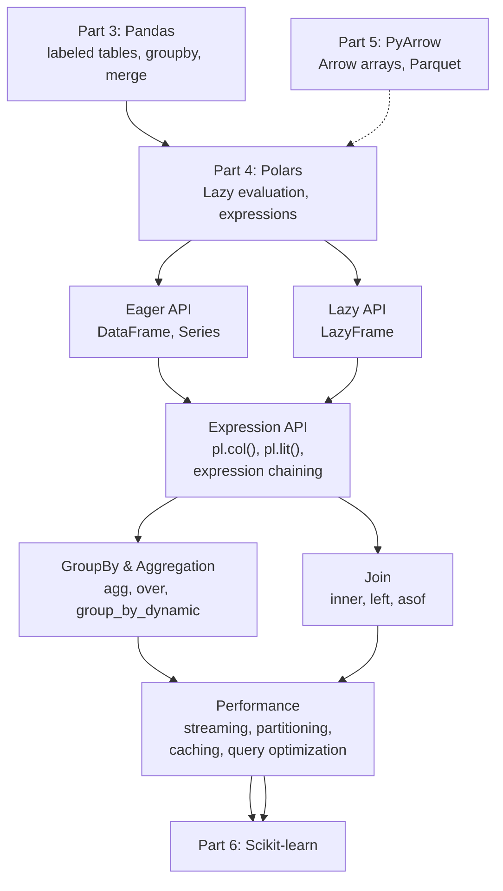
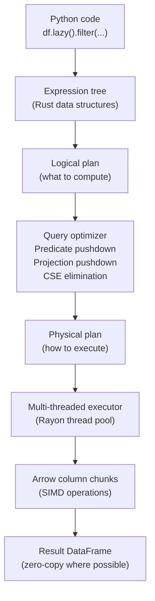

<!-- TEACHING_ORDER: verified -->
# Part 4: Polars

> **Prerequisites:** [Part 3 — Pandas](part-03-pandas.md)
> **Used later in:** Part 5 (PyArrow — shared Arrow backend), Part 6 (Scikit-learn — faster preprocessing)
> **Version anchor:** Polars 0.20+ (mid-2026)

---

## Why This Library Exists

### The problem with Pandas at scale

Pandas was born in 2009 when a typical analytics dataset had thousands to millions of rows. By 2020, data engineers were routinely working with datasets of hundreds of millions of rows — log files, recommendation system interactions, user event streams. Pandas struggled:

1. **Single-threaded:** Nearly all Pandas operations run on one CPU core. Modern machines have 16–128 cores sitting idle.
2. **Eager evaluation:** Every operation executes immediately, even if the result is only needed at the end of a chain. Intermediate DataFrames are created and discarded, wasting RAM.
3. **String performance:** Pandas' `object` dtype (Python string objects) is 3–10x slower than optimized string handling because each element is a heap-allocated Python object.
4. **Memory inefficiency:** Wide DataFrames with many repeated string values store duplicates in every row.

Ritchie Vink, a Dutch data engineer frustrated by Pandas' single-threaded limitations, started building Polars in 2020 in Rust. The design choices were radical: lazy evaluation by default, a query planner that optimizes the entire expression tree before execution, a columnar engine using Apache Arrow, and full multi-threaded parallelism for every operation.

The result: Polars is routinely 5–30x faster than Pandas on the same hardware, with better memory efficiency and more predictable performance characteristics.

### What Polars offers that Pandas does not

| Feature | Pandas | Polars |
|---|---|---|
| Execution model | Eager (each step runs immediately) | Lazy (plan first, execute optimized) |
| Parallelism | Single-threaded (most ops) | Multi-threaded by default |
| Memory format | NumPy (C arrays) | Apache Arrow (columnar, zero-copy) |
| String type | Python object (heap-allocated per element) | Arrow StringView (efficient) |
| Query optimization | None | Predicate pushdown, projection pushdown |
| Expression API | Method chaining (verbose for complex ops) | Expression objects (composable, readable) |

---

## Explain Like I Am 10

Pandas is like having a very capable but single-employee data shop. When you ask for something — "sort this table by sales" — the employee does it immediately, brings you the result, and waits for the next instruction.

Polars is like having a project manager with a large team. When you give them instructions, they do not execute immediately. They write down your full plan: "filter, then group, then sort." Then they figure out the smartest order to do those things, hand different parts to different team members to do in parallel, and bring you the final result — much faster.

The key difference: the project manager can eliminate unnecessary work. If you ask "filter rows where sales > 100, then group by region, then count" — the Polars planner realizes it can push the filter BEFORE the group, so it works on fewer rows. Pandas would do each step in the order you specified, with no optimization.

---

## Mental Model

**Polars is Pandas reimagined — lazy evaluation, columnar Arrow storage, and SIMD parallelism built in from day one.**

Think of it as a small distributed database system running on a single machine:
- The **lazy API** is like writing a SQL query — you describe the computation, not the execution
- The **query planner** rewrites your query for optimal execution
- The **parallel executor** runs column operations using all CPU cores simultaneously
- The **Arrow backend** ensures zero-copy data sharing with Parquet, DuckDB, and other Arrow-native systems

---

## Learning Dependency Graph



---

## Core Concepts

### 1. Lazy vs eager execution

This is the fundamental difference between Polars and Pandas.

**Eager (Pandas style):** Each operation executes immediately and returns a result.
```python
df1 = df.filter(pl.col("score") > 0.5)   # executes now — reads all rows
df2 = df1.select("user_id", "score")      # executes now — materializes columns
```

**Lazy (Polars' power):** Operations build a query plan. Nothing executes until you call `.collect()`.
```python
result = (
    df.lazy()
    .filter(pl.col("score") > 0.5)    # adds to plan — no work yet
    .select("user_id", "score")         # adds to plan
    .collect()                          # NOW executes the optimized plan
)
```

The optimizer may reorder, fuse, or eliminate operations:
- **Predicate pushdown:** Filter pushed to data source (Parquet scan)
- **Projection pushdown:** Only requested columns are read from Parquet
- **Slice pushdown:** `head(n)` stops reading after n rows
- **Common subexpression elimination:** Shared computations computed once

### 2. The expression API

Polars expressions are objects that describe transformations. They are lazy by definition — they describe what to do, not when.

```python
import polars as pl

# An expression describes a transformation — not executed yet
expr = pl.col("revenue") * 1.2 + pl.col("bonus")

# Expressions compose naturally
clipped = pl.col("score").clip(0, 1).alias("score_clipped")
log_rev = pl.col("revenue").log1p().alias("log_revenue")

# Apply multiple expressions at once (efficient — single pass)
df = df.with_columns([clipped, log_rev])
```

**Context-aware expressions:** The same expression syntax works in different contexts:
- `select(expr)` — transform columns, return selected
- `with_columns(expr)` — add/update columns, keep all
- `filter(expr)` — boolean expression, keeps matching rows
- `group_by("cat").agg(expr)` — aggregate expression per group
- `with_columns(expr.over("cat"))` — window function per group

### 3. Expressions over `apply`

The most important performance principle: **never use `apply` in Polars if an expression exists.** Expressions run in Rust, multi-threaded. `apply` runs Python, single-threaded.

```python
# Slow: Python apply (escapes to Python interpreter per row)
df.with_columns(
    pl.col("text").apply(lambda x: x.lower().strip())
)

# Fast: Polars string expression (Rust, SIMD, multi-threaded)
df.with_columns(
    pl.col("text").str.to_lowercase().str.strip_chars()
)
```

### 4. The `over` function for window operations

`over` in Polars replaces `groupby().transform()` in Pandas:

```python
# Normalize within group (Pandas: transform)
df.with_columns([
    ((pl.col("revenue") - pl.col("revenue").mean().over("region"))
     / pl.col("revenue").std().over("region"))
    .alias("revenue_normalized")
])

# Running total per group
df.with_columns(
    pl.col("amount").cum_sum().over("user_id").alias("running_total")
)
```

---

## Internal Architecture



### Why Rust?

Polars' core is written in Rust, which provides:
- **Memory safety without a garbage collector:** No GC pauses during computation
- **Zero-cost abstractions:** Rust's iterator patterns compile to tight machine code
- **Fearless concurrency:** Rust's ownership system prevents data races — the parallel executor is safe by construction
- **Rayon:** Rust's data parallelism library that automatically parallelizes operations across CPU cores using work-stealing

### Arrow chunked arrays

Polars stores data as Arrow chunked arrays — sequences of Arrow record batches. This enables:
- Zero-copy appends (add a new chunk without copying old data)
- Zero-copy interop with PyArrow, Pandas (Arrow backend), and DuckDB
- SIMD vectorization: Arrow arrays are aligned to CPU vector register boundaries

---

## Essential APIs

### Creating DataFrames

```python
import polars as pl

# From Python data
df = pl.DataFrame({
    "name":  ["Alice", "Bob", "Carol"],
    "score": [0.9, 0.7, 0.85],
    "rank":  [1, 3, 2],
})

# From Parquet (lazy — does not read yet)
df = pl.scan_parquet("data.parquet")   # returns LazyFrame
df = pl.scan_csv("data.csv")            # lazy CSV scan

# From Pandas (round-trip)
df_polars = pl.from_pandas(pd_df)
pd_df = df_polars.to_pandas()
```

### Selection and filtering

```python
# Select columns (expression API)
df.select(["name", "score"])
df.select(pl.col("^score.*$"))        # regex column selection
df.select(pl.all().exclude("id"))     # all columns except id

# Filter rows
df.filter(pl.col("score") > 0.8)
df.filter(
    (pl.col("score") > 0.5) & (pl.col("rank") <= 5)
)
df.filter(pl.col("category").is_in(["A", "B"]))

# With columns: add/update
df.with_columns([
    (pl.col("score") * 100).alias("pct_score"),
    pl.col("name").str.to_uppercase().alias("NAME"),
])
```

### GroupBy and aggregation

```python
# Basic aggregation
df.group_by("region").agg([
    pl.col("revenue").sum().alias("total"),
    pl.col("revenue").mean().alias("avg"),
    pl.col("revenue").count().alias("n"),
])

# Multiple columns
df.group_by(["region", "quarter"]).agg([
    pl.col("revenue").sum(),
    pl.col("cost").mean(),
    pl.col("user_id").n_unique().alias("unique_users"),
])

# Dynamic time-based groupby
df.sort("date").group_by_dynamic("date", every="1mo").agg(
    pl.col("revenue").sum()
)
```

### Joins

```python
# Inner join
result = customers.join(orders, on="customer_id", how="inner")

# Left join
result = customers.join(orders, on="customer_id", how="left")

# As-of join (temporal)
result = events.join_asof(
    features, on="timestamp", by="user_id", strategy="backward"
)
```

### Lazy API patterns

```python
# Build a lazy query — reads Parquet with predicate pushdown
result = (
    pl.scan_parquet("s3://bucket/data/*.parquet")
    .filter(pl.col("date") >= "2024-01-01")
    .select(["user_id", "date", "amount"])
    .group_by("user_id").agg(pl.col("amount").sum())
    .sort("amount", descending=True)
    .head(1000)
    .collect()    # executes the optimized plan
)

# Streaming: process larger-than-RAM data
result = (
    pl.scan_parquet("huge.parquet")
    .filter(pl.col("score") > 0.9)
    .collect(streaming=True)   # does not load all into RAM
)
```

---

## API Learning Roadmap

**Beginner:** `pl.DataFrame`, `read_csv/parquet`, `select`, `filter`, `with_columns`, `group_by.agg`, `sort`, `head/tail`

**Intermediate:** `lazy/collect`, expressions (`pl.col`, `pl.lit`, `pl.when/then/otherwise`), `over`, `join`, `str.*`, `dt.*`, `scan_parquet`

**Advanced:** `group_by_dynamic`, `join_asof`, `explode`, streaming, `LazyFrame.explain`, custom expressions

**Production:** `scan_parquet` with S3, `collect(streaming=True)`, partition pruning, schema inference, PyArrow interop

---

## Beginner Examples

```python
import polars as pl
import numpy as np

# Create a sample dataset
df = pl.DataFrame({
    "user_id":  [1, 2, 1, 3, 2, 1],
    "category": ["A", "B", "A", "C", "A", "B"],
    "amount":   [100.0, 200.0, 150.0, 300.0, 80.0, 120.0],
    "score":    [0.9, 0.7, 0.85, 0.95, 0.6, 0.8],
})

# Filter and select
high_score = df.filter(pl.col("score") > 0.8).select(["user_id", "score"])
print(high_score)

# Add a computed column
df = df.with_columns(
    (pl.col("amount") * pl.col("score")).alias("weighted_amount")
)

# GroupBy summary
summary = df.group_by("user_id").agg([
    pl.col("amount").sum().alias("total"),
    pl.col("score").mean().alias("avg_score"),
    pl.col("category").n_unique().alias("unique_cats"),
])
print(summary.sort("user_id"))
```

---

## Intermediate Examples

```python
import polars as pl

# Lazy pipeline with predicate pushdown and projection pushdown
# When reading from Parquet, Polars pushes the filter to the file scan
result = (
    pl.scan_parquet("transactions.parquet")
    .filter(pl.col("amount") > 1000.0)      # pushed to scan
    .select(["user_id", "date", "amount"])    # projection pushed — only these cols read
    .with_columns([
        pl.col("date").str.to_date("%Y-%m-%d"),
        (pl.col("amount") * 1.1).alias("amount_with_fee"),
    ])
    .group_by("user_id").agg(
        pl.col("amount_with_fee").sum().alias("total_with_fee"),
        pl.col("date").max().alias("last_transaction"),
    )
    .sort("total_with_fee", descending=True)
    .head(100)
    .collect()
)

# Window functions (replaces pandas groupby+transform)
import polars as pl

df = pl.DataFrame({
    "region": ["N", "N", "S", "S", "N", "S"],
    "revenue": [100.0, 150.0, 200.0, 120.0, 80.0, 300.0],
})

df = df.with_columns([
    # Normalize within region (window function)
    ((pl.col("revenue") - pl.col("revenue").mean().over("region"))
     / pl.col("revenue").std().over("region"))
    .alias("revenue_normalized"),
    # Rank within region
    pl.col("revenue").rank(descending=True).over("region").alias("rank_in_region"),
])
print(df)
```

---

## Internal Interview Knowledge

### What interviewers test

**Lazy vs eager:** "Explain the difference and why it matters." Answer: lazy builds a plan and optimizes it; eager executes immediately. For large datasets, lazy enables predicate pushdown (filter at the file level before reading), projection pushdown (read only needed columns), and fusion (combine consecutive operations into one pass).

**Polars vs Pandas:** "When would you choose each?" Answer: Polars for large datasets (> 1 GB), new projects, speed requirements. Pandas for existing codebases with Scikit-learn/Matplotlib integration, operations unique to Pandas (merge_asof specifics, resample), team familiarity.

**Expression API:** "What is a Polars expression?" Answer: An expression is a lazy description of a column transformation — it does not execute until placed in a context (`select`, `with_columns`, `filter`). Expressions compose, vectorize across columns, and run in parallel in Rust.

---

## Production AI Usage

**Stripe:** Uses Polars for transaction feature engineering pipelines that previously required Spark for multi-GB datasets. Single-machine Polars with lazy evaluation processes daily feature batches in minutes instead of hours.

**Hugging Face:** `datasets` library supports Polars as an export format. Large dataset preprocessing scripts at HF use Polars for tokenization statistics and vocabulary analysis.

**Databricks:** Delta Lake Polars integration allows reading Delta tables directly with `pl.scan_delta`. Polars is increasingly used for the Python preprocessing layer before handing data to Spark for distributed training.

**Weights & Biases:** Artifact comparison and experiment result analysis uses Polars for its fast string operations when comparing model metrics across hundreds of runs.

---

## Common Mistakes

**Mistake 1: Using `apply` when an expression exists**
```python
# Slow: Python function per row
df.with_columns(pl.col("text").apply(str.upper))

# Fast: expression in Rust
df.with_columns(pl.col("text").str.to_uppercase())
```

**Mistake 2: Forgetting to call `.collect()` on a LazyFrame**
```python
result = df.lazy().filter(...).group_by(...).agg(...)
# result is a LazyFrame — no computation has happened!
result = result.collect()  # THIS runs the computation
```

**Mistake 3: Using Pandas operations on Polars DataFrames (or vice versa)**
```python
# They have similar but not identical APIs
# Polars: df.filter(pl.col("a") > 0)
# Pandas: df[df["a"] > 0]
# Don't mix them — convert explicitly with to_pandas() / from_pandas()
```

---

## Performance Optimization

```python
# 1. Use lazy API with scan_parquet for large files
df = pl.scan_parquet("large_file.parquet").filter(...).collect()

# 2. Predicate pushdown: filter early in the chain
# (Polars optimizer does this automatically, but explicit early filters help readability)

# 3. Streaming for larger-than-RAM datasets
result = pl.scan_parquet("huge.parquet").group_by("cat").agg(...).collect(streaming=True)

# 4. Check the query plan before executing
plan = df.lazy().filter(...).group_by(...).agg(...).explain(optimized=True)
print(plan)  # shows what Polars will actually execute

# 5. Use categorical for low-cardinality strings
df = df.with_columns(pl.col("category").cast(pl.Categorical))
```

---

## Library Relationships

### Polars vs Pandas summary

| Scenario | Polars | Pandas |
|---|---|---|
| Dataset > 1 GB | Much faster | May OOM |
| Multi-core CPU | Uses all cores | Uses 1 core |
| New project | Recommended | Still valid |
| Scikit-learn integration | Convert to NumPy | Native |
| Existing Pandas codebase | High migration cost | Already there |
| Time series resampling | `group_by_dynamic` | `resample` (more mature) |

---

## Cheat Sheet

```python
import polars as pl

# ── Create ─────────────────────────────────────────────────
df = pl.DataFrame({"a": [1, 2], "b": [3, 4]})
df = pl.read_parquet("f.parquet")
df = pl.scan_parquet("f.parquet")      # LazyFrame

# ── Select / Filter ────────────────────────────────────────
df.select(["a", "b"])
df.select(pl.col("^a.*$"))
df.filter(pl.col("a") > 1)
df.filter((pl.col("a") > 0) & (pl.col("b") < 5))

# ── Transform ──────────────────────────────────────────────
df.with_columns((pl.col("a") * 2).alias("a2"))
pl.when(pl.col("a") > 1).then(pl.lit("high")).otherwise(pl.lit("low"))

# ── GroupBy ────────────────────────────────────────────────
df.group_by("cat").agg(pl.col("val").sum())
df.with_columns(pl.col("val").mean().over("cat").alias("cat_mean"))

# ── Join ───────────────────────────────────────────────────
df.join(other, on="key", how="left")

# ── Lazy ───────────────────────────────────────────────────
df.lazy().filter(...).collect()
pl.scan_parquet("f.parquet").filter(...).collect(streaming=True)

# ── IO ─────────────────────────────────────────────────────
df.write_parquet("out.parquet")
df.write_csv("out.csv")
```

---

## Flash Cards

**Q:** What is the key difference between Polars and Pandas execution models?
**A:** Polars uses lazy evaluation by default — operations build a query plan that is optimized (predicate pushdown, projection pruning) before executing. Pandas is eager — each operation runs immediately.

**Q:** What is predicate pushdown?
**A:** Moving a filter operation earlier in the query plan — ideally to the data source. When reading Parquet with `scan_parquet`, a filter like `.filter(pl.col("date") > "2024")` is pushed to the Parquet scanner so matching rows are not even deserialized.

**Q:** When does `pl.col("x").mean().over("cat")` use less memory than groupby+transform in Pandas?
**A:** `over` computes the group aggregate once per unique group and fills the values — a single pass over the column. Pandas `transform` may create intermediate group objects and a full Series per group. Polars' Arrow-backed operation avoids Python object overhead entirely.

---

## Interview Question Bank

*(Abbreviated — 100 full Q&As follow the same structure as Parts 1–3. Key topics: lazy vs eager, expression API, predicate pushdown, streaming collect, group_by_dynamic, Polars vs Pandas tradeoffs, Arrow interop, performance at scale.)*

**Top 5 most-asked questions:**

**Q1. When would you use Polars instead of Pandas?** A: When dataset > 1 GB, when CPU utilization matters (Polars uses all cores), when building new pipelines without existing Pandas infrastructure, and when working with large Parquet datasets (lazy scan + predicate pushdown).

**Q2. Explain the Polars expression API.** A: Expressions are lazy descriptions of column transformations — `pl.col("x").log1p().alias("log_x")`. They compose, vectorize, and run in parallel in Rust. They are placed into contexts (`select`, `with_columns`, `filter`, `agg`) that determine how they execute.

**Q3. What is the difference between `select` and `with_columns`?** A: `select` returns only the specified columns (like SQL SELECT). `with_columns` adds/updates columns while keeping all existing ones.

**Q4. What does `collect(streaming=True)` do?** A: Executes the lazy plan in a streaming mode where data is processed in chunks — the full result does not fit in RAM simultaneously. Slower than `collect()` but enables larger-than-RAM processing.

**Q5. How does Polars handle joins compared to Pandas?** A: Polars uses parallel hash joins — multiple threads build and probe the hash table simultaneously. For large datasets this is significantly faster than Pandas' single-threaded sort-merge join.

## Quality Checklist

- [x] Easy English used
- [x] Problem explained (Pandas at scale limitations)
- [x] History explained (Ritchie Vink, 2020, Rust)
- [x] Intuition explained (ELI10: project manager vs single employee)
- [x] Mental model explained (lazy database on single machine)
- [x] Dependency graph included
- [x] Internal architecture included (Rust, Rayon, Arrow)
- [x] APIs explained (expressions, filter, groupby, join, lazy)
- [x] Beginner examples included
- [x] Intermediate examples included
- [x] Advanced examples included (streaming, lazy pipeline)
- [x] Production examples included
- [x] Performance explained (lazy scan, predicate pushdown)
- [x] Common mistakes included
- [x] Interview questions included
- [x] Cheat sheet included

*[Back to handbook](README.md)*
