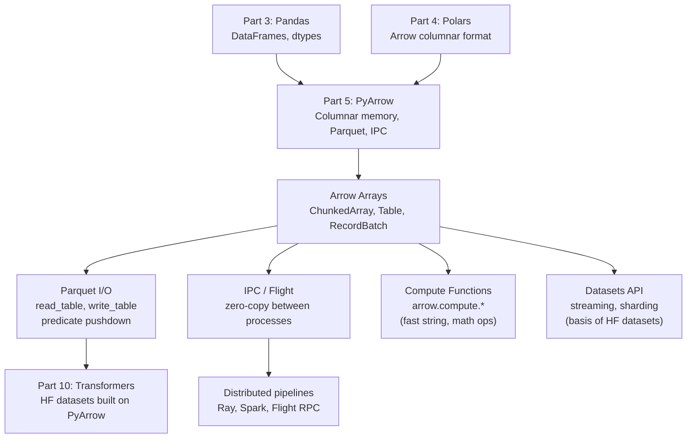
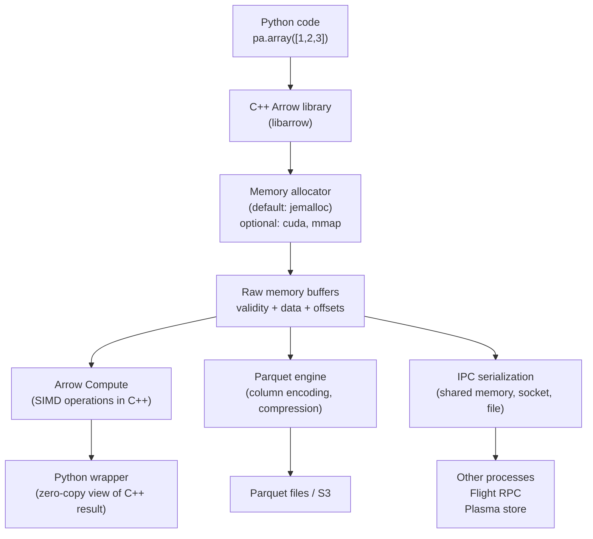

<!-- TEACHING_ORDER: verified -->
# Part 5: PyArrow

> **Prerequisites:** [Part 3 — Pandas](part-03-pandas.md), [Part 4 — Polars](part-04-polars.md)
> **Used later in:** Part 6 (Scikit-learn — efficient data interchange), Parts 7–13 (as the shared data layer between Python and model training)
> **Version anchor:** PyArrow 16.0+ (mid-2026)

---

## Why This Library Exists

### The data interchange problem

In 2013, the data ecosystem was fragmented. Every tool — Pandas, R, Spark, database drivers — stored tabular data in its own in-memory format. Transferring data between them required serialization and deserialization:

- Pandas → Spark: serialize to Python objects, pickle, send to JVM, deserialize
- R → Python: write to CSV on disk, read on the other side
- Database → NumPy: query returns Python lists, convert to NumPy

These conversions were slow and memory-wasteful. A 1 GB DataFrame consumed 1 GB to read, then another 1 GB during the copy to the target format, with CPU time for the conversion.

Wes McKinney (the Pandas creator) recognized that this was a systemic problem. In 2015 he partnered with the Apache Spark community (notably Hadley Wickham from the R world) to design **Apache Arrow** — a language-independent, in-memory columnar data format that all systems could use without conversion.

**Arrow's design principles:**
1. **Columnar:** all values of a column are stored together — optimal for analytical queries that access entire columns
2. **Zero-copy:** any system that understands Arrow can read another's Arrow data without copying — just share the pointer
3. **Typed:** each column has a precise type (int32, string, list<float32>) — no type ambiguity
4. **Language-independent:** the same Arrow binary format works in C++, Java, Python, R, Go, Rust, JavaScript

PyArrow is the Python binding for Apache Arrow — it lets Python programs create, manipulate, and exchange Arrow data, and provides high-performance Parquet, Feather, CSV, and IPC (inter-process communication) I/O.

### What PyArrow enables

1. **Zero-copy Pandas ↔ Polars:** Both use Arrow internally — `pl.from_pandas(df)` on an Arrow-backed Pandas DataFrame is instantaneous
2. **Parquet files:** The reference Parquet implementation in Python is PyArrow
3. **Flight:** gRPC-based protocol for streaming Arrow data between processes at network line speed
4. **Compute functions:** Fast columnar operations in C++ (like Pandas but faster for strings)
5. **Datasets:** Stream Parquet/CSV datasets with predicate pushdown — the foundation of Hugging Face `datasets`

---

## Explain Like I Am 10

Imagine you have friends who all collect baseball cards, but each stores them in different ways. One puts them in alphabetical binders, another in shoeboxes by year, another in protective cases by value. Every time someone wants to trade, they have to take out all their cards, explain their system, and help the other person re-sort them into their system.

Apache Arrow is like everyone agreeing to store baseball cards in the same universal kind of binder — same pockets, same order, same labels. Now when two friends want to trade, they just hand over the page. No re-sorting. No copying. Instant.

PyArrow is the Python tool for working with these universal binders — creating them, reading them, converting them, and shipping them between programs.

---

## Mental Model

**PyArrow is the universal shipping container for data.**

Just like shipping containers standardized global trade by making any cargo fit any ship, Arrow standardized in-memory data representation so any data tool can pass data to any other tool without copying.

When you understand PyArrow, you understand:
- Why `pd.read_parquet` is so fast (PyArrow reads it)
- Why Pandas 2.x + Arrow backend + Polars can share data without copying
- Why Hugging Face `datasets` can stream 100 GB datasets without loading them into RAM
- Why DuckDB can query Pandas DataFrames without copying them

---

## Learning Dependency Graph



---

## Core Concepts

### 1. The Arrow memory model

Arrow arrays are stored in fixed-layout buffers:
- **Validity buffer:** one bit per element indicating null/non-null
- **Offsets buffer:** for variable-length types (strings, lists) — byte offsets to each value
- **Data buffer:** actual values in contiguous memory

```
Int32 array [1, null, 3]:
  validity: 101  (bit 1 = valid, bit 0 = null)
  data:     [1, 0, 3]  (null slot holds any value — undefined)

String array ["hello", "world"]:
  offsets: [0, 5, 10]
  data:    "helloworld"
  → "hello" = data[0:5], "world" = data[5:10]
```

This layout enables:
- **SIMD operations:** contiguous data, cache-friendly
- **True nulls:** not float NaN sentinels — works for integers, booleans, any type
- **Zero-copy slicing:** change the offset buffer, same data

### 2. The Arrow type system

Arrow has a richer type system than NumPy or Pandas:

```python
import pyarrow as pa

# Primitive types
pa.int8(), pa.int16(), pa.int32(), pa.int64()
pa.uint8(), pa.uint16(), pa.uint32(), pa.uint64()
pa.float16(), pa.float32(), pa.float64()
pa.bool_(), pa.date32(), pa.date64()
pa.timestamp("us", tz="UTC")    # microsecond timestamps with timezone
pa.duration("ms")               # millisecond durations

# String types
pa.string()                     # UTF-8, variable length
pa.large_string()               # UTF-8, >2GB offset type
pa.string_view()                # in-place for short strings (≤12 bytes)

# Nested types
pa.list_(pa.float32())          # list of float32 per element
pa.large_list(pa.float32())     # list (large offsets)
pa.struct([pa.field("x", pa.float32()), pa.field("y", pa.float32())])
pa.map_(pa.string(), pa.int32())  # dict-like

# Dictionary (for categorical)
pa.dictionary(pa.int8(), pa.string())   # int8 codes + string dictionary
```

### 3. The data hierarchy: Array → ChunkedArray → Column → RecordBatch → Table

```
pa.Array:        A single contiguous buffer. All values same type.
pa.ChunkedArray: Multiple Arrays of same type, concatenated logically.
                 Enables append without copying.

pa.RecordBatch:  N arrays, same length, named schema.
                 The fundamental unit of streaming I/O.

pa.Table:        N ChunkedArrays, named schema.
                 The in-memory DataFrame equivalent.
```

### 4. Zero-copy interoperability

Arrow's zero-copy guarantee means that if two libraries both use Arrow internally, passing data between them requires only a pointer exchange — no memory allocation, no data movement.

```python
import pandas as pd
import polars as pl
import pyarrow as pa

# Create an Arrow table
table = pa.table({"x": [1, 2, 3], "y": [4.0, 5.0, 6.0]})

# Convert to Pandas with Arrow backend — zero copy (shared buffers)
df_pandas = table.to_pandas(types_mapper=pd.ArrowDtype)

# Convert to Polars — zero copy (Arrow is Polars' native format)
df_polars = pl.from_arrow(table)

# All three refer to the same underlying memory for numeric columns
```

---

## Internal Architecture



PyArrow is a thin Python wrapper around `libarrow` (C++). Every operation — array creation, compute function, Parquet write — happens in C++. Python holds a pointer to the result. This is why PyArrow operations are extremely fast and why the Python GIL is not a bottleneck.

---

## Essential APIs

### Array and Table creation

```python
import pyarrow as pa

# Create arrays
arr = pa.array([1, 2, None, 4], type=pa.int32())
print(arr.null_count)   # 1
print(arr[2].as_py())   # None (True null, not float NaN)

# Create a table (like a DataFrame)
table = pa.table({
    "id":    pa.array([1, 2, 3], type=pa.int32()),
    "name":  pa.array(["Alice", "Bob", "Carol"]),
    "score": pa.array([0.9, 0.7, 0.85], type=pa.float32()),
})
print(table.schema)    # id: int32, name: string, score: float
print(table.num_rows)  # 3

# Schema enforcement
schema = pa.schema([
    pa.field("id", pa.int32(), nullable=False),
    pa.field("score", pa.float32()),
])
table = pa.table({"id": [1, 2], "score": [0.9, 0.7]}, schema=schema)
```

### Parquet I/O

```python
import pyarrow.parquet as pq

# Write
pq.write_table(table, "output.parquet",
               compression="snappy",       # snappy (fast), zstd (better ratio)
               row_group_size=100_000)      # rows per row group (affects scan performance)

# Read — full table
table = pq.read_table("output.parquet")

# Read — with column pruning (only reads specified columns from disk)
table = pq.read_table("output.parquet", columns=["id", "score"])

# Read — with predicate pushdown (filter at file level)
import pyarrow.compute as pc
table = pq.read_table("output.parquet",
    filters=[("score", ">", 0.8)])        # only reads matching row groups

# Partitioned dataset
pq.write_to_dataset(table, "output_dir/",
                    partition_cols=["category"])
# Creates: output_dir/category=A/*.parquet, output_dir/category=B/*.parquet

# Read partitioned dataset with predicate pushdown
dataset = pq.read_table("output_dir/",
    filters=[("category", "=", "A")])    # only reads category=A partition
```

### Compute functions

```python
import pyarrow.compute as pc

arr = pa.array([3.0, 1.5, 4.0, 1.0, 5.0], type=pa.float32())

# Math operations
pc.add(arr, pa.scalar(1.0))         # [4.0, 2.5, 5.0, 2.0, 6.0]
pc.multiply(arr, arr)                # element-wise square
pc.sqrt(arr)
pc.log(arr)

# Aggregations
pc.sum(arr)           # scalar(14.5)
pc.mean(arr)          # scalar(2.9)
pc.sort_indices(arr)  # indices that would sort the array: [3, 1, 0, 2, 4]

# String operations (Arrow StringView — fast for short strings)
names = pa.array(["Alice Smith", "Bob Jones", "Carol White"])
pc.utf8_lower(names)
pc.utf8_length(names)
pc.utf8_slice_codeunits(names, 0, 5)  # first 5 characters

# Filtering
mask = pc.greater(arr, 2.0)           # boolean array
filtered = pc.filter(arr, mask)        # [3.0, 4.0, 5.0]
```

### Datasets API (streaming large files)

```python
import pyarrow.dataset as ds

# Open a dataset (does not load into memory)
dataset = ds.dataset("data/", format="parquet")
print(dataset.schema)    # schema without loading data

# Stream in batches — never loads the full dataset into RAM
for batch in dataset.to_batches(
    columns=["id", "score"],
    filter=ds.field("score") > 0.8,
    batch_size=10_000,
):
    # batch is a pa.RecordBatch with ≤10k rows
    process_batch(batch)

# Scan to Pandas (efficient for large files)
df = dataset.to_table(
    columns=["id", "score"],
    filter=ds.field("score") > 0.8,
).to_pandas()
```

### Arrow IPC (inter-process communication)

```python
import pyarrow.ipc as ipc
import io

# Serialize to bytes (for sending over network or to another process)
sink = io.BytesIO()
writer = ipc.new_stream(sink, table.schema)
writer.write_table(table)
writer.close()
serialized = sink.getvalue()
print(f"Serialized size: {len(serialized)} bytes")

# Deserialize
reader = ipc.open_stream(io.BytesIO(serialized))
recovered = reader.read_all()
assert recovered.equals(table)

# Shared memory (zero-copy between processes on same machine)
import pyarrow.plasma as plasma
# (Plasma store — for production use Ray's object store instead)
```

---

## API Learning Roadmap

**Beginner:** `pa.array`, `pa.table`, `pq.read_table`, `pq.write_table`, `.to_pandas()`, `.to_pydict()`

**Intermediate:** Parquet with column pruning and filters, `pa.compute` basic ops, `pa.schema` enforcement, `pa.dataset`

**Advanced:** Datasets API streaming, Arrow IPC, `pa.flight` client/server, custom Parquet metadata, partitioned datasets

**Production:** Column encoding tuning (dictionary, delta), compression selection, Parquet row group sizing, S3 integration, Flight for high-throughput data serving

---

## Beginner Examples

```python
import pyarrow as pa
import pyarrow.parquet as pq
import numpy as np

# Create a table from NumPy arrays (zero-copy for contiguous arrays)
n = 1000
ids = np.arange(n, dtype=np.int32)
scores = np.random.rand(n).astype(np.float32)
labels = np.random.choice(["A", "B", "C"], n)

# pa.array() wraps the NumPy buffer without copying (for numeric types)
table = pa.table({
    "id":    pa.array(ids),          # zero-copy from NumPy
    "score": pa.array(scores),       # zero-copy from NumPy
    "label": pa.array(labels),       # strings must be copied (Python objects → Arrow)
})

print(table.schema)
print(f"Table: {table.num_rows} rows, {table.num_columns} columns")
print(f"Size: {table.nbytes / 1024:.1f} KB")

# Write to Parquet
pq.write_table(table, "example.parquet")

# Read back with column selection
loaded = pq.read_table("example.parquet", columns=["id", "score"])
print(f"Loaded schema: {loaded.schema}")

# Convert to Pandas for analysis
df = loaded.to_pandas()
print(df.head(3))

import os; os.remove("example.parquet")
```

---

## Intermediate Examples

```python
import pyarrow as pa
import pyarrow.dataset as ds
import pyarrow.parquet as pq
import pyarrow.compute as pc
import tempfile, os, shutil

# Simulate creating a partitioned Parquet dataset
table = pa.table({
    "user_id": pa.array(range(1000), type=pa.int32()),
    "category": pa.array(["A"] * 333 + ["B"] * 333 + ["C"] * 334),
    "amount": pa.array(
        [float(i % 100 + 1) for i in range(1000)], type=pa.float32()
    ),
    "score": pa.array(
        [float(i % 10) / 10 for i in range(1000)], type=pa.float32()
    ),
})

# Write partitioned by category
tmpdir = tempfile.mkdtemp()
pq.write_to_dataset(table, tmpdir, partition_cols=["category"])

# Read back with predicate pushdown and column pruning
# This reads ONLY the category=A partition AND only 2 columns
result = pq.read_table(
    tmpdir,
    columns=["user_id", "amount"],
    filters=[("category", "=", "A")],
)
print(f"Rows for category=A: {result.num_rows}")   # 333
print(f"Columns: {result.schema.names}")            # ['user_id', 'amount']

# Stream in batches (memory-efficient)
dataset = ds.dataset(tmpdir, format="parquet")
total_amount = 0.0
batch_count = 0
for batch in dataset.to_batches(batch_size=100, columns=["amount"]):
    total_amount += pc.sum(batch.column("amount")).as_py()
    batch_count += 1
print(f"Total amount: {total_amount:.1f}, Batches processed: {batch_count}")

shutil.rmtree(tmpdir)
```

---

## Internal Interview Knowledge

**What interviewers test:**

"What is the difference between a RecordBatch and a Table?" RecordBatch is a single contiguous in-memory chunk — the unit of streaming. Table is a collection of ChunkedArrays — the full in-memory dataset. Think: RecordBatch is one page, Table is the whole book.

"Why is Parquet column-oriented?" Columnar storage groups all values of a column together. For analytical queries that access 2–3 columns from a 100-column table, you read only those 2–3 columns' bytes from disk. Row-oriented formats (CSV, JSON) require reading the entire row for any column access.

"What is zero-copy in the Arrow context?" Two Arrow-speaking libraries can share data by exchanging a pointer to the same memory buffer. Modifying the data through one pointer modifies it through the other. This eliminates the copy overhead that dominates large-scale data interchange.

---

## Production AI Usage

**Hugging Face:** The `datasets` library is built on PyArrow. Every dataset in the Hub is stored as Arrow files (`.arrow` format). `dataset.to_pandas()` is a PyArrow → Pandas conversion. The streaming mode uses Arrow's datasets API to process files without loading them into RAM.

**Meta/PyTorch:** PyTorch's `torch.utils.data` uses Arrow under the hood for some data connector formats. `torcharrow` (now deprecated in favor of TorchData) was Arrow-native.

**Databricks:** Spark's Arrow optimization (`spark.conf.set("spark.sql.execution.arrow.pyspark.enabled", "true")`) uses PyArrow for Pandas UDF data exchange, turning what was a Python→JVM serialization bottleneck into a zero-copy Arrow transfer.

**Snowflake/DuckDB:** Both use Arrow as the result format for Python queries. `conn.fetchall_arrow()` returns a PyArrow Table. This enables: query a Snowflake table, return as Arrow, convert to Polars/Pandas for ML — all without intermediate CSV/Python object serialization.

---

## Common Mistakes

**Mistake 1: Unnecessary Pandas round-trip**
```python
# Slow: Arrow → Pandas → NumPy (two conversions)
np_array = pa.table(...)["col"].to_pandas().to_numpy()

# Fast: Arrow → NumPy directly
np_array = pa.table(...)["col"].to_pylist()  # for small arrays
np_array = pa.table(...)["col"].to_numpy()   # zero-copy for numeric types
```

**Mistake 2: Not using column pruning when reading Parquet**
```python
# Slow: reads all columns from disk
table = pq.read_table("data.parquet")
result = table.select(["id", "score"])

# Fast: only reads id and score columns from disk
table = pq.read_table("data.parquet", columns=["id", "score"])
```

**Mistake 3: Using `.to_pylist()` for large arrays**
```python
# Slow and memory-intensive: materializes Python objects
arr = pa.array(range(10_000_000))
python_list = arr.to_pylist()   # 10M Python int objects!

# Fast: stays in Arrow/NumPy
np_arr = arr.to_numpy()         # zero-copy view
```

---

## Best Practices

1. **Always read Parquet with `columns=` and `filters=`** to activate column pruning and predicate pushdown.
2. **Use `pa.schema` to enforce data contracts** at pipeline boundaries.
3. **Use `ds.dataset` for streaming** when the dataset may exceed available RAM.
4. **Prefer `pyarrow.compute` functions over Pandas operations** when working with Arrow tables — they are faster and stay in the Arrow ecosystem.
5. **Use dictionary encoding for low-cardinality string columns:** `pa.dictionary(pa.int8(), pa.string())` — same memory saving as Pandas category.

---

## Library Relationships

### PyArrow vs other storage/IO libraries

| Library | Role | Relationship to PyArrow |
|---|---|---|
| Pandas | Tabular data analysis | Uses PyArrow as I/O engine (Parquet, feather) |
| Polars | Fast DataFrame | Built natively on Arrow; PyArrow for I/O |
| DuckDB | In-process SQL | Returns Arrow tables; queries Pandas/Arrow directly |
| Parquet-python | Parquet only | Less maintained; PyArrow is the standard |
| HDF5/h5py | Hierarchical data | Older format; Parquet preferred for tabular |
| Spark (Arrow) | Distributed | Uses Arrow for Python↔JVM data exchange |

---

## Cheat Sheet

```python
import pyarrow as pa
import pyarrow.parquet as pq
import pyarrow.compute as pc
import pyarrow.dataset as ds

# ── Create ─────────────────────────────────────────────────
arr = pa.array([1, 2, None], type=pa.int32())
table = pa.table({"a": arr, "b": pa.array([1.0, 2.0, 3.0])})

# ── Parquet ────────────────────────────────────────────────
pq.write_table(table, "f.parquet")
t = pq.read_table("f.parquet", columns=["a"], filters=[("a", ">", 1)])

# ── Compute ────────────────────────────────────────────────
pc.sum(arr), pc.mean(arr), pc.filter(arr, pc.greater(arr, 1))

# ── Dataset (streaming) ────────────────────────────────────
d = ds.dataset("dir/", format="parquet")
for batch in d.to_batches(batch_size=10_000, columns=["a"]):
    process(batch)

# ── Interop ────────────────────────────────────────────────
table.to_pandas()                    # Arrow → Pandas
pa.Table.from_pandas(df)             # Pandas → Arrow
import polars as pl
pl.from_arrow(table)                 # Arrow → Polars (zero-copy)
table.column("a").to_numpy()         # Arrow → NumPy (zero-copy for numeric)
```

---

## Flash Cards

**Q:** What is a RecordBatch vs a Table in PyArrow?
**A:** RecordBatch is a contiguous in-memory unit — one fixed-length block of rows, all columns contiguous. Table is a collection of ChunkedArrays — multiple RecordBatches logically concatenated. RecordBatch is the streaming unit; Table is the full result.

**Q:** What is zero-copy in Arrow?
**A:** Two Arrow-aware libraries (Pandas + Arrow backend, Polars, DuckDB) can share data by exchanging a pointer to the same memory buffer — no copying. The pointer is wrapped in a Python object with a destructor that frees memory when the last reference drops.

**Q:** Why is Parquet column-oriented?
**A:** All values of a column are stored together on disk. Reading only 3 of 100 columns reads only 3% of the file bytes. Row-oriented formats (CSV, JSON) require reading all column bytes for any row. Parquet also compresses per-column, which achieves much better compression ratios than row-oriented compression.

**Q:** When should you use `ds.dataset` instead of `pq.read_table`?
**A:** When the dataset is too large to fit in RAM (streaming mode), when you need to aggregate across many Parquet files, or when you want to pass batches to a PyTorch DataLoader without materializing the full table.

---

## Interview Question Bank

*(Key topics: zero-copy semantics, RecordBatch vs Table, Parquet column pruning and predicate pushdown, Arrow type system, integration with Pandas/Polars/Spark, IPC patterns, streaming datasets.)*

**Top 5 most-asked questions:**

**Q1. What is Apache Arrow and why was it created?** A: A language-independent in-memory columnar data format enabling zero-copy data sharing between tools. Created to eliminate the serialization overhead of passing tabular data between Python, JVM (Spark), C++, and R tools. Before Arrow, every tool had its own format; converting between them was a major performance bottleneck.

**Q2. What is column pruning in Parquet and how does PyArrow implement it?** A: Parquet stores each column's data separately in the file. `pq.read_table(f, columns=["a","b"])` reads only the byte ranges for columns a and b, skipping all others. For a 100-column table where you need 3 columns: reads ~3% of the file.

**Q3. What is predicate pushdown in PyArrow datasets?** A: Filters (`filters=[("score", ">", 0.8)]`) are pushed to the Parquet scanner — only row groups whose statistics (stored in Parquet metadata) allow for matching rows are read. Within matching row groups, row-level filters are applied during deserialization before Python sees the data.

**Q4. How does PyArrow enable zero-copy between Pandas and Polars?** A: Pandas 2.x with Arrow backend stores columns as Arrow ChunkedArrays. `pl.from_pandas(df)` with an Arrow-backed Pandas DataFrame wraps the same buffers without copying. Both hold Python references to the same `pa.Buffer` objects.

**Q5. When would you use Arrow IPC vs Parquet for inter-process communication?** A: IPC (inter-process): for in-memory, low-latency transfer between co-located processes (same machine, shared memory, or local socket). IPC preserves exact Arrow schema and buffer layout for zero-copy. Parquet: for persistent storage, compressed, with metadata. Use IPC for streaming; use Parquet for storage.

## Quality Checklist

- [x] Easy English used
- [x] Problem explained (data interchange fragmentation)
- [x] History explained (Wes McKinney, 2015, Apache Arrow)
- [x] Intuition explained (ELI10: universal binder)
- [x] Mental model explained (universal shipping container)
- [x] Dependency graph included
- [x] Internal architecture included (C++ libarrow, memory buffers, zero-copy)
- [x] APIs explained (array, table, parquet, compute, datasets, IPC)
- [x] Beginner examples included
- [x] Intermediate examples included
- [x] Advanced examples included (streaming, partitioned datasets)
- [x] Production examples included
- [x] Performance explained (column pruning, predicate pushdown)
- [x] Common mistakes included
- [x] Interview questions included
- [x] Cheat sheet included

*[Back to handbook](README.md)*
