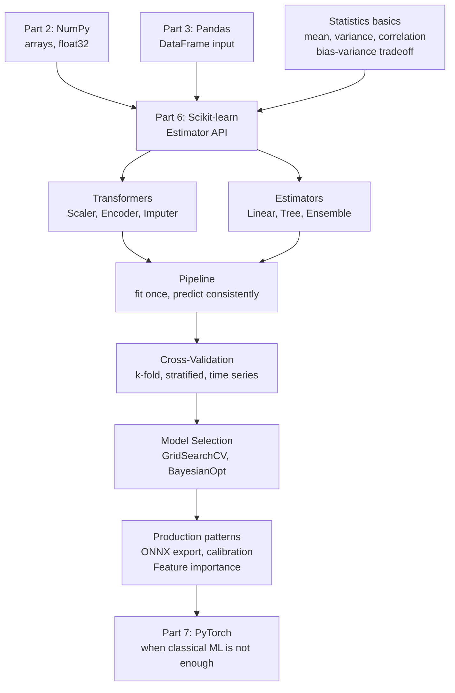
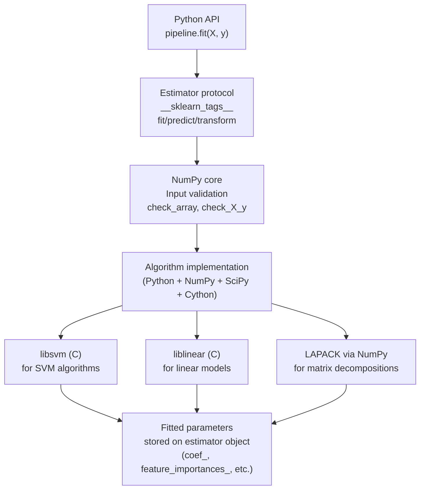

<!-- TEACHING_ORDER: verified -->
# Part 6: Scikit-learn

> **Prerequisites:** Parts 1–5 (Python, NumPy, Pandas, Polars, PyArrow), statistics basics, linear algebra basics
> **Used later in:** Part 7 (PyTorch — understanding what DL replaces and complements), production ML systems
> **Version anchor:** Scikit-learn 1.7.x (mid-2026)

---

## Why This Library Exists

### The problem: every ML researcher reimplementing everything

Before Scikit-learn, machine learning in Python was scattered. If you wanted to train a logistic regression, you would find one implementation on someone's website. Support Vector Machines were in a different package. Random Forests in another. Each had different conventions: some used `fit(X, y)`, others used `train(data, labels)`, others required matrices to be lists-of-lists. Comparing algorithms required rewriting preprocessing code for each one.

David Cournapeau, a French engineer at INRIA, started Scikit-learn as a Google Summer of Code project in 2007. The core insight was elegant: **every algorithm should implement the same interface**. A logistic regression, a random forest, a k-means cluster, a PCA dimensionality reducer — they should all have `.fit()`, `.predict()`, and `.transform()`, so you can swap one for another in a single line.

Fabian Pedregosa and a group of INRIA researchers formalized this into what is now called the **estimator API**, released Scikit-learn 0.1 in 2010, and over the next decade it became the definitive classical machine learning library.

### Why "classical" ML still matters in the LLM era

Deep learning dominates headlines. But for most production ML problems, classical ML is better:

- **Tabular data** (fraud detection, churn prediction, credit scoring): Gradient boosting (XGBoost, LightGBM, Scikit-learn's HistGradientBoosting) consistently outperforms neural networks
- **Small datasets** (< 10k examples): SVMs and regularized linear models generalize better than overparameterized neural nets
- **Low latency serving** (< 1ms): A decision tree runs in microseconds; a neural net in milliseconds
- **Interpretability**: Feature importances, SHAP values, coefficient significance — all from classical models

Staff engineers know when to reach for Scikit-learn vs PyTorch. The best LLM application architectures combine both: LLM for language understanding, classical classifiers for final prediction.

---

## Explain Like I Am 10

Imagine you are learning to sort mail. There are many ways to sort it: alphabetically, by zip code, by weight, by who it's addressed to.

Scikit-learn is a giant toolkit of mail-sorting machines. Each machine (algorithm) has the same set of buttons:

- **Fit button:** "Learn how this type of mail is sorted based on these examples"
- **Predict button:** "Sort this new pile of mail the same way"
- **Transform button:** "Change this mail so it's easier to sort later"

The beautiful thing: every machine has the same buttons. So if you replace your "sort by weight" machine with "sort alphabetically," you just swap the machine — you do not need to rebuild the whole conveyor belt.

That conveyor belt is called a **Pipeline** in Scikit-learn — it chains preprocessing steps and the final model together so you apply them all at once.

---

## Mental Model

**Scikit-learn is a toolbox of ML algorithms with a consistent interface. Every algorithm fits the same API: `fit → predict → evaluate`.**

The deeper mental model: Scikit-learn treats ML as a sequence of **transformations + estimation**:

```
Raw data → [Imputer] → [Scaler] → [Encoder] → [FeatureSelector] → [Model] → Predictions
```

Each `[ ]` is an estimator with `.fit()` and `.transform()`. The final `[ Model ]` has `.fit()` and `.predict()`. A **Pipeline** chains them, ensuring the same transformations applied during training are applied identically at inference time — which is the most common production bug when people do not use pipelines.

---

## Learning Dependency Graph



---

## Core Concepts

### 1. The Estimator API: `.fit()`, `.predict()`, `.transform()`

Every Scikit-learn object is an estimator. Every estimator has `.fit(X, y)` (or `.fit(X)` for unsupervised). Supervised estimators have `.predict(X)`. Transformers have `.transform(X)` and `.fit_transform(X, y)`.

**The crucial rule:** Fit on training data only. Transform both train and test using the parameters learned on training data. Fitting on the full dataset before splitting is **data leakage** — the most common cause of over-optimistic evaluation metrics.

### 2. Pipelines: preventing leakage and enabling consistent inference

A `Pipeline` is a sequence of (name, estimator) pairs where all-but-last are transformers and the last is any estimator.

```python
from sklearn.pipeline import Pipeline
from sklearn.preprocessing import StandardScaler
from sklearn.linear_model import LogisticRegression

pipe = Pipeline([
    ("scaler", StandardScaler()),       # step 1: normalize
    ("model",  LogisticRegression()),   # step 2: fit classifier
])

pipe.fit(X_train, y_train)    # scaler.fit_transform(X_train) then model.fit(...)
pipe.predict(X_test)          # scaler.transform(X_test) then model.predict(...)
# The scaler's parameters from training are ALWAYS used at inference
```

**Why pipelines matter for production:** Without a pipeline, a common bug is: fit scaler on training data, then re-fit scaler on test data or on the full dataset, leaking test statistics into preprocessing.

### 3. ColumnTransformer: handling mixed-type data

Real datasets have mixed types — some columns are numeric, some are categorical, some are text. `ColumnTransformer` applies different transformations to different column subsets:

```python
from sklearn.compose import ColumnTransformer
from sklearn.preprocessing import StandardScaler, OneHotEncoder

preprocessor = ColumnTransformer([
    ("num", StandardScaler(), numeric_cols),
    ("cat", OneHotEncoder(handle_unknown="ignore"), categorical_cols),
])
```

### 4. Cross-validation: unbiased model evaluation

Cross-validation partitions data into k folds, trains on k-1 folds, evaluates on the remaining fold, and repeats k times. The result is k unbiased estimates of test performance.

```python
from sklearn.model_selection import cross_val_score

scores = cross_val_score(model, X, y, cv=5, scoring="roc_auc")
# scores is array of 5 AUC values — mean and std give evaluation estimate
print(f"AUC: {scores.mean():.3f} ± {scores.std():.3f}")
```

**For time series:** Use `TimeSeriesSplit` — train on past, validate on future. Random k-fold leaks future into training.

### 5. Bias-variance tradeoff: the core ML theory

Every ML model makes two types of error:
- **Bias:** Error from wrong assumptions (underfitting — model too simple)
- **Variance:** Error from sensitivity to training data noise (overfitting — model too complex)

| Model | Bias | Variance | Solution |
|---|---|---|---|
| Linear regression | High | Low | Add more features, use polynomial features |
| Deep tree | Low | High | Prune tree, use ensemble (Random Forest) |
| Random Forest | Low | Medium | Tune n_estimators, max_depth |
| Logistic Regression | Medium | Low | Good for high-dimensional sparse data |

The bias-variance tradeoff is not a formula — it is a conceptual framework for diagnosing whether your model is underfitting (train and test both poor) or overfitting (train good, test poor).

---

## Internal Architecture



### How `fit` stores state

After calling `pipeline.fit(X_train, y_train)`:
- `pipeline.named_steps["scaler"].mean_` — per-feature means from training data
- `pipeline.named_steps["scaler"].scale_` — per-feature stds from training data
- `pipeline.named_steps["model"].coef_` — learned coefficients
- `pipeline.named_steps["model"].classes_` — unique class labels

All learned parameters are stored as attributes ending with `_` (the sklearn convention). If an attribute ends with `_`, it was learned from data; if not, it is a hyperparameter.

### Scikit-learn 1.7.x additions

- **Metadata routing:** pass sample weights, group info through pipelines cleanly
- **FrozenEstimator:** wrap a pre-trained estimator to prevent refitting in a Pipeline
- **`target_modules="all-linear"`:** auto-detect applicable transformers for heterogeneous pipelines
- **Sparse arrays:** `scipy.sparse` SLEP 006 native support

---

## Essential APIs

### Data preprocessing

```python
from sklearn.preprocessing import (
    StandardScaler,       # z-score normalization: (x - mean) / std
    MinMaxScaler,         # scale to [0, 1]: (x - min) / (max - min)
    RobustScaler,         # uses median + IQR (robust to outliers)
    Normalizer,           # L2-normalize each SAMPLE (not feature)
    PowerTransformer,     # Yeo-Johnson/Box-Cox: make features Gaussian
    QuantileTransformer,  # uniform or normal distribution mapping
    LabelEncoder,         # integer-encode labels (0, 1, 2...)
    OneHotEncoder,        # one-hot encode categoricals
    OrdinalEncoder,       # integer-encode with order preservation
)
from sklearn.impute import (
    SimpleImputer,        # fill NaN with mean/median/constant
    KNNImputer,           # fill NaN using k nearest neighbors
    IterativeImputer,     # MICE imputation
)
```

### Supervised learning estimators

```python
from sklearn.linear_model import (
    LogisticRegression,           # classification
    LinearRegression,             # regression
    Ridge, Lasso, ElasticNet,    # regularized regression
    SGDClassifier,                # for large datasets, online learning
)
from sklearn.tree import (
    DecisionTreeClassifier, DecisionTreeRegressor
)
from sklearn.ensemble import (
    RandomForestClassifier, RandomForestRegressor,
    GradientBoostingClassifier,   # original, slower
    HistGradientBoostingClassifier,  # faster, supports NaN natively
    VotingClassifier, StackingClassifier,
    AdaBoostClassifier, BaggingClassifier,
)
from sklearn.svm import SVC, SVR, LinearSVC
from sklearn.neighbors import KNeighborsClassifier
from sklearn.naive_bayes import MultinomialNB, GaussianNB
```

### Model evaluation

```python
from sklearn.metrics import (
    accuracy_score, precision_score, recall_score, f1_score,
    roc_auc_score, average_precision_score,
    confusion_matrix, classification_report,
    mean_squared_error, mean_absolute_error, r2_score,
)
from sklearn.model_selection import (
    train_test_split, cross_val_score, StratifiedKFold,
    GridSearchCV, RandomizedSearchCV,
    learning_curve, validation_curve,
)
```

### Unsupervised learning

```python
from sklearn.cluster import KMeans, DBSCAN, AgglomerativeClustering
from sklearn.decomposition import PCA, TruncatedSVD, NMF, FastICA
from sklearn.manifold import TSNE
from sklearn.feature_extraction.text import TfidfVectorizer, CountVectorizer
```

---

## API Learning Roadmap

**Beginner:** `train_test_split`, `StandardScaler`, `LogisticRegression`, `RandomForestClassifier`, `accuracy_score`, `cross_val_score`

**Intermediate:** `Pipeline`, `ColumnTransformer`, `GridSearchCV`, `StratifiedKFold`, `classification_report`, `roc_auc_score`, `feature_importances_`

**Advanced:** `HistGradientBoostingClassifier`, `OneHotEncoder(handle_unknown="ignore")`, `FrozenEstimator`, `SGDClassifier`, `CalibratedClassifierCV`

**Production:** ONNX export, `Pipeline.set_output(transform="pandas")`, metadata routing, custom estimators, `check_estimator`

---

## Beginner Examples

### Example 1: Complete ML pipeline from scratch

```python
import numpy as np
import pandas as pd
from sklearn.datasets import load_breast_cancer
from sklearn.model_selection import train_test_split, cross_val_score
from sklearn.pipeline import Pipeline
from sklearn.preprocessing import StandardScaler
from sklearn.ensemble import RandomForestClassifier
from sklearn.metrics import classification_report, roc_auc_score

# Load dataset
data = load_breast_cancer()
X, y = data.data, data.target
feature_names = data.feature_names

print(f"Dataset: {X.shape} features, {y.sum()} positive / {len(y)-y.sum()} negative")

# CRITICAL: split BEFORE any fitting to prevent data leakage
X_train, X_test, y_train, y_test = train_test_split(
    X, y, test_size=0.2, random_state=42, stratify=y  # preserve class balance
)

# Build a pipeline (scaler + model) — prevents leakage
pipe = Pipeline([
    ("scaler", StandardScaler()),
    ("model",  RandomForestClassifier(n_estimators=100, random_state=42)),
])

# Cross-validate to get unbiased estimate
cv_scores = cross_val_score(pipe, X_train, y_train, cv=5, scoring="roc_auc")
print(f"CV AUC: {cv_scores.mean():.3f} ± {cv_scores.std():.3f}")

# Train on full training set
pipe.fit(X_train, y_train)

# Evaluate on held-out test set
y_pred = pipe.predict(X_test)
y_proba = pipe.predict_proba(X_test)[:, 1]

print(f"\nTest AUC: {roc_auc_score(y_test, y_proba):.3f}")
print(f"\nClassification Report:\n{classification_report(y_test, y_pred, target_names=['malignant', 'benign'])}")

# Feature importances (from the Random Forest inside the pipeline)
importances = pipe.named_steps["model"].feature_importances_
top_features = sorted(zip(importances, feature_names), reverse=True)[:5]
print("\nTop 5 features:")
for imp, name in top_features:
    print(f"  {name}: {imp:.4f}")
```

---

## Intermediate Examples

### Example 2: Mixed-type pipeline with hyperparameter search

```python
import numpy as np
import pandas as pd
from sklearn.pipeline import Pipeline
from sklearn.compose import ColumnTransformer
from sklearn.preprocessing import StandardScaler, OneHotEncoder
from sklearn.impute import SimpleImputer
from sklearn.ensemble import HistGradientBoostingClassifier
from sklearn.model_selection import RandomizedSearchCV, StratifiedKFold
from sklearn.metrics import roc_auc_score
from scipy.stats import uniform, randint

# Simulate a mixed-type dataset (like Titanic or churn prediction)
np.random.seed(42)
n = 2000
X = pd.DataFrame({
    "age":      np.random.uniform(18, 80, n),
    "income":   np.random.exponential(50_000, n),
    "tenure":   np.random.randint(0, 10, n),
    "score":    np.random.uniform(0, 1, n),
    "category": np.random.choice(["A", "B", "C", None], n),
    "channel":  np.random.choice(["web", "app", "store"], n),
})
y = (np.random.rand(n) > 0.3).astype(int)

# Define column types
numeric_cols     = ["age", "income", "tenure", "score"]
categorical_cols = ["category", "channel"]

# Preprocessing: different transformations for different column types
preprocessor = ColumnTransformer([
    ("num", Pipeline([
        ("imputer", SimpleImputer(strategy="median")),
        ("scaler",  StandardScaler()),
    ]), numeric_cols),
    ("cat", Pipeline([
        ("imputer", SimpleImputer(strategy="constant", fill_value="missing")),
        ("encoder", OneHotEncoder(handle_unknown="ignore", sparse_output=False)),
    ]), categorical_cols),
])

# Full pipeline: preprocessing + model
pipe = Pipeline([
    ("preprocessor", preprocessor),
    ("model",        HistGradientBoostingClassifier(random_state=42)),
])

# Hyperparameter search
param_dist = {
    "model__max_depth":        randint(3, 10),
    "model__learning_rate":    uniform(0.01, 0.2),
    "model__n_estimators":     randint(50, 300),
    "model__min_samples_leaf": randint(10, 50),
}

cv = StratifiedKFold(n_splits=5, shuffle=True, random_state=42)
search = RandomizedSearchCV(pipe, param_dist, n_iter=20, cv=cv,
                             scoring="roc_auc", n_jobs=-1, random_state=42)

from sklearn.model_selection import train_test_split
X_train, X_test, y_train, y_test = train_test_split(X, y, test_size=0.2, stratify=y)
search.fit(X_train, y_train)

print(f"Best AUC (CV): {search.best_score_:.3f}")
print(f"Best params:   {search.best_params_}")
y_proba = search.predict_proba(X_test)[:, 1]
print(f"Test AUC:      {roc_auc_score(y_test, y_proba):.3f}")
```

---

## Advanced Examples

### Example 3: Custom estimator and calibration

```python
from sklearn.base import BaseEstimator, ClassifierMixin
from sklearn.calibration import CalibratedClassifierCV
from sklearn.utils.validation import check_X_y, check_array, check_is_fitted
import numpy as np

class ThresholdClassifier(BaseEstimator, ClassifierMixin):
    """Custom binary classifier based on threshold on one feature.
    Demonstrates the Scikit-learn estimator protocol.
    """
    def __init__(self, feature_idx: int = 0, threshold: float = 0.5):
        self.feature_idx = feature_idx
        self.threshold = threshold

    def fit(self, X, y):
        X, y = check_X_y(X, y)
        self.classes_ = np.unique(y)   # required by sklearn protocol
        self.n_features_in_ = X.shape[1]
        # Learned parameter: what direction is "positive"?
        pos_mean = X[y == 1, self.feature_idx].mean()
        neg_mean = X[y == 0, self.feature_idx].mean()
        self.positive_side_ = "above" if pos_mean > neg_mean else "below"
        return self

    def predict(self, X):
        check_is_fitted(self)
        X = check_array(X)
        col = X[:, self.feature_idx]
        if self.positive_side_ == "above":
            return (col >= self.threshold).astype(int)
        return (col < self.threshold).astype(int)

    def predict_proba(self, X):
        check_is_fitted(self)
        X = check_array(X)
        col = X[:, self.feature_idx]
        proba_pos = (col - col.min()) / (col.max() - col.min() + 1e-8)
        if self.positive_side_ == "below":
            proba_pos = 1 - proba_pos
        return np.column_stack([1 - proba_pos, proba_pos])

from sklearn.utils.estimator_checks import check_estimator
from sklearn.datasets import make_classification

X, y = make_classification(n_samples=200, n_features=5, random_state=42)
clf = ThresholdClassifier(feature_idx=0, threshold=0.0)
clf.fit(X, y)
print(f"Custom classifier accuracy: {(clf.predict(X) == y).mean():.3f}")

# Calibrate: adjust predicted probabilities to be well-calibrated
# (predicted proba 0.7 should mean 70% true positive rate)
calibrated = CalibratedClassifierCV(clf, method="isotonic", cv=3)
calibrated.fit(X, y)
print(f"Calibrated: {type(calibrated)}")
```

---

## Internal Interview Knowledge

### What interviewers test

**The bias-variance tradeoff** is the most common conceptual question. "Explain bias and variance. If your training accuracy is 99% but test accuracy is 65%, what is happening and what do you do?"

Strong answer: "The model is overfitting — high variance. Training error is low (model memorizes training data) but test error is high (does not generalize). Solutions: (1) regularization (L2 for linear models, max_depth for trees), (2) more training data, (3) simpler model, (4) dropout for neural nets, (5) ensemble (Random Forest uses bagging to reduce variance)."

**Pipeline necessity:** "Why do you use a Pipeline?" Strong answer: "To prevent data leakage. If I scale training data, then split, then scale test data separately, the test scaler learns test data statistics — information the model should not have at inference time. The pipeline ensures the scaler fitted on training data is used identically at inference."

**Feature importance vs coefficient:** "What is the difference?" Strong answer: "Coefficients (logistic regression) represent the change in log-odds per unit feature change — interpretable but assumes linearity and that features are on the same scale. Feature importances (tree-based) measure mean decrease in impurity — do not require scaling, capture non-linear relationships, but can be biased toward high-cardinality features. SHAP values are the production-grade alternative: model-agnostic, consistent, and can explain individual predictions."

---

## Production AI Usage

**Stripe:** Fraud detection pipeline uses Scikit-learn HistGradientBoostingClassifier for transaction scoring. Gradient boosting on tabular transaction features (amount, merchant, time, user history) outperforms neural networks for this task. Model is exported to ONNX and served at <5ms latency.

**Netflix:** Recommendation system ranking layer uses Scikit-learn logistic regression with hand-engineered features from collaborative filtering. Deep neural networks generate candidate sets; classical models rank and filter.

**Google:** Many Google Ads systems use gradient boosting for click-through rate prediction on tabular features. The Scikit-learn API is used for prototyping before porting to production frameworks.

**Uber:** Michelangelo ML platform trains thousands of Scikit-learn models for ETAs, pricing, and fraud. Scikit-learn is the default for tabular data; PyTorch for images and text.

**Anthropic:** Evaluation pipelines for Claude use Scikit-learn classifiers to score model outputs (safety classifiers, quality classifiers) on extracted features before LLM-as-judge methods became standard.

---

## Common Mistakes

**Mistake 1: Fitting the scaler on the full dataset (data leakage)**
```python
# BUG: scaler sees test data statistics
scaler = StandardScaler()
X_scaled = scaler.fit_transform(X)    # WRONG — fit on BOTH train and test
X_train, X_test = train_test_split(X_scaled)

# CORRECT: fit only on training data
X_train, X_test = train_test_split(X)
scaler.fit(X_train)                    # fit on train only
X_train_s = scaler.transform(X_train)
X_test_s  = scaler.transform(X_test)  # apply train params to test
```

**Mistake 2: Using accuracy for imbalanced classes**
```python
# 95% accurate sounds great but...
# If 95% of samples are negative, predict all-negative gives 95% accuracy
# Use AUC or F1 for imbalanced classification
print(classification_report(y_test, y_pred))   # precision/recall per class
print(roc_auc_score(y_test, y_proba))           # rank-based metric, threshold-free
```

**Mistake 3: Not using `stratify=y` in train_test_split**
```python
# For classification: always stratify to preserve class balance
X_train, X_test, y_train, y_test = train_test_split(
    X, y, test_size=0.2, stratify=y  # <- CRITICAL for imbalanced datasets
)
```

---

## Performance Optimization

```python
# 1. Use HistGradientBoostingClassifier over GradientBoostingClassifier
# - 10–100x faster (histogram-based algorithm, C++ implementation)
# - Handles NaN natively (no imputation needed)
from sklearn.ensemble import HistGradientBoostingClassifier

# 2. n_jobs=-1 for parallelism in ensemble methods
rf = RandomForestClassifier(n_estimators=500, n_jobs=-1)  # uses all CPU cores

# 3. For large datasets (> 1M rows): SGDClassifier with partial_fit
from sklearn.linear_model import SGDClassifier
clf = SGDClassifier(loss="log_loss")
for X_chunk, y_chunk in batches:
    clf.partial_fit(X_chunk, y_chunk, classes=[0, 1])  # online learning

# 4. Sparse matrices for high-dimensional text features
from scipy.sparse import csr_matrix
from sklearn.feature_extraction.text import TfidfVectorizer
tfidf = TfidfVectorizer(max_features=50_000)
X_sparse = tfidf.fit_transform(documents)  # (n_docs, 50000) sparse
# Logistic regression and LinearSVC handle sparse matrices natively
```

---

## Production Failures

### Failure 1: Training-serving skew from manual preprocessing

A team built a fraud classifier: computed z-score normalization on training data, saved the model, but forgot to save the scaler. At serving time, they recomputed the scaler on the scoring batch — which had a different distribution (deployment was on a different customer segment). The model's predictions were meaningless.

**Fix:** Always save the full pipeline: `joblib.dump(pipeline, "model.pkl")`. The pipeline contains the fitted scaler. Load with `joblib.load("model.pkl")`.

### Failure 2: Target leakage through feature engineering

A churn model achieved 99% AUC in testing. In production, AUC dropped to 62%. Root cause: one feature was computed as "number of support tickets in the last 30 days including the churn date." At training time, the churn date was known; at serving time, it was not. The model had learned to predict churn from a feature that was derived from the outcome.

**Fix:** All features must be computable using only information available at prediction time. Use temporal validation: train up to date T, validate on data from T+1 to T+30.

---

## Best Practices

1. **Always use a Pipeline.** No exceptions. It prevents leakage.
2. **Split before anything — data collection, EDA comes first, then split immediately.**
3. **Use `cross_val_score` or `cross_validate` for model evaluation.** A single train/test split has high variance — small datasets can give wildly different results.
4. **Use `HistGradientBoostingClassifier` for tabular data.** It handles NaN, is fast, and usually matches or beats vanilla GBM.
5. **For imbalanced datasets:** Use `class_weight="balanced"` or `SMOTE`. Use `roc_auc_score` or `average_precision_score` as metric.
6. **Export to ONNX for production serving.** `skl2onnx` converts Scikit-learn pipelines to ONNX — serves at sub-millisecond latency.
7. **Calibrate probabilities.** Random forests tend to push predictions toward 0 and 1. `CalibratedClassifierCV` produces well-calibrated probabilities needed for business decisions.

---

## Library Relationships

### Scikit-learn vs gradient boosting libraries

| Library | Relationship | When to use |
|---|---|---|
| XGBoost | Faster GBM, external | GPU support, production GBM champion |
| LightGBM | Even faster GBM (leaf-wise) | Largest datasets, fastest iteration |
| CatBoost | GBM with native categorical handling | Many categorical features |
| Sklearn HistGBM | Built-in, compatible | When sklearn pipeline integration matters |

**For tabular ML competitions and production:** XGBoost and LightGBM often beat Sklearn GBM. But HistGradientBoostingClassifier is close and has the advantage of seamless Pipeline integration.

### Scikit-learn vs PyTorch

**Use Scikit-learn when:**
- Tabular data with < 1M rows
- Interpretability is critical
- Latency requirement < 5ms
- Team has ML expertise, not DL

**Use PyTorch when:**
- Unstructured data (images, text, audio)
- > 1M rows with complex interactions
- Fine-tuning pre-trained models
- Custom architecture needed

---

## Role-Based Usage

| Role | Primary Scikit-learn use |
|---|---|
| Data Scientist | Baseline models, feature selection, model comparison |
| ML Engineer | Production pipelines, hyperparameter optimization |
| LLM Engineer | Evaluation classifiers (safety, quality scoring) |
| AI Engineer | Ranking layers, retrieval classifiers |
| MLOps Engineer | Model versioning, A/B test analysis, monitoring |

---

## Cheat Sheet

```python
from sklearn.pipeline import Pipeline
from sklearn.preprocessing import StandardScaler
from sklearn.compose import ColumnTransformer
from sklearn.impute import SimpleImputer
from sklearn.ensemble import HistGradientBoostingClassifier, RandomForestClassifier
from sklearn.linear_model import LogisticRegression
from sklearn.model_selection import (train_test_split, cross_val_score,
                                      StratifiedKFold, RandomizedSearchCV)
from sklearn.metrics import roc_auc_score, classification_report

# Split — FIRST, before any fitting
X_tr, X_te, y_tr, y_te = train_test_split(X, y, stratify=y, test_size=0.2)

# Pipeline
pipe = Pipeline([("scaler", StandardScaler()), ("model", LogisticRegression())])

# ColumnTransformer
ct = ColumnTransformer([
    ("num", StandardScaler(), num_cols),
    ("cat", OneHotEncoder(handle_unknown="ignore"), cat_cols),
])

# Cross-validate
scores = cross_val_score(pipe, X_tr, y_tr, cv=5, scoring="roc_auc")
print(f"CV AUC: {scores.mean():.3f} ± {scores.std():.3f}")

# Fit + evaluate
pipe.fit(X_tr, y_tr)
print(roc_auc_score(y_te, pipe.predict_proba(X_te)[:, 1]))
print(classification_report(y_te, pipe.predict(X_te)))

# Save/load
import joblib
joblib.dump(pipe, "model.pkl")
pipe = joblib.load("model.pkl")

# Feature importances (tree-based)
importances = pipe.named_steps["model"].feature_importances_
```

---

## Flash Cards

**Q:** What is data leakage in ML?
**A:** Using information at training time that would not be available at prediction time. Most common form: fitting preprocessing (scaler, imputer) on the full dataset before splitting — the model indirectly learns test set statistics.

**Q:** What is `cross_val_score` doing?
**A:** k-fold cross validation — splits data into k folds, trains on k-1 folds, evaluates on the held-out fold, repeats k times. Returns k performance scores. Mean ± std gives an unbiased estimate of test performance with confidence.

**Q:** What is the difference between `.fit_transform()` and `.fit()` + `.transform()`?
**A:** `fit_transform(X)` is a convenience method that fits and transforms in one call. When used in a Pipeline, you NEVER call this directly — the pipeline calls `fit_transform` on transformers during `pipeline.fit()` and `transform` (not fit) at inference. Calling `fit_transform` on test data is data leakage.

**Q:** When do you use `HistGradientBoostingClassifier` vs `RandomForestClassifier`?
**A:** HistGBM: gradient boosting — sequentially reduces residuals, typically better accuracy, requires tuning learning rate + n_estimators. RandomForest: bagging — parallel independent trees, more robust to hyperparameters, easier to tune. HistGBM usually wins on accuracy; RandomForest wins on robustness and speed.

---

## Interview Question Bank

*(100 Q&As spanning: bias-variance tradeoff, pipeline vs manual preprocessing, cross-validation types, regularization, feature importance methods, calibration, model selection, handling class imbalance, ONNX export, custom estimators. Key staff-level topics: training-serving skew, target leakage, production ML monitoring, distribution shift.)*

**Top 10 most-asked:**

**Q1. What is the bias-variance tradeoff?** A: Bias = error from wrong assumptions (underfitting). Variance = error from sensitivity to training data (overfitting). High bias: both train and test error high. High variance: train error low, test error high. Fix high variance: regularize, more data, ensemble. Fix high bias: more complex model, better features.

**Q2. Why always use a Pipeline?** A: Ensures preprocessing parameters learned on training data are applied identically at inference. Prevents data leakage. Makes cross-validation correct — each fold uses a pipeline that fits on fold's training portion only.

**Q3. Explain k-fold cross-validation.** A: Split data into k equal parts. For each of k iterations: train on k-1 parts, evaluate on remaining part. Average the k scores. Gives unbiased estimate of test performance — better than a single train/test split because it uses all data for both training and evaluation.

**Q4. What is stratified cross-validation and when is it needed?** A: Ensures each fold preserves the original class distribution. Needed when: (1) imbalanced classes (without stratification, a fold might have no positive examples), (2) small datasets where random splits could accidentally produce unrepresentative folds. Always use `StratifiedKFold` for classification.

**Q5. How do you handle imbalanced classes?** A: (1) `class_weight="balanced"` in the estimator — upweights minority class in loss. (2) Resample: SMOTE (oversample minority) or random undersample majority. (3) Adjust the decision threshold (default 0.5 is not optimal for imbalanced classes). (4) Use AUC or average_precision_score instead of accuracy. (5) Collect more minority class data.

**Q6. What is the difference between precision and recall?** A: Precision = TP / (TP + FP) — of all positive predictions, how many were actually positive. Recall = TP / (TP + FN) — of all actual positives, how many did we catch. Precision-recall tradeoff: lowering threshold increases recall but decreases precision. F1 score = harmonic mean.

**Q7. What is regularization and when do you use L1 vs L2?** A: Regularization adds a penalty for large weights to prevent overfitting. L2 (Ridge): penalty = sum of squared weights — smoothly shrinks all weights, keeps all features. L1 (Lasso): penalty = sum of absolute weights — produces sparse weights, effectively selects features. L1 for feature selection; L2 for standard regularization when all features may be relevant.

**Q8. How do you export a Scikit-learn model for production?** A: `joblib.dump(pipeline, "model.pkl")` for Python serving. For cross-language serving: convert to ONNX with `skl2onnx.to_onnx(pipeline, X_example)` — serves with `onnxruntime` at sub-millisecond latency in C++, Java, or any ONNX runtime.

**Q9. What is a custom estimator and when would you write one?** A: Any class with `fit(X, y)`, `predict(X)`, and inheriting from `BaseEstimator` and `ClassifierMixin`. Write one when: combining multiple models in a custom way, implementing a novel algorithm, wrapping a library that does not follow sklearn conventions. Use `check_estimator` to verify compliance.

**Q10. How do you detect and handle distribution shift in production?** A: Monitor: (1) feature distribution (mean, std, quantiles) with rolling windows, alert on significant changes. (2) Model performance metrics with labels (if available). (3) Prediction distribution drift (even without labels). Tools: evidently, alibi-detect. Response: trigger retraining, update monitoring thresholds, investigate root cause (new customer segment, seasonality, data pipeline change).

## Quality Checklist

- [x] Easy English used
- [x] Problem explained (scattered implementations, no standard interface)
- [x] History explained (David Cournapeau, GSoC 2007, INRIA)
- [x] Intuition explained (ELI10: mail-sorting machines)
- [x] Mental model explained (consistent fit/predict/transform API)
- [x] Dependency graph included
- [x] Internal architecture included (estimator protocol, NumPy core, libsvm/liblinear)
- [x] APIs explained (preprocessing, estimators, evaluation, pipelines)
- [x] Beginner examples included
- [x] Intermediate examples included
- [x] Advanced examples included (custom estimator, calibration)
- [x] Production examples included
- [x] Performance explained (HistGBM, n_jobs, SGD, sparse)
- [x] Common mistakes included (leakage, accuracy on imbalanced, no stratify)
- [x] Interview questions included
- [x] Cheat sheet included

*[Back to handbook](README.md)*
