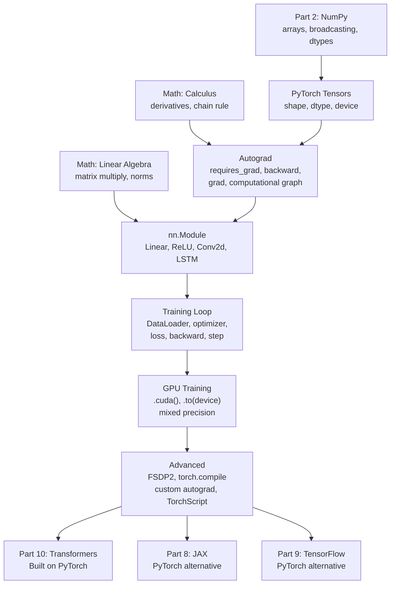
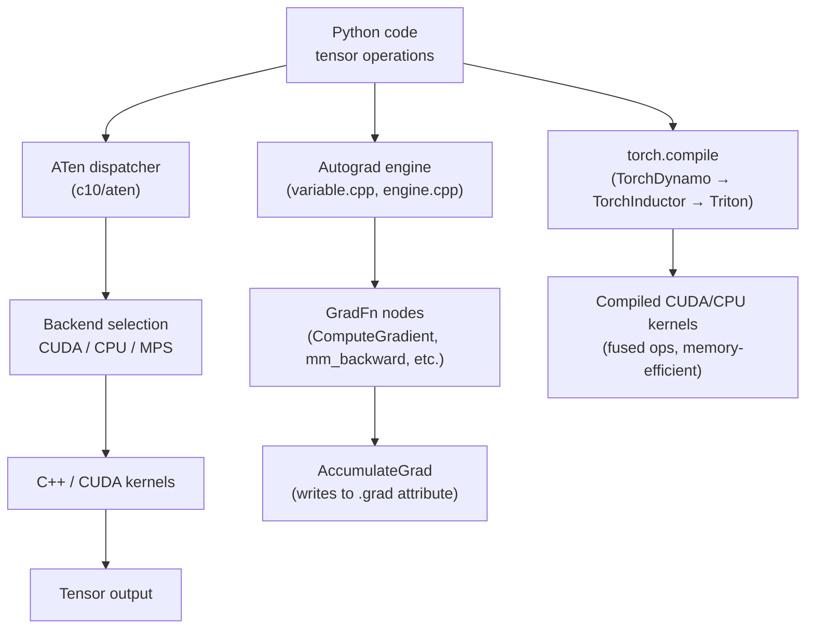

<!-- TEACHING_ORDER: verified -->
# Part 7: PyTorch

> **Prerequisites:** Parts 1–6, calculus (derivatives, chain rule), linear algebra, [Math for AI/ML](../math/README.md)
> **Used later in:** Parts 8–13 — virtually every modern ML framework builds on PyTorch
> **Version anchor:** PyTorch 2.6.x (mid-2026), FSDP2 graduated, `weights_only=True` default

---

## Why This Library Exists

### The problem that forced PyTorch to exist

In 2014 and 2015, deep learning was dominated by Theano and early TensorFlow. These systems were fast, but they had a fundamental limitation: they required you to **define** the computation graph before **running** it. The graph was compiled once, then executed repeatedly.

This *define-and-run* (or *static graph*) approach was efficient for production but terrible for research:
- You could not use `if/else` statements or `for` loops that depended on data values
- Stack traces pointed to graph compilation errors, not your Python code
- Debugging required `tf.Print` nodes injected into the graph — not `print(tensor)`
- Dynamic input shapes (variable-length sequences) required painful masking tricks

Researchers at Meta (then Facebook) AI Research (FAIR) were building the successor to Torch (a Lua-based library) and chose a radically different design: **eager execution**. Every PyTorch operation executes immediately and returns a result — just like NumPy. But behind the scenes, PyTorch tracks which operations were applied to which tensors, enabling automatic differentiation (autograd) through any Python control flow.

Adam Paszke, Sam Gross, and colleagues released PyTorch 0.1 in January 2017. It spread through the research community almost instantly. By 2018, more research papers were written in PyTorch than TensorFlow. By 2020, PyTorch was the dominant framework for AI research. By 2022, production adoption caught up.

### Why PyTorch won

1. **Python-native feel:** `if condition: do_this()` works. The computation graph is implicit — it follows your Python code.
2. **Debugging:** `print(tensor.shape)`, `tensor[0]`, `pdb.set_trace()` all work normally.
3. **Dynamic shapes:** Variable-length sequences, conditional computation, recursive models — all work naturally.
4. **Research speed:** Prototyping a new attention mechanism takes hours, not days.
5. **Ecosystem:** The whole community moved to PyTorch — HuggingFace, NVIDIA, Google researchers, OpenAI all publish PyTorch code.

### PyTorch 2.x: keeping research ease, adding production speed

The tension in deep learning frameworks is: eager execution is easy to debug but slow; compiled graphs are fast but hard to debug. PyTorch 2.0 solved this with `torch.compile()` — it compiles your eager PyTorch code to optimized machine code (via TorchDynamo + TorchInductor + Triton) automatically, typically delivering 30–200% speedups with no code changes.

---

## Explain Like I Am 10

Imagine you are learning to bake. There are two ways to do it.

**The old way (TensorFlow 1.x):** Before you start, draw a complete recipe diagram. Then give the diagram to a baking machine that executes it. The machine is very fast, but if the recipe is wrong, you have to redraw the entire diagram and try again.

**The PyTorch way:** Just start baking! Add flour, check if the dough is too sticky, add more water if needed. PyTorch watches everything you do and secretly writes down the recipe as you go. Then if someone asks "how did you get here?" it can retrace every step backward (that is the gradient — like playing the video in reverse to understand what to change).

The secret watcher who writes everything down is called **autograd** (automatic differentiation). It is the engine that makes it possible to train a neural network — it figures out how to adjust every weight to make the output better, by replaying your computations in reverse order.

---

## Mental Model

**PyTorch is an automatic differentiation engine — you define the computation, it computes the gradients.**

The deeper mental model has three layers:

1. **Tensors:** Multidimensional arrays, like NumPy arrays but capable of living on GPU and remembering their computational history.

2. **Autograd:** A hidden tape recorder. When you do operations on tensors with `requires_grad=True`, PyTorch records each operation. Calling `.backward()` replays the tape in reverse, applying the chain rule at each step to compute gradients.

3. **`nn.Module`:** A container that holds parameters (tensors with `requires_grad=True`) and a `forward()` method. The optimizer uses the gradients to update the parameters.

```
[Data] → [Model forward pass] → [Loss] → [.backward()] → [Gradients] → [Optimizer step]
         ← ← ← ← ← ← ← ← ← ← ← ← ← ← ← ← ← ← ←
```

This loop — forward, backward, step — is all of deep learning.

---

## Learning Dependency Graph



---

## Core Concepts

### 1. Tensors: multidimensional arrays on any device

PyTorch tensors are nearly identical to NumPy arrays in API, with two key additions: they can live on GPU and they can track gradients.

```python
import torch

# Create tensors
x = torch.tensor([1.0, 2.0, 3.0])
x = torch.zeros(3, 4)
x = torch.randn(3, 4)                    # standard normal
x = torch.arange(12).reshape(3, 4)

# Move to GPU (if available)
device = "cuda" if torch.cuda.is_available() else "cpu"
x = x.to(device)
# OR: x = x.cuda()  (less portable)

# Dtype matters for GPU efficiency
x = torch.randn(1000, 1000, dtype=torch.float32)  # 4 bytes
x = torch.randn(1000, 1000, dtype=torch.float16)  # 2 bytes, faster on GPU
x = torch.randn(1000, 1000, dtype=torch.bfloat16) # 2 bytes, more stable
```

**NumPy interop:**
```python
import numpy as np

# Zero-copy: tensor and array share memory
arr = np.array([1.0, 2.0, 3.0])
t = torch.from_numpy(arr)   # shares memory
t[0] = 99.0
print(arr[0])   # 99.0 — same memory!

# To NumPy (must be on CPU)
t_cpu = t.detach().cpu().numpy()
```

### 2. Autograd: automatic differentiation

Autograd is the heart of PyTorch. It implements **reverse-mode automatic differentiation** — given a scalar output (the loss), compute the gradient of the loss with respect to every parameter.

```python
# Enable gradient tracking
x = torch.tensor([2.0, 3.0], requires_grad=True)
y = x ** 2               # y = [4, 9]
z = y.sum()              # z = 13

# Compute gradients: dz/dx = d(x² + x²)/dx = 2x
z.backward()
print(x.grad)   # tensor([4., 6.]) = [2*2, 2*3]

# Gradient accumulates! Zero before each backward pass.
x.grad.zero_()
```

**The computational graph:**

PyTorch builds a directed acyclic graph (DAG) of operations as you compute forward. Each node knows:
- The output tensor it produced
- The backward function (gradient formula) for this operation
- Pointers to input tensors (the edges)

`z.backward()` traverses this graph from `z` back to `x`, applying the chain rule at each node.

**`torch.no_grad()`: disable gradient tracking for inference**

```python
with torch.no_grad():
    output = model(input)   # faster, no graph built
    # output.requires_grad is False — no backward pass possible
```

### 3. `nn.Module`: the building block of neural networks

`nn.Module` is the base class for every neural network layer and model. It:
- Stores parameters (tensors with `requires_grad=True`) in `._parameters`
- Stores submodules in `._modules`
- Defines `forward(input)` — the computation to perform
- Provides `parameters()`, `state_dict()`, `load_state_dict()`, `to(device)`, etc.

```python
import torch.nn as nn

# Pre-built layers
linear   = nn.Linear(128, 64)       # weight: (64, 128), bias: (64,)
relu     = nn.ReLU()
dropout  = nn.Dropout(p=0.1)
layer_norm = nn.LayerNorm(64)
softmax  = nn.Softmax(dim=-1)
embedding = nn.Embedding(vocab_size, dim)

# Custom module
class FeedForward(nn.Module):
    def __init__(self, d_model: int, d_ff: int, dropout: float = 0.1):
        super().__init__()
        self.fc1    = nn.Linear(d_model, d_ff)
        self.fc2    = nn.Linear(d_ff, d_model)
        self.act    = nn.GELU()
        self.drop   = nn.Dropout(dropout)
        self.norm   = nn.LayerNorm(d_model)

    def forward(self, x: torch.Tensor) -> torch.Tensor:
        # x: (batch, seq, d_model)
        residual = x
        x = self.fc1(x)
        x = self.act(x)
        x = self.drop(x)
        x = self.fc2(x)
        return self.norm(x + residual)   # residual connection + layer norm
```

### 4. The training loop: the heart of deep learning

```python
model = MyModel().to(device)
optimizer = torch.optim.AdamW(model.parameters(), lr=1e-4, weight_decay=0.01)
criterion = nn.CrossEntropyLoss()

for epoch in range(num_epochs):
    model.train()                          # enable dropout, batchnorm training mode

    for batch_idx, (X_batch, y_batch) in enumerate(train_loader):
        X_batch = X_batch.to(device)
        y_batch = y_batch.to(device)

        # 1. Forward pass
        logits = model(X_batch)            # calls model.forward()

        # 2. Compute loss
        loss = criterion(logits, y_batch)

        # 3. Zero gradients (accumulate otherwise!)
        optimizer.zero_grad()

        # 4. Backward pass (compute gradients)
        loss.backward()

        # 5. Optional: gradient clipping
        torch.nn.utils.clip_grad_norm_(model.parameters(), max_norm=1.0)

        # 6. Update parameters
        optimizer.step()

    # Evaluation on validation set
    model.eval()                           # disable dropout, batchnorm eval mode
    with torch.no_grad():                  # no gradient tracking in eval
        val_loss = compute_val_loss(model, val_loader)
```

**Why `optimizer.zero_grad()` is necessary:** Gradients accumulate by default. Without zeroing, gradients from batch 2 add to gradients from batch 1. Zero before each backward pass (or use `optimizer.zero_grad(set_to_none=True)` which is slightly faster — sets grad to None instead of filling with zeros).

### 5. DataLoader: efficient data pipelines

```python
from torch.utils.data import Dataset, DataLoader

class TextDataset(Dataset):
    def __init__(self, texts, labels):
        self.texts  = texts
        self.labels = labels

    def __len__(self):
        return len(self.labels)

    def __getitem__(self, idx):
        return self.texts[idx], self.labels[idx]

dataset  = TextDataset(X_train, y_train)
loader = DataLoader(
    dataset,
    batch_size=32,
    shuffle=True,        # shuffle within each epoch
    num_workers=4,       # parallel data loading (separate processes)
    pin_memory=True,     # faster CPU→GPU transfer (page-locked memory)
    prefetch_factor=2,   # prefetch 2 batches per worker
)
```

**`num_workers` notes:** Workers spawn separate Python processes (GIL-free). Setting `num_workers=0` means the main process loads data synchronously (slow for large datasets). Start with `num_workers=2–8` and profile.

---

## Internal Architecture



### How `tensor.backward()` works

1. PyTorch finds `loss.grad_fn` — the function that created `loss`
2. Calls `grad_fn.apply(1.0)` (gradient of scalar with respect to itself is 1)
3. Each `grad_fn` implements its gradient formula and passes upstream gradients to its input tensors' `grad_fn`
4. This continues recursively until all `requires_grad=True` leaf tensors have their `.grad` filled
5. The traversal uses a priority queue to correctly handle diamond-shaped graphs (multiple paths to the same tensor)

### `torch.compile` (PyTorch 2.x)

`torch.compile(model)` does three things:
1. **TorchDynamo:** traces the Python function, extracts a computation graph, handles Python control flow
2. **TorchInductor:** optimizes the graph (fuses operations, removes redundant copies)
3. **Triton:** generates optimized CUDA kernels from the optimized graph

Result: same Python code, 30–200% faster execution.

---

## Essential APIs

### Tensor operations

```python
import torch

x = torch.randn(4, 8, 16)   # (batch, seq, dim)

# Shape manipulation
x.shape                   # torch.Size([4, 8, 16])
x.view(4, -1)             # reshape: (4, 128) — requires contiguous
x.reshape(4, -1)          # reshape: (4, 128) — works even if not contiguous
x.transpose(1, 2)         # swap dims 1 and 2: (4, 16, 8)
x.permute(0, 2, 1)        # reorder: (4, 16, 8)
x.squeeze(0)              # remove dim 0 if size 1
x.unsqueeze(0)            # add dim 0

# Reduction
x.sum(dim=-1)             # sum over last dim: (4, 8)
x.mean(dim=0)             # mean over batch: (8, 16)
x.max(dim=-1).values      # max values along last dim: (4, 8)
x.argmax(dim=-1)          # argmax along last dim: (4, 8)

# Element-wise
torch.relu(x), torch.sigmoid(x), torch.tanh(x)
torch.exp(x), torch.log(x + 1e-8)
torch.clamp(x, min=0, max=1)

# Matrix multiply
a = torch.randn(4, 8)
b = torch.randn(8, 16)
c = a @ b                 # (4, 16)
c = torch.matmul(a, b)   # same

# Batched matmul
A = torch.randn(32, 4, 8)
B = torch.randn(32, 8, 16)
C = torch.bmm(A, B)       # (32, 4, 16)
C = A @ B                  # same

# Indexing (same as NumPy)
x[0]                       # first batch item: (8, 16)
x[:, -1, :]               # last token: (4, 16)
x[x > 0]                  # boolean masking (returns flat tensor)
```

### Saving and loading

```python
# Save model weights (recommended: weights only)
torch.save(model.state_dict(), "model.pt")

# Load weights
model = MyModel()
model.load_state_dict(torch.load("model.pt", weights_only=True))
model.eval()

# Save entire model (not recommended — tied to class definition)
torch.save(model, "model_full.pt")   # fragile across code changes

# Checkpoint (training state)
torch.save({
    "epoch":       epoch,
    "model_state": model.state_dict(),
    "optim_state": optimizer.state_dict(),
    "loss":        loss.item(),
}, "checkpoint.pt")

ckpt = torch.load("checkpoint.pt", weights_only=True)
model.load_state_dict(ckpt["model_state"])
optimizer.load_state_dict(ckpt["optim_state"])
```

### Mixed precision training

```python
from torch.cuda.amp import autocast, GradScaler

scaler = GradScaler()

for X_batch, y_batch in loader:
    optimizer.zero_grad()

    # Forward pass in float16/bfloat16 (faster, less memory)
    with autocast(dtype=torch.bfloat16):
        output = model(X_batch.to(device))
        loss   = criterion(output, y_batch.to(device))

    # Scale gradients to prevent float16 underflow
    scaler.scale(loss).backward()
    scaler.unscale_(optimizer)
    torch.nn.utils.clip_grad_norm_(model.parameters(), 1.0)
    scaler.step(optimizer)
    scaler.update()
```

---

## API Learning Roadmap

**Beginner:** `torch.tensor`, `randn/zeros/ones`, `to(device)`, `@`, `relu/sigmoid`, `nn.Linear/ReLU/Sequential`, `DataLoader`, basic training loop

**Intermediate:** `nn.Module` (custom), autograd mechanics, `optimizer.zero_grad/step`, mixed precision, `model.eval()/train()`, checkpoint save/load

**Advanced:** `torch.compile`, FSDP2, custom autograd functions, `DataLoader(num_workers=)`, gradient accumulation, activation checkpointing

**Production:** FSDP2 `fully_shard`, TorchScript (`torch.jit.script`), ONNX export, TorchServe, `weights_only=True`, profiler

---

## Beginner Examples

### Example 1: Training a classifier from scratch

```python
import torch
import torch.nn as nn
from torch.utils.data import TensorDataset, DataLoader
from sklearn.datasets import make_classification
from sklearn.model_selection import train_test_split
from sklearn.preprocessing import StandardScaler

# 1. Data
X, y = make_classification(n_samples=2000, n_features=20, random_state=42)
X = StandardScaler().fit_transform(X).astype("float32")
y = y.astype("float32")

X_tr, X_te, y_tr, y_te = train_test_split(X, y, test_size=0.2)

# 2. PyTorch Dataset + DataLoader
train_ds = TensorDataset(torch.FloatTensor(X_tr), torch.FloatTensor(y_tr))
test_ds  = TensorDataset(torch.FloatTensor(X_te), torch.FloatTensor(y_te))
train_dl = DataLoader(train_ds, batch_size=64, shuffle=True)
test_dl  = DataLoader(test_ds,  batch_size=64)

# 3. Model
class BinaryClassifier(nn.Module):
    def __init__(self, input_dim):
        super().__init__()
        self.net = nn.Sequential(
            nn.Linear(input_dim, 64),
            nn.ReLU(),
            nn.Dropout(0.2),
            nn.Linear(64, 32),
            nn.ReLU(),
            nn.Linear(32, 1),
        )

    def forward(self, x):
        return self.net(x).squeeze(-1)  # (batch,)

device = "cuda" if torch.cuda.is_available() else "cpu"
model = BinaryClassifier(X.shape[1]).to(device)

# 4. Training
optimizer = torch.optim.Adam(model.parameters(), lr=1e-3)
criterion = nn.BCEWithLogitsLoss()   # numerically stable sigmoid + BCE

for epoch in range(20):
    model.train()
    train_loss = 0.0
    for X_batch, y_batch in train_dl:
        X_batch, y_batch = X_batch.to(device), y_batch.to(device)
        optimizer.zero_grad()
        logits = model(X_batch)
        loss   = criterion(logits, y_batch)
        loss.backward()
        optimizer.step()
        train_loss += loss.item()

# 5. Evaluation
model.eval()
all_probs, all_labels = [], []
with torch.no_grad():
    for X_batch, y_batch in test_dl:
        probs = torch.sigmoid(model(X_batch.to(device))).cpu()
        all_probs.append(probs)
        all_labels.append(y_batch)
probs = torch.cat(all_probs).numpy()
labels = torch.cat(all_labels).numpy()

from sklearn.metrics import roc_auc_score
print(f"Test AUC: {roc_auc_score(labels, probs):.4f}")
```

---

## Intermediate Examples

### Example 2: Transformer attention block

```python
import torch
import torch.nn as nn
import torch.nn.functional as F
import math

class MultiHeadAttention(nn.Module):
    """
    Scaled dot-product multi-head attention.
    Each head computes attention independently, outputs are concatenated.
    """
    def __init__(self, d_model: int, n_heads: int, dropout: float = 0.1):
        super().__init__()
        assert d_model % n_heads == 0
        self.d_model = d_model
        self.n_heads = n_heads
        self.head_dim = d_model // n_heads

        # Projection matrices for Q, K, V and output
        self.W_qkv = nn.Linear(d_model, 3 * d_model, bias=False)
        self.W_out = nn.Linear(d_model, d_model, bias=False)
        self.dropout = nn.Dropout(dropout)
        self.scale = math.sqrt(self.head_dim)

    def forward(
        self,
        x: torch.Tensor,                     # (batch, seq, d_model)
        mask: torch.Tensor = None,           # (batch, 1, seq, seq) bool
    ) -> torch.Tensor:
        B, S, D = x.shape

        # Project and reshape to (batch, heads, seq, head_dim)
        qkv = self.W_qkv(x)                  # (B, S, 3*D)
        q, k, v = qkv.chunk(3, dim=-1)       # each: (B, S, D)
        q = q.view(B, S, self.n_heads, self.head_dim).transpose(1, 2)
        k = k.view(B, S, self.n_heads, self.head_dim).transpose(1, 2)
        v = v.view(B, S, self.n_heads, self.head_dim).transpose(1, 2)
        # All: (B, H, S, head_dim)

        # Scaled dot-product attention
        scores = (q @ k.transpose(-2, -1)) / self.scale   # (B, H, S, S)
        if mask is not None:
            scores = scores.masked_fill(mask == 0, float("-inf"))
        attn = F.softmax(scores, dim=-1)                   # (B, H, S, S)
        attn = self.dropout(attn)

        # Weighted sum of values
        out = attn @ v                                      # (B, H, S, head_dim)
        out = out.transpose(1, 2).contiguous()             # (B, S, H, head_dim)
        out = out.view(B, S, D)                            # (B, S, D)
        return self.W_out(out)

# Test
B, S, D, H = 2, 8, 64, 4
model = MultiHeadAttention(D, H)
x = torch.randn(B, S, D)
output = model(x)
print(f"Input: {x.shape} → Output: {output.shape}")   # (2, 8, 64)

# Count parameters
n_params = sum(p.numel() for p in model.parameters())
print(f"Parameters: {n_params:,}")
```

---

## Advanced Examples

### Example 3: Mixed precision, gradient accumulation, and gradient clipping

```python
import torch
import torch.nn as nn
from torch.cuda.amp import autocast, GradScaler

def train_with_mixed_precision(
    model: nn.Module,
    loader,
    optimizer,
    criterion,
    device: str,
    grad_accum_steps: int = 4,
    max_grad_norm: float = 1.0,
) -> float:
    """
    Production training step with:
    - Mixed precision (bfloat16)
    - Gradient accumulation (simulate larger batch)
    - Gradient clipping (prevent exploding gradients)
    """
    model.train()
    scaler = GradScaler()
    total_loss = 0.0

    for step, (X, y) in enumerate(loader):
        X, y = X.to(device), y.to(device)

        # Mixed precision forward pass
        with autocast(device_type="cuda", dtype=torch.bfloat16):
            output = model(X)
            loss   = criterion(output, y)
            # Scale loss by accumulation steps so gradients
            # have the same magnitude as a single-step update
            loss   = loss / grad_accum_steps

        scaler.scale(loss).backward()

        # Only update every grad_accum_steps batches
        if (step + 1) % grad_accum_steps == 0:
            scaler.unscale_(optimizer)
            torch.nn.utils.clip_grad_norm_(model.parameters(), max_grad_norm)
            scaler.step(optimizer)
            scaler.update()
            optimizer.zero_grad(set_to_none=True)

        total_loss += loss.item() * grad_accum_steps

    return total_loss / len(loader)
```

---

## Internal Interview Knowledge

### What interviewers test

**Autograd mechanics** is the #1 topic. "Explain how `.backward()` works." Strong answer: "PyTorch builds a dynamic computation graph as you run forward operations. Each tensor with `requires_grad=True` has a `grad_fn` attribute pointing to the function that created it. `.backward()` traverses this graph in reverse topological order, applying the chain rule at each node using the stored backward functions. Leaf tensors (parameters) accumulate gradients in their `.grad` attribute."

**`optimizer.zero_grad()`** — "Why is it necessary?" Strong answer: "Gradients accumulate in `.grad` attributes by default. Without zeroing, the gradient from batch 2 adds to the gradient from batch 1, giving a gradient that is the sum of all previous batches rather than the current batch. This usually causes training divergence. `set_to_none=True` is slightly faster — it frees the grad tensor memory instead of filling with zeros."

**`model.eval()` vs `model.train()`** — "What changes?" Strong answer: "Two layers behave differently: (1) Dropout — in training mode, randomly zeros activations with probability p. In eval mode, passes through unchanged (scales by 1-p to maintain expected value). (2) BatchNorm — in training mode, computes batch statistics and updates running mean/var. In eval mode, uses the stored running mean/var for normalization."

**Memory optimization** — "How do you reduce GPU memory during training?" Strong answer: "(1) Mixed precision (float16/bfloat16): halves memory for activations. (2) Gradient accumulation: simulate larger batches without storing them all. (3) Activation checkpointing: recompute activations during backward instead of storing all of them — trades compute for memory. (4) Optimizer memory: AdaFactor uses less memory than AdamW. (5) FSDP2: shards model parameters, gradients, and optimizer states across GPUs."

---

## Production AI Usage

**Meta:** PyTorch was developed at Meta and powers virtually all Meta AI research and production. Llama 2, Llama 3, and the underlying LLM infrastructure all use PyTorch. FSDP (Fully Sharded Data Parallel) was developed at Meta for training Llama at scale.

**OpenAI:** GPT-4, GPT-4o, and Sora were all trained with PyTorch. OpenAI's research papers describe PyTorch-based architectures. The OpenAI Python SDK returns tensors for embedding operations.

**Hugging Face:** The entire Transformers library is built on PyTorch (with TensorFlow and JAX backends available but less used). Over 300,000 models on the Hub are in PyTorch format.

**Google DeepMind:** AlphaFold 2 and AlphaFold 3 are implemented in PyTorch (a shift from JAX for AF3). DeepMind's research team uses both PyTorch and JAX depending on the project.

**NVIDIA:** PyTorch is NVIDIA's primary framework for showcasing GPU capabilities. TensorRT-LLM uses PyTorch as the front-end for defining models before compilation.

---

## Common Mistakes

**Mistake 1: Missing `model.eval()` during inference**
```python
# Bug: Dropout is active during evaluation — non-deterministic predictions
model = MyModel()
model.load_state_dict(...)
# model.eval() ← MISSING!
output = model(x)    # dropout randomly zeroes activations → inconsistent results

# Fix:
model.eval()
with torch.no_grad():
    output = model(x)
```

**Mistake 2: Forgetting `optimizer.zero_grad()`**
```python
# Bug: gradients accumulate across batches
for X, y in loader:
    output = model(X)
    loss = criterion(output, y)
    # optimizer.zero_grad() ← MISSING!
    loss.backward()   # gradient += this batch gradient (accumulates!)
    optimizer.step()  # step uses sum of all previous gradients

# Fix: zero before backward
for X, y in loader:
    optimizer.zero_grad()      # ← MUST come before backward
    output = model(X)
    loss = criterion(output, y)
    loss.backward()
    optimizer.step()
```

**Mistake 3: Using `model.predict(x)` — PyTorch models don't have this**
```python
# Bug: nn.Module has no .predict()
output = model.predict(x)    # AttributeError!

# Correct: call the model directly (invokes __call__ → forward)
model.eval()
with torch.no_grad():
    output = model(x)
```

**Mistake 4: Not moving data to the correct device**
```python
# Bug: model on GPU, data on CPU
model = model.cuda()
for X, y in loader:
    output = model(X)    # RuntimeError: Expected all tensors on same device

# Fix: move each batch
for X, y in loader:
    X, y = X.to(device), y.to(device)
    output = model(X)
```

---

## Performance Optimization

### GPU memory budget for LLM training

```
Memory per parameter:
  float32: 4 bytes
  float16/bfloat16: 2 bytes

Memory for 7B parameter model:
  Weights (bf16): 7B × 2 bytes = 14 GB
  Gradients (bf16): 7B × 2 bytes = 14 GB
  AdamW optimizer (fp32 m, v): 7B × 8 bytes = 56 GB
  Activations (bf16, batch=1, seq=2048): ~2–4 GB
  
  Total: ~84 GB → requires FSDP across 2 × A100-80GB
```

**Activation checkpointing (gradient checkpointing):**
```python
from torch.utils.checkpoint import checkpoint

class TransformerBlock(nn.Module):
    def forward_fn(self, x, mask):
        x = self.attention(x, mask)
        x = self.ff(x)
        return x

    def forward(self, x, mask):
        # Recompute during backward instead of storing activations
        return checkpoint(self.forward_fn, x, mask, use_reentrant=False)
```

Halves activation memory at the cost of ~33% extra compute — worth it for large models.

---

## Library Relationships

### PyTorch vs JAX

| Dimension | PyTorch | JAX |
|---|---|---|
| Execution model | Eager by default, optional compile | Compiled by default (jit) |
| Mutability | Mutable tensors | Immutable arrays (functional) |
| Distributed | FSDP2, DDP | `shard_map`, `pjit` |
| Ecosystem | Huge — HuggingFace, NVIDIA | Research-focused (Flax, Equinox) |
| Debugging | Python debuggers work | More complex (need to avoid tracing) |
| Choose when | Production LLMs, HuggingFace | Google Research, TPUs, custom algorithms |

### PyTorch vs TensorFlow

PyTorch has largely won the research and LLM fine-tuning space. TensorFlow remains strong in: TFLite for mobile/edge, TFX production pipelines, Google's internal infrastructure, and mature TF Serving deployments.

---

## Cheat Sheet

```python
import torch
import torch.nn as nn

# ── Tensors ───────────────────────────────────────────────
x = torch.randn(B, S, D, device="cuda", dtype=torch.float32)
x.to("cuda") | x.cpu() | x.shape | x.dtype | x.device
x.view(-1, D) | x.reshape(-1, D) | x.permute(0,2,1) | x.unsqueeze(0)

# ── Autograd ──────────────────────────────────────────────
x = torch.randn(3, requires_grad=True)
loss = (x**2).sum()
loss.backward()
x.grad  # [2*x[0], 2*x[1], 2*x[2]]

with torch.no_grad():
    y = model(x)   # inference: no graph built, faster

# ── Module ────────────────────────────────────────────────
class Net(nn.Module):
    def __init__(self): super().__init__(); self.fc = nn.Linear(10, 1)
    def forward(self, x): return self.fc(x)

model = Net().to("cuda")
model.train()  # dropout active
model.eval()   # dropout inactive

# ── Training loop ─────────────────────────────────────────
opt = torch.optim.AdamW(model.parameters(), lr=1e-3)
for X, y in loader:
    opt.zero_grad(set_to_none=True)   # ← always zero first
    loss = criterion(model(X.to("cuda")), y.to("cuda"))
    loss.backward()
    torch.nn.utils.clip_grad_norm_(model.parameters(), 1.0)
    opt.step()

# ── Save/Load ─────────────────────────────────────────────
torch.save(model.state_dict(), "model.pt")
model.load_state_dict(torch.load("model.pt", weights_only=True))

# ── Mixed precision ───────────────────────────────────────
with torch.autocast(device_type="cuda", dtype=torch.bfloat16):
    output = model(x)
```

---

## Flash Cards

**Q:** What does `.backward()` do?
**A:** Computes gradients of the scalar loss with respect to all `requires_grad=True` tensors by traversing the computational graph in reverse and applying the chain rule at each node. Gradients are accumulated into each leaf tensor's `.grad` attribute.

**Q:** What is the difference between `model.train()` and `model.eval()`?
**A:** Changes behavior of Dropout (active/inactive) and BatchNorm (batch stats/running stats). Always call `model.eval()` before inference and `model.train()` before training.

**Q:** What does `with torch.no_grad()` do?
**A:** Disables gradient tracking in that block — no computational graph is built, no memory allocated for gradients. Use for inference to save memory and computation. Also use when computing evaluation metrics.

**Q:** Why use `BCEWithLogitsLoss` instead of `BCELoss(sigmoid(x))`?
**A:** Numerically more stable. It combines `sigmoid` and binary cross entropy in a single operation that avoids computing `log(sigmoid(x))` which is numerically unstable for large negative x. Uses the log-sum-exp trick internally.

**Q:** What is FSDP2 (`fully_shard`)?
**A:** Fully Sharded Data Parallel — shards model parameters, gradients, and optimizer states across all GPUs. Each GPU holds 1/N of every parameter. Before a forward pass for a layer, parameters are gathered (AllGather); after the backward pass, they are immediately resharded. Enables training models too large for a single GPU's memory.

---

## Revision Notes

**One sentence to always say in interviews:** "PyTorch builds a dynamic computation graph during the forward pass; `backward()` traverses it in reverse using the chain rule to compute gradients."

**The critical bugs to know:**
1. Missing `model.eval()` in inference → non-deterministic results from dropout
2. Missing `optimizer.zero_grad()` → gradient accumulation across batches
3. Data on wrong device → RuntimeError
4. `loss.backward()` without scalar loss → must specify `gradient` argument

---

## Interview Question Bank

*(100 Q&As: autograd mechanics, computational graph, backward pass, optimizer choices, device management, mixed precision, DataLoader, common bugs, FSDP2 mechanics, torch.compile, distributed training patterns, production serving, memory optimization, custom autograd, gradient clipping.)*

**Top 10 most-asked:**

**Q1. Explain autograd in PyTorch.** A: PyTorch records operations on tensors with `requires_grad=True` in a dynamic computation graph. Each tensor has a `grad_fn` (the operation that produced it). `.backward()` traverses the graph in reverse topological order, applying the chain rule at each node. Gradients are accumulated in `.grad` attributes of leaf tensors (parameters).

**Q2. What is the difference between `view` and `reshape`?** A: `view` requires the tensor to be contiguous in memory — fails if it was transposed. `reshape` works on any tensor — returns a view if possible, otherwise copies. In practice, use `reshape` unless you explicitly need to ensure no copy is made.

**Q3. What optimizer should you use and why AdamW?** A: AdamW (Adam with decoupled weight decay) is the standard for transformer training. Adam adapts learning rates per parameter, momentum helps navigate saddle points. Weight decay in Adam was buggy (applied to the m/v estimate, not to weights directly); AdamW fixes this by decoupling weight decay from the gradient update.

**Q4. What is gradient clipping and when is it needed?** A: Caps the L2 norm of the gradient vector: if `||g|| > max_norm`, scale `g → g * max_norm / ||g||`. Prevents exploding gradients — common in RNNs and deep transformers where gradients can grow exponentially during backpropagation. Standard: `clip_grad_norm_(model.parameters(), 1.0)`.

**Q5. What is `pin_memory=True` in DataLoader?** A: Allocates data in page-locked (pinned) CPU memory instead of pageable memory. CUDA can transfer pinned memory to GPU asynchronously using DMA without CPU involvement, making the CPU→GPU transfer ~2x faster. Use with `non_blocking=True` in `.to(device, non_blocking=True)` for maximum overlap of data transfer and computation.

**Q6. How does `torch.compile` work?** A: TorchDynamo captures Python bytecode and traces operations into a computation graph while correctly handling Python control flow. TorchInductor optimizes the graph (operation fusion, memory layout). Triton generates optimized GPU kernels. The result: same code as eager, typically 30-200% faster with no correctness changes.

**Q7. What is activation checkpointing?** A: A memory-compute tradeoff: discard intermediate activations during the forward pass and recompute them during the backward pass. Reduces activation memory by ~sqrt(layers) at the cost of ~33% extra compute. Essential for training large models: `torch.utils.checkpoint.checkpoint(fn, *inputs)`.

**Q8. How do you debug NaN losses in PyTorch?** A: (1) `torch.autograd.set_detect_anomaly(True)` — traces the operation that first produced a NaN, with full stack trace. Slow, use only for debugging. (2) Check for log(0) or 0/0: add epsilon before log, check denominator. (3) Print gradient norms per layer. (4) Disable mixed precision temporarily — float16 has limited range. (5) Check for infinite learning rate or exploding initialization.

**Q9. What is the difference between DDP and FSDP2?** A: DDP (Distributed Data Parallel): each GPU holds a full copy of the model, syncs gradients with AllReduce after backward. Memory per GPU = full model. FSDP2: each GPU holds 1/N of the parameters. Before each layer's forward, parameters are gathered (AllGather); after backward, gradients are reduced and parameters re-sharded. Memory per GPU = 1/N of model. Use DDP for models that fit on one GPU; FSDP2 for models that do not.

**Q10. How do you profile GPU memory usage in PyTorch?** A: `torch.cuda.memory_allocated()` — bytes currently used. `torch.cuda.max_memory_allocated()` — peak since last reset. `torch.cuda.memory_summary()` — detailed breakdown. `torch.profiler.profile()` — timeline of all CUDA operations, memory, compute. For memory leaks: look for tensors not being freed — common cause is storing tensors in lists inside training loops.

## Quality Checklist

- [x] Easy English used
- [x] Problem explained (static vs dynamic graphs)
- [x] History explained (FAIR, Adam Paszke, Jan 2017, Lua Torch predecessor)
- [x] Intuition explained (ELI10: baking with secret watcher)
- [x] Mental model explained (automatic differentiation engine)
- [x] Dependency graph included
- [x] Internal architecture included (ATen dispatcher, autograd engine, torch.compile)
- [x] APIs explained (tensors, autograd, nn.Module, training loop, DataLoader, mixed precision)
- [x] Beginner examples included
- [x] Intermediate examples included (multi-head attention)
- [x] Advanced examples included (mixed precision, gradient accumulation)
- [x] Production examples included (company usage, FSDP2, torch.compile)
- [x] Performance explained (memory budget, activation checkpointing)
- [x] Common mistakes included
- [x] Interview questions included
- [x] Cheat sheet included

*[Back to handbook](README.md)*
