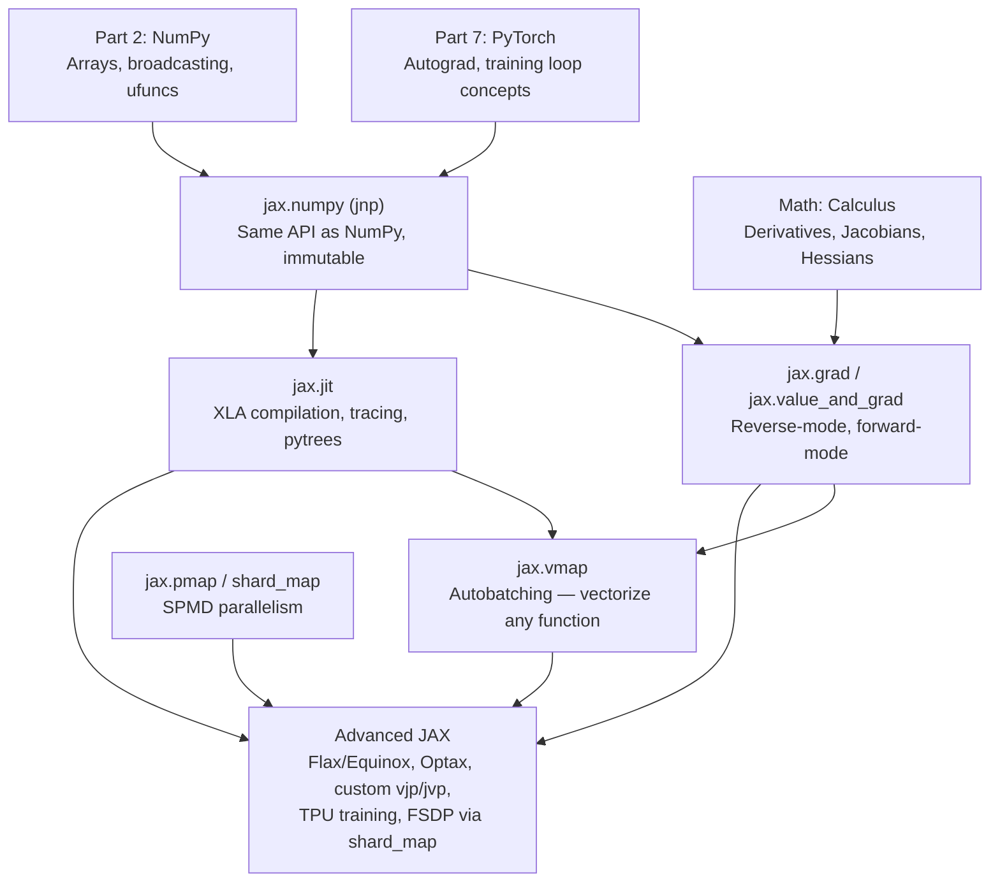
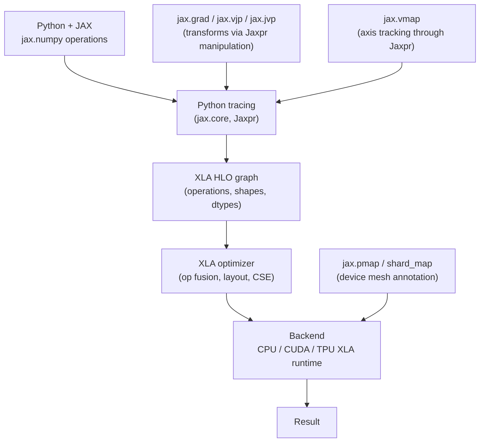

<!-- TEACHING_ORDER: verified -->
# Part 8: JAX

> **Prerequisites:** Parts 1–7 (especially NumPy and PyTorch), calculus (chain rule), linear algebra
> **Used later in:** Part 13 (Accelerate), advanced research frameworks (Flax, Equinox, Optax)
> **Version anchor:** JAX 0.4.30+ (mid-2026), with `jax.Array` unified device model

---

## Why This Library Exists

### The problem: NumPy is fast but not differentiable, not GPU-native, and not parallel

NumPy was designed in the early 2000s for single-core CPU computation. By 2017, the deep learning community had outgrown it along three dimensions:

1. **Differentiability:** NumPy has no automatic differentiation. PyTorch solved this for neural networks, but with mutable state that complicated functional composition.
2. **Hardware acceleration:** NumPy has no GPU support. PyTorch added CUDA — but its eager execution model leaves GPU kernels suboptimal for complex operations.
3. **Massive parallelism:** Training on 1,024 TPUs or 512 GPUs requires *batching over devices* — the same operation applied to different slices of data in parallel. NumPy and PyTorch provide this through complicated distributed wrappers.

Google Brain researchers — primarily Matthew Johnson, Roy Frostig, and Dougal Maclaurin — wanted a library that felt like NumPy but could:
- Automatically differentiate any computation (not just pre-registered nn.Module operations)
- Compile to XLA (Accelerated Linear Algebra) for GPU/TPU — fusing operations, optimizing memory layout automatically
- Express single-program-multiple-data (SPMD) parallelism as simple function transformations

Their answer was JAX, released as open-source in December 2018. JAX stands for "Just After eXecution" — a nod to its "JIT after the fact" compilation model — but the name has also been back-explained as **J**it, **A**utograd, **X**LA.

### What makes JAX architecturally different from PyTorch

JAX's central design decision is **functional purity**: JAX operations have no side effects. There is no mutability in JAX arrays — every operation returns a new array. This constraint enables something profound:

- A JAX function `f(x) → y` can be traced once and compiled — because its output depends only on its inputs, not on mutable global state
- The same function can be differentiated (forward- and reverse-mode), JIT-compiled, vectorized (`vmap`), or parallelized (`pmap`/`shard_map`) using composable transformations

This is the functional programming philosophy applied to numerical computation.

---

## Explain Like I Am 10

Imagine you are a chef who writes recipes. A regular chef (NumPy/PyTorch) might have a kitchen with pots and pans that change — you pour soup in a pot, then stir it, and the pot contains the mixed soup.

JAX is a different kind of chef. Every time JAX makes something, it makes a brand new bowl for the result and leaves the original ingredient untouched. This sounds wasteful, but it turns out to be incredibly smart:

1. **Because nothing changes, you can film the recipe in your head** (JIT compilation — trace it once, run it many times).
2. **Because you know exactly what goes in and out, you can run the recipe on a thousand pots at once** (`vmap` — vectorization without writing loops).
3. **Because it is all pure math, you can automatically compute the recipe's sensitivity** — how much does changing a pinch of salt change the final taste? That is the gradient (`grad`).

The price: when you really do need to change something (like training weights), you have to keep track yourself. But JAX gives you tools to do this cleanly.

---

## Mental Model

**JAX is function transformations on pure numerical functions — `jit`, `grad`, `vmap`, `pmap` compose like mathematical operators.**

```
Python function f: Array → Array

grad(f)        → f', the derivative function
jit(f)         → same function, but compiled to XLA (faster)
vmap(f)        → batched f, vectorized over an axis
pmap(f)        → f distributed across multiple devices
shard_map(f)   → f with explicit device mesh (JAX 0.4+)

All transformations compose:
jit(grad(f))   → compiled derivative
vmap(grad(f))  → per-sample gradient (not average-over-batch)
```

The key mental shift from PyTorch: in JAX, **you write the math, not the model**. There is no `nn.Module`, no built-in parameter management — JAX just gives you the transformation tools. Libraries like Flax, Equinox, and Optax build the higher-level abstractions.

---

## Learning Dependency Graph



---

## Core Concepts

### 1. `jax.numpy`: NumPy but immutable and XLA-backed

```python
import jax
import jax.numpy as jnp
import numpy as np

# jnp mirrors np almost exactly
x = jnp.array([1.0, 2.0, 3.0])
y = jnp.zeros((3, 4))
z = jnp.ones((3, 4)) * 2.0

print(type(x))       # jaxlib.xla_extension.Array
print(x.device)      # CpuDevice(id=0) or CudaDevice(id=0)

# Operations return new arrays — never modify in place
a = jnp.arange(12.0).reshape(3, 4)
b = a + 1.0          # new array — a is unchanged
# a[0, 0] = 99.0     # ERROR: JAX arrays are immutable!

# Use .at[].set() for "mutations" (returns new array)
a_new = a.at[0, 0].set(99.0)
print(a[0, 0])       # still 0.0 — a unchanged
print(a_new[0, 0])   # 99.0

# NumPy interop
np_arr = np.array([1.0, 2.0])
jax_arr = jnp.array(np_arr)       # converts to JAX
back_to_np = np.asarray(jax_arr)  # converts to NumPy
```

**Why immutability?** It enables safe JIT compilation — the compiler can trace the function once and cache the compiled XLA code. Mutable state would invalidate cached compilations.

### 2. `jax.grad`: differentiate any Python function

```python
import jax
import jax.numpy as jnp

# grad takes a function and returns its gradient function
def f(x):
    return jnp.sum(x ** 2)   # f(x) = ||x||²

df = jax.grad(f)              # df/dx = 2x

x = jnp.array([2.0, 3.0])
print(df(x))                  # [4.0, 6.0]

# value_and_grad: return value AND gradient in one forward pass
loss_val, grad = jax.value_and_grad(f)(x)
print(f"f(x) = {loss_val}, grad = {grad}")

# Gradient with respect to specific argument
def loss(params, x, y):
    w, b = params
    pred = x @ w + b
    return jnp.mean((pred - y) ** 2)

# grad(loss) differentiates w.r.t. the FIRST argument (params)
grad_loss = jax.grad(loss)

params = (jnp.ones(5), jnp.zeros(1))
x = jnp.ones((10, 5))
y = jnp.ones((10, 1))
grads = grad_loss(params, x, y)
print(type(grads))   # tuple — same structure as params (pytree)
```

**`argnums` — differentiate w.r.t. specific arguments:**
```python
# Differentiate w.r.t. second argument
grad_wrt_x = jax.grad(loss, argnums=1)(params, x, y)
```

**Pytrees:** JAX automatically handles nested Python containers (lists, dicts, tuples) as argument structures. `jax.grad` returns gradients in the same tree structure as the input.

### 3. `jax.jit`: JIT-compile any function

```python
import jax
import jax.numpy as jnp
import time

def slow_matmul(x, y):
    return jnp.dot(x, y) + jnp.dot(y, x.T)

fast_matmul = jax.jit(slow_matmul)

x = jnp.ones((512, 512))
y = jnp.ones((512, 512))

# First call: traces and compiles (slow)
t0 = time.time()
result = fast_matmul(x, y)
result.block_until_ready()   # wait for async computation
print(f"First call (includes compilation): {time.time() - t0:.3f}s")

# Second call: runs compiled XLA code (fast)
t0 = time.time()
result = fast_matmul(x, y)
result.block_until_ready()
print(f"Second call (compiled):            {time.time() - t0:.3f}s")
```

**What JIT does:** Traces your Python function with abstract values (not real numbers). Converts Python operations into an XLA HLO (High Level Operations) computation graph. XLA optimizes the graph (fuses ops, eliminates redundant computations, selects optimal kernels) and compiles to machine code for the target device.

**The tracing constraint:** During tracing, Python control flow that depends on *array values* (not shapes) is problematic. JIT traces the path taken during the first call — different values that take different paths will retrace.

```python
# This causes retracing on different input values — avoid!
@jax.jit
def bad(x):
    if x[0] > 0:    # x[0] is abstract during tracing — evaluates as True
        return x * 2
    return x * -1

# Use jnp.where instead:
@jax.jit
def good(x):
    return jnp.where(x[0] > 0, x * 2, x * -1)
```

### 4. `jax.vmap`: vectorize any function without writing batch dimensions

`vmap` is one of JAX's most powerful features. Write a function that operates on a single example, then `vmap` automatically vectorizes it to operate on a batch — without loops.

```python
import jax
import jax.numpy as jnp

# Per-sample loss on a single (x, y) pair
def single_loss(x, y, w, b):
    pred = jnp.dot(x, w) + b
    return (pred - y) ** 2

# Vectorize over the first axis of x and y (in_axes=(0, 0, None, None))
# None means: don't vectorize this argument (shared across batch)
batched_loss = jax.vmap(single_loss, in_axes=(0, 0, None, None))

x_batch = jnp.ones((32, 5))
y_batch = jnp.ones(32)
w = jnp.ones(5)
b = jnp.float32(0.0)

losses = batched_loss(x_batch, y_batch, w, b)
print(f"Per-sample losses: {losses.shape}")   # (32,) — one loss per sample

# Per-sample gradients (not average gradient) — useful for DP-SGD, meta-learning
per_sample_grads = jax.vmap(jax.grad(single_loss), in_axes=(0, 0, None, None))
grads = per_sample_grads(x_batch, y_batch, w, b)
print(f"Per-sample grad shape: {grads[0].shape}")   # (32, 5) — grad w.r.t. w per sample
```

### 5. Training loop in JAX — managing state explicitly

JAX has no `nn.Module` or mutable parameter storage. You manage parameters as pytrees (typically dicts of arrays). The pattern:

```python
import jax
import jax.numpy as jnp
from functools import partial

# 1. Initialize parameters as a pytree
def init_mlp(layer_dims, key):
    params = {}
    for i, (in_dim, out_dim) in enumerate(zip(layer_dims[:-1], layer_dims[1:])):
        key, subkey = jax.random.split(key)
        # He initialization: scale by sqrt(2/fan_in)
        scale = jnp.sqrt(2.0 / in_dim)
        params[f"W{i}"] = jax.random.normal(subkey, (in_dim, out_dim)) * scale
        params[f"b{i}"] = jnp.zeros(out_dim)
    return params

# 2. Forward pass (pure function — no side effects)
def mlp_forward(params, x):
    n_layers = len(params) // 2
    for i in range(n_layers - 1):
        x = x @ params[f"W{i}"] + params[f"b{i}"]
        x = jax.nn.relu(x)
    x = x @ params[f"W{n_layers-1}"] + params[f"b{n_layers-1}"]
    return x

# 3. Loss function
def mse_loss(params, x, y):
    pred = mlp_forward(params, x)
    return jnp.mean((pred.squeeze() - y) ** 2)

# 4. JIT-compiled training step
@jax.jit
def train_step(params, x, y, learning_rate=0.01):
    loss, grads = jax.value_and_grad(mse_loss)(params, x, y)
    # Update: params = params - lr * grads (pytree operation)
    new_params = jax.tree_util.tree_map(
        lambda p, g: p - learning_rate * g,
        params, grads
    )
    return new_params, loss

# 5. Training loop
key = jax.random.key(42)
params = init_mlp([20, 64, 32, 1], key)

x = jax.random.normal(key, (100, 20))
y = jax.random.normal(key, (100,))

for step in range(100):
    params, loss = train_step(params, x, y)
    if step % 20 == 0:
        print(f"Step {step:3d} | loss: {loss:.4f}")
```

### 6. `jax.pmap` and `shard_map`: multi-device parallelism

```python
import jax
import jax.numpy as jnp

# pmap: replicate computation across devices, sync gradients via pmean
@jax.pmap
def parallel_train_step(params, x, y):
    loss, grads = jax.value_and_grad(mse_loss)(params, x, y)
    # Average gradients across devices
    grads = jax.lax.pmean(grads, axis_name="devices")
    new_params = jax.tree_util.tree_map(lambda p, g: p - 0.01 * g, params, grads)
    return new_params, loss
```

`shard_map` (JAX 0.4+) is the newer, more flexible API for SPMD parallelism, allowing explicit mesh specification — the foundation for multi-host TPU training.

---

## Internal Architecture



**Jaxpr (JAX expression):** The intermediate representation JAX uses. When you trace a function, JAX builds a Jaxpr — a list of primitive operations with abstract typed variables. All transformations (`grad`, `vmap`, `jit`) operate on Jaxprs. This is why transformations compose: each one transforms the Jaxpr, then the result can be transformed again.

---

## Essential APIs

```python
import jax
import jax.numpy as jnp

# ── Array creation ─────────────────────────────────────────────────────
jnp.array([1, 2, 3])
jnp.zeros((3, 4)), jnp.ones((3, 4)), jnp.eye(4)
jax.random.normal(jax.random.key(0), (3, 4))
jax.random.uniform(jax.random.key(0), (3, 4))

# ── Random keys (explicit PRNG — no global state) ─────────────────────
key = jax.random.key(42)
key1, key2 = jax.random.split(key)                   # split for independent randomness
keys = jax.random.split(key, num=4)                  # split into 4 keys

# ── Transformations ────────────────────────────────────────────────────
jax.jit(f)                          # JIT compile
jax.grad(f)                         # gradient of f w.r.t. first arg
jax.value_and_grad(f)               # (f(x), df/dx) in one pass
jax.grad(f, argnums=(0, 1))         # gradient w.r.t. multiple args
jax.vmap(f, in_axes=(0, None))      # vectorize: batch dim 0, broadcast None
jax.pmap(f, axis_name="devices")    # parallel across devices

# ── Pytree operations ──────────────────────────────────────────────────
jax.tree_util.tree_map(fn, pytree)  # apply fn to every leaf
jax.tree_util.tree_leaves(pytree)   # list all leaves
jax.tree_util.tree_structure(pytree) # structure without values

# ── Utilities ──────────────────────────────────────────────────────────
jax.devices()                       # list available devices
jax.device_count()                  # number of devices
arr.block_until_ready()             # wait for async computation

# ── Immutable updates ──────────────────────────────────────────────────
x = jnp.zeros(5)
x = x.at[2].set(3.0)               # new array with x[2] = 3.0
x = x.at[1:3].add(1.0)             # x[1:3] += 1
x = x.at[0].mul(2.0)               # x[0] *= 2
```

---

## API Learning Roadmap

**Beginner:** `jax.numpy` operations, `jax.grad` on simple functions, explicit random key splitting, `jax.jit` on pure functions

**Intermediate:** `jax.value_and_grad`, pytrees and `tree_map`, `vmap` for batching, building a training loop without a library

**Advanced:** `jax.jit` with static arguments and dynamic shapes, `vmap(grad(f))` for per-sample gradients, `pmap`, debugging with `jax.debug.print`

**Production:** `shard_map` with device meshes, Flax/Equinox model definitions, Optax optimizers, gradient checkpointing, mixed precision (`jnp.bfloat16`)

---

## Beginner Examples

### Example 1: Gradient descent on a simple function

```python
import jax
import jax.numpy as jnp

# Minimize f(x) = x² + 2x + 1 = (x + 1)²
# Minimum at x = -1, f(-1) = 0

def f(x):
    return x**2 + 2*x + 1

df = jax.grad(f)

x = jnp.float32(5.0)   # start far from minimum
lr = 0.1

for step in range(30):
    grad = df(x)
    x = x - lr * grad
    if step % 10 == 0:
        print(f"Step {step:2d}: x={x:.4f}, f(x)={f(x):.4f}")

print(f"Final: x={x:.4f} (should be -1.0)")
```

### Example 2: Linear regression with JAX

```python
import jax
import jax.numpy as jnp

key = jax.random.key(0)
key, subkey = jax.random.split(key)

# Generate data: y = 2x + 1 + noise
X = jax.random.uniform(subkey, (100, 1), minval=-2.0, maxval=2.0)
y = 2.0 * X.squeeze() + 1.0 + 0.1 * jax.random.normal(key, (100,))

# Parameters
params = {"w": jnp.zeros(1), "b": jnp.zeros(1)}

def predict(params, X):
    return (X @ params["w"] + params["b"]).squeeze()

def loss_fn(params, X, y):
    return jnp.mean((predict(params, X) - y) ** 2)

@jax.jit
def step(params, X, y, lr=0.1):
    val, grads = jax.value_and_grad(loss_fn)(params, X, y)
    params = jax.tree_util.tree_map(lambda p, g: p - lr * g, params, grads)
    return params, val

for i in range(200):
    params, loss_val = step(params, X, y)
    if i % 50 == 0:
        print(f"Step {i:3d}: loss={loss_val:.4f}, w={params['w'][0]:.3f}, b={params['b'][0]:.3f}")

print(f"True: w=2.0, b=1.0 | Learned: w={params['w'][0]:.3f}, b={params['b'][0]:.3f}")
```

---

## Intermediate Examples

### Example 3: `vmap` for per-sample gradients

```python
import jax
import jax.numpy as jnp

def single_sample_loss(params, x, y):
    """Loss on ONE sample. vmap will batch this."""
    pred = x @ params["w"] + params["b"]
    return (pred - y) ** 2

# Per-sample gradient function (useful for differential privacy)
per_sample_grad_fn = jax.vmap(
    jax.grad(single_sample_loss),
    in_axes=(None, 0, 0)   # params: shared, x/y: batched over axis 0
)

key = jax.random.key(0)
batch_size, dim = 16, 8
X = jax.random.normal(key, (batch_size, dim))
y = jax.random.normal(key, (batch_size,))
params = {"w": jnp.ones(dim), "b": jnp.zeros(1)}

per_sample_grads = per_sample_grad_fn(params, X, y)

print(f"per-sample grad 'w' shape: {per_sample_grads['w'].shape}")  # (16, 8)
print(f"per-sample grad 'b' shape: {per_sample_grads['b'].shape}")  # (16, 1)

# Clip and aggregate (DP-SGD style)
max_norm = 1.0
grad_norms = jax.vmap(lambda g: jnp.sqrt(sum(jnp.sum(v**2) for v in g.values())))(
    per_sample_grads  # simplified norm for demo
)
```

---

## Advanced Examples

### Example 4: Custom `vjp` (custom backward pass)

```python
import jax
import jax.numpy as jnp

# Custom backward for log(softmax(x)) — numerically stable
@jax.custom_vjp
def log_softmax_stable(x):
    shifted = x - x.max()
    log_z   = jnp.log(jnp.sum(jnp.exp(shifted)))
    return shifted - log_z

def log_softmax_fwd(x):
    y = log_softmax_stable(x)
    return y, y   # residuals saved for backward

def log_softmax_bwd(y, g):
    # g: incoming gradient   y: log_softmax outputs
    softmax_y = jnp.exp(y)
    return (g - jnp.sum(g) * softmax_y,)  # gradient w.r.t. x

log_softmax_stable.defvjp(log_softmax_fwd, log_softmax_bwd)

x = jnp.array([1.0, 2.0, 3.0])
y = log_softmax_stable(x)
dy_dx = jax.grad(lambda x: log_softmax_stable(x).sum())(x)
print(f"log_softmax: {y}")
print(f"gradient:    {dy_dx}")
```

---

## Internal Interview Knowledge

**Q: How does `jax.grad` differ from PyTorch's `tensor.backward()`?**
Strong answer: "In PyTorch, `.backward()` is a method on a tensor — it traverses the implicit computational graph built during the forward pass. In JAX, `jax.grad(f)` is a *functional transformation* — it takes a function and returns a new function that computes the gradient. This is more composable: you can take `grad(grad(f))` for Hessians, or `vmap(grad(f))` for per-sample gradients, without any special support. The underlying mechanism is similar — reverse-mode AD through the Jaxpr — but the functional interface is cleaner."

**Q: What is the difference between `jax.jit` and `torch.compile`?**
Strong answer: "Both compile Python code to optimized GPU/CPU kernels. Key differences: (1) JAX's JIT traces to a Jaxpr then compiles via XLA; PyTorch's `torch.compile` uses TorchDynamo to extract a graph from Python bytecode then compiles via TorchInductor/Triton. (2) JAX requires functional code (no side effects, immutable arrays); `torch.compile` works on mutable PyTorch code. (3) JAX JIT retraces when shapes change (unless `static_argnums` is used); `torch.compile` handles more Python dynamism. (4) JAX has better TPU support (XLA is Google's); `torch.compile` has better coverage for PyTorch-specific operations."

**Q: What is a Jaxpr?**
Strong answer: "A Jaxpr (JAX expression) is JAX's intermediate representation — a functional, typed computation program. When you trace a Python function with JAX, it evaluates the function with abstract symbolic values, recording every primitive operation. The result is a Jaxpr: a sequence of `let variable = primitive(input1, input2)` bindings. All JAX transformations (`grad`, `jit`, `vmap`) work by manipulating Jaxprs. This is why transformations compose — each takes a Jaxpr and produces a new Jaxpr."

---

## Production AI Usage

**Google DeepMind:** JAX is DeepMind's primary framework. Gemini (1.0, 1.5) was developed in JAX using internal frameworks (Haiku, Pax). AlphaFold 2 used JAX. The entire Gemma model family is implemented in JAX (Flax + Orbax). Research at Google Brain was almost exclusively JAX by 2022.

**Google Research (Brain team):** T5, PaLM, Bard — all JAX-based training at scale on Google's TPU pods. `jax.pmap` and later `shard_map` enable training on 1,024+ TPU chips.

**OpenAI (partially):** Some OpenAI research (including parts of the Codex and GPT-3/4 scaling studies) used JAX. OpenAI switched primarily to PyTorch.

**Hugging Face:** The Flax examples in Transformers are JAX-based, maintained for TPU-first users. The `big_vision` repository (Google's image model research) is pure JAX.

---

## Common Mistakes

**Mistake 1: Python control flow based on array values inside `jit`**
```python
# Bug: JIT traces this once — the if branch is baked in at trace time
@jax.jit
def bad(x):
    if x > 0:       # x is abstract during trace — evaluates as True
        return x * 2
    return x * -1

# Fix: use jnp.where for data-dependent branching
@jax.jit
def good(x):
    return jnp.where(x > 0, x * 2, x * -1)

# OR use lax.cond for more complex cases
import jax.lax as lax
@jax.jit
def also_good(x):
    return lax.cond(x > 0, lambda x: x * 2, lambda x: x * -1, x)
```

**Mistake 2: Forgetting to split PRNG keys**
```python
key = jax.random.key(0)

# Bug: reusing same key gives same "random" values
x1 = jax.random.normal(key, (3,))
x2 = jax.random.normal(key, (3,))   # same as x1!
print(jnp.allclose(x1, x2))         # True

# Fix: split key for each use
key, subkey1 = jax.random.split(key)
key, subkey2 = jax.random.split(key)
x1 = jax.random.normal(subkey1, (3,))
x2 = jax.random.normal(subkey2, (3,))
print(jnp.allclose(x1, x2))         # False
```

**Mistake 3: Modifying JAX arrays in-place**
```python
x = jnp.zeros(5)
# x[2] = 3.0  ← TypeError: JAX arrays are immutable

# Fix: use .at[].set()
x = x.at[2].set(3.0)
```

**Mistake 4: Calling `block_until_ready()` wrong way**
```python
# JAX operations are async — timing without blocking is meaningless
import time
x = jnp.ones((1000, 1000))
t = time.time()
y = x @ x                          # launches async, returns immediately
print(f"Time: {time.time() - t}")  # measures dispatch time, not compute!

# Fix:
t = time.time()
y = x @ x
y.block_until_ready()              # wait for compute to finish
print(f"Time: {time.time() - t}")  # measures actual compute
```

---

## Performance Optimization

**1. `jit` everything** — Even simple functions benefit. The XLA compiler fuses element-wise operations across the computation graph, eliminating intermediate arrays.

**2. Use `bfloat16` for training**
```python
x = x.astype(jnp.bfloat16)   # half precision, same exponent range as float32
```

**3. Avoid retracing** — JIT retraces when argument *shapes* change. Use `jax.jit(f, static_argnums=(0,))` to mark Python scalars/shapes as static (compile once per value).

**4. Gradient checkpointing with `jax.checkpoint`**
```python
from jax.checkpoint import checkpoint

@jax.jit
def forward(params, x):
    x = checkpoint(layer1)(params, x)   # recompute activations during backward
    x = checkpoint(layer2)(params, x)
    return x
```

---

## Library Relationships

### JAX vs PyTorch

| Dimension | JAX | PyTorch |
|---|---|---|
| Execution model | Functional, compiled (JIT by default) | Eager by default, optional compile |
| Mutability | Immutable arrays, explicit state | Mutable tensors |
| Differentiation | `grad` as function transformation | `tensor.backward()` |
| Batching | `vmap` — any function | `DataLoader`, built-in batch dims |
| Parallelism | `pmap`, `shard_map` | DDP, FSDP2 |
| Higher-level | Flax, Equinox, Optax (external) | `nn.Module` (built-in) |
| TPU support | First-class (XLA = Google) | Experimental |
| Ecosystem | Research-heavy | Production + research |
| Choose when | TPUs, custom gradients, composable math | HuggingFace, production LLMs |

---

## Role-Based Usage

**ML Researcher:** Use `jax.grad` for custom loss functions, `vmap(grad(f))` for per-sample gradients (differential privacy, meta-learning), `jax.hessian` for second-order optimization.

**LLM Engineer at Google:** Training Gemma/Gemini with Flax + Optax on TPU pods, `shard_map` for FSDP-style model parallelism.

**Production ML Eng:** Less common — prefer PyTorch ecosystem. JAX is used for TPU inference (via `jax.jit` + `jnp` inference pipelines) when latency on TPU is critical.

---

## Cheat Sheet

```python
import jax, jax.numpy as jnp

# ── Arrays (immutable) ────────────────────────────────────────────────
x = jnp.array([1.0, 2.0])   | x = jnp.zeros(5) | x = jax.random.normal(key, (3,4))
x = x.at[0].set(99.0)        # "mutate" by returning new array

# ── Random (explicit keys, no global state) ───────────────────────────
key = jax.random.key(42)
key, subkey = jax.random.split(key)
x = jax.random.normal(subkey, shape)

# ── Transformations ───────────────────────────────────────────────────
jax.jit(f)                   # compile to XLA
jax.grad(f)                  # gradient function (scalar output only)
jax.value_and_grad(f)        # (value, grad) in one pass
jax.vmap(f, in_axes=(0, None))   # vectorize
jax.pmap(f)                  # multi-device

# ── Pytree operations ─────────────────────────────────────────────────
jax.tree_util.tree_map(fn, tree)   # map over all leaves
params = {"w": w, "b": b}
grads  = jax.grad(loss)(params, x, y)
params = jax.tree_util.tree_map(lambda p, g: p - 0.01*g, params, grads)

# ── Training step template ────────────────────────────────────────────
@jax.jit
def train_step(params, x, y):
    loss, grads = jax.value_and_grad(loss_fn)(params, x, y)
    params = jax.tree_util.tree_map(lambda p, g: p - 0.01*g, params, grads)
    return params, loss
```

---

## Flash Cards

**Q:** What is the fundamental design difference between JAX and PyTorch?
**A:** JAX is built on functional purity — arrays are immutable, functions have no side effects. This enables composable function transformations (`grad`, `jit`, `vmap`, `pmap`). PyTorch uses mutable tensors and implicit computational graph tracking. PyTorch feels more like NumPy/Python; JAX feels more like mathematics.

**Q:** What is a Jaxpr?
**A:** JAX's intermediate representation — a typed, purely functional computation graph. Tracing a Python function produces a Jaxpr: a sequence of typed variable bindings. All JAX transformations (`grad`, `vmap`, `jit`) operate by transforming Jaxprs, which is why they compose freely.

**Q:** Why must you split PRNG keys in JAX?
**A:** JAX has no global random state — this makes computations reproducible and safe for parallelism. Each call to a random function consumes a key and returns a deterministic result. Reusing the same key gives the same "random" result. You must `jax.random.split` a key to get multiple independent random streams.

**Q:** What does `vmap` do?
**A:** Vectorizes a function over a batch dimension without writing explicit loops. Write a function for a single input, and `vmap` transforms it to process a batch. More general than NumPy broadcasting — works over any function, including `grad`. `vmap(grad(f))` computes per-sample gradients instead of the average batch gradient.

---

## Revision Notes

**One sentence for interviews:** "JAX treats numerical computation as composable function transformations — `jit`, `grad`, `vmap`, and `pmap` can be freely combined on any Python function that operates on immutable arrays."

**Key comparison to memorize:**
- PyTorch: eager, mutable, `nn.Module`, backward on tensor
- JAX: functional, immutable, pytrees, `grad(fn)` returns new function

---

## Interview Question Bank

**Q1: Explain JAX's functional design philosophy.** A: JAX enforces functional purity — arrays are immutable, functions have no side effects. This enables the core transformations (`jit`, `grad`, `vmap`, `pmap`) to be composable: `vmap(jit(grad(f)))` works correctly because each transformation operates on a pure function. Mutability would break JIT caching (state changes invalidate the compiled code) and parallelism (concurrent workers modifying shared state would race).

**Q2: What is XLA and why does JAX use it?** A: XLA (Accelerated Linear Algebra) is Google's domain-specific compiler for linear algebra computations. JAX generates XLA HLO (High Level Operations) graphs from Python code. XLA optimizes these graphs: it fuses element-wise operations into single kernels (avoiding intermediate allocations), optimizes memory layout for the target device, and generates hardware-specific code for GPU/TPU. JAX uses XLA because it achieves both hardware portability and performance — the same JAX code runs optimally on CPU, GPU, and Google's TPUs.

**Q3: How do you handle state (model weights) in JAX, which has no mutable arrays?** A: State is managed as explicit pytrees (typically nested Python dicts/tuples of arrays). The parameters are passed as inputs to pure functions and updated by returning new parameter pytrees. Libraries like Flax use variable collections (dicts of arrays), Optax maintains optimizer state as pytrees, and `jax.tree_util.tree_map` applies updates. The training loop pattern is: `params, state = train_step(params, state, batch)` where `train_step` is a pure function.

**Q4: When would you choose JAX over PyTorch?** A: (1) TPU training — JAX's XLA backend has first-class TPU support. (2) Research requiring custom differentiation: `grad(grad(f))` for Hessians, `jvp` for forward-mode AD, `custom_vjp` for numerically stable backward passes. (3) Per-sample gradients without tricks: `vmap(grad(f))`. (4) Google ecosystem: if your infrastructure is on GCP with TPU pods and your team uses Flax/Optax. Choose PyTorch when using HuggingFace, NVIDIA CUDA optimizations, or production serving with TorchServe/vLLM.

**Q5: What is `jax.lax` and when do you need it?** A: `jax.lax` is JAX's lower-level operations library, exposing XLA primitives directly. You need it when: (1) Data-dependent control flow inside `jit` — `lax.cond` (if-else), `lax.while_loop`, `lax.fori_loop` support dynamic control flow that JIT can compile. (2) Scan over sequences: `lax.scan` is the functional equivalent of a for loop — runs N steps sharing parameters, returns stacked outputs. (3) Reductions and associative operations: `lax.associative_scan` for parallel prefix computations.

## Quality Checklist

- [x] Easy English used
- [x] Problem explained (NumPy not differentiable/GPU-native; static graphs bad for research)
- [x] History explained (Google Brain, 2018, Matthew Johnson, Roy Frostig)
- [x] Intuition explained (ELI10: immutable chef analogy)
- [x] Mental model explained (function transformations on pure functions)
- [x] Dependency graph included
- [x] Internal architecture included (Jaxpr, XLA, tracing)
- [x] APIs explained (jnp, grad, jit, vmap, pmap, pytrees)
- [x] Beginner examples included
- [x] Intermediate examples included (vmap per-sample grads)
- [x] Advanced examples included (custom_vjp)
- [x] Production examples included (Google DeepMind, Gemini, Gemma)
- [x] Performance explained (bfloat16, avoid retracing, gradient checkpointing)
- [x] Common mistakes included
- [x] Interview questions included
- [x] Cheat sheet included

*[Back to handbook](README.md)*
