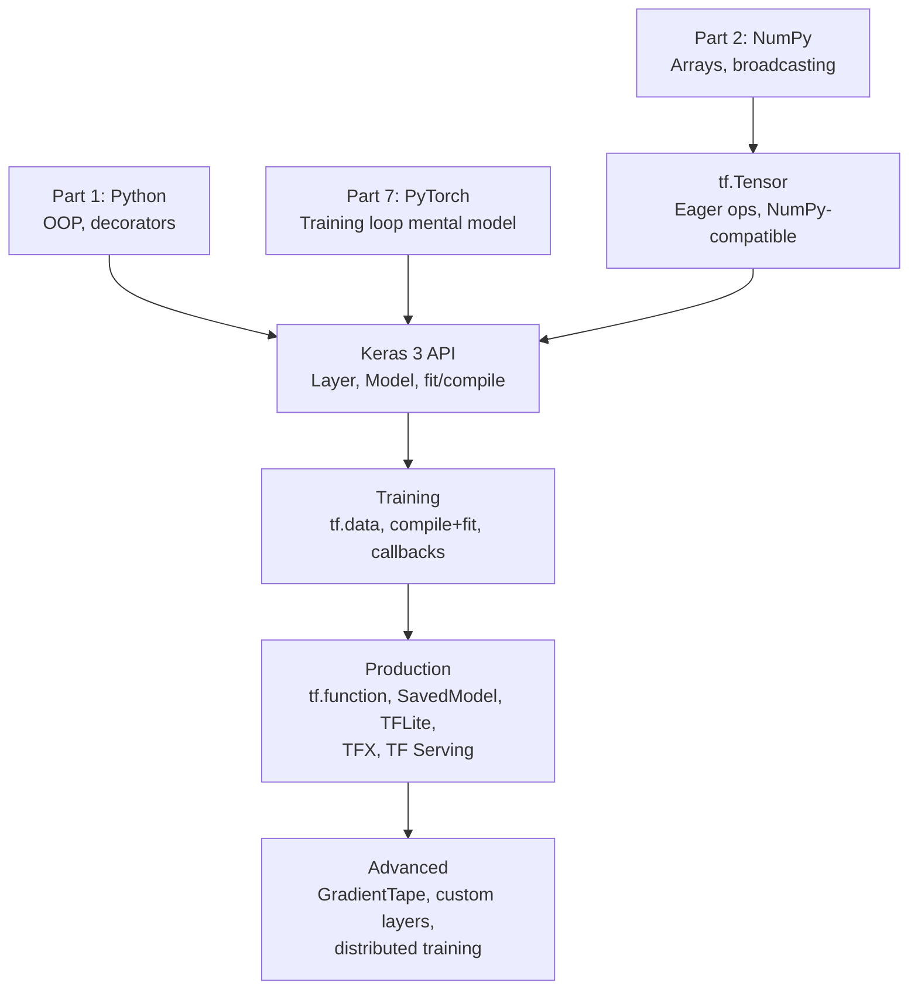
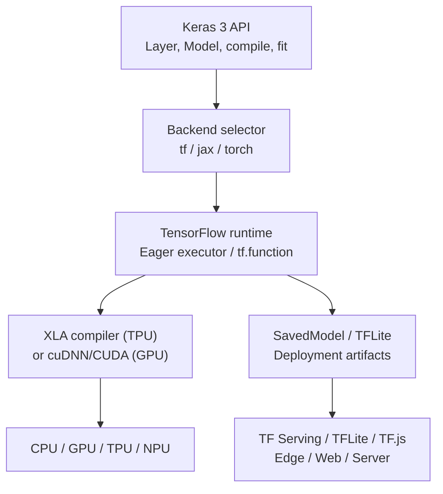

<!-- TEACHING_ORDER: verified -->
# Part 9: TensorFlow / Keras 3

> **Prerequisites:** Parts 1–7 (especially PyTorch — this part explicitly compares the two)
> **Used later in:** Production serving pipelines, TFLite mobile deployment, TFX pipelines
> **Version anchor:** TensorFlow 2.18 / Keras 3.x (mid-2026), multi-backend Keras stable

---

## Why This Library Exists

### The problem: deep learning needed a production-grade, scalable framework

In 2011, Google Brain built DistBelief — a proprietary distributed neural network framework. It was designed to train very large models across many machines, and it succeeded at scale: it trained the word2vec embeddings that transformed NLP and the deep learning models behind Google Photos, Google Translate, and Google Search. But DistBelief was slow to iterate on, hard to extend, and not shareable with the research community.

Jeff Dean, Rajat Monga, and the Google Brain team redesigned it from scratch, releasing **TensorFlow** as open source in November 2015. The name comes from *tensors* (multidimensional arrays) flowing through a *graph* of operations. TensorFlow 1.x used a static computation graph: you defined the entire computation using a Python-like API, but the actual computation happened inside a C++ session that executed the graph.

This design enabled impressive production benefits:
- The graph could be serialized and deployed without Python
- The same graph ran on CPU, GPU, and TPU
- Distributed training across many machines was built-in from day one

But as PyTorch proved, the static graph was terrible for research: debugging was difficult, dynamic shapes were painful, and the Python session-graph split was confusing.

### TensorFlow 2.x: eager execution by default

TensorFlow 2.0 (September 2019) was a major redesign. It adopted Keras as the official high-level API and switched to **eager execution** as the default mode — operations execute immediately, just like PyTorch. `tf.function` (the TF equivalent of `torch.compile`) could still compile functions to static graphs for production performance.

This was also the moment **Keras** fully merged with TensorFlow. François Chollet's Keras had been a separate "user-friendly wrapper" for Theano and TensorFlow since 2015. In TF 2.x, `tf.keras` became the canonical way to write TensorFlow code.

### Keras 3.x: backend-agnostic

In 2023–2024, Keras was again redesigned as **Keras 3** — a backend-agnostic deep learning API. You can write a Keras model once and run it on TensorFlow, JAX, or PyTorch backends:

```python
import keras
# Set backend to "tensorflow", "jax", or "torch"
keras.backend.set_floatx("float32")
```

This is the current architecture: Keras 3 is the high-level API, TensorFlow is the primary backend for production, with JAX and PyTorch available.

---

## Explain Like I Am 10

Imagine you want to build a robot. There are two ways:

**The assembly line way (TF 1.x):** First, draw a complete blueprint of every part and every wire. Then give it to a factory, which builds and runs it all at once. Fast, but if you made a mistake on the blueprint, you have to redraw everything.

**The LEGO way (TF 2.x / Keras):** Just start clicking pieces together. Add a layer, test it, add another. When you are happy, you can "freeze" the whole thing into a blueprint (`tf.function`) for faster production use.

Keras is like the friendliest LEGO system — it gives you pre-built modules (layers) with standard connectors. You stack them and it just works. TensorFlow is the factory floor running the actual computations.

---

## Mental Model

**Keras is the specification language for neural networks; TensorFlow is the execution engine.**

The two-level model:
1. **Keras Layer** — specification: what the layer does mathematically (weights + `call(inputs)`)
2. **Keras Model** — container for layers + training logic (`fit`, `evaluate`, `predict`)
3. **TensorFlow backend** — executes the actual tensor operations on GPU/TPU, handles distribution

`tf.function` is the bridge to performance: decorating a Python function converts it to a static computation graph at first call, giving TensorFlow-graph-level performance on subsequent calls.

---

## Learning Dependency Graph



---

## Core Concepts

### 1. TensorFlow tensors: eager execution

```python
import tensorflow as tf

# Create tensors
x = tf.constant([1.0, 2.0, 3.0])
y = tf.zeros((3, 4))
z = tf.random.normal((3, 4))

# Operations execute immediately (eager mode)
result = x * 2 + 1
print(result)        # tf.Tensor([3. 5. 7.], shape=(3,), dtype=float32)
print(result.numpy()) # [3. 5. 7.] — convert to NumPy

# NumPy interop
import numpy as np
arr = np.array([1.0, 2.0, 3.0])
t = tf.constant(arr)
back = t.numpy()

# Type and shape
t.shape     # TensorShape([3])
t.dtype     # tf.float32
t.device    # /job:localhost/replica:0/task:0/device:CPU:0
```

### 2. `GradientTape`: explicit gradient recording

In TensorFlow 2.x, gradient recording is explicit — you use `tf.GradientTape` as a context manager:

```python
import tensorflow as tf

x = tf.Variable([2.0, 3.0])   # tf.Variable tracks gradients

with tf.GradientTape() as tape:
    y = tf.reduce_sum(x ** 2)   # y = 4 + 9 = 13

grad = tape.gradient(y, x)
print(grad)   # [4.0, 6.0] — dy/dx = 2x

# Gradient of nested computation
w = tf.Variable(tf.ones((4, 2)))
b = tf.Variable(tf.zeros(2))
x_input = tf.constant([[1.0, 2.0, 3.0, 4.0]])   # batch=1, features=4

with tf.GradientTape() as tape:
    logits = tf.matmul(x_input, w) + b
    loss   = tf.reduce_mean(logits ** 2)

grads = tape.gradient(loss, [w, b])
print(f"Grad w shape: {grads[0].shape}")  # (4, 2)
print(f"Grad b shape: {grads[1].shape}")  # (2,)
```

**`tf.Variable` vs `tf.Tensor`:** Variables are mutable, track gradients by default, and persist across function calls (model parameters). Tensors are immutable, intermediate values computed during forward pass.

### 3. Keras Model: the high-level API

```python
import keras
from keras import layers

# Sequential API (simple linear stacks)
model = keras.Sequential([
    layers.Dense(64, activation="relu", input_shape=(20,)),
    layers.Dropout(0.2),
    layers.Dense(32, activation="relu"),
    layers.Dense(1, activation="sigmoid"),
])

# Functional API (DAG architectures, multiple inputs/outputs)
inputs  = keras.Input(shape=(20,))
x       = layers.Dense(64, activation="relu")(inputs)
x       = layers.Dropout(0.2)(x)
x       = layers.Dense(32, activation="relu")(x)
outputs = layers.Dense(1, activation="sigmoid")(x)
model   = keras.Model(inputs=inputs, outputs=outputs)

# Subclassing (full control, like PyTorch nn.Module)
class MyModel(keras.Model):
    def __init__(self):
        super().__init__()
        self.dense1 = layers.Dense(64, activation="relu")
        self.dropout = layers.Dropout(0.2)
        self.dense2 = layers.Dense(32, activation="relu")
        self.output_layer = layers.Dense(1, activation="sigmoid")

    def call(self, x, training=False):
        x = self.dense1(x)
        x = self.dropout(x, training=training)
        x = self.dense2(x)
        return self.output_layer(x)
```

### 4. `compile` and `fit`: batteries-included training

```python
model.compile(
    optimizer=keras.optimizers.Adam(learning_rate=1e-3),
    loss="binary_crossentropy",
    metrics=["accuracy", keras.metrics.AUC(name="auc")],
)

# Training (handles batching, shuffle, validation, callbacks)
history = model.fit(
    X_train, y_train,
    epochs=20,
    batch_size=32,
    validation_split=0.1,
    callbacks=[
        keras.callbacks.EarlyStopping(patience=3, restore_best_weights=True),
        keras.callbacks.ReduceLROnPlateau(factor=0.5, patience=2),
    ],
    verbose=1,
)

# Evaluate and predict
test_metrics = model.evaluate(X_test, y_test)
predictions  = model.predict(X_test)
```

**What `compile+fit` gives you for free:** distributed training, mixed precision, gradient clipping, learning rate scheduling, metric aggregation across batches, callbacks (early stopping, model checkpointing, TensorBoard logging).

### 5. `tf.function`: graph compilation for performance

```python
@tf.function
def train_step(model, optimizer, x, y):
    with tf.GradientTape() as tape:
        logits = model(x, training=True)
        loss   = keras.losses.binary_crossentropy(y, logits)
        loss   = tf.reduce_mean(loss)
    grads = tape.gradient(loss, model.trainable_variables)
    optimizer.apply_gradients(zip(grads, model.trainable_variables))
    return loss

# First call: traces Python code into a computation graph (slow)
# Subsequent calls: runs compiled graph (fast)
```

**`tf.function` tracing rules:** Similar to JAX's JIT — Python code is traced with abstract symbolic values. Python `if`/`for` based on tensor values must be replaced with `tf.cond`/`tf.while_loop`. Data-dependent shapes cause retracing.

### 6. `tf.data`: high-performance data pipelines

```python
import tensorflow as tf
import numpy as np

X = np.random.randn(10000, 20).astype("float32")
y = np.random.randint(0, 2, (10000,)).astype("float32")

# Build pipeline
dataset = (
    tf.data.Dataset.from_tensor_slices((X, y))
    .shuffle(buffer_size=1000)           # shuffle with buffer
    .batch(32)                           # batch
    .prefetch(tf.data.AUTOTUNE)          # prefetch on CPU while GPU trains
    .cache()                             # cache in memory after first epoch
)

# Pass directly to model.fit()
model.fit(dataset, epochs=10)
```

---

## Internal Architecture



**SavedModel:** TensorFlow's deployment format. Serializes the model's computation graph, weights, and signatures (input/output specs) into a single directory. Can be loaded without Python, deployed to TF Serving, converted to TFLite for mobile, or run in a web browser with TF.js.

---

## Essential APIs

```python
import tensorflow as tf
import keras
from keras import layers

# ── Tensor ops ─────────────────────────────────────────────────────────
tf.constant(value), tf.Variable(value)
tf.zeros, tf.ones, tf.random.normal
tf.reshape, tf.transpose, tf.concat, tf.stack, tf.split
tf.matmul(a, b)  |  a @ b
tf.reduce_sum, tf.reduce_mean, tf.reduce_max

# ── Layers ─────────────────────────────────────────────────────────────
layers.Dense(units, activation)
layers.Conv2D(filters, kernel_size, activation)
layers.LSTM(units, return_sequences=True)
layers.MultiHeadAttention(num_heads, key_dim)
layers.LayerNormalization(), layers.BatchNormalization()
layers.Dropout(rate), layers.Embedding(vocab_size, embed_dim)

# ── Model ──────────────────────────────────────────────────────────────
model.compile(optimizer, loss, metrics)
model.fit(x, y, epochs, batch_size, validation_split, callbacks)
model.evaluate(x, y)
model.predict(x)
model.save("model.keras")    # new Keras format
model.save("saved_model/")   # TF SavedModel format
keras.models.load_model("model.keras")

# ── Custom training ────────────────────────────────────────────────────
with tf.GradientTape() as tape:
    logits = model(x, training=True)
    loss   = loss_fn(y, logits)
grads = tape.gradient(loss, model.trainable_variables)
optimizer.apply_gradients(zip(grads, model.trainable_variables))

# ── Distributed ────────────────────────────────────────────────────────
strategy = tf.distribute.MirroredStrategy()   # multi-GPU
with strategy.scope():
    model = create_model()
    model.compile(...)
model.fit(dataset, epochs=10)
```

---

## API Learning Roadmap

**Beginner:** `tf.constant`, `tf.Variable`, Sequential model, `compile+fit`, `model.predict()`

**Intermediate:** Functional API, custom Layer subclass, `tf.data` pipelines, callbacks, `GradientTape`

**Advanced:** `tf.function` custom training loops, distributed training, mixed precision, SavedModel export

**Production:** TFX pipelines, TF Serving, TFLite conversion, model monitoring, A/B serving

---

## Beginner Examples

### Example 1: Binary classification with the Sequential API

```python
import tensorflow as tf
import keras
from keras import layers
from sklearn.datasets import make_classification
from sklearn.model_selection import train_test_split
from sklearn.preprocessing import StandardScaler
import numpy as np

# Data
X, y = make_classification(n_samples=5000, n_features=20, random_state=42)
X = StandardScaler().fit_transform(X).astype("float32")
X_train, X_test, y_train, y_test = train_test_split(X, y, test_size=0.2)

# Model
model = keras.Sequential([
    layers.Dense(64, activation="relu", input_shape=(20,)),
    layers.BatchNormalization(),
    layers.Dropout(0.2),
    layers.Dense(32, activation="relu"),
    layers.Dense(1, activation="sigmoid"),
])

model.compile(
    optimizer=keras.optimizers.Adam(1e-3),
    loss="binary_crossentropy",
    metrics=["accuracy", keras.metrics.AUC(name="auc")],
)

model.summary()

history = model.fit(
    X_train, y_train,
    epochs=30,
    batch_size=64,
    validation_split=0.1,
    callbacks=[
        keras.callbacks.EarlyStopping(patience=5, restore_best_weights=True),
    ],
    verbose=1,
)

loss, acc, auc = model.evaluate(X_test, y_test, verbose=0)
print(f"\nTest — loss: {loss:.4f}, accuracy: {acc:.4f}, AUC: {auc:.4f}")
```

---

## Intermediate Examples

### Example 2: Custom `tf.function` training loop

```python
import tensorflow as tf
import keras
from keras import layers
import numpy as np

class TextClassifier(keras.Model):
    def __init__(self, vocab_size: int, embed_dim: int, num_classes: int):
        super().__init__()
        self.embed = layers.Embedding(vocab_size, embed_dim, mask_zero=True)
        self.gru   = layers.Bidirectional(layers.GRU(64))
        self.dense = layers.Dense(num_classes, activation="softmax")

    def call(self, x, training=False):
        x = self.embed(x)
        x = self.gru(x)
        return self.dense(x)

# Create model
model     = TextClassifier(vocab_size=10000, embed_dim=64, num_classes=5)
optimizer = keras.optimizers.Adam(1e-3)
loss_fn   = keras.losses.SparseCategoricalCrossentropy()
metric    = keras.metrics.SparseCategoricalAccuracy()

@tf.function   # compiles to graph on first call
def train_step(x_batch, y_batch):
    with tf.GradientTape() as tape:
        preds = model(x_batch, training=True)
        loss  = loss_fn(y_batch, preds)
    grads = tape.gradient(loss, model.trainable_variables)
    optimizer.apply_gradients(zip(grads, model.trainable_variables))
    metric.update_state(y_batch, preds)
    return loss

# Fake data
X_fake = np.random.randint(0, 10000, (100, 50)).astype("int32")
y_fake = np.random.randint(0, 5, (100,)).astype("int32")
dataset = tf.data.Dataset.from_tensor_slices((X_fake, y_fake)).batch(16)

for epoch in range(3):
    metric.reset_state()
    for x_batch, y_batch in dataset:
        loss = train_step(x_batch, y_batch)
    print(f"Epoch {epoch+1}: loss={loss:.4f}, acc={metric.result():.4f}")
```

---

## Advanced Examples

### Example 3: Mixed precision and model export

```python
import tensorflow as tf
import keras

# Enable mixed precision globally
keras.mixed_precision.set_global_policy("mixed_float16")

inputs  = keras.Input(shape=(512,))
x       = keras.layers.Dense(256, activation="relu")(inputs)
x       = keras.layers.Dropout(0.1)(x)
# Last dense must be float32 for numerical stability
outputs = keras.layers.Dense(10, activation="softmax", dtype="float32")(x)
model   = keras.Model(inputs, outputs)

model.compile(
    optimizer="adam",
    loss="sparse_categorical_crossentropy",
)

# Save as SavedModel for TF Serving
model.save("my_model")

# Or .keras format (portable, includes optimizer state)
model.save("my_model.keras")

# Convert to TFLite (for mobile/edge)
converter = tf.lite.TFLiteConverter.from_saved_model("my_model")
converter.optimizations = [tf.lite.Optimize.DEFAULT]  # int8 quantization
tflite_model = converter.convert()

with open("model.tflite", "wb") as f:
    f.write(tflite_model)

print(f"TFLite model size: {len(tflite_model)/1024:.1f} KB")
```

---

## Internal Interview Knowledge

**Q: How does `tf.function` work?**
Strong answer: "The first time a `tf.function`-decorated function is called, TensorFlow traces its Python code with symbolic tensors — recording each operation into a `ConcreteFunction` (a static computation graph). Subsequent calls with the same input shapes use the cached graph, bypassing Python and achieving C++/XLA performance. Python-level control flow (`if x > 0`) is frozen at trace time; for data-dependent branching inside `tf.function`, use `tf.cond`."

**Q: What is `tf.Variable` vs `tf.Tensor`?**
Strong answer: "A `tf.Tensor` is an immutable value — result of a computation, lives temporarily. A `tf.Variable` is a persistent, mutable tensor — stored in memory across operations. Variables have `.assign()`, `.assign_add()` for mutation and are automatically watched by `GradientTape`. Model parameters (weights) are `tf.Variable`s; activations and intermediate results are `tf.Tensor`s."

**Q: When would you choose TensorFlow over PyTorch in 2026?**
Strong answer: "(1) Mobile/edge deployment — TFLite has years-long production deployments on Android/iOS; PyTorch has ExecuTorch but TFLite is more mature. (2) TFX production pipelines — if the team already uses TFX for data validation (TFDV), feature engineering (TF Transform), model analysis (TFMA), and serving (TF Serving), staying in TF avoids ecosystem fragmentation. (3) Legacy codebases — maintaining TF 2.x models that predate the PyTorch ecosystem's dominance. (4) Google Cloud/Vertex AI — native TF Serving integration. For research and LLM fine-tuning, PyTorch is strongly preferred."

---

## Production AI Usage

**Google Search, Translate, Gmail:** TensorFlow powers Google's production AI at the largest scale in the world. Google's internal models that run billions of daily inferences use TF Serving with SavedModel on custom hardware.

**Spotify:** Recommendation systems, personalized playlists, podcast discovery. TFX pipelines for data validation and feature engineering. Models trained with Keras, served with TF Serving.

**Airbnb:** Pricing models, listing ranking, fraud detection. TensorFlow via TFX with Vertex AI for pipeline orchestration.

**Netflix:** Some recommendation models (though Netflix also uses PyTorch and proprietary frameworks). TFX for ML pipeline management.

**Twitter/X:** Tweet ranking models trained with TF. Bert-based models for content moderation.

---

## Common Mistakes

**Mistake 1: Using `model.predict()` in a training loop (very slow)**
```python
# Bug: model.predict() is for batch inference — creates a new graph each call
for X, y in dataset:
    preds = model.predict(X)   # wrong! rebuilds prediction graph

# Fix: call model directly for single-batch inference
for X, y in dataset:
    preds = model(X, training=False)   # correct
```

**Mistake 2: Forgetting `training=True/False` in `call`**
```python
# Bug: Dropout and BatchNorm behave differently in train vs eval
# If you don't pass training=True, Dropout is off during training
preds = model(X)            # training defaults to False → dropout off!
preds = model(X, training=True)    # correct during training
```

**Mistake 3: Not disabling eager mode for performance-critical code without `tf.function`**
```python
# Fine for debugging, but 5-10x slower for production
for step in range(10000):
    loss = train_step_not_compiled(X, y)   # Python overhead every step

# Fix: decorate with @tf.function
@tf.function
def train_step(X, y):
    ...
```

---

## Performance Optimization

**Mixed precision:** Set `keras.mixed_precision.set_global_policy("mixed_bfloat16")` — activations use bfloat16 (2 bytes), weights stay float32. 2x memory reduction, 2-4x throughput increase on GPUs and TPUs.

**`tf.data` prefetching:**
```python
dataset = (
    tf.data.Dataset.from_tensor_slices(data)
    .shuffle(10000)
    .batch(128)
    .prefetch(tf.data.AUTOTUNE)   # overlap GPU compute with CPU data loading
)
```

**Distributed training:** `tf.distribute.MirroredStrategy` synchronously replicates model across GPUs; gradients are reduced via AllReduce. Drop-in with `compile+fit` — no code changes in the training loop.

---

## Library Relationships

### Keras 3 backends

| Backend | Use case | Notes |
|---|---|---|
| TensorFlow | Production, mobile (TFLite), pipelines | Most mature, best serving tooling |
| JAX | TPU training, research | XLA-native, fastest on TPU |
| PyTorch | Write-once run-anywhere | Least tested backend |

### TensorFlow vs PyTorch in 2026

| Dimension | TensorFlow 2.x | PyTorch 2.6 |
|---|---|---|
| Research popularity | Declining (JAX dominant at Google) | Dominant globally |
| Mobile/edge | TFLite — excellent | ExecuTorch — growing |
| Production serving | TF Serving — mature | TorchServe, vLLM |
| LLM fine-tuning | Less common | Standard (HuggingFace) |
| Google Cloud | Native integration | Available |
| Enterprise adoption | High (legacy + GCP) | Growing rapidly |

---

## Cheat Sheet

```python
import tensorflow as tf
import keras
from keras import layers

# ── Eager ops ─────────────────────────────────────────────────────────
x = tf.constant([1.0, 2.0, 3.0])
v = tf.Variable([1.0, 2.0])
v.assign(tf.zeros(2))           # mutate variable

# ── GradientTape ──────────────────────────────────────────────────────
with tf.GradientTape() as tape:
    y = model(x, training=True)
    loss = loss_fn(labels, y)
grads = tape.gradient(loss, model.trainable_variables)
optimizer.apply_gradients(zip(grads, model.trainable_variables))

# ── Sequential model ──────────────────────────────────────────────────
model = keras.Sequential([layers.Dense(64, "relu"), layers.Dense(1)])
model.compile(optimizer="adam", loss="mse")
model.fit(X, y, epochs=10, validation_split=0.1)

# ── tf.data ───────────────────────────────────────────────────────────
ds = (tf.data.Dataset.from_tensor_slices((X, y))
      .shuffle(1000).batch(32).prefetch(tf.data.AUTOTUNE))

# ── Save/Load ─────────────────────────────────────────────────────────
model.save("model.keras")
model = keras.models.load_model("model.keras")

# ── Mixed precision ───────────────────────────────────────────────────
keras.mixed_precision.set_global_policy("mixed_bfloat16")

# ── Distributed ───────────────────────────────────────────────────────
with tf.distribute.MirroredStrategy().scope():
    model = create_model()
    model.compile(...)
```

---

## Flash Cards

**Q:** What is eager execution and why was it added to TensorFlow 2.x?
**A:** Eager execution means operations run immediately and return values — like NumPy. TF 1.x required building a graph first, then executing it in a session. This was hard to debug and incompatible with Python control flow. TF 2.x made eager execution the default, making TF feel like PyTorch while preserving `tf.function` for production performance.

**Q:** When do you use `tf.function` and when do you not?
**A:** Use `tf.function` for the inner training step and inference functions in production — it compiles Python to a static graph, bypassing Python interpreter overhead for a 5-10x speedup. Do NOT use it during debugging (error messages are worse inside graphs), prototyping, or for code with Python side effects. Keras's `compile+fit` applies `tf.function` automatically internally.

**Q:** What is the difference between `.save("model.keras")` and `.save("saved_model/")`?
**A:** The `.keras` format is Keras-native — stores weights, architecture, and training config portably, works across Keras backends. The `saved_model/` format is TensorFlow-native — stores the computation graph as a `ConcreteFunction`, deployable to TF Serving, TFLite converter, and TF.js without Python. For production serving, use SavedModel.

---

## Revision Notes

**One sentence for interviews:** "TensorFlow 2.x uses eager execution by default; `tf.function` compiles any Python function into a static graph for production performance, with the same code used for development and deployment."

**Key mental models:**
- `tf.Variable` = mutable persistent storage (model weights)
- `tf.Tensor` = immutable intermediate values
- `GradientTape` = explicit gradient recording context (vs PyTorch's implicit graph)
- `tf.function` = `torch.compile` equivalent — same code, compiled execution

---

## Interview Question Bank

**Q1: Explain the difference between TensorFlow 1.x define-and-run and TF 2.x eager execution.** A: TF 1.x required first building a computation graph (with `tf.placeholder`, `tf.Session`) before executing it. This was fast but made debugging nearly impossible — errors appeared as graph execution errors, not Python exceptions. TF 2.x runs operations eagerly by default — operations execute immediately like Python/NumPy. `tf.function` can compile specific functions back to graphs for performance when needed.

**Q2: What does `tape.gradient(loss, vars)` compute?** A: The gradient of `loss` with respect to each tensor in `vars`. It uses reverse-mode automatic differentiation — traces the operations recorded inside the `tf.GradientTape()` context, then traverses the recorded graph backward, applying the chain rule at each step to accumulate gradients.

**Q3: How does Keras `compile+fit` handle distributed training?** A: When `model.compile()` is called inside a `tf.distribute.Strategy` scope, the training loop inside `model.fit()` is automatically distributed. For `MirroredStrategy`, each GPU gets a copy of the model and a shard of the data. Gradients are aggregated with AllReduce across GPUs after each step. No changes to the model code are needed.

**Q4: What is TFLite and how does it differ from TF SavedModel?** A: TFLite is TensorFlow's format optimized for mobile and edge deployment — minimal binary size, no Python dependency, optimized for inference only. SavedModel is TF's full deployment format — includes the full graph with all operations, suitable for server-side inference with TF Serving. TFLite conversion applies quantization (int8/float16) to further compress the model. SavedModel is the intermediate step — you convert SavedModel → TFLite.

**Q5: When would a TensorFlow model outperform a PyTorch model on the same hardware?** A: On Google TPUs — TF's XLA compilation is more mature on TPU hardware. On large-scale distributed inference — TF Serving with batching and model versioning is a production-grade serving system that PyTorch's options are still catching up to. For mobile devices — TFLite has years of production optimization on Android/iOS with hardware delegate support (e.g., GPU delegate, NNAPI).

## Quality Checklist

- [x] Easy English used
- [x] Problem explained (DistBelief → TF 1.x static graph → TF 2.x eager → Keras 3 multi-backend)
- [x] History explained (Jeff Dean, Google Brain, 2015, TF 2.0, François Chollet / Keras)
- [x] Intuition explained (ELI10: assembly line vs LEGO)
- [x] Mental model explained (Keras = spec language, TF = execution engine)
- [x] Dependency graph included
- [x] Internal architecture included (GradientTape, tf.function, SavedModel)
- [x] APIs explained (tensors, variables, Tape, Sequential, functional, compile+fit, tf.data)
- [x] Beginner examples included
- [x] Intermediate examples included (custom training loop)
- [x] Advanced examples included (mixed precision, TFLite export)
- [x] Production examples included (Google, Spotify, Airbnb, Netflix)
- [x] Performance explained (mixed precision, prefetch, distributed)
- [x] Common mistakes included
- [x] Interview questions included
- [x] Cheat sheet included

*[Back to handbook](README.md)*
