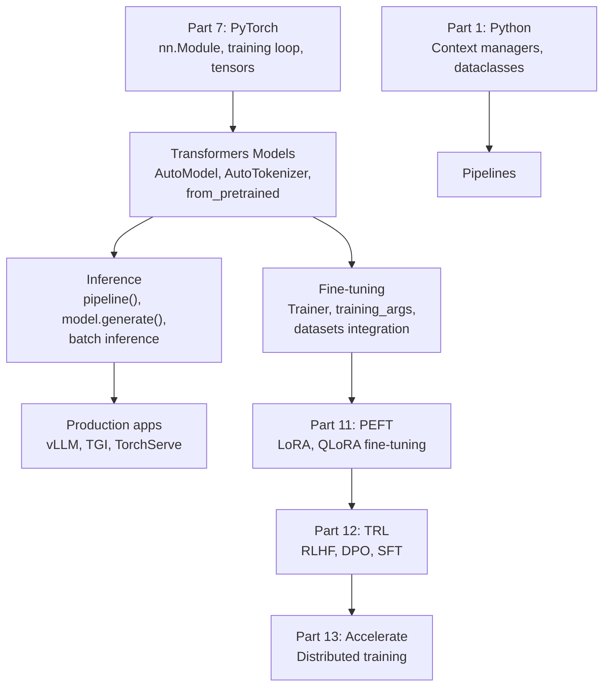
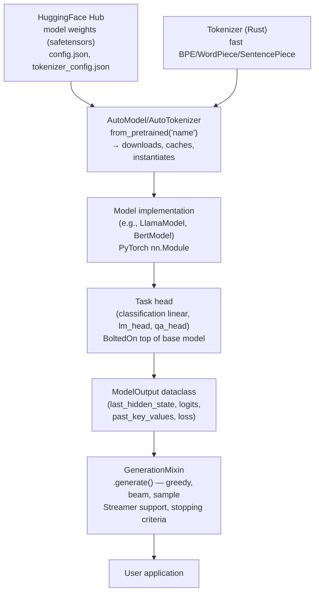

<!-- TEACHING_ORDER: verified -->
# Part 10: Hugging Face Transformers

> **Prerequisites:** Parts 1–7 (PyTorch especially), basic NLP intuition (tokens, embeddings, attention)
> **Used later in:** Part 11 (PEFT), Part 12 (TRL), Part 13 (Accelerate)
> **Version anchor:** `transformers` 4.45+ (mid-2026), `tokenizers` 0.20+, `safetensors` 0.4+

---

## Why This Library Exists

### The problem: every team was reimplementing transformers from scratch

The transformer architecture (Vaswani et al., "Attention Is All You Need," 2017) rapidly became the dominant model architecture for NLP. But in 2018–2019, every team that wanted to use BERT, GPT-2, or XLNet had to:

1. Find a research implementation — often a research lab's unofficial code dump
2. Convert weights from the training framework (often TF 1.x or JAX)
3. Understand the paper's preprocessing conventions: tokenization, special tokens, input formatting
4. Stitch together training and inference code
5. Do it all again for the next model (GPT-2 vs BERT had completely different tokenizers, input formats, and task heads)

Hugging Face (a French-American AI company founded in 2016, originally a chatbot company) saw this problem and built a solution: a **model hub** combined with a **unified Python API** that could load any major transformer model, handle tokenization correctly, and run inference or fine-tuning with consistent patterns.

Thomas Wolf, Lysandre Debut, and team released `pytorch-pretrained-bert` in December 2018, followed by `transformers` 2.0 in 2019. The library exploded in adoption: by 2021 it had 50,000+ GitHub stars; by 2023 the Hugging Face Hub had 200,000+ models; by mid-2026 it exceeds 600,000 models.

### What the Transformers library actually provides

1. **Model classes** — implementations of 100+ architectures (BERT, GPT-2, T5, LLaMA, Mistral, Falcon, Qwen, Gemma, etc.)
2. **Tokenizers** — fast, correct implementations of every model's text preprocessing (backed by Rust via the `tokenizers` library)
3. **Pipelines** — highest-level API: one function call for inference on common tasks
4. **Pretrained weights** — `from_pretrained("name")` loads any model from the Hub with correct config
5. **Trainer** — a high-level training loop with distributed training, mixed precision, and logging built in
6. **Generation** — `model.generate()` with beam search, sampling, greedy, speculative decoding

---

## Explain Like I Am 10

Imagine a library of famous paintings. Without Hugging Face, every artist would have to repaint each painting from scratch before they could use it. With Hugging Face, you just say "give me the Mona Lisa" and you get a perfect copy in seconds, ready to hang, modify, or repaint.

The paintings are the pretrained models (BERT, GPT-4o Mini, LLaMA, etc.). The library is the Hugging Face Hub. And the "give me" command is `from_pretrained("model-name")`.

The extra clever part: the library also knows how to "frame" your painting — tokenization turns your raw text into the exact number format the painting (model) expects. Get the frame wrong and the painting looks terrible. Get it right and everything just works.

---

## Mental Model

**Transformers = pretrained model weights + tokenizer + task head, all accessible via `from_pretrained`.**

Three-layer mental model:

1. **Hub layer:** Model weights stored on `huggingface.co/model-name` or locally. `from_pretrained` handles download, caching, config parsing, and weight loading.
2. **Model layer:** PyTorch `nn.Module` (or TF/JAX). Every model is `forward(input_ids, attention_mask, ...) → output_object`. Task-specific variants (e.g., `BertForSequenceClassification`) add a head on top.
3. **Tokenizer layer:** Converts text → token IDs → attention masks → PyTorch tensors, handling padding, truncation, and special tokens (`[CLS]`, `[SEP]`, `<s>`, etc.) correctly.

```
"I love Paris" → [Tokenizer] → {input_ids, attention_mask} → [Model] → logits/embeddings
```

---

## Learning Dependency Graph



---

## Core Concepts

### 1. `from_pretrained`: the universal loader

```python
from transformers import AutoTokenizer, AutoModel, AutoModelForCausalLM

# Every model follows the same pattern:
# AutoXxx.from_pretrained("organization/model-name")

# Tokenizer — always load the matching tokenizer
tokenizer = AutoTokenizer.from_pretrained("bert-base-uncased")

# Encoder-only model (BERT) — for classification, embeddings
model = AutoModel.from_pretrained("bert-base-uncased")

# Causal language model (GPT-style) — for generation
lm = AutoModelForCausalLM.from_pretrained("meta-llama/Llama-3.2-1B")

# Task-specific models — classification head included
from transformers import AutoModelForSequenceClassification
clf = AutoModelForSequenceClassification.from_pretrained(
    "distilbert-base-uncased",
    num_labels=2,
)
```

**Model family → Auto class mapping:**

| Task | Auto class |
|---|---|
| Classification | `AutoModelForSequenceClassification` |
| Token classification (NER) | `AutoModelForTokenClassification` |
| Question answering | `AutoModelForQuestionAnswering` |
| Text generation | `AutoModelForCausalLM` |
| Seq2Seq (translation, summarization) | `AutoModelForSeq2SeqLM` |
| Embeddings/features | `AutoModel` |

### 2. Tokenizers: the critical preprocessing step

Tokenizers convert raw text to token IDs that a specific model can accept. Every model has its own tokenizer — BERT uses WordPiece, GPT-2 uses BPE, LLaMA uses SentencePiece. Using the wrong tokenizer gives garbage results.

```python
from transformers import AutoTokenizer

tokenizer = AutoTokenizer.from_pretrained("bert-base-uncased")

# Basic tokenization
tokens = tokenizer.tokenize("Hello, world!")
print(tokens)   # ['hello', ',', 'world', '!']

ids = tokenizer.encode("Hello, world!")
print(ids)   # [101, 7592, 1010, 2088, 999, 102] — with [CLS] and [SEP]

# Recommended: use __call__ for full encoding
encoding = tokenizer(
    "Hello, world!",
    return_tensors="pt",      # "pt" for PyTorch, "tf" for TF, "np" for NumPy
    padding=True,
    truncation=True,
    max_length=128,
)
print(encoding.keys())   # input_ids, attention_mask, token_type_ids
print(encoding["input_ids"].shape)   # (1, 6)

# Batch encoding — always use batched form for production
texts = ["Hello world", "How are you?", "Fine, thanks"]
batch = tokenizer(
    texts,
    return_tensors="pt",
    padding=True,       # pad to longest in batch
    truncation=True,
    max_length=128,
)
print(batch["input_ids"].shape)   # (3, max_len)
```

**Decoding back to text:**
```python
ids = tokenizer.encode("Hello, world!")
text = tokenizer.decode(ids)
print(text)   # [CLS] hello, world! [SEP]

# Clean decoding (skip special tokens)
clean = tokenizer.decode(ids, skip_special_tokens=True)
print(clean)   # hello, world!
```

### 3. Model inference: forward pass

```python
import torch
from transformers import AutoTokenizer, AutoModel

tokenizer = AutoTokenizer.from_pretrained("bert-base-uncased")
model     = AutoModel.from_pretrained("bert-base-uncased")
model.eval()

texts = ["Machine learning is fascinating", "I enjoy deep learning"]
inputs = tokenizer(texts, return_tensors="pt", padding=True, truncation=True)

with torch.no_grad():
    outputs = model(**inputs)

# BaseModelOutput fields:
# last_hidden_state: (batch, seq_len, hidden_size) — contextual embeddings
# pooler_output:     (batch, hidden_size) — [CLS] token after pooling layer

embeddings = outputs.last_hidden_state   # (2, seq_len, 768)
cls_emb    = outputs.last_hidden_state[:, 0, :]  # (2, 768) — [CLS] token
print(f"Contextual embeddings: {embeddings.shape}")
print(f"[CLS] embeddings: {cls_emb.shape}")

# Cosine similarity
cos_sim = torch.cosine_similarity(cls_emb[0:1], cls_emb[1:2])
print(f"Similarity between sentences: {cos_sim.item():.4f}")
```

### 4. Pipelines: the highest-level API

For common tasks, `pipeline()` wraps tokenization + model + post-processing:

```python
from transformers import pipeline

# Text generation
gen = pipeline("text-generation", model="gpt2")
result = gen("The future of AI is", max_new_tokens=50, num_return_sequences=1)
print(result[0]["generated_text"])

# Zero-shot classification
zs = pipeline("zero-shot-classification", model="facebook/bart-large-mnli")
result = zs(
    "The PyTorch ecosystem is growing rapidly.",
    candidate_labels=["technology", "sports", "politics"],
)
print(result["labels"])    # sorted by confidence
print(result["scores"])

# Sentiment analysis
sa = pipeline("sentiment-analysis")
result = sa(["I love this product!", "This is terrible."])
for r in result:
    print(f"{r['label']}: {r['score']:.3f}")

# Named entity recognition
ner = pipeline("ner", aggregation_strategy="simple")
result = ner("Jeff Dean works at Google in Mountain View.")
for ent in result:
    print(f"{ent['word']}: {ent['entity_group']}")

# Feature extraction (sentence embeddings)
fe = pipeline("feature-extraction", model="bert-base-uncased")
embeddings = fe("Hello world")   # list of lists
```

### 5. Text generation: `model.generate()`

```python
from transformers import AutoTokenizer, AutoModelForCausalLM
import torch

model_name = "gpt2"
tokenizer  = AutoTokenizer.from_pretrained(model_name)
model      = AutoModelForCausalLM.from_pretrained(model_name)
model.eval()

# Tokenize prompt
inputs = tokenizer("Once upon a time", return_tensors="pt")

# Greedy decoding (deterministic)
with torch.no_grad():
    greedy_ids = model.generate(
        **inputs,
        max_new_tokens=50,
        do_sample=False,   # greedy
    )
print("Greedy:", tokenizer.decode(greedy_ids[0], skip_special_tokens=True))

# Sampling (stochastic — better for creative text)
with torch.no_grad():
    sample_ids = model.generate(
        **inputs,
        max_new_tokens=50,
        do_sample=True,
        temperature=0.8,    # < 1 = more focused, > 1 = more random
        top_p=0.9,          # nucleus sampling — sample from top 90% probability mass
        top_k=50,           # also filter to top 50 tokens
    )
print("Sample:", tokenizer.decode(sample_ids[0], skip_special_tokens=True))

# Beam search (balance quality vs diversity)
with torch.no_grad():
    beam_ids = model.generate(
        **inputs,
        max_new_tokens=50,
        num_beams=4,           # search 4 hypotheses simultaneously
        early_stopping=True,
    )
print("Beam:", tokenizer.decode(beam_ids[0], skip_special_tokens=True))
```

### 6. The Trainer: batteries-included fine-tuning

```python
from transformers import (
    AutoTokenizer, AutoModelForSequenceClassification,
    TrainingArguments, Trainer,
)
from datasets import load_dataset
import numpy as np

# Load model + tokenizer
model_name = "distilbert-base-uncased"
tokenizer  = AutoTokenizer.from_pretrained(model_name)
model      = AutoModelForSequenceClassification.from_pretrained(model_name, num_labels=2)

# Load dataset from HuggingFace Hub
dataset = load_dataset("imdb", split={"train": "train[:2000]", "test": "test[:500]"})

def preprocess(examples):
    return tokenizer(examples["text"], truncation=True, max_length=256)

dataset = dataset.map(preprocess, batched=True)

# TrainingArguments: all hyperparameters
args = TrainingArguments(
    output_dir="./results",
    num_train_epochs=2,
    per_device_train_batch_size=16,
    per_device_eval_batch_size=32,
    warmup_steps=100,
    weight_decay=0.01,
    evaluation_strategy="epoch",
    save_strategy="epoch",
    load_best_model_at_end=True,
    fp16=True,           # mixed precision
    logging_steps=50,
)

def compute_metrics(eval_pred):
    logits, labels = eval_pred
    preds = np.argmax(logits, axis=-1)
    return {"accuracy": (preds == labels).mean()}

trainer = Trainer(
    model=model,
    args=args,
    train_dataset=dataset["train"],
    eval_dataset=dataset["test"],
    compute_metrics=compute_metrics,
)

trainer.train()
metrics = trainer.evaluate()
print(metrics)
```

---

## Internal Architecture



**`safetensors`:** Replaces the old `pickle`-based `.bin` format. Safetensors are memory-mapped, can be loaded in parallel, and are safe (no arbitrary code execution on load). `weights_only=True` in PyTorch's `torch.load` achieves similar security; safetensors goes further by design.

**`past_key_values` (KV cache):** During generation, each token's attention key and value tensors are cached. When generating token N+1, the model only computes attention for the new token against all previous K/V pairs stored in cache. Without KV cache, generation cost is O(N²); with cache, it is O(N) per step.

---

## Essential APIs

```python
# ── Loading ───────────────────────────────────────────────────────────
from transformers import AutoTokenizer, AutoModel, AutoModelForCausalLM

tokenizer = AutoTokenizer.from_pretrained("model-name")
model     = AutoModel.from_pretrained(
    "model-name",
    torch_dtype=torch.bfloat16,  # load in bfloat16
    device_map="auto",           # auto-assign layers to GPUs
    attn_implementation="flash_attention_2",  # FlashAttention if available
)

# ── Tokenization ──────────────────────────────────────────────────────
encoding = tokenizer(text, return_tensors="pt", padding=True, truncation=True)
decoded  = tokenizer.decode(ids, skip_special_tokens=True)
batch    = tokenizer(texts, return_tensors="pt", padding="longest")

# ── Inference ─────────────────────────────────────────────────────────
with torch.no_grad():
    outputs = model(**encoding)
# outputs.last_hidden_state | outputs.logits | outputs.past_key_values

# ── Generation ────────────────────────────────────────────────────────
model.generate(**inputs, max_new_tokens=100, do_sample=True, temperature=0.8)

# ── Saving ────────────────────────────────────────────────────────────
model.save_pretrained("./my-model")
tokenizer.save_pretrained("./my-model")

# ── Pipeline ──────────────────────────────────────────────────────────
from transformers import pipeline
pipe = pipeline("text-generation", model="gpt2", device=0)
pipe("Prompt text", max_new_tokens=100)
```

---

## API Learning Roadmap

**Beginner:** `from_pretrained`, `AutoTokenizer.__call__`, `pipeline()` for common tasks, `decode()`

**Intermediate:** `AutoModelForXxx`, `outputs` fields, `model.generate()` with sampling params, `Trainer` basics

**Advanced:** Custom `DataCollator`, `compute_metrics`, `TrainingArguments` tuning, `device_map="auto"`, KV cache

**Production:** `BitsAndBytesConfig` for quantization, `pipeline(batch_size=)`, `TextStreamer`, ONNX export, integration with vLLM/TGI

---

## Beginner Examples

### Example 1: Sentence similarity with BERT

```python
import torch
from transformers import AutoTokenizer, AutoModel

def mean_pooling(model_output, attention_mask):
    """Mean of token embeddings, ignoring padding tokens."""
    token_embeddings = model_output.last_hidden_state   # (B, S, H)
    mask = attention_mask.unsqueeze(-1).float()          # (B, S, 1)
    return (token_embeddings * mask).sum(1) / mask.sum(1)  # (B, H)

tokenizer = AutoTokenizer.from_pretrained("sentence-transformers/all-MiniLM-L6-v2")
model     = AutoModel.from_pretrained("sentence-transformers/all-MiniLM-L6-v2")
model.eval()

sentences = [
    "A dog is playing fetch in the park.",
    "A puppy is running after a ball outside.",
    "The stock market crashed today.",
]

encoding = tokenizer(sentences, return_tensors="pt", padding=True, truncation=True)
with torch.no_grad():
    output = model(**encoding)

embeddings = mean_pooling(output, encoding["attention_mask"])
# L2 normalize for cosine similarity
embeddings = embeddings / embeddings.norm(dim=1, keepdim=True)

cos_sim = embeddings @ embeddings.T
print("Cosine similarity matrix:")
for i, s1 in enumerate(sentences):
    for j, s2 in enumerate(sentences):
        if j > i:
            print(f"  '{s1[:30]}...' vs '{s2[:30]}...': {cos_sim[i,j].item():.3f}")
```

---

## Intermediate Examples

### Example 2: Fine-tuning classification on custom data

```python
import torch
from torch.utils.data import Dataset, DataLoader
from transformers import AutoTokenizer, AutoModelForSequenceClassification
from torch.optim import AdamW
from transformers import get_linear_schedule_with_warmup
import numpy as np

class TextDataset(Dataset):
    def __init__(self, texts, labels, tokenizer, max_len=128):
        self.encodings = tokenizer(
            texts, truncation=True, padding=True,
            max_length=max_len, return_tensors="pt"
        )
        self.labels = torch.tensor(labels)

    def __len__(self):
        return len(self.labels)

    def __getitem__(self, idx):
        return {k: v[idx] for k, v in self.encodings.items()}, self.labels[idx]

# Example data
texts  = ["I love this product!", "Terrible service.", "Pretty good overall."] * 100
labels = [1, 0, 1] * 100

tokenizer = AutoTokenizer.from_pretrained("distilbert-base-uncased")
model     = AutoModelForSequenceClassification.from_pretrained(
    "distilbert-base-uncased", num_labels=2
)
device = "cuda" if torch.cuda.is_available() else "cpu"
model.to(device)

dataset = TextDataset(texts, labels, tokenizer)
loader  = DataLoader(dataset, batch_size=16, shuffle=True)

optimizer = AdamW(model.parameters(), lr=2e-5, weight_decay=0.01)
scheduler = get_linear_schedule_with_warmup(
    optimizer,
    num_warmup_steps=50,
    num_training_steps=len(loader) * 3,
)

for epoch in range(3):
    model.train()
    total_loss = 0.0
    for encoding, labels_batch in loader:
        encoding     = {k: v.to(device) for k, v in encoding.items()}
        labels_batch = labels_batch.to(device)

        optimizer.zero_grad()
        outputs = model(**encoding, labels=labels_batch)
        loss    = outputs.loss   # cross-entropy loss is computed internally!
        loss.backward()
        torch.nn.utils.clip_grad_norm_(model.parameters(), 1.0)
        optimizer.step()
        scheduler.step()
        total_loss += loss.item()

    print(f"Epoch {epoch+1}: avg loss = {total_loss/len(loader):.4f}")

# Save
model.save_pretrained("./fine-tuned-sentiment")
tokenizer.save_pretrained("./fine-tuned-sentiment")
```

---

## Advanced Examples

### Example 3: Streaming generation + quantization

```python
from transformers import AutoTokenizer, AutoModelForCausalLM, TextStreamer
import torch

model_name = "meta-llama/Llama-3.2-1B"

# Load in 4-bit quantization (requires bitsandbytes)
try:
    from transformers import BitsAndBytesConfig
    quant_config = BitsAndBytesConfig(
        load_in_4bit=True,
        bnb_4bit_quant_type="nf4",
        bnb_4bit_compute_dtype=torch.bfloat16,
        bnb_4bit_use_double_quant=True,
    )
    model = AutoModelForCausalLM.from_pretrained(
        model_name,
        quantization_config=quant_config,
        device_map="auto",
    )
    print("Loaded with 4-bit quantization")
except Exception:
    model = AutoModelForCausalLM.from_pretrained(model_name, torch_dtype=torch.bfloat16)
    print("Loaded in bfloat16")

tokenizer = AutoTokenizer.from_pretrained(model_name)

# Streaming generation — print tokens as they are generated
streamer = TextStreamer(tokenizer, skip_special_tokens=True)

prompt   = "Explain transformers in machine learning:"
inputs   = tokenizer(prompt, return_tensors="pt").to(model.device)

model.generate(
    **inputs,
    max_new_tokens=200,
    do_sample=True,
    temperature=0.7,
    top_p=0.9,
    streamer=streamer,
)
```

---

## Internal Interview Knowledge

**Q: What is the difference between `AutoModel` and `AutoModelForCausalLM`?**
Strong answer: "`AutoModel` returns the base transformer backbone — it outputs contextual token embeddings (`last_hidden_state`). There is no task-specific head. `AutoModelForCausalLM` wraps the backbone with a language model head (a linear layer from hidden_size to vocab_size) and adds `.generate()`. The forward pass returns logits (unnormalized probabilities over the vocabulary) and optionally a cross-entropy loss when `labels` are provided. For classification, use `AutoModelForSequenceClassification` — it adds a pooler and classification linear layer."

**Q: What is `past_key_values` and why is it critical for generation speed?**
Strong answer: "During autoregressive generation, the model attends to all previous tokens at every step. Without caching, generating token N requires re-computing attention over all N-1 previous tokens — O(N²) compute total. `past_key_values` is the KV cache: it stores the K and V projections for all previous tokens. At step N, only the new token's Q, K, V are computed; its attention attends to the new K/Q against the cached K/V pairs. With KV cache, generation is O(N) per step — linear in sequence length. The tradeoff is GPU memory: KV cache size = 2 × num_layers × num_heads × head_dim × seq_len × batch_size × bytes_per_element."

**Q: Explain `attention_mask` and why it is necessary.**
Strong answer: "Tokenized inputs are padded to uniform length within a batch. Without masking, the model would attend to padding tokens — meaningless `[PAD]` tokens that would corrupt the attention weights. The `attention_mask` is a binary tensor (1 = real token, 0 = padding). In the attention computation, `attention_mask=0` positions are masked to `-inf` before the softmax, ensuring padding tokens get zero attention weight. Forgetting to pass `attention_mask` during batch inference causes incorrect results on padded sequences."

---

## Production AI Usage

**Hugging Face itself:** The entire ecosystem — Hub, Inference API, Inference Endpoints — runs the `transformers` library. Over 10 million developers download the library monthly.

**Meta AI:** Llama 2, Llama 3, and Code Llama are distributed primarily via Hugging Face Hub in `transformers` format. Fine-tuning examples in the Llama official repositories use `transformers + Trainer`.

**Stability AI:** Stable Diffusion uses `transformers` for the text encoder (CLIP) component — the text conditioning uses CLIP's tokenizer and encoder from `transformers`.

**Mistral AI:** All Mistral models (Mistral-7B, Mixtral-8x7B, Mistral Large) are distributed as HuggingFace Transformers models. The sliding window attention implementation in Mistral is in the `transformers` codebase.

**Google:** Gemma (1B, 2B, 7B, 27B) is distributed through Hugging Face in `transformers` format. The HuggingFace team collaborated with Google to add Gemma support.

**Databricks:** MLflow model logging integrates with `transformers` via `mlflow.transformers.log_model()`. DBRX (Databricks' LLM) is available on the Hub.

---

## Common Mistakes

**Mistake 1: Not passing `attention_mask` during batch inference**
```python
# Bug: model attends to padding tokens — wrong results for padded sequences
inputs = tokenizer(texts, return_tensors="pt", padding=True)
# Missing: del inputs["attention_mask"] would be a bug
with torch.no_grad():
    outputs = model(input_ids=inputs["input_ids"])  # missing attention_mask!

# Fix: pass all keys from tokenizer output
with torch.no_grad():
    outputs = model(**inputs)  # passes both input_ids AND attention_mask
```

**Mistake 2: Using `.bin` weights when safetensors is available**
```python
# Old: .bin files are pickled Python objects — unsafe, sequential load
model = AutoModel.from_pretrained("bert-base-uncased", use_safetensors=False)

# Better: safetensors are memory-mapped, parallelizable, safe
model = AutoModel.from_pretrained("bert-base-uncased")   # auto uses safetensors
```

**Mistake 3: Calling `model(inputs)` when `inputs` is the full dict**
```python
tokenizer_out = tokenizer(text, return_tensors="pt")

# Bug: passes entire dict as first positional argument
output = model(tokenizer_out)   # TypeError or wrong behavior

# Fix: unpack with **
output = model(**tokenizer_out)
```

**Mistake 4: Using pipeline without specifying device**
```python
# Default: CPU (slow for large models)
pipe = pipeline("text-generation", model="gpt2")

# Fix: specify device
pipe = pipeline("text-generation", model="gpt2", device=0)         # GPU 0
pipe = pipeline("text-generation", model="gpt2", device_map="auto") # auto
```

---

## Performance Optimization

**1. `device_map="auto"`** — for large models, automatically distributes layers across available GPUs (and CPU/disk if needed). Essential for models larger than single GPU VRAM.

**2. FlashAttention-2**
```python
model = AutoModel.from_pretrained("name", attn_implementation="flash_attention_2")
```
Rewrites attention with the FlashAttention CUDA kernel — O(N) memory, 2-4x faster attention.

**3. Quantization (BitsAndBytes)**
```python
from transformers import BitsAndBytesConfig
config = BitsAndBytesConfig(load_in_4bit=True, bnb_4bit_quant_type="nf4")
model  = AutoModelForCausalLM.from_pretrained("name", quantization_config=config)
```
4-bit quantization reduces a 7B model from ~14GB to ~4GB with modest accuracy loss.

**4. Batch size and padding**
```python
# Use padding="max_length" only when sequence length must be fixed (TPU)
# Prefer padding="longest" or dynamic padding in DataCollatorWithPadding
from transformers import DataCollatorWithPadding
collator = DataCollatorWithPadding(tokenizer)
```
Dynamic padding (pad each batch to its longest sequence) reduces computation on short batches.

---

## Library Relationships

### Transformers vs building from scratch

| Dimension | HuggingFace Transformers | Roll your own |
|---|---|---|
| Time to first inference | Minutes | Days-weeks |
| Model correctness | Community-verified | Easy to get wrong |
| Access to pretrained weights | 600k+ models | Manual weight download |
| Tokenizer correctness | Exact match to training | Easy to get wrong |
| Production serving | Works with vLLM/TGI | Custom integration |
| Choose when | Almost always | Novel architecture research |

### Transformers + PEFT

`transformers` provides the base model; `peft` (Part 11) adds LoRA/QLoRA adapters on top. They compose cleanly: `peft.get_peft_model(transformers_model, lora_config)`.

---

## Cheat Sheet

```python
from transformers import AutoTokenizer, AutoModel, AutoModelForCausalLM, pipeline
import torch

# ── Load model + tokenizer ─────────────────────────────────────────────
tok = AutoTokenizer.from_pretrained("model-name")
mdl = AutoModelForCausalLM.from_pretrained(
    "model-name", torch_dtype=torch.bfloat16, device_map="auto"
)

# ── Tokenize ──────────────────────────────────────────────────────────
enc = tok(text_or_list, return_tensors="pt", padding=True, truncation=True)
# enc.input_ids, enc.attention_mask → pass as **enc to model

# ── Inference ─────────────────────────────────────────────────────────
with torch.no_grad():
    out = mdl(**enc)
# out.last_hidden_state | out.logits | out.loss

# ── Generation ────────────────────────────────────────────────────────
ids = mdl.generate(**enc, max_new_tokens=100, do_sample=True, temperature=0.8, top_p=0.9)
text = tok.decode(ids[0], skip_special_tokens=True)

# ── Pipeline ──────────────────────────────────────────────────────────
pipe = pipeline("text-generation", model="gpt2", device=0)
pipe("prompt", max_new_tokens=100)

# ── Save ──────────────────────────────────────────────────────────────
mdl.save_pretrained("./my-model")
tok.save_pretrained("./my-model")
```

---

## Flash Cards

**Q:** What does `AutoTokenizer.from_pretrained` do differently from loading a model?
**A:** Downloads and instantiates the tokenizer matching the pretrained model's training tokenization — including vocabulary, merge rules (BPE), SentencePiece model, or WordPiece vocabulary. Using a different tokenizer than the one used during training produces completely different token IDs, giving garbage model outputs. The tokenizer config (`tokenizer_config.json`) specifies the exact class and settings.

**Q:** What is `past_key_values` in model outputs?
**A:** The KV cache for autoregressive generation. Contains pre-computed key and value tensors for all previous tokens in the sequence. Allows the model to generate each new token in O(1) attention compute (instead of O(N) without cache). Must be passed back to the model on each subsequent generation step.

**Q:** What is the purpose of `padding=True` in tokenizer batch calls?
**A:** Pads all sequences in a batch to the same length (the longest sequence by default) by adding `[PAD]` tokens. Without padding, tensors in a batch would have different sequence lengths and couldn't be stacked. The corresponding `attention_mask` marks padding positions as 0 so the model ignores them.

**Q:** When should you use `pipeline` vs the raw model?
**A:** `pipeline` is for quick inference on standard tasks — it handles tokenization, model call, and post-processing automatically. Use the raw model when: (1) you need custom batching strategies, (2) the task isn't standard, (3) you need access to intermediate hidden states, (4) you need to fine-tune (Trainer or custom loop). `pipeline` is also much less efficient for large batch inference.

---

## Revision Notes

**One sentence for interviews:** "Hugging Face Transformers unifies 100+ model architectures under a single `from_pretrained` API — load any model by name, get a tokenizer that matches training, and run inference with consistent output objects."

**Critical gotchas to remember:**
1. Always pass `**tokenizer_output` to the model — never just `input_ids`
2. Always `model.eval()` + `torch.no_grad()` for inference
3. KV cache is what makes generation fast — don't disable it unless debugging
4. `device_map="auto"` is the easiest way to handle large models across multiple GPUs

---

## Interview Question Bank

**Q1: What is tokenization and why does it matter which tokenizer you use?** A: Tokenization converts raw text to integer IDs. The model was pretrained on a specific tokenization — the vocabulary, subword merge rules, and special tokens were fixed during training. Using a different tokenizer produces different integer sequences that map to completely different embeddings, making the model's pretrained weights useless. BERT uses WordPiece (30k vocab), GPT-2 uses BPE (50k vocab), LLaMA uses SentencePiece (32k vocab). `AutoTokenizer.from_pretrained` loads the exact matching tokenizer.

**Q2: What is the transformer architecture at a high level?** A: The transformer consists of stacked blocks, each with two components: multi-head self-attention (each token attends to every other token via learned Q, K, V projections) and a feed-forward network (applied position-wise). Encoder-only models (BERT) process the full sequence bidirectionally. Decoder-only models (GPT) process tokens causally — each token only attends to previous tokens. Encoder-decoder models (T5) have a separate encoder processing the input and a decoder generating the output.

**Q3: What is the difference between `model.generate()` strategies?** A: Greedy decoding: always pick the highest probability token — fast but repetitive. Beam search: maintain N hypotheses in parallel, pick the best final sequence — better quality, slower, can be rigid. Sampling: draw the next token from the probability distribution — diverse and creative, but can be incoherent. Top-K sampling: sample from the top-K tokens only. Top-p (nucleus) sampling: sample from the smallest set of tokens whose cumulative probability exceeds p — combines quality and diversity. Temperature: scale logits before softmax — low temperature makes the distribution sharper (more focused), high temperature makes it flatter (more random).

**Q4: How does the Trainer handle distributed training?** A: When launched with `torchrun` or `accelerate launch`, Trainer detects the distributed environment and automatically wraps the model with DDP (or FSDP if configured). Each process gets a fraction of the data (based on `per_device_train_batch_size`). Gradients are averaged across processes with AllReduce after each backward pass. The Trainer also handles checkpoint saving only on the main process (rank 0) to avoid file conflicts.

**Q5: What is `safetensors` and why should you use it over `.bin` files?** A: `.bin` files are pickled Python objects — loading them executes arbitrary Python code, which is a security risk (supply chain attacks). `safetensors` is a simple binary format storing raw tensor data without any Python serialization. It is memory-mapped (OS maps file directly to memory without copying), enables parallel loading of multiple tensors, and has zero ability to execute code. Models on the Hub now default to safetensors format. Use `model.save_pretrained("path")` — it automatically saves as safetensors.

## Quality Checklist

- [x] Easy English used
- [x] Problem explained (reimplementing transformers from scratch per team)
- [x] History explained (Hugging Face, pytorch-pretrained-bert 2018, transformers 2.0 2019)
- [x] Intuition explained (ELI10: library of paintings, from_pretrained)
- [x] Mental model explained (Hub + Model + Tokenizer layers)
- [x] Dependency graph included
- [x] Internal architecture included (safetensors, KV cache, past_key_values, AutoClass)
- [x] APIs explained (from_pretrained, tokenizer, pipeline, generate, Trainer)
- [x] Beginner examples included
- [x] Intermediate examples included (fine-tuning with custom loop)
- [x] Advanced examples included (streaming, quantization)
- [x] Production examples included (Meta, Mistral, Google Gemma, Databricks)
- [x] Performance explained (FlashAttention-2, BnB quantization, device_map, dynamic padding)
- [x] Common mistakes included
- [x] Interview questions included
- [x] Cheat sheet included

*[Back to handbook](README.md)*
