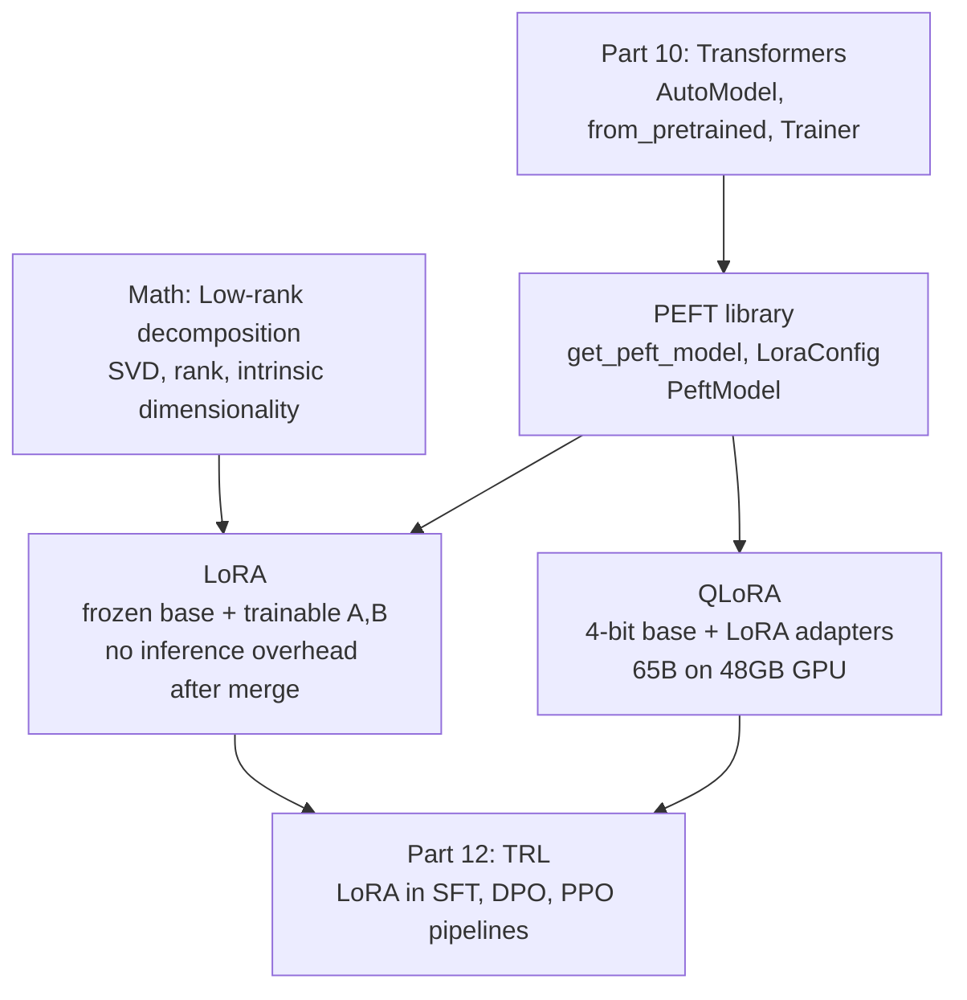
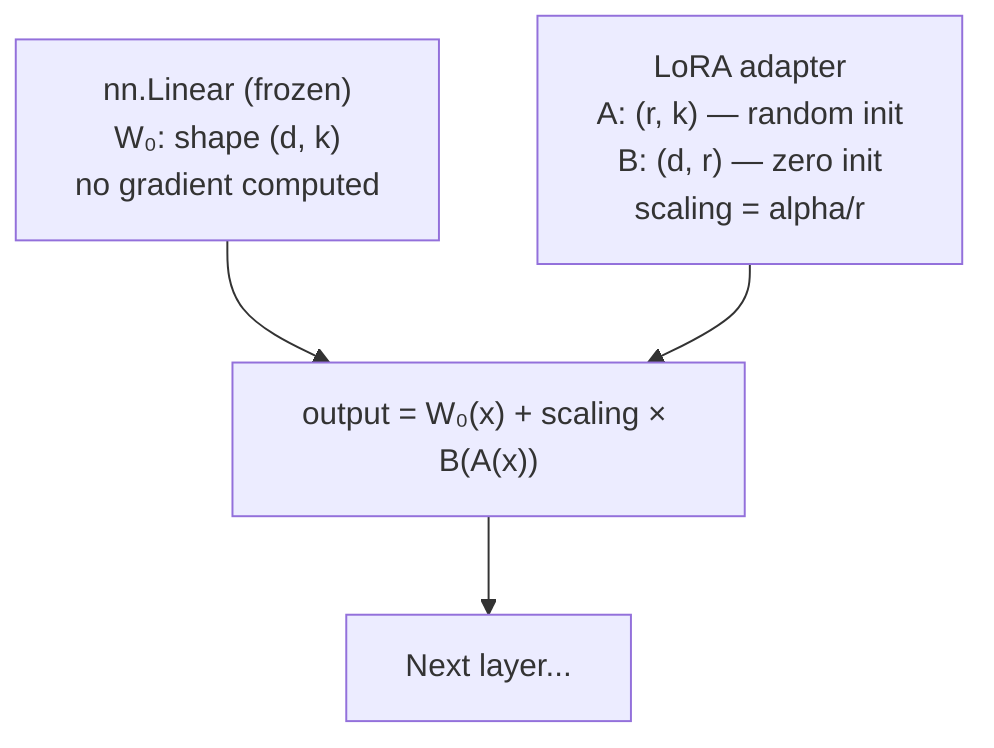

<!-- TEACHING_ORDER: verified -->
# Part 11: PEFT (Parameter-Efficient Fine-Tuning)

> **Prerequisites:** Part 10 (Transformers), Part 7 (PyTorch), linear algebra (low-rank decomposition)
> **Used later in:** Part 12 (TRL — LoRA is used in all modern RLHF/DPO pipelines)
> **Version anchor:** `peft` 0.13+ (mid-2026), `bitsandbytes` 0.44+

---

## Why This Library Exists

### The problem: fine-tuning a 70B model requires 70B × 3 copies of parameters

Full fine-tuning a language model means:
- Loading all weights into GPU memory
- Storing a gradient for each weight (same size)
- Storing an optimizer state (AdamW: 2 copies of each gradient = 2× more)

For a 7B parameter model in float32:
- Weights: 7B × 4 bytes = **28 GB**
- Gradients: **28 GB**
- AdamW optimizer: **56 GB**
- Total: **~112 GB** — requires 2 × A100-80GB just for the parameters

For a 70B model: ~1.12 TB. For many teams, this is completely inaccessible.

Furthermore, full fine-tuning a 7B model for a new task produces a new 7B model — you cannot serve 50 different fine-tuned variants of the same base model without 50× the memory.

### The solution: only update a tiny fraction of parameters

Hu et al. (2021) introduced **LoRA (Low-Rank Adaptation)** with a brilliant insight: the weight updates during fine-tuning have low intrinsic rank. Instead of updating the full weight matrix W (size d×k), you can approximate the update ΔW as the product of two small matrices A (d×r) and B (r×k) where r << d,k.

```
New weight = W₀ + ΔW = W₀ + B × A
```

During fine-tuning:
- `W₀` is frozen (never updated, no gradient computed)
- Only `A` and `B` are trained
- For r=8, d=4096, k=4096: original 16M parameters → only 64K (0.4%)!

After fine-tuning, `B × A` can be merged back into `W₀` (adding ΔW = BA), giving a model with zero inference overhead. Or, B and A can be kept as separate adapters and swapped dynamically — enabling a single base model to serve hundreds of tasks.

**QLoRA** (Dettmers et al., 2023) combined LoRA with 4-bit quantization of the frozen base model. This brought fine-tuning a 65B model to a single 48GB GPU — democratizing LLM fine-tuning completely.

The `peft` library (Hugging Face, 2022) wraps LoRA, QLoRA, and other PEFT methods into a single API that plugs into any `transformers` model.

---

## Explain Like I Am 10

Imagine you have a huge painting of the Mona Lisa (the pretrained model). You want to modify it to look like a painting of your grandmother instead.

Full fine-tuning: you buy a brand new canvas and repaint everything from scratch using the Mona Lisa as inspiration. Expensive!

LoRA: you buy a tiny transparent overlay sheet. You paint only the changes on the overlay. To see the grandmother portrait, you hold the overlay on top of the Mona Lisa. The original painting is untouched — you can swap overlays for different people without repainting anything.

The overlay sheet (LoRA adapter) is tiny — maybe 1% the size of the original painting. And you can have hundreds of overlays for different tasks, all sharing one Mona Lisa base.

---

## Mental Model

**LoRA adds low-rank decomposed weight updates (B × A) to frozen weight matrices. Only A and B are trained — the base model is never touched.**

```
Forward pass:
  output = W₀ × input + (B × A) × input × scaling
         = frozen part + trainable part

W₀:   shape (d, k)    — frozen, never updated
A:    shape (r, k)    — initialized from random Gaussian
B:    shape (d, r)    — initialized to zero (so ΔW = 0 at init)
r:    rank — hyperparameter (4, 8, 16, 32, 64)
scaling = alpha / r   — controls update magnitude

Trainable parameters ≈ 2 × r × d ≈ 0.1–2% of model
```

---

## Learning Dependency Graph



---

## Core Concepts

### 1. LoRA configuration

```python
from peft import LoraConfig, TaskType

lora_config = LoraConfig(
    task_type=TaskType.CAUSAL_LM,   # or SEQ_CLS, SEQ_2_SEQ_LM, TOKEN_CLS
    r=16,                           # rank — controls capacity (4, 8, 16, 32)
    lora_alpha=32,                  # scaling factor: alpha/r multiplies ΔW
    target_modules=["q_proj", "v_proj"],  # which weight matrices to apply LoRA to
    lora_dropout=0.05,
    bias="none",                    # "none", "all", or "lora_only"
    inference_mode=False,
)
```

**Choosing `r`:** Start with r=8 or r=16. Higher r = more capacity but more memory. For instruction tuning of 7B models, r=16 works well. For very small domain adaptations, r=4 suffices. Paper findings: r=4–64 are the useful range; above 64 gives minimal gain.

**`target_modules`:** LoRA is applied to specific linear layers. For transformer LLMs, the standard practice is to target the Q, K, V, O projections in attention, and sometimes the MLP layers. Common choices:
- Minimal: `["q_proj", "v_proj"]`
- More capacity: `["q_proj", "k_proj", "v_proj", "o_proj"]`
- Full attention + MLP: `["q_proj", "k_proj", "v_proj", "o_proj", "gate_proj", "up_proj", "down_proj"]`

### 2. Wrapping a model with PEFT

```python
from transformers import AutoModelForCausalLM, AutoTokenizer
from peft import get_peft_model, LoraConfig, TaskType
import torch

model_name = "meta-llama/Llama-3.2-1B"
model = AutoModelForCausalLM.from_pretrained(
    model_name,
    torch_dtype=torch.bfloat16,
    device_map="auto",
)

lora_config = LoraConfig(
    task_type=TaskType.CAUSAL_LM,
    r=16,
    lora_alpha=32,
    target_modules=["q_proj", "v_proj"],
    lora_dropout=0.05,
    bias="none",
)

# Wrap model with LoRA
peft_model = get_peft_model(model, lora_config)

# Print trainable vs total parameters
peft_model.print_trainable_parameters()
# trainable params: 2,097,152 || all params: 1,238,849,536 || trainable%: 0.17%
```

### 3. QLoRA: 4-bit base + LoRA

```python
from transformers import AutoModelForCausalLM, BitsAndBytesConfig
from peft import prepare_model_for_kbit_training, get_peft_model, LoraConfig

# 4-bit quantization config
bnb_config = BitsAndBytesConfig(
    load_in_4bit=True,
    bnb_4bit_quant_type="nf4",          # NormalFloat4 — optimal for normal distributions
    bnb_4bit_compute_dtype=torch.bfloat16,  # upcast to bfloat16 for computation
    bnb_4bit_use_double_quant=True,     # quantize quantization constants (saves ~0.5 bit)
)

model = AutoModelForCausalLM.from_pretrained(
    "meta-llama/Llama-3.2-1B",
    quantization_config=bnb_config,
    device_map="auto",
)

# Required for QLoRA — enables gradient checkpointing and casts layer norms to float32
model = prepare_model_for_kbit_training(model)

lora_config = LoraConfig(
    r=16,
    lora_alpha=32,
    target_modules=["q_proj", "k_proj", "v_proj", "o_proj"],
    lora_dropout=0.05,
    bias="none",
    task_type="CAUSAL_LM",
)

model = get_peft_model(model, lora_config)
model.print_trainable_parameters()
```

### 4. Saving and loading adapters

```python
# Save only the LoRA adapter weights (tiny — typically 10–100MB)
peft_model.save_pretrained("./my-lora-adapter")
# Saves: adapter_config.json, adapter_model.safetensors

# Load adapter onto a base model later
from peft import PeftModel
base_model = AutoModelForCausalLM.from_pretrained("meta-llama/Llama-3.2-1B")
model      = PeftModel.from_pretrained(base_model, "./my-lora-adapter")

# Merge LoRA weights into base model (no inference overhead)
merged_model = model.merge_and_unload()
# Now merged_model is a standard HuggingFace model — no peft dependency
merged_model.save_pretrained("./merged-model")
```

### 5. Training with LoRA + Trainer

```python
from transformers import TrainingArguments, Trainer, AutoTokenizer
from datasets import load_dataset

tokenizer = AutoTokenizer.from_pretrained("meta-llama/Llama-3.2-1B")
tokenizer.pad_token = tokenizer.eos_token   # LLaMA has no pad token

dataset = load_dataset("tatsu-lab/alpaca", split="train[:1000]")

def preprocess(examples):
    prompts = [
        f"### Instruction:\n{inst}\n\n### Response:\n{out}"
        for inst, out in zip(examples["instruction"], examples["output"])
    ]
    return tokenizer(prompts, truncation=True, max_length=512, padding="max_length")

dataset = dataset.map(preprocess, batched=True, remove_columns=dataset.column_names)

args = TrainingArguments(
    output_dir="./lora-output",
    num_train_epochs=1,
    per_device_train_batch_size=4,
    gradient_accumulation_steps=4,    # effective batch = 16
    learning_rate=2e-4,
    fp16=True,
    optim="paged_adamw_32bit",        # paged optimizer — off-loads to CPU when needed
    warmup_ratio=0.03,
    lr_scheduler_type="cosine",
    save_steps=50,
    logging_steps=10,
)

trainer = Trainer(
    model=peft_model,
    args=args,
    train_dataset=dataset,
)

trainer.train()
peft_model.save_pretrained("./lora-adapter")
```

---

## Internal Architecture



**Why B initialized to zero?** At the start of training, `B × A = 0`, so the LoRA model is identical to the base model. This ensures stable training — if B were random, the model would produce garbage outputs from step 1. As training proceeds, A and B diverge from their initialization, and ΔW = B × A captures the task-specific update.

**Memory savings from LoRA:**

| Model size | Full fine-tune memory | LoRA memory (r=16) |
|---|---|---|
| 7B (bf16) | ~56 GB (params + grad + optim) | ~14 GB base + ~0.5 GB adapters |
| 13B | ~104 GB | ~26 GB + ~1 GB adapters |
| 70B | ~560 GB | ~140 GB + ~4 GB adapters |

---

## Essential APIs

```python
from peft import (
    LoraConfig, TaskType, get_peft_model,
    PeftModel, prepare_model_for_kbit_training
)

# Config
config = LoraConfig(r=16, lora_alpha=32, target_modules=["q_proj","v_proj"],
                    lora_dropout=0.05, bias="none", task_type=TaskType.CAUSAL_LM)

# Wrap model
model = get_peft_model(base_model, config)
model.print_trainable_parameters()

# Save adapter (NOT full model)
model.save_pretrained("./adapter-dir")

# Load adapter onto base
loaded = PeftModel.from_pretrained(base_model, "./adapter-dir")

# Merge into base (no inference overhead)
merged = loaded.merge_and_unload()

# Enable/disable adapter
model.disable_adapter_layers()   # use base model only
model.enable_adapter_layers()    # add adapter back

# QLoRA prep
from transformers import BitsAndBytesConfig
bnb = BitsAndBytesConfig(load_in_4bit=True, bnb_4bit_quant_type="nf4",
                          bnb_4bit_compute_dtype=torch.bfloat16)
model = AutoModelForCausalLM.from_pretrained("name", quantization_config=bnb)
model = prepare_model_for_kbit_training(model)
model = get_peft_model(model, config)
```

---

## Beginner Examples

### Example 1: LoRA on a small model

```python
import torch
from transformers import AutoModelForCausalLM, AutoTokenizer
from peft import get_peft_model, LoraConfig, TaskType

# Use a tiny model for demonstration
model_name = "gpt2"
tokenizer  = AutoTokenizer.from_pretrained(model_name)
model      = AutoModelForCausalLM.from_pretrained(model_name)

print(f"Base model parameters: {sum(p.numel() for p in model.parameters()):,}")

config = LoraConfig(
    task_type=TaskType.CAUSAL_LM,
    r=8,
    lora_alpha=16,
    target_modules=["c_attn"],   # GPT-2 uses c_attn for Q, K, V combined
    lora_dropout=0.1,
    bias="none",
)

peft_model = get_peft_model(model, config)
peft_model.print_trainable_parameters()

# Verify that non-adapter parameters are frozen
for name, param in peft_model.named_parameters():
    if "lora" not in name:
        assert not param.requires_grad, f"Non-LoRA param should be frozen: {name}"
print("All non-LoRA parameters are frozen ✓")
```

---

## Advanced Examples

### Example 2: Multi-task with multiple LoRA adapters

```python
from peft import PeftModel, LoraConfig, get_peft_model
from transformers import AutoModelForCausalLM

base_model = AutoModelForCausalLM.from_pretrained("gpt2")

# Fine-tune adapter 1 (task: sentiment)
config_sentiment = LoraConfig(r=8, lora_alpha=16, target_modules=["c_attn"])
peft_model = get_peft_model(base_model, config_sentiment)
# ... training ...
peft_model.save_pretrained("./adapters/sentiment")

# Fine-tune adapter 2 (task: summarization)
config_summary = LoraConfig(r=8, lora_alpha=16, target_modules=["c_attn"])
peft_model2 = get_peft_model(base_model, config_summary)
# ... training ...
peft_model2.save_pretrained("./adapters/summarization")

# At inference: load and swap adapters
model = AutoModelForCausalLM.from_pretrained("gpt2")
model = PeftModel.from_pretrained(model, "./adapters/sentiment", adapter_name="sentiment")
model.load_adapter("./adapters/summarization", adapter_name="summarization")

# Switch tasks
model.set_adapter("sentiment")
# ... run inference for sentiment ...

model.set_adapter("summarization")
# ... run inference for summarization ...
```

---

## Internal Interview Knowledge

**Q: Why does LoRA work? What's the theoretical basis?**
Strong answer: "The paper's hypothesis is that pretrained LLM weight updates during fine-tuning have low intrinsic rank — meaning the weight change ΔW can be approximated well by a low-rank matrix without losing much task performance. This is supported by observations that language models can be compressed significantly after training. Mathematically, any matrix can be decomposed via SVD into singular values times singular vectors; if most singular values are near zero, a low-rank approximation suffices. LoRA constrains ΔW to the space of rank-r matrices from the start of training."

**Q: What is the difference between LoRA and full fine-tuning in terms of expressivity?**
Strong answer: "Full fine-tuning can update every weight in every direction. LoRA constrains ΔW to rank-r updates — this is a restriction of the hypothesis space. In practice, the restriction is beneficial: it acts as implicit regularization, reducing overfitting on small fine-tuning datasets. The rank r controls the tradeoff: r=4 is very constrained (good for small datasets), r=64 is nearly as expressive as full fine-tuning. For most instruction tuning tasks, r=16 captures most of the performance of full fine-tuning with <1% of the trainable parameters."

**Q: When would you NOT use LoRA and use full fine-tuning instead?**
Strong answer: "(1) When you have massive fine-tuning data (millions of examples) and the task distribution is very different from pretraining — the low-rank constraint becomes limiting. (2) Continual pretraining — adding new knowledge to the model requires updating all weights including the MLP layers which LoRA may not cover. (3) When you need maximum task performance and have the GPU budget. (4) When merging many adapters causes interference — full fine-tuning avoids adapter composition issues."

---

## Production AI Usage

**Hugging Face (PEFT library itself):** The `peft` library is used by thousands of researchers to fine-tune models. The Hugging Face Hub has 100,000+ LoRA adapters uploaded.

**Meta:** Llama 2 and Llama 3 fine-tuning guides from Meta recommend LoRA (QLoRA specifically). The official Llama fine-tuning code uses PEFT.

**Databricks (Dolly, DBRX):** Databricks published the Dolly instruction fine-tuned models using PEFT + QLoRA. Enterprise Databricks customers use PEFT for custom fine-tuning.

**Replicate, Modal, Banana.dev:** Fine-tuning-as-a-service platforms use LoRA to offer custom model fine-tuning without requiring customers to have their own GPUs.

**A16z-backed LLM startups:** Most LLM startups that offer "bring your own fine-tune" products use PEFT under the hood. QLoRA enabled fine-tuning 7B models on a single A100 — critical for cost-efficiency.

---

## Common Mistakes

**Mistake 1: Not setting `pad_token` for LLaMA-style models**
```python
# LLaMA tokenizer has no pad token — training crashes with padding
tokenizer = AutoTokenizer.from_pretrained("meta-llama/Llama-3.2-1B")
# tokenizer.pad_token is None → DataCollator crashes!

# Fix: set pad token = eos token
tokenizer.pad_token = tokenizer.eos_token
model.config.pad_token_id = model.config.eos_token_id
```

**Mistake 2: Saving the full model instead of just the adapter**
```python
# Bug: saves all 7B parameters (14GB file)
model.save_pretrained("./output")

# Fix: peft_model.save_pretrained saves only adapter weights (~50MB)
peft_model.save_pretrained("./output")
```

**Mistake 3: Forgetting `prepare_model_for_kbit_training` in QLoRA**
```python
# Bug: training crashes or uses wrong dtypes
model = AutoModelForCausalLM.from_pretrained("name", quantization_config=bnb)
model = get_peft_model(model, config)   # skipped prepare step!

# Fix:
model = AutoModelForCausalLM.from_pretrained("name", quantization_config=bnb)
model = prepare_model_for_kbit_training(model)   # ← required
model = get_peft_model(model, config)
```

---

## Cheat Sheet

```python
from peft import LoraConfig, get_peft_model, PeftModel, prepare_model_for_kbit_training
from transformers import BitsAndBytesConfig
import torch

# ── QLoRA config ──────────────────────────────────────────────────────
bnb = BitsAndBytesConfig(load_in_4bit=True, bnb_4bit_quant_type="nf4",
                          bnb_4bit_compute_dtype=torch.bfloat16)
model = AutoModelForCausalLM.from_pretrained("name", quantization_config=bnb)
model = prepare_model_for_kbit_training(model)

# ── LoRA config ───────────────────────────────────────────────────────
config = LoraConfig(r=16, lora_alpha=32,
    target_modules=["q_proj","k_proj","v_proj","o_proj"],
    lora_dropout=0.05, bias="none", task_type="CAUSAL_LM")
model = get_peft_model(model, config)
model.print_trainable_parameters()

# ── Save only adapter ─────────────────────────────────────────────────
model.save_pretrained("./adapter")

# ── Load adapter later ────────────────────────────────────────────────
base  = AutoModelForCausalLM.from_pretrained("name")
model = PeftModel.from_pretrained(base, "./adapter")

# ── Merge and unload (no overhead) ───────────────────────────────────
merged = model.merge_and_unload()
```

---

## Interview Question Bank

**Q1: Explain LoRA's mathematical formulation.** A: LoRA approximates the weight update ΔW as a product of two low-rank matrices: ΔW = B × A, where A has shape (r, k) and B has shape (d, r), with r << min(d, k). During training, only A and B are updated (W₀ is frozen). The contribution is scaled by alpha/r. A is initialized from a random Gaussian, B from zero — ensuring the model starts identical to the pretrained base. After training, ΔW can be merged into W₀ for zero inference overhead.

**Q2: What are the memory savings of QLoRA vs full fine-tuning for a 7B model?** A: Full fine-tuning a 7B model in bf16: weights (14GB) + gradients (14GB) + AdamW optimizer states (28GB) = ~56GB minimum. QLoRA: 4-bit base model (~4GB) + LoRA adapter activations and gradients (~3-4GB) + AdamW optimizer for adapters only (~1GB) = ~8-10GB total. This enables 7B model fine-tuning on a single 16GB consumer GPU (e.g., RTX 4090).

**Q3: What is `merge_and_unload` and when should you use it?** A: `merge_and_unload` adds the LoRA weight deltas (ΔW = B×A×scaling) into the original weight matrices W₀, then removes the LoRA adapters. The result is a standard (non-PEFT) model with the same accuracy as the LoRA version but with zero inference overhead — no extra matrix multiplications. Use when: deploying the model to production and PEFT library is not available, or when exporting to ONNX/TensorRT, or when you want to share a merged model on the Hub.

**Q4: Which layers should you target with LoRA and why?** A: Attention projection matrices (q_proj, k_proj, v_proj, o_proj) are the standard targets — they have the most influence on what information is attended to and how it is combined. MLP layers (gate_proj, up_proj, down_proj) encode factual knowledge and can be targeted for knowledge update tasks. Layer norms are usually not targeted (small, sensitive). Starting with just q_proj and v_proj (original LoRA paper recommendation) is safe; targeting all attention projections gives better performance at higher cost.

**Q5: What is the difference between `lora_alpha` and `r`, and how do you tune them?** A: `r` (rank) controls the dimension of the LoRA matrices — higher r = more parameters, more expressive, more memory. `lora_alpha` is a scaling constant: the LoRA contribution is multiplied by alpha/r. In practice, setting alpha = 2×r (e.g., r=16, alpha=32) is the standard heuristic — it normalizes the effective learning rate regardless of r, making the optimal learning rate approximately constant across different r values. When tuning, fix alpha/r = 2 and increase r to add capacity.

## Quality Checklist

- [x] Easy English used
- [x] Problem explained (full fine-tune memory requirements, adapter storage problem)
- [x] History explained (Hu et al. 2021, QLoRA Dettmers 2023, peft library 2022)
- [x] Intuition explained (ELI10: overlay painting analogy)
- [x] Mental model explained (frozen W₀ + trainable B×A, ΔW = BA)
- [x] Dependency graph included
- [x] Internal architecture included (B init to zero, memory table, LayerNorm handling)
- [x] APIs explained (LoraConfig, get_peft_model, PeftModel, save/load, QLoRA)
- [x] Beginner examples included
- [x] Advanced examples included (multi-adapter)
- [x] Production examples included (Meta, Databricks, Replicate)
- [x] Performance explained (r tuning, target modules, memory table)
- [x] Common mistakes included
- [x] Interview questions included
- [x] Cheat sheet included

*[Back to handbook](README.md)*
