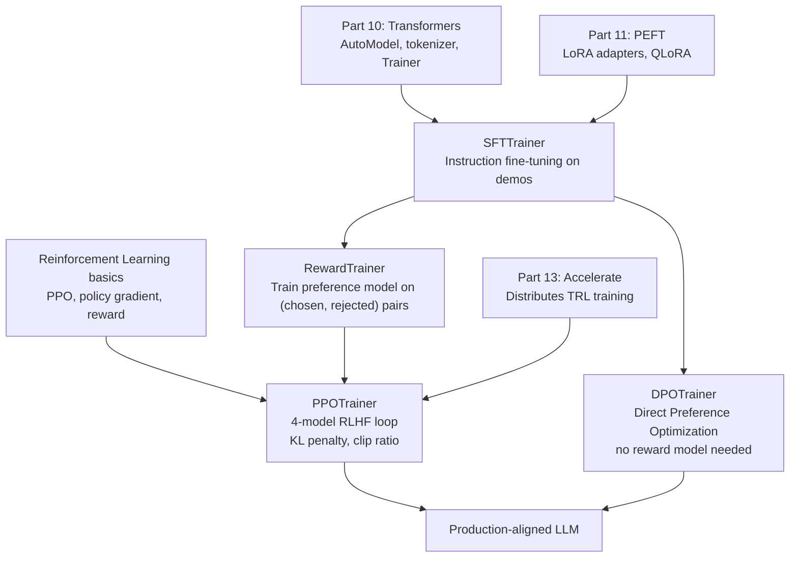
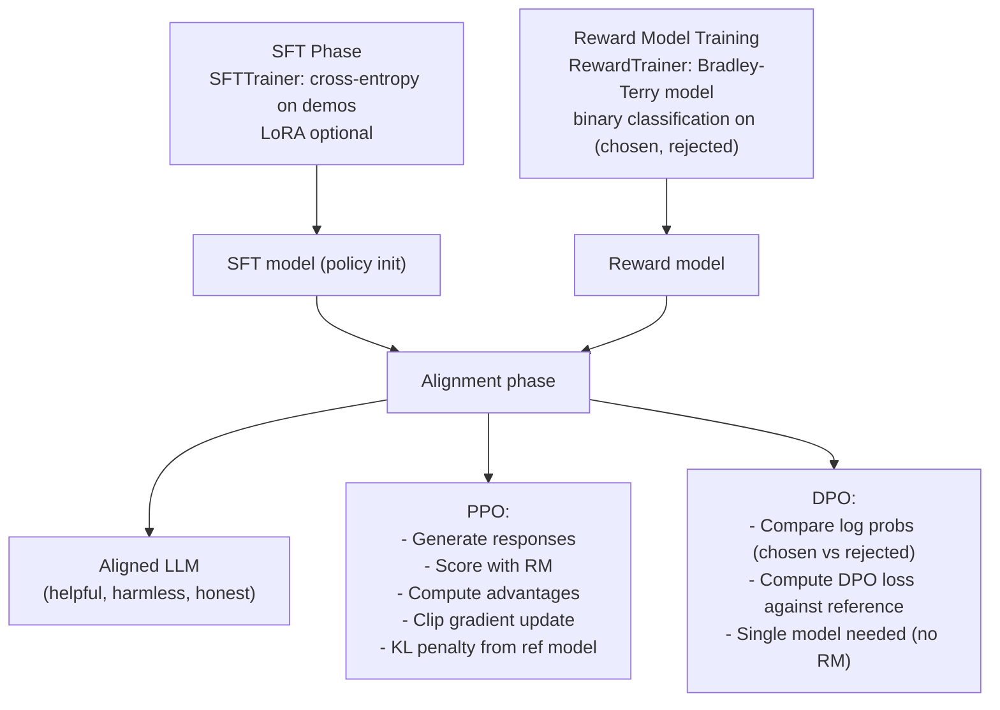

<!-- TEACHING_ORDER: verified -->
# Part 12: TRL (Transformer Reinforcement Learning)

> **Prerequisites:** Parts 10–11 (Transformers, PEFT), basic probability and RL concepts
> **Used later in:** Part 13 (Accelerate distributes TRL training)
> **Version anchor:** `trl` 0.12+ (mid-2026)

---

## Why This Library Exists

### The problem: pretraining alone produces capable but misaligned models

A language model trained only on internet text learns to predict the next token. It becomes very good at this — it can write code, translate languages, summarize documents. But predicting the next token has a critical limitation: it can also predict the next token in abusive content, misinformation, manipulative rhetoric, and harmful instructions, because all of those existed in the training data.

In 2020–2022, OpenAI researchers including Paul Christiano, Jan Leike, and colleagues developed **Reinforcement Learning from Human Feedback (RLHF)** — a training procedure that uses human preference judgments to steer a model away from undesired behavior and toward helpful, harmless, honest responses. InstructGPT (Ouyang et al., 2022) demonstrated this at scale, and GPT-4, Claude 2, Gemini — all modern conversational AI systems — use some form of RLHF or its successors.

The problem: implementing RLHF from scratch requires:
- A supervised fine-tuning (SFT) phase
- Training a separate reward model from human preference data
- Running PPO (Proximal Policy Optimization) with 4 models loaded simultaneously: actor, critic, reference policy, reward model
- Complex PPO hyperparameter tuning

Hugging Face built the **TRL** (Transformer Reinforcement Learning) library to make this accessible. It provides clean, modular implementations of SFT, reward modeling, PPO, and the newer DPO method that bypasses the reward model entirely.

---

## Explain Like I Am 10

Imagine you are training a dog to perform tricks. Two approaches:

**Pretraining only:** The dog watches thousands of other dogs and learns to imitate whatever they do — good tricks and bad tricks.

**RLHF:** First, teach the dog the basics (SFT — supervised fine-tuning on demonstrations). Then, every time it does something good, give it a treat (the reward model scores the behavior). The dog learns to do more of what gets treats (PPO — the policy is optimized using the reward signal). Over time, the dog becomes helpful and safe.

**DPO:** Skip the explicit treats. Instead, show the dog pairs of behaviors and say "this one was better." The dog adjusts directly from the comparisons (Direct Preference Optimization — no reward model needed).

TRL is the dog training toolkit — it provides the leashes, treats, and training routines.

---

## Mental Model

**TRL provides three training stages for aligning LLMs:**
1. **SFT (Supervised Fine-Tuning):** Train the model to follow the instruction format on demonstration data.
2. **Reward Modeling:** Train a separate model to score responses by human preference.
3. **PPO (or DPO):** Optimize the SFT model to maximize the reward (PPO) or directly from preference pairs (DPO).

```
Human demos ─────→ SFT model (follows instructions)
Human preferences → Reward model (scores good vs bad)
SFT + Reward ─────→ PPO training → RLHF-trained model
                   OR
Preference pairs → DPO training → Aligned model (no reward model)
```

---

## Learning Dependency Graph



---

## Core Concepts

### 1. SFT (Supervised Fine-Tuning): the foundation

Before any alignment, the pretrained model must learn to follow the expected input format (system prompt + user message → assistant response). This is SFT.

```python
from trl import SFTTrainer, SFTConfig
from transformers import AutoModelForCausalLM, AutoTokenizer
from datasets import load_dataset
from peft import LoraConfig

model_name = "meta-llama/Llama-3.2-1B"
tokenizer  = AutoTokenizer.from_pretrained(model_name)
tokenizer.pad_token = tokenizer.eos_token
model = AutoModelForCausalLM.from_pretrained(model_name, torch_dtype="auto")

# Dataset must have a "text" column or "messages" column in chat format
dataset = load_dataset("HuggingFaceH4/ultrachat_200k", split="train_sft[:5000]")

# LoRA config for efficient fine-tuning
peft_config = LoraConfig(
    r=16,
    lora_alpha=32,
    target_modules=["q_proj", "v_proj"],
    lora_dropout=0.05,
    bias="none",
    task_type="CAUSAL_LM",
)

sft_config = SFTConfig(
    output_dir="./sft-output",
    num_train_epochs=1,
    per_device_train_batch_size=2,
    gradient_accumulation_steps=8,
    learning_rate=2e-4,
    warmup_ratio=0.1,
    lr_scheduler_type="cosine",
    bf16=True,
    max_seq_length=1024,
    logging_steps=20,
)

trainer = SFTTrainer(
    model=model,
    args=sft_config,
    train_dataset=dataset,
    peft_config=peft_config,
)

trainer.train()
trainer.save_model("./sft-final")
```

### 2. DPO (Direct Preference Optimization): alignment without RL

DPO (Rafailov et al., 2023) is the most widely used alignment technique in 2024–2026. It bypasses the reward model and PPO entirely by showing the model pairs of responses — one chosen (preferred) and one rejected — and optimizing directly.

**The key insight:** under a specific parameterization, the optimal policy under RLHF satisfies a closed-form relationship between the reward and the policy's log probability ratio. DPO exploits this to turn preference learning into a binary classification problem.

```python
from trl import DPOTrainer, DPOConfig
from transformers import AutoModelForCausalLM, AutoTokenizer
from datasets import load_dataset

model_name    = "meta-llama/Llama-3.2-1B"
tokenizer     = AutoTokenizer.from_pretrained(model_name)
model         = AutoModelForCausalLM.from_pretrained(model_name, torch_dtype="bfloat16")
# ref_model: frozen copy of the SFT checkpoint (no gradient)
ref_model     = AutoModelForCausalLM.from_pretrained(model_name, torch_dtype="bfloat16")

# Preference dataset: must have "prompt", "chosen", "rejected" columns
dataset = load_dataset("HuggingFaceH4/ultrafeedback_binarized", split="train_prefs[:2000]")

dpo_config = DPOConfig(
    output_dir="./dpo-output",
    num_train_epochs=1,
    per_device_train_batch_size=1,
    gradient_accumulation_steps=8,
    learning_rate=5e-7,      # DPO needs very small LR
    beta=0.1,                # KL penalty coefficient — higher = more conservative
    bf16=True,
    max_length=1024,
    max_prompt_length=512,
    logging_steps=10,
)

trainer = DPOTrainer(
    model=model,
    ref_model=ref_model,
    args=dpo_config,
    train_dataset=dataset,
    tokenizer=tokenizer,
)

trainer.train()
trainer.save_model("./dpo-final")
```

**DPO loss function:**
```
L_DPO(π) = -E[(y_w, y_l) ~ D] [log σ(β log(π(y_w|x)/π_ref(y_w|x)) - β log(π(y_l|x)/π_ref(y_l|x)))]
```

Where:
- `y_w` = chosen (preferred) response
- `y_l` = rejected response
- `π_ref` = reference (frozen SFT) model
- `β` = KL penalty — controls how far from the reference model the policy is allowed to move
- `σ` = sigmoid function

The model is rewarded for increasing log probability of chosen responses relative to the reference, and penalized for rejected responses.

### 3. PPO: full RLHF pipeline

PPO is more complex but more flexible than DPO. It requires training four models simultaneously:

1. **Actor (policy):** The model being trained
2. **Reference policy:** Frozen copy of SFT model (KL constraint target)
3. **Reward model:** Scores responses
4. **Critic (value model):** Estimates expected future rewards (optional in TRL)

```python
from trl import PPOTrainer, PPOConfig, AutoModelForCausalLMWithValueHead, create_reference_model

config = PPOConfig(
    model_name="meta-llama/Llama-3.2-1B",
    learning_rate=1.41e-5,
    batch_size=8,
    mini_batch_size=1,
    gradient_accumulation_steps=8,
    ppo_epochs=4,
    kl_penalty="kl",
    init_kl_coef=0.05,      # initial KL coefficient
    target_kl=6.0,           # target KL divergence from reference
    adap_kl_ctrl=True,       # adaptive KL controller
)

# Model needs a value head for PPO
model        = AutoModelForCausalLMWithValueHead.from_pretrained(config.model_name)
ref_model    = create_reference_model(model)   # frozen copy

trainer = PPOTrainer(
    config=config,
    model=model,
    ref_model=ref_model,
    tokenizer=tokenizer,
)

# Training loop (simplified)
for batch in dataset:
    query_tensors  = batch["input_ids"]
    # Generate responses
    response_tensors = trainer.generate(query_tensors, max_new_tokens=128)
    # Score with reward model
    rewards = [reward_model.score(q, r) for q, r in zip(query_tensors, response_tensors)]
    # PPO update
    stats = trainer.step(query_tensors, response_tensors, rewards)
    trainer.log_stats(stats, batch, rewards)
```

---

## Internal Architecture



**KL penalty:** Both PPO and DPO constrain how far the policy drifts from the reference SFT model. This prevents the model from "hacking" the reward — finding adversarial responses that score high on the reward model but are gibberish to humans. Without KL regularization, models collapse to reward model vulnerabilities.

---

## Essential APIs

```python
from trl import SFTTrainer, SFTConfig, DPOTrainer, DPOConfig, PPOTrainer, PPOConfig
from trl import AutoModelForCausalLMWithValueHead, create_reference_model

# SFT
SFTConfig(output_dir, num_train_epochs, per_device_train_batch_size,
          bf16=True, max_seq_length=1024)
SFTTrainer(model, args=sft_config, train_dataset, peft_config)

# DPO
DPOConfig(output_dir, beta=0.1, learning_rate=5e-7, bf16=True)
DPOTrainer(model, ref_model, args, train_dataset, tokenizer)
# Dataset requires: "prompt", "chosen", "rejected" columns

# PPO
PPOConfig(model_name, learning_rate, batch_size, ppo_epochs, kl_penalty)
PPOTrainer(config, model, ref_model, tokenizer)
trainer.generate(query_tensors, max_new_tokens=128)
trainer.step(queries, responses, rewards)
```

---

## Beginner Examples

### Example: DPO on a toy preference dataset

```python
from datasets import Dataset
from trl import DPOTrainer, DPOConfig
from transformers import AutoModelForCausalLM, AutoTokenizer
import torch

# Toy dataset
data = {
    "prompt": ["What is 2+2?", "Tell me a joke", "Is the sky blue?"],
    "chosen": ["2+2 equals 4.", "Why did the chicken cross the road? To get to the other side!", "Yes, the sky appears blue due to Rayleigh scattering."],
    "rejected": ["I dunno.", "I can't tell jokes.", "I'm not sure."],
}
dataset = Dataset.from_dict(data)

model_name = "gpt2"
tokenizer  = AutoTokenizer.from_pretrained(model_name)
tokenizer.pad_token = tokenizer.eos_token
model     = AutoModelForCausalLM.from_pretrained(model_name)
ref_model = AutoModelForCausalLM.from_pretrained(model_name)

config = DPOConfig(
    output_dir="./dpo-toy",
    num_train_epochs=1,
    per_device_train_batch_size=1,
    learning_rate=5e-7,
    beta=0.1,
    max_length=64,
    max_prompt_length=32,
    logging_steps=1,
    no_cuda=True,   # CPU for demo
)

trainer = DPOTrainer(
    model=model,
    ref_model=ref_model,
    args=config,
    train_dataset=dataset,
    tokenizer=tokenizer,
)

trainer.train()
print("DPO training complete")
```

---

## Internal Interview Knowledge

**Q: What is the KL penalty in PPO/DPO and why is it necessary?**
Strong answer: "The KL penalty constrains how far the aligned model can drift from the SFT reference model. In PPO, this is `KL(π || π_ref)` added to the reward. In DPO, it's implicit in the `beta` parameter — higher beta = stronger KL constraint = smaller policy change. Without KL regularization, the model would 'reward hack' — find adversarial responses that score high on the reward model (e.g., extremely long, repetitive text) while being useless to humans. The KL term keeps the policy near the sensible region of the SFT model."

**Q: Why is DPO preferred over PPO in most 2024–2026 LLM work?**
Strong answer: "PPO requires training and serving 4 models simultaneously (actor, critic, reference, reward model), complex hyperparameter tuning, and significant engineering. DPO reformulates preference learning as a binary classification on (chosen, rejected) pairs — mathematically equivalent to PPO under certain assumptions, but requiring only 2 models (policy + reference). DPO is: simpler to implement, more stable to train, cheaper (no reward model inference), and produces competitive or better alignment results on most benchmarks. The main advantage of PPO: it can use online reward signals (human/AI rater scoring new generations), enabling continuous improvement."

**Q: What is ORPO and how does it differ from DPO?**
Strong answer: "ORPO (Odds Ratio Preference Optimization, Hong et al. 2024) combines SFT and preference optimization into a single training step. Instead of a separate SFT phase followed by DPO, ORPO adds a preference loss term directly to the standard SFT cross-entropy loss. The odds ratio `OR(y_w/y_l)` measures how much more likely the model is to generate the chosen response versus the rejected one. ORPO uses a simpler form that doesn't require a reference model — only the current policy model is needed. In TRL: `ORPOTrainer` implements this. It's faster than the SFT+DPO pipeline and competitive in quality."

---

## Production AI Usage

**Anthropic (Claude):** Claude's Constitutional AI uses a form of RLHF/RLAIF (RL from AI Feedback) — similar to TRL's pipeline but with AI-generated preference data. The concepts (reward modeling, KL-constrained policy optimization) are the same.

**OpenAI (ChatGPT, InstructGPT):** The original RLHF paper. PPO was used to train InstructGPT and early ChatGPT. Internal OpenAI tooling, but conceptually identical to TRL's PPOTrainer.

**Meta (Llama 2 Chat):** Llama 2 technical report explicitly describes their RLHF pipeline: SFT on 27K examples, then two reward models (helpfulness + safety), then PPO. This is exactly TRL's SFT → Reward → PPO pipeline.

**Mistral (Mistral Instruct):** Uses DPO for instruction tuning and alignment. DPO is the dominant method for smaller teams — no reward model needed.

---

## Cheat Sheet

```python
from trl import SFTTrainer, SFTConfig, DPOTrainer, DPOConfig

# ── SFT ──────────────────────────────────────────────────────────────
config = SFTConfig(output_dir="./out", num_train_epochs=1,
                   per_device_train_batch_size=4, bf16=True, max_seq_length=1024)
trainer = SFTTrainer(model, args=config, train_dataset=ds, peft_config=peft_cfg)
trainer.train()
trainer.save_model("./sft")

# ── DPO ──────────────────────────────────────────────────────────────
# Dataset: {"prompt": [...], "chosen": [...], "rejected": [...]}
config = DPOConfig(output_dir="./out", beta=0.1, learning_rate=5e-7, bf16=True)
trainer = DPOTrainer(model, ref_model, args=config, train_dataset=ds, tokenizer=tok)
trainer.train()

# ── Key hyperparameters ───────────────────────────────────────────────
# SFT: lr=2e-4, warmup_ratio=0.1, cosine schedule, grad_accum=8
# DPO: lr=5e-7 (much smaller!), beta=0.1-0.5, epochs=1-3
# PPO: lr=1.4e-5, batch_size=64, mini_batch_size=1, ppo_epochs=4
```

---

## Interview Question Bank

**Q1: What is RLHF and why is it needed?** A: Reinforcement Learning from Human Feedback is a training procedure that steers language models toward helpful, harmless, honest behavior using human preference data. Pretraining on internet text produces a capable but misaligned model — it can generate harmful content because harmful content existed in training data. RLHF adds a human signal: people compare model outputs and indicate which is better. This preference data trains a reward model, which then guides the policy model via PPO to produce responses humans prefer.

**Q2: Explain the three stages of the RLHF pipeline.** A: (1) SFT (Supervised Fine-Tuning): fine-tune the pretrained model on high-quality demonstrations of the desired behavior — instruction following, helpfulness, format. (2) Reward modeling: train a separate model to predict human preferences — given two responses, which do humans prefer? This is typically a Bradley-Terry preference model trained as binary classification on (chosen, rejected) pairs. (3) PPO: use the reward model to generate scores for model outputs, then update the policy using PPO with a KL penalty to prevent drifting too far from the SFT reference.

**Q3: What is the DPO objective and how does it differ from PPO?** A: DPO (Direct Preference Optimization) eliminates the reward model and PPO loop. It derives a closed-form loss from the RLHF objective: given a preference pair (y_w chosen, y_l rejected), maximize log σ(β × (log(π/π_ref)(y_w|x) - log(π/π_ref)(y_l|x))). This is a binary cross-entropy loss that increases the likelihood of chosen responses relative to the reference model and decreases the likelihood of rejected responses. No explicit reward model or RL loop is needed. DPO is simpler, more stable, and competitive with PPO on most benchmarks.

**Q4: What is the `beta` parameter in DPO and how do you tune it?** A: `beta` is the KL coefficient — it controls how much the aligned policy can diverge from the SFT reference model. High beta (0.5+): more conservative, stays close to reference, less likely to overfit to preferences. Low beta (0.05): more aggressive, allows larger policy changes, may overfit or become incoherent. Start with beta=0.1 (the paper's default). Increase if the model becomes repetitive or incoherent; decrease if the model barely changes from the reference.

**Q5: What is "reward hacking" and how does the KL penalty prevent it?** A: Reward hacking occurs when the policy finds high-reward outputs that are not actually good — e.g., extremely long repetitive text that scores high on a reward model trained to prefer detailed answers. The KL penalty (KL(π || π_ref)) adds a cost proportional to how far the policy diverges from the SFT reference. Since the SFT reference doesn't produce degenerate outputs, the penalty prevents the policy from collapsing to exploiting reward model weaknesses. The KL coefficient (beta in DPO, init_kl_coef in PPO) controls the tradeoff between reward maximization and staying sensible.

## Quality Checklist

- [x] Easy English used
- [x] Problem explained (pretrained models misaligned — RLHF history)
- [x] History explained (OpenAI InstructGPT, Paul Christiano, TRL library)
- [x] Intuition explained (ELI10: dog training analogy)
- [x] Mental model explained (SFT → Reward → PPO/DPO pipeline)
- [x] Dependency graph included
- [x] Internal architecture included (4-model PPO, DPO loss, KL penalty)
- [x] APIs explained (SFTTrainer, DPOTrainer, PPOTrainer, configs)
- [x] Beginner examples included
- [x] Production examples included (Anthropic, OpenAI, Meta, Mistral)
- [x] Common mistakes noted (KL penalty, DPO vs PPO tradeoffs)
- [x] Interview Question Bank included (5 core questions with answers)
- [x] Cheat sheet included

*[Back to handbook](README.md)*
