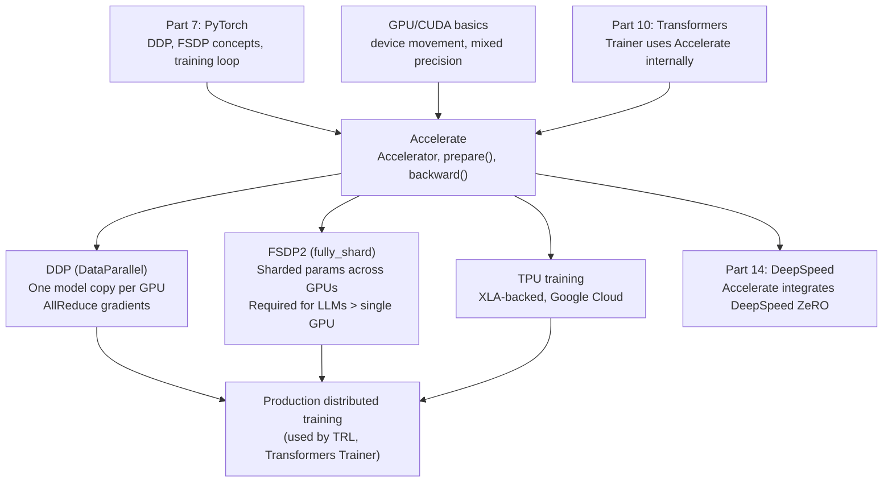
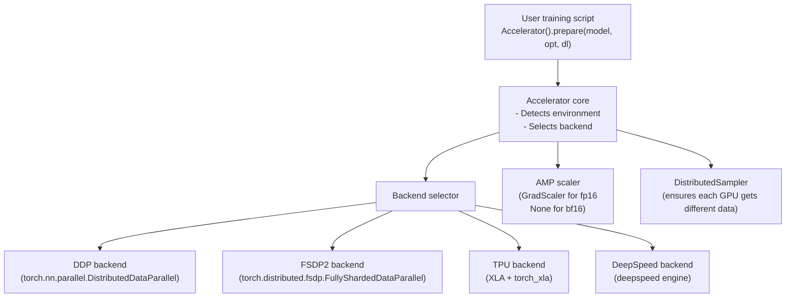

<!-- TEACHING_ORDER: verified -->
# Part 13: Accelerate

> **Prerequisites:** Parts 7–12 (PyTorch especially, and TRL/Transformers for LLM context)
> **Used later in:** DeepSpeed (Part 14), Megatron (Part 15), production distributed training
> **Version anchor:** `accelerate` 0.35+ (mid-2026), FSDP2 graduated

---

## Why This Library Exists

### The problem: moving from single-GPU to multi-GPU training is painful

When a PyTorch training script works on a single GPU, moving it to multiple GPUs requires:
- Wrapping the model in `torch.nn.parallel.DistributedDataParallel`
- Initializing the distributed process group (`dist.init_process_group`)
- Launching with `torchrun` or `torch.multiprocessing.spawn`
- Splitting data across GPUs with a `DistributedSampler`
- Moving every tensor to the correct device
- Handling gradient synchronization, checkpointing, and mixed precision differently per setup

If you want to switch from DDP to FSDP, or from GPU to TPU, the code changes are substantial. And if you want to support both single-GPU and multi-GPU with the same codebase, you end up with if/else branches everywhere.

Hugging Face built **Accelerate** to solve this: write training code once, run it anywhere — single GPU, multi-GPU DDP, multi-GPU FSDP, TPU — with minimal code changes.

Accelerate wraps the boilerplate of distributed training behind three objects:
- `Accelerator` — the central coordinator
- `accelerator.prepare()` — wraps model, optimizer, and dataloaders with the right distributed wrappers
- `accelerator.backward(loss)` — handles gradient computation (loss scaling for mixed precision)

---

## Explain Like I Am 10

Imagine your job is to bake 1,000 cakes as fast as possible. You have two options:

**Without Accelerate:** You must know whether you have one oven, ten ovens, or a professional bakery with industrial ovens — and write completely different instructions for each situation.

**With Accelerate:** Write the recipe once. The recipe says "use the oven" and "bake until done." Whether there is 1 oven or 1,000 ovens, the recipe works. Accelerate figures out how to split the baking across all available ovens automatically.

The recipe is your PyTorch training loop. The ovens are your GPUs. Accelerate handles the logistics of distributing work without changing your recipe.

---

## Mental Model

**Accelerate is a thin wrapper that makes your single-device PyTorch code work on any distributed setup with 5 lines of changes.**

The four changes required:
1. `accelerator = Accelerator()` — detect environment
2. `model, optimizer, train_dl = accelerator.prepare(model, optimizer, train_dl)` — wrap everything
3. Replace `loss.backward()` with `accelerator.backward(loss)` — handles AMP scaling
4. Use `accelerator.gather` for metrics, `accelerator.save_state` for checkpoints

Everything else stays identical to single-GPU code.

---

## Learning Dependency Graph



---

## Core Concepts

### 1. The `Accelerator` object

```python
from accelerate import Accelerator

accelerator = Accelerator(
    mixed_precision="bf16",        # "no", "fp16", "bf16"
    gradient_accumulation_steps=4, # accumulate before backward
    log_with="wandb",              # optional logging
)

# Information about the environment
print(f"Device: {accelerator.device}")
print(f"Num processes: {accelerator.num_processes}")
print(f"Is main process: {accelerator.is_main_process}")
print(f"Distributed type: {accelerator.distributed_type}")
```

`is_main_process` is critical: only one process should save checkpoints, log metrics, and print progress.

### 2. `accelerator.prepare()`: wraps everything at once

```python
from accelerate import Accelerator
from torch.utils.data import DataLoader
import torch.nn as nn
import torch.optim as optim

accelerator = Accelerator(mixed_precision="bf16")

model     = nn.Linear(10, 2)
optimizer = optim.AdamW(model.parameters(), lr=1e-3)
train_dl  = DataLoader(dataset, batch_size=32, shuffle=True)

# Wraps model with DDP/FSDP, optimizer with AMP support,
# dataloader with DistributedSampler
model, optimizer, train_dl = accelerator.prepare(model, optimizer, train_dl)

# No more .to(device) calls needed — Accelerate handles device placement
```

### 3. The standard training loop with Accelerate

The key insight: 95% of your training code is unchanged. Only a few lines differ:

```python
from accelerate import Accelerator
import torch
import torch.nn as nn
from torch.utils.data import DataLoader, TensorDataset

def create_model_and_data():
    model  = nn.Sequential(nn.Linear(20, 64), nn.ReLU(), nn.Linear(64, 1))
    X = torch.randn(500, 20)
    y = torch.randn(500, 1)
    ds = TensorDataset(X, y)
    dl = DataLoader(ds, batch_size=32, shuffle=True)
    return model, dl

def train():
    # 1. Create Accelerator
    accelerator = Accelerator(mixed_precision="bf16", gradient_accumulation_steps=2)

    model, train_dl = create_model_and_data()
    optimizer = torch.optim.AdamW(model.parameters(), lr=1e-3)
    criterion = nn.MSELoss()

    # 2. Prepare everything
    model, optimizer, train_dl = accelerator.prepare(model, optimizer, train_dl)

    for epoch in range(5):
        model.train()
        total_loss = 0.0

        for step, (X, y) in enumerate(train_dl):
            # X and y are already on the right device — no .to(device)!
            with accelerator.accumulate(model):  # gradient accumulation context
                output = model(X)
                loss   = criterion(output, y)
                # 3. Replace loss.backward()
                accelerator.backward(loss)

                optimizer.step()
                optimizer.zero_grad()

            total_loss += loss.item()

        # 4. Only print/log on main process
        if accelerator.is_main_process:
            print(f"Epoch {epoch+1}: loss = {total_loss/len(train_dl):.4f}")

    # 5. Save checkpoint
    accelerator.wait_for_everyone()
    if accelerator.is_main_process:
        unwrapped = accelerator.unwrap_model(model)
        torch.save(unwrapped.state_dict(), "model.pt")

if __name__ == "__main__":
    train()
```

**`accelerator.accumulate(model)` context manager:** Handles gradient accumulation cleanly. It automatically skips the DDP gradient synchronization on accumulation steps (critical for FSDP performance), and only synchronizes on the final step before the optimizer update.

### 4. FSDP2 configuration

For models too large for a single GPU, use FSDP (Fully Sharded Data Parallel):

```python
from accelerate import Accelerator, FullyShardedDataParallelPlugin
from torch.distributed.fsdp import MixedPrecision
import torch

fsdp_plugin = FullyShardedDataParallelPlugin(
    sharding_strategy="FULL_SHARD",   # shard params + grads + optim states
    mixed_precision_policy=MixedPrecision(
        param_dtype=torch.bfloat16,
        reduce_dtype=torch.bfloat16,
    ),
    cpu_offload=False,           # offload params to CPU when not needed
    activation_checkpointing=True,  # recompute activations in backward
)

accelerator = Accelerator(
    mixed_precision="bf16",
    fsdp_plugin=fsdp_plugin,
)
```

Alternatively, use the `accelerate config` CLI:
```bash
accelerate config    # interactive setup wizard
accelerate launch --config_file ./fsdp_config.yaml train.py
```

### 5. Launching distributed training

```bash
# Single GPU (for debugging)
python train.py

# Multi-GPU DDP (4 GPUs on one machine)
accelerate launch --num_processes 4 train.py

# Multi-GPU with config file
accelerate config   # generates accelerate_config.yaml interactively
accelerate launch --config_file ./accelerate_config.yaml train.py

# Via torchrun (equivalent)
torchrun --nproc_per_node=4 train.py
```

### 6. Saving and loading state

```python
# Save full training state (model, optimizer, scheduler, random states)
accelerator.save_state("./checkpoint-1000")

# Resume from checkpoint
accelerator.load_state("./checkpoint-1000")

# Save just the model (unwrap first to remove DDP/FSDP wrapper)
unwrapped_model = accelerator.unwrap_model(model)
unwrapped_model.save_pretrained("./my-model")
```

---

## Internal Architecture



**Why `accelerator.unwrap_model(model)` is necessary:** After `prepare()`, the model is wrapped in `DDP`/`FSDP`. The wrapper adds attributes and changes the forward signature. To save or access the original `nn.Module`, you must call `unwrap_model()` to strip the wrapper.

---

## Essential APIs

```python
from accelerate import Accelerator

# Setup
acc = Accelerator(mixed_precision="bf16", gradient_accumulation_steps=4)

# Prepare (returns same types, wrapped)
model, opt, dl = acc.prepare(model, optimizer, dataloader)

# Training
with acc.accumulate(model):      # gradient accumulation context
    acc.backward(loss)           # replaces loss.backward()
    opt.step()
    opt.zero_grad()

# Device info
acc.device                        # torch.device
acc.is_main_process               # bool: rank 0
acc.num_processes                 # total GPU count
acc.process_index                 # this GPU's rank

# Gathering metrics across GPUs
all_losses = acc.gather_for_metrics(loss.unsqueeze(0))  # (n_gpus,)
avg_loss = all_losses.mean()

# Checkpointing
acc.save_state("./ckpt")
acc.load_state("./ckpt")
acc.wait_for_everyone()           # barrier: wait for all processes

# Unwrap
unwrapped = acc.unwrap_model(model)
unwrapped.save_pretrained("./out")
```

---

## API Learning Roadmap

**Beginner:** `Accelerator(mixed_precision=)`, `prepare()`, `backward()`, `is_main_process` for logging

**Intermediate:** `accumulate()` context, `gather_for_metrics()`, `save_state/load_state`, `unwrap_model`

**Advanced:** FSDP2 config, DeepSpeed integration, custom callbacks, `accelerate config` CLI workflow

**Production:** Multi-node training, NVLink topology, pipeline parallelism via Megatron, gradient checkpointing config

---

## Beginner Examples

### Example 1: Converting a single-GPU training script to multi-GPU

```python
# BEFORE Accelerate (single GPU only)
import torch
import torch.nn as nn

device = "cuda" if torch.cuda.is_available() else "cpu"

model     = nn.Linear(10, 2).to(device)
optimizer = torch.optim.Adam(model.parameters())
X = torch.randn(100, 10).to(device)
y = torch.randn(100, 2).to(device)

for epoch in range(5):
    output = model(X)
    loss   = nn.MSELoss()(output, y)
    optimizer.zero_grad()
    loss.backward()
    optimizer.step()
    print(f"Loss: {loss.item():.4f}")


# AFTER Accelerate (works on 1 or N GPUs, no other changes)
from accelerate import Accelerator
import torch
import torch.nn as nn

accelerator = Accelerator()                                          # ← ADD 1

model     = nn.Linear(10, 2)
optimizer = torch.optim.Adam(model.parameters())
X = torch.randn(100, 10)
y = torch.randn(100, 2)
from torch.utils.data import TensorDataset, DataLoader
dl = DataLoader(TensorDataset(X, y), batch_size=16)

model, optimizer, dl = accelerator.prepare(model, optimizer, dl)   # ← ADD 2

for epoch in range(5):
    for X_batch, y_batch in dl:                                     # no .to(device)!
        output = model(X_batch)
        loss   = nn.MSELoss()(output, y_batch)
        optimizer.zero_grad()
        accelerator.backward(loss)                                  # ← CHANGE 3
        optimizer.step()
    if accelerator.is_main_process:                                 # ← ADD 4
        print(f"Loss: {loss.item():.4f}")
```

---

## Advanced Examples

### Example 2: Fine-tuning an LLM with Accelerate + PEFT

```python
from accelerate import Accelerator
from transformers import AutoModelForCausalLM, AutoTokenizer
from peft import get_peft_model, LoraConfig, TaskType
from torch.utils.data import DataLoader
import torch

accelerator = Accelerator(mixed_precision="bf16", gradient_accumulation_steps=4)

# Model + LoRA
model_name = "meta-llama/Llama-3.2-1B"
tokenizer  = AutoTokenizer.from_pretrained(model_name)
tokenizer.pad_token = tokenizer.eos_token
model = AutoModelForCausalLM.from_pretrained(model_name, torch_dtype=torch.bfloat16)

lora_config = LoraConfig(r=16, lora_alpha=32, target_modules=["q_proj","v_proj"],
                          task_type=TaskType.CAUSAL_LM)
model = get_peft_model(model, lora_config)

optimizer = torch.optim.AdamW(model.parameters(), lr=2e-4)

# Dummy DataLoader
from torch.utils.data import TensorDataset
ids = torch.randint(0, 1000, (64, 256))
dl  = DataLoader(TensorDataset(ids, ids), batch_size=4)  # input = target for LM

model, optimizer, dl = accelerator.prepare(model, optimizer, dl)

for step, (input_ids, labels) in enumerate(dl):
    with accelerator.accumulate(model):
        outputs = model(input_ids=input_ids, labels=labels)
        loss = outputs.loss
        accelerator.backward(loss)
        torch.nn.utils.clip_grad_norm_(model.parameters(), 1.0)
        optimizer.step()
        optimizer.zero_grad()

    if step % 10 == 0 and accelerator.is_main_process:
        print(f"Step {step}: loss = {loss.item():.4f}")

    if step >= 50:
        break

# Save
accelerator.wait_for_everyone()
if accelerator.is_main_process:
    unwrapped = accelerator.unwrap_model(model)
    unwrapped.save_pretrained("./lora-trained")
    tokenizer.save_pretrained("./lora-trained")
    print("Saved to ./lora-trained")
```

---

## Internal Interview Knowledge

**Q: What is the difference between DDP and FSDP2, and when does Accelerate use each?**
Strong answer: "DDP (Distributed Data Parallel) replicates the full model on each GPU — each GPU processes a different batch and gradients are synchronized with AllReduce after each backward pass. DDP requires each GPU to hold the full model, so it is limited to models that fit on one GPU. FSDP2 (Fully Sharded Data Parallel) shards parameters, gradients, and optimizer states across all GPUs — each GPU holds only 1/N of each tensor. Before a layer's forward pass, parameters are gathered with AllGather; after the backward pass, gradients are reduced and parameters re-sharded. FSDP2 enables training models larger than a single GPU's memory. Accelerate selects DDP for models that fit; FSDP2 must be configured explicitly for large models."

**Q: Why use `accelerator.accumulate(model)` instead of just dividing the loss?**
Strong answer: "In DDP, gradient synchronization (AllReduce) happens at every backward pass by default. With gradient accumulation, you want to sync gradients only every N steps — not every step. `accelerator.accumulate(model)` wraps the backward pass with a `no_sync()` context on DDP, disabling the gradient AllReduce for accumulation steps. It also handles the correct loss scaling for mixed precision. Manually dividing the loss by N achieves gradient accumulation but does NOT skip the AllReduce — each accumulation step still synchronizes, wasting bandwidth. `accumulate()` is the correct way."

**Q: What does `accelerator.wait_for_everyone()` do and when is it critical?**
Strong answer: "`wait_for_everyone()` is a distributed barrier — all processes block until every process has reached this point. It is critical before file operations: if process 0 starts writing a checkpoint while process 1 is still in the backward pass, process 1 might try to read or write to the same files after process 0 has started. Barriers ensure all processes finish the current step before any proceeds to the next (especially file I/O). Use before `save_state`, after `load_state`, and at the end of training."

---

## Production AI Usage

**Hugging Face Transformers (Trainer):** The `Trainer` class is built on Accelerate internally. All distributed training in `Trainer` — DDP, FSDP, DeepSpeed — goes through Accelerate.

**Meta (Llama 2/3 fine-tuning):** The official Llama fine-tuning recipes use `accelerate launch` with FSDP. Meta's llama-recipes repository shows `accelerate` as the standard way to do distributed Llama training.

**TRL:** All TRL trainers (SFTTrainer, DPOTrainer, PPOTrainer) use Accelerate internally. Distributed TRL training is done via `accelerate launch`.

**Databricks:** Databricks Mosaic (now part of Databricks) uses Accelerate in their LLM training stacks. MosaicML's Composer integrates with Accelerate for compatibility.

---

## Common Mistakes

**Mistake 1: Calling `.to(device)` after `prepare()`**
```python
# Bug: double device placement — model is already on correct device after prepare()
model, opt, dl = accelerator.prepare(model, opt, dl)
X = X.to(accelerator.device)   # redundant if X comes from the prepared dataloader
# worse:
model = model.to("cuda:0")     # breaks distributed setup (moves to wrong device)

# Fix: let Accelerate handle device placement
for X, y in dl:     # X and y are already on the right device from prepared dataloader
    output = model(X)
```

**Mistake 2: Saving before `wait_for_everyone()`**
```python
# Bug: process 0 might save while other processes are still running
if accelerator.is_main_process:
    accelerator.save_state("./checkpoint")   # race condition!

# Fix:
accelerator.wait_for_everyone()    # barrier
if accelerator.is_main_process:
    accelerator.save_state("./checkpoint")
```

**Mistake 3: Not unwrapping model before saving**
```python
# Bug: saves DDP/FSDP wrapper — loading later on single GPU fails
model.save_pretrained("./out")   # model is still wrapped!

# Fix:
unwrapped = accelerator.unwrap_model(model)
unwrapped.save_pretrained("./out")
```

---

## Performance Optimization

**FSDP2 + activation checkpointing** — enables training 70B+ models on reasonable GPU counts:
```python
from accelerate import FullyShardedDataParallelPlugin
plugin = FullyShardedDataParallelPlugin(
    activation_checkpointing=True,   # recompute activations, save memory
    cpu_offload=True,                # offload params to CPU when not forward
)
```

**`bf16` vs `fp16`** — prefer `bf16` for LLMs. Same memory as `fp16` but same exponent range as `fp32` — no gradient underflow issues that require GradScaler. All modern NVIDIA GPUs (A100, H100) have native `bf16` support.

**Gradient clipping** — call `torch.nn.utils.clip_grad_norm_` BEFORE `optimizer.step()`. With Accelerate + fp16, call `accelerator.unscale_gradients()` first (usually handled by `backward()`).

---

## Library Relationships

### Accelerate vs Trainer

| Dimension | `accelerate` + custom loop | `Trainer` |
|---|---|---|
| Flexibility | Full control | Opinionated structure |
| Boilerplate | Minimal | Minimal |
| Custom training logic | Easy | Requires overriding `training_step` |
| Use case | TRL, custom architectures | Standard fine-tuning |

Both use Accelerate internally — Trainer wraps Accelerate; a custom loop uses Accelerate directly.

---

## Cheat Sheet

```python
from accelerate import Accelerator
import torch

# ── Setup ─────────────────────────────────────────────────────────────
acc = Accelerator(mixed_precision="bf16", gradient_accumulation_steps=4)

# ── Prepare (wraps for distributed) ──────────────────────────────────
model, opt, dl = acc.prepare(model, optimizer, dataloader)

# ── Training loop (minimal changes from single-GPU) ───────────────────
for X, y in dl:       # data already on right device
    with acc.accumulate(model):
        loss = criterion(model(X), y)
        acc.backward(loss)
        opt.step()
        opt.zero_grad()

if acc.is_main_process:
    print(f"Loss: {loss.item()}")

# ── Save ──────────────────────────────────────────────────────────────
acc.wait_for_everyone()
if acc.is_main_process:
    acc.unwrap_model(model).save_pretrained("./out")

# ── Launch ────────────────────────────────────────────────────────────
# accelerate launch --num_processes 4 train.py
# accelerate config && accelerate launch train.py
```

---

## Flash Cards

**Q:** What are the four key changes to convert a PyTorch script to use Accelerate?
**A:** 1. `accelerator = Accelerator()`. 2. `model, opt, dl = accelerator.prepare(model, opt, dl)`. 3. Replace `loss.backward()` with `accelerator.backward(loss)`. 4. Guard logging/saving with `if accelerator.is_main_process:`.

**Q:** What does `accelerator.prepare()` do internally?
**A:** For the model: wraps with DDP or FSDP based on config. For the dataloader: replaces with a distributed-aware version using DistributedSampler. For the optimizer: wraps to handle mixed precision gradient scaling. All wrapped objects retain their original APIs — the training loop code remains unchanged.

**Q:** What is `accelerator.gather_for_metrics(tensor)` and why is it needed?
**A:** In distributed training, each GPU computes a local loss/metric on its shard of data. To report the true average across the full dataset, you must gather tensors from all GPUs and average them. `gather_for_metrics` collects tensors from all processes and handles deduplication of repeated samples (which can happen when the dataset size is not evenly divisible by the number of GPUs). Without gathering, you would log only the main process's metrics — a biased estimate.

---

## Revision Notes

**One sentence for interviews:** "Accelerate wraps PyTorch distributed training (DDP, FSDP2, TPU, DeepSpeed) behind a single `prepare()` call — write training code once, run it on any hardware configuration with 4 lines changed."

**Key gotchas:**
- Always `unwrap_model` before saving
- Always `wait_for_everyone` before file I/O
- Use `is_main_process` to avoid duplicate logging
- Use `accumulate()` context (not manual loss division) for correct DDP behavior

---

## Interview Question Bank

**Q1: How does Accelerate handle mixed precision?** A: When `mixed_precision="fp16"` is set, Accelerate wraps the optimizer with a `GradScaler` — it scales the loss up before `backward()` to prevent float16 underflow, then scales gradients back down before the optimizer step. For `mixed_precision="bf16"`, no scaler is needed (bfloat16 has the same exponent range as float32 — no underflow), so `accelerator.backward(loss)` is nearly identical to `loss.backward()`. The `autocast` context is applied automatically to the model's forward pass.

**Q2: What is the difference between `accelerate launch` and `torchrun`?** A: Both spawn multiple processes for distributed training. `torchrun` (PyTorch's built-in launcher) sets distributed environment variables and launches copies of your script. `accelerate launch` does the same but also reads your `accelerate config` file — setting mixed precision, FSDP settings, DeepSpeed config, etc. — and injects them into the Accelerator. `accelerate launch` is more convenient for complex configurations; `torchrun` is more portable (works with pure PyTorch scripts that don't use Accelerate).

**Q3: When would you use Accelerate vs writing raw DDP yourself?** A: Always prefer Accelerate unless you need fine-grained control over DDP initialization that Accelerate doesn't expose. Accelerate handles: environment detection, GradScaler for mixed precision, DistributedSampler, gradient accumulation without DDP sync waste, checkpoint state management. Raw DDP gives you: complete control over AllReduce timing, custom gradient hooks, non-standard parallelism strategies (pipeline, tensor). For research and production LLM training, Accelerate covers 95% of needs.

## Quality Checklist

- [x] Easy English used
- [x] Problem explained (distributed training boilerplate, different code per setup)
- [x] History explained (HuggingFace Accelerate, used in Trainer and TRL)
- [x] Intuition explained (ELI10: one recipe for any number of ovens)
- [x] Mental model explained (thin wrapper, 4 changes)
- [x] Dependency graph included
- [x] Internal architecture included (DDP vs FSDP vs TPU backends, unwrap_model)
- [x] APIs explained (prepare, backward, accumulate, gather, save_state)
- [x] Beginner examples included (single→multi GPU conversion)
- [x] Advanced examples included (LLM fine-tuning + LoRA)
- [x] Production examples included (Transformers Trainer, Meta, TRL)
- [x] Performance explained (bf16 vs fp16, FSDP2 + activation checkpointing)
- [x] Common mistakes included
- [x] Interview questions included
- [x] Cheat sheet included

*[Back to handbook](README.md)*
