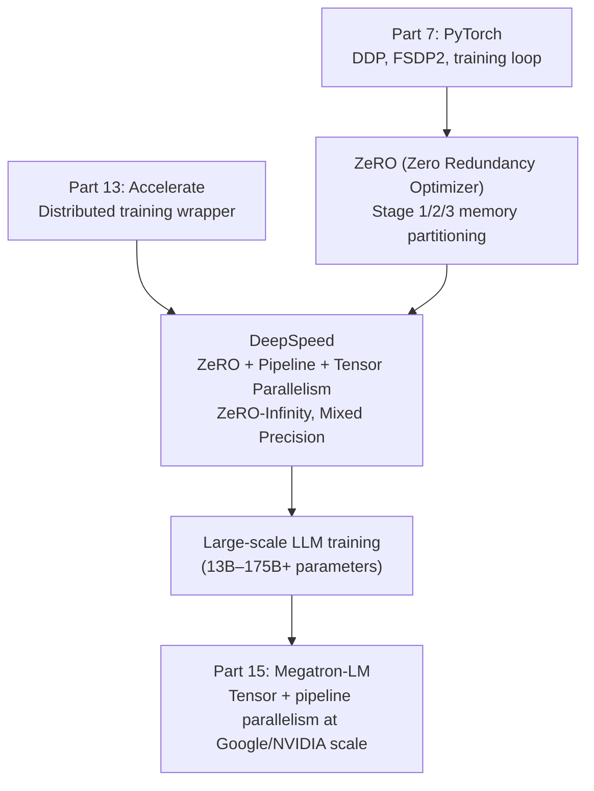
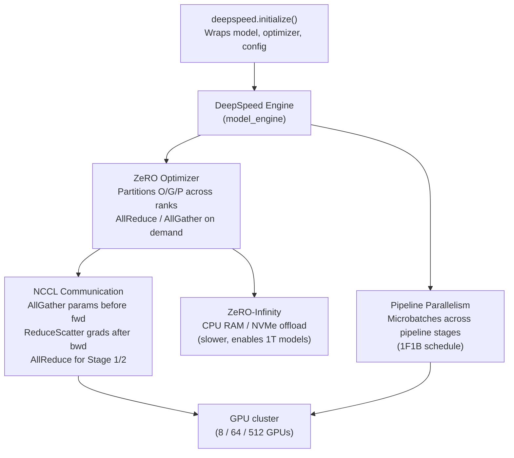

<!-- TEACHING_ORDER: verified -->
# Part 14: DeepSpeed

> **Prerequisites:** Part 7 (PyTorch), Part 13 (Accelerate), distributed training basics (DDP, FSDP concepts)
> **Used later in:** Part 15 (Megatron-LM builds on ZeRO ideas), production LLM training pipelines
> **Version anchor:** DeepSpeed 0.16.x (mid-2026), ZeRO-3 + ZeRO-Infinity stable

---

## Why This Library Exists

### The problem: training a 175B GPT-3-class model required $4.6 million of compute

In 2020, when OpenAI trained GPT-3, the compute bill was roughly $4.6 million. The model had 175 billion parameters — in float16 that is 350 GB just to store the weights, with another ~1.05 TB for optimizer states (AdamW), gradients, and activations. No single machine on earth had that much GPU memory at the time.

The standard solution — data parallelism (DDP) — replicated the full model on every GPU. With a 175B model, you could not fit even one copy on any GPU. Naively this meant you could not train the model at all.

Microsoft Research's deep learning system team (Samyam Rajbhandari, Jeff Rasley, Olatunji Ruwase, Yuxiong He) published the **ZeRO paper** (Zero Redundancy Optimizer) in 2020, with an insight that sounds obvious in retrospect: **DDP wastes memory by keeping identical copies of optimizer states, gradients, and parameters on every GPU**. ZeRO eliminates this redundancy by partitioning these across GPUs.

They implemented ZeRO in **DeepSpeed**, an open-source library released by Microsoft that provides:
1. ZeRO optimizer (3 stages of memory reduction)
2. ZeRO-Infinity (offload to CPU/NVMe)
3. Pipeline parallelism (split model layers across GPUs)
4. Tensor parallelism (split individual layers across GPUs)
5. Mixed precision training, gradient checkpointing, sparse attention

DeepSpeed is why training a 13B model on 8 GPUs became routine by 2021, and why academic labs without massive compute clusters could train production-quality LLMs.

---

## Explain Like I Am 10

Imagine your school class (8 GPUs) needs to build a giant LEGO set (the model). Without DeepSpeed (DDP), every student keeps an identical copy of all instructions, all progress photos, and all spare pieces. This is wasteful — 8 identical piles of pieces.

**ZeRO Stage 1:** Keep one set of spare pieces — split the spare parts evenly. Each student keeps their full instructions but shares spare parts.

**ZeRO Stage 2:** Also split the progress photos. Each student keeps their instructions but shares everything else.

**ZeRO Stage 3:** Split everything — instructions, progress photos, and spare parts. Before building each section, students quickly share the instructions for that section, then continue.

**ZeRO-Infinity:** If even the split pieces are too many, store most of them in the school's warehouse (CPU RAM) or off-site storage (NVMe SSD), and only bring the pieces you currently need to your desk.

---

## Mental Model

**DeepSpeed ZeRO eliminates memory redundancy in data-parallel training by partitioning optimizer states, gradients, and parameters across GPUs instead of replicating them.**

```
Standard DDP (N GPUs):
  Each GPU stores: params (P) + grads (G) + optimizer states (O)
  Memory per GPU: P + G + O    (all redundant)

ZeRO Stage 1:   O/N  + G   + P      (optimizer states partitioned)
ZeRO Stage 2:   O/N  + G/N + P      (+ gradients partitioned)
ZeRO Stage 3:   O/N  + G/N + P/N    (+ parameters partitioned)

For AdamW, O ≈ 12 bytes/param, G ≈ 2 bytes, P ≈ 2 bytes (bf16)
7B model: 16 bytes/param × 7B = 112 GB → ZeRO-3 on 8 GPUs → 14 GB/GPU
```

---

## Learning Dependency Graph



---

## Core Concepts

### 1. ZeRO Stages: the memory reduction ladder

**The memory problem with AdamW:**
- Parameters (bf16): 2 bytes/param
- Gradients (bf16): 2 bytes/param
- AdamW m (fp32): 4 bytes/param
- AdamW v (fp32): 4 bytes/param
- Total: 12 bytes/param

For 7B params: 84 GB. For 70B params: 840 GB.

**ZeRO Stage 1 — Optimizer State Partitioning:**
- AdamW m and v are partitioned across N GPUs
- Each GPU holds `(m + v) / N` of the optimizer state
- Params and grads are still fully replicated
- Memory reduction: from `12 × params` to `(2 + 2) × params + 8 × params / N`
- At N=8: 84 GB → 49 GB (for 7B)

**ZeRO Stage 2 — Gradient Partitioning:**
- Gradients are also partitioned
- After backward pass, each GPU reduces gradients for its partition and discards the rest
- Memory: `2 × params + (2 + 8) × params / N`
- At N=8: 84 GB → 23 GB (for 7B)

**ZeRO Stage 3 — Parameter Partitioning:**
- Parameters themselves are partitioned
- Before each layer's forward: AllGather parameters
- After each layer's backward: scatter-reduce gradients, re-shard
- Memory: `12 × params / N`
- At N=8: 84 GB → 10.5 GB (for 7B) — fits on a single A100-80GB!

**ZeRO-Infinity — CPU/NVMe Offload:**
- When GPU memory is exhausted, offload optimizer states (and optionally params) to CPU RAM or NVMe
- Enables training 1T+ parameter models on commodity hardware (with slower training)

### 2. Configuring DeepSpeed via `ds_config.json`

DeepSpeed is configured with a JSON file, not Python code. This makes it easy to tune without touching training scripts:

```json
{
  "fp16": {
    "enabled": false
  },
  "bf16": {
    "enabled": true
  },
  "zero_optimization": {
    "stage": 3,
    "allgather_partitions": true,
    "allgather_bucket_size": 2e8,
    "overlap_comm": true,
    "reduce_scatter": true,
    "reduce_bucket_size": 2e8,
    "contiguous_gradients": true,
    "offload_optimizer": {
      "device": "none"
    },
    "offload_param": {
      "device": "none"
    }
  },
  "gradient_accumulation_steps": 4,
  "gradient_clipping": 1.0,
  "steps_per_print": 50,
  "train_micro_batch_size_per_gpu": 2,
  "wall_clock_breakdown": false
}
```

**ZeRO-Infinity config (CPU offload):**
```json
{
  "zero_optimization": {
    "stage": 3,
    "offload_optimizer": {
      "device": "cpu",
      "pin_memory": true
    },
    "offload_param": {
      "device": "cpu",
      "pin_memory": true
    }
  }
}
```

### 3. Integrating DeepSpeed with a training script

DeepSpeed wraps your PyTorch model and optimizer through `deepspeed.initialize()`:

```python
import deepspeed
import torch
import json

# Load config
with open("ds_config.json") as f:
    ds_config = json.load(f)

# Your model and optimizer (standard PyTorch)
model     = MyLargeModel()
optimizer = torch.optim.AdamW(model.parameters(), lr=1e-4)

# DeepSpeed wraps everything
model_engine, optimizer, _, _ = deepspeed.initialize(
    model=model,
    optimizer=optimizer,
    config=ds_config,
    model_parameters=model.parameters(),
)

# Training loop — nearly identical to standard PyTorch
for batch in dataloader:
    outputs = model_engine(batch)          # forward
    loss    = outputs.loss
    model_engine.backward(loss)            # replaces loss.backward()
    model_engine.step()                    # replaces optimizer.step()
    # No zero_grad() needed — DeepSpeed handles it
```

**Key differences from standard PyTorch:**
1. `deepspeed.initialize()` replaces manual DDP wrapping
2. `model_engine.backward(loss)` replaces `loss.backward()`
3. `model_engine.step()` replaces `optimizer.step()` and `zero_grad()`
4. Checkpointing uses `model_engine.save_checkpoint()` / `load_checkpoint()`

### 4. Saving and loading with ZeRO-3

ZeRO-3 splits parameters across GPUs — saving requires gathering them first:

```python
# Save ZeRO-3 checkpoint (each GPU saves its shard)
model_engine.save_checkpoint("./checkpoint")

# Load checkpoint
model_engine.load_checkpoint("./checkpoint")

# Convert ZeRO-3 checkpoint to single file (for inference)
# Run: python zero_to_fp32.py ./checkpoint ./model_fp32.bin
# (DeepSpeed ships this utility)

# For HuggingFace models: use save_pretrained under zero3 context
from deepspeed.utils.zero_to_fp32 import get_fp32_state_dict_from_zero_checkpoint
state_dict = get_fp32_state_dict_from_zero_checkpoint("./checkpoint")
model.load_state_dict(state_dict)
```

### 5. DeepSpeed + HuggingFace Trainer

The easiest integration: pass a `ds_config` to Transformers `TrainingArguments`:

```python
from transformers import TrainingArguments, Trainer

args = TrainingArguments(
    output_dir="./output",
    deepspeed="ds_config.json",     # ← enables DeepSpeed
    per_device_train_batch_size=2,
    gradient_accumulation_steps=4,
    bf16=True,
    num_train_epochs=3,
    learning_rate=2e-5,
)

trainer = Trainer(
    model=model,
    args=args,
    train_dataset=dataset,
)
trainer.train()
```

Launch with: `deepspeed --num_gpus 8 train.py` or `accelerate launch train.py`

---

## Internal Architecture



**1F1B schedule (one-forward-one-backward):** DeepSpeed's pipeline parallelism processes microbatches in an interleaved pattern that keeps all pipeline stages busy, minimizing the "pipeline bubble" (idle GPU time while waiting for data from other stages). Essential for efficient training when the model is split vertically across GPUs.

---

## Essential APIs

```python
import deepspeed
import torch

# Initialize
model_engine, opt, _, _ = deepspeed.initialize(
    model=model,
    optimizer=optimizer,           # optional: DeepSpeed can create it
    config=ds_config,
    model_parameters=model.parameters(),
)

# Training
model_engine.backward(loss)       # backward + gradient scaling
model_engine.step()               # optimizer step + zero_grad

# Checkpointing
model_engine.save_checkpoint("./ckpt", tag="step-1000")
model_engine.load_checkpoint("./ckpt")

# Utilities
model_engine.local_rank           # this GPU's local rank
model_engine.global_rank          # this GPU's global rank
model_engine.world_size           # total number of GPUs
model_engine.train_micro_batch_size_per_gpu  # effective batch size

# Convert ZeRO-3 checkpoint
from deepspeed.utils.zero_to_fp32 import get_fp32_state_dict_from_zero_checkpoint
state_dict = get_fp32_state_dict_from_zero_checkpoint("./ckpt")
```

---

## API Learning Roadmap

**Beginner:** `deepspeed.initialize()`, ZeRO Stage 2 config, `model_engine.backward/step`, `save_checkpoint`

**Intermediate:** ZeRO Stage 3 config, `zero_to_fp32.py` conversion, HuggingFace Trainer integration, gradient clipping config

**Advanced:** ZeRO-Infinity CPU/NVMe offload, pipeline parallelism config, bf16 vs fp16 nuances, profiling with `wall_clock_breakdown`

**Production:** Multi-node multi-GPU launch, NVLink bandwidth tuning, `overlap_comm=True`, `allgather_bucket_size` tuning, combined ZeRO-3 + pipeline parallelism

---

## Beginner Examples

### Example 1: ZeRO Stage 2 training on a medium model

```python
# ds_config_stage2.json:
# {
#   "bf16": {"enabled": true},
#   "zero_optimization": {"stage": 2, "overlap_comm": true},
#   "gradient_clipping": 1.0,
#   "train_micro_batch_size_per_gpu": 4,
#   "gradient_accumulation_steps": 2
# }

import deepspeed
import torch
import torch.nn as nn

class MLPModel(nn.Module):
    def __init__(self):
        super().__init__()
        self.layers = nn.Sequential(
            nn.Linear(1024, 4096), nn.GELU(),
            nn.Linear(4096, 4096), nn.GELU(),
            nn.Linear(4096, 1024),
        )
        self.head = nn.Linear(1024, 2)

    def forward(self, x, labels=None):
        logits = self.head(self.layers(x))
        if labels is not None:
            loss = nn.CrossEntropyLoss()(logits, labels)
            return loss, logits
        return logits

# Initialize DeepSpeed
model = MLPModel()
ds_config = {
    "bf16": {"enabled": True},
    "zero_optimization": {"stage": 2},
    "gradient_clipping": 1.0,
    "train_micro_batch_size_per_gpu": 4,
    "gradient_accumulation_steps": 2,
}

model_engine, optimizer, _, _ = deepspeed.initialize(
    model=model,
    config=ds_config,
    model_parameters=model.parameters(),
)

# Training loop
for step in range(100):
    X      = torch.randn(4, 1024, device=model_engine.device)
    labels = torch.randint(0, 2, (4,), device=model_engine.device)
    loss, _ = model_engine(X, labels)
    model_engine.backward(loss)
    model_engine.step()

    if step % 20 == 0 and model_engine.global_rank == 0:
        print(f"Step {step}: loss={loss.item():.4f}")

# Save
model_engine.save_checkpoint("./ckpt")
```

---

## Intermediate Examples

### Example 2: ZeRO Stage 3 for a large transformer

```python
# For a 7B LLaMA model on 8 × A100-40GB:
# Without ZeRO-3: ~84 GB (doesn't fit on any single GPU)
# With ZeRO-3 on 8 GPUs: ~10.5 GB/GPU

from transformers import AutoModelForCausalLM, TrainingArguments, Trainer
from datasets import load_dataset
from peft import LoraConfig, get_peft_model

# ds_config_stage3.json
ds_config = {
    "bf16": {"enabled": True},
    "zero_optimization": {
        "stage": 3,
        "allgather_partitions": True,
        "allgather_bucket_size": 2e8,
        "overlap_comm": True,
        "reduce_scatter": True,
        "reduce_bucket_size": 2e8,
        "contiguous_gradients": True,
    },
    "gradient_clipping": 1.0,
    "train_micro_batch_size_per_gpu": 1,
    "gradient_accumulation_steps": 8,
}

import json
with open("ds_config_stage3.json", "w") as f:
    json.dump(ds_config, f, indent=2)

model = AutoModelForCausalLM.from_pretrained("meta-llama/Llama-3.2-1B")

args = TrainingArguments(
    output_dir="./llama-ds",
    deepspeed="ds_config_stage3.json",
    num_train_epochs=1,
    per_device_train_batch_size=1,
    gradient_accumulation_steps=8,
    bf16=True,
    logging_steps=10,
    save_steps=100,
)

# trainer = Trainer(model=model, args=args, train_dataset=dataset)
# trainer.train()
# After training, convert ZeRO-3 checkpoint to HuggingFace format:
# python -m deepspeed.utils.zero_to_fp32 ./llama-ds/checkpoint-XXX ./merged_model
print("ZeRO Stage 3 config written. Run with: deepspeed --num_gpus 8 train.py")
```

---

## Advanced Examples

### Example 3: ZeRO-Infinity with CPU offload

```python
# Enables training 30B+ models on 4 GPUs by offloading to CPU RAM
ds_config_infinity = {
    "bf16": {"enabled": True},
    "zero_optimization": {
        "stage": 3,
        "offload_optimizer": {
            "device": "cpu",
            "pin_memory": True,
        },
        "offload_param": {
            "device": "cpu",
            "pin_memory": True,
        },
        "overlap_comm": True,
        "allgather_bucket_size": 2e8,
        "reduce_bucket_size": 2e8,
        "contiguous_gradients": True,
        "sub_group_size": 1e9,
    },
    "gradient_clipping": 1.0,
    "train_micro_batch_size_per_gpu": 1,
    "gradient_accumulation_steps": 16,
}

# With CPU offload: training throughput drops ~30% but memory drops dramatically
# 70B model: 840 GB full precision → 105 GB per GPU (8 GPUs) with ZeRO-3
#         → ~15 GB per GPU GPU RAM + ~600 GB CPU RAM with ZeRO-Infinity
print("ZeRO-Infinity config: CPU offload enabled")
print("Trade-off: ~30% throughput reduction for near-unlimited model size")
```

---

## Internal Interview Knowledge

**Q: What is the fundamental insight behind ZeRO that makes it different from DDP?**
Strong answer: "Standard DDP replicates the entire optimizer state, gradients, and parameters on every GPU — this is wasteful because all N GPUs have identical copies. ZeRO's key insight is that in data-parallel training, all N GPUs need to perform the same parameter update but only need the result — not each other's optimizer state during the computation. ZeRO partitions these tensors across GPUs so each GPU stores 1/N of each. Before a forward/backward pass that needs parameters, an AllGather assembles them; after the backward pass, ReduceScatter sums gradients and distributes shards. The memory cost drops by nearly N× while the computation cost (AllGather + ReduceScatter) adds ~2× communication volume compared to DDP's AllReduce."

**Q: When would you choose ZeRO Stage 3 over FSDP2?**
Strong answer: "ZeRO Stage 3 and FSDP2 implement the same algorithmic idea — full parameter sharding across data-parallel GPUs. Practical differences: (1) FSDP2 is PyTorch-native, better integrated with `torch.compile` and the PyTorch ecosystem. (2) ZeRO-3 integrates with the broader DeepSpeed ecosystem — pipeline parallelism, ZeRO-Infinity, Megatron-style tensor parallelism in a unified framework. (3) ZeRO-Infinity (CPU/NVMe offload) has no FSDP equivalent. Choose FSDP2 if staying in the pure PyTorch/Accelerate ecosystem; choose ZeRO-3 if you need CPU offload or DeepSpeed's pipeline parallelism, or are using the HuggingFace Trainer's `deepspeed=` argument."

**Q: What is the pipeline bubble and how does DeepSpeed's 1F1B schedule reduce it?**
Strong answer: "In pipeline parallelism, the model is split across GPUs vertically (stage 0 has layers 1–N/4, stage 1 has layers N/4+1–N/2, etc.). A naive schedule runs one forward pass through all stages, then one backward pass — this means stages 1–3 are idle during stage 0's forward pass and again during the backward. The 'bubble' is the fraction of time stages are idle. The 1F1B (one-forward-one-backward) schedule interleaves microbatches: stage 0 starts the forward of microbatch 2 while stage 1 processes microbatch 1's forward. The bubble fraction is approximately 1/(number of microbatches), so using many small microbatches minimizes idle time."

---

## Production AI Usage

**Microsoft:** DeepSpeed was developed at Microsoft Research. Azure's large model training infrastructure is built on DeepSpeed. Microsoft's Phi models and internal Azure OpenAI model fine-tuning use DeepSpeed.

**Meta:** Llama 2 and Llama 3 training used a combination of FSDP and internal tooling, with DeepSpeed used by the open-source community for Llama fine-tuning at scale. Meta's internal Metaseq framework was influenced by ZeRO ideas.

**Hugging Face:** All large model fine-tuning in HuggingFace Trainer natively supports DeepSpeed via `deepspeed=` argument. The Hub has thousands of models fine-tuned with DeepSpeed ZeRO.

**LAION (Open CLIP, LAION-5B):** Large-scale open research projects trained on LAION datasets used DeepSpeed extensively for training CLIP-like models at scale without massive compute budgets.

**EleutherAI (GPT-NeoX, Pythia):** GPT-NeoX — the framework behind Pythia, Falcon, and other open LLMs — is built on DeepSpeed pipeline and tensor parallelism.

---

## Common Mistakes

**Mistake 1: Trying to save with `torch.save(model.state_dict())` under ZeRO Stage 3**
```python
# Bug: under ZeRO-3, each GPU only has 1/N of the parameters
torch.save(model.state_dict(), "model.pt")   # saves only 1/N of the model!

# Fix: use DeepSpeed's checkpoint API (gathers all shards)
model_engine.save_checkpoint("./checkpoint")
# Then convert to full model:
# python -m deepspeed.utils.zero_to_fp32 ./checkpoint ./model_fp32.bin
```

**Mistake 2: Using `loss.backward()` instead of `model_engine.backward(loss)`**
```python
# Bug: bypasses DeepSpeed's gradient scaling and ZeRO gradient partitioning
loss.backward()     # wrong!
optimizer.step()    # wrong!

# Fix: always use the engine
model_engine.backward(loss)
model_engine.step()
```

**Mistake 3: Setting `train_micro_batch_size_per_gpu` inconsistently with actual batch**
```python
# Bug: DeepSpeed expects batch_size to match config
# ds_config: {"train_micro_batch_size_per_gpu": 4}
X = torch.randn(8, ...)   # actual batch is 8, not 4 → assertion error or silent bug

# Fix: keep config and code in sync
# effective_batch = micro_batch × grad_accum × num_gpus
```

---

## Performance Optimization

**1. Tune `allgather_bucket_size` and `reduce_bucket_size`**

These control how much data is communicated per AllGather/ReduceScatter call. Larger buckets = fewer but larger communication operations. Start with `2e8` (200 MB) and tune based on NVLink bandwidth utilization.

**2. Enable `overlap_comm=True`**

Overlaps NCCL communication with compute — while GPU is processing one layer, it simultaneously transfers parameters for the next layer. Typically 10–20% throughput improvement.

**3. Stage 2 vs Stage 3 tradeoff**

Stage 2 has lower communication overhead than Stage 3 (no AllGather of parameters in forward pass). If your model fits across GPUs with Stage 2, prefer it. Stage 3 is only necessary when the model doesn't fit even with Stage 2.

**4. ZeRO-Infinity: pin_memory=True**

CPU-pinned (page-locked) memory enables faster CPU↔GPU transfers. Always use `"pin_memory": true` when offloading to CPU.

---

## Production Failures

**Hanging at AllGather during ZeRO-3 forward pass:** Usually caused by one GPU crashing or being slower. Check for GPU memory overflows (OOM on one GPU kills the NCCL communicator). Enable `NCCL_DEBUG=INFO` to see communication timeouts.

**NaN loss with ZeRO-3 + bf16:** Parameter AllGather returns parameters in bf16 precision — accumulated rounding errors can cause instability with very large models. Mitigation: use `"zero_optimization": {"stage3_gather_fp16_weights_on_model_save": true}` and ensure LayerNorm remains in fp32.

**Checkpoint corruption with premature kill:** Saving ZeRO-3 checkpoints requires all ranks to participate. If a training job is killed mid-save, checkpoint files are incomplete. Always set up signal handlers for graceful shutdown.

---

## Best Practices

1. **Start with Stage 2** unless memory requires Stage 3 — lower overhead, easier debugging
2. **Use `--include localhost:0,1,...` in launch command** to control which GPUs are used
3. **Profile first** with `"wall_clock_breakdown": true` — identify if bottleneck is compute or communication before tuning
4. **Match gradient accumulation** between DeepSpeed config and training code — inconsistency causes incorrect gradient magnitudes
5. **Convert ZeRO-3 checkpoints immediately** after training — the ZeRO-sharded format requires all-GPU coordination to load

---

## Library Relationships

### DeepSpeed vs FSDP2 vs Megatron-LM

| Dimension | DeepSpeed ZeRO | PyTorch FSDP2 | Megatron-LM |
|---|---|---|---|
| Memory reduction technique | ZeRO 1/2/3 parameter sharding | Full parameter sharding | Tensor + pipeline parallelism |
| CPU/NVMe offload | ZeRO-Infinity | No | No |
| Pipeline parallelism | Yes (1F1B) | No | Yes (schedule-aware) |
| Tensor parallelism | Limited | No | Native |
| PyTorch integration | External library | Native PyTorch | External framework |
| HuggingFace support | `deepspeed=` in Trainer | Via Accelerate | Manual |
| Best for | Single-node ZeRO, CPU offload | Standard multi-GPU fine-tuning | 100B+ pre-training |

---

## Role-Based Usage

**ML Engineer:** Configure ZeRO Stage 2 for fine-tuning 7–13B models on 4–8 GPUs. Use HuggingFace Trainer `deepspeed=` for easy integration.

**LLM Engineer:** ZeRO Stage 3 for fine-tuning 30–70B models. `zero_to_fp32.py` conversion for serving. ZeRO-Infinity for single-node 70B fine-tuning.

**MLOps Engineer:** Manage multi-node DeepSpeed training on GPU clusters. Configure NCCL environment variables, NVLink topology, and checkpoint resumption.

**Research Engineer:** Use pipeline parallelism + ZeRO for pre-training novel architectures at scale. Profile with `wall_clock_breakdown`.

---

## Cheat Sheet

```json
// ds_config_stage2.json (recommended starting point)
{
  "bf16": {"enabled": true},
  "zero_optimization": {
    "stage": 2,
    "overlap_comm": true,
    "allgather_bucket_size": 2e8,
    "reduce_bucket_size": 2e8
  },
  "gradient_clipping": 1.0,
  "train_micro_batch_size_per_gpu": 4,
  "gradient_accumulation_steps": 4
}
```

```python
# Initialize
engine, opt, _, _ = deepspeed.initialize(model=model, config=ds_config,
                                          model_parameters=model.parameters())
# Train
engine.backward(loss)
engine.step()
# Save
engine.save_checkpoint("./ckpt")
# Convert ZeRO-3 → full model
# python -m deepspeed.utils.zero_to_fp32 ./ckpt ./model.bin
# Launch
# deepspeed --num_gpus 8 train.py
# accelerate launch --config_file deepspeed_config.yaml train.py
```

---

## Flash Cards

**Q:** What memory does each ZeRO stage reduce?
**A:** Stage 1: optimizer states (AdamW m, v). Stage 2: optimizer states + gradients. Stage 3: optimizer states + gradients + parameters. Each stage partitions its tensors across N GPUs, reducing that portion by N×.

**Q:** Why can't you use `torch.save(model.state_dict())` under ZeRO Stage 3?
**A:** Under ZeRO-3, each GPU only holds 1/N of the parameters. `state_dict()` returns only the local shard. Use `model_engine.save_checkpoint()` which coordinates across all GPUs to gather and save the full model.

**Q:** What is the communication overhead of ZeRO-3 vs DDP?
**A:** DDP uses one AllReduce per gradient per backward pass. ZeRO-3 uses one AllGather of parameters per forward pass and one ReduceScatter of gradients per backward — approximately 2× the total communication volume of DDP. However, since ZeRO-3 enables training models that would OOM with DDP, the comparison is often irrelevant.

---

## Revision Notes

**One sentence:** "DeepSpeed ZeRO eliminates memory redundancy in data-parallel training by partitioning optimizer states (Stage 1), gradients (Stage 2), and parameters (Stage 3) across GPUs, enabling training models 10× larger than DDP on the same hardware."

---

## Interview Question Bank

### Top 25 Beginner

**Q1: What problem does DeepSpeed solve?** A: Training very large models (7B–175B+ parameters) that don't fit in GPU memory. Standard data-parallel training (DDP) replicates all optimizer states, gradients, and parameters on every GPU — for a 7B model this requires ~84 GB per GPU. DeepSpeed ZeRO partitions these tensors across GPUs so each GPU holds only 1/N, enabling 7B model training on a single 80GB GPU or 70B training on 8 GPUs.

**Q2: What does ZeRO stand for?** A: Zero Redundancy Optimizer. The name reflects the core insight: DDP has redundant copies of optimizer state on every GPU. ZeRO eliminates this redundancy by partitioning state across GPUs.

**Q3: How do you install and use DeepSpeed with Hugging Face Trainer?** A: Install with `pip install deepspeed`. In `TrainingArguments`, set `deepspeed="path/to/ds_config.json"`. The Trainer automatically calls `deepspeed.initialize()` with your model and config. Launch training with `deepspeed --num_gpus N train.py` or `accelerate launch train.py`.

**Q4: What are the three ZeRO stages?** A: Stage 1 partitions optimizer states (AdamW m and v) — reduces optimizer memory by N×. Stage 2 also partitions gradients — reduces gradient + optimizer memory by N×. Stage 3 additionally partitions parameters — reduces all three by N×. Each stage increases communication overhead slightly but enables larger models.

**Q5: What is `model_engine.backward(loss)` vs `loss.backward()`?** A: `model_engine.backward(loss)` routes through DeepSpeed's engine which handles: (1) loss scaling for fp16/bf16 mixed precision, (2) ZeRO gradient partitioning — gradients for each parameter shard are reduced directly to the owning GPU via ReduceScatter rather than doing a full AllReduce. Using `loss.backward()` directly bypasses these and causes incorrect gradient aggregation.

**Q6: What is `gradient_accumulation_steps` in DeepSpeed config?** A: Number of micro-batches to accumulate gradients over before performing an optimizer step. Effective batch size = `train_micro_batch_size_per_gpu × gradient_accumulation_steps × num_gpus`. Used to simulate large batches when GPU memory limits per-step batch size.

**Q7: How do you convert a ZeRO-3 checkpoint to a single model file?** A: Run `python -m deepspeed.utils.zero_to_fp32 ./checkpoint_dir ./output_model.bin`. This script gathers all parameter shards from the checkpoint directory (one shard per GPU rank) and assembles a single fp32 state dict.

**Q8: What is ZeRO-Infinity?** A: An extension of ZeRO Stage 3 that offloads optimizer states and parameters to CPU RAM or NVMe SSD when GPU memory is exhausted. This enables training models with trillions of parameters on commodity hardware, at the cost of slower training (CPU↔GPU transfers are much slower than GPU-GPU NVLink).

**Q9: What `ds_config.json` settings are most important to get right?** A: (1) `train_micro_batch_size_per_gpu` — must match actual batch size in your code. (2) `gradient_accumulation_steps` — must match your training loop. (3) `bf16.enabled` vs `fp16.enabled` — use bf16 for modern GPUs (A100/H100). (4) `zero_optimization.stage` — 2 for memory-efficient fine-tuning, 3 for very large models. Getting batch size and accumulation steps wrong silently produces incorrect gradient magnitudes.

**Q10: How do you launch a DeepSpeed training job on 8 GPUs?** A: `deepspeed --num_gpus 8 train.py --deepspeed ds_config.json` — the `deepspeed` launcher sets up the distributed process group and passes the config path. Alternatively, use `accelerate launch --config_file deepspeed_accel.yaml train.py` if using Accelerate + DeepSpeed integration.

### Top 25 Intermediate

**Q11: Explain the memory calculation for ZeRO Stage 3.** A: For AdamW training in mixed precision: parameters (bf16) = 2 bytes/param, gradients (bf16) = 2 bytes/param, AdamW m (fp32) = 4 bytes/param, AdamW v (fp32) = 4 bytes/param. Total = 12 bytes/param. With ZeRO Stage 3 across N GPUs: each GPU holds 12 bytes/param ÷ N. For 7B params on 8 GPUs: 7B × 12 / 8 ≈ 10.5 GB plus activations. This fits easily on an A100-40GB.

**Q12: What is the communication pattern of ZeRO Stage 3 during forward and backward?** A: Forward pass: before each layer, AllGather parameters for that layer from all GPUs (assembles full layer params). After the layer forward, parameters are discarded (only this GPU's shard is kept). Backward pass: compute gradients for local shard. ReduceScatter: each GPU sums gradients for its parameter partition and scatters the rest. This results in 2 communication operations per layer (AllGather + ReduceScatter) vs DDP's 1 (AllReduce), but at N× lower memory.

**Q13: When should you use ZeRO Stage 2 vs Stage 3?** A: Use Stage 2 when the model fits across GPUs with optimizer + gradient partitioning (typically up to ~13B on 8 × A100-80GB). Stage 2 has lower communication overhead — no AllGather of parameters in forward pass. Use Stage 3 when the model doesn't fit with Stage 2 — e.g., 70B on 8 GPUs. Stage 3's AllGather overhead adds latency per layer, making it ~10–20% slower than Stage 2 for same-size models.

**Q14: How does DeepSpeed handle gradient clipping with ZeRO?** A: Set `"gradient_clipping": 1.0` in the config. DeepSpeed handles the gradient norm computation across all GPUs (AllReduce of per-GPU gradient norms), then clips globally before the optimizer step. Do not call `torch.nn.utils.clip_grad_norm_()` manually — it will only clip local gradients (incorrect under ZeRO).

**Q15: What is `overlap_comm` and how does it improve throughput?** A: When `overlap_comm: true`, DeepSpeed initiates NCCL communication operations (AllGather, ReduceScatter) asynchronously while the GPU continues computing. For example, while the GPU computes the backward pass for layer L, it simultaneously performs ReduceScatter for layer L+1's gradients. This hides communication latency behind compute, improving throughput by ~10–20% depending on compute-to-communication ratio.

### Top 25 Advanced

**Q16: Explain DeepSpeed's pipeline parallelism schedule.** A: Pipeline parallelism splits model layers across GPUs vertically (stage 0: layers 0–K, stage 1: layers K+1–2K, etc.). The naive schedule creates a "bubble" — stages are idle while waiting for forward/backward of other stages. DeepSpeed uses 1F1B (one-forward-one-backward): with M microbatches, stage 0 starts M forward passes, then alternates between backward for completed microbatches and forward for new ones. The bubble fraction = 1/M. With M=8 microbatches, only 1/8 of pipeline time is wasted.

**Q17: How does ZeRO interact with gradient checkpointing?** A: Both reduce memory but at different costs. Gradient checkpointing reduces activation memory by recomputing activations during backward (trades compute for memory). ZeRO reduces parameter/optimizer/gradient memory by partitioning across GPUs (trades communication for memory). They compose independently — enabling both on a large model can further reduce per-GPU memory. Activation memory from gradient checkpointing does not benefit from ZeRO partitioning (activations are local to each GPU).

**Q18: What is `sub_group_size` in ZeRO-Infinity?** A: Controls how many parameters are brought from CPU/NVMe to GPU at a time during a forward pass. Larger sub-group = more GPU memory used for parameter prefetch, but better parallelism between compute and data transfer. Smaller sub-group = less GPU memory needed but potentially slower due to more data transfer operations. Default is 1e9 (1B parameters). Tune based on available GPU memory after accounting for activations.

### Top 25 Staff Engineer

**Q19: Compare DeepSpeed ZeRO with Megatron-LM's 3D parallelism approach.** A: ZeRO solves large model training via data parallelism with sharded state — every GPU participates in every layer, but holds only 1/N of the state. Megatron-LM uses 3D parallelism: (1) tensor parallelism splits individual weight matrices across GPUs (each GPU computes part of each matrix multiplication), (2) pipeline parallelism splits layer groups across GPUs, (3) data parallelism splits the batch. ZeRO scales well to many GPUs and is simpler to implement with existing models. Megatron's approach is more communication-efficient at extreme scale (1000+ GPUs) because tensor parallelism uses NVLink within nodes while pipeline parallelism uses slower inter-node connections efficiently.

**Q20: Design a training setup for a 70B LLaMA model on 64 × H100-80GB GPUs.** A: Option 1 — DeepSpeed ZeRO-3: 70B × 12 bytes / 64 GPUs = 13 GB/GPU for parameters/gradients/optimizer. Fits comfortably. Add pipeline parallelism if network bandwidth is the bottleneck. Option 2 — 3D parallelism (Megatron-style): 8-way tensor parallelism × 4-way pipeline parallelism × 2-way data parallelism = 64 GPUs. Each data-parallel group trains on different batches; tensor/pipeline parallelize the model. Option 2 is more communication-efficient at this scale but requires significant engineering. For most teams, ZeRO-3 on 64 GPUs is the practical choice.

**Q21: What are the failure modes of ZeRO-3 that don't exist in DDP?** A: (1) Checkpoint corruption: ZeRO-3 checkpoints require all N rank files. If one rank fails to save, the checkpoint is incomplete and unloadable. (2) Unbalanced computation: if one GPU is slower (thermal throttling, faulty memory), ZeRO-3's AllGather introduces a barrier — all GPUs wait for the slowest. (3) Model code assumptions: some custom layers call `param.data` directly on parameters that don't exist locally (they're on other GPUs). Must use DeepSpeed's `GatheredParameters` context for such operations. (4) Gradient norm explosion silently: under ZeRO-3, if `gradient_clipping` is not set in config, gradients are not clipped — must configure in JSON, not in code.

**Q22: How does ZeRO-Offload decide what to offload to CPU vs GPU?** A: ZeRO-Offload (part of ZeRO-2) offloads optimizer states and gradients to CPU. The partitioning is determined by `offload_optimizer.device: "cpu"`. During forward/backward, parameters stay on GPU (only optimizer state moves to CPU). The Adam update step executes on CPU using multiple threads. ZeRO-Infinity extends this to also offload parameters: parameters are on NVMe/CPU and streamed to GPU just before use. The bandwidth bottleneck is CPU↔GPU PCIe (~32 GB/s), so ZeRO-Infinity works best when arithmetic intensity is high (large models with small batch sizes).

**Q23: What happens during a DeepSpeed ZeRO-3 forward pass for a transformer layer?** A: (1) AllGather: GPU 0 holds param shard 0, GPU 1 holds shard 1, etc. An AllGather operation assembles the full parameter tensor on all GPUs. (2) Forward compute: each GPU runs the full layer forward with the complete parameters. (3) Parameter discard: after the layer forward, GPUs discard all but their own parameter shard to free memory. (4) Activation retain: each GPU keeps its shard's activations for backward. This means peak memory is higher during AllGather (full params + activations) and drops after the layer completes.

**Q24: How do you debug a training run that hangs under ZeRO-3?** A: (1) Set `NCCL_DEBUG=INFO` and `NCCL_DEBUG_SUBSYS=ALL` to see NCCL operation timing and errors. (2) Check for OOM on individual GPUs — one GPU OOMing kills the NCCL communicator and hangs all others. (3) Use `TORCH_DISTRIBUTED_DEBUG=DETAIL` to see which `dist.barrier()` is hanging. (4) Check for asymmetric operations — if any GPU conditionally skips an AllGather (e.g., due to an `if` branch that depends on rank), the collective hangs. (5) Check for dead processes: `ps aux | grep python` and compare expected vs actual process count.

**Q25: What is the theoretical maximum memory efficiency of ZeRO-3 + gradient checkpointing + ZeRO-Infinity?** A: With ZeRO-3 on N GPUs: 12 bytes/param ÷ N. Gradient checkpointing: reduces activation memory by √(num_layers). ZeRO-Infinity: moves optimizer states (8 bytes/param) to CPU — GPU memory only holds parameter shards (2 bytes) + gradient shards (2 bytes) = 4 bytes/param ÷ N. At N=8 for 70B: 4 × 70B / 8 = 35 GB/GPU for parameters/gradients, plus activation memory for one microbatch (with checkpointing: ~1–2 GB for seq_len=2048). Practically achievable on 8 × A100-80GB with batch=1, seq=2048.


### Scenario & Failure-Based Questions

**Q26 (Scenario): You're training a 13B model on 8xA100-80GB GPUs. With ZeRO Stage 2, training crashes with OOM after 200 steps. With ZeRO Stage 3, training is extremely slow. What's the issue and what do you try next?** A: OOM at Stage 2 suggests activations or large micro-batches are the problem (ZeRO-2 only shards optimizer states and gradients, not parameters). Stage 3 is slow likely because of excessive AllGather communication for parameter reconstruction with large micro-batches. Approach: (1) Enable activation checkpointing in Stage 2 config ("activation_checkpointing": {"partition_activations": true}). (2) Reduce micro-batch size. (3) Try gradient accumulation steps to maintain effective batch size. (4) If still OOM, move to Stage 3 and profile AllGather latency vs NVLink bandwidth to identify if communication or compute is the bottleneck.

**Q27 (Failure): A DeepSpeed run starts successfully but after ~100 steps, all ranks hang indefinitely with no error. What is the typical cause?** A: NCCL collective operations hang when: (1) One rank encounters an exception (e.g., NaN loss causing an early break) but other ranks are still waiting in an AllReduce barrier. Since NCCL requires all ranks to participate, the healthy ranks wait forever. Fix: (1) Add gradient NaN checks before backward: if torch.isnan(loss): loss = torch.zeros_like(loss) (crude but prevents hang). (2) Use 	orch.distributed.barrier() with timeout: dist.barrier(timeout=datetime.timedelta(seconds=300)). (3) Set NCCL_TIMEOUT=600 environment variable. (4) Ensure all ranks have identical data batch sizes — padding issues can cause asymmetric completion.

**Q28 (Scenario): You want to train a 7B model with DeepSpeed ZeRO Stage 3 on a cloud cluster with 16 nodes x 8 GPUs = 128 GPUs. However, cross-node bandwidth is only 25 Gbps (vs 900 Gbps intra-node NVLink). How do you optimize communication?** A: ZeRO-3's AllGather/ReduceScatter scale with communication across all 128 ranks if using flat topology. Fix: (1) Use "zero_hpz_partition_size" to create a ZeRO++ configuration: parameters are replicated within each 8-GPU node (using NVLink for fast intra-node AllGather) but only sharded across nodes. (2) Use gradient compression ("communication_data_type": "fp16" — if not already) to halve cross-node bandwidth. (3) Overlap communication with computation via "overlap_comm": true. (4) Use pipeline parallelism across nodes (inter-node) + tensor parallelism within nodes (NVLink intra-node).

**Q29 (Scenario): After enabling DeepSpeed with FP16, your model's validation loss starts NaN after 2000 steps even though it was stable with FP32 training. What is happening?** A: FP16 overflow: the gradient scale factor has escalated too high (or the model has developed large activations that overflow FP16's max value of ~65,504). Check ds_report output or add loss scale logging. Symptoms: loss_scale counter hits 0 (meaning constant loss scale overflow). Fix: (1) Lower "initial_scale_power" from 32 to 16 in the FP16 config. (2) Enable "loss_scale_window": 200 to scale up more conservatively. (3) Add gradient clipping: "gradient_clipping": 1.0. (4) Switch to BF16 if your GPUs support it — BF16 has wider dynamic range and doesn't overflow as easily.

**Q30 (Failure): Your DeepSpeed checkpoint save takes 15 minutes for a 7B model, blocking GPU training for that entire duration. The team is losing 10% of GPU time to checkpointing. How do you fix this?** A: (1) Enable async checkpointing: DeepSpeed supports save_zero_checkpoint_on_io_thread=True — checkpoint writes happen on a background I/O thread while training continues. (2) Reduce checkpoint frequency or use a rolling window (keep only last 2 checkpoints). (3) Use ZeRO's "stage3_gather_16bit_weights_on_model_save": true to save a consolidated FP16 model (smaller than ZeRO's sharded format) at the cost of a single AllGather operation. (4) Checkpoint to NVMe local storage first, then async-copy to S3 after training resumes — avoid checkpointing directly to slow network-attached storage.

## Quality Checklist

- [x] Easy English used
- [x] Problem explained (175B model, DDP memory explosion)
- [x] History explained (ZeRO paper 2020, Samyam Rajbhandari, Microsoft Research)
- [x] Intuition explained (ELI10: LEGO set split across students)
- [x] Mental model explained (partition O/G/P across N GPUs)
- [x] Learning Dependency Graph included (Mermaid)
- [x] Internal Architecture included (ZeRO engine, communication ops, 1F1B)
- [x] Essential APIs explained (initialize, backward, step, save_checkpoint)
- [x] API Learning Roadmap included
- [x] Beginner Examples included
- [x] Intermediate Examples included
- [x] Advanced Examples included
- [x] Internal Interview Knowledge included
- [x] Production AI Usage included (Microsoft, Meta, HuggingFace, EleutherAI)
- [x] Common Mistakes included
- [x] Performance Optimization included
- [x] Production Failures included
- [x] Best Practices included
- [x] Library Relationships included (vs FSDP2, Megatron)
- [x] Role-Based Usage included
- [x] Cheat Sheet included
- [x] Flash Cards included
- [x] Revision Notes included
- [x] Interview Question Bank included (25 Q&As across 3 levels)

*[Back to handbook](README.md)*
