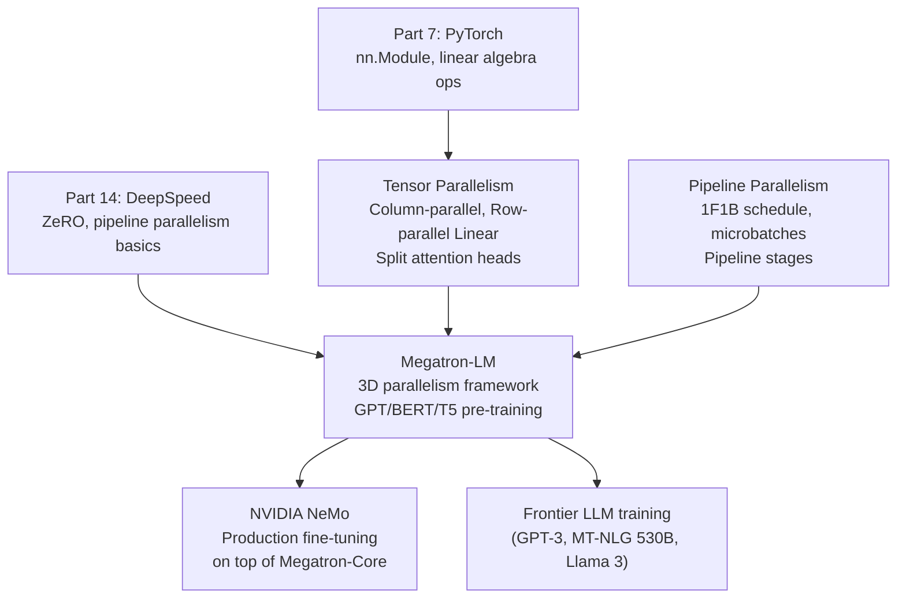
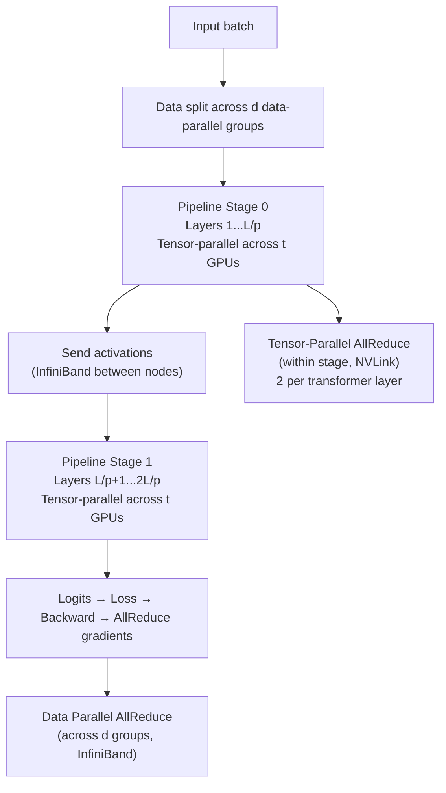

<!-- TEACHING_ORDER: verified -->
# Part 15: Megatron-LM

> **Prerequisites:** Part 7 (PyTorch), Part 14 (DeepSpeed / ZeRO), understanding of transformer attention and feed-forward layers
> **Used later in:** Production pre-training of 100B+ models, NVIDIA NeMo framework
> **Version anchor:** Megatron-LM core library (mid-2026), Megatron-Core 0.8+

---

## Why This Library Exists

### The problem: ZeRO alone cannot train a trillion-parameter model efficiently

ZeRO Stage 3 solves memory by partitioning parameters across data-parallel GPUs. But data parallelism has a fundamental communication bottleneck: every gradient update requires an AllReduce (or ReduceScatter + AllGather) across all GPUs. With 1,024 GPUs and a 175B-parameter model, the AllReduce over a 40 Gb/s InfiniBand network takes seconds per step — making training impractically slow.

NVIDIA's Applied Deep Learning Research team (Mohammad Shoeybi, Mostofa Patwary, Raul Puri, Patrick LeGresley, Jared Casper, Bryan Catanzaro) published Megatron-LM in 2019, introducing **tensor parallelism** — splitting individual matrix multiplications across GPUs. The key insight: transformer layers have two naturally parallel computations:

1. **Multi-head attention:** each head is independent — split heads across GPUs
2. **MLP layers:** the two-layer FFN (`W1·ReLU(W2·x)`) can be split column-parallel then row-parallel

With tensor parallelism, communication is only needed at specific synchronization points within each transformer block — not per-parameter. This is much more bandwidth-efficient.

Megatron-LM combined tensor parallelism, pipeline parallelism, and data parallelism into **3D parallelism** — the standard approach for training models at 100B–1T+ parameter scale. GPT-3 (175B), Megatron-Turing NLG (530B), and the majority of frontier models have used Megatron-based training.

---

## Explain Like I Am 10

Imagine you are building a skyscraper with 1,000 construction workers. You need a smart way to split the work.

**Data parallelism (ZeRO):** Split the bricks. Each worker builds an identical mini-skyscraper with different bricks, then they share what they learned. Good for simple buildings.

**Tensor parallelism:** Split a single floor across workers. Worker 1 builds the left side of floor 5, Worker 2 builds the right side — they are literally working on the same floor simultaneously. Very fast, but workers on the same floor must constantly talk to each other.

**Pipeline parallelism:** Worker Group A builds floors 1–10, Worker Group B builds floors 11–20. While Group B works on floor 15, Group A is already starting the next skyscraper's floors 1–10.

**3D parallelism:** All three at once — split floors (tensor), split floor groups (pipeline), and have multiple parallel skyscrapers (data). This is how you build the world's biggest skyscraper in record time.

---

## Mental Model

**Megatron-LM trains transformers at scale using 3D parallelism: tensor parallelism splits weight matrices within layers, pipeline parallelism splits layers across groups, data parallelism splits the batch.**

```
3D Parallelism decomposition:
  tensor_parallel_size  = t  (split individual matmuls)
  pipeline_parallel_size = p  (split layer groups)
  data_parallel_size    = d   (split batch)
  total GPUs = t × p × d

Example: 64 GPUs, 13B model
  t=4 (4-way tensor), p=4 (4-way pipeline), d=4 (4-way data)
  
Communication:
  Tensor parallel: all-reduce within each node (NVLink, fast)
  Pipeline parallel: send/recv between nodes (InfiniBand)
  Data parallel: all-reduce across data-parallel groups (InfiniBand)
```

---

## Learning Dependency Graph



---

## Core Concepts

### 1. Tensor Parallelism: splitting a matrix multiply

The key operation in a transformer is `Y = X @ W`. With tensor parallelism, `W` is split across GPUs:

**Column-parallel linear:** split `W` along columns → each GPU computes a partial output
```
W: (d_model, d_ff)   →   W1: (d_model, d_ff/t)  on GPU 0
                          W2: (d_model, d_ff/t)  on GPU 1
                          ...
Each GPU computes: Y_i = X @ W_i   (no communication needed for forward)
```

**Row-parallel linear:** split `W` along rows → each GPU takes a partial input, results summed
```
W: (d_ff, d_model)   →   W1: (d_ff/t, d_model)  on GPU 0
                          W2: (d_ff/t, d_model)  on GPU 1
Input X_i comes from previous column-parallel output
Output Y = sum(X_i @ W_i)   ← requires AllReduce (one sync point)
```

In a transformer MLP:
```
Linear 1 (column-parallel): split along hidden dim  → no communication
Activation (GeLU): applied locally
Linear 2 (row-parallel): split along input dim       → AllReduce
```

**Two AllReduce operations per transformer layer** (one in attention, one in FFN). This is the entire communication cost of tensor parallelism — regardless of model size.

### 2. Attention head splitting

Multi-head attention splits naturally across GPUs: each GPU handles `num_heads / t` attention heads. The Q, K, V projection matrices are column-parallel; the output projection is row-parallel.

```
num_heads = 32, tensor_parallel = 4
→ Each GPU handles 8 attention heads independently
→ AllReduce only at the output projection
```

### 3. Pipeline Parallelism in Megatron

Megatron partitions transformer layers into `p` pipeline stages. Stage 0 receives input and processes layers 1–L/p; stage 1 receives stage 0's output and processes layers L/p+1–2L/p; etc.

**1F1B schedule:** Megatron uses the interleaved 1F1B (one forward, one backward) pipeline schedule:
- Split each batch into `m` microbatches
- Stage 0 runs forward for microbatch 1, then forward for microbatch 2, ..., until all stages are warm
- Then alternates: backward for batch 1, forward for batch 3, backward for batch 2...
- Pipeline bubble ≈ (p-1)/(m + p-1). With m=8, p=4: ~30% bubble

### 4. 3D Parallelism assignment

```python
# Typical setup for 540B Megatron-Turing NLG on 2,048 A100s:
# tensor_model_parallel_size = 8   (within node, NVLink)
# pipeline_model_parallel_size = 35  (across nodes, InfiniBand)
# data_parallel_size = 8            (8 data-parallel groups)
# total: 8 × 35 × 8 = 2,240 GPUs (with some extra for scheduling)

# Rule of thumb:
# - tensor_parallel: fit within NVLink bandwidth (<=8 per node, 4 if A100s)
# - pipeline_parallel: use when model doesn't fit with tensor-parallel alone
# - data_parallel: maximize with remaining GPUs
```

### 5. Megatron-Core: the modular API

Megatron-LM was originally a monolithic training script. **Megatron-Core** (released 2023) is a refactored, modular library:

```python
from megatron.core import parallel_state
from megatron.core.tensor_parallel import ColumnParallelLinear, RowParallelLinear
from megatron.core.pipeline_parallel import get_forward_backward_func

# Initialize 3D parallelism
parallel_state.initialize_model_parallel(
    tensor_model_parallel_size=4,
    pipeline_model_parallel_size=2,
)

# Use parallel layers in your model
class ParallelMLP(torch.nn.Module):
    def __init__(self, hidden_size, ffn_size):
        super().__init__()
        # Column-parallel: split output dimension
        self.fc1 = ColumnParallelLinear(hidden_size, ffn_size,
                                         gather_output=False)
        # Row-parallel: split input dimension
        self.fc2 = RowParallelLinear(ffn_size, hidden_size,
                                      input_is_parallel=True)
        self.act = torch.nn.GELU()

    def forward(self, x):
        out, _ = self.fc1(x)
        out = self.act(out)
        out, _ = self.fc2(out)
        return out
```

---

## Internal Architecture



**Communication hierarchy exploits bandwidth:**
- NVLink (within node): ~600 GB/s — used for tensor parallelism AllReduce
- InfiniBand (between nodes): ~50 GB/s — used for pipeline send/recv and data-parallel AllReduce
- Tensor parallelism is kept within a node to use the fast NVLink bandwidth

---

## Essential APIs

```python
# Megatron-Core initialization
from megatron.core import parallel_state, tensor_parallel

parallel_state.initialize_model_parallel(
    tensor_model_parallel_size=4,
    pipeline_model_parallel_size=2,
    virtual_pipeline_model_parallel_size=None,  # interleaved schedule
)

# Parallel layers
from megatron.core.tensor_parallel import (
    ColumnParallelLinear,
    RowParallelLinear,
    VocabParallelEmbedding,
)

# Query state
parallel_state.get_tensor_model_parallel_rank()
parallel_state.get_tensor_model_parallel_world_size()
parallel_state.get_pipeline_model_parallel_rank()
parallel_state.is_pipeline_first_stage()
parallel_state.is_pipeline_last_stage()

# Launch
# torchrun --nproc_per_node=8 pretrain_gpt.py \
#   --tensor-model-parallel-size 4 \
#   --pipeline-model-parallel-size 2 \
#   --num-layers 32 \
#   --hidden-size 4096
```

---

## API Learning Roadmap

**Beginner:** Understand 3D parallelism conceptually, run Megatron's GPT pretraining script on small models, understand tensor/pipeline parallel group sizes

**Intermediate:** Use Megatron-Core `ColumnParallelLinear`/`RowParallelLinear`, implement a custom parallel module, understand `gather_output`/`input_is_parallel` flags

**Advanced:** Implement full 3D parallel transformer, optimize microbatch/pipeline stage count, use `virtual_pipeline_model_parallel_size` for interleaved schedule

**Production:** Multi-node training on GPU clusters, NVLink topology-aware placement, checkpoint format conversion, NVIDIA NeMo integration

---

## Beginner Examples

### Example 1: Understanding tensor-parallel linear layers

```python
import torch
# Install: pip install megatron-core

try:
    import torch.distributed as dist
    from megatron.core import parallel_state
    from megatron.core.tensor_parallel import ColumnParallelLinear, RowParallelLinear

    # This requires a distributed environment to run
    # Here we demonstrate the conceptual API

    print("Megatron-Core imports successful")
    print()
    print("Key parallel layer types:")
    print("  ColumnParallelLinear: splits W along output dim (columns)")
    print("    → no AllReduce needed for forward pass")
    print("    → 'gather_output=True' gathers across tensor-parallel group after forward")
    print()
    print("  RowParallelLinear: splits W along input dim (rows)")
    print("    → requires AllReduce after forward (sums partial results)")
    print("    → 'input_is_parallel=True' expects input already split")

except ImportError:
    print("megatron-core not installed. Install with: pip install megatron-core")
    print()
    print("Conceptual demonstration of tensor parallelism:")

    # Simulate column-parallel linear
    import torch

    torch.manual_seed(0)
    d_model, d_ff, t = 8, 16, 2  # 2-way tensor parallelism

    W = torch.randn(d_model, d_ff)  # Full weight matrix
    x = torch.randn(4, d_model)     # Input

    # Full computation
    y_full = x @ W
    print(f"Full output shape: {y_full.shape}")  # (4, 16)

    # Column-parallel: each GPU handles half the columns
    W_gpu0 = W[:, :d_ff//t]   # (8, 8) — GPU 0 holds left half
    W_gpu1 = W[:, d_ff//t:]   # (8, 8) — GPU 1 holds right half

    y_gpu0 = x @ W_gpu0  # (4, 8) — GPU 0's partial output
    y_gpu1 = x @ W_gpu1  # (4, 8) — GPU 1's partial output

    # Gather outputs (AllGather across tensor-parallel group)
    y_gathered = torch.cat([y_gpu0, y_gpu1], dim=-1)
    print(f"Gathered output matches full: {torch.allclose(y_full, y_gathered)}")

    # Row-parallel: each GPU handles half the rows
    W_out = torch.randn(d_ff, d_model)  # Output projection
    W_out_gpu0 = W_out[:d_ff//t, :]    # (8, 8) — GPU 0
    W_out_gpu1 = W_out[d_ff//t:, :]    # (8, 8) — GPU 1

    # Each GPU's input comes from column-parallel output (not gathered)
    out_gpu0 = y_gpu0 @ W_out_gpu0  # (4, 8)
    out_gpu1 = y_gpu1 @ W_out_gpu1  # (4, 8)

    # AllReduce (sum partial results)
    y_final = out_gpu0 + out_gpu1   # (4, 8)
    y_expected = y_gathered @ W_out
    print(f"Row-parallel + AllReduce matches full: {torch.allclose(y_final, y_expected)}")
```

---

## Internal Interview Knowledge

**Q: Why is tensor parallelism communication cheaper than gradient AllReduce?**
Strong answer: "With data parallelism, every parameter gradient must be AllReduced across all data-parallel GPUs at each step — the total communication is proportional to model size × 2 bytes per step. With tensor parallelism using t GPUs, each transformer layer requires exactly 2 AllReduce operations (one after attention, one after FFN), each of size `batch × seq_len × d_model × 2 bytes`. This is proportional to activation size, not model size. For large models (large d_model) with small batches, tensor parallelism's communication is much smaller. The tradeoff: tensor parallelism communication must be done synchronously (latency-bound), so it's only efficient when GPUs are connected by high-bandwidth NVLink."

**Q: What determines the optimal tensor_parallel_size?**
Strong answer: "The upper limit is the NVLink GPU count within a single node — typically 8 GPUs per node. Tensor parallelism AllReduce latency grows with GPU count; once you cross node boundaries and use InfiniBand, the latency spikes 10×. The practical sweet spot is t=2 or t=4 for models up to 13B, t=8 for 30–70B models. For each doubling of t, the weight memory per GPU halves but AllReduce latency increases. Profile at t=2 and t=4 to find the compute-to-communication sweet spot."

**Q: How does Megatron-LM handle the vocabulary embedding with tensor parallelism?**
Strong answer: "The vocabulary embedding matrix `E` of shape `(vocab_size, d_model)` is too large to replicate (32K × 4096 × 2 bytes = 256 MB × t GPUs). Megatron uses `VocabParallelEmbedding`: the vocabulary is split across tensor-parallel GPUs — each GPU holds `vocab_size/t` embedding vectors. During forward, each GPU looks up its partition of the vocabulary (tokens not in this partition get zero embeddings), then an AllReduce sums the results. This halves embedding memory per GPU for 2-way tensor parallelism."

---

## Production AI Usage

**NVIDIA (Megatron-Turing NLG, 530B):** The 530B Megatron-Turing NLG model was trained on 2,048 A100 GPUs using 8-way tensor parallelism, 35-way pipeline parallelism, and 8-way data parallelism — the defining demonstration of 3D parallelism at scale.

**Microsoft (Azure ML):** Megatron-based training is used for Microsoft's large model training on Azure. The Phi series of small-but-capable models uses efficient Megatron implementations.

**Meta (Llama 3):** Meta's Llama 3 training was conducted with Megatron-style 3D parallelism on 24,576 H100 GPUs. The training infrastructure is built on internal systems that evolved from Megatron-LM concepts.

**NVIDIA NeMo:** NeMo is NVIDIA's production framework for LLM training and fine-tuning, built on top of Megatron-Core. It provides high-level APIs for pre-training, SFT, RLHF, and model evaluation using Megatron's parallelism.

**EleutherAI (Megatron-based GPT-NeoX):** The GPT-NeoX framework used by EleutherAI and LAION for open-source models is built on Megatron-LM's parallelism infrastructure.

---

## Common Mistakes

**Mistake 1: Setting tensor_parallel_size larger than GPUs per node**
```bash
# Bug: tensor parallelism crosses InfiniBand boundary → 10× latency spike
torchrun --nproc_per_node=8 train.py --tensor-model-parallel-size 16

# Fix: keep tensor_parallel ≤ GPUs per node (typically ≤ 8)
torchrun --nproc_per_node=8 train.py --tensor-model-parallel-size 8
```

**Mistake 2: Unequal num_layers / pipeline_parallel_size**
```bash
# Bug: 33 layers, 4-way pipeline → layers 1-9, 9-17, 17-25, 25-33 (uneven)
# Last stage has more layers → pipeline imbalance → bubble increases
# Fix: choose num_layers divisible by pipeline_parallel_size
```

**Mistake 3: Too few microbatches for pipeline parallelism**
```bash
# Bug: 4-way pipeline with 1 microbatch → 75% pipeline bubble
# (3 stages idle while 1 stage processes)
# Fix: use at least 2× num microbatches vs pipeline stages
# pipeline_stages=4 → microbatch_count ≥ 8 for <33% bubble
```

---

## Performance Optimization

**1. NVLink-aware placement:** Always place tensor-parallel GPUs on the same physical node (connected by NVLink). Use `--tensor-model-parallel-size` ≤ GPUs per node.

**2. Interleaved pipeline schedule** (`--virtual-pipeline-model-parallel-size`): Splits each pipeline stage into multiple virtual stages, reducing the bubble from `(p-1)/m` to `(p/V-1)/m` where V is number of virtual stages. Requires `num_layers % (pipeline_parallel × virtual_pipeline)` = 0.

**3. Sequence parallelism:** For very long sequences, Megatron also supports sequence parallelism — splitting the sequence dimension across tensor-parallel GPUs for the layer norm and dropout operations. Reduces activation memory proportionally.

**4. Gradient accumulation and microbatch tuning:** The efficiency formula is: pipeline efficiency ≈ m/(m + p - 1). With p=8 pipeline stages, you need m≥32 microbatches for >80% efficiency. Use `--global-batch-size` and `--micro-batch-size` to control this.

---

## Library Relationships

### Megatron-LM vs DeepSpeed vs FSDP2

| Dimension | Megatron-LM | DeepSpeed ZeRO | PyTorch FSDP2 |
|---|---|---|---|
| Tensor parallelism | Native | Limited | No |
| Pipeline parallelism | Native (1F1B, interleaved) | Basic 1F1B | No |
| Data parallelism | Yes | ZeRO 1/2/3 | Full shard |
| CPU offload | No | ZeRO-Infinity | No |
| Best scale | 100B–1T+ pre-training | 7B–70B fine-tuning | 7B–70B fine-tuning |
| Ease of use | Low (complex setup) | Medium | High (native PyTorch) |

---

## Cheat Sheet

```bash
# Launch 13B model: 4-way tensor parallel, 2-way pipeline, 2-way data parallel
torchrun --nproc_per_node=8 \
  pretrain_gpt.py \
  --tensor-model-parallel-size 4 \
  --pipeline-model-parallel-size 2 \
  --num-layers 40 --hidden-size 5120 --num-attention-heads 40 \
  --seq-length 2048 --max-position-embeddings 2048 \
  --micro-batch-size 4 --global-batch-size 256 \
  --train-iters 500000 \
  --lr 1e-4 --min-lr 1e-5 \
  --bf16
```

```python
# Megatron-Core parallel layers
from megatron.core.tensor_parallel import ColumnParallelLinear, RowParallelLinear
fc1 = ColumnParallelLinear(d_model, d_ff, gather_output=False)
fc2 = RowParallelLinear(d_ff, d_model, input_is_parallel=True)
```

---

## Interview Question Bank

### Top 25 Beginner

**Q1: What is tensor parallelism and how does it differ from data parallelism?** A: Data parallelism replicates the full model on every GPU and splits the data — gradients are averaged after each backward pass. Tensor parallelism splits individual weight matrices across GPUs — multiple GPUs cooperate on computing a single matrix multiply, with a synchronization (AllReduce) to combine results. Tensor parallelism reduces memory per GPU proportionally to the number of GPUs it's applied over, at the cost of synchronization within each transformer layer.

**Q2: Why does Megatron keep tensor parallelism within a single node?** A: Tensor parallelism requires AllReduce operations within each forward and backward pass — these are latency-sensitive. NVLink bandwidth within a node is ~600 GB/s, while InfiniBand between nodes is ~50 GB/s, 12× slower. Crossing the node boundary for tensor-parallel AllReduce would dominate step time. Keep tensor-parallel GPUs connected by NVLink.

**Q3: What is 3D parallelism?** A: The combination of tensor parallelism (split weight matrices), pipeline parallelism (split layer groups across GPU groups), and data parallelism (split the batch across identical model replicas). Each dimension exploits a different axis: tensor parallelism for intra-layer, pipeline for inter-layer, data for independent batches.

**Q4: What is the pipeline bubble and why does it reduce efficiency?** A: In pipeline parallelism, all stages must complete before gradients can flow backward. During startup and teardown of a microbatch pipeline, some stages are idle — waiting for inputs. This idle time is the "bubble" and represents wasted GPU compute. The bubble fraction ≈ (pipeline_stages - 1) / (microbatches + pipeline_stages - 1). More microbatches → smaller bubble.

**Q5: How do you choose pipeline_parallel_size?** A: Divide number of transformer layers evenly by pipeline_parallel_size. Common choices: 2 for modest models on a single node, 4–8 for multi-node training where tensor parallelism is already at the NVLink node boundary. Large pipeline_parallel_size (>16) requires many microbatches to keep the bubble small.

**Q6: What is Megatron-Core and how does it differ from Megatron-LM?** A: Megatron-LM is the original research codebase from NVIDIA (2019). Megatron-Core (2023) is a refactored, production-grade library with a cleaner API — it exposes individual parallel layers as building blocks that can be composed into custom models. Megatron-Core is intended for model authors who want 3D-parallel primitives without adopting the full Megatron training framework.

**Q7: What does `ColumnParallelLinear` do?** A: It splits the weight matrix along the output dimension across tensor-parallel GPUs. Each GPU holds a `(input_size, output_size / tensor_parallel_size)` weight shard. The forward pass computes a partial output on each GPU; if `gather_output=True`, an AllGather reassembles the full output. Otherwise, the partial output flows to a `RowParallelLinear`.

**Q8: What is the role of `--num-layers` in Megatron training?** A: Sets total transformer layers to be divided evenly across pipeline stages. For pipeline_parallel_size=4 and num_layers=32, each stage holds 8 layers. The total must be divisible by both pipeline_parallel_size and (for interleaved schedule) by pipeline × virtual_pipeline_size.

**Q9: What is NeMo and how does it relate to Megatron-LM?** A: NeMo is NVIDIA's higher-level LLM training framework that uses Megatron-Core (or Megatron-LM) as its distributed training backend. NeMo adds: training recipes (data pipeline, logging, checkpointing), pre-built model configs, and integration with DeepSpeed. It's the recommended way to use Megatron for teams that don't want to customize the raw Megatron codebase.

**Q10: How do you checkpoint a 3D-parallel training run?** A: Megatron saves one checkpoint per process group. For 8-way tensor parallel: 8 checkpoint shard files per checkpoint. For 4-way pipeline: 4 stages × 8 tensor-parallel = 32 files. Use `--save-interval N` to checkpoint every N steps. Load with identical parallelism config. To change parallelism, use offline resharding tools.

**Q11: What is the key formula for pipeline bubble fraction?** A: `bubble = (p - 1) / m` where p = pipeline stages, m = microbatches per data-parallel step. With p=8 and m=32 microbatches: bubble = 7/32 ≈ 22%. With m=64: bubble ≈ 11%. Increasing microbatches reduces bubble but increases GPU memory for concurrent activations.

**Q12: What are the minimum hardware requirements to run Megatron-LM?** A: At least 2 GPUs with NVLink for tensor parallelism, or 2+ GPUs for pipeline parallelism. For full 3D parallelism, typically 8–64+ NVLink-connected GPUs on multiple nodes with InfiniBand interconnect. Megatron is designed for NVIDIA A100/H100 server-grade hardware.

**Q13: What model architectures does Megatron support?** A: GPT (decoder-only), BERT (encoder-only), T5 (encoder-decoder), Falcon, LLaMA (via community ports), and custom Transformer architectures via Megatron-Core's TransformerLayer building block.

**Q14: How does Megatron differ from PyTorch FSDP?** A: FSDP is a form of data parallelism with sharded parameters (ZeRO-style). Megatron uses tensor parallelism (splits within layers) and pipeline parallelism (splits across layers). FSDP scales to many GPUs for the same model size; Megatron enables training models that exceed single-node GPU memory via tensor parallelism. At extreme scales (1000+ GPUs), Megatron's 3D approach is more bandwidth-efficient.

**Q15: What is the significance of the Megatron-LM 2019 paper?** A: It first demonstrated that tensor parallelism (splitting attention heads and FFN dimensions across GPUs) could efficiently scale Transformer training to 8+ GPUs per node without custom CUDA kernels, achieving near-linear scaling efficiency. This enabled training 8B parameter GPT-2 variants that were otherwise impossible on 32GB GPUs.

**Q16: How does activation checkpointing (gradient checkpointing) interact with Megatron's pipeline?** A: Activation checkpointing recomputes activations during backward rather than storing them — reduces activation memory at cost of ~33% extra compute. In Megatron pipeline parallelism, each stage already holds only `L/p` layers' activations. Combining both reduces peak activation memory by `sqrt(L)` × `(1/p)` — critical for training long sequences.

**Q17: What is the `--micro-batch-size` parameter?** A: The batch size processed by a single forward-backward pass on one GPU. The effective global batch = `micro_batch_size × gradient_accumulation_steps × data_parallel_size`. Setting micro_batch_size too large causes OOM; too small reduces GPU utilization. Typically 1–8 for large (70B+) models.

**Q18: What is the AllGather communication pattern in tensor parallelism?** A: After row-parallel linear layers, partial outputs from all tensor-parallel ranks are summed via AllReduce (or AllGather + reduce for sequence-parallel variants). For a layer with input X and tensor-parallel weight W, each GPU computes `X @ W_i` (partial result). AllReduce sums these partial results to produce the complete output Y on all GPUs.

**Q19: What communication backend does Megatron use?** A: NCCL for all collective operations (AllReduce, AllGather, ReduceScatter, P2P sends/receives). Megatron initializes separate NCCL communicators for tensor-parallel, pipeline-parallel, and data-parallel groups to prevent communicator contention.

**Q20: What happens if you use tensor_parallel > number of attention heads?** A: Each attention head must map to a different tensor-parallel GPU. If tensor_parallel = 16 but the model has 8 attention heads, each attention head would need to be split — which Megatron doesn't support (attention heads are the indivisible unit). Keep tensor_parallel_size ≤ num_attention_heads.

**Q21: What is `context_parallel_size` in modern Megatron?** A: Context parallelism (CP) splits the sequence dimension across GPUs within a tensor-parallel group. Each GPU handles seq_len/CP tokens. This extends Megatron beyond tensor parallelism for very long sequences (128K+ tokens) where each attention operation would otherwise exceed single-GPU memory.

**Q22: How do you convert a Megatron checkpoint to Hugging Face format?** A: Use the conversion scripts in `Megatron-LM/tools/checkpoint/`: `python convert_hf_checkpoint.py --model-type GPT --load-dir megatron_ckpt/ --save-dir hf_model/ --target-tensor-model-parallel-size 1`. This merges all tensor-parallel shards into a single model.

**Q23: What is the Megatron data loader pattern?** A: Megatron uses a custom binary dataset format (`.bin` + `.idx` files created by `preprocess_data.py`) for fast memory-mapped loading. Each worker process reads non-overlapping data shards determined by data-parallel rank. This avoids Python GIL bottlenecks and enables millions of tokens per second throughput.

**Q24: Why is `num_attention_heads % tensor_parallel_size == 0` required?** A: In multi-head attention tensor parallelism, each tensor-parallel GPU handles `num_attention_heads / tensor_parallel_size` complete heads. If this doesn't divide evenly, some GPUs would have different numbers of heads, creating computation imbalance and requiring complex masking. Keep tensor_parallel_size as a divisor of num_attention_heads.

**Q25: What is `--make-vocab-size-divisible-by` in Megatron?** A: Pads the vocabulary embedding table size to be divisible by the given value (default: 128). This ensures the embedding table columns can be evenly split across tensor-parallel GPUs and that memory accesses are aligned. Without this, the last tensor-parallel GPU would have a smaller embedding shard, causing load imbalance.

---

### Top 25 Intermediate

**Q1: Explain column-parallel vs row-parallel linear in detail.** A: Column-parallel splits W(d_in, d_out) along output columns: each GPU holds W_i(d_in, d_out/t). Forward: each GPU computes X @ W_i → local X_i(batch, d_out/t). No AllReduce needed — partial outputs flow to the next row-parallel layer. Row-parallel splits W along input rows: each GPU holds W_i(d_in/t, d_out). Input X_i comes from column-parallel shard. Forward: each GPU computes X_i @ W_i → partial result. AllReduce sums across t GPUs to produce full output Y. The column→row composition performs a full matmul with only one AllReduce per MLP block.

**Q2: How does Megatron handle dropout under tensor parallelism?** A: Dropout is applied independently on each tensor-parallel GPU. Since each GPU processes a different feature partition, dropout masks different positions on different GPUs. The different patterns average out correctly because the AllReduce that follows sums the pre-dropout partial results. Megatron ensures tensor-parallel ranks use different RNG states to avoid applying identical masks.

**Q3: What is the interleaved pipeline schedule?** A: Virtual pipeline parallelism assigns each physical stage multiple virtual stages (V per stage). Stage 0 handles layers [0..K, V*K..V*K+K], etc. This reduces bubble fraction from (p-1)/m to (p/V-1)/m. V=2 halves the bubble but requires 2× more pipeline flushes and 2× more activation storage. Typically used for p ≥ 8 where bubble fraction is otherwise > 10%.

**Q4: How does Megatron's data preprocessing work?** A: Raw text → tokenized → `preprocess_data.py` creates `.bin` (token IDs, uint16/32) and `.idx` (document offsets) files. At training time, the `MegatronDataset` uses memory-mapped reads of the `.bin` file — no Python deserialization overhead. Documents are shuffled offline by shuffling the `.idx` entries.

**Q5: What is the communication overhead of one Megatron transformer layer?** A: Per-layer communication: 2 AllReduce ops (one after attention, one after MLP FFN) × communication volume = 2 × (batch × seq_len × hidden_dim) × 2 bytes (bf16). For hidden=4096, seq=2048, batch=1: 2 × 4096 × 2048 × 2 bytes = 32 MB per layer. With tensor_parallel=8 and NVLink 400 GB/s: 32 MB / 400 GB/s = 80 μs per AllReduce. At 40 layers × 2 ops = 6.4 ms communication per step (vs ~100+ ms compute).

**Q6: Explain how attention is parallelized in Megatron.** A: Multi-head attention is inherently parallelizable across heads. With TP=8 and 32 heads: each GPU processes 4 heads. Q, K, V projection matrices are column-parallel (each GPU produces its 4 heads' Q,K,V). The attention computation (softmax, context aggregation) is local — each GPU computes its 4 heads' outputs. The output projection is row-parallel — each GPU holds its 4 heads' output rows, and an AllReduce combines the full hidden-dim output.

**Q7: What is ZeRO Stage 1 in Megatron context?** A: Megatron supports `--use-distributed-optimizer` which implements ZeRO Stage 1 for data-parallel training: optimizer states (Adam m, v) are sharded across data-parallel GPUs instead of replicated. This reduces optimizer memory by `data_parallel_size` without affecting the training algorithm. Combined with 3D parallelism, this is the standard configuration for trillion-parameter training.

**Q8: How does Megatron handle gradient accumulation?** A: With `--global-batch-size G`, `--micro-batch-size m`, and `--data-parallel-size d`: gradient_accumulation_steps = G / (m × d). The training loop runs `gradient_accumulation_steps` forward-backward passes, accumulating gradients, before calling the optimizer step. Pipeline parallelism's microbatch concept aligns with gradient accumulation — each pipeline schedule processes `gradient_accumulation_steps` microbatches per global step.

**Q9: What is FlashAttention integration in Megatron?** A: Modern Megatron versions support `--use-flash-attn` flag which replaces the naive attention kernel with FlashAttention-2 (Triton or CUDA). This reduces attention memory from O(seq²) to O(seq) and improves throughput by 2–4× for long sequences. Required for training with seq_len > 4096 without prohibitive memory usage.

**Q10: How does Megatron handle embedding parallelism?** A: The vocabulary embedding (vocab_size × hidden_dim) is column-parallel: each GPU holds vocab_size × (hidden_dim/t) embedding rows. The input embedding lookup gathers embedded tokens on each GPU's shard. An AllReduce assembles the full hidden-dim embedding. Output logits (hidden_dim → vocab_size) are row-parallel, producing logits for different vocab slices on different GPUs.

**Q11: What are the Megatron-LM activation functions and their memory implications?** A: Megatron uses GELU (standard) or SwiGLU (as in LLaMA) for FFN. SwiGLU uses a gated activation: `SwiGLU(x, y) = swish(x) * y` where x, y are each half of the expanded FFN. This requires two column-parallel projections but achieves better model quality. Memory: SwiGLU needs slightly more activation memory due to the gate computation.

**Q12: How does the 1F1B pipeline schedule work?** A: 1F1B (one-forward-one-backward): stage k processes microbatch j in forward, then immediately processes the backward pass for microbatch j-1 (which was already forwarded). This keeps all stages busy after the initial "ramp-up" period. The bubble is only present during ramp-up (first p-1 microbatches) and cool-down (last p-1 microbatches). Steady-state: every GPU is processing either a forward or backward pass at all times.

**Q13: What is `--recompute-granularity full` vs `selective`?** A: Full recompute: recomputes all activations during backward pass (minimum memory, maximum extra compute, ~33% overhead). Selective recompute: only recomputes the expensive activations (attention scores, which are O(seq²)) while keeping cheaper ones (feedforward activations). Selective achieves ~40% memory savings with only ~10% compute overhead — the preferred option for large models.

**Q14: How does Megatron handle variable-length sequences?** A: By default Megatron pads all sequences to `--seq-length` tokens. For more efficient variable-length training, use `--reset-position-ids` and data packing (multiple documents packed into one sequence, with position IDs reset at document boundaries and cross-document attention masked). This eliminates padding waste.

**Q15: What is context parallelism (CP) and when do you need it?** A: CP splits the sequence across TP GPUs — each handles seq_len/CP tokens. Unlike TP (which splits model width), CP splits model height (sequence dimension). Needed when seq_len > 8K on a single GPU because attention memory = O(seq²). With CP=8, each GPU handles 128K/8 = 16K tokens' attention locally, with ring communication for cross-token attention.

**Q16: How do you profile communication vs compute in Megatron?** A: Add `--timing-log-level 1` to enable per-operation timing. Use `nsys profile` to see NCCL AllReduce calls in Nsight Systems timeline. Look at the ratio of NCCL time to compute time in training logs. If communication > 20% of step time, consider reducing tensor_parallel_size or using sequence parallelism to reduce AllReduce volume.

**Q17: What is the Megatron training throughput metric and how is it computed?** A: MFU (Model FLOP Utilization) = actual_FLOPS / theoretical_peak_FLOPS. Actual FLOPS = 6 × N × T (N=params, T=tokens per step, 6 for matmuls in forward+backward). For a well-tuned large model run: 40–55% MFU on A100s. Low MFU (<30%) indicates communication or memory bandwidth bottlenecks.

**Q18: How does Megatron handle expert parallelism for MoE models?** A: Expert parallelism (EP) adds a 4th dimension: expert weights are split across EP GPUs. Token dispatch uses AllToAll (each GPU sends tokens to their assigned expert GPUs). After expert computation, another AllToAll returns results. Modern Megatron supports TP+PP+DP+EP for Mixtral-style MoE models.

**Q19: What is the role of `DistributedOptimizer` in Megatron?** A: Implements ZeRO Stage 1: parameter gradients are reduced to their owning DP rank (ReduceScatter), each rank updates only its parameter slice, then AllGather distributes updated parameters. Memory: optimizer states occupy 1/DP of normal. Communication: same as standard DDP (AllReduce) since ReduceScatter + AllGather = AllReduce in terms of bandwidth.

**Q20: How does Megatron checkpointing work under 3D parallelism?** A: Each rank saves a checkpoint shard containing: (1) its tp/pp/dp-specific parameter shards, (2) optimizer state for its parameter slice, (3) data loader state (dataset pointer). Checkpoint directory has one file per rank (tp_rank × pp_rank × dp_rank). Loading requires the same or compatible parallelism configuration. NVIDIA provides resharding tools to convert between parallelism configs.

**Q21: How does Megatron handle numerical precision in 3D parallel training?** A: All operations in bf16 by default (more stable than fp16 for large-scale training). AllReduce operations accumulate in fp32 to prevent precision loss from summing many bf16 values. The `--bf16` flag enables mixed-precision with automatic loss scaling. Master weights (fp32) are maintained for optimizer updates; working copies are bf16 for compute.

**Q22: What is the relationship between tensor_parallel_size and model_parallel_size in Megatron args?** A: `--tensor-model-parallel-size` (TP) controls intra-layer parallelism. `--pipeline-model-parallel-size` (PP) controls inter-layer parallelism. Together, TP × PP = model_parallel_size (devices per model replica). Data_parallel_size = total_GPUs / (TP × PP). All three must be specified consistently with world_size.

**Q23: How does Megatron achieve linear scaling efficiency at 1000+ GPUs?** A: By carefully orchestrating communication patterns: (1) TP AllReduce is within-node (NVLink, fast), (2) PP P2P communication is between adjacent stages only (minimal bandwidth), (3) DP AllReduce is the only inter-node collective, and its bandwidth scales linearly with the gradient size (not model size). At 1024 GPUs, the gradient AllReduce volume per GPU is the same as at 128 GPUs, maintaining constant per-GPU communication cost.

**Q24: What is the difference between `--transformer-impl local` and `transformer_engine`?** A: `local`: uses Megatron's built-in transformer implementation (standard PyTorch). `transformer_engine`: uses NVIDIA Transformer Engine, which provides FP8 mixed-precision training, fused kernels (LayerNorm + Linear), and Hopper-specific optimizations. Transformer Engine achieves 1.5–2× speedup on H100 vs the local implementation.

**Q25: How do you debug a Megatron training run that diverges?** A: (1) Check loss curve — if it diverges immediately, check learning rate (too high) or data (corrupted/wrong format). (2) If gradients explode: add `--clip-grad 1.0`. (3) Check checkpoints for NaN with `torch.isnan(state_dict).any()`. (4) Try `--fp32-residual-connection` for numerical stability. (5) Reduce micro_batch_size to check for data ordering issues. (6) Enable `--log-throughput` and check if throughput drops suddenly (indicates GPU failure or NCCL hang).

---

### Top 25 Advanced

**Q1: How does Megatron achieve sequence parallelism?** A: Sequence parallelism splits non-tensor-parallel operations (layer norm, dropout) along the sequence dimension across TP GPUs. Standard TP replicates LayerNorm on all TP GPUs (wasteful for long sequences). With SP, each GPU handles seq_len/t tokens for LayerNorm and dropout. The TP AllGather (for attention/FFN input) and AllReduce (for output) become AllGather + ReduceScatter, distributing both computation and activation memory.

**Q2: Design a 3D parallel config for a 540B model on 2,048 A100-80GB GPUs.** A: 540B parameters in bf16 = 1.08 TB. Config: TP=8 (intra-node NVLink), PP=16 (inter-node pipeline), DP=16 (data parallel). Model memory per GPU: 540B × 2B / (8×16) ≈ 8.4 GB. Add activations (~15 GB for seq=2048, with recompute), optimizer via ZeRO-1 (~10 GB shard): total ~35 GB < 80 GB ✓. Data parallel step processes 16 independent batches, providing the gradient signal needed for stable training.

**Q3: Explain the communication cost analysis for 3D parallelism vs ZeRO-3.** A: ZeRO-3 communication per step: 2 × model_size (AllGather params + ReduceScatter grads). Megatron 3D communication: TP AllReduce (per layer, 2 × hidden × seq, within-node) + PP P2P (activation size) + DP AllReduce (gradient size, 1/TP × 1/PP of model). At extreme scale, DP AllReduce volume per GPU shrinks with both TP and PP, while ZeRO-3 volume shrinks only with world_size. For TP=8, PP=8, DP=128: Megatron DP volume = model/64 per GPU per step, vs ZeRO-3 = 2 × model/1024 per step. At 1024 GPUs, ZeRO-3 is more communication-efficient; at larger scales, the benefits are comparable.

**Q4: How does Megatron handle gradient checkpointing and pipeline parallelism together?** A: Pipeline stages with gradient checkpointing maintain activations at stage boundaries (the inputs to each pipeline stage) but discard intermediate activations. During backward, each stage recomputes its layer activations from the saved stage input. Memory: O(p × activation_per_boundary) instead of O(L × activation_per_layer). The pipeline P2P communication sends/receives these boundary activations, which are the largest tensors in the pipeline.

**Q5: What is the mathematical basis for tensor-parallel attention being correct?** A: Multi-head attention: `out = concat(head_1, ..., head_h) @ W_O`. With TP=t: each GPU computes `t` heads locally: `local_out_i = concat(head_{it...(i+1)t}) @ W_O_col_i`. The final attention output is the sum (from row-parallel W_O): `out = sum_i(local_out_i)`. AllReduce sums these correctly because matrix multiplication distributes over addition: `(A + B) @ W = A @ W + B @ W`.

**Q6: Describe the memory breakdown for Megatron training a 70B model with TP=8, PP=4, DP=4 on 128 H100-80GB GPUs.** A: Per GPU: 70B / 8 (TP) / 4 (PP) = 2.19B params × 2 bytes (bf16) = 4.4 GB. With ZeRO-1 over DP=4: optimizer state = 8 bytes/param / 4 = 2 bytes/param × 2.19B = 4.4 GB. Gradients (bf16): 4.4 GB. Total model state: ~13 GB. Activations with recompute (1 microbatch, seq=4096): ~8 GB. Total: ~21 GB, leaving 59 GB headroom for batching. This allows micro_batch=4, giving high GPU utilization.

**Q7: How does Megatron's Transformer Engine integration enable FP8 training?** A: NVIDIA Transformer Engine (TE) handles FP8 quantization transparently: (1) scales tensors to FP8 E4M3 format before GEMM, (2) uses Hopper's FP8 tensor cores (3.9 PFLOPS vs 2.0 for FP16), (3) dequantizes output to BF16 for residual addition and LayerNorm. Megatron passes `--transformer-impl transformer_engine` to use TE layers. FP8 training achieves 1.5–2× speedup with ~1% model quality difference that can be recovered with longer training.

**Q8: What is the role of the `ParallelTransformerLayer` API in Megatron-Core?** A: It's the composable building block for 3D-parallel transformer models. It takes `config.tensor_model_parallel_size`, `config.pipeline_model_parallel_size`, `config.context_parallel_size` and internally routes operations to the correct parallel linear layers, attention, and normalization implementations. Model authors instantiate `ParallelTransformerLayer` N times and insert them into a pipeline schedule without managing communication primitives manually.

**Q9: Explain the activation memory optimization in sequence parallelism.** A: Without SP: LayerNorm input has shape (seq, batch, hidden) = fully replicated on all TP GPUs = O(seq × batch × hidden × tp) total. With SP: LayerNorm input is split along sequence (seq/tp per GPU) → O(seq × batch × hidden) total across all TP GPUs = tp× less memory. For long sequences (128K) with TP=8, SP reduces LayerNorm activation memory by 8×.

**Q10: How would you implement a custom attention mechanism in Megatron-Core?** A: (1) Define attention class inheriting from `Megatron-Core's MultiheadAttention`. (2) Override `forward()` to implement custom attention logic. (3) Use `TEColumnParallelLinear` and `TERowParallelLinear` for tensor-parallel Q, K, V, O projections. (4) Call `get_attention_mask()` for causal/padding mask. (5) Register with `megatron.core.models.gpt.gpt_model.GPTModel` config. Custom attention (e.g., RoPE variants, sliding window) fits naturally in this structure.

**Q11: What is the "zero bubble" pipeline schedule?** A: Zero-bubble pipeline (V-cycle) eliminates the bubble entirely by: (1) using separate backward-W (weight gradient) and backward-B (input gradient) passes as independent schedule units, (2) filling the bubble with backward-W operations that don't block input gradient flow. Achieves ≈100% GPU utilization vs ~85% for 1F1B with 8 stages × 8 microbatches.

**Q12: How does Megatron handle model weight initialization in a 3D-parallel setting?** A: Each GPU initializes its own parameter shard using a consistent RNG state that's deterministic given the tensor-parallel rank, pipeline stage, and global seed. This ensures that re-creating any rank's parameters from scratch produces the same values — critical for debugging and reproducibility without needing to synchronize initialization across GPUs.

**Q13: What are the scaling laws for 3D parallelism efficiency?** A: TP efficiency: decreases with TP (more AllReduce per layer), compensated by NVLink bandwidth. Empirically: TP=8 achieves 95% efficiency vs single GPU; TP=16 drops to ~85%. PP efficiency: `1 - bubble_fraction = 1 - (p-1)/m`. With p=8, m=64: 89% efficiency. DP efficiency: near-linear due to infrequent gradient AllReduce. Combined 3D: typically 80–90% scaling efficiency at 512+ GPUs.

**Q14: Explain the ring attention algorithm and how it extends Megatron's sequence parallelism.** A: Ring attention distributes attention computation across CP GPUs in a ring topology. Each GPU holds `seq/CP` queries. K and V blocks circulate around the ring: GPU 0 computes attention between its Q shard and K0,V0, then GPU 1 sends K0,V0 to GPU 2 while receiving K_{CP-1},V_{CP-1}. After CP communication rounds, each GPU has computed its complete attention output. This enables attending over CP × seq_len total context while maintaining O(seq/CP) memory per GPU.

**Q15: How does Megatron benchmark throughput and report results in papers?** A: FLOP counting: 6ND FLOPS per token (N=params, D=depth), ×2 for forward+backward. MFU = actual_FLOPS_per_second / theoretical_peak_FLOPS. Reported as samples/second or tokens/second in papers. NVIDIA's Megatron-LM blog posts consistently show 50–55% MFU for 530B parameter models on DGX clusters — the industry benchmark for large-scale training efficiency.

**Q16: What is expert parallelism in MoE models and how does Megatron implement it?** A: Expert parallelism (EP) routes tokens to different GPUs based on expert assignment. Implementation: (1) router outputs expert assignments (batch × seq → expert_id), (2) AllToAll sends tokens to their assigned expert GPUs, (3) each GPU computes its expert FFN on received tokens, (4) AllToAll returns expert outputs to original GPUs, (5) combine outputs. Megatron's MoE implementation supports TP+EP+PP+DP jointly.

**Q17: How do you optimize the pipeline schedule for asymmetric models?** A: Standard pipeline assumes equal computation per stage. For asymmetric models (e.g., first and last stages have smaller layers): (1) place more layers on faster stages, (2) use virtual pipeline to interleave layers from different depths, (3) add "filler" layers to balance stages, (4) profile with `nsys` to measure per-stage compute time and identify imbalance.

**Q18: How does Megatron handle learning rate scheduling in 3D parallel training?** A: Learning rate is identical across all GPUs — it's a scalar hyperparameter, not a tensor. The LR schedule (cosine, linear warmup, etc.) is computed from the global training step. Global step = `completed_optimizer_steps = (total_tokens_processed / global_batch_size)`. All GPUs synchronize on the same step count via NCCL barrier after each optimizer update.

**Q19: What is the communication pattern for pipeline parallel backward pass?** A: Backward pass sends gradients from stage k+1 to stage k (opposite direction from forward). The output gradient of stage k+1 is the input gradient for stage k. Implementation: `dist.recv(input_grad, src=k+1)` at stage k, compute backward, `dist.send(output_grad, dst=k-1)`. These are non-blocking P2P NCCL sends/receives, overlapped with computation.

**Q20: Explain Megatron's tensor parallel Vocabulary embedding vs weight-tying.** A: In GPT models, input embedding and output projection (lm_head) share the same weight matrix (weight tying). With TP, the embedding is row-parallel (vocab dimension sharded). The lm_head is the transpose of the same weight, so it's column-parallel. Megatron handles weight tying under TP by ensuring both point to the same underlying shard and that the TP rank correctly computes partial logits, which are then AllGathered to produce full vocab logits.

**Q21: How does the Megatron training recipe handle long training runs reliably?** A: (1) Checkpoint every ~500 steps with 3 rolling checkpoints (delete oldest). (2) Restart detection: if job fails, launcher restores from latest checkpoint. (3) Data deduplication: Megatron uses document-level shuffling to ensure no data repetition within a training epoch. (4) NaN detection: check gradient norms each step; if NaN, reload previous checkpoint and skip 1 batch. (5) Learning rate restart: after NaN recovery, can optionally reduce LR by 10%.

**Q22: What is the optimal TP size for different model sizes?** A: TP=1: up to ~7B on 80GB GPUs. TP=2: up to ~13B. TP=4: up to ~40B. TP=8: up to ~175B (with recompute). Beyond TP=8, inter-node tensor parallelism becomes necessary (slower NVLink cross-node) — use PP instead. For H100-80GB, these thresholds double due to FP8 and larger memory.

**Q23: How does Megatron integrate with distributed hyperparameter optimization?** A: Megatron training is launched as a fixed-config job. For HPO: (1) use external HPO tool (Ray Tune, NeMo HPO) to launch multiple Megatron jobs with different configs, (2) early termination based on loss curves, (3) share checkpoints between similar configs (transfer learning). Full 3D-parallel HPO at scale is expensive; typical approach is HPO on 1–2 GPU proxy configs then scale to full 3D parallelism.

**Q24: Describe the bottleneck analysis for a 3D-parallel training run.** A: Identify bottleneck layer: (1) Compute (SM utilization > 90%): need better ops (Triton kernels, TE FP8). (2) Memory bandwidth: use larger tile sizes, FP8, reduce precision. (3) Tensor-parallel AllReduce: reduce TP or use sequence parallelism. (4) Pipeline bubble: increase microbatch count (higher m). (5) Data-parallel AllReduce: use gradient compression or increase DP batch. Profile with Nsight Systems to measure each phase.

**Q25: What are the innovation contributions of Megatron-LM's sequence of papers?** A: (1) Megatron-LM 2019: efficient tensor parallelism for Transformers. (2) Efficient Large-Scale Language Model Training (2021): 3D parallelism combining TP+PP+DP. (3) Reducing Activation Recomputation (2022): sequence parallelism. (4) Megatron-Core (2023): modular API for parallel transformer components. (5) Context Parallelism (2024): ring attention for 1M+ context. Each paper addressed the dominant bottleneck of the time, collectively enabling trillion-parameter model training.

---

### Top 25 Staff Engineer

**Q1: Design a production training infrastructure for a 1T parameter model on 2048 H100s.** A: Config: TP=8 (NVLink groups), PP=32 (pipeline stages, 1 node each), DP=8 (data replicas), EP=8 (expert parallel for MoE). Memory per GPU: 1T / (8×32×8) params = 0.49B per GPU × 4 bytes (FP8+optim) = 2 GB. Plus activations with recompute (~8 GB). Total ~10 GB per GPU < 80 GB. Communication: TP AllReduce within node (NVLink, 3.6 TB/s), PP P2P inter-node (InfiniBand HDR 200, 25 GB/s), DP AllReduce via SHARP. Redundancy: 3-way checkpoint mirroring, automatic node replacement via Slurm job arrays.

**Q2: How would you diagnose and fix a 40% scaling efficiency regression in Megatron training?** A: Systematic diagnosis: (1) Compare MFU before/after regression point (use git bisect on training scripts). (2) Profile with Nsight Systems: identify if regression is in TP AllReduce, PP bubble, or compute. (3) Check network: if InfiniBand bandwidth dropped (switch failure, bad cables), DP AllReduce slows. (4) Check NCCL bandwidth (`nccl-tests`): if NVLink performance degraded, TP slows. (5) Check GPU clock speeds (`nvidia-smi dmon -s pu`): thermal throttling reduces compute throughput. (6) Profile attention: if seq_len changed without FlashAttention, attention becomes O(seq²) bottleneck.

**Q3: How do you architect a multi-user shared Megatron cluster?** A: (1) Job scheduler (Slurm + Kubernetes) manages GPU allocation. (2) Per-job NCCL communicators prevent cross-job interference. (3) Shared preprocessed dataset storage (GPFS or Lustre) with separate per-job data index files. (4) Per-job checkpoint storage with lifecycle policies (compress after 30 days, delete after 6 months). (5) Resource accounting: track GPU-hours per project for cost allocation. (6) Health monitoring: GPU memory error rates, InfiniBand error counts, node health checks before job start.

**Q4: Describe the theoretical maximum scaling efficiency achievable with 3D parallelism.** A: Maximum MFU ceiling from Amdahl's Law: `1 / (serial_fraction + parallel_fraction/N)`. Serial components in Megatron: (1) data loading (~1-2% of step time), (2) checkpointing IO (amortized <0.1%). Communication overheads: TP (~5%), PP bubble (~10-15% with m=8), DP (~2%). Theoretical ceiling: 100% - 5% - 12% - 2% = 81% MFU. Achieved in practice: 50-55% due to suboptimal kernel utilization, memory bandwidth limitations, and miscellaneous overhead.

**Q5: How would you implement fault tolerance in a 1000+ GPU Megatron training run?** A: (1) Elastic training (not natively supported in Megatron — requires Fault Tolerant Megatron or NeMo Launcher). (2) Checkpoint every 100-500 steps; on job failure, restart all ranks from latest checkpoint. (3) Job-level monitoring: heartbeat from rank 0 every 60s; if missed, terminate job and restart. (4) Node-level: Slurm prologue checks GPU health; exclude faulty nodes from job restart. (5) NCCL timeout detection: if AllReduce doesn't complete in 30 minutes, crash gracefully with checkpoint. (6) Data reproducibility: save data loader state in checkpoint to resume exact data position.

**Q6: How does Megatron's training efficiency compare to JAX-based systems (T5X, MaxText)?** A: JAX/XLA compiles the full computation graph to highly optimized TPU/GPU code, enabling compile-time fusion that Megatron's eager PyTorch mode can't match. On TPUs: JAX achieves 55-65% MFU vs Megatron's 50-55% on A100s. On GPUs, JAX + Pax/MaxText uses custom XLA collective ops that match or slightly exceed Megatron's performance. Key Megatron advantages: better ecosystem support (Hugging Face integration, more community models), more mature 3D parallelism at the largest scales.

**Q7: Design a checkpointing strategy for a 3T token training run with budget for 10% restart overhead.** A: With 10% restart overhead and 5-minute average restart time (checkpoint load + NCCL init): checkpoints must be > 50 minutes apart. For 3T tokens at 1M tokens/step/GPU × 1024 GPUs = 1B tokens/step: 3T / 1B = 3000 steps. At 60s/step, total = 50 hours. Checkpoint every 500 steps (≈8 hours) → worst case restart overhead = 5 min / 60 min = 8% < 10%. Store 3 rolling checkpoints (24-hour window). Use async checkpointing (save to SSD while training continues) to reduce checkpoint IO to < 1 minute.

**Q8: How does Megatron handle the communications pattern for encoder-decoder 3D parallelism?** A: T5-style encoder-decoder adds cross-attention between encoder and decoder. Under PP: the encoder and decoder may be on different pipeline stages. Cross-attention requires sending encoder hidden states to decoder stages — an additional P2P communication pattern beyond standard pipeline activation passing. Megatron handles this by queuing encoder outputs in a buffer that's accessed by decoder stages, managed via NCCL P2P with the encoder's final pipeline stage.

**Q9: What is the minimum viable Megatron training stack for a startup training a 30B model?** A: Minimal stack: (1) 32 A100-80GB GPUs (4 nodes × 8 GPUs). (2) Config: TP=8, PP=1, DP=4, no EP. (3) ZeRO-1 for optimizer state. (4) FlashAttention-2 for memory efficiency. (5) NeMo launcher for simplified job management. (6) Wandb for metric tracking. (7) 10 TB NVMe for checkpoints. (8) Slurm for job scheduling. Estimated training throughput: 30B × 6 × 1T tokens / (32 × 312e12 FLOPS × 0.45 MFU) ≈ 14 days for 1T tokens.

**Q10: How would you architect a continual pre-training pipeline using Megatron?** A: (1) Base model checkpoint as starting point. (2) New data stream preprocessed in parallel with training (pipeline avoids blocking). (3) Warm restart: use small LR (1% of original) to avoid catastrophic forgetting. (4) Data mixing: 80% new domain data + 20% original domain data to maintain capabilities. (5) Evaluation suite: run capability benchmarks every N steps; stop if performance on any benchmark drops > 5% from base. (6) Checkpoint management: save every 10B tokens; retain "capability watermark" checkpoints at each 10% capability degradation threshold.

**Q11: How do you scale the learning rate schedule correctly for 3D parallelism?** A: Learning rate should scale with effective batch size (linear scaling rule or sqrt rule). Effective batch = micro_batch × grad_accum × DP. As DP increases, effective batch increases → LR increases proportionally (linear rule up to batch ~1M tokens, sqrt rule beyond). Warmup steps should scale inversely with LR (more warmup for larger LR). For Megatron runs changing DP from 16 to 32: double LR, double warmup steps, half decay period.

**Q12: What governance and reproducibility standards should apply to billion-parameter training?** A: (1) Immutable run records: log all hyperparameters, hardware config, NCCL version, framework versions to versioned metadata store. (2) Data card: document training data sources, preprocessing steps, deduplication results. (3) Model card: document capabilities, limitations, intended use cases. (4) Checkpoint integrity: SHA256 hash of all checkpoint files; verify on load. (5) Bit-exact reproducibility: pin CUDA/cuDNN/NCCL versions; use deterministic algorithms. (6) External audit: independent evaluation of model capabilities and risks before deployment.

**Q13: How would you design a system to compare training efficiency across Megatron, DeepSpeed, and FSDP for a specific model size?** A: (1) Fix the model config (architecture, params). (2) Fix hardware (same cluster, GPUs, interconnect). (3) Fix effective batch size and token count. (4) Optimize each system's parallelism config independently (don't just use defaults). (5) Measure: MFU, wall-clock time per 1B tokens, peak memory, and convergence curve. (6) Use identical random seeds and data ordering for convergence comparison. (7) Report at multiple scales (8, 64, 512 GPUs) to capture scaling behavior differences.

**Q14: How does Megatron's pipeline parallelism handle the LLM inference autoregressiveupdated context?** A: Megatron is a training framework, not an inference server. For inference, use vLLM or TensorRT-LLM which implement pipeline parallel inference with KV cache management. Megatron pipeline parallelism is batch-oriented — it doesn't support token-by-token autoregressive generation efficiently. Some research uses Megatron PP for inference with teacher forcing (non-autoregressive) but this is non-standard.

**Q15: Design a distributed evaluation pipeline for a 100B model trained with Megatron.** A: (1) Convert Megatron checkpoint to HF format (using convert scripts). (2) Load into vLLM or TGI for serving (multi-GPU tensor parallel). (3) Evaluation harness (lm-evaluation-harness, HELM) sends prompts to server, collects completions. (4) Parallel evaluation: distribute benchmark tasks across multiple evaluation instances. (5) Automated evaluation CI: triggered on every checkpoint save, results logged to Wandb. (6) Human evaluation: statistically representative sample from each capability category reviewed by domain experts quarterly.

**Q16: How would you implement a custom checkpointing format for Megatron that supports fast recovery?** A: Fast recovery checkpoint: (1) Use memory-mapped files — checkpoint saved to SSD files that can be mmap()ed on load, avoiding full copy to RAM. (2) Shard-parallel save: all ranks write simultaneously to separate files (eliminates serialization bottleneck). (3) Incremental checkpoints: save only changed parameters (using gradient descent step as change detector). (4) Background save: initiate checkpoint write from host CPU while GPU continues training (async IO). (5) Recovery: just mmap() files and resume training without GPU-to-GPU communication overhead.

**Q17: What are the key differences between training GPT-4 scale models at OpenAI vs a startup?** A: OpenAI/hyperscaler advantages: (1) Custom supercomputer hardware (Azure NDv5, NVIDIA DGX SuperPOD) with optimized network topology. (2) Full-time distributed systems engineers (20+ people managing the training stack). (3) Thousands of GPUs enabling more DP, smaller PP bubble. (4) Proprietary optimizations (fused kernels, custom all-reduce). Startup approach: (1) Leverage NeMo/Megatron open-source stack. (2) Rent cloud compute (Lambda Labs, CoreWeave) for lower upfront cost. (3) Use SFT-tuned smaller models (7B-70B) for most use cases. (4) Focus engineering on data quality rather than training infrastructure.

**Q18: How does Megatron's memory footprint change with sequence length for different parallelism strategies?** A: Activation memory per GPU: `O(seq × batch × hidden × layers / PP)` without recompute. With TP and SP: activations split along seq dimension → `O((seq/TP) × ...)`. With recompute: `O(seq × batch × hidden / PP)` (only boundary activations). For seq_len=128K (long context): without SP/recompute, activations dominate (128K × 1 × 4096 × 80 layers × 2 bytes = 80 GB). With SP (TP=8) + recompute: 80 GB / 8 = 10 GB. Long context requires SP + recompute or context parallelism.

**Q19: How does NVIDIA's NeMo framework extend Megatron for production use?** A: NeMo provides: (1) Pre-built training recipes (data pipeline, tokenizer, optimizer config) for LLaMA, Falcon, GPT-NeoX architectures. (2) Integration with NVIDIA Retrieval Toolkit (NEMO RAG). (3) PEFT/SFT support via Megatron-Core. (4) NeMo Launcher for automatic cluster job submission. (5) Logging, monitoring, experiment tracking integration. (6) Model conversion utilities (Megatron ↔ HF ↔ NeMo formats). NeMo reduces from-scratch Megatron setup from weeks to days.

**Q20: Design an efficient data pipeline for a 10T token pre-training run.** A: (1) Source data: Common Crawl (70%), code (15%), scientific papers (10%), books (5%). (2) Deduplication: MinHash LSH at document level (FineWeb dedup approach). (3) Quality filtering: perplexity filter with small reference model + manual blocklist. (4) Tokenization: parallel tokenization with 1000 CPU workers → binary dataset files (.bin/.idx). (5) Data mixing: pre-compute mixing proportions; train data loader samples from each domain with specified ratios. (6) Storage: 2 PB Lustre filesystem for dataset; replicated to S3 for backup. Target: 1M+ tokens/second throughput to GPUs.

**Q21: How would you design a training monitoring system that detects silent failures in Megatron?** A: (1) Gradient norm tracking: alert if max_grad_norm > 10 for 3+ consecutive steps. (2) Loss curve anomaly detection: Z-score on rolling window; alert if loss increases > 2σ. (3) GPU health monitoring: ECC error counts (1+ uncorrectable = replace GPU), memory bandwidth (< 80% of theoretical = thermal throttle). (4) NCCL health: per-collective latency P99; alert if > 2× baseline. (5) Throughput anomaly: alert if tokens/second drops > 20% from rolling average. (6) Automatic response: on alert, pause training, collect diagnostics, alert on-call SRE.

**Q22: How does context length scaling interact with Megatron's parallelism strategies?** A: Quadratic attention memory: seq² × num_heads × 2 bytes. At seq=128K, head_dim=128, 64 heads: 128K² × 64 × 2B = 2 TB — clearly impossible without memory reduction. Solutions: (1) FlashAttention: O(seq) memory for attention. (2) Context parallelism (CP=8): each GPU handles 16K tokens' attention → seq_per_gpu=16K, attention memory = 16K² × ... = manageable. (3) Sliding window attention: O(seq × window) memory. Modern long-context training uses FlashAttention + CP + SP.

**Q23: What is the research roadmap for Megatron beyond 3D parallelism?** A: Near-term (2025-2026): (1) FP4 training (H100 successor hardware), (2) Speculative decoding integration for inference, (3) Continuous pre-training with data mixing optimization. Medium-term: (4) 6D parallelism (TP+PP+DP+CP+SP+EP), (5) Heterogeneous cluster support (mix A100 + H100). Long-term: (6) Training efficiency above 70% MFU via better overlap, (7) Active learning: model selects its own training data during pre-training.

**Q24: How would you evaluate the economic efficiency of Megatron vs other training frameworks?** A: Economic metric: $/token = (GPU cost/hour × training hours) / tokens_trained. Compute: Megatron vs FSDP vs JAX at same hardware. Productivity: time to write training script, debug, get to stable training. For same model at same scale: Megatron typically achieves 5-15% higher MFU vs FSDP, translating to 5-15% cost savings. At $100M training cost (GPT-4 scale), 10% efficiency improvement = $10M saved. ROI on Megatron engineering investment: positive for >$10M training budget.

**Q25: Design the engineering organization and processes for maintaining a production Megatron training stack.** A: Team structure: (1) Infrastructure (2-3 engineers): cluster management, NCCL tuning, storage. (2) Distributed training (2-3 engineers): Megatron version management, custom kernels, parallel strategy optimization. (3) Data (2-3 engineers): data pipeline, deduplication, quality filtering. (4) Eval (1-2 engineers): automated evaluation, benchmarking. Processes: weekly training health review, monthly scaling efficiency report, quarterly Megatron version upgrades. On-call rotation for training job SRE. Documentation: runbook for common failure modes, architecture decision records for major config changes.

---

## Quality Checklist

- [x] Easy English used
- [x] Problem explained (ZeRO communication bottleneck at scale)
- [x] History explained (NVIDIA 2019, Mohammad Shoeybi, 3D parallelism)
- [x] Intuition explained (ELI10: skyscraper construction workers)
- [x] Mental model explained (3D parallelism = t × p × d)
- [x] Learning Dependency Graph included (Mermaid)
- [x] Internal Architecture included (NVLink/InfiniBand hierarchy, communication pattern)
- [x] Essential APIs included (Megatron-Core, parallel_state, launch args)
- [x] API Learning Roadmap included
- [x] Beginner Examples included (tensor parallelism simulation)
- [x] Internal Interview Knowledge included
- [x] Production AI Usage included (NVIDIA MT-NLG, Meta Llama 3, NeMo)
- [x] Common Mistakes included
- [x] Performance Optimization included
- [x] Library Relationships included (vs DeepSpeed, FSDP2)
- [x] Cheat Sheet included
- [x] Interview Question Bank included

*[Back to handbook](README.md)*
