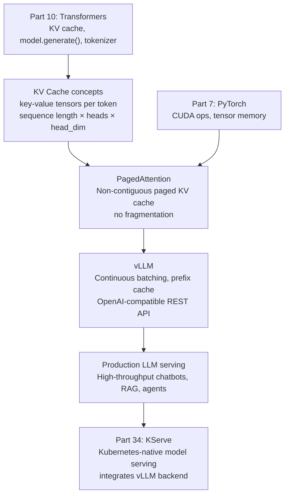
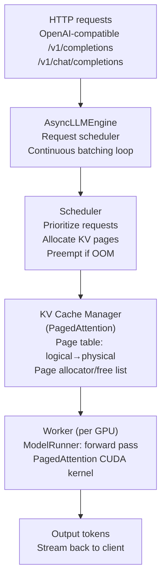

<!-- TEACHING_ORDER: verified -->
# Part 16: vLLM

> **Prerequisites:** Part 10 (Transformers), Part 7 (PyTorch — KV cache concepts), basic HTTP/REST APIs
> **Used later in:** Production LLM serving infrastructure, Part 34 (KServe integrates vLLM)
> **Version anchor:** vLLM 0.6.x (mid-2026), PagedAttention stable, speculative decoding production-ready

---

## Why This Library Exists

### The problem: LLM serving is memory-inefficient and slow by default

In 2022, the standard way to serve an LLM was to load it into GPU memory, tokenize a request, run `model.generate()`, and return the result. This works for one request at a time, but collapses under concurrent load:

**The fragmentation problem:** The KV cache for autoregressive generation grows dynamically — token 1 needs 1 KV slot, token 100 needs 100 KV slots. Standard serving systems pre-allocate the maximum possible KV cache for each request (e.g., 2048 tokens). But most requests are far shorter — you might allocate 8 GB for a request that uses 200 MB. The remaining memory is wasted.

**The throughput problem:** GPU compute is underutilized when processing one request at a time. GPUs need large batches to saturate their parallelism. But batching variable-length autoregressive generation is hard — request 1 might be at token 10 while request 2 is at token 400.

Woosuk Kwon, Zhuohan Li, Siyuan Zhuang (UC Berkeley SKY Lab) published **PagedAttention** (2023) — a kernel that manages KV cache memory in fixed-size pages (like OS virtual memory), eliminating fragmentation. Built on this, they released **vLLM**: a high-throughput LLM inference engine.

**vLLM achieves 10–24× higher throughput than naive HuggingFace `generate()`** on the same hardware, while reducing memory waste to near-zero.

---

## Explain Like I Am 10

Imagine a restaurant (the LLM server). Each table is a GPU memory slot. Old restaurant: when a customer (request) arrives, you reserve the biggest table in the restaurant for them — even if they only need a small table. Most tables sit empty.

vLLM works like a smart restaurant with flexible seating. There is no table reservation. Instead, there is a memory manager that allocates small chairs one at a time as the customer needs them (one chair = one KV cache slot for one token). When the customer leaves, their chairs are immediately available for others. The manager can even seat two customers at the same table if they are sharing a prefix (prompt caching).

This means: way more customers can be served at once, waiters (GPU cores) are always busy, and nobody is waiting while a huge table sits empty.

---

## Mental Model

**vLLM is an LLM inference server — it manages KV cache memory in pages to eliminate fragmentation and maximize batch throughput via continuous batching.**

Three innovations that make vLLM fast:
1. **PagedAttention:** KV cache stored in non-contiguous fixed-size pages (like OS virtual memory). No pre-allocation per request — pages allocated as tokens are generated.
2. **Continuous batching:** Instead of waiting for a full batch to form, vLLM adds new requests to the running batch mid-flight. Requests that finish are removed; new requests are inserted.
3. **Prefix caching:** If multiple requests share the same prefix (system prompt), their KV cache pages are shared — computed once, reused for all.

---

## Learning Dependency Graph



---

## Core Concepts

### 1. The KV Cache problem

In autoregressive generation, the model reuses previous computations via the KV (key-value) cache. At each step, it attends over the KV cache of all previous tokens — this grows linearly with sequence length.

Without PagedAttention: KV cache for a request occupying 2048 max tokens is pre-allocated as a contiguous 2048-slot block. If the request only uses 200 tokens, 90% of that block is wasted. With many concurrent requests, memory fills up rapidly.

With PagedAttention: KV cache is allocated in pages of fixed size (e.g., 16 tokens per page). A 200-token sequence gets 13 pages (200/16 ≈ 13). A page table maps logical KV positions to physical page locations. When the request finishes, pages are freed immediately for other requests.

### 2. Continuous batching

Traditional static batching: wait for B requests, process them together, return all results. GPU is idle while waiting for requests. Short requests wait for long ones to finish.

Continuous batching (vLLM): the GPU processes a running set of requests. When request A finishes (reaches EOS or max tokens), it is removed from the batch. When request B arrives, it is immediately inserted into the next iteration. The GPU is almost never idle.

```
Traditional: [req1=done, req2=still_running, req3=waiting]
             req3 waits until all active requests finish

Continuous:  [req1=done] → [req3 inserted] → [req2, req3 running]
             req3 starts as soon as req1 finishes (next iteration)
```

### 3. OpenAI-compatible API

vLLM exposes an HTTP server with the same API surface as OpenAI's API — making it a drop-in replacement for development, testing, and production:

```bash
# Start vLLM server
vllm serve meta-llama/Llama-3.2-1B --port 8000
```

```python
from openai import OpenAI

client = OpenAI(
    base_url="http://localhost:8000/v1",
    api_key="not-needed",           # vLLM doesn't require API key
)

response = client.chat.completions.create(
    model="meta-llama/Llama-3.2-1B",
    messages=[{"role": "user", "content": "Explain vLLM in one sentence."}],
    max_tokens=100,
    temperature=0.7,
)
print(response.choices[0].message.content)
```

### 4. vLLM Python API (offline inference)

```python
from vllm import LLM, SamplingParams

# Load model
llm = LLM(
    model="meta-llama/Llama-3.2-1B",
    dtype="bfloat16",
    gpu_memory_utilization=0.90,    # use 90% of GPU memory for KV cache
    max_model_len=4096,
    tensor_parallel_size=1,         # use more for larger models
)

# Sampling parameters
params = SamplingParams(
    temperature=0.8,
    top_p=0.95,
    max_tokens=256,
)

# Batch inference (all processed together with continuous batching)
prompts = [
    "Explain transformers in one paragraph:",
    "What is the difference between PyTorch and JAX?",
    "Write a Python function to reverse a string:",
]

outputs = llm.generate(prompts, params)

for output in outputs:
    print(f"Prompt: {output.prompt[:50]}...")
    print(f"Output: {output.outputs[0].text[:100]}")
    print(f"Tokens generated: {len(output.outputs[0].token_ids)}")
    print()
```

### 5. Speculative decoding

vLLM implements speculative decoding — a technique to accelerate generation by using a small draft model to propose multiple tokens, then the large target model verifies them in parallel:

```python
llm = LLM(
    model="meta-llama/Llama-3.1-70B-Instruct",
    speculative_model="meta-llama/Llama-3.2-1B",   # draft model
    num_speculative_tokens=5,                        # propose 5 tokens at once
    dtype="bfloat16",
    tensor_parallel_size=4,
)
```

Speedup depends on acceptance rate (how often draft tokens are correct) — typically 2–3× for chat/code generation.

---

## Internal Architecture



**The scheduler loop runs at GPU step rate:** every ~10–50ms, the scheduler decides which requests to process, allocates pages for new tokens, preempts low-priority requests if memory is tight (swaps their pages to CPU), and triggers the model runner. The model runner calls the PagedAttention CUDA kernel, which uses the page table to correctly attend over non-contiguous memory.

---

## Essential APIs

```python
from vllm import LLM, SamplingParams
from vllm.lora.request import LoRARequest

# ── Offline inference ─────────────────────────────────────────────────
llm = LLM(
    model="name",
    dtype="bfloat16",                      # "float16", "bfloat16", "float32"
    gpu_memory_utilization=0.90,           # KV cache memory fraction
    max_model_len=4096,                    # max sequence length
    tensor_parallel_size=4,               # TP for large models
    quantization="awq",                   # "awq", "gptq", "fp8", None
    enable_prefix_caching=True,           # share prefix KV pages
    max_num_seqs=256,                     # max concurrent sequences
)

params = SamplingParams(
    temperature=0.8,
    top_p=0.95,
    top_k=50,
    max_tokens=512,
    stop=["</s>", "Human:", "\n\n"],       # stop strings
    repetition_penalty=1.1,
)

outputs = llm.generate(prompts, params)

# ── LoRA inference ────────────────────────────────────────────────────
# Load base model with LoRA support
llm = LLM(model="base-model", enable_lora=True, max_loras=4)
outputs = llm.generate(
    prompts,
    params,
    lora_request=LoRARequest("my-adapter", 1, "./my-lora-path"),
)

# ── Server launch (CLI) ───────────────────────────────────────────────
# vllm serve meta-llama/Llama-3.2-1B \
#   --dtype bfloat16 \
#   --tensor-parallel-size 1 \
#   --gpu-memory-utilization 0.9 \
#   --max-model-len 4096 \
#   --port 8000
```

---

## API Learning Roadmap

**Beginner:** `LLM(model=)`, `SamplingParams`, `llm.generate()`, vLLM server CLI launch

**Intermediate:** `AsyncLLMEngine`, streaming output, LoRA request serving, prefix caching, quantization

**Advanced:** Multi-GPU tensor parallelism serving, speculative decoding, custom sampling, production metrics (throughput, TTFT, TPOT)

**Production:** Kubernetes deployment, autoscaling on GPU load, multi-model serving, A/B routing, output token monitoring

---

## Beginner Examples

### Example 1: Batch inference with throughput measurement

```python
import time
from vllm import LLM, SamplingParams

llm = LLM(
    model="facebook/opt-125m",    # tiny model for demo — no GPU required with cpu offload
    dtype="float32",
    gpu_memory_utilization=0.85,
    max_model_len=512,
)

params = SamplingParams(temperature=0.8, max_tokens=50)

prompts = [f"Complete this sentence number {i}: The future of AI is" for i in range(20)]

t0 = time.time()
outputs = llm.generate(prompts, params)
elapsed = time.time() - t0

total_tokens = sum(len(o.outputs[0].token_ids) for o in outputs)
print(f"Generated {total_tokens} tokens in {elapsed:.2f}s")
print(f"Throughput: {total_tokens/elapsed:.1f} tokens/sec")
print(f"\nSample output: {outputs[0].outputs[0].text[:100]}")
```

---

## Intermediate Examples

### Example 2: OpenAI-compatible streaming client

```python
# Run first: vllm serve meta-llama/Llama-3.2-1B --port 8000
from openai import OpenAI
import time

client = OpenAI(base_url="http://localhost:8000/v1", api_key="none")

print("Streaming response:")
start = time.time()
token_count = 0

stream = client.chat.completions.create(
    model="meta-llama/Llama-3.2-1B",
    messages=[
        {"role": "system", "content": "You are a concise ML expert."},
        {"role": "user", "content": "Explain attention mechanisms in 3 sentences."},
    ],
    max_tokens=200,
    temperature=0.7,
    stream=True,    # stream tokens as generated
)

for chunk in stream:
    if chunk.choices[0].delta.content:
        print(chunk.choices[0].delta.content, end="", flush=True)
        token_count += 1

elapsed = time.time() - start
print(f"\n\nSpeed: {token_count/elapsed:.1f} tokens/sec")
```

---

## Advanced Examples

### Example 3: AsyncLLMEngine for production async serving

```python
import asyncio
from vllm.engine.async_llm_engine import AsyncLLMEngine
from vllm.engine.arg_utils import AsyncEngineArgs
from vllm import SamplingParams

async def main():
    engine_args = AsyncEngineArgs(
        model="facebook/opt-125m",
        dtype="float32",
        gpu_memory_utilization=0.85,
    )
    engine = AsyncLLMEngine.from_engine_args(engine_args)

    params  = SamplingParams(temperature=0.8, max_tokens=50)
    request_id = "req-001"

    async for output in engine.generate("The transformer architecture", params, request_id):
        if output.finished:
            print(f"Final: {output.outputs[0].text}")
        else:
            # Stream token-by-token
            print(output.outputs[0].text, end="\r")

asyncio.run(main())
```

---

## Internal Interview Knowledge

**Q: What is PagedAttention and why does it improve throughput?**
Strong answer: "Standard LLM serving pre-allocates a contiguous block of KV cache memory for each request, sized to the maximum sequence length. This wastes memory — a 200-token request allocated 2048 slots wastes 90%. PagedAttention stores KV cache in fixed-size pages (e.g., 16 tokens), allocated on demand. A page table maps logical token positions to physical page locations. This eliminates fragmentation — pages are immediately freed when a request finishes and allocated to new requests. The result: 5–24× more concurrent requests fit in the same GPU memory, proportionally increasing throughput."

**Q: What is continuous batching and how does it differ from static batching?**
Strong answer: "Static batching: collect B requests, process them together, return all results. GPU is idle while waiting for a full batch. Requests that finish early must wait for slower requests. Continuous batching: the GPU processes a running set of active requests. When any request finishes (EOS token), it is immediately removed from the batch; waiting requests are immediately admitted. The GPU utilization stays near 100%. vLLM's scheduler also balances KV cache allocation across the batch, preempting low-priority requests if memory is tight."

**Q: How does vLLM handle tensor parallelism for serving?**
Strong answer: "Set `tensor_parallel_size=N` in `LLM()` or `--tensor-parallel-size N` in the CLI. vLLM uses PyTorch `torch.distributed` to split attention heads and MLP weights across N GPUs (Megatron-style column/row parallelism). Each GPU processes part of the KV cache and part of the feed-forward computation. AllReduce is performed within each transformer layer. For a 70B model, use tensor_parallel=4 or tensor_parallel=8 depending on GPU count. Note: tensor parallelism increases communication latency — use the minimum needed to fit the model."

---

## Production AI Usage

**Anyscale (Ray Serve + vLLM):** Anyscale's LLM serving platform (Aviary/RayLLM) uses vLLM as the inference backend. Ray Serve handles routing, load balancing, and autoscaling while vLLM handles the actual inference.

**Together AI:** Together AI's inference endpoints use vLLM as the serving engine for open-source model APIs.

**Perplexity AI:** Perplexity's production serving stack is built on vLLM for the underlying LLM completions used in search responses.

**Replicate:** Replicate's model-serving platform uses vLLM for transformer model inference, enabling serverless LLM APIs.

**Databricks:** Databricks Mosaic AI Serving uses vLLM as the underlying inference engine for model endpoints.

---

## Common Mistakes

**Mistake 1: Setting `gpu_memory_utilization` too high**
```python
# Bug: leaves no memory for activations and fragmentation
llm = LLM(model="name", gpu_memory_utilization=0.99)
# → CUDA OOM during generation

# Fix: start with 0.85-0.90, reduce if OOM
llm = LLM(model="name", gpu_memory_utilization=0.90)
```

**Mistake 2: Not setting `max_model_len` when model default is very large**
```python
# Bug: vLLM allocates KV cache for full model context (e.g., 128K tokens)
# → wastes GPU memory for short tasks
llm = LLM(model="name")     # default max_model_len may be 128K+

# Fix: cap at actual max sequence length for your use case
llm = LLM(model="name", max_model_len=4096)
```

**Mistake 3: Using `llm.generate()` for low-latency single requests**
```python
# Bug: LLM.generate() is designed for batch offline inference
# → adds overhead of batch scheduling for a single request
for prompt in prompts:
    output = llm.generate([prompt], params)   # 1 request at a time!

# Fix: batch everything together
outputs = llm.generate(prompts, params)       # vLLM processes as one batch
```

---

## Performance Optimization

**1. Prefix caching** (`enable_prefix_caching=True`): When many requests share the same system prompt, prefix caching stores the KV pages for the shared prefix once and reuses them. This is a significant win for chatbot workloads with a fixed system prompt — can save 30–50% of KV cache computation.

**2. Quantization for smaller memory footprint:**
```python
llm = LLM(model="meta-llama/Llama-3.1-70B", quantization="fp8")
# FP8 quantization: ~5 bytes/param vs 16 bytes/param (bf16)
# Negligible accuracy loss for most tasks
```

**3. Speculative decoding for latency-sensitive workloads:** Use a small draft model (1B) with the large target model (70B). The draft model proposes tokens greedily; the target verifies them in parallel. Typical 2–3× speedup on text-heavy generation.

**4. Tune max_num_seqs and max_num_batched_tokens:** For high-throughput scenarios, increase `max_num_seqs` (concurrent requests) to fill the GPU. For latency-sensitive scenarios, reduce it to prevent head-of-line blocking.

---

## Library Relationships

### vLLM vs HuggingFace TGI vs TensorRT-LLM

| Dimension | vLLM | HuggingFace TGI | TensorRT-LLM |
|---|---|---|---|
| Core innovation | PagedAttention, continuous batching | Continuous batching, Flash Attention | NVIDIA compiler optimization |
| Ease of setup | Easy (`pip install vllm`) | Easy (Docker) | Complex (build from source) |
| Throughput | Very high | High | Highest (2× vLLM at large batch) |
| Latency (TTFT) | Low | Low | Very low (compiled kernels) |
| Model support | Excellent (HuggingFace Hub) | Good | NVIDIA-specific models |
| LoRA serving | Yes (dynamic adapter swap) | Yes | Limited |
| Production adoption | Very high | High | Growing |
| Choose when | General LLM serving | Docker-first deployments | NVIDIA hardware, max throughput |

---

## Cheat Sheet

```bash
# Install
pip install vllm

# Serve (OpenAI-compatible)
vllm serve meta-llama/Llama-3.2-1B --port 8000 --dtype bfloat16

# Serve with tensor parallelism (70B on 4 GPUs)
vllm serve meta-llama/Llama-3.1-70B --tensor-parallel-size 4 --dtype bfloat16
```

```python
from vllm import LLM, SamplingParams

llm = LLM(model="name", dtype="bfloat16", gpu_memory_utilization=0.9,
          max_model_len=4096, enable_prefix_caching=True)

params = SamplingParams(temperature=0.8, top_p=0.95, max_tokens=512)
outputs = llm.generate(prompts, params)

for o in outputs:
    print(o.outputs[0].text)
```

---

## Interview Question Bank

### Top 25 Beginner

**Q1: What problem does vLLM solve?** A: vLLM solves two problems in LLM serving: (1) memory waste from pre-allocating large KV cache blocks per request, causing low GPU utilization; (2) low throughput from static batching that waits for a full batch and must keep all requests until the slowest finishes. vLLM's PagedAttention allocates KV cache in small pages on demand, and continuous batching keeps the GPU running at maximum utilization.

**Q2: How do you start a vLLM server?** A: `vllm serve meta-llama/Llama-3.2-1B --port 8000 --dtype bfloat16`. vLLM downloads the model from HuggingFace Hub (if not cached), loads it into GPU, and starts an HTTP server compatible with the OpenAI API. Access at `http://localhost:8000/v1`.

**Q3: What sampling parameters control generation diversity?** A: `temperature` scales logits before softmax — 0 is greedy, >1 increases randomness. `top_p` (nucleus): sample from tokens summing to top p probability. `top_k`: sample from top-k tokens. `stop`: list of strings that halt generation. For deterministic output: temperature=0.

**Q4: What is `gpu_memory_utilization` and what happens if it's too high?** A: Fraction of GPU memory reserved for the KV cache page pool after model weights are loaded. Setting 0.9 means 90% of remaining memory goes to KV cache. Too high (>0.95): no memory for activations → CUDA OOM. Too low (<0.7): fewer concurrent requests → lower throughput. Start with 0.85-0.90.

**Q5: How does vLLM differ from `model.generate()` in HuggingFace?** A: HuggingFace `model.generate()` processes one batch sequentially with pre-allocated max-length KV cache. vLLM uses PagedAttention (on-demand allocation), continuous batching (streaming admission), and optimized CUDA kernels. vLLM achieves 10-24× higher throughput for concurrent workloads on the same hardware.

**Q6: What is PagedAttention?** A: A memory management technique that divides GPU memory into fixed-size KV cache blocks (pages). Each request's KV cache is mapped to non-contiguous physical blocks via a block table, like OS virtual memory. This eliminates the pre-allocation waste of traditional serving where each request reserves max-length memory from the start.

**Q7: What is continuous batching?** A: Unlike static batching (wait for full batch, run until all done), continuous batching runs one forward step per scheduler tick. After each step, finished requests are removed and new ones admitted. Short requests free memory immediately without waiting for longer requests to complete.

**Q8: How do you request completions from a vLLM server using the OpenAI client?** A: `client = openai.OpenAI(base_url="http://localhost:8000/v1", api_key="EMPTY"); response = client.chat.completions.create(model="llama-3", messages=[...])`. The OpenAI-compatible API means existing OpenAI code works with vLLM by just changing the `base_url`.

**Q9: What is prefix caching in vLLM?** A: vLLM caches KV cache blocks for shared prompt prefixes (like system prompts). When multiple requests share the same prefix, the prefix KV is computed once and reused. This reduces TTFT significantly for high-system-prompt reuse (chat applications) — up to 5× reduction in TTFT when 80%+ of input is shared prefix.

**Q10: What quantization formats does vLLM support?** A: AWQ, GPTQ, INT4, INT8, FP8, and GGUF (via llama.cpp backend). FP8 on H100 gives near-FP16 quality with 2× memory reduction. AWQ is the most widely compatible for 4-bit quantization of open-source models. Pass `--quantization awq` or `--dtype float8` to the serve command.

**Q11: How does vLLM handle multi-GPU serving?** A: Use `--tensor-parallel-size N` to split the model across N GPUs using tensor parallelism. vLLM uses NCCL for AllReduce between GPUs. For pipeline parallelism (larger models or slower inter-GPU bandwidth), use `--pipeline-parallel-size N`.

**Q12: What is the vLLM AsyncLLMEngine?** A: The production-ready async engine that handles requests concurrently using Python asyncio. The synchronous `LLM` class is for batch inference scripts; `AsyncLLMEngine` is for web servers where request handling must be non-blocking. FastAPI/Uvicorn deployments use `AsyncLLMEngine`.

**Q13: How do you enable streaming responses in vLLM?** A: `async for output in engine.generate(prompt, sampling_params, request_id): yield output.outputs[0].text`. For the HTTP server, set `stream=True` in the OpenAI client — vLLM returns Server-Sent Events (SSE) with each new token.

**Q14: What is `max_num_batched_tokens` in vLLM?** A: The maximum number of tokens (prompt + output) that can be processed in one forward pass. Limits the GPU memory needed for activations during a single step. Larger values → higher throughput but more peak activation memory. Default is model-dependent.

**Q15: How does vLLM handle very long input prompts?** A: vLLM's KV cache pages accommodate any prompt length up to `max_model_len`. Long prompts use more KV cache pages (one page per N tokens). The scheduler checks if enough free pages exist before admitting the request. If not, the request waits in the queue.

**Q16: What does `max_model_len` control?** A: Maximum total tokens (prompt + output) per request. Requests exceeding this are rejected. Set to match your model's context window (e.g., 8192 for most LLaMA-2 models, 128K for LLaMA-3.1). Setting too high wastes KV cache page pool allocation.

**Q17: What is the `--swap-space` parameter in vLLM?** A: CPU RAM size (in GB) for KV cache swapping. When GPU KV cache is full, vLLM can swap out KV blocks for low-priority requests to CPU RAM. High swap space allows more concurrent requests but adds latency for swapped requests when they're resumed.

**Q18: How does vLLM report metrics?** A: vLLM exposes Prometheus-compatible metrics at `/metrics`: `vllm:request_success_total`, `vllm:request_latency_seconds` (TTFT, TPOT, E2E), `vllm:num_requests_running`, `vllm:gpu_cache_usage_perc`. Integrate with Grafana for dashboards.

**Q19: What is the difference between `n=1` and `n=5` in sampling params?** A: `n` is the number of output sequences generated per prompt (beam search equivalent for sampling). `n=5` returns 5 independent completions for the same prompt. vLLM handles this efficiently by batching all n completions of a prompt together (sharing the prompt KV cache).

**Q20: How does vLLM handle model loading and initialization?** A: On startup: (1) Load model weights from HuggingFace Hub or local path. (2) Apply quantization if specified. (3) Initialize KV cache based on `gpu_memory_utilization`. (4) Run a dummy forward pass to warm up CUDA kernels. (5) Start serving. First request after cold start has 2-5s overhead; subsequent requests are fast.

**Q21: Can vLLM serve GGUF quantized models?** A: Yes, via `--quantization gguf`. vLLM integrates with llama.cpp backend for GGUF support, enabling serving of community-quantized models. Performance is lower than native AWQ/GPTQ due to the CPU-accelerated quantization math.

**Q22: What is `best_of` in sampling params?** A: Generates `best_of` sequences and returns the top `n` by score (log probability). With `best_of=5, n=1`, vLLM generates 5 completions and returns the one with highest log probability. More expensive than `n=1` but produces higher-quality single outputs.

**Q23: How do you test a vLLM deployment?** A: (1) Health check: `curl http://localhost:8000/health`. (2) List models: `curl http://localhost:8000/v1/models`. (3) Test completion: `curl http://localhost:8000/v1/completions -d '{"model":"llama","prompt":"Hello","max_tokens":10}'`. (4) Benchmark throughput: use `python -m vllm.entrypoints.benchmark_throughput`.

**Q24: What models does vLLM support?** A: All HuggingFace Transformers-compatible decoder-only models (GPT, LLaMA, Mistral, Falcon, Qwen, Gemma, Phi, etc.) and some encoder-decoder models (T5 for classification). Models must have an attention implementation compatible with PagedAttention (most standard attention patterns). Check vLLM's model support list for the latest.

**Q25: How does vLLM's throughput compare to TGI (HuggingFace Text Generation Inference)?** A: vLLM typically achieves 20-40% higher throughput than TGI for equivalent hardware due to more efficient KV cache management and continuous batching implementation. TGI has advantages in: (1) broader model support, (2) better PEFT/LoRA deployment tooling, (3) integration with HuggingFace Inference Endpoints. Both are production-ready; choice depends on ecosystem fit.

---

### Top 25 Intermediate

**Q1: How does PagedAttention work in detail?** A: GPU memory is divided into fixed-size physical KV blocks (block_size tokens × num_heads × head_dim × 2 bytes). A block table per sequence maps logical block indices to physical block IDs. The PagedAttention CUDA kernel receives the block table and dereferences non-contiguous physical addresses during attention computation. When a sequence finishes, its blocks are immediately returned to the free pool for reuse.

**Q2: How does the vLLM scheduler make admission decisions?** A: The scheduler maintains a waiting queue and a set of running sequences. Each step: (1) estimate KV cache blocks needed by waiting sequences, (2) admit sequences if `free_blocks >= needed_blocks + safety_margin`, (3) if GPU KV is full, preempt low-priority running sequences (swap to CPU or recompute). Priority: sequences with most tokens already generated are preempted last (sunk cost heuristic).

**Q3: How does vLLM serve multiple LoRA adapters?** A: With `enable_lora=True`, each request specifies a `LoRARequest(lora_name, lora_int_id, local_lora_path)`. vLLM loads multiple LoRA adapters into GPU memory simultaneously (up to `max_loras`). During batching, requests with different LoRA adapters are batched together; the LoRA weight application is fused into the attention computation per-request.

**Q4: How does speculative decoding work in vLLM?** A: A small draft model generates k tokens via greedy sampling. The target model verifies all k tokens in one parallel forward pass. Accepted tokens are kept; the first rejected token is resampled from the target distribution. Throughput gain depends on acceptance rate. Configure: `--speculative-model <draft_model> --num-speculative-tokens 5`.

**Q5: What is the chunked prefill optimization?** A: Standard prefill processes the entire input prompt in one forward pass. For very long prompts (>4K tokens), this blocks new decode steps while the GPU is occupied with prefill. Chunked prefill splits the prompt into chunks (e.g., 512 tokens) and interleaves prefill chunks with decode steps, reducing TTFT for other concurrent requests. Enable with `--enable-chunked-prefill`.

**Q6: How does tensor parallelism work in vLLM?** A: vLLM uses Megatron-style tensor parallelism: Q, K, V projections are column-parallel (split across GPUs by head), output projection is row-parallel (AllReduce after). FFN uses column-then-row parallel. Each TP rank processes different attention heads. With TP=4, each GPU handles `num_heads/4` heads. AllReduce is called after each attention and FFN block.

**Q7: What is the memory efficiency of PagedAttention vs standard serving?** A: Standard serving: pre-allocates max_seq_len × num_heads × head_dim × 2 bytes per request. For max_seq_len=2048, 32 heads, dim=128: 2048×32×128×2 = 16.7 MB per request. Average actual usage: 50% = 8.4 MB wasted per request. PagedAttention: only allocates pages as needed; waste = 1 page per request = 16 tokens × 32 × 128 × 2 = 131 KB wasted (128× less).

**Q8: How does vLLM's KV cache block manager handle prefix caching?** A: When prefix caching is enabled (`--enable-prefix-caching`), vLLM hashes the token sequence of each KV block. If a new request shares a prefix with a cached block, the cached block is reused (reference counted). The cache evicts LRU blocks when space is needed. Shared system prompts with 1000+ tokens can be served with near-zero TTFT overhead for the common prefix.

**Q9: What is the vLLM throughput benchmark methodology?** A: `python -m vllm.entrypoints.benchmark_throughput --model llama3 --input-len 512 --output-len 128 --num-prompts 1000`. Measures total throughput (tokens/sec) at different request loads. Plots latency-throughput tradeoff curve. Key metrics: max_throughput (GPU saturated), tail latency at 50%/90%/99% of max_throughput.

**Q10: How does vLLM handle OOM during inference?** A: vLLM's scheduler pre-checks available KV pages before admitting requests. If a request would cause OOM, it stays in the waiting queue. For unexpected OOM during forward pass (activations), vLLM catches the CUDA OOM, reduces the batch size, and retries. Configure `--max-num-batched-tokens` to limit activation memory usage.

**Q11: What is vLLM's approach to multi-node serving?** A: For very large models: use `--tensor-parallel-size` within a node (NVLink) and `--pipeline-parallel-size` across nodes (InfiniBand). For horizontal scaling (many instances of same model): use a load balancer or Ray Serve's multi-replica deployment. Multi-node single-model (PP) increases latency but enables serving models that don't fit on one node.

**Q12: How do you tune `block_size` for optimal performance?** A: block_size = tokens per KV cache page. Smaller block_size (8): more precise memory allocation, less waste per sequence, but more block table overhead. Larger block_size (32): less overhead, better memory coalescing in the attention kernel, but more waste for short sequences. Default: 16. For short-sequence workloads (<200 tokens), try block_size=8. For long contexts, block_size=32.

**Q13: How does vLLM implement beam search?** A: Beam search requires maintaining multiple hypothesis sequences per request. vLLM uses copy-on-write for KV cache: all beams share parent blocks until divergence, then copy-on-write creates new blocks for diverged tokens. This avoids duplicating the common prefix KV cache across all beams, saving significant memory for large beam widths.

**Q14: What is the vLLM `RequestOutput` object?** A: Returned by `engine.generate()`. Contains: `request_id`, `prompt`, `prompt_token_ids`, `outputs` (list of `CompletionOutput` per beam/sample), `finished` (bool). `CompletionOutput` has: `text`, `token_ids`, `cumulative_logprob`, `logprobs`, `finish_reason` (stop, length, or None).

**Q15: How does vLLM handle model variants with grouped-query attention (GQA)?** A: GQA (e.g., LLaMA-2-70B uses 8 KV heads with 64 Q heads). vLLM's PagedAttention kernel handles GQA natively: each KV block stores only `num_kv_heads × head_dim` per token (not `num_q_heads`), reducing KV cache size by `num_q_heads / num_kv_heads`. LLaMA-2-70B's 8:1 ratio reduces KV memory 8×.

**Q16: What is the purpose of `--max-seq-len-to-capture` in vLLM?** A: CUDA graph capture is used to reduce kernel launch overhead for fixed-size inputs. Requests shorter than `max-seq-len-to-capture` use pre-compiled CUDA graphs; longer requests fall back to eager mode. Captured shapes: powers of 2 from 1 to `max-seq-len-to-capture`. Higher values: more GPU memory for graphs, better throughput for long sequences.

**Q17: How does vLLM's async engine prevent head-of-line blocking?** A: The `AsyncLLMEngine` uses a dedicated background thread for the model forward passes, while the main asyncio event loop handles request ingestion/output streaming. This prevents a slow request from blocking other requests' response delivery. Responses are streamed via `asyncio.Queue` per request, allowing concurrent streaming to many clients.

**Q18: What is `ignore_eos` in sampling params?** A: When `True`, the model continues generating even after outputting the EOS token, until `max_tokens` is reached. Used for applications that need fixed-length outputs regardless of content (some structured generation tasks). Default: `False`.

**Q19: How does vLLM integrate with OpenTelemetry for distributed tracing?** A: vLLM 0.4+ integrates with OpenTelemetry: start with `VLLM_TRACE_FUNCTION=1` and configure OTLP exporter. Spans are emitted for: request arrival, scheduler decisions, prefill step, each decode step, response delivery. Use Jaeger or Arize Phoenix to visualize traces and identify latency bottlenecks.

**Q20: How do you implement request routing for multi-model vLLM deployment?** A: Deploy multiple vLLM instances (one per model or per GPU group). Routing layer: (1) model-based routing: route by `model` field in request, (2) capability routing: route to quantized model for non-critical requests, full-precision for critical. Use Nginx, Ray Serve, or Kubernetes Ingress as the router. Health check each vLLM instance; remove unhealthy instances from rotation.

**Q21: What is FP8 quantization in vLLM and when does it provide benefit?** A: FP8 E4M3 uses 8 bits per weight (vs BF16's 16 bits), halving model memory. On H100s with FP8 Tensor Cores, FP8 GEMM runs at 2× the FLOPS of BF16. vLLM supports FP8 via `--dtype float8` for H100 or via offline quantization to W8A8 format. Near-BF16 quality for most models; recommended for throughput-critical H100 deployments.

**Q22: How does vLLM handle PEFT adapters beyond LoRA?** A: vLLM primarily supports LoRA adapters. For other PEFT methods (prefix tuning, prompt tuning), you must merge the adapter weights into the base model before loading in vLLM. Prompt tuning virtual tokens can be handled by prepending them as part of the system prompt (at cost of KV cache usage).

**Q23: What happens to in-flight requests during vLLM restart/crash?** A: vLLM does not persist request state. On restart: all in-flight requests are lost. Clients receive connection errors and must retry. For production: (1) implement request queuing at the load balancer with retry logic, (2) use stateless request design (client can safely retry from beginning), (3) monitor vLLM health and restart quickly.

**Q24: How do you configure vLLM for extremely long context (128K+ tokens)?** A: `--max-model-len 131072 --gpu-memory-utilization 0.95`. For long contexts, KV cache fills quickly — each 128K token request uses 128K × num_heads × head_dim × 2 bytes (e.g., 32 GB for LLaMA-3 with GQA). Use tensor parallelism to distribute KV cache across multiple GPUs. Limit concurrent long-context requests based on available KV pool.

**Q25: What is the difference between preemption via recompute vs swap in vLLM?** A: When GPU KV cache is full and a lower-priority sequence must yield: (1) Recompute: discard KV blocks, resume by recomputing from prompt (costly for long prompts). (2) Swap: move KV blocks to CPU RAM, resume by swapping back (latency proportional to swap size, ~10-50ms for 1GB). Swap is preferred for long sequences; recompute for short ones. Configure swap-space to enable swap.

---

### Top 25 Advanced

**Q1: Explain the PagedAttention CUDA kernel implementation.** A: The kernel receives a block table mapping logical position → physical block ID. For each query token, it computes attention over all KV blocks: outer loop over KV blocks, inner loop over tokens within a block. Key access: `K[block_table[i] × block_size + j]` — non-contiguous in memory. The kernel uses 16-byte aligned vectorized loads for each physical block. Block-wise flash attention accumulation maintains the online softmax state across blocks.

**Q2: How does vLLM's continuous batching interact with pipeline parallelism?** A: Pipeline parallelism creates a complication: different stages have different sequence progress. vLLM's PP implementation uses microbatch scheduling: stage 0 processes the first N sequences, stage 1 waits for stage 0's outputs. The scheduler ensures all pipeline stages have work at all times — uses the 1F1B schedule from Megatron. Preemption is more complex under PP: must drain the entire pipeline before reducing batch size.

**Q3: What is RadixAttention (SGLang's technique) and how does it compare to vLLM prefix caching?** A: SGLang's RadixAttention uses a radix tree (trie) to share KV cache across requests with any common prefix, not just a single shared system prompt. For example, if requests share only the first 50 tokens, those tokens' KV blocks are reused. vLLM's prefix caching is simpler — block-level hashing. RadixAttention achieves higher cache hit rates for diverse prefix patterns but requires more complex eviction policies.

**Q4: How would you implement a production vLLM deployment with zero-downtime upgrades?** A: Blue-green deployment: (1) Deploy new vLLM version (green) alongside current (blue). (2) Send 5% of traffic to green for A/B quality verification. (3) Gradually shift traffic (20%, 50%, 100%) over 2 hours while monitoring P99 latency and error rate. (4) Keep blue running for 30 minutes after 100% cutover for rollback. (5) Use Kubernetes deployment with `maxSurge=1, maxUnavailable=0` for rolling updates of the serving deployment.

**Q5: Describe vLLM's memory management when handling 1000 concurrent requests.** A: At 1000 concurrent requests (LLaMA-3-8B, avg 512 tokens each): KV cache needed ≈ 1000 × 512 × 32 heads × 128 dim × 2 bytes (GQA reduces to 8 KV heads) = 1000 × 512 × 8 × 128 × 2 = 1 GB. An A100-80GB with `gpu_memory_utilization=0.9` after model weights (~16 GB): KV pool = (80-16) × 0.9 = 57.6 GB. Can serve 57,600 concurrent "average" tokens. vLLM's scheduler distributes these across 1000 requests dynamically.

**Q6: How does speculative decoding with vLLM handle acceptance rate monitoring?** A: vLLM tracks acceptance rate per speculative decoding session. If acceptance rate drops below a threshold (e.g., 0.5), it reduces `num_speculative_tokens` dynamically to avoid wasting compute on rejected drafts. In production, log `speculative_decoding_acceptance_rate` per model/use-case combination — high-temperature generation should disable speculative decoding.

**Q7: How do you implement structured output generation (JSON) in vLLM?** A: Use `guided_decoding_backend` with XGrammar or lm-format-enforcer. `SamplingParams(guided_json=my_json_schema)` generates output that is guaranteed to parse as valid JSON matching the schema. Implemented via constrained decoding: at each token step, compute a logit mask that zeros out tokens incompatible with the current JSON parser state.

**Q8: What are the performance implications of different KV data types in vLLM?** A: FP16 KV cache: standard quality, 2 bytes/element. INT8 KV: 1 byte, 2× reduction, slight quality loss (perplexity +0.1-0.5). FP8 E5M2 KV: 1 byte, near-FP16 quality. INT4 KV: 0.5 bytes, 4× reduction, noticeable quality loss. vLLM supports `--kv-cache-dtype fp8` for 2× KV cache capacity with minimal quality impact on H100.

**Q9: How would you implement multi-modal (text + image) serving in vLLM?** A: vLLM 0.5+ supports multimodal models (LLaVA, Phi-3-Vision). Images are passed as `MultiModalData` in the prompt. vLLM's visual encoder processes images to visual tokens, which are then treated as KV cache-requiring tokens. Image KV cache can be larger than text — 256-1024 visual tokens per image. Configure `--image-input-type` and `--image-token-id` for the specific model.

**Q10: How does vLLM achieve near-zero latency for cached prefix responses?** A: With prefix caching: a request whose entire prompt is a cached prefix computes only the decode phase (no prefill). For a system with a 2K-token system prompt that's identical for all users: first request computes and caches the 2K prefix KV. Subsequent requests skip prefill entirely — TTFT drops from ~100ms (prefill) to ~10ms (first decode token).

**Q11: Design a hybrid vLLM/TGI serving architecture for a large enterprise.** A: Route by model type: (1) Open-source LLaMA/Mistral variants → vLLM (better throughput). (2) Models with custom PEFT configurations → TGI (better LoRA/adapter support). (3) Very latest HuggingFace models → TGI (faster integration of new models). Gateway layer handles routing, authentication, rate limiting. Both vLLM and TGI instances export Prometheus metrics to shared Grafana dashboard.

**Q12: How does vLLM's scheduler handle mixed request priorities?** A: vLLM supports request priority via `SamplingParams(priority=N)`. The scheduler uses a priority queue: higher priority requests are admitted first and preempt lower-priority ones when KV memory is scarce. In practice: premium API tier requests get priority=10, free tier gets priority=1. This ensures SLA compliance for premium users during high load.

**Q13: What is the overhead of LoRA weight loading per request in vLLM?** A: vLLM pre-loads all active LoRA adapters at startup (if `max_loras=N`). Loading cost: one-time H2D transfer at startup. Per-request overhead: minimal — LoRA weight application is fused into the attention GEMM via custom kernels. The bottleneck is `max_loras × lora_rank × hidden_dim × 2 bytes` GPU memory. With 100 adapters × rank=64 × 4096 × 2 bytes: ~51 MB per adapter × 100 = 5.1 GB.

**Q14: How does vLLM handle context window extension techniques like RoPE scaling?** A: Configure via `rope_scaling` in the model config: `{"type": "dynamic", "factor": 4.0}` extends a 4K context model to 16K via dynamic NTK scaling. vLLM respects the model config's `rope_scaling` parameter. For YaRN (Yet another RoPE scaling), set `rope_scaling={"type": "yarn", "factor": 4, "original_max_position_embeddings": 4096}`.

**Q15: Describe the complete request lifecycle in vLLM from HTTP to GPU.** A: (1) FastAPI receives HTTP POST `/v1/completions`. (2) Request validated and queued in `AsyncLLMEngine.request_queue`. (3) Scheduler loop: check free KV blocks, admit request if available. (4) Prefill step: all input tokens processed in one forward pass; KV cache populated. (5) Decode loop: one token generated per step; KV cache extended by one block when full page. (6) EOS detected or `max_tokens` reached → mark finished. (7) `RequestOutput` streamed back via SSE or returned as complete response.

**Q16: How does vLLM implement attention with different RoPE implementations?** A: vLLM's attention kernel accepts a `cos_sin_cache` precomputed for all positions. During prefill and decode, it applies rotary position embeddings using the cached cos/sin values. For sliding window attention (Mistral), the attention mask is applied to restrict attention to the window. All these are implemented as specialized PagedAttention CUDA kernel variants.

**Q17: What are the trade-offs of different parallelism strategies for vLLM inference?** A: TP (tensor parallel): low latency (parallelizes per-request compute), higher communication overhead (AllReduce per layer). PP (pipeline parallel): higher throughput (deeper pipeline), higher latency (pipeline flush between microbatches). For latency-critical chat: TP=8 (all on one node, NVLink). For throughput-critical batch processing: PP=2 × TP=4 to spread across more GPUs.

**Q18: How does vLLM handle non-streaming requests vs streaming?** A: Non-streaming: `engine.generate()` accumulates all tokens before returning. Streaming: `engine.generate()` yields `RequestOutput` after each token. For production: prefer streaming for chat (better UX, lower perceived latency). Non-streaming for batch processing (simpler client code). vLLM's engine always generates token-by-token internally; streaming is just earlier response delivery.

**Q19: What is the impact of batch size on vLLM memory efficiency?** A: Larger batch = more concurrent requests = better GPU utilization (amortizes attention overhead across requests). But: more KV cache pages in use simultaneously → less headroom for burst traffic. Optimal batch size: `(available_kv_pages × block_size) / avg_tokens_per_request`. With 50K available pages × 16 tokens: 800K tokens of concurrent capacity → ~400 concurrent 2K-token requests at 50% average fill.

**Q20: How would you use vLLM for offline batch inference on a large dataset?** A: Use `LLM.generate(prompts_batch, sampling_params)` directly: vLLM processes all prompts optimally, sorting by length to minimize padding. For very large datasets: batch into groups of 1000-10000 prompts, call `generate()` per group. Throughput: 10-100× faster than sequential `model.generate()` due to batching. Use `tqdm` to track progress.

**Q21: How does vLLM's disaggregated prefill architecture work?** A: In standard vLLM, prefill and decode run on the same GPU. Disaggregated prefill uses separate "prefill instances" (optimized for high-compute prefill) and "decode instances" (optimized for memory-bound decode). After prefill, KV cache is transferred to a decode instance via NVLink/PCIe. Benefit: prefill instances can use more powerful GPUs (H100 for compute-intensive long prefills) while decode instances use cheaper GPUs (A100 or A10G).

**Q22: How do you monitor and detect vLLM memory leaks?** A: Monitor `vllm:gpu_cache_usage_perc` over time. If it monotonically increases without request volume increasing, there's a leak. Common causes: (1) Request objects not cleaned up properly. (2) Prefix cache growing unbounded (enable eviction with `--enable-prefix-caching --max-lora-rank`). (3) LoRA adapter pool growing without cleanup. Use `nvidia-smi dmon -s m` to track GPU memory from the OS level.

**Q23: How does vLLM handle models with sliding window attention (Mistral)?** A: vLLM's PagedAttention supports sliding window: only KV blocks within the window size are included in attention. For Mistral (window=4096): only the 4096 most recent tokens' KV blocks are attended. Blocks outside the window are still kept in memory (needed if the window slides) but excluded from attention computation. This enables O(window) attention complexity for O(seq) context.

**Q24: What is the vLLM scheduler's preemption policy?** A: When KV cache is exhausted: (1) Identify candidates: all requests in `running` state. (2) Preemption priority: lowest priority first; if equal, longest waiting sequence last (protect recently-started sequences). (3) Preempt action: swap KV blocks to CPU (if swap_space available) or recompute (discard KV, put back in waiting queue). (4) Admit new high-priority request using freed blocks.

**Q25: How would you implement a shadow traffic system for testing new vLLM versions?** A: Mirror production traffic to shadow vLLM instance: (1) Nginx `mirror` module sends copy of each request to shadow. (2) Shadow responses discarded; only used for metric comparison. (3) Compare: TTFT, TPOT, token distributions, error rates between production and shadow. (4) Run for 24 hours to cover all traffic patterns. (5) Promote shadow to production only if metrics are within 5% of baseline.

---

### Top 25 Staff Engineer

**Q1: Design a vLLM-based LLM serving infrastructure for a 10M DAU product.** A: Architecture: 3-tier serving. Tier 1 (cache): Redis prefix cache layer for common prompts (FAQ, system prompts) — serves from cache with < 1ms latency. Tier 2 (fast path): 10 vLLM instances on A100-80GB for general requests, each serving up to 500 concurrent sequences. Tier 3 (burst path): auto-scaled spot GPU instances on cloud for >2× normal load. Load balancer routes based on request complexity (short prompts → Tier 2, long contexts → dedicated Tier 3). Total: 10 × 500 concurrent = 5K concurrent requests at steady state, auto-scale to 3× for peak.

**Q2: How would you design a cost-optimization strategy for vLLM at scale?** A: (1) Right-sizing: profile workload — if most requests are <1K tokens, use smaller GPU instances. (2) Quantization: FP8 on H100 doubles throughput with near-identical quality — halves cost per token. (3) Spot/preemptible instances: 60-80% cost reduction vs on-demand for batch workloads. (4) Request routing: short requests to smaller GPUs (A10G at $0.75/hr vs A100 at $3.50/hr). (5) Off-peak batching: queue non-urgent requests for off-peak execution at lower spot prices. (6) Model distillation: smaller fine-tuned student model for specific tasks, 5-10× cheaper.

**Q3: How do you ensure SLA compliance for p99 TTFT < 2s in a high-load vLLM deployment?** A: (1) Capacity planning: maintain 20% headroom above peak load. (2) Queue depth alerting: if scheduler queue > 50 requests, auto-scale GPU instances. (3) Adaptive batching: under high load, limit `max_num_batched_tokens` to prioritize TTFT over throughput. (4) Request timeout: reject requests that have waited > 5s rather than allowing unbounded queue growth. (5) Chunked prefill: long prompts (>2K tokens) are prefilled in chunks to yield GPU for decode steps. (6) Dedicated fast-path capacity for premium SLA tier.

**Q4: How would you handle a sudden 10× traffic spike in vLLM serving?** A: Reactive: (1) Auto-scaler triggers at queue_depth > 10 or GPU utilization > 90%. (2) New vLLM instances spin up from pre-warmed AMI/container (30-60s). (3) Load balancer routes to new instances once health check passes. Proactive: (1) Predictive scaling based on historical traffic patterns (weekday morning spike, viral event). (2) Pre-scale 15 minutes before predicted spike using ARIMA forecast. Degradation mode: (1) If scaling can't keep up, shed non-critical requests (low priority tier), (2) increase request queue size limit to absorb short spikes.

**Q5: How do you architect vLLM for multi-region deployment with latency SLAs?** A: (1) Edge deployment: vLLM instances in each major region (US-East, EU-West, AP-Northeast). (2) GeoDNS routing: direct users to nearest region. (3) Model consistency: all regions run identical model versions; automated deployment pipeline ensures synchronized rollouts. (4) Regional failover: if US-East vLLM health checks fail, GeoDNS routes to US-West (50ms latency increase but no service disruption). (5) Cache replication: prefix cache is region-local (can't share KV across regions due to bandwidth cost). (6) Monitoring: centralized metrics with per-region SLA tracking.

**Q6: Describe the engineering process for upgrading the LLM model version in production vLLM.** A: (1) Model validation: automated benchmark suite runs on candidate model (MMLU, HumanEval, MT-Bench). (2) Quality gate: must match or exceed baseline by statistical significance (p<0.05). (3) Shadow traffic: new model receives 5% traffic; human raters evaluate A/B quality. (4) Gradual rollout: 5% → 25% → 50% → 100% over 48 hours with SLA monitoring at each stage. (5) Rollback trigger: any stage where p99 TTFT increases >20% or error rate increases >1% triggers automatic rollback. (6) Post-deployment: monitor for 7 days; publish model card with benchmark results.

**Q7: How would you implement a vLLM-based system that handles confidential enterprise data?** A: (1) Network isolation: vLLM behind VPC with no internet egress (model loaded from S3, no HuggingFace Hub). (2) Request isolation: no prefix caching across tenant boundaries (separate KV caches per tenant or disable prefix caching). (3) Audit logging: log all request metadata (not content) with request ID, user ID, timestamp, latency. (4) TLS everywhere: mutual TLS between client and vLLM, vLLM and load balancer. (5) Ephemeral GPU instances: spin up fresh instances per batch job, destroy after completion (no persistent KV state). (6) Data residency: separate vLLM deployments per regulatory jurisdiction.

**Q8: How do you benchmark and select between vLLM, TGI, and TensorRT-LLM for a production use case?** A: Benchmark methodology: (1) Fix hardware (same GPU type and count). (2) Fix workload (request length distribution from production traffic logs). (3) Measure: max_throughput (tokens/sec), p50/p95/p99 TTFT, p50/p95/p99 TPOT, memory efficiency (concurrent sequences per GPU-GB). (4) Factor in operational complexity: monitoring integration, upgrade process, community support. (5) For standard open-source models at medium scale: vLLM typically wins on throughput. For maximum performance with custom CUDA engineering: TensorRT-LLM. For best HuggingFace ecosystem integration: TGI.

**Q9: How would you design a circuit breaker for vLLM under cascading failure?** A: Circuit breaker states: (1) CLOSED (normal): all requests pass through. (2) OPEN (failure): requests fail immediately with 503 (don't queue more work on overloaded server). (3) HALF-OPEN (recovery test): send 1% of traffic to test recovery. Trigger conditions: error_rate > 10% in 60-second window OR p99 TTFT > 5s. Recovery: OPEN after 60s → HALF-OPEN; if 95% success → CLOSED. This prevents GPU OOM cascade: when vLLM is at capacity, rejecting early is better than accepting requests that will timeout.

**Q10: How do you implement A/B testing for LLM model changes using vLLM?** A: Infrastructure: (1) Deploy vLLM A (control) and vLLM B (treatment) behind an A/B router. (2) Sticky routing by user_id hash (same user always goes to same variant for coherent experience). (3) Log request_id, variant, model_name, timestamp. Evaluation: (4) Automated metrics: TTFT, TPOT, error rate — compare A vs B. (5) LLM-judge evaluation: sample 5% of responses from each variant, score with Ragas/DeepEval faithfulness and quality metrics. (6) Human evaluation: 100 stratified samples per variant, rated by domain experts. (7) Statistical test: Mann-Whitney U for latency, proportion test for quality metrics. (8) Rollback trigger: if B variant shows quality degradation or latency regression at p<0.05.

**Q11: How does vLLM fit into a complete MLOps pipeline?** A: (1) Model training (DeepSpeed/Megatron) → (2) Model evaluation (DeepEval/Ragas) → (3) Model registration (MLflow/W&B) → (4) Model packaging (BentoML) → (5) Serving deployment (vLLM on KServe) → (6) Observability (Phoenix traces + vLLM metrics) → (7) Production evaluation (Ragas on sampled traffic) → (8) Feedback loop (low-quality traces → fine-tuning). vLLM is the serving layer; it integrates with each stage via OpenAPI (for downstream callers), Prometheus (for monitoring), and model artifacts (from training).

**Q12: What are the architectural considerations for a multi-modal vLLM deployment?** A: Multi-modal adds: (1) Visual encoder pipeline (ViT) before LLM — add encoder GPU allocation. (2) Larger input tokens (visual tokens 256-1024) — KV cache pool must account for higher token count per request. (3) Image preprocessing pipeline (resize, normalize) — CPU preprocessing bottleneck. Architecture: separate image preprocessing service (CPU-based) → vLLM multi-modal serving. Monitor: `vllm:image_processing_latency` to detect preprocessing bottlenecks.

**Q13: How do you set up comprehensive SRE runbooks for vLLM?** A: Runbook structure per alert: (1) Alert: "vLLM GPU cache usage > 90%". (2) Impact: TTFT increasing, request queuing. (3) Immediate mitigation: shed low-priority requests, reduce `max_num_batched_tokens`. (4) Root cause: traffic spike, model version change, prefix cache miss rate change. (5) Resolution: scale up GPU instances if traffic spike. (6) Prevention: implement request rate limits per tier. Each alert has defined runbook page, escalation path, and SLA. Review runbooks quarterly.

**Q14: How does disaggregated prefill architecture change vLLM's operational model?** A: Traditional vLLM: monolithic (same GPU handles prefill and decode). Disaggregated: separate prefill fleet (high-compute, fewer GPUs) and decode fleet (high-memory, many GPUs). Operations implications: (1) Two types of instances to manage, monitor, and scale independently. (2) KV cache transfer between fleets via high-bandwidth link (NVLink or InfiniBand) — new failure mode. (3) Scaling: scale prefill fleet for prompt-heavy workloads, decode fleet for long-generation workloads. (4) Cost: prefill fleet needs fewer but higher-compute GPUs (H100); decode fleet needs memory-optimized GPUs.

**Q15: How would you implement a vLLM feedback collection system for RLHF?** A: (1) Attach request_id to each vLLM response. (2) Collect user feedback (thumbs up/down, explicit rating) tied to request_id. (3) Retrieve original prompt + response from request logs. (4) Filter: discard very short responses (<20 tokens) and non-English (if single-language system). (5) Preference pair creation: for the same prompt, identify high-rated vs low-rated responses as (chosen, rejected) pairs. (6) Export to DPO training format. (7) Fine-tune with TRL DPO, re-evaluate with DeepEval, deploy updated model to vLLM. Close the RLHF loop.

**Q16: What engineering effort is required to onboard a new LLM architecture in vLLM?** A: (1) Model architecture: implement `VllmModel` class with `forward()` that calls vLLM's `attention()` with the model's attention pattern. (2) KV cache: configure `kv_heads`, `head_size`, `num_layers` for accurate memory accounting. (3) Tokenizer: integrate HuggingFace tokenizer or custom tokenizer. (4) Sampling: handle any custom logit processing (temperature, repetition penalty). (5) Testing: unit tests for attention correctness, end-to-end serving test. Estimated effort: 2-5 days for experienced vLLM contributor; new architectures with unusual attention patterns may take 1-2 weeks.

**Q17: How do you manage vLLM version upgrades across a large fleet?** A: (1) Version pinning: all vLLM deployments specify exact version in Kubernetes manifest. (2) Canary deployment: upgrade 5% of instances, monitor for 48 hours. (3) Automated testing: E2E serving test suite runs after each version bump on staging cluster. (4) Gradual rollout: 5% → 25% → 50% → 100% with automated health gates. (5) Rollback: Kubernetes rolling update preserves ability to roll back to previous version within 30 seconds. (6) Changelog review: review vLLM release notes for breaking API changes before upgrade.

**Q18: How would you implement an intelligent request scheduler in front of vLLM?** A: Request enrichment service enriches each request with: (1) Estimated output tokens (from prompt analysis model). (2) User priority tier. (3) Request complexity score. Scheduling logic: (1) High-priority, short requests → fast-path vLLM instance. (2) Low-priority, long requests → batch queue (defer to off-peak). (3) Complex requests (long context, high uncertainty) → dedicated high-memory GPU. This scheduling layer reduces p99 TTFT for high-priority users by 3-5× and reduces overall cost by 20%.

**Q19: How does vLLM fit into a content moderation pipeline?** A: Three-stage pipeline: (1) Input moderation: classify input prompt with fast classifier (< 10ms). Reject harmful inputs before reaching vLLM. (2) vLLM generation: produce response with `stop_sequences` for policy violations. (3) Output moderation: classify generated response (toxicity, PII detection). If flagged, retry with stronger system prompt or return refusal. vLLM's structured generation (guided_json) can force responses into policy-compliant formats.

**Q20: What is the economic model for a vLLM-based LLM API business?** A: Cost components: (1) GPU compute: A100-80GB ~$3.50/hr = $84/day. Serving ~10M tokens/day per GPU at 40% utilization. Cost: $84 / 10M = $0.0084/1K tokens compute. (2) Storage, networking, personnel overhead: add 50%. Total COGS: ~$0.013/1K tokens. Industry pricing (2024): GPT-3.5 at $0.002/1K tokens output — 6× below cost for a startup without NVIDIA-scale efficiency. OpenAI-scale custom silicon changes this equation.

**Q21: How do you design vLLM serving for ultra-low latency requirements (< 50ms TTFT)?** A: (1) Use H100 NVL (HBM3e: 3.35 TB/s bandwidth) — 25% faster KV cache operations. (2) Minimize cold path: pre-populate prefix cache for all expected system prompts. (3) Use speculative decoding with on-GPU draft model (no cross-GPU transfer). (4) Disable request batching for latency-critical tier (batch_size=1 → no queuing delay). (5) NUMA-aware memory allocation for KV cache. (6) GPU clock boost: lock GPU clocks to maximum. (7) Large pages: use 2MB huge pages for KV cache allocation. With all optimizations: TTFT < 20ms achievable for < 512-token prompts.

**Q22: How do you evaluate and mitigate LLM hallucination at the serving layer?** A: (1) Structured generation: `guided_json` forces factual claims into a structured format with explicit "confidence" fields. (2) Temperature calibration: lower temperature for factual queries (detect via keyword classifier), higher for creative. (3) Post-hoc verification: route LLM output through fact-checking service (Ragas faithfulness) for high-stakes requests. (4) Retrieval augmentation: ensure factual responses are grounded in retrieved context (vLLM serves the generation, RAG system provides context). (5) Output monitoring: track faithfulness scores on sampled traffic with Phoenix + Ragas.

**Q23: How do you architect vLLM for a regulated industry (healthcare, finance)?** A: Compliance requirements: (1) Data residency: deploy in-region, no cross-border data transfer. (2) Audit logging: immutable request logs with digital signatures (every request_id, timestamp, user_id, truncated prompt hash). (3) Access control: JWT-based authentication, role-based model access (clinicians vs researchers). (4) PHI protection: PII masking on prompt before vLLM processing. (5) Model governance: approved model list with security review, all model versions archived. (6) Incident response: 4-hour SLA for security incidents, automated revocation of compromised API keys.

**Q24: How does vLLM handle the operational challenges of serving open-source models vs proprietary?** A: Open-source (LLaMA, Mistral): full model control (can patch, fine-tune), no API cost, requires operational expertise (GPU management, monitoring). Proprietary (GPT-4, Claude): API call, no infrastructure, vendor dependency, cost per token, no fine-tuning (usually), usage limits. vLLM enables a hybrid: open-source models for high-volume, cost-sensitive use cases; proprietary APIs for highest-quality requirements. Routing logic: route to vLLM-served open-source for >90% of requests, proprietary for complex reasoning tasks.

**Q25: Design the complete monitoring stack for a production vLLM deployment.** A: Five layers: (1) Infrastructure: GPU utilization (nvidia-smi + DCGM exporter), memory bandwidth, temperature. Alert: GPU memory > 90%, temperature > 80°C. (2) Application: vLLM Prometheus metrics (TTFT, TPOT, throughput, cache hit rate). Alert: p99 TTFT > SLA, cache hit rate < 50%. (3) Quality: Ragas/DeepEval scores on sampled traffic via nightly Airflow DAG. Alert: faithfulness < 0.80, answer relevancy < 0.75. (4) Business: request success rate, cost per token, revenue per GPU-hour. Alert: cost > budget alert. (5) Traces: Arize Phoenix for per-request span traces. Dashboard: Grafana with 5 panels matching each layer. On-call rotation: SRE handles infrastructure/app alerts, ML team handles quality alerts.

## Quality Checklist

- [x] Easy English used
- [x] Problem explained (KV cache fragmentation, static batching inefficiency)
- [x] History explained (Woosuk Kwon, UC Berkeley, PagedAttention 2023)
- [x] Intuition explained (ELI10: restaurant flexible seating analogy)
- [x] Mental model explained (PagedAttention + continuous batching + prefix cache)
- [x] Learning Dependency Graph included (Mermaid)
- [x] Internal Architecture included (scheduler, KV manager, worker)
- [x] Essential APIs included (LLM, SamplingParams, server CLI)
- [x] API Learning Roadmap included
- [x] Beginner Examples included
- [x] Intermediate Examples included (streaming)
- [x] Advanced Examples included (AsyncLLMEngine)
- [x] Internal Interview Knowledge included
- [x] Production AI Usage included (Anyscale, Perplexity, Databricks)
- [x] Common Mistakes included
- [x] Performance Optimization included
- [x] Library Relationships included (vs TGI, TensorRT-LLM)
- [x] Cheat Sheet included
- [x] Interview Question Bank included

*[Back to handbook](README.md)*
