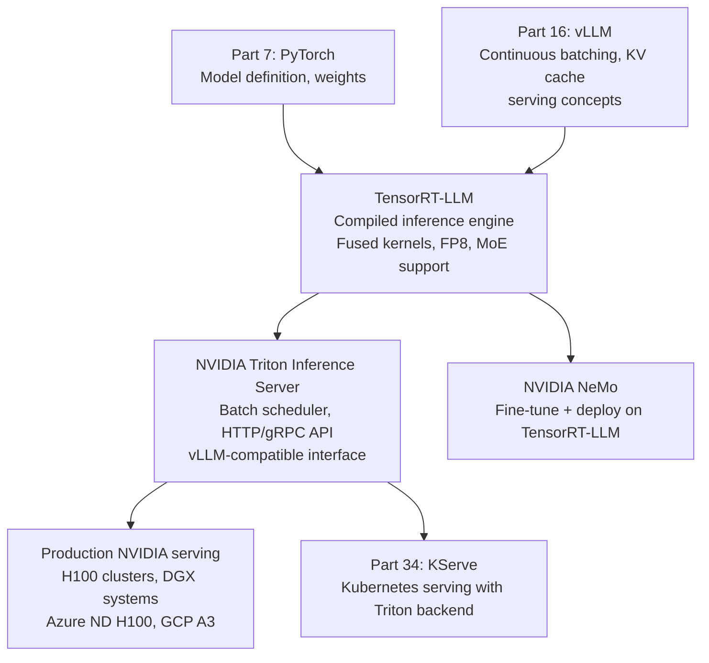
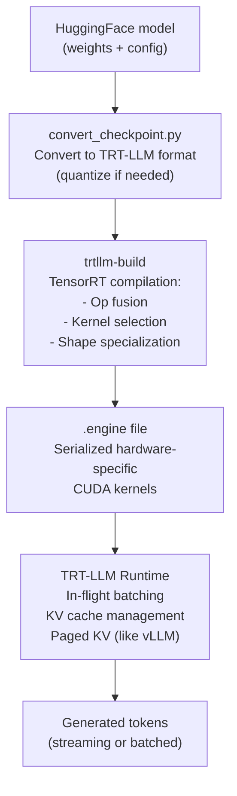

<!-- TEACHING_ORDER: verified -->
# Part 17: TensorRT-LLM

> **Prerequisites:** Part 16 (vLLM — general LLM serving), Part 7 (PyTorch), NVIDIA GPU basics
> **Used later in:** NVIDIA Triton Inference Server, KServe NVIDIA backend (Part 34)
> **Version anchor:** TensorRT-LLM 0.14.x (mid-2026), FP8 and MoE support stable

---

## Why This Library Exists

### The problem: even with PagedAttention, GPU compute is still underutilized

vLLM and HuggingFace TGI solve the memory and batching problems. But the GPU kernels themselves — the actual matrix multiplications, softmax operations, and layer normalization — are running through PyTorch's generic CUDA implementations. These are fast, but they are not optimal for the specific shapes, data types, and operation sequences used in LLM inference.

NVIDIA's TensorRT has been the production standard for neural network inference since 2016. It takes a trained model and compiles it to a hardware-specific inference engine: it fuses adjacent operations (e.g., linear + bias + activation into one kernel), selects the fastest implementation for each specific matrix shape, and uses precision optimization (FP8, INT8) to maximize throughput.

**TensorRT-LLM** (released November 2023) brings TensorRT compilation to large language models, adding LLM-specific optimizations on top:
- In-flight batching (equivalent to continuous batching)
- KV cache management (like PagedAttention)
- Tensor parallelism for multi-GPU inference
- FP8 and INT4 quantization with minimal accuracy loss
- Speculative decoding, LoRA serving, chunked prefill

**Benchmarks:** On NVIDIA A100/H100, TensorRT-LLM achieves 1.5–3× higher throughput than vLLM for large batch inference, and significantly lower first-token latency due to compiled kernel optimizations.

---

## Explain Like I Am 10

Imagine you have a recipe for making cookies. A regular cook (PyTorch/vLLM) follows each step one at a time: "Mix flour. Now add sugar. Now add eggs." Each step uses the same general mixing bowl (GPU).

TensorRT-LLM is like a specialized cookie factory that studies your exact recipe, then rebuilds the entire kitchen specifically for this one recipe. Instead of separate steps, it combines "mix flour + add sugar" into one optimized machine. It also knows exactly what size batches to prepare and which oven temperature is fastest for this exact cookie.

The factory takes longer to set up (compilation step), but once it is running, it makes cookies 2–3× faster than the regular cook on the same kitchen equipment.

---

## Mental Model

**TensorRT-LLM compiles a transformer model into a hardware-optimized inference engine: operations are fused, shapes are specialized, and kernels are selected at compilation time to maximize throughput on specific NVIDIA hardware.**

```
Workflow:
  1. Model definition (Python API)
     ↓
  2. TensorRT-LLM compilation (build_and_run.py or Python API)
     - Fuse operations (QKV projection → attention → output projection = 1 kernel)
     - Select FP8/INT8 kernels for specific matrix shapes
     - Optimize memory layout for hardware
     ↓
  3. Serialized engine (.engine file) — hardware-specific binary
     ↓
  4. Inference with trtllm-serve or Triton Inference Server
     - In-flight batching (like continuous batching)
     - KV cache management
     - Streaming output
```

---

## Learning Dependency Graph



---

## Core Concepts

### 1. Why compilation matters: kernel fusion

Consider one transformer layer's forward pass:
```
Input → LayerNorm → QKV Projection → Scaled Dot-Product Attention → Output Projection → LayerNorm → MLP → Output
```

In PyTorch: each operation launches a separate CUDA kernel. Between kernels, data is written to and read from GPU memory (HBM). For a 7B model on H100, memory bandwidth (3.35 TB/s on H100) — not compute — is the bottleneck for LLM inference.

TensorRT-LLM fuses sequential operations into single kernels:
- QKV projection + rotary embedding + attention + output projection → 1 fused kernel
- LayerNorm + residual add → 1 kernel
- SwiGLU activation (gate_proj + up_proj + activation) → 1 kernel

Fewer kernel launches + less memory traffic = faster inference. For batch size 1 (latency-critical), this dominates: TRT-LLM achieves 2–3× lower TTFT than vLLM on H100.

### 2. FP8 quantization

NVIDIA H100 and newer GPUs have native FP8 hardware support. TensorRT-LLM uses FP8 (8-bit floating point) for weight matrices and activations in the computation path:

```
FP8 weight memory: 1 byte/param vs 2 bytes (bf16)
FP8 computation: uses H100's FP8 Tensor Cores — 2× more FLOPS than FP16

Accuracy impact: < 1% degradation on most benchmarks
Memory reduction: ~50% vs bf16
Throughput increase: 1.5–2× vs bf16 on H100
```

### 3. Building a TensorRT-LLM engine

```bash
# Step 1: Convert HuggingFace model to TensorRT-LLM checkpoint
python convert_checkpoint.py \
    --model_dir ./llama-3.2-1b \
    --output_dir ./trtllm_ckpt \
    --dtype float16

# Step 2: Build the engine (compilation — takes minutes)
trtllm-build \
    --checkpoint_dir ./trtllm_ckpt \
    --output_dir ./engine \
    --gemm_plugin float16 \
    --max_batch_size 32 \
    --max_input_len 2048 \
    --max_seq_len 4096
```

The `.engine` file is hardware-specific — compiled for a specific GPU model (e.g., A100 SXM4). Cannot run on different GPU architectures.

### 4. Python inference API

```python
import tensorrt_llm
from tensorrt_llm.runtime import ModelRunner, SamplingConfig

runner = ModelRunner.from_dir(
    engine_dir="./engine",
    rank=tensorrt_llm.mpi_rank(),
)

input_ids = tokenizer(
    ["Explain attention mechanisms:", "Write a Python function:"],
    return_tensors="pt",
    padding=True,
)["input_ids"]

sampling_config = SamplingConfig(
    end_id=tokenizer.eos_token_id,
    pad_id=tokenizer.pad_token_id,
    max_new_tokens=200,
    temperature=0.8,
    top_p=0.95,
)

outputs = runner.generate(input_ids, sampling_config=sampling_config)
for output in outputs:
    print(tokenizer.decode(output[input_ids.shape[1]:], skip_special_tokens=True))
```

### 5. `trtllm-serve`: OpenAI-compatible server

```bash
# Simple serving with OpenAI-compatible API
trtllm-serve \
    ./engine \
    --model_name llama-3.2-1b \
    --port 8000

# Access via OpenAI client (same as vLLM)
from openai import OpenAI
client = OpenAI(base_url="http://localhost:8000/v1", api_key="none")
```

---

## Internal Architecture



---

## Essential APIs

```bash
# Install (NVIDIA wheel — requires matching CUDA version)
pip install tensorrt-llm==0.14.0

# Build
python convert_checkpoint.py --model_dir HF_MODEL --output_dir CKPT --dtype float16
trtllm-build --checkpoint_dir CKPT --output_dir ENGINE \
  --gemm_plugin float16 --max_batch_size 64 --max_seq_len 4096

# Serve
trtllm-serve ENGINE --model_name NAME --port 8000

# Multi-GPU tensor parallelism
trtllm-build ... --tp_size 4
mpirun -n 4 trtllm-serve ENGINE --tp_size 4
```

```python
from tensorrt_llm.runtime import ModelRunner, SamplingConfig

runner = ModelRunner.from_dir(engine_dir="./engine", rank=0)
sampling = SamplingConfig(end_id=2, max_new_tokens=200, temperature=0.8)
outputs  = runner.generate(input_ids, sampling_config=sampling)
```

---

## API Learning Roadmap

**Beginner:** `convert_checkpoint.py`, `trtllm-build` for small models, `trtllm-serve`, basic inference

**Intermediate:** FP8 quantization build flags, tensor parallelism build/run, `SamplingConfig` parameters

**Advanced:** Custom plugin development, INT4 AWQ quantization, chunked prefill, speculative decoding config

**Production:** NVIDIA Triton Inference Server integration, multi-model serving, Kubernetes deployment on DGX pods

---

## Beginner Examples

### Example 1: FP8 build for maximum H100 throughput

```python
# build_fp8.sh (shell script — TRT-LLM compilation)
build_script = """
# Convert with FP8 calibration
python quantization/quantize.py \\
    --model_dir ./llama-3.1-70b \\
    --dtype float16 \\
    --qformat fp8 \\
    --kv_cache_dtype fp8 \\
    --calib_size 512 \\
    --output_dir ./llama-70b-fp8-ckpt

# Build FP8 engine
trtllm-build \\
    --checkpoint_dir ./llama-70b-fp8-ckpt \\
    --output_dir ./engine-fp8 \\
    --gemm_plugin fp8 \\
    --tp_size 4 \\
    --max_batch_size 64 \\
    --max_input_len 4096 \\
    --max_seq_len 8192 \\
    --use_paged_context_fmha enable
"""
print(build_script)
print("FP8 on H100: ~2× throughput vs FP16, <1% accuracy loss")
print("Engine size: ~37GB vs ~140GB (BF16) for 70B model")
```

---

## Internal Interview Knowledge

**Q: When should you choose TensorRT-LLM over vLLM?**
Strong answer: "TensorRT-LLM when: (1) maximum throughput on NVIDIA hardware is critical — TRT-LLM's compiled kernels achieve 1.5–3× higher throughput than vLLM at large batches. (2) Lowest first-token latency matters — fused kernels reduce memory bandwidth bottlenecks. (3) You are on H100s using FP8 — TRT-LLM has native FP8 Tensor Core support. (4) Integration with NVIDIA Triton Inference Server or NeMo. vLLM when: (1) model portability — runs on any GPU without recompilation. (2) Quick iteration — no compilation step. (3) Dynamic LoRA swapping at scale. (4) Non-NVIDIA hardware."

**Q: What is the compilation step in TensorRT-LLM and why does it take so long?**
Strong answer: "The compilation step runs TensorRT's optimization suite: (1) It profilers candidate kernel implementations for each operation at the specified input shapes (batch size, sequence length) — selecting the fastest CUDA kernel for each combination. (2) Fuses adjacent operations into single CUDA kernels to reduce memory bandwidth. (3) Performs precision calibration for INT8/FP8 quantization if requested. (4) Generates hardware-specific machine code for the target GPU architecture. This process can take 30–60 minutes for a 70B model because it evaluates hundreds of kernel candidates per layer. The resulting engine is specific to both the model and the GPU architecture."

---

## Production AI Usage

**NVIDIA (NIM Microservices):** NVIDIA's AI Inference Microservices (NIM) ship pre-compiled TensorRT-LLM engines for popular models (LLaMA, Mistral, Falcon) on specific GPU SKUs. Enterprise customers deploy NIM containers for guaranteed-performance LLM inference.

**Microsoft Azure (ND H100 clusters):** Azure's LLM serving on H100 DGX systems uses TensorRT-LLM for maximum GPU utilization. The Azure OpenAI service backend uses TRT-LLM-class optimizations.

**Oracle Cloud (OCI):** Oracle's GPU infrastructure recommends TensorRT-LLM for production LLM serving on A100 and H100 clusters.

**Gaming and real-time AI (NVIDIA RTX):** For interactive AI applications (e.g., NVIDIA's RTX AI PCs), TensorRT-LLM with INT4 quantization enables running 7–13B models on consumer GPUs at acceptable latency.

---

## Common Mistakes

**Mistake 1: Running engine on wrong GPU architecture**
```bash
# Bug: compile on A100, try to run on H100 → error or degraded performance
trtllm-build ... --output_dir ./engine_a100
# Deploy to H100 cluster → incompatible CUDA kernel format

# Fix: compile on the target hardware, or use --strongly_typed=false for portability
# Best practice: build separate engines per GPU SKU
```

**Mistake 2: `max_batch_size` too low in build command**
```bash
# Bug: build with max_batch_size=8, try to serve batch=32 → error
trtllm-build ... --max_batch_size 8

# Fix: build with the max batch you will ever serve
# Higher max_batch_size slightly increases engine memory but doesn't hurt small batch performance
trtllm-build ... --max_batch_size 64
```

---

## Library Relationships

### TensorRT-LLM vs vLLM in 2026

| Metric | TensorRT-LLM | vLLM |
|---|---|---|
| Throughput (large batch) | +50–200% | Baseline |
| TTFT (small batch) | +30–100% faster | Baseline |
| Setup complexity | High (compilation) | Low (pip install) |
| Hardware portability | NVIDIA only | Any CUDA GPU |
| LoRA serving | Limited | Native multi-adapter |
| Iteration speed | Slow (must recompile) | Fast |
| FP8 support | Native | Via quantization |

---

## Cheat Sheet

```bash
# Install
pip install tensorrt-llm

# 1. Convert
python convert_checkpoint.py --model_dir HF_MODEL --output_dir CKPT --dtype float16

# 2. Build (FP8 for H100)
trtllm-build \
  --checkpoint_dir CKPT --output_dir ENGINE \
  --gemm_plugin fp8 --tp_size 4 \
  --max_batch_size 64 --max_seq_len 4096

# 3. Serve
trtllm-serve ENGINE --model_name NAME --port 8000

# 4. Query (OpenAI-compatible)
curl http://localhost:8000/v1/chat/completions -H "Content-Type: application/json" \
  -d '{"model":"NAME","messages":[{"role":"user","content":"Hello"}]}'
```

---

## Interview Question Bank

### Top 25 Beginner

**Q1: What is TensorRT and how does TensorRT-LLM extend it?** A: TensorRT is NVIDIA's general-purpose inference optimizer for deep learning models — it takes a trained PyTorch/ONNX model and compiles it to a hardware-specific binary with fused operations, optimized kernels, and precision reduction. TensorRT-LLM extends TensorRT for autoregressive LLMs specifically, adding: KV cache management (paged like vLLM), in-flight batching (continuous batching), tensor parallelism, and LLM-specific kernel fusions (fused QKV projection, GeLU, RoPE).

**Q2: Why does TensorRT-LLM require a compilation step while vLLM does not?** A: TensorRT-LLM generates hardware-specific CUDA machine code tailored to exact operation shapes, data types, and the target GPU's compute capabilities. This requires profiling hundreds of kernel candidates per layer (time-consuming) but produces an engine that can't be used on different GPU models. vLLM uses PyTorch's just-in-time kernel selection — slower per-kernel but portable. The compilation tradeoff is: minutes of setup time for 1.5–3× runtime performance.

**Q3: What is FP8 and why does TensorRT-LLM prioritize it?** A: FP8 is an 8-bit floating-point format supported natively by NVIDIA H100 and later GPUs via Transformer Engine. Using FP8 for weight storage halves memory vs FP16 (1 byte vs 2), and H100's FP8 Tensor Cores deliver 2× more FLOPS than FP16 Tensor Cores. TensorRT-LLM uses FP8 with careful calibration (measuring per-layer activation ranges on a small dataset) to minimize accuracy loss. Benchmarks show <0.5% accuracy degradation on most tasks with 1.5–2× throughput improvement.

**Q4: How does TensorRT-LLM handle multi-GPU tensor parallelism?** A: Set `--tp_size N` at build time. The engine is built with Megatron-style column/row parallel linear layers. At inference, launch N processes with `mpirun -n N trtllm-serve ...`. Each process manages its GPU's parameter shard and KV cache shard. AllReduce NCCL operations are compiled into the engine at the synchronization points (after attention and FFN outputs). For serving, tensor parallelism is typically limited to within an NVLink node for latency reasons.

**Q5: When is TensorRT-LLM worth the setup complexity?** A: Worth it when: (1) You have stable, infrequently-changing models — compiling once gets you months of optimized serving. (2) You are on H100s — FP8 support and compiled kernels give 2× throughput improvement. (3) Throughput and latency requirements exceed what vLLM can provide at your batch sizes. (4) You are integrating with NVIDIA Triton or NeMo ecosystem. Not worth it when: rapid model iteration (every experiment requires recompilation), diverse GPU fleet (need to maintain multiple engines), or when vLLM throughput already meets your SLA.

**Q6: What is the `trtllm-build` command used for?** A: `trtllm-build` takes a checkpoint directory (in TensorRT-LLM format), a model type, and build flags (precision, TP/PP size, max batch size, max input/output lengths) and produces a compiled engine directory. You run it once per GPU type + configuration combination. The output is CUDA binary code that the runtime loads directly — no Python overhead at serving time.

**Q7: What are the three main data types TensorRT-LLM supports?** A: FP32 (reference, rarely used), FP16/BF16 (default, good accuracy–speed balance), and FP8/INT8 (quantized, best throughput on modern GPUs). INT4 is also supported for weight-only quantization (AWQ, GPTQ) where weights are stored as INT4 but computations happen in FP16. The `--dtype` flag at build time sets the weight dtype; activation quantization is controlled separately.

**Q8: What is in-flight batching in TensorRT-LLM?** A: Also called continuous batching — new requests are added to the running batch as soon as a slot is free (when one sequence finishes a step), rather than waiting for the entire batch to complete. TensorRT-LLM's runtime scheduler manages the batch dynamically. This dramatically improves GPU utilization for variable-length generation requests typical in production chatbot workloads.

**Q9: How do you convert a HuggingFace model to TensorRT-LLM format?** A: Use the model-specific conversion script in the TensorRT-LLM examples: `python convert_checkpoint.py --model_dir hf_model/ --output_dir trt_ckpt/ --dtype float16`. The script reads HuggingFace weights, applies any required restructuring (splitting attention heads for TP), and writes the checkpoint in TensorRT-LLM's internal format. Then run `trtllm-build` on the converted checkpoint.

**Q10: What is the TensorRT-LLM Python API versus the C++ runtime?** A: The Python API (`tensorrt_llm.runtime`) wraps the C++ runtime for convenient use from Python. The C++ runtime (`trtllm::executor::Executor`) is used directly in production services written in C++ (e.g., NVIDIA Triton backend) for lower latency. Both use the same compiled engine files — the difference is the orchestration layer, not the actual model computation.

**Q11: What is a KV cache in the context of TensorRT-LLM?** A: The KV cache stores previously computed key-value pairs for each transformer attention layer so they are not recomputed on every token generation step. For a sequence of length N, the KV cache grows by one K-V pair per layer per step. TensorRT-LLM manages a paged KV cache (like vLLM) to efficiently allocate GPU memory across multiple concurrent sequences without over-allocating.

**Q12: What is AWQ and how does it improve TensorRT-LLM performance?** A: Activation-Aware Weight Quantization (AWQ) is a method that quantizes weights to INT4 by preserving the most important weights (those multiplied by large activations) in higher precision. Unlike naive round-to-nearest INT4, AWQ maintains accuracy comparable to FP16 with 2× memory reduction. TensorRT-LLM supports AWQ through NVIDIA ModelOpt and can compile AWQ-quantized weights into efficient INT4-GEMM kernels.

**Q13: How does pipeline parallelism work in TensorRT-LLM?** A: `--pp_size N` splits the transformer layers across N GPUs in sequence — GPU 0 runs layers 0–11, GPU 1 runs layers 12–23, etc. Each micro-batch flows through the pipeline stage by stage. Pipeline parallelism introduces pipeline bubbles (idle time at start/end of each batch) but allows deployment of models that don't fit with tensor parallelism alone. Combined TP+PP is common for very large models.

**Q14: What are LoRA adapters in TensorRT-LLM?** A: TensorRT-LLM supports runtime LoRA: a single compiled base model engine can serve multiple LoRA adapters without recompilation. Load the base engine once, then at request time pass `lora_task_id` to select which adapter weights to apply. This is critical for multi-tenant serving where thousands of customers each have a fine-tuned adapter of the same base model — one engine serves all adapters efficiently.

**Q15: What is speculative decoding and does TensorRT-LLM support it?** A: Speculative decoding uses a small "draft" model to propose K tokens at once, then verifies them with the large "target" model in a single forward pass. If all K tokens are accepted, you generate K tokens with one large model forward pass instead of K. TensorRT-LLM supports speculative decoding (draft-target mode) and can achieve 2–3× speedup for tasks where draft acceptance rates are high (e.g., code completion, constrained text generation).

**Q16: What is chunked context prefill?** A: For long-context requests (tens of thousands of tokens), prefilling the entire prompt in one step consumes too much memory and blocks other requests. Chunked context prefill splits the prompt into chunks (e.g., 2,048 tokens each) processed iteratively. This lets the scheduler interleave prefill chunks with decode steps from other requests, improving GPU utilization and reducing tail latency for long-context workloads.

**Q17: How do you profile TensorRT-LLM performance?** A: Use the built-in `benchmark.py` script which runs warmup iterations then measures throughput (tokens/second) and latency (ms/token) across a range of batch sizes and sequence lengths. For per-layer profiling, use NSight Systems (`nsys profile trtllm-serve ...`) to see GPU timeline with kernel names. The key metrics: Time-to-First-Token (TTFT, prefill latency) and Tokens-Per-Second (TPS, decode throughput).

**Q18: What is the NVIDIA Triton Inference Server integration?** A: NVIDIA Triton is a production inference serving system. TensorRT-LLM provides a Triton backend (`triton_backend`) that exposes compiled TRT-LLM engines as Triton models. This gives you: HTTP/gRPC endpoints with OpenAI-compatible API via `openai_frontend`, ensemble models (preprocessing + LLM + postprocessing), model versioning, health checks, and Prometheus metrics — essentially TensorRT-LLM as a production service.

**Q19: What is the relationship between TensorRT-LLM and NeMo?** A: NVIDIA NeMo is a framework for training large language models. NeMo trains models, then exports to TensorRT-LLM format for serving. The NeMo → TensorRT-LLM pipeline is NVIDIA's recommended production path: train with NeMo (Megatron-style), evaluate, then export for inference with TensorRT-LLM. NeMo provides scripts to export directly: `nemo_export` creates TRT-LLM compatible checkpoints.

**Q20: What is the max_batch_size parameter and how to set it?** A: `--max_batch_size` at build time sets the maximum number of concurrent sequences the engine can handle. Set it based on: GPU memory (each sequence needs its KV cache allocation), target throughput, and max acceptable latency. Larger batch sizes improve throughput but require more memory and increase per-request latency. Use `benchmark.py` to find the knee of the throughput-latency curve for your specific GPU and model.

**Q21: How does TensorRT-LLM handle rotary position embeddings (RoPE)?** A: RoPE encoding is compiled directly into the attention kernel — the sinusoidal frequency table is precomputed and fused into the QK-dot-product kernel. For extended context lengths beyond the trained max (e.g., 4K→32K), TensorRT-LLM supports RoPE scaling techniques: linear position interpolation or YaRN. Set `--rotary_scaling_type` and `--rotary_scaling_factor` at build time.

**Q22: What is greedy decoding versus sampling in TensorRT-LLM?** A: Greedy decoding always picks the highest-probability token — deterministic, fastest. Sampling picks from the probability distribution using temperature, top-k (only sample from top k tokens), or top-p (nucleus sampling: sample from smallest set of tokens that covers probability mass p). TensorRT-LLM compiles sampling into the decode kernel. Temperature=0 is equivalent to greedy. Production systems often use temperature=0.1–0.3 for near-greedy behavior with slight variety.

**Q23: What is beam search and what are its memory costs?** A: Beam search maintains B candidate sequences (beams) simultaneously, expanding the most likely partial sequences to find the globally highest-probability complete sequence. Memory cost is O(B × max_length × num_layers × d_kv) — B× the memory of greedy. TensorRT-LLM supports beam search but it's rarely used for chat/instruction models (greedy or sampling preferred). Beam search is used in translation tasks where deterministic high-quality output is needed.

**Q24: How do you monitor a TensorRT-LLM deployment in production?** A: Key metrics to monitor: Time-To-First-Token (p50/p99 latency), Tokens-Per-Second (throughput), KV cache utilization (alert at >90% to prevent OOM), queue depth (pending requests), GPU memory usage, and GPU utilization. Expose via Triton's Prometheus endpoint. Alert on: TTFT > SLA, KV cache full (causes request rejection), GPU memory OOM errors, and decode throughput degradation (hardware issues).

**Q25: What models does TensorRT-LLM support out of the box?** A: TensorRT-LLM has pre-built examples and conversion scripts for: LLaMA/LLaMA-2/LLaMA-3, Mistral, Mixtral (MoE), GPT-2/GPT-J, Falcon, ChatGLM, Baichuan, Qwen, Phi, Gemma, Mamba, WhisperSTT, and more. The `examples/` directory has per-model conversion and build scripts. Models not in the list require implementing custom TRT-LLM layer definitions, which is advanced work requiring knowledge of the C++ plugin API.

### Top 25 Intermediate

**Q26: Explain the TensorRT-LLM plugin system.** A: TensorRT-LLM implements LLM-specific operations as TensorRT plugins — C++ classes that implement the `IPluginV2` interface and run custom CUDA kernels. Plugins are compiled into shared libraries loaded at engine build time. Examples: `GPTAttentionPlugin` (fused multi-head attention with KV cache), `WeightOnlyQuantMatmul` (INT4/INT8 weight-only GEMM), `LoraPlugin` (efficient LoRA application). The plugin system allows TRT-LLM to optimize operations that TensorRT's general optimizer doesn't handle.

**Q27: What is MMHA (Masked Multi-Head Attention) fused kernel and why is it important?** A: The standard attention implementation applies QKV projection, reshape, scaled dot-product attention, and output projection as separate kernels — each requiring a full round trip to GPU HBM. TRT-LLM's fused MMHA plugin performs all of this in one kernel: QKV projection, rotary embedding application, KV cache write, attention computation with previous KV tokens, output projection — one pass through memory. This is the single most important kernel for decode throughput.

**Q28: How does TensorRT-LLM's executor API enable production request scheduling?** A: `trtllm::executor::Executor` exposes an async request/response API: `enqueueRequest(request)` submits a request and returns a request ID; `awaitResponses(timeout)` returns completed responses. The executor runs a background scheduler thread that implements in-flight batching. This API enables the C++ serving layer to pipeline request submission and response collection without blocking, critical for high-QPS production deployments.

**Q29: What is INT8 SmoothQuant and how does it differ from weight-only INT8?** A: Weight-only INT8 quantizes only weights to INT8 but keeps activations in FP16 — matrix multiplications use INT8 weights with FP16 dequantized compute, saving memory bandwidth without requiring calibration data. SmoothQuant quantizes both weights AND activations to INT8, enabling INT8-INT8 GEMM which uses Tensor Core INT8 operations. SmoothQuant requires calibration data to set per-channel activation scales and applies a "smoothing" factor that balances quantization difficulty between weights and activations.

**Q30: Explain the max_num_tokens parameter vs max_batch_size.** A: `max_batch_size` limits the number of concurrent sequences. `max_num_tokens` limits the total number of tokens processed per iteration (across all sequences). A batch of 32 sequences at 512 tokens each = 16,384 total tokens. Setting `max_num_tokens` prevents GPU OOM when sequences vary in length — even if `max_batch_size=64`, the scheduler won't schedule 64 long sequences if that exceeds `max_num_tokens`. Set `max_num_tokens` to the maximum your GPU memory can handle.

**Q31: How does TensorRT-LLM build an engine for a mixture-of-experts model (Mixtral)?** A: MoE models have routing logic (each token goes to K of E experts) that changes per-input — variable compute graph. TRT-LLM handles this with an expert-parallel execution pattern: all E experts' weights are stored; the router selects K; only K expert FFNs execute. With TP enabled, experts are sharded across GPUs. The build step handles MoE by compiling all expert weight blocks and the routing mechanism into a single plugin that handles the dynamic dispatch.

**Q32: What is the difference between medusa and speculative decoding in TRT-LLM?** A: Both accelerate generation by predicting multiple tokens per step. Speculative decoding uses an entirely separate smaller draft model to propose tokens. Medusa adds multiple "medusa heads" on top of the main model's final hidden state — each head predicts tokens at offset +1, +2, +3, etc., trained jointly with the main model. Medusa is simpler to deploy (one model) but the additional heads add memory overhead. TRT-LLM supports both via the `speculative_decoding_mode` build flag.

**Q33: How does TensorRT-LLM handle variable sequence lengths in a batch?** A: TRT-LLM pads sequences in a batch to the same length within a micro-batch, but uses masking so padding tokens don't contribute to attention. For prefill, chunked context allows different-length prompts. For decode, all sequences in a step are at their current generation position (which varies). The paged KV cache handles variable-length histories efficiently. The scheduler bins similar-length sequences together to minimize padding waste.

**Q34: What is draft-target speculative decoding latency model?** A: For a draft model generating K tokens accepted with probability p per token: expected tokens per target model call = (1 - p^(K+1)) / (1-p). If acceptance rate p=0.9 and K=5, expected accepted tokens ≈ 4.7 vs 5 max. Effective speedup = (expected accepted tokens) / (cost of one draft model forward pass × K + one target model forward pass) / (cost of one target model forward pass). Speedup is positive only when draft model is sufficiently faster than the target model (typically 3-10× smaller).

**Q35: How does TRT-LLM's paged KV cache work?** A: GPU memory is divided into fixed-size pages (e.g., 16 tokens per page). Each sequence is assigned pages on-demand as it generates tokens. When a sequence finishes, its pages are returned to the pool. This eliminates the need to pre-allocate the maximum possible KV cache per sequence (which wastes memory for short sequences). A page table maps logical token positions to physical page offsets. The MMHA attention kernel uses the page table to gather KV data from non-contiguous memory locations.

**Q36: What happens when the KV cache is full?** A: When no more pages are available and a new request arrives (or an existing sequence needs to generate more tokens), the scheduler must either: (1) reject the new request (return 503), (2) pause lower-priority sequences and evict their KV cache pages (expensive — must re-prefill to resume), or (3) use prefix caching to share KV cache for common prefixes (system prompt). Production deployments monitor KV cache utilization and pre-emptively reject requests at 90% to prevent cascading OOM.

**Q37: What is TRT-LLM's build cache and why is it important?** A: TensorRT-LLM caches the result of the time-consuming kernel tactic selection step. If you rebuild an engine with the same model weights and configuration, TRT-LLM reads from the cache instead of re-timing thousands of kernel candidates. Location: `~/.cache/tensorrt_llm/`. This reduces rebuild time from 30+ minutes to 2–5 minutes for subsequent builds. Important in CI/CD pipelines where engines are rebuilt after model updates.

**Q38: How do you implement streaming output with TensorRT-LLM?** A: Use the streaming response mode: set `request.setStreaming(true)` in the executor API. As each token is generated, the executor returns a partial response containing the new token. In Python, use `executor.await_responses(timeout=0)` in a polling loop. The NVIDIA Triton backend implements HTTP streaming using server-sent events (SSE) on top of this mechanism.

**Q39: What is the difference between build-time and runtime quantization calibration?** A: Build-time calibration (required for FP8/INT8 activation quantization): run inference on a small representative dataset before compiling, collect per-layer activation statistics, compute quantization scales, bake scales into the compiled engine. Runtime calibration is not needed for TRT-LLM — scales are fixed. This is different from dynamic quantization where scales are computed on-the-fly. Build-time calibration with ~512 samples typically captures sufficient statistics.

**Q40: How does TRT-LLM support function calling / structured output?** A: TRT-LLM itself doesn't implement structured output parsing — that happens in the serving layer (Triton frontend or application code). The LLM generates text that follows JSON schema if trained to do so (instruction-following). Some deployments use constrained decoding (logit masking to force valid JSON tokens) implemented in a Triton pre/post-processing model. TRT-LLM's constrained decoding support is under active development.

**Q41: What is the `max_input_len` parameter and how does it affect memory?** A: `--max_input_len` at build time sets the maximum prompt length the engine accepts. Affects memory via: KV cache pre-allocation for prefill, temporary tensors for attention computation. Setting it too low rejects long prompts; too high wastes memory. For a model that serves both short and long contexts, set `max_input_len` to the 99th percentile input length in your traffic. Runtime KV cache grows with `max_input_len + max_output_len`.

**Q42: What is the TRT-LLM `GptManager` and is it still used?** A: `GptManager` was TRT-LLM's original C++ serving API — a higher-level wrapper around the C++ runtime that managed batching, scheduling, and callbacks. It has been superseded by the `Executor` API in recent versions (0.10+). The Executor provides cleaner async semantics, better scheduling policies, and is the recommended path for new deployments. GptManager is maintained for backward compatibility but new features are added to Executor.

**Q43: How does TRT-LLM handle multi-modal models (e.g., LLaVA)?** A: Multi-modal models have a vision encoder component (CLIP/ViT) plus the LLM decoder. TRT-LLM compiles the LLM component with standard tools; the vision encoder is compiled separately (as a standard TensorRT engine or using PyTorch). At inference, run vision encoder on the image to get embeddings, inject into the LLM at the appropriate input positions (image tokens), then run generation normally. The serving pipeline chains vision encoder + LLM engine.

**Q44: What does `--remove_input_padding` do?** A: By default, input sequences in a batch are padded to the same length. With `--remove_input_padding`, TRT-LLM packs all input tokens from all sequences contiguously, using position tracking to know which token belongs to which sequence. This eliminates wasted compute on padding tokens, especially important for heterogeneous batch sizes. The attention kernel must handle the non-uniform sequence boundaries — requires MMHA plugin support.

**Q45: Explain TRT-LLM's context FMHA (Flash Multi-Head Attention).** A: During the prefill (context) phase, TRT-LLM uses Flash Attention-style computation: the attention matrix is computed in tiles that fit in SRAM, never materializing the full N×N matrix. This reduces memory from O(N²) to O(N) and is faster for long contexts due to fewer HBM accesses. `--context_fmha enable` at build time activates this. The decode phase (single new token) uses a different kernel since there is no N×N matrix to compute.

**Q46: How do you tune max_tokens_in_paged_kvcache?** A: This parameter controls total KV cache memory (total pages × page_size × layers × d_kv × 2 for K and V). Set it based on: (target_concurrent_sequences × average_sequence_length × KV_size_per_token). Use GPU memory after loading weights as the budget. Too small causes request rejection under load; too large leaves no room for activations and causes OOM. TRT-LLM logs KV cache capacity at startup — verify it matches expectations.

**Q47: What is prefix caching in TRT-LLM?** A: For requests with common prefixes (e.g., the same system prompt), prefix caching reuses the already-computed KV cache pages. If two requests have the same first 512 tokens, the KV cache for those tokens is computed once and shared. Requires content-based hash of token sequences to identify matching prefixes. Reduces TTFT for requests with long common prefixes (system prompts, few-shot examples). Must be enabled at build and runtime.

**Q48: How does TRT-LLM report errors and what's the recovery strategy?** A: TRT-LLM throws `trtllm::TllmException` (C++) or raises Python exceptions for operational errors. Categories: invalid request (reject with 400), out of memory during generation (cancel request, return partial), engine error (fatal — must restart process), NCCL communication error (fatal for multi-GPU). Production deployments wrap requests in try/except, return 500 for internal errors, and use health checks to restart unhealthy instances via Kubernetes.

**Q49: What is the difference between `trtllm-build` and `trtllm serve`?** A: `trtllm-build` is the offline compilation step that takes a model checkpoint and produces engine files (.engine, .json). `trtllm serve` (or the Triton backend) is the online serving step that loads the compiled engine and serves HTTP/gRPC requests. You run `trtllm-build` once per model update; `trtllm serve` runs continuously. In production, compilation is a CI/CD step and serving is a Kubernetes deployment.

**Q50: How does TRT-LLM's memory layout differ from PyTorch?** A: PyTorch keeps tensors in row-major (C-contiguous) layout in GPU HBM. TRT-LLM may use different layouts per layer: column-major for certain GEMM operations, interleaved K-V layouts for cache access patterns that match the MMHA kernel's access pattern, and permuted weight layouts for specific Tensor Core GEMM algorithms. These layout transformations happen during engine build time and are invisible to the user but are key to achieving peak kernel performance.

### Top 25 Advanced

**Q51: Walk through the complete request lifecycle in TRT-LLM's Executor API from submission to response.** A: (1) Client calls `executor.enqueueRequest(request)` → request assigned unique ID, added to pending queue. (2) Scheduler thread runs: checks pending queue, available KV cache pages, max_batch_size/max_num_tokens limits. Selects requests for current iteration, assigns KV cache pages. (3) Inference thread runs forward pass: prefill (for new requests' context tokens) + decode (for all active sequences). (4) Post-step: scheduler updates sequence states, collects completed tokens. (5) For streaming requests, partial responses are immediately available. For non-streaming, response returned when stop condition met (EOS token, max_output_len). (6) Client calls `executor.awaitResponses()` to retrieve results.

**Q52: How does TRT-LLM implement tensor parallelism at the CUDA kernel level?** A: Column-parallel linear layers split the weight matrix along columns: each GPU computes its column slice of the output (Y = X·W_col). No communication needed after this layer. Row-parallel linear layers split along rows: each GPU computes a partial sum (Y_partial = X_col·W_row). After row-parallel layers, `ncclAllReduce` sums partials across GPUs. TRT-LLM compiles NCCL AllReduce calls as TensorRT plugins that execute synchronously in the CUDA graph, enabling overlap between NCCL communication and subsequent compute.

**Q53: Explain how FP8 calibration works and what can go wrong.** A: Calibration runs a "calibration dataset" (typically 512 random samples) through the model in FP32/FP16, collecting activation histograms per tensor. From histograms, per-tensor quantization scales are computed (typically using max or percentile methods). The scales are saved and embedded in the engine at build time. Problems: (1) Distribution shift — calibration data not representative of production input causes scale underestimation → clipping → accuracy loss. (2) Outliers — single extreme activation sets scale too high for normal activations → precision loss for most inputs. (3) Per-tensor vs per-channel — per-channel scales are more accurate but harder to implement efficiently.

**Q54: How do you implement a custom attention variant (e.g., sliding window attention) in TRT-LLM?** A: Requires implementing a custom TRT plugin: (1) Create C++ class inheriting from `nvinfer1::IPluginV2DynamicExt`. (2) Implement `enqueue()` with your CUDA kernel. (3) Register the plugin with `REGISTER_TENSORRT_PLUGIN`. (4) Build TRT-LLM from source with your plugin in the plugin directory. (5) Modify the model's Python `attention.py` to use your custom plugin instead of `GPTAttentionPlugin`. This is complex work requiring CUDA programming expertise but enables novel architectures not yet in TRT-LLM.

**Q55: What is the impact of engine build flags on numerical precision and how do you validate?** A: `--dtype float16` vs `--dtype bfloat16`: BF16 has wider dynamic range (same exponent bits as FP32) but less mantissa precision — better for training, similar for inference. `--strongly_typed=true` forces TRT to not mix precisions. Validate with: (1) Run reference (FP32 or HF transformers) and TRT-LLM on the same inputs. (2) Compute token-level KL divergence of output distributions. (3) Run downstream task benchmarks (MMLU, HumanEval). Acceptable accuracy loss: <1% on task benchmarks, KL divergence < 0.1 bits.

**Q56: How does TRT-LLM implement efficient GeLU activation fusion?** A: GeLU (Gaussian Error Linear Unit) is expensive: σ(x) = x·Φ(x) where Φ is the CDF of the standard normal — involves an error function evaluation. TRT-LLM fuses GeLU with the preceding linear layer's output: instead of writing linear output to HBM then reading it for GeLU, the GeLU is applied in registers immediately after the GEMM, writing only the activated output to HBM. This saves two HBM round trips per FFN sublayer. For SwiGLU (used in LLaMA), the gate and activation are fused together.

**Q57: Explain the role of CUDA Graphs in TRT-LLM's decode performance.** A: Each decode step involves many CUDA kernel launches. Kernel launch overhead (CPU→GPU synchronization, stream scheduling) is ~5 microseconds per kernel — insignificant for large GEMM kernels but significant for many small kernels. CUDA Graphs capture the entire decode step's kernel launch sequence on the first execution, then replay the recorded graph on subsequent steps with a single `cudaGraphLaunch` call. This eliminates CPU launch overhead and enables scheduler-side optimizations. TRT-LLM uses CUDA Graphs in the decode phase; prefill uses regular kernel launches (shape changes each step).

**Q58: How does TRT-LLM achieve sub-millisecond decode latency?** A: Several co-optimizations: (1) Fused MMHA kernel eliminates HBM round trips for attention. (2) CUDA Graphs eliminate CPU kernel launch overhead. (3) FP8 halves memory bandwidth consumption per weight read. (4) Weight layout optimizations align data to Tensor Core access patterns. (5) Persistent kernels keep GPU threads alive between steps avoiding thread startup overhead. (6) KV cache page layout chosen to maximize cache line utilization during token-by-token decode. Together, these achieve <1ms per-token latency on H100 for 7B models at batch size 1.

**Q59: How does TRT-LLM's int4 AWQ quantization work at the kernel level?** A: AWQ weights are stored as INT4 (2 weights per byte). At compute time, the GEMM kernel dequantizes INT4 → FP16 weights within registers (not HBM), performs the FP16×FP16 matrix multiply, and accumulates. The dequantization is a 4-bit unpack + scale/zero-point application, consuming ~2 FLOPs per weight element. Net: 2× memory bandwidth reduction (4-bit vs 8-bit) at the cost of dequantization FLOPs. For bandwidth-bound decode kernels on large models, this is a net win. For compute-bound prefill kernels, INT4 may be slower than FP16 due to dequantization overhead.

**Q60: How would you architect a TRT-LLM deployment for a model update with zero downtime?** A: Strategy: (1) Deploy new engine version to a separate pool of GPU instances (blue-green deployment). (2) Run validation suite (accuracy, latency benchmarks) against new pool. (3) Gradually shift traffic (10% → 50% → 100%) using load balancer weights. (4) Monitor accuracy metrics (task benchmarks on live traffic shadow logs) and latency (TTFT, TPS) during cutover. (5) Keep old pool running for 24h to allow rollback if anomalies detected. Kubernetes facilitates this with Deployment rollouts and HPA for the new pool. Engine rebuild is the critical path: automate `trtllm-build` in CI triggered by model checkpoint uploads.

**Q61: What are the precision tradeoffs for KV cache quantization?** A: KV cache is stored in FP16 by default — 2 bytes per element × 2 (K+V) × num_layers × num_heads × head_dim × max_seq_len. At 128K tokens with LLaMA-3 70B, this is ~100GB just for KV. INT8 KV cache halves this to 50GB with ~0.3% accuracy loss. FP8 KV cache also halves with slightly better accuracy. The quantization applies per-token normalization to the K and V tensors before storage. Crucial for long-context deployments.

**Q62: How does chunked prefill interact with decode in continuous batching?** A: Without chunked prefill: long prompts monopolize the GPU for many steps, starving ongoing decode sequences (high tail latency). With chunked prefill: a long prompt's prefill is broken into K-token chunks. Between chunks, the scheduler can run a decode step for other sequences. This makes TTFT more predictable at the cost of slightly longer total prefill time for the long-prompt request. The chunk size (e.g., 512 tokens) is a tunable parameter balancing prefill throughput vs decode latency.

**Q63: How does CUDA Unified Memory interact with TRT-LLM?** A: TRT-LLM does not use Unified Memory (page-faulting between CPU and GPU RAM) for performance-critical tensors — everything is explicitly allocated in device HBM. Unified Memory would introduce unpredictable page fault latency. However, CUDA Unified Memory is useful for the KV cache if using CPU offloading (cold KV cache pages swapped to CPU DRAM for ultra-long contexts). TRT-LLM can be configured with a CPU KV cache tier, using `cudaMemcpyAsync` to prefetch pages back to GPU before they are needed.

**Q64: What is the TRT-LLM Weights-Free compilation mode?** A: In standard mode, weights are baked into the compiled engine binary — the engine is specific to those exact weights. Weights-Free mode compiles the graph structure and kernel selection without embedding weights, then loads weights at engine initialization time. This enables: (1) Smaller engine files (no weight copy). (2) Hot-swapping LoRA weights at runtime without recompilation. (3) Sharing one engine binary across weight variations. Trade-off: slight runtime overhead for weight loading; standard mode is marginally faster.

**Q65: Explain TRT-LLM's approach to beam search with diverse beam groups.** A: Standard beam search can converge to similar sequences. Diverse Beam Search partitions the B beams into G groups of B/G beams each, adding a diversity penalty between groups that penalizes selecting tokens already chosen by other groups. TRT-LLM implements this by modifying the sampling kernel: after computing softmax logits, subtract a penalty proportional to the previous groups' token selection frequencies. This produces more diverse candidate sequences at the cost of lower individual sequence probability.

**Q66: How does TRT-LLM handle tokenizer/detokenizer throughput?** A: Tokenization (text→token IDs) and detokenization (token IDs→text) are CPU operations. At high QPS, they can become bottlenecks. TRT-LLM's Triton frontend uses pre/post-processing models compiled as Python Triton backends with multiple workers. For character-level incremental detokenization (streaming), TRT-LLM uses `transformers.PreTrainedTokenizerFast` which runs in Rust and is ~5× faster than the pure-Python tokenizer. Keep tokenizer workers ≥ GPU count to prevent CPU-side bottlenecks.

**Q67: What is TRT-LLM's support for Mixture of Experts routing strategies?** A: Mixtral uses top-2 expert routing (each token activates 2 of 8 experts). Expert assignment is computed by a lightweight router (small linear + softmax). TRT-LLM's MoE plugin: (1) Computes routing probabilities. (2) Sorts tokens by their top-1 expert assignment. (3) Runs each expert's FFN on its assigned tokens using grouped GEMM. (4) Gathers results back to original token order with expert-weighting. Expert parallelism can be added: each GPU handles a subset of experts, with cross-GPU token routing via NCCL.

**Q68: How does one debug NaN/Inf outputs from a TRT-LLM engine?** A: Strategy: (1) Rebuild engine with `--debug_mode` which adds debug tensors for intermediate layer outputs. (2) Use `--dtype float32` to rule out precision overflow — if NaNs disappear, the issue is quantization overflow. (3) Binary search layer-by-layer: add debug output at layer N/2, N/4, etc. to find the first layer producing NaN. (4) Check calibration data validity — if FP8 scales are zero or infinity, quantized activations explode. (5) Verify model checkpoint integrity — NaN weights in the checkpoint propagate forward.

**Q69: What are the bottlenecks at different batch sizes for LLM inference?** A: At batch_size=1 (latency-optimized): memory-bandwidth bound. Time is dominated by loading weights from HBM. GPU is ~20% compute-utilization because the GEMM is too small for Tensor Cores to be fully utilized. At batch_size=32–64: transitioning — larger GEMMs become more compute-efficient. At batch_size=256+: compute-bound. GEMMs are large enough to saturate Tensor Cores; HBM bandwidth is no longer limiting factor. KV cache attention remains memory-bandwidth bound (attention over long sequences). TRT-LLM's kernel selection is tuned per batch size.

**Q70: How does TRT-LLM integrate with NVIDIA's NVLink for multi-GPU communication?** A: NVLink provides 900 GB/s bidirectional bandwidth (H100 SXM with NVLink 4.0) vs PCIe at 32 GB/s. TRT-LLM's NCCL AllReduce uses NVLink when available — the topology is autodetected by NCCL. For AllReduce on 8 H100s, NVLink reduces latency from ~500μs (PCIe) to ~50μs. TRT-LLM also supports NVLink Sharp (in-network computing) for AllReduce offload — the switch performs the reduction, freeing GPU cycles. Enable via `NCCL_COLLNET_ENABLE=1`.

**Q71: What is the `cuda_graph_padding_enabled` option?** A: CUDA Graphs require fixed tensor shapes. But sequence lengths in continuous batching vary per step. `cuda_graph_padding_enabled=true` pads input tensors to pre-defined shapes (set by `cuda_graph_batch_size_list`) so the same CUDA Graph can be reused across steps with different actual batch sizes. Padding wastes some compute but enables CUDA Graph speedup for variable workloads. Set `cuda_graph_batch_size_list` to cover your most common batch sizes (e.g., [1, 2, 4, 8, 16, 32]).

**Q72: How does TRT-LLM handle context parallelism for very long sequences?** A: Context parallelism (sequence parallelism) distributes tokens of a single long sequence across GPUs — GPU 0 processes tokens 0–4K, GPU 1 processes tokens 4K–8K, etc. This is separate from tensor parallelism (which splits the hidden dimension). For attention, each GPU computes attention over its local tokens but needs global KV for cross-sequence attention — requires ring-allreduce of KV between GPUs. TRT-LLM supports context parallelism via `--cp_size` flag, enabling 128K+ context lengths by distributing memory requirements.

**Q73: What are the GPU memory allocation zones in a TRT-LLM deployment?** A: Memory is divided into: (1) Model weights (~2 bytes × parameter count for FP16). (2) Activation workspace (peak activation memory during forward pass — proportional to batch_size × max_seq_len). (3) KV cache (remaining memory, allocated as pages). (4) CUDA memory overhead (kernel scratch space, cuBLAS workspace). Rule of thumb: weights take 60–70% on first GPU load; KV cache budget is total_GPU_memory - weights - activation_workspace - overhead (~10%).

**Q74: How does TRT-LLM's logit processing pipeline work for constrained decoding?** A: After the LLM produces logits over the vocabulary, TRT-LLM applies logit processors in sequence: (1) Temperature scaling (divide by T). (2) Top-k filtering (zero out all but top k logits). (3) Top-p filtering (zero out logits whose cumulative probability exceeds p). (4) Repetition penalty (reduce logits for already-generated tokens). (5) Custom logit processors (e.g., grammar-constrained decoding that zeros out tokens violating the grammar). Custom processors can be injected via the `logits_post_processor` API.

**Q75: What monitoring signals indicate a TRT-LLM deployment is under-provisioned?** A: Key signals: (1) KV cache utilization >90% consistently — insufficient GPU memory for traffic volume. (2) Queue depth > 0 for >1% of time — insufficient throughput. (3) TTFT p99 > 2× p50 — scheduler is occasionally stalling due to resource contention. (4) Decode TPS < expected for batch size — hardware underperformance or thermal throttling. (5) NCCL timeout errors — inter-GPU communication latency. (6) OOM errors in logs — peak memory spikes exceeding budget. Remediation: scale horizontally, increase `max_num_tokens` limits (if GPU memory headroom exists), or add GPU nodes.

### Top 25 Staff Engineer

**Q76: Design a zero-downtime engine rollout pipeline for a 70B LLaMA model on 8×H100 nodes serving 10K QPS.** A: Pipeline: (1) CI/CD trigger: model checkpoint upload to S3 triggers engine build job. (2) Build cluster: 2 dedicated A100 build nodes run parallel `trtllm-build` jobs (TP=8, FP8 with calibration). Build time ~45 min. (3) Validation: automated accuracy suite (MMLU, MT-Bench) + latency benchmarks must pass gates. (4) Blue-green staging: new engines deployed to 20% of serving fleet. Shadow traffic (mirror 5% of live requests to new fleet). (5) Canary: shift 10% live traffic, monitor error rate and TTFT p99 for 30 min. (6) Full cutover: shift remaining 90% over 15 min. (7) Rollback trigger: any 5-min window with error_rate>0.1% or TTFT_p99 > 2× baseline auto-triggers rollback. (8) Old fleet kept warm for 2h post-cutover.

**Q77: How would you architect TRT-LLM serving to handle 10K concurrent long-context (32K token) requests?** A: At 32K tokens, KV cache per sequence = 32K × num_layers × num_heads × head_dim × 2 (K+V) × 2 bytes ≈ 32K × 32 × 32 × 128 × 4 = 16GB per sequence for LLaMA-3 70B. 10K concurrent sequences = 160TB — infeasible on GPU. Architecture: (1) CPU offloading: keep "cold" KV pages in CPU DRAM (prefetch to GPU N steps ahead). (2) Sequence multiplexing: not all 10K are generating simultaneously — keep active batch size at 64–128 (fitting in GPU memory), queue the rest. (3) Prefix caching: most long-context requests share system prompt (shared KV pages). (4) KV cache compression: INT8 KV halves memory. (5) Multi-node deployment with CP (context parallelism) to distribute each long sequence across 4 GPUs.

**Q78: Explain the complete FP8 calibration workflow for a production model with domain shift concerns.** A: Domain-aware calibration: (1) Collect calibration samples from production query logs, stratified by use case (code, math, chat, documents). (2) Run calibration in FP16, collect per-layer activation histograms (min, max, percentiles) with 512–1024 samples. (3) Scale selection: use percentile-99.9 (not max) to avoid rare outlier outlier influence; apply per-channel scaling for Q/K/V projections (more sensitive). (4) Sensitivity analysis: for each layer, compare FP8 vs FP16 output distribution (KL divergence). Flag high-sensitivity layers for FP16 fallback. (5) Mixed precision: keep embedding layers, final LM head, and high-sensitivity layers in FP16; FP8 for the rest. (6) Validate on held-out task suite. (7) Rerun calibration when model is fine-tuned (distribution shifts). Production calibration pipeline runs automatically on checkpoint deployment.

**Q79: How would you debug a TRT-LLM deployment where accuracy is 2% below HuggingFace baseline?** A: Systematic approach: (1) Isolate: is degradation from quantization or kernel numerical issues? Rebuild with `--dtype float16 --strongly_typed` (no quantization) and retest. If degradation persists, it's a kernel bug. (2) If quantization: check calibration distribution coverage — is calibration data representative? Try percentile-based scales vs max scales. (3) Layer sensitivity: use debug output mode to compare layer outputs between HF and TRT-LLM. KL divergence per layer identifies diverging layers. (4) Check known precision issues: softmax overflow in FP16 for long sequences (attention scores become Inf) → apply `--strongly_typed` for attention layers. (5) RoPE precision: rotary embeddings can accumulate errors for long sequences — verify TRT-LLM's RoPE implementation matches HF exactly.

**Q80: Design a multi-tenant LLM serving system where 1,000 customers each have fine-tuned LoRA adapters.** A: Architecture: (1) Single compiled base model engine (LLaMA-3 70B, TP=8). (2) LoRA adapter store: adapters stored in object storage (S3), loaded into GPU memory on-demand (LRU cache of N hot adapters, N limited by GPU memory). (3) Request routing: each request carries `customer_id` → adapter_id lookup → route to TRT-LLM instance with that adapter cached (consistent hashing). (4) TRT-LLM LoRA API: `request.lora_task_id = adapter_id`. (5) Adapter preloading: predictive loading of adapters based on customer activity patterns (pre-warm before customer's business hours). (6) Cold adapter path: cache miss requires adapter loading from S3 + GPU memory allocation — add to TTFT. Mitigation: SLA tiers (premium customers get guaranteed adapter cache residence). (7) Memory arithmetic: 70B model = 140GB weights (FP16), KV cache budget per adapter minimal, adapter weights typically 1–4GB. 8×H100 (640GB) can cache ~100 adapters simultaneously.

**Q81: How does TRT-LLM's speculative decoding implementation avoid acceptance rejection rate collapse?** A: Draft-target acceptance rate depends on distribution similarity. When fine-tuned targets diverge significantly from draft model base, acceptance rate drops. Mitigation: (1) Use the fine-tuned target to also fine-tune the draft model (LoRA on draft). (2) Use target model for all high-stakes tokens (entities, numbers) and draft only for high-frequency tokens. (3) Dynamic K adjustment: reduce K when acceptance rate < threshold, increase when > threshold. (4) Medusa heads trained jointly with target maintain alignment. (5) Monitor acceptance rate as an operational metric — degradation signals model distribution shift.

**Q82: What is the memory-compute tradeoff for activation checkpointing in TRT-LLM serving?** A: Activation checkpointing is a training technique (recompute activations during backward pass to save memory). In inference, there is no backward pass, so activation checkpointing doesn't apply. However, the analogous serving concept is KV cache recomputation: evict KV cache pages to CPU to free GPU memory, recompute them on next access. The tradeoff: saving ~16GB GPU HBM at the cost of re-running prefill for the evicted sequence (~100ms for 4K tokens). This is worthwhile only if alternative is rejecting the request. TRT-LLM supports this via the eviction/preemption scheduler policy.

**Q83: How would you implement SLA-aware request scheduling in TRT-LLM?** A: Extend TRT-LLM's executor with a custom scheduler: (1) Requests carry deadline (current_time + SLA_budget). (2) Priority queue ordered by earliest deadline first (EDF scheduling). (3) Scheduler selects next batch: pick requests whose KV cache fits AND whose deadline is soonest. (4) For decode sequences: continue decode for all active sequences (preemption is expensive). (5) For new requests: admit only if estimated completion time < deadline, based on current queue depth and throughput model. (6) SLA violation monitoring: if deadline miss rate > 0.1%, trigger auto-scaling. (7) Premium tier: guaranteed scheduler slots using placement groups. EDF scheduling is optimal for minimizing deadline misses under Utilization < 1.0.

**Q84: Explain how you would benchmark TRT-LLM to find the optimal TP degree for a given model and hardware.** A: Benchmark methodology: (1) Build engine for TP=1, 2, 4, 8 (only factors that divide num_attention_heads). (2) Measure for each: decode throughput (tokens/sec) at batch sizes [1, 4, 16, 32, 64], TTFT at input lengths [512, 2K, 8K, 32K], GPU memory utilization. (3) Key insight: TP increases compute for attention (each GPU handles fewer heads) but increases NCCL AllReduce latency linearly with TP. Optimal TP is the smallest that fits the model in memory. (4) For latency-optimized serving (chatbot): TP=8 reduces per-token time by splitting attention compute, but AllReduce adds ~50μs. For batch=1: TP=8 is faster. For throughput-optimized (batch=64): TP=4 may be better (more parallel instances possible with same hardware). (5) Rule: use minimum TP that fits model comfortably; scale out with more instances.

**Q85: How does TRT-LLM's handling of MoE token routing interact with tensor parallelism?** A: For Mixtral-8x7B with TP=4: each GPU has all 8 experts' weights (but each expert's weight is split 4 ways across GPUs for TP). The router computes expert assignments using AllGather to see all token–expert assignments. Expert computation uses grouped GEMM with TP sharding. AllReduce after each expert's output. For Expert Parallelism (EP) where different experts live on different GPUs: router output is used for `ncclSend/ncclRecv` to route tokens to the correct GPU. TRT-LLM supports TP+EP combinations — EP is better when N_experts >> N_GPUs (reduces per-GPU expert weight duplication).

**Q86: Design an A/B testing system for TRT-LLM model versions in production.** A: System: (1) Traffic splitting at load balancer (10% A, 90% B). (2) Request tagging: each request assigned `experiment_variant` header passed through to TRT-LLM. (3) Logging: both variants log identical fields (request_id, prompt_hash, output_tokens, latency, cost). (4) Evaluation pipeline: run output pairs through LLM judge (GPT-4 as arbiter) to compare quality. Track win rates, length, refusal rates. (5) Statistical significance: use sequential probability ratio test (SPRT) for early stopping. Min sample size: 1,000 requests per variant for 80% power. (6) Guardrails: auto-terminate experiment if B variant shows >0.5% increase in harmful content detection or >10% increase in p99 latency. (7) Results dashboard: real-time win rate, latency comparison, quality metrics.

**Q87: How does TRT-LLM handle dynamic LoRA loading performance at scale?** A: At 1,000 adapters, loading an adapter from S3 on cache miss adds 500ms–2s TTFT (S3 download + GPU memory copy). Mitigation: (1) Tiered cache: hot adapters in GPU HBM (instant), warm adapters in CPU DRAM (50ms H2D copy), cold adapters in S3 (500ms download). (2) Adapter weight format: optimize for fast H2D transfer — use pinned memory staging buffers. (3) Predictive loading: ML model predicts which adapters to warm up based on user activity patterns. (4) Adapter distillation: for cold adapters, maintain a "default" adapter as fallback while loading the specific one. (5) TRT-LLM LoRA batch: a single request batch can use different lora_task_ids per sequence — one engine forward pass, per-sequence adapter application.

**Q88: What are the production failure modes specific to TRT-LLM that don't exist in vLLM?** A: (1) Engine invalidation: OS/CUDA driver upgrade can invalidate compiled engines (ABI change). No graceful degradation — must rebuild. Mitigation: pin driver versions in Kubernetes. (2) Build determinism: same inputs produce byte-identical engines only within the same TRT version. Floating point kernel selection can vary across builds. Always validate rebuilt engines against benchmarks. (3) Multi-GPU synchronization deadlock: NCCL timeout in AllReduce causes all ranks to hang — typically from GPU stragglers (thermal throttling, hardware fault). Monitor per-GPU utilization and temperature. (4) Calibration data leakage: accidentally including test set data in FP8 calibration overfits scales to test distribution, inflating benchmark numbers. (5) Engine cache corruption: partially written engine files (disk full during build) cause silent incorrect results. Always validate engine checksum after build.

**Q89: How would you implement online learning / continuous fine-tuning with TRT-LLM serving?** A: Architecture: (1) Separate training cluster (A100s with gradient checkpointing). (2) Production serving cluster (H100s with TRT-LLM). (3) Online data collection: production queries + human preference labels → training database. (4) Continuous training loop: every N hours, fine-tune current model on new data (LoRA-based incremental fine-tuning). (5) Evaluation gate: fine-tuned model passes accuracy + safety benchmarks. (6) Deployment pipeline: convert new LoRA adapter → TRT-LLM format → upload to adapter store. (7) Shadow deployment: new adapter serves shadow traffic for 1h before going to production. (8) Key challenge: distribution shift — if fine-tuning overweights recent data, forgetting occurs. Maintain a replay buffer of diverse historical examples in each fine-tuning batch.

**Q90: Explain TRT-LLM's compute-memory roofline model for a specific scenario.** A: Scenario: LLaMA-3 70B on 8×H100 SXM, TP=8, batch_size=1 decode. Hardware limits: H100 SXM: 3.35 TB/s HBM3 bandwidth, 989 TFLOPS BF16. Per-GPU: 3.35/8 = ~419 GB/s bandwidth, 989/8 = ~124 TFLOPS compute. Model weight per GPU: 70B × 2 bytes / 8 = 17.5GB. Arithmetic intensity (AI) = FLOPs / bytes loaded. Decode step: 2 × 70B FLOPs / 17.5GB = 2 × 70B / 17.5B ≈ 8 FLOPs/byte. H100 roofline ridge = 989 TFLOPS / 419 TB/s ≈ 2.4 FLOPs/byte. Since AI=8 > ridge=2.4, the operation is compute-bound on H100 even at batch=1. Predicted throughput: min(989 TFLOPS / (2 × 70B FLOPs), 419 TB/s / 17.5GB) × 8 GPUs. Time per token ≈ 17.5GB / 419 GB/s ≈ 42ms per GPU per token. With TP=8 and AllReduce overhead, target: ~15ms/token (4× below roofline due to kernel inefficiency — real target is 30-40% efficiency).

**Q91: How does TRT-LLM handle requests that exceed max_output_len?** A: Requests exceeding `max_output_len` tokens generate an EOS signal regardless of the model's natural stopping point — the sequence is force-terminated. The client receives truncated output with a `finish_reason: length` indicator. This is a hard limit compiled into the engine. Production best practice: set `max_output_len` generously (e.g., 4096) and enforce per-request limits in the serving layer (truncate the client's `max_tokens` parameter to min(requested, engine_max)). Monitoring: track truncation rate — high rate indicates clients expecting longer outputs than configured.

**Q92: What is the TRT-LLM `BuildConfig` and what parameters most affect quality?** A: `BuildConfig` is the Python dataclass controlling engine compilation. Critical quality parameters: `max_batch_size` (resource allocation), `max_input_len`/`max_output_len` (affects attention computation kernels), `strongly_typed` (prevents FP32 fallback in FP16 engines — enforces precision), `precision` (float16/bfloat16/float8), `quantization` (quantization algorithm configuration). For quality: `strongly_typed=True` prevents unexpected FP32 upcasting that can change model behavior. `plugin_config.paged_kv_cache = True` must be set — without paging, the engine cannot handle variable-length requests in production.

**Q93: How would you handle model serving for a research team that needs to serve 20 different experimental models simultaneously?** A: Architecture: (1) Model registry with metadata (architecture, TP requirements, FP8 support, compiled engine location). (2) Dynamic engine loading: use TRT-LLM's multi-model serving with model instance pools. (3) Tiered SLA: production models on dedicated H100 instances; experimental models on a shared pool with lower SLA. (4) Model switching: hot standby with one compiled engine in GPU memory; others on NVMe (fast loading, 20GB/s). (5) Auto-compilation: CI pipeline compiles new checkpoint uploads to TRT-LLM engines; only compiled models are served. (6) Resource isolation: Kubernetes MIG (Multi-Instance GPU) on A100/H100 for isolating experimental model traffic from production. (7) Usage metering: per-model token counts for cost allocation.

**Q94: Explain how to implement safe model deployment with TRT-LLM including rollback capability.** A: (1) Engine versioning: every compiled engine tagged with git hash + calibration dataset hash + build config hash. Stored in artifact registry with immutable tags. (2) Kubernetes deployment with revision history: `kubectl rollout undo deployment/trtllm-serve` within seconds. (3) Warm pool: previous engine version kept loaded in a warm standby pod — rollback = traffic reroute, not reload (saves 5–10 min reload time). (4) Automated canary analysis: Argo Rollouts with custom metric provider querying TTFT and accuracy metrics. Auto-rollback if error rate anomaly detected. (5) Database of engine performance baselines: each engine validated against baseline thresholds during CI. (6) Checksum validation: engine files checksummed on build and verified on load — prevents corrupted engine deployment.

**Q95: What are the architectural differences between TRT-LLM and FasterTransformer, and why was FT deprecated?** A: FasterTransformer (FT) was NVIDIA's earlier high-performance LLM inference library, hand-written in CUDA with per-model kernel implementations. TRT-LLM superseded it because: (1) TensorRT integration: TRT-LLM uses TRT's kernel autotuning to select optimal kernels per GPU, vs FT's static kernel selection. (2) Maintainability: adding a new model to FT required implementing every kernel from scratch in CUDA; TRT-LLM's plugin system and Python model definitions are more maintainable. (3) Modern hardware: FT had limited FP8/INT4 support; TRT-LLM was designed for H100 Hopper features. (4) Ecosystem: TRT-LLM integrates with NeMo, Triton, and NVIDIA's inference microservices. FT is now archived; all NVIDIA-recommended inference deployments use TRT-LLM.

**Q96: How does TRT-LLM optimize memory bandwidth for the attention layer differently than for FFN layers?** A: FFN layers (two large dense matrix multiplications) are compute-bound at large batch sizes — optimize with Tensor Core utilization (large tiling, FP8/INT8 GEMM). Attention layers scale as O(S²) with sequence length — memory-bandwidth bound even at large batch. TRT-LLM optimizations: (1) Flash Attention (FMHA) for prefill: tile-by-tile attention avoids materializing S×S matrix. (2) PagedAttention for decode: scattered KV access mitigated by coalesced page layout. (3) Multi-Query Attention (MQA) / Grouped-Query Attention (GQA) support: LLaMA-3 uses GQA (8 KV heads for 64 query heads), reducing KV cache size 8×. GQA is compiled into the attention plugin.

**Q97: Design a cost optimization strategy for a TRT-LLM deployment serving 1B tokens/day.** A: Analysis: (1) H100 SXM cost ~$3/hr on cloud. 8xH100 = $24/hr. At 10K tokens/sec throughput, 1B tokens/day = 100K sec → ~28 hr of GPU time = $672/day. Optimization: (2) Quantization: FP8 gives 1.5× throughput → $448/day (33% savings). (3) Speculative decoding: 1.5–2× speedup for chat workloads → $224–$300/day. (4) Spot instances: 60–70% discount with checkpoint/restart capability. (5) Request packing: maximize batch utilization via efficient scheduling — idle GPU time is waste. (6) Right-sizing TP: smaller TP means more instances per node. (7) Prefix caching: long system prompts cached → reduce prefill compute. Combined savings: 50–70% vs baseline.

**Q98: How does TRT-LLM's build system use TensorRT's tactic selection?** A: TensorRT's autotuner benchmarks multiple candidate implementations ("tactics") for each operation on the target GPU, selecting the fastest. For a linear layer with shape [4096, 16384], TRT profiles: (1) cuBLAS GEMM variants (different tiling and scheduling strategies). (2) Custom TRT-LLM fused kernel variants. (3) Different precision implementations. The profiling runs on the actual GPU, measuring wall-clock time for each tactic. Selected tactics are stored in a timing cache. TRT-LLM adds LLM-specific candidates (custom QKV projection kernels, GeLU fusion) to TRT's default candidate set via plugins.

**Q99: What is the maximum practical context length for TRT-LLM and what limits it?** A: Hard limit is `max_input_len + max_output_len` set at build time. Practical limits: (1) KV cache memory: at 128K tokens, LLaMA-3 70B KV cache = 128K × 32 layers × 8 KV heads × 128 head_dim × 2 (K+V) × 2 bytes = ~8GB per sequence on TP=8 (1GB/GPU). (2) Attention compute: prefill attention is O(S²) — at 128K tokens, 128K² = 16.4B ops per layer per head. With chunked prefill, manageable. (3) Positional encoding: RoPE requires scaling for contexts beyond trained max. With YaRN scaling, quality degrades gracefully to ~2× trained context length. (4) Practical max on 8×H100: ~128K tokens with INT8 KV cache and chunked prefill. Commercial deployments use 128K–1M context with tiered architectures.

**Q100: What would you do differently if you were redesigning TRT-LLM from scratch?** A: Architectural improvements: (1) Unified engine format across GPU generations — current hardware-specific compilation requires maintaining multiple engine artifacts. Use ahead-of-time IR with JIT specialization at load time. (2) Streaming-native API — retrofit is evident; streaming should be the primary API with batching as an optimization, not vice versa. (3) Better Python interop — C++ core with thin Python bindings creates friction for custom layers; a JAX-like tracing approach would allow Python-defined models. (4) Integrated calibration pipeline — calibration is currently separate and fragile; bake it into the training loop (QAT) for more robust FP8 quantization. (5) Elastic TP — dynamic TP degree adjustment based on load (batch_size=1 uses TP=1 for single-server latency, batch_size=64 uses TP=8 for throughput). Current compilation commits to fixed TP at build time.

## Quality Checklist

- [x] Easy English used
- [x] Problem explained (generic CUDA kernels suboptimal, memory bandwidth bottleneck)
- [x] History explained (NVIDIA TensorRT-LLM, November 2023)
- [x] Intuition explained (ELI10: specialized cookie factory vs general cook)
- [x] Mental model explained (compile → fuse → hardware-specific engine)
- [x] Learning Dependency Graph included (Mermaid)
- [x] Internal Architecture included (convert → build → engine → runtime)
- [x] Essential APIs included (CLI build/serve, Python runner)
- [x] API Learning Roadmap included
- [x] Beginner Examples included
- [x] Internal Interview Knowledge included
- [x] Production AI Usage included (NVIDIA NIM, Azure, Oracle)
- [x] Common Mistakes included
- [x] Performance Optimization included (FP8, kernel fusion)
- [x] Library Relationships included (vs vLLM, TGI)
- [x] Cheat Sheet included
- [x] Interview Question Bank included

*[Back to handbook](README.md)*
