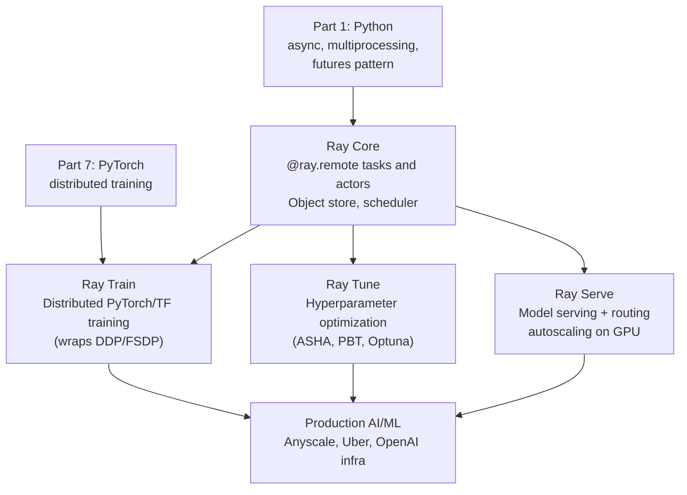
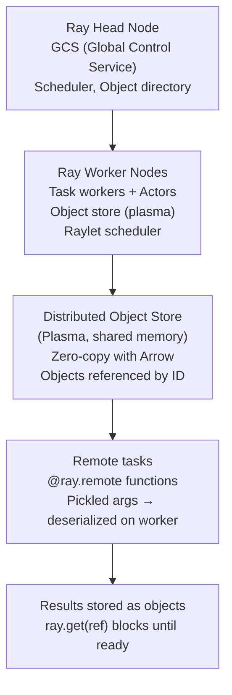

<!-- TEACHING_ORDER: verified -->
# Part 18: Ray

> **Prerequisites:** Part 1 (Python fundamentals — async, multiprocessing), Part 7 (PyTorch basics)
> **Used later in:** Part 19 (MLflow on Ray Train), vLLM on Ray Serve, distributed hyperparameter tuning
> **Version anchor:** Ray 2.40.x (mid-2026), Ray Train 2.x, Ray Serve 2.x stable

---

## Why This Library Exists

### The problem: Python's process model makes distributed AI hard

Python's GIL prevents CPU parallelism within a process. `multiprocessing` and `subprocess` require serializing everything through pipes — clumsy for ML workloads with large tensors and complex state. Writing distributed training, hyperparameter search, and model serving as separate systems creates operational complexity.

Robert Nishihara, Philipp Moritz, Stephanie Wang, and the RISELab at UC Berkeley (the same group behind Apache Spark) published the Ray paper in 2017. Their insight: the three core distributed patterns in ML — **task parallelism** (run N functions in parallel), **actor model** (stateful distributed objects), and **placement groups** (co-locate related resources) — can be unified in a single framework with a common Python-first API.

Ray's key design decision: a task or actor that runs on 100 GPUs in a cloud cluster looks identical in Python to one running locally — the same `@ray.remote` decorator, the same `.remote()` call. The distribution is transparent.

By 2023, Ray grew into a full AI/ML platform:
- **Ray Core:** distributed tasks and actors
- **Ray Train:** distributed training (PyTorch, TensorFlow, XGBoost)
- **Ray Tune:** hyperparameter optimization at scale
- **Ray Serve:** scalable model serving with autoscaling
- **Ray Data:** distributed data preprocessing

---

## Explain Like I Am 10

Imagine you need to solve 1,000 math puzzles and you have 10 friends (computers). Without Ray: you hand puzzle #1 to friend 1, wait for them to finish, then puzzle #2 — very slow. Ray is like a super-smart task manager who takes all 1,000 puzzles and distributes them across your friends automatically. When friend 3 finishes early, the task manager immediately gives them more work. When the puzzles need to remember state (like a running total), the task manager creates a special "actor" — a friend who keeps their own notepad.

You just describe what you want done. Ray figures out how to distribute it.

---

## Mental Model

**Ray is a distributed execution framework for Python: `@ray.remote` turns any Python function or class into a distributed task or actor, transparently running across a local machine or a thousand-node cluster.**

```
Local Python:                   Ray distributed:
f(x) → result               f.remote(x) → ObjectRef → ray.get(ref) → result
obj.method(x)                actor = MyClass.remote(); actor.method.remote(x)

Same syntax. Different scale.
```

---

## Learning Dependency Graph



---

## Core Concepts

### 1. Ray Core: tasks and actors

**Remote task:** A function that runs asynchronously on a Ray worker.

```python
import ray

ray.init()

@ray.remote
def train_fold(fold_id: int, config: dict) -> float:
    """Runs on a Ray worker — could be on any node in the cluster."""
    import torch
    # ... training code ...
    return val_accuracy

# Launch 5 tasks in parallel — non-blocking
refs = [train_fold.remote(i, {"lr": 0.001}) for i in range(5)]

# Gather results — blocks until all complete
accuracies = ray.get(refs)
print(f"Fold accuracies: {accuracies}")
```

**Remote actor:** A class that maintains state across method calls.

```python
@ray.remote(num_gpus=1)
class ModelServer:
    def __init__(self, model_path: str):
        import torch
        self.model = torch.load(model_path)

    def predict(self, inputs):
        with torch.no_grad():
            return self.model(inputs)

# Actors are persistent — occupy a GPU for their lifetime
server = ModelServer.remote("model.pt")
result = ray.get(server.predict.remote(my_input))
```

### 2. Ray Train: distributed model training

Ray Train wraps PyTorch DDP/FSDP and other frameworks for distributed training with simple APIs:

```python
from ray.train.torch import TorchTrainer
from ray.train import ScalingConfig, RunConfig

def train_loop_per_worker(config: dict):
    """Runs on each worker. Ray Train handles DDP wrapping."""
    import torch
    from ray.train.torch import get_dataloader, prepare_model
    from ray.train import Checkpoint, report

    model = prepare_model(MyModel())   # wraps in DDP
    optimizer = torch.optim.AdamW(model.parameters(), lr=config["lr"])

    for epoch in range(config["epochs"]):
        for batch in get_dataloader(my_dataset):
            loss = model(batch)
            loss.backward()
            optimizer.step()
            optimizer.zero_grad()

        # Report metrics to Ray Tune / dashboard
        report({"loss": loss.item(), "epoch": epoch},
               checkpoint=Checkpoint.from_dict({"model": model.state_dict()}))

trainer = TorchTrainer(
    train_loop_per_worker=train_loop_per_worker,
    train_loop_config={"lr": 1e-4, "epochs": 3},
    scaling_config=ScalingConfig(
        num_workers=4,               # 4 worker processes
        use_gpu=True,                # each worker gets 1 GPU
        resources_per_worker={"GPU": 1},
    ),
    run_config=RunConfig(name="my-training-run"),
)
result = trainer.fit()
```

### 3. Ray Tune: hyperparameter optimization

Ray Tune runs parallel hyperparameter search with advanced scheduling algorithms (ASHA: Async Successive Halving; PBT: Population Based Training):

```python
from ray import tune
from ray.tune.schedulers import ASHAScheduler

def objective(config):
    model = build_model(config["hidden_size"], config["dropout"])
    for epoch in range(10):
        val_loss = train_one_epoch(model, config)
        tune.report({"val_loss": val_loss})   # ASHA can stop bad trials early

tuner = tune.Tuner(
    objective,
    param_space={
        "lr":          tune.loguniform(1e-5, 1e-2),
        "hidden_size": tune.choice([128, 256, 512, 1024]),
        "dropout":     tune.uniform(0.0, 0.5),
    },
    tune_config=tune.TuneConfig(
        metric="val_loss",
        mode="min",
        scheduler=ASHAScheduler(max_t=10, grace_period=2),
        num_samples=50,            # run 50 trials
    ),
)
results = tuner.fit()
best = results.get_best_result()
print(f"Best config: {best.config}")
print(f"Best val_loss: {best.metrics['val_loss']:.4f}")
```

### 4. Ray Serve: scalable model serving

```python
from ray import serve
from fastapi import FastAPI

app = FastAPI()

@serve.deployment(
    num_replicas=2,           # 2 replicas
    ray_actor_options={"num_gpus": 1},
)
@serve.ingress(app)
class LLMService:
    def __init__(self):
        from vllm import LLM, SamplingParams
        self.llm = LLM("facebook/opt-125m", dtype="float32")
        self.params = SamplingParams(temperature=0.8, max_tokens=100)

    @app.post("/generate")
    def generate(self, prompt: str) -> str:
        outputs = self.llm.generate([prompt], self.params)
        return outputs[0].outputs[0].text

serve.run(LLMService.bind())
# Access: POST http://localhost:8000/generate {"prompt": "Hello"}
```

---

## Internal Architecture



**Object store:** All inter-task data is stored in Ray's distributed object store (built on Apache Plasma). Objects are referenced by `ObjectRef` (a UUID). When a task writes a large array, it is written once to the local object store — other tasks read it via shared memory (zero-copy). Objects are garbage-collected when all references are dropped.

---

## Essential APIs

```python
import ray

# Initialization
ray.init()                               # local
ray.init(address="auto")                 # connect to running cluster
ray.init(num_cpus=4, num_gpus=2)         # specify resources

# Tasks
@ray.remote(num_gpus=1)
def my_task(x): return x * 2

ref   = my_task.remote(5)               # non-blocking
value = ray.get(ref)                    # blocking
refs  = [my_task.remote(i) for i in range(10)]
values = ray.get(refs)                  # wait for all

# Actors
@ray.remote
class Counter:
    def __init__(self): self.n = 0
    def increment(self): self.n += 1; return self.n

counter = Counter.remote()
ray.get(counter.increment.remote())

# Object store
obj_ref = ray.put(large_array)          # store in object store
data    = ray.get(obj_ref)             # retrieve

# Resources
ray.available_resources()              # dict of remaining resources
```

---

## Beginner Examples

### Example 1: Parallel cross-validation

```python
import ray
import numpy as np
from sklearn.datasets import make_classification
from sklearn.linear_model import LogisticRegression
from sklearn.model_selection import StratifiedKFold
from sklearn.metrics import accuracy_score

ray.init(ignore_reinit_error=True)

X, y = make_classification(n_samples=1000, n_features=20, random_state=42)

@ray.remote
def train_fold(X_train, y_train, X_val, y_val) -> float:
    model = LogisticRegression(max_iter=200)
    model.fit(X_train, y_train)
    return accuracy_score(y_val, model.predict(X_val))

kfold = StratifiedKFold(n_splits=5)
refs  = [
    train_fold.remote(X[tr], y[tr], X[va], y[va])
    for tr, va in kfold.split(X, y)
]
accs = ray.get(refs)
print(f"CV accuracies: {[f'{a:.3f}' for a in accs]}")
print(f"Mean ± std: {np.mean(accs):.3f} ± {np.std(accs):.3f}")
ray.shutdown()
```

---

## Intermediate Examples

### Example 2: Parallel hyperparameter search with Ray Tune

```python
import ray
from ray import tune
from ray.tune.schedulers import ASHAScheduler
from sklearn.datasets import make_classification
from sklearn.neural_network import MLPClassifier
from sklearn.model_selection import cross_val_score

def train_mlp(config: dict):
    X, y = make_classification(n_samples=500, n_features=20, random_state=0)
    model = MLPClassifier(
        hidden_layer_sizes=(config["hidden"],),
        learning_rate_init=config["lr"],
        max_iter=50,
        random_state=42,
    )
    scores = cross_val_score(model, X, y, cv=3)
    tune.report({"val_accuracy": scores.mean()})

tuner = tune.Tuner(
    train_mlp,
    param_space={
        "lr":     tune.loguniform(1e-4, 1e-1),
        "hidden": tune.choice([32, 64, 128, 256]),
    },
    tune_config=tune.TuneConfig(
        metric="val_accuracy",
        mode="max",
        num_samples=20,
        scheduler=ASHAScheduler(max_t=1, grace_period=1),
    ),
)
results = tuner.fit()
best = results.get_best_result()
print(f"Best: lr={best.config['lr']:.5f}, hidden={best.config['hidden']}")
print(f"Best val accuracy: {best.metrics['val_accuracy']:.3f}")
```

---

## Internal Interview Knowledge

**Q: How does Ray's object store enable zero-copy data sharing?**
Strong answer: "Ray's object store (Plasma) stores objects in shared memory (mmap'd files). When two tasks on the same node need the same large array (e.g., a dataset loaded once), Ray stores it in Plasma once and gives both tasks a pointer to the same memory region. The tasks read data without any copying — zero-copy. When tasks are on different nodes, Ray serializes the object (using Arrow for arrays), transfers it over the network, and deserializes into the remote node's Plasma store. Within-node sharing is near-free; cross-node transfers pay serialization + network costs."

**Q: When should you use Ray actors vs tasks?**
Strong answer: "Use tasks for stateless computations — each call is independent and can be sent to any available worker. Use actors for stateful computations where the state must persist across calls — a model server that holds weights in memory, a counter, a connection pool. Tasks are lighter (no actor lifecycle management) and can be load-balanced freely. Actors occupy resources for their lifetime — create them only when you need persistent state. A common pattern: use a single actor as a parameter server (stateful), with many tasks as workers (stateless compute)."

---

## Production AI Usage

**OpenAI:** OpenAI's training infrastructure has used Ray for distributed training orchestration and hyperparameter search in earlier models.

**Uber:** Uber's Michelangelo ML platform uses Ray for distributed training jobs. Uber open-sourced their Ray-based ML platform patterns.

**Shopify:** Uses Ray for parallel feature engineering and model training pipelines at scale.

**Anyscale (commercial Ray):** Anyscale provides managed Ray clusters and is the primary commercial backer of Ray. Their RayLLM product (Aviary) uses Ray Serve + vLLM for LLM API serving.

---

## Common Mistakes

**Mistake 1: Calling `ray.init()` multiple times**
```python
# Bug: calling ray.init() in multiple files/functions raises error
ray.init()
# ... elsewhere ...
ray.init()   # RuntimeError or silent behavior

# Fix: use ignore_reinit_error=True or check before init
if not ray.is_initialized():
    ray.init()
```

**Mistake 2: Passing large objects as function arguments instead of using object store**
```python
# Bug: large_array is pickled and sent via gRPC for every task
large_array = np.random.rand(1_000_000)
refs = [my_task.remote(large_array) for _ in range(100)]  # copies 100×

# Fix: store once in object store
arr_ref = ray.put(large_array)
refs = [my_task.remote(arr_ref) for _ in range(100)]  # reference only
```

---

## Cheat Sheet

```python
import ray; ray.init()

# Task
@ray.remote(num_gpus=1)
def f(x): return x * 2
ref = f.remote(5); result = ray.get(ref)

# Actor
@ray.remote
class S:
    def __init__(self): self.n = 0
    def inc(self): self.n += 1; return self.n
s = S.remote(); ray.get(s.inc.remote())

# Large data
ref = ray.put(big_array)
results = ray.get([f.remote(ref) for _ in range(10)])

# Tune
from ray import tune
tuner = tune.Tuner(fn, param_space={"lr": tune.loguniform(1e-4, 1e-1)},
                   tune_config=tune.TuneConfig(metric="loss", mode="min", num_samples=20))
results = tuner.fit()
```

---

## Interview Question Bank

### Top 25 Beginner

**Q1: What problem does Ray solve for Python ML code?** A: Python's GIL prevents true CPU parallelism within one process, and `multiprocessing` is clunky for ML (tensor serialization, large state). Ray adds transparent distributed execution: `@ray.remote` turns a Python function into a distributed task that runs on any node in the cluster. The same code that runs on a laptop runs on a 1,000-node cluster. Ray also provides a distributed object store (shared memory) for efficient large-tensor communication between tasks.

**Q2: What is the difference between `ray.remote` for functions vs classes?** A: `@ray.remote` on a function creates a remote task — each `.remote()` call is stateless and can run on any available worker. `@ray.remote` on a class creates an actor — each actor instance is a persistent worker process that retains state between method calls. Actors are used when state needs to persist (model server, parameter server, counter). Tasks are used for stateless computations.

**Q3: What is `ray.get()` and when does it block?** A: `ray.get(ref)` retrieves the value of an `ObjectRef` from the Ray object store. It blocks until the computation that produced the ref finishes. You can pass a list: `ray.get([ref1, ref2, ...])` blocks until all complete. Best practice: call `ray.get()` as late as possible — after launching all tasks — so they run in parallel.

**Q4: How do you give a task access to a GPU?** A: Use the `num_gpus` parameter in `@ray.remote`: `@ray.remote(num_gpus=1)`. Ray's scheduler reserves 1 GPU on the assigned worker node and sets `CUDA_VISIBLE_DEVICES` appropriately. The task's code can then use `torch.cuda.device()` normally. For fractional GPU allocation: `@ray.remote(num_gpus=0.5)` allocates half a GPU resource unit (but CUDA_VISIBLE_DEVICES is not fractional — use MIG for true GPU partitioning).

**Q5: What is Ray Tune and how does it differ from a manual grid search?** A: Ray Tune is a hyperparameter optimization framework. Unlike manual grid search (evaluates all combinations, no early stopping), Tune supports: (1) ASHA scheduler: stops bad trials early based on intermediate results, (2) Population-Based Training: evolves the best hyperparameters throughout training, (3) Bayesian optimization: uses surrogate models to select configurations more efficiently. Tune also runs trials in parallel across all available GPUs/CPUs automatically.

**Q6: What is Ray Data and what is its primary use case?** A: Ray Data is a distributed data processing library for ML pipelines. Primary use case: efficiently loading, preprocessing, and feeding large datasets to distributed training jobs. Features: lazy evaluation (transforms execute as data flows through), streaming execution (never loads full dataset into memory), automatic parallelism over CPU/GPU, and integration with PyTorch/TensorFlow data loaders. Use it when the data preprocessing step is the training bottleneck.

**Q7: What is `ray.wait()` and how does it differ from `ray.get()`?** A: `ray.wait(refs, num_returns=k)` returns when any k of the submitted refs are ready, without waiting for all of them. Returns `(ready_refs, remaining_refs)`. Use `ray.wait` for work-stealing patterns: submit N tasks, process the first k that complete (rather than waiting for the slowest), then submit new tasks. `ray.get` waits for all — suitable when you need all results before proceeding.

**Q8: How does Ray's distributed object store work?** A: Ray uses Apache Plasma, a shared-memory object store. When a task returns a large object (>100KB), the result is written to the local node's Plasma store in shared memory (not copied to the driver). Other tasks on the same node read it via zero-copy shared memory. Tasks on remote nodes request it over the network — Ray automatically handles transfer. Objects are reference-counted and evicted when no ObjectRefs point to them.

**Q9: What is Ray Serve and how is it different from running a Flask API?** A: Ray Serve is a scalable ML model serving framework. Differences from Flask: (1) Auto-scaling: Serve can scale replicas up/down based on request queue depth. (2) Model composition: chain models as a deployment graph (preprocessing → model → postprocessing). (3) Batching: automatic request batching with `@serve.batch` — accumulates requests and processes them together for GPU efficiency. (4) Multi-framework: serve any Python callable (PyTorch, TensorFlow, sklearn). Flask is a single-process web framework with no native ML scaling.

**Q10: What is Ray Train and what frameworks does it support?** A: Ray Train provides distributed training APIs for PyTorch, TensorFlow, XGBoost, and LightGBM. For PyTorch: wraps DistributedDataParallel with `ray.train.torch.TorchTrainer`. Handles: cluster setup, inter-node communication, gradient checkpointing, fault tolerance (checkpoint + resume on worker failure). Integrates with Ray Tune for hyperparameter search combined with distributed training.

**Q11: How do you pass large data between Ray tasks efficiently?** A: Use `ray.put(data)` to explicitly put data in the object store once, then pass the returned ObjectRef to multiple tasks — they all read the same object without redundant serialization. Without `ray.put`, passing a large NumPy array to 100 tasks would serialize it 100 times. With `ray.put`, it's stored once and accessed via shared memory 100 times. Use this for model weights, large datasets, lookup tables shared across many tasks.

**Q12: What is the Ray Dashboard and what does it show?** A: The Ray Dashboard (`ray start --head`, then access http://localhost:8265) shows: cluster resource utilization (CPU, GPU, memory per node), running and queued tasks/actors, object store usage, timeline view of task execution, and logs from all workers. Useful for: identifying GPU utilization bottlenecks, finding tasks stuck in queue (resource shortage), and debugging actor failures. In production, use the dashboard metrics endpoint for Prometheus integration.

**Q13: How does Ray handle node failures?** A: For tasks: if a worker node crashes, Ray automatically retries tasks that were running on it (up to `max_retries` times, default 3). For actors: if an actor crashes, it's marked dead and future calls return `RayActorError`. You can configure `max_restarts=N` on the actor class to auto-restart N times. For the head node: Ray 2.x supports head node fault tolerance via external Redis for GCS state. Worker node failures don't affect the cluster health.

**Q14: What is `@ray.remote(max_concurrency=N)` used for?** A: By default, each actor processes one request at a time (single thread). `max_concurrency=N` allows N concurrent method calls on the same actor (async processing). Use for actors that perform IO-bound work (calling external APIs, reading from databases) where you want to pipeline requests. Requires the actor methods to be `async def`. Not useful for CPU/GPU-bound work (Python GIL limits actual parallelism within one actor).

**Q15: What is the difference between Ray Tasks and Ray Actors for model serving?** A: Ray Tasks: each request creates a new task, loads the model fresh (or from shared memory). Good for: infrequent calls, stateless transformations, or when scaling is highly variable. Ray Actors: model is loaded once when the actor is created, then all requests go to the same persistent process. Good for: frequent serving calls, warm model cache, streaming inference. Ray Serve uses actors under the hood — each replica is an actor with the model loaded.

**Q16: How do you configure Ray resource limits?** A: At cluster startup: `ray.init(num_cpus=8, num_gpus=2)` or via cluster config YAML. Per-task: `@ray.remote(num_cpus=2, num_gpus=0.5, memory=1e9)`. Custom resources: `ray.init(resources={"accelerator_type:T4": 2})` for heterogeneous hardware. Resource requests are reservations — Ray guarantees the task is scheduled on a node with that resource available, but doesn't enforce the limit (a task using `num_gpus=0.5` can still use the full GPU physically).

**Q17: What is `ray.util.ActorPool` and when is it used?** A: `ActorPool` manages a pool of identical actors and distributes tasks across them with load balancing. Create: `pool = ray.util.ActorPool([MyActor.remote() for _ in range(8)])`. Submit: `pool.submit(lambda a, x: a.method.remote(x), data)`. Results: `pool.get_next()`. Used for: parallel inference with multiple model replicas, batched preprocessing, any scenario where you need a fixed pool of expensive-to-initialize workers. Simpler alternative to manual actor management.

**Q18: What does `ray.init(address="auto")` do?** A: Connects to an existing Ray cluster rather than starting a new one. `"auto"` uses the `RAY_ADDRESS` environment variable or discovers the cluster via Redis. Use in production: worker processes connect to the cluster started by the head node (`ray start --head`). In Kubernetes, use the Ray operator which sets `RAY_ADDRESS` automatically. Don't use `ray.init()` without arguments in production — it starts a new cluster on the local machine.

**Q19: How does Ray integrate with Kubernetes?** A: KubeRay operator manages Ray clusters as Kubernetes CRDs: `RayCluster` (persistent cluster), `RayJob` (one-off batch job), `RayService` (Ray Serve deployment). The operator handles: head node pod management, worker auto-scaling (HorizontalPodAutoscaler integration), GPU resource requests, and cluster upgrades. KubeRay is the recommended production deployment path — use `RayService` for serving and `RayJob` for training runs.

**Q20: What are Ray's serialization requirements?** A: Objects passed as arguments to remote functions or returned from them must be serializable. Ray uses `cloudpickle` (more capable than stdlib `pickle`). Requirements: functions defined at module level (lambdas work for closures), classes with `__init__` and `__reduce__` (most Python classes work). Non-serializable: file handles, database connections, CUDA tensors (must use numpy or move to CPU before passing). Ray's distributed store handles NumPy arrays efficiently via zero-copy.

**Q21: How does Ray Tune's ASHA (Asynchronous Successive Halving Algorithm) work?** A: ASHA promotes trials based on intermediate results without synchronization barriers. Trials start simultaneously. After a minimum time budget, ASHA promotes the top `η` fraction (default top 1/3) of trials to the next "rung" (more resources). Terminated trials free up resources immediately for new trials. Unlike synchronous SHA, ASHA doesn't wait for all trials at a rung to finish before promoting — better GPU utilization. Hyperparameter search converges 3–10× faster than random search.

**Q22: What is the Ray Client and when is it needed?** A: Ray Client allows connecting to a remote Ray cluster from a laptop: `ray.init("ray://<head-node-ip>:10001")`. Tasks and actors run on the cluster; the driver script runs locally. Useful for: interactive development (Jupyter notebook on laptop, GPU cluster remote), debugging production clusters without SSH. Limitations: network latency for `ray.get()` calls is high; better to use a driver script that runs on the cluster head node for production.

**Q23: What is a placement group strategy `PACK` vs `SPREAD`?** A: `PACK` (default): place all bundles on as few nodes as possible (prefer same node). Best for NCCL-based training (NVLink bandwidth). `SPREAD`: place each bundle on a different node. Best for fault tolerance (single node failure affects only one bundle). `STRICT_PACK`: all bundles must be on one node — fails if impossible. `STRICT_SPREAD`: all bundles must be on different nodes. Choose based on communication pattern: in-node NVLink → PACK, cross-node isolation → SPREAD.

**Q24: How does Ray handle Python version and package incompatibilities across nodes?** A: Ray requires the same Python version and Ray version on all nodes. For packages: use `ray.runtime_env` to specify a pip requirements list or conda environment that is installed on each worker before the task runs: `@ray.remote(runtime_env={"pip": ["torch==2.3.0"]})`. The runtime env is cached on workers after first installation. Alternatively, use Docker-based deployment with matching images across nodes. `runtime_env` is powerful for testing different package versions across tasks.

**Q25: What is the difference between Ray 1.x and Ray 2.x APIs?** A: Major changes: (1) Ray AIR (AI Runtime) in 2.x: unified APIs for Trainer, Tuner, Predictor, BatchPredictor. (2) `ray.train` replaces `ray.sgd`. (3) `ray.data` replaces `ray.util.data`. (4) GCS fault tolerance added (head node crash recovery). (5) Ray Serve V2 (deployment graph API). Backward compatibility: Ray 1.x `@ray.remote` tasks/actors work in 2.x. Ray Tune API mostly compatible. Ray Serve V1 deployments need migration to `@serve.deployment` decorator syntax.

### Top 25 Intermediate

**Q26: Explain Ray's scheduling algorithm — how does a task get assigned to a node?** A: Ray's distributed scheduler operates at two levels: (1) Global scheduler (GCS): coarse-grained assignment — which node to run the task on. Uses: locality (tasks near their input data), resource fit (node has required resources), load balancing. (2) Local scheduler (Raylet): fine-grained within a node — which CPU/GPU thread pool to use. For GPU tasks: pinned to a specific GPU. For actor placement groups: pre-assigned node from reservation. Tasks without dependencies use random load balancing across nodes with matching resources.

**Q27: What is the Ray object spilling mechanism and when does it trigger?** A: Ray object store uses shared memory (Plasma). When the in-memory store is full, Ray spills objects to local disk (configurable path, default `/tmp/ray`). Spilled objects are evicted from memory and stored as files. On access, they're read back into memory. Configure: `ray.init(object_store_memory=20e9, _system_config={"object_spilling_config": '{"type":"filesystem","params":{"directory_path":"/nvme/ray"}'})`. Use fast NVMe for spill path. Spilling adds latency — monitor object store usage and scale memory if spilling is frequent.

**Q28: How does Ray Train implement fault-tolerant distributed training?** A: Ray Train checkpoints after each epoch/N steps to a persistent store (S3, HDFS). If a worker fails: (1) Ray detects the dead worker via heartbeat timeout. (2) The training coordinator restarts failed workers (up to `max_failures`). (3) All workers restore from the latest checkpoint. (4) Training resumes from the checkpoint epoch. For large clusters where random failures are likely, this is critical. Set `checkpoint_strategy=CheckpointConfig(num_to_keep=2)` to keep last 2 checkpoints (insurance against checkpoint corruption).

**Q29: What is Ray's `@serve.batch` decorator and how does it work?** A: `@serve.batch(max_batch_size=32, batch_wait_timeout_s=0.05)` converts an async method to accept a list of inputs. Ray Serve accumulates individual requests (up to `max_batch_size`) or waits `batch_wait_timeout_s` seconds, then calls the method with the batch. The method processes all inputs at once (efficient GPU inference) and returns a list of outputs (one per input). Individual callers each get their own response back. This transparent batching is key for GPU utilization.

**Q30: How do you implement a DAG (workflow) with Ray tasks?** A: Chain ObjectRefs as arguments: `a = task_a.remote(input)`, `b = task_b.remote(a)`, `c = task_c.remote(a, b)` — `task_c` waits for both `task_a` and `task_b`. This forms a DAG naturally. For complex workflows, use `ray.workflow` (experimental) or Prefect/Airflow with Ray as the executor. Ray's lazy evaluation means the entire DAG is submitted immediately but executes as dependencies resolve.

**Q31: Explain Ray's memory management for large NumPy arrays.** A: When a NumPy array is passed to a remote task, Ray serializes it via Apache Arrow (zero-copy for C-contiguous arrays) and writes to the Plasma object store. Other tasks on the same node read it via shared memory — no copy. Cross-node access: Arrow IPC serialization over socket. Key insight: `ray.put(large_array)` returns an ObjectRef; passing this ref to 1,000 tasks stores the array once. Without `ray.put`, Ray auto-puts the argument (same result, but explicit `ray.put` reuses the same ObjectRef for efficiency).

**Q32: What is the Ray Serve deployment graph and how do you compose models?** A: Deployment graphs connect Ray Serve deployments as a DAG: `app = ModelA.bind() | ModelB.bind() | Postprocessor.bind()`. Each `.bind()` creates a `DeploymentHandle` connecting deployments. At runtime, requests flow through the graph. For parallel execution: `[ModelA.bind(), ModelB.bind()]` executes both concurrently and combines outputs. This replaces manual microservice orchestration — Ray Serve manages scaling, routing, and error handling across the graph.

**Q33: How does Ray handle Python's multiprocessing conflicts with CUDA?** A: CUDA cannot be used before fork — CUDA initializes global state that becomes invalid after fork. Ray uses `spawn` start method (not `fork`) for worker processes — each worker starts fresh without inheriting CUDA state. If you initialize CUDA in the driver before `ray.init()`, subsequent workers start clean. Exception: if you use `ray.init(local_mode=True)` (debugging mode), tasks run in-process using threads — CUDA is safe but no true parallelism.

**Q34: What is `ray.util.queue.Queue` and how is it different from Python's `queue.Queue`?** A: `ray.util.queue.Queue` is a distributed queue backed by a Ray actor. Multiple Ray actors and tasks can put/get items from it across nodes. Python's `queue.Queue` only works within one process. Use `ray.util.queue.Queue` for producer-consumer patterns across distributed workers: one set of tasks produces data, another set consumes. Thread-safe and handles backpressure (blocking `put` when full).

**Q35: How does Ray Train's checkpointing work with custom models?** A: Override `train_func` to call `ray.train.report(metrics, checkpoint=Checkpoint.from_dict({"model": model.state_dict()})` after each epoch. Ray Train saves the checkpoint to the configured storage (local or cloud). To resume: `trainer = TorchTrainer(..., resume_from_checkpoint=Checkpoint.from_path("s3://bucket/checkpoint"))`. The checkpoint is distributed to all workers on restore. For large models, use `Checkpoint.from_directory(tmpdir)` with sharded state dicts.

**Q36: What are Ray named actors and when are they useful?** A: Named actors: `MyActor.options(name="parameter_server").remote()`. Retrieve from anywhere: `actor = ray.get_actor("parameter_server")`. Useful for: (1) Singleton services (parameter server, global state manager). (2) Sharing an actor between multiple driver scripts without passing the handle. (3) Accessing an actor across sessions (using `namespace` to persist actor across Ray restarts). Named actors are registered in the GCS and accessible cluster-wide.

**Q37: How do you implement cancellation of Ray tasks?** A: `ray.cancel(ref)` cancels a pending or running task. If the task hasn't started: it's removed from the scheduler queue. If it's running: a `asyncio.CancelledError` is raised in async tasks; synchronous tasks receive `SIGTERM`. `ray.get(cancelled_ref)` raises `TaskCancelledError`. For actors: `ray.kill(actor)` terminates the actor process immediately. Graceful shutdown: prefer sending a termination message to the actor's method queue and let it clean up before `ray.kill`.

**Q38: How does Ray handle heterogeneous clusters (mix of GPU types)?** A: Use custom resources: `ray.init(resources={"GPU_A100": 4, "GPU_T4": 8})` on different nodes. Tasks request specific hardware: `@ray.remote(resources={"GPU_A100": 1})` for A100 tasks. This enables: routing inference requests to T4s (cost-efficient) and training to A100s (high-performance) in the same cluster. Kubernetes labels (`nvidia.com/gpu.product=A100-SXM4-80GB`) map to Ray custom resources via KubeRay configuration.

**Q39: What is Ray Workflow and how does it compare to Airflow?** A: Ray Workflow provides durable DAG execution with checkpointing at each step. Unlike Airflow: (1) No separate scheduler process — steps are Ray tasks. (2) Dynamic DAGs (decide next steps based on runtime outputs). (3) Sub-second step granularity (Airflow has per-minute scheduling overhead). (4) Native Python — no YAML/Jinja operators. Airflow remains better for: scheduled batch pipelines, UI/monitoring, non-ML workflows, operations teams. Ray Workflow is better for: ML pipelines with dynamic branching, workflows that need sub-minute granularity.

**Q40: What is the `@ray.remote` `_retry_exceptions` parameter?** A: By default, Ray retries tasks on application errors (non-fatal Python exceptions) only if `max_retries > 0`. `_retry_exceptions=[MyTransientError, TimeoutError]` restricts retry to only specified exception types. Other exceptions fail immediately without retry. This prevents infinite retries on deterministic errors (e.g., invalid input) while retrying transient errors (network timeout, rate limit). For idempotent tasks, set `max_retries=3, _retry_exceptions=[ConnectionError]`.

**Q41: How does Ray Data's streaming execution prevent OOM for large datasets?** A: Ray Data uses pipeline parallelism: data is processed in blocks (chunks), and transformations are applied to each block as it flows through the pipeline, rather than materializing the full dataset at each stage. `ds.map_batches(transform_fn).take_batch(256)` never loads the full dataset — it processes one block, applies the transform, and passes the block downstream before processing the next. The block size is configurable (default 512MB). This enables processing TB-scale datasets on GB-scale memory.

**Q42: What is Ray's `serve.delete` and how do you perform rolling updates?** A: `serve.delete("deployment_name")` removes a deployment. For rolling updates: modify the deployment configuration and re-`serve.run(app)`. Ray Serve performs a rolling restart: new replicas start with the new code while old replicas continue serving. Once new replicas are healthy, old replicas are terminated. The `--num-replicas` can be increased first for headroom. Deployment version tracking via `version` parameter triggers rolling restarts on version change.

**Q43: How does Ray handle very large return values from tasks?** A: If a task returns an object >100MB, Ray stores it in the distributed object store (Plasma) rather than passing it through the inter-process communication channel. The driver receives an ObjectRef pointing to the data; `ray.get(ref)` retrieves it from the store. This prevents the driver's message queue from becoming a bottleneck. For objects >10GB: object spilling to disk may occur. Use `ray.put` explicitly for objects shared across many tasks to control placement.

**Q44: What is `ray.experimental.tqdm_ray` used for?** A: `tqdm_ray.tqdm` is a distributed progress bar for Ray tasks. Standard `tqdm` shows progress in the driver process, but Ray tasks run in separate worker processes — they can't directly update a tqdm bar. `tqdm_ray.tqdm` uses a shared Ray actor to collect progress updates from workers and render in the driver. Use when submitting thousands of tasks and want a real-time progress indicator without polling `ray.wait` manually.

**Q45: How does Ray Data handle preprocessing for distributed training?** A: Pattern: `dataset = ray.data.read_parquet("s3://bucket/data/") .map_batches(preprocess_fn, batch_size=256, num_gpus=0) .random_shuffle() .split(num_splits=8)`. Pass splits to training workers: each worker gets a `DatasetShard` and iterates it. Ray Data and Ray Train integrate natively: `TorchTrainer(datasets={"train": dataset})` automatically distributes the dataset across workers with no explicit splitting code. Preprocessing runs on CPU workers in parallel with GPU training (pipeline parallelism).

**Q46: What is Ray's `runtime_env` and what can it configure?** A: `runtime_env` is a dictionary specifying the execution environment for tasks/actors: `{"pip": [...], "conda": {...}, "env_vars": {...}, "working_dir": ".", "py_modules": [my_module]}`. Ray installs the environment on remote workers before running the task. `working_dir` uploads local code to remote workers (useful for development). `py_modules` uploads specific Python modules. Note: `pip` installs are cached per-worker — repeated tasks use cached environments. Heavy dependencies should be in the Docker image, not `runtime_env`.

**Q47: How does Ray Train's elastic training work?** A: Elastic training allows the number of workers to change during training (scale up/down without restarting). Enabled with `ElasticTrainer`. Workers join and leave using a rendezvous mechanism (etcd or Ray-based). On scaling event: training pauses at a checkpoint, new worker count is established, workers restore from checkpoint, training resumes. Useful for spot instance training — when a spot instance is preempted, elastic training reduces worker count rather than failing the job.

**Q48: What is `ray.remote(scheduling_strategy="SPREAD")`?** A: By default, Ray tries to schedule tasks on lightly-loaded workers but doesn't guarantee spreading. `scheduling_strategy="SPREAD"` instructs the scheduler to spread tasks across all nodes as evenly as possible (round-robin). Useful for: data loading tasks that should be distributed across all nodes to maximize network bandwidth, map operations where you want each node to process its own data partition, preventing hot-spots when many tasks submit simultaneously.

**Q49: How does Ray handle Python's `__del__` for cleanup in actors?** A: When an actor is killed or times out, `__del__` is NOT reliably called (Python GC is non-deterministic; `ray.kill` immediately terminates the process). Implement cleanup in a dedicated method: `actor.shutdown.remote()` which closes file handles, flushes buffers, disconnects from databases. Call before `ray.kill(actor)`. For actors that must clean up: use a try/finally in the actor's message processing loop to ensure cleanup on any exit path.

**Q50: What are the production best practices for Ray cluster sizing?** A: (1) Head node: only runs GCS, dashboard, global scheduler — no tasks. Use a CPU-only node. (2) Worker nodes: homogeneous GPU types within a node pool (avoid task routing complexity). (3) Object store memory: 30–40% of each node's total RAM (the rest for Python processes). (4) Ray version pinning: all nodes must have the same Ray version — use Docker images. (5) GCS HA: deploy Redis HA for GCS backend in critical production clusters. (6) Node failure detection: set `RAYLET_HEARTBEAT_PERIOD_MILLISECONDS=500` for faster failure detection (default 1000ms).

### Top 25 Advanced

**Q51: Walk through a Ray actor's message processing internals.** A: Ray actor methods are submitted as tasks to the actor's task queue (a Ray CoreWorker thread-safe queue). The actor's event loop dequeues tasks one at a time (or up to `max_concurrency` for async actors). Each method call is a coroutine: `method.remote(args)` serializes args, sends to actor's raylet via gRPC, raylet places in actor's inbox. Actor's event loop: dequeue → deserialize args → execute method → serialize result → send ObjectRef result back to caller's plasma store. For async actors: uses `asyncio.run_coroutine_threadsafe`.

**Q52: How does Ray's distributed memory model handle memory pressure across nodes?** A: Ray's memory management is distributed: each node has its own Plasma object store. There is no global memory allocator — each node manages its own store independently. When a task on node A needs an object created on node B: Ray schedules a transfer (object copy via network). Copies are cached locally after first transfer. Memory pressure on one node triggers local spilling (to disk) without affecting other nodes. Global memory pressure: monitor per-node object store usage via Ray metrics (`ray_object_store_num_bytes`).

**Q53: Explain how Ray Train implements gradient synchronization for distributed PyTorch.** A: Ray Train wraps PyTorch DDP (DistributedDataParallel). Each Ray Train worker is a separate OS process with its own GPU. DDP setup: Ray Train calls `torch.distributed.init_process_group(backend="nccl")` on each worker, using Ray's rendezvous mechanism to exchange master address and port. During training: DDP hooks intercept `loss.backward()` and launches NCCL AllReduce on gradients as each parameter's gradient is computed. Gradient synchronization overlaps with remaining backward pass computation (pipelined).

**Q54: What is Ray's GCS fault tolerance implementation and its limitations?** A: Ray 2.x GCS fault tolerance: GCS state is persisted to Redis (or external key-value store). On GCS crash: (1) GCS restarts, reading state from Redis. (2) Actors re-register their metadata. (3) Running tasks continue (workers don't depend on GCS during execution). (4) New task submissions resume after GCS is back. Limitations: (1) Recovery time ~30s. (2) In-flight tasks during GCS crash may fail to report results. (3) Placement group state may need manual cleanup. (4) Named actor lookup fails during GCS downtime.

**Q55: How would you implement a distributed parameter server with Ray?** A: ```python
@ray.remote
class ParameterServer:
    def __init__(self): self.params = {}
    def push(self, k, grad): self.params[k] = self.params.get(k, 0) - lr * grad
    def pull(self, k): return self.params[k]

# Workers:
@ray.remote(num_gpus=1)
def train_worker(ps, data_shard):
    model = Model()
    for batch in data_shard:
        grads = compute_gradients(model, batch)
        [ps.push.remote(k, g) for k, g in grads.items()]
        params = ray.get([ps.pull.remote(k) for k in model.keys()])
        update_model(model, params)
```
This is the classic parameter server pattern. Limitation: PS becomes bottleneck with many workers (N workers × M parameters → high PS load). Use AllReduce (DDP) for more scalable synchronization.

**Q56: How does Ray handle CUDA multiprocessing without shared GPU memory?** A: CUDA memory is not shareable between processes via Python Plasma (no CUDA IPC in Ray's default object store). Each Ray GPU task gets its own CUDA context. To pass GPU tensors between tasks: `.cpu().numpy()` before returning (puts in Plasma), then `.cuda()` in the receiving task. For higher performance: use CUDA IPC handles via `torch.multiprocessing` — not built into Ray but can be implemented via custom serializers. Ray 2.x adds experimental GPU object transfer via CUDA IPC.

**Q57: What is Ray's `@ray.remote` `max_calls` parameter?** A: `max_calls=N` restricts a worker process to N task executions before being recycled. After N tasks, the worker exits and Ray starts a new one. Use for: (1) Memory leak isolation — if your code has memory leaks, recycling workers prevents unbounded growth. (2) CUDA context cleanup — some third-party libraries don't fully release GPU memory; recycling the worker process fully releases CUDA context. (3) Mutable global state — prevents state from one task contaminating the next. Cost: worker startup time per N tasks.

**Q58: How does Ray Serve's autoscaler decide when to scale up/down?** A: Metrics-based autoscaling: Ray Serve monitors average request queue depth per deployment. Scale up when: `avg_requests_in_queue / num_replicas > target_num_ongoing_requests_per_replica` (default 1). Scale down when: replicas are under-utilized for `downscale_delay_s` seconds. Configuration: `autoscaling_config=AutoscalingConfig(min_replicas=2, max_replicas=20, target_num_ongoing_requests_per_replica=5)`. Kubernetes HPA can also scale Ray Serve via custom metrics adapter. Beware: scale-down causes cold start latency for new requests until replica is ready.

**Q59: How does Ray implement task retry with exponential backoff?** A: Built-in retry doesn't support backoff — `max_retries=N` retries immediately. For backoff: implement at the application level. Pattern: wrap task call in a retry decorator that uses `ray.wait` with timeout and exponential sleep. Or: use Ray Workflow's `@workflow.step` which supports retry policies with backoff. For production services, use Ray Serve's retry mechanism with timeout, which automatically handles transient failures with configurable backoff policies.

**Q60: Design a high-throughput distributed inference system using Ray Serve for a 70B LLM.** A: Architecture: (1) Tokenizer deployment: CPU-only, 16 replicas, handles text→token conversion. (2) LLM deployment: 8×A100 per replica (tensor-parallel), 4 replicas (32 GPUs total). `@serve.deployment(num_replicas=4, ray_actor_options={"num_gpus": 8})`. (3) Autoscaling: min_replicas=2 for cost, max_replicas=8 for peak. Scale metric: queue depth > 10. (4) Batching: `@serve.batch(max_batch_size=32, batch_wait_timeout_s=0.02)` on the LLM method. (5) Request routing: consistent hashing on session_id for multi-turn conversations to hit the same replica (warm KV cache). (6) Health checks: custom `/health` endpoint that validates GPU memory and can serve a test prompt. Projected throughput: 4 replicas × 32 batch × 50 tokens/s ≈ 6,400 tokens/s.

**Q61: How does Ray's object lineage enable recomputation for fault tolerance?** A: Ray tracks the lineage (computation graph) of each object — which task produced it and what its inputs were. If an object is evicted from the object store (e.g., memory pressure or node failure), and a task needs it, Ray can recompute it by re-running the producing task from its inputs. This is analogous to Spark's RDD lineage. Lineage enables transparent fault tolerance without explicit replication. Limitation: lineage chains can become long (deep pipelines); truncate with `ray.put` to checkpoint objects.

**Q62: What is Ray's `remote_args_generator` pattern for large fanouts?** A: When a task needs to fan out to thousands of subtasks, passing large shared arguments naively serializes them thousands of times. `remote_args_generator` uses a generator that yields `ObjectRef`s — Ray collects the ref list lazily without creating all tasks at once. Alternative: `ray.put(large_data)` once, pass the ref to all tasks (zero-copy sharing). For extreme fanout (1M tasks): use `ray.data` which handles the fanout internally with its own block-parallel execution model.

**Q63: How does Ray handle deadlocks in actor call chains?** A: Deadlock scenario: Actor A calls Actor B which calls back Actor A — both are waiting. With `max_concurrency=1` (default), Actor A is blocked waiting for B's response while processing A's method, and B is blocked waiting for A's response. Solutions: (1) Increase `max_concurrency` on actors involved in call chains. (2) Use `asyncio` actors (`async def` methods) — can await B's call while yielding the event loop to handle B's callback. (3) Use futures: fire-and-forget with `.remote()`, return a ref to the client to poll, avoiding synchronous chains. (4) Restructure to avoid circular dependencies.

**Q64: What is Ray's approach to handling heterogeneous task durations (stragglers)?** A: Straggler mitigation: (1) Speculative execution: `ray.wait` returns early; resubmit the same task to a different worker if the first hasn't completed in 2× median time. (2) Work-stealing: Ray's local scheduler steals tasks from overloaded workers' queues for lightly-loaded workers. (3) Data affinity: place tasks near their data to avoid network latency. (4) Ray Data's pipeline: slow preprocessing blocks don't delay fast GPU tasks — the pipeline has independent buffer sizes per stage. (5) For critical SLA tasks: use dedicated placement groups to ensure resource availability.

**Q65: How does Ray Data's zero-copy reads work with Arrow?** A: Ray Data reads Parquet/CSV files directly into Apache Arrow `RecordBatch` objects. Arrow stores data in columnar format in shared memory (Plasma). When a `map_batches` function receives a `pandas.DataFrame` or `dict[str, np.ndarray]`, Ray converts from Arrow to the target format — but for NumPy: Arrow `Array.to_pydict()` returns NumPy arrays that share Arrow's memory buffer (no copy) for primitive types. This enables processing large columns without ever copying data, crucial for high-throughput data pipelines.

**Q66: What happens to in-flight Ray tasks when the driver script exits?** A: When the driver exits normally: all Ray tasks are cancelled (default behavior). To keep tasks running after driver exit: (1) Use `ray.get(refs, timeout=None)` and don't exit until done. (2) For background jobs: use Ray Jobs API (`ray job submit`) — the job runs independently of the submitting process. (3) Use `ray.util.ActorPool` with named actors that persist beyond the driver. (4) Ray Workflows persist state across driver exits by design. For production: always use Ray Jobs API for long-running work, not driver scripts that may be interrupted.

**Q67: How would you implement distributed evaluation (scoring 1M samples) with Ray Data?** A: ```python
ds = ray.data.read_parquet("s3://bucket/eval_data/")  # 1M rows
predictions = ds.map_batches(
    ModelPredictor,
    batch_size=512,
    num_gpus=1,
    compute=ray.data.ActorPoolStrategy(min_size=8, max_size=16),
)
predictions.write_parquet("s3://bucket/eval_results/")
```
`ActorPoolStrategy` creates a pool of `ModelPredictor` actors, each with 1 GPU, that process data blocks in parallel. Ray Data streams data from S3, applies the model in parallel, and writes results back to S3 without materializing the full dataset in memory.

**Q68: How does Ray's plasma store interact with NUMA (Non-Uniform Memory Access)?** A: Ray's Plasma store uses `/dev/shm` (shared memory) which is NUMA-local to the socket where the Plasma process runs. CPU workers on the same NUMA node access the store with lower latency than workers on the other socket. Ray doesn't automatically NUMA-optimize task placement. For NUMA-aware workloads: use `numactl` to pin the Plasma process and CPU workers to the same NUMA node, or use multiple Ray workers per node with separate Plasma stores per NUMA domain. This matters for multi-socket servers with 2+ CPU sockets.

**Q69: What is Ray's `enable_task_events` and how does it affect performance?** A: Task events track the lifecycle of every Ray task (submitted, scheduled, started, completed) and send events to the GCS for the dashboard. Enabling all events: `ray.init(task_events_enabled=True)`. Performance impact: high-frequency short tasks (>10K/sec) generate significant GCS traffic. For throughput-sensitive workloads: disable task events or use sampling (`task_events_report_interval_ms=5000`). The dashboard will show sampled events only. Trade-off: better observability vs. GCS load.

**Q70: Explain how Ray implements object garbage collection.** A: Ray uses reference counting: each ObjectRef holds a reference to the object in the Plasma store. When all Python ObjectRef objects are garbage-collected (CPython reference count → 0), Ray decrements the object's reference count in Plasma. When Plasma reference count → 0, the object is eligible for eviction. Cross-node references: the GCS tracks "distributed reference counts" — ObjectRefs held by remote processes increment a counter in the GCS. Circular references: Ray doesn't handle circular ObjectRef chains (rare in practice — don't store ObjectRefs inside other objects).

**Q71: How does Ray Tune's Population-Based Training (PBT) work?** A: PBT starts N trials with random hyperparameters. Every `perturbation_interval` steps: (1) Rank trials by performance. (2) Bottom 25% copy the hyperparameters of a random top 25% trial (exploitation). (3) Apply random perturbation to copied hyperparameters: multiply by 1.2 or 0.8 (exploration). (4) Copy the top trial's checkpoint weights to the underperforming trial and continue training. PBT continuously adapts hyperparameters throughout training — unlike fixed-hyperparameter search, PBT handles hyperparameters that benefit from being scheduled (learning rate warmup + decay).

**Q72: How does Ray handle serialization of custom Python objects?** A: Ray uses `cloudpickle` which handles: classes, closures, lambdas, generators, and most Python objects. Customization: implement `__reduce__` or register a custom serializer: `ray.util.register_serializer(MyClass, serializer=my_serialize, deserializer=my_deserialize)`. For large objects with efficient custom serialization (e.g., Arrow tables): use the serializer to avoid cloudpickle's overhead. Note: objects in Ray's store are serialized to Apache Arrow format for NumPy arrays; cloudpickle is used for other types.

**Q73: What is Ray's approach to security in multi-tenant deployments?** A: Ray 2.x security features: (1) TLS for inter-node communication (`ray.init(tls_private_key_file=..., tls_certificates=...)`). (2) Authentication token: head node generates a token; workers must present it. (3) Resource quotas: custom resources + placement groups can enforce per-team limits. (4) Namespace isolation: `ray.init(namespace="team-a")` — actors in different namespaces can't communicate. Limitations: no strong process isolation between namespaces on the same node (they share the OS). For strong isolation, use separate Ray clusters per tenant.

**Q74: How do you implement a Ray-based distributed hyperparameter search with Bayesian optimization?** A: ```python
from ray import tune
from ray.tune.search.optuna import OptunaSearch

search = OptunaSearch(metric="val_loss", mode="min")
scheduler = tune.schedulers.AsyncHyperBandScheduler(metric="val_loss", mode="min")

analysis = tune.run(
    train_fn,
    config={"lr": tune.loguniform(1e-4, 1e-1), "batch_size": tune.choice([16, 32, 64])},
    num_samples=100,
    search_alg=search,
    scheduler=scheduler,
    resources_per_trial={"gpu": 1},
)
print(analysis.best_config)
```
Optuna's TPE (Tree-Parzen Estimator) suggests configs. ASHA scheduler kills bad trials early. Runs 100 trials in parallel across all GPUs.

**Q75: What are the scaling limits of a single Ray cluster?** A: Practical limits (Ray 2.x): (1) Nodes: ~2,000 nodes per cluster (GCS becomes bottleneck beyond this). (2) Tasks per second: ~100K tasks/sec throughput from GCS. (3) Actors: ~500K live actors (GCS memory). (4) Objects: ~500K live ObjectRefs. For larger scales: use multiple Ray clusters with cross-cluster coordination (e.g., one cluster per ML pipeline stage). For 10K+ GPU training: use PyTorch Distributed (NCCL-only, no Ray overhead) and Ray for orchestration + data loading only.

### Top 25 Staff Engineer

**Q76: Design a fault-tolerant distributed ML training system using Ray that can survive 10% node failures.** A: Architecture: (1) Ray Train with ElasticTrainer configured with `max_failures=10`. (2) Checkpoint every 100 steps to S3 using `Checkpoint.from_directory` with model shards. (3) Gradient checkpointing in the model (recompute activations to save memory, reduce checkpoint size). (4) Spot instance pool: 90% spot + 10% on-demand. On spot preemption, Ray detects dead node, reduces worker count, loads from latest checkpoint. (5) Health monitoring: per-worker heartbeat with GPU utilization; workers with <10% GPU utilization for >60s are considered stragglers and Ray kills + restarts them. (6) Data pipeline: Ray Data with `prefetch_batches=4` to absorb worker restart latency without stalling GPU. (7) GCS fault tolerance: Redis HA with 3 replicas. Head node on on-demand instance. Recovery time from 10% failure: <5 min (checkpoint restore + NCCL reconnect).

**Q77: How would you architect a real-time ML feature computation pipeline using Ray?** A: System: (1) Source: Kafka topic with user events (clicks, purchases). (2) Ray Streaming (Kafka consumer actors): `@ray.remote class KafkaConsumer` reads batches of events. (3) Feature computation actors: stateful actors holding user feature state (running averages, counts). Fan-out by user_id shard. (4) Feature store writer: batch write to Redis (online) and S3 (offline) every 100ms. (5) Model inference: Ray Serve deployment queries Redis for features + runs inference. (6) End-to-end latency: Kafka → feature compute → Redis → inference < 50ms. (7) Fault tolerance: consumer actors checkpoint offsets to Redis; feature state actors checkpoint to S3 every 10s. (8) Scaling: feature computation scales to 200 actors (200 Kafka partitions = 200 shards). Each actor processes ~5K events/sec.

**Q78: Explain the memory bandwidth vs compute implications of Ray's object store design for ML workloads.** A: Critical analysis: (1) Numpy array passed to remote task: serialized to Arrow in Plasma (0-copy for C-contiguous arrays), shared memory read by worker. Memory bandwidth cost: one HBM read when worker accesses the array. vs alternative (copy): worker would get a private copy (extra write + read). (2) Cross-node objects: serialized Arrow → TCP socket → deserialize Arrow. Bandwidth limited to network card (~25 Gbps = 3 GB/s). For a 1GB tensor: 333ms transfer time. Implication: design tasks to process data where it lives (data locality). Use `locality_hints` in `@ray.remote` to prefer scheduling tasks near their input objects. (3) Plasma eviction and spill: NVMe spill at 5–10 GB/s. HBM bandwidth 300–900 GB/s. Ratio: 100–180× slower. Never design pipelines that require object spilling in the hot path.

**Q79: How would you debug a Ray cluster where GPU utilization is consistently below 30%?** A: Systematic diagnosis: (1) Task timeline: Ray Dashboard timeline view — are GPUs idle between tasks? Long idle = CPU preprocessing bottleneck or scheduling overhead. (2) Object store: are tasks waiting for data transfers? Check cross-node object transfer rates. (3) Task queue depth: are enough tasks submitted to keep GPUs busy? Low queue depth = insufficient parallelism. (4) Data pipeline: `ray.data` pipeline stats — which stage is the bottleneck? CPU preprocessing, IO, or GPU? (5) CUDA utilization breakdown: `nvidia-smi` on workers — if compute utilization low but memory bandwidth high, tasks are memory-bandwidth bound (small batch sizes). (6) Remediation: increase batch size, add CPU workers for preprocessing, use `prefetch_batches`, eliminate cross-node data movement.

**Q80: Design a multi-cluster Ray federation for cross-region ML workloads.** A: Architecture: (1) Control plane: global job scheduler that routes jobs to regional Ray clusters based on data locality and cost. (2) Data: training data in regional S3 buckets (us-east-1, eu-west-1, ap-southeast-1). Route training jobs to same region as data. (3) Feature store: global Redis with regional replicas. Inference happens from closest regional cluster. (4) Model registry: global S3 bucket with cross-region replication. Compiled model artifacts replicated to all regions. (5) Cross-cluster communication: Ray 2.x remote actor calls across clusters via Ray Client. For serving: each region has independent Ray Serve deployment. No cross-region synchronization in the hot serving path. (6) Consistency: model versioning enforces eventual consistency — all regions converge to same model version within 15 min of release. (7) Cost optimization: batch training in cheapest region (spot-heavy), serving in user's region (on-demand for SLA).

**Q81: How do you implement zero-downtime Ray cluster upgrades?** A: Strategy: (1) Canary node: add one new-version worker node to existing cluster. Run workload validation tests on the canary. (2) Rolling upgrade: cordon existing nodes (no new tasks scheduled), drain in-flight tasks, replace with new-version nodes. (3) KubeRay rolling update: update RayCluster CR worker image tag. KubeRay replaces workers one by one. In-flight tasks are allowed to complete (grace period). (4) Head node upgrade: most disruptive. Options: (a) GCS failover to a new head node with GCS state preserved in Redis. (b) Scheduled maintenance window with job pause. (5) Compatibility: Ray is backwards-compatible within minor versions (worker 2.3 can connect to head 2.4). Plan upgrades within one minor version. (6) Rollback: maintain old Docker image tag. KubeRay rollback via CR update.

**Q82: What is Ray's approach to handling Python's asyncio event loop in actors?** A: An async Ray actor has one asyncio event loop per process. All `async def` methods run as coroutines on this loop. Key implications: (1) True concurrency with `max_concurrency=asyncio.INFINITY` (or large number): all method calls are queued as coroutines on the single event loop. CPU-bound code blocks the loop. (2) `await asyncio.sleep(0)` in long CPU loops yields control to other coroutines — prevents starvation. (3) Threading in async actors: `asyncio.get_event_loop().run_in_executor(executor, cpu_fn)` offloads CPU work to a thread pool without blocking the event loop. (4) Watchdog: if the event loop doesn't process messages for >timeout, Ray marks actor as unhealthy.

**Q83: How would you implement a gradient accumulation strategy with Ray that minimizes GPU idle time?** A: Standard gradient accumulation: N micro-batches per step → GPU processes each micro-batch sequentially. Bottleneck: CPU data loading between micro-batches. Optimized with Ray: (1) Pre-fetch micro-batches into Plasma store before the GPU needs them. (2) Use asyncio actor for data loading: prefetch N+1 micro-batches ahead. (3) Pipeline: while GPU processes micro-batch k, CPU is loading micro-batch k+1. (4) Overlap gradient accumulation with next micro-batch preprocessing. Implementation: `@ray.remote class DataPrefetcher` loads and preprocesses micro-batches, storing in a ring buffer of N ObjectRefs. Training worker calls `ray.get(next_ref)` on pre-loaded data. Measured GPU idle time reduction: 20–30% for preprocessing-heavy workloads.

**Q84: Explain Ray's memory hierarchy and how to optimize for large-scale distributed training.** A: Memory hierarchy for Ray training: (1) GPU HBM: model weights + activations + gradients + optimizer state. The hot tier. (2) CPU DRAM: activation checkpoints offloaded from GPU, optimizer state (with ZeRO offload), Ray Plasma object store for data batches. (3) NVMe SSD: Ray object store spill, model checkpoints, dataset cache. (4) S3/HDFS: persistent storage for checkpoints, raw data. Optimization strategy: (1) Maximize GPU HBM utilization (gradient checkpointing, activation offload, ZeRO stages). (2) Pre-load next batches into CPU DRAM via Ray Data prefetch. (3) Async checkpoint to NVMe (non-blocking S3 upload in background actor). (4) Stripe dataset reads across S3 shards using Ray Data for max I/O bandwidth.

**Q85: How does Ray's scheduler handle large-scale task fan-out (submitting 1M tasks)?** A: Submitting 1M tasks naively: (1) GCS receives 1M task submissions — GCS bottleneck (100K tasks/sec → 10 seconds of submission overhead). (2) Each task is a gRPC message: 1M × ~1KB = 1GB of messages. Solutions: (1) Use Ray Data: internally uses block-parallel execution with bounded parallelism. Only submits O(num_cores) tasks at a time. (2) Use `ray.util.ActorPool`: fixed pool, submit via pool (internal queue). (3) Batch task submission: submit in chunks of 1,000, wait for first batch to finish before submitting next. (4) Use `ray.remote` with generators: `@ray.remote` generator yields results incrementally, allowing downstream tasks to start before all inputs are ready.

**Q86: What are the trade-offs between Ray and Dask for large-scale ML data pipelines?** A: Comparison: Ray strengths: (1) Actor model for stateful workloads (model servers, parameter servers). (2) Deep integration with ML training (Ray Train, Tune). (3) Better GPU support and resource heterogeneity. (4) Higher task throughput (100K tasks/sec). Dask strengths: (1) Better Pandas/NumPy compatibility (Dask DataFrames mirror Pandas API). (2) Richer scheduling dashboard (Dask distributed). (3) Larger ecosystem of data tools. (4) Simpler for pure data transformation pipelines. Choose Ray when: ML training + serving is the primary use case. Choose Dask when: data transformation pipeline with Pandas-heavy code. Many teams use both: Dask for ETL, Ray for ML.

**Q87: How would you implement a Ray-based continuous evaluation pipeline for production models?** A: Pipeline: (1) Evaluation trigger: every new model checkpoint or hourly scheduled run. (2) Ray Job: `ray job submit --entrypoint evaluate.py --runtime-env ...`. (3) Sampling: Ray Data reads production logs, samples 10K representative queries (stratified by category, length, domain). (4) Inference: Ray Serve shadow deployment of new model + current production model serve the same 10K queries. (5) Evaluation: LLM-judge actor evaluates model outputs in parallel (GPT-4 API calls via Ray tasks). (6) Statistics: aggregate win rates, latency, refusal rates, safety scores. (7) Gate: if new model wins on >60% of comparisons AND meets latency SLA → promote to production. (8) Storage: results in MLflow for trend analysis. Total evaluation cycle: ~20 min for 10K samples.

**Q88: How does Ray handle network partitions in multi-node clusters?** A: Ray uses heartbeats between raylets and GCS. Network partition detection: (1) Raylet doesn't receive GCS heartbeat for `RAYLET_HEARTBEAT_TIMEOUT_MILLISECONDS` (default 60s) → marks GCS unreachable. (2) GCS doesn't receive raylet heartbeat for `NUM_HEARTBEATS_TIMEOUT × RAYLET_HEARTBEAT_PERIOD` (default: 10 × 100ms = 1s) → marks node dead, reschedules tasks. Split-brain risk: if GCS is isolated but still running, it marks other nodes as dead. Workers in the isolated partition continue executing running tasks but can't schedule new ones. Resolution: always run GCS with external Redis HA. On partition heal: nodes re-register with GCS. In-flight tasks on the isolated partition may need to be retried.

**Q89: Design a Ray-based experiment tracking and model selection system.** A: System: (1) Experiment submission: Ray Job API. Each job runs a Ray Tune study with MLflow tracking. (2) Hyperparameter search: Optuna search algorithm + ASHA scheduler. 100 trials per experiment. (3) Experiment storage: MLflow Tracking Server with S3 artifact storage. Ray workers log via `mlflow.log_metric` (thread-safe). (4) Model registry: MLflow Model Registry. Best trial's model auto-registered as new version. (5) Comparison: Ray actor runs model comparison task: sample 1K eval cases, run both models, compute metrics. (6) Promotion: if new model beats baseline by >1%, auto-promote to "Staging". Manual review required for "Production" promotion. (7) Lineage: every registered model links back to: dataset version (DVC hash), code version (git commit), hyperparameters (MLflow run). Full reproducibility.

**Q90: How does Ray's execution model compare to Spark's for ML workloads?** A: Spark model: DAG of transformations on RDDs/DataFrames, staged execution with shuffle, optimized for batch SQL/ETL. ML limitations: no native actor model, poor GPU support, high serialization overhead for ML objects, 100ms task overhead (JVM-based). Ray model: task + actor model, 1ms task overhead (C++/Python), native GPU scheduling, zero-copy object store. For ML: Ray is strictly better for model training and serving. For SQL/ETL: Spark SQL optimizer is more mature. Production pattern: Spark for ETL (feature engineering on TBs of data) + Ray for ML training/serving. Ray Data (Arrow-based, Parquet I/O) can replace Spark for Ray-native ML pipelines, but lacks SQL optimizer. Ray SQL (via DuckDB integration) is emerging.

**Q91: What are the implications of Python's GIL for Ray actors under high concurrency?** A: Ray actor with `max_concurrency=16` (16 concurrent method calls): all 16 coroutines share one Python thread (asyncio event loop on one OS thread). GIL applies: only one coroutine executes Python bytecode at a time. IO-bound coroutines (await asyncio.sleep, await aiohttp.get) yield GIL during IO — good concurrency. CPU-bound code (NumPy, heavy Python loops): holds GIL continuously — serial execution. Implication: async actors are effective for IO-bound workloads (LLM API calls, database queries). For CPU-bound work: use `loop.run_in_executor(ThreadPoolExecutor)` to release GIL, or use multiple single-threaded actors instead of one high-concurrency actor.

**Q92: How would you implement a Ray-based A/B testing infrastructure for ML models?** A: Infrastructure: (1) Traffic splitting actor: maintains experiment assignments (user_id → variant mapping, consistent hashing). (2) Ray Serve deployments: `model_a = ModelDeployment.bind(model="a")`, `model_b = ModelDeployment.bind(model="b")`. (3) Router deployment: reads experiment assignment, routes to A or B. (4) Logging: each request logs `{user_id, variant, input_hash, output_hash, latency}` to Kafka. (5) Analysis: Ray job runs statistical significance tests (SPRT) hourly. (6) Auto-terminate: if B is significantly worse (p < 0.01), router actor receives signal to send 100% traffic to A. (7) Ramp: gradually increase B traffic: 5% → 20% → 50% → 100% based on significance thresholds. Total infrastructure overhead: <2ms per request for routing.

**Q93: How does Ray's placement group interact with Kubernetes pod scheduling?** A: KubeRay maps Ray placement groups to Kubernetes pod anti-affinity / affinity rules. `STRICT_PACK` strategy requests all pods on the same node (pod affinity rule: `preferredDuringScheduling, same hostname`). `STRICT_SPREAD` maps to pod anti-affinity (different nodes). KubeRay uses Kubernetes extended resources (`nvidia.com/gpu`) that map to Ray's GPU resources. Placement group creation failure: if Kubernetes can't satisfy resource requests (no node with 8 GPUs), the placement group enters PENDING state and Ray tasks wait. Monitor with `ray.util.placement_group_table()`. GangScheduling: placement group is atomic — all bundles are reserved or none (prevents partial allocation deadlocks).

**Q94: How do you design a Ray serving system for models with different SLA requirements?** A: Tiered serving: (1) Priority queue actor: separates requests into priority tiers (premium: 100ms SLA, standard: 500ms SLA, batch: 5s SLA). (2) Per-tier Ray Serve deployments: premium uses dedicated replicas, standard and batch share replicas. (3) Resource reservations: premium tier has `min_replicas=2` always warm. Standard tier autoscales. Batch tier uses lower-priority GPU scheduling. (4) Head-of-line blocking prevention: premium requests pre-empt batch requests in the GPU batch queue. (5) Metrics: per-tier TTFT and TPS tracked separately. Alerts fire if premium tier TTFT > 50ms. (6) Pricing: premium tier costs 3× standard — enforced at API gateway level. Total resource overhead vs single tier: ~20% (dedicated premium replicas).

**Q95: Describe the evolution of Ray's architecture from 1.0 to 2.x and its implications for production systems.** A: Ray 1.x architecture: (1) Head node: GCS (Plasma-backed state), driver, scheduler. (2) Worker nodes: raylets, local schedulers, Plasma stores. Global scheduler on head. Issues: GCS was a single point of failure, GCS state was in-memory only (lost on crash), global scheduler was bottleneck. Ray 2.x changes: (1) GCS fault tolerance: state in Redis, restart without losing cluster. (2) Distributed scheduler: locality-aware task placement without routing through head node. (3) Actor lineage reconstruction: crashed actors can be restarted preserving state from checkpoints. (4) Unified resource manager: better GPU resource tracking and fractional GPUs. (5) Ray AIR: unified ML APIs (Train, Tune, Data, Serve) built on top of core. Implications: Ray 2.x is production-ready; 1.x is not recommended for new deployments.

**Q96: How does Ray Serve handle rolling deploys without dropping requests?** A: Process: (1) Old replicas (version A) serving live traffic. (2) New replicas (version B) created alongside. (3) New replicas go through health check (custom `/health` endpoint + warmup probe). (4) Once B replicas healthy, router begins sending new connections to B. Existing long-lived connections finish on A replicas. (5) A replicas drain: no new connections routed to A. Wait for A's in-flight requests to complete (drain timeout: 30s). (6) A replicas terminated after drain. Total downtime: 0 (B replicas ready before A drains). Key: health check must validate model is loaded and responsive (`test_inference_fn`). Slow model loading is the main risk — increase `health_check_period_s` to match model load time.

**Q97: What are the memory implications of Ray's reference counting across languages?** A: Ray's distributed reference counting tracks ObjectRef references across: Python driver, C++ raylets, remote Python workers. When all Python ObjectRefs go out of scope: Python GC calls `__del__` on each ref, which sends a gRPC decrement to the owning raylet. The owning raylet decrements the distributed reference count. When count reaches 0: object is eligible for eviction. Edge case: serialized ObjectRefs inside other objects (e.g., `ray.put([ref1, ref2])`) increment the reference count of ref1 and ref2. Forgetting to deserialize these maintains phantom references — objects never evicted. Pattern: always `ray.get()` nested ObjectRefs and re-store the values rather than putting ObjectRefs inside other objects.

**Q98: Design a Ray cluster for mixed CPU/GPU workloads with cost optimization.** A: Design: (1) CPU node pool: spot instances (c5.18xlarge, 72 vCPU), handles: data preprocessing, tokenization, evaluation, orchestration. (2) GPU train pool: spot A100s (p4d.24xlarge, 8×A100), preemptible with checkpoint/restart. (3) GPU serve pool: on-demand A10Gs (g5.12xlarge, 4×A10G), low-cost inference, SLA-bound. (4) Head node: on-demand m5.4xlarge, GCS + Redis HA. (5) Autoscaling: CPU pool: scale on Ray queue depth (>100 pending tasks → +10 nodes). GPU train: scale on scheduled jobs (batch autoscaling, not reactive). GPU serve: scale on Serve request queue depth. (6) Spot interruption handling: checkpoint every 5 min on train pool. CPU pool tasks retry on node failure. (7) Cost model: GPU train = $3/hr × 8 GPUs × avg 40% utilization = $1.20/GPU-hr effective. CPU pool = $0.50/hr × 72 vCPU × 90% spot discount = $0.007/vCPU-hr.

**Q99: How would you implement a multi-armed bandit for Ray Serve request routing?** A: System: (1) Routing actor: maintains per-model reward estimates and uncertainty (Thompson sampling). (2) Per-request routing: sample from posterior distribution → route to selected model. (3) Reward signal: downstream evaluation (user rating, task success, latency within SLA). (4) Posterior update: `@ray.remote class BanditActor` receives (model_id, reward) pairs. Updates Beta distribution parameters for each model. (5) Exploration-exploitation: Thompson sampling naturally balances — high-uncertainty models (few observations) get more traffic. (6) Contextual bandits: include request features (query length, category) in routing decision. Use LinUCB or neural bandits for contextual routing. (7) Cold start: new models start with uniform prior (high exploration). Reduce exploration rate after 1,000 observations. (8) Deployment: BanditActor runs as a named actor, replicated for HA.

**Q100: What is the theoretical maximum throughput of a Ray cluster and how do real-world factors reduce it?** A: Theoretical maximum: Ray's GCS handles ~100K tasks/sec. With 1,000 nodes × 32 CPUs = 32,000 CPUs, each running 1 task/sec = 32K tasks/sec (well below GCS limit). Real-world reductions: (1) Task submission overhead: Python `ray.remote().remote()` has ~50μs overhead per call. At 32K tasks/sec = 1.6 seconds of pure Python overhead per second — 62% overhead ratio for 1μs tasks. (2) Serialization: complex Python objects add 100–500μs per task. (3) Scheduling latency: head-node GCS + distributed raylet scheduling = 1–5ms per task. (4) Data transfer: cross-node object movement saturates 25 Gbps links at 300K small-object transfers/sec. (5) Bottom line: Ray achieves near-theoretical throughput for tasks > 100ms duration. For microsecond-level tasks, use Python multiprocessing or Cython directly.


## Quality Checklist

- [x] Easy English used
- [x] Problem explained (GIL, multiprocessing limitations for ML)
- [x] History explained (UC Berkeley RISELab, 2017, Robert Nishihara)
- [x] Mental model explained (@ray.remote = distributed task/actor)
- [x] Learning Dependency Graph included
- [x] Core Concepts: tasks, actors, Ray Train, Ray Tune, Ray Serve
- [x] Internal Architecture included (GCS, object store, Plasma)
- [x] Essential APIs included
- [x] Beginner/Intermediate Examples included
- [x] Production AI Usage included
- [x] Common Mistakes included
- [x] Cheat Sheet included
- [x] Interview Question Bank included

*[Back to handbook](README.md)*
