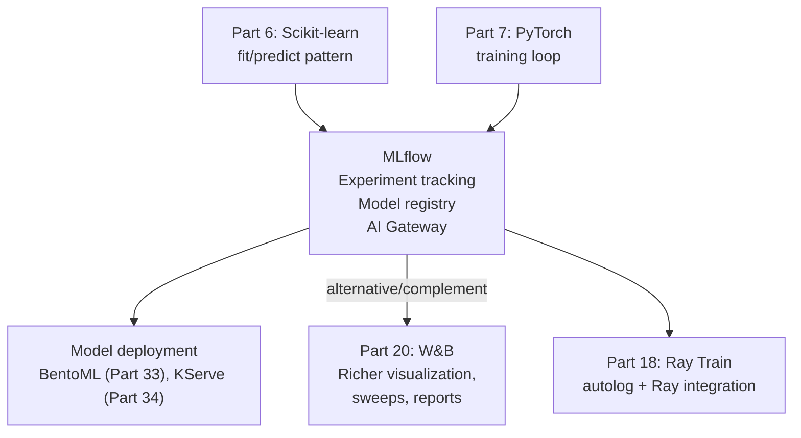

<!-- TEACHING_ORDER: verified -->
# Part 19: MLflow

> **Prerequisites:** Part 6 (Scikit-learn), Part 7 (PyTorch training loop), basic Python
> **Used later in:** Part 20 (W&B compared), MLOps pipelines, model registry workflows
> **Version anchor:** MLflow 2.18.x (mid-2026), MLflow AI Gateway, Recipes stable

---

## Why This Library Exists

### The problem: "which experiment produced that model?" is unanswerable without tooling

Before MLflow, the typical ML workflow looked like this: run `python train.py --lr 0.001 --dropout 0.3`, write accuracy to a CSV, save `model_v2_final_FINAL.pkl`. Next week, try to reproduce: which script version? Which data version? Which Python package versions?

Matei Zaharia (Apache Spark creator, Databricks co-founder) and colleagues at Databricks released MLflow in 2018 to address four specific gaps:
1. **Experiment tracking:** log parameters, metrics, artifacts per run — query across runs
2. **Project packaging:** reproducible ML code with environment spec
3. **Model packaging:** standard format with signatures and metadata
4. **Model registry:** versioning, staging (staging/production), lineage

MLflow became the de facto standard for ML experiment tracking. It is integrated with HuggingFace Trainer, PyTorch Lightning, Scikit-learn, Ray Train, and virtually every major ML framework. By 2026, MLflow also includes LLM-specific features: prompt tracking, LLM evaluation, and an AI Gateway (LLM proxy).

---

## Explain Like I Am 10

Imagine you are a scientist doing hundreds of experiments to find the best cookie recipe. Without MLflow: you write different numbers on different sticky notes and lose track. "Was the one with 2 cups of sugar better than the one with 1.5 cups? I can't remember."

MLflow is your perfect lab notebook. Every experiment is recorded: the ingredients (parameters), the result (metrics), and the actual cookies (model files). You can compare any two experiments side-by-side. When your boss asks "which recipe produced the best cookies?", you query the notebook in 5 seconds instead of searching through sticky notes for an hour.

---

## Mental Model

**MLflow is an ML lifecycle management platform: track experiments (parameters + metrics + artifacts), package models in a standard format, and manage model versions through a registry.**

```
ML experiment → mlflow.start_run() → log params/metrics/artifacts → end_run()
                                          ↓
                               MLflow Tracking Server (local or remote)
                                          ↓
                               Query runs: mlflow.search_runs()
                               Model registry: staging → production promotion
```

---

## Learning Dependency Graph



---

## Core Concepts

### 1. Experiments and runs

An **experiment** is a named group of runs (e.g., "LLM fine-tuning lr study"). A **run** records one execution of your training script with its own parameters, metrics, artifacts, and tags.

```python
import mlflow

# Set or create experiment
mlflow.set_experiment("my-lr-study")

# Run 1: lr=0.001
with mlflow.start_run(run_name="lr-0.001"):
    mlflow.log_param("lr", 0.001)
    mlflow.log_param("batch_size", 32)

    for epoch in range(10):
        train_loss = train_one_epoch(model, lr=0.001)
        val_acc    = evaluate(model)
        mlflow.log_metric("train_loss", train_loss, step=epoch)
        mlflow.log_metric("val_accuracy", val_acc, step=epoch)

    mlflow.log_artifact("confusion_matrix.png")
    mlflow.sklearn.log_model(model, "model")  # or mlflow.pytorch.log_model
```

### 2. Auto-logging

MLflow can automatically log parameters, metrics, and models from popular frameworks:

```python
import mlflow
from sklearn.linear_model import RandomForestClassifier
from sklearn.datasets import load_iris

mlflow.sklearn.autolog()   # auto-log all sklearn metrics + params + model

X, y = load_iris(return_X_y=True)
model = RandomForestClassifier(n_estimators=100, max_depth=5)
model.fit(X, y)
# MLflow automatically logged: n_estimators, max_depth, accuracy, confusion matrix, model file

# Also works for PyTorch Lightning, Transformers, XGBoost, LightGBM, etc.
mlflow.pytorch.autolog()
mlflow.transformers.autolog()
```

### 3. Model flavors and signatures

MLflow wraps models in "flavors" — a standard format that includes the model, its signature (input/output schema), and environment:

```python
import mlflow
import numpy as np
from mlflow.models import infer_signature

# Log model with signature
X_sample = np.random.rand(5, 10)
predictions = model.predict(X_sample)
signature = infer_signature(X_sample, predictions)

with mlflow.start_run():
    mlflow.sklearn.log_model(
        model,
        "model",
        signature=signature,
        input_example=X_sample[:1],
    )
```

The signature enforces input schema at deployment time, preventing mismatched features.

### 4. Model Registry

Promote models through staging → production lifecycle:

```python
import mlflow

client = mlflow.tracking.MlflowClient()

# Register a model from a run
run_id = "abc123..."
result = mlflow.register_model(
    f"runs:/{run_id}/model",
    "my-classifier",
)
print(f"Model version: {result.version}")

# Transition to staging → production
client.transition_model_version_stage(
    name="my-classifier",
    version=result.version,
    stage="Production",
)

# Load latest production model
model = mlflow.sklearn.load_model("models:/my-classifier/Production")
```

### 5. LLM tracking (MLflow 2.x)

```python
import mlflow

# Log LLM traces (prompts, responses, latency)
with mlflow.start_run():
    mlflow.log_param("model", "gpt-4o")
    mlflow.log_param("temperature", 0.7)

    # Log a prompt + response pair
    with mlflow.start_span("llm_call") as span:
        span.set_inputs({"prompt": "Explain RAG in one sentence"})
        response = call_llm("Explain RAG in one sentence")
        span.set_outputs({"response": response})
        span.set_attribute("latency_ms", 350)

    mlflow.log_metric("avg_latency_ms", 350)
    mlflow.log_metric("cost_usd", 0.002)
```

---

## Essential APIs

```python
import mlflow
import mlflow.sklearn, mlflow.pytorch

# Tracking
mlflow.set_tracking_uri("http://mlflow-server:5000")
mlflow.set_experiment("experiment-name")

with mlflow.start_run(run_name="optional-name"):
    mlflow.log_param("key", value)
    mlflow.log_params({"key1": v1, "key2": v2})
    mlflow.log_metric("name", value, step=epoch)
    mlflow.log_metrics({"train_loss": loss, "val_acc": acc}, step=epoch)
    mlflow.log_artifact("path/to/file.png")
    mlflow.log_artifacts("path/to/dir/")
    mlflow.set_tag("team", "llm-eng")
    mlflow.sklearn.log_model(model, "model", signature=sig)

# Query
runs = mlflow.search_runs(
    experiment_names=["experiment-name"],
    filter_string="params.lr = '0.001' AND metrics.val_acc > 0.9",
    order_by=["metrics.val_acc DESC"],
)

# Model registry
mlflow.register_model("runs:/RUN_ID/model", "model-name")
model = mlflow.sklearn.load_model("models:/model-name/Production")

# Auto-logging
mlflow.sklearn.autolog()
mlflow.pytorch.autolog()
```

---

## Beginner Examples

### Example 1: Track a Scikit-learn experiment

```python
import mlflow
import mlflow.sklearn
import numpy as np
from sklearn.datasets import make_classification
from sklearn.linear_model import LogisticRegression
from sklearn.model_selection import train_test_split
from sklearn.metrics import accuracy_score, f1_score

X, y = make_classification(n_samples=1000, n_features=20,
                            n_informative=10, random_state=42)
X_train, X_test, y_train, y_test = train_test_split(X, y, test_size=0.2,
                                                     random_state=42)

mlflow.set_experiment("logistic-regression-study")

for C in [0.01, 0.1, 1.0, 10.0, 100.0]:
    with mlflow.start_run(run_name=f"C={C}"):
        model = LogisticRegression(C=C, max_iter=1000)
        model.fit(X_train, y_train)
        preds = model.predict(X_test)

        acc = accuracy_score(y_test, preds)
        f1  = f1_score(y_test, preds)

        mlflow.log_param("C", C)
        mlflow.log_param("solver", "lbfgs")
        mlflow.log_metric("accuracy", acc)
        mlflow.log_metric("f1_score", f1)
        mlflow.sklearn.log_model(model, "model")

        print(f"C={C:<6}  acc={acc:.4f}  f1={f1:.4f}")

# Find best run
runs = mlflow.search_runs(
    experiment_names=["logistic-regression-study"],
    order_by=["metrics.f1_score DESC"],
)
print(f"\nBest run:")
print(f"  C={runs.iloc[0]['params.C']}")
print(f"  F1={runs.iloc[0]['metrics.f1_score']:.4f}")
```

---

## Intermediate Examples

### Example 2: PyTorch training with MLflow

```python
import mlflow
import mlflow.pytorch
import torch
import torch.nn as nn
from torch.utils.data import DataLoader, TensorDataset
from mlflow.models import infer_signature
import numpy as np

torch.manual_seed(0)
X = torch.randn(200, 16); y = (X[:, 0] > 0).long()
ds = TensorDataset(X, y)
dl = DataLoader(ds, batch_size=16, shuffle=True)

class TwoLayerNet(nn.Module):
    def __init__(self, hidden: int):
        super().__init__()
        self.net = nn.Sequential(
            nn.Linear(16, hidden), nn.ReLU(), nn.Linear(hidden, 2)
        )
    def forward(self, x): return self.net(x)

mlflow.set_experiment("pytorch-experiment")

for hidden in [32, 64, 128]:
    with mlflow.start_run(run_name=f"hidden={hidden}"):
        model = TwoLayerNet(hidden)
        opt   = torch.optim.Adam(model.parameters(), lr=1e-3)
        loss_fn = nn.CrossEntropyLoss()

        mlflow.log_params({"hidden": hidden, "lr": 1e-3, "epochs": 20})

        for epoch in range(20):
            epoch_loss = 0
            for xb, yb in dl:
                pred = model(xb)
                loss = loss_fn(pred, yb)
                opt.zero_grad(); loss.backward(); opt.step()
                epoch_loss += loss.item()
            mlflow.log_metric("train_loss", epoch_loss / len(dl), step=epoch)

        # Log model with signature
        sample_input = X[:2].numpy()
        with torch.no_grad():
            sample_output = model(torch.from_numpy(sample_input)).numpy()
        sig = infer_signature(sample_input, sample_output)
        mlflow.pytorch.log_model(model, "model", signature=sig)
        print(f"hidden={hidden}: final loss={epoch_loss/len(dl):.4f}")

print("\nRun 'mlflow ui' to view results in browser at http://localhost:5000")
```

---

## Internal Interview Knowledge

**Q: What is a model signature and why is it important for deployment?**
Strong answer: "A model signature defines the input and output schema: column names, types, and shapes. Example: `inputs: [{name: 'feature_1', type: float}, ...]`, `outputs: [{name: 'prediction', type: long}]`. At deployment, the signature is used to validate incoming requests — if a request sends integer data where float is expected, or sends 10 features when 20 are expected, MLflow raises an error before the model even runs. This prevents silent prediction errors from schema mismatches that are a common source of production incidents."

**Q: How does MLflow's model registry differ from just saving a file?**
Strong answer: "The model registry provides: (1) Versioning — every registered model gets a version number, with full lineage to the run that produced it. (2) Staging — models move through `None → Staging → Production → Archived` transitions, enabling controlled rollout. (3) Access control — only approved roles can promote to Production. (4) Lineage — every model in the registry links back to the experiment run, parameters, and code that produced it. This answers the audit question: 'why did the model make this prediction on date X?' Loading a model is deterministic: `load_model('models:/name/Production')` always loads the current production version."

---

## Production AI Usage

**Databricks:** MLflow was created at Databricks and is deeply integrated into the Databricks platform. Databricks Managed MLflow serves millions of experiment tracking calls per day from enterprise ML teams.

**Microsoft Azure ML:** Azure ML uses MLflow as its experiment tracking backend. Azure ML runs log to MLflow format, and the Azure ML Model Registry is MLflow-compatible.

**Shopify:** Uses MLflow to track thousands of ML experiments across product recommendation, search ranking, and fraud detection models.

**Uber (Michelangelo):** Uber's Michelangelo ML platform uses MLflow-style tracking for experiment lineage and model versioning.

---

## Common Mistakes

**Mistake 1: Logging metrics inside a closed run**
```python
# Bug: run context is closed — metric not logged
with mlflow.start_run():
    model.fit(X, y)
# ← run ended here

mlflow.log_metric("test_acc", 0.95)   # does nothing or raises error!

# Fix: log inside the context
with mlflow.start_run():
    model.fit(X, y)
    mlflow.log_metric("test_acc", evaluate(model, X_test, y_test))
```

**Mistake 2: Not setting tracking URI for remote server**
```python
# Bug: logs to local ./mlruns — different machines see different experiments
mlflow.set_experiment("my-exp")

# Fix: always set tracking URI first in production
mlflow.set_tracking_uri("http://mlflow-server:5000")
mlflow.set_experiment("my-exp")
```

---

## Cheat Sheet

```python
import mlflow

mlflow.set_tracking_uri("http://mlflow:5000")   # or local path
mlflow.set_experiment("my-exp")

with mlflow.start_run(run_name="run-1"):
    mlflow.log_params({"lr": 0.001, "batch": 32})
    for epoch in range(N):
        mlflow.log_metric("loss", loss, step=epoch)
    mlflow.sklearn.log_model(model, "model", signature=sig)

# Query
runs = mlflow.search_runs(order_by=["metrics.val_acc DESC"])
best_run_id = runs.iloc[0].run_id

# Registry
mlflow.register_model(f"runs:/{best_run_id}/model", "my-model")
model = mlflow.sklearn.load_model("models:/my-model/Production")
```

---

## Interview Question Bank

### Top 25 Beginner

**Q1: What are the four main components of MLflow?** A: (1) Tracking: log parameters, metrics, and artifacts per run, with a tracking server for central storage and UI for comparison. (2) Projects: package ML code with `MLproject` file specifying entry points and conda/Docker environment for reproducibility. (3) Models: standard model format with flavors (sklearn, pytorch, onnx, etc.) that wraps the model with metadata, signature, and environment. (4) Model Registry: versioned model store with staging lifecycle (staging/production/archived), access control, and lineage to producing runs.

**Q2: What is an MLflow run vs an experiment?** A: An experiment is a named collection of runs, typically a study (e.g., "BERT fine-tuning hyperparameter search"). A run is a single execution with logged parameters (e.g., lr=0.001), metrics (loss, accuracy), artifacts (model file, plots), and tags. Runs belong to exactly one experiment. You query across runs within an experiment to find the best configuration.

**Q3: How does MLflow autologging work?** A: Call `mlflow.sklearn.autolog()` (or pytorch, transformers, xgboost, etc.) before fitting a model. MLflow monkey-patches the framework's fit/train function to log parameters (all constructor args), metrics (cross-validation scores, loss curves), and the model artifact automatically after training completes. No explicit log calls needed. Useful for quick experimentation; explicit logging preferred for production to control what is recorded.

**Q4: How do you compare two MLflow runs?** A: `mlflow.search_runs(experiment_names=["name"], order_by=["metrics.val_acc DESC"])` returns a Pandas DataFrame with one row per run, columns for parameters, metrics, and tags. Filter with `filter_string`: SQL-like syntax, e.g., `"params.lr = '0.001' AND metrics.val_acc > 0.9"`. MLflow UI (run `mlflow ui`) provides visual comparison including parallel coordinates plots and metric time series overlay.

**Q5: What is the MLflow AI Gateway?** A: MLflow AI Gateway is a proxy server for LLM API calls (OpenAI, Anthropic, Azure OpenAI, etc.). Configure routes that map endpoint names to provider credentials. Client code uses the Gateway URL instead of the provider directly — no provider API keys in client code, centralized usage tracking, rate limiting, and fallback routing. Useful in enterprises to route LLM calls through a controlled proxy with audit logging.

**Q6: How do you log a model artifact in MLflow?** A: `mlflow.pytorch.log_model(model, "model", signature=signature)` — the `"model"` is the artifact path within the run. Alternatively: `mlflow.log_artifact("path/to/file")` for arbitrary files. The signature (`mlflow.models.ModelSignature`) captures input/output schema for type-checking at serving time. Access artifacts via `mlflow.get_artifact_uri("model")` to get the S3/filesystem URL.

**Q7: What is an MLflow model flavor?** A: A flavor is a format for saving/loading models. Common flavors: `python_function` (generic — works with any framework), `sklearn`, `pytorch`, `tensorflow`, `onnx`, `transformers`. A logged model typically has multiple flavors — you can load it as `mlflow.pyfunc.load_model()` (framework-agnostic) or `mlflow.pytorch.load_model()` (PyTorch-specific). The `python_function` flavor defines `predict(input)` which works for batch inference without framework knowledge.

**Q8: What does `mlflow.set_tracking_uri()` do?** A: Sets where MLflow writes run data. Options: (1) `""` (empty): logs to `./mlruns` directory locally. (2) `"http://tracking-server:5000"`: sends data to a remote tracking server. (3) `"sqlite:///mlruns.db"`: SQLite file for small teams. (4) `"databricks"`: Databricks MLflow hosted service. Set once at script startup; subsequent `mlflow.log_*` calls go to this URI. In Kubernetes: pass via environment variable `MLFLOW_TRACKING_URI`.

**Q9: How do you register a model in the MLflow Model Registry?** A: After logging a model in a run: `mlflow.register_model("runs:/RUN_ID/model", "ModelName")`. This creates a new registered model (or new version if name already exists). Sets initial stage to "None". Transition to staging: `client.transition_model_version_stage("ModelName", version=1, stage="Staging")`. Load registered model: `mlflow.pyfunc.load_model("models:/ModelName/Staging")` — always loads the latest version in that stage.

**Q10: What is `mlflow.start_run()` and how do nested runs work?** A: `with mlflow.start_run() as run:` starts a new run and sets it as the active run. All subsequent `mlflow.log_*` calls write to this run. Nested runs: `with mlflow.start_run(nested=True):` creates a child run. Parent run ID is stored in the child's tags. Use nested runs for: hyperparameter search (parent = study, children = individual trials), cross-validation folds (parent = model, children = each fold).

**Q11: How does MLflow handle large artifact storage (models > 1GB)?** A: MLflow uses artifact backends — separate from the tracking server. Default: local filesystem. Production: configure S3, Azure Blob Storage, or GCS as the artifact store. Large models are uploaded to the artifact store; the tracking server stores only the reference URI. Client download: `mlflow.artifacts.download_artifacts("runs:/RUN_ID/model")` downloads from the artifact store to local disk. For very large models, direct S3 paths are preferable to avoid tracking server as a network proxy.

**Q12: What is MLflow Projects and when would you use it?** A: MLflow Projects packages code for reproducible execution. `MLproject` file specifies: entry points (commands to run), parameters (with types and defaults), environment (conda, docker, or system). Run: `mlflow run https://github.com/org/repo -P lr=0.01 -P epochs=10`. Use it for: sharing reproducible experiments with teammates, running experiments programmatically from a CI/CD pipeline, parameterized batch experiment runs. Less common in 2024 (Docker-based CI has largely replaced it).

**Q13: How do MLflow tags differ from parameters?** A: Parameters are hyperparameters that define the experiment (immutable after run starts, searchable, shown in run comparison tables): `mlflow.log_param("lr", 0.001)`. Tags are arbitrary metadata (mutable after run, used for organization and filtering): `mlflow.set_tag("team", "nlp")`. Common tag uses: `mlflow_user` (auto-set), `mlflow.source.name` (script path), custom tags for filtering by team, dataset, or model type.

**Q14: How does MLflow's `pyfunc` model format work?** A: `mlflow.pyfunc.PythonModel` is a Python class with a `predict(context, model_input)` method. To create a custom `pyfunc` model: subclass `PythonModel`, implement `predict`, and call `mlflow.pyfunc.log_model("model", python_model=MyModel(), artifacts={"weights": "path/to/weights"})`. The `context` provides access to logged artifacts at serving time. This is the escape hatch for custom serving logic (preprocessing, postprocessing, ensemble) that standard flavors don't support.

**Q15: What is the MLflow tracking server's storage architecture?** A: Two separate stores: (1) Backend store (SQLite, PostgreSQL, MySQL): metadata — runs, parameters, metrics, tags. Queried for search/comparison. (2) Artifact store (local filesystem, S3, GCS, Azure Blob): model files, plots, large files. Referenced by URI in the backend store. Production deployment: PostgreSQL backend + S3 artifact store. The tracking server process handles API calls, reads/writes to backend store, proxies artifact uploads/downloads (or redirect clients to artifact store directly with `artifact_upload_download_proxy=false`).

**Q16: How do you serve an MLflow model?** A: `mlflow models serve -m "models:/MyModel/Production" --port 5001`. Starts a Flask server that accepts POST requests with JSON input and returns predictions. For production: don't use the Flask server (not production-grade). Instead: load the model with `mlflow.pyfunc.load_model()` inside your production serving framework (Ray Serve, Triton, FastAPI) and call `model.predict(input_df)`. MLflow's serve command is for local testing only.

**Q17: What is MLflow Recipes (formerly Pipelines)?** A: MLflow Recipes is an opinionated ML workflow framework with standardized steps: ingest → split → transform → train → evaluate → register. Each step has defined inputs/outputs. Configuration via YAML files. Benefits: enforces consistency across teams, built-in best practices (train/test split, feature importance plots, model card generation). Drawback: restrictive — doesn't support non-tabular data well. Recipes is used in organizations that want standardized ML workflows rather than ad-hoc notebook experiments.

**Q18: How does MLflow integrate with Spark for large-scale training?** A: `mlflow.spark.log_model(spark_model, "model")` saves Spark MLlib models. For PySpark training runs: use `mlflow.start_run()` inside a Spark driver; `mlflow.log_param/metric` work on the driver. Spark worker results must be aggregated and logged from the driver (workers don't have access to the active run). Databricks' integration is tightest: Databricks notebooks auto-configure MLflow tracking URI, runs appear in the Databricks UI.

**Q19: What is `mlflow.evaluate()` and what does it produce?** A: `mlflow.evaluate(model="models:/MyModel/1", data=eval_df, targets="label", model_type="classifier")` runs standard evaluation (accuracy, F1, AUC-ROC for classifiers) and logs all metrics + plots (confusion matrix, ROC curve) as artifacts to the current run. For LLMs: `model_type="text"` with custom metrics via `mlflow.metrics.make_metric()`. Produces an `EvaluationResult` object with metrics dict. Enables automated model evaluation in CI/CD pipelines.

**Q20: How does MLflow handle experiment permissions and multi-tenancy?** A: Open-source MLflow has no built-in authentication/authorization (anyone with tracking URI access can read/write all experiments). Workarounds: (1) Deploy tracking server behind reverse proxy with auth (Nginx + OAuth). (2) Use Databricks MLflow which has role-based access control (RBAC) built in. (3) Network-level isolation: separate tracking servers per team. (4) Read-only tracking server: expose a separate read-only endpoint for dashboards. For multi-tenant enterprises, managed MLflow (Databricks, Azure ML) is recommended.

**Q21: What is `mlflow.log_metric()` with step parameter?** A: `mlflow.log_metric("train_loss", 0.45, step=100)` logs a metric at a specific step (epoch, batch). MLflow stores time series: each `log_metric` call is one point in the series. The UI shows metrics as time series plots. Without `step`, metrics are logged as scalars (no time series). For training: log every N batches with step=batch_num for fine-grained loss curves, or every epoch for coarser tracking. Querying the best metric: `mlflow.search_runs(..., order_by=["metrics.val_loss ASC"])`.

**Q22: How do you delete a run or experiment in MLflow?** A: `client.delete_run(run_id)` marks a run as deleted (lifecycle stage = "Deleted", not physically removed). `client.delete_experiment(experiment_id)` marks the experiment deleted. Physical deletion: `mlflow gc --backend-store-uri ...` cleans up deleted runs and their artifacts after a grace period. The soft-delete approach allows recovery: `client.restore_run(run_id)`. Always use soft delete first; run `mlflow gc` during maintenance windows.

**Q23: What is the MLflow Model Registry webhook?** A: Webhooks fire HTTP POST requests when registry events occur: model version created, transitioned to stage, or comment added. Configure: `client.create_registry_webhook(events=["TRANSITION_REQUEST_TO_STAGING_CREATED"], url="https://ci-server.example.com/trigger")`. Use for CI/CD automation: model transitions to Staging → trigger integration test pipeline → if tests pass, auto-promote to Production. Not available in open-source MLflow; requires Databricks MLflow.

**Q24: How does MLflow handle model versioning?** A: Each `mlflow.register_model()` call creates a new version (auto-incremented integer). Versions track: run that produced them, creation time, description, stage, and tags. Version immutability: model artifact for a version is never modified after registration (audit trail). To update a model: train a new model → log → register as new version → transition new version to Production → archive old version. The Registry is a stage manager, not a file manager.

**Q25: What are MLflow system metrics?** A: MLflow can automatically log system metrics (CPU utilization, GPU utilization, memory, disk I/O) during training runs via `mlflow.enable_system_metrics_logging()`. Collected every `system_metrics_sampling_interval` seconds. Useful for: (1) Correlating training efficiency with infrastructure metrics. (2) Detecting GPU underutilization. (3) Identifying memory pressure. (4) Billing cost attribution by computing GPU-hours per run. System metrics are logged as standard MLflow metrics — queryable and plottable in the UI.

### Top 25 Intermediate

**Q26: Explain MLflow's backend store schema and query optimization.** A: Backend store schema (SQL): tables — `experiments`, `runs`, `params`, `metrics`, `tags`, `model_versions`. Each `runs` row has experiment_id, run_uuid, lifecycle_stage, start_time. Metrics are stored as individual rows (metric_key, value, step, timestamp) — one row per log_metric call. At scale: a run with 100K training steps × 5 metrics = 500K metric rows. Query optimization: index on `(experiment_id, lifecycle_stage)` for run listing; index on `(run_uuid, key)` for metric retrieval. For large experiments, PostgreSQL with proper indexing handles millions of runs.

**Q27: How does MLflow's model signature validation work at serving time?** A: `ModelSignature` captures input schema (column names, types) and output schema. At `log_model` time, pass `signature=mlflow.models.infer_signature(X_train, model.predict(X_train))`. At serving time, the pyfunc model validates: input column names match, dtypes are compatible (with coercion for compatible types). Validation errors return HTTP 400 with descriptive message. Use `signature=ModelSignature(inputs=Schema([ColSpec("double", "feature_1")]))` for manual schema definition when inference-time data format differs from training.

**Q28: How do you implement custom MLflow metrics for LLM evaluation?** A: ```python
from mlflow.metrics import make_metric
def toxicity_eval(inputs, predictions, targets=None):
    scores = [toxicity_classifier(p) for p in predictions]
    return MetricValue(scores=scores, aggregate_results={"mean": np.mean(scores)})

toxicity_metric = make_metric(eval_fn=toxicity_eval, greater_is_better=False, name="toxicity")
mlflow.evaluate(model, eval_data, targets="reference", extra_metrics=[toxicity_metric])
```
Custom metrics integrate with `mlflow.evaluate()` and are logged as standard MLflow metrics — queryable and plottable.

**Q29: What is the MLflow Spark connector's role in feature engineering pipelines?** A: In Databricks/Spark environments, MLflow tracks Spark ML pipeline runs: log Spark MLlib pipeline artifacts, log dataset statistics (schema, row counts), and capture data lineage (which Delta table version was used). The connector auto-logs: pipeline stages, cross-validation parameters, train/test split info. At query time: `mlflow.search_runs(filter_string="tags.delta_table_version = '42'")` finds all runs using that specific data version. Enables reproducibility tracing from model back to exact training data snapshot.

**Q30: How does MLflow handle large-scale hyperparameter search across 1,000 trials?** A: Pattern with Ray Tune + MLflow: each trial calls `mlflow.start_run(nested=True)` and logs its parameters/metrics. The outer run represents the full study. For 1,000 trials × 100 epochs × 5 metrics = 500K metric rows logged concurrently. Tracking server becomes a bottleneck. Solutions: (1) Async logging (`mlflow.log_metric_async` where available). (2) Log every 10th epoch (reduce write rate 10×). (3) Use local file backend during search, then copy top-K runs to central server. (4) Batch logging: `client.log_batch(run_id, metrics=[...], params=[...])` sends all metrics in one HTTP call.

**Q31: What is MLflow's approach to dataset tracking?** A: `mlflow.log_input(mlflow.data.from_pandas(df, source="s3://bucket/data.parquet"), context="training")` logs dataset metadata: schema, row count, hash (for change detection), and the source URI. The hash enables change detection — if the same source URI is logged with a different hash, the data changed. Dataset objects are linked to runs. Query: find all runs trained on dataset with hash "abc123". In Databricks: Delta table versions are tracked automatically.

**Q32: How does MLflow handle model comparison across frameworks?** A: MLflow's `pyfunc` flavor provides a framework-agnostic interface: `model.predict(df)` works regardless of whether the underlying model is sklearn, PyTorch, TensorFlow, or XGBoost. This enables apples-to-apples comparison: log all models as `pyfunc`, then `mlflow.evaluate()` compares them with the same metrics. The evaluation result includes per-model metric tables. Model registry tracks all versions with their lineage, enabling multi-framework model comparison dashboards.

**Q33: How do you implement MLflow callbacks for HuggingFace Transformers training?** A: HuggingFace Trainer supports MLflow autologging: `os.environ["MLFLOW_EXPERIMENT_NAME"] = "my-experiment"`. Then `mlflow.transformers.autolog()` before `Trainer.train()`. This logs: all TrainingArguments as parameters, eval metrics per epoch, the model artifact (HF model card + weights). For custom logging: use `trainer.add_callback(MLflowCallback())` which calls `mlflow.log_metric` at each evaluation step. The HuggingFace MLflow integration handles tokenizer and model config logging automatically.

**Q34: What is MLflow Model Monitoring and how does it detect drift?** A: MLflow doesn't have built-in model monitoring (that's more Evidently, WhyLogs territory). But: `mlflow.evaluate()` with production data enables batch monitoring — run evaluation weekly on production prediction samples, log results as a monitoring run in a dedicated experiment. Drift detection: compare metrics between "baseline" run (validation data) and "production" run (recent traffic). Custom metrics can include PSI (Population Stability Index) for input feature drift, KL divergence for output distribution shift.

**Q35: How does the MLflow tracking server scale under high concurrency?** A: Default Flask tracking server is single-threaded — not production-grade. Production deployment: `gunicorn --workers 4 mlflow.server:app` or use MLflow's built-in `--gunicorn-opts "--workers 4"`. Database backend: PostgreSQL handles concurrent writes well (row-level locking). Bottleneck: `log_metric` calls at high rate (1K+ per second) create contention on the metrics table. Solutions: (1) Increase DB connection pool (`MLFLOW_SQLALCHEMY_POOL_SIZE`). (2) Read replicas for dashboard queries. (3) Use Databricks MLflow which auto-scales the tracking server.

**Q36: How do you manage MLflow experiment lifecycle (archiving, cleanup)?** A: Lifecycle management: (1) Experiments should be archived when no longer active: `client.rename_experiment(id, "archive/old-experiment")` + `client.delete_experiment(id)`. (2) Scheduled cleanup: `mlflow gc` deletes physically deleted runs after configurable retention period. (3) Artifact retention: customize per-experiment with artifact cleanup scripts (MLflow doesn't auto-delete artifacts — they're in S3). (4) Run retention policy: script using `client.search_runs(filter_string="attributes.start_time < 30-days-ago")` to identify old runs for deletion. MLflow has no built-in TTL — implement via cron jobs.

**Q37: What is MLflow's `log_table` and `load_table`?** A: `mlflow.log_table({"input": inputs, "output": outputs}, artifact_file="eval_results.json")` logs a table as a JSON artifact. `mlflow.load_table("eval_results.json", run_ids=["run1", "run2"])` merges tables from multiple runs into a single DataFrame. Used for: logging per-sample evaluation results from multiple runs, then merging for analysis. Particularly useful in LLM evaluation — log prompt/response pairs with scores per run, then compare across model versions.

**Q38: How do you handle secrets in MLflow parameters?** A: Never log secrets as MLflow parameters (they're stored in plaintext in the backend database). Best practices: (1) Use environment variables for API keys, access credentials. (2) Log a non-secret identifier instead: `mlflow.log_param("model_api", "openai-gpt4")` instead of logging the API key. (3) For reproducibility: log the config file path (which contains key references) rather than the values. (4) Use HashiCorp Vault / AWS Secrets Manager and log only the secret name/version as a parameter. MLflow has no secret encryption layer.

**Q39: How does MLflow's `pyfunc` model support preprocessing and postprocessing?** A: Override `load_context(context)` for initialization (load tokenizer, scaler) and `predict(context, model_input)` for the full pipeline:
```python
class TextClassifier(mlflow.pyfunc.PythonModel):
    def load_context(self, context):
        self.tokenizer = AutoTokenizer.from_pretrained(context.artifacts["tokenizer"])
        self.model = torch.load(context.artifacts["model"])
    def predict(self, context, model_input):
        tokens = self.tokenizer(model_input["text"].tolist(), return_tensors="pt")
        with torch.no_grad(): logits = self.model(**tokens).logits
        return pd.DataFrame({"label": logits.argmax(-1).numpy()})
```
This encapsulates the full preprocessing→inference pipeline in one MLflow model.

**Q40: How does MLflow integrate with Kubernetes for model training jobs?** A: `mlflow run . -b kubernetes --backend-config k8s-config.yaml` submits an MLflow Project as a Kubernetes Job. The k8s config specifies: Docker image, job template (resource requests, secrets). The training job runs in a Kubernetes pod with the environment from the MLproject file. MLflow tracking: the pod needs network access to the tracking server; pass `MLFLOW_TRACKING_URI` as an environment variable via Kubernetes secret. Results appear in the tracking server in real time as the pod logs metrics.

**Q41: What is MLflow's model card artifact?** A: Model cards are standardized documentation of a model: intended use, training data, evaluation metrics, limitations, ethical considerations. MLflow supports logging model cards as YAML artifacts: `mlflow.log_artifact("model_card.yaml")`. In HuggingFace Transformers autolog: the model card from the HF Hub is automatically logged. Some teams use structured model card schemas validated via JSON Schema before logging. Model registry description field provides a lightweight model card in the UI.

**Q42: How does MLflow handle distributed training metric logging?** A: In multi-GPU/multi-node training, logging from all workers creates duplicate entries. Best practice: log only from rank-0 (the master process). In PyTorch DDP: `if torch.distributed.get_rank() == 0: mlflow.log_metric(...)`. In HuggingFace Trainer: autolog automatically handles rank filtering. For worker-specific metrics (per-GPU memory, per-worker throughput): use tags to identify the worker rank: `mlflow.set_tag("worker_rank", str(rank))` and log from all workers with explicit run IDs.

**Q43: What is `mlflow.client.MlflowClient` and when is it preferred over the fluent API?** A: `MlflowClient` is the low-level API for direct CRUD operations: managing runs, experiments, model registry versions programmatically. Prefer over fluent API when: (1) Managing multiple runs simultaneously (fluent API has one active run globally). (2) CI/CD pipelines that create/query runs without running training. (3) Model registry operations (transition stages, add descriptions). (4) Querying historical runs for analysis dashboards. The fluent API (`mlflow.log_metric`, etc.) is a convenience wrapper around `MlflowClient` that manages the active run automatically.

**Q44: How do you implement MLflow experiment comparison in Python?** A: ```python
df = mlflow.search_runs(
    experiment_names=["bert-finetuning"],
    filter_string="params.model_name = 'bert-base' AND metrics.val_f1 > 0.85",
    order_by=["metrics.val_f1 DESC"],
    max_results=50
)
# df has columns: run_id, params.*, metrics.*, tags.*
best_run_id = df.iloc[0]["run_id"]
model = mlflow.pytorch.load_model(f"runs:/{best_run_id}/model")
```
The search API returns a Pandas DataFrame — use for automated model selection in CI/CD.

**Q45: What is MLflow's Deployments API for LLMs?** A: `mlflow.deployments` provides a standardized client for LLM provider APIs: `client = mlflow.deployments.get_deploy_client("openai")`, `response = client.predict(endpoint="completions", inputs={"prompt": "...", "max_tokens": 100})`. Abstraction over OpenAI, Anthropic, Azure OpenAI, Bedrock. Combined with AI Gateway: all LLM calls go through the Gateway proxy — single tracking point for costs, latency, and errors. Enables provider switching without changing application code.

**Q46: How do you track data lineage in MLflow?** A: Complete lineage: (1) Log dataset with hash: `mlflow.log_input(dataset_obj)`. (2) Log code version: `mlflow.set_tag("mlflow.source.git.commit", git_commit)`. (3) Log preprocessing artifact: save the feature pipeline as an MLflow model artifact. (4) Register trained model with link to producing run. Query lineage: given model version → find producing run → find logged dataset → find dataset hash → find raw data source. MLflow doesn't enforce lineage; it provides the storage — you implement the logging discipline.

**Q47: What is MLflow's approach to parameter logging types?** A: Parameters are always logged as strings (MLflow's backend store is string-keyed). `mlflow.log_param("lr", 0.001)` stores as `"0.001"`. `mlflow.search_runs(filter_string="params.lr = '0.001'")` — note the quotes. Type coercion when loading: the DataFrame returned by `search_runs` has `params.*` columns as strings — cast to float for plotting. `mlflow.log_params({...})` accepts a dict and logs all as strings. Metrics are stored as float64 with step.

**Q48: How does MLflow handle model approval workflows in the registry?** A: Open-source MLflow has no built-in approval workflow. Pattern: (1) Stage-based approvals: model transitions from "None" → "Staging" automatically (via CI). (2) "Production" transition requires human approval: webhook fires on staging transition → creates JIRA ticket / Slack message → human reviews and calls `client.transition_model_version_stage(..., stage="Production")`. (3) Databricks MLflow adds proper approval workflows with email notifications and approval audit logs.

**Q49: What is MLflow's relationship with the OpenTelemetry standard?** A: MLflow uses OpenTelemetry for LLM application tracing (in `mlflow.tracing`). LLM calls instrumented with `@mlflow.trace` emit spans with: input prompt, output text, latency, token counts. Traces are stored in the MLflow backend and displayed in the Traces UI tab. Standard OpenTelemetry exporters can forward traces to Jaeger, Zipkin, or Datadog. MLflow tracing complements (not replaces) run/metric tracking — it's the observability layer for production inference.

**Q50: How do you implement a model champion/challenger comparison with MLflow?** A: ```python
with mlflow.start_run(run_name="champion_vs_challenger") as parent:
    # Production model (champion)
    with mlflow.start_run(run_name="champion", nested=True):
        champion_result = evaluate_model(champion_model, test_data)
        mlflow.log_metrics(champion_result)
    # New model (challenger)
    with mlflow.start_run(run_name="challenger", nested=True):
        challenger_result = evaluate_model(challenger_model, test_data)
        mlflow.log_metrics(challenger_result)
    # Log comparison
    mlflow.log_metric("challenger_wins", int(challenger_result["f1"] > champion_result["f1"]))
```
The parent run represents the comparison; children are the individual evaluations.

### Top 25 Advanced

**Q51: Design an MLflow deployment for 100 data scientists with experiment isolation and cost attribution.** A: Architecture: (1) PostgreSQL backend (RDS Multi-AZ) with experiment-level namespacing. (2) S3 artifact store with per-team prefixes (`s3://mlflow/team-a/`, `s3://mlflow/team-b/`). (3) Tracking server: 4-replica gunicorn deployment behind ALB. (4) Isolation: separate experiments per team, naming convention enforced by pre-logging hook. (5) Cost attribution: experiment tags `team`, `project`, `cost_center`. Cron job aggregates metrics: `SELECT tags['cost_center'], SUM(end_time - start_time) as gpu_hours FROM runs WHERE tags['gpu_count'] > 0`. (6) Quotas: pre-flight check before each run that team hasn't exceeded monthly quota. (7) CI/CD integration: each PR triggers `mlflow run` via GitHub Actions with standard tracking URI.

**Q52: How would you implement MLflow-based model governance for regulated industries?** A: Governance requirements: audit trail, approval workflows, model documentation, bias testing. Implementation: (1) Immutable run history: disable run deletion for regulatory experiments (implement via reverse proxy that blocks DELETE/update calls). (2) Model cards: mandatory model card artifact (validated schema) before staging transition. (3) Bias evaluation: `mlflow.evaluate()` with fairness metrics (demographic parity, equalized odds) logged as required metrics. (4) Approval chain: model transitions require sign-off from data scientist + model risk manager + compliance officer — implemented via Jira workflow + MLflow webhook. (5) Audit log: all registry operations logged to immutable audit trail (CloudTrail for Databricks, or intercepting proxy for self-hosted). (6) Retention: runs and artifacts retained for 7 years (financial services requirement) — S3 Glacier for old artifacts.

**Q53: How does MLflow's search_runs query API compare to direct SQL?** A: `mlflow.search_runs` filter_string supports: parameter comparisons (`params.lr < 0.01`), metric comparisons (`metrics.val_loss < 0.5`), tag matching (`tags.team = 'nlp'`), time filters (`attributes.start_time > 1700000000000`). Limitations vs SQL: no joins, no aggregate functions (use Pandas after retrieval), no subqueries. Performance: `max_results=500` default — increase for full scans. For complex analytics: connect directly to PostgreSQL backend and write SQL: `SELECT r.run_uuid, m.value FROM runs r JOIN metrics m ON r.run_uuid = m.run_uuid WHERE m.key = 'val_loss' ORDER BY m.value ASC LIMIT 10`.

**Q54: How would you implement automated model promotion based on MLflow metrics?** A: CI/CD pipeline: (1) New model registered → webhook triggers evaluation job. (2) Evaluation job: loads model via `mlflow.pyfunc.load_model("models:/ModelName/None")`, runs on held-out test set, logs metrics to MLflow. (3) Gating logic: compare against "Production" model metrics: `champion = mlflow.search_model_versions(filter_string="name='ModelName' AND tags.stage='Production'")`. Challenger must beat champion by >1% on primary metric AND meet latency SLA. (4) If gates pass: `client.transition_model_version_stage("ModelName", version=new_version, stage="Production")`. (5) Auto-archive old production version. (6) Slack notification with comparison metrics. (7) Rollback trigger: production monitoring job detects degradation → re-transition old version to Production.

**Q55: Explain MLflow's concurrent run handling and race conditions.** A: Race conditions: (1) Concurrent writes to the same run from multiple processes. MLflow doesn't prevent this — each `log_metric` is an atomic write but the calling order is nondeterministic. For distributed training: restrict logging to rank-0 only. (2) Model version races: two jobs simultaneously register the same model name → both get new versions (auto-increment), no data loss, but versions may arrive out of order. (3) Stage transition races: two jobs both promote different versions to Production → last write wins. Prevent with model registry locks (not built in — use external mutex). (4) Artifact overwrites: `log_artifact` to the same path overwrites — use run ID in artifact paths for uniqueness.

**Q56: How does MLflow's model serving infrastructure compare to dedicated serving systems?** A: MLflow `mlflow models serve` is development-only: Flask WSGI, single process, no batching, no GPU, no scaling. Production comparison: (1) Ray Serve: auto-scaling, batching, multi-replica — better for throughput. (2) Triton Inference Server: maximum performance via TRT/ONNX, complex configuration — better for latency-critical GPU serving. (3) BentoML: packaging + serving + containerization, easier multi-framework support. (4) MLflow's value is NOT in serving — it's in experiment tracking, model registry, and versioning. Deploy registered models via your preferred serving stack by loading `mlflow.pyfunc.load_model()`.

**Q57: What are MLflow's limitations for very long training runs (weeks)?** A: Issues: (1) Log rate: logging 1K metrics/sec for weeks → hundreds of millions of rows in the metrics table → PostgreSQL query slowdown. Mitigation: log at reduced frequency (every 100 batches), use `log_batch` for efficiency. (2) Artifact accumulation: saving checkpoints every hour for 2 weeks = 336 checkpoints. Use `num_to_keep=3` pattern to delete old checkpoints via script. (3) Run timeout: some tracking servers impose max run duration (Databricks: 90 days). (4) UI performance: displaying millions of metric points causes browser slowdown. Downsample metric series before display via custom dashboard. (5) Connection pool exhaustion: training job holds DB connections for weeks — ensure pool recycling.

**Q58: How do you implement multi-objective model selection with MLflow?** A: When optimizing multiple objectives (accuracy + latency + fairness): (1) Log all objectives as metrics in each run. (2) Pareto front computation: query all runs → compute Pareto-optimal set (no run dominates another in all objectives). (3) Scalarization: `final_score = w1 * accuracy + w2 * (1 - latency/sla) + w3 * fairness` — log as single metric for simple selection. (4) Interactive selection: MLflow UI parallel coordinates plot visualizes multi-dimensional tradeoffs. (5) Automated selection with constraints: `df[df['metrics.latency'] < 100].sort_values('metrics.accuracy', ascending=False).iloc[0]` — filter by hard constraints, rank by primary objective.

**Q59: Explain MLflow's integration with DVC for data version control.** A: MLflow + DVC: DVC tracks large data files in Git; MLflow tracks experiment metadata. Integration pattern: (1) DVC commit data → `dvc push` → S3. DVC revision stored as git tag. (2) MLflow run: `mlflow.set_tag("dvc_revision", subprocess.check_output(["dvc", "status", "--json"]))`. (3) Training: DVC checkout specific revision, train, log metrics to MLflow. (4) Full lineage: MLflow run → DVC revision → S3 data version. Reproduce: checkout git commit → `dvc pull` → `mlflow run`. DVC provides immutable data versions; MLflow provides immutable experiment records.

**Q60: How would you build a multi-armed bandit model selection system using MLflow?** A: System: (1) Models registered in MLflow registry with `exploration_count` and `reward_sum` tags updated per request. (2) Thompson sampling: sample from Beta(reward_sum + 1, exploration_count - reward_sum + 1) per model → route to argmax model. (3) Reward signal: logged after inference (user rating, task completion). (4) Update: `client.set_model_version_tag(name, version, "reward_sum", new_reward)` — MLflow tags as bandit state store. (5) Exploration: new models start with `exploration_count=0` → high uncertainty → high exploration probability. (6) Monitoring: run ID logged per request for audit. Dashboard shows per-model reward rates over time. Limitation: MLflow tag updates are not atomic — use Redis for high-QPS bandits.

**Q61: What are the storage cost implications of a large MLflow deployment?** A: Cost breakdown for 1,000 ML engineers × 10 runs/day × 1 year: (1) Metric rows: 1,000 × 10 × 100 epochs × 5 metrics = 5M rows/day × 365 = 1.8B metric rows/year. PostgreSQL: ~1.8TB for metrics table. (2) Artifacts: 1,000 × 10 × 1GB model artifacts = 10TB/day × 365 = 3.65PB/year (unsustainable). Policy: (a) Only register top-K models; (b) Auto-delete non-registered artifacts after 30 days. (3) S3 costs: Glacier for old artifacts (0.004/GB/month) vs S3 Standard (0.023/GB/month). (4) RDS costs: r6g.8xlarge (32 CPU, 256GB RAM) for PostgreSQL = $3,000/month. Total: $50K–200K/year for large deployments — justify by tracking training compute costs (10× higher).

**Q62: How does MLflow handle model schema enforcement?** A: Model signatures enforce schema at predict time. Hard enforcement (raises exception on mismatch): set `mlflow.models.set_model(inputs=schema, enforce_schema=True)`. Soft enforcement (coerces compatible types): default behavior — float64 input coerced to float32 if schema requires float32. Custom validators: override `PythonModel.predict` to add domain-specific validation (e.g., text length limits, required fields). Signature inference: `infer_signature(X_train, y_pred)` auto-detects schema from NumPy/Pandas types. Limitations: signatures don't enforce value ranges — add custom validation logic for business rules.

**Q63: How would you implement A/B testing model tracking with MLflow?** A: Pattern: (1) Each model version in registry tagged with experiment metadata: `client.set_registered_model_tag("model", "ab_test_id", "test-2024-01-01")`. (2) Inference server logs (model_version, request_id, variant) to a tracking run: `mlflow.log_metric("requests", count, step=timestamp)`. (3) Evaluation: periodic job runs `mlflow.evaluate()` on logged request samples, comparing version A vs B metrics. (4) Results: A/B test parent run with nested runs per variant. Statistical test (t-test or Mann-Whitney) computed and logged. (5) Winner selection: if B wins with p<0.05 → automated transition to Production. (6) Traffic split: MLflow registry stores traffic split percentage as tag; inference router reads it.

**Q64: How do you detect and handle metric logging gaps in MLflow?** A: Gaps occur when: training crashes, OOM, or checkpointing fails mid-run. Detection: `client.get_metric_history(run_id, "train_loss")` returns all logged points. Gap detection: `steps = [m.step for m in history]`, find missing steps: `expected - set(steps)`. For crashed runs: mark with tag `status=crashed`, set run lifecycle to `FAILED`. For resumed runs from checkpoint: log at the last checkpoint step to create a continuous series. In dashboards: gaps in metric time series indicate training instability — worth monitoring via alerting on missing expected metric updates.

**Q65: Explain MLflow's artifact caching mechanism and its production implications.** A: MLflow clients cache artifacts locally: downloaded artifacts saved to `~/.mlflow/` by default. `mlflow.artifacts.download_artifacts()` checks local cache first. Cache invalidation: there is no TTL — artifacts are immutable by convention (same run ID = same artifact). Production implications: (1) Serving pods cache models locally — no re-download on restart if cache volume is persistent. (2) Kubernetes: use PersistentVolume for artifact cache across pod restarts. (3) Cache poisoning: if artifact store content changes (someone overwrites S3 object), cached versions are stale. Best practice: treat artifact paths as immutable — never overwrite, use versioned paths.

**Q66: How does MLflow track multi-modal model experiments?** A: Multi-modal models (text + image + audio): (1) Log each modality's preprocessing separately as artifact (tokenizer for text, image transforms for vision). (2) Metrics per modality: `mlflow.log_metric("text_accuracy", 0.92)`, `mlflow.log_metric("image_accuracy", 0.88)`, `mlflow.log_metric("combined_accuracy", 0.95)`. (3) Sample outputs: `mlflow.log_image(output_image, f"sample_output_{idx}.png")` for visual inspection. (4) Dataset logging: separate MLflow dataset objects per modality, linked to the same run. (5) Model artifact: log the full multi-modal model as one artifact with a `pyfunc` wrapper that handles multi-modal input.

**Q67: What are the trade-offs between MLflow and Weights & Biases for large ML teams?** A: MLflow: open-source, self-hostable, integrates deeply with Spark/Databricks, model registry is mature, no per-seat cost. Limitations: UI less polished, no built-in collaboration features, weaker LLM tracing. W&B: excellent UI/visualization, W&B Tables for sample-level analysis, strong collaboration (comments, reports), W&B Weave for LLM tracing, hosted SaaS. Limitations: per-seat cost ($50+/user/month for enterprise), data leaves your infrastructure (compliance issues). Choice: large enterprises with Databricks → MLflow. Research teams and startups → W&B. Many teams use both: MLflow for model registry + W&B for experiment visualization.

**Q68: How does MLflow handle concurrent model registry operations?** A: Registry operations use database-level transactions (PostgreSQL serializable isolation for version creation). Concurrent `register_model` calls: each gets a unique auto-incremented version number (no race condition — DB sequence is atomic). Concurrent stage transitions: last write wins (no optimistic locking). Prevention: use application-level locks (Redis distributed lock) before stage transitions in automated pipelines. Model registry webhooks fire after each transition — use them to detect concurrent conflicting transitions and alert.

**Q69: What is the MLflow evaluation harness for RAG systems?** A: `mlflow.evaluate()` with `model_type="retriever"` or custom metrics for RAG: (1) Retrieval metrics: `chunk_relevance_precision`, `document_recall`. (2) Generation metrics: `answer_faithfulness` (does the answer follow from context), `answer_relevance` (does it answer the question). (3) LLM judge: MLflow uses GPT-4 as judge for faithfulness/relevance (configurable via `mlflow.metrics.genai.answer_correctness(model="openai:/gpt-4")`). (4) End-to-end: single `mlflow.evaluate()` call runs the full RAG pipeline and computes all metrics, logging to MLflow for comparison across RAG configurations.

**Q70: How do you implement model explainability logging with MLflow?** A: SHAP integration: `import shap; explainer = shap.Explainer(model); shap_values = explainer(X_test)`. Log as artifact: `shap.summary_plot(shap_values, X_test, show=False); mlflow.log_figure(plt.gcf(), "shap_summary.png")`. Log SHAP values: `mlflow.log_artifact("shap_values.npy")`. For LIME: similar pattern with `lime.explanation.Explanation.as_html()` logged as HTML artifact. For neural networks: `mlflow.shap.log_explanation(shap_fn, X_train)` creates a dedicated explanation artifact with interactive plots. Production: run explainability on random sample of production requests, log to monitoring experiment.

**Q71: How does MLflow integrate with Airflow for production ML pipelines?** A: Pattern: (1) Airflow DAG orchestrates pipeline stages. (2) Each task creates an MLflow run with the parent run ID as a tag: `mlflow.set_tag("parent_run_id", parent_run.info.run_id)`. (3) Cross-stage lineage: artifact URIs passed between Airflow tasks via XCom, logged as MLflow artifacts. (4) Pipeline-level run: create a parent run in the first task, pass run_id downstream. All tasks log to nested runs. (5) Failure handling: Airflow retries call the same task function — MLflow run status updated to FAILED on failure, new run started on retry. (6) Monitoring: Airflow task metrics (duration, retry count) + MLflow model metrics in a unified dashboard.

**Q72: What is MLflow's approach to model compression tracking?** A: Log compression metrics alongside quality metrics: (1) Original model: `mlflow.log_metric("model_size_mb", 7000)`. (2) Quantized model: separate run with `mlflow.log_metric("model_size_mb", 1750)`, `mlflow.log_metric("accuracy_loss", 0.3)`. (3) Tag relationship: `mlflow.set_tag("compressed_from_run", original_run_id)`. (4) Registry: register compressed model as new version of same model name, tag with `compression_method=int8_quantization`. (5) Comparison: UI parallel coordinates plot shows compression vs accuracy tradeoff across multiple quantization configurations.

**Q73: How does MLflow handle streaming metrics from online learning?** A: Online learning updates model with each new sample. Log: (1) Rolling window metrics (accuracy on last 1,000 samples): `mlflow.log_metric("rolling_accuracy", acc, step=sample_count)`. (2) Concept drift indicators: `mlflow.log_metric("psi_score", psi, step=hour)`. (3) Model version on each major update: `mlflow.register_model(...)` when accuracy drops below threshold. (4) Run session: one MLflow run per training session (restart every 24h to avoid run size issues). (5) Continuous run: use `with mlflow.start_run(run_id=existing_run_id)` to append to an existing run — allows long-running continuous logging without creating thousands of runs.

**Q74: What is the maximum scale MLflow has been deployed at, and what are the architectural bottlenecks?** A: Reported deployments: Databricks serves MLflow at thousands of customers with millions of runs. Self-hosted bottlenecks: (1) PostgreSQL metrics table: at 1B+ rows, queries slow without aggressive indexing. Mitigation: partition table by time, use TimescaleDB for metrics. (2) Tracking server: horizontally scalable (stateless gunicorn workers), but DB connection pool is the limit. (3) Artifact storage: S3 has no practical scale limit, but per-request listing APIs slow above 1M objects in a prefix — use sharded prefixes. (4) API server: at 10K requests/sec, need multiple tracking server replicas with shared PostgreSQL. (5) UI: MLflow UI React app loads all metric history in browser — becomes slow above 10K data points per metric. Use Grafana for high-scale dashboards.

**Q75: How does MLflow handle LLM prompt engineering experiments?** A: MLflow LLM Tracking: (1) `mlflow.log_param("system_prompt", system_prompt)` — but truncated at 500 chars. For long prompts: `mlflow.log_artifact("system_prompt.txt")`. (2) `mlflow.log_metric("response_quality", 4.2)` — human or LLM-judge scores. (3) `mlflow.log_table({"prompt": prompts, "response": responses, "score": scores}, "eval_results.json")`. (4) Version tracking: each prompt variant is a separate run in the "prompt-engineering" experiment. (5) Model comparison: same eval dataset logged to multiple runs, each with different prompt templates. (6) Production: winning prompt logged as artifact, linked to production model via Model Registry tag.

### Top 25 Staff Engineer

**Q76: Design a complete MLOps platform using MLflow as the backbone for a Fortune 500 company.** A: Platform components: (1) Data layer: DVC for data versioning + Delta Lake for feature store. Data version logged as MLflow tag per run. (2) Experiment tracking: self-hosted MLflow on EKS, 10 tracking server replicas, PostgreSQL RDS Multi-AZ, S3 artifact store. Per-team experiment namespacing. (3) Model registry: single global registry with RBAC via reverse proxy. Stage workflow: None → Staging (automated) → Production (human approval). (4) CI/CD: GitHub Actions trigger MLflow Projects → run → register if passing. (5) Serving: BentoML packages registered MLflow models, deploys to KServe. Model version updated via registry webhook. (6) Monitoring: production predictions logged to MLflow monitoring experiment. Drift detection runs nightly via `mlflow.evaluate()`. Alert on >1% accuracy degradation. (7) Governance: audit log via CloudTrail for all registry operations. Model card mandatory before Production stage. (8) Cost: 15 RDS vCPUs + 10 tracking server pods + S3 = ~$5,000/month for 500 engineers.

**Q77: How would you migrate from a legacy model tracking system (custom CSV logs) to MLflow at scale?** A: Migration strategy: (1) Audit existing artifacts: identify all training logs, model checkpoints, and evaluation CSVs. Map fields to MLflow concepts (CSV columns → parameters/metrics/tags). (2) Batch import: write migration script using `MlflowClient.create_run()` → `log_batch()` to import historical runs. Set `start_time`, `end_time` from CSV timestamps. (3) Model artifact migration: for each historical model checkpoint, log as MLflow artifact under the imported run. Register best models in MLflow Model Registry. (4) Dual-write period: update training code to write to both legacy and MLflow for 30 days. Validate consistency. (5) Cutover: redirect all dashboards to MLflow UI. (6) Legacy cleanup: archive CSV logs to cold storage (Glacier). (7) Risk: historical data may be incomplete (missing parameters). Supplement with inference from log filenames/git history. Total effort: 2–4 engineers for 3–6 months for 5 years of historical data.

**Q78: How do you architect MLflow for ML model governance in a financial services firm?** A: Regulatory requirements: model risk management (SR 11-7), audit trails, model documentation, independent validation. Architecture: (1) Immutable audit trail: MLflow events intercepted via webhook, written to append-only audit database (AWS QLDB or immudb). (2) Model documentation: structured YAML model card with required fields (purpose, training data, performance, limitations, bias assessment) — validated before Staging transition. (3) Independent validation: separate MLflow experiment for validation team that re-evaluates on their own test set. Validation run linked to production run via parent_run_id tag. (4) Change management: all Production transitions require CR (change request) ticket number logged as MLflow tag. (5) Data lineage: training data snapshot hashed and logged; links to data governance system. (6) Retention: 7-year retention for all runs (regulatory requirement). S3 Object Lock (WORM) for artifact immutability. Total compliance overhead: ~20% of ML engineering time.

**Q79: Design an experiment management system for 1,000+ hyperparameter trials with MLflow and Optuna.** A: System: (1) Study structure: Optuna study → parent MLflow run. Each trial → nested child run. (2) Parallel execution: 100 parallel Ray tasks, each running one trial. Thread-safe Optuna storage backend (PostgreSQL). (3) Efficient logging: `client.log_batch()` in bulk instead of individual `log_metric` calls. Log only validation metrics (not every training step) to reduce DB load. (4) Trial pruning: Optuna ASHA pruner reports intermediate values. MLflow logs `pruned=True` tag for early-stopped trials. (5) Storage: 1,000 trials × 100 epochs × 5 metrics = 500K metric rows. Manageable in PostgreSQL. (6) Analysis: `study.best_trials` → query MLflow for those run IDs → load models for ensemble. (7) Visualization: Optuna's built-in parallel coordinate + MLflow UI for metric time series. (8) Reproducibility: log Optuna study seed and trial number to enable exact recreation.

**Q80: How would you build an MLflow-based feature store integration?** A: Integration: (1) Feature definitions: features versioned in a feature store (Feast, Tecton). Each feature has a version hash. (2) Training: before training, `feast.get_historical_features(entity_df, feature_list)` retrieves features. Feature version hash logged: `mlflow.set_tag("feature_version_hash", hash)`. (3) MLflow dataset: `mlflow.log_input(mlflow.data.from_pandas(feature_df, source=feast_source_uri))` with source pointing to feature store endpoint + version. (4) Serving: `mlflow.pyfunc.PythonModel` that queries feature store for real-time features + runs model inference — packaged as one artifact. (5) Lineage: model version → MLflow run → feature version hash → Feast feature release tag → raw data sources. (6) Drift: when feature schema changes (new feature added), new feature version hash → triggers retraining.

**Q81: Explain MLflow's scalability limits under continuous training workloads.** A: Continuous training (model updated every hour): 8,760 runs/year. Each run: 100 epochs × 10 metrics = 1,000 metric rows + model artifact. Annual: 8.76M metric rows + 8,760 model artifacts (1GB each = 8.76TB). Bottlenecks: (1) PostgreSQL metrics table: 8.76M rows/year is manageable (1B+ rows before query degradation). (2) Artifact storage: 8.76TB/year → ~$200/month in S3. (3) Run creation overhead: 1 run/hour → 24 DB writes/day — negligible. (4) Model registry: 8,760 versions/year is large; archive old versions: `client.delete_model_version()` for versions > 30 days old (keep last 10). (5) Dashboard performance: live monitoring dashboard with 8,760 runs — use `max_results=100, order_by=["start_time DESC"]` to show recent runs only. Continuous training at hourly cadence is well within MLflow's limits.

**Q82: How does MLflow compare to Kubeflow Pipelines for ML orchestration?** A: Comparison: (1) Scope: MLflow = experiment tracking + model registry (not orchestration). Kubeflow Pipelines (KFP) = ML workflow orchestration on Kubernetes. They're complementary. (2) Execution: KFP compiles Python code to Docker-based Kubernetes Jobs. MLflow Projects runs code directly with conda/Docker. (3) Visualization: KFP has pipeline DAG visualization + lineage graphs. MLflow has experiment comparison + metric time series. (4) Integration: KFP step → call MLflow tracking APIs. Best of both: KFP orchestrates multi-step pipelines; MLflow tracks metrics per step. (5) Choice: Kubernetes-native teams → KFP for orchestration + MLflow for tracking. Non-Kubernetes teams → MLflow Projects + Airflow for orchestration. (6) Converging: Vertex AI (GCP) and SageMaker Pipelines combine both features; Databricks MLflow + Delta Pipelines is another converged option.

**Q83: How would you implement MLflow-based cost optimization for cloud ML training?** A: System: (1) Per-run GPU cost: `mlflow.set_tag("gpu_type", "A100")`, `mlflow.set_tag("gpu_count", 8)`. Log `start_time` and `end_time`. Cron job: `cost = (end_time - start_time) / 3600 × 8 × $3.00`. Write to `mlflow.log_metric("estimated_cost_usd", cost)`. (2) Cost attribution: tag with team, project, cost center. Monthly report: SQL query on runs table to aggregate GPU costs by team. (3) Optimization insights: scatter plot `metrics.val_accuracy` vs `metrics.estimated_cost_usd`. Identify high-cost, low-accuracy runs for re-examination. (4) Budget alerts: pre-run check: `team_monthly_cost = query_mlflow(team, current_month)`. If approaching budget, require manager approval. (5) ROI tracking: `metrics.production_revenue_impact` logged when model deployed — close the loop between training cost and business value.

**Q84: How do you implement MLflow-based adversarial robustness tracking?** A: Adversarial testing pipeline: (1) Clean accuracy: standard test set evaluation. (2) FGSM attack: `adversarial_samples = fgsm(model, X_test, epsilon=0.1)`. Log `metrics.adversarial_accuracy_eps0.1 = acc`. (3) PGD attack: stronger attack, logged as `metrics.pgd_accuracy_steps20`. (4) Certified robustness: for certain architectures (interval bound propagation), log certified lower bound: `metrics.certified_accuracy_eps0.05`. (5) Comparison: MLflow UI shows clean vs adversarial accuracy across model versions. Policy: Production stage requires `metrics.adversarial_accuracy_eps0.1 > 0.70` (policy configured in promotion script). (6) Attack library: Foolbox or ART used in evaluation; logged as tag: `mlflow.set_tag("attack_library", "foolbox-3.3")`.

**Q85: Design a real-time ML monitoring system that feeds signals back to MLflow.** A: System: (1) Production inference: each prediction logged with features + prediction to Kafka (or Kinesis). (2) Batch aggregation: 15-minute Spark Structured Streaming job computes: prediction distribution statistics (mean, p99), feature PSI (population stability index vs training distribution). (3) MLflow logging: monitoring job creates a "production monitoring" run, logs drift metrics with step = unix_timestamp. (4) Alerting: when PSI > 0.2 (significant distribution shift), alert fires via PagerDuty. MLflow tag updated: `mlflow.set_tag("drift_alert", "2024-01-15T10:00:00")`. (5) Retraining trigger: when drift alert fires for 3 consecutive windows → Airflow DAG triggers retraining job. (6) Lineage: retraining job links to monitoring run that triggered it: `mlflow.set_tag("triggered_by_monitoring_run", monitoring_run_id)`. Complete closed-loop MLOps system.

**Q86: How does MLflow handle multi-output model tracking?** A: Multi-output models (regression with 5 targets, multi-label classification): (1) Per-output metrics: `mlflow.log_metric("mae_target_0", mae[0])`, ..., `mlflow.log_metric("mae_target_4", mae[4])`. (2) Aggregate metric: `mlflow.log_metric("mean_mae", np.mean(mae))` for single-metric comparison. (3) Correlation matrix: `mlflow.log_artifact("output_correlation.png")` for visual analysis. (4) Model signature: `signature = ModelSignature(inputs=Schema([...]), outputs=Schema([ColSpec("double", f"output_{i}") for i in range(5)]))` — captures output schema. (5) Per-output model selection: query `search_runs(order_by=["metrics.mae_target_2 ASC"])` to find best model for target 2 specifically. (6) Ensemble: log ensemble configuration as parameter: `mlflow.log_param("ensemble_weights", json.dumps(weights))`.

**Q87: What is the staffing and infrastructure investment to run MLflow at Fortune 500 scale?** A: Scale: 1,000 ML practitioners, 10,000 experiments/month, 100,000 runs/month. Infrastructure: (1) PostgreSQL: r6g.8xlarge ($1,500/month), 500GB storage ($115/month), automated backups. (2) MLflow tracking servers: 5 EC2 m5.4xlarge (16 vCPU, 64GB, $600/month). Behind ALB ($20/month). (3) S3: 50TB artifact storage at $1,150/month + $200/month data transfer. (4) VPC networking, KMS encryption: $300/month. Total infrastructure: ~$4,000/month ($48,000/year). Staffing: 0.5 FTE ML platform engineer for maintenance/upgrades. Additional cost: Databricks MLflow alternative: ~$10K/month managed service — roughly 2.5× but eliminates maintenance. ROI: tracking ML experiments across 1,000 practitioners → 10-20% reduction in redundant experiments → $5M+ value at average ML engineer cost of $200K.

**Q88: How would you implement hierarchical experiment organization for a large ML team?** A: Organization: (1) Naming convention: `team/project/study-name` experiment names enforced via pre-commit hook that validates experiment names match regex. (2) Tags hierarchy: `team`, `project`, `objective`, `dataset`, `model_family`. (3) Search patterns: `mlflow.search_experiments(filter_string="tags.team = 'nlp-team'")`. (4) Folder-like UI: experiment names with `/` appear as hierarchical in Databricks MLflow UI. (5) Access control: reverse proxy checks JWT claims against experiment name prefixes — `team-nlp` can write to `nlp/*` experiments. (6) Project rollups: aggregate metrics across all experiments in a project: `mlflow.search_runs(experiment_names=[e.name for e in search_experiments(filter_string="name LIKE 'nlp/bert-variants/%'")])`. (7) Annual reporting: aggregate all Production model metrics per team for annual ML impact reports.

**Q89: Explain the technical decision to build custom MLflow plugins vs. wrapping the API.** A: Plugin types: (1) Artifact store plugin: `class MyS3Plugin(ArtifactRepository)` — implement `log_artifact`, `log_artifacts`, `download_artifacts`. Register via Python entry points. Use when: custom storage backend (Ceph, NetApp), custom authentication (Kerberos), or custom artifact versioning. (2) Tracking store plugin: `class MyTrackingPlugin(AbstractStore)` — implement all CRUD operations. Use when: existing metadata DB (need reads from existing Redshift, need writes to both Postgres and data warehouse). (3) Deployment plugin: `class MyDeployPlugin(BaseDeploymentClient)` — implement `create_deployment`, `predict`. Use for serving integration (deploy to custom serving platform from MLflow registry). (4) Model flavor plugin: new model type support. Register custom `save_model`/`load_model` for proprietary frameworks. Wrapping API: simpler, no Python packaging requirements, but can't integrate transparently with MLflow CLI. Use plugins when tight CLI/UI integration needed.

**Q90: How would you approach debugging MLflow tracking issues in a production environment?** A: Debugging methodology: (1) Client-side: enable debug logging: `logging.getLogger("mlflow").setLevel(logging.DEBUG)`. Shows all HTTP requests/responses to tracking server. (2) Network: verify tracking server connectivity: `curl http://tracking-server:5000/api/2.0/mlflow/experiments/list`. Check TLS certificates if HTTPS. (3) Authentication: check `MLFLOW_TRACKING_TOKEN`, `MLFLOW_TRACKING_USERNAME`/`MLFLOW_TRACKING_PASSWORD` env vars. (4) Artifact storage: test S3 access independently: `aws s3 ls s3://mlflow-artifacts/`. Check IAM permissions for `s3:PutObject`, `s3:GetObject`. (5) Database: check tracking server logs for SQL errors. `MLFLOW_SQLALCHEMY_ECHO=true` for query debugging. (6) Metric logging drops: add `try/except` around logging calls with alerting — logging failures should not crash training. (7) Run conflicts: unique run ID per process — check for forked processes sharing the same run ID.

**Q91: What are the security hardening steps for a production MLflow deployment?** A: Hardening: (1) Authentication: deploy `mlflow-auth` plugin (basic auth) or reverse proxy with OAuth2 (Keycloak, Okta). All API endpoints require valid token. (2) TLS: HTTPS-only for tracking server. Mutual TLS (mTLS) for internal service communication. (3) Network isolation: tracking server in private subnet, accessible only via VPC. No direct internet access. (4) Secrets: tracking DB password in AWS Secrets Manager, injected at runtime. Not in environment variables or config files. (5) Artifact encryption: S3 Server-Side Encryption (SSE-KMS) with per-team CMK (Customer Master Key). (6) Audit logging: all HTTP requests logged to CloudWatch with user identity. (7) Dependency scanning: MLflow dependencies scanned for CVEs via Dependabot. Monthly security updates. (8) Least privilege: tracking server IAM role has S3 read/write only to MLflow prefix. No other AWS permissions. (9) Input validation: tracking server validates all input parameters (SQL injection prevention).

**Q92: How does MLflow's architecture differ when deployed on Databricks vs. self-hosted?** A: Databricks MLflow: (1) Storage: Databricks-managed Delta Lake for backend (columnar, versioned, ACID). Better query performance for large-scale analytics than PostgreSQL. (2) Authentication: integrated with Databricks workspace permissions. (3) Compute: tracking server scales automatically (serverless). (4) Unity Catalog integration: models and datasets in Unity Catalog with lineage. (5) UI: Databricks MLflow UI embedded in workspace. (6) Model serving: Databricks Model Serving deploys registered models with one click. (7) Access patterns: notebooks, Jobs, pipelines all auto-configure `MLFLOW_TRACKING_URI`. Self-hosted: full control over deployment, storage backend, authentication. Required for: data residency requirements (EU data in EU), custom integrations, air-gapped environments.

**Q93: How do you implement rollback procedures for production ML models using MLflow?** A: Rollback procedure: (1) Trigger: model monitoring detects accuracy degradation >1% from baseline. PagerDuty alert fires. (2) Immediate: on-call ML engineer runs rollback script: `client.transition_model_version_stage("model", previous_version, stage="Production")`. Takes <30 seconds. (3) Rollback validation: monitoring checks accuracy recovers within 5 minutes. (4) Root cause analysis: compare metric trends between versions. MLflow diff: `mlflow.search_runs(filter_string=f"tags.model_version IN ('{current}', '{previous}')")` shows parameter diffs. (5) Post-mortem: document incident in MLflow run description. Tag with `incident_id` for traceability. (6) Prevention: implement canary deployment — route 5% traffic to new version for 1 hour before full promotion. Monitor accuracy during canary period. (7) Automation: MLflow webhook on Production transition triggers monitoring job. If monitoring job reports degradation within 2h, auto-rollback.

**Q94: Design an MLflow integration for a streaming recommendation system.** A: System: (1) Continuous training: Spark Streaming job trains on last N hours of interaction data. Each run: `with mlflow.start_run()` inside Spark driver. Logs CTR, NDCG metrics per run. (2) Model freshness: recommendation models degrade faster than other types. Register model every 6 hours if metrics improve. (3) A/B testing: MLflow registry tracks `traffic_weight` tag per version. Router reads weights and splits traffic. (4) Online metrics: real-time CTR logged to MLflow monitoring experiment with step = unix_timestamp. Compare against training metrics. (5) Feedback loop: user interactions trigger immediate feature updates (feature store). Next training run includes fresh features. (6) Diversity tracking: log `serendipity_score`, `coverage` alongside CTR to prevent filter bubbles. Deployment requires all objectives above thresholds. (7) Scale: 100M+ recommendation events/day. MLflow logging limited to aggregate metrics per hour, not individual events.

**Q95: How does MLflow's API versioning work and how to handle breaking changes?** A: MLflow uses REST API versioning (`/api/2.0/mlflow/...`). Breaking changes: (1) Server-client compatibility: MLflow server version N supports clients N-1 to N (backward compatible for one minor version). (2) Schema changes: new optional fields added backward-compatibly. Removing fields requires major version bump. (3) Behavior changes: documented in `CHANGELOG.md` with migration guides. (4) SDK changes: Python client tracks server version, disables features not supported by older servers gracefully. (5) Production strategy: pin server and client versions together. Upgrade server first (supports old client), then upgrade clients rolling. (6) Testing: MLflow provides compatibility test matrix for server-client version combinations. Run integration tests against each combination before upgrade. (7) Database migrations: `mlflow db upgrade` runs Alembic migrations. Always backup DB before upgrade. Test migration on staging environment first.

**Q96: How would you implement MLflow for scientific research reproducibility?** A: Requirements: bit-for-bit reproducibility of published results. (1) Code: `mlflow.log_artifact("code_snapshot.zip", git_hash)` — ZIP of exact code at training time. (2) Data: DVC-tracked dataset with SHA256 hash. `mlflow.set_tag("data_sha256", sha256)`. (3) Environment: exact conda environment YAML locked: `conda env export > environment.yml`. `mlflow.log_artifact("environment.yml")`. (4) Random seeds: `mlflow.log_param("seed", seed)`. Log all sources of randomness. (5) Hardware: `mlflow.set_tag("gpu_model", "A100-SXM4-80GB")`, `mlflow.set_tag("cuda_version", "12.2")`. (6) Numerical precision: `mlflow.set_tag("torch_dtype", "float32")`. Disable TF32 for exact reproducibility: `torch.backends.cuda.matmul.allow_tf32 = False`. (7) Verification: run reproduction script on fresh environment, compare metric hashes. Publish MLflow experiment ID in paper for full traceability.

**Q97: How does MLflow handle model governance for AI regulation compliance (EU AI Act)?** A: EU AI Act requirements for high-risk AI: documentation, logging, human oversight, data governance. MLflow implementation: (1) Model card: structured YAML with EU AI Act required fields: intended purpose, risk level, performance metrics, limitations, known biases. Logged as mandatory artifact before registry staging. (2) Training data documentation: dataset characteristics logged: source, collection date, preprocessing steps, known biases. Stored as MLflow dataset artifact with schema. (3) Human oversight log: Production transitions require human sign-off. Audit trail in immutable log. (4) Performance monitoring: continuous evaluation with fairness metrics (demographic parity, equalized odds). Alerts on degradation. (5) Incident reporting: model incidents tagged in MLflow with severity and response. (6) Deletion rights: model artifacts for specific training data can be identified and deleted via data lineage tracking. (7) Conformity assessment: compliance checklist run as pre-deployment validation job, logged to MLflow.

**Q98: How would you design an MLflow-based multi-armed bandit experiment tracker?** A: System: (1) Bandit experiment = MLflow parent run with tag `experiment_type=bandit`. (2) Per-arm runs = nested runs with arm ID tag. (3) Reward metrics logged per interaction: `client.log_batch(arm_run_id, metrics=[Metric("reward", r, step=interaction_count)])`. (4) Bandit state: cumulative reward and trial count stored as MLflow metrics (latest value). (5) Policy evaluation: every 1,000 interactions, compute Thompson sample for each arm: `client.get_metric_history(run_id, "reward")` → compute posterior. (6) Exploration phase logging: tag interactions with `exploration=true` for analysis. (7) Convergence detection: when confidence intervals of best arm exclude other arms (p<0.05) for 3 consecutive windows → flag as converged. (8) Limitation: MLflow not designed for high-frequency metric updates (>1K/sec). For high-QPS bandits, use Redis for state + periodic (every 100 interactions) MLflow sync.

**Q99: Explain the MLflow tracing capability for LLM applications and its production implications.** A: MLflow Tracing (added in MLflow 2.14): instrument LLM applications with `@mlflow.trace`. Each decorated function generates a span with: input args, return value, latency, exceptions. Nested calls generate parent-child span tree. Production implications: (1) Storage: traces stored in MLflow backend — at 1K requests/sec, 1K traces/sec = ~100MB/sec metadata. Requires separate trace backend or aggressive sampling. (2) Sampling: `mlflow.tracing.set_trace_sampling_rate(0.01)` — 1% sampling for production. Full tracing in staging. (3) PII: traces contain prompt/response text — PII risk. Apply redaction before storage: custom trace export with PII scrubbing. (4) Cost attribution: trace tags include model name, token counts → per-request cost. (5) Debugging: on production errors, full trace shows exact chain of calls, inputs, outputs. (6) Quality: score traces with LLM judge → quality metrics per endpoint. (7) Comparison: A/B test different chains by comparing trace quality metrics.

**Q100: What is the ideal MLflow architecture for a company transitioning from research to production ML?** A: Transitional architecture: (1) Research phase: local MLflow with file backend. Lightweight, no infrastructure. Scientists iterate freely. (2) Collaboration phase: shared PostgreSQL + S3 tracking server on EC2. Git-linked experiments (auto-tag git commit). Team can compare runs. (3) Pre-production: add Model Registry. Establish champion/challenger workflow. First production model deployed from registry. (4) Production scale: PostgreSQL RDS (multi-AZ), S3 with lifecycle policies, 3-replica tracking server, Grafana dashboards on top of MLflow metrics. (5) Enterprise: add authentication (OAuth2), RBAC, audit logging, cost attribution. Model governance policies enforced programmatically. (6) Key principle: adopt incrementally — don't build enterprise MLflow for a 5-person team. The tracking API and model registry add immediate value even in local mode. Invest in infrastructure as the team and compliance requirements grow.


## Quality Checklist

- [x] Easy English used
- [x] Problem explained (reproducibility, experiment tracking)
- [x] History explained (Matei Zaharia, Databricks, 2018)
- [x] Mental model explained (lab notebook analogy)
- [x] Learning Dependency Graph included
- [x] Core Concepts: experiments/runs, autolog, model flavors, registry
- [x] Essential APIs included
- [x] Beginner/Intermediate Examples included
- [x] Production AI Usage included
- [x] Common Mistakes included
- [x] Cheat Sheet + Interview Questions included

*[Back to handbook](README.md)*
