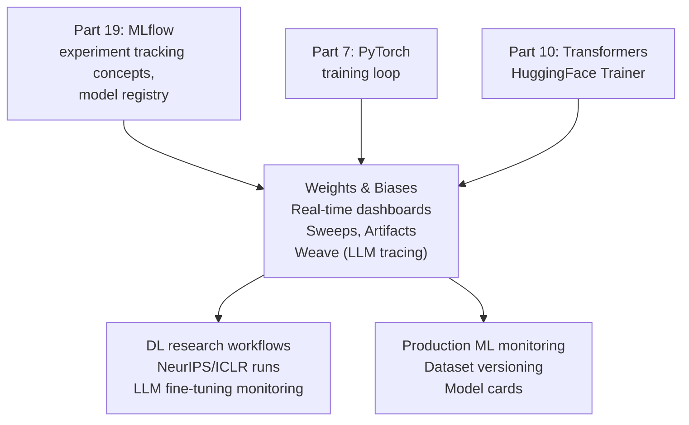

<!-- TEACHING_ORDER: verified -->
# Part 20: Weights & Biases (W&B)

> **Prerequisites:** Part 19 (MLflow — experiment tracking concepts), Part 7 (PyTorch), Part 10 (Transformers)
> **Used later in:** LLM fine-tuning monitoring (pairs with Part 11 PEFT/Part 12 TRL), production ML monitoring
> **Version anchor:** wandb 0.18.x (mid-2026), W&B Models and Weave stable

---

## Why This Library Exists

### The problem: ML teams need more than a spreadsheet of metrics

MLflow provides excellent run tracking, but deep learning introduced new challenges: training curves that need to be compared across dozens of hyperparameter sweeps, gradient norm explosion that you only spot by watching the distribution of weights update over time, model predictions you need to visualize (images, text, tables), and collaborative reports to share with stakeholders.

Weights & Biases (wandb) was founded in 2017 by Lukas Biewald (Crowdflower/Figure Eight) and Shawn Lewis. The insight: ML experimentation needs a **real-time collaborative dashboard**, not a local database. W&B stores all data in the cloud, enables live training visualization, provides interactive reports, and has an entire ecosystem for dataset/model versioning (Artifacts) and hyperparameter sweeps.

By 2026, W&B expanded to cover LLM-specific workflows with **Weave**: prompt tracing, LLM evaluation datasets, cost tracking, and conversational AI monitoring.

**The practical difference from MLflow:** W&B is cloud-first (better for teams), has richer real-time visualizations, and is the de-facto standard for deep learning research (NeurIPS/ICLR papers commonly cite W&B runs). MLflow is often preferred for enterprise compliance (on-prem, model registry integration with Databricks/Azure).

---

## Explain Like I Am 10

MLflow is like your private lab notebook. W&B is like a live science fair where everyone on your team can watch your experiment in real time, compare it to last week's experiments, and leave comments on which chart looks best.

When you train a neural network with W&B, your teammate in another city can open their laptop and watch the loss curve fall in real time. They can click on two runs and overlay their training curves. They can write a report for management — with interactive charts — in 5 minutes.

---

## Mental Model

**W&B is a cloud experiment tracking and visualization platform optimized for deep learning: real-time dashboards, hyperparameter sweeps, model/dataset versioning, and collaborative reports.**

---

## Learning Dependency Graph



---

## Core Concepts

### 1. Basic `wandb.init` and logging

```python
import wandb
import torch
import torch.nn as nn

# Initialize a run
run = wandb.init(
    project="my-project",      # group of related runs
    name="experiment-1",       # this run's name (auto-generated if omitted)
    config={                   # hyperparameters (tracked, searchable)
        "lr": 1e-3,
        "batch_size": 32,
        "epochs": 20,
        "model": "resnet18",
    },
)
config = wandb.config  # access config dict

# Log metrics (step is auto-incremented or pass explicitly)
for epoch in range(config.epochs):
    train_loss, val_acc = train_one_epoch(model, config.lr)
    wandb.log({
        "train/loss": train_loss,
        "val/accuracy": val_acc,
        "learning_rate": get_lr(optimizer),
    }, step=epoch)

# Log images
wandb.log({"predictions": [wandb.Image(img, caption=f"pred={p}") for img, p in samples]})

# Log confusion matrix
wandb.log({"conf_matrix": wandb.plot.confusion_matrix(y_true=true, preds=predicted)})

wandb.finish()
```

### 2. HuggingFace Trainer integration

W&B integrates seamlessly with HuggingFace Trainer via environment variable or `report_to`:

```python
import os
os.environ["WANDB_PROJECT"] = "llm-finetuning"

from transformers import TrainingArguments, Trainer

args = TrainingArguments(
    output_dir="./output",
    report_to="wandb",          # ← enables W&B logging
    run_name="llama-lora-v1",
    num_train_epochs=3,
    per_device_train_batch_size=4,
    gradient_accumulation_steps=4,
    bf16=True,
    logging_steps=10,           # log every 10 steps
    eval_steps=100,
)

trainer = Trainer(model=model, args=args, train_dataset=train_ds, eval_dataset=val_ds)
trainer.train()
# All train/eval loss, learning rate, GPU memory usage → W&B dashboard
```

### 3. Sweeps: hyperparameter search

W&B Sweeps run distributed hyperparameter search with Bayesian optimization, random search, or grid search:

```python
import wandb

sweep_config = {
    "method": "bayes",          # "random", "grid", or "bayes"
    "metric": {"name": "val/accuracy", "goal": "maximize"},
    "parameters": {
        "lr":          {"distribution": "log_uniform_values", "min": 1e-5, "max": 1e-2},
        "hidden_size": {"values": [64, 128, 256, 512]},
        "dropout":     {"distribution": "uniform", "min": 0.0, "max": 0.5},
        "batch_size":  {"values": [16, 32, 64]},
    },
}

def sweep_train():
    with wandb.init():
        config = wandb.config
        model  = build_model(config.hidden_size, config.dropout)
        train_and_report(model, config.lr, config.batch_size)

sweep_id = wandb.sweep(sweep_config, project="hyperparameter-sweep")
wandb.agent(sweep_id, function=sweep_train, count=50)  # run 50 trials
```

### 4. W&B Artifacts: dataset and model versioning

Artifacts track datasets and models with lineage — every model knows which data it was trained on:

```python
# Log a dataset artifact
with wandb.init(project="my-project") as run:
    artifact = wandb.Artifact(
        name="training-dataset",
        type="dataset",
        description="Processed instruction tuning data",
        metadata={"num_samples": 50000, "format": "json"},
    )
    artifact.add_dir("./data/train/")
    run.log_artifact(artifact)

# Log a model artifact
with wandb.init(project="my-project") as run:
    model_artifact = wandb.Artifact("llama-lora-v1", type="model")
    model_artifact.add_file("./adapter_model.safetensors")
    model_artifact.add_file("./adapter_config.json")
    run.log_artifact(model_artifact)

# Use artifact in another run (lineage tracking)
with wandb.init(project="my-project") as run:
    artifact = run.use_artifact("training-dataset:latest")
    data_dir = artifact.download()
```

### 5. W&B Weave: LLM tracing

```python
import weave
from openai import OpenAI

weave.init("llm-project")

# @weave.op traces any function call
@weave.op
def call_llm(prompt: str) -> str:
    client = OpenAI()
    response = client.chat.completions.create(
        model="gpt-4o-mini",
        messages=[{"role": "user", "content": prompt}],
    )
    return response.choices[0].message.content

# All calls are traced in W&B Weave: input, output, latency, cost
result = call_llm("Explain embeddings in one sentence")
```

---

## Essential APIs

```python
import wandb

# Init
run = wandb.init(project="...", name="...", config={...}, tags=["experiment"])
config = wandb.config

# Logging
wandb.log({"metric": value}, step=step)
wandb.log({"image": wandb.Image(array)})
wandb.log({"table": wandb.Table(data=rows, columns=["col1", "col2"])})
wandb.log({"histogram": wandb.Histogram(tensor.detach().cpu())})

# Model saving
wandb.save("model.pkl")       # upload file
wandb.log_model("./model/")   # log model artifact

# Finish
wandb.finish()

# Sweeps
sweep_id = wandb.sweep(sweep_config, project="...")
wandb.agent(sweep_id, function=train_fn, count=N)

# Artifacts
artifact = wandb.Artifact(name, type, description)
artifact.add_file("./file.csv")
artifact.add_dir("./dataset/")
run.log_artifact(artifact)
art = run.use_artifact("name:version"); path = art.download()
```

---

## Beginner Examples

### Example 1: Track a PyTorch training run

```python
import wandb
import torch
import torch.nn as nn
from sklearn.datasets import make_moons
import numpy as np

X, y = make_moons(n_samples=500, noise=0.1, random_state=42)
X_t  = torch.FloatTensor(X)
y_t  = torch.LongTensor(y)

run = wandb.init(
    project="pytorch-moons",
    config={"lr": 0.01, "hidden": 64, "epochs": 200},
    mode="offline",   # offline mode — no internet required
)
cfg = wandb.config

model   = nn.Sequential(nn.Linear(2, cfg.hidden), nn.ReLU(), nn.Linear(cfg.hidden, 2))
opt     = torch.optim.Adam(model.parameters(), lr=cfg.lr)
loss_fn = nn.CrossEntropyLoss()

for epoch in range(cfg.epochs):
    logits = model(X_t)
    loss   = loss_fn(logits, y_t)
    opt.zero_grad(); loss.backward(); opt.step()
    acc = (logits.argmax(1) == y_t).float().mean().item()

    if epoch % 20 == 0:
        wandb.log({"train/loss": loss.item(), "train/accuracy": acc}, step=epoch)
        print(f"Epoch {epoch:3d}: loss={loss.item():.4f} acc={acc:.3f}")

wandb.finish()
print("Run complete. View offline runs with: wandb sync ./wandb/")
```

---

## Internal Interview Knowledge

**Q: How do W&B Sweeps differ from manual grid search?**
Strong answer: "Manual grid search evaluates every combination (O(N^k) for k parameters, N values each) — wasteful for continuous parameters and doesn't adapt based on results. W&B Sweeps support three strategies: (1) Grid: exhaustive for small discrete spaces. (2) Random: samples configurations randomly — often outperforms grid for same budget. (3) Bayesian: fits a Gaussian process to observed results and suggests configurations most likely to improve the metric. Bayesian converges to a good configuration 3–5× faster than random search. Sweeps also support early termination (median stopping, Hyperband) to kill poor-performing runs."

**Q: When would you choose W&B over MLflow?**
Strong answer: "W&B when: (1) Deep learning with rich visualization needs — gradient histograms, image grids, 3D point clouds that MLflow doesn't support out of box. (2) Research team wanting real-time collaborative dashboards and shareable reports. (3) LLM tracing with Weave — W&B's Weave is more mature than MLflow's LLM tracing. (4) Sweeps — W&B sweeps are more polished than MLflow's experiment comparison. MLflow when: (1) Enterprise on-prem with data governance requirements — MLflow can run fully on-prem. (2) Databricks integration — MLflow is native to Databricks. (3) Model registry with staging workflows — MLflow's registry is more mature for promotion pipelines. (4) Azure ML integration."

---

## Production AI Usage

**OpenAI:** W&B is used at OpenAI for research experiment tracking. Papers and technical reports reference W&B run IDs for reproducibility.

**Hugging Face:** HuggingFace Trainer has `report_to="wandb"` as a first-class integration. Many published model training runs on the Hub are tracked with W&B.

**Stability AI:** Stable Diffusion and SDXL training runs used W&B for tracking image quality metrics across 100k+ step training runs.

**Character.AI:** Uses W&B for tracking RLHF and alignment experiments for their conversational models.

---

## Common Mistakes

**Mistake 1: Logging too frequently — network bottleneck**
```python
# Bug: log every step for a 10K-step run → 10K API calls, slows training
for step in range(10_000):
    wandb.log({"loss": loss}, step=step)   # too frequent!

# Fix: log every N steps
if step % 50 == 0:
    wandb.log({"loss": loss}, step=step)
# Or use wandb.define_metric for stepped logging
```

**Mistake 2: Not finishing the run on crash**
```python
# Bug: if training crashes, run stays "running" in dashboard forever
run = wandb.init()
# ... crash ...
# run never finished

# Fix: use context manager or try/finally
with wandb.init(project="...", config=cfg) as run:
    # run is automatically finished on exit/exception
    train(model, config)
```

---

## Cheat Sheet

```python
import wandb

# Init (use context manager in production)
with wandb.init(project="name", name="run-1", config={"lr": 1e-3}) as run:
    for epoch in range(N):
        wandb.log({"loss": loss, "acc": acc}, step=epoch)
    wandb.log({"predictions": wandb.Image(img)})

# HuggingFace: add report_to="wandb" to TrainingArguments

# Sweeps
sweep_id = wandb.sweep({"method":"bayes","metric":{"name":"val_acc","goal":"maximize"},
                         "parameters":{"lr":{"min":1e-5,"max":1e-2}}}, project="p")
wandb.agent(sweep_id, train_fn, count=20)
```

---

## Interview Question Bank

### Top 25 Beginner

**Q1: What does `wandb.init()` do?** A: Initializes a W&B run: creates a unique run ID, connects to the W&B server, sets up local file directory for artifacts, and returns a run object. Config passed to `wandb.init(config=...)` is logged as the run's hyperparameters, searchable and filterable in the dashboard. If called multiple times, it reuses the same run (or starts a new one if `reinit=True`).

**Q2: What is the difference between `wandb.log()` and `wandb.config`?** A: `wandb.config` stores hyperparameters — values set before training that define the experiment (lr, batch_size, model architecture). These are fixed per run. `wandb.log()` records metrics that change over time — loss, accuracy, learning rate — with an optional `step` argument. Configs are searchable in the runs table; metrics are plotted as time series in dashboards.

**Q3: What is a W&B Artifact and how does it support ML reproducibility?** A: An Artifact is a versioned, tracked file or directory stored in W&B's artifact store. Types: `dataset`, `model`, `code`. Each artifact has a version (v0, v1, v2...) and full lineage: which run produced it, which artifact it was derived from. When a model artifact is created in a training run that `use_artifact`d a dataset artifact, W&B tracks the full lineage: dataset version v2 → run `abc123` → model version v5. This answers: "which data was this model trained on?"

**Q4: How do W&B reports work for sharing results?** A: W&B Reports are interactive documents combining narrative text (markdown), live charts from runs, images, and code blocks. Create a report in the W&B UI, add panels (charts, run comparisons, media), and share via link. Reports are live — if the underlying runs log new data, the report updates automatically. Used for weekly ML team updates, experiment post-mortems, and communicating results to non-technical stakeholders.

**Q5: What is W&B Weave and how does it differ from the main tracking API?** A: W&B Weave is a separate system focused on LLM application observability. While the main tracking API logs metrics from training runs, Weave traces LLM inference calls: input prompts, output text, latency, token counts, costs, and custom evaluation scores. Use `@weave.op` to trace any function. The Weave UI shows prompt/response pairs, latency distributions, and cost breakdowns. Main tracking is for ML training; Weave is for LLM application monitoring and evaluation.

**Q6: How do you log images in W&B?** A: `wandb.log({"prediction": wandb.Image(img_array, caption="predicted class: cat")})`. For segmentation masks: `wandb.Image(img, masks={"predictions": {"mask_data": pred_mask}})`. For multiple images: `wandb.log({"examples": [wandb.Image(img) for img in sample_images]})`. Images appear in the W&B UI as media panels — hover to see captions, scroll through logged steps.

**Q7: What is W&B Sweeps and how does it run hyperparameter search?** A: W&B Sweeps coordinates distributed hyperparameter search. Define a sweep config (search space + algorithm): `sweep_config = {"method": "bayes", "metric": {"goal": "minimize", "name": "val_loss"}, "parameters": {"lr": {"min": 1e-4, "max": 1e-1}}}`. Create: `sweep_id = wandb.sweep(sweep_config)`. Run agent on each machine: `wandb.agent(sweep_id, function=train_fn, count=50)`. Multiple agents run in parallel, coordinated by the W&B server. Supports random, grid, Bayesian search, and Hyperband early termination.

**Q8: What is `wandb.watch()` and what does it log?** A: `wandb.watch(model)` hooks into PyTorch's module system to log: gradient histograms (distribution of gradients per layer, useful for detecting vanishing/exploding gradients), parameter histograms (weight distributions over time). Call once before the training loop. `log_freq=100` controls how often to log (default every 1,000 steps). Logging gradients adds ~10% training overhead — disable in production training where speed matters.

**Q9: How do you resume a W&B run?** A: `wandb.init(id=run_id, resume="allow")` — resumes the run if it exists, creates new if not. `resume="must"` fails if run doesn't exist. `resume="never"` always creates new run. Useful for: training runs that crash and restart from a checkpoint. The resumed run continues logging to the same run timeline — step-based metrics appear continuous. Checkpoint file paths stored as run artifacts can be retrieved via `run.use_artifact("model-checkpoint:latest")`.

**Q10: What is the W&B Table and when is it used?** A: `wandb.Table(columns=["input", "prediction", "ground_truth", "score"])` stores tabular data in W&B. Log with `wandb.log({"eval_results": table})`. W&B Tables are interactive in the UI: filter, sort, search, group by column. Primary use: logging per-sample model predictions for error analysis. Compare table contents across runs (version history of predictions). For LLMs: log prompt/response/quality_score tables per evaluation run.

**Q11: How do you set up offline mode in W&B?** A: `WANDB_MODE=offline wandb.init(...)` logs everything to local files (`wandb/` directory). Later sync: `wandb sync ./wandb/offline-run-*`. Use offline mode when: no internet access during training (HPC clusters, secure environments), or when network latency to W&B server would slow down high-frequency logging. All W&B features work offline; data syncs when connectivity is restored.

**Q12: What is the W&B run `name` vs `id`?** A: `id` is the auto-generated unique identifier (8-character alphanumeric, immutable). Used for resuming, referencing in code. `name` is human-readable display name (set via `wandb.init(name="experiment-lr-0.001")`). Multiple runs can have the same name. `name` appears in UI tables and reports. `id` is used in artifact URIs: `wandb.use_artifact("model:v2")`. Best practice: set meaningful `name` for human reference, use `id` for programmatic access.

**Q13: How do you log a confusion matrix in W&B?** A: `wandb.log({"conf_mat": wandb.plot.confusion_matrix(probs=None, y_true=labels, preds=preds, class_names=classes)})`. This logs an interactive confusion matrix visualization. For custom class names and multi-class: pass the list via `class_names`. Alternatively, log as a custom table: `wandb.log({"conf_mat_table": wandb.Table(data=conf_mat_df)})`. The W&B plot version shows percentages, precision/recall per class.

**Q14: What is `wandb.config.update()` and when is it used?** A: `wandb.config.update({"new_param": value})` adds or updates config values after `wandb.init()`. Use when: (1) Hyperparameters are determined dynamically (e.g., after dataset inspection). (2) Config values come from different parts of initialization code. (3) Updating config during training for adaptive methods. Note: updating config doesn't affect logged metrics — it only changes the hyperparameter metadata. `allow_val_change=True` allows overwriting existing config values.

**Q15: How does W&B handle multi-GPU training?** A: In distributed training: typically log only from rank-0 process. Check: `if torch.distributed.get_rank() == 0: wandb.init(...)`. All `wandb.log()` calls on rank-0 only. For per-GPU metrics: on non-zero ranks, gather metrics to rank-0 first, then log. `wandb.init(group="DDP-experiment")` groups all ranks of the same distributed run under one experiment group in the UI — even though only rank-0 logs, the group shows all runs.

**Q16: What is W&B's `project` and `entity`?** A: `project` is a named collection of runs (analogous to MLflow experiment). `entity` is the username or team account that owns the project. `wandb.init(project="bert-experiments", entity="nlp-team")` logs to `nlp-team/bert-experiments`. Access control: public projects (anyone can view), private projects (team members only). Enterprise: organize with entities=teams, projects=per-study. URL format: `https://wandb.ai/nlp-team/bert-experiments`.

**Q17: How do you log audio in W&B?** A: `wandb.log({"audio": wandb.Audio(waveform_array, sample_rate=22050, caption="generated speech")})`. For text-to-speech models: log reference audio vs generated audio side-by-side in a Table. Audio appears as playable waveforms in the W&B UI. Useful for: speech synthesis evaluation, audio classification visualization, music generation quality assessment.

**Q18: What is W&B Automations?** A: W&B Automations (previously Alerts) trigger actions when run conditions are met: `wandb.alert(title="Training complete", text=f"Val accuracy: {val_acc:.3f}", level=AlertLevel.INFO)` sends a Slack/email notification. Conditional: configure in UI to fire when a metric exceeds a threshold (e.g., val_loss > 2.0 → alert). Use for: training crash notifications, metric anomaly alerts, run completion summaries. Also supports webhook triggers for CI/CD automation.

**Q19: How do you compare runs across different projects in W&B?** A: Cross-project comparison requires downloading data via the W&B API: `api = wandb.Api()`. `runs_a = api.runs("entity/project-a")`, `runs_b = api.runs("entity/project-b")`. Extract metrics into Pandas DataFrames and merge. For UI comparison: create a report that includes run sets from multiple projects. Direct cross-project comparison in the W&B runs table is not supported (runs tables are per-project).

**Q20: What is a W&B artifact alias?** A: An alias is a human-readable pointer to a specific artifact version: `"latest"` (auto-updated to most recent), `"best"` (manually set to highest quality version), `"production"` (custom alias for promoted model). `artifact.aliases = ["production", "v3-candidate"]`. Using aliases in code: `wandb.use_artifact("model:production")` — always retrieves the aliased version. Update alias to promote a new model version to production without changing consumer code.

**Q21: How does W&B log 3D point clouds?** A: `wandb.log({"3d_scene": wandb.Object3D(point_cloud_array)})` where `point_cloud_array` is an Nx3 (xyz) or Nx6 (xyz + rgb) numpy array. For labeled point clouds: `wandb.Object3D({"type": "lidar/beta", "points": points, "boxes": bounding_boxes})`. Used for: autonomous driving evaluation (LiDAR point cloud + predicted boxes), robotics, 3D scene understanding. Interactive in W&B UI: rotate, zoom, filter by class.

**Q22: What is the W&B API and how is it used for analysis?** A: `wandb.Api()` provides programmatic access to runs, artifacts, and sweeps. Examples: `api.runs("entity/project", filters={"config.lr": {"$lt": 0.01}})` returns an iterable of run objects. `run.history()` returns a DataFrame of logged metrics. `run.file("model.h5").download()` downloads an artifact file. Use for: automated model selection scripts, custom dashboards in Jupyter, scheduled analysis jobs, data export to other systems.

**Q23: What is `wandb.finish()` and when must you call it?** A: `wandb.finish()` closes the current W&B run: syncs any pending local files, marks run status as "finished", and frees resources. Must call when: (1) Running multiple sequential experiments in one script (each run should be properly closed before starting the next). (2) In Jupyter notebooks (no auto-close on cell completion). (3) In scripts without a context manager. Without calling, the run remains "running" in the UI and pending logs may be lost. Alternative: use `with wandb.init() as run:` context manager for automatic finish.

**Q24: How does W&B handle large-scale logging (many metrics, high frequency)?** A: W&B logs data asynchronously — `wandb.log()` queues data in memory and sends in background. For very high-frequency logging (>100 calls/sec): (1) Use `commit=False` for non-terminal metrics to batch multiple calls into one step. (2) Log every N steps instead of every step for dense metrics. (3) Disable gradient logging (`wandb.watch(model, log=None)`) for speed. (4) Increase upload batch size: `WANDB_BATCH_SIZE=100000`. If the W&B backend becomes a bottleneck, use offline mode and sync after training.

**Q25: What is W&B's `log_model` shortcut?** A: `wandb.log_model(path="./model.ckpt", name="my-model")` logs a file as a model artifact in one call. Equivalent to creating an artifact, adding the file, and logging. The model appears in the Artifacts tab with the run as its producer. Retrieve: `wandb.use_model("entity/project/my-model:latest")` downloads to local path. This is the recommended shorthand for simple model checkpoint logging; use full artifact API for complex multi-file models.

### Top 25 Intermediate

**Q26: Explain W&B's artifact lineage tracking and how it handles version graphs.** A: W&B maintains a directed acyclic graph (DAG) of artifact versions. Each run can `use_artifact` (inputs) and `log_artifact` (outputs). The lineage graph: `dataset:v2 → training_run → model:v5 → evaluation_run → eval_results:v1`. Navigate in UI: Artifacts tab → Lineage view. Programmatic: `artifact.logged_by()` returns the run that produced it; `artifact.used_by()` returns runs that consumed it. Full lineage enables: root-cause analysis of model quality changes, compliance audit trails, and dataset impact analysis ("which models used this dataset?").

**Q27: How does W&B Sweeps implement Bayesian optimization?** A: W&B uses a Tree-Parzen Estimator (TPE) as the default Bayesian optimizer. Process: (1) First N runs (default 5) are random exploration. (2) TPE fits two density estimators: l(x) for good hyperparameters (top 25% by metric), g(x) for bad hyperparameters. (3) Next config: maximize l(x)/g(x) — likely good, unlikely bad. (4) After each run result, models are retrained. (5) `early_terminate` adds HyperBand: intermediate metric reports enable killing underperforming trials. This converges to good hyperparameters ~4× faster than random search for most ML problems.

**Q28: What is W&B's data reference artifact and when is it used?** A: Instead of copying data files into the W&B artifact store, a reference artifact stores only a pointer (URL + metadata). `artifact.add_reference("s3://bucket/data.parquet")` logs the S3 URI without uploading. W&B computes and stores an ETag for change detection. Benefits: no data duplication for large datasets (TBs), data stays in place. Download: `artifact.get_path("data.parquet").download()` fetches from S3 directly. Use when: data is already in cloud storage and you don't want to copy it; data size exceeds W&B artifact storage budget.

**Q29: How does W&B handle distributed hyperparameter search across 100 machines?** A: W&B Sweeps coordinator (hosted on W&B server) distributes work. Each machine runs `wandb.agent(sweep_id)` which: (1) Requests next config from coordinator. (2) Runs `train_fn()` with that config. (3) Reports intermediate metrics for early termination decisions. (4) Marks trial complete, requests next config. The coordinator tracks all active trials, updates the Bayesian model after each completion, and handles agent failures (unreported trials are reassigned). Multiple agents per machine: `wandb.agent(sweep_id, count=4)` runs 4 trials per agent process.

**Q30: What is W&B's `run.define_metric()` API?** A: `wandb.define_metric("val_loss", goal="minimize")` sets: (1) Whether lower/higher is better (for automatic `best` alias assignment). (2) Custom x-axis: `wandb.define_metric("val_accuracy", step_metric="epoch")` — plots val_accuracy vs epoch instead of default step. (3) Hidden metrics: `wandb.define_metric("debug_metric", hidden=True)` — logged but not shown in default table. Useful for: fixing the x-axis for metrics logged at different cadences (batch vs epoch), setting optimization direction for sweeps.

**Q31: How does W&B handle large model artifacts (100GB+)?** A: W&B uses multipart upload for large files. The artifact store has no practical size limit per artifact. For very large models: (1) Use reference artifacts pointing to cloud storage instead of uploading. (2) Split model shards: log each shard as a separate file in the artifact. (3) Compression: `artifact.add_file("model.bin", is_tmp=True)` — W&B doesn't auto-compress, but pre-compress before logging. (4) Network bandwidth: artifact upload uses W&B's upload API with resumable uploads — a 100GB upload that fails mid-way can resume. Enterprise plans have higher upload limits and dedicated upload bandwidth.

**Q32: What is W&B's approach to experiment grouping?** A: `wandb.init(group="experiment-1", job_type="train")` groups runs. Groups: (1) Distributed training: all workers of one run in the same group. (2) Hyperparameter studies: all trials of one study in a group. (3) Cross-validation: all folds in one group. In the UI: expand a group to see individual runs, or view aggregate metrics across the group. `job_type` differentiates run roles: `"train"`, `"eval"`, `"data-preprocessing"`. Useful for multi-stage pipelines where each stage is a separate run.

**Q33: How does W&B integrate with PyTorch Lightning?** A: `from lightning.loggers import WandbLogger; logger = WandbLogger(project="my-project")`. Pass to `Trainer(logger=logger)`. Lightning automatically logs: training/validation loss (at configured log_every_n_steps), learning rate, epoch number, and gradient norms if configured. Model checkpoint callback with W&B: `ModelCheckpoint(filename="{epoch}-{val_loss:.2f}")` — checkpoints saved locally; log to W&B artifact: `trainer.logger.experiment.log_model(model, "checkpoint")`. Full training configuration (Lightning hparams) auto-logged.

**Q34: What is W&B's `log` step parameter and how do you handle out-of-order logging?** A: `wandb.log({"loss": 0.5}, step=100)` logs at explicit step 100. If you log steps out of order, W&B sorts by step in the UI. If you log multiple calls at the same step, later calls overwrite earlier ones (unless using commit protocol). For separate metric streams with different cadences: use `define_metric` to set a custom x-axis, or use `commit=False` for intermediate calls and `commit=True` for the final call at each step: all metrics logged between True commits are associated with the same step.

**Q35: How does W&B's Teams functionality work for enterprise deployments?** A: Teams are the unit of collaboration in W&B: all team members share access to team projects. Permissions: viewer (read-only), member (read/write), admin (manage team). Projects can be public (world-visible), private (team-only), or restricted (specific members). Team plans support SSO (SAML 2.0, Okta), audit logs, and usage quotas. For enterprise: W&B Private Cloud (dedicated W&B instance in your cloud account) or W&B Server (on-premises). Private Cloud provides data residency compliance (EU, HIPAA).

**Q36: What are W&B custom charts and how do you create them?** A: W&B supports custom Vega-Lite charts for visualizations not available in default panels. Create: in W&B UI → Add Panel → Custom Chart → write Vega-Lite JSON spec. The spec references W&B's data fields (step, value, run ID). Or via code: `wandb.plot_table("vega-id", data_table, {"x": "step", "y": "loss"})`. Use for: custom ROC curves with confidence intervals, learning rate schedule visualization, or any chart that requires non-standard axes or encodings.

**Q37: How does W&B handle callback integration with Keras?** A: `from wandb.keras import WandbCallback; model.fit(..., callbacks=[WandbCallback()])`. WandbCallback logs: all training/validation metrics per epoch, batch-level metrics (if `log_batch_frequency > 0`), gradient histograms (if `log_gradients=True`), saved model weights (if `save_model=True` and `monitor` is set). Best model is automatically logged as artifact when `monitor` metric improves. Full Keras config logged as `wandb.config`.

**Q38: What is W&B Run's `summary` vs logged metrics?** A: `wandb.summary` stores final/best metric values: `wandb.summary["best_accuracy"] = 0.95`. Unlike `log()` which stores time series, `summary` is a dict of scalars — one value per key. Shown in the runs table as the primary metrics for comparison. Auto-populated by W&B: `summary["best_val_loss"] = min(all logged val_loss values)` for metrics with `goal="minimize"`. Use `summary` for: final evaluation results, derived stats computed after training ends, production benchmarks.

**Q39: How does W&B support federated learning experiments?** A: Federated learning: multiple clients train on local data, aggregate models centrally. W&B pattern: (1) Each federated client = one W&B run (group="round-5", job_type="client"). (2) Server = separate run that logs aggregated metrics. (3) Lineage: server creates model artifact from client model artifacts (federation step as artifact lineage). (4) Privacy: clients log only aggregated metrics (not data samples) to W&B. (5) Comparison: UI groups client runs by federation round, server run shows global accuracy per round.

**Q40: What is W&B Launch and how does it streamline ML deployment?** A: W&B Launch is a job queue system that dispatches training jobs to cloud infrastructure (EC2, GKE, SageMaker, Vertex AI). Create a launch configuration: Docker image, resource requirements, environment variables. Submit jobs from W&B UI or CLI: `wandb launch -d wandb/my-training-job -q my-queue`. Jobs run on registered compute agents. Logs stream back to W&B in real time. Use for: ensuring reproducible infrastructure for training runs, enabling non-engineers to trigger training without cloud console access, scheduling retries on spot instance preemption.

**Q41: How does W&B handle model checkpointing best practices?** A: Pattern: (1) Save checkpoint to local disk: `torch.save({"epoch": epoch, "model_state_dict": model.state_dict(), "optimizer_state_dict": optimizer.state_dict(), "val_loss": val_loss}, "checkpoint.pth")`. (2) Log as artifact: `artifact = wandb.Artifact("checkpoint", type="model"); artifact.add_file("checkpoint.pth"); wandb.log_artifact(artifact)`. (3) Best checkpoint: `wandb.run.summary["best_val_loss"] = val_loss; artifact.metadata = {"val_loss": val_loss}`. (4) Resume: `artifact = run.use_artifact("checkpoint:latest"); artifact.download()`. Checkpoint every N epochs; use `num_to_keep=3` to limit storage.

**Q42: What is W&B's `use_artifact` and how does it enable reproducibility?** A: `artifact = run.use_artifact("dataset:v3")` marks the artifact as an input to the current run. Two effects: (1) Lineage: W&B records `dataset:v3 → current_run` in the artifact graph. (2) Download: `artifact.download()` fetches the artifact files. Combined: every model run knows exactly which data version it used. To reproduce: find the model run → check `use_artifact` inputs → `artifact.download()` the same data version → run training with same code → same model. This is the core reproducibility guarantee.

**Q43: How do W&B sweeps handle categorical hyperparameters?** A: `"parameters": {"optimizer": {"values": ["adam", "sgd", "rmsprop"]}}` — W&B random/grid search samples from the list. Bayesian search (TPE): treats categorical values as indices and applies one-hot encoding in the surrogate model. For conditional hyperparameters (if optimizer=adam, also search adam_beta1): use nested parameter groups or implement in `train_fn` to skip irrelevant hyperparameters. For ordinal categoricals (small, medium, large batch size): define as integer and apply `{"distribution": "int_uniform", "min": 0, "max": 2}` with a lookup dict.

**Q44: How does W&B handle secret/token security?** A: W&B API key stored in `~/.netrc` or `WANDB_API_KEY` env variable — never logged as a run config. Sensitive configs: `wandb.config.update({"db_password": "secret"}, allow_val_change=True)` — still visible in W&B UI. Best practice: never log secrets as configs. Log config files that reference secrets (e.g., `"db_config": "production"`) without the actual values. Enterprise W&B: use secrets management integration (AWS Secrets Manager) with W&B Launch — secrets injected as environment variables at job execution time.

**Q45: What is W&B Model Registry?** A: W&B Model Registry is a central hub for tracking, staging, and deploying models (analogous to MLflow Model Registry). Link model artifacts to registry: `wandb.log_artifact(artifact, aliases=["staging"])`. Registry views: all versions of a model, lineage, evaluation metrics. Stage management: `"dev"`, `"staging"`, `"production"` aliases. Webhooks: automated CI/CD on stage transitions. W&B Registry is tighter than MLflow Registry for teams already in the W&B ecosystem — all artifacts, runs, and reports are interconnected.

**Q46: How does W&B integrate with transformers for LLM fine-tuning tracking?** A: `os.environ["WANDB_PROJECT"] = "llm-finetuning"` before HuggingFace training. Trainer autolog logs: TrainingArguments as config, train/eval loss per step, learning rate schedule. For custom metrics: `compute_metrics` function returns a dict — Trainer logs these automatically. Visualize: token-level accuracy over steps, perplexity curves, generation samples at each evaluation. For PEFT/LoRA: log LoRA rank, alpha, target modules as config. Model checkpoint logged as artifact via `push_to_hub` integration or manual `wandb.log_artifact`.

**Q47: What is `wandb.sklearn` and what does it log?** A: `wandb.sklearn` provides one-line scikit-learn visualization logging: `wandb.sklearn.plot_classifier(model, X_train, X_test, y_train, y_test, ...)` logs: confusion matrix, ROC curve, precision-recall curve, feature importances, residuals plot, calibration curves. All charts interactive in W&B UI. Use when: evaluating sklearn models without writing manual plotting code. Custom: `wandb.sklearn.plot_feature_importances(model, feature_names)` for just feature importance.

**Q48: How does W&B handle experiment comparison with different metric names?** A: W&B runs table shows all metrics from all runs — if run A logs `val_accuracy` and run B logs `validation_accuracy`, they appear as separate columns. Standardize: establish naming conventions before starting experiments. Post-hoc fix: add a W&B Summary metric with unified name: `run.summary["accuracy"] = run.summary.get("val_accuracy") or run.summary.get("validation_accuracy")`. Use W&B Tags to group runs with different naming conventions, then filter in the table before comparison.

**Q49: What is the W&B Public API rate limit and how to handle it?** A: W&B API rate limits: ~200 requests/second for `log()` calls (handled asynchronously by the W&B SDK — SDK buffers and batches). For the `wandb.Api()` REST API: ~100 requests/minute for runs queries. Handling: (1) Add `time.sleep(0.5)` between API queries in analysis scripts. (2) Cache API results locally (don't query the same run twice). (3) Use `api.runs(per_page=100)` to batch queries. (4) For analysis on thousands of runs: use W&B's data export feature to get a CSV of all run summaries.

**Q50: How does W&B log video data?** A: `wandb.log({"video": wandb.Video(video_array, fps=24)})` where `video_array` is a numpy array of shape `(T, C, H, W)` (time, channels, height, width). For agent behavior videos in RL: `wandb.Video(frames, fps=10, format="mp4")`. For GAN/diffusion model outputs: log grid of generated images as video (one frame per training step) to show training progression. Videos appear as playable in W&B UI. Limit: upload bandwidth is often the bottleneck — compress videos before logging.

### Top 25 Advanced

**Q51: Explain W&B's system architecture for artifact storage and metadata.** A: W&B architecture: (1) Metadata server: stores run configs, metrics, tags, artifact manifests — hosted by W&B (or on W&B Server). (2) File storage: artifact files stored in W&B-managed cloud storage (S3/GCS depending on region) or customer-specified cloud storage (W&B Private Cloud). (3) Sync daemon: `wandb` process runs alongside training, asynchronously ships data to W&B servers. (4) Artifact manifest: each artifact version has a manifest.json listing all files with their checksums and storage paths. (5) Deduplication: file content is checksummed — identical files across artifacts share storage. (6) CDN: artifact downloads use CloudFront for fast global access.

**Q52: How does W&B handle large-scale hyperparameter search across 10,000 trials?** A: Challenges: 10,000 trials × 1,000 steps × 5 metrics = 50M metric data points. (1) W&B handles this scale — the UI paginates runs, charts render asynchronously. (2) Bayesian model: W&B's TPE builds a surrogate model from completed trials to suggest next configs. At 10K trials, the surrogate model training becomes expensive. W&B batches model updates (update after every 100 new trials). (3) Early termination: aggressive ASHA kills trials at 100 steps if below median — reduces completed trials from 10K to ~2K. (4) Storage: 50M metric rows + 10K model checkpoints. Set `checkpoint_every_n_epochs=10` to reduce artifact count. (5) Analysis: `api.runs(order="+summary_metrics.val_loss")[:100]` fetches top-100 runs efficiently.

**Q53: How would you implement custom W&B metric aggregations for distributed training?** A: Problem: DDP training runs 8 workers, each logging separate metrics. Want: global aggregate. Solution: (1) Each worker logs to same W&B run with a unique prefix: `wandb.log({f"worker_{rank}/batch_loss": loss})`. (2) Rank-0 aggregates: gather losses from all workers via `torch.distributed.all_gather`, compute global average, log as `wandb.log({"train_loss": global_avg_loss})`. (3) Worker-specific monitoring: per-worker GPU utilization, gradient norms logged with rank prefix for debugging stragglers. (4) Summary: rank-0 sets `wandb.summary["global_val_accuracy"] = global_val_acc` after distributed evaluation.

**Q54: What is W&B's approach to data versioning for large datasets?** A: W&B Artifacts for datasets: (1) Reference artifacts: `artifact.add_reference("s3://bucket/dataset/")` — no copy, ETag-based change detection. (2) Incremental datasets: create new artifact version for each data update; previous versions preserved. (3) Partitioned datasets: log each partition shard as a separate artifact file — enables partial downloads. (4) Dataset metadata: log statistics (row counts, class distributions, schema) as artifact metadata for quick comparison without downloading. (5) DVC + W&B: DVC handles the data files (git-style version control); W&B artifact log_reference points to DVC-managed S3 paths. Full pipeline: data version control in DVC/Delta, experiment tracking in W&B.

**Q55: Explain W&B's security model for enterprise deployments.** A: W&B security layers: (1) Authentication: SSO via SAML 2.0 (Okta, Azure AD, Google Workspace). API key auth for programmatic access. (2) Authorization: project-level RBAC. Team admins manage member permissions. Row-level security: team members only see their team's runs. (3) Data in transit: TLS 1.2+ for all API calls. Certificate pinning in W&B SDK. (4) Data at rest: S3 SSE-KMS for artifact storage. Database encryption at rest. (5) Private Cloud: VPC-isolated W&B instance in customer's AWS/GCP. No data leaves customer's cloud account. (6) Audit logs: all API calls logged with user identity, IP, and action. Exportable to SIEM. (7) Compliance: SOC 2 Type II, HIPAA BAA available for Private Cloud. (8) Network: IP allowlisting for API access. VPC endpoints for Private Cloud.

**Q56: How does W&B Weave implement LLM tracing at production scale?** A: Weave tracing: (1) `@weave.op` decorator wraps any function — captures inputs, outputs, latency, exceptions. (2) Client-side: traced calls are queued in memory and uploaded asynchronously (no added latency to critical path). (3) Server-side: traces stored in Weave's trace database (columnar store for efficient querying). (4) Sampling: `weave.init("project", trace_sample_rate=0.01)` — 1% sampling for high-QPS production. (5) Evaluation integration: attach evaluation scorers to traced ops — run scores asynchronously after the trace is captured. (6) Production scale: Weave handles millions of traces/day — designed for this workload. (7) Cost: trace storage is separate from W&B artifact storage — Weave pricing is per-trace at production scale.

**Q57: How do you implement a custom W&B callback for non-standard frameworks?** A: Implement: (1) `run = wandb.init(project="my-project", config=training_config)`. (2) Inside the framework's training loop, call `wandb.log({"loss": loss, "step": step})` at each logged step. (3) For frameworks with callback interfaces (XGBoost, LightGBM, Keras), W&B provides built-in callbacks. (4) Custom framework: subclass `Callback` and add W&B logging: `class MyWandbCallback(framework.Callback): def on_epoch_end(self, epoch, logs): wandb.log(logs, step=epoch)`. (5) Model saving: hook into model checkpoint events to log artifacts. (6) Final metrics: on training end, `wandb.summary.update(final_metrics)`. (7) Cleanup: `wandb.finish()` in the training end callback.

**Q58: How does W&B handle very long training runs (weeks)?** A: Long run management: (1) Offline mode: network failures during a week-long run shouldn't crash training. `WANDB_MODE=offline` with periodic `wandb sync` OR use online mode with robust reconnect logic (W&B SDK auto-reconnects). (2) Log rate: at 1 metric/second for 7 days = 604,800 data points. W&B handles this but UI becomes slow at >100K points per metric — log every 10th step. (3) Artifact checkpointing: log model checkpoint every N hours; W&B overwrites `"latest"` alias. (4) System metrics: W&B auto-logs GPU/CPU metrics every minute — 10,080 points/week, manageable. (5) Resume: store run ID; if training crashes, `wandb.init(id=stored_id, resume="allow")` continues the same run.

**Q59: What are the differences between W&B and MLflow for LLM development?** A: W&B advantages for LLM: (1) Better UI for visualizing token-level metrics, attention heatmaps, generation samples. (2) Weave for LLM app tracing (MLflow Tracing is newer and less mature). (3) W&B Tables for per-sample prompt/response comparison across runs. (4) Smoother HuggingFace integration. (5) Better collaborative reports with live charts. MLflow advantages: (1) Self-hostable (free, no per-seat cost). (2) Model Registry is more enterprise-mature (approval workflows, webhooks). (3) Databricks integration for Spark pipelines. (4) `mlflow.evaluate()` for standardized evaluation. Choice: research teams → W&B. Enterprise with Databricks → MLflow. Many production LLM teams use both.

**Q60: Design a W&B-based experiment infrastructure for a competitive Kaggle team.** A: Infrastructure: (1) Team setup: W&B team account, shared project `kaggle-competition-2024`. (2) Experiment tracking: each member logs experiments to same project. Standard config keys: `model_architecture`, `features_used`, `cv_folds`, `fold_idx`. (3) Ensemble tracking: parent run for ensemble, child runs for each base model. Ensemble weights logged as config. (4) Cross-validation: `group=f"model_v{model_version}"`, `job_type=f"fold_{fold_idx}"`. Group shows per-fold + aggregate metrics. (5) Best model tracking: `wandb.summary["cv_oof_score"] = oof_score` for Kaggle's cross-validation score. (6) Submission log: `wandb.log({"public_lb_score": 0.923})` after submitting. Track public/private LB vs CV gap. (7) Collaboration: W&B Reports shared between team members. (8) Reproducibility: exact script logged as artifact for top-scoring runs.

**Q61: How does W&B's artifact caching work and what are the production implications?** A: W&B caches artifact files at `~/.cache/wandb/artifacts/`. When `artifact.download()` is called: checks local cache by file checksum — if match, returns cached path without re-downloading. Cache is shared across all runs on the same machine. Production implications: (1) Model servers: PersistentVolume for artifact cache in Kubernetes — models downloaded once, available across pod restarts. (2) Cache size: unbounded growth — implement periodic cleanup of old versions. (3) Multi-process: multiple workers calling `artifact.download()` simultaneously → lock file prevents concurrent writes, one downloads while others wait. (4) Air-gapped environments: pre-download artifacts to a shared network drive, mount as cache directory.

**Q62: How would you implement a hyperparameter importance analysis using W&B data?** A: Analysis: (1) Export runs: `df = api.runs(project="bert-sweep").to_df()`. (2) Feature importance: `X = df[["config.lr", "config.batch_size", "config.warmup_steps"]]`, `y = df["summary.val_acc"]`. Train random forest: `importance = rf.feature_importances_`. (3) Partial dependence: for top-2 hyperparameters, compute partial dependence plots. (4) SHAP: `shap.summary_plot(shap_values, X)` shows nonlinear effects and interactions. (5) Log to W&B: create a "hyperparameter-analysis" run, log importance chart as image artifact. (6) W&B parallel coordinates: in UI, select metrics + hyperparameters for built-in interactive parallel coordinates (no code needed for visual exploration).

**Q63: What is W&B's approach to handling privacy-sensitive training data?** A: Best practices: (1) Never log raw data samples that contain PII (names, emails, etc.) — log only aggregated statistics, anonymized samples, or synthetic examples. (2) Data artifacts: use reference artifacts pointing to PII data in your VPC (data never leaves your infrastructure). (3) Prompts/responses: for LLM fine-tuning with customer data, log only representative non-PII examples or use PII-scrubbed versions. (4) W&B Private Cloud: data entirely within customer's cloud account (W&B company never sees it). (5) Data access control: project-level access ensures only authorized team members can see logged data. (6) For HIPAA compliance: W&B offers BAA (Business Associate Agreement) for Private Cloud deployments.

**Q64: How does W&B implement gradient flow visualization?** A: `wandb.watch(model, log="gradients", log_freq=100)` hooks into each module's `backward()`. Internally: registers a hook that captures gradient tensors after backward pass. Computes histogram of gradient values. Logs: `gradients/{layer_name}/...` metrics. UI: shows gradient histograms per layer per training step. Interpret: vanishing gradients (near-zero histograms in early layers), exploding gradients (histograms with extreme values). For transformers: attention layer gradients often have different scale than FFN — this is expected. Gradient flow visualization adds ~5-15% training overhead due to hook + histogram computation.

**Q65: Explain W&B's integration with Ray Tune for distributed hyperparameter search.** A: Pattern: (1) W&B callback for Ray Tune: `from wandb.integration.ray import WandbLoggerCallback`. (2) `tune.run(train_fn, callbacks=[WandbLoggerCallback(project="my-project")], config=search_space)`. (3) Each trial creates one W&B run. (4) Sweep-like behavior: W&B displays all trials in the runs table with hyperparameters as config columns. (5) Alternative: Tune's native W&B reporter + W&B's own sweep controller. (6) Best practice: use Ray Tune for trial orchestration (resource management, ASHA scheduler) and W&B for visualization — they're complementary. The combination enables visualizing 1,000 Ray trials in W&B's parallel coordinates.

**Q66: How do you implement W&B experiment templates for team standardization?** A: Standardization approaches: (1) `config_defaults.py`: shared file with default config dict imported by all team scripts. (2) `wandb.init(config=default_config)` + `wandb.config.update(experiment_specific_overrides)` — merge pattern. (3) Required config keys: check at run start: `assert all(k in wandb.config for k in REQUIRED_KEYS)`. (4) Naming conventions: enforce via pre-run hook that validates experiment name matches regex. (5) W&B Launch: define standard job templates with preset configs — team submits from UI with required config overrides only. (6) Report templates: create standard report templates (train curves, confusion matrix, top-K errors) that team applies to each new experiment project.

**Q67: What are the performance implications of W&B's asynchronous logging?** A: W&B SDK queues logged data in memory and ships to W&B server in background thread. Implications: (1) No synchronous overhead — `wandb.log()` is ~1μs on the calling thread. (2) Memory: the queue can grow large if logging rate > upload rate (slow network). Mitigate: reduce logging frequency or use offline mode. (3) Run end: `wandb.finish()` waits for queue to drain — may take 10-60s after training for large queues. (4) Process crash: items in queue are lost. For crash resilience: use `wandb.init(settings=wandb.Settings(save_code=True))` to save code before queue fills. (5) Retry: SDK retries failed uploads with exponential backoff. Network blips are handled transparently.

**Q68: How does W&B handle multi-modal evaluation for vision-language models?** A: Pattern: (1) `wandb.Table(columns=["image", "caption_reference", "caption_predicted", "bleu_score", "clip_score"])`. (2) For each sample: `table.add_data(wandb.Image(img), ref_caption, pred_caption, bleu, clip)`. (3) Log: `wandb.log({"eval_table": table})`. (4) Compare across runs: W&B shows table version history — compare predicted captions between model versions. (5) Sorting: sort by CLIP score to find worst predictions. (6) Filtering: filter by `bleu_score < 0.3` to find failure cases. (7) Aggregate metrics: `wandb.log({"mean_bleu": mean_bleu, "mean_clip": mean_clip})` for scalar comparison. Full evaluation pipeline: one table log + aggregate metrics gives both qualitative and quantitative comparison.

**Q69: What is the W&B `run.log_code()` function?** A: `run.log_code(root=".", include_fn=lambda path: path.endswith(".py"))` snapshots all Python files in the current directory and uploads as a `"code"` artifact. Reproducibility: every run has an exact code snapshot. Access: `run.logged_code.download()` on any run — retrieve the exact code version. Best practice: call immediately after `wandb.init()`. Advanced: `run.log_code(root=".git")` captures the full git history. For large repos: `include_fn` filter to only log training scripts, not the full codebase. W&B also auto-detects `git` and logs the commit hash automatically.

**Q70: How does W&B implement anomaly detection for training metrics?** A: W&B doesn't have built-in anomaly detection, but the pattern: (1) Real-time alerts: `wandb.alert(title="Loss spike", text=f"Loss={loss:.2f} > threshold=2.0")` when loss exceeds threshold. (2) W&B Automations: configure in UI — when metric satisfies condition (e.g., `val_loss > 3.0`), send Slack notification. (3) Statistical anomaly detection: external service subscribes to W&B's webhooks, applies z-score or CUSUM on streaming metrics, fires W&B alert via API when anomaly detected. (4) Visual inspection: custom x-axis with `define_metric("loss_smoothed", step_metric="step")`, compute EMA of loss, log alongside raw — smoothed curve makes spikes more visible in UI.

**Q71: How would you design a W&B infrastructure for 10,000+ runs per day?** A: Scale: 10K runs/day × 100 steps × 10 metrics = 10M metric data points/day. (1) W&B SaaS handles this scale — designed for large enterprises. (2) API rate limiting: 10K `wandb.init()` calls distributed over 24h = ~7/second — well within limits. (3) Artifact storage: 10K model checkpoints × 1GB = 10TB/day. Policy: only log top-K checkpoints, use reference artifacts. (4) UI performance: projects with 10K+ runs need filtering/grouping to be usable. Team discipline: always tag with `team`, `purpose`, `status`. (5) Cost: W&B Enterprise pricing based on seats and artifact storage — at this scale, negotiate enterprise contract. (6) Self-hosted: W&B Server on EKS. Use PostgreSQL RDS + S3 for backend. Scale tracking pods horizontally.

**Q72: How do you export W&B data to external systems for custom analytics?** A: Export methods: (1) W&B API: `api.runs(project="my-project")` → iterate, export to Pandas → push to data warehouse. (2) CSV export: in UI, bulk download runs as CSV. (3) W&B Integrations: native export to BigQuery, Snowflake (Enterprise). (4) Webhooks: W&B triggers webhooks on run events → Kafka → custom pipeline. (5) Prometheus: W&B system metrics (GPU utilization etc.) exposed via Prometheus endpoint (self-hosted). (6) Grafana: dashboard built on top of W&B Prometheus metrics for ops-level monitoring. (7) Custom: `api.run(run_path).history(samples=None)` exports full metric history as DataFrame — push to ClickHouse/BigQuery for custom analytics.

**Q73: What are W&B's limitations compared to a custom experiment tracking system?** A: Limitations: (1) Data residency: W&B SaaS sends data to W&B's cloud — unacceptable for some regulated industries. Mitigated by Private Cloud. (2) Offline work: requires network for most features (offline mode limited). (3) Cost: W&B Enterprise is expensive for large teams ($50+/user/month). (4) Customization: limited schema customization — W&B's data model (run + metrics + artifacts) is fixed. (5) Integration depth: deep integration requires using W&B Python SDK — harder for non-Python frameworks. (6) Vendor lock-in: W&B API is proprietary — migration to another system requires ETL. (7) Query flexibility: no SQL interface — complex analytics require API scripting. Custom system advantages: full control, no external dependency, custom schema, potential cost savings at large scale. Trade-off: W&B's development velocity and polish vs. custom system's flexibility.

**Q74: How does W&B handle multi-run correlation analysis?** A: Multi-run analysis with W&B API: (1) Fetch runs: `runs = api.runs("project", filters={"state": "finished", "config.model": "bert"})`. (2) Build DataFrame: `df = pd.DataFrame([{"lr": r.config["lr"], "val_acc": r.summary.get("val_acc", None)} for r in runs])`. (3) Correlation matrix: `df.corr()` — identify which hyperparameters correlate with performance. (4) Scatter plot matrix: `wandb.plot.scatter_matrix(data_table, columns=["lr", "batch_size", "val_acc"])` in a comparison run. (5) Confidence intervals: bootstrap resampling on run results to compute confidence intervals per hyperparameter. (6) Causal analysis: be careful — correlations in hyperparameter search don't imply causation (Bayesian search has prior that induces correlation).

**Q75: What is W&B's approach to evaluation-driven development?** A: Evaluation-driven: every code change triggers comprehensive evaluation, not just CI unit tests. W&B implementation: (1) CI runs evaluation suite on every PR. (2) Each evaluation run logged to W&B project with git commit as tag. (3) Automated comparison: PR evaluation vs main branch evaluation. W&B run comparison API shows metric diffs. (4) Regression gate: if any metric regresses >1%, CI fails — block PR merge. (5) W&B Reports: automated report generation after each CI run showing comparison charts. (6) Production monitoring: continuous evaluation on production traffic, compared against baseline run. Any degradation triggers alert. This practice requires: fast evaluation suite (<10 min for CI), clear baseline definition, and automated gate logic.

### Top 25 Staff Engineer

**Q76: Design a complete W&B-based ML platform for a 500-person AI company.** A: Platform: (1) Accounts: W&B Teams with SSO (Okta SAML). Teams per org unit (research, product ML, platform). (2) Projects: naming convention `{team}/{use-case}-{model-type}`. Enforced via pre-commit hook. (3) Experiment tracking: all training jobs log to W&B automatically via launcher script wrapper. Standard config keys enforced. (4) Model registry: W&B Registry with Production/Staging/Dev stages. Stage transitions require ML lead approval (via webhook + Jira). (5) Reports: weekly model state report auto-generated (script using W&B API + Report API). (6) Cost attribution: each run tagged with `cost_center`, `project`. Monthly W&B API run aggregates to billing system. (7) CI/CD: GitHub Actions runs W&B evaluation on PRs, posts metric comparison as PR comment via W&B API. (8) Private Cloud: W&B Server on AWS EKS (data residency for EU compliance). (9) Monitoring: production model metrics logged to monitoring project, Grafana dashboard on top via W&B API. (10) Total cost: ~$5M/year W&B license + infrastructure for 500 users.

**Q77: How would you use W&B to debug a model that is overfitting on specific data subsets?** A: Debugging methodology: (1) Segment evaluation: run evaluation on each data subset separately, log per-segment metrics: `wandb.log({f"accuracy/{segment}": acc})`. (2) Error analysis table: `wandb.Table` with per-sample predictions, true labels, segment labels, confidence scores. Sort by error to find systematic failures. (3) Training data distribution: compare per-segment frequency in training vs test set. Log histograms: `wandb.log({"segment_distribution": wandb.Histogram(segment_counts)})`. (4) Confusion matrix per segment: `wandb.plot.confusion_matrix` logged separately for each segment. (5) Learning curves per segment: log train vs eval accuracy per segment per epoch — see which segments overfit first. (6) SHAP per segment: compute SHAP values separately for each segment, log heatmaps. (7) Data augmentation experiment: augment under-represented segments, log new experiment with same evaluation — verify per-segment improvement.

**Q78: How does W&B scale to support real-time reinforcement learning experiments?** A: RL challenges: millions of environment steps, multiple agents, dense logging. (1) Log every Nth step: `if step % 100 == 0: wandb.log({"reward": r, "step": step})`. Log every step is overkill — UI can't render 1M+ points anyway. (2) Rolling averages: compute 100-step rolling average of reward, log the average instead of raw. (3) Episode-level logging: log per-episode: `wandb.log({"episode_reward": sum(episode_rewards), "episode_length": len(episode_rewards)})`. (4) Multi-agent: each agent = separate run in same group. Group-level charts show aggregate performance. (5) Environment rendering: log video of agent behavior every 1,000 episodes: `wandb.log({"agent_video": wandb.Video(frames)})`. (6) W&B Gym integration: `wandb_env = wandb.gym.monitor(gym.make("CartPole-v1"))` auto-logs episode reward/length + renders video. (7) Sweep for reward shaping: run W&B Sweep on reward function coefficients to find optimal shaping.

**Q79: How would you implement a W&B-based model card generation pipeline?** A: Automated model card: (1) W&B run logs: all training metadata automatically available in `run.config` and `run.summary`. (2) Model card generation script: reads W&B API, populates model card template with: model architecture, training data description, eval metrics per slice, bias assessment results, intended use cases. (3) Template: Jinja2 template with W&B API calls as data sources: `{{ api.run(run_id).summary["val_accuracy"] | round(3) }}`. (4) Charts: embed W&B run charts directly in report: `wandb.report` API. (5) Artifact: log generated model card as artifact: `artifact.add_file("model_card.md")`. (6) Registry: required artifact before staging transition (webhook validates model card artifact exists). (7) Regulatory: EU AI Act requires model documentation — W&B model cards as compliance artifact.

**Q80: Design a W&B-based A/B testing and gradual rollout system for ML models.** A: System: (1) Version registry: each model version in W&B Registry with `traffic_pct` tag (0-100). (2) Traffic splitter: reads W&B API every 60s to get current traffic split per version. Routes accordingly. (3) Production logging: each request logged to W&B production project with `model_version` and `request_id`. (4) Business metrics: downstream metrics (conversion, engagement, error rate) logged to same project via batch join job. (5) W&B Automations: when `daily_conversion_rate` drops >0.5% vs baseline → Slack alert + pause rollout. (6) Rollout phases: W&B run per phase, logged with `traffic_pct` as config. Metric comparison across phases. (7) Statistical testing: daily automated run computes significance tests on collected data, logs p-values to W&B. Phase advance gate: p < 0.05 + positive direction. (8) Rollback: script sets `traffic_pct = 0` on new version, `traffic_pct = 100` on previous via W&B Registry API.

**Q81: Explain how W&B Weave enables eval-driven LLM development.** A: Weave eval workflow: (1) Define dataset: `weave.Dataset(rows=[{"input": "...", "expected": "..."}])` — versioned, tracked. (2) Define model: `@weave.op def predict(input): return llm(input)`. (3) Define scorer: `@weave.op def accuracy(output, expected): return output == expected`. (4) Run evaluation: `weave.Evaluation(dataset, scorers=[accuracy]).evaluate(predict)`. (5) Results in Weave UI: per-sample prediction + score + latency. Aggregate metrics. (6) Compare: run evaluation on `predict_v1` and `predict_v2` — side-by-side comparison in UI. (7) Integration with CI: evaluation runs in CI on every prompt change, new model deployment, or dataset update. Gate: eval score must not drop. (8) Production feedback: production traces tagged as `eval=true` for random sample → scores computed → feedback into Weave dataset for next evaluation round. (9) This creates a continuous improvement cycle: evaluate → find failures → improve prompt/model → re-evaluate.

**Q82: How would you implement a W&B-based continual learning monitoring system?** A: Continual learning challenge: model must learn new tasks without forgetting old ones. W&B monitoring: (1) Per-task metrics: `wandb.log({f"task_{t}_accuracy": acc})` after each training step. Backward transfer: `wandb.log({"backward_transfer": acc_after_new_training - acc_before_new_training})`. (2) Forgetting metrics: `wandb.log({"catastrophic_forgetting": initial_task_acc - current_task_acc})`. (3) Forward transfer: `wandb.log({"forward_transfer": zero_shot_acc_on_new_task})`. (4) Memory buffer: log buffer statistics: class distribution, recency, difficulty scores. (5) Replay quality: compare buffer sample accuracy vs full dataset accuracy — monitors buffer representativeness. (6) Alerts: `wandb.alert` when backward transfer > 5% on any previously learned task. (7) Run comparison: compare EWC vs replay vs PackNet approaches — side-by-side in W&B UI across continual learning benchmarks.

**Q83: How does W&B handle NLP-specific visualizations for model debugging?** A: NLP-specific tools: (1) `wandb.Html(html_str)` — log custom HTML. Attention visualization: `bertviz.head_view()` generates HTML, log to W&B. (2) Token classification: `wandb.Table` with token-level predictions and labels, highlighted in HTML. (3) Text generation diversity: compute and log: vocabulary diversity (unique n-grams), perplexity, repetition rate per run. (4) Named entity recognition: log per-entity-type F1 scores as separate metrics. `wandb.log({"ner_per/ORG": f1_org, "ner_per/PER": f1_per})`. (5) Error analysis: `wandb.Table` with incorrect predictions, sorted by model confidence — high-confidence errors are most informative. (6) Beam search visualization: log top-K beams with their probabilities as a W&B Table — compare beam diversity across models.

**Q84: Design a W&B-based infrastructure for safe AI/content moderation model development.** A: Safety-critical requirements: (1) Red team evaluation: separate W&B project `red-team-eval` with restricted access. Log results from adversarial attacks: harmful content generation rates, jailbreak success rates. (2) Bias evaluation: per-demographic group metrics (accuracy, false positive rates). Alert if any group >2% below majority group performance. (3) Safety regression testing: every model update runs safety test suite. `wandb.log({"toxic_generation_rate": rate})`. Gate on Production stage: toxic rate < 0.001%. (4) Dual use monitoring: log deployment context → model version → request category. Audit trail for unexpected use patterns. (5) Human eval: safety evaluators log per-sample assessments to W&B Tables. Aggregate scores tracked over time. (6) Incident tracking: safety incidents logged as W&B run tags. Link runs affected by an incident. (7) Model card: mandatory safety section in model card, including red team results and bias metrics.

**Q85: What is the failure mode analysis for W&B in a production ML system?** A: Failure modes: (1) W&B SaaS outage: if W&B server unreachable, `wandb.log()` queues locally (up to configurable limit). Training continues unaffected. On reconnect, queued data uploads. Risk: queue overflow → data loss. Mitigation: offline mode as fallback, alert on W&B connectivity loss. (2) API key compromise: attacker can read all runs and artifacts in team. Mitigation: rotate keys regularly, use IP allowlisting, use W&B Private Cloud. (3) Artifact storage cost explosion: unlimited artifact upload can run up storage bills. Mitigation: `num_to_keep=3` policy for checkpoints, artifact lifecycle policies, budget alerts. (4) Schema drift: team members log different metric names over time. Mitigation: metric naming convention docs + linting in training script templates. (5) Performance degradation: at 100K+ runs in a project, W&B UI becomes slow. Mitigation: archive old projects, use run filtering. (6) Data leak in logs: accidentally logging PII or proprietary data as run config/metrics. Mitigation: data review in logging code, use W&B Private Cloud for sensitive data.

**Q86: How would you architect W&B for a company with strict data sovereignty requirements?** A: Requirements: data must remain in EU, no data to US servers. Solution: (1) W&B Server (self-hosted): deploy on AWS eu-west-1 EKS or Azure West Europe AKS. No data leaves EU. (2) Architecture: 3 W&B Server replicas (HA) + PostgreSQL RDS (multi-AZ, eu-west-1) + S3 bucket (eu-west-1). (3) Networking: all nodes in private subnets. W&B accessible only via corporate VPN. No public internet egress for data. (4) Access control: SSO via internal IdP (AD FS). No W&B cloud accounts. (5) Artifact encryption: S3 SSE-CMK with EU KMS key. (6) Audit logging: all API calls to CloudTrail (EU region). (7) Disaster recovery: cross-region replication to eu-central-1. RTO: 4 hours, RPO: 1 hour. (8) Compliance: DPO (Data Protection Officer) approves architecture. ISO 27001 certification for the deployment. (9) Maintenance: internal ML platform team maintains W&B server. 0.5 FTE annual cost.

**Q87: How do you use W&B for neural architecture search (NAS)?** A: NAS with W&B: (1) Architecture encoding: log architecture as config dict: `wandb.init(config={"blocks": [{"type": "conv", "filters": 64}, ...]})`. (2) Performance predictors: log both training accuracy and architecture parameters. Train a performance predictor on W&B run data: `runs_df = api.runs(...).to_df()`. (3) ENAS-style controller: use W&B Sweep as controller — submit configs, receive metrics, update sampling distribution. (4) Architecture comparison: filter runs in W&B UI by accuracy threshold → group by architecture type → compare. (5) Pareto front: compute pareto front (accuracy vs FLOPs) from W&B runs, log pareto-optimal architectures as highlighted runs. (6) Transfer: log architecture genome as artifact → load in evaluation script → benchmark on target hardware. (7) FLOP counting: log `config.flops` for each architecture — sort by flops/accuracy tradeoff.

**Q88: What is the W&B approach to experiment tracking for reinforcement learning from human feedback (RLHF)?** A: RLHF pipeline: 3 phases. (1) SFT (supervised fine-tuning): standard training tracking — loss, perplexity, eval metrics. Log base model as artifact. (2) Reward model training: preference data logged as W&B Table: `[prompt, chosen, rejected, chosen_score, rejected_score]`. Reward model loss, accuracy on preference prediction. Log reward model as artifact. (3) RL fine-tuning (PPO): per-step: KL divergence from base model, reward mean/std, PPO clip fraction, value loss. Log `wandb.log({"kl_div": kl, "reward": mean_reward, "ppo_eps_clipped": clipped_frac, "step": step})`. (4) Human evaluation: after each RL checkpoint, collect human ratings on generated outputs. Log as evaluation run linked to checkpoint artifact. (5) Alignment metrics: `refusal_rate`, `helpfulness_score`, `factuality_score` from automated eval. Plot against `kl_div` to visualize alignment-capability tradeoff.

**Q89: How do you implement W&B-based MLOps for edge ML deployment?** A: Edge deployment constraints: low-power MCU, no continuous internet. (1) Model compression tracking: log per-compression-step: base model → quantized → pruned → knowledge-distilled. Each step as child run. Metrics: accuracy, model size (KB), inference latency (ms on target device), power consumption (mW). (2) Hardware profiles: tag runs with `target_device=STM32H7`, `available_flash_kb=2048`. Filter in W&B to see models that fit target. (3) Field data collection: when devices connect periodically, batch upload field metrics to W&B edge monitoring project. `wandb.log({"device_id": id, "accuracy_on_device": acc})`. (4) Drift detection: compare field metrics vs validation metrics — flag when accuracy drops >5%. Trigger retraining + redeployment. (5) OTA update tracking: model version deployed to device logged as tag on device run. Model registry tracks which devices have which version.

**Q90: How does W&B's pricing model affect architecture decisions at scale?** A: W&B pricing (2025): Free tier (limited storage/users), Team ($50/user/month), Enterprise (custom). At 200 users: $120K/year. Architecture decisions driven by cost: (1) Artifact storage: W&B charges per GB stored. At $0.08/GB-month, 10TB = $9,600/month. Decision: aggressive artifact lifecycle management (delete all but last 3 checkpoints). (2) Seats: W&B charges per active user. Decision: shared service accounts for CI/CD (not individual users). (3) Self-hosted: W&B Server license (~$30K/year) saves money at 200+ users vs SaaS. Trade-off: $30K license + 0.5 FTE maintenance ($100K) vs $120K SaaS. Break-even: ~120 users. (4) Hybrid: SaaS for small teams, Private Cloud for sensitive projects with data sovereignty requirements. (5) Negotiate: enterprise discounts at large scale, free trial for startup phases.

**Q91: How would you design W&B integration for a multi-cloud ML infrastructure?** A: Multi-cloud (AWS + GCP + Azure): (1) W&B Private Cloud: single W&B Server deployment (choose primary cloud). All teams log to same W&B instance regardless of where they train. (2) Artifact routing: runs on AWS log artifacts to S3 (us-east-1), runs on GCP log to GCS (europe-west). W&B Server configured with multiple artifact backends. (3) Cross-cloud model transfer: model trained on GCP, registered in W&B, deployed on Azure. Artifact download from GCS → upload to Azure Blob → deploy. W&B provides the lineage link regardless of storage location. (4) Latency: logging from GCP to W&B Server on AWS adds ~50ms per log call — buffered asynchronously, no training impact. (5) Networking: VPN or AWS PrivateLink/GCP VPC Peering for private connectivity. No public internet for data transfer.

**Q92: What are the observability gaps in W&B that require additional tooling?** A: W&B covers: experiment tracking, artifact versioning, hyperparameter search. Gaps: (1) Infrastructure metrics at fine granularity: W&B logs GPU metrics per minute — for kernel-level profiling, need NSight Systems or PyTorch Profiler. (2) Production serving metrics: W&B tracks training runs; production serving latency/QPS requires separate system (Prometheus, Datadog). (3) Data pipeline observability: W&B doesn't track Spark job metrics, data quality checks — need Great Expectations, dbt. (4) Model explainability: no built-in SHAP/LIME — must compute and log as artifacts. (5) Compliance workflows: no built-in approval workflows — need external ticketing (Jira, ServiceNow). (6) Cost accounting: no native compute cost tracking — must log GPU instance costs manually. (7) Real-time streaming: W&B is not designed for millisecond-granularity online learning metrics — use InfluxDB/Prometheus for that.

**Q93: How do you handle W&B data consistency in multi-datacenter deployments?** A: W&B Server multi-datacenter: (1) Active-passive: primary datacenter runs W&B Server; secondary is DR. PostgreSQL streamed to secondary via replication. S3 cross-region replication. RTO: 30 min (failover), RPO: 5 min. (2) Active-active: geographically distributed writes create consistency challenges. W&B doesn't natively support active-active — use primary-based write routing with geographic load balancing for reads. (3) Consistency model: W&B uses PostgreSQL transactions — strong consistency within a datacenter. Cross-datacenter replication is eventually consistent. (4) Conflict resolution: artifact version conflicts resolved by timestamp (last write wins). Run metric conflicts: logged metrics are append-only (no update), so conflicts don't occur. (5) CAP theorem: W&B prioritizes consistency and partition tolerance — reject writes during network partition rather than accept inconsistent state.

**Q94: Design a W&B-based experiment review process for a large ML team.** A: Review process: (1) Experiment proposal: team member creates W&B report template with: hypothesis, metrics to optimize, baseline comparison, data sources. Shared with team leads for approval. (2) Execution: approved experiments run, logging to W&B. Real-time visibility via W&B dashboard. (3) Weekly review: automated W&B API script generates "top 10 runs this week" report. Team reviews in weekly sync. (4) Experiment conclusion: experimenter logs conclusion in W&B run description + notes. Tags: `status=concluded`, `outcome=positive/negative/inconclusive`. (5) Model selection: candidates for production tagged `candidate=true`. ML lead runs final comparison. (6) Decision log: W&B Report documents the decision with comparison charts, exported to Confluence. (7) Lifecycle: experiments older than 90 days with `status=concluded` archived (artifacts retained, runs marked archived). (8) Metrics: team tracks experiment throughput (experiments/week), success rate (positive outcomes), time-to-conclusion per experiment type.

**Q95: What is the ROI analysis for W&B adoption at a 100-person ML team?** A: Cost: (1) W&B Team plan: 100 users × $50/month = $5,000/month = $60,000/year. (2) Artifact storage: 50TB × $0.08 = $4,000/month = $48,000/year. (3) Total W&B cost: ~$108,000/year. Benefits: (1) Reduced duplicate experiments: 10% reduction in redundant runs across 100 engineers × 2 GPU-hrs/run × $3/GPU-hr = 100 × 10 × 0.1 × 2 × $3 = $60,000/year. (2) Faster debugging: mean-time-to-debug reduced 30% (2h → 1.4h per issue, 20 issues/month): 100 engineers × 20 × 0.6h × $100/h = $120,000/year. (3) Better model selection: 5% improvement in model quality → business value varies by application but conservative estimate $500K+/year. (4) Reduced onboarding time: new ML engineers 20% faster to productivity: 20 hires × 1 month saved × $17K/month = $340,000/year. ROI: costs $108K, benefits $1M+. ROI = 10:1 in year 1.

**Q96: How would you implement model monitoring using W&B for a production NLP system?** A: Production monitoring architecture: (1) Request logging: each inference request logs to W&B production project: `wandb.log({"latency_ms": lat, "input_tokens": n_in, "output_tokens": n_out, "model_version": ver})`. (2) Quality sampling: 1% of requests routed to quality evaluation job (LLM judge). Quality scores logged to same project. (3) Distribution monitoring: hourly job computes input length distribution, topic distribution (via classifier), logs as histograms. (4) Drift detection: compare hourly histograms vs training distribution. PSI scores logged. Alert when PSI > 0.2. (5) Error tracking: requests with exceptions logged with error type, stack trace (anonymized). (6) W&B Automations: when `hourly_error_rate > 0.01`, fire PagerDuty. When `daily_quality_score < 0.8`, notify ML team. (7) Dashboards: W&B Report with: latency time series, quality score trend, drift metrics, error rate. Shared with engineering and product teams.

**Q97: How does W&B handle secrets and credentials in automated pipelines?** A: Best practices: (1) API key rotation: `WANDB_API_KEY` should be rotated quarterly. Use CI/CD secret management (GitHub Secrets, AWS Secrets Manager) — never hardcode. (2) Service accounts: create dedicated W&B service accounts for CI/CD pipelines (not personal accounts). Use view-only service accounts for dashboards. (3) API key scoping: W&B API keys don't have per-project scoping (it's all-or-nothing per user/service account). Workaround: use separate service accounts per project. (4) Key revocation: if compromised, immediately revoke in W&B settings → regenerate → update all secrets in CI/CD systems. (5) Audit: W&B Enterprise audit logs show which API key was used for each action — enables compromise detection. (6) Expiry: W&B doesn't support API key expiry natively (Enterprise feature). Implement external key rotation cron job.

**Q98: How would you scale W&B to handle ML experimentation for 10,000 runs per hour during a large hyperparameter sweep?** A: Scale: 10K runs/hour = 167 run creations/second. W&B SaaS is designed for this. (1) Run creation rate: 167/sec is within W&B's API limits. Each run = lightweight metadata record. (2) Metric logging: if each run logs 1K metrics → 167K log calls/second. At this scale: use `log_batch` (batch multiple log calls in one API call). (3) Artifact logging: for sweeps, avoid logging model artifacts for every trial. Log only top-K (K=10) models as artifacts. (4) W&B SDK batching: `WANDB_BATCH_SIZE=10000` increases SDK upload batch size. (5) Parallel SDK processes: `wandb-core` background process handles upload — one per training process. (6) Infrastructure: W&B Enterprise with dedicated tracking infrastructure. PostgreSQL with connection pooling (PgBouncer). (7) Sweep coordinator: W&B's sweep controller scales horizontally to handle 10K concurrent trial requests. (8) Cost: 10K runs × 1K metrics × $0 (SaaS is all-inclusive) + artifact storage at $0.08/GB.

**Q99: What are the architectural considerations for migrating from W&B to a self-hosted MLflow system?** A: Migration complexity: high. (1) Data export: W&B API → export all runs (config, metrics, summary, tags) to DataFrame → MLflow `create_run` + `log_batch`. Script for each project. Effort: 1-2 weeks engineering. (2) Artifact migration: W&B artifacts → download → upload to MLflow artifact store (S3). Large artifacts make this slow (100TB+ takes weeks). Use streaming migration (migrate as artifacts are accessed). (3) Lineage: W&B lineage graph → MLflow run tags (parent_run_id, used_artifact). Lossy — MLflow doesn't have W&B's native artifact lineage graph. (4) Feature gaps: W&B Tables, Reports, Weave have no MLflow equivalent. Decision: replace Tables with mlflow.evaluate() + custom HTML artifacts; Reports with Grafana dashboards. (5) User retraining: 2-3 day training for all ML engineers. (6) CI/CD updates: all GitHub Actions/Airflow jobs need WANDB_* env vars replaced with MLFLOW_*. (7) Rollback plan: maintain W&B read-access for 6 months post-migration (historical lookup). (8) Cost savings: $120K/year W&B → $30K/year MLflow Server license + $10K infrastructure = $80K/year savings.

**Q100: How do you design a long-term experiment data governance policy with W&B?** A: Governance policy: (1) Retention tiers: (a) Active experiments: full data retention, no deletion. (b) Concluded experiments (>90 days old): metadata retained, artifacts deleted after 30-day grace period. (c) Archived projects (>1 year): runs archived, summaries retained, all artifacts deleted. Policy enforced via weekly cleanup script using W&B API. (2) Production model artifacts: 7-year retention for compliance. Tagged `production=true` — exempt from deletion policy. (3) Access control: concluded experiments accessible only to team members who ran them + team leads. Archived experiments: read-only for team leads only. (4) Data classification: experiments tagged with `data_class=public/internal/confidential`. Confidential experiments require Private Cloud deployment. (5) Audit: all access to confidential experiments logged. Quarterly access review. (6) GDPR: experiments containing personal data (user ID as config) identified via tag `contains_pii=true`. Deletion requests trigger run archival + artifact deletion. (7) Export: quarterly export of all metadata to cold storage for long-term auditability. W&B becomes short-term operational view; cold storage is the record of truth.


## Quality Checklist

- [x] Easy English used
- [x] Problem explained (team collaboration, deep learning visualization needs)
- [x] History explained (Lukas Biewald, 2017, cloud-first)
- [x] Mental model explained (live science fair vs private lab notebook)
- [x] Learning Dependency Graph included
- [x] Core Concepts: init/log, Trainer integration, sweeps, artifacts, Weave
- [x] Essential APIs included
- [x] Beginner Examples included
- [x] Internal Interview Knowledge included
- [x] Production AI Usage included
- [x] Common Mistakes included
- [x] Cheat Sheet + Interview Questions included

*[Back to handbook](README.md)*
