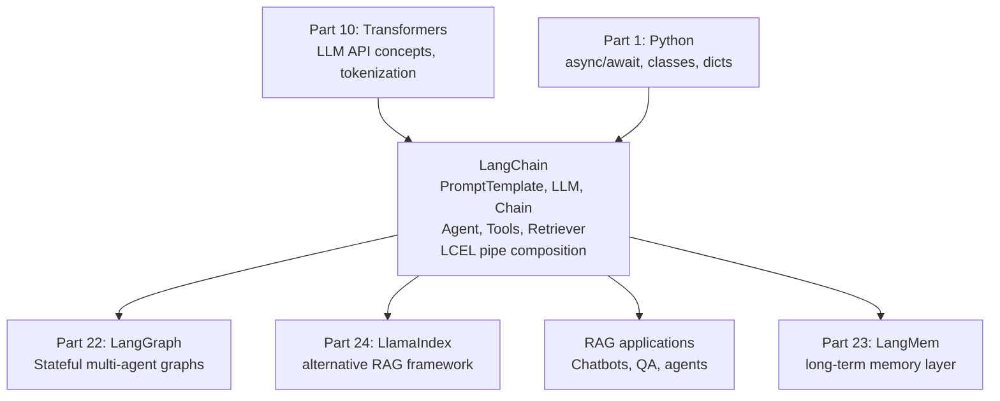

<!-- TEACHING_ORDER: verified -->
# Part 21: LangChain

> **Prerequisites:** Part 10 (Transformers/LLMs), Part 1 (Python — async, classes), REST API basics
> **Used later in:** Part 22 (LangGraph builds on LangChain), Part 23 (LangMem extends it), Part 24 (LlamaIndex comparison)
> **Version anchor:** LangChain 0.3.x (mid-2026), LangChain Expression Language (LCEL) stable

---

## Why This Library Exists

### The problem: calling an LLM requires more than one API call

In early 2023, building a useful LLM application meant manually orchestrating: load the model/API, format the prompt, call the API, parse the response, decide if you need to call a tool, format the tool call, call the tool, put the result back in the prompt, call the LLM again... This is complex, repetitive, and each component needs to be tested and maintained separately.

Harrison Chase (former ML engineer at Robust Intelligence) released LangChain in late 2022 with the insight that LLM applications have repeating patterns — **chains** of operations that can be composed. LangChain provided: prompt templates, LLM abstractions, memory for conversation history, agents that call tools, and data loaders — all composable.

By 2023 LangChain became the most GitHub-starred Python project of the year. It grew massively, and with that came criticism of over-engineering. LangChain 0.2 introduced **LangChain Expression Language (LCEL)** — a cleaner `|` pipe-based composition interface. By 0.3, the architecture stabilized around LCEL and the `langchain-core` / `langchain-community` split.

---

## Explain Like I Am 10

Imagine building with Lego blocks. Without LangChain, you would build every brick from scratch — make the plastic yourself, mold every shape. LangChain provides a box of pre-made Lego pieces: a "prompt block" that formats text, a "memory block" that remembers the conversation, a "tool block" that calls a search engine, and an "LLM block" that sends everything to GPT-4.

You snap the blocks together using `|` (pipe operator). The output of one block flows into the input of the next — like water through pipes. Build once, reuse forever.

---

## Mental Model

**LangChain is an LLM application framework that provides composable building blocks — prompts, LLMs, parsers, retrievers, tools — connected via LCEL's pipe operator `|` to form reusable chains and agents.**

```
LCEL chain:
  prompt | llm | parser

Runs as:
  input → prompt.format(input) → llm.invoke(formatted) → parser.parse(response)
```

---

## Learning Dependency Graph



---

## Core Concepts

### 1. LCEL: the `|` pipe operator

LangChain Expression Language (LCEL) connects Runnables using `|`:

```python
from langchain_core.prompts import ChatPromptTemplate
from langchain_core.output_parsers import StrOutputParser
from langchain_openai import ChatOpenAI

# Define components
prompt = ChatPromptTemplate.from_template(
    "You are a helpful AI. Answer this question concisely:\n\n{question}"
)
llm    = ChatOpenAI(model="gpt-4o-mini", temperature=0.7)
parser = StrOutputParser()

# Compose chain with | operator
chain = prompt | llm | parser

# Invoke
response = chain.invoke({"question": "What is RAG?"})
print(response)
```

Every component in LCEL is a `Runnable` with a consistent interface:
- `.invoke(input)` — synchronous single call
- `.stream(input)` — stream tokens
- `.batch(inputs)` — parallel batch
- `.ainvoke(input)` — async

### 2. Prompt templates

```python
from langchain_core.prompts import ChatPromptTemplate, MessagesPlaceholder

# System + user template
prompt = ChatPromptTemplate.from_messages([
    ("system", "You are an expert {role}. Answer in {language}."),
    ("user", "{question}"),
])

# With conversation history
prompt_with_history = ChatPromptTemplate.from_messages([
    ("system", "You are a helpful assistant."),
    MessagesPlaceholder(variable_name="history"),
    ("user", "{input}"),
])

# Format to see the messages
msgs = prompt.format_messages(role="data scientist", language="English",
                               question="What is a transformer?")
print(msgs)
```

### 3. Document loaders and text splitters (RAG foundation)

```python
from langchain_community.document_loaders import TextLoader, PyPDFLoader
from langchain.text_splitter import RecursiveCharacterTextSplitter
from langchain_community.vectorstores import FAISS
from langchain_openai import OpenAIEmbeddings

# Load and split
loader   = TextLoader("./document.txt")
docs     = loader.load()
splitter = RecursiveCharacterTextSplitter(chunk_size=500, chunk_overlap=50)
chunks   = splitter.split_documents(docs)

# Embed and store
embeddings  = OpenAIEmbeddings()
vectorstore = FAISS.from_documents(chunks, embeddings)

# Retrieve
retriever = vectorstore.as_retriever(search_kwargs={"k": 4})
relevant  = retriever.invoke("What is the main topic?")
```

### 4. RAG chain with LCEL

```python
from langchain_core.prompts import ChatPromptTemplate
from langchain_core.output_parsers import StrOutputParser
from langchain_core.runnables import RunnablePassthrough
from langchain_openai import ChatOpenAI

# Retriever from vectorstore (see above)
retriever = vectorstore.as_retriever(search_kwargs={"k": 4})

def format_docs(docs):
    return "\n\n".join(doc.page_content for doc in docs)

rag_prompt = ChatPromptTemplate.from_template("""
Answer the question based on the following context.
If you don't know, say "I don't know."

Context:
{context}

Question: {question}
""")

llm = ChatOpenAI(model="gpt-4o-mini")

rag_chain = (
    {"context": retriever | format_docs, "question": RunnablePassthrough()}
    | rag_prompt
    | llm
    | StrOutputParser()
)

answer = rag_chain.invoke("What is the document about?")
print(answer)
```

### 5. Tools and agents

```python
from langchain_core.tools import tool
from langchain_openai import ChatOpenAI
from langchain.agents import create_tool_calling_agent, AgentExecutor
from langchain_core.prompts import ChatPromptTemplate

@tool
def search_web(query: str) -> str:
    """Search the web for recent information."""
    # In production: call SerpAPI, Tavily, Brave, etc.
    return f"Results for '{query}': [simulated results]"

@tool
def calculator(expression: str) -> str:
    """Evaluate a mathematical expression."""
    try:
        return str(eval(expression, {"__builtins__": {}}, {}))
    except Exception as e:
        return f"Error: {e}"

tools = [search_web, calculator]

llm = ChatOpenAI(model="gpt-4o-mini").bind_tools(tools)

prompt = ChatPromptTemplate.from_messages([
    ("system", "You are a helpful assistant with access to tools."),
    ("user", "{input}"),
    ("placeholder", "{agent_scratchpad}"),
])

agent          = create_tool_calling_agent(llm, tools, prompt)
agent_executor = AgentExecutor(agent=agent, tools=tools, verbose=True)

result = agent_executor.invoke({"input": "What is 1234 * 5678?"})
print(result["output"])
```

---

## Essential APIs

```python
from langchain_core.prompts import ChatPromptTemplate, MessagesPlaceholder
from langchain_core.output_parsers import StrOutputParser, JsonOutputParser
from langchain_core.runnables import RunnablePassthrough, RunnableLambda
from langchain_openai import ChatOpenAI, OpenAIEmbeddings
from langchain_community.vectorstores import FAISS
from langchain_core.tools import tool
from langchain.agents import create_tool_calling_agent, AgentExecutor

# Chain: prompt | llm | parser
chain = prompt | ChatOpenAI(model="gpt-4o-mini") | StrOutputParser()
chain.invoke({"var": "value"})
chain.stream({"var": "value"})
chain.batch([{"var": "v1"}, {"var": "v2"}])
await chain.ainvoke({"var": "value"})

# Conditional branching
from langchain_core.runnables import RunnableBranch
branch = RunnableBranch(
    (lambda x: x["type"] == "code", code_chain),
    default_chain,   # fallback
)
```

---

## Beginner Examples

### Example 1: Simple Q&A chain

```python
# Install: pip install langchain langchain-openai
import os
from langchain_core.prompts import ChatPromptTemplate
from langchain_core.output_parsers import StrOutputParser

# For demo without API key: use a local model via langchain-community
# Or set OPENAI_API_KEY
os.environ.get("OPENAI_API_KEY", "demo-mode")

prompt = ChatPromptTemplate.from_template(
    "You are a helpful AI. Answer concisely: {question}"
)
parser = StrOutputParser()

try:
    from langchain_openai import ChatOpenAI
    llm   = ChatOpenAI(model="gpt-4o-mini", temperature=0)
    chain = prompt | llm | parser
    print(chain.invoke({"question": "What is a vector database?"}))
except Exception as e:
    print(f"OpenAI not available: {e}")
    print("\nLangChain chain composition pattern:")
    print("  chain = prompt | llm | parser")
    print("  result = chain.invoke({'question': 'What is RAG?'})")
    print("  for chunk in chain.stream({'question': 'Explain LLMs'}): print(chunk, end='')")
```

---

## Internal Interview Knowledge

**Q: What is LCEL and why was it introduced?**
Strong answer: "LangChain Expression Language replaced the older 'legacy chain' classes (e.g., `LLMChain`, `SequentialChain`). Those classes had inconsistent interfaces, made customization hard, and couldn't stream or batch uniformly. LCEL introduces a unified Runnable protocol: every component implements `.invoke()`, `.stream()`, `.batch()`, and `.ainvoke()`. Composing with `|` creates a new Runnable that chains operations. This makes streaming automatic — `chain.stream()` streams from the first LLM in the chain without special code. It also makes parallel execution simple — wrap in `RunnableParallel` and components run concurrently."

**Q: What is a retriever and how does it fit in a RAG chain?**
Strong answer: "A retriever is an abstraction for any system that takes a query string and returns relevant documents. LangChain's retriever interface is `.invoke(query) → list[Document]`. Implementations: vector store retriever (FAISS, Qdrant — semantic search), BM25Retriever (keyword search), SelfQueryRetriever (translates natural language to metadata filters), EnsembleRetriever (combines multiple retrievers). In a RAG chain, the retriever is placed at the beginning of the context preparation step: `{'context': retriever | format_docs, 'question': RunnablePassthrough()}`. The retriever converts the question into relevant document chunks, which become the LLM's context."

---

## Production AI Usage

**Linkedin:** LinkedIn's AI features (writing assistant, job description generator) use LangChain chains for prompt management and LLM orchestration.

**Elastic:** Elastic's AI Search features use LangChain retrievers over Elasticsearch as the vector store backend.

**Grab:** Southeast Asia super-app Grab uses LangChain for their internal AI tools and customer-facing chatbots.

---

## Common Mistakes

**Mistake 1: Using legacy chains instead of LCEL**
```python
# Deprecated (LangChain <= 0.1)
from langchain.chains import LLMChain
chain = LLMChain(llm=llm, prompt=prompt)  # legacy

# Modern (LCEL)
chain = prompt | llm | StrOutputParser()   # preferred
```

**Mistake 2: Not using streaming for long responses**
```python
# Bug: blocks until entire response is generated
response = chain.invoke({"question": "Write a 500-word essay..."})

# Fix: stream tokens
for chunk in chain.stream({"question": "Write a 500-word essay..."}):
    print(chunk, end="", flush=True)
```

---

## Cheat Sheet

```python
from langchain_core.prompts import ChatPromptTemplate
from langchain_core.output_parsers import StrOutputParser
from langchain_openai import ChatOpenAI

# Basic chain
chain = ChatPromptTemplate.from_template("Answer: {q}") | ChatOpenAI() | StrOutputParser()
chain.invoke({"q": "What is RAG?"})

# RAG chain
rag = ({"context": retriever | format_docs, "question": RunnablePassthrough()}
       | rag_prompt | ChatOpenAI() | StrOutputParser())

# Streaming
for chunk in chain.stream({"q": "Explain transformers"}): print(chunk, end="")

# Async
import asyncio
result = asyncio.run(chain.ainvoke({"q": "Hello"}))
```

---

## Interview Question Bank

### Top 25 Beginner

**Q1: What is LangChain?** A: LangChain is a Python framework for building LLM-powered applications. It provides composable building blocks — prompt templates, LLM wrappers, output parsers, retrievers, tools, and agents — connected via the pipe operator `|` in LCEL (LangChain Expression Language). Common use cases: RAG chatbots, document QA, agents that call external APIs and tools, structured data extraction from text.

**Q2: What is LCEL?** A: LangChain Expression Language is a composition interface where components are connected with `|`: `chain = prompt | llm | parser`. Every component is a Runnable with uniform methods: `.invoke()` (sync), `.stream()` (token streaming), `.batch()` (parallel), `.ainvoke()` (async). This consistency means any chain automatically supports streaming and async without special code.

**Q3: What is a LangChain tool and how do agents use them?** A: A tool is a function decorated with `@tool` that an LLM agent can call. The decorator adds a name and description used in the system prompt. When the LLM decides to use a tool, it generates a structured JSON tool call; LangChain executes the corresponding Python function and returns the result to the LLM as context. Agents loop: reason → call tools → observe results → reason again, until the final answer.

**Q4: Explain the RAG pattern in LangChain.** A: RAG (Retrieval-Augmented Generation) in LangChain: (1) Load documents with a `DocumentLoader`. (2) Split into chunks with `TextSplitter`. (3) Embed chunks and store in a vector store (FAISS, Qdrant). (4) Create a retriever from the vector store. (5) Build an LCEL chain: `{"context": retriever | format_docs, "question": passthrough} | rag_prompt | llm | parser`. At query time, the retriever fetches relevant chunks, which are injected into the prompt as context.

**Q5: What is LangSmith and how does it help debug LangChain applications?** A: LangSmith is LangChain's observability platform. Set `LANGCHAIN_TRACING_V2=true` and `LANGCHAIN_API_KEY`. All chain invocations are traced: each step shows input/output, latency, token usage, and errors. This is critical for debugging: when an agent calls the wrong tool or generates a bad output, LangSmith shows exactly which step failed and what was passed to the LLM.

**Q6: What is a PromptTemplate in LangChain?** A: `PromptTemplate.from_template("Answer {question} in {language}")` creates a reusable prompt with named variables. `.invoke({"question": "...", "language": "French"})` fills the variables. `ChatPromptTemplate` creates chat-format prompts with multiple messages (system, human, AI). Prompt templates are Runnables — they compose with `|` like any chain component: `prompt_template | llm | output_parser`.

**Q7: What is a LangChain DocumentLoader?** A: DocumentLoaders ingest data from various sources into `Document` objects (page_content + metadata). Common loaders: `PyPDFLoader` (PDFs), `WebBaseLoader` (web pages via BeautifulSoup), `CSVLoader` (CSV files), `DirectoryLoader` (folder of files), `GitLoader` (code repositories). Each loader's `.load()` returns a list of Documents. Loaders are the first step in any RAG pipeline — before splitting, embedding, and storing.

**Q8: What is a TextSplitter and why is it needed?** A: LLMs have context window limits (~4K–200K tokens). A TextSplitter breaks large documents into smaller chunks that fit in the context window. `RecursiveCharacterTextSplitter(chunk_size=1000, chunk_overlap=200)` splits on paragraph, sentence, word boundaries recursively. `chunk_overlap` preserves context at chunk boundaries. Chunk size affects retrieval quality: too small loses context, too large wastes tokens. Typical choice: 500–1000 tokens with 100–200 token overlap.

**Q9: What is an Embeddings object in LangChain?** A: Embeddings convert text to vectors. LangChain wraps embedding providers: `OpenAIEmbeddings()`, `HuggingFaceEmbeddings(model_name="sentence-transformers/all-mpnet-base-v2")`, `OllamaEmbeddings(model="nomic-embed-text")`. Method: `.embed_documents(["text1", "text2"])` returns list of vectors; `.embed_query("search query")` returns single vector. Use the same embedding model for indexing and querying — mismatches cause poor retrieval.

**Q10: What is a VectorStore in LangChain?** A: A VectorStore stores document chunks as embedding vectors and enables similarity search: `vectorstore = FAISS.from_documents(docs, embeddings)`. `.similarity_search("query", k=5)` returns 5 most similar documents. `.as_retriever()` creates a `VectorStoreRetriever` usable in chains. LangChain integrates with: FAISS (in-memory), Chroma (persistent local), Qdrant, Pinecone, Weaviate, pgvector. VectorStores are the core of RAG systems.

**Q11: What is `RunnablePassthrough` in LCEL?** A: `RunnablePassthrough()` is a no-op Runnable that passes its input through unchanged. Used in parallel chains: `{"context": retriever, "question": RunnablePassthrough()}` creates a dict where "context" is retrieved docs and "question" is the original question passed through. Without RunnablePassthrough, you couldn't pass the original input alongside transformed versions in parallel.

**Q12: How does LangChain handle output parsing?** A: Output parsers convert raw LLM text output into structured Python objects. Examples: `StrOutputParser()` (extracts the string content from ChatMessage), `JsonOutputParser()` (parses JSON output), `PydanticOutputParser(pydantic_object=MyModel)` (validates against Pydantic schema). The parser adds format instructions to the prompt: "Respond in JSON format with fields: name, age, email." LangChain's `with_structured_output(MyModel)` simplifies this further using function calling.

**Q13: What is `ChatOpenAI` vs `OpenAI` in LangChain?** A: `OpenAI` wraps the legacy completions endpoint (single string input/output, deprecated). `ChatOpenAI` wraps the chat completions endpoint (messages array with roles: system, human, assistant). Use `ChatOpenAI` for all modern models — it's the default for GPT-3.5-turbo, GPT-4, Claude, Gemini. Difference in usage: `OpenAI` takes a string; `ChatOpenAI` takes messages list. LCEL with `ChatPromptTemplate` → `ChatOpenAI` is the standard pattern.

**Q14: How does memory work in LangChain?** A: LangChain provides memory classes that store conversation history. `ConversationBufferMemory` keeps all messages. `ConversationBufferWindowMemory(k=5)` keeps last k exchanges. `ConversationSummaryMemory` uses an LLM to summarize old messages. Memory is loaded before each chain invocation and saved after. LCEL chains: use `MessagesPlaceholder("history")` in the prompt template, load history from memory, pass to chain. Modern approach: manage history explicitly in a list rather than using memory classes (simpler).

**Q15: What is a LangChain retriever?** A: A retriever is any object with a `.get_relevant_documents(query)` method that returns a list of Documents. Most common: `vectorstore.as_retriever(search_kwargs={"k": 5})`. Advanced: `MultiQueryRetriever` (generates multiple query variations for better recall), `ContextualCompressionRetriever` (filters retrieved docs to only relevant passages), `EnsembleRetriever` (combines results from multiple retrievers). Retrievers compose in LCEL chains like any Runnable.

**Q16: What is the difference between `.invoke()` and `.stream()` in LCEL?** A: `.invoke()` waits for the complete output and returns it. `.stream()` returns a generator that yields partial output tokens as they are generated. For LLMs: `.stream()` delivers text token-by-token, enabling streaming UI (typing effect). For chains: streaming passes through all chain components — if any component doesn't support streaming, the output is buffered at that component. Use `.stream()` for user-facing applications; `.invoke()` for batch processing.

**Q17: What is a LangChain `chain.batch(inputs)` call?** A: `.batch([{"question": "q1"}, {"question": "q2"}])` runs the chain on multiple inputs in parallel. By default, uses `max_concurrency=None` (unlimited threads). For API rate-limit-sensitive calls: `chain.batch(inputs, config={"max_concurrency": 5})`. Returns a list of outputs. Useful for: evaluating a chain on 100 test cases, processing a batch of documents, running hyperparameter variations in parallel.

**Q18: What is the LangChain Hub?** A: LangChain Hub (`hub.langchain.com`) is a repository of shareable prompt templates. Pull a prompt: `from langchain import hub; prompt = hub.pull("rlm/rag-prompt")`. Prompts are versioned — pin by commit hash for reproducibility: `hub.pull("rlm/rag-prompt:50442af1")`. Push your own: `hub.push("my-username/my-prompt", prompt)`. Useful for sharing proven prompt templates across teams and projects.

**Q19: What is `create_structured_output_runnable`?** A: `llm.with_structured_output(MyPydanticModel)` converts an LLM to return structured Pydantic objects using function calling under the hood. The LLM is instructed to generate a function call with the Pydantic schema as the function signature. LangChain parses the function call arguments into the Pydantic model. Simpler than manual output parsers — handles JSON generation and validation automatically.

**Q20: What is a LangChain callback?** A: Callbacks hook into chain/agent/LLM lifecycle events: `on_chain_start`, `on_chain_end`, `on_llm_start`, `on_llm_new_token`, `on_tool_start`, `on_tool_end`. Use cases: logging, streaming UI, tracing, cost calculation. Pass via `chain.invoke(input, config={"callbacks": [my_callback]})`. LangSmith uses callbacks internally to capture trace data. Custom: `class MyCallback(BaseCallbackHandler): def on_llm_new_token(self, token, **kwargs): print(token, end="")` for streaming output.

**Q21: How do you add a system message to a LangChain chat chain?** A: `SystemMessage("You are a helpful assistant.")` or via template: `ChatPromptTemplate.from_messages([("system", "You are a {role}."), ("human", "{question}")])`. System messages set the LLM's persona and constraints for the conversation. They appear at the beginning of the messages list. For RAG: the system message often includes the context injection location or general instructions; the human message contains the question.

**Q22: What is `langchain_community` vs `langchain` vs `langchain_core`?** A: `langchain_core`: foundational abstractions — Runnable, BaseMessage, OutputParser, ChatPromptTemplate. Minimal dependencies, stable API. `langchain`: high-level chains, agents, and common patterns. Depends on `langchain_core`. `langchain_community`: third-party integrations — tools (SERP API, Wikipedia), loaders (PDF, web), LLMs (HuggingFace, Ollama), vector stores (Chroma, FAISS). Frequently updated as integrations improve. Best practice: import from `langchain_core` for foundational classes, `langchain_community` for specific integrations.

**Q23: How do you implement a simple question-answering chain with LangChain?** A: ```python
from langchain_openai import ChatOpenAI
from langchain_core.prompts import ChatPromptTemplate
from langchain_core.output_parsers import StrOutputParser

prompt = ChatPromptTemplate.from_messages([
    ("system", "Answer questions concisely."),
    ("human", "{question}")
])
chain = prompt | ChatOpenAI(model="gpt-4o") | StrOutputParser()
answer = chain.invoke({"question": "What is the capital of France?"})
```
This is the minimal LCEL pattern.

**Q24: What is `RunnableLambda`?** A: `RunnableLambda(my_function)` wraps any Python function as a Runnable, making it composable with `|`. Use when: applying a custom transformation in a chain that doesn't need to be a full class. Example: `chain = retriever | RunnableLambda(lambda docs: "\n".join(d.page_content for d in docs)) | prompt | llm`. The lambda formats retrieved docs as a string. All Runnable methods (`.invoke`, `.stream`, `.batch`) work on `RunnableLambda`.

**Q25: What is LangChain's `MultiQueryRetriever`?** A: `MultiQueryRetriever.from_llm(retriever, llm)` improves retrieval recall by generating N variations of the query (using the LLM), running each through the base retriever, and deduplicating results. Problem it solves: a single query may miss relevant documents due to vocabulary mismatch. By generating paraphrases ("What are the side effects of aspirin?" → "What are aspirin's adverse reactions?" → "Aspirin risks?"), the retriever finds documents that match any phrasing. Trade-off: 3× LLM calls per query.

### Top 25 Intermediate

**Q26: Explain LCEL's Runnable interface and why it matters.** A: Every LangChain component implements the Runnable interface: `invoke(input) → output`, `stream(input) → Iterator[output]`, `batch(inputs) → List[output]`, `ainvoke(input) → Coroutine`, `astream(input) → AsyncIterator`. The uniform interface means: (1) Any component can replace any other in a chain (substitutability). (2) Chains automatically support streaming without special code. (3) Parallel execution via `batch` without explicit threading. (4) The `|` operator works consistently. This is the core design principle that makes LCEL composable.

**Q27: How does LangChain implement parallel chains with RunnableParallel?** A: `RunnableParallel({"a": chain_a, "b": chain_b})` (or `{"a": chain_a, "b": chain_b}` — dicts are auto-converted) runs both chains in parallel with the same input. Output is `{"a": result_a, "b": result_b}`. Under the hood: uses `concurrent.futures.ThreadPoolExecutor` for sync execution, `asyncio.gather` for async. Use case: fetch context from multiple sources simultaneously: `{"web_results": web_retriever, "db_results": db_retriever}` → merge for RAG.

**Q28: What is a LangChain agent's `AgentExecutor` and what are its limitations?** A: `AgentExecutor(agent, tools, max_iterations=10)` runs an agent loop: call agent (LLM decides action), execute tool, observe result, call agent again until final answer or max_iterations. Limitations: (1) No conditional routing (can't take different paths based on results). (2) No cycles beyond the fixed loop. (3) No parallel tool execution in one step. (4) Limited introspection (hard to debug mid-loop state). (5) No human-in-the-loop pausing. These limitations motivated LangGraph, which replaces AgentExecutor with an explicit graph.

**Q29: How does LangChain's OpenAI function calling integration work?** A: Tools decorated with `@tool` are automatically converted to OpenAI function call schemas: name, description, parameter types. `llm.bind_tools([tool1, tool2])` attaches them to the LLM. When invoked, OpenAI returns a `tool_calls` field instead of text content. LangChain's `ToolNode` in LangGraph handles execution. The function call schema is derived from the Python function's docstring (description) and type annotations (parameter schema). This is the recommended approach — more reliable than text-based tool invocation.

**Q30: What is LangChain's `create_openai_functions_agent` vs `create_tool_calling_agent`?** A: Both create agents using LLM tool/function calling. `create_openai_functions_agent` is the older OpenAI-specific version. `create_tool_calling_agent` is the newer model-agnostic version that works with any LLM supporting tool calling (Anthropic, Google, Groq, etc.). For new projects: use `create_tool_calling_agent`. Both use the same concept — the LLM decides which tool to call; LangChain executes it and returns results.

**Q31: How does LangChain handle document ranking (reranking) after retrieval?** A: After initial vector similarity retrieval, a reranker re-scores documents for relevance. LangChain's `ContextualCompressionRetriever` with a `CrossEncoderReranker` or `CohereRerank` compressor: (1) Retrieve top-K (e.g., 20) via vector similarity. (2) Rerank with cross-encoder (much more accurate than bi-encoder similarity). (3) Return top-N (e.g., 5) reranked documents. Reranking improves precision at the cost of an extra API/model call. Use Cohere Rerank API or local `cross-encoder/ms-marco-MiniLM-L-6-v2`.

**Q32: What is `with_structured_output` and how does it handle nested schemas?** A: `llm.with_structured_output(MyModel)` handles nested Pydantic models: `class Address(BaseModel): street: str; class Person(BaseModel): name: str; address: Address`. LangChain generates a JSON schema from the nested Pydantic classes and includes it in the function call definition. The LLM generates nested JSON; LangChain parses and validates recursively. For complex schemas: use `method="json_mode"` with explicit instructions instead of function calling to handle edge cases.

**Q33: How does LangChain's `EnsembleRetriever` improve RAG quality?** A: `EnsembleRetriever(retrievers=[bm25_retriever, vector_retriever], weights=[0.5, 0.5])` combines results from multiple retrievers using Reciprocal Rank Fusion (RRF): for each document, score = sum(1 / (rank_i + 60)) across retrievers. Documents appearing in both retrievers get boosted scores. BM25 (keyword) finds exact matches that semantic search misses; vector search finds semantically similar content. Combining both gives better recall (finds more relevant docs) and better precision (consensus docs are truly relevant).

**Q34: How does LangChain implement streaming in an async web application?** A: In FastAPI: `async def chat_stream(message: str): return StreamingResponse(generate(message), media_type="text/event-stream")`. The generator: `async def generate(msg): async for token in chain.astream({"question": msg}): yield f"data: {token}\n\n"`. `chain.astream()` yields tokens as the LLM generates them. SSE (Server-Sent Events) format with `data: ` prefix allows the browser to receive tokens incrementally. The UI displays tokens as they arrive — creating the "typing" effect.

**Q35: What is LangChain's `ConversationalRetrievalChain` and what does it solve?** A: In multi-turn conversations, the user's question may reference earlier context: "What did you say about that earlier?" The standalone question problem: the retriever needs a standalone question for similarity search, but the user's message contains pronouns and references. `ConversationalRetrievalChain` uses an LLM to reformulate the question: "What were the effects of treatment X?" before passing to the retriever. This improves retrieval quality for multi-turn conversations. LangGraph-based implementations are now preferred.

**Q36: How does LangChain handle rate limiting and retry logic for LLM calls?** A: LangChain integrates with `tenacity` for retries. Configure on LLM: `ChatOpenAI(max_retries=3)`. Default behavior: exponential backoff on `RateLimitError` and `APIConnectionError`. Custom: `llm.with_retry(stop_after_attempt=5, wait_exponential_jitter=True)`. For batch processing: `chain.batch(inputs, config={"max_concurrency": 5})` limits parallel requests. Rate limiting proxy: LangChain supports `AsyncRateLimiter` — pass a token bucket that limits calls per second.

**Q37: Explain LangChain's `LCEL` branching with `RunnableBranch`.** A: `RunnableBranch((condition_1, chain_1), (condition_2, chain_2), default_chain)` routes to the first chain whose condition returns True. Example: route to specialized chains based on question type: `branch = RunnableBranch((lambda x: "code" in x["question"], code_chain), (lambda x: "math" in x["question"], math_chain), general_chain)`. Conditions are callables that take the input dict and return bool. `RunnableBranch` is a Runnable — composes with `|`.

**Q38: How does LangChain handle document metadata filtering in vector search?** A: `vectorstore.as_retriever(search_kwargs={"filter": {"source": "report_2024.pdf"}})` filters results by metadata. Each document chunk stores its source metadata (page number, file name, section). Metadata filtering runs alongside vector similarity — fetch only chunks from specific sources, date ranges, or categories. Support varies by vector store: FAISS has limited metadata filtering; Qdrant, Weaviate, and Pinecone have rich filtering with boolean operators.

**Q39: What is LangChain's `create_history_aware_retriever`?** A: Creates a retriever that reformulates questions for multi-turn conversation: `contextualize_q_chain = contextualize_prompt | llm | StrOutputParser()`. `history_aware_retriever = create_history_aware_retriever(llm, retriever, contextualize_q_prompt)`. At each turn, if there's chat history, uses LLM to generate a standalone version of the latest question (resolving references to previous messages). Then retrieves on the standalone question. Essential for production conversational RAG — without it, "Can you elaborate on that?" retrieves nothing useful.

**Q40: How does LangChain's output parser error handling work?** A: LLMs sometimes generate malformed JSON or output that doesn't match the expected schema. `OutputFixingParser.from_llm(parser, llm)` wraps another parser and, on parse failure, sends the malformed output back to an LLM with instructions to fix it. `RetryWithErrorOutputParser.from_llm(parser, llm)` sends the original prompt + error message to the LLM to regenerate. These are fallback mechanisms — prefer using `.with_structured_output()` which uses function calling and is more reliable than text-based JSON generation.

**Q41: What is the `itemgetter` pattern in LCEL?** A: `from operator import itemgetter; chain = {"question": itemgetter("question"), "history": itemgetter("history")} | prompt | llm`. `itemgetter("key")` is a function that extracts a key from a dict — it's automatically wrapped as a Runnable. Use when: mapping dict keys to chain inputs, selecting specific fields from a larger input dict. More readable than `RunnableLambda(lambda x: x["key"])` for simple key extraction.

**Q42: How does LangChain implement hybrid search?** A: Hybrid search combines dense (vector) + sparse (BM25) search. LangChain's `BM25Retriever` for keyword search; vector retriever for semantic. `EnsembleRetriever([bm25, vector], weights=[0.4, 0.6])` combines with RRF. For direct hybrid: some vector stores support hybrid natively (Weaviate's `hybrid_search`, Pinecone's `sparse+dense`). LangChain integrations expose these: `WeaviateVectorStore(hybrid_search=True)`. Hybrid is especially important for technical queries with exact terms (function names, error codes) where semantic search alone underperforms.

**Q43: What is LangChain's LLMChain and is it still used?** A: `LLMChain(llm=llm, prompt=prompt)` is the legacy chain format (pre-LCEL). In LCEL: `prompt | llm` is equivalent. LLMChain is maintained for backward compatibility but deprecated for new code. Differences: LLMChain has explicit `input_variables` management, `verbose` logging, and a `predict()` method. LCEL is more flexible, supports streaming natively, and composes more naturally. Migrate: replace `LLMChain(prompt=p, llm=l)` with `p | l`.

**Q44: How does LangChain handle multi-modal inputs (images + text)?** A: For multi-modal LLMs (GPT-4V, Claude 3, Gemini): `HumanMessage(content=[{"type": "text", "text": "Describe this image:"}, {"type": "image_url", "image_url": {"url": "data:image/jpeg;base64,{base64_image}"}}])`. LangChain constructs the multi-modal message format for each provider. The image can be a URL or base64-encoded bytes. For chains: encode images in a preprocessing step and inject into the message template. Multi-modal RAG: retrieve relevant images from a vector store + text chunks, include both in the prompt.

**Q45: What is LangChain's `SequentialChain` and when is it used?** A: `SequentialChain([chain1, chain2, chain3])` passes output of each chain as input to the next. Legacy API — in LCEL: `chain1 | chain2 | chain3`. `SequentialChain` required explicit `input_variables`/`output_variables` management, which LCEL handles automatically via the Runnable interface. Still used in older codebases. For new code: LCEL's `|` operator is strictly better — more composable, supports streaming, auto-handles variable passing.

**Q46: How does LangChain implement caching for LLM calls?** A: `from langchain.cache import InMemoryCache; langchain.llm_cache = InMemoryCache()`. On first call: LLM API is hit, result stored in cache keyed by (prompt, model, params). On identical subsequent calls: cache hit, no API call. `SQLiteCache("langchain.db")` for persistent caching across sessions. `RedisCache(redis_client)` for distributed caching in multi-process deployments. Semantic caching: `GPTCache` or `langchain_community.cache.RedisSemanticCache` — cache hits on semantically similar (not identical) prompts.

**Q47: What is the LangChain Evaluation framework?** A: `langchain.evaluation.load_evaluator("qa")` creates an LLM-based evaluator: given a question, correct answer, and model prediction, the evaluator LLM judges correctness. Types: `qa` (factual accuracy), `criteria` (evaluate against custom criteria), `string_distance` (Levenshtein distance), `embedding_distance` (semantic similarity). Run evaluations: `evaluator.evaluate_strings(prediction=pred, reference=ref, input=question)`. Integrate with LangSmith for automated evaluation suites.

**Q48: How does LangChain's `ParentDocumentRetriever` work?** A: Problem: small chunks give precise retrieval but lose context; large chunks give context but are less precise. `ParentDocumentRetriever` stores large "parent" documents but embeds and indexes small "child" chunks. Retrieval: (1) Find semantically similar child chunks (precise). (2) Retrieve their parent documents (full context). The prompt receives full parent documents — rich context — but retrieval was guided by precise child chunk similarity. Best practice for long documents like books, reports, code files.

**Q49: What is LangChain's `SelfQueryRetriever`?** A: `SelfQueryRetriever` uses an LLM to decompose a natural language query into (1) semantic search query + (2) metadata filters. Example: "What are recent papers about transformers from 2023?" → semantic: "transformers" + filter: `{"year": {"$gte": 2023}}`. The LLM generates structured filter expressions matching the vector store's filter syntax. Requires defining metadata field schemas so the LLM knows what fields are available. Enables natural language querying of filtered search without manual filter construction.

**Q50: How do you test LangChain chains effectively?** A: Testing approaches: (1) Unit tests: mock the LLM with `FakeLLM` or `MockChatModel` that return predetermined responses — test chain logic without API calls. (2) Integration tests: use real LLM but smaller/cheaper model (GPT-3.5 instead of GPT-4). (3) LangSmith datasets: create test cases in LangSmith, run evaluations automatically on each code change. (4) Evaluation chains: use LLM-as-judge to score chain outputs on held-out test set. (5) Latency testing: `chain.batch(test_cases, config={"max_concurrency": 10})` — test throughput. (6) Edge cases: test with empty inputs, very long inputs, prompt injection attempts.

### Top 25 Advanced

**Q51: Explain LCEL's streaming implementation at the Runnable protocol level.** A: Each Runnable's `.stream()` method returns a generator that yields incremental output chunks. For `ChatOpenAI`: yields `AIMessageChunk` objects as OpenAI SSE events arrive. For chains (`prompt | llm | parser`): (1) `prompt.stream(input)` — prompts are non-streaming (return complete output in one yield). (2) `llm.stream(prompt_output)` — LLM yields token chunks. (3) `parser.stream(llm_chunks)` — parser accumulates chunks, yields when parseable. `RunnableSequence.stream()` pipes the generator from each step to the next, implementing lazy evaluation. The key invariant: if the LLM is streaming, the output reaches the UI as fast as possible, regardless of other chain steps.

**Q52: How does LangChain's `add_routes` work for production serving?** A: `from langserve import add_routes; add_routes(app, chain, path="/chat")` adds REST endpoints: `POST /chat/invoke`, `POST /chat/stream`, `POST /chat/batch`. LangServe serializes/deserializes LangChain objects automatically via `pydantic`. The invoke endpoint returns complete output; stream endpoint returns SSE. For auth: add FastAPI middleware. For scaling: LangServe + uvicorn + Kubernetes. Production consideration: LangServe is useful for rapid prototyping but large-scale systems often need more control over request routing, batching, and rate limiting than LangServe provides.

**Q53: How would you implement a LangChain system with per-user rate limiting?** A: Per-user rate limiting: (1) Middleware: extract user ID from JWT. (2) Token bucket per user in Redis: `pipeline = redis.pipeline(); pipeline.get(f"rate:{user_id}"); pipeline.execute()`. (3) LangChain callback: `class RateLimitCallback(BaseCallbackHandler): async def on_llm_start(self, ...): await check_rate_limit(user_id)`. (4) Token counting: use `get_openai_callback()` context manager to count tokens used. `with get_openai_callback() as cb: result = chain.invoke(input); tokens_used = cb.total_tokens`. Deduct from user quota. (5) Quota enforcement: if quota exceeded, raise `RateLimitExceeded` before LLM call.

**Q54: Explain how LangChain handles long context windows vs RAG for document QA.** A: Trade-offs: Long context (stuffing full document in prompt): (1) Simpler — no chunking/embedding required. (2) LLMs with 128K+ context can handle many documents. (3) "Lost in the middle" problem: LLMs attend less to middle of long contexts. (4) Cost: linear with document length. RAG: (1) Selective retrieval — only relevant chunks sent. (2) More complex pipeline (embedding, indexing, retrieval). (3) Better for very large corpora (TBs of documents). (4) Lower cost per query (only relevant chunks). Best practice: for <50 pages, use long context. For larger corpora or cost constraints, use RAG.

**Q55: How does LangChain implement citation/source attribution in RAG?** A: Sources tracking: (1) Include source metadata in retrieved documents: `doc.metadata["source"] = "report.pdf:page_3"`. (2) Prompt template includes instruction: "For each claim, cite the source document in [brackets]." (3) Output parsing: use `with_structured_output` to return answer + list of citations. (4) Validation: cross-check citations against retrieved documents. (5) LangChain's `create_retrieval_chain` returns `{"answer": ..., "context": retrieved_docs}` — use `context` to build citation list. (6) Source highlighting: for UI, mark which parts of retrieved text the LLM cited (approximate matching using LLM or similarity).

**Q56: How do you implement a LangChain pipeline with database retrieval (SQL + vector)?** A: Hybrid retrieval: (1) SQL retriever: `SQLDatabaseToolkit(db=SQLDatabase.from_uri(...), llm=llm)` creates tools that generate SQL queries. Agent can query structured data. (2) Vector retriever: semantic search over unstructured documents. (3) Routing: classifier or LLM decides which retriever(s) to use based on query type. (4) Fusion: combine SQL results (table data) with vector results (document passages) in a prompt template. (5) `SQLDatabaseChain`: simpler pattern — natural language → SQL → execute → answer. Use with caution: validate SQL to prevent injection.

**Q57: What is the LangChain FLARE (Forward-Looking Active Retrieval) implementation?** A: FLARE iteratively retrieves information during generation: (1) Start generating the answer token by token. (2) When the model is uncertain (high perplexity for next tokens), pause. (3) Use the low-confidence upcoming tokens as a query to retrieve more information. (4) Inject retrieved info and continue generation. LangChain's `FlareChain` implements this. Better than one-shot RAG for complex multi-hop questions where the information needed isn't clear from the original question alone. Trade-off: much higher latency (multiple retrieval rounds).

**Q58: How would you implement a production-grade RAG system with LangChain that handles 1,000 QPS?** A: Architecture: (1) Retriever: async vectorstore queries via `await vectorstore.asimilarity_search(query)`. (2) LLM: async streaming `await llm.astream(messages)`. (3) Async FastAPI with `chain.astream()`. (4) Connection pooling: LangChain's httpx-based LLM clients reuse connections (set `max_connections=100` in httpx). (5) Caching: LangChain cache for identical queries (Redis). (6) Embedding caching: cache embeddings for query text in Redis (avoid re-embedding same queries). (7) Horizontal scaling: stateless LangChain service → scale pods. (8) Retriever load: vector store replicas (Qdrant cluster) handle parallel queries. (9) LLM rate limits: multiple API keys with round-robin rotation. Target: 1,000 QPS with p99 <500ms requires 4-8 service replicas.

**Q59: How does LangChain's `Anthropic` integration differ from `ChatOpenAI`?** A: API differences: (1) Tool calling format: Anthropic uses `tool_use` content blocks; OpenAI uses `tool_calls`. LangChain's `ChatAnthropic` handles this transparently — same `@tool` decorator works. (2) System message: Anthropic separates system from messages at the API level; LangChain handles the conversion automatically. (3) Extended thinking: Claude 3.7's extended thinking mode (`thinking={"type":"enabled", "budget_tokens":10000}`) exposed via LangChain's `model_kwargs`. (4) Image format: Claude accepts base64 images with `media_type`; GPT-4V uses URL format. LangChain normalizes the message format for multi-modal inputs.

**Q60: How do you debug LangChain chain failures in production?** A: Debugging strategy: (1) LangSmith tracing: all production calls traced. On failure: full input/output at each chain step. (2) Structured logging: add `RunnableLambda` at key points to log intermediate values: `chain = prompt | RunnableLambda(lambda x: (logger.info("After prompt: %s", x), x)[1]) | llm`. (3) Error categorization: distinguish LLM errors (rate limit, context length) vs parsing errors (malformed output) vs tool errors (API failures). (4) Retry policies: different retry logic per error type. (5) Fallback chains: `chain.with_fallbacks([backup_chain])` — if primary chain fails, try backup. (6) Dead letter queue: failed requests → queue for manual review or retry.

**Q61: What is the LangChain `with_fallbacks` pattern?** A: `primary_chain.with_fallbacks([backup_chain_1, backup_chain_2])` runs the primary chain. If it raises an exception: tries backup chains in order, returns first success. Use cases: (1) Primary LLM fails (rate limit, outage) → backup LLM (different provider). (2) JSON parsing fails → fix with another LLM call. (3) Primary tool call fails → alternative tool. Configuration: `with_fallbacks(fallbacks, exceptions_to_handle=[openai.RateLimitError])` — only fall back on specific exceptions. Essential for production resilience.

**Q62: How does LangChain handle token counting for cost management?** A: OpenAI integration: `from langchain_community.callbacks import get_openai_callback; with get_openai_callback() as cb: result = chain.invoke(input)`. `cb.total_tokens`, `cb.prompt_tokens`, `cb.completion_tokens`, `cb.total_cost`. Limitations: only for OpenAI calls; doesn't work for non-OpenAI LLMs. General token counting: `llm.get_num_tokens(text)` counts tokens using the model's tokenizer. For budgeting: add token-counting callback to all chains. Alert when monthly spend exceeds threshold.

**Q63: Explain LangChain's `load_chain` / `save_chain` serialization and its limitations.** A: `chain.save("chain.yaml")` serializes the chain to YAML. `load_chain("chain.yaml")` reconstructs it. Limitation: (1) Not all components are serializable (custom Python functions in `RunnableLambda`). (2) API credentials not saved — must be provided at load time via environment variables. (3) LCEL chains don't support YAML serialization — only legacy chain types. (4) Custom output parsers require registration. Use case: sharing chain configurations (not code) between environments. For LCEL: use code as the serialization format — it's readable and version-controlled.

**Q64: What is LangChain's self-reflective RAG (SELF-RAG) pattern?** A: SELF-RAG: the LLM evaluates whether retrieval is needed, evaluates retrieved document relevance, and evaluates the quality of its own answer. Implementation: (1) Retrieval decision: classify query as needing retrieval or not. (2) Retrieve if needed. (3) Grade retrieved documents (relevant/irrelevant). (4) Generate answer from relevant documents only. (5) Hallucination check: does the answer follow from the retrieved documents? (6) Answer quality check: does the answer address the question? Steps 5-6 can loop (regenerate if quality is poor). LangGraph is ideal for this loop structure.

**Q65: How would you implement a LangChain-based code interpreter agent?** A: Code interpreter: (1) Tool: `@tool def python_repl(code: str) -> str: exec(code, globals); return output`. (2) Safety: sandbox execution using `subprocess` with timeout and resource limits, or use a containerized execution environment (E2B sandbox). (3) State: maintain execution context between calls (shared `locals()` dict). (4) Error handling: catch exceptions, return error message to LLM for correction. (5) Streaming output: stream print statements as they occur. (6) Agent loop: LLM generates code → tool executes → result fed back → LLM refines. Production: never execute untrusted code in the same process. Always sandbox.

**Q66: What is LangChain's approach to multi-hop reasoning?** A: Multi-hop: "Who won the Academy Award for Best Picture in the year the Berlin Wall fell?" requires: (1) Find year Berlin Wall fell (1989). (2) Find Best Picture winner in 1989 ("Driving Miss Daisy"). LangChain approaches: (1) ReAct agent: LLM reasons step by step, calls tools for each sub-question. (2) Decomposition chain: LLM decomposes into sub-questions, resolves each, combines answers. (3) FLARE: retrieves information needed for each generation step. (4) LangGraph: explicit graph with nodes for each reasoning step, controlled execution flow. LangGraph is most robust for complex multi-hop reasoning.

**Q67: How does LangChain implement Hypothetical Document Embeddings (HyDE)?** A: HyDE improves retrieval by generating a hypothetical answer first and embedding that: (1) Question: "How does attention work in transformers?" (2) LLM generates hypothetical answer (even if potentially inaccurate). (3) Embed the hypothetical answer (not the question). (4) Similarity search with hypothetical answer embedding. The hypothesis is in "document space" — more similar to actual documents than the question itself. `HypotheticalDocumentEmbedder.from_llm(llm=llm, base_embeddings=embeddings, chain_type="stuff")`. 15–30% retrieval improvement on many benchmarks.

**Q68: What is LangChain's approach to handling PII (personally identifiable information)?** A: PII handling in LangChain pipelines: (1) Pre-processing: detect and scrub PII before sending to LLM. `presidio_analyzer` + `presidio_anonymizer` integrated via `LangChain community` operator. (2) Reversible anonymization: replace PII with placeholders, restore after LLM response. (3) Router: classify queries — route PII-containing queries to on-premises LLM instead of cloud API. (4) Audit log: log which requests contained PII (without the PII itself) for compliance. (5) Never log to LangSmith if PII is present — configure `exclude_metadata` or use on-premises LangSmith.

**Q69: How do you implement a LangChain graph RAG system?** A: Graph RAG combines knowledge graph traversal with vector search: (1) Build knowledge graph from documents (entities + relationships) using LLM extraction: `GraphTransformer(llm).convert_to_graph_documents(docs)`. (2) Store in Neo4j. (3) At query time: entity extraction from question → graph traversal to find connected facts → combine graph facts + vector-retrieved documents in prompt. (4) `Neo4jGraph` LangChain integration: `graph.query("MATCH (n)-[:RELATED_TO]->(m) WHERE n.name = $name RETURN m")`. Graph RAG excels at multi-hop reasoning over structured relationships.

**Q70: How does LangChain's LCEL handle errors in the middle of a streaming chain?** A: Error handling in streaming: (1) If an error occurs mid-stream (e.g., LLM throws RateLimitError after streaming 50 tokens): the generator raises the exception. Consumers must handle via try/except around the iteration loop. (2) `with_fallbacks`: if primary chain fails mid-stream, `with_fallbacks` re-runs from the beginning on the fallback (can't "continue" from midpoint). (3) Partial output: clients that received 50 tokens before error must handle incomplete output gracefully — show what was received + error indicator. (4) Retry with streaming: `chain.with_retry().stream(input)` — retries restart from the beginning, not mid-stream.

**Q71: What is LangChain's approach to chain observability with custom callbacks?** A: Full observability: (1) Custom `BaseCallbackHandler`: implement `on_chain_start`, `on_chain_end`, `on_llm_start`, `on_llm_new_token`, `on_tool_start`, `on_tool_end`, `on_tool_error`. (2) Metrics collection: count tokens, measure latency, track tool invocations. (3) Tracing: assign `run_id` (UUID) to each chain invocation, use parent_run_id for nested calls — creates trace tree. (4) Async callbacks: for high-throughput, use `AsyncCallbackHandler` to avoid blocking. (5) Selective callbacks: `chain.invoke(input, config={"callbacks": [my_cb], "run_id": uuid4()})`. (6) Production: LangSmith uses this callback system internally — understand it to build custom alternatives.

**Q72: How would you implement a LangChain-based multi-agent collaboration system?** A: Multi-agent without LangGraph: (1) Agent A generates a plan. (2) Extract sub-tasks from plan (output parser). (3) For each sub-task: route to specialized agent (code, research, writing). (4) Collect results. (5) Synthesizer agent combines results into final answer. With LangGraph (better): supervisor node → parallel sub-agents → synthesis node. The supervisor uses an LLM to decide routing; sub-agents execute independently; synthesis combines. Challenge: managing shared state (what each agent has done) without LangGraph requires careful data passing.

**Q73: What are the performance bottlenecks in a LangChain RAG system at scale?** A: Bottlenecks: (1) Embedding computation: for new documents, embedding is O(n_docs × n_tokens). Use batch embedding. (2) Vector search latency: FAISS in-memory is fast (<10ms for 1M vectors); remote vector stores add network latency (20-100ms). (3) LLM latency: 200ms–3s TTFT + 20-100ms/token decode. Primary bottleneck. (4) Context assembly: retrieving N documents + formatting prompt takes milliseconds but scales with N. (5) Output parsing: LLM-based parsing (retry parsers) doubles LLM calls. Prefer function calling. (6) Memory reads/writes: in production conversational systems, reading/writing chat history from Redis adds 1-5ms. Optimize by batching history reads with other async calls.

**Q74: How does LangChain implement cost-optimized LLM routing?** A: Routing strategies: (1) Complexity classification: classify query complexity (simple/medium/complex). Route simple to GPT-3.5-turbo ($0.0005/1K tokens), complex to GPT-4o ($0.005/1K tokens). (2) Token counting: estimate required context. Large context → cheaper model that supports it. (3) Cache hit first: check semantic cache before any LLM call. (4) Fallback to expensive model: try cheap model first; if output quality (judged by an evaluator) is poor, escalate to expensive model. (5) `llm.with_fallbacks`: cost-based — `[cheap_llm, expensive_llm]` with `exceptions_to_handle=[LowQualityError]`.

**Q75: What is LangChain's approach to safety and content filtering?** A: Safety layers: (1) Input filtering: classify input before LLM call. Reject harmful inputs. Use moderation API: `OpenAIModerationChain()` — wraps chain with input moderation check. (2) Output filtering: classify LLM output. If harmful, return safe fallback response. (3) Prompt injection defense: validate that user input doesn't override system instructions. Detect: "Ignore all previous instructions" → block. (4) Custom guardrails: `NemoGuardrails` integration provides declarative safety rules. (5) System prompt hardening: clear separation of system instructions and user content — use roles properly. (6) Logging: log all flagged inputs/outputs for security team review.

### Top 25 Staff Engineer

**Q76: Design a production-grade RAG system for a 10TB enterprise knowledge base with LangChain.** A: Architecture: (1) Ingestion pipeline: Airflow DAG — ingest new documents daily. Split with `RecursiveCharacterTextSplitter(chunk_size=512, overlap=128)`. Embed with `text-embedding-3-large` (3072 dims). Store in Qdrant cluster (distributed, 10TB × 0.7 compression = 7TB vectors). (2) Query pipeline: `create_history_aware_retriever` for multi-turn. Retrieve top-20, rerank with Cohere to top-5. Inject into prompt with citation instruction. (3) Performance: async query pipeline. P99 latency target <500ms. Bottleneck: LLM call (200-400ms). Optimize: streaming response. (4) Quality: evaluations via LangSmith. Weekly automated RAGAS evaluation on holdout set. Alert if faithfulness <0.8 or context precision <0.7. (5) Operations: LangSmith for all traces (1% sampling in production). Prometheus for throughput/latency. (6) Scale: 1,000 QPS × 4 replicas × Qdrant cluster (8 nodes). (7) Updates: incremental indexing — only re-embed changed documents.

**Q77: How would you architect a LangChain multi-agent system for automated software development?** A: Agents: (1) Orchestrator agent: accepts feature request, decomposes into tasks, assigns to sub-agents, tracks progress. (2) Architect agent: designs high-level system, generates code structure decisions. (3) Developer agent: writes code given spec + context (retrieves relevant codebase sections via RAG). (4) Reviewer agent: reviews generated code, identifies bugs, suggests improvements. (5) Test agent: writes and executes unit tests, reports failures back. (6) Documentation agent: generates docstrings and API docs. Implementation: LangGraph manages state (task queue, completed tasks, code artifacts). RAG on codebase (indexed in Qdrant) provides context. Git tools for code operations. Sandbox for code execution. Human-in-the-loop: LangGraph interrupt_before="deploy" requires human approval before final commit.

**Q78: How do you implement LangChain-based LLM evaluation at production scale?** A: Evaluation infrastructure: (1) Test dataset: 500 golden Q&A pairs across query types (factual, reasoning, code, creative). Versioned in a dataset registry. (2) Automated evaluation: on each model/prompt update, run eval job: `chain.batch(test_questions, config={"max_concurrency": 20})`. (3) Metrics: LLM-as-judge (GPT-4 scores: relevance, faithfulness, harmlessness), string match for factual queries, BLEU/ROUGE for translation. (4) LangSmith datasets: create datasets in LangSmith, run via `langsmith.run_on_dataset(chain, dataset_name, evaluators=[...])`. (5) CI gate: eval score must be ≥ baseline - 0.02 (2% tolerance). Block deployment if below. (6) Regression tracking: all eval runs stored in LangSmith. Plot score over time — detect gradual degradation. (7) Human evaluation: monthly 100-sample human review for quality assessment beyond automated metrics.

**Q79: Explain how you would implement a LangChain system with guaranteed data freshness for RAG.** A: Freshness strategies: (1) TTL-based eviction: vector store entries have timestamps. Retriever filters out entries older than N days: `search_kwargs={"filter": {"timestamp": {"$gte": cutoff_timestamp}}}`. (2) Real-time indexing: webhook listener triggers immediate indexing on document updates. Celery task: `@app.task def index_document(doc_id): embed + upsert to vector store`. (3) Freshness-aware reranking: reranker scores boost recent documents. Score += recency_bonus × exp(-decay × days_old). (4) Versioned snapshots: daily snapshots of vector store. Point-in-time queries. (5) Source of truth integration: vector store as a cache of the authoritative database. On query miss or staleness detection, fetch fresh from source. (6) Staleness indicators: include document date in prompt: "Context (as of 2024-01-15): ...". LLM can reason about freshness.

**Q80: How does LangChain's LCEL enable building a streaming multiplexer for multiple LLMs?** A: Multiplexer: run same prompt through multiple LLMs in parallel, stream all responses to client. Implementation: (1) `RunnableParallel({"gpt4": chain_gpt4, "claude": chain_claude, "gemini": chain_gemini})` runs all in parallel. (2) For streaming: use `astream_events` which emits events from all parallel branches. (3) Client: SSE stream with model identifier: `data: {"model": "gpt4", "token": "The"}`. (4) Use case: model comparison UI, ensemble voting, fallback with preference order. (5) Cost: 3× LLM calls. Use `with_fallbacks` for sequential fallback (cost-optimized) vs `RunnableParallel` for simultaneous comparison. (6) Token streaming race: parallel streams interleave — client must attribute each token to its model.

**Q81: Design a LangChain pipeline for processing 1 million documents nightly.** A: Batch processing pipeline: (1) Parallelism: Ray Data + LangChain. `ray.data.read_parquet(raw_docs).map_batches(embed_and_index_fn, batch_size=256, num_cpus=4, concurrency=32)`. (2) LangChain loaders: process each doc with `PyPDFLoader`, split, embed. (3) Batching: OpenAI embeddings support 2048 texts per batch. Batch size = 2048 for maximum throughput. (4) Rate limiting: OpenAI has 1M tokens/min limit. At ~500 tokens/chunk × 2048 chunks/batch = 1M tokens/batch = 1 batch/min (serial). With 4 API keys: 4 batches/min = 8,192 chunks/min. For 1M documents × 10 chunks = 10M chunks → 10M/8,192 = 1,220 min = 20 hours. Use OpenAI batching API (50% discount, 24h delivery). (5) Vector store: Qdrant bulk import (REST API, 10K points/batch). (6) Progress: checkpoint every 10,000 documents. Resume on failure.

**Q82: How would you implement a LangChain system for continual learning from user feedback?** A: Feedback loop: (1) Logging: every response logged with request_id, chain_inputs, chain_outputs, model_version. (2) Feedback collection: user thumbs up/down, or correctness labels. Stored with request_id linkage. (3) Error mining: negative feedback → retrieve original prompt + response + context. Build failure dataset. (4) Prompt improvement: analyze failure patterns. Common patterns (wrong retrieval, hallucination, format issues) → prompt engineering fixes. (5) RAG improvement: poor retrieval → identify missing or low-quality documents → targeted indexing. (6) Evaluation-driven changes: test prompt changes on failure dataset. Measure improvement before deploying. (7) LangSmith annotation: use LangSmith's annotation features to label traces from negative feedback runs. Share with fine-tuning pipeline. (8) A/B testing: deploy improved chain to 10% traffic. Measure feedback rate improvement.

**Q83: Explain the security model for a LangChain agent with file system and database access.** A: Security architecture: (1) Principle of least privilege: database tool has read-only access to specific tables; file tool can only read from `/data/read-only/`. (2) Sandboxed tool execution: all tools run in a subprocess with resource limits (CPU, memory, timeout) and no network access. (3) Input validation: all tool inputs validated before execution — SQL parameterized queries (never `f"SELECT * FROM {table}"`), file paths normalized and checked against allowlist. (4) Prompt injection defense: separate system from user content via message roles. Monitor for injection patterns ("ignore previous instructions"). (5) Output filtering: tool outputs passed through sanitization before returning to LLM (strip HTML, limit size). (6) Audit logging: every tool call logged with user ID, inputs, outputs. (7) Rate limiting: per-user tool call quotas. (8) Human approval for dangerous operations: LangGraph interrupt before DELETE/POST operations.

**Q84: How does LangChain's memory management interact with context window limits?** A: Context window budget: model's max tokens - system prompt - retrieved context - tool definitions. Remaining budget = conversation history allocation. Management: (1) `ConversationSummaryBufferMemory(max_token_limit=1000)`: keeps recent messages verbatim (up to 1000 tokens) + LLM-generated summary of older messages. (2) Token counting: `tiktoken` counts tokens. Before each call: `total_tokens = count(system) + count(history) + count(context) + count(question)`. If > limit: truncate history from oldest. (3) Message windowing: sliding window keeps last K messages. K tuned to typical conversation length. (4) Summary injection: "Previous context summary: [...]" → keep full detail for recent messages, summary for older ones. (5) Per-user context: production multi-user system: user's history stored in Redis, loaded per request.

**Q85: How would you build a LangChain-based compliance checking system for financial documents?** A: System: (1) Regulatory knowledge base: SEC regulations, FINRA rules, company policies indexed in vector store. (2) Document ingestion: submitted documents chunked and embedded. (3) Compliance chain: for each document section, retrieve relevant regulations → instruct LLM to identify violations. (4) Structured output: `with_structured_output(ComplianceReport)` — returns `{section, violation_type, regulation_cited, severity, recommendation}`. (5) Confidence calibration: LLM states confidence per finding — low-confidence findings flagged for human review. (6) Audit trail: every compliance check logged with document version, regulation version, model version. (7) False positive management: human reviewers correct false positives → feed back to improve prompts. (8) Multi-model consensus: run same document through 2 models. Only flag violations both agree on (reduces false positives). (9) Human escalation: critical violations (securities fraud indicators) → immediate human review queue.

**Q86: What are the latency optimization techniques for LangChain RAG at p99 < 200ms?** A: Optimization stack: (1) Embed query in parallel with loading conversation history (both async, ~30ms). (2) Vector search: in-memory FAISS (<5ms) or Qdrant with p95 <20ms. Avoid remote vector stores for sub-200ms requirements. (3) Streaming response: TTFT (time to first token) is the key metric. With streaming: user sees first token in 100-150ms while full response is still generating. (4) Prompt template pre-compilation: pre-format system prompt (constant parts) to avoid per-request string formatting. (5) Connection pooling: reuse LLM API httpx connections (`keep_alive=True`). (6) Caching: semantic cache for common queries (Redis Semantic Cache with embedding similarity). Hit rate: 20-40% for FAQ-style applications. (7) Parallel retrieval: if using multiple retrievers, `asyncio.gather(retriever_a.aget_relevant_documents(q), retriever_b.aget_relevant_documents(q))`. (8) Async throughout: no synchronous blocking anywhere in the hot path.

**Q87: How would you implement a LangChain system that handles millions of diverse users with personalization?** A: Personalization architecture: (1) User profile store: Redis hash per user: `{preferences: ..., expertise_level: ..., history_summary: ..., preferred_format: ...}`. (2) Personalized prompts: `ChatPromptTemplate` with user profile injected into system message: "The user is an expert in {field}, prefers {format} responses." (3) User-specific memory: Redis sorted set of recent topics per user. Inject top-3 as context. (4) Personalized retrieval: re-weight retrieval based on user's domain: documents matching user's expertise boosted. (5) Learning: update user profile from feedback signals (liked/disliked responses). (6) Segmentation: pre-define segments (beginner/expert, domain-specific). Route to specialized chains per segment. (7) A/B testing at user level: 10% of new users in experiment group. (8) Scale: Redis handles 100K+ concurrent user profiles at <1ms reads.

**Q88: Explain the technical tradeoffs between LangChain, LlamaIndex, and building a custom RAG pipeline.** A: LangChain: broader scope (agents + RAG + tools), more integrations, active community, LCEL is ergonomic for composition. Best for: multi-component applications (RAG + agents + tools), diverse LLM integrations. Limitations: complexity for pure RAG, some abstractions leak, rapid API changes. LlamaIndex: RAG-specialized, rich indexing options (tree index, list index, knowledge graph), better built-in evaluation. Best for: document-heavy RAG systems, complex retrieval strategies. Limitations: narrower scope than LangChain. Custom RAG: full control, minimal overhead, exact design for your use case. Best for: extreme performance requirements, unusual data types, team prefers few dependencies. Limitations: build everything yourself, no community support. Staff decision: most teams start with LangChain/LlamaIndex for speed, migrate hot paths to custom code when performance requires it.

**Q89: How do you handle LangChain chain versioning and gradual rollout in production?** A: Chain versioning: (1) Version embedding: every chain invocation includes `chain_version` in the LangSmith trace metadata. (2) Feature flags: `if feature_flag("new_retrieval_strategy", user_id): use chain_v2 else use chain_v1`. Gradual rollout: 1% → 5% → 20% → 100%. (3) Model versioning: pin exact model versions: `ChatOpenAI(model="gpt-4o-2024-08-06")`. OpenAI's model aliases (`gpt-4o` → latest) can cause unexpected behavior changes. Always pin. (4) Prompt versioning: prompts stored in LangChain Hub with commit hashes. Pin by hash. (5) A/B evaluation: LangSmith comparison across chain versions. Gate advancement on metric improvement. (6) Rollback: feature flag sets version back to v1 immediately (no deployment needed). (7) Canary logging: log which chain version answered each request for post-hoc analysis.

**Q90: What are the most common production failures in LangChain RAG systems?** A: Failure taxonomy: (1) Retrieval failures: wrong documents retrieved. Causes: poor chunk size, missing documents, query-document vocabulary mismatch. Diagnosis: LangSmith traces show retrieved documents. (2) Context length exceeded: too many retrieved chunks overflow context. Prevention: count tokens before LLM call. (3) Hallucination: LLM generates content not in retrieved documents. Detection: faithfulness evaluation. (4) Parsing failures: LLM output doesn't match expected schema. Prevention: use function calling, not text-based JSON. (5) Rate limit cascade: sudden traffic spike → all requests hit rate limit simultaneously → retry storms. Prevention: circuit breaker, jitter in retries. (6) Vector store drift: documents updated but old embeddings still in index. Cause: update pipeline failures. Detection: freshness monitoring. (7) Memory accumulation: conversation memory grows until context overflow. Prevention: memory windowing with token budget.

**Q91: How would you implement a LangChain system for real-time data analysis?** A: Real-time analysis: (1) Data connector: `RunnableLambda(fetch_live_data)` queries live database/API at chain invocation time. (2) Tool-calling agent: tools include `query_database(sql)`, `calculate_statistic(data, stat)`, `plot_chart(data, chart_type)`. (3) Context injection: live market data / metrics injected into prompt with timestamp. (4) Caching: expensive computations cached (rolling averages, aggregations). Invalidation: time-based (5-minute TTL). (5) Streaming computation: for real-time dashboards, chain results streamed as they compute. (6) Error handling: if live data source fails, chain falls back to last cached version. (7) Latency: live data fetch adds 50-200ms. Async fetch during prompt construction. (8) Anomaly detection: agent detects statistical anomalies in live data, flags for investigation.

**Q92: Design a LangChain-based knowledge management system for a large enterprise.** A: System: (1) Ingestion: documents from SharePoint, Confluence, JIRA, email (via connectors). Incremental daily sync. Split + embed + store in Qdrant. (2) Organization: automatic categorization via LLM classification. Metadata: department, document_type, date, author, access_level. (3) Search: `SelfQueryRetriever` for natural language → structured + semantic search. Filter by access_level based on user's role. (4) Q&A: RAG chain with citations. Multi-turn conversation with `create_history_aware_retriever`. (5) Summarization: on-demand document summarization via LLM. Summaries cached as metadata. (6) Gap analysis: detect knowledge gaps (frequently asked questions with low-quality answers). Flag for documentation team. (7) Access control: document-level permissions enforced in retriever filter. (8) Analytics: log all queries to LangSmith. Surface top questions (product roadmap insights), identify knowledge gaps, track answer quality over time.

**Q93: How does LangChain handle LLM provider outages in a production system?** A: Resilience patterns: (1) Primary-backup LLM: `ChatOpenAI().with_fallbacks([ChatAnthropic(), ChatGoogleGenerativeAI()])`. Falls back automatically on exceptions. (2) Circuit breaker: after N consecutive failures, open circuit — reject requests immediately (don't wait for timeout). Reset after 60 seconds. LangChain doesn't have a built-in circuit breaker — implement with `pybreaker`. (3) Graceful degradation: if all LLMs fail, return a cached response or "service temporarily unavailable." (4) Health monitoring: probe each LLM provider every 30 seconds. Route traffic only to healthy providers. (5) Timeout configuration: `ChatOpenAI(request_timeout=10)` — don't wait indefinitely. Set TTFT timeout = 5s, total timeout = 60s. (6) Retry budget: per-user request retry budget (3 attempts). After budget exhausted, return error. (7) Incident response: automated PagerDuty alert when failure rate > 1% for 2 consecutive minutes.

**Q94: How would you implement a LangChain agent that autonomously manages cloud resources?** A: Cloud management agent: (1) Tools: `list_ec2_instances()`, `start_instance(id)`, `stop_instance(id)`, `get_cloudwatch_metrics(resource, metric, period)`, `create_snapshot(volume_id)`. (2) Safety: all destructive operations require `confirm_action(action, resource_id)` tool call — this pauses the LangGraph graph for human approval. (3) Guardrails: tool implementations validate: instance must be tagged `managed=true` for automated actions, monetary impact estimate shown before approval. (4) Audit: every action logged to CloudTrail + application audit table. (5) Rollback: before destructive action, create snapshot. Rollback tool available. (6) Runbook RAG: agent has access to runbook vector store — retrieves operational procedures for common tasks. (7) Escalation: if agent encounters unknown situation, escalates to on-call human via PagerDuty. (8) Cost awareness: tool that estimates action cost before execution.

**Q95: What is the architectural evolution of LangChain from v0.0 to v0.3+?** A: Evolution: (1) v0.0-0.1 (2023): monolithic package, `LLMChain`, `ConversationChain`, `RetrievalQA`. Simple but limited composability. (2) v0.1-0.2 (2023-2024): LCEL introduced. Runnable protocol, pipe operator. Split into `langchain_core`, `langchain`, `langchain_community`. (3) v0.2 (2024): Deprecation of legacy chains (`LLMChain`, `SequentialChain`). LangGraph introduced for agent workflows. LangServe for serving. (4) v0.3 (2024): Full migration to LCEL. Pydantic v2 support. `langchain_openai`, `langchain_anthropic` as separate packages. Improved streaming. (5) Current: LangGraph as the recommended agent framework. LangChain focuses on RAG, document processing, and chain composition. LangGraph for complex workflows. Architecture lesson: rapid evolution means pinning exact versions in production.

**Q96: How would you implement continuous prompt optimization with LangChain?** A: Optimization loop: (1) Evaluation dataset: 100 golden examples with expected outputs. (2) Prompt versioning: prompts stored in a database with version IDs. (3) DSPy integration: `dspy.LangChainPredict` wraps LangChain chains in DSPy's optimization framework. DSPy's `BootstrapFewShot` optimizer automatically generates and selects few-shot examples. (4) A/B testing: run current vs optimized prompt on 10% of traffic. (5) Metrics: evaluation score + latency + cost. Multi-objective optimization. (6) Deployment: if optimized prompt improves evaluation score by >2% without latency/cost regression, auto-deploy via feature flag. (7) Manual review: for customer-facing prompts, human review before deployment even if metrics pass. (8) Regression monitoring: after deployment, monitor for performance degradation over 1 week.

**Q97: How does LangChain's LCEL handle backpressure in streaming pipelines?** A: Backpressure scenarios: (1) Slow consumer: if the client reads SSE events slower than the LLM generates tokens, the intermediate buffers fill. Python generators are lazy — `next()` is only called when the consumer requests. This provides natural backpressure. (2) Async with asyncio: `async for token in chain.astream(input)` — if consumer is slow (awaits before next iteration), the generator naturally pauses. (3) Connection termination: if client disconnects mid-stream, the generator is garbage collected (no more `next()` calls). LangChain chains should handle `GeneratorExit` gracefully (cleanup resources). (4) Server-side: FastAPI + `StreamingResponse` handles slow clients transparently via TCP flow control.

**Q98: Design a LangChain evaluation framework for a production LLM application.** A: Framework components: (1) Test suite: 500+ examples across categories (factual, reasoning, multi-hop, adversarial, edge cases). Stored in LangSmith dataset. (2) Automated evaluation: runs on every PR via CI. `langsmith.run_on_dataset(chain, dataset, evaluators=[...])`. (3) Evaluators: LLM judge (correctness, harmlessness), rule-based (citation format, response length), semantic similarity (to gold reference). (4) Baseline comparison: current production chain is the baseline. New chain must be ≥ baseline − 2% on all metrics. (5) Regression analysis: identify which specific examples regressed. Root cause before deployment. (6) Production shadow evaluation: sample 1% of production traffic, run through evaluation. Detect distribution shift. (7) Human evaluation: monthly 100-sample human review. Calibrate LLM judge against human judgments. (8) Dashboard: LangSmith evaluation trends over time. Alert on regressions.

**Q99: How would you implement LangChain for multi-language support at scale?** A: Multi-language system: (1) Language detection: classify input language before processing. `langdetect` library or LLM-based detection. (2) Translation layer (option A): translate input to English, process, translate output back. Adds ~100ms but enables single-optimized chain. (3) Language-native processing (option B): route to language-specific chains with native prompts. Better quality, higher maintenance. (4) Multilingual embeddings: `multilingual-e5-large` or `multilingual-mpnet-base-v2` for cross-language retrieval (English knowledge base answers non-English queries). (5) Prompt templates: maintain language-specific templates for critical prompts. Machine translation for long-tail languages. (6) Quality monitoring: per-language quality metrics. Lower-resourced languages often have worse performance — track separately. (7) RAG corpus: index documents in original language. Cross-language retrieval (English query → Spanish documents) via multilingual embeddings.

**Q100: What does the ideal LangChain production architecture look like for a critical enterprise application?** A: Architecture: (1) Infrastructure: Kubernetes deployment with 4+ replicas. HPA based on request queue depth. Redis for caching (semantic + conversation history). Qdrant cluster for vector search. (2) Chain design: async throughout (`ainvoke`, `astream`). `with_fallbacks` for all LLM calls. Circuit breakers for all external services. (3) Observability: LangSmith tracing (1% sample in prod). Prometheus for latency/throughput/error metrics. Grafana dashboards. Alerts on p99 latency > SLA or error rate > 0.5%. (4) Safety: input moderation (OpenAI moderation or custom classifier). Output quality checker. Prompt injection detection. (5) Reliability: chaos engineering tests (kill one Qdrant node, inject LLM latency). RTO < 30s. RPO = 0 (no writes). (6) Evaluation: CI eval suite on every deployment. Production shadow evals weekly. Human review monthly. (7) Cost: token usage tracked per feature/team. Budget alerts at 80% threshold. (8) Compliance: all traces auditable. PII detection and scrubbing. Encryption at rest and in transit.


## Quality Checklist

- [x] Easy English used
- [x] Problem explained (orchestrating LLM calls is complex and repetitive)
- [x] History explained (Harrison Chase, late 2022, most-starred repo 2023)
- [x] Mental model explained (Lego blocks connected by pipe)
- [x] Learning Dependency Graph included
- [x] Core Concepts: LCEL, prompts, retrievers, RAG, agents/tools
- [x] Essential APIs included
- [x] Beginner/Intermediate Examples included
- [x] Production AI Usage included
- [x] Common Mistakes included
- [x] Cheat Sheet + Interview Questions included

*[Back to handbook](README.md)*
