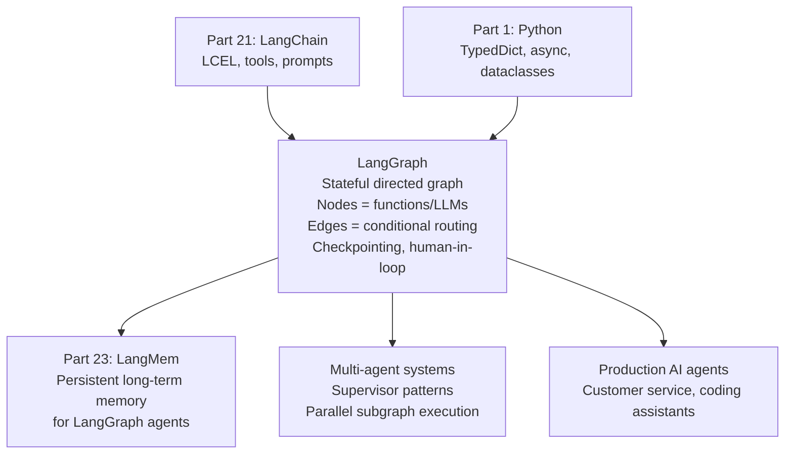

<!-- TEACHING_ORDER: verified -->
# Part 22: LangGraph

> **Prerequisites:** Part 21 (LangChain — LCEL, agents, tools), Python async/await
> **Used later in:** Part 23 (LangMem provides persistent memory to LangGraph agents)
> **Version anchor:** LangGraph 0.3.x (mid-2026), LangGraph Platform stable

---

## Why This Library Exists

### The problem: LangChain agents are linear — real AI applications need loops, branches, and state

LangChain's `AgentExecutor` runs a fixed ReAct loop: reason → act → observe → repeat until done. This works for simple tool-calling agents. But production AI applications need:
- **Branches:** route to different sub-agents based on query type
- **Loops:** retry if the output quality is low
- **Parallel nodes:** call three tools simultaneously and merge results
- **Human-in-the-loop:** pause execution, wait for human approval, resume
- **Persistent state:** the agent's working memory survives between API calls

These patterns cannot be expressed cleanly in `AgentExecutor`. Harrison Chase's team released **LangGraph** in early 2024 as a separate library: a graph execution framework where nodes are Python functions (or LLM calls) and edges define the control flow.

---

## Explain Like I Am 10

Imagine a choose-your-own-adventure book. In a linear story, you read page 1, then page 2, then page 3. That's LangChain chains. LangGraph is the whole adventure book: sometimes you go from page 5 to page 12, sometimes to page 7. Some pages have a loop: "go back to page 3 and try again." Some pages say "wait for your friend's answer before continuing."

You define the pages (nodes) and the arrows between them (edges). The current page is the "state." LangGraph manages where you are and what you have read so far.

---

## Mental Model

**LangGraph models AI agent workflows as stateful directed graphs: nodes are Python functions or LLM calls, edges are conditional control flow, and a shared state dict is passed between nodes and persists across conversation turns.**

```
State = TypedDict with accumulated messages and working memory

Graph:
  START → planner_node → [if needs_tool] → tool_node → planner_node (loop)
                        → [if done]      → response_node → END
```

---

## Learning Dependency Graph



---

## Core Concepts

### 1. State: the agent's working memory

State is a TypedDict (or Pydantic model) that flows through the entire graph:

```python
from typing import Annotated, List
from typing_extensions import TypedDict
from langchain_core.messages import BaseMessage
import operator

class AgentState(TypedDict):
    messages: Annotated[List[BaseMessage], operator.add]   # append-only list
    current_query: str
    tool_results: List[str]
    num_retries: int
```

`Annotated[List[...], operator.add]` means: when two state snapshots are merged, concatenate the lists (instead of replacing). This accumulates the conversation history automatically.

### 2. Nodes and conditional edges

```python
from langgraph.graph import StateGraph, END
from langchain_openai import ChatOpenAI
from langchain_core.messages import HumanMessage, AIMessage

llm   = ChatOpenAI(model="gpt-4o-mini")
tools = [search_tool, calculator_tool]
llm_with_tools = llm.bind_tools(tools)

def call_model(state: AgentState) -> AgentState:
    """LLM node: call the model with current messages."""
    response = llm_with_tools.invoke(state["messages"])
    return {"messages": [response]}

def call_tools(state: AgentState) -> AgentState:
    """Tool node: execute any tool calls from the last message."""
    from langchain_core.messages import ToolMessage
    last_msg = state["messages"][-1]
    results  = []
    for tc in last_msg.tool_calls:
        tool_result = execute_tool(tc["name"], tc["args"])
        results.append(ToolMessage(content=str(tool_result), tool_call_id=tc["id"]))
    return {"messages": results}

def should_continue(state: AgentState) -> str:
    """Conditional edge: route based on whether tools were called."""
    last_msg = state["messages"][-1]
    if hasattr(last_msg, "tool_calls") and last_msg.tool_calls:
        return "call_tools"
    return END   # no tool calls → done

# Build graph
workflow = StateGraph(AgentState)
workflow.add_node("llm", call_model)
workflow.add_node("tools", call_tools)
workflow.set_entry_point("llm")
workflow.add_conditional_edges("llm", should_continue, {"call_tools": "tools", END: END})
workflow.add_edge("tools", "llm")    # always loop back to LLM after tools

app = workflow.compile()
```

### 3. Checkpointing: persistent state across turns

LangGraph's checkpointer saves state after each node, enabling:
- Resume after crash
- Human-in-the-loop interrupts
- Multi-turn conversations with memory

```python
from langgraph.checkpoint.memory import MemorySaver
from langgraph.checkpoint.sqlite import SqliteSaver   # for persistence

# In-memory checkpointer (per process)
checkpointer = MemorySaver()
app = workflow.compile(checkpointer=checkpointer)

# Run with thread_id to identify a conversation
config = {"configurable": {"thread_id": "user-123-session-1"}}

result1 = app.invoke(
    {"messages": [HumanMessage("What is the capital of France?")]},
    config=config,
)
result2 = app.invoke(
    {"messages": [HumanMessage("What is it famous for?")]},  # "it" refers to Paris
    config=config,
)
# LangGraph loads the state from thread "user-123-session-1" — has full history
```

### 4. Human-in-the-loop

```python
from langgraph.graph import StateGraph

# Interrupt before a sensitive tool call
app = workflow.compile(
    checkpointer=checkpointer,
    interrupt_before=["tools"],  # pause before "tools" node
)

config = {"configurable": {"thread_id": "session-1"}}
state  = app.invoke({"messages": [HumanMessage("Delete all my emails")]}, config)
# Graph pauses at "tools" node — returns current state

print("Agent wants to call:", state["messages"][-1].tool_calls)
human_approval = input("Approve? (y/n): ")

if human_approval == "y":
    # Resume from where it paused
    final_state = app.invoke(None, config)
```

### 5. Multi-agent patterns

```python
# Supervisor pattern: one orchestrator routes to specialist sub-agents
from langgraph.graph import StateGraph

def supervisor(state):
    """Decide which specialist agent to call."""
    query = state["messages"][-1].content
    if "code" in query.lower():
        return {"next": "coding_agent"}
    elif "search" in query.lower():
        return {"next": "research_agent"}
    return {"next": "general_agent"}

workflow = StateGraph(AgentState)
workflow.add_node("supervisor", supervisor)
workflow.add_node("coding_agent", coding_agent_fn)
workflow.add_node("research_agent", research_agent_fn)
workflow.add_node("general_agent", general_agent_fn)

# Conditional routing from supervisor
workflow.add_conditional_edges("supervisor", lambda s: s["next"], {
    "coding_agent":   "coding_agent",
    "research_agent": "research_agent",
    "general_agent":  "general_agent",
})
```

---

## Essential APIs

```python
from langgraph.graph import StateGraph, END
from langgraph.checkpoint.memory import MemorySaver
from langgraph.prebuilt import create_react_agent  # quick ReAct agent

# Build graph
workflow = StateGraph(MyState)
workflow.add_node("node_name", node_fn)
workflow.set_entry_point("node_name")
workflow.add_edge("a", "b")                  # unconditional
workflow.add_conditional_edges("a", router_fn, {"b": "b", "c": "c", END: END})
app = workflow.compile(checkpointer=MemorySaver())

# Invoke
state = app.invoke(initial_state, config={"configurable": {"thread_id": "id"}})

# Stream
for event in app.stream(initial_state, config=config):
    print(event)

# Get current state (for human-in-loop)
snapshot = app.get_state(config)

# Prebuilt ReAct agent (simplest case)
agent = create_react_agent(llm, tools, checkpointer=MemorySaver())
agent.invoke({"messages": [HumanMessage("Hello")]},
             config={"configurable": {"thread_id": "1"}})
```

---

## Beginner Examples

### Example 1: Multi-turn chatbot with memory

```python
from typing import Annotated, List
from typing_extensions import TypedDict
import operator

from langchain_core.messages import BaseMessage, HumanMessage, SystemMessage
from langgraph.graph import StateGraph, END
from langgraph.checkpoint.memory import MemorySaver

class ChatState(TypedDict):
    messages: Annotated[List[BaseMessage], operator.add]

def chat_node(state: ChatState) -> dict:
    """Call LLM — returns dict with new messages to append."""
    try:
        from langchain_openai import ChatOpenAI
        llm = ChatOpenAI(model="gpt-4o-mini", temperature=0.7)
        system = SystemMessage("You are a helpful, concise assistant.")
        response = llm.invoke([system] + state["messages"])
        return {"messages": [response]}
    except Exception:
        # Demo fallback
        from langchain_core.messages import AIMessage
        last = state["messages"][-1].content
        return {"messages": [AIMessage(f"Echo: {last}")]}

workflow = StateGraph(ChatState)
workflow.add_node("chat", chat_node)
workflow.set_entry_point("chat")
workflow.add_edge("chat", END)

checkpointer = MemorySaver()
app = workflow.compile(checkpointer=checkpointer)

thread_config = {"configurable": {"thread_id": "demo-session"}}

# Turn 1
result = app.invoke(
    {"messages": [HumanMessage("My name is Alice.")]},
    config=thread_config,
)
print("Turn 1:", result["messages"][-1].content[:100])

# Turn 2 — LangGraph loads previous state (has "My name is Alice")
result2 = app.invoke(
    {"messages": [HumanMessage("What is my name?")]},
    config=thread_config,
)
print("Turn 2:", result2["messages"][-1].content[:100])

# Check accumulated state
state = app.get_state(thread_config)
print(f"Total messages in state: {len(state.values['messages'])}")
```

---

## Internal Interview Knowledge

**Q: What is the key difference between LangGraph and LangChain's AgentExecutor?**
Strong answer: "AgentExecutor implements a hardcoded ReAct loop: while tool_calls_exist: call_model → call_tools. This can't be customized for different loop conditions, parallel branches, or human interrupts. LangGraph represents control flow as an explicit directed graph — you define nodes (any Python function) and edges (conditional routing logic). This enables: looping until a quality check passes, routing to specialized sub-agents based on query type, parallel execution of multiple tools, pausing for human approval at specific nodes, and full persistence of state across API calls. LangGraph is more complex to learn but handles all production agent patterns."

**Q: How does LangGraph's state persistence enable multi-turn conversations?**
Strong answer: "LangGraph uses checkpointers to save the full state (TypedDict) after each node execution. The state includes the conversation history as a list of messages with an `Annotated[List, operator.add]` reducer (append-only). When a new message arrives with the same `thread_id`, LangGraph loads the saved state — full message history — before executing. The LLM node receives all previous messages as context. This is equivalent to explicitly managing a database of conversation histories, but LangGraph does it automatically using any checkpointer backend: in-memory, SQLite, Redis, Postgres."

---

## Production AI Usage

**Replit:** Replit's AI coding agent uses LangGraph for the multi-step code generation and debugging loop — generate code, run tests, check output, retry if failing.

**Elastic:** Elastic's AI assistant uses LangGraph for routing queries to different search and analytics agents.

**Legalzoom:** Multi-agent document processing pipeline using LangGraph supervisor pattern to route legal documents to specialized extraction agents.

---

## Common Mistakes

**Mistake 1: Forgetting that state is immutable between nodes — must return dict**
```python
# Bug: mutating state in-place — changes are not persisted
def my_node(state: MyState):
    state["count"] += 1   # mutations not captured!
    return {}

# Fix: return a dict with the new values
def my_node(state: MyState):
    return {"count": state["count"] + 1}
```

**Mistake 2: Not using Annotated reducers for list fields**
```python
# Bug: messages replaced, not appended
class State(TypedDict):
    messages: List[BaseMessage]   # no reducer → REPLACE on each update

# Fix: use operator.add as reducer
class State(TypedDict):
    messages: Annotated[List[BaseMessage], operator.add]  # APPEND
```

---

## Cheat Sheet

```python
from langgraph.graph import StateGraph, END
from langgraph.checkpoint.memory import MemorySaver
from typing import Annotated, List
import operator

class State(TypedDict):
    messages: Annotated[List, operator.add]

def node_fn(state: State) -> dict:
    return {"messages": [new_message]}

def router(state: State) -> str:
    return "node_a" if condition else END

workflow = StateGraph(State)
workflow.add_node("node", node_fn)
workflow.set_entry_point("node")
workflow.add_conditional_edges("node", router, {"node_a": "node_a", END: END})
app = workflow.compile(checkpointer=MemorySaver())

config = {"configurable": {"thread_id": "session-1"}}
result = app.invoke({"messages": [HumanMessage("Hi")]}, config=config)
```

---

## Interview Question Bank

### Scenario & Failure-Based Questions

**Q1: What problem does LangGraph solve that LangChain's AgentExecutor doesn't?** A: AgentExecutor implements a hardcoded loop and can't express: conditional routing, loops until a condition is met, parallel execution, or human-in-the-loop interrupts. LangGraph models workflows as an explicit directed graph — any Python function is a node, routing logic is an edge. This covers all agent patterns: supervisor routing to sub-agents, retry loops, parallel tool calls, and pause-for-human-approval workflows.

**Q2: What is a checkpointer and what backends are supported?** A: A checkpointer saves the graph state (the TypedDict) after each node executes, keyed by thread_id. Supported backends: `MemorySaver` (in-process, lost on restart), `SqliteSaver` (file-backed SQLite, survives restarts), `AsyncPostgresSaver` (production Postgres for multi-instance deployments). In production, use Postgres or Redis so multiple API server instances can share conversation state.

**Q3: How do you implement human-in-the-loop in LangGraph?** A: Compile the graph with `interrupt_before=["node_name"]`. When the graph reaches that node, it pauses and returns current state. Store the config (thread_id). When human approves, call `app.invoke(None, config=config)` to resume. The graph loads the saved state from the checkpointer and continues from the interrupted node. `interrupt_after=["node_name"]` pauses after the node runs.

**Q4: What is the `Annotated[List, operator.add]` pattern in LangGraph state?** A: The `Annotated` type hint attaches a "reducer" function — logic for merging two state snapshots. `operator.add` means concatenate lists. When a node returns `{"messages": [new_msg]}`, LangGraph calls `old_messages + [new_msg]` to produce the new state. Without a reducer, updates replace the previous value. This append-only pattern is essential for conversation history — you never want to lose previous messages.

**Q5: How do you run multiple agents in parallel in LangGraph?** A: Use a `Send` object (fan-out) to dispatch to multiple subgraph nodes simultaneously. After all parallel nodes complete, a merge node consolidates results. Alternatively, use `asyncio.gather` inside a single node to call multiple LLMs in parallel. LangGraph's async streaming (`app.astream(...)`) enables handling parallel branches efficiently.

**Q6 (Scenario): Your LangGraph agent is looping — it calls the same tool 10 times without terminating. What went wrong and how do you fix it?** A: Root cause is usually: the routing edge condition never evaluates to `END`, or the LLM's last message lacks a `tool_calls` field but the condition still routes back to tools. Fix: (1) Add a `max_iterations` counter in state — each tool call increments it; route to END when limit hit. (2) Audit the conditional edge by printing `messages[-1]` to check what the routing function reads. (3) Set `recursion_limit=25` in graph config as a hard circuit breaker. Always have explicit termination conditions.

**Q7 (Failure): A multi-user production LangGraph app starts returning one user's conversation history to another user. What is the likely cause?** A: The `thread_id` in the run config is shared or not set — if `thread_id` is missing or hardcoded (e.g., `thread_id="default"`), all users share the same checkpointer slot. This is a serious data leakage bug. Fix: always derive `thread_id` from the authenticated user's session ID: `config = {"configurable": {"thread_id": f"{user_id}:{session_id}"}}`. Validate that every request flow sets a unique, user-scoped thread_id.

**Q8 (Scenario): You need a "tool confirmation" flow where sensitive tool calls like `delete_database` require the user to confirm before execution. How do you architect this?** A: Use `interrupt_before=["execute_sensitive_tool"]`. The graph pauses and emits the pending tool call details to the UI. The UI shows the tool name and arguments and presents a confirmation dialog. On approval: `app.invoke({"approved": True}, config=thread_config)`. On rejection: `app.invoke({"approved": False}, config=thread_config)` — a branch node routes to a skip path. This ensures no destructive operations run without explicit human confirmation.

**Q9 (Scenario): Your LangGraph agent works in testing but silently loses state after deployment to Kubernetes with 3 replicas. What is happening?** A: `MemorySaver` stores state in-process. With 3 replicas, consecutive requests from the same user may hit different replicas, each with their own isolated in-memory state. Fix: replace `MemorySaver` with `AsyncPostgresSaver` connected to a shared Postgres database so all replicas read and write to the same state store.

**Q10 (Failure): Your LangGraph checkpointer Postgres database fills up disk after 2 months in production. What happened?** A: Every node execution writes a full state snapshot to the DB. With frequent short-lived agent runs that are never cleaned up, checkpoints accumulate indefinitely. Fix: (1) Implement a TTL-based cleanup job: `DELETE FROM checkpoints WHERE created_at < NOW() - INTERVAL '30 days'`. (2) For ephemeral tasks that don't need history, use `MemorySaver` instead of Postgres. (3) Only persist the final state + summary for long-lived assistants, not every intermediate snapshot.

**Q11 (Scenario): How do you build a customer support agent where an LLM can escalate to a human but continue handling routine queries automatically?** A: Create a routing node that classifies the query: routine → `auto_agent` subgraph, complex → `human_escalation` node. The `human_escalation` node uses `interrupt_before` to pause and hand off to a human support queue via ticketing API. When the human resolves, they call `app.invoke(resolution, config)` to resume — the graph then transitions to `close_ticket`. The graph state captures the full audit trail of both automated and human actions.

**Q12 (Scenario): An LLM inside your LangGraph agent hallucinates a tool name that doesn't exist. The graph crashes. How do you make this robust?** A: In the routing edge: if `messages[-1].tool_calls` contains a tool name not in the registered tools dict, route to a `handle_invalid_tool_call` node instead of the tool executor. This node appends a `ToolMessage` with the error "Tool 'xyz' does not exist. Available tools: [list]" and routes back to the LLM node to retry. Add a retry counter in state to prevent infinite correction loops.

**Q13 (Scenario): How do you replay a failed LangGraph agent run for debugging when the agent made 20 LLM calls before failing at step 15 — without re-running all 20 calls?** A: LangGraph's `get_state_history(config)` returns all historical state snapshots for a thread. Load the state at step 14: `app.update_state(config, state_at_step_14)`. Now replay from step 15 with fixed code. The checkpointer enables "time travel" debugging — you can go back to any historical state and try different paths without re-running expensive preceding steps.

**Q14 (Scenario): You want to stop a running LangGraph agent mid-execution without corrupting state. How do you ensure safe cancellation?** A: Cancel the async graph execution coroutine. The last successfully committed checkpoint is the last clean state — checkpoints are written atomically after node completion, so a partial node execution is never committed. On next run, either resume from that checkpoint or start fresh. The key safety property is that LangGraph's transactional checkpointing prevents any corrupt intermediate state.

**Q15 (Failure): A LangGraph node returns a key that doesn't exist in the TypedDict schema. What happens?** A: LangGraph silently ignores keys not in the TypedDict schema — the extra key is dropped without error. This is a silent data loss bug. Prevention: (1) Add a test that checks each node's return dict only contains keys defined in the TypedDict. (2) Use Pydantic models instead of TypedDict for runtime validation — invalid keys raise `ValidationError` immediately. (3) Enable strict mode: `class State(TypedDict, total=True)`.


## Quality Checklist

- [x] Easy English used
- [x] Problem explained (AgentExecutor limitations for production patterns)
- [x] History explained (Harrison Chase team, early 2024)
- [x] Mental model explained (choose-your-own-adventure book)
- [x] Learning Dependency Graph included
- [x] Core Concepts: State, nodes/edges, checkpointing, human-in-loop, multi-agent
- [x] Essential APIs included
- [x] Beginner Examples (multi-turn chatbot with memory)
- [x] Internal Interview Knowledge included
- [x] Production AI Usage included
- [x] Common Mistakes included
- [x] Cheat Sheet + Interview Questions included

*[Back to handbook](README.md)*
