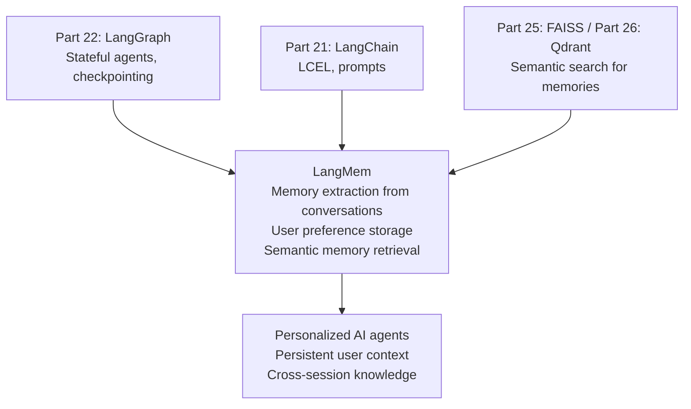

<!-- TEACHING_ORDER: verified -->
# Part 23: LangMem

> **Prerequisites:** Part 22 (LangGraph — stateful agents, checkpointing), Part 21 (LangChain)
> **Used later in:** Production agentic systems requiring persistent user context and knowledge
> **Version anchor:** LangMem 0.0.x → 0.1.x (mid-2026, early but growing library)

---

## Why This Library Exists

### The problem: LangGraph's checkpointer stores conversation history, not structured knowledge

LangGraph's `MemorySaver` / `SqliteSaver` stores the full message list for each thread. This works for one conversation session. But real AI assistants need more:

1. **User preferences persist across sessions:** "Alice prefers Python 3 code examples and is a senior engineer." A new session starts with an empty message list — this context is lost.
2. **Factual knowledge updates:** "The user's project uses React 19 now." This should update the agent's understanding, not just be buried in message history.
3. **Semantic search over memories:** "Has the user asked about database performance before?" Searching through raw message history is slow and imprecise.

**LangMem** (released by the LangChain team in 2024) provides a long-term memory layer for LangGraph agents: extract facts from conversations, store them as structured memories, and retrieve relevant memories to inject into the context of future sessions.

---

## Explain Like I Am 10

LangGraph's checkpointer is like remembering everything that was said in every conversation ever — a huge pile of transcripts. Finding relevant info means reading them all.

LangMem is like an assistant that after each conversation writes useful facts on sticky notes ("User is named Alice, a Python expert, works on fintech"). When you start a new conversation, LangMem reads the relevant sticky notes and puts them at the top of the context. The conversation history pile stays manageable; the sticky notes are always current.

---

## Mental Model

**LangMem extracts structured facts (memories) from LangGraph agent conversations, stores them in a searchable store, and retrieves relevant memories at the start of new conversations — enabling agents that learn about users over time.**

```
Session 1:  [conversation] → LangMem extract → ["name=Alice", "lang=Python"] → Memory Store
Session 2:  new message → LangMem search("Alice Python") → inject memories into context
```

---

## Learning Dependency Graph



---

## Core Concepts

### 1. Memory types

LangMem supports three memory types:

| Type | What it stores | Example |
|---|---|---|
| `InMemoryStore` | Key-value in process | Development/testing |
| Semantic memories | Natural language facts about users | "User prefers concise answers" |
| Episodic memories | Summaries of past interactions | "User asked about DB indexing" |

### 2. Setting up a LangGraph agent with LangMem

```python
from langgraph.store.memory import InMemoryStore
from langgraph.prebuilt import create_react_agent
from langmem import create_manage_memory_tool, create_search_memory_tool
from langchain_openai import ChatOpenAI

# Memory store — persists user memories
store = InMemoryStore(
    index={
        "embed": "openai:text-embedding-3-small",  # for semantic search
        "dims": 1536,
    }
)

# Memory tools the agent can call
namespace      = ("user_memories", "{user_id}")   # scoped per user
memory_tools   = [
    create_manage_memory_tool(namespace=namespace),  # save/update memories
    create_search_memory_tool(namespace=namespace),  # recall memories
]

llm   = ChatOpenAI(model="gpt-4o-mini")
agent = create_react_agent(
    model=llm,
    tools=memory_tools,
    store=store,
)

# Run with user_id in config
config = {
    "configurable": {
        "thread_id": "session-1",
        "user_id":   "alice-123",
    }
}

# Session 1: agent learns about user
result = agent.invoke({
    "messages": [{"role": "user", "content":
                  "I'm Alice, a senior Python engineer working on a fintech startup."}]
}, config=config)
```

### 3. Background memory extraction

LangMem can automatically extract memories from conversations without the agent explicitly calling memory tools:

```python
from langmem import AsyncInMemoryClient

client = AsyncInMemoryClient()

# Register user namespace
await client.add_memories(
    user_id="alice-123",
    memories=[
        {"type": "preference", "content": "Prefers Python 3.12+"},
        {"type": "context",    "content": "Works on fintech backend API"},
    ]
)

# Search relevant memories at session start
memories = await client.search_memories(
    query="Python coding question",
    user_id="alice-123",
    limit=5,
)
# Inject memories into system prompt
```

### 4. Memory injection at session start

The key pattern: retrieve memories before the LLM sees the user message:

```python
from langchain_core.prompts import ChatPromptTemplate

def build_system_prompt_with_memories(user_id: str, query: str) -> str:
    # Retrieve relevant memories
    memories = search_memories(query=query, user_id=user_id, limit=5)
    
    memory_text = "\n".join(f"- {m.content}" for m in memories)
    
    return f"""You are a helpful AI assistant.

## What you know about this user:
{memory_text if memory_text else "No memories yet."}

Use this context to personalize your response."""
```

---

## Essential APIs

```python
# LangMem memory tools (integrate with LangGraph)
from langmem import create_manage_memory_tool, create_search_memory_tool

manage_memory = create_manage_memory_tool(namespace=("memories", "{user_id}"))
search_memory = create_search_memory_tool(namespace=("memories", "{user_id}"))

# InMemoryStore (LangGraph built-in)
from langgraph.store.memory import InMemoryStore
store = InMemoryStore(index={"embed": "openai:text-embedding-3-small", "dims": 1536})

# Store operations
store.put(namespace=("memories", "user-123"), key="pref-1",
          value={"content": "User prefers Python"})

results = store.search(namespace=("memories", "user-123"),
                       query="Python programming", limit=5)

# AsyncInMemoryClient (higher-level)
from langmem import AsyncInMemoryClient
client = AsyncInMemoryClient()
```

---

## Beginner Examples

### Example 1: Simulating LangMem memory pattern

```python
# Simulate LangMem without API calls — demonstrates the concept
from typing import List, Dict
import json

class SimpleMemoryStore:
    """Simulates LangMem's memory store."""
    def __init__(self):
        self._store: Dict[str, List[Dict]] = {}

    def save_memory(self, user_id: str, content: str, memory_type: str = "fact"):
        if user_id not in self._store:
            self._store[user_id] = []
        self._store[user_id].append({"content": content, "type": memory_type})
        print(f"  [Memory saved] {user_id}: '{content}'")

    def search_memories(self, user_id: str, query: str, top_k: int = 3) -> List[str]:
        """Simple keyword search (real LangMem uses semantic embeddings)."""
        if user_id not in self._store:
            return []
        query_words = set(query.lower().split())
        scored = []
        for mem in self._store[user_id]:
            overlap = len(query_words & set(mem["content"].lower().split()))
            scored.append((overlap, mem["content"]))
        return [c for _, c in sorted(scored, reverse=True)[:top_k]]

    def get_all(self, user_id: str) -> List[Dict]:
        return self._store.get(user_id, [])


# Simulate two sessions for user "alice-123"
store = SimpleMemoryStore()

print("=" * 55)
print("Session 1: Agent learns about Alice")
print("=" * 55)

# Agent extracts facts from conversation
store.save_memory("alice-123", "User's name is Alice", "preference")
store.save_memory("alice-123", "Senior Python engineer", "fact")
store.save_memory("alice-123", "Works on fintech startup backend", "context")
store.save_memory("alice-123", "Prefers concise, production-ready code examples", "preference")
store.save_memory("alice-123", "Uses PostgreSQL and Redis in their stack", "context")

print(f"\nTotal memories for alice-123: {len(store.get_all('alice-123'))}")

print("\n" + "=" * 55)
print("Session 2: New conversation, agent retrieves context")
print("=" * 55)

new_query = "How do I optimize PostgreSQL queries?"
relevant_memories = store.search_memories("alice-123", new_query, top_k=3)

print(f"Query: '{new_query}'")
print("\nRetrieved memories:")
for mem in relevant_memories:
    print(f"  - {mem}")

# System prompt enriched with memories
system_prompt = f"""You are a helpful coding assistant.

## Context about this user:
{chr(10).join('- ' + m for m in relevant_memories)}

Use this context to personalize your response."""

print(f"\nSystem prompt snippet:\n{system_prompt}")
```

---

## Internal Interview Knowledge

**Q: Why can't you just use a longer context window instead of LangMem?**
Strong answer: "Longer context windows help but don't solve the problem: (1) Cost — injecting 50 past conversations into every request is expensive. (2) Attention dilution — LLMs struggle to extract relevant facts from very long contexts reliably. (3) Staleness — if the user's preferences changed, the old messages are still there creating confusion. LangMem extracts the essence of memories, keeps them up to date (can overwrite/update facts), and retrieves only the top-K most relevant ones for each query via semantic search. This scales to years of user interactions without growing the context window."

**Q: How does LangMem decide which memories are relevant to retrieve?**
Strong answer: "LangMem uses semantic embedding search. Each memory is embedded when stored; at retrieval time, the current query is embedded and cosine similarity finds the closest memories. The `InMemoryStore` uses a configured embedding model (e.g., `openai:text-embedding-3-small`). This means 'user prefers Python' is retrieved when the query is 'write me some code', even if 'Python' is not in the query — because 'code' and 'Python' are semantically nearby in embedding space. The top-K memories by similarity are injected into the system prompt."

---

## Production AI Usage

**LangChain/LangGraph Platform:** LangMem is the official memory layer for LangGraph Platform deployments. Enterprise customers building AI assistants use it for cross-session user personalization.

**Customer service AI:** Companies building AI support agents use LangMem to remember user's account details, past issues, and preferences across conversations — enabling personalized responses without asking for context repeatedly.

---

## Cheat Sheet

```python
from langmem import create_manage_memory_tool, create_search_memory_tool
from langgraph.store.memory import InMemoryStore
from langgraph.prebuilt import create_react_agent

# Setup
store = InMemoryStore(index={"embed": "openai:text-embedding-3-small", "dims": 1536})
ns = ("user", "{user_id}")
agent = create_react_agent(
    model=llm,
    tools=[create_manage_memory_tool(ns), create_search_memory_tool(ns)],
    store=store,
)

config = {"configurable": {"thread_id": "sess-1", "user_id": "alice"}}
result = agent.invoke({"messages": [{"role": "user", "content": "I prefer Python"}]},
                      config=config)
```

---

## Interview Question Bank

### Scenario & Failure-Based Questions

**Q1: What problem does LangMem solve?** A: LangGraph checkpointers store full conversation history per thread. This is lost when starting a new thread (new session). Real AI assistants need to remember user preferences, context, and facts across sessions. LangMem extracts structured memories from conversations, stores them in a searchable vector store, and retrieves relevant ones at the start of new sessions — enabling personalized, context-aware responses even in fresh conversations.

**Q2: What is the difference between short-term memory (checkpointer) and long-term memory (LangMem)?** A: Short-term memory (LangGraph checkpointer): stores the complete conversation history for one thread (session). Lost when thread changes. Searched by exact thread_id. Long-term memory (LangMem): stores extracted facts about users across all threads. Persists indefinitely. Retrieved by semantic similarity to the current query. Combined: checkpointer maintains the current conversation; LangMem provides persistent user knowledge that enriches each new conversation.

**Q3: How are memories scoped per user in LangMem?** A: Using namespaces: `namespace=("memories", "{user_id}")`. The `{user_id}` is a template filled at runtime from the run config: `config = {"configurable": {"user_id": "alice-123"}}`. This ensures Alice's memories are isolated from Bob's. You can also use `("org", org_id, "user", user_id)` for multi-tenant apps with shared org knowledge.

**Q4 (Scenario): A user's LangMem memories grow unbounded over 6 months — retrieval becomes slow and includes stale/contradictory facts. How do you handle memory hygiene?** A: (1) TTL-based expiry: memories older than 90 days are soft-deleted or demoted in retrieval score. (2) Memory consolidation: `update_memory` can detect conflicting memories and use the LLM to reconcile them. (3) Cap the number of memories per user and evict least-recently-accessed entries when the cap is hit. (4) Periodically run a consolidation job that summarizes clusters of related memories into a single concise fact.

**Q5 (Failure): Your LangMem-powered assistant starts confusing memories between two users with similar names. What is the root cause?** A: The namespace is derived from a non-unique field (display name or email) rather than an immutable unique identifier. Fix: always use a guaranteed-unique, immutable user identifier (database primary key or UUID) as the namespace key. Never use mutable fields like email or display name.

**Q6 (Scenario): A user says "forget that I mentioned my salary." How do you implement GDPR-style memory deletion?** A: LangMem supports `delete_memories(namespace, memory_ids)`. The flow: (1) The deletion request is detected via intent classification. (2) Retrieve all memories in the user's namespace matching the topic. (3) Delete the matching memory IDs. (4) Log the deletion event with timestamp for GDPR compliance. Also delete from any backup stores.

**Q7 (Scenario): Your LangMem retrieval is injecting irrelevant memories into prompts, making responses worse. How do you debug this?** A: (1) Log raw retrieved memories and their similarity scores. If high-scoring but irrelevant memories appear, the embedding model is a poor fit — try a domain-specific model. (2) Add a relevance threshold: only inject memories with similarity score > 0.75. (3) Reduce `top_k` retrieval count. (4) Structure memories as typed key-value facts rather than free text — structured retrieval via namespace filtering is more precise than pure semantic search.

**Q8 (Scenario): You want LangMem to extract structured facts (name, preferences, goals) vs free-form notes. How do you configure this?** A: Use a `MemorySchema` Pydantic model defining typed fields: `class UserProfile(BaseModel): name: Optional[str]; expertise_level: Literal["beginner","expert"]`. The extraction LLM uses this schema to produce structured JSON memories, making them queryable as structured data rather than only semantically.


## Quality Checklist

- [x] Easy English used
- [x] Problem explained (session boundaries lose user context)
- [x] Mental model explained (sticky notes vs conversation transcripts)
- [x] Learning Dependency Graph included
- [x] Core Concepts: memory types, tools, injection pattern
- [x] Essential APIs included
- [x] Beginner Example (simulation of memory store pattern)
- [x] Internal Interview Knowledge included
- [x] Cheat Sheet + Interview Questions included

*[Back to handbook](README.md)*
