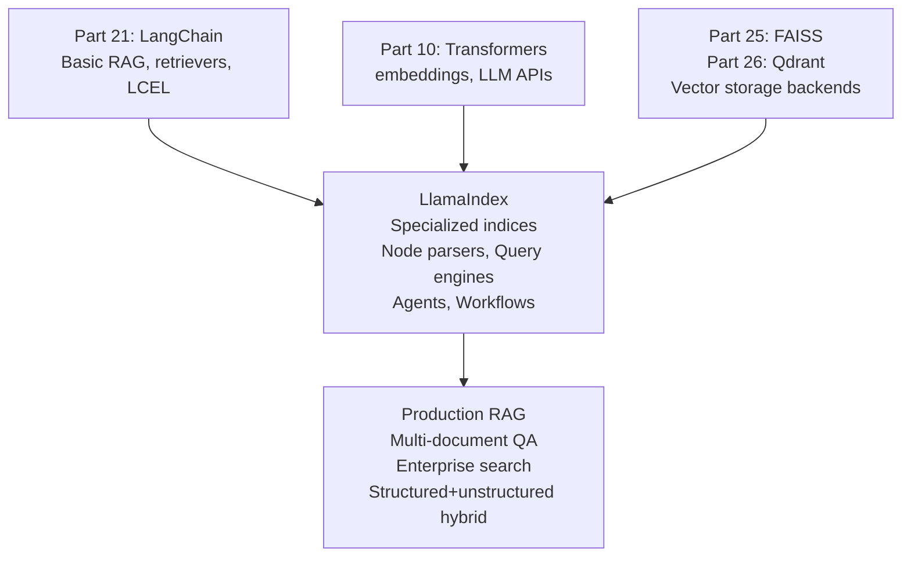

<!-- TEACHING_ORDER: verified -->
# Part 24: LlamaIndex

> **Prerequisites:** Part 21 (LangChain — RAG concepts, retrievers), Part 10 (Transformers/embeddings)
> **Used later in:** Production RAG systems, multi-document agents, Part 26 (Qdrant as LlamaIndex vector store)
> **Version anchor:** LlamaIndex 0.12.x (mid-2026), LlamaIndex Workflows stable

---

## Why This Library Exists

### The problem: LangChain's retrieval is generic — RAG needs specialized indexing

LangChain's retriever abstracts over vector stores: load → split → embed → store. This works for basic RAG. But production RAG systems have more complex needs:

1. **Multiple index types:** Vector similarity, keyword (BM25), knowledge graph, summary indices — and you want to combine them.
2. **Document hierarchies:** A PDF has sections, paragraphs, sentences. When searching, you want to return the paragraph, not the sentence, but match at the sentence level.
3. **Structured data:** Query a SQL database and a PDF simultaneously.
4. **Agent-driven retrieval:** The agent decides which index to query and how, not just "retrieve top-5 chunks."

Jerry Liu (former ML engineer at Uber) released **LlamaIndex** in late 2022 as a data framework specifically for connecting LLMs to data — not as a general LLM orchestration framework (that's LangChain's role).

LlamaIndex's core philosophy: **indexing is a first-class operation**. Instead of one retriever type, LlamaIndex has a taxonomy of indices, each optimized for different query patterns. By 2025, it added **LlamaIndex Workflows** — an event-driven async alternative to LangGraph for complex RAG pipelines.

---

## Explain Like I Am 10

Imagine you have a huge library with thousands of books (your documents). LangChain's RAG is like a librarian who photocopies every book, cuts the pages into chunks, and puts them in alphabetical order. When you ask a question, they find the most similar chunks.

LlamaIndex is like a professional library cataloger. They create multiple catalogs: one by topic, one by keywords, one that summarizes whole chapters, one for tables and figures. When you ask a question, they check the right catalog. For broad questions, they use the summary catalog. For specific facts, they use the keyword catalog. The answer is better and faster.

---

## Mental Model

**LlamaIndex is a data framework for LLMs: it provides specialized index types for different query patterns (vector, keyword, knowledge graph, summary), hierarchical chunking, and query engines that reason about which index to use.**

---

## Learning Dependency Graph



---

## Core Concepts

### 1. Documents, Nodes, and Indices

**Document:** The raw input (PDF, markdown, web page, database row).

**Node:** A chunk of a document with metadata and relationships (parent/child/previous/next).

**Index:** An organized data structure over nodes, optimized for retrieval.

```python
from llama_index.core import SimpleDirectoryReader, VectorStoreIndex
from llama_index.core.node_parser import SentenceSplitter

# Load documents
documents = SimpleDirectoryReader("./my_docs/").load_data()

# Parse into nodes with metadata preservation
parser = SentenceSplitter(chunk_size=512, chunk_overlap=50)
nodes  = parser.get_nodes_from_documents(documents)

print(f"Loaded {len(documents)} documents, {len(nodes)} nodes")
for node in nodes[:2]:
    print(f"  Node text: {node.text[:80]}...")
    print(f"  Source: {node.metadata.get('file_name')}")
```

### 2. Index types

```python
from llama_index.core import (
    VectorStoreIndex,
    SummaryIndex,
    KeywordTableIndex,
    KnowledgeGraphIndex,
)

# Vector index: semantic similarity search (most common)
vector_index = VectorStoreIndex.from_documents(documents)

# Summary index: synthesizes answers from all documents (good for "summarize X")
summary_index = SummaryIndex.from_documents(documents)

# Keyword index: BM25-style keyword retrieval (good for exact term matching)
keyword_index = KeywordTableIndex.from_documents(documents)
```

### 3. Query engines and retrievers

```python
# Query engine: retrieves + synthesizes
query_engine = vector_index.as_query_engine(
    similarity_top_k=5,      # retrieve top 5 nodes
    response_mode="compact", # synthesize into single answer
)
response = query_engine.query("What is the document about?")
print(response.response)
print(f"Source nodes: {[n.metadata['file_name'] for n in response.source_nodes]}")

# Retriever only (for custom post-processing)
retriever = vector_index.as_retriever(similarity_top_k=5)
nodes     = retriever.retrieve("What is attention?")
```

### 4. Hierarchical indexing (sentence → chunk → document)

Production RAG problem: matching at sentence level but returning at chunk level for better context.

```python
from llama_index.core import VectorStoreIndex
from llama_index.core.node_parser import (
    SentenceSplitter,
    HierarchicalNodeParser,
)
from llama_index.core.retrievers import AutoMergingRetriever
from llama_index.core.indices.postprocessor import MetadataReplacementPostProcessor

# Parse into hierarchy: document → chunks → sentences
node_parser = HierarchicalNodeParser.from_defaults(
    chunk_sizes=[2048, 512, 128]   # document → chunk → sentence
)
nodes = node_parser.get_nodes_from_documents(documents)

# Build index over leaf nodes (sentences)
index = VectorStoreIndex(nodes)

# Retriever: find at sentence level, return parent chunk
base_retriever = index.as_retriever(similarity_top_k=12)
retriever      = AutoMergingRetriever(
    base_retriever,
    storage_context=index.storage_context,
    verbose=True,
)
```

### 5. Multi-document agents

```python
from llama_index.core.tools import QueryEngineTool, ToolMetadata
from llama_index.core.agent import ReActAgent
from llama_index.llms.openai import OpenAI

# Build separate indices for each document
doc_engines = {}
for doc_name in ["paper_1.pdf", "paper_2.pdf", "api_reference.md"]:
    docs  = SimpleDirectoryReader(input_files=[doc_name]).load_data()
    index = VectorStoreIndex.from_documents(docs)
    doc_engines[doc_name] = index.as_query_engine(similarity_top_k=5)

# Wrap as tools
tools = [
    QueryEngineTool(
        query_engine=eng,
        metadata=ToolMetadata(
            name=name.replace(".", "_"),
            description=f"Useful for answering questions about {name}",
        ),
    )
    for name, eng in doc_engines.items()
]

llm   = OpenAI(model="gpt-4o-mini", temperature=0)
agent = ReActAgent.from_tools(tools, llm=llm, verbose=True)

response = agent.chat("Compare the approaches in paper_1 and paper_2.")
print(response.response)
```

---

## Essential APIs

```python
from llama_index.core import SimpleDirectoryReader, VectorStoreIndex, Settings
from llama_index.core.node_parser import SentenceSplitter
from llama_index.llms.openai import OpenAI
from llama_index.embeddings.openai import OpenAIEmbedding

# Global settings
Settings.llm       = OpenAI(model="gpt-4o-mini")
Settings.embed_model = OpenAIEmbedding(model="text-embedding-3-small")
Settings.chunk_size  = 512
Settings.chunk_overlap = 50

# Load
documents = SimpleDirectoryReader("./docs/").load_data()

# Index
index = VectorStoreIndex.from_documents(documents)

# Query
qe = index.as_query_engine(similarity_top_k=5)
response = qe.query("What is the main conclusion?")
print(response.response)

# Persist
index.storage_context.persist("./index_store/")

# Load from disk
from llama_index.core import load_index_from_storage, StorageContext
sc    = StorageContext.from_defaults(persist_dir="./index_store/")
index = load_index_from_storage(sc)
```

---

## Beginner Examples

### Example 1: Build a RAG system over text files

```python
import os
import tempfile
import pathlib
from llama_index.core import Document, VectorStoreIndex, Settings
from llama_index.core.node_parser import SentenceSplitter

# Demo: create sample documents without file system
sample_texts = [
    ("attention_paper.txt",
     "The Transformer model uses multi-head attention. "
     "Attention allows the model to focus on relevant parts of the input. "
     "The attention formula is: Attention(Q,K,V) = softmax(QK^T/sqrt(dk))V. "
     "Self-attention computes Q, K, V from the same input."),
    ("pytorch_intro.txt",
     "PyTorch is an open-source machine learning framework. "
     "It uses dynamic computation graphs. "
     "Autograd automatically computes gradients. "
     "PyTorch was developed by Meta AI Research."),
]

# Create Document objects directly (no file needed for demo)
documents = [
    Document(text=text, metadata={"filename": name})
    for name, text in sample_texts
]

# Node parser
parser = SentenceSplitter(chunk_size=100, chunk_overlap=20)
nodes  = parser.get_nodes_from_documents(documents)
print(f"Created {len(nodes)} nodes from {len(documents)} documents")

try:
    from llama_index.llms.openai import OpenAI
    from llama_index.embeddings.openai import OpenAIEmbedding
    Settings.llm        = OpenAI(model="gpt-4o-mini")
    Settings.embed_model = OpenAIEmbedding()

    index    = VectorStoreIndex.from_documents(documents)
    qe       = index.as_query_engine(similarity_top_k=3)
    response = qe.query("What is the attention formula?")
    print(f"\nQuery: 'What is the attention formula?'")
    print(f"Answer: {response.response}")
    print(f"Sources: {[n.metadata['filename'] for n in response.source_nodes]}")

except Exception as e:
    print(f"\nOpenAI not available ({e})")
    print("LlamaIndex pattern:")
    print("  index = VectorStoreIndex.from_documents(documents)")
    print("  qe    = index.as_query_engine(similarity_top_k=5)")
    print("  resp  = qe.query('What is attention?')")
    print("  print(resp.response, resp.source_nodes)")
```

---

## Internal Interview Knowledge

**Q: How does LlamaIndex's hierarchical node parser improve RAG quality?**
Strong answer: "Standard fixed-size chunking creates a dilemma: small chunks (128 tokens) capture specific facts well but lose surrounding context; large chunks (1024 tokens) capture context but reduce retrieval precision. Hierarchical chunking creates parent-child relationships: a 2048-token parent chunk contains 512-token child chunks, which contain 128-token leaf chunks. Retrieval happens at the leaf level (sentence similarity), but after retrieval, leaf nodes are 'merged up' to return the parent chunk — giving the LLM full context. `AutoMergingRetriever` implements this: if 3+ sibling leaf nodes from the same parent are retrieved, return the parent instead. This gives better recall with less noise."

**Q: When would you choose LlamaIndex over LangChain for RAG?**
Strong answer: "LlamaIndex when: (1) Complex document structure matters — PDF with tables, hierarchical PDFs, structured + unstructured hybrid. (2) You need multiple index types beyond vector search — keyword, summary, knowledge graph. (3) You need fine-grained control over node parsing, metadata, and retrieval postprocessing. (4) Building multi-document agents where each document gets its own query engine tool. LangChain when: (1) RAG is one component of a larger pipeline — LangChain integrates better with broader agent workflows. (2) You're already using LangChain for everything else — consistency matters. (3) Simpler RAG cases where LangChain's retriever abstraction is sufficient."

---

## Production AI Usage

**Notion AI:** Notion's AI assistant queries over users' workspace documents using RAG patterns similar to LlamaIndex's hierarchical retrieval.

**LinkedIn:** LinkedIn's knowledge assistant features use document indexing and retrieval approaches similar to LlamaIndex's multi-index framework.

**Andreessen Horowitz (a16z):** a16z's internal document search and analysis tools use LlamaIndex for indexing research papers and portfolio company documents.

---

## Library Relationships

### LlamaIndex vs LangChain for RAG

| Dimension | LlamaIndex | LangChain |
|---|---|---|
| Primary focus | Data indexing + retrieval | LLM orchestration + agents |
| Index types | 5+ (vector, keyword, summary, KG...) | 1 (vector store retriever) |
| Hierarchical chunking | Native (HierarchicalNodeParser) | Manual implementation |
| Multi-document agents | Native (QueryEngineTool per doc) | Via LangChain agents |
| LLM orchestration | Growing (Workflows) | Comprehensive (LCEL, LangGraph) |
| Choose for | RAG-heavy applications | General LLM applications |

---

## Cheat Sheet

```python
from llama_index.core import SimpleDirectoryReader, VectorStoreIndex, Settings
from llama_index.llms.openai import OpenAI
from llama_index.embeddings.openai import OpenAIEmbedding

Settings.llm        = OpenAI(model="gpt-4o-mini")
Settings.embed_model = OpenAIEmbedding()
Settings.chunk_size  = 512

docs     = SimpleDirectoryReader("./docs/").load_data()
index    = VectorStoreIndex.from_documents(docs)
qe       = index.as_query_engine(similarity_top_k=5)
response = qe.query("Your question here?")
print(response.response)

# Persist
index.storage_context.persist("./index/")
```

---

## Interview Question Bank

**Q1: What is LlamaIndex and how does it differ from LangChain?** A: LlamaIndex is a data framework for connecting LLMs to structured and unstructured data. It specializes in indexing — it provides multiple index types (vector, keyword, summary, knowledge graph), hierarchical node parsing, and document-centric query engines. LangChain is a broader LLM application framework focused on orchestration (chains, agents, tools). For RAG, LlamaIndex offers more index types and better document structure handling; LangChain integrates RAG into broader agent workflows better.

**Q2: What is a Node in LlamaIndex?** A: A Node is a processed text chunk with metadata and relationships. Created by parsing a Document through a NodeParser (e.g., SentenceSplitter). Each node has: `node_id`, `text` (the chunk content), `metadata` (source file, page, etc.), and relationship links to parent/child/previous/next nodes. Indices are built over nodes, not raw documents. The node structure enables hierarchical retrieval — searching at the sentence node but returning the parent chunk node.

**Q3: What are the main LlamaIndex index types and when do you use each?** A: VectorStoreIndex: semantic search via embeddings — best for "find similar content" queries. SummaryIndex: synthesizes answers by reading all nodes — best for "summarize the document" queries. KeywordTableIndex: BM25 keyword matching — best for exact term/acronym queries. KnowledgeGraphIndex: extracts entities and relationships — best for "how are X and Y related?" queries. ComposableGraph: combines multiple index types — for complex queries that need both semantic and keyword search.

**Q4: How do you persist a LlamaIndex index?** A: `index.storage_context.persist("./my_index_dir/")`. This saves JSON files for the vector store, document store, and index store. Reload with: `StorageContext.from_defaults(persist_dir="./my_index_dir/")` then `load_index_from_storage(sc)`. For production with large document collections, use an external vector store backend (Qdrant, Pinecone) instead of the default in-memory/file store.

**Q5: What is a QueryEngineTool and how does it enable multi-document agents?** A: A QueryEngineTool wraps a query engine (bound to a specific index) with a name and description. When given as a tool to a LlamaIndex ReActAgent, the agent decides which tool to call based on the question. For a collection of 100 research papers, each paper gets its own VectorStoreIndex + query engine + QueryEngineTool. The agent reads the description ("Paper about attention mechanisms") and routes the query to the right engine.

**Q6 (Scenario): Your LlamaIndex RAG system gives poor answers for 200-page technical manuals. What retrieval strategy helps?** A: Use hierarchical node parsing: split each page into sentence-level nodes for precise retrieval, but return the parent page-level chunk to the LLM for full context. SentenceWindowNodeParser stores surrounding sentences as metadata and expands the window at query time. The LLM gets rich surrounding text while retrieval was guided by precise sentences.

**Q7 (Failure): An index was built with 	ext-embedding-ada-002 but queries now use 	ext-embedding-3-large without rebuilding the index. Users report completely wrong results. Why?** A: Different embedding models produce vectors in different metric spaces — an da-002 document vector has no meaningful cosine similarity to a 	ext-embedding-3-large query vector. The similarity scores are meaningless. Fix: always use the same embedding model for indexing and querying. Store the embedding model name as index metadata and validate at query time.

**Q8 (Scenario): You need to answer questions requiring information from both a SQL database and an unstructured PDF corpus. How do you architect this in LlamaIndex?** A: Use SQLJoinQueryEngine: create a SQLTableRetrieverQueryEngine for the database and a VectorIndexQueryEngine for PDFs. Wrap both as QueryEngineTool objects and create a SubQuestionQueryEngine that decomposes the original question into sub-questions routed to the appropriate engine. SQL handles structured/aggregate queries; vector handles semantic/explanation queries.

**Q9 (Scenario): After indexing 50,000 documents, query latency spikes to 5 seconds. The bottleneck is retrieval, not the LLM. What do you investigate?** A: The default SimpleVectorStore does linear scan — O(N) for 50K vectors is slow. Switch to FAISS or Qdrant backend which uses ANN search (<10ms). Also check if query embedding is calling a slow remote API each time — cache embeddings for frequent queries. Reduce similarity_top_k from default 10 to 3-5.

**Q10 (Failure): 30% of indexed documents were updated but the index still serves stale content. How do you handle incremental updates?** A: Use RefreshSimpleIndexNodes passing new document list — the index computes a diff by doc ID, removes stale nodes, inserts new ones. For external vector stores, implement change detection via content hashes — re-embed and upsert only changed documents. Establish a daily or webhook-triggered incremental update pipeline instead of full re-indexing.

## Quality Checklist

- [x] Easy English used
- [x] Problem explained (generic LangChain retrieval, specialized indexing needs)
- [x] History explained (Jerry Liu, late 2022, Uber → LlamaIndex)
- [x] Mental model explained (library cataloger vs photocopier)
- [x] Learning Dependency Graph included
- [x] Core Concepts: Documents/Nodes/Indices, index types, hierarchical, multi-doc agents
- [x] Essential APIs included
- [x] Beginner Example (build RAG over text files)
- [x] Internal Interview Knowledge included
- [x] Production AI Usage included
- [x] Library Relationships (vs LangChain)
- [x] Cheat Sheet + Interview Questions included

*[Back to handbook](README.md)*
