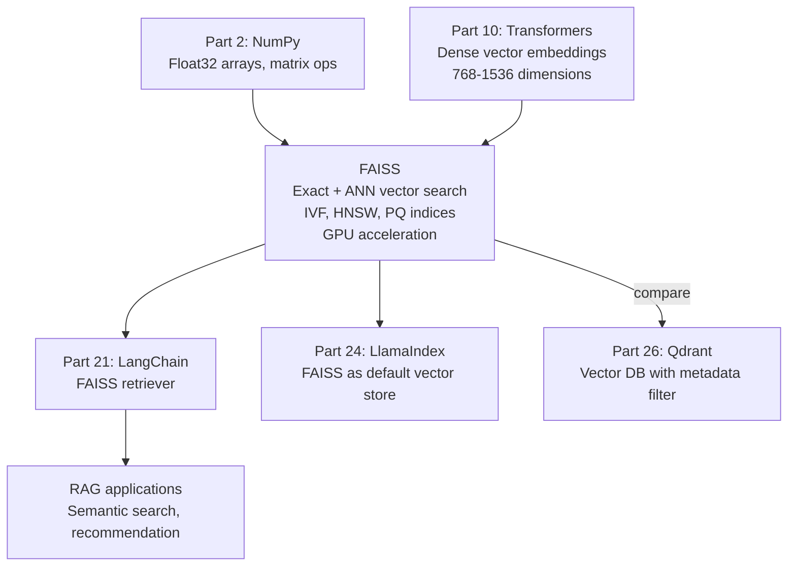
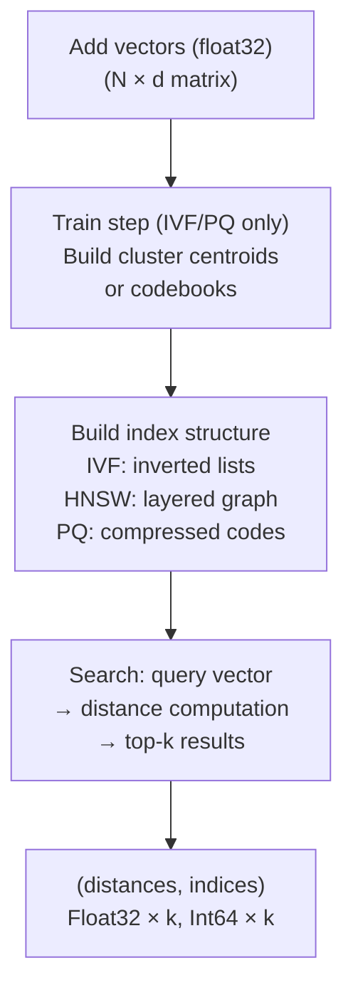

<!-- TEACHING_ORDER: verified -->
# Part 25: FAISS

> **Prerequisites:** Part 2 (NumPy — arrays, matrix operations), Part 10 (Transformers — embeddings)
> **Used later in:** Part 26–28 (Qdrant/Milvus/Weaviate extend the vector DB concept), Part 21 (LangChain FAISS retriever)
> **Version anchor:** FAISS 1.8.x (mid-2026), GPU index support stable

---

## Why This Library Exists

### The problem: finding the nearest vectors in a billion-item collection in milliseconds

Embeddings are the numerical fingerprints of text, images, and audio — dense vectors of 768 or 1536 dimensions. Finding the most similar item to a query means computing the distance to all stored items. For 1 million 768-dimension embeddings: `10^6 × 768 × 4 bytes = ~3 GB` of data. Computing exact cosine similarity to all 1M vectors takes ~150ms on a modern CPU — too slow for real-time search.

Hervé Jégou, Matthijs Douze, and the Facebook AI Research (FAIR) team developed FAISS (Facebook AI Similarity Search) and open-sourced it in 2017. FAISS provides:
1. **Flat exact search:** brute-force, exact results, baseline
2. **IVF (Inverted File Index):** cluster vectors; only search relevant clusters (~10–50× speedup, minor accuracy loss)
3. **HNSW (Hierarchical Navigable Small World):** graph-based approximate search (~100× speedup, ~97% recall)
4. **PQ (Product Quantization):** compress vectors into ~1/8th storage, much smaller memory footprint
5. **GPU indices:** move search to GPU for 100× throughput improvement

FAISS is the foundation of many vector databases (FAISS is the search backend of Facebook's internal systems) and is embedded in LangChain as its default in-memory vector store.

---

## Explain Like I Am 10

Imagine you have 1 million photos and you want to find the 5 most similar photos to a query photo. Without FAISS: you compare the query to all 1 million photos one by one — like checking every face in a crowd. That takes forever.

FAISS is like a smart photo album organizer. It groups similar photos into albums (clusters). When you have a query photo, FAISS first finds which 10 albums are most likely to contain similar photos, then only checks those. Instead of comparing 1 million photos, it compares maybe 10,000. The answer is approximately correct and arrives in milliseconds.

---

## Mental Model

**FAISS indexes a collection of float32 vectors for fast approximate nearest-neighbor (ANN) search — trading perfect accuracy for 10–100× faster queries by clustering vectors and using intelligent traversal.**

```
Exact search (IndexFlatL2):   check all N vectors → O(N·d)
IVF search:   cluster → check top nprobe clusters → O(N/nlist · nprobe · d)
HNSW search:  graph layers → navigate downward → O(log N · d)
```

---

## Learning Dependency Graph



---

## Core Concepts

### 1. Vector distance metrics

```python
import faiss
import numpy as np

# Three common metrics:
# 1. L2 (Euclidean distance): smaller = more similar
index_l2 = faiss.IndexFlatL2(768)   # d=768 dimensions

# 2. Inner product (cosine similarity for normalized vectors):
index_ip = faiss.IndexFlatIP(768)

# For cosine similarity: normalize vectors to unit length first
def cosine_index(d: int) -> faiss.IndexFlatIP:
    idx = faiss.IndexFlatIP(d)
    # Before adding: faiss.normalize_L2(vectors)
    return idx
```

### 2. Building and searching a FAISS index

```python
import faiss
import numpy as np

d  = 128          # dimension
N  = 100_000      # number of vectors
k  = 5            # top-k results

np.random.seed(0)
vectors = np.random.rand(N, d).astype("float32")  # FAISS requires float32
query   = np.random.rand(1, d).astype("float32")

# ── Exact search (IndexFlatL2) ────────────────────────────────────────────────
index_flat = faiss.IndexFlatL2(d)
index_flat.add(vectors)                    # add all vectors (O(N) space)
distances, indices = index_flat.search(query, k)  # exact search
print(f"Exact:   indices={indices[0]}  distances={distances[0]}")

# ── IVF index (clustered approximate search) ─────────────────────────────────
nlist = 100    # number of Voronoi cells (clusters)
quantizer    = faiss.IndexFlatL2(d)
index_ivf    = faiss.IndexIVFFlat(quantizer, d, nlist)
index_ivf.train(vectors)                   # cluster the vectors (required!)
index_ivf.add(vectors)
index_ivf.nprobe = 10                      # search 10 of 100 clusters

distances_ivf, indices_ivf = index_ivf.search(query, k)
print(f"IVF:     indices={indices_ivf[0]}  (nprobe=10)")

# ── HNSW index (graph-based, very fast) ──────────────────────────────────────
M = 16         # number of connections per node (16–64 typical)
index_hnsw   = faiss.IndexHNSWFlat(d, M)
index_hnsw.hnsw.efConstruction = 200   # build-time accuracy (higher=better)
index_hnsw.add(vectors)                # no train() needed
index_hnsw.hnsw.efSearch = 64         # search-time accuracy

distances_hnsw, indices_hnsw = index_hnsw.search(query, k)
print(f"HNSW:    indices={indices_hnsw[0]}")

# ── PQ index (compressed, memory-efficient) ──────────────────────────────────
M_pq, bits = 8, 8  # 8 sub-quantizers, 8 bits each
index_pq    = faiss.IndexPQ(d, M_pq, bits)
index_pq.train(vectors[:10_000])     # needs subset to train
index_pq.add(vectors)
_, indices_pq = index_pq.search(query, k)
print(f"PQ:      indices={indices_pq[0]}")
```

### 3. ID-based index (map indices to your IDs)

```python
# IndexIDMap: map FAISS integer indices to your external IDs
index = faiss.IndexFlatL2(d)
id_index = faiss.IndexIDMap(index)

my_ids   = np.arange(1000, 1000 + N).astype("int64")  # your external IDs
id_index.add_with_ids(vectors, my_ids)

_, result_ids = id_index.search(query, k)
print(f"Your IDs: {result_ids[0]}")   # returns your IDs, not 0-based indices
```

### 4. Saving and loading

```python
faiss.write_index(index, "my_index.faiss")
index_loaded = faiss.read_index("my_index.faiss")
```

### 5. LangChain + FAISS integration

```python
from langchain_community.vectorstores import FAISS
from langchain_openai import OpenAIEmbeddings
from langchain_core.documents import Document

embeddings = OpenAIEmbeddings()

# Build from documents
docs = [Document(page_content="Text 1", metadata={"source": "a"}),
        Document(page_content="Text 2", metadata={"source": "b"})]
db = FAISS.from_documents(docs, embeddings)

# Similarity search
results = db.similarity_search("query text", k=4)
results_with_score = db.similarity_search_with_score("query text", k=4)

# Save/load
db.save_local("./faiss_store")
db2 = FAISS.load_local("./faiss_store", embeddings,
                        allow_dangerous_deserialization=True)

# As retriever for LangChain
retriever = db.as_retriever(search_kwargs={"k": 5})
```

---

## Internal Architecture



---

## Essential APIs

```python
import faiss
import numpy as np

# Create indices
faiss.IndexFlatL2(d)                     # exact L2
faiss.IndexFlatIP(d)                     # exact inner product
faiss.IndexIVFFlat(quantizer, d, nlist)  # clustered
faiss.IndexHNSWFlat(d, M)               # graph-based
faiss.IndexPQ(d, M, nbits)              # compressed

# Operations
index.add(vectors)           # add (float32 required)
index.add_with_ids(v, ids)   # add with custom int64 IDs
index.train(vectors)         # required for IVF, PQ
index.search(query, k)       # returns (distances, indices)
index.ntotal                 # number of vectors
index.remove_ids(ids)        # remove by ID (IndexIDMap only)

# Parameters
index.nprobe = 10            # IVF: number of clusters to search
index.hnsw.efSearch = 64     # HNSW: search-time accuracy

# Save/load
faiss.write_index(index, "path.faiss")
faiss.read_index("path.faiss")

# GPU
res = faiss.StandardGpuResources()
gpu_index = faiss.index_cpu_to_gpu(res, 0, cpu_index)  # move to GPU 0
```

---

## Beginner Examples

### Example 1: Semantic document search with FAISS + sentence-transformers

```python
import numpy as np
import faiss

# Simulate embeddings (normally from sentence-transformers or OpenAI)
np.random.seed(42)
d = 384  # sentence-transformers all-MiniLM-L6-v2 output dimension

# Simulate documents and their embeddings
documents = [
    "Transformers use attention mechanisms to process sequences.",
    "FAISS enables fast similarity search over millions of vectors.",
    "PyTorch is a deep learning framework developed by Meta.",
    "RAG combines retrieval with language model generation.",
    "LLMs are trained on massive text corpora with self-supervised learning.",
]

def mock_embed(texts: list, d: int) -> np.ndarray:
    """Mock embedder — replace with real: SentenceTransformer('all-MiniLM-L6-v2')"""
    rng = np.random.default_rng(sum(ord(c) for t in texts for c in t))
    vecs = rng.random((len(texts), d)).astype("float32")
    # Normalize for cosine similarity
    norms = np.linalg.norm(vecs, axis=1, keepdims=True)
    return vecs / norms

doc_vecs = mock_embed(documents, d)

# Build FAISS index
index = faiss.IndexFlatIP(d)  # inner product = cosine similarity (normalized vecs)
index.add(doc_vecs)
print(f"Index contains {index.ntotal} vectors of dim {d}")

# Search
query = "How does attention work in neural networks?"
q_vec = mock_embed([query], d)

distances, indices = index.search(q_vec, k=3)
print(f"\nQuery: '{query}'")
print("Top-3 results:")
for rank, (idx, dist) in enumerate(zip(indices[0], distances[0])):
    print(f"  {rank+1}. [{dist:.3f}] {documents[idx]}")
```

---

## Intermediate Examples

### Example 2: IVF vs HNSW performance comparison

```python
import numpy as np
import faiss
import time

def benchmark_index(index, name, vectors, query, k=10):
    t0 = time.time()
    index.add(vectors)
    build_ms = (time.time() - t0) * 1000

    t1 = time.time()
    D, I = index.search(query, k)
    search_ms = (time.time() - t1) * 1000

    return {"name": name, "build_ms": build_ms, "search_ms": search_ms,
            "top_1_idx": I[0][0], "memory_bytes": index.ntotal * 4}

d, N = 128, 500_000
np.random.seed(0)
vecs  = np.random.rand(N, d).astype("float32")
query = np.random.rand(1, d).astype("float32")

# Baseline: exact
flat = faiss.IndexFlatL2(d)
r_flat = benchmark_index(flat, "Flat (exact)", vecs.copy(), query)

# IVF
quant   = faiss.IndexFlatL2(d)
ivf     = faiss.IndexIVFFlat(quant, d, 1000)
ivf.train(vecs); ivf.nprobe = 20
r_ivf = benchmark_index(ivf, "IVF-1000,nprobe=20", vecs.copy(), query)

# HNSW
hnsw = faiss.IndexHNSWFlat(d, 32)
hnsw.hnsw.efConstruction = 200; hnsw.hnsw.efSearch = 64
r_hnsw = benchmark_index(hnsw, "HNSW(M=32)", vecs.copy(), query)

print(f"\n{'Index':<25} {'Build ms':>10} {'Search ms':>10} {'Recall@1':>10}")
print("-" * 55)
true_idx = r_flat["top_1_idx"]
for r in [r_flat, r_ivf, r_hnsw]:
    recall = "✓" if r["top_1_idx"] == true_idx else "✗"
    print(f"  {r['name']:<23} {r['build_ms']:>8.1f}  {r['search_ms']:>8.2f}  {recall:>10}")
```

---

## Internal Interview Knowledge

**Q: What is the IVF (Inverted File Index) and what are its tradeoffs?**
Strong answer: "IVF clusters the vector space into `nlist` Voronoi cells using k-means. To search, it finds the closest cell centroids, then linearly scans vectors in those cells. Setting `nprobe` controls how many cells are scanned: `nprobe=1` is fastest but lowest recall; `nprobe=nlist` is exact but defeats the purpose. The tradeoff: larger `nlist` = finer clustering = better accuracy for same `nprobe`; but training takes longer and index is larger. The 1B-vector production rule: `nlist ≈ sqrt(N)`, `nprobe = nlist/10` for ~95% recall."

**Q: When should you use FAISS vs a vector database like Qdrant or Pinecone?**
Strong answer: "Use FAISS when: (1) you control the infrastructure and need maximum performance, (2) vectors don't need rich metadata filtering (FAISS has no metadata), (3) you're embedding it in another system. Use a vector database (Qdrant, Pinecone) when: (1) you need metadata filters ('search for vectors matching category=tech AND date > 2024'), (2) you need HTTP APIs, authentication, and real-time updates, (3) you don't want to manage vector index persistence manually. FAISS is the raw engine; vector databases add the operational layer on top."

---

## Production AI Usage

**Meta (Instagram, Facebook):** FAISS was developed at Meta and powers Facebook's billion-scale image similarity search and Instagram's visual search ("search by image") — finding similar images across a billion+ image corpus.

**Spotify:** Spotify's music recommendation system uses FAISS for finding similar song embeddings to drive the "Discover Weekly" playlist.

**Pinterest:** Pinterest's visual search (search by image) uses FAISS with PQ compression to index billions of pin images.

---

## Common Mistakes

**Mistake 1: Adding vectors to IVF index before training**
```python
# Bug
index.add(vectors)     # error: index must be trained first
index.train(vectors)

# Fix
index.train(vectors)   # must train BEFORE adding
index.add(vectors)
```

**Mistake 2: Using int32 arrays instead of float32**
```python
# Bug
vecs = np.random.rand(N, d)               # float64 (default numpy)
index.add(vecs)                           # error!

# Fix
vecs = np.random.rand(N, d).astype("float32")  # FAISS requires float32
```

---

## Cheat Sheet

```python
import faiss, numpy as np

d, N = 128, 100_000
vecs = np.random.rand(N, d).astype("float32")  # float32!

# Exact: IndexFlatL2 or IndexFlatIP
flat = faiss.IndexFlatL2(d); flat.add(vecs)

# Fast ANN: HNSW (no training needed)
hnsw = faiss.IndexHNSWFlat(d, 32); hnsw.add(vecs)

# Memory-efficient: IVF+PQ
quant = faiss.IndexFlatL2(d)
ivfpq = faiss.IndexIVFPQ(quant, d, 100, 8, 8)  # 100 cells, 8 sub-quantizers
ivfpq.train(vecs); ivfpq.add(vecs); ivfpq.nprobe = 10

# Search
D, I = flat.search(query.astype("float32"), k=5)

# Save / load
faiss.write_index(flat, "index.faiss")
flat2 = faiss.read_index("index.faiss")
```

---

## Interview Question Bank

**Q1: What is FAISS?** A: FAISS (Facebook AI Similarity Search) is an open-source library for fast nearest-neighbor search over dense floating-point vectors. It provides multiple index types optimized for different speed/accuracy/memory tradeoffs: IndexFlatL2 (exact), IndexIVFFlat (clustered approximate), IndexHNSWFlat (graph-based approximate), IndexPQ (compressed). It supports both CPU and GPU. Used for embedding-based search in recommender systems, visual search, and RAG retrieval.

**Q2: What is the difference between exact search and approximate nearest neighbor (ANN) search?** A: Exact search (IndexFlatL2) computes the true nearest neighbors — guarantees the correct results but scales as O(N×d) per query. ANN search (IVF, HNSW) uses data structures to skip most comparisons, returning results that are approximately correct (e.g., 97% recall) but 10–100× faster. In production, ANN is almost always preferred because: (1) 97% recall is good enough for most applications, (2) the latency improvement enables real-time search over millions of vectors.

**Q3: What is Product Quantization (PQ) and when should you use it?** A: PQ compresses vectors by splitting each d-dimensional vector into M sub-vectors and quantizing each to one of 2^bits centroids. A 768-dim vector at 4 bytes/dim = 3,072 bytes becomes 8 bytes with M=8, nbits=8. This 384× compression enables storing billion-scale indices in memory. Use PQ when: memory is the primary constraint, and small accuracy loss (<5%) is acceptable. Combine with IVF for both speed and memory efficiency: IndexIVFPQ.

**Q4: What is HNSW and why is it often preferred for small-to-medium collections?** A: HNSW (Hierarchical Navigable Small World) builds a multi-layer graph where each node connects to M neighbors. Search starts at the top layer (coarse navigation) and descends to the bottom layer (fine-grained search). No training step needed — just add vectors. Advantages: high recall (~99%), fast search (~1ms for 1M vectors), no nprobe tuning needed. Disadvantage: higher memory usage (all connections stored) and slower inserts than IVF. Best for: ≤100M vectors, incremental updates, high-recall requirements.

**Q5: How do you handle adding new vectors to an FAISS index incrementally?** A: IndexFlatL2 and IndexHNSW support `add()` without any special handling — new vectors are appended. IndexIVF requires pre-training on a representative sample, then you can `add()` incrementally. The caveat: if the vector distribution shifts significantly after training, IVF clusters become suboptimal — rebuild periodically. For frequent updates at scale, consider using IndexIDMap wrapped around any index to support `remove_ids()` for deletion.

**Q6 (Scenario): You have 50M vectors and need sub-10ms search with ~98% recall. Which FAISS index do you choose and how do you configure it?** A: Use IndexIVFPQ — IVF for fast search, PQ for memory compression. Training: index.train(1M representative samples). Set 
list=4096 (sqrt(50M) heuristic). At query time: index.nprobe=64 (balance recall vs speed). PQ compression: M=16 sub-vectors, 8 bits each — reduces 768-dim float32 vector from 3KB to 16B. Benchmark nprobe to find the knee of the recall-speed curve for your latency SLA.

**Q7 (Failure): You built an FAISS index, but after deploying to production the index gives completely different results for the same query each day. What might be happening?** A: FAISS's approximate methods (IVF, HNSW) can have non-determinism if the training data sample changes (IVF re-training). More likely: the index is being rebuilt daily with different random seed for cluster initialization, changing cluster assignments. Fix: save and reload the trained index with aiss.write_index / aiss.read_index — never retrain unless the data distribution has fundamentally shifted.

**Q8 (Scenario): Your FAISS index is 100GB and doesn't fit in RAM on a single server. What are your options?** A: (1) Switch to IndexIVFPQ with aggressive compression — reduce vector size from 3KB to 64B (47× compression), bringing 100GB to ~2GB. (2) Use FAISS's on-disk index (IndexIVFFlat with mmapped files) — slower but enables larger-than-RAM indices. (3) Migrate to a distributed vector database (Qdrant/Milvus) that shards across multiple nodes. (4) Use GPU FAISS if you have GPU HBM available (80GB A100 can hold large FAISS indices).

**Q9 (Scenario): After adding 10M new vectors to an IVF index without retraining, recall drops from 98% to 78%. Why?** A: IVF clusters were trained on the original data distribution. The 10M new vectors represent a new distribution that the existing clusters don't model well — new vectors are assigned to the "nearest" old cluster, but that cluster's Voronoi cell doesn't match the new vectors well. Fix: periodically retrain the IVF index on a representative sample of all current vectors (including new ones). Schedule quarterly retraining for rapidly growing indices.

**Q10 (Failure): A team member deletes vectors from an FAISS flat index using 
emove_ids() but query time doesn't improve. Why?** A: IndexFlatL2 doesn't support 
emove_ids() — it's not available on flat indices. Only indices that implement 
emove_ids() (like IndexIDMap wrappers) support deletion. Calling it on an unsupported index silently does nothing. Workaround: use a tombstone pattern — keep a set of deleted IDs, filter results after retrieval. Or use IndexIDMap2 wrapper which supports deletion.

## Quality Checklist

- [x] Easy English used
- [x] Problem explained (billion-vector search latency)
- [x] History explained (FAIR team, 2017)
- [x] Mental model explained (smart photo album organizer)
- [x] Learning Dependency Graph included
- [x] Core Concepts: index types, L2/IP metrics, IVF/HNSW/PQ
- [x] Essential APIs included
- [x] Beginner/Intermediate Examples included
- [x] Internal Interview Knowledge included
- [x] Production AI Usage included (Meta, Spotify, Pinterest)
- [x] Common Mistakes included
- [x] Cheat Sheet + Interview Questions included

*[Back to handbook](README.md)*
