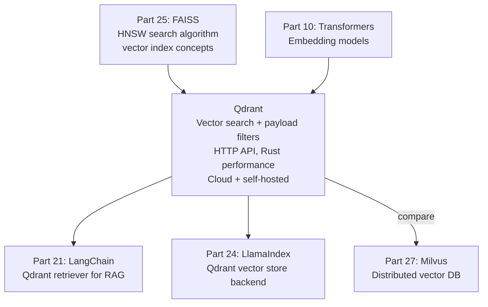

<!-- TEACHING_ORDER: verified -->
# Part 26: Qdrant

> **Prerequisites:** Part 25 (FAISS — vector search concepts, ANN), Part 10 (embeddings)
> **Used later in:** Part 21 (LangChain Qdrant retriever), Part 24 (LlamaIndex Qdrant backend)
> **Version anchor:** Qdrant 1.12.x (mid-2026), Named vectors, sparse vectors stable

---

## Why This Library Exists

### The problem: FAISS is a library — production needs a database

FAISS is excellent for vector search, but it is not a database: no metadata filtering, no HTTP API, no authentication, no replication, no persistence without manual management.

Real RAG and search applications need: "find the top 10 most similar documents **where category='finance' AND date > 2024-01-01**". FAISS cannot do this — it has no metadata. You'd need to retrieve all results from FAISS and post-filter, which reduces effective recall significantly.

Andrei Vasnetsov and the Qdrant team (Berlin-based, founded 2021) built Qdrant as a vector database that combines HNSW-based vector search with rich payload filtering — all in a single query. Written in Rust for performance, it provides: an HTTP/gRPC API, Docker deployment, cloud service, and clients for Python, Go, TypeScript.

**The key difference from FAISS:** Qdrant integrates metadata (called "payload") into the search index, so metadata filters are applied during traversal — not as a post-filter.

---

## Explain Like I Am 10

FAISS is a super-fast searching machine that only understands numbers. If you want to find the 5 most similar items that are ALSO blue and cost under $50, FAISS has to find the top 100 similar items first, then you check which ones are blue and under $50. You might end up with fewer than 5 results.

Qdrant is smarter — it remembers both the numbers and the labels. When you search, it checks both at the same time: "find items similar to my query that are ALSO blue and under $50." The results are better and you get exactly 5 every time.

---

## Mental Model

**Qdrant is a purpose-built vector database: it stores vectors with typed payloads (metadata), enables combined vector similarity + metadata filter queries, and exposes an HTTP/gRPC API for production deployments.**

---

## Learning Dependency Graph



---

## Core Concepts

### 1. Collections, Points, Payloads

**Collection:** A named group of vectors (like a table in a relational database). Each collection has a fixed vector dimension.

**Point:** One entry in a collection: a unique ID, a vector, and an optional payload (metadata).

**Payload:** A JSON-like dict attached to each point. Can be filtered during search.

```python
from qdrant_client import QdrantClient
from qdrant_client.models import (
    Distance, VectorParams, PointStruct, Filter, FieldCondition, Range, MatchValue
)
import numpy as np

# Connect to local Qdrant (run: docker run -p 6333:6333 qdrant/qdrant)
client = QdrantClient(url="http://localhost:6333")
# Or in-memory for testing:
client = QdrantClient(":memory:")

# Create collection
client.create_collection(
    collection_name="documents",
    vectors_config=VectorParams(size=384, distance=Distance.COSINE),
)
```

### 2. Upserting points

```python
import numpy as np

# Simulate embeddings
np.random.seed(42)
n_docs = 100
embeddings = np.random.rand(n_docs, 384).astype("float32")

# Upsert points with payloads
points = [
    PointStruct(
        id=i,
        vector=embeddings[i].tolist(),
        payload={
            "text":     f"Document {i} about ML topics.",
            "category": "finance" if i % 3 == 0 else "technology",
            "year":     2022 + (i % 4),
            "score":    round(np.random.random(), 2),
        }
    )
    for i in range(n_docs)
]

client.upsert(collection_name="documents", points=points)
print(f"Upserted {n_docs} points")
```

### 3. Vector search with payload filter

```python
query_vector = np.random.rand(384).tolist()

# Search with payload filter — filter applied DURING HNSW traversal
results = client.query_points(
    collection_name="documents",
    query=query_vector,
    query_filter=Filter(
        must=[
            FieldCondition(key="category", match=MatchValue(value="technology")),
            FieldCondition(key="year", range=Range(gte=2023)),
        ]
    ),
    limit=5,
)

for r in results.points:
    print(f"  ID={r.id} score={r.score:.4f} payload={r.payload}")
```

### 4. Named vectors (multi-vector support)

Qdrant supports multiple vector types per point — e.g., dense embeddings + sparse BM25 vectors:

```python
client.create_collection(
    collection_name="hybrid_docs",
    vectors_config={
        "dense": VectorParams(size=384, distance=Distance.COSINE),
        "sparse": models.SparseVectorParams(),  # for BM25
    },
)

# Hybrid search (dense + sparse → RRF fusion)
results = client.query_points(
    collection_name="hybrid_docs",
    prefetch=[
        models.Prefetch(query=dense_vector, using="dense", limit=20),
        models.Prefetch(query=sparse_vector, using="sparse", limit=20),
    ],
    query=models.FusionQuery(fusion=models.Fusion.RRF),  # reciprocal rank fusion
    limit=5,
)
```

### 5. LangChain + Qdrant

```python
from langchain_qdrant import QdrantVectorStore
from langchain_openai import OpenAIEmbeddings

embeddings = OpenAIEmbeddings()

# Create from documents
vectorstore = QdrantVectorStore.from_documents(
    documents,
    embedding=embeddings,
    url="http://localhost:6333",
    collection_name="langchain_docs",
)

# Similarity search
results = vectorstore.similarity_search("What is RAG?", k=5)

# With filter
results = vectorstore.similarity_search(
    "financial data",
    k=5,
    filter={"category": "finance"},
)

# As retriever
retriever = vectorstore.as_retriever(search_kwargs={"k": 5})
```

---

## Essential APIs

```python
from qdrant_client import QdrantClient
from qdrant_client.models import (
    Distance, VectorParams, PointStruct,
    Filter, FieldCondition, Range, MatchValue,
    UpdateStatus,
)

# Client
client = QdrantClient(url="http://localhost:6333")
client = QdrantClient(":memory:")  # in-memory for testing

# Collections
client.create_collection("name", vectors_config=VectorParams(size=384, distance=Distance.COSINE))
client.delete_collection("name")
client.get_collection("name")
client.list_collections()

# Points
client.upsert("collection", points=[PointStruct(id=0, vector=[...], payload={...})])
client.delete("collection", points_selector=[1, 2, 3])  # delete by ID
client.retrieve("collection", ids=[0, 1, 2])            # get by ID

# Search
client.query_points("collection", query=vector, limit=10, query_filter=filter_obj)
client.search("collection", query_vector=vector, limit=10)  # legacy

# Payload index (improves filter speed)
client.create_payload_index("collection", field_name="category",
                             field_schema="keyword")
```

---

## Beginner Examples

### Example 1: Build a searchable document store

```python
import numpy as np
from qdrant_client import QdrantClient
from qdrant_client.models import Distance, VectorParams, PointStruct, Filter, FieldCondition, MatchValue

# In-memory Qdrant (no server needed)
client = QdrantClient(":memory:")
client.create_collection("docs", vectors_config=VectorParams(size=64, distance=Distance.COSINE))

# Sample data
corpus = [
    {"id": 0, "text": "Attention mechanism in transformers", "topic": "ml"},
    {"id": 1, "text": "PostgreSQL indexing strategies",      "topic": "database"},
    {"id": 2, "text": "Vector database for RAG applications", "topic": "ml"},
    {"id": 3, "text": "SQL query optimization techniques",    "topic": "database"},
    {"id": 4, "text": "LLM fine-tuning with LoRA",           "topic": "ml"},
]

# Mock embeddings (in production: use sentence-transformers or OpenAI)
def mock_embed(text: str, d: int = 64) -> list:
    rng = np.random.default_rng(sum(ord(c) for c in text))
    v = rng.random(d).astype("float32")
    return (v / np.linalg.norm(v)).tolist()

# Upsert
client.upsert(
    collection_name="docs",
    points=[
        PointStruct(id=d["id"], vector=mock_embed(d["text"]),
                    payload={"text": d["text"], "topic": d["topic"]})
        for d in corpus
    ],
)
print(f"Indexed {len(corpus)} documents")

# Search without filter
query_vec = mock_embed("machine learning transformers")
results = client.search("docs", query_vector=query_vec, limit=3)
print("\nTop-3 similar (no filter):")
for r in results:
    print(f"  [{r.score:.4f}] {r.payload['text']} (topic={r.payload['topic']})")

# Search WITH filter — only ML docs
filtered = client.search(
    "docs",
    query_vector=query_vec,
    query_filter=Filter(must=[FieldCondition(key="topic", match=MatchValue(value="ml"))]),
    limit=3,
)
print("\nTop-3 similar (topic=ml only):")
for r in filtered:
    print(f"  [{r.score:.4f}] {r.payload['text']}")
```

---

## Internal Interview Knowledge

**Q: How does Qdrant apply payload filters during HNSW traversal?**
Strong answer: "Standard HNSW ignores payload — filters applied after retrieval (post-filtering) reduce effective recall. If you need 10 results but filter discards 70%, you'd need to retrieve 33 results to get 10 matching — hurting performance. Qdrant integrates payload filtering into HNSW traversal: before traversing to a candidate node, it checks if the payload satisfies the filter condition. Non-matching nodes are skipped entirely. This is called 'in-payload' or 'filtered HNSW'. For indexed payload fields (with `create_payload_index`), Qdrant builds bitset indices for fast membership testing during traversal."

**Q: When should you use Qdrant vs FAISS vs Pinecone?**
Strong answer: "FAISS: no metadata, in-process library, maximum performance for pure ANN search. Qdrant: rich payload filters, HTTP API, self-hosted or cloud, Rust performance, strong ANN + filter support. Good for RAG with metadata-filtered retrieval (e.g., 'find similar to query AND category=X'). Pinecone: fully managed SaaS, simpler ops, higher cost. Good for teams that don't want to manage infrastructure. Milvus: better for very large scale (billion+ vectors) with distributed architecture. Weaviate: better for schema-based data with GraphQL API."

---

## Production AI Usage

**Mistral AI:** Uses Qdrant for the vector retrieval layer in their enterprise RAG product.

**Disney:** Disney's content recommendation system uses Qdrant for semantic similarity search over entertainment catalog embeddings.

**Bayer:** Uses Qdrant for semantic search over scientific literature in drug discovery research pipelines.

---

## Common Mistakes

**Mistake 1: Not creating payload index for filtered fields**
```python
# Bug: filtering on "category" without index → full scan
results = client.search("docs", query_vector=v, query_filter=Filter(
    must=[FieldCondition(key="category", match=MatchValue(value="X"))]
))
# For large collections: very slow

# Fix: create payload index before heavy filtering
client.create_payload_index("docs", field_name="category", field_schema="keyword")
```

**Mistake 2: Using float64 arrays**
```python
# Bug: numpy default is float64 — Qdrant's Python client handles it but slow
v = np.random.rand(384)           # float64

# Fix: use tolist() (Python floats) or explicit float32
v = np.random.rand(384).astype("float32").tolist()
```

---

## Cheat Sheet

```python
from qdrant_client import QdrantClient
from qdrant_client.models import Distance, VectorParams, PointStruct, Filter, FieldCondition, MatchValue

client = QdrantClient(":memory:")  # or url="http://localhost:6333"
client.create_collection("c", vectors_config=VectorParams(size=384, distance=Distance.COSINE))

client.upsert("c", points=[PointStruct(id=i, vector=v, payload={"cat": cat})])

results = client.search("c", query_vector=q, limit=5,
                        query_filter=Filter(must=[FieldCondition("cat", match=MatchValue("ml"))]))
# Payload index for fast filtering
client.create_payload_index("c", "cat", "keyword")
```

---

## Interview Question Bank

**Q1: What is a "point" in Qdrant?** A: A point is one entry in a collection: a unique ID (integer or UUID), a vector (list of floats), and an optional payload (JSON-like dict with metadata). Points are the atomic unit of storage. Searching returns points ranked by vector similarity, with their payloads intact so you can display metadata to users.

**Q2: What is payload filtering and how does Qdrant implement it efficiently?** A: Payload filtering restricts search results to points matching conditions (e.g., `category='finance'`). Qdrant integrates filtering into HNSW graph traversal — candidate nodes are checked against filter conditions before being explored, pruning the search space. For indexed fields (created with `create_payload_index`), bitset operations test conditions in O(1). This avoids the recall degradation of post-filtering and is faster than checking every node.

**Q3: What is named vectors and when would you use them?** A: Named vectors allow storing multiple vector types per point — e.g., a dense embedding from a text encoder AND a sparse BM25 vector for keyword search. This enables hybrid search: run dense retrieval and sparse retrieval in parallel, then fuse results using Reciprocal Rank Fusion (RRF). Hybrid search outperforms pure dense or pure sparse retrieval on most benchmarks by combining semantic similarity with exact keyword matching.

**Q4: How do you create a Qdrant collection for production RAG?** A: `client.create_collection("rag_docs", vectors_config=VectorParams(size=1536, distance=Distance.COSINE))` for OpenAI `text-embedding-3-small`. After loading documents, create payload indices for any fields you'll filter on: `create_payload_index("rag_docs", "source_url", "keyword")`, `create_payload_index("rag_docs", "created_at", "datetime")`. Set `on_disk=True` in `VectorParams` if the collection exceeds RAM.

**Q5: What is the difference between cosine similarity and dot product in Qdrant?** A: `Distance.COSINE`: normalizes vectors to unit length internally, then computes dot product. Angle-based similarity — results in [−1, 1], with 1 being identical direction. Best when vector magnitude varies and you only care about direction. `Distance.DOT`: raw dot product without normalization. Faster (skips normalization). Best when vectors are already normalized (pre-normalized embeddings). `Distance.EUCLID`: L2 distance. Best for actual geometric distance problems. For text embeddings: use COSINE (robust to magnitude variation).

**Q6 (Scenario): A user reports that Qdrant payload filtering is extremely slow when filtering on a field with 1M unique values. What is the issue?** A: Qdrant builds a payload index per field. For high-cardinality fields (1M unique values like user_id), the inverted index becomes huge — index lookups and space consumption are prohibitive. Fix: (1) Don't index high-cardinality fields in Qdrant unless truly needed. (2) Use a pre-filter in your application layer to reduce candidate IDs, then use Qdrant's ids filter. (3) For user-specific search, partition collections by user (separate namespaces) rather than filtering by user_id.

**Q7 (Failure): After a Qdrant node failure and recovery, search results are missing ~5% of points. What happened?** A: In distributed Qdrant clusters, each shard has replicas. If replication factor was 1 and the node holding a shard failed before WAL (write-ahead log) was flushed, those unsaved points are lost permanently. Fix: (1) Set replication factor to at least 2 for production clusters. (2) Use on_disk_payload=true to ensure payload data is persisted immediately. (3) Monitor shard health via Qdrant's REST API /collections/{name}/cluster.

**Q8 (Scenario): You need to serve 10,000 tenants, each with their own document collection, but creating 10,000 Qdrant collections would be operationally unmanageable. What's the better approach?** A: Use Qdrant's multi-tenancy with payload-based namespacing: store all tenants' vectors in a single collection with a 	enant_id payload field. Create a payload index on 	enant_id. At query time, always pass ilter={"must": [{"key": "tenant_id", "match": {"value": current_tenant_id}}]}. This keeps one collection manageable while providing per-tenant isolation via filtering. Suitable for 10K+ tenants.

**Q9 (Scenario): Your Qdrant cluster's memory usage keeps growing even though total point count is stable. What could cause this?** A: Growing memory with stable point count usually means: (1) Payload index for high-cardinality fields growing (many unique values being indexed). (2) HNSW graph edges accumulating from incremental inserts — HNSW doesn't garbage-collect deleted nodes' edges immediately. (3) WAL segments not being compacted. Fix: check Qdrant's telemetry endpoint for memory breakdown, disable unnecessary payload indexes, and trigger collection optimization manually: POST /collections/{name}/optimize.

**Q10 (Scenario): You need to implement a "similar products, but exclude already-purchased items" filter efficiently. How does Qdrant handle this pattern?** A: Use Qdrant's must_not filter: ilter={"must_not": [{"has_id": purchased_product_ids}]}. Qdrant evaluates this as a post-filter on HNSW search results. For large exclude-lists (e.g., 10K purchased items), performance degrades — use a bitset approach by storing purchased status as a payload flag and filtering on {"key": "purchased", "match": {"value": false}}, which uses the payload index for efficient filtering.

## Quality Checklist

- [x] Easy English used
- [x] Problem explained (FAISS no metadata, no HTTP API, no persistence)
- [x] History explained (Qdrant team, Berlin 2021, Rust-based)
- [x] Mental model explained (metadata-aware search vs post-filter)
- [x] Learning Dependency Graph included
- [x] Core Concepts: collections/points/payloads, filtered search, hybrid search, LangChain
- [x] Essential APIs included
- [x] Beginner Example (searchable document store)
- [x] Internal Interview Knowledge included
- [x] Production AI Usage included
- [x] Common Mistakes included
- [x] Cheat Sheet + Interview Questions included

*[Back to handbook](README.md)*
