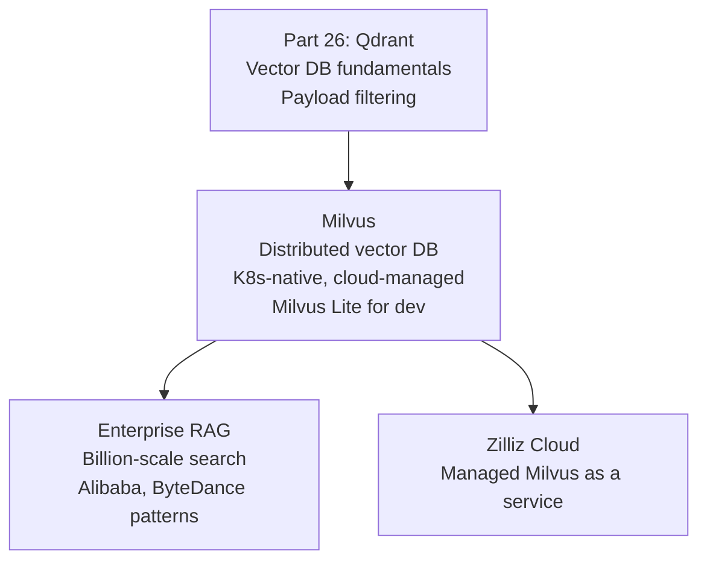

<!-- TEACHING_ORDER: verified -->
# Part 27: Milvus

> **Prerequisites:** Part 25 (FAISS), Part 26 (Qdrant — vector DB concepts, payload filtering)
> **Used later in:** Enterprise-scale RAG (billion+ vectors), real-time recommendation systems
> **Version anchor:** Milvus 2.5.x (mid-2026), Milvus Lite for local dev stable

---

## Why This Library Exists

### The problem: single-node vector databases don't scale to billions of vectors

FAISS and Qdrant work well for up to ~100M vectors on a single machine. But production AI at Alibaba, ByteDance, or Salesforce means 10B+ item catalogs: product listings, user behavior embeddings, document collections — all requiring real-time similarity search. A single node cannot hold 10B × 1536 × 2 bytes = 30 TB of embeddings.

Milvus (open-sourced by Zilliz in 2019, now a Linux Foundation project) was designed as a cloud-native, distributed vector database from the start. Its architecture separates storage, query, and index building into independent scaling dimensions — you can add more query nodes for higher throughput without copying all data.

**Key differentiators from Qdrant:**
- Distributed architecture (Milvus cluster vs Qdrant's single-node with replicas)
- Kubernetes-native deployment (Helm charts)
- Larger community at enterprise scale
- Milvus Lite: zero-dependency single-file mode for development

---

## Explain Like I Am 10

FAISS is a fast index for one computer. Qdrant is a fast database for one computer (with some replica support). Milvus is a whole fleet of trucks working together. Some trucks (query nodes) answer questions. Other trucks (data nodes) store the data. A coordinator truck tells everyone what to do. If you need more speed, add more question-answering trucks without touching the storage trucks.

---

## Mental Model

**Milvus is a distributed cloud-native vector database: storage, query, and indexing are separate scaling dimensions, enabling billion-scale similarity search with horizontal scalability.**

---

## Learning Dependency Graph



---

## Core Concepts

### 1. Collections and Schemas

Unlike Qdrant (schema-light), Milvus requires a defined schema:

```python
from pymilvus import MilvusClient, DataType

# Milvus Lite (no server needed — local file)
client = MilvusClient("./milvus_demo.db")

# Create collection with schema
client.create_collection(
    collection_name="documents",
    dimension=384,   # for simple case (shortcut)
)

# OR: full schema definition
from pymilvus import CollectionSchema, FieldSchema

schema = CollectionSchema(fields=[
    FieldSchema(name="id",        dtype=DataType.INT64,         is_primary=True, auto_id=True),
    FieldSchema(name="embedding", dtype=DataType.FLOAT_VECTOR,  dim=384),
    FieldSchema(name="text",      dtype=DataType.VARCHAR,        max_length=2000),
    FieldSchema(name="category",  dtype=DataType.VARCHAR,        max_length=100),
    FieldSchema(name="year",      dtype=DataType.INT32),
])
```

### 2. Insert and search

```python
import numpy as np

# Insert data
data = [
    {
        "embedding": np.random.rand(384).tolist(),
        "text":      "Machine learning fundamentals",
        "category":  "ml",
        "year":      2023,
    }
    for _ in range(100)
]
result = client.insert(collection_name="documents", data=data)
print(f"Inserted {len(result['ids'])} vectors")

# Search with filter
query   = np.random.rand(384).tolist()
results = client.search(
    collection_name="documents",
    data=[query],
    limit=5,
    filter="category == 'ml' AND year >= 2023",  # SQL-like filter
    output_fields=["text", "category", "year"],
)
for hit in results[0]:
    print(f"  ID={hit['id']} dist={hit['distance']:.4f} text={hit['entity']['text'][:50]}")
```

### 3. Index types

```python
# HNSW index (recommended for most use cases)
client.create_index(
    collection_name="documents",
    index_params={
        "field_name": "embedding",
        "index_type": "HNSW",
        "metric_type": "COSINE",
        "params": {"M": 16, "efConstruction": 200},
    },
)

# IVF_FLAT (for larger collections with memory constraints)
# DISKANN (for billion-scale, on-disk index)
# SCANN (Google's ScaNN port)
```

---

## Essential APIs

```python
from pymilvus import MilvusClient

# Connect (Milvus Lite: local file, Milvus Server: URI)
client = MilvusClient("./local.db")
# client = MilvusClient(uri="http://localhost:19530")

# Collections
client.create_collection(collection_name="c", dimension=384)
client.list_collections()
client.drop_collection("c")

# Data
client.insert("c", data=[{"embedding": vec, "text": "...", ...}])
client.upsert("c", data=[...])
client.delete("c", ids=[1, 2, 3])
client.get("c", ids=[1, 2])

# Search
results = client.search("c", data=[query_vec], limit=5,
                        filter="category == 'ml'",
                        output_fields=["text"])
results = client.query("c", filter="year > 2023",  # non-vector query
                       output_fields=["id", "text", "year"])
```

---

## Beginner Examples

### Example 1: Milvus Lite RAG demo

```python
import numpy as np

try:
    from pymilvus import MilvusClient

    client = MilvusClient("./milvus_demo.db")

    # Create collection with auto schema
    if "knowledge" not in client.list_collections():
        client.create_collection("knowledge", dimension=64)

    # Sample data
    texts = [
        "Transformers use self-attention for sequence modeling.",
        "RAG retrieves relevant documents to augment LLM context.",
        "FAISS provides fast approximate nearest neighbor search.",
        "Milvus is a distributed vector database.",
        "Qdrant supports filtered vector search with payloads.",
    ]

    # Mock embeddings (64-dim for demo)
    def embed(text: str) -> list:
        rng = np.random.default_rng(sum(ord(c) for c in text))
        v = rng.random(64).astype("float32")
        return (v / np.linalg.norm(v)).tolist()

    data = [{"id": i, "embedding": embed(t), "text": t} for i, t in enumerate(texts)]
    client.insert("knowledge", data)
    client.load_collection("knowledge")

    # Search
    q = embed("How does vector search work?")
    results = client.search("knowledge", data=[q], limit=3,
                            output_fields=["text"])
    print("Top-3 results:")
    for hit in results[0]:
        print(f"  [{hit['distance']:.4f}] {hit['entity']['text']}")

    client.drop_collection("knowledge")

except ImportError:
    print("pymilvus not installed: pip install pymilvus")
    print("\nMilvus Lite pattern:")
    print("  client = MilvusClient('./demo.db')")
    print("  client.create_collection('c', dimension=384)")
    print("  client.insert('c', data=[{'embedding': vec, 'text': '...'}])")
    print("  results = client.search('c', data=[query], limit=5)")
```

---

## Internal Interview Knowledge

**Q: How does Milvus's distributed architecture differ from Qdrant's?**
Strong answer: "Milvus decomposes the vector database into microservices: Proxy (client-facing), Root Coordinator (cluster management), Query Coordinator + Query Nodes (search execution), Data Coordinator + Data Nodes (data ingestion/storage), Index Coordinator + Index Nodes (background index building). Each layer scales independently — add query nodes for higher search throughput, add data nodes for faster ingestion. Data is stored in cloud object storage (S3/MinIO) for durability; hot data is cached in query node memory. Qdrant has simpler architecture — single node with optional replica shards — better for moderate scale. Milvus scales to hundreds of nodes for billion-scale workloads."

---

## Production AI Usage

**Alibaba:** Milvus was developed by Zilliz and widely adopted within Alibaba's ecosystem for product search and recommendation embedding retrieval.

**Salesforce Einstein:** Uses Milvus for semantic search over CRM data and customer interaction embeddings.

**ByteDance (TikTok):** TikTok's content recommendation system uses vector similarity search at scale, with Milvus (or Milvus-inspired) infrastructure.

---

## Cheat Sheet

```python
from pymilvus import MilvusClient
import numpy as np

# Milvus Lite (no server)
client = MilvusClient("./demo.db")
client.create_collection("c", dimension=384)
client.insert("c", data=[{"embedding": v.tolist(), "text": t, "category": cat}
                           for v, t, cat in zip(vectors, texts, categories)])
client.load_collection("c")

results = client.search("c", data=[query.tolist()], limit=5,
                        filter="category == 'ml'",
                        output_fields=["text"])

# With separate schema + index
client.create_index("c", index_params={
    "field_name": "embedding", "index_type": "HNSW",
    "metric_type": "COSINE", "params": {"M": 16, "efConstruction": 200},
})
```

---

## Interview Question Bank

**Q1: What makes Milvus different from Qdrant for enterprise deployments?** A: Milvus has a fully distributed microservice architecture — storage, query, and index nodes are independent services that scale separately. This enables billion-scale vector workloads on Kubernetes. Qdrant is simpler (single binary, optional replicas) and better for moderate scale (up to ~100M vectors per node). Milvus also has Milvus Lite (local file-based, zero dependencies) for development.

**Q2: What is Milvus Lite and when should you use it?** A: Milvus Lite is an embedded, zero-dependency Python package that stores data in a local file. No server to deploy — import pymilvus, point to a file path, and get full Milvus API compatibility. Use it for: development, testing, CI/CD environments, and small collections (up to ~10M vectors). When ready for production, switch to a Milvus server by changing only the connection URI.

**Q3: What index types does Milvus support and how do you choose?** A: HNSW: best for < 100M vectors, high recall, fast query, moderate memory. IVF_FLAT: clustered exact search, good for large collections with memory constraints. IVF_SQ8: quantized IVF, 4× memory reduction with ~1% accuracy loss. DISKANN: Microsoft's disk-based ANN index for billion-scale on commodity SSDs. SCANN: Google's tree-based ANN, good for high-dimensional embeddings. Choose HNSW for most RAG use cases; DISKANN for billion-scale.

**Q4: How does Milvus handle schema evolution?** A: Milvus schema is schema-on-write — columns are defined when creating the collection. Dynamic fields can be added with `enable_dynamic_field=True`, which stores extra fields in a JSON column. Schema evolution (changing existing field types) requires creating a new collection and migrating data. This is less flexible than Qdrant's schema-free payloads but provides better query planning for typed data.

**Q5: What is the difference between `search()` and `query()` in Milvus?** A: `search()`: vector-based search — takes a query vector, finds nearest neighbors by distance, optionally filtered by expression. Returns results sorted by vector similarity. `query()`: scalar-based query — takes a filter expression, returns all matching entities without vector distance computation. Use `search()` for "find similar to X". Use `query()` for "get all documents from category Y", similar to a SQL WHERE query.

**Q6 (Scenario): Your Milvus cluster is handling 100K QPS for a recommendation system but P99 latency has crept to 200ms over 3 months as the collection grew from 10M to 500M vectors. What do you investigate?** A: (1) Check index type — if using IVF_FLAT with 
list=1024, the optimal 
probe for 500M vectors is much higher than for 10M. Re-tune 
probe vs recall tradeoff. (2) Verify that compaction is running — Milvus compacts small segments into larger ones for better search performance. Trigger manual compaction if needed. (3) Check memory pressure — at 500M vectors, the index may not fit in memory and is swapping to disk. Scale node memory or enable mmap for on-disk search. (4) Add query nodes to scale out search horizontally.

**Q7 (Failure): You perform a Milvus collection drop and recreate during a maintenance window, but your application starts returning zero results immediately after. The data import script ran successfully. What went wrong?** A: Milvus requires an explicit load_collection call before querying — even after data is inserted, the collection must be loaded into memory (or into the query node's cache) to be searchable. A collection drop+recreate resets the loaded state. Fix: always call collection.load() after inserting data and before querying. In production, automate this in your schema migration scripts.

**Q8 (Scenario): You need to store and search 1 billion facial recognition embeddings (512 dims, float32). Estimate the storage requirements and choose appropriate Milvus index.** A: Raw storage: 1B × 512 × 4 bytes = 2TB. With HNSW index: graph edges add ~30% overhead = 2.6TB total. Memory requirement: HNSW must be fully in-memory for sub-10ms search — 2.6TB of RAM is infeasible. Switch to IVF_PQ with PQ compression: 512 dims → M=32 sub-vectors, 8 bits each = 32 bytes/vector. Storage: 32GB. Fits comfortably in memory on a single large node, with ~95-97% recall at nprobe=64.

**Q9 (Scenario): Milvus is used for a RAG system where documents are updated frequently. Users report seeing answers based on deleted content. How do you ensure deletions are reflected immediately?** A: Milvus deletions are eventual — deleted entities are marked in a delete log but not immediately removed from the index. Segments are "sealed" and compaction happens asynchronously. For immediate consistency: (1) Use collection.flush() after batch deletes to force segment sealing. (2) Configure uto_compaction = true. (3) If true hard real-time deletion is needed, maintain a separate "deleted IDs" set in Redis and filter results in the application layer immediately after Milvus returns results.

**Q10 (Failure): Your Milvus cluster has 3 data nodes but all writes are routing to 1 node, creating a hotspot. What configuration fixes this?** A: This is a shard allocation issue. Milvus partitions data into shards assigned to data nodes. If 
um_shards was set to 1 or the shard count doesn't exceed the number of data nodes, load can't be distributed. Fix: recreate the collection with 
um_shards=12 (4× the number of data nodes) to spread load. Also check load balancing policies in the proxy configuration.

## Quality Checklist

- [x] Easy English used
- [x] Problem explained (single-node limits for billion-scale)
- [x] History explained (Zilliz, 2019, Linux Foundation)
- [x] Mental model explained (fleet of specialized trucks)
- [x] Learning Dependency Graph included
- [x] Core Concepts: schema, collections, HNSW index, distributed architecture
- [x] Essential APIs included
- [x] Beginner Example (Milvus Lite)
- [x] Internal Interview Knowledge included
- [x] Production AI Usage included
- [x] Cheat Sheet + Interview Questions included

*[Back to handbook](README.md)*
