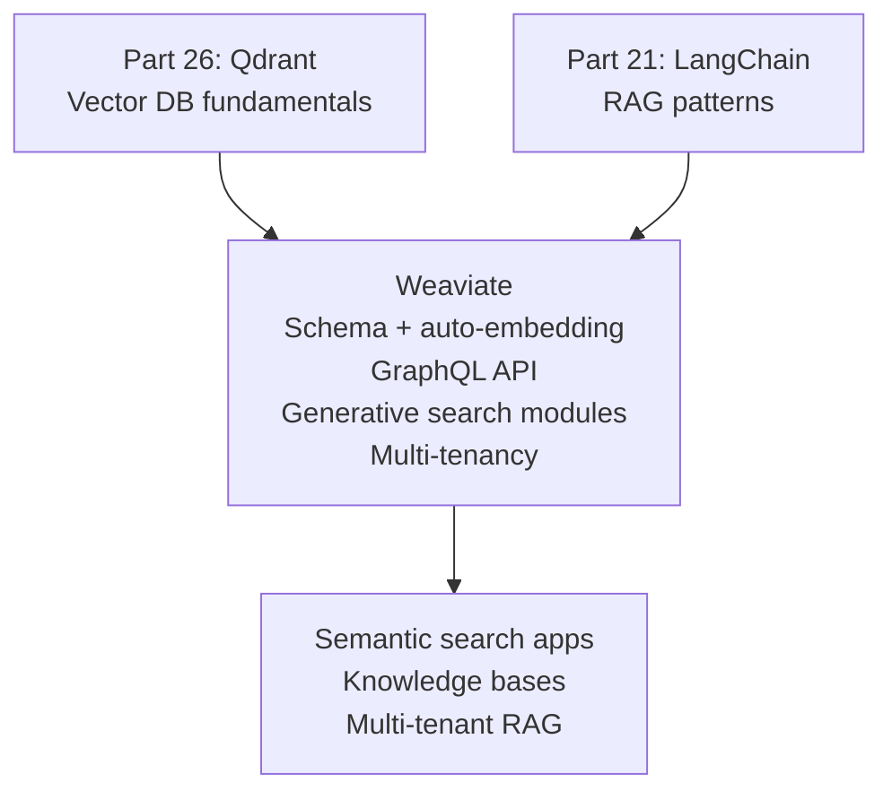

<!-- TEACHING_ORDER: verified -->
# Part 28: Weaviate

> **Prerequisites:** Part 26 (Qdrant — vector DB concepts), Part 21 (LangChain RAG patterns)
> **Used later in:** GraphQL-driven semantic search, multi-tenant RAG
> **Version anchor:** Weaviate 1.28.x (mid-2026), Generative search modules stable

---

## Why This Library Exists

### The problem: vector search needs to be accessible to non-ML engineers

FAISS, Qdrant, and Milvus are powerful but require ML expertise to use well — understanding embedding models, vector dimensions, and ANN parameters. Weaviate was designed with a different audience: backend engineers and knowledge graph enthusiasts who want semantic search without managing embeddings manually.

Founded by Bob van Luijt and the team in Amsterdam (2019), Weaviate takes a schema-first approach: you define classes with typed properties (like a database schema), configure which embedding model to use per class, and Weaviate automatically generates embeddings when you insert data. No separate embedding step needed.

Weaviate also pioneered "generative search" modules: combine a retriever (vector search) with an LLM generator in one query. Before RAG frameworks existed, Weaviate had a `generative-openai` module that retrieved relevant objects and streamed an LLM response in one call.

---

## Explain Like I Am 10

Qdrant is like a librarian who expects you to bring pre-made indexes. Weaviate is like a smart library where you describe what kind of books you have (the schema), and the library automatically creates the index for you when you add new books. You can also ask the library "summarize the 5 books most relevant to my question" and it looks them up AND writes a summary automatically.

---

## Mental Model

**Weaviate is a vector database with automatic embedding generation (via module system), a GraphQL query API, and built-in generative search — designed for semantic search without separate embedding pipeline management.**

---

## Learning Dependency Graph



---

## Core Concepts

### 1. Schema and auto-embedding

```python
import weaviate
import weaviate.classes as wvc

# Connect to Weaviate
client = weaviate.connect_to_local()   # local Docker
# client = weaviate.connect_to_weaviate_cloud("your-endpoint", "your-api-key")

# Create collection with embedding model
client.collections.create(
    name="Document",
    vectorizer_config=wvc.config.Configure.Vectorizer.text2vec_openai(
        model="text-embedding-3-small",   # Weaviate calls OpenAI internally
    ),
    generative_config=wvc.config.Configure.Generative.openai(
        model="gpt-4o-mini",  # for generative search
    ),
    properties=[
        wvc.config.Property(name="content",  data_type=wvc.config.DataType.TEXT),
        wvc.config.Property(name="category", data_type=wvc.config.DataType.TEXT),
        wvc.config.Property(name="year",     data_type=wvc.config.DataType.INT),
    ],
)
```

### 2. Insert data (no pre-computed embeddings needed)

```python
collection = client.collections.get("Document")

# Weaviate calls the vectorizer on insert automatically
with collection.batch.dynamic() as batch:
    for text, cat, year in zip(texts, categories, years):
        batch.add_object(properties={
            "content":  text,
            "category": cat,
            "year":     year,
        })
```

### 3. Semantic search with filters

```python
# Vector search with where filter
results = collection.query.near_text(
    query="machine learning transformers",
    limit=5,
    filters=wvc.query.Filter.by_property("category").equal("ml"),
    return_properties=["content", "category", "year"],
)
for obj in results.objects:
    print(f"  [{obj.metadata.distance:.4f}] {obj.properties['content'][:80]}")
```

### 4. Generative search (RAG in one call)

```python
# Single query: retrieve + generate (RAG)
results = collection.generate.near_text(
    query="explain attention mechanisms",
    limit=3,
    grouped_task="Summarize how attention works based on these documents.",
    return_properties=["content"],
)
print("Generated summary:")
print(results.generated)   # LLM-generated response using retrieved docs
```

### 5. Multi-tenancy

Weaviate has built-in multi-tenancy — each tenant's data is isolated:

```python
# Enable multi-tenancy on collection
client.collections.create(
    name="TenantDocs",
    multi_tenancy_config=wvc.config.Configure.multi_tenancy(enabled=True),
    ...
)
collection = client.collections.get("TenantDocs")

# Manage tenants
collection.tenants.create(["tenant_alice", "tenant_bob"])

# Insert for specific tenant
with collection.with_tenant("tenant_alice").batch.dynamic() as batch:
    batch.add_object(properties={"content": "Alice's document"})

# Search within tenant
results = collection.with_tenant("tenant_alice").query.near_text("query", limit=5)
```

---

## Essential APIs

```python
import weaviate
import weaviate.classes as wvc

# Connect
client = weaviate.connect_to_local()
client = weaviate.connect_to_weaviate_cloud(url, api_key)

# Collections
client.collections.create("Name", vectorizer_config=..., properties=[...])
collection = client.collections.get("Name")
client.collections.delete("Name")

# Data
collection.data.insert(properties={...})          # single insert
with collection.batch.dynamic() as batch:         # batch insert
    batch.add_object(properties={...})

# Search
collection.query.near_text(query, limit, filters, return_properties)
collection.query.near_vector(vector, limit, filters)
collection.query.bm25(query, limit)               # keyword search
collection.query.hybrid(query, vector, limit)     # hybrid

# Generative
collection.generate.near_text(query, single_prompt, grouped_task, limit)

# Multi-tenancy
collection.tenants.create([...])
collection.with_tenant("name").query.near_text(...)

client.close()  # always close connection
```

---

## Beginner Examples

### Example 1: Semantic search with mock embeddings

```python
import numpy as np

try:
    import weaviate
    import weaviate.classes as wvc

    # Embedded Weaviate (no Docker for quick test)
    client = weaviate.connect_to_embedded()

    docs = [
        {"text": "Transformers use attention mechanisms.", "topic": "ml"},
        {"text": "RAG combines retrieval with generation.", "topic": "ml"},
        {"text": "SQL databases use B-tree indexes.",       "topic": "database"},
        {"text": "Weaviate supports hybrid search.",        "topic": "database"},
    ]

    client.collections.create(
        name="Demo",
        properties=[
            wvc.config.Property("text", wvc.config.DataType.TEXT),
            wvc.config.Property("topic", wvc.config.DataType.TEXT),
        ],
        # NOTE: without vectorizer_config, must provide vectors manually
        vectorizer_config=wvc.config.Configure.Vectorizer.none(),
    )
    coll = client.collections.get("Demo")

    def mock_embed(text: str, d: int = 64) -> list:
        rng = np.random.default_rng(sum(ord(c) for c in text))
        v = rng.random(d).astype("float32")
        return (v / np.linalg.norm(v)).tolist()

    for d in docs:
        coll.data.insert(properties=d, vector=mock_embed(d["text"]))

    q_vec = mock_embed("How does semantic search work?")
    results = coll.query.near_vector(q_vec, limit=3, return_properties=["text", "topic"])
    print("Semantic search results:")
    for obj in results.objects:
        print(f"  [{obj.metadata.distance:.4f}] {obj.properties['text']}")

    client.collections.delete("Demo")
    client.close()

except ImportError:
    print("weaviate-client not installed: pip install weaviate-client")
except Exception as e:
    print(f"Weaviate not available: {e}")
    print("\nWeaviate pattern:")
    print("  client = weaviate.connect_to_local()")
    print("  coll.query.near_text('query', limit=5)")
    print("  coll.generate.near_text('query', grouped_task='Summarize...')")
```

---

## Internal Interview Knowledge

**Q: What is Weaviate's module system and what does the text2vec-openai module do?**
Strong answer: "Weaviate modules extend the core with pluggable vectorizer, reader, and generator capabilities. The `text2vec-openai` module intercepts data insertion and search queries: when you insert a document, the module calls the OpenAI embedding API and stores the resulting vector alongside your data — you never compute embeddings manually. When you search with `near_text('query')`, the module embeds your query via OpenAI before running the vector search. The `generative-openai` module extends this further for RAG: after retrieval, it calls the OpenAI chat API with the retrieved context. This makes Weaviate the most 'batteries-included' vector database for teams that want to avoid managing embedding pipelines."

---

## Production AI Usage

**Stack Overflow:** Uses Weaviate for semantic search over the Q&A knowledge base in their AI features.

**Priceline:** Priceline's AI-powered travel search uses Weaviate for semantic matching between user queries and travel content.

---

## Cheat Sheet

```python
import weaviate, weaviate.classes as wvc
client = weaviate.connect_to_local()

# Create
client.collections.create("Docs",
    vectorizer_config=wvc.config.Configure.Vectorizer.text2vec_openai(),
    generative_config=wvc.config.Configure.Generative.openai(model="gpt-4o-mini"),
    properties=[wvc.config.Property("content", wvc.config.DataType.TEXT)],
)
c = client.collections.get("Docs")

# Insert (auto-embedding)
c.data.insert({"content": "Your text here"})

# Search
c.query.near_text("semantic query", limit=5,
                   filters=wvc.query.Filter.by_property("year").greater_than(2022))

# Generative RAG
r = c.generate.near_text("topic", limit=3, grouped_task="Summarize these.")
print(r.generated)

client.close()
```

---

## Interview Question Bank

**Q1: What makes Weaviate's approach to embeddings unique?** A: Weaviate uses a module system where vectorization is configured per collection and happens automatically — when you insert text, Weaviate calls your configured embedding model (OpenAI, Cohere, HuggingFace, etc.) and stores the vector. You never write embedding code. At search time, your text query is automatically embedded before vector search. This simplifies the development experience at the cost of flexibility (tied to configured model).

**Q2: What is generative search in Weaviate?** A: Generative search combines vector retrieval with LLM generation in one Weaviate query. `collection.generate.near_text(query, grouped_task="Summarize based on retrieved docs")`: Weaviate retrieves the top-k nearest objects, injects them as context, and calls the configured LLM (e.g., GPT-4o-mini) to generate a response. This is RAG implemented at the database layer — no LangChain/LlamaIndex needed for simple cases.

**Q3: How does Weaviate multi-tenancy work?** A: Multi-tenancy partitions data within one collection across tenants. Each tenant gets isolated storage — one tenant cannot see another's data. Tenants can be active (data in RAM), inactive (data on disk), or offloaded (moved to cold storage). Query by specifying `.with_tenant("name")` on the collection handle. This is the recommended pattern for SaaS applications where each customer gets their own knowledge base.

**Q4: What is hybrid search in Weaviate?** A: Hybrid search combines vector similarity search (semantic) with BM25 keyword search (exact terms). Each approach returns a ranked list; Weaviate fuses them using a Reciprocal Rank Fusion (RRF) algorithm with an `alpha` parameter: alpha=1.0 is pure vector, alpha=0.0 is pure keyword, alpha=0.5 blends both equally. Use hybrid when queries mix specific terms (proper nouns, model names) with semantic meaning.

**Q5: When would you choose Weaviate over Qdrant?** A: Choose Weaviate when: (1) auto-embedding (no separate embedding pipeline) is more important than raw performance, (2) you want built-in generative search (RAG at DB layer), (3) multi-tenancy is a primary requirement (cleaner built-in support), (4) GraphQL API fits your backend stack. Choose Qdrant when: (1) you pre-compute embeddings and want maximum control, (2) complex payload filter queries are critical, (3) you need the Rust-backed performance characteristics, (4) simpler deployment (single binary).

**Q6 (Scenario): Weaviate's hybrid search is returning relevant results for factual queries but very poor results for semantic queries about abstract concepts. Users complain the vector search feels "off." What do you check?** A: (1) Verify the vectorizer module is appropriate for your data — if using 	ext2vec-openai but your documents are highly technical/domain-specific, a general-purpose embedder may not capture the semantics well. Switch to a domain-specific model. (2) Check that lpha in hybrid search is balanced correctly — if lpha=0.9 (very BM25-heavy), semantic signals are mostly ignored. Lower alpha gives more weight to vector similarity. (3) Verify that objects were vectorized at import time, not left empty.

**Q7 (Failure): After a Weaviate schema migration (adding a new property), existing objects don't return the new property in query results even though the schema update succeeded. Why?** A: Schema changes in Weaviate are forward-only for new objects. Existing objects were indexed before the property was added — they have no value for the new property. The property is 
ull in existing objects. Fix: (1) Set a default value in the schema for backward compatibility. (2) Run a backfill job: query all existing objects, add the new property value, and PUT /v1/objects/{id} to update each one. (3) For vectorization changes, a full re-import may be required.

**Q8 (Scenario): You need Weaviate to serve both a French and an English corpus with language-specific search. How do you model this?** A: Create separate Weaviate classes: DocumentEN and DocumentFR, each configured with the appropriate vectorizer settings. Alternatively, use a single class with a language property + multilingual embedding model (e.g., 	ext2vec-cohere with a multilingual model). At query time, filter with where: {path: ["language"], operator: Equal, valueString: "fr"}. A multilingual embedding model is preferable as it enables cross-language search (query in English, find French results).

**Q9 (Failure): Weaviate is consuming 4× more memory than expected for a 1M object collection. What are the likely causes?** A: (1) HNSW index memory: Weaviate uses HNSW by default. Memory = N × M × 2 × d_dim × 4 bytes where M is maxConnections. At default M=64 and 1M objects: 1M × 64 × 2 × 4 bytes = 512MB just for graph edges, plus vectors (1M × 768 × 4 = 3GB). (2) Property storage: every property is stored in Weaviate's embedded database. If you're storing large text fields, this adds up. (3) BM25 inverted index for keyword search: adds significant memory for large text properties. Fix: reduce maxConnections from 64 to 32, disable BM25 indexing for non-keyword fields via indexInverted: false.

**Q10 (Scenario): You need to run a "find similar items but exclude items the user has already seen" query at 50K QPS. Using a large 
otEqual filter list is too slow. What's the efficient approach?** A: Store seen_by as a cross-reference array in Weaviate, but that doesn't help for large lists. Better: use Weaviate's 
earVector with a score threshold and implement exclude logic in your application layer using a Bloom filter. Bloom filters can check "has user seen item X" in O(1) with <1% false positive rate. Retrieve top-100 from Weaviate, filter via Bloom filter locally, return top-10. This avoids sending 1000+ IDs as filter conditions to Weaviate.

## Quality Checklist

- [x] Easy English used
- [x] Problem explained (embedding management complexity)
- [x] History explained (Bob van Luijt, Amsterdam 2019)
- [x] Mental model explained (smart library with auto-indexing)
- [x] Learning Dependency Graph included
- [x] Core Concepts: auto-embedding, modules, generative search, multi-tenancy
- [x] Essential APIs included
- [x] Beginner Example included
- [x] Internal Interview Knowledge included
- [x] Production AI Usage included
- [x] Cheat Sheet + Interview Questions included

*[Back to handbook](README.md)*
