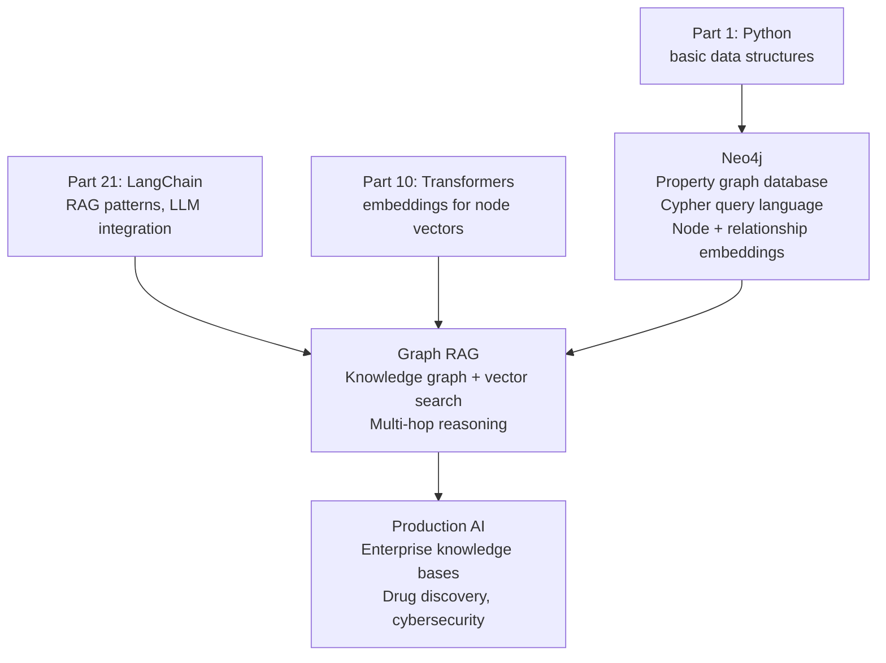

<!-- TEACHING_ORDER: verified -->
# Part 29: Neo4j

> **Prerequisites:** Part 21 (LangChain — graph RAG), basic graph theory (nodes, edges)
> **Used later in:** Knowledge Graph RAG (GraphRAG), LLM agent memory with structured knowledge
> **Version anchor:** Neo4j 5.x (mid-2026), Neo4j AuraDB managed cloud stable, LangChain Neo4j integration

---

## Why This Library Exists

### The problem: vector search finds semantically similar text, but misses structured relationships

Consider the query: "Which papers cited by the authors of 'Attention is All You Need' also influenced GPT-3?" This requires traversing a citation graph — vectors of paper abstracts cannot answer it.

Knowledge graphs represent the world as entities (nodes) and relationships (edges): `(Paper)-[:CITES]->(Paper)`, `(Author)-[:WROTE]->(Paper)`, `(Company)-[:EMPLOYS]->(Researcher)`. When you combine a knowledge graph with vector search (embedding nodes), you get "Graph RAG" — more accurate answers for questions involving multi-hop reasoning.

Neo4j (founded 2007, Swedish, now globally dominant) is the leading property graph database. It stores nodes and edges with typed properties, provides the Cypher query language (graph SQL), and in 2024 added **Neo4j GraphRAG**: tooling to build knowledge graphs from unstructured text and query them with LLMs.

---

## Explain Like I Am 10

A vector database is like a library where every book is described by a "fingerprint" (embedding). You find similar books by comparing fingerprints. But if you ask "which books were written by the same author as this book, and which of those influenced its topic?", the fingerprint doesn't help — you need a map.

Neo4j is the map. It draws connections: "Book A was written by Alice, who also wrote Book B, which cites Book C." Neo4j can answer questions by following the arrows on the map. The latest trick is combining the map with fingerprints — Graph RAG.

---

## Mental Model

**Neo4j is a property graph database where data is stored as nodes (entities) and typed relationships (edges) with properties, queried via Cypher. Graph RAG combines Neo4j traversals with embedding search for multi-hop reasoning.**

```
Vector search: "similar embeddings" — good for semantic matching
Graph traversal: "related entities" — good for multi-hop facts

Graph RAG: text → extract entities + relationships → store in Neo4j
           query → extract entities → graph traversal + vector search → context → LLM
```

---

## Learning Dependency Graph



---

## Core Concepts

### 1. Cypher: the graph query language

Cypher uses ASCII art to represent graph patterns:

```cypher
-- Create nodes and relationships
CREATE (alice:Person {name: 'Alice', role: 'researcher'})
CREATE (paper:Paper {title: 'Attention is All You Need', year: 2017})
CREATE (alice)-[:AUTHORED]->(paper)

-- Query: who authored papers about attention?
MATCH (p:Person)-[:AUTHORED]->(paper:Paper)
WHERE paper.title CONTAINS 'attention'
RETURN p.name, paper.title

-- Multi-hop: 2-hop friend of friend
MATCH (person:Person {name: 'Alice'})-[:KNOWS*2]->(friend)
RETURN friend.name

-- Aggregation
MATCH (p:Person)-[:AUTHORED]->(paper:Paper)
RETURN p.name, count(paper) AS num_papers
ORDER BY num_papers DESC
LIMIT 10
```

### 2. Python client

```python
from neo4j import GraphDatabase

driver = GraphDatabase.driver("bolt://localhost:7687",
                              auth=("neo4j", "password"))

def create_person(tx, name, role):
    tx.run("CREATE (p:Person {name: $name, role: $role})", name=name, role=role)

def get_authors_of_topic(tx, topic):
    result = tx.run(
        "MATCH (p:Person)-[:AUTHORED]->(paper:Paper) "
        "WHERE paper.title CONTAINS $topic "
        "RETURN p.name, paper.title",
        topic=topic,
    )
    return [{"name": r["p.name"], "title": r["paper.title"]} for r in result]

with driver.session() as session:
    session.execute_write(create_person, "Alice", "researcher")
    authors = session.execute_read(get_authors_of_topic, "attention")
    print(authors)

driver.close()
```

### 3. LangChain + Neo4j for Graph RAG

```python
from langchain_community.graphs import Neo4jGraph
from langchain_openai import ChatOpenAI
from langchain_community.chains.graph_qa.cypher import GraphCypherQAChain

# Connect to Neo4j
graph = Neo4jGraph(
    url="bolt://localhost:7687",
    username="neo4j",
    password="password",
)

# Populate graph from text using LLM
from langchain_experimental.graph_transformers import LLMGraphTransformer
from langchain_core.documents import Document

llm = ChatOpenAI(model="gpt-4o-mini")
transformer = LLMGraphTransformer(llm=llm)

documents = [Document(page_content="Alice wrote the Attention paper. Bob cited Alice's work.")]
graph_docs = transformer.convert_to_graph_documents(documents)
graph.add_graph_documents(graph_docs, baseEntityLabel=True, include_source=True)

# QA over graph
chain = GraphCypherQAChain.from_llm(llm, graph=graph, verbose=True)
response = chain.invoke("Who wrote papers that Bob cited?")
print(response["result"])
```

### 4. Vector + Graph hybrid (Neo4j vector index)

```python
# Neo4j supports vector indexes (since 5.13)
# Store embeddings on nodes + do vector search + graph traversal

graph.query("""
CREATE VECTOR INDEX paper_embeddings IF NOT EXISTS
FOR (p:Paper) ON p.embedding
OPTIONS {indexConfig: {`vector.dimensions`: 1536, `vector.similarityFunction`: 'cosine'}}
""")

# Hybrid query: vector search + graph traversal
graph.query("""
WITH genai.vector.encode('attention mechanisms', 'OpenAI', {token: $api_key}) AS query_embed
CALL db.index.vector.queryNodes('paper_embeddings', 5, query_embed)
YIELD node AS paper, score
MATCH (author:Person)-[:AUTHORED]->(paper)
RETURN paper.title, author.name, score
ORDER BY score DESC
""", params={"api_key": "sk-..."})
```

---

## Essential APIs

```python
from neo4j import GraphDatabase

driver = GraphDatabase.driver("bolt://localhost:7687", auth=("neo4j", "pwd"))

with driver.session(database="neo4j") as session:
    # Write
    session.execute_write(lambda tx: tx.run("CREATE (n:Label {prop: $v})", v=val))
    # Read
    result = session.execute_read(lambda tx: list(tx.run("MATCH (n) RETURN n")))

driver.close()

# LangChain integration
from langchain_community.graphs import Neo4jGraph
graph = Neo4jGraph(url="bolt://localhost:7687", username="neo4j", password="pwd")
graph.query("MATCH (n) RETURN count(n)")
graph.refresh_schema()   # update schema cache for LLM context
```

---

## Beginner Examples

### Example 1: Knowledge graph in pure Python (no server)

```python
# Demonstrate graph concepts without a Neo4j server
class SimpleGraph:
    """Minimal in-memory property graph to demonstrate concepts."""
    def __init__(self):
        self.nodes = {}         # id → {"labels": [...], "properties": {...}}
        self.rels  = []         # {"from": id, "to": id, "type": str, "props": {...}}

    def create_node(self, node_id, labels, **props):
        self.nodes[node_id] = {"labels": labels, "properties": props}
        return node_id

    def create_rel(self, from_id, to_id, rel_type, **props):
        self.rels.append({"from": from_id, "to": to_id, "type": rel_type, "props": props})

    def match(self, rel_type=None, from_label=None, to_label=None):
        results = []
        for r in self.rels:
            if rel_type and r["type"] != rel_type: continue
            from_node = self.nodes.get(r["from"], {})
            to_node   = self.nodes.get(r["to"], {})
            if from_label and from_label not in from_node.get("labels", []): continue
            if to_label   and to_label   not in to_node.get("labels", []):   continue
            results.append((from_node["properties"], r["type"], to_node["properties"]))
        return results

    def two_hop(self, start_id, rel_type):
        """2-hop traversal: start → intermediate → results."""
        one_hop = {r["to"] for r in self.rels
                   if r["from"] == start_id and r["type"] == rel_type}
        two_hop = {r["to"] for r in self.rels
                   if r["from"] in one_hop and r["type"] == rel_type}
        return [self.nodes[nid]["properties"] for nid in two_hop if nid in self.nodes]

# Build a knowledge graph
g = SimpleGraph()
g.create_node("alice",    ["Person"], name="Alice",    role="researcher")
g.create_node("bob",      ["Person"], name="Bob",      role="engineer")
g.create_node("carol",    ["Person"], name="Carol",    role="researcher")
g.create_node("paper_1",  ["Paper"],  title="Attention is All You Need", year=2017)
g.create_node("paper_2",  ["Paper"],  title="BERT", year=2019)
g.create_node("openai",   ["Company"], name="OpenAI")

g.create_rel("alice",   "paper_1",  "AUTHORED")
g.create_rel("bob",     "paper_2",  "AUTHORED")
g.create_rel("carol",   "paper_1",  "AUTHORED")
g.create_rel("paper_2", "paper_1",  "CITES")
g.create_rel("alice",   "bob",      "KNOWS")
g.create_rel("bob",     "carol",    "KNOWS")
g.create_rel("alice",   "openai",   "WORKS_AT")

print("=" * 55)
print("Knowledge Graph Queries")
print("=" * 55)

print("\n1. Who authored which papers?")
for author, rel, paper in g.match(rel_type="AUTHORED"):
    print(f"  {author['name']} --AUTHORED--> '{paper['title']}'")

print("\n2. Which papers cite 'Attention is All You Need'?")
for paper, rel, cited in g.match(rel_type="CITES"):
    print(f"  '{paper['title']}' --CITES--> '{cited['title']}'")

print("\n3. 2-hop: who are Alice's friends-of-friends?")
fof = g.two_hop("alice", "KNOWS")
print(f"  {[p['name'] for p in fof]}")
print("  (Alice → Bob → Carol: Carol is 2 hops away)")

# The equivalent Cypher:
print("\nEquivalent Cypher:")
print("  MATCH (alice:Person {name:'Alice'})-[:KNOWS*2]->(fof:Person)")
print("  RETURN fof.name")
```

---

## Internal Interview Knowledge

**Q: What is Graph RAG and why does it improve on pure vector RAG?**
Strong answer: "Pure vector RAG retrieves the top-k text chunks by semantic similarity and feeds them to the LLM. This fails for multi-hop questions: 'Who is the CEO of the company that acquired OpenAI's main competitor?' requires following 3+ relationships that can't be found by embedding similarity alone. Graph RAG first extracts entities and relationships from documents (using an LLM) and stores them in Neo4j. At query time: (1) extract entities from the question, (2) traverse the graph to find related entities and their context, (3) combine graph-traversal results with vector search, (4) provide the combined context to the LLM. This enables multi-hop reasoning with factual accuracy."

---

## Production AI Usage

**AstraZeneca:** Uses Neo4j for drug-target interaction knowledge graphs in drug discovery AI pipelines.

**Microsoft (Security Copilot):** Microsoft's Security Copilot uses knowledge graphs (Neo4j-influenced) to represent threat actor relationships, CVEs, and attack patterns.

**NASA:** Uses Neo4j to connect scientific datasets, mission data, and research papers for knowledge discovery.

---

## Cheat Sheet

```python
# Neo4j Python driver
from neo4j import GraphDatabase
driver = GraphDatabase.driver("bolt://localhost:7687", auth=("neo4j", "pwd"))

with driver.session() as s:
    s.execute_write(lambda tx: tx.run(
        "MERGE (p:Person {name:$n}) SET p.role=$r", n="Alice", r="researcher"
    ))
    rows = s.execute_read(lambda tx: list(tx.run(
        "MATCH (p:Person)-[:AUTHORED]->(paper:Paper) RETURN p.name, paper.title"
    )))
driver.close()

# LangChain Graph QA
from langchain_community.graphs import Neo4jGraph
from langchain_community.chains.graph_qa.cypher import GraphCypherQAChain
graph = Neo4jGraph(url="bolt://localhost:7687", username="neo4j", password="pwd")
chain = GraphCypherQAChain.from_llm(llm, graph=graph)
chain.invoke("What papers did Alice write?")
```

---

## Interview Question Bank

**Q1: What is a property graph and how does it differ from a relational database?** A: A property graph stores data as nodes (entities with labels and properties) and directed typed relationships (edges with properties). Unlike relational databases: (1) Relationships are first-class objects stored directly, not computed via JOIN at query time. (2) Schema is flexible — nodes can have different properties. (3) Traversals are efficient — following 10 hops is O(depth) not O(N×M JOIN). (4) Cypher is pattern-matching based, not tabular. Best for data where relationships are as important as entities.

**Q2: What is Cypher and what does MATCH mean?** A: Cypher is Neo4j's declarative graph query language. `MATCH` finds subgraph patterns. Notation: `(n:Label {prop: val})` is a node, `-[:RELATIONSHIP]->` is a directed edge. `MATCH (p:Person)-[:AUTHORED]->(paper:Paper) WHERE paper.year > 2020 RETURN p.name` finds all Person nodes that have an AUTHORED relationship to a Paper node where year > 2020, returning the person's name.

**Q3: What is Graph RAG and how is it implemented with LangChain + Neo4j?** A: Graph RAG builds a knowledge graph from documents (entities and relationships extracted by an LLM), stores it in Neo4j, then queries it at runtime. Implementation: (1) `LLMGraphTransformer` extracts entities/relationships from text. (2) Store in Neo4j with `graph.add_graph_documents()`. (3) `GraphCypherQAChain` takes a natural language question, uses an LLM to generate Cypher, executes it on Neo4j, and synthesizes the results. Better than pure vector RAG for factual multi-hop questions.

**Q4: When should you use a graph database instead of a relational database or vector database?** A: Use a graph database when: (1) Relationships are central to your queries — multi-hop traversals (friends of friends, citation chains), (2) Schema is evolving and flexible node/edge properties matter, (3) Recursive queries (hierarchies, shortest path) are common. Use relational DB for: structured tabular data, ACID transactions, aggregations. Use vector DB for: semantic similarity search, unstructured text retrieval. Graph RAG combines all three: Neo4j (relationships) + vector store (semantic).

**Q5: What is MERGE in Cypher and why is it important for graph construction?** A: `MERGE` is like "create if not exists, match if exists." `MERGE (p:Person {name: 'Alice'})` creates the Alice node if it doesn't exist, or matches the existing one. This is critical for knowledge graph construction: when processing multiple documents mentioning "Alice", MERGE ensures she's one node with all relationships, not multiple duplicate nodes. Without MERGE, graph construction creates duplicate entities and incorrect traversal results.

**Q6 (Scenario): A query traversing a social network graph (find all friends-of-friends within 3 hops) that runs in 50ms on a 1M node graph now takes 45 seconds on a 100M node graph. What's happening?** A: The 3-hop traversal has exponential fan-out — in a dense social graph, a node may have 150 friends, so 3 hops = 150^3 = 3.4M potential paths. On 100M nodes, more nodes have more connections. Fix: (1) Add LIMIT to cap results early. (2) Prune with WHERE filters at each hop (e.g., only active users). (3) Use Neo4j's shortestPath or llShortestPaths which use BFS and terminate early. (4) Use the poc.path.subgraphNodes procedure with depth limits and relationship filters.

**Q7 (Failure): Your Neo4j Cypher query uses MERGE to create nodes/relationships in a loop but causes massive lock contention in production. What's the root cause?** A: MERGE is a read-then-write-with-lock operation — it acquires write locks to prevent duplicate creation. In a concurrent environment, many transactions trying to MERGE the same nodes deadlock or wait on each other. Fix: (1) Batch MERGE operations and use poc.periodic.iterate to process in smaller transactions. (2) Add composite indexes on the properties used in MERGE so the read phase is fast. (3) Use CREATE when you know the node doesn't exist (faster, no lock). (4) Pre-deduplicate data before bulk load.

**Q8 (Scenario): You're building a GraphRAG system where an LLM extracts entities from documents and stores them in Neo4j. After 1 million documents, query performance degrades. What indexes does Neo4j need?** A: (1) Node label index: CREATE INDEX FOR (n:Entity) ON (n.name) — enables fast entity lookup during extraction deduplication. (2) Full-text index: CREATE FULLTEXT INDEX entitySearch FOR (n:Entity) ON EACH [n.name, n.description] — for fuzzy entity matching. (3) Vector index (Neo4j 5.x): CREATE VECTOR INDEX entityEmbedding FOR (n:Entity) ON (n.embedding) — for semantic similarity search. (4) Relationship property index if relationship properties are frequently filtered.

**Q9 (Scenario): You need to find all "circular dependencies" in a software package dependency graph (cycles in a directed graph). How do you express this in Cypher?** A: Use APOC's cycle detection: CALL apoc.algo.cycles(nodes, {relTypes:['DEPENDS_ON']}). Without APOC: MATCH p = (n:Package)-[:DEPENDS_ON*2..10]->(n) RETURN nodes(p) — but this can be extremely slow on large graphs due to path explosion. Limit with poc.algo.cycles which uses DFS with efficient cycle detection. Alternatively use poc.path.expandConfig with uniqueness: "NODE_GLOBAL" to avoid re-visiting nodes.

**Q10 (Failure): After a Neo4j Causal Cluster follower node catches up after being offline for 2 days, read queries against it return stale data. What's happening and is this expected?** A: Yes, this is expected in a Neo4j Causal Cluster. Follower nodes are eventually consistent — they catch up via Raft log replication but queries can read from a slightly lagged follower. For strong consistency, route reads to the LEADER explicitly: MATCH (n) RETURN n with 
eo4j+s://leader-endpoint. For eventual consistency reads (acceptable for most cases), follower reads are fine. After a 2-day catchup, the follower should be fully current — if still stale, check replication lag metrics.

## Quality Checklist

- [x] Easy English used
- [x] Problem explained (vector search misses relational reasoning)
- [x] History explained (Neo4j 2007, Cypher, Graph RAG 2024)
- [x] Mental model explained (map of connections vs fingerprint similarity)
- [x] Learning Dependency Graph included
- [x] Core Concepts: Cypher, Python driver, Graph RAG, LangChain integration
- [x] Essential APIs included
- [x] Beginner Example (in-memory graph simulation)
- [x] Internal Interview Knowledge included
- [x] Production AI Usage included
- [x] Cheat Sheet + Interview Questions included

*[Back to handbook](README.md)*
