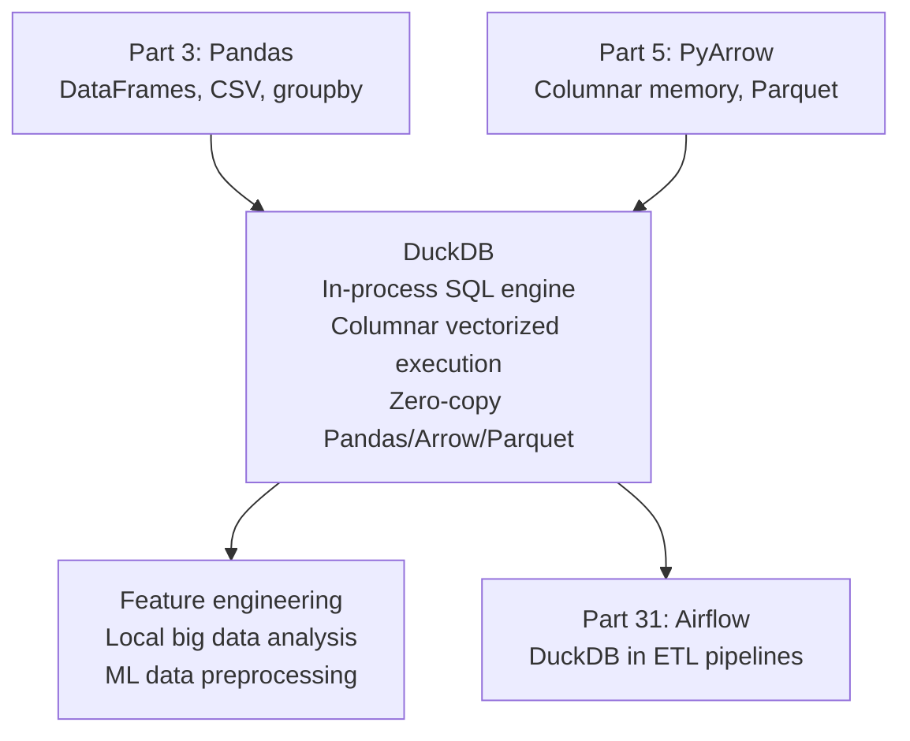

<!-- TEACHING_ORDER: verified -->
# Part 30: DuckDB

> **Prerequisites:** Part 3 (Pandas — DataFrames), Part 5 (PyArrow — columnar memory), SQL basics
> **Used later in:** Feature engineering pipelines, local data analysis, Part 31 (Airflow + DuckDB)
> **Version anchor:** DuckDB 1.2.x (mid-2026), Python client stable

---

## Why This Library Exists

### The problem: Pandas runs everything in Python — slow for large analytical queries

Pandas' `groupby`, `merge`, and `apply` execute Python loops under the hood. For a 10 GB CSV: reading it into Pandas takes 30 seconds and uses 25 GB of RAM (column copies during operations). SQL databases are fast, but SQLite is row-oriented — poor for analytics. Spark requires a cluster setup for local development.

Hannes Mühleisen and Mark Raasveldt (CWI, Amsterdam, 2019) created DuckDB as an **in-process analytical SQL engine** — a SQLite for analytics. Key design decisions:
1. **Columnar execution:** processes data column-by-column, like Arrow, with SIMD vectorization
2. **No server required:** imports as a Python library (`import duckdb`)
3. **Zero-copy reads:** queries directly over Pandas DataFrames, PyArrow tables, Parquet files without loading into memory
4. **Full SQL:** window functions, CTEs, UNNEST, PIVOT — not just SELECT

---

## Explain Like I Am 10

Pandas is like doing math homework with a calculator — you punch in one number at a time. DuckDB is like using a spreadsheet with built-in formulas — you write "calculate the sum of column B grouped by column A" and it does the whole thing in one go, super fast.

DuckDB reads Parquet files and Pandas DataFrames directly, so you don't have to copy your data first. And it has all of SQL: GROUP BY, window functions, CTEs — the full toolkit.

---

## Mental Model

**DuckDB is an in-process columnar SQL engine: it runs inside your Python process, queries Pandas/Arrow/Parquet data directly with zero-copy, and executes analytical SQL with vectorized SIMD operations — no server, no ETL.**

---

## Learning Dependency Graph



---

## Core Concepts

### 1. Zero-copy queries over DataFrames and Parquet

```python
import duckdb
import pandas as pd
import numpy as np

# Create sample DataFrame
np.random.seed(42)
df = pd.DataFrame({
    "user_id":    np.random.randint(0, 1000, 100_000),
    "category":   np.random.choice(["A", "B", "C", "D"], 100_000),
    "amount":     np.random.exponential(100, 100_000),
    "timestamp":  pd.date_range("2024-01-01", periods=100_000, freq="1min"),
})

# Query the DataFrame directly — no copy!
result = duckdb.query("""
    SELECT
        category,
        COUNT(*)                              AS n_transactions,
        ROUND(AVG(amount), 2)                 AS avg_amount,
        ROUND(SUM(amount), 2)                 AS total_amount,
        ROUND(PERCENTILE_CONT(0.95) WITHIN GROUP (ORDER BY amount), 2) AS p95_amount
    FROM df
    GROUP BY category
    ORDER BY total_amount DESC
""").df()  # .df() → Pandas DataFrame

print(result)
```

### 2. Reading Parquet files

```python
import duckdb

# Query Parquet directly — DuckDB reads column pruning + predicate pushdown
result = duckdb.sql("""
    SELECT user_id, SUM(amount) AS total
    FROM read_parquet('transactions_*.parquet')  -- glob: multiple files
    WHERE category = 'A' AND amount > 100
    GROUP BY user_id
    ORDER BY total DESC
    LIMIT 10
""").df()

# Reading multiple formats
duckdb.sql("SELECT * FROM read_csv('data.csv') LIMIT 5")
duckdb.sql("SELECT * FROM read_json('data.json') LIMIT 5")
duckdb.sql("SELECT * FROM 'https://example.com/data.parquet' LIMIT 5")
```

### 3. Persistent database (optional)

```python
import duckdb

# Persistent database (file-backed)
con = duckdb.connect("my_database.duckdb")

# Create tables
con.execute("""
    CREATE TABLE IF NOT EXISTS features AS
    SELECT *, LOG(amount + 1) AS log_amount
    FROM df
""")

# Or use DML
con.execute("INSERT INTO features SELECT * FROM df2")
con.execute("CREATE INDEX idx_user ON features(user_id)")

result = con.execute("SELECT * FROM features WHERE user_id < 100").df()
con.close()
```

### 4. Window functions (essential for ML feature engineering)

```python
import duckdb

# Rolling 7-day average — a common ML feature
result = duckdb.query("""
    SELECT
        user_id,
        timestamp,
        amount,
        AVG(amount) OVER (
            PARTITION BY user_id
            ORDER BY timestamp
            ROWS BETWEEN 7 PRECEDING AND CURRENT ROW
        ) AS rolling_7d_avg,
        ROW_NUMBER() OVER (PARTITION BY user_id ORDER BY timestamp) AS txn_seq,
        LAG(amount, 1) OVER (PARTITION BY user_id ORDER BY timestamp) AS prev_amount
    FROM df
    ORDER BY user_id, timestamp
    LIMIT 20
""").df()
print(result.head())
```

### 5. DuckDB vs Pandas performance

```python
import duckdb, pandas as pd, numpy as np, time

# Generate large dataset
N = 2_000_000
df = pd.DataFrame({
    "category": np.random.choice(["A","B","C","D","E"], N),
    "value":    np.random.rand(N),
})

# Pandas groupby
t0 = time.time()
pd_result = df.groupby("category")["value"].agg(["mean", "sum", "count"])
t_pandas = time.time() - t0

# DuckDB SQL
t1 = time.time()
ddb_result = duckdb.query(
    "SELECT category, AVG(value), SUM(value), COUNT(*) FROM df GROUP BY category"
).df()
t_duckdb = time.time() - t1

print(f"Pandas:  {t_pandas*1000:.1f}ms")
print(f"DuckDB:  {t_duckdb*1000:.1f}ms  ({t_pandas/t_duckdb:.1f}× faster)")
```

---

## Essential APIs

```python
import duckdb

# In-memory (temporary)
conn = duckdb.connect()

# Query methods
duckdb.sql("SELECT ...")           # → DuckDBPyRelation
duckdb.query("SELECT ...")         # alias for .sql()
duckdb.sql("...").df()             # → pandas DataFrame
duckdb.sql("...").arrow()          # → PyArrow Table
duckdb.sql("...").pl()             # → Polars DataFrame
duckdb.sql("...").fetchall()       # → list of tuples

# File reading
duckdb.sql("FROM read_parquet('file.parquet')")
duckdb.sql("FROM read_csv('file.csv')")
duckdb.sql("FROM 'file.parquet'")  # shorthand

# Register a DataFrame as table
conn.register("my_table", df)
conn.sql("SELECT * FROM my_table")

# Persistent database
conn = duckdb.connect("db.duckdb")
conn.execute("CREATE TABLE t AS SELECT * FROM df")
conn.close()

# COPY to Parquet
conn.execute("COPY (SELECT * FROM t) TO 'output.parquet' (FORMAT PARQUET)")
```

---

## Beginner Examples

### Example 1: ML feature engineering with DuckDB

```python
import duckdb
import pandas as pd
import numpy as np

np.random.seed(0)
N = 50_000
transactions = pd.DataFrame({
    "user_id":    np.random.randint(1, 201, N),
    "merchant":   np.random.choice(["Amazon","Netflix","Spotify","Uber","Airbnb"], N),
    "amount":     np.abs(np.random.normal(50, 30, N)),
    "date":       pd.date_range("2024-01-01", periods=N, freq="1H")[:N],
    "is_fraud":   (np.random.rand(N) < 0.02).astype(int),
})

# Create ML features in one DuckDB query
features = duckdb.query("""
    SELECT
        user_id,
        COUNT(*)                          AS n_transactions,
        AVG(amount)                        AS avg_amount,
        STDDEV(amount)                     AS std_amount,
        MAX(amount) - MIN(amount)          AS amount_range,
        COUNT(DISTINCT merchant)           AS unique_merchants,
        SUM(is_fraud) / COUNT(*)::FLOAT    AS fraud_rate,
        MAX(amount)                        AS max_amount,
        MIN(amount)                        AS min_amount,
        PERCENTILE_CONT(0.99) WITHIN GROUP (ORDER BY amount) AS p99_amount
    FROM transactions
    GROUP BY user_id
    ORDER BY user_id
""").df()

print(f"Features shape: {features.shape}")
print(features.head(3).to_string())
```

---

## Internal Interview Knowledge

**Q: How does DuckDB's vectorized execution differ from Pandas' execution model?**
Strong answer: "Pandas processes data row-by-row in Python loops (e.g., `apply`, iteration) or in NumPy-backed column operations that still create intermediate copies. DuckDB processes data in columnar chunks using SIMD CPU instructions — one operation processes 1024+ values simultaneously. For `GROUP BY category, SUM(amount)`: Pandas materializes the entire grouped DataFrame in memory; DuckDB aggregates while scanning, using vectorized hash tables. DuckDB also supports out-of-core execution (data larger than RAM) via spilling to disk. For analytical queries on DataFrames >1M rows, DuckDB is typically 5–50× faster than Pandas."

---

## Production AI Usage

**MotherDuck:** Cloud DuckDB platform used by data teams at major companies for analytical workloads.

**Hugging Face:** Datasets library uses DuckDB for fast SQL queries over large HuggingFace datasets hosted on Hub.

**dbt Labs:** dbt-duckdb adapter enables running dbt transformations locally against DuckDB instead of Snowflake/BigQuery.

---

## Cheat Sheet

```python
import duckdb

# Query DataFrame/Parquet directly
result = duckdb.sql("SELECT cat, AVG(val), COUNT(*) FROM df GROUP BY cat").df()

# Window function
duckdb.sql("""
    SELECT *, AVG(val) OVER (PARTITION BY cat ORDER BY ts ROWS 6 PRECEDING) AS rolling
    FROM df
""").df()

# Write to Parquet
duckdb.sql("COPY (SELECT * FROM df WHERE val > 100) TO 'output.parquet' (FORMAT PARQUET)")

# Read multiple Parquet files
duckdb.sql("SELECT * FROM read_parquet('data/*.parquet')").df()
```

---

## Interview Question Bank

**Q1: What makes DuckDB different from SQLite?** A: SQLite is row-oriented — optimized for transactional workloads (many small reads/writes). DuckDB is column-oriented — optimized for analytical queries (scan large columns, aggregate, group). DuckDB uses vectorized SIMD execution; SQLite does not. DuckDB reads Parquet/CSV/Arrow natively; SQLite only reads its own format. DuckDB has full SQL analytics (window functions, PERCENTILE, UNNEST); SQLite is limited. DuckDB processes 100M rows in seconds; SQLite would be much slower.

**Q2: What does "zero-copy" mean for DuckDB + Pandas?** A: DuckDB can query a Pandas DataFrame by memory-mapping the underlying NumPy arrays — no copy of the data to a separate buffer. When you run `duckdb.sql("SELECT ... FROM df")`, DuckDB reads the DataFrame's column buffers directly. For a 2 GB DataFrame, this means the query starts immediately (no 2 GB copy). Similarly, DuckDB reads Parquet files with column pruning — only the columns you SELECT are read from disk, not the full file.

**Q3: When would you use DuckDB instead of Spark for ML preprocessing?** A: Use DuckDB when: (1) Data fits in one machine (DuckDB is single-node, up to ~TB scale with memory+disk). (2) Fast iteration — DuckDB starts instantly; Spark requires cluster setup. (3) Python/Pandas ecosystem integration — DuckDB returns Pandas/Arrow directly. (4) Reading Parquet on S3 without loading to memory. Use Spark when: (1) Truly distributed data (10+ TB), (2) Streaming pipelines, (3) Your team has existing Spark infrastructure.

**Q4: How do you use DuckDB for ML feature engineering?** A: DuckDB excels at aggregation features: `GROUP BY user_id, SUM/AVG/STDDEV/PERCENTILE(amount)` creates user-level features from transaction logs. Window functions create temporal features: `AVG(amount) OVER (PARTITION BY user_id ORDER BY date ROWS 30 PRECEDING)` is a 30-day rolling average. DuckDB's `UNNEST`, `PIVOT`, and `EXCLUDE` make complex feature transformations compact. After feature creation: `.df()` returns a Pandas DataFrame ready for scikit-learn.

**Q5: What SQL features make DuckDB particularly useful for data science?** A: (1) Window functions with frames (`ROWS BETWEEN 7 PRECEDING AND CURRENT ROW`). (2) `PERCENTILE_CONT(0.95) WITHIN GROUP (ORDER BY value)` — continuous percentile. (3) `UNNEST(list_column)` — flatten nested arrays. (4) `PIVOT` — reshape wide to long. (5) `GLOB` in `read_parquet('data/*.parquet')` — query multiple files. (6) `EXCLUDE (col1, col2)` — select all columns except. (7) `DESCRIBE` — column types overview. (8) Full CTEs and recursive CTEs for hierarchical data.

**Q6 (Scenario): A DuckDB query on a 50GB Parquet file takes 2 minutes but the same query in Spark takes 30 seconds. Should you switch back to Spark?** A: Not necessarily. DuckDB is single-node — if your machine has only 8 CPUs, it can't match a 100-node Spark cluster. But first check: (1) Is the 50GB file a single Parquet file? DuckDB performs better with partitioned Parquet (multiple files, partition pruning). (2) Is the query I/O bound (reading from network-attached storage)? DuckDB benefits most from local NVMe. (3) Is the 2-min time acceptable for your use case? If it's a one-off analysis, DuckDB's simplicity may outweigh Spark's complexity even at lower speed.

**Q7 (Failure): You're using DuckDB in a FastAPI service for real-time analytics. Under concurrent load (10 simultaneous requests), all requests either serialize or crash. Why?** A: DuckDB has a single-writer, single-reader model per database file. Multiple concurrent connections to the same DuckDB file either serialize (if using in-memory mode) or fail with a lock error (if using a file). Fix: (1) For read-only analytics, use a connection pool with one shared read connection (DuckDB 0.10+ supports multiple concurrent readers). (2) For write+read, separate concerns: write to files (Parquet/CSV), read from files with DuckDB. (3) For true concurrent multi-user analytics, consider MotherDuck (managed DuckDB) or a dedicated OLAP database.

**Q8 (Scenario): You need to join a 10GB DuckDB table with a 100-row lookup table that's stored in a Pandas DataFrame. What's the most efficient way?** A: Use DuckDB's Pandas integration: conn.register("lookup_df", pandas_df) then conn.execute("SELECT t.*, l.label FROM big_table t JOIN lookup_df l ON t.id = l.id"). DuckDB can query registered DataFrames directly. For repeated joins, register once and query many times. This is faster than converting the DataFrame to Parquet — DuckDB reads from the DataFrame's memory buffer directly with zero copy.

**Q9 (Scenario): A data scientist runs a DuckDB analytical query that consumes all 32GB of RAM on their laptop and crashes. The query reads 15GB of Parquet and performs a large GROUP BY. How do you fix this?** A: DuckDB spills to disk when memory pressure exceeds the configured limit. Fix: (1) Set SET memory_limit='24GB' — DuckDB will spill aggregation hash tables to disk instead of OOMing. (2) Use SET temp_directory='/fast-nvme/duckdb_tmp' to direct spill to fast storage. (3) Rewrite the query with a smaller intermediate: add a WHERE clause to reduce the scanned rows. (4) Partition the query: process month-by-month and union results.

**Q10 (Failure): You use DuckDB to generate a daily report from S3 Parquet files and the query suddenly starts failing with "missing column" errors after a data pipeline update. What happened?** A: The upstream pipeline added/renamed/removed a column in the Parquet schema without coordinating with the DuckDB query. DuckDB reads schema from Parquet metadata — if the column name changed from user_id to userId, the SELECT user_id fails. Fix: (1) Use schema evolution-safe patterns: SELECT * EXCLUDE (old_col) or alias in the source pipeline. (2) Add schema validation to the pipeline as a CI check. (3) Use Hive-partitioned datasets with consistent schema enforcement (Delta Lake / Iceberg).

## Quality Checklist

- [x] Easy English used
- [x] Problem explained (Pandas slow for large analytical queries)
- [x] History explained (Hannes Mühleisen, CWI Amsterdam, 2019)
- [x] Mental model explained (in-process columnar SQL, zero-copy)
- [x] Learning Dependency Graph included
- [x] Core Concepts: zero-copy queries, Parquet reading, window functions, performance
- [x] Essential APIs included
- [x] Beginner Example (ML feature engineering)
- [x] Internal Interview Knowledge included
- [x] Production AI Usage included
- [x] Cheat Sheet + Interview Questions included

*[Back to handbook](README.md)*
