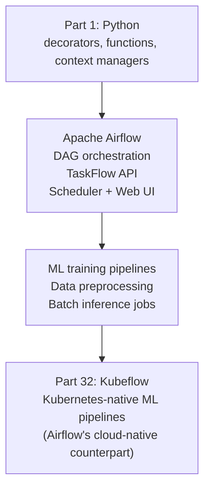

<!-- TEACHING_ORDER: verified -->
# Part 31: Apache Airflow

> **Prerequisites:** Part 1 (Python — functions, classes, decorators), DAG concepts, cron scheduling basics
> **Used later in:** Part 32 (Kubeflow is Airflow's Kubernetes-native counterpart for ML), MLOps pipelines
> **Version anchor:** Airflow 2.10.x (mid-2026), Airflow TaskFlow API stable

---

## Why This Library Exists

### The problem: ML pipelines have dependencies and schedules that scripts cannot manage

A typical ML pipeline: download data → validate → preprocess → train → evaluate → if accuracy > threshold: deploy → notify team. Naively, this is a shell script. The problems: if "preprocess" fails, how do you restart from that step? How do you run "train" for each of 5 hyperparameter sets in parallel? How do you trigger this pipeline every day at 3am? How do you see which steps failed last Tuesday?

Maxime Beauchemin at Airbnb (2014) created Airflow to solve exactly this: a workflow orchestrator where pipelines are defined as **DAGs** (Directed Acyclic Graphs) in Python code. Every step is a task with explicit dependencies; the scheduler manages execution, retries, parallelism, and monitoring through a web UI.

By 2026, Airflow is the dominant open-source workflow orchestrator used by nearly every major tech company for data pipelines and ML workflows.

---

## Explain Like I Am 10

Imagine baking a complex cake with many steps: first bake the layers, then make frosting (while the layers cool), then assemble. Some steps depend on previous ones finishing. Some can happen at the same time.

Airflow is the recipe manager. You write the recipe as a DAG diagram: arrows show which step must finish before the next starts. Airflow runs the recipe on a schedule (every morning at 6am), retries a step if it fails, and shows you exactly which step is at "frosting" vs "assembling" on a web dashboard.

---

## Mental Model

**Airflow orchestrates workflows defined as Python DAGs (Directed Acyclic Graphs): tasks are Python functions (or operators), edges define dependencies, and the scheduler executes them on a schedule with retries, monitoring, and web UI.**

---

## Learning Dependency Graph



---

## Core Concepts

### 1. DAG and TaskFlow API

```python
from airflow.decorators import dag, task
from airflow.utils.dates import days_ago
from datetime import timedelta

@dag(
    dag_id="ml_training_pipeline",
    schedule_interval="@daily",         # run daily
    start_date=days_ago(1),
    catchup=False,                      # don't backfill past runs
    default_args={
        "retries": 2,
        "retry_delay": timedelta(minutes=5),
        "email_on_failure": True,
    },
    tags=["ml", "training"],
)
def ml_training_pipeline():

    @task
    def download_data() -> dict:
        """Download latest training data."""
        data_path = "/tmp/train_data.csv"
        # ... download logic ...
        return {"path": data_path, "rows": 50000}

    @task
    def preprocess(data_info: dict) -> dict:
        """Clean and feature-engineer the data."""
        # ... preprocessing ...
        return {"path": "/tmp/processed.parquet", "rows": data_info["rows"] - 100}

    @task
    def train_model(data_info: dict) -> dict:
        """Train the model."""
        # ... training ...
        return {"model_path": "/tmp/model.pkl", "accuracy": 0.94}

    @task
    def evaluate(model_info: dict) -> bool:
        """Evaluate and decide whether to deploy."""
        return model_info["accuracy"] > 0.90

    @task
    def deploy_model(model_info: dict, should_deploy: bool):
        """Deploy if accuracy threshold met."""
        if should_deploy:
            print(f"Deploying model from {model_info['model_path']}")

    # Define dependencies by chaining task calls
    data       = download_data()
    processed  = preprocess(data)
    model_info = train_model(processed)
    should_deploy = evaluate(model_info)
    deploy_model(model_info, should_deploy)

dag_instance = ml_training_pipeline()
```

### 2. Branching

```python
from airflow.decorators import dag, task
from airflow.operators.python import BranchPythonOperator

@dag(...)
def branching_pipeline():

    @task.branch
    def check_accuracy(accuracy: float) -> str:
        if accuracy >= 0.90:
            return "deploy_prod"
        elif accuracy >= 0.80:
            return "deploy_staging"
        else:
            return "retrain_with_more_data"

    # The branch task returns the task_id to execute next
```

### 3. Dynamic task mapping (parallel training)

```python
from airflow.decorators import dag, task

@dag(schedule="@weekly", ...)
def hyperparameter_search():

    @task
    def get_configs() -> list:
        return [
            {"lr": 0.001, "hidden": 128},
            {"lr": 0.0001, "hidden": 256},
            {"lr": 0.01,  "hidden": 64},
        ]

    @task
    def train_config(config: dict) -> dict:
        """Train with one config — runs in parallel for all configs."""
        # ... training ...
        return {"config": config, "val_acc": 0.90 + config["lr"] * 10}

    @task
    def pick_best(results: list) -> dict:
        return max(results, key=lambda r: r["val_acc"])

    configs = get_configs()
    results = train_config.expand(config=configs)  # dynamic mapping → parallel tasks
    best    = pick_best(results)
```

### 4. Running Airflow locally

```bash
# Install
pip install apache-airflow

# Initialize DB
airflow db init

# Start in standalone mode (scheduler + webserver)
airflow standalone

# Place DAG files in ~/airflow/dags/
# Access UI at http://localhost:8080
```

---

## Essential APIs

```python
from airflow.decorators import dag, task
from airflow.operators.python import PythonOperator, BranchPythonOperator
from airflow.operators.bash import BashOperator
from airflow.operators.empty import EmptyOperator
from airflow.sensors.filesystem import FileSensor
from airflow.utils.dates import days_ago
from datetime import datetime, timedelta

# DAG arguments
@dag(
    dag_id="my_dag",
    schedule="@daily",              # or "0 3 * * *" (cron)
    start_date=datetime(2024, 1, 1),
    catchup=False,
    tags=["ml"],
    default_args={"retries": 1, "retry_delay": timedelta(minutes=5)},
)
def my_dag():
    @task
    def my_task() -> str:
        return "result"

    @task.branch
    def decide(result: str) -> str:
        return "task_a" if result == "ok" else "task_b"

    # TaskFlow: pass data between tasks via XCom automatically
    # Operators: for complex logic or community integrations
    bash_task = BashOperator(task_id="run_script", bash_command="python script.py")
```

---

## Beginner Examples

### Example 1: Data pipeline DAG

```python
from airflow.decorators import dag, task
from airflow.utils.dates import days_ago
import json

@dag(
    dag_id="simple_data_pipeline",
    schedule="@hourly",
    start_date=days_ago(1),
    catchup=False,
)
def simple_data_pipeline():

    @task
    def extract() -> list:
        """Simulate data extraction."""
        data = [{"id": i, "value": i * 1.5} for i in range(10)]
        print(f"Extracted {len(data)} records")
        return data

    @task
    def transform(records: list) -> list:
        """Apply transformations."""
        return [{"id": r["id"], "value_doubled": r["value"] * 2,
                 "is_large": r["value"] > 5} for r in records]

    @task
    def load(records: list) -> dict:
        """Simulate loading to a destination."""
        large_count = sum(1 for r in records if r["is_large"])
        print(f"Loaded {len(records)} records, {large_count} are large")
        return {"total": len(records), "large": large_count}

    @task
    def notify(stats: dict):
        print(f"Pipeline complete: {json.dumps(stats)}")

    # Chain: extract → transform → load → notify
    raw     = extract()
    cleaned = transform(raw)
    stats   = load(cleaned)
    notify(stats)

dag = simple_data_pipeline()
# Test without Airflow scheduler:
# airflow tasks test simple_data_pipeline extract 2024-01-01
```

---

## Internal Interview Knowledge

**Q: What is a DAG and why must workflows be acyclic?**
Strong answer: "A Directed Acyclic Graph (DAG) represents tasks as nodes and dependencies as directed edges. 'Acyclic' means no cycles — task A cannot depend on task B if B depends on A. Cycles would create infinite loops (A waits for B, B waits for A, neither runs). Airflow enforces acyclicity at DAG parsing time and raises an error if a cycle is detected. The acyclic constraint means any DAG has a valid topological ordering — a sequence of tasks that respects all dependencies. Airflow's scheduler uses topological sort to determine which tasks are ready to run at each tick."

**Q: What is XCom and when should you NOT use it?**
Strong answer: "XCom (Cross-Communication) is Airflow's mechanism for passing data between tasks. The TaskFlow API automatically serializes return values and stores them in the Airflow metadata database. When a downstream task requests the value, it is deserialized from the DB. Use XCom for small data: configuration dicts, paths, counts, boolean flags. Never use XCom for large data (DataFrames, model files) — Airflow's metadata DB is not designed for bulk storage, and large XComs slow the scheduler. Best practice: large data goes to S3/GCS/local filesystem; tasks pass only paths via XCom."

---

## Production AI Usage

**Airbnb:** Airflow was created at Airbnb. They run thousands of DAGs daily for data pipelines, ML training, and experimentation.

**Lyft:** Lyft uses Airflow for ML model training pipelines and feature engineering workflows.

**Spotify:** Spotify uses Airflow for daily music recommendation model training and podcast ML pipelines.

**LinkedIn:** LinkedIn's ML infrastructure uses Airflow for offline training pipeline orchestration.

---

## Common Mistakes

**Mistake 1: Writing business logic in DAG definition (top-level code)**
```python
# Bug: top-level code runs when DAG is parsed, not when task executes
import requests
data = requests.get("http://api.example.com/data").json()  # runs on every scheduler tick!

@dag(...)
def my_dag():
    @task
    def get_data():
        import requests  # imports inside tasks
        return requests.get("http://api.example.com/data").json()
```

**Mistake 2: Using XCom for large datasets**
```python
# Bug: returns a 1 GB DataFrame via XCom → crashes metadata DB
@task
def process() -> pd.DataFrame:
    return large_df  # stored in Airflow DB!

# Fix: save to file, pass path
@task
def process() -> str:
    large_df.to_parquet("/tmp/result.parquet")
    return "/tmp/result.parquet"  # small string via XCom
```

---

## Cheat Sheet

```python
from airflow.decorators import dag, task
from airflow.utils.dates import days_ago

@dag(dag_id="my_dag", schedule="@daily", start_date=days_ago(1), catchup=False)
def my_dag():
    @task
    def step_1() -> dict:
        return {"key": "value"}

    @task
    def step_2(data: dict) -> str:
        return data["key"]

    @task.branch
    def route(result: str) -> str:
        return "task_a" if result == "value" else "task_b"

    result = step_2(step_1())
    route(result)

dag = my_dag()
```

---

## Interview Question Bank

**Q1: What is Apache Airflow and why is it used for ML pipelines?** A: Airflow is a workflow orchestration platform where pipelines are defined as Python DAGs. Used for ML pipelines because: dependencies (train after preprocess), scheduling (daily retraining), retries (auto-retry failed downloads), parallelism (train 5 models simultaneously with dynamic mapping), monitoring (web UI shows which steps failed and why), and integration (pre-built operators for S3, GCS, Spark, Kubernetes, and 700+ other systems).

**Q2: What is the TaskFlow API?** A: TaskFlow API (Airflow 2.0+) uses `@task` decorators to define tasks as Python functions. Return values are automatically passed between tasks via XCom (serialized to Airflow's metadata DB). Dependencies are inferred from how tasks are called: `result = task_b(task_a())` means task_b depends on task_a. This is cleaner than the older `PythonOperator` + `xcom_pull/push` pattern.

**Q3: What is dynamic task mapping?** A: `task.expand(param=list)` creates one task instance per item in the list, all running in parallel. Example: `train.expand(config=[cfg1, cfg2, cfg3])` creates 3 parallel "train" tasks. The results list is collected by a downstream task. This enables parallel hyperparameter search, parallel data shards processing, or parallel evaluation across multiple models.

**Q4: What is the difference between Airflow and Kubeflow?** A: Airflow: general-purpose workflow orchestrator, runs on any infrastructure, excellent for data pipelines + ML training, large ecosystem of operators. Kubeflow: Kubernetes-native ML platform, designed specifically for ML workflows with Kubernetes-native primitives (Pods, PVCs), includes Kubeflow Pipelines (similar to Airflow DAGs), plus components for hyperparameter tuning (Katib), model serving, and distributed training.

**Q5: What is `catchup` and when should you set it to False?** A: `catchup=True` (default): Airflow schedules all missed DAG runs between `start_date` and now when a DAG is first deployed. For a daily DAG deployed 30 days late, Airflow would trigger 30 runs immediately. `catchup=False`: only schedule from the current date. Set `catchup=False` when: past data is not available, the pipeline is not idempotent (can't safely re-run historical dates), or you want to avoid overwhelming the system with backfill runs.

**Q6 (Scenario): An Airflow ML pipeline fails silently — the DAG shows success but the model file was never uploaded to S3. How do you prevent silent failures?** A: Silent failures happen when a task's Python function catches exceptions internally and returns without raising. Fix: (1) Never swallow exceptions in task functions — let them propagate so Airflow marks the task as failed. (2) Add explicit output validation sensors: an S3KeySensor downstream of the upload task that verifies the file exists. (3) Use Airflow's on_failure_callback for alerting. (4) Add ssert model_path.exists() before the upload call so missing files cause an immediate traceback.

**Q7 (Failure): Your Airflow metadata database grows to 50GB over 6 months, causing slow UI and scheduler lag. What caused this and how do you fix it?** A: Airflow stores every task instance, DAG run, log, and XCom in its metadata DB. Without a retention policy, this grows unbounded. Fix: (1) Enable [core] max_active_dag_runs_per_dag to limit concurrent runs. (2) Set up irflow db clean --clean-before-timestamp 90-days-ago as a scheduled maintenance DAG. (3) Move task logs to S3 ([logging] remote_logging = true). (4) Limit XCom size — never use XCom for large data (model files, DataFrames). Use S3/GCS paths as XCom values instead.

**Q8 (Scenario): An ML training DAG runs daily, but on Mondays a much larger batch of data arrives, causing the training task to OOM on the standard worker. How do you handle variable resource requirements?** A: Use dynamic task resource allocation: @task(executor_config={"KubernetesExecutor": {"request_memory": "32Gi", "request_cpu": "8"}}) for the training task. With KubernetesExecutor, each task runs in its own Pod with declared resource requirements. For Monday's larger batch, use a sensor that checks data volume and branches: BranchPythonOperator routes to 	rain_large (high-memory Pod) vs 	rain_standard based on row count.

**Q9 (Scenario): Your Airflow scheduler is marking past missed DAG runs as "catchup" and triggering 200 historic runs simultaneously, overwhelming the training cluster. How do you prevent this?** A: (1) Set catchup=False on the DAG to prevent backfill from the start_date. (2) Set max_active_runs=1 to prevent concurrent runs of the same DAG. (3) If some backfill is needed, use irflow dags backfill --start-date ... --end-date ... manually with a controlled concurrency limit. (4) Set [scheduler] max_dagruns_to_create_per_loop to limit how many runs the scheduler creates per loop.

**Q10 (Failure): Airflow tasks intermittently fail with "Broken pipe" errors when connecting to a database. The failures are not reproducible locally and seem random in production. What's likely happening?** A: Intermittent "Broken pipe" errors usually indicate database connection pooling issues — Airflow workers hold SQLAlchemy connections that time out at the database server level (e.g., MySQL's wait_timeout=8h). The connection appears open on the Airflow side but the server closes it silently. Fix: (1) Set pool_recycle=3600 in SQLAlchemy connection string to recycle connections before they hit the server timeout. (2) Set pool_pre_ping=True to test connection liveness before use. (3) Use a connection pool manager (PgBouncer for Postgres).

**Q11 (Scenario): You have a cross-team DAG dependency — Team A's preprocessing DAG must complete before Team B's training DAG starts, but they're in different Airflow DAGs. How do you implement this?** A: Use ExternalTaskSensor: in Team B's DAG, add a sensor that waits for Team A's DAG run + task to complete: ExternalTaskSensor(task_id='wait_for_preprocessing', external_dag_id='team_a_preprocess', external_task_id='upload_features', execution_date_fn=lambda dt: dt, timeout=3600). The sensor polls Airflow's metadata DB until the external task shows success. For cross-Airflow-instance dependencies, use an S3 sensor or HTTP sensor against a status endpoint instead.

## Quality Checklist

- [x] Easy English used
- [x] Problem explained (script-based pipelines lack dependency management, monitoring)
- [x] History explained (Maxime Beauchemin, Airbnb 2014)
- [x] Mental model explained (recipe manager with dependency arrows)
- [x] Learning Dependency Graph included
- [x] Core Concepts: DAG, TaskFlow API, branching, dynamic mapping
- [x] Essential APIs included
- [x] Beginner Example (data pipeline DAG)
- [x] Internal Interview Knowledge included
- [x] Production AI Usage included
- [x] Common Mistakes included
- [x] Cheat Sheet + Interview Questions included

*[Back to handbook](README.md)*
