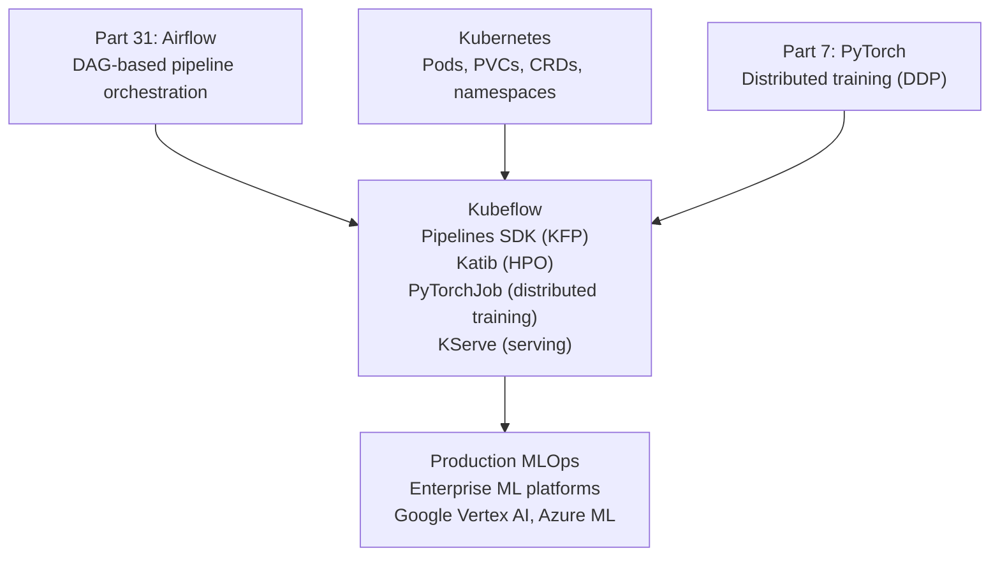

<!-- TEACHING_ORDER: verified -->
# Part 32: Kubeflow

> **Prerequisites:** Part 31 (Airflow — ML pipeline concepts), Kubernetes basics (Pods, PVCs), Part 7 (PyTorch training)
> **Used later in:** Enterprise MLOps platforms, distributed training orchestration on K8s
> **Version anchor:** Kubeflow 1.9.x (mid-2026), Kubeflow Pipelines 2.x SDK stable

---

## Why This Library Exists

### The problem: Airflow is general-purpose; ML teams need Kubernetes-native ML orchestration

Airflow runs tasks as Python functions or shell commands on Airflow workers. For ML, this means: model training runs on Airflow's own servers (hard to scale), GPU allocation is manual, artifact storage is ad-hoc, and distributed training (multi-GPU, multi-node) requires custom operator code.

Google open-sourced Kubeflow in 2018 to address this. Kubeflow is built specifically for ML on Kubernetes:
- **Kubeflow Pipelines:** Define ML workflows as Python SDK DSL, executed as Kubernetes Pods
- **Katib:** Kubernetes-native hyperparameter tuning (like Ray Tune but K8s-first)
- **Training Operators:** Kubernetes-native distributed training (PyTorchJob, TFJob, MPIJob)
- **KServe:** Model serving (Part 34)

The key difference from Airflow: each Kubeflow pipeline step runs as an isolated Kubernetes Pod, automatically requesting the correct GPU resources. No Airflow worker setup needed.

---

## Explain Like I Am 10

Airflow is like a kitchen where all chefs (tasks) work in one big room. Kubeflow is like a kitchen where each recipe step gets its own dedicated cooking station (Kubernetes Pod) with exactly the equipment it needs. Need a 3D oven for training? The kitchen manager (Kubernetes scheduler) sets up a 3D oven pod automatically. When training is done, the pod disappears, and resources are freed.

---

## Mental Model

**Kubeflow is a Kubernetes-native ML platform: each pipeline step runs as an isolated Pod, steps share data via Kubernetes PersistentVolumeClaims, GPU resources are allocated per-step, and the entire ML lifecycle (pipeline, hyperparameter tuning, distributed training, serving) is managed as Kubernetes custom resources.**

---

## Learning Dependency Graph



---

## Core Concepts

### 1. Kubeflow Pipelines: component and pipeline

```python
from kfp import dsl
from kfp.dsl import component, pipeline, Dataset, Model, Output, Input

# Define a component (runs as a K8s Pod)
@component(
    base_image="python:3.11",
    packages_to_install=["pandas", "scikit-learn"],
)
def train_model(
    dataset_path: str,
    model_output: Output[Model],
    n_estimators: int = 100,
) -> float:
    """Trains a model — runs as a Kubernetes Pod."""
    import pandas as pd
    from sklearn.ensemble import RandomForestClassifier
    from sklearn.model_selection import train_test_split
    import joblib, os

    df = pd.read_csv(dataset_path)
    X, y = df.drop("target", axis=1), df["target"]
    X_tr, X_te, y_tr, y_te = train_test_split(X, y, test_size=0.2)

    model = RandomForestClassifier(n_estimators=n_estimators, random_state=42)
    model.fit(X_tr, y_tr)
    accuracy = model.score(X_te, y_te)

    os.makedirs(model_output.path, exist_ok=True)
    joblib.dump(model, f"{model_output.path}/model.pkl")
    return accuracy


@component(base_image="python:3.11", packages_to_install=["requests"])
def download_data(url: str, dataset_output: Output[Dataset]):
    import urllib.request, os
    os.makedirs(os.path.dirname(dataset_output.path), exist_ok=True)
    urllib.request.urlretrieve(url, dataset_output.path)


# Define pipeline (DAG of components)
@pipeline(name="ml-training-pipeline")
def training_pipeline(
    data_url: str = "https://example.com/data.csv",
    n_estimators: int = 100,
):
    download_task = download_data(url=data_url)

    train_task = train_model(
        dataset_path=download_task.outputs["dataset_output"],
        n_estimators=n_estimators,
    )
    train_task.set_gpu_limit(1)         # request 1 GPU for this pod
    train_task.set_memory_limit("8G")
    train_task.set_retry(max_retries=2)


# Submit to Kubeflow Pipelines server
import kfp
client = kfp.Client(host="http://kubeflow-host:8080")
client.create_run_from_pipeline_func(
    training_pipeline,
    arguments={"data_url": "s3://my-bucket/data.csv", "n_estimators": 200},
)
```

### 2. Distributed training with PyTorchJob

Kubeflow's Training Operator enables distributed PyTorch training on K8s:

```yaml
# pytorchjob.yaml
apiVersion: "kubeflow.org/v1"
kind: PyTorchJob
metadata:
  name: llama-finetune
spec:
  pytorchReplicaSpecs:
    Master:
      replicas: 1
      template:
        spec:
          containers:
          - name: pytorch
            image: pytorch/pytorch:2.6-cuda12.1-cudnn9-runtime
            command:
            - torchrun
            - --nproc_per_node=4
            - train.py
            resources:
              limits:
                nvidia.com/gpu: 4
    Worker:
      replicas: 3  # 4 workers × 4 GPUs = 16 GPUs total
      template:
        spec:
          containers:
          - name: pytorch
            image: pytorch/pytorch:2.6-cuda12.1-cudnn9-runtime
            command: [torchrun, --nproc_per_node=4, train.py]
            resources:
              limits:
                nvidia.com/gpu: 4
```

```bash
kubectl apply -f pytorchjob.yaml
kubectl get pytorchjobs
```

### 3. Katib: hyperparameter tuning

```yaml
# katib-experiment.yaml
apiVersion: kubeflow.org/v1beta1
kind: Experiment
metadata:
  name: hp-tuning-experiment
spec:
  objective:
    type: maximize
    goal: 0.95
    objectiveMetricName: val_accuracy
  algorithm:
    algorithmName: bayesianoptimization
  parameters:
  - name: lr
    parameterType: double
    feasibleSpace: {min: "0.0001", max: "0.01"}
  - name: hidden_size
    parameterType: int
    feasibleSpace: {min: "64", max: "512"}
  parallelTrialCount: 4     # run 4 trials in parallel
  maxTrialCount: 20
  trialTemplate:
    spec:
      containers:
      - name: training
        image: my-training-image:latest
        command: ["python", "train.py", "--lr=${trialParameters.lr}"]
```

---

## Essential APIs

```python
import kfp
from kfp import dsl
from kfp.dsl import component, pipeline, Dataset, Model, Output, Input

# Component definition
@component(base_image="...", packages_to_install=[...])
def my_component(input_param: str, output: Output[Dataset]) -> float:
    ...

# Pipeline definition
@pipeline(name="pipeline-name")
def my_pipeline(param: str = "default"):
    step1 = my_component(input_param=param)
    step2 = another_component(data=step1.outputs["output"])
    step2.set_gpu_limit(1)
    step2.set_cpu_limit("4")
    step2.set_memory_limit("16G")

# Compile
kfp.compiler.Compiler().compile(my_pipeline, "pipeline.yaml")

# Submit
client = kfp.Client(host="http://kubeflow-pipelines:8080")
run = client.create_run_from_pipeline_func(my_pipeline, arguments={})
run.wait_for_run_completion(timeout=3600)
```

---

## Beginner Examples

### Example 1: Local pipeline test (without K8s)

```python
# Kubeflow Pipelines can be tested locally
from kfp import dsl
from kfp.dsl import component

@component(packages_to_install=["pandas", "scikit-learn"])
def train_and_evaluate(n_estimators: int) -> float:
    from sklearn.datasets import load_iris
    from sklearn.ensemble import RandomForestClassifier
    from sklearn.model_selection import cross_val_score
    X, y = load_iris(return_X_y=True)
    model = RandomForestClassifier(n_estimators=n_estimators, random_state=42)
    scores = cross_val_score(model, X, y, cv=5)
    val_acc = float(scores.mean())
    print(f"n_estimators={n_estimators}: val_acc={val_acc:.4f}")
    return val_acc

@dsl.pipeline(name="iris-pipeline")
def iris_pipeline(n_estimators: int = 100):
    train_and_evaluate(n_estimators=n_estimators)

# Compile to YAML (can then submit to Kubeflow cluster)
from kfp import compiler
compiler.Compiler().compile(iris_pipeline, "iris_pipeline.yaml")
print("Pipeline compiled to iris_pipeline.yaml")
print("Submit with: kfp.Client(host='...').create_run_from_pipeline_func(iris_pipeline)")
```

---

## Internal Interview Knowledge

**Q: What is the core difference between Kubeflow Pipelines and Airflow?**
Strong answer: "Airflow executes tasks as Python functions on shared Airflow worker processes — all tasks share the same Python environment and hardware. Kubeflow Pipelines executes each step as an isolated Kubernetes Pod with its own Docker image, resource limits (CPU, GPU, memory), and filesystem. This enables: (1) Different environments per step — data preprocessing in a pandas container, training in a PyTorch container. (2) Automatic GPU allocation — set `set_gpu_limit(1)` per component. (3) Natural integration with Kubernetes RBAC, resource quotas. Airflow is simpler and more mature; Kubeflow is better for Kubernetes-native ML teams needing fine-grained resource control."

**Q: What is a Kubeflow Training Operator and when would you use it?**
Strong answer: "Training Operators (formerly TF/PyTorch/MPI Operator) extend Kubernetes with ML-specific distributed training primitives. A `PyTorchJob` CRD defines a distributed training job with master and worker replicas — Kubeflow creates the Pods, sets up `MASTER_ADDR`/`MASTER_PORT`/`WORLD_SIZE` environment variables, and manages the lifecycle. Use when: fine-tuning a 70B model across 16 GPUs on Kubernetes, running distributed hyperparameter search, or integrating training into a Kubeflow Pipeline. For single-GPU training, a regular Pod or Kubeflow Pipeline component is sufficient."

---

## Production AI Usage

**Google (Vertex AI):** Google's Vertex AI Pipelines is built on KFP SDK — the same Python SDK as Kubeflow Pipelines. Google uses Kubeflow internally for its ML infrastructure.

**Airbus:** Uses Kubeflow for aerospace ML workflows and model training at scale on their private Kubernetes infrastructure.

**Bloomberg:** Bloomberg's ML engineering team uses Kubeflow Pipelines for financial ML model training pipelines.

---

## Cheat Sheet

```python
from kfp.dsl import component, pipeline
from kfp import compiler, Client

@component(base_image="python:3.11", packages_to_install=["scikit-learn"])
def train(n: int) -> float:
    from sklearn.datasets import load_iris
    from sklearn.ensemble import RandomForestClassifier
    X, y = load_iris(return_X_y=True)
    return float(RandomForestClassifier(n).fit(X, y).score(X, y))

@pipeline(name="demo")
def my_pipeline(n: int = 100):
    t = train(n=n)
    t.set_cpu_limit("2")
    t.set_memory_limit("4G")

compiler.Compiler().compile(my_pipeline, "pipeline.yaml")
# client = Client(host="http://kubeflow:8080")
# client.create_run_from_pipeline_func(my_pipeline, arguments={"n": 200})
```

---

## Interview Question Bank

**Q1: What is Kubeflow and how does it relate to Kubernetes?** A: Kubeflow is an open-source ML platform built on top of Kubernetes. It uses Kubernetes Custom Resource Definitions (CRDs) to add ML-specific primitives: Pipelines (ML workflow DAGs), PyTorchJob/TFJob (distributed training), Katib (hyperparameter tuning), KServe (model serving). Kubernetes provides container scheduling, resource management, and storage; Kubeflow provides the ML workflow layer on top.

**Q2: What is a KFP component?** A: A Kubeflow Pipelines component is a Python function decorated with `@component` that runs as an isolated Docker container. The decorator specifies the base Docker image and Python packages. Inputs/outputs use typed annotations (`Input[Dataset]`, `Output[Model]`). Data is passed between components via Kubernetes PersistentVolumeClaims or cloud storage paths. The component is compiled to a container spec that runs on any KFP-compatible backend.

**Q3: What is Katib and how does it compare to Ray Tune?** A: Katib is Kubeflow's hyperparameter optimization system. It runs trials as Kubernetes Pods, manages experiment state as K8s CRDs, and supports algorithms: random search, grid search, Bayesian optimization (via Hyperopt), and population-based training. Compare to Ray Tune: Ray Tune is more mature, Python-first (no K8s required), has more algorithm choices, and easier to use. Katib is better when you are already on Kubernetes and want hyperparameter tuning integrated with the K8s ecosystem (RBAC, quotas, GitOps).

**Q4: How do you pass data between Kubeflow Pipeline components?** A: Via typed output objects: `Output[Dataset]` creates a path in a PVC or cloud storage bucket. The upstream component writes to `dataset_output.path`; the downstream component receives the same path in `Input[Dataset]`. For small scalar data (accuracy floats, config dicts), return them as Python return values (passed via Kubeflow's metadata store). Large datasets always use `Output[Dataset]` paths.

**Q5: What is the advantage of Kubeflow's component isolation vs Airflow workers?** A: Each component gets its own Docker image and resource spec — you can use a pandas container for preprocessing and a PyTorch container for training in the same pipeline without environment conflicts. Resource limits are enforced by Kubernetes (the training component won't accidentally consume all memory). GPU allocation is declarative — `set_gpu_limit(1)` ensures the training Pod gets a dedicated GPU from the cluster's GPU pool. Airflow workers share an environment; this requires careful dependency management.

**Q6 (Scenario): A Kubeflow Pipeline component that runs GPU training fails with "insufficient nvidia.com/gpu" even though GPU nodes are visible in the cluster. What are the likely causes?** A: (1) The component spec doesn't request GPUs: set_gpu_limit(1) must be called on the component ContainerOp. Without this, Kubernetes won't schedule to GPU nodes (taint/toleration mismatch). (2) The GPU node has a taint (
vidia.com/gpu=present:NoSchedule) and the Pod needs a matching toleration — add via dd_toleration. (3) The GPU node pool is a separate Kubernetes node pool — verify the node selector matches. (4) All GPUs in the pool are already allocated — check cluster capacity.

**Q7 (Failure): Your Kubeflow Pipeline run hangs at a component that reads from a PVC. The component Pod shows "Running" but no logs. What's happening?** A: The PVC is in Pending state — the component's Pod is waiting for the PersistentVolumeClaim to be bound to a PersistentVolume. This happens when: (1) No matching PersistentVolume exists (wrong storage class, size, or access mode). (2) The StorageClass provisioner is not running. (3) The PVC is requesting ReadWriteMany but the storage backend only supports ReadWriteOnce. Check kubectl describe pvc for the binding failure reason.

**Q8 (Scenario): You need to run Kubeflow hyperparameter tuning (Katib) with 100 trials but the cluster only has 8 GPUs. How do you configure this to avoid wasting resources?** A: Set parallelTrialCount=8 (max concurrent trials = available GPUs). Katib will run 8 trials simultaneously, start the next trial as each completes. Set maxTrialCount=100 total. Use ASHA (Hyperband) early stopping algorithm: lgorithmName: hyperband with min_resource=10 (stop poor trials after 10 epochs). This kills bad trials early, freeing GPUs for more promising configurations — effectively evaluating more configurations than 100 sequential trials with the same compute budget.

**Q9 (Scenario): After migrating from Airflow to Kubeflow Pipelines, the team complains that debugging failed pipeline runs is much harder. What's the operational difference?** A: In Airflow: task logs stream to the Airflow UI in near real-time, easily accessible. In Kubeflow: each component is a separate Kubernetes Pod — logs are in kubectl logs (or the KFP UI's step logs, but these may truncate). For debugging: (1) Use kubectl logs <pod-name> -n kubeflow for full logs. (2) Add explicit artifact logging: write intermediate DataFrames to output paths for inspection. (3) Use ContainerOp's ile_outputs to capture any error outputs. (4) Add structured logging (JSON) in components so logs are queryable in Cloud Logging.

**Q10 (Failure): A Kubeflow Pipeline that was working for 3 months suddenly fails on a component that loads a model from GCS. The error is "403 Forbidden." What changed?** A: Service account permission was revoked or changed. Kubeflow Pipeline components run as Kubernetes ServiceAccounts that need Workload Identity (GKE) binding to a GCP service account with GCS read permissions. Possible causes: (1) The GCP service account's roles were modified. (2) The Kubernetes ServiceAccount → GCP SA binding was deleted. (3) The GCS bucket's IAM policy changed. Check kubectl describe pod <component-pod> for the service account, then verify its GCP IAM bindings with gcloud iam service-accounts get-iam-policy.

## Quality Checklist

- [x] Easy English used
- [x] Problem explained (Airflow limitations for K8s-native ML)
- [x] History explained (Google, 2018, Kubernetes-native)
- [x] Mental model explained (dedicated cooking stations vs shared kitchen)
- [x] Learning Dependency Graph included
- [x] Core Concepts: Pipelines SDK, PyTorchJob, Katib, component isolation
- [x] Essential APIs included
- [x] Beginner Example (compiled pipeline)
- [x] Internal Interview Knowledge included
- [x] Production AI Usage included
- [x] Cheat Sheet + Interview Questions included

*[Back to handbook](README.md)*
