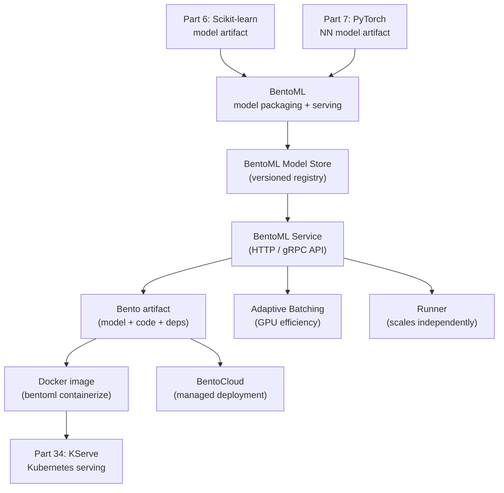

<!-- TEACHING_ORDER: verified -->
# Part 33: BentoML

> **Prerequisites:** Part 7 (PyTorch — model artifacts), Part 6 (Scikit-learn), REST API basics
> **Used later in:** Part 34 (KServe as Kubernetes serving layer above BentoML), production model deployment
> **Version anchor:** BentoML 1.4.x (mid-2026), BentoCloud stable

---

## Why This Library Exists

### The problem: packaging and serving a trained ML model requires a lot of boilerplate

After training a model, deploying it as an API requires: wrapping it in Flask/FastAPI, serializing with joblib/torch.save, managing Python environments, building Docker images, handling batching for GPU efficiency, and monitoring. Each framework (sklearn, PyTorch, ONNX, LLM) needs different handling.

Chaoyu Yang and the team in San Francisco founded BentoML (2019) with the insight that model packaging and serving should be a first-class ML primitive — not something teams reinvent from scratch. BentoML provides:
- **Service:** a Python class that wraps any model for serving (auto HTTP API, WebSocket, gRPC)
- **Bento:** a self-contained package (model + code + dependencies) that builds into a Docker image
- **Batching:** automatic request batching for GPU efficiency
- **Multi-model serving:** chain models in one service

---

## Explain Like I Am 10

You've baked the perfect cake (trained a model). Now you need to serve it at a birthday party (API serving). Without BentoML: you buy plates, hire servers, set up a buffet table, learn food safety regulations. With BentoML: you describe your cake and BentoML packages it in a ready-to-serve box, complete with instructions. Anyone with the box can serve the cake perfectly.

---

## Mental Model

**BentoML packages any ML model (sklearn, PyTorch, ONNX, LLMs) into a standardized Bento artifact and generates a production-ready HTTP/gRPC service with automatic batching, schema validation, and Docker packaging.**

---

## Learning Dependency Graph



---

## Core Concepts

### 1. Saving and serving a model

```python
import bentoml
from sklearn.datasets import load_iris
from sklearn.ensemble import RandomForestClassifier

# Train model
X, y = load_iris(return_X_y=True)
model = RandomForestClassifier(n_estimators=100, random_state=42).fit(X, y)

# Save to BentoML model store (versioned)
bento_model = bentoml.sklearn.save_model(
    "iris-classifier",
    model,
    signatures={"predict": {"batchable": True, "batch_dim": 0}},
    metadata={"accuracy": model.score(X, y), "framework": "sklearn"},
)
print(f"Saved model: {bento_model.tag}")  # iris-classifier:abc123
```

```python
# service.py
import bentoml
import numpy as np
from pydantic import BaseModel

class IrisRequest(BaseModel):
    features: list[list[float]]   # [[f1, f2, f3, f4], ...]

# Load model
iris_runner = bentoml.sklearn.get("iris-classifier:latest").to_runner()

svc = bentoml.Service("iris-service", runners=[iris_runner])

@svc.api(input=bentoml.io.JSON(pydantic_model=IrisRequest),
         output=bentoml.io.JSON())
async def predict(request: IrisRequest):
    features = np.array(request.features, dtype=np.float32)
    predictions = await iris_runner.predict.async_run(features)
    return {"predictions": predictions.tolist()}
```

```bash
# Run the service locally
bentoml serve service:svc --reload

# Build a Bento (self-contained package)
bentoml build

# Containerize
bentoml containerize iris-service:latest
docker run -p 3000:3000 iris-service:latest
```

### 2. PyTorch model serving

```python
import bentoml
import torch
import torch.nn as nn
from PIL import Image

# Save PyTorch model
class MyModel(nn.Module):
    def forward(self, x): return x

model = MyModel()
bentoml.pytorch.save_model("my-model", model,
                            signatures={"__call__": {"batchable": True}})

# Service
import bentoml
from bentoml.io import Image, NumpyNdarray

runner = bentoml.pytorch.get("my-model:latest").to_runner()
svc    = bentoml.Service("image-classifier", runners=[runner])

@svc.api(input=Image(), output=NumpyNdarray())
async def classify(image: Image.Image):
    tensor = preprocess(image)
    return await runner.async_run(tensor)
```

### 3. LLM serving with BentoML

```python
import bentoml
from bentoml.io import Text

@bentoml.service(
    resources={"gpu": 1, "memory": "8Gi"},
    traffic={"timeout": 60},
)
class LLMService:
    def __init__(self):
        from vllm import LLM, SamplingParams
        self.llm    = LLM(model="meta-llama/Llama-3.2-1B", dtype="bfloat16")
        self.params = SamplingParams(temperature=0.8, max_tokens=200)

    @bentoml.api
    def generate(self, prompt: str) -> str:
        outputs = self.llm.generate([prompt], self.params)
        return outputs[0].outputs[0].text

# Deploy to BentoCloud:
# bentoml deploy -n llm-service --instance-type gpu.a10g.1
```

---

## Essential APIs

```python
import bentoml

# Save models
bentoml.sklearn.save_model("name", model, signatures={...}, metadata={...})
bentoml.pytorch.save_model("name", model)
bentoml.transformers.save_model("name", pipeline)
bentoml.onnx.save_model("name", onnx_model)

# Load and create runner
runner = bentoml.sklearn.get("name:latest").to_runner()
runner = bentoml.sklearn.get("name:version_hash").to_runner()

# Service definition
svc = bentoml.Service("service-name", runners=[runner])

@svc.api(input=bentoml.io.JSON(), output=bentoml.io.JSON())
async def endpoint(input_data):
    result = await runner.predict.async_run(input_data)
    return result

# CLI
# bentoml serve service:svc
# bentoml build         → creates .bento package
# bentoml containerize name:version
# bentoml models list
# bentoml models delete name:version
```

---

## Beginner Examples

### Example 1: End-to-end sklearn model service

```python
import bentoml
import numpy as np
from sklearn.datasets import make_classification
from sklearn.ensemble import GradientBoostingClassifier
from sklearn.model_selection import train_test_split

# Train
X, y = make_classification(n_samples=1000, n_features=10, random_state=42)
X_tr, X_te, y_tr, y_te = train_test_split(X, y, test_size=0.2, random_state=0)
model = GradientBoostingClassifier(n_estimators=100).fit(X_tr, y_tr)
acc = model.score(X_te, y_te)
print(f"Test accuracy: {acc:.4f}")

# Save to BentoML
saved_model = bentoml.sklearn.save_model(
    "fraud-detector",
    model,
    signatures={"predict": {"batchable": True, "batch_dim": 0},
                "predict_proba": {"batchable": True}},
    metadata={"accuracy": acc, "n_features": 10},
)
print(f"Saved: {saved_model.tag}")

# Retrieve and test
loaded_model = bentoml.sklearn.load_model("fraud-detector:latest")
sample = np.random.rand(3, 10)
print(f"Predictions: {loaded_model.predict(sample)}")
print(f"Probabilities: {loaded_model.predict_proba(sample)[:, 1].round(3)}")

# List models
print("\nAll saved models:")
for m in bentoml.models.list():
    print(f"  {m.tag}  (created: {m.info.creation_time})")
```

---

## Internal Interview Knowledge

**Q: What is a BentoML runner and why is it separate from the service?**
Strong answer: "A runner wraps a model for scalable execution — it manages a pool of model replicas and exposes async/sync inference methods. The Service handles HTTP routing and request parsing; Runners handle model inference. This separation enables: (1) Scaling runners independently from the web server — 1 web server, 4 GPU runner replicas. (2) Multiple runners in one service — `svc = bentoml.Service('multi-model', runners=[embedding_runner, reranker_runner])`. (3) Async inference — `await runner.predict.async_run(data)` is non-blocking, enabling concurrent request handling while GPU is busy."

---

## Production AI Usage

**Nvidia:** Uses BentoML patterns for packaging and serving models from the NGC model catalog.

**Tripadvisor:** Uses BentoML for NLP model serving in their recommendation systems.

---

## Cheat Sheet

```python
import bentoml, numpy as np

# Save
bentoml.sklearn.save_model("name", model,
    signatures={"predict": {"batchable": True, "batch_dim": 0}})

# Service
runner = bentoml.sklearn.get("name:latest").to_runner()
svc    = bentoml.Service("api", runners=[runner])

@svc.api(input=bentoml.io.NumpyNdarray(), output=bentoml.io.NumpyNdarray())
async def predict(X: np.ndarray):
    return await runner.predict.async_run(X)

# bentoml serve service:svc
# bentoml build
# bentoml containerize name:version
```

---

## Interview Question Bank

**Q1: What problem does BentoML solve?** A: BentoML standardizes ML model packaging and serving. It saves any trained model (sklearn, PyTorch, ONNX, LLM) in a versioned model store, generates HTTP/gRPC APIs with input validation, handles automatic request batching for GPU efficiency, and packages everything (model + code + dependencies) into a Docker-buildable Bento artifact. Teams use it to avoid writing Flask boilerplate and manually managing model versions.

**Q2: What is a Bento?** A: A Bento is a self-contained package created by `bentoml build`. It includes: the model (from the BentoML model store), the service code, all Python dependencies (generated `requirements.txt`), and metadata. Running `bentoml containerize` builds a Docker image from the Bento. The Docker image runs the BentoML server directly — no separate setup needed. This makes deployment reproducible: the same Bento runs identically on a laptop or Kubernetes.

**Q3: What is adaptive batching in BentoML?** A: When a model endpoint receives multiple requests concurrently, adaptive batching collects requests into a batch before running inference — GPUs are much more efficient processing a batch of 32 inputs than 32 separate inputs. Configure with `signatures={"predict": {"batchable": True, "batch_dim": 0, "max_batch_size": 32, "max_latency_ms": 50}}`. BentoML dynamically adjusts batch size based on arrival rate and latency target.

**Q4: How does BentoML compare to FastAPI for model serving?** A: FastAPI: full flexibility, no ML-specific features, you write all the serving code. Good for complex business logic. BentoML: opinionated, ML-specific (model store, runners, batching, containerization), less flexibility but much less boilerplate. BentoML generates FastAPI/Starlette routes internally. Choose FastAPI for complex APIs with non-standard logic; choose BentoML when the core task is model inference serving.

**Q5: What is BentoCloud?** A: BentoCloud is the managed cloud platform for BentoML. Deploy a Bento with `bentoml deploy` and BentoCloud handles: container builds, auto-scaling (scale to zero when idle, scale out under load), GPU allocation, traffic routing, and monitoring. Pay per inference. Useful for teams that don't want to manage Kubernetes but need production-grade model serving.

**Q6 (Scenario): A BentoML service with adaptive batching is showing high latency spikes at P99 even though average latency is fine. Users on slow connections trigger timeouts. What's happening?** A: The max_latency_ms setting for batching is waiting up to 50ms to accumulate a batch. Fast users get batched with slow users — the batch can't start until the slowest request arrives or the timeout fires. Fix: (1) Lower max_latency_ms to match your P99 SLA budget (e.g., 20ms). (2) Separate fast (small inputs) and slow (large inputs) request queues with different batching configs. (3) Monitor atch_size histogram — if most batches are size 1, the latency wait is pure overhead without batching benefit; disable batching.

**Q7 (Failure): After entoml containerize and deploying to Kubernetes, the container starts but crashes immediately with "model not found." The same Bento worked locally. What happened?** A: The model was saved to the local BentoML model store (e.g., ~/.bentoml/models/) but not properly included in the Bento. Fix: verify that entoml.get("my_model:latest") is called inside the service.py module-level code (not inside a function), so BentoML's build process detects and bundles the model. Run entoml models list inside the container to verify the model is present. Alternatively, use entoml build --containerize which validates model inclusion before containerizing.

**Q8 (Scenario): Your BentoML service handles both fast (text classification, ~10ms) and slow (LLM generation, ~2s) endpoints. Under peak load, slow LLM requests are starving fast classification requests. How do you fix this?** A: Separate the services: deploy ClassificationService and LLMService as independent BentoML services with separate replicas and resource configs. The LLM service gets GPU runners with high replicas; the classification service gets CPU runners with many lightweight replicas. Use an API gateway to route requests to the correct service. This prevents resource contention and enables independent autoscaling.

**Q9 (Scenario): You need to roll back a BentoML model from v5 to v3 in production after discovering a regression. The service is already running with v5. What's the fastest path?** A: BentoML model versioning: (1) Tag v3 as the new "production" model: entoml.models.get("my_model:v3").alias("production"). (2) Update the service to load via alias: model = bentoml.models.get("my_model:production"). (3) Rebuild the Bento and redeploy. For faster rollback without rebuilding: if you pinned the model version in the Bento, you must rebuild. This is why production Bentos should use model aliases ("production", "stable") rather than exact version tags — alias updates don't require a Bento rebuild.

**Q10 (Failure): A BentoML service's memory usage grows by 2GB every hour until OOM crash. The model itself is only 500MB. What's leaking?** A: Likely culprits: (1) The batch dimension is accumulating in-memory state — check if any class-level list/dict is being appended to during inference without being cleared. (2) PyTorch gradient computation is not disabled — wrapping inference in 	orch.no_grad() prevents gradient tape from accumulating. (3) Input/output logging is buffering all requests in memory. (4) The model's KV cache (for LLMs) is not being evicted between requests. Profile with 	racemalloc or memory_profiler to identify the growing allocation.

## Quality Checklist

- [x] Easy English used
- [x] Problem explained (model packaging and serving boilerplate)
- [x] History explained (Chaoyu Yang, San Francisco, 2019)
- [x] Mental model explained (ready-to-serve cake box)
- [x] Learning Dependency Graph included
- [x] Core Concepts: Service, Bento, runner, batching, LLM serving
- [x] Essential APIs included
- [x] Beginner Example (end-to-end sklearn service)
- [x] Internal Interview Knowledge included
- [x] Production AI Usage included
- [x] Cheat Sheet + Interview Questions included

*[Back to handbook](README.md)*
