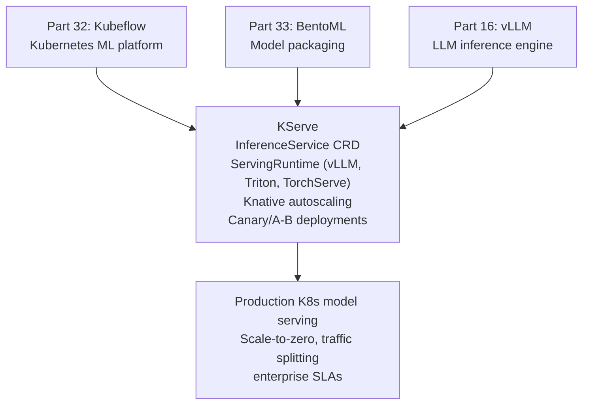

<!-- TEACHING_ORDER: verified -->
# Part 34: KServe

> **Prerequisites:** Part 32 (Kubeflow — Kubernetes ML platform), Part 33 (BentoML — model serving concepts), Part 16 (vLLM)
> **Used later in:** Enterprise production ML serving, model A/B testing, canary deployments
> **Version anchor:** KServe 0.14.x (mid-2026), ModelMesh and Serverless serving stable

---

## Why This Library Exists

### The problem: serving models on Kubernetes requires deep expertise in networking, scaling, and routing

BentoML and vLLM solve the inference problem. But deploying them on Kubernetes requires: Ingress configuration, HPA (horizontal pod autoscaler) setup, rolling deployments, canary traffic splitting, A/B test routing, GPU resource management, model version management, and monitoring. Each framework needs different Kubernetes manifests.

KServe (formerly KFServing, originally part of Kubeflow) provides a **Kubernetes-native model serving abstraction**: define a model in a YAML CRD (`InferenceService`), and KServe handles the Kubernetes complexity. It supports any serving runtime (vLLM, TorchServe, Triton, BentoML, ONNX Runtime) with a unified API and automatic autoscaling via Knative.

---

## Explain Like I Am 10

BentoML packages your cake into a box. KServe is the restaurant chain. You give KServe your box, and it: puts the cake on display in the right store (Kubernetes Pod), adjusts how many cakes to make based on demand (autoscaling), routes new customers to try the new recipe first (canary), and shows you how many cakes were served (metrics) — all automatically.

---

## Mental Model

**KServe is a Kubernetes-native model serving platform: you declare what model to serve (InferenceService CRD), KServe manages the Pods, autoscaling (scale to zero when idle), traffic routing for A/B tests, and monitoring — abstracting all Kubernetes complexity.**

---

## Learning Dependency Graph



---

## Core Concepts

### 1. InferenceService CRD

The core KServe primitive — deploy any model in one YAML:

```yaml
# sklearn-inference.yaml
apiVersion: "serving.kserve.io/v1beta1"
kind: InferenceService
metadata:
  name: fraud-detector
  namespace: kserve-test
spec:
  predictor:
    model:
      modelFormat:
        name: sklearn
      storageUri: "s3://my-bucket/models/fraud-detector"
      resources:
        requests:
          cpu: "1"
          memory: "1Gi"
        limits:
          memory: "2Gi"
```

```bash
kubectl apply -f sklearn-inference.yaml

# Check status
kubectl get inferenceservice fraud-detector

# Get endpoint URL
export HOST=$(kubectl get ingress -n kserve-test -o jsonpath='{.items[0].status.loadBalancer.ingress[0].hostname}')
curl -H "Host: fraud-detector.kserve-test.example.com" \
     http://$HOST/v2/models/fraud-detector/infer \
     -d '{"inputs": [{"name": "features", "shape": [1, 10], "datatype": "FP32", "data": [...]}]}'
```

### 2. vLLM LLM serving with KServe

```yaml
# llm-serving.yaml
apiVersion: serving.kserve.io/v1beta1
kind: InferenceService
metadata:
  name: llama-3-1b
spec:
  predictor:
    model:
      modelFormat:
        name: vllm
      storageUri: "hf://meta-llama/Llama-3.2-1B"
      args:
        - --max-model-len=4096
        - --dtype=bfloat16
      resources:
        limits:
          nvidia.com/gpu: "1"
          memory: "16Gi"
```

### 3. Canary deployments and A/B testing

```yaml
# canary-ab.yaml
apiVersion: serving.kserve.io/v1beta1
kind: InferenceService
metadata:
  name: model-ab-test
spec:
  predictor:
    canaryTrafficPercent: 20    # 20% → new model, 80% → stable
    model:
      modelFormat: {name: pytorch}
      storageUri: "s3://bucket/model-v2"   # new model (20%)
  predictor:
    model:
      modelFormat: {name: pytorch}
      storageUri: "s3://bucket/model-v1"   # stable model (80%)
```

### 4. Custom ServingRuntime

```yaml
apiVersion: serving.kserve.io/v1alpha1
kind: ServingRuntime
metadata:
  name: vllm-runtime
spec:
  containers:
  - name: kserve-container
    image: vllm/vllm-openai:v0.6.0
    command: ["python", "-m", "vllm.entrypoints.openai.api_server"]
    args:
      - --model=$(STORAGE_URI)
      - --port=8080
  grpcDataEndpoint: "port:8001"
  protocolVersions: [v2, grpc-v2]
  supportedModelFormats:
    - name: vllm
      version: "1"
      autoSelect: true
```

### 5. Python client

```python
import requests
import json

# KServe V2 inference protocol
endpoint = "http://fraud-detector.kserve-test.example.com/v2/models/fraud-detector/infer"
payload  = {
    "inputs": [{
        "name":     "features",
        "shape":    [1, 10],
        "datatype": "FP32",
        "data":     [0.1, 0.5, 0.3, 0.7, 0.2, 0.8, 0.4, 0.6, 0.9, 0.1],
    }]
}
response = requests.post(endpoint, json=payload)
print(response.json())

# OpenAI-compatible endpoint (LLM models)
from openai import OpenAI
client = OpenAI(base_url="http://llama-3-1b.kserve-test.example.com/v1", api_key="none")
resp   = client.chat.completions.create(
    model="llama-3-1b",
    messages=[{"role": "user", "content": "Hello!"}],
)
```

---

## Essential APIs

```yaml
# InferenceService minimal
apiVersion: "serving.kserve.io/v1beta1"
kind: InferenceService
metadata: {name: NAME, namespace: NAMESPACE}
spec:
  predictor:
    model:
      modelFormat: {name: sklearn|pytorch|triton|vllm|onnx}
      storageUri: "s3://... | gs://... | hf://..."
      resources:
        limits:
          memory: "4Gi"
          nvidia.com/gpu: "1"
```

```bash
# KServe CLI
kubectl apply -f inference-service.yaml
kubectl get inferenceservice NAME
kubectl describe inferenceservice NAME
kubectl delete inferenceservice NAME

# Scale
kubectl patch inferenceservice NAME --type=merge \
  -p '{"spec":{"predictor":{"minReplicas":2,"maxReplicas":10}}}'
```

---

## Internal Interview Knowledge

**Q: What is the KServe V2 inference protocol and why is it important?**
Strong answer: "The V2 inference protocol (KFServing Predict/Explain v2) is a standardized HTTP/gRPC API for model inference across all ML frameworks. Request format: JSON with `inputs` array, each input having `name`, `shape`, `datatype`, `data`. Response format: `outputs` array with predictions. This standardization means: the same client code works regardless of the serving runtime (sklearn, PyTorch, Triton). It enables automatic payload validation, batching protocol, and inter-operability with monitoring tools. gRPC V2 (protobuf) is 3–5× faster than HTTP JSON for high-throughput scenarios."

**Q: How does KServe's Knative autoscaling work?**
Strong answer: "KServe uses Knative Serving for autoscaling. Knative scales Pods based on concurrent request count (not CPU/memory). Default: target 100 concurrent requests per Pod. When requests arrive and no Pods are running (scale-to-zero), Knative buffers requests, scales up a Pod (cold start ~5–30s for ML models), then routes buffered requests. Configure: `minReplicas: 0` (scale to zero, saves cost), `maxReplicas: 10`, `scaleTarget: 1` (requests/pod). KPA (Knative Pod Autoscaler) reacts to traffic bursts within seconds."

---

## Production AI Usage

**Bloomberg:** Uses KServe for production ML model serving on their Kubernetes infrastructure.

**Intuit:** Intuit's ML platform uses KServe for serving financial ML models at scale.

**Red Hat / IBM:** OpenShift AI (Red Hat's ML platform) is built on KServe for model serving.

---

## Cheat Sheet

```yaml
# Minimal InferenceService
apiVersion: "serving.kserve.io/v1beta1"
kind: InferenceService
metadata:
  name: my-model
  namespace: default
spec:
  predictor:
    model:
      modelFormat: {name: sklearn}
      storageUri: "s3://bucket/model"
      resources:
        limits: {memory: "2Gi"}
```

```python
# Client
import requests
resp = requests.post(
    "http://my-model.default.example.com/v2/models/my-model/infer",
    json={"inputs": [{"name": "in", "shape": [1, 10], "datatype": "FP32",
                      "data": features.tolist()}]},
)
print(resp.json()["outputs"])
```

---

## Interview Question Bank

**Q1: What is KServe and what problem does it solve?** A: KServe is a Kubernetes-native model serving platform. It introduces the `InferenceService` CRD — you declare what model to serve (format, storage URI, resources), and KServe manages: creating the serving Pods, exposing an HTTP/gRPC endpoint, autoscaling via Knative, canary traffic splitting for A/B tests, and model version management. It abstracts Kubernetes Ingress, HPA, and deployment complexity behind a simple YAML interface.

**Q2: What serving runtimes does KServe support?** A: KServe has built-in ServingRuntimes for: scikit-learn (MLServer), PyTorch (TorchServe), TensorFlow (TensorFlow Serving), ONNX Runtime (MLServer), XGBoost (MLServer), vLLM (for LLM serving), Triton Inference Server (for high-performance GPU serving). Custom runtimes can be registered as `ServingRuntime` CRDs. This means switching from sklearn to PyTorch serving requires changing only the `modelFormat.name` and `storageUri`.

**Q3: What is scale-to-zero in KServe?** A: With `minReplicas: 0`, KServe scales the serving Pods to zero when there are no incoming requests (saves GPU cost). When a request arrives, Knative's autoscaler creates a Pod (cold start: 10–60s depending on model size). Incoming requests are buffered during startup. After serving, if idle for `scale-down-delay` (default 60s), Pods scale back to zero. Best for: batch inference, low-traffic models, development environments. Not suitable for: real-time SLA (<100ms latency), always-on production endpoints.

**Q4: How do you perform canary deployment with KServe?** A: Set `canaryTrafficPercent: 20` in the new model's spec — 20% of traffic routes to the canary, 80% to the stable version. Monitor metrics (latency, error rate, accuracy). If the canary performs well, increase the percentage until 100% is on the new model. If it degrades, set `canaryTrafficPercent: 0` to roll back. This enables safe model updates without downtime.

**Q5: How does KServe integrate with MLflow model registry?** A: Set `storageUri: "mlflow://my-server/my-model/production"` and configure the MLflow tracking server credentials as Kubernetes secrets. KServe fetches the model artifact from the MLflow registry at startup. When a new model is promoted to "Production" in the MLflow registry, update the InferenceService storageUri to trigger a rolling deployment. This enables GitOps-style model promotion: MLflow registry → KServe deployment update.

**Q6 (Scenario): A KServe InferenceService with minReplicas: 0 takes 45 seconds on the first request (cold start) which violates your 5-second SLA. How do you fix this without always keeping pods warm?** A: (1) Set minReplicas: 1 for business hours (pre-scheduled with Kubernetes CronJob that patches the spec). Off-hours: minReplicas: 0. (2) Use a "warm-up" request: configure a liveness/readiness probe that makes a lightweight inference call after Pod startup, ensuring the model is loaded before Knative marks the replica as ready. (3) Pre-pull the model container image on nodes with a DaemonSet. (4) Use KServe's model caching — store model artifacts on local NVMe attached to GPU nodes to reduce model loading time from 30s to 5s.

**Q7 (Failure): A KServe InferenceService is in Failed state and the Pod logs show "ModelServer process exited with code 1." The model is a PyTorch model on TorchServe. What do you debug first?** A: (1) Check the model archive (.mar) format: 	orch-model-archiver must produce a valid archive with model.py, handler.py, and serialized model. A corrupted .mar gives exit code 1. (2) Verify the storage URI is accessible: the KServe storage initializer container (runs before the model server) must be able to download from storageUri. Check its logs separately: kubectl logs <pod> -c storage-initializer. (3) Check TorchServe's config.properties — mismatched model_snapshot version can cause startup failures.

**Q8 (Scenario): You need to A/B test two LLM versions in KServe — the new model should receive exactly 10% of traffic. How do you configure this?** A: Use KServe's canary deployment: in the InferenceService YAML, set canaryTrafficPercent: 10 under the new model's predictor spec. KServe uses Knative's traffic splitting to route 10% to the canary and 90% to the stable version. Monitor both versions' latency and error rates via Prometheus. If the canary performs well, increment to 50%, then 100%. For rollback: set canaryTrafficPercent: 0.

**Q9 (Scenario): Your KServe model serving costs are high because GPU nodes are idle 70% of the time due to bursty traffic patterns. How do you optimize cost without degrading SLA?** A: (1) Use minReplicas: 0 with scaleTarget configured for rapid scale-up. Accept cold start for low-priority workloads. (2) Use scaleTarget based on request queue depth rather than CPU — GPU models scale based on concurrent requests, not CPU usage. (3) Use mixed instance types: keep 1 always-on on-demand replica (meets baseline SLA) and add spot/preemptible replicas for burst traffic. (4) Enable request batching to increase throughput per GPU — batch multiple concurrent requests before GPU inference.

**Q10 (Failure): After updating a KServe InferenceService to use a new model version, all requests fail with "503 Service Unavailable" even though the new Pod is Running. What's happening?** A: The Pod is running but the model hasn't finished loading. KServe relies on Knative's readiness probe — if the readiness probe passes before the model is fully loaded and ready to serve, traffic is routed to the Pod prematurely. Fix: (1) Configure a custom readiness probe that calls a 2/health/ready endpoint which only returns 200 after the model is loaded. (2) Increase the initialDelaySeconds for the readiness probe. (3) Most model serving runtimes (Triton, TorchServe) have built-in /health/ready endpoints — ensure KServe's readiness probe is pointed at the correct path.

## Quality Checklist

- [x] Easy English used
- [x] Problem explained (K8s serving complexity, Ingress/HPA/routing boilerplate)
- [x] History explained (KFServing → KServe, Kubeflow project)
- [x] Mental model explained (restaurant chain for model boxes)
- [x] Learning Dependency Graph included
- [x] Core Concepts: InferenceService, runtimes, canary, scale-to-zero
- [x] Essential APIs included
- [x] Internal Interview Knowledge included
- [x] Production AI Usage included
- [x] Cheat Sheet + Interview Questions included

*[Back to handbook](README.md)*
