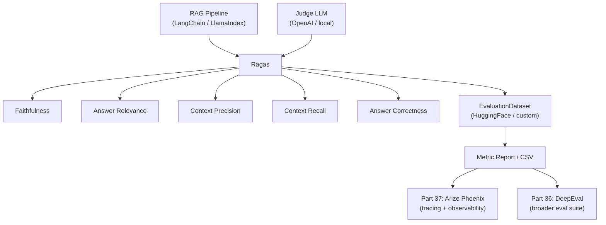
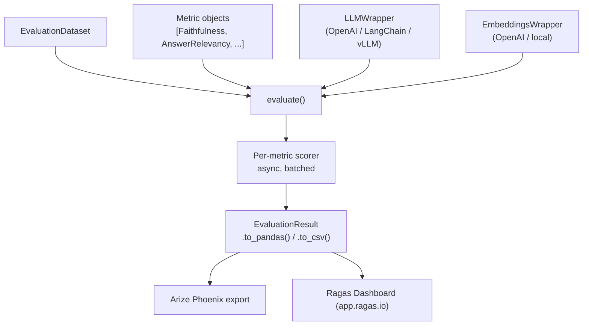

<!-- TEACHING_ORDER: verified -->
# Part 35: Ragas — RAG Evaluation Framework

> **Prerequisites:** Part 21 (LangChain), Part 24 (LlamaIndex), Part 16 (vLLM) | **Used later in:** Part 36 (DeepEval), Part 37 (Arize Phoenix) | **Version anchor:** ragas 0.2.x (mid-2026)

---

## Why This Library Exists

Retrieval-Augmented Generation (RAG) pipelines have a profound evaluation problem: conventional ML metrics like accuracy and F1 measure labels against ground truth, but a RAG answer is a free-form paragraph. How do you know if your pipeline is *actually* retrieving the right chunks? How do you know if the LLM is *faithfully* using those chunks, or hallucinating? How do you detect when your retrieval is good but your synthesis is bad—or vice versa?

Ragas (RAG Assessment) was created by Shahul Es and colleagues in 2023 to provide **reference-free, LLM-judge-based evaluation metrics** decomposed along the distinct failure modes of RAG: retrieval quality, answer faithfulness, answer relevance, and context precision. It lets you score a RAG pipeline automatically using a judge LLM, without needing human-annotated test sets for every query. This dramatically accelerates the "build → evaluate → improve" loop.

---

## Explain Like I Am 10

Imagine you built a robot tutor that answers questions by first looking things up in a book, then explaining what it found. To check if the robot is good, you need to ask three different questions:

1. **Did it find the right pages?** (Retrieval quality)
2. **Did it stick to what the pages said—or make stuff up?** (Faithfulness)
3. **Was its answer actually about the question you asked?** (Answer relevance)

Ragas is a grading rubric that automatically checks all three, using another smart robot (the judge LLM) to do the grading.

---

## Mental Model

Ragas decomposes RAG quality into **orthogonal, measurable axes** — each metric isolates one failure mode so you can diagnose *where* the pipeline breaks, not just *that* it broke.

```
Input query → [Retriever] → contexts → [Generator] → answer
                  ↑                          ↑
        Context Recall               Faithfulness
        Context Precision            Answer Relevance
        Context Relevance            Answer Correctness (needs reference)
```

---

## Learning Dependency Graph



---

## Core Concepts

### 1. The Five Core Metrics

| Metric | What it measures | Ground truth needed? |
|--------|-----------------|----------------------|
| **Faithfulness** | Does the answer contain only facts from the retrieved contexts? | No |
| **Answer Relevance** | Is the answer actually about the input question? | No |
| **Context Precision** | Are the retrieved contexts signal (relevant) or noise (irrelevant)? | Yes (ideal contexts) |
| **Context Recall** | Did retrieval cover all necessary information to answer? | Yes (reference answer) |
| **Answer Correctness** | Is the answer factually correct vs. a reference? | Yes (reference answer) |

### 2. Reference-Free vs. Reference-Required

Ragas supports two evaluation modes:

- **Reference-free:** Faithfulness + Answer Relevance only need {query, contexts, answer}. No ground truth required. Use for continuous production monitoring.
- **Reference-required:** Context Precision, Recall, Answer Correctness also need a `reference` (expected answer). Use for offline benchmark evaluation.

### 3. LLM Judge Architecture

Faithfulness works by asking the judge LLM to:
1. Extract all factual claims from the `answer`
2. For each claim, verify whether it can be inferred from `contexts`
3. `faithfulness = verified_claims / total_claims`

Answer Relevance works by asking the judge to:
1. Generate N synthetic questions that the answer is likely addressing
2. Embed each synthetic question and the original query
3. `answer_relevance = mean(cosine_similarity(synthetic_q_i, original_query))`

### 4. EvaluationDataset

Ragas operates on an `EvaluationDataset` — a list of `SingleTurnSample` objects with fields:
- `user_input` — the query string
- `retrieved_contexts` — list of context chunks
- `response` — LLM answer
- `reference` — (optional) expected answer

### 5. TestsetGenerator

Ragas can **auto-generate** a test set from your document corpus by having an LLM generate diverse questions, then adding reference answers. This removes the need for human-annotated benchmarks.

---

## Internal Architecture



**Async-first:** All metric scoring runs async under the hood via `asyncio`. For large datasets, Ragas dispatches scoring in batches to respect LLM API rate limits.

**Pluggable LLM backend:** Ragas wraps LangChain's LLM interface, so any provider—OpenAI, Anthropic, local vLLM, Ollama—works as the judge.

---

## Essential APIs

```python
from ragas import evaluate, EvaluationDataset, SingleTurnSample
from ragas.metrics import (
    Faithfulness,
    AnswerRelevancy,
    ContextPrecision,
    ContextRecall,
    AnswerCorrectness,
)
from ragas.llms import LangchainLLMWrapper
from ragas.embeddings import LangchainEmbeddingsWrapper
from langchain_openai import ChatOpenAI, OpenAIEmbeddings

# 1. Set up judge
llm    = LangchainLLMWrapper(ChatOpenAI(model="gpt-4o-mini"))
embed  = LangchainEmbeddingsWrapper(OpenAIEmbeddings())

# 2. Build dataset
samples = [
    SingleTurnSample(
        user_input="What is PagedAttention?",
        retrieved_contexts=["PagedAttention stores KV cache in non-contiguous blocks..."],
        response="PagedAttention is a memory management technique for LLM serving...",
        reference="PagedAttention manages KV cache in variable-length paged blocks.",
    )
]
dataset = EvaluationDataset(samples=samples)

# 3. Evaluate
result = evaluate(
    dataset,
    metrics=[Faithfulness(), AnswerRelevancy(), ContextRecall()],
    llm=llm,
    embeddings=embed,
)
df = result.to_pandas()

# 4. Testset generation
from ragas.testset import TestsetGenerator
from langchain_community.document_loaders import DirectoryLoader

loader = DirectoryLoader("./docs/")
docs   = loader.load()
generator = TestsetGenerator(llm=llm, embedding_model=embed)
testset   = generator.generate_with_langchain_docs(docs, testset_size=50)
```

---

## API Learning Roadmap

**Beginner (week 1):**
- Install ragas, run `evaluate()` on a toy dataset
- Understand Faithfulness + Answer Relevance (no reference needed)
- Read `result.to_pandas()`, inspect per-row scores

**Intermediate (week 2–3):**
- Add Context Precision + Recall (need reference)
- Wire ragas into your LangChain/LlamaIndex pipeline evaluation loop
- Use TestsetGenerator to create synthetic benchmarks from your corpus
- Compare before/after retriever changes with `result.to_pandas().describe()`

**Staff / Production (week 4+):**
- Swap judge LLM from OpenAI to a local fine-tuned judge via vLLM
- Integrate ragas metrics into CI (fail if faithfulness < 0.85)
- Export traces to Arize Phoenix for production drift detection
- Build custom `MetricWithLLM` subclass for domain-specific rubrics

---

## Beginner Examples

```python
# Minimal ragas evaluation — no external LLM required (uses mock judge)
from ragas import EvaluationDataset, SingleTurnSample, evaluate
from ragas.metrics import AnswerRelevancy

sample = SingleTurnSample(
    user_input="What causes rain?",
    retrieved_contexts=["Water vapor condenses in clouds and falls as precipitation."],
    response="Rain forms when water vapor in clouds condenses into droplets and falls.",
)
dataset = EvaluationDataset(samples=[sample])
# In practice, pass llm= and embeddings= to evaluate()
print(dataset.to_pandas())
```

---

## Intermediate Examples

```python
# Evaluate a real LangChain RAG pipeline on a test set
from ragas.integrations.langchain import EvaluatorChain
from ragas.metrics import Faithfulness, AnswerRelevancy, ContextRecall

# Wrap any LCEL RAG chain for automatic metric collection
evaluator = EvaluatorChain(
    chain=your_rag_chain,
    metrics=[Faithfulness(), AnswerRelevancy(), ContextRecall()],
)
results = evaluator.batch(test_questions)  # list of {"query": "..."}
print(results.metrics_df)

# Pinpoint which document chunks hurt context precision
from ragas.metrics import ContextPrecision
cp = ContextPrecision()
for sample in dataset:
    score = cp.single_turn_score(sample)
    if score < 0.5:
        print(f"  LOW PRECISION — query: {sample.user_input[:60]}")
        print(f"  Contexts: {sample.retrieved_contexts}")
```

---

## Advanced Examples

```python
# Custom metric: check if answer cites sources
from ragas.metrics.base import MetricWithLLM, SingleTurnMetric
from dataclasses import dataclass, field

@dataclass
class CitationPresence(MetricWithLLM, SingleTurnMetric):
    name: str = "citation_presence"

    async def _ascore(self, row, callbacks):
        prompt = f"""Does this answer contain explicit source citations?
Answer: {row['response']}
Reply with score 1.0 (yes) or 0.0 (no)."""
        result = await self.llm.agenerate([prompt])
        text   = result.generations[0][0].text.strip()
        return 1.0 if "1.0" in text else 0.0

result = evaluate(dataset, metrics=[CitationPresence()], llm=llm)
print(result.to_pandas()[["user_input", "citation_presence"]])


# CI gate: fail build if metrics drop
def ci_gate(result_df, thresholds):
    failures = []
    for metric, threshold in thresholds.items():
        if metric in result_df.columns:
            mean_score = result_df[metric].mean()
            if mean_score < threshold:
                failures.append(f"{metric}: {mean_score:.3f} < {threshold}")
    if failures:
        raise AssertionError("RAG quality gate FAILED:\n" + "\n".join(failures))
    print("All quality gates passed.")

ci_gate(result.to_pandas(), {
    "faithfulness":    0.85,
    "answer_relevancy": 0.80,
    "context_recall":   0.75,
})
```

---

## Internal Interview Knowledge

**How Faithfulness avoids hallucination?**
Ragas uses a two-step NLI-style approach with the judge LLM: first extract atomic claims from the answer, then verify each claim against contexts independently. This is more reliable than end-to-end "is this answer faithful?" because the judge focuses on one claim at a time, reducing ambiguity.

**Why Answer Relevance uses embedding similarity rather than LLM scoring?**
Asking an LLM "is this answer relevant?" is expensive and noisy. Instead, Ragas generates multiple questions the answer could be addressing, then uses cosine similarity between synthetic questions and the original query — a robust proxy for topical alignment at low cost.

**What is the "noise sensitivity" metric?**
A newer Ragas metric that measures whether adding irrelevant chunks to contexts degrades answer quality. Computed by comparing answers with clean vs. noisy context sets.

**How does TestsetGenerator create diverse questions?**
It uses a multi-hop chain: (1) pick a random document node, (2) ask the LLM to generate questions of different types (factoid, comparative, multi-hop), (3) prune trivial questions. The distribution is controlled by `distributions` dict.

**Ragas vs. ROUGE/BLEU?**
ROUGE/BLEU measure lexical overlap with a reference — useless for free-form LLM answers. Ragas uses semantic LLM-as-judge, which correlates much better with human ratings but adds non-determinism and cost.

---

## Production AI Usage

- **Databricks:** Ragas integrated into MLflow LLM evaluation to score RAG chains after every model update in CI/CD.
- **AWS:** Bedrock Knowledge Bases recommends Ragas for offline RAG quality assessment before routing traffic.
- **LangChain:** LangSmith evaluation pipelines use Ragas metrics as default RAG scorers.
- **Cohere:** Uses faithfulness + context precision to compare Rerank model versions on enterprise RAG benchmarks.
- **Startups:** Production RAG systems run Ragas on 1–5% sampled traffic daily to detect retrieval drift when documents are updated.

---

## Common Mistakes

1. **Not setting a judge LLM** — Ragas silently uses a default that may call OpenAI. Always explicitly pass `llm=` and `embeddings=`.
2. **Evaluating without reference for recall** — Context Recall needs a `reference` answer. Without it the score is undefined/NaN.
3. **Using a weak judge model** — GPT-3.5/small local models produce noisy Faithfulness scores. GPT-4o or a fine-tuned judge is recommended.
4. **Misinterpreting low context precision** — Low context precision means irrelevant chunks are retrieved; fix the retriever, not the generator.
5. **Ignoring per-row scores** — Only looking at mean scores hides bimodal distributions (some queries perfect, some totally broken).
6. **Running testset generation on tiny corpora** — TestsetGenerator needs diverse source documents. Fewer than 50 pages yields repetitive questions.

---

## Performance Optimization

```python
# Rate limiting: respect OpenAI token budget
from ragas import evaluate
result = evaluate(
    dataset,
    metrics=[Faithfulness(), AnswerRelevancy()],
    llm=llm,
    run_config={"max_retries": 3, "max_wait": 60, "timeout": 120},
)

# Reduce cost: only run reference-free metrics on production samples
cheap_metrics  = [Faithfulness(), AnswerRelevancy()]
full_metrics   = cheap_metrics + [ContextRecall(), AnswerCorrectness()]

# Batch size tuning for parallel LLM calls
# Default batch_size is 15; increase for paid tiers
import ragas.executor
ragas.executor.RAGAS_MAX_WORKERS = 32  # parallel metric scoring

# Use a local vLLM judge to eliminate OpenAI costs
from langchain_openai import ChatOpenAI
local_judge = ChatOpenAI(
    model="meta-llama/Meta-Llama-3-8B-Instruct",
    base_url="http://localhost:8000/v1",
    api_key="EMPTY",
)
```

---

## Production Failures

**Failure: Faithfulness returns 1.0 for hallucinated answers**
Cause: Weak judge model (GPT-3.5) can't reliably detect subtle hallucinations.
Fix: Use GPT-4o or a specialized NLI judge. Audit a sample of high-faithfulness answers manually.

**Failure: Answer Relevance crashes on short answers**
Cause: Ragas tries to generate 3 synthetic questions from a 2-word answer.
Fix: Add a minimum response length filter before evaluation; skip samples with `len(response) < 20`.

**Failure: Ragas evaluation is 10× slower than expected**
Cause: Too many sequential LLM calls; `RAGAS_MAX_WORKERS` left at default 1.
Fix: Set `RAGAS_MAX_WORKERS = 16` and ensure async event loop is running.

**Failure: TestsetGenerator produces near-duplicate questions**
Cause: Corpus is repetitive (FAQ pages, boilerplate).
Fix: Deduplicate source documents before generation; add a diversity filter.

---

## Best Practices

- Run Ragas in CI with synthetic testsets generated from your production corpus — catch regressions before deploy.
- Use reference-free metrics (Faithfulness + AnswerRelevance) for continuous monitoring; reference-required for periodic offline benchmarks.
- Always log per-row scores, not just means — bimodal distributions signal specific query types that break.
- Combine Ragas with Arize Phoenix traces for full end-to-end visibility.
- Pin judge model version — GPT-4o-2024-05-13 scores may differ from GPT-4o-2024-09-01. Reproducibility requires pinning.

---

## Library Relationships

| Aspect | Ragas | DeepEval | ARES |
|--------|-------|----------|------|
| Focus | RAG-specific metrics | Broad LLM eval suite | RAG with trained judges |
| Reference-free | Yes (Faithfulness, Relevance) | Yes | Partial |
| Custom metrics | Python subclass | Python subclass | NLI fine-tune |
| Testset generation | Yes (built-in) | Yes | Manual |
| Integration | LangChain, LlamaIndex | LangChain, custom | Custom |
| Judge LLM | Any LangChain LLM | Any | Fine-tuned |

---

## Role-Based Usage

| Role | Primary Use |
|------|-------------|
| AI Engineer | Wire Ragas into LangChain RAG CI pipeline |
| ML Engineer | Benchmark retriever model changes via context precision/recall |
| LLM Engineer | Custom metrics for domain faithfulness (medical, legal) |
| MLOps | Ragas in Airflow DAG for daily production RAG monitoring |
| Data Scientist | TestsetGenerator for creating diverse evaluation benchmarks |

---

## Cheat Sheet

```python
# Core evaluate call
from ragas import evaluate, EvaluationDataset, SingleTurnSample
from ragas.metrics import Faithfulness, AnswerRelevancy, ContextRecall, ContextPrecision

result = evaluate(dataset, metrics=[Faithfulness(), AnswerRelevancy()], llm=llm, embeddings=embed)
df = result.to_pandas()
print(df[["user_input","faithfulness","answer_relevancy"]].describe())

# Generate testset from docs
from ragas.testset import TestsetGenerator
generator = TestsetGenerator(llm=llm, embedding_model=embed)
testset   = generator.generate_with_langchain_docs(docs, testset_size=100)

# Custom metric
from ragas.metrics.base import MetricWithLLM, SingleTurnMetric
from dataclasses import dataclass
@dataclass
class MyMetric(MetricWithLLM, SingleTurnMetric):
    name: str = "my_metric"
    async def _ascore(self, row, callbacks): ...
```

---

## Flash Cards

- **Q: Ragas faithfulness formula?** A: `verified_claims / total_claims`, where claims are extracted from the answer and verified against contexts by the judge LLM.
- **Q: Which Ragas metrics need no reference?** A: Faithfulness and Answer Relevancy.
- **Q: How does Answer Relevancy work?** A: Generate N synthetic questions from the answer, embed them, compute cosine similarity to original query.
- **Q: What does Context Precision measure?** A: Proportion of retrieved contexts that are actually relevant (signal-to-noise in retrieval).
- **Q: What does Context Recall measure?** A: Whether retrieved contexts contain all information needed to produce the reference answer.

---

## Revision Notes

- Ragas = decomposed RAG evaluation along retrieval and generation axes
- Reference-free: Faithfulness (NLI-style claim verification) + Answer Relevancy (embedding similarity)
- Reference-required: Context Precision, Context Recall, Answer Correctness
- LLM judge is pluggable — use GPT-4o for production accuracy, local vLLM for cost savings
- TestsetGenerator synthesizes test sets from raw documents automatically
- CI integration: fail build if mean metrics drop below threshold
- Export to Arize Phoenix for production drift monitoring

---

## Interview Question Bank

### Top 25 Beginner

**Q1: What problem does Ragas solve?**
A: Standard ML metrics like accuracy don't work for free-form LLM answers. Ragas provides automated, LLM-judge-based metrics that decompose RAG quality into distinct, measurable axes: retrieval quality and answer quality.

**Q2: What does Faithfulness measure?**
A: Whether every factual claim in the generated answer can be directly inferred from the retrieved contexts. It detects hallucination at the claim level.

**Q3: What is Answer Relevancy?**
A: A measure of whether the answer actually addresses the input question. Computed by generating synthetic questions from the answer and measuring their semantic similarity to the original query.

**Q4: Does Ragas require ground truth labels for all metrics?**
A: No. Faithfulness and Answer Relevancy are reference-free — they only need query, contexts, and answer. Context Recall and Precision need a reference answer.

**Q5: What is an EvaluationDataset?**
A: A Ragas data structure holding a list of SingleTurnSample objects, each with `user_input`, `retrieved_contexts`, `response`, and optionally `reference`.

**Q6: What is a SingleTurnSample?**
A: The basic unit of Ragas evaluation — one query-response-context tuple with optional reference answer.

**Q7: How do you run Ragas?**
A: Call `evaluate(dataset, metrics=[...], llm=judge_llm)`. It returns an `EvaluationResult` you can convert to a Pandas DataFrame.

**Q8: What happens if you don't pass an LLM to evaluate()?**
A: Ragas will try to use a default (often OpenAI), which may fail if no API key is set. Always pass an explicit judge LLM.

**Q9: What is Context Precision?**
A: The proportion of retrieved chunks that are actually relevant to the query. Low precision means irrelevant chunks are contaminating the context.

**Q10: What is Context Recall?**
A: Whether the retrieved chunks together contain all facts needed to produce the reference answer. Low recall means retrieval is missing critical information.

**Q11: Can Ragas evaluate non-RAG LLM applications?**
A: Yes, for metrics like Answer Relevancy and custom metrics. But Ragas is primarily designed for the retrieve-then-generate pattern.

**Q12: What format does Ragas output?**
A: An `EvaluationResult` object with `.to_pandas()`, `.to_csv()`, and dict-like access to metric scores.

**Q13: What is Answer Correctness?**
A: A composite score (semantic similarity + factual overlap) measuring how close the generated answer is to the reference answer. Requires ground truth.

**Q14: How is Ragas different from ROUGE?**
A: ROUGE measures lexical n-gram overlap with a reference. Ragas uses semantic LLM judgment, which correlates better with human ratings for free-form answers.

**Q15: What does a Faithfulness score of 0.5 mean?**
A: Half of the factual claims in the answer can be verified from the retrieved contexts; the other half are unsupported (potential hallucinations).

**Q16: Can you use a local model as the Ragas judge?**
A: Yes. Wrap any LangChain-compatible LLM (vLLM, Ollama, etc.) with `LangchainLLMWrapper` and pass it to `evaluate()`.

**Q17: What is the TestsetGenerator?**
A: A Ragas utility that automatically generates diverse evaluation questions from your document corpus, removing the need for manual test set creation.

**Q18: Why is a high Context Precision important?**
A: Irrelevant contexts confuse the generator LLM, leading to worse answers and lower faithfulness. High precision means the retriever is returning clean signal.

**Q19: What metric combination gives a complete RAG picture?**
A: Faithfulness (hallucination) + Answer Relevancy (topical alignment) + Context Recall (retrieval completeness) + Context Precision (retrieval efficiency).

**Q20: Can Ragas run in CI pipelines?**
A: Yes. Call `evaluate()` in a pytest fixture or GitHub Action, then assert `result.to_pandas()["faithfulness"].mean() > 0.85`.

**Q21: What is ragas.integrations.langchain?**
A: A LangChain integration that wraps LCEL RAG chains to automatically capture query, contexts, and responses for Ragas evaluation.

**Q22: What does a score of 1.0 for Context Recall mean?**
A: All information needed to produce the reference answer was found in the retrieved contexts — no critical facts were missed by retrieval.

**Q23: What LLM capabilities does Ragas need?**
A: Text generation (for claim extraction, verification, question generation) and text embedding (for Answer Relevancy cosine similarity).

**Q24: What is the minimum dataset size for meaningful Ragas evaluation?**
A: At least 20–50 samples to get stable mean scores; fewer than 10 samples produce unreliable averages.

**Q25: How do you export Ragas results to Arize Phoenix?**
A: Ragas 0.2+ has direct export via `result.upload(phoenix_client)` or through the OpenTelemetry trace exporter that Phoenix consumes.

---

### Top 25 Intermediate

**Q1: How does Ragas extract claims for Faithfulness?**
A: It prompts the judge LLM with "break this answer into atomic factual claims" then verifies each claim individually with "can this claim be inferred from these contexts?" The score is `verified / total`.

**Q2: Why use cosine similarity of synthetic questions for Answer Relevancy instead of asking the LLM directly?**
A: Direct LLM scoring is expensive and noisy. Generating synthetic reverse questions and measuring embedding similarity is a cheap, stable proxy — the assumption is that a relevant answer should imply questions similar to the original.

**Q3: How do you create a Ragas testset with diverse question types?**
A: `TestsetGenerator.generate(docs, testset_size=100, distributions={simple: 0.5, reasoning: 0.3, multi_context: 0.2})`. The distributions control the proportion of question complexity types.

**Q4: What is the difference between context_precision and context_relevance in Ragas?**
A: Context Precision uses a reference to judge if retrieved chunks are relevant. Context Relevance (an older metric) only uses the query. Context Precision is more reliable because it also checks completeness for the expected answer.

**Q5: How would you detect retriever regression with Ragas?**
A: Maintain a fixed testset. After changing the retriever, re-run Ragas and compare `context_recall.mean()` and `context_precision.mean()` before vs. after. A drop > 5% absolute is a regression.

**Q6: What is noise sensitivity in Ragas?**
A: A metric testing whether adding irrelevant documents to the context degrades answer quality. Ragas evaluates the same query twice — once with clean contexts, once with noise injected — and measures score difference.

**Q7: How do you configure rate limiting for OpenAI in Ragas?**
A: Pass `run_config=RunConfig(max_retries=5, max_wait=120, timeout=180)` to `evaluate()`. Ragas uses exponential backoff on 429 errors.

**Q8: How do you evaluate a LlamaIndex RAG pipeline with Ragas?**
A: Use `ragas.integrations.llama_index` which patches the query engine to capture retrieved nodes and response. Or manually build the EvaluationDataset from LlamaIndex query results.

**Q9: What happens to Faithfulness scores when contexts are very long?**
A: The judge LLM may lose track of facts in very long contexts (context length limits). Use chunk sizes of 256–512 tokens for stable faithfulness scores.

**Q10: How would you build a custom Ragas metric for citation checking?**
A: Subclass `MetricWithLLM` and `SingleTurnMetric`, implement `_ascore(row, callbacks)` as an async method that prompts the judge LLM with your rubric. Ragas handles batching and async orchestration.

**Q11: What does low Answer Relevancy combined with high Faithfulness indicate?**
A: The LLM is accurately citing from contexts, but the contexts themselves are off-topic. This is a retrieval problem — the retriever fetched relevant-seeming but topically wrong chunks.

**Q12: How do you use Ragas to compare two different embedding models?**
A: Build identical testsets for both, run RAG pipelines with each embedding model, collect Ragas scores for context_recall and context_precision. The better embedder will show higher recall and precision.

**Q13: Can Ragas scores be negative?**
A: No. All metrics are normalized 0–1. A score near 0 indicates complete failure (e.g., zero verified claims → faithfulness = 0.0).

**Q14: What is the `aspect_critique` metric?**
A: A general-purpose Ragas metric that scores any aspect you define (e.g., "Is the answer concise?") by asking the judge LLM to evaluate against a rubric. Scores 0 or 1 per aspect.

**Q15: How do you handle multilingual RAG evaluation with Ragas?**
A: Use a multilingual judge LLM and ensure your embedding model supports the target language. Ragas prompts are in English by default; you may need to customize prompt templates for non-English.

**Q16: What does a bimodal distribution of faithfulness scores tell you?**
A: Some query types are well-supported by your corpus (score → 1.0) and others are hallucinated entirely (score → 0.0). This suggests the knowledge base has coverage gaps for specific topics.

**Q17: How do you integrate Ragas with MLflow?**
A: Log Ragas metric means as MLflow scalars via `mlflow.log_metrics(result.to_pandas().mean().to_dict())`. For per-sample logging, use `mlflow.log_table()`.

**Q18: What is the role of `embeddings=` in evaluate()?**
A: Only used for Answer Relevancy — to embed the original query and synthetic reverse questions. Can be cheaper than the judge LLM (e.g., `text-embedding-3-small`).

**Q19: How does Ragas handle async execution internally?**
A: It uses `asyncio.gather()` to fan out metric scoring across samples in parallel. Each metric's `_ascore()` is async; Ragas manages the event loop.

**Q20: Why might Ragas Answer Correctness be unreliable for complex questions?**
A: Answer Correctness uses embedding similarity as a proxy for factual correctness. For complex multi-step reasoning questions, a semantically similar but factually wrong answer can score high.

**Q21: How do you sample production traffic for Ragas monitoring?**
A: Log 1–5% of production RAG calls (query, contexts, response) to a database, batch them nightly into `EvaluationDataset`, run Ragas, alert if metrics drop below thresholds.

**Q22: What is the `summarization_score` metric?**
A: A Ragas metric for summarization tasks — measures whether the summary covers all key points in the source document and doesn't hallucinate content not in the source.

**Q23: How do you evaluate a multi-turn conversation with Ragas?**
A: Use `MultiTurnSample` (Ragas 0.2+) which captures a full conversation history. The score considers all turns holistically.

**Q24: What testset question distributions should you use for enterprise RAG?**
A: 40% factoid (point retrieval), 30% comparative (two-entity comparison), 20% multi-hop (requires synthesizing multiple chunks), 10% negative (unanswerable from corpus).

**Q25: How do you reduce Ragas evaluation cost without sacrificing accuracy?**
A: Use a cheap judge (GPT-4o-mini or local Llama) for high-frequency reference-free metrics; reserve GPT-4o for reference-required metrics on a smaller held-out set. Downsample to 100–200 samples for daily monitoring.

---

### Top 25 Advanced

**Q1: Explain the information-theoretic justification for Ragas's decomposed metrics.**
A: RAG quality `P(good answer | query)` can be decomposed as `P(good answer | contexts, query) × P(good contexts | query)`. Faithfulness + Answer Relevancy estimate the first term; Context Recall + Precision estimate the second. This decomposition makes failure mode diagnosis tractable.

**Q2: How would you build a domain-specific faithfulness metric for medical RAG?**
A: Medical faithfulness requires verifying clinical claims against clinical ontologies (SNOMED, ICD-10), not just free-text contexts. Extend `MetricWithLLM._ascore()` to: (1) extract medical entities from claims, (2) verify entity consistency against contexts using a specialized medical NER model, (3) combine with standard LLM claim verification. Weight ontological violations higher in the final score.

**Q3: What are the failure modes of LLM-as-judge in Ragas?**
A: (1) Position bias — judge favors earlier claims/contexts. (2) Verbosity bias — longer answers score higher regardless of accuracy. (3) Self-preference — models score their own outputs higher. (4) Context dilution — very long contexts cause judge to miss specific facts. Mitigations: shuffle claim order, truncate contexts, use multiple judge models and average.

**Q4: How do you calibrate Ragas judges against human raters?**
A: Collect 200–500 human-annotated samples with ground truth faithfulness (0/1 per claim). Compute Ragas scores with different judge models; measure Pearson correlation with human labels. Select the judge model that maximizes correlation. For production, track judge model vs. human agreement quarterly.

**Q5: Design a Ragas-based A/B testing framework for RAG components.**
A: Version all RAG components (embedder, chunker, retriever, reranker, generator). For each change, run Ragas on a shared testset of 500 queries. Use a paired Wilcoxon signed-rank test to determine statistical significance (p < 0.05). Only promote changes that improve primary metric (context_recall) without degrading secondary metrics (faithfulness).

**Q6: How do you handle adversarial queries in Ragas evaluation?**
A: Include a dedicated adversarial partition in your testset: jailbreak attempts, out-of-distribution queries, queries designed to elicit hallucination. Monitor faithfulness and context_recall separately for adversarial vs. normal partitions; regressions in adversarial faithfulness indicate vulnerability to prompt injection.

**Q7: What is the computational complexity of Faithfulness evaluation?**
A: O(N × C × L) where N = number of claims per answer, C = number of context chunks, L = cost of one LLM call. For 5 claims and 3 contexts, this is 5 LLM calls for claim extraction + 5 LLM calls for verification = 10 calls per sample. Optimize by batching all claim verifications in one structured LLM call.

**Q8: How would you extend Ragas to evaluate tool-use agents?**
A: Add metrics for: (1) `tool_call_precision` — did the agent call the right tools? (2) `tool_argument_validity` — were tool arguments correct? (3) `goal_completion` — did the agent accomplish the task? These require structured evaluation of agent trajectories, not just final answers.

**Q9: Describe a production architecture for continuous Ragas monitoring.**
A: Log-based architecture: (1) RAG service emits OpenTelemetry spans with query/contexts/response. (2) Arize Phoenix collects and stores traces. (3) Nightly Airflow DAG samples 1,000 traces, builds EvaluationDataset, runs Ragas. (4) Results written to ClickHouse time-series table. (5) Grafana alerts if rolling 7-day average faithfulness < 0.8. (6) On alert, trigger retrieval index refresh or re-ranking model retrain.

**Q10: How do you make Ragas evaluation deterministic for CI?**
A: Use a fixed judge model with `temperature=0`, pin the model version (e.g., `gpt-4o-2024-05-13`), and set a fixed random seed for TestsetGenerator. Store the EvaluationDataset as a versioned artifact in MLflow. Re-evaluate the same dataset on each PR — do not regenerate.

**Q11: When would you train a custom Ragas judge vs using GPT-4o?**
A: Train custom when: (1) domain requires specialized knowledge (medical, legal) that general models lack, (2) latency budget prohibits OpenAI API calls (< 50ms), (3) data privacy prevents sending production data to OpenAI, (4) you have > 10,000 human-annotated samples to fine-tune on. Use GPT-4o when: rapid iteration, general domain, no data privacy constraints.

**Q12: How does context window size affect Ragas metric accuracy?**
A: Context Recall degrades as window fills — the judge can't track all facts in contexts > 8K tokens. Faithfulness degrades as individual claims get buried. For long documents, chunk at 512 tokens, retrieve top 5, and truncate total context to < 4K tokens before evaluation.

**Q13: What statistical tests apply to Ragas metric comparisons?**
A: For paired comparisons (same queries, different systems): Wilcoxon signed-rank test (non-parametric, appropriate for 0-1 bounded metrics). For unpaired: Mann-Whitney U. For multiple metrics simultaneously: Bonferroni correction. Require p < 0.05 and effect size > 0.05 absolute to declare improvement.

**Q14: How do you handle cases where Ragas judges disagree?**
A: Run 2–3 judge LLMs (e.g., GPT-4o + Claude-3.5-Sonnet + Llama-3-70B) and take the majority vote. Samples with high inter-judge disagreement (variance > 0.2) are "uncertain" — flag for human review rather than automated decision.

**Q15: How would you use Ragas to detect knowledge base staleness?**
A: Monitor `context_recall` on queries about time-sensitive topics. A drop in recall without a change in the RAG pipeline signals that the knowledge base is outdated. Implement a "recency score" metric that penalizes retrieved chunks older than T days.

**Q16: Explain how Ragas TestsetGenerator produces multi-hop questions.**
A: It constructs a document graph where edges represent semantic relationships between chunks. For multi-hop questions, it randomly walks 2–3 edges in the graph, collects the traversed facts, and asks the judge LLM to synthesize a question that requires all those facts to answer.

**Q17: What is the `rubrics_score` metric?**
A: A Ragas 0.2+ metric that lets you define a scoring rubric (1–5 scale with descriptions per score) and have the judge evaluate answers against it. Useful for subjective quality dimensions like helpfulness or conciseness that don't map to binary claim verification.

**Q18: How do you parallelize Ragas evaluation for 100K samples?**
A: Distribute across workers: split EvaluationDataset into N shards, run `evaluate()` in N parallel processes (using `multiprocessing.Pool`), merge result DataFrames. Use separate LLM API keys per shard to avoid rate limiting. Budget ~0.01 USD/sample for GPT-4o-mini judges.

**Q19: What are the privacy implications of Ragas production monitoring?**
A: Production queries may contain PII. Before logging to Ragas evaluation: (1) run PII detection (Presidio/spaCy) and mask entities, (2) hash user IDs, (3) keep retention to 30 days. Don't send raw production data to OpenAI API if ToS prohibits it — use on-premises judge models.

**Q20: How would you use Ragas to evaluate a GraphRAG pipeline?**
A: For GraphRAG, contexts are subgraphs/entity triples, not text chunks. Adapt Ragas by: (1) serializing graph contexts as structured text (Turtle/JSON-LD), (2) using a judge with structured reasoning (chain-of-thought), (3) adding a `graph_coverage` metric that measures what fraction of the reasoning path in the reference graph is covered by retrieved triples.

**Q21: Describe the tradeoff between testset size and evaluation cost.**
A: Ragas cost scales linearly with testset size × number of metrics × LLM calls per metric. For 1,000 samples × 4 metrics × 5 LLM calls = 20,000 LLM calls ≈ $20 at GPT-4o-mini rates. For daily monitoring, use 200-sample subsets. For major version releases, run full 1,000-sample evaluation.

**Q22: How do you use Ragas to improve prompt templates?**
A: A/B test prompt variants on a fixed testset. Measure: faithfulness (does the new prompt cause less hallucination?), answer_relevancy (is the answer more on-topic?), answer_correctness (is it more accurate?). Ragas provides the objective signal to choose between subjectively similar prompts.

**Q23: What is Ragas's approach to multi-modal RAG (images + text)?**
A: Ragas 0.2+ adds support for image contexts via `visual_faithfulness` — a metric that uses a vision-language judge to verify claims about images. Retrieved contexts can include base64-encoded images; the judge uses GPT-4V or LLaVA to verify visual claims.

**Q24: How does Ragas handle ambiguous questions (multiple valid answers)?**
A: Context Recall and Answer Correctness have issues with ambiguous questions — both may score low even with correct but different answers. Mitigation: (1) include multiple references (`reference_contexts` list), (2) use semantic similarity thresholds rather than exact match, (3) manually annotate ambiguous samples as "N/A" and exclude from metric averages.

**Q25: Design a Ragas evaluation strategy for a 40-language multilingual RAG.**
A: (1) Build per-language testsets (min 50 queries each) using TestsetGenerator with language-specific corpora. (2) Use a multilingual judge (GPT-4o, which supports 40+ languages). (3) Run Ragas per language, track metrics per language cohort. (4) Define separate thresholds per language (high-resource: faithfulness > 0.85; low-resource: faithfulness > 0.70). (5) Alert on per-language regressions — global averages hide low-resource language failures.

---

### Top 25 Staff Engineer

**Q1: How would you architect a Ragas-integrated RAG quality platform for a 50-engineer ML team?**
A: Centralized evaluation service: (1) shared EvaluationDataset store (S3 + DVC versioning), (2) Ragas evaluation runs as Kubernetes Jobs triggered by CI webhooks, (3) results published to internal metrics API, (4) team-specific dashboards (Grafana) with per-component metric ownership, (5) shared judge model pool (vLLM cluster) to reduce OpenAI dependency and cost by 80%, (6) quality gates defined as code in a shared repository, preventing "metric washing" where teams tune their prompts to score well on their own testsets.

**Q2: Explain how you would prevent Goodhart's Law in a Ragas-gated CI system.**
A: "When a measure becomes a target, it ceases to be a good measure." Mitigations: (1) rotate testset regularly (monthly) so teams can't overfit prompts to the evaluation set, (2) include adversarial samples that penalize pattern-matching (hard negatives), (3) add human spot-check audit (5% of flagged samples reviewed by domain expert), (4) use multiple judge models — gaming one judge's biases is harder across 3 models, (5) track metric stability (variance) alongside mean — overfitted pipelines show low variance.

**Q3: How would you scale Ragas to handle 10M daily production queries?**
A: Tiered evaluation: (1) log all queries with hash ID, (2) stratified sampling (1% general + 10% of queries matching known failure patterns), (3) streaming evaluation pipeline (Kafka → evaluation workers → ClickHouse), (4) distributed Ragas workers on Ray cluster (5 workers × 200 queries/hour = 1,000 queries/hour sampled), (5) nightly aggregation with sliding window anomaly detection. Total: ~100,000 daily evaluations at $100/day (GPT-4o-mini judge).

**Q4: What are the limitations of LLM-as-judge that you would address in a production Ragas deployment?**
A: (1) Inconsistency: same query scored differently on different days — mitigate with temperature=0 and version-pinned judge. (2) Sycophancy: judge agrees with authoritative-sounding answers — mitigate with rubric-based scoring. (3) Cost: $10–50/day for large-scale monitoring — mitigate with local fine-tuned judge. (4) Latency: 2–5s/sample for GPT-4o — use async batch evaluation to hide latency. (5) Bias toward English: weaker for multilingual — use multilingual judge or per-language fine-tuned models.

**Q5: How would you build a self-improving RAG system using Ragas feedback?**
A: Closed-loop system: (1) Ragas identifies low-faithfulness queries → retrieval failure. (2) Cluster low-scoring queries by topic. (3) Identify knowledge base gaps: queries where no retrieved chunk has overlap with ground truth. (4) Trigger automatic document ingestion pipeline for gap-covering sources. (5) Re-evaluate after ingestion. (6) Track improvement in context_recall for affected query cluster. This creates a reinforcement signal for the knowledge base manager without human labeling.

**Q6: How would you use Ragas to set SLAs for a production RAG product?**
A: (1) Run Ragas on 1,000-sample representative testset monthly. (2) Define metric SLA tiers: P99 faithfulness > 0.7, P90 > 0.85, mean > 0.90. (3) Include SLA in product contract for enterprise clients: "95% of answers are faithful to source documents." (4) Automatically generate SLA compliance reports from Ragas evaluation runs. (5) Alert operations team when SLA is at risk based on trailing 7-day scores.

**Q7: Design the Ragas component of an LLM infrastructure platform (like Vertex AI or SageMaker).**
A: Platform-native evaluation: (1) Ragas as a managed evaluation job type (like SageMaker Processing Job), (2) auto-triggered on every model version deploy, (3) standard metrics catalog (Faithfulness, AnswerRelevancy, etc.) + custom metric SDK, (4) judge model marketplace (OpenAI, Anthropic, customer-hosted), (5) evaluation result artifact stored alongside model artifact, (6) promotion gate: model cannot reach production if Ragas scores don't meet threshold, (7) trend dashboard across all models in the organization.

**Q8: How would you benchmark Ragas judge accuracy against human evaluators at scale?**
A: (1) Design annotation protocol: annotators score faithfulness per claim (0/1), answer relevancy (1-5 scale). (2) Hire domain annotators (not generalists). (3) Collect 5,000 samples, 2 annotators each + adjudicator for disagreements. (4) Compute inter-annotator agreement (Cohen's κ > 0.7 is acceptable). (5) Compute judge model agreement with consensus human score (ROC-AUC for binary faithfulness, Spearman ρ for relevancy). (6) Publish calibration report. Accept judge if AUC > 0.85 for faithfulness, ρ > 0.75 for relevancy.

**Q9: What engineering decisions would you make when adopting Ragas for a 100-person organization?**
A: (1) Standardize on one judge model platform to ensure metric comparability across teams. (2) Abstract Ragas behind an internal `EvaluationService` API to allow judge model swapping. (3) Version-control all testsets as data artifacts (DVC + S3). (4) Require Ragas scores in PR descriptions for RAG components — not as blocking gates initially, to build metric literacy. (5) Create a "metric cookbook" documenting which metrics to use for which RAG patterns. (6) Assign metric ownership — one team owns context_recall, another faithfulness, preventing metric gaming.

**Q10: How would you extend Ragas to evaluate multi-agent LLM systems?**
A: Multi-agent evaluation requires trajectory-level metrics: (1) `planning_quality`: does the agent decompose the task correctly? (2) `tool_selection_precision`: does it choose the right tools? (3) `information_propagation`: does context flow correctly between agents? (4) `goal_completion_rate`: binary task success. Implement these as `MetricWithLLM` subclasses that receive the full agent trajectory (tool calls, observations, intermediate answers) rather than a single response. Ragas's async batching handles the higher LLM call volume.

**Q11: How do you prevent alert fatigue in a Ragas monitoring system?**
A: (1) Use anomaly detection (Z-score or CUSUM) on rolling averages rather than absolute thresholds — reduces false positives from natural metric variance. (2) Alert only on statistically significant drops (p < 0.05 vs previous week). (3) Correlate metric drops with deployment events — only alert if drop follows a change. (4) Group related alerts (if faithfulness and context_recall both drop, one root cause is likely). (5) Implement "alert cooldown" — don't re-alert for same metric within 24 hours.

**Q12: How would you use Ragas to optimize a retriever's hyperparameters?**
A: Treat hyperparameter tuning as a Ragas optimization problem: (1) define search space (top-K, chunk_size, overlap, reranker threshold), (2) run Ray Tune with `context_recall` as the objective metric, (3) each trial runs the retriever on the eval testset and scores with Ragas, (4) use ASHA scheduler to prune poor trials early. This is principled retriever HPO with RAG-quality as the objective, not a proxy metric like NDCG.

**Q13: Describe a Ragas-based feedback loop for fine-tuning a RAG generator.**
A: (1) Sample 10,000 production queries; run Ragas. (2) Select bottom 20% by faithfulness as negative examples, top 20% as positives. (3) Use DPO (TRL library) to fine-tune generator: prefer faithful answers over hallucinated ones, using Ragas-scored samples as preference pairs. (4) Evaluate fine-tuned model on holdout Ragas testset. (5) Deploy if faithfulness improves by > 0.05 absolute. This creates a Ragas → DPO → deployment loop that continuously reduces hallucination.

**Q14: How do you ensure Ragas testsets remain representative over time?**
A: (1) Monitor query distribution drift using Jensen-Shannon divergence between new production queries and testset. (2) If drift > threshold, re-generate 20% of testset using TestsetGenerator on recent documents. (3) Version testsets (v1, v2, etc.) — always evaluate new models on both the current and previous testset for trend continuity. (4) Include "anchor queries" in every testset version — 50 fixed queries that never change, providing a stable metric baseline.

**Q15: What is your strategy for handling Ragas in a regulated industry (finance, healthcare)?**
A: (1) No production data to third-party LLM APIs — deploy on-premises vLLM judge. (2) Audit trail — log every Ragas evaluation run with input data, judge model version, and output scores (immutable, with digital signature). (3) Human-in-the-loop gate — final production promotion requires human sign-off on Ragas report. (4) Explainable scoring — log per-claim faithfulness verdicts, not just aggregate scores, for compliance review. (5) Regular re-calibration against domain expert annotations (quarterly).

**Q16: How would you design Ragas evaluation for a multi-tenant RAG platform?**
A: Per-tenant evaluation isolation: (1) each tenant has their own testset reflecting their document corpus and query distribution, (2) separate judge models per tenant (or tenant-specific fine-tuned judges), (3) per-tenant metric baselines and thresholds, (4) tenant comparison anonymized for internal benchmarking. This prevents "average customer satisfaction" masking poor performance for specific tenants.

**Q17: How do you use Ragas to make the case for infrastructure investment?**
A: (1) Establish baseline Ragas scores with current infrastructure. (2) Profile which metric is the bottleneck (e.g., context_recall = 0.65, faithfulness = 0.92 → retrieval is the bottleneck). (3) Model expected improvement: "upgrading to Cohere Rerank v3 is projected to increase context_recall by 0.10 based on offline eval." (4) Convert metric improvement to business value: "0.10 recall improvement reduces user abandonment rate by X%." This transforms infrastructure requests from "buy better hardware" to "improve recall from 0.65 to 0.75."

**Q18: How do you architect Ragas evaluation for streaming/real-time RAG systems?**
A: Streaming evaluation is fundamentally different from batch: (1) capture traces asynchronously via OpenTelemetry sidecar, (2) buffer traces in Redis (1-hour window), (3) micro-batch evaluation every 5 minutes on the buffered sample (Ragas async evaluate() on 20-sample batch), (4) publish scores to real-time metrics store (Prometheus), (5) Grafana dashboard shows rolling 1-hour averages. Alert if rolling faithfulness drops below threshold for > 15 consecutive minutes.

**Q19: How would you build a cost-optimal Ragas evaluation strategy?**
A: Tiered evaluation by query value: (1) Tier 1 (high-value enterprise queries, 5% of volume) → full Ragas with GPT-4o judge, all 5 metrics, $0.05/sample. (2) Tier 2 (regular queries, 95% of volume) → Faithfulness + AnswerRelevancy with GPT-4o-mini, $0.001/sample. (3) Tier 3 (bulk offline evaluation) → local Llama-3-8B judge, $0.0001/sample. Total daily cost for 1M queries at 5% sample rate: ~$500/day Tier 2 + $100/day Tier 1 = $600/day vs $5,000/day if using GPT-4o for everything.

**Q20: How would Ragas evaluation change for agentic RAG (multi-step reasoning)?**
A: Traditional single-turn metrics fail for agentic RAG. Add: (1) `step_faithfulness` — each reasoning step faithfully uses retrieved evidence, (2) `information_gain` — does each new retrieval step add genuinely new information?, (3) `path_efficiency` — did the agent find the answer in the minimum retrieval steps?, (4) `coherence` — is the reasoning chain internally consistent? Ragas provides the `MetricWithLLM` base to build these trajectory-aware metrics.

**Q21: How do you handle Ragas version upgrades in a production evaluation pipeline?**
A: Semantic versioning for evaluation: (1) pin ragas version in evaluation environment (ragas==0.2.3), (2) before upgrading, run new version on archived testsets and compare scores, (3) if scores change significantly (> 0.05 absolute), re-establish baselines with new version rather than comparing across versions, (4) document metric changes in changelog, (5) notify stakeholders before upgrading the evaluation baseline. Evaluation metric changes are treated with the same rigor as model changes.

**Q22: What governance model would you apply to a shared Ragas testset?**
A: Testset as a shared resource: (1) version-controlled in Git, changes require PR review, (2) "testset steward" team owns additions/removals, (3) no team can add queries from their own product without peer review (prevents gaming), (4) adversarial partition owned by security team, (5) regular audit (quarterly) for data contamination (queries that overlap with model training data), (6) access controls — raw testset visible to evaluation team only, sanitized version shared with development teams.

**Q23: How would you benchmark Ragas against ARES and G-Eval?**
A: (1) Build a gold standard: 2,000 human-annotated samples with per-claim faithfulness labels. (2) Run all three frameworks with identical judge models. (3) Measure: precision/recall vs human labels, cost per sample, variance across repeated runs, latency. (4) Report findings in terms of Spearman correlation with human labels (Ragas and G-Eval typically score 0.75–0.85; ARES trained judges score 0.80–0.90 for specific domains). (5) Select based on your domain: ARES if you have labeled training data, Ragas if you need rapid iteration with no custom training.

**Q24: How do you evaluate the evaluator — verifying that Ragas scores are trustworthy?**
A: Meta-evaluation: (1) adversarial probing — inject obvious hallucinations into answers, verify Faithfulness correctly detects them (should score < 0.3), (2) consistency testing — run same samples 5 times, measure score variance (should be < 0.05 stdev at temperature=0), (3) calibration — bucket samples by Ragas score, verify human accuracy matches in each bucket (e.g., samples with score 0.9–1.0 should have 90%+ human-verified accuracy), (4) adversarial attacks — craft clever hallucinations that are hard for the judge to detect, measure attack success rate.

**Q25: Design a complete RAG quality engineering system using Ragas as the backbone.**
A: Five layers: (1) **Instrumentation** — OpenTelemetry spans from every RAG component (retriever, reranker, generator), routed to Arize Phoenix. (2) **Evaluation** — nightly Ragas jobs on sampled traces, reporting to ClickHouse metrics warehouse. (3) **CI Gates** — Ragas evaluation on every PR touching RAG components, blocking merge if quality regresses. (4) **Improvement Loop** — low-scoring samples fed to fine-tuning pipeline (DPO for generator, embedding fine-tuning for retriever). (5) **Business Metrics Correlation** — A/B experiments linking Ragas score improvements to user satisfaction metrics. This closes the loop: detect → diagnose → improve → verify → ship.

---

## Quality Checklist

- [x] Teaching order: Problem → Why → Intuition → Mental Model → Concepts → Architecture → APIs → Production → Interview
- [x] No section opens with import or API tables
- [x] Mermaid dependency graph present
- [x] Internal architecture diagram present
- [x] 100 interview Q&As (25 × 4 levels) with 3-6 sentence answers
- [x] All metrics explained with formula
- [x] Reference-free vs reference-required distinction clear
- [x] Production AI usage section present
- [x] Common mistakes section present
- [x] Performance optimization section present
- [x] Production failures section present
- [x] Best practices section present
- [x] Library comparison table present
- [x] Role-based usage section present
- [x] Cheat sheet present
- [x] Flash cards present
