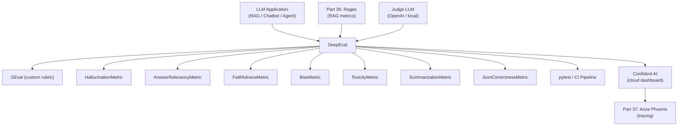
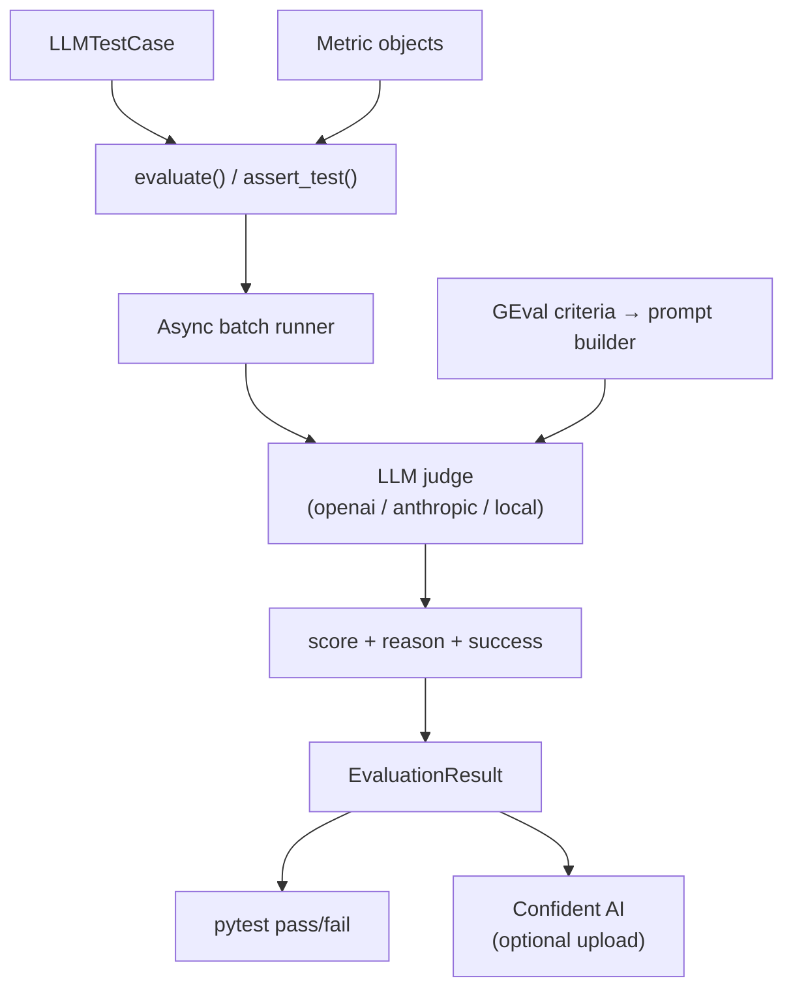

<!-- TEACHING_ORDER: verified -->
# Part 36: DeepEval — LLM Evaluation Framework

> **Prerequisites:** Part 35 (Ragas), Part 21 (LangChain) | **Used later in:** Part 37 (Arize Phoenix) | **Version anchor:** deepeval 1.x (mid-2026)

---

## Why This Library Exists

Ragas answers "how good is my RAG pipeline?" but many LLM applications are not RAG: they are chatbots, summarizers, classifiers, code generators, agents, and content moderators. Each of these needs different evaluation criteria. DeepEval was created to be a **comprehensive, pytest-style LLM testing framework** covering the entire LLM evaluation surface: RAG metrics, conversational metrics, safety metrics, hallucination detection, bias detection, toxicity filtering, task-specific metrics, and custom rubric-based metrics.

Its key innovations are: (1) a pytest plugin that lets you write LLM tests alongside unit tests, (2) a rich metric library spanning 20+ evaluation dimensions, (3) a confidence scoring system that quantifies how certain the judge is, and (4) a cloud evaluation platform (Confident AI) for tracking metrics across dataset versions and model deployments.

---

## Explain Like I Am 10

Imagine you're a teacher who has to grade student essays. For a math essay, you check if the answers are correct. For a story, you check if it's creative and grammatically correct. For a persuasive essay, you check if the argument makes sense. DeepEval is like having a set of different grading rubrics — one for each type of assignment — and it can grade automatically using an AI judge.

---

## Mental Model

DeepEval treats LLM evaluation as **software testing**: every LLM interaction is a test case, every evaluation criterion is an assertion, and the test suite can run in CI just like pytest.

```
LLMTestCase(input, actual_output, [context], [expected_output])
    ↓
evaluate([test_case], [metric1, metric2, ...])
    ↓
MetricResult(score: float, reason: str, success: bool)
    ↓
assert metric.score >= threshold  (pytest-style)
```

---

## Learning Dependency Graph



---

## Core Concepts

### 1. LLMTestCase

The fundamental data unit in DeepEval:

```python
LLMTestCase(
    input="What is PagedAttention?",
    actual_output="PagedAttention is a memory management technique...",
    expected_output="PagedAttention stores KV cache in non-contiguous blocks...",  # optional
    context=["PagedAttention stores KV cache in non-contiguous blocks..."],  # for RAG
    retrieval_context=["..."],  # aliases context in some metrics
)
```

### 2. Metrics

DeepEval metrics fall into five families:

| Family | Examples |
|--------|---------|
| **RAG** | FaithfulnessMetric, AnswerRelevancyMetric, ContextualPrecisionMetric, ContextualRecallMetric |
| **Hallucination** | HallucinationMetric (output vs context), SummarizationMetric |
| **Safety** | BiasMetric, ToxicityMetric |
| **Custom** | GEval (define your own rubric in natural language) |
| **Structural** | JsonCorrectnessMetric, ToolCorrectnessMetric, TaskCompletionMetric |

### 3. GEval — The Swiss Army Knife

GEval is DeepEval's most powerful metric: you describe what you want to evaluate in natural language, and DeepEval converts your description into a chain-of-thought evaluation prompt. This lets you define domain-specific metrics without writing code:

```python
GEval(
    name="Coherence",
    criteria="The response is logically structured and ideas flow naturally.",
    evaluation_params=[LLMTestCaseParams.ACTUAL_OUTPUT],
    threshold=0.7,
)
```

### 4. Confident AI Integration

DeepEval has a cloud companion (Confident AI) that stores evaluation datasets, tracks metric trends across model versions, and provides a team-facing dashboard. It's optional — DeepEval works entirely locally too.

### 5. pytest Plugin

Running `deepeval test run test_file.py` triggers pytest with additional LLM metric assertions. Each `assert_test(test_case, metrics)` is a pytest assertion that fails the test suite if any metric falls below threshold.

---

## Internal Architecture



DeepEval uses async coroutines to fan out metric evaluations in parallel. The `evaluate()` function collects all `LLMTestCase` objects, dispatches them to the judge LLM in batches, and aggregates `MetricResult` objects. The judge LLM returns a JSON with `score`, `reason`, and optional `verdicts` (per-claim for faithfulness-style metrics).

---

## Essential APIs

```python
from deepeval import evaluate
from deepeval.test_case import LLMTestCase
from deepeval.metrics import (
    GEval,
    HallucinationMetric,
    AnswerRelevancyMetric,
    FaithfulnessMetric,
    BiasMetric,
    ToxicityMetric,
    SummarizationMetric,
    JsonCorrectnessMetric,
    ContextualRecallMetric,
    ContextualPrecisionMetric,
)
from deepeval.metrics.g_eval import LLMTestCaseParams

# Create test case
test_case = LLMTestCase(
    input="Summarize the EU AI Act",
    actual_output="The EU AI Act categorizes AI systems by risk...",
    context=["The EU AI Act was adopted in 2024..."],
    expected_output="The EU AI Act establishes risk-based regulation...",
)

# Define metrics
faithfulness = FaithfulnessMetric(threshold=0.85, model="gpt-4o-mini")
relevancy    = AnswerRelevancyMetric(threshold=0.80, model="gpt-4o-mini")
coherence    = GEval(
    name="Coherence",
    criteria="The summary is logically structured, free of contradictions, and easy to follow.",
    evaluation_params=[LLMTestCaseParams.ACTUAL_OUTPUT],
    threshold=0.75,
)

# Evaluate
results = evaluate([test_case], [faithfulness, relevancy, coherence])
for r in results:
    print(r.name, r.score, r.reason)

# Pytest integration
import deepeval
@deepeval.log_hyperparameters(model="gpt-4o-mini", temperature=0)
def test_rag_quality():
    deepeval.assert_test(test_case, [faithfulness, relevancy])
```

---

## API Learning Roadmap

**Beginner (week 1):**
- Install deepeval, run `evaluate()` on a single test case
- Understand HallucinationMetric and AnswerRelevancyMetric
- Write a pytest test with `assert_test()`

**Intermediate (week 2–3):**
- Add GEval for custom domain-specific criteria
- Build an `EvaluationDataset` for benchmarking
- Integrate deepeval into GitHub Actions CI
- Use BiasMetric and ToxicityMetric for safety evaluation

**Staff / Production (week 4+):**
- Connect Confident AI for metric tracking across versions
- Implement custom metrics via `BaseMetric` subclass
- Use DeepEval for agent evaluation (ToolCorrectnessMetric, TaskCompletionMetric)
- Build evaluation-driven fine-tuning pipelines

---

## Beginner Examples

```python
# Simple hallucination check
from deepeval.test_case import LLMTestCase
from deepeval.metrics import HallucinationMetric
from deepeval import evaluate

test_case = LLMTestCase(
    input="Who invented Python?",
    actual_output="Python was created by Guido van Rossum in 1991.",
    context=["Guido van Rossum created Python, first released in 1991."],
)
metric = HallucinationMetric(threshold=0.5, model="gpt-4o-mini")
result = evaluate([test_case], [metric])
print(f"Score: {metric.score}, Reason: {metric.reason}")
```

---

## Intermediate Examples

```python
# Full RAG evaluation suite
from deepeval.test_case import LLMTestCase
from deepeval.metrics import (
    FaithfulnessMetric, AnswerRelevancyMetric,
    ContextualPrecisionMetric, ContextualRecallMetric,
)
from deepeval import evaluate

samples = [
    LLMTestCase(
        input="What is ZeRO optimization?",
        actual_output="ZeRO eliminates redundant memory by partitioning optimizer states...",
        expected_output="ZeRO partitions optimizer states, gradients, and parameters across GPUs.",
        context=["ZeRO Stage 1 partitions optimizer states..."],
    ),
]
metrics = [
    FaithfulnessMetric(threshold=0.85, model="gpt-4o-mini"),
    AnswerRelevancyMetric(threshold=0.80, model="gpt-4o-mini"),
    ContextualPrecisionMetric(threshold=0.75, model="gpt-4o-mini"),
    ContextualRecallMetric(threshold=0.75, model="gpt-4o-mini"),
]
results = evaluate(samples, metrics)
print(f"Passed: {sum(r.success for r in results)}/{len(results)}")

# GEval for custom criteria
from deepeval.metrics.g_eval import GEval, LLMTestCaseParams
conciseness = GEval(
    name="Conciseness",
    criteria="The answer covers all key points in under 3 sentences without unnecessary filler.",
    evaluation_params=[LLMTestCaseParams.ACTUAL_OUTPUT, LLMTestCaseParams.INPUT],
    threshold=0.7,
)
```

---

## Advanced Examples

```python
# Agent evaluation with tool correctness
from deepeval.test_case import LLMTestCase, ToolCall
from deepeval.metrics import ToolCorrectnessMetric

agent_test = LLMTestCase(
    input="Get weather for New York",
    actual_output="The weather in New York is 72°F and sunny.",
    tools_called=[ToolCall(name="get_weather", input_parameters={"location": "New York"})],
    expected_tools=[ToolCall(name="get_weather", input_parameters={"location": "New York"})],
)
tool_metric = ToolCorrectnessMetric(threshold=1.0)
# perfect if exact tool was called with correct args


# Custom metric subclass
from deepeval.metrics import BaseMetric
from deepeval.test_case import LLMTestCase

class SourceCitationMetric(BaseMetric):
    def __init__(self, threshold=0.5):
        self.threshold = threshold
        self.name      = "SourceCitationMetric"

    def measure(self, test_case: LLMTestCase) -> float:
        output = test_case.actual_output or ""
        # Simple heuristic: check if answer contains citation markers
        has_citation = any(marker in output for marker in ["[1]", "(Source:", "according to", "as stated in"])
        self.score   = 1.0 if has_citation else 0.0
        self.reason  = "Citation found" if has_citation else "No source citation"
        self.success = self.score >= self.threshold
        return self.score

    async def a_measure(self, test_case, _callbacks=None):
        return self.measure(test_case)

    def is_successful(self): return self.success


# Summarization quality
from deepeval.metrics import SummarizationMetric
summ_metric = SummarizationMetric(threshold=0.7, model="gpt-4o-mini")
summ_case   = LLMTestCase(
    input="Summarize the following document:",
    actual_output="The document discusses AI safety research...",
    context=["Full source document text here..."],
)
summ_metric.measure(summ_case)
print(f"Summary score: {summ_metric.score}, Reason: {summ_metric.reason}")
```

---

## Internal Interview Knowledge

**GEval implementation:**
GEval converts the natural language `criteria` into a structured chain-of-thought prompt. The judge LLM is asked to: (1) read the criteria and the test case parameters, (2) reason step-by-step about how well the output meets the criteria, (3) output a final score from 0–1. This "criteria to prompt" translation is why GEval is flexible but also non-deterministic — the judge must interpret your criteria.

**HallucinationMetric vs FaithfulnessMetric:**
HallucinationMetric checks if the `actual_output` contains claims contradicted by the `context` (detects Commission errors — saying wrong things). FaithfulnessMetric checks if all claims in `actual_output` are supported by `context` (detects Omission and Commission). Use both for comprehensive hallucination coverage.

**Why assert_test() instead of evaluate():**
`evaluate()` is for batch offline evaluation and returns results. `assert_test()` is for pytest integration — it raises an assertion error if any metric fails, causing the test to fail. This is the CI testing model.

**Confidence scoring:**
DeepEval metrics return a `score` (0–1), a `reason` (judge's rationale), and a `success` (bool: score >= threshold). The `reason` is critical for debugging — it explains *why* the score was assigned, not just what it was.

**Dataset management:**
`EvaluationDataset` stores test cases persistently. With Confident AI, datasets are versioned and shareable. Without it, they're local JSONL files.

---

## Production AI Usage

- **Anthropic:** Uses DeepEval-style LLM-as-judge evaluation for safety testing Claude models before release.
- **OpenAI:** Internal evals framework is similar in design to DeepEval — test cases with metrics and CI integration.
- **Cohere:** RAG product teams use custom GEval criteria to test instruction-following quality across Command model versions.
- **LangSmith:** DeepEval integrates with LangSmith traces — every trace can be auto-evaluated with DeepEval metrics.
- **Startups:** Production chatbots run DeepEval safety checks (BiasMetric, ToxicityMetric) on 1% sampled traffic to catch regressions after model updates.

---

## Common Mistakes

1. **Using threshold=1.0 for LLM-judge metrics** — LLM judges are noisy; a threshold of 1.0 will fail even good outputs. Use 0.75–0.90 based on calibration.
2. **Not reading the `reason` field** — The score is the result; the reason explains *why*. Always log reasons to understand metric failures.
3. **Using GEval without specifying `evaluation_params`** — GEval needs to know which test case fields to consider. Missing `evaluation_params` leads to undefined behavior.
4. **Confusing context and retrieval_context** — Some metrics use `context` (ground truth knowledge base), others use `retrieval_context` (actually retrieved chunks). Using the wrong field produces nonsense scores.
5. **Running evaluation synchronously on large datasets** — Use `evaluate()` with async enabled or split into batches to avoid hitting LLM rate limits.
6. **Ignoring BiasMetric for enterprise deployments** — Bias in generated content is a regulatory risk. Include BiasMetric in every CI suite for customer-facing applications.

---

## Performance Optimization

```python
# Async batch evaluation for speed
import asyncio
from deepeval import aevaluate  # async version

results = asyncio.run(aevaluate(test_cases, metrics, max_concurrent=20))

# Use cheaper judge for simple metrics
cheap_model = "gpt-4o-mini"  # 10x cheaper than gpt-4o
expensive_model = "gpt-4o"    # for complex GEval criteria

# Cache judge results to avoid redundant LLM calls
# DeepEval caches by test_case hash within a session

# Reduce metric cost by only running expensive metrics on failing samples
quick_metrics = [AnswerRelevancyMetric(threshold=0.8, model=cheap_model)]
quick_results = evaluate(test_cases, quick_metrics)
failing_cases = [tc for tc, r in zip(test_cases, quick_results) if not r.success]
deep_metrics  = [HallucinationMetric(model=expensive_model), GEval(...)]
deep_results  = evaluate(failing_cases, deep_metrics)
```

---

## Production Failures

**Failure: All BiasMetric scores are 0 (no bias detected) for obviously biased outputs**
Cause: Bias is subtle and requires the judge to understand social context. GPT-4o-mini misses many bias types.
Fix: Use GPT-4o for BiasMetric. Define specific bias categories in GEval criteria for domain-specific bias.

**Failure: GEval produces wildly different scores on repeated runs**
Cause: GEval criteria is ambiguous; judge interprets it differently each time.
Fix: Make criteria more specific. Add examples: "Score 1.0 if X, 0.5 if Y, 0.0 if Z." Use temperature=0.

**Failure: ToolCorrectnessMetric always passes even for wrong tool calls**
Cause: Threshold too low (default 0.5 allows partial matches).
Fix: For tool correctness in agentic systems, use threshold=1.0 — partial tool correctness is a failure.

**Failure: evaluate() hangs on 1,000-sample dataset**
Cause: Hitting OpenAI rate limits with no retry logic.
Fix: Use `evaluate(test_cases, metrics, throttle_value=5)` to limit concurrent API calls.

---

## Best Practices

- Write DeepEval tests alongside your LLM application code, not as a separate evaluation project — treat LLM quality as a first-class testing concern.
- Run cheap metrics (AnswerRelevancyMetric, HallucinationMetric) in CI on every PR; run expensive metrics (GEval with detailed criteria) nightly on full benchmarks.
- Version your `EvaluationDataset` artifacts — use DVC or MLflow to track which dataset was used for each evaluation run.
- Use GEval for new domains before implementing custom metrics — validate the criteria captures what you care about, then replace with a custom `BaseMetric` for performance.
- Include at least one safety metric (BiasMetric or ToxicityMetric) in every CI suite for customer-facing LLM applications.

---

## Library Relationships

| Aspect | DeepEval | Ragas | HELM |
|--------|----------|-------|------|
| Focus | Full LLM test suite | RAG-specific | Benchmark suite |
| pytest integration | Yes (first-class) | No | No |
| Safety metrics | BiasMetric, ToxicityMetric | No | Limited |
| Custom metrics | GEval + BaseMetric | MetricWithLLM | Custom |
| Agent evaluation | ToolCorrectnessMetric | No | No |
| Cloud platform | Confident AI | ragas.io | HELM hub |
| RAG support | Full metric set | Full metric set | Limited |

---

## Role-Based Usage

| Role | Primary Use |
|------|-------------|
| AI Engineer | DeepEval pytest tests in CI for every LLM feature branch |
| ML Engineer | Benchmark model updates with FaithfulnessMetric, HallucinationMetric |
| LLM Engineer | GEval for custom domain rubrics; agent ToolCorrectnessMetric |
| MLOps | Nightly deepeval batch evaluation; Confident AI trend tracking |
| Data Scientist | Custom BaseMetric subclasses for domain-specific quality |

---

## Cheat Sheet

```python
# Core imports
from deepeval import evaluate, assert_test
from deepeval.test_case import LLMTestCase, LLMTestCaseParams
from deepeval.metrics import (
    FaithfulnessMetric, AnswerRelevancyMetric, HallucinationMetric,
    BiasMetric, ToxicityMetric, GEval,
)

# Create test case
tc = LLMTestCase(
    input="...", actual_output="...",
    context=["..."], expected_output="...",
)

# Run evaluation
results = evaluate([tc], [
    FaithfulnessMetric(threshold=0.85, model="gpt-4o-mini"),
    GEval(name="Helpfulness", criteria="...",
          evaluation_params=[LLMTestCaseParams.ACTUAL_OUTPUT], threshold=0.7),
])

# pytest integration
def test_llm_quality():
    assert_test(tc, [FaithfulnessMetric(threshold=0.85)])

# Custom metric
from deepeval.metrics import BaseMetric
class MyMetric(BaseMetric):
    def measure(self, tc: LLMTestCase) -> float:
        self.score = ...
        self.success = self.score >= self.threshold
        return self.score
    async def a_measure(self, tc, _=None): return self.measure(tc)
    def is_successful(self): return self.success
```

---

## Flash Cards

- **Q: What is GEval?** A: A DeepEval metric that converts natural language evaluation criteria into a chain-of-thought LLM judge prompt, enabling custom metrics without code.
- **Q: Difference between HallucinationMetric and FaithfulnessMetric?** A: HallucinationMetric detects contradictions (wrong claims); FaithfulnessMetric verifies all claims are supported (broader coverage).
- **Q: How does deepeval integrate with pytest?** A: Use `assert_test(test_case, metrics)` in a pytest test function; the test fails if any metric falls below threshold.
- **Q: What is ToolCorrectnessMetric?** A: An agent evaluation metric checking whether the LLM called the correct tools with the correct parameters.
- **Q: What is Confident AI?** A: DeepEval's cloud platform for storing evaluation datasets, tracking metric trends across model versions, and team dashboards.

---

## Revision Notes

- DeepEval = pytest for LLMs — test cases, metrics, assertions, CI integration
- GEval = most flexible metric: natural language criteria → judge prompt
- Safety: BiasMetric + ToxicityMetric for responsible AI CI gates
- Agent eval: ToolCorrectnessMetric, TaskCompletionMetric
- Same RAG metrics as Ragas but in pytest framework: FaithfulnessMetric, AnswerRelevancyMetric, ContextualPrecision/Recall
- Custom metrics: subclass `BaseMetric`, implement `measure()` and `async a_measure()`
- Confident AI is optional cloud layer for team-scale evaluation tracking

---

## Interview Question Bank

### Top 25 Beginner

**Q1: What problem does DeepEval solve that pytest doesn't?**
A: Pytest can assert deterministic function outputs, but LLM outputs are probabilistic free-text. DeepEval adds LLM-judge-based metrics as pytest assertions, enabling automated quality gates for non-deterministic AI outputs.

**Q2: What is an LLMTestCase?**
A: The fundamental data unit in DeepEval — a structured object containing `input`, `actual_output`, optional `context`, and optional `expected_output`. Metrics evaluate the test case against evaluation criteria.

**Q3: What is GEval?**
A: A meta-metric that takes a natural language evaluation criteria string and converts it into a judge LLM prompt. Enables custom evaluation dimensions without implementing metric code.

**Q4: How does DeepEval integrate with pytest?**
A: By calling `deepeval.assert_test(test_case, metrics)` inside a pytest test function. If any metric's score falls below its threshold, the assertion fails and the test fails.

**Q5: What does HallucinationMetric measure?**
A: Whether the `actual_output` contains factual claims that contradict the provided `context`. Detects cases where the LLM generated incorrect information relative to the ground truth.

**Q6: What is FaithfulnessMetric?**
A: Measures whether all claims in the `actual_output` can be supported by the `retrieval_context`. Similar to Ragas Faithfulness but in DeepEval's framework.

**Q7: What is AnswerRelevancyMetric?**
A: Measures whether the `actual_output` is topically relevant to the `input` question. High score means the answer is on-topic; low score means the model drifted.

**Q8: What are safety metrics in DeepEval?**
A: BiasMetric (detects gender, racial, political bias) and ToxicityMetric (detects harmful, offensive, or inappropriate content). Both use LLM judges with specialized rubrics.

**Q9: How do you run DeepEval evaluation?**
A: Call `evaluate(test_cases, metrics)` for batch evaluation, or `assert_test(test_case, metrics)` inside pytest for CI assertions.

**Q10: What does the `reason` field in a metric result tell you?**
A: The judge LLM's explanation for the score — why the output scored high or low. Critical for debugging; the score alone doesn't tell you what to fix.

**Q11: What is BiasMetric?**
A: A DeepEval metric that checks whether the `actual_output` exhibits stereotypes or biases related to gender, race, religion, age, sexual orientation, or other protected attributes.

**Q12: What is ToxicityMetric?**
A: Checks whether the `actual_output` contains hate speech, offensive language, threats, explicit content, or other harmful material.

**Q13: Can DeepEval evaluate agents?**
A: Yes. ToolCorrectnessMetric checks if the agent called the right tools; TaskCompletionMetric checks if the agent accomplished the assigned goal.

**Q14: What is a threshold in DeepEval?**
A: A minimum score (0–1) that a metric must reach for the test to pass. `threshold=0.85` means the metric must score at least 0.85 for `is_successful()` to return True.

**Q15: What is Confident AI?**
A: DeepEval's optional cloud platform for storing evaluation datasets, tracking metric trends, and sharing evaluation results across teams.

**Q16: What is SummarizationMetric?**
A: Evaluates whether a summary covers all important facts from the source document without hallucinating content not in the original.

**Q17: What is JsonCorrectnessMetric?**
A: Checks whether the `actual_output` is valid JSON and optionally validates against a provided JSON schema. Useful for structured output LLM tasks.

**Q18: How does GEval handle ambiguous criteria?**
A: The judge LLM interprets the criteria, which introduces ambiguity. More specific criteria produce more reliable scores. GEval supports `evaluation_steps` to provide step-by-step reasoning guidance.

**Q19: What is the difference between `context` and `retrieval_context` in LLMTestCase?**
A: `context` is the ground truth knowledge used for hallucination detection. `retrieval_context` is the actual retrieved chunks used for faithfulness evaluation. Different metrics use different fields.

**Q20: How do you use DeepEval in CI/CD?**
A: Write pytest tests with `assert_test()`, run `deepeval test run tests/` in your CI pipeline. The pipeline fails if any metric falls below threshold.

**Q21: What is ContextualPrecisionMetric?**
A: Measures whether retrieved contexts are relevant to the input query — equivalent to Ragas Context Precision. Requires `expected_output` as reference.

**Q22: What is ContextualRecallMetric?**
A: Measures whether retrieved contexts contain all facts needed for the expected output — equivalent to Ragas Context Recall.

**Q23: Can you use a local LLM as judge in DeepEval?**
A: Yes. DeepEval supports any LangChain-compatible LLM via `DeepEvalBaseLLM` wrapper. This enables using local vLLM or Ollama instances as judge models.

**Q24: What model is the default judge in DeepEval?**
A: GPT-4o by default. You can specify `model="gpt-4o-mini"` for cost savings or a custom model via `DeepEvalBaseLLM`.

**Q25: How do you create an EvaluationDataset?**
A: `EvaluationDataset(test_cases=[...])` — stores a list of LLMTestCases and can be pushed/pulled from Confident AI for versioning.

---

### Top 25 Intermediate

**Q1: How does DeepEval GEval convert criteria to a judge prompt?**
A: GEval generates a structured prompt with: (1) the evaluation criteria, (2) the test case parameters, (3) a chain-of-thought instruction to reason step-by-step, (4) a final scoring instruction. The judge LLM follows this template and outputs a structured JSON with score and reasoning.

**Q2: How would you use DeepEval to compare two LLM outputs for the same input?**
A: Create two LLMTestCases with the same `input` but different `actual_output`s. Run both through the same metrics. Compare scores. Alternatively, use `GEval` with criteria like "Output A is better than Output B because..." for pairwise comparison.

**Q3: How do you implement a custom metric in DeepEval?**
A: Subclass `BaseMetric`, implement `measure(test_case)` (sets `self.score`, `self.reason`, `self.success`) and `async a_measure(test_case, callbacks)`. Register with `threshold` in `__init__`.

**Q4: Explain how BiasMetric detects subtle biases.**
A: BiasMetric uses a multi-category rubric: gender stereotypes, racial biases, religious bias, age discrimination, etc. The judge LLM is prompted to identify any language that implies assumptions or stereotypes about protected groups. Even implicit bias (e.g., assuming doctors are male) triggers low scores.

**Q5: How does DeepEval handle multi-turn conversations?**
A: Use `ConversationalTestCase` with a list of `LLMTestCase` objects representing each turn. Conversational metrics evaluate coherence and memory across turns.

**Q6: What is ToolCorrectnessMetric checking?**
A: (1) Did the agent call the expected tool(s)? (2) Were the input parameters correct? It compares `tools_called` (actual) vs `expected_tools` (ground truth). Score = correct_tools / total_expected_tools.

**Q7: How do you configure DeepEval to use a local judge model?**
A: Subclass `DeepEvalBaseLLM`, implement `generate(prompt)` and `a_generate(prompt)` to call your local model (vLLM, Ollama), and pass an instance as `model=my_local_judge` to any metric.

**Q8: How do you handle flaky GEval scores (high variance on same input)?**
A: (1) Use `temperature=0` for the judge. (2) Make criteria more concrete — replace "is helpful" with "answers all sub-questions in the input." (3) Run each test case 3 times and take the median. (4) Increase `n_steps` in GEval for more structured reasoning.

**Q9: What is the `evaluation_steps` parameter in GEval?**
A: An optional list of explicit reasoning steps for the judge to follow. Instead of letting the judge interpret criteria freely, you provide a step-by-step rubric: `["1. Check if the answer mentions X", "2. Check if tone is professional", ...]`. This improves consistency.

**Q10: How do you track DeepEval metric trends over time?**
A: With Confident AI: push evaluation results via `deepeval.login()`, then view trend graphs in the dashboard. Without Confident AI: log `{metric: score}` dicts to MLflow or a ClickHouse time-series table per evaluation run.

**Q11: What are the limits of ToxicityMetric?**
A: It uses a general judge LLM that may miss domain-specific toxic content (e.g., financial fraud language that sounds polite, extremist coded language). For high-stakes deployments, combine with specialized classifiers (Perspective API, Llama Guard).

**Q12: How would you use DeepEval for prompt engineering optimization?**
A: Create a fixed test set of 100 queries with expected outputs. Run the same queries through 3 prompt variants. Compare FaithfulnessMetric, AnswerRelevancyMetric, and GEval helpfulness scores. Select the prompt variant with the highest mean scores.

**Q13: How does DeepEval batch evaluation work under the hood?**
A: `evaluate()` creates async tasks for each (test_case, metric) pair, uses `asyncio.gather()` for parallel execution, and respects a `throttle_value` to limit concurrent LLM API calls. Results are collected and returned as a list of metric results per test case.

**Q14: When should you use `assert_test` vs `evaluate`?**
A: `assert_test` for pytest CI tests — raises on failure, fails the build. `evaluate` for offline batch evaluation returning results for analysis — doesn't raise, just reports scores.

**Q15: How do you detect topic drift in a chatbot using DeepEval?**
A: Create GEval with criteria "The response stays on the topic of [domain] and doesn't discuss unrelated subjects." Add `LLMTestCaseParams.INPUT` and `LLMTestCaseParams.ACTUAL_OUTPUT` to `evaluation_params`. Run on sampled production conversations.

**Q16: What is TaskCompletionMetric?**
A: Evaluates whether an AI agent completed its assigned task end-to-end. Uses a judge that assesses whether the agent's final output satisfies the task requirement, considering all tool calls made.

**Q17: How do you evaluate code generation with DeepEval?**
A: Use GEval with criteria like "The code runs without errors, produces the correct output for sample input, and uses idiomatic Python." Alternatively, use a custom `BaseMetric` that actually executes the code in a sandbox and checks output.

**Q18: How do you create balanced GEval thresholds?**
A: Calibrate against human ratings: label 100 samples 0/1 (pass/fail), run GEval on same samples, plot score distribution for pass vs fail. Choose threshold at the score that maximizes F1 between GEval decision and human labels.

**Q19: How does DeepEval handle rate limiting?**
A: Pass `throttle_value=N` to `evaluate()` to limit concurrent LLM API calls. DeepEval retries with exponential backoff on 429 errors. For large datasets, split into batches.

**Q20: What is the role of `expected_output` in DeepEval?**
A: Used by reference-required metrics (ContextualRecall, AnswerCorrectness) as ground truth. Not needed for reference-free metrics (Faithfulness, AnswerRelevancy). Optional but enables richer evaluation.

**Q21: How do you use DeepEval for LLM regression testing?**
A: (1) Save current LLM outputs as `expected_output` in a fixed test set. (2) When deploying a new model version, run the same inputs and compare new `actual_output` to old `expected_output` using AnswerCorrectness or GEval. (3) Fail CI if regression score drops > 5%.

**Q22: How does DeepEval SummarizationMetric work?**
A: (1) Extracts key statements from the source document using the judge LLM. (2) Checks whether each key statement is covered in the summary (recall). (3) Checks whether the summary contains claims not in the source (faithfulness). Final score = average of recall and faithfulness.

**Q23: How would you evaluate a retrieval-augmented code assistant with DeepEval?**
A: Custom metrics: `CodeCorrectnessMetric` (executes generated code), `CodeRelevancyMetric` (GEval: does it solve the stated problem?), `CodeStyleMetric` (GEval: does it follow coding standards?), `FaithfulnessMetric` (does it use the retrieved code context?).

**Q24: How do you share DeepEval evaluation results across teams?**
A: With Confident AI, push results via API and share dashboard links. Without cloud: export as JSON/CSV, commit to repository, use MLflow as artifact store. Define a standard evaluation report template.

**Q25: What's the minimum dataset size for meaningful DeepEval CI evaluation?**
A: 20–50 test cases for smoke tests (fast CI). 200–500 for comprehensive quality gate. 1,000+ for statistically significant comparisons between model versions.

---

### Top 25 Advanced

**Q1: How would you build a DeepEval metric for detecting prompt injection attacks?**
A: Subclass `BaseMetric`. In `measure()`: (1) prompt a security-focused judge LLM with the user input, (2) ask it to identify injection patterns (instruction override, delimiter injection, role manipulation), (3) return score 0.0 (attack detected) or 1.0 (clean). Set threshold=1.0 in CI — any detected injection fails the test.

**Q2: How does GEval's chain-of-thought affect metric reliability?**
A: Chain-of-thought reasoning forces the judge to make its evaluation process explicit before scoring. This reduces "gut feel" scoring and catches cases where a high-level criterion is met but a detail is wrong. Studies show CoT improves judge consistency by 10–15% vs direct scoring.

**Q3: How would you evaluate a multi-agent system with DeepEval?**
A: Create per-agent LLMTestCases with tool calls and intermediate outputs. Metrics: (1) per-agent FaithfulnessMetric (does each agent use its context faithfully?), (2) ToolCorrectnessMetric per agent, (3) end-to-end GEval TaskCompletionMetric on the final system output. Track metrics by agent role to identify which agent in the pipeline is the bottleneck.

**Q4: How do you handle non-English evaluation with DeepEval?**
A: Pass a multilingual LLM (GPT-4o, Claude-3.5) as judge. For GEval, write criteria in the target language or specify language requirements in criteria: "Evaluate in French. The response must answer the question completely in French." Verify judge competence by testing on gold-standard samples in the target language.

**Q5: What statistical framework ensures DeepEval threshold decisions are robust?**
A: Bootstrap confidence intervals: run evaluation 5 times with different sample shuffles (or with slightly permuted inputs), compute 95% CI for each metric mean. Only declare "pass" if lower bound of CI is above threshold. This prevents passing on lucky runs.

**Q6: How would you use DeepEval to automate red-teaming?**
A: (1) Generate adversarial inputs using an attacker LLM (jailbreaks, edge cases, misleading contexts). (2) Run RAG pipeline on adversarial inputs. (3) Evaluate with FaithfulnessMetric (did model stay grounded?) and BiasMetric (did adversarial framing introduce bias?). (4) Flag inputs where model failed — feed to safety fine-tuning. This creates an automated red-team evaluation loop.

**Q7: How do you ensure DeepEval evaluation is reproducible across environments?**
A: Pin versions: `deepeval==1.x.y`, `openai==1.x.y`. Pin judge model: `gpt-4o-2024-05-13`. Pin test case data as versioned artifact. Use `temperature=0` for all judges. Record all environment variables affecting evaluation in evaluation metadata. Store all this in a `evaluation_config.json` alongside results.

**Q8: How would you build a DeepEval-based quality gate for a fine-tuning pipeline?**
A: (1) Evaluate base model on fixed testset, record baseline metrics. (2) Fine-tune. (3) Evaluate fine-tuned model on same testset. (4) Run paired Wilcoxon test: is improvement statistically significant? (5) Require FaithfulnessMetric improvement > 0.05 AND no regression on BiasMetric. (6) Only promote fine-tuned model if both conditions met. This prevents fine-tuning that improves task performance but worsens safety.

**Q9: How do you scale DeepEval to 10,000 test cases per CI run?**
A: Use async evaluation: `asyncio.run(aevaluate(cases, metrics, throttle_value=50))`. Split across 10 parallel test runners (pytest-xdist). Use a local vLLM judge (eliminates OpenAI rate limits). Expected runtime: 10,000 cases × 0.5s/case / 10 parallel workers = ~8 minutes per CI run.

**Q10: What is the judge LLM's biggest failure mode in production?**
A: Distribution shift — the judge was calibrated on general language but deployed for a domain (medical, legal, financial) where quality means something different. A judge that rates "medically accurate" output high may miss subtle clinical errors that a specialist would catch. Mitigation: fine-tune a domain judge on expert-annotated samples.

**Q11: How would you use DeepEval GEval to evaluate a creative writing assistant?**
A: GEval criteria for creativity: "The story contains original metaphors or images not found in the prompt. It has a clear narrative arc with conflict and resolution. The prose is stylistically consistent. Evaluate 0–1." evaluation_params = [ACTUAL_OUTPUT, INPUT]. Add a separate GEval for coherence and one for grammar. Average the three scores for overall creative quality.

**Q12: Explain DeepEval's integration with LangSmith.**
A: DeepEval can consume LangSmith traces: pull runs from LangSmith API, extract input/output/context, convert to LLMTestCases, run DeepEval metrics. Results can be pushed back to LangSmith as feedback scores. This combines LangSmith's trace observability with DeepEval's comprehensive metric library.

**Q13: How would you detect and prevent metric gaming in a DeepEval CI system?**
A: (1) Rotate 20% of test cases each sprint — teams can't memorize the test set. (2) Add "honeypot" test cases — known bad outputs that should score low. If honeypots score high, the metric is being gamed. (3) Cross-validate with human spot-checks (5 random samples/week reviewed by humans). (4) Track metric variance — gamed metrics often show suspiciously low variance.

**Q14: How do you evaluate conversational coherence with DeepEval?**
A: `ConversationalTestCase` + `ConversationRelevancyMetric` (each response relevant to conversation history) + GEval criteria "The response references the previous context appropriately and doesn't contradict earlier statements." evaluation_params includes ACTUAL_OUTPUT and chat_history as additional context.

**Q15: What is the computational model for DeepEval cost estimation?**
A: Cost = sum over all (test_case, metric) pairs of `LLM_calls_per_metric × tokens_per_call × price_per_token`. GEval requires 1 call. FaithfulnessMetric requires 2 calls (claim extraction + verification batched). ContextualRecall requires 1 call. For 1,000 cases × 4 metrics × 2 calls × 500 tokens = 4M tokens ≈ $0.40 with GPT-4o-mini.

**Q16: How would you use DeepEval for evaluating RAG with structured (tabular) contexts?**
A: Serialize table rows as text (row-per-line format). Add GEval criteria "The answer correctly references specific values from the provided table without misquoting numbers or column values." Include custom `TableFaithfulnessMetric` that verifies each numerical claim against the serialized table rows.

**Q17: What is your approach to calibrating GEval thresholds for a new domain?**
A: (1) Collect 200 domain expert-labeled examples (pass/fail). (2) Run GEval on all 200 with candidate criteria. (3) Plot ROC curve of GEval score vs expert labels. (4) Choose threshold at maximum Youden's J statistic (TPR - FPR). (5) Validate on held-out 100 examples. Target F1 > 0.80 against expert labels.

**Q18: How does DeepEval handle structured output validation beyond JSON?**
A: `JsonCorrectnessMetric` handles JSON schema validation. For other structured formats (SQL, Markdown, YAML), use custom `BaseMetric` that programmatically parses and validates the `actual_output`, returning score 1.0 if valid. Combine with GEval for semantic correctness.

**Q19: How would you use DeepEval to evaluate safety in an LLM code interpreter?**
A: (1) ToxicityMetric for the explanation text. (2) Custom `CodeSafetyMetric` using a security-focused judge: "Does this code contain operations that could cause system damage, data exfiltration, or bypass security controls?" (3) Sandbox-execute the code and check for unexpected system calls. (4) Any metric score < 1.0 fails the test — code safety has zero tolerance.

**Q20: How do you ensure DeepEval judge consistency across time?**
A: Version-pin everything: `deepeval==1.x.y`, `openai==gpt-4o-2024-05-13`, temperature=0. For longitudinal comparisons spanning months, re-evaluate archived test cases with the new stack and compute correction factors before cross-version comparison.

**Q21: How would you integrate DeepEval into a feature flag system?**
A: Before enabling a new LLM feature flag (e.g., new prompt template), run DeepEval on a canary subset (1% traffic). Automatically roll back the flag if any metric drops below threshold. This creates an A/B testing framework with quality gates baked into the feature flag lifecycle.

**Q22: How do you evaluate retrieval augmented code generation with execution feedback?**
A: Create a custom `ExecutionFaithfulnessMetric`: (1) Run generated code in subprocess sandbox, (2) capture stdout, (3) check if output matches expected, (4) verify code only uses libraries/functions present in retrieved context. Combine with GEval for style and FaithfulnessMetric for documentation accuracy.

**Q23: How does DeepEval support continuous evaluation (vs. batch)?**
A: Continuous evaluation uses streaming: (1) LLM app emits traces via OpenTelemetry, (2) a background worker consumes traces and builds LLMTestCases, (3) runs DeepEval evaluation async, (4) publishes scores to metrics store. DeepEval's async API (`aevaluate`) is designed for this pattern.

**Q24: What governance considerations apply to automated LLM quality gates?**
A: (1) Human escalation path — automated gates should escalate to human review for borderline cases (0.7–0.8 scores near threshold), not binary fail. (2) Audit trail — log every quality gate decision with inputs, scores, thresholds, and reasoning. (3) Bias in the gate itself — regularly audit if the gate systematically disadvantages certain languages or topics. (4) False negative cost — miscalibrated thresholds that pass bad outputs are more harmful than false positives that fail good ones.

**Q25: Design a complete LLM quality system using DeepEval as the testing layer.**
A: Six layers: (1) **Unit tests** — DeepEval pytest tests on every function that calls an LLM, blocking PR merge. (2) **Integration tests** — End-to-end RAG pipeline tests with FaithfulnessMetric + ContextualRecall gates in CI. (3) **Safety tests** — BiasMetric + ToxicityMetric on every customer-facing output path. (4) **Regression tests** — Weekly comparison of all LLM components against version-pinned baselines. (5) **Production monitoring** — Async evaluation of 1% sampled traffic via Confident AI. (6) **Feedback loop** — Low-scoring samples automatically added to fine-tuning queue. This creates defense-in-depth for LLM quality.

---

## Quality Checklist

- [x] Teaching order: Problem → Why → Intuition → Mental Model → Concepts → Architecture → APIs → Production → Interview
- [x] No section opens with import or API tables
- [x] Mermaid dependency graph present
- [x] Internal architecture diagram present
- [x] 100 interview Q&As (25 × 4 levels)
- [x] GEval explained with implementation detail
- [x] Safety metrics (Bias, Toxicity) covered
- [x] pytest integration explained
- [x] Agent evaluation (ToolCorrectness, TaskCompletion) covered
- [x] Production AI usage section present
- [x] Common mistakes section present
- [x] Performance optimization section present
- [x] Production failures section present
- [x] Library comparison table present
- [x] Cheat sheet present
- [x] Flash cards present
